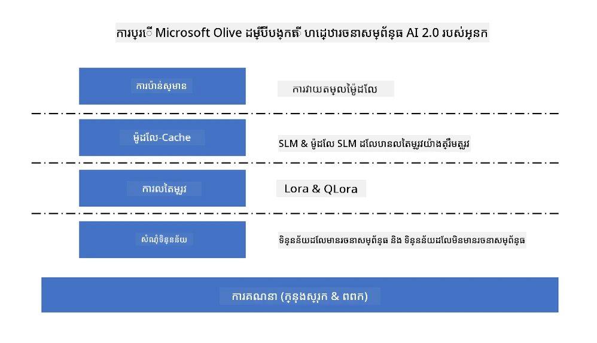
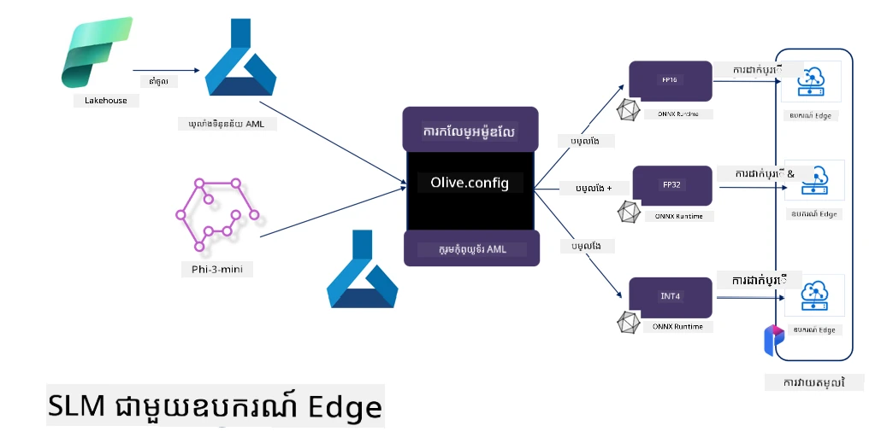

# **កំណត់តម្លៃ Phi-3 ជាមួយ Microsoft Olive**

[Olive](https://github.com/microsoft/OLive?WT.mc_id=aiml-138114-kinfeylo) គឺជាឧបករណ៍បង្កើតម៉ូដែលដែលយល់ដឹងអំពីដ hardware ដែលងាយស្រួលប្រើ ដែលយកបច្ចេកវិទ្យាដឹកនាំឧស្សាហកម្មមកសម្រួលគ្នាក្នុងការបញ្ចុះទំហំម៉ូដែល ការបង្កើតម៉ូដែល និងការប្រមល់កូដ។

វាត្រូវបានរចនាឡើងដើម្បីងាយស្រួលក្នុងដំណើរការបង្កើតម៉ូដែលរៀនម៉ាស៊ីន ដើម្បីធានាថាវាធ្វើប្រើប្រាស់សមត្ថភាពបច្ចេកវិទ្យាដ hardware ជាក់លាក់ឲ្យមានប្រសិទ្ធភាពបំផុត។

នៅតាមករណីដែលអ្នកកំពុងបង្កើតកម្មវិធីលើពពក រឺឧបករណ៍ទីប្រឹក្សា Olive អនុញ្ញាតឲ្យអ្នកបង្កើតម៉ូដែលដោយងាយស្រួល និងមានប្រសិទ្ធភាព។

## លក្ខណៈសំខាន់:
- Olive សម្រួល និងស្វ័យប្រវត្តិកម្មបច្ចេកទេសបង្កើតម៉ូដែលសម្រាប់គោលដៅ hardware ជាក់លាក់។
- គ្មានបច្ចេកទេសបង្កើតម៉ូដែលតែមួយដែលសមស្របសម្រាប់គ្រប់ស tìnhហេ៍ ដូច្នេះ Olive អនុញ្ញាតឲ្យពង្រីកដោយអនុញ្ញាតឲ្យអ្នកជំនាញឧស្សាហកម្មដាក់បញ្ចូលនូវការច្នៃប្រឌិតបង្កើតម៉ូដែលរបស់ពួកគេ។

## កាត់បន្ថយកិច្ចខិតខំរបស់វិស្វករ:
- អ្នកអភិវឌ្ឍ់ជាញឹកញាប់ត្រូវរៀននិងប្រើសេវាកម្មឧបករណ៍ពហុមាន​របស់អ្នកផ្គត់ផ្គង់ hardware ដើម្បីបញ្ចៀស និងបង្កើតម៉ូដែលដែលបានបណ្តុះសិក្សា ដើម្បីរៀបចំចេញផ្សាយ។
- Olive ងាយស្រួលនូវបទពិសោធន៍នេះ ដោយស្វ័យប្រវត្តិកម្មបច្ចេកទេសបង្កើតម៉ូដែលសម្រាប់ hardware ជាក់លាក់។

## ដំណោះស្រាយបង្កើតម៉ូដែលសុទ្ធ E2E រួមបញ្ចូល:

ដោយបញ្ចូល និងកំណត់បច្ចេកទេសរួមគ្នា Olive ផ្តល់នូវដំណោះស្រាយសមរភូមិសម្រាប់បង្កើតម៉ូដែលពីដំបូងដល់ចប់។
វាអនុវត្តការពិចារណាចំពោះកំណត់ទុកដូចជាការត្រឹមត្រូវ និងពេលវេលាចាំបាច់ ខណៈពេលបង្កើតម៉ូដែល។

## ការប្រើ Microsoft Olive ដើម្បីកំណត់តម្លៃឡើងវិញ

Microsoft Olive គឺជាឧបករណ៍បង្កើតម៉ូដែលប្រភពបើកដែលងាយស្រួលប្រើខ្លាំង ដែលអាចគ្របដណ្តប់ទាំងការកំណត់តម្លៃឡើងវិញ និងយោងក្នុងដែនវិស័យបញ្ញាសិប្បនិម្មិតបង្កើត។ វាត្រូវការការកំណត់តែមួយសាមញ្ញ បញ្ចូលជាមួយនឹងការប្រើម៉ូដែលភាសាតូចប្រភពបើក និងបរិយាកាសរត់ពាក់ព័ន្ធ (AzureML / GPU, CPU ទីតាំងក្នុងក្រោយ, DirectML) អ្នកអាចបញ្ចប់ការកំណត់តម្លៃឡើងវិញ ឬយោងម៉ូដែលតាមរយៈការបង្កើតម៉ូដែលស្វ័យប្រវត្តិ ហើយរកម៉ូដែលល្អបំផុតដើម្បីចេញផ្សាយទៅពពក ឬលើឧបករណ៍ទីប្រឹក្សា។ អនុញ្ញាតឲ្យសហគ្រាសបង្កើតម៉ូដែលឧស្សាហកម្មតាមផ្នែកឯងលើកន្លែង និងលើពពក។



## កំណត់តម្លៃ Phi-3 ជាមួយ Microsoft Olive 



## ឧទាហរណ៍កូដ និងឧទាហរណ៍ Phi-3 Olive
ក្នុងឧទាហរណ៍នេះ អ្នកនឹងប្រើ Olive ដើម្បី:

- កំណត់តម្លៃ LoRA adapter ដើម្បីចាត់ថ្នាក់ប្រយោគទៅជា Sad, Joy, Fear, Surprise។
- បញ្ចូលទំងន់ adapter ទៅក្នុងម៉ូដែលមូលដ្ឋាន។
- បង្កើតជាមួយផ្សំម៉ូដែល និងបំលែងម៉ូដែលទៅ int4។

[Sample Code](../../code/03.Finetuning/olive-ort-example/README.md)

### ការតំឡើង Microsoft Olive

ការតំឡើង Microsoft Olive ងាយស្រួលខ្លាំង និងអាចតំឡើងសម្រាប់ CPU, GPU, DirectML, និង Azure ML

```bash
pip install olive-ai
```

ប្រសិនបើអ្នកចង់បើកម៉ូដែល ONNX ជាមួយ CPU អ្នកអាចប្រើ

```bash
pip install olive-ai[cpu]
```

ប្រសិនបើអ្នកចង់បើកម៉ូដែល ONNX ជាមួយ GPU អ្នកអាចប្រើ

```python
pip install olive-ai[gpu]
```

ប្រសិនបើអ្នកចង់ប្រើ Azure ML អ្នកអាចប្រើ

```python
pip install git+https://github.com/microsoft/Olive#ពងមាន់=olive-ai[azureml]
```

**ប្រយ័ត្ន**
តំរូវការ OS : Ubuntu 20.04 / 22.04 

### **Config.json របស់ Microsoft Olive**

បន្ទាប់ពីតំឡើង អ្នកអាចកំណត់ការកំណត់ជាក់លាក់សម្រាប់ម៉ូដែលខុសៗគ្នាតាមរយៈឯកសារ Config រួមមានទិន្នន័យ ការគណនា ការបណ្តុះបណ្តាល ការចេញផ្សាយ និងការបង្កើតម៉ូដែល។

**1. ទិន្នន័យ**

លើ Microsoft Olive ការបណ្តុះបណ្តាលលើទិន្នន័យបណ្ដាល និងទិន្នន័យពពកអាចគាំទ្រ ហើយអាចកំណត់ក្នុងការកំណត់។

*ការកំណត់ទិន្នន័យបណ្ដាល*

អ្នកអាចកំណត់សំណុំនៃទិន្នន័យដែលត្រូវបណ្តុះសម្រាប់កំណត់តម្លៃឡើងវិញបានងាយៗជាទំរង់ json និងបង្រួមជាមួយទំរង់ទិន្នន័យ។ នេះត្រូវចៀសវាងយោងតាមតម្រុយរបស់ម៉ូដែល (ដូចជាបង្រួមទៅទំរង់ដែល Microsoft Phi-3-mini ត្រូវការ។ ប្រសិនបើអ្នកមានម៉ូដែលផ្សេងទៀត សូមយោងទៅទំរង់កំណត់តម្លៃឡើងវិញដែលត្រូវការរបស់ម៉ូដែលផ្សេងទៀតសម្រាប់ដំណើរការ)

```json

    "data_configs": [
        {
            "name": "dataset_default_train",
            "type": "HuggingfaceContainer",
            "load_dataset_config": {
                "params": {
                    "data_name": "json", 
                    "data_files":"dataset/dataset-classification.json",
                    "split": "train"
                }
            },
            "pre_process_data_config": {
                "params": {
                    "dataset_type": "corpus",
                    "text_cols": [
                            "phrase",
                            "tone"
                    ],
                    "text_template": "### Text: {phrase}\n### The tone is:\n{tone}",
                    "corpus_strategy": "join",
                    "source_max_len": 2048,
                    "pad_to_max_len": false,
                    "use_attention_mask": false
                }
            }
        }
    ],
```

**ការកំណត់ប្រភពទិន្នន័យពពក**

ដោយភ្ជាប់ឃ្លាំងទិន្នន័យរបស់ Azure AI Studio/Azure Machine Learning Service ដើម្បីភ្ជាប់ទិន្នន័យក្នុងពពក អ្នកអាចជ្រើសរើសយកប្រភពទិន្នន័យផ្សេងៗទៅ Azure AI Studio/Azure Machine Learning Service តាមរយៈ Microsoft Fabric និង Azure Data ដើម្បីគាំទ្រការកំណត់តម្លៃឡើងវិញទិន្នន័យ។

```json

    "data_configs": [
        {
            "name": "dataset_default_train",
            "type": "HuggingfaceContainer",
            "load_dataset_config": {
                "params": {
                    "data_name": "json", 
                    "data_files": {
                        "type": "azureml_datastore",
                        "config": {
                            "azureml_client": {
                                "subscription_id": "Your Azure Subscrition ID",
                                "resource_group": "Your Azure Resource Group",
                                "workspace_name": "Your Azure ML Workspaces name"
                            },
                            "datastore_name": "workspaceblobstore",
                            "relative_path": "Your train_data.json Azure ML Location"
                        }
                    },
                    "split": "train"
                }
            },
            "pre_process_data_config": {
                "params": {
                    "dataset_type": "corpus",
                    "text_cols": [
                            "Question",
                            "Best Answer"
                    ],
                    "text_template": "<|user|>\n{Question}<|end|>\n<|assistant|>\n{Best Answer}\n<|end|>",
                    "corpus_strategy": "join",
                    "source_max_len": 2048,
                    "pad_to_max_len": false,
                    "use_attention_mask": false
                }
            }
        }
    ],
    
```

**2. ការកំណត់គណនា**

ប្រសិនបើអ្នកចង់ប្រើក្នុងតំបន់ អ្នកអាចប្រើធនធានទិន្នន័យក្នុងតំបន់ដោយផ្ទាល់។ ប្រសិនបើអ្នកចង់ប្រើធនធានរបស់ Azure AI Studio / Azure Machine Learning Service អ្នកត្រូវកំណត់ប៉ារ៉ាម៉ែត្រ Azure ដែលពាក់ព័ន្ធ ឈ្មោះកំលាំងគណនា ជាដើម។

```json

    "systems": {
        "aml": {
            "type": "AzureML",
            "config": {
                "accelerators": ["gpu"],
                "hf_token": true,
                "aml_compute": "Your Azure AI Studio / Azure Machine Learning Service Compute Name",
                "aml_docker_config": {
                    "base_image": "Your Azure AI Studio / Azure Machine Learning Service docker",
                    "conda_file_path": "conda.yaml"
                }
            }
        },
        "azure_arc": {
            "type": "AzureML",
            "config": {
                "accelerators": ["gpu"],
                "aml_compute": "Your Azure AI Studio / Azure Machine Learning Service Compute Name",
                "aml_docker_config": {
                    "base_image": "Your Azure AI Studio / Azure Machine Learning Service docker",
                    "conda_file_path": "conda.yaml"
                }
            }
        }
    },
```

***ប្រយ័ត្ន***

ដោយសារតែវារត់តាម container លើ Azure AI Studio/Azure Machine Learning Service ស្ថានភាពបរិយាកាសត្រូវបានកំណត់។ វាត្រូវបានកំណត់ក្នុង environment conda.yaml


```yaml

name: project_environment
channels:
  - defaults
dependencies:
  - python=3.8.13
  - pip=22.3.1
  - pip:
      - einops
      - accelerate
      - azure-keyvault-secrets
      - azure-identity
      - bitsandbytes
      - datasets
      - huggingface_hub
      - peft
      - scipy
      - sentencepiece
      - torch>=2.2.0
      - transformers
      - git+https://github.com/microsoft/Olive@jiapli/mlflow_loading_fix#egg=olive-ai[gpu]
      - --extra-index-url https://aiinfra.pkgs.visualstudio.com/PublicPackages/_packaging/ORT-Nightly/pypi/simple/ 
      - ort-nightly-gpu==1.18.0.dev20240307004
      - --extra-index-url https://aiinfra.pkgs.visualstudio.com/PublicPackages/_packaging/onnxruntime-genai/pypi/simple/
      - onnxruntime-genai-cuda

    

```

**3. ជ្រើសយក SLM របស់អ្នក**

អ្នកអាចប្រើម៉ូដែលដោយផ្ទាល់ពី Hugging face ឬអ្នកអាចបញ្ចូលរួមជាមួយម៉ូដែលណែនាំរបស់ Azure AI Studio / Azure Machine Learning ដើម្បីជ្រើសយកម៉ូដែលប្រើបាន។ ក្នុងឧទាហរណ៍កូដខាងក្រោម យើងនឹងប្រើ Microsoft Phi-3-mini ជាឧទាហរណ៍។

ប្រសិនបើអ្នកមានម៉ូដែលនៅក្នុងតំបន់ អ្នកអាចប្រើវិធីនេះ

```json

    "input_model":{
        "type": "PyTorchModel",
        "config": {
            "hf_config": {
                "model_name": "model-cache/microsoft/phi-3-mini",
                "task": "text-generation",
                "model_loading_args": {
                    "trust_remote_code": true
                }
            }
        }
    },
```

ប្រសិនបើអ្នកចង់ប្រើម៉ូដែលពី Azure AI Studio / Azure Machine Learning Service អ្នកអាចប្រើវិធីនេះ


```json

    "input_model":{
        "type": "PyTorchModel",
        "config": {
            "model_path": {
                "type": "azureml_registry_model",
                "config": {
                    "name": "microsoft/Phi-3-mini-4k-instruct",
                    "registry_name": "azureml-msr",
                    "version": "11"
                }
            },
             "model_file_format": "PyTorch.MLflow",
             "hf_config": {
                "model_name": "microsoft/Phi-3-mini-4k-instruct",
                "task": "text-generation",
                "from_pretrained_args": {
                    "trust_remote_code": true
                }
            }
        }
    },
```

**ប្រយ័ត្ន៖**
យើងត្រូវរួមបញ្ចូលជាមួយ Azure AI Studio / Azure Machine Learning Service ដូច្នេះពេលកំណត់ម៉ូដែល សូមយោងទៅលើលេខកំណែ និងឈ្មោះពាក់ព័ន្ធ។

ម៉ូដែលទាំងអស់លើ Azure ត្រូវបានកំណត់ទៅ PyTorch.MLflow

អ្នកត្រូវមានគណនី Hugging face និងភ្ជាប់ key ទៅ Key នៃ Azure AI Studio / Azure Machine Learning

**4. អាល់ហ្គរីធម៌**

Microsoft Olive សរសេរអាល់ហ្គរីធម៌កំណត់តម្លៃ LoRA និង QLora យ៉ាងល្អ។ អ្វីដែលអ្នកត្រូវតែកំណត់គឺប៉ារ៉ាម៉ែត្រពាក់ព័ន្ធខ្លះៗ។ ខ្ញុំយក QLora ជាឧទាហរណ៍។

```json
        "lora": {
            "type": "LoRA",
            "config": {
                "target_modules": [
                    "o_proj",
                    "qkv_proj"
                ],
                "double_quant": true,
                "lora_r": 64,
                "lora_alpha": 64,
                "lora_dropout": 0.1,
                "train_data_config": "dataset_default_train",
                "eval_dataset_size": 0.3,
                "training_args": {
                    "seed": 0,
                    "data_seed": 42,
                    "per_device_train_batch_size": 1,
                    "per_device_eval_batch_size": 1,
                    "gradient_accumulation_steps": 4,
                    "gradient_checkpointing": false,
                    "learning_rate": 0.0001,
                    "num_train_epochs": 3,
                    "max_steps": 10,
                    "logging_steps": 10,
                    "evaluation_strategy": "steps",
                    "eval_steps": 187,
                    "group_by_length": true,
                    "adam_beta2": 0.999,
                    "max_grad_norm": 0.3
                }
            }
        },
```

ប្រសិនបើអ្នកចង់បំលែងបរិមាណ ម៉ាស៊ីនដើម Microsoft Olive សាខាចម្បងបានគាំទ្រវិធី onnxruntime-genai។ អ្នកអាចកំណត់តាមតម្រូវការរបស់អ្នក៖

1. បញ្ចូលទំងន់ adapter ទៅម៉ូដែលមូលដ្ឋាន
2. បំលែងម៉ូដែលទៅម៉ូឌែល onnx ជាមួយភាពត្រឹមត្រូវត្រូវការ​តាម ModelBuilder

ដូចជាបំលែងទៅ quantized INT4


```json

        "merge_adapter_weights": {
            "type": "MergeAdapterWeights"
        },
        "builder": {
            "type": "ModelBuilder",
            "config": {
                "precision": "int4"
            }
        }
```

**ប្រយ័ត្ន** 
- ប្រសិនបើអ្នកប្រើ QLoRA ការបំលែងបរិមាណរបស់ ONNXRuntime-genai មិនគាំទ្រនាសព្វថ្ងៃទេ។

- ត្រូវបញ្ជាក់ថាអ្នកអាចកំណត់ជំហានខាងលើតាមតម្រូវការ។ មិនចាំបាច់ត្រូវកំណត់គ្រប់ដំណាក់កាលខាងលើទេ។ អាស្រ័យលើតម្រូវការរបស់អ្នក អ្នកអាចប្រើវិធីសាស្រ្តអាល់ហ្គរីធម៌ ដោយគ្មានការកំណត់តម្លៃឡើងវិញ។ នៅចុងក្រោយ អ្នកត្រូវកំណត់ម៉ូទ័រភាពពាក់ព័ន្ធ។

```json

    "engine": {
        "log_severity_level": 0,
        "host": "aml",
        "target": "aml",
        "search_strategy": false,
        "execution_providers": ["CUDAExecutionProvider"],
        "cache_dir": "../model-cache/models/phi3-finetuned/cache",
        "output_dir" : "../model-cache/models/phi3-finetuned"
    }
```

**5. បញ្ចប់កំណត់តម្លៃឡើងវិញ**

នៅបន្ទាត់បញ្ជា ប្រតិបត្តិការនៅថត olive-config.json

```bash
olive run --config olive-config.json  
```

---

<!-- CO-OP TRANSLATOR DISCLAIMER START -->
**ការបោះពុម្ពផ្សាយ**៖  
ឯកសារនេះត្រូវបានបកប្រែដោយប្រើសេវាកម្មបកប្រែ AI [Co-op Translator](https://github.com/Azure/co-op-translator)។ ទោះបីយើងខិតខំ​សំរាប់ភាពត្រឹមត្រូវ ក៏សូមយល់អំពីថា ការបកប្រែដោយស្វ័យប្រវត្តិអាចមានកំហុស ឬភាពមិនត្រឹមត្រូវខ្លះ។ ឯកសារដើមនៅក្នុងភាសាម្ចាស់របស់វាគួរត្រូវបានពិចារណាជា ប្រភពផ្លូវការចម្បង។ សម្រាប់ព័ត៌មានសំខាន់ៗ សូមផ្តល់អាទិភាពការបកប្រែដោយអ្នកជំនាញមនុស្ស។ យើងមិនទទួលខុសត្រូវចំពោះការយល់ខុស ឬការបកស្រាយខុសណាមួយដែលកើតឡើងពីការប្រើប្រាស់ការបកប្រែនេះឡើយ។
<!-- CO-OP TRANSLATOR DISCLAIMER END -->