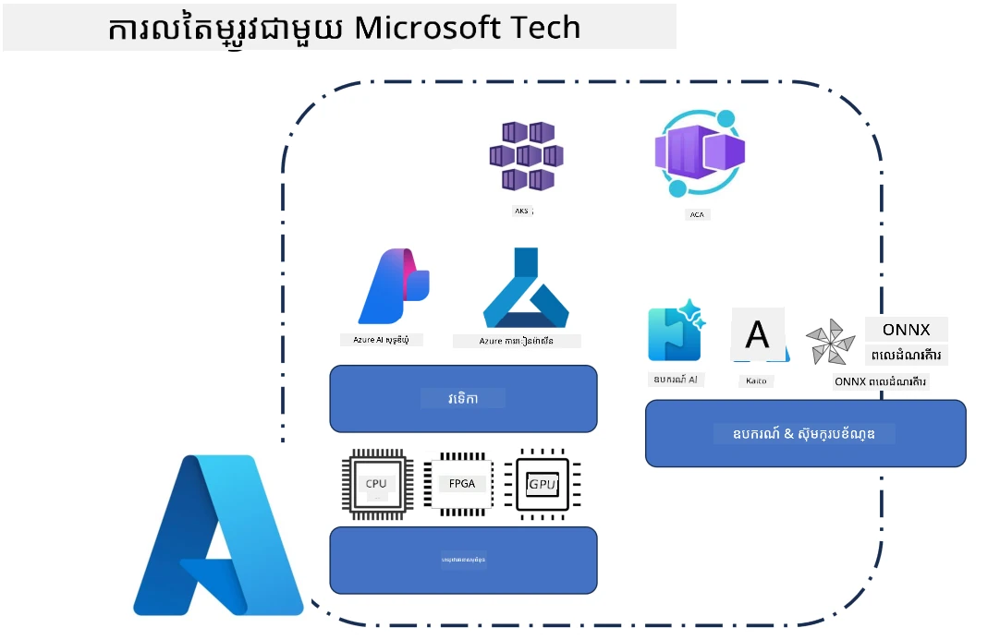
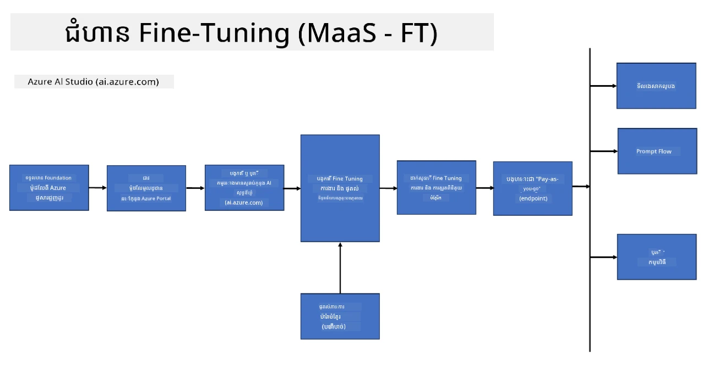
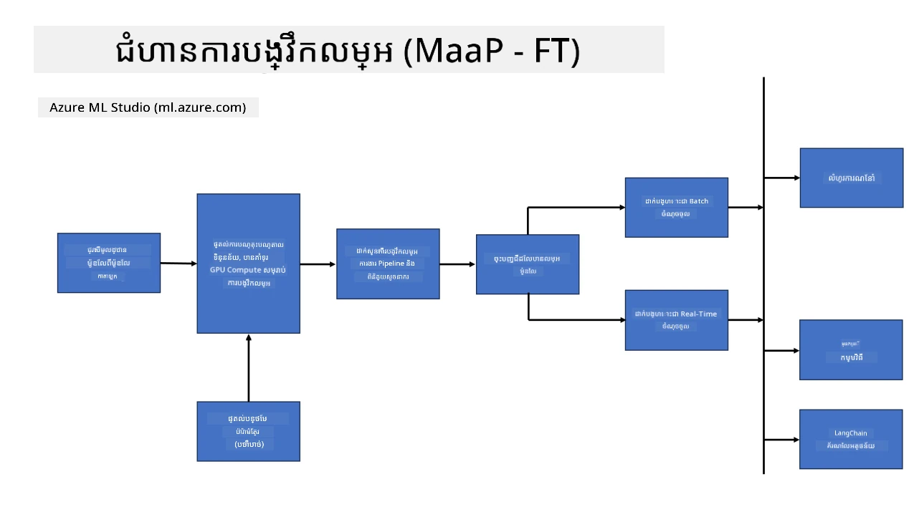
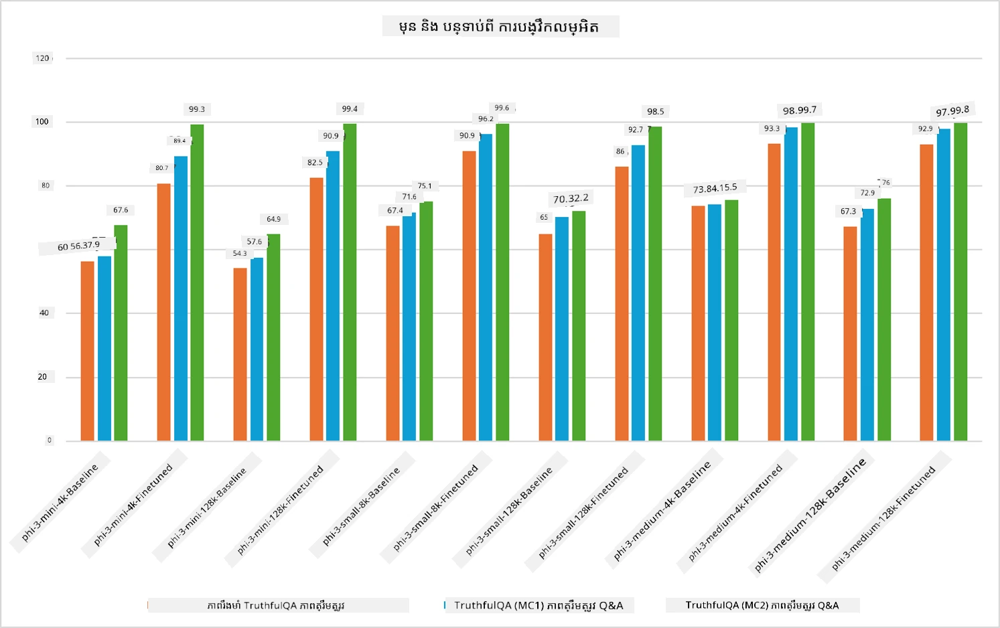

## សេណារីយ៉ូមធ្វើការ Fine Tuning

ផ្នែកនេះផ្តល់ជារូបរាងជាទូទៅអំពីសេណារីយ៉ូ fine-tuning ក្នុងបរិយាកាស Microsoft Foundry និង Azure រួមមានម៉ូដែលបញ្ចេញការងារ ស្រទាប់ហេដ្ឋារចនាសម្ព័ន្ធ និងបច្ចេកវិទ្យាតម្រៀបប្រើប្រាស់សម្រាប់បង្កើតកំណែធ្វើឱ្យប្រសើរ។

**វេទិកា**  
នេះរួមមានសេវាកម្មគ្រប់គ្រងដូចជា Microsoft Foundry (ដែលត្រូវបានគេហៅមុនថា Microsoft Foundry) និង Azure Machine Learning ដែលផ្តល់ជូននូវការគ្រប់គ្រងម៉ូដែល ការរៀបចំផែនការ ការតាមដានការប្រធានមួយ និងដំណើរការបញ្ចេញការងារ។

**ហេដ្ឋារចនាសម្ព័ន្ធ**  
ការធ្វើ Fine-tuning ត្រូវការប្រព័ន្ធកុំព្យូទ័រសមត្ថភាពខ្ពស់ដែលអាចពង្រីកបាន។ ក្នុងបរិយាកាស Azure នេះភាគច្រើនរួមមានម៉ាស៊ីនត្រីវិទ្យាសម្រាប់ GPU និងធនធាន CPU សម្រាប់កិច្ចការស្រាលៗ រួមជាមួយស្តុកដែលអាចពង្រីកបានសម្រាប់ទិន្នន័យ និងចំណុចត្រួតពិនិត្យ។

**ឧបករណ៍ និងស៊ុមវ័រខ្លាំង**  
ដំណើរការ Fine-tuning ភាគច្រើនពឹងពីស៊ុមវ័រខ្លាំង និងបណ្ណាល័យតម្រៀបប្រើប្រាស់ដូចជា Hugging Face Transformers, DeepSpeed, និង PEFT (Parameter-Efficient Fine-Tuning)។

ដំណើរការ fine-tuning ជាមួយបច្ចេកវិទ្យា Microsoft បន្តគ្រប់សេវាវេទិកា បណ្តាញហេដ្ឋារចនាសម្ព័ន្ធកុំព្យូទ័រ និងស៊ុមវ័រខ្លាំងបណ្ដុះបណ្ដាល។ ដោយយល់ពីរបៀបដែលធាតុទាំងនេះសហការគ្នា អ្នកអភិវឌ្ឍអាចអនុវត្តម៉ូដែលមូលដ្ឋានក្នុងភារកិច្ច និងសេណារីយ៉ូផលិតកម្មជាពិសេសបានយ៉ាងមានប្រសិទ្ធភាព។

## ម៉ូដែលជាសេវាកម្ម

ធ្វើ Fine-tune ម៉ូដែលដោយប្រើ fine-tuning ដែលផ្តល់ជារបៀបបង្ហោះ ហើយមិនចាំបាច់បង្កើត និងគ្រប់គ្រងកុំព្យូទ័រ។

ការធ្វើ Fine-tuning ដោយគ្មានម៉ាស៊ីន (serverless fine-tuning) គឺមានស្រាប់សម្រាប់មុខមាត់ម៉ូដែល Phi-3, Phi-3.5 និង Phi-4 ដែលអនុញ្ញាតឱ្យអ្នកអភិវឌ្ឍឆាប់រហ័ស និងសាមញ្ញក្នុងការប្ដូរតាមតម្រូវការសម្រាប់បរិយាកាសពពក និងអង្គចុងដែលមិនចាំបាច់រៀបចំកុំព្យូទ័រ។

## ម៉ូដែលជាវេទិកា

អ្នកប្រើគ្រប់គ្រងកុំព្យូទ័ររបស់ខ្លួន ដើម្បីធ្វើ Fine-tune លើម៉ូដែលរបស់ពួកគេ។

[Fine Tuning Sample](https://github.com/Azure/azureml-examples/blob/main/sdk/python/foundation-models/system/finetune/chat-completion/chat-completion.ipynb)

## ការប្រៀបធៀបបច្ចេកទេស Fine-Tuning

|សេណារីយ៉ូ|LoRA|QLoRA|PEFT|DeepSpeed|ZeRO|DoRA|
|---|---|---|---|---|---|---|
|ការប្រែប្រញាប់ម៉ូដែល LLMs ដែលបានបណ្តុះបណ្តាលរួចទៅកាន់ភារកិច្ច ឬដែនបំផុតជាក់លាក់|មែន|មែន|មែន|មែន|មែន|មែន|
|ការធ្វើ Fine-tuning សម្រាប់ភារកិច្ច NLP ដូចជាការបែងចែកអត្ថបទ ការទទួលស្គាល់ឈ្មោះ អតិថិជន និងការបកប្រែម៉ាស៊ីន|មែន|មែន|មែន|មែន|មែន|មែន|
|ការធ្វើ Fine-tuning សម្រាប់ភារកិច្ច QA|មែន|មែន|មែន|មែន|មែន|មែន|
|ការធ្វើ Fine-tuning ដើម្បីបង្កើតចម្លើយប្រាប់មានរូបរាងដូចមនុស្សនៅក្នុង chatbot|មែន|មែន|មែន|មែន|មែន|មែន|
|ការធ្វើ Fine-tuning ដើម្បីបង្កើតតន្ត្រី សិល្បៈ ឬរោងប្រេងផ្សេងទៀតដែលមានការច្នៃប្រឌិត|មែន|មែន|មែន|មែន|មែន|មែន|
|ការកាត់បន្ថយថ្លៃដើមនិងថ្លៃដើមកុំព្យូទ័រ|មែន|មែន|មែន|មែន|មែន|មែន|
|ការកាត់បន្ថយការប្រើប្រាស់មេម៉ូរី|មែន|មែន|មែន|មែន|មែន|មែន|
|ប្រើប៉ារ៉ាម៉ែត្រ​តិចដើម្បីធ្វើ Fine-tuning ជារូបមន្តមានប្រសិទ្ធភាព|មែន|មែន|មែន|មិន|មិន|មែន|
|សំណុំបែបយន្តការផ្លាស់ព្រ័ត្រផ្ទាល់ប្រើមេម៉ូរីដែលមានប្រសិទ្ធភាព ដោយផ្តល់ការចូលដំណើរការមេម៉ូរី GPU សរុបនៃឧបករណ៍ GPU ទាំងអស់មាន|មិន|មិន|មិន|មែន|មែន|មិន|

> [!NOTE]
> LoRA, QLoRA, PEFT, និង DoRA គឺជាវិធីសាស្រ្ត Fine-tuning ដែលមានប្រសិទ្ធភាពលើប៉ារ៉ាម៉ែត្រ ខណៈដែល DeepSpeed និង ZeRO ផ្តោតទៅលើការបណ្តេញបណ្តាលបណ្តាញ និងការតម្រៀបប្រើប្រាស់មេម៉ូរី។

## ឧទាហរណ៍សមត្ថភាព Fine Tuning

---

<!-- CO-OP TRANSLATOR DISCLAIMER START -->
**ច្បាប់ប្រកាស**៖
ឯកសារនេះត្រូវបានបកប្រែដោយប្រើសេវាកម្មបកប្រែ AI [Co-op Translator](https://github.com/Azure/co-op-translator)។ បើទោះបីយើងខិតខំសម្រាប់ភាពត្រឹមត្រូវក៏ដោយ សូមជ្រាបថាការបកប្រែដោយស្វ័យប្រវត្តិអាចមានកំហុស ឬភាពមិនត្រឹមត្រូវ។ ឯកសារដើមនៅភាសាបុរាណគួរត្រូវបានពិចារណាថាជា ប្រភពផ្លូវការដែលត្រូវទុកចិត្ត។ សម្រាប់ព័ត៌មានសំខាន់ៗ ការបកប្រែដោយមនុស្សជំនាញគឺមានការណែនាំ។ យើងមិនទទួលខុសត្រូវចំពោះការយល់ច្រឡំ ឬការប្រែប្រួលនៃអត្ថន័យណាមួយដែលកើតមានពីការប្រើប្រាស់ការបកប្រែនេះ៕
<!-- CO-OP TRANSLATOR DISCLAIMER END -->