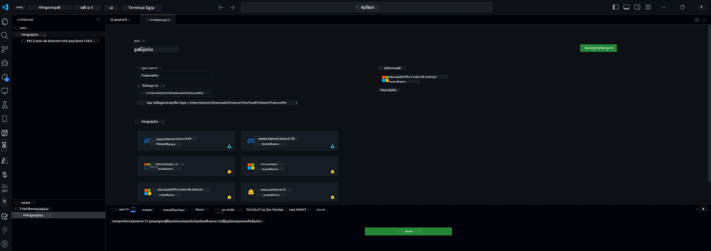

## សូមស្វាគមន៍មកកាន់ឧបករណ៍ AI សម្រាប់ VS Code

[ឧបករណ៍ AI សម្រាប់ VS Code](https://github.com/microsoft/vscode-ai-toolkit/tree/main) ប្រមួលម៉ូដែលផ្សេងៗពី Azure AI Studio Catalog និងកាតាឡុកផ្សេងទៀតដូចជា Hugging Face។ ឧបករណ៍នេះបង្កើតសម្រួលសម្រាប់ភារកិច្ចអភិវឌ្ឍសំខាន់សម្រាប់ការកសាងកម្មវិធី AI ជាមួយឧបករណ៍និងម៉ូដែល generative AI តាមរយៈ៖
- ចាប់ផ្តើមជាមួយការស្វែងរកម៉ូដែល និងទីលំហែបង្ហាញ។
- ការតម្រឹមម៉ូដែល និងការព្យាករណ៍ដោយប្រើធនធានគណនា​កន្លែង។
- ការតម្រឹមពីចម្ងាយ និងការព្យាករណ៍ដោយប្រើធនធាន Azure

[ដំឡើងឧបករណ៍ AI សម្រាប់ VSCode](https://marketplace.visualstudio.com/items?itemName=ms-windows-ai-studio.windows-ai-studio)




**[មើលជាពីរឹង]** ការផ្ដល់បណ្ដាញពីរប៊ិកសម្រាប់ Azure Container Apps ដើម្បីរត់ការតម្រឹមម៉ូដែល និងការព្យាករណ៍នៅក្នុងពពក។

ឥឡូវមកចូលទៅក្នុងការអភិវឌ្ឍកម្មវិធី AI របស់អ្នក៖

- [សូមស្វាគមន៍មកកាន់ឧបករណ៍ AI សម្រាប់ VS Code](#សូមស្វាគមន៍មកកាន់ឧបករណ៍-ai-សម្រាប់-vs-code)
- [ការអភិវឌ្ឍពីកន្លែងតំបន់](#ការអភិវឌ្ឍពីកន្លែងតំបន់)
  - [ការរៀបចំ](#ការរៀបចំ)
  - [បើក Conda](#បើក-conda)
  - [តម្រឹមម៉ូដែលមូលដ្ឋានតែប៉ុណ្ណោះ](#តម្រឹមម៉ូដែលមូលដ្ឋានតែប៉ុណ្ណោះ)
  - [តម្រឹមម៉ូដែល និងការព្យាករណ៍](#តម្រឹមម៉ូដែល-និងការព្យាករណ៍)
  - [ការតម្រឹមម៉ូដែល](#តម្រឹមម៉ូដែល)
  - [Microsoft Olive](#microsoft-olive)
  - [គំរូនិងធនធានសម្រាប់ការតម្រឹម](#គំរូនិងធនធានសម្រាប់ការតម្រឹម)
- [**\[មើលជាពីរឹង\]** ការអភិវឌ្ឍពីចម្ងាយ](#private-preview-remote-development)
  - [លក្ខខណ្ឌមុន](#លក្ខខណ្ឌមុន)
  - [ការរៀបចំព្រមផ្សំគម្រោងអភិវឌ្ឍពីចម្ងាយ](#ការរៀបចំព្រមផ្សំគម្រោងអភិវឌ្ឍពីចម្ងាយ)
  - [ផ្ដល់ធនធាន Azure](#ផ្ដល់ធនធាន-azure)
  - [\[ជម្រើស\] បន្ថែមកាសូទ័រតុកែន Huggingface ទៅ Azure Container App Secret](#optional-add-huggingface-token-to-the-azure-container-app-secret)
  - [រត់ការតម្រឹម](#រត់ការតម្រឹម)
  - [ផ្ដល់ចេញផ្លូវចូល Inference](#ផ្ដល់ចេញផ្លូវចូល-inference)
  - [ចាក់ផ្សាយផ្លូវចូល Inference](#ចាក់ផ្សាយផ្លូវចូល-inference)
  - [ការប្រើប្រាស់កម្រិតខ្ពស់](#ការប្រើប្រាស់កម្រិតខ្ពស់)

## ការអភិវឌ្ឍពីកន្លែងតំបន់
### ការរៀបចំ

1. ប្រាកដថាប្រព័ន្ធបើកបររបស់ NVIDIA ត្រូវបានដំឡើងនៅលើម៉ាស៊ីនផ្ទុក។  
2. រត់ `huggingface-cli login` ប្រសិនបើអ្នកប្រើ HF សម្រាប់ការប្រើប្រាស់ទិន្នន័យ  
3. ពន្យល់ពីការកំណត់ក្បាល `Olive` សម្រាប់អ្វីមួយដែលការកែប្រែការប្រើប្រាស់អង្គចងចាំ។

### បើក Conda
ដោយសារយើងកំពុងប្រើបរិបទ WSL ហើយវាត្រូវបានចែករំលែក អ្នកត្រូវបើកបរិបទ conda ដោយដៃ។ បន្ទាប់ពីជំហាននេះ អ្នកអាចរត់ការតម្រឹម ឬការព្យាករណ៍បាន។

```bash
conda activate [conda-env-name] 
```

### តម្រឹមម៉ូដែលមូលដ្ឋានតែប៉ុណ្ណោះ
ដើម្បីសាកល្បងម៉ូដែលមូលដ្ឋានគ្រាន់តែឥតតម្រឹម អ្នកអាចរត់ពាក្យបញ្ជាខាងក្រោមបន្ទាប់ពីបើក conda។

```bash
cd inference

# ចំណុចប្រទាក់កម្មវិធីរុករកគេហទំព័រអនុញ្ញាតឲ្យកែលម្អប៉ារ៉ាម៉ែត្រច្រើនដូចជា ប្រវែងតួអក្សរថ្មីអតិបរមា សីតុណ្ហភាព និងផ្សេងទៀត។
# អ្នកប្រើប្រាស់ត្រូវបើកតំណភ្ជាប់ដោយដៃ (ឧ. http://0.0.0.0:7860) នៅក្នុងកម្មវិធីរុករកបន្ទាប់ពី gradio ចាប់ផ្ដើមការតភ្ជាប់ហើយ។
python gradio_chat.py --baseonly
```

### តម្រឹមម៉ូដែល និងការព្យាករណ៍

ពេលដែល workspace ត្រូវបានបើកក្នុង dev container បើក terminal (ផ្លូវលំនាំដើមគឺ root នៃគម្រោង) ហើយរត់ពាក្យបញ្ជាចុះខាងក្រោមដើម្បីតម្រឹម LLM លើ dataset ដែលបានជ្រើស។

```bash
python finetuning/invoke_olive.py 
```

Checkpoint និងម៉ូដែលចុងក្រោយនឹងត្រូវរក្សាទុកនៅក្នុងថត `models`។

បន្ទាប់មករត់ការព្យាករណ៍ជាមួយម៉ូដែលដែលបានតម្រឹមតាមអារូបករណ៍ក្នុង `console`, `web browser` ឬ `prompt flow`។

```bash
cd inference

# មុខងារច្រកប្រើប្រាស់កុងសូល។
python console_chat.py

# មុខងារសកម្មទូទៅនៅលើកម្មវិធី浏览器អ៊ីនធឺណិត អនុញ្ញាតឱ្យកែសម្រួលប៉ារ៉ាម៉ែត្រខ្លះៗដូចជា ពែលើសចំនួនតូចបន្ថែមថ្មី អ្នកចំហៀង និងអង់ទេស្រមាននានា។
# អ្នកប្រើត្រូវបើកតំណភ្ជាប់ដោយដៃ (ឧទាហរណ៍ http://127.0.0.1:7860) នៅក្នុងកម្មវិធី浏览器 បន្ទាប់ពី gradio ចាប់ផ្តើមភ្ជាប់រួច។
python gradio_chat.py
```

ដើម្បីប្រើ `prompt flow` នៅក្នុង VS Code សូមយោងទៅកាន់ [Quick Start](https://microsoft.github.io/promptflow/how-to-guides/quick-start.html) នេះ។

### តម្រឹមម៉ូដែល

បន្ទាប់មកទាញយកម៉ូដែលដូចបានរាយនៅខាងក្រោម អាស្រ័យលើមាន GPU នៅលើឧបករណ៍របស់អ្នក។

ដើម្បីចាប់ផ្តើមវគ្គតម្រឹមក្នុងតំបន់ដោយប្រើ QLoRA សូមជ្រើសរើសម៉ូដែលដែលអ្នកចង់តម្រឹមពីកាតាឡុករបស់យើង។
| កPlatform(s) | មាន GPU ទេ | ឈ្មោះម៉ូដែល | ទំហំ (GB) |
|---------|---------|--------|--------|
| Windows | បាទ | Phi-3-mini-4k-**directml**-int4-awq-block-128-onnx | 2.13GB |
| Linux | បាទ | Phi-3-mini-4k-**cuda**-int4-onnx | 2.30GB |
| Windows<br>Linux | ទេ | Phi-3-mini-4k-**cpu**-int4-rtn-block-32-acc-level-4-onnx | 2.72GB |

**_ចំណាំ_** អ្នកមិនចាំបាច់មានគណនី Azure សម្រាប់ទាញយកម៉ូដែលទេ

ម៉ូដែល Phi3-mini (int4) មានទំហំប្រហែល 2GB-3GB។ អាស្រ័យលើល្បឿនបណ្តាញរបស់អ្នក វាអាចចំណាយពេលប៉ុន្មាននាទីក្នុងការទាញយក។

ចាប់ផ្តើមដោយជ្រើសឈ្មោះគម្រោងនិងទីតាំង។
បន្ទាប់មកជ្រើសម៉ូដែលពីកាតាឡុកម៉ូដែល។ អ្នកនឹងត្រូវបានបញ្ចេញសំណើទាញយកទំព័រគំរូគម្រោង។ អ្នកអាចចូល "Configure Project" ដើម្បីកែប្រែការកំណត់ផ្សេងៗ។

### Microsoft Olive

យើងប្រើប្រាស់ [Olive](https://microsoft.github.io/Olive/why-olive.html) ដើម្បីរត់ការតម្រឹម QLoRA លើម៉ូដែល PyTorch ពីកាតាឡុករបស់យើង។ ការកំណត់ទាំងអស់ត្រូវបានកំណត់ជាមូលដ្ឋានហើយដើម្បីបង្កើនប្រសិទ្ធភាពក្នុងការរត់ដំណើរការតម្រឹមនៅក្នុងតំបន់ដោយប្រើអង្គចងចាំបានប្រសើរ ប៉ុន្តែអាចកែប្រែបានសម្រាប់នីតិវិធីរបស់អ្នក។

### គំរូនិងធនធានសម្រាប់ការតម្រឹម

- [មគ្គុទេសក៍ចាប់ផ្តើមការតម្រឹម](https://learn.microsoft.com/windows/ai/toolkit/toolkit-fine-tune)
- [ការតម្រឹមជាមួយសំណុំទិន្នន័យ HuggingFace](https://github.com/microsoft/vscode-ai-toolkit/blob/main/archive/walkthrough-hf-dataset.md)
- [ការតម្រឹមជាមួយសំណុំទិន្នន័យសាមញ្ញ](https://github.com/microsoft/vscode-ai-toolkit/blob/main/archive/walkthrough-simple-dataset.md)

## **[មើលជាពីរឹង]** ការអភិវឌ្ឍពីចម្ងាយ

### លក្ខខណ្ឌមុន

1. ដើម្បីរត់ការតម្រឹមម៉ូដែលក្នុងបរិបទ Azure Container App ឆ្ងាយ សូមប្រាកដថាថវិកាទូរស័ព្ទរបស់អ្នកមានសមត្ថភាព GPU គិតគ្រប់គ្រាន់។ សុំពិនិត្យ [សំបុត្រគាំទ្រ](https://azure.microsoft.com/support/create-ticket/) ដើម្បីស្នើសុំសមត្ថភាពដែលចាំបាច់សម្រាប់កម្មវិធីរបស់អ្នក។ [ព័ត៌មានបន្ថែមអំពីសមត្ថភាព GPU](https://learn.microsoft.com/azure/container-apps/workload-profiles-overview)  
2. ប្រសិនបើអ្នកប្រើ dataset ផ្ទាល់ខ្លួននៅលើ HuggingFace សូមប្រាកដថាអ្នកមាន [គណនី HuggingFace](https://huggingface.co/?WT.mc_id=aiml-137032-kinfeylo) ហើយ [បង្កើត token ចូលប្រើ](https://huggingface.co/docs/hub/security-tokens?WT.mc_id=aiml-137032-kinfeylo)
3. បើកប៊្លុក Remote Fine-tuning និង Inference នៅក្នុង AI Toolkit សម្រាប់ VS Code
   1. បើកការកំណត់ VS Code ដោយជ្រើស *File -> Preferences -> Settings*។
   2. ទៅកាន់ *Extensions* ហើយជ្រើស *AI Toolkit*។
   3. ជ្រើសជម្រើស *"Enable Remote Fine-tuning And Inference"*។
   4. បើកឡើងវិញ VS Code ដើម្បីអនុវត្ត។

- [ការតម្រឹមពីចម្ងាយ](https://github.com/microsoft/vscode-ai-toolkit/blob/main/archive/remote-finetuning.md)

### ការរៀបចំព្រមផ្សំគម្រោងអភិវឌ្ឍពីចម្ងាយ
1. បញ្ចូលពាក្យបញ្ជា `AI Toolkit: Focus on Resource View` ក្នុង command palette។
2. ទៅកាន់ *Model Fine-tuning* ដើម្បីចូលកាតាឡុកម៉ូដែល។ បញ្ជាក់ឈ្មោះគម្រោង ហើយជ្រើសទីតាំងលើម៉ាស៊ីនរបស់អ្នក។ បន្ទាប់ចុចប៊ូតុង *"Configure Project"*។
3. ការកំណត់គម្រោង
    1. មិនត្រូវបើកជម្រើស *"Fine-tune locally"*។
    2. ការកំណត់ Olive នឹងបង្ហាញជាមួយតំឡើងលំនាំដើម ត្រូវកែប្រែ និងបំពេញការកំណត់ទាំងនោះតាមតម្រូវការ។
    3. បន្តទៅផ្នែក *Generate Project*។ ជំហាននេះប្រើប្រាស់ WSL ហើយមានការរៀបចំបរិបទ Conda ថ្មី សម្រាប់ការធ្វើបច្ចុប្បន្នភាពខាងមុខរួមមាន Dev Containers។
4. ចុច *"Relaunch Window In Workspace"* ដើម្បីបើកគម្រោងអភិវឌ្ឍពីចម្ងាយរបស់អ្នក។

> **ចំណាំ:** គម្រោងនេះសព្វថ្ងៃអាចដំណើរការបាននៅក្នុងតំបន់ ឬពីចម្ងាយតែម្ដងនៅក្នុង AI Toolkit សម្រាប់ VS Code។ ប្រសិនបើអ្នកជ្រើស *"Fine-tune locally"* ពេលបង្កើតគម្រោង វានឹងដំណើរការនៅក្នុង WSL ប៉ុណ្ណោះគ្មានសមត្ថភាពអភិវឌ្ឍពីចម្ងាយ។ ខណៈដែល ប្រសិនបើមិនបើកជម្រើស *"Fine-tune locally"* គម្រោងនោះ នឹងមានកំណត់គ្រាន់តែនៅក្នុងបរិបទ Azure Container App ពីចម្ងាយ។

### ផ្ដល់ធនធាន Azure
ដើម្បីចាប់ផ្តើម អ្នកត្រូវផ្ដល់ធនធាន Azure សម្រាប់ការតម្រឹមពីចម្ងាយ។ អាចធ្វើបានដោយរត់ `AI Toolkit: Provision Azure Container Apps job for fine-tuning` ពី command palette។

តាមដានការរីកចម្រើននៃការផ្ដល់ធនធានតាមតំណភ្ជាប់ដែលបង្ហាញនៅលើ output channel។

### [ជម្រើស] បន្ថែមកាសូទ័រតុកែន Huggingface ទៅ Azure Container App Secret
ប្រសិនបើអ្នកប្រើ dataset HuggingFace ផ្ទាល់ខ្លួន សូមកំណត់កាសូទ័រ HuggingFace របស់អ្នកជាបរិច្ឆេទបរិយាកាស ដើម្បីមិនចាំបាច់ចូលគណនីដោយដៃនៅលើ HuggingFace Hub។
អ្នកអាចធ្វើបានដោយប្រើ `AI Toolkit: Add Azure Container Apps Job secret for fine-tuning` ពាក្យបញ្ជា។ ជាមួយពាក្យបញ្ជានេះ អ្នកអាចកំណត់ឈ្មោះសម្ងាត់ជា [`HF_TOKEN`](https://huggingface.co/docs/huggingface_hub/package_reference/environment_variables#hftoken) ហើយប្រើកាសូទ័រ Hugging Face ជាថាត់តម្លៃសម្ងាត់។

### រត់ការតម្រឹម
ដើម្បីចាប់ផ្តើមការងារតម្រឹមពីចម្ងាយ សូមអនុវត្តពាក្យបញ្ជា `AI Toolkit: Run fine-tuning`។

ដើម្បីមើលកំណត់ហេតុខាងក្នុងប្រព័ន្ធ និង console អ្នកអាចចូលកាន់ផតថល Azure តាមតំណភ្ជាប់នៅក្នុងផ្ទាំង output (មានជំហានបន្ថែមនៅ [មើល និងស្វែងរកកំណត់ហេតុលើ Azure](https://aka.ms/ai-toolkit/remote-provision#view-and-query-logs-on-azure))។ ឬ អ្នកអាចមើលកំណត់ហេតុ console ដោយផ្ទាល់នៅក្នុងផ្ទាំង output VSCode ដោយរត់ពាក្យបញ្ជា `AI Toolkit: Show the running fine-tuning job streaming logs`។  
> **ចំណាំ:** ការងារអាចត្រូវបានចាំកាល្មោះដោយសារតែធនធានមិនគ្រប់គ្រាន់។ ប្រសិនបើកំណត់ហេតុមិនបង្ហាញ សូមអនុវត្តពាក្យបញ្ជា `AI Toolkit: Show the running fine-tuning job streaming logs` រួចរង់ចាំពេលខ្លះ ហើយបន្តរត់ពាក្យបញ្ជាឡើងវិញដើម្បីភ្ជាប់ឡើងវិញនឹងស្ទ្រីមកំណត់ហេតុ។

រយៈពេលនេះ QLoRA នឹងត្រូវបានប្រើសម្រាប់ការតម្រឹម និងបង្កើត LoRA adapters សម្រាប់ម៉ូដែលដើម្បីប្រើប្រាស់ពេលព្យាករណ៍។
លទ្ធផលនៃការតម្រឹមនឹងត្រូវរក្សាទុកនៅក្នុង Azure Files។

### ផ្ដល់ចេញផ្លូវចូល Inference
បន្ទាប់ពីបានបណ្តុះ adapters នៅបរិបទពីចម្ងាយ សូមប្រើបណ្តាញកម្មវិធី Gradio មួយយ៉ាងសាមញ្ញ ដើម្បីធ្វើអន្តរកម្មជាមួយម៉ូដែល។
ដូចជា ក្នុងដំណើរការតម្រឹម អ្នកត្រូវរៀបចំធនធាន Azure សម្រាប់ការព្យាករណ៍ពីចម្ងាយ ដោយអនុវត្ត `AI Toolkit: Provision Azure Container Apps for inference` ពី command palette។

លំនាំដើម ក្រុមហ៊ុន និងក្រុមធនធានសម្រាប់ការព្យាករណ៍គួរតែផ្គូផ្គងនឹងគេសំរាប់ការតម្រឹម។ ការព្យាករណ៍នឹងប្រើ Azure Container App Environment ទាំងនោះ និងចូលទៅម៉ូដែល និង adapter ម៉ូដែលដែលបានរក្សាទុកនៅ Azure Files ដែលបានបង្កើតក្នុងដំណាក់កាលតម្រឹម។

### ចាក់ផ្សាយផ្លូវចូល Inference
ប្រសិនបើអ្នកចង់កែសម្រួលកូដសម្រាប់ការព្យាករណ៍ ឬផ្ទុកឡើងវិញម៉ូដែលព្យាករណ៍ សូមអនុវត្តពាក្យបញ្ជា `AI Toolkit: Deploy for inference`។ នេះនឹងសម្រួលកូដចុងក្រោយរបស់អ្នកជាមួយ Azure Container App ហើយកំណត់អោយកម្មវិធីឡើងវិញ។

ពេលដែលការចាក់ផ្សាយជោគជ័យ អ្នកអាចចូល api ព្យាករណ៍ដោយចុចប៊ូតុង "*Go to Inference Endpoint*" ដែលបង្ហាញនៅក្នុងការជូនដំណឹង VSCode។ ឬ អាចរកមើល web API endpoint នៅក្រោម `ACA_APP_ENDPOINT` ក្នុងឯកសារ `./infra/inference.config.json` និងផ្ទាំង output។ ឥឡូវនេះអ្នកបានត្រៀមខ្លួនសម្រាប់ប៉ាន់ប្រមាណម៉ូដែលជាមួយផ្លូវចូលនេះហើយ។

### ការប្រើប្រាស់កម្រិតខ្ពស់
សម្រាប់ព័ត៌មានបន្ថែមអំពីការអភិវឌ្ឍពីចម្ងាយជាមួយ AI Toolkit សូមយោងទៅកាន់ឯកសារ [Fine-Tuning models remotely](https://aka.ms/ai-toolkit/remote-provision) និង [Inferencing with the fine-tuned model](https://aka.ms/ai-toolkit/remote-inference)។

---

<!-- CO-OP TRANSLATOR DISCLAIMER START -->
**ការព្រមាន**៖  
ឯកសារនេះត្រូវបានបកប្រែដោយប្រើសេវាកម្មបកប្រែ AI [Co-op Translator](https://github.com/Azure/co-op-translator)។ ទោះយើងខិតខំផ្តល់ភាពត្រឹមត្រូវ ក៏សូមយល់ដឹងថាការបកប្រែដោយស្វ័យប្រវត្តិអាចមានកំហុស ឬការរួមបញ្ចូលប្លែកៗ។ ឯកសារដើមដែលសរសេរដោយភាសាដើមគួរត្រូវបានទទួលស្គាល់ជាអ្នកផ្តល់ដើមសម្រាប់ព័ត៌មាន។ សម្រាប់ព័ត៌មានដែលមានសារៈសំខាន់ ខាងណាមិនត្រូវច្បាប់បកប្រែដោយមនុស្សជំនាញល្អ។ យើងមិនទទួលខុសត្រូវចំពោះការយល់ច្រឡំណាមួយ ឬការបកប្រែខុសដែលកើតមានពីការប្រើប្រាស់ការបកប្រែនេះទេ។
<!-- CO-OP TRANSLATOR DISCLAIMER END -->