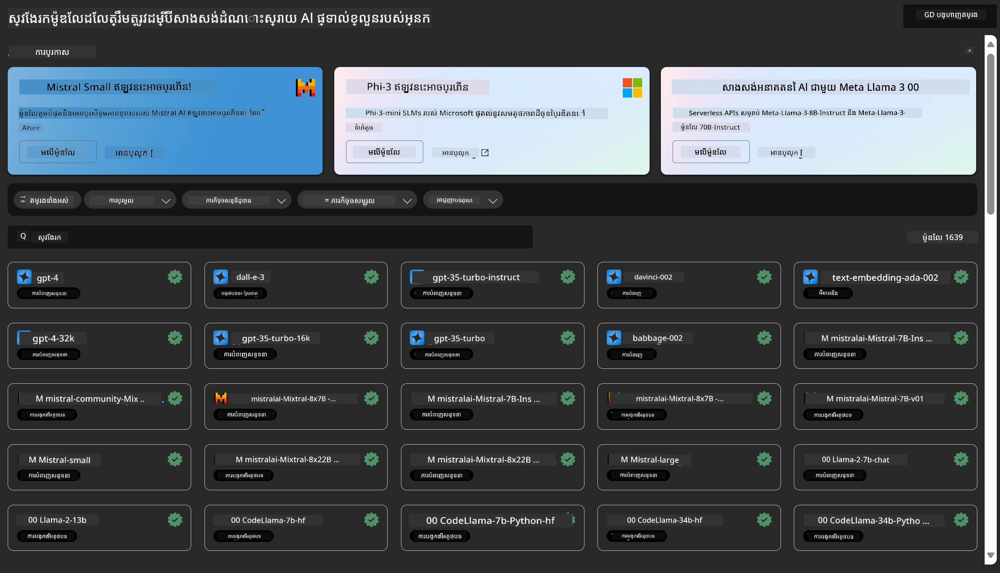
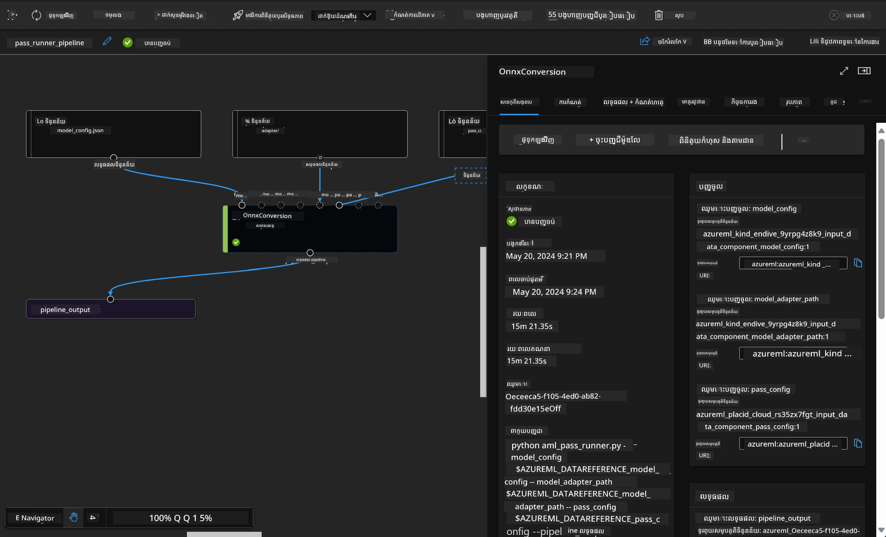

# **ណែនាំសេវាកម្ម Azure Machine Learning**

[Azure Machine Learning](https://ml.azure.com?WT.mc_id=aiml-138114-kinfeylo) គឺជាសេវាកម្មមេឃសម្រាប់បង្កើនល្បឿន និងគ្រប់គ្រងជីវិតវដ្តគម្រោងរៀនម៉ាស៊ីន (Machine Learning - ML)។

អ្នកជំនាញ ML, អ្នកវិទ្យាសាស្ត្រទិន្នន័យ និងវិស្វករអាចប្រើវាក្នុងលំនាំប្រចាំថ្ងៃរបស់ពួកគេដើម្បី៖

- បណ្តុះបណ្តាល និងដាក់ឲ្យដំណើរការម៉ូដែល។
- គ្រប់គ្រងប្រតិបត្តិការ machine learning (MLOps)។
- អ្នកអាចបង្កើតម៉ូដែលនៅក្នុង Azure Machine Learning ឬប្រើម៉ូដែលដែលបានសាងសង់ពីវេទិការដេញថ្លៃបើកចំហ អ្នកដូចជា PyTorch, TensorFlow ឬ scikit-learn។
- ឧបករណ៍ MLOps ជួយអ្នកក្នុងការតាមដាន, បណ្តុះបណ្តាលឡើងវិញ និងដាក់ឲ្យដំណើរការម៉ូដែលឡើងវិញ។

## Azure Machine Learning សម្រាប់នរណា?

**អ្នកវិទ្យាសាស្ត្រទិន្នន័យ និងវិស្វករ ML**

ពួកគេអាចប្រើឧបករណ៍ដើម្បីបង្កើនល្បឿននិងស្វ័យប្រវត្តិលំនាំប្រចាំថ្ងៃរបស់ពួកគេ។  
Azure ML ផ្តល់លក្ខណៈពិសេសសម្រាប់ភាពត្រឹមត្រូវ, ការពន្យល់, ការតាមដាន និងការត្រួតពិនិត្យខ្សែប្រវត្តិ។  
**អ្នកអភិវឌ្ឍន៍កម្មវិធី** ៖  
ពួកគេចូលរួមបញ្ចូលម៉ូដែលទៅក្នុងកម្មវិធីឬសេវាកម្មបានយ៉ាងល្អឥតខ្ចោះ។

**អ្នកអភិវឌ្ឍន៍វេទិកា**

ពួកគេមានភាពចូលដំណើរការទៅឧបករណ៍ដ៏រឹងមាំមួយដែលគាំទ្រដោយ Azure Resource Manager API ដែលរឹងមាំ។  
ឧបករណ៍ទាំងនេះអនុញ្ញាតឲ្យបង្កើតឧបករណ៍ ML ជំហានខ្ពស់។

**សហគ្រាស**

ធ្វើការក្នុងមេឃ Microsoft Azure, សហគ្រាសទទួលផលពីសុវត្ថិភាពស្គាល់ និងការគ្រប់គ្រងការចូលប្រើរដ្ឋបាលតាមតួនាទី។  
ដាក់សំណុំគម្រោងសម្រាប់គ្រប់គ្រងការចូលប្រើទិន្នន័យបានការពារ និងប្រតិបត្តការពិសេស។

## ផលិតភាពសម្រាប់គ្រប់រូបក្នុងក្រុម  
គម្រោង ML ជាញឹកញាប់ត្រូវការក្រុមដែលមានជំនាញផ្សេងៗដើម្បីសាងសង់និងថែរក្សា។

Azure ML ផ្តល់ឧបករណ៍ដែលអនុញ្ញាតឲ្យអ្នក៖  
- សហការជាមួយក្រុមរបស់អ្នកតាមរយៈសៀវភៅកត់ត្រាត្រូវបានចែករំលែក, ឧបករណ៍គណនា, គណនាកម្រិតមិនមានម៉ាស៊ីនបម្រើ, ទិន្នន័យ និងបរិបទ។  
- អភិវឌ្ឍម៉ូដែលដោយមានភាពត្រឹមត្រូវ, ការពន្យល់, ការតាមដាន និងការត្រួតពិនិត្យខ្សែប្រវត្តិ ដើម្បីបំពេញតម្រូវការស្ដីពីប្រវត្តិ និងការអនុលោម។  
- ដាក់ឲ្យដំណើរការម៉ូដែល ML លឿន និងងាយស្រួលក្នុងវិមាត្រធំ, ហើយគ្រប់គ្រង និងគ្រប់គ្រងវាដោយប្រសិទ្ធភាពជាមួយ MLOps។  
- ប្រតិបត្តិការងាររៀនម៉ាស៊ីននៅគ្រប់កន្លែងដោយមានរដ្ឋបាល, សុវត្ថិភាព និងការអនុលោមរួមបញ្ចូល។

## ឧបករណ៍វេទិកាឆ្លើយតបទាំងស្រុង

នរណាមួយនៅក្នុងក្រុម ML អាចប្រើឧបករណ៍ដែលពួកគេចូលចិត្តដើម្បីបំពេញការងារ។  
មិនថាអ្នកកំពុងប្រតិបត្តិការសាកល្បងឆាប់រហ័ស ការកំណត់ hyperparameter ការសាងសង់បណ្តាញរោងចក្រ ឬគ្រប់គ្រងការបកប្រែ អ្នកអាចប្រើផ្ទាំងអ្នកប្រើស្គាល់ៗដូចជា៖  
- Azure Machine Learning Studio  
- Python SDK (v2)  
- Azure CLI (v2)  
- Azure Resource Manager REST APIs  

នៅពេលដែលអ្នកបន្តកែប្រែម៉ូដែល និងសហការគ្នាទាំងមូលរយៈពេលអភិវឌ្ឍន៍ យើងអាចចែករំលែក និងស្វែងរកទ្រព្យសម្បត្តិ ផ្ទុកទិន្នន័យ និងមាតិកានៅក្នុងផ្ទាំង Azure Machine Learning studio UI។

## **LLM/SLM ក្នុង Azure ML**

Azure ML បានបន្ថែមមុខងារច្រើនទាក់ទងនឹង LLM/SLM ដែលភ្ជាប់ LLMOps និង SLMOps ជាមួយគ្នាដើម្បីបង្កើតវេទិកាបច្ចេកវិទ្យាបច្ចេកវិជ្ជាប្រព័ន្ធបញ្ចូលបញ្ចេញសិល្បៈបច្ចេកវិទ្យា របស់សហគ្រាសទ្វេដង។

### **កាតាឡុកម៉ូដែល**

អ្នកប្រើប្រាស់សហគ្រាសអាចដាក់រចនាសម្ព័ន្ធផ្សេងៗតាមស្ថានភាពអាជីវកម្មផ្សេងៗតាមរយៈកាតាឡុកម៉ូដែល ហើយផ្តល់សេវាកម្មជាម៉ូដែលជាសេវាកម្មសម្រាប់អ្នកអភិវឌ្ឍន៍ឬអ្នកប្រើប្រាស់សហគ្រាសឲ្យចូលប្រើ។

កាតាឡុកម៉ូដែលក្នុង Azure Machine Learning studio គឺជាតំបន់មជ្ឈមណ្ឌលសម្រាប់រកឃើញ និងប្រើម៉ូដែលជាច្រើនដែលអនុញ្ញាតឲ្យអ្នកសាងសង់កម្មវិធី Generative AI។ កាតាឡុកម៉ូដែលមានម៉ូដែលរាប់រយនៅក្រោមអ្នកផ្គត់ផ្គង់ម៉ូដែលដូចជា Azure OpenAI service, Mistral, Meta, Cohere, Nvidia, Hugging Face រួមទាំងម៉ូដែលដែលបានបណ្តុះបណ្តាលដោយ Microsoft។ ម៉ូដែលពីអ្នកផ្គត់ផ្គង់ក្រៅ Microsoft គឺជា ផលិតផលមិនមែន Microsoft ដូចដែលបានកំណត់ក្នុងលក្ខខណ្ឌផលិតផល Microsoft ហើយស្ថិតក្រោមលក្ខខណ្ឌផ្តល់ជូនជាមួយម៉ូដែលបាននោះ។

### **បណ្តាញរោងចក្រ Job Pipeline**

ស្នូលនៃបណ្តាញរោងចក្រ machine learning គឺបំបែកភារកិច្ច machine learning ទាំងមូលទៅជាលំនាំការងាររាប់ជំហាន។ រាល់ជំហានជាផ្នែកដែលអាចគ្រប់គ្រងបាន ដែលអាចអភិវឌ្ឍ កែលម្អ កំណត់រចនាសម្ព័ន្ធ និងស្វ័យប្រវត្តិក្នុងមួយតែមួយ។ ជំហានទាំងនេះត្រូវបានភ្ជាប់តាមរយៈបណ្តាញជាក់លាក់ទេត។ សេវាបណ្តាញរោងចក្រ Azure Machine Learning ដឹកនាំស្វ័យកម្មទំនាក់ទំនងគ្រប់គ្រងជាមួយជំហានៗទាំងមូល។

នៅក្នុងការកែប្រែម៉ូដែល SLM / LLM យើងអាចគ្រប់គ្រងទិន្នន័យ, ការបណ្តុះបណ្តាល និងដំណើរការបង្កើតតាមរយៈបណ្តាញរោងចក្រ Pipeline

### **Prompt flow**

អត្ថប្រយោជន៍នៃការប្រើប្រាស់ Azure Machine Learning prompt flow  
Azure Machine Learning prompt flow ផ្តល់អត្ថប្រយោជន៍ជាច្រើនដែលជួយអ្នកប្រើប្រាស់ធ្វើដំណើរពីការគិតមកការសាកល្បង ហើយចុងក្រោយមកកាន់កម្មវិធី LLM ដែលរួចរាល់សម្រាប់ផលិតកម្ម៖

**ភាពរហ័សរហួនក្នុងការបញ្ចូល Prompt**  

បទពិសោធន៍សរសេរបញ្ចូលមានអន្តរកម្ម៖ Azure Machine Learning prompt flow ផ្តល់ឱ្យនូវការបង្ហាញវិស្វកម្មរចនាសម្ព័ន្ធនៃ flow ដែលអនុញ្ញាតឲ្យអ្នកប្រើប្រាស់យល់ឃើញ និងរំលែកក្នុងគម្រោងបានយ៉ាងងាយស្រួល។ វាក៏ផ្តល់បទពិសោធន៍ដូចជាសៀវភៅកូដសម្រាប់អភិវឌ្ឍន៍ flow និងកែតម្រូវកំហុសយ៉ាងប្រសើរ។  
វ៉ារ្យង់សម្រាប់កែប្រែ prompt៖ អ្នកប្រើអាចបង្កើត និងប្រៀបធៀបវ៉ារ្យង់ prompt ច្រើន ដើម្បីធ្វើដំណើរការកែសម្រួលជាបន្តបន្ទាប់។

ការវាយតម្លៃ៖ មាន flow វាយតម្លៃបញ្ចូលនៅក្នុងដែលអនុញ្ញាតឲ្យអ្នកប្រើវាយតម្លៃគុណភាព និងប្រសិទ្ធភាពនៃ prompt និង flow របស់ពួកគេ។

ធនធានទូលំទូលាយ៖ Azure Machine Learning prompt flow រួមបញ្ចូលបណ្ណាល័យឧបករណ៍, គំរូ និងទំព័ររៀនដែលធ្វើជាចំណុចចាប់ផ្តើមសម្រាប់ការអភិវឌ្ឍន៍ បង្កើតការច្នៃប្រឌិត និងបន្ថែមល្បឿនក្នុងដំណើរការ។

**ភាពអាចប្រើប្រាស់សម្រាប់សហគ្រាសក្នុងកម្មវិធីលើផ្ទៀង LLM**  

សហការគ្នា៖ Azure Machine Learning prompt flow គាំទ្រការសហការក្រុម ដែលអនុញ្ញាតឲ្យអ្នកប្រើប្រាស់ជាច្រើនធ្វើការជាមួយគ្នាក្នុងគម្រោងបញ្ចូល prompt, ចែករំលែកចំណេះដឹង និងថែរក្សាការគ្រប់គ្រងកំណែ។  

វេទិកាអង្គភាពមួយ៖ Azure Machine Learning prompt flow បង្កើតដំណើរការជារៀងរហូតសម្រាប់ដំណើរការបញ្ចូល prompt ពីការអភិវឌ្ឍន៍ ទៅការវាយតម្លៃ និងដាក់សម្រេច និងតាមដាន។ អ្នកប្រើអាចដាក់ដំណើរការរបស់ពួកគេជាជំនួយអាក្រាត Azure Machine Learning ហើយតាមដានការប្រតិបត្តិការរបស់ពួកគេចុងក្រោយក្នុងពេលវេលាពិតប្រាកដ ដើម្បីធានាការប្រតិបត្តិការល្អបំផុត និងការកែលម្អជាបន្តបន្ទាប់។

ដំណោះស្រាយ Azure Machine Learning Enterprise Readiness: Prompt flow ប្រើប្រាស់ដំណោះស្រាយភាពរឹងមាំសម្រាប់ភាពអាចប្រើរបស់សហគ្រាស Azure Machine Learning ដើម្បីផ្តល់មូលដ្ឋានដែលមានសុវត្ថិភាព, អាចពូកែ និងទុកចិត្តសម្រាប់ការអភិវឌ្ឍន៍, សាកល្បង និងដាក់សម្រាច់ flow។

ជាមួយ Azure Machine Learning prompt flow អ្នកប្រើអាចបញ្ចូនសមត្ថភាពបញ្ចូល prompt ខ្លួនពួកគេ, សហការយ៉ាងមានប្រសិទ្ធភាព និងប្រើប្រាស់ដំណោះស្រាយថ្នាក់សហគ្រាសសម្រាប់ការអភិវឌ្ឍន៍ និងដាក់សម្រេចកម្មវិធីលើផ្ទៀង LLM បានដោយជោគជ័យ។

ការភ្ជាប់ថាមពលគណនាតម្លៃ, ទិន្នន័យ និងជាដុំផ្សេងៗនៃ Azure ML អ្នកអភិវឌ្ឍន៍សហគ្រាសអាចសាងសង់កម្មវិធីបញ្ញាសិប្បនិម្មិតផ្ទាល់ខ្លួនរបស់ពួកគេបានយ៉ាងងាយស្រួល។

---

<!-- CO-OP TRANSLATOR DISCLAIMER START -->
**ការបដិសេធ**៖  
ឯកសារនេះត្រូវបានបកប្រែដោយប្រើសេវាកម្មបកប្រែ AI [Co-op Translator](https://github.com/Azure/co-op-translator)។ ខណៈពេលដែលយើងខិតខំរកភាពត្រឹមត្រូវ សូមយល់ឱ្យបានដឹងថាការបកប្រែដោយស្វ័យប្រវត្តិសក្តានុពលមានកំហុស ឬការមិនត្រឹមត្រូវ។ ឯកសារដើមនៅក្នុងភាសារបស់វានឹងត្រូវបានគេគិតថាជាដើមទិន្នន័យដែលមានអំណាច។ សម្រាប់ព័ត៌មានសំខាន់ៗ គួរតែបានបកប្រែដោយអ្នកជំនាញមនុស្សដែលមានវិជ្ជាជីវៈ។ យើងមិនទទួលខុសត្រូវចំពោះការយល់ច្រឡំ ឬការបកប្រែខុសប្លែកណាមួយដែលកើតឡើងពីការប្រើប្រាស់ការបកប្រែនេះឡើយ។
<!-- CO-OP TRANSLATOR DISCLAIMER END -->