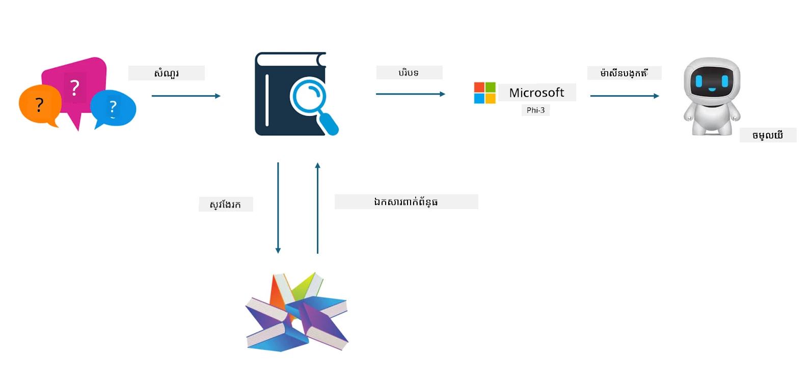
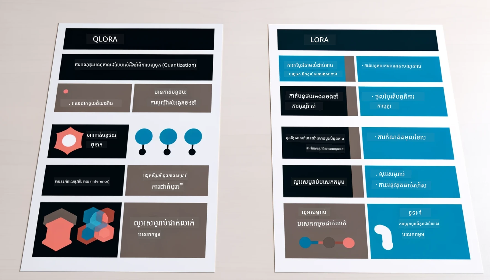

# **អោយ Phi-3 ក្លាយជាអ្នកជំនាញឧស្សាហកម្ម**

ដើម្បីដាក់ម៉ូដែល Phi-3 ចូលទៅក្នុងឧស្សាហកម្ម អ្នកត្រូវការបន្ថែមទិន្នន័យអាជីវកម្មឧស្សាហកម្មទៅកាន់ម៉ូដែល Phi-3។ យើងមានជម្រើសពីរដែលខុសគ្នា មួយគឺ RAG (Retrieval Augmented Generation) និងមួយទៀតគឺ Fine Tuning។

## **RAG និង Fine-Tuning**

### **Retrieval Augmented Generation**

RAG គឺជាការស្វែងរកទិន្នន័យ + ការបង្កើតអត្ថបទ។ ទិន្នន័យដែលមានរចនាសម្ព័ន្ធ និងទិន្នន័យដែលគ្មានរចនាសម្ព័ន្ធ នៃសហគ្រាសត្រូវបានរក្សាទុកនៅក្នុងមូលដ្ឋានទិន្នន័យវ៉ិចទ័រ។ នៅពេលស្វែងរកមាតិកាដែលពាក់ព័ន្ធ ការសង្ខេបដែលពាក់ព័ន្ធ និងមាតិកាត្រូវបានរកឃើញដើម្បីបង្កើតបរិបទ ហើយសមត្ថភាពបញ្ចប់អត្ថបទរបស់ LLM/SLM ត្រូវបានភ្ជាប់ដើម្បីបង្កើតមាតិកា។

### **Fine-tuning**

Fine-tuning គឺផ្អែកលើការកែលម្អម៉ូដែលជាក់លាក់មួយ។ វាមិនចាំបាច់ចាប់ផ្តើមជាមួយអាល់ហ្គរីធម៏ម៉ូដែលទេ ប៉ុន្តែទិន្នន័យត្រូវបានបន្ដបន្ទាប់ម្ដងៗ។ ប្រសិនបើអ្នកចង់បានពាក្យបច្ចេកទេស និងការបញ្ចេញភាសាឲ្យត្រឹមត្រូវបន្ថែមក្នុងកម្មវិធីឧស្សាហកម្ម Fine-tuning គឺជាជម្រើសល្អរបស់អ្នក។ ប៉ុន្តែប្រសិនបើទិន្នន័យរបស់អ្នកផ្លាស់ប្តូរញឹកញាប់ Fine-tuning អាចជាកម្មវិធីស្មុគស្មាញ។

### **របៀបជ្រើសរើស**

1. ប្រសិនបើយើងត្រូវការជំនួយពីទិន្នន័យខាងក្រៅ RAG គឺជាជម្រើសល្អបំផុត

2. ប្រសិនបើអ្នកត្រូវការចេញលទ្ធផលនូវចំណេះដឹងឧស្សាហកម្មដែលមានស្ថិរភាព និងត្រឹមត្រូវ Fine-tuning នឹងជាជម្រើសល្អ។ RAG នឹងផ្ដល់អាទិភាពទៅការទាញយកមាតិកាដែលពាក់ព័ន្ធ ប៉ុន្តែអាចមិនបានគ្រប់ទាំងចំណុចជំនាញជាក់លាក់ទាំងអស់។

3. Fine-tuning ត្រូវការប្រមូលទិន្នន័យដែលមានគុណភាពខ្ពស់ ហើយប្រសិនបើវាជាតំបន់តូចតែមួយ គឺនឹងមិនបំផុតខ្លាំង។ RAG មានភាពបត់បែនច្រើនជាង

4. Fine-tuning ជាប្រអប់ខ្មៅ មួយយុត្តិវិទ្យា ហើយវាពិបាកប្រសិទ្ធទៅលើមេកានិចក្នុងសំណុំទិន្នន័យ ប៉ុន្តែ RAG អាចធ្វើឲ្យកាន់តែងាយស្រួលរកប្រភពទិន្នន័យ ដូច្នេះអាចកែតម្រូវការខុសឆ្គង ឬកំហុសខ្ទង់ខ្លួនបានមានប្រសិទ្ធភាព និងផ្ដល់ភាពច្បាស់លាស់ល្អប្រសើរជាង។

### **សេណារីយ៉ូ**

1. ឧស្សាហកម្មទ្រង់ទ្រាយត្រង់ត្រូវការពាក្យបច្ចេកទេស និងការបញ្ចេញមតិជាក់លាក់ ***Fine-tuning*** នឹងជាជម្រើសល្អបំផុត

2. ប្រព័ន្ធ QA ដែលពាក់ព័ន្ធនឹងការសម្រង់ចំណុចចំណេះដឹងខុសគ្នា ***RAG*** នឹងជាជម្រើសល្អបំផុត

3. ការរួមបញ្ចូលរបស់ចរន្តអាជីវកម្មស្វ័យប្រវត្តិ ***RAG + Fine-tuning*** គឺជាជម្រើសល្អបំផុត

## **របៀបប្រើ RAG**

មូលដ្ឋានទិន្នន័យវ៉ិចទ័រ គឺជាការប្រមួលទិន្នន័យដែលបានរក្សាទុកនៅក្នុងរូបមន្តគណិតវិទ្យា។ មូលដ្ឋានទិន្នន័យវ៉ិចទ័រធ្វើឲ្យម៉ូដែលម៉ាស៊ីនសិក្សាអាចចងចាំការបញ្ចូលមុនៗបានងាយស្រួល បណ្ដាលឲ្យម៉ាស៊ីនសិក្សាត្រូវបានប្រើក្នុងករណីប្រើប្រាស់ដូចជា ស្វែងរក, ណែនាំ, និងបង្កើតអត្ថបទ។ ទិន្នន័យអាចត្រូវបានសម្គាល់ដោយផ្អែកលើម៉ាត្រិចស្រដៀងគ្នា និយាយហើយថាមិនចាំបាច់មានការចងស្របពេញលេញ បណ្ដាលឲ្យម៉ូដែលកុំព្យូទ័រយល់ដឹងពីបរិបទនៃទិន្នន័យ។

មូលដ្ឋានទិន្នន័យវ៉ិចទ័រ គឺជាគន្លងសំខាន់ក្នុងការជំនួស RAG។ យើងអាចបម្លែងទិន្នន័យទៅជាភាសាវ៉ិចទ័រដោយប្រើម៉ូដែលវ៉ិចទ័រដូចជា text-embedding-3, jina-ai-embedding, ល។ 

សូមរៀនបន្ថែមអំពីការបង្កើតកម្មវិធី RAG [https://github.com/microsoft/Phi-3CookBook](https://github.com/microsoft/Phi-3CookBook?WT.mc_id=aiml-138114-kinfeylo)

## **របៀបប្រើ Fine-tuning**

អាល់ហ្គរីធម៌ដែលប្រើជាញឹកញាប់ក្នុង Fine-tuning មានជា Lora និង QLora។ តើយើងត្រូវជ្រើសយ៉ាងដូចម្តេច?
- [រៀនបន្ថែមជាមួយសៀវភៅកម្មវិធីគំរូនេះ](../../code/04.Finetuning/Phi_3_Inference_Finetuning.ipynb)
- [ឧទាហរណ៍គំរូ Python FineTuning](../../../../code/04.Finetuning/FineTrainingScript.py)

### **Lora និង QLora**

LoRA (Low-Rank Adaptation) និង QLoRA (Quantized Low-Rank Adaptation) គឺជាបច្ចេកវិទ្យារបស់ការបង្កើត Fine-tune ម៉ូដែលភាសាធំ (LLMs) ដោយប្រើ Parameter Efficient Fine Tuning (PEFT)។ បច្ចេកវិទ្យា PEFT ត្រូវបានរចនាឡើងដើម្បីបណ្តុះបណ្តាលម៉ូដែលឲ្យមានប្រសិទ្ធភាពកាន់តែខ្ពស់ជាងវិធីសាស្រ្តបុរាណ។ 
LoRA គឺជាវិធីសាស្រ្ត Fine-tuning ដាច់ដោយឡែក ដែលបន្ថយកំរងអង្គចងចាំដោយប្រើបច្ចេកទេសប្រមាណផលភាពកំរិតទាប លើម៉ាទ្រីសធ្វើបន្ទាន់ទម្ងន់។ វាផ្ដល់ការបណ្តុះបណ្តាលលឿន និងគ្រប់គ្រងសមត្ថភាពជិតស្ទើរតែស្មើនឹងវិធីសាស្រ្ត Fine-tuning ទំនើប។

QLoRA គឺជាការពង្រីកនៃ LoRA ដែលបញ្ចូលបច្ចេកទេសបម្លែងចំនួនគុណភាព (quantization) ដើម្បីបន្ថយការប្រើប្រាស់អង្គចងចាំបន្ថែមទៀត។ QLoRA បម្លែងភាពត្រឹមត្រូវនៃប៉ារ៉ាម៉ែត្រ២ថ្មើរមានក្នុង LLM ដែលបានបណ្តុះបណ្តាលជាមុនទៅជាកំរិត 4-ប៊ីត ដែលមានប្រសិទ្ធភាពប្រើអង្គចងចាំល្អជាង LoRA។ ទោះជាយ៉ាងណា ការបណ្តុះបណ្តាល QLoRA យឺតជាង LoRA ប្រហែល 30% ដោយសារជំហានបន្ថែមនៃការបម្លែងបូកបន្ថែម និងការបម្លែងត្រឡប់តម្លៃ។

QLoRA ប្រើ LoRA ជាឧបករណ៍ជំនួយដើម្បីជួសជុលកំហុសដែលបានបង្កើតឡើងនៅពេលកំហុសបម្លែង។ QLoRA អាចអនុញ្ញាតឲ្យ Fine-tune ម៉ូដែលមានប៉ារ៉ាម៉ែត្រ​លានលានាលបានលើ GPUs ដែលមានទំហំតូច ប្រៃសណីយ៍ និងអាចប្រើបានយ៉ាងប្រសើរ។ ឧទាហរណ៍ QLoRA អាច Fine-tune ម៉ូដែល 70B នៃប៉ារ៉ាម៉ែត្រដែលទាមទារប្រើ GPUs 36 តែមានតែ 2

---

<!-- CO-OP TRANSLATOR DISCLAIMER START -->
**ការដោះលែង**៖  
ឯកសារនេះត្រូវបានបកប្រែដោយប្រើសេវាកម្មបកប្រែ AI [Co-op Translator](https://github.com/Azure/co-op-translator)។ ខណៈពេលដែលយើងខិតខំដល់ភាពត្រឹមត្រូវ សូមជ្រាបថាការបកប្រែដោយស្វ័យប្រវត្តិអាចមានកំហុស ឬភាពមិនត្រឹមត្រូវ។ ឯកសារដើមនៅក្នុងភាសាមូលដ្ឋានរបស់វាត្រូវបានយកទៅជាមធ្យោបាយផ្លូវការចម្បង។ សម្រាប់ព័ត៌មានសំខាន់ យើងស្នើអោយបកប្រែដោយអ្នកជំនាញមនុស្សវិជ្ជាជីវៈ។ យើងមិនទទួលខុសត្រូវចំពោះការយល់ច្រឡំ ឬកការបកប្រែខុសផ្សេងៗណាមួយដែលមានមកពីការប្រើប្រាស់ការបកប្រែនេះឡើយ។
<!-- CO-OP TRANSLATOR DISCLAIMER END -->