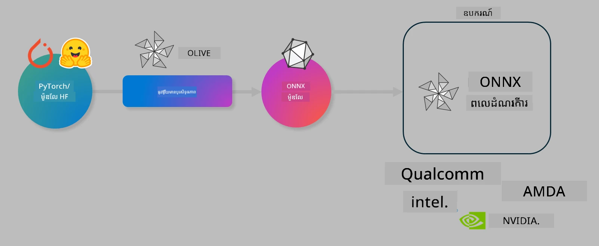

# ឧបាសនា. បង្កើតម៉ូដែល AI ឲ្យមានប្រសិទ្ធភាពសម្រាប់ការព្យាបាលក្នុងឧបករណ៍

## មុខម្ហូបណែនាំ

> [!IMPORTANT]
> ឧបាសនានេះតម្រូវឲ្យមាន **GPU Nvidia A10 ឬ A100** ជាមួយកម្មវិធីបើកបរ និង CUDA toolkit (ជំនាន់ 12+) ត្រូវបានដំឡើង។

> [!NOTE]
> នេះជាឧបាសនា **35 នាទី** ដែលនឹងផ្តល់ឱ្យអ្នកនូវការណែនាំផ្ទាល់ដៃអំពីទ្រឹស្តីមូលដ្ឋាននៃការបង្កើតម៉ូដែលឲ្យមានប្រសិទ្ធភាពសម្រាប់ការព្យាបាលក្នុងឧបករណ៍ដោយប្រើ OLIVE។

## គោលបំណងការសិក្សា

នៅចុងបញ្ចប់នៃឧបាសនានេះ អ្នកនឹងអាចប្រើ OLIVE ដើម្បី៖

- បំបែកម៉ូដែល AI ដោយប្រើវិធីសាស្ត្រ AWQ quantization។
- បង្កើតម៉ូដែល AI ជាពិសេសសម្រាប់ភារកិច្ចជាក់លាក់។
- បង្កើតគ្រឿងភ្ជាប់ LoRA (ម៉ូដែលបានបង្កើតថ្មី) សម្រាប់ការព្យាបាលប្រសិទ្ធិភាពលើឧបករណ៍ដោយប្រើ ONNX Runtime។

### អ្វីទៅជា Olive

Olive (*O*NNX *live*) គឺជាឧបករណ៍បង្កើតម៉ូដែលជាមួយ CLI ដែលអនុញ្ញាតិឲ្យអ្នកផ្ញើម៉ូដែលសម្រាប់ ONNX runtime +++https://onnxruntime.ai+++ ជាមួយគុណភាព និងកម្រិតប្រសិទ្ធភាព។



ព័ត៌មានជាចូលទៅ Olive ភាគច្រើនគឺជាម៉ូដែល PyTorch ឬ Hugging Face ហើយផលចេញគឺជាម៉ូដែល ONNX ដែលបានបង្កើតឡើងសម្រាប់អនុវត្តនៅលើឧបករណ៍ (គោលដៅប្រើប្រាស់) ដែលដំណើរការជាមួយ ONNX runtime។ Olive នឹងបង្កើតម៉ូដែលសម្រាប់គោលដៅប្រើប្រាស់ ដោយប្រើល្បឿនបន្ថែម AI (NPU, GPU, CPU) ពីអ្នកផ្គត់ផ្គង់បច្ចេកវិទ្យា​ដូចជា Qualcomm, AMD, Nvidia ឬ Intel។

Olive ប្រតិបត្តិ *workflow*, ដែលជាលំដាប់តម្រងនៃភារកិច្ចបង្កើតម៉ូដែលដោយអ فردិថខ។
ឧទាហរណ៍នៃនិច្ចកម្មរួមមាន៖ កាត់បន្ថយទំហំម៉ូដែល, ការកាន់កាប់ក្រាប, ការបំបែកកម្រិត, ការបង្កើតក្រាប។ និច្ចកម្មមួយៗមាន parameter ដែលអាចត្រូវបានកែតម្រូវដើម្បីទទួលបានវិសេសភាពល្អបំផុត ដូចជា តុល្យភាព និងពេលយឺតដែលត្រូវបានវាយតម្លៃដោយអ្នកវាស់វែងពាក់ព័ន្ធ។ Olive ប្រើយុទ្ធសាស្ត្រស្វែងរកដោយប្រើ algorithm ស្វែងរកដើម្បីកំណត់ប៉ារ៉ាម៉ែត្របានស្វ័យប្រវត្តិដោយចុះឲ្យនិច្ចកម្មម្នាក់ៗ ឬក្រុមនិច្ចកម្ម។

#### ផលប្រយោជន៍នៃ Olive

- **កាត់បន្ថយការរអាក់រអួល និងពេលវេលា** នៃការសាកល្បងដៃដោយមិនទាន់ច្បាស់លាស់ជាមួយបច្ចេកវិទ្យាដាក់បន្ថែម ការកាត់បន្ថយ និង quantization។ កំណត់គុណភាព និងកម្រិតប្រសិទ្ធភាពរបស់អ្នក ហើយអោយ Olive រកម៉ូដែលល្អបំផុតស្វ័យប្រវត្តិ។
- **មានគ្រឿងបំពេញបង្កើតម៉ូដែល 40+** ដែលគ្របដណ្តប់លើបច្ចេកវិទ្យាចុងក្រោយក្នុង quantization, ការកាត់បន្ថយ, ការបង្កើតក្រាប និងការបង្កើតថ្មី។
- **CLI ដែលងាយស្រួលប្រើ** សម្រាប់ភារកិច្ចបង្កើតម៉ូដែលទូទៅ។ ឧទាហរណ៍, olive quantize, olive auto-opt, olive finetune។
- មានវាជាផ្នែកមួយនៃការវេចខ្ចប់ និងដំណើរការម៉ូដែល។
- គាំទ្រការបង្កើតម៉ូដែលសម្រាប់ **Multi LoRA serving**។
- អាចបង្កើត workflow ដោយប្រើ YAML/JSON សម្រាប់គ្រប់គ្រងភារកិច្ចបង្កើតម៉ូដែល និង ដំណើរការ។
- ប្រើការតភ្ជាប់ **Hugging Face** និង **Azure AI** ។
- មានមេកាន៊ីសកាល់ **caching** ដើម្បី **សន្សំចំណាយ**។

##‍ ការណែនាំឧបាសនា
> [!NOTE]
> សូមប្រាកដថាអ្នកបានរៀបចំគម្រោង Azure AI Hub និង Project របស់អ្នក ហើយបានកំណត់ម៉ាស៊ីនគណនា A100 ដូចក្នុងឧបាសនា ១។

### ជំហាន 0: តភ្ជាប់ទៅ Azure AI Compute របស់អ្នក

អ្នកនឹងតភ្ជាប់ទៅ Azure AI compute ដោយប្រើមុខងារ remote ក្នុង **VS Code**។

1. បើកកម្មវិធី **VS Code** លើកុំព្យូទ័រដែលអ្នកប្រើ។
2. បើក **command palette** ដោយចុច **Shift+Ctrl+P**។
3. ក្នុង command palette ស្វែងរក **AzureML - remote: Connect to compute instance in New Window**។
4. អនុលោមតាមសេចក្តីណែនាំសម្រាប់តភ្ជាប់ទៅ Compute ។ នេះនឹងពាក់ព័ន្ធនឹងការជ្រើសរើស Azure Subscription, Resource Group, Project និង Compute name ដែលអ្នកបានកំណត់ក្នុងឧបាសនា 1។
5. បន្ទាប់ពីអ្នកបានតភ្ជាប់ទៅ Azure ML Compute node នេះនឹងបង្ហាញនៅផ្នែកខាងក្រោមឆ្វេងនៃ Visual Studio Code ខាងក្រោម `><Azure ML: Compute Name`

### ជំហាន 1: Clone repo នេះ

ក្នុង VS Code អ្នកអាចបើក terminal ថ្មីដោយចុច **Ctrl+J** ហើយ clone repo នេះ៖

នៅក្នុង terminal អ្នកនឹងឃើញ prompt

```
azureuser@computername:~/cloudfiles/code$ 
```
Clone the solution 

```bash
cd ~/localfiles
git clone https://github.com/microsoft/phi-3cookbook.git
```

### ជំហាន 2: បើកថតក្នុង VS Code

ដើម្បីបើក VS Code នៅក្នុងថតដែលពាក់ព័ន្ធ អនុវត្តបញ្ជាខាងក្រោមក្នុង terminal ដែលនឹងបើកវីនដូថ្មី៖

```bash
code phi-3cookbook/code/04.Finetuning/Olive-lab
```

ជាជំរើសផ្សេងទៀត អ្នកអាចបើកថតដោយជ្រើសរើស **File** > **Open Folder**។

### ជំហាន 3: ផ្ទុក dependencies

បើក Terminal window នៅក្នុង VS Code ក្នុង Azure AI Compute Instance របស់អ្នក (កន្លែងចាប់ផ្តើម៖ **Ctrl+J**) ហើយអនុវត្តបញ្ជាខាងក្រោមដើម្បីដំឡើង dependencies៖

```bash
conda create -n olive-ai python=3.11 -y
conda activate olive-ai
pip install -r requirements.txt
az extension remove -n azure-cli-ml
az extension add -n ml
```

> [!NOTE]
> វានឹងចំណាយប្រហែល ~5 នាទីសម្រាប់ដំឡើង dependencies ទាំងអស់។

ក្នុងឧបាសនានេះ អ្នកនឹងទាញយក និងផ្ទុកឡើងម៉ូដែលទៅក្នុង Azure AI Model catalog។ ដើម្បីចូលប្រើ catalog នេះ អ្នកត្រូវតែចូលប្រើ Azure ដោយប្រើ៖

```bash
az login
```

> [!NOTE]
> នៅពេលចូល អ្នកនឹងត្រូវបានស្នើឲ្យជ្រើសរើស subscription របស់អ្នក។ សូមប្រាកដថាអ្នកកំណត់ subscription ទៅកាន់ការផ្តល់ជូនសម្រាប់ឧបាសនានេះ។

### ជំហាន 4: អនុវត្តការបញ្ជា Olive

បើក terminal window នៅក្នុង VS Code នៅក្នុង Azure AI Compute Instance របស់អ្នក (កន្លែងចាប់ផ្តើម៖ **Ctrl+J**) ហើយធ្វើអោយបរិស្ថាន conda `olive-ai` ត្រូវបានបើកផង៖

```bash
conda activate olive-ai
```

បន្ទាប់ អនុវត្តបញ្ជា Olive ខាងក្រោមនៅលើ command line។

1. **ពិនិត្យទិន្នន័យ៖** ក្នុងឧទាហរណ៍នេះ អ្នកនឹងបង្កើតម៉ូដែល Phi-3.5-Mini ដើម្បីឲ្យវាជាពិសេសក្នុងការឆ្លើយសំណួរពាក់ព័ន្ធនឹងការធ្វើដំណើរ។ កូដខាងក្រោមបង្ហាញកំណត់ត្រាចាប់ផ្តើមនៃសំណុំទិន្នន័យ ដែលជារបៀប JSON lines៖
   
    ```bash
    head data/data_sample_travel.jsonl
    ```
1. **Quantize ម៉ូដែល៖** មុនពេលបណ្ដុះម៉ូដែល អ្នកនឹងបំបែកកម្រិតដោយប្រើបញ្ជា ខាងក្រោម ដែលប្រើបច្ចេកទេសហៅថា Active Aware Quantization (AWQ) +++https://arxiv.org/abs/2306.00978+++។ AWQ បំបែកទំងន់ម៉ូដែលដោយចាត់ទុកអំពើបញ្ចេញថាមពលDuring inference។ នេះមានន័យថាបច្ចេកទេស quantization នេះគិតគូរទិន្នន័យពិតក្នុងការបញ្ចេញថាមពលដែលនាំឲ្យការបំបែកកម្រិតល្អជាងវិធីបំបែកទំងន់ដើម។
    
    ```bash
    olive quantize \
       --model_name_or_path microsoft/Phi-3.5-mini-instruct \
       --trust_remote_code \
       --algorithm awq \
       --output_path models/phi/awq \
       --log_level 1
    ```
    
    វាអាចចំណាយ **~8 នាទី** ដើម្បីបញ្ចប់ AWQ quantization ដែលនឹង **កាត់បន្ថយទំហំម៉ូដែលពី ~7.5GB ទៅ ~2.5GB**។
   
   ក្នុងឧបាសនានេះ យើងបង្ហាញអ្នកពីរបៀបបញ្ចូលម៉ូដែលពី Hugging Face (ឧទាហរណ៍: `microsoft/Phi-3.5-mini-instruct`) ទោះជាយ៉ាងណា Olive ផ្តល់ជម្រើសបញ្ចូលម៉ូដែលពីកាតាឡុក Azure AI ដោយធ្វើបង្ហាញ `model_name_or_path` ទៅកាន់ asset ID របស់ Azure AI (ឧទាហរណ៍:  `azureml://registries/azureml/models/Phi-3.5-mini-instruct/versions/4`)។ 

1. **បណ្ដុះម៉ូដែល៖** បន្ទាប់មកបញ្ជា `olive finetune` បណ្ដុះម៉ូដែលដែលបាន quantize។ ការបំបែកកម្រិតម៉ូដែលមុនការបណ្ដុះផ្តល់ឱ្យបានតុល្យភាពល្អជាងពេលបណ្ដុះបន្ទាប់ពី quantization ព្រោះការបណ្ដុះជួយស្ដារមាត្រដ្ឋានខ្លះពីការបាត់បង់ពី quantization។
    
    ```bash
    olive finetune \
        --method lora \
        --model_name_or_path models/phi/awq \
        --data_files "data/data_sample_travel.jsonl" \
        --data_name "json" \
        --text_template "<|user|>\n{prompt}<|end|>\n<|assistant|>\n{response}<|end|>" \
        --max_steps 100 \
        --output_path ./models/phi/ft \
        --log_level 1
    ```
    
    វាចំណាយពេលប្រហែល **~6 នាទី** ដើម្បីបញ្ចប់ការបណ្ដុះ (ជាមួយ 100 ជំហាន)។

1. **បង្កើតប្រសិទ្ធភាព:** ជាមួយម៉ូដែលបានបណ្ដុះ អ្នកអាចបង្កើតប្រសិទ្ធភាពម៉ូដែលដោយប្រើបញ្ជា `auto-opt` របស់ Olive ដែលនឹងចាប់យកក្រាប ONNX ហើយផ្ទាល់ខ្លួនអនុវត្តការបង្កើតប្រសិទ្ធភាពជាច្រើន ដើម្បីបង្កើនកម្រិតប្រសិទ្ធភាពម៉ូដែលសម្រាប់ CPU ដោយកាត់បន្ថយទំហំម៉ូដែល និងអនុវត្តការរួមបញ្ចូល។ ត្រូវចំណាំថា អ្នកអាចបង្កើតប្រសិទ្ធភាពសម្រាប់ឧបករណ៍ដូចជា NPU ឬ GPU ដោយកែ `--device` និង `--provider` តែសម្រាប់ឧបាសនានេះយើងប្រើ CPU។

    ```bash
    olive auto-opt \
       --model_name_or_path models/phi/ft/model \
       --adapter_path models/phi/ft/adapter \
       --device cpu \
       --provider CPUExecutionProvider \
       --use_ort_genai \
       --output_path models/phi/onnx-ao \
       --log_level 1
    ```
    
    វាចំណាយពេលប្រហែល **~5 នាទី** ដើម្បីបញ្ចប់ការបង្កើតប្រសិទ្ធភាព។

### ជំហាន 5: តេស្តរហ័សការប្រមូលទិន្នន័យ

ដើម្បីតេស្តការប្រមូលទិន្នន័យម៉ូដែល សូមបង្កើតឯកសារ Pythonមួយក្នុងថតរបស់អ្នកឈ្មោះ **app.py** ហើយចម្លង-បិទដេរ កូដខាងក្រោម៖

```python
import onnxruntime_genai as og
import numpy as np

print("loading model and adapters...", end="", flush=True)
model = og.Model("models/phi/onnx-ao/model")
adapters = og.Adapters(model)
adapters.load("models/phi/onnx-ao/model/adapter_weights.onnx_adapter", "travel")
print("DONE!")

tokenizer = og.Tokenizer(model)
tokenizer_stream = tokenizer.create_stream()

params = og.GeneratorParams(model)
params.set_search_options(max_length=100, past_present_share_buffer=False)
user_input = "what is the best thing to see in chicago"
params.input_ids = tokenizer.encode(f"<|user|>\n{user_input}<|end|>\n<|assistant|>\n")

generator = og.Generator(model, params)

generator.set_active_adapter(adapters, "travel")

print(f"{user_input}")

while not generator.is_done():
    generator.compute_logits()
    generator.generate_next_token()

    new_token = generator.get_next_tokens()[0]
    print(tokenizer_stream.decode(new_token), end='', flush=True)

print("\n")
```

អនុវត្តកូដដោយប្រើ៖

```bash
python app.py
```

### ជំហាន 6: ផ្ទុកម៉ូដែលឡើង Azure AI

ការផ្ទុកម៉ូដែលទៅក្នុង repository ម៉ូដែល Azure AI ឲ្យម៉ូដែលនេះអាចចែករំលែកជាមួយសមាជិកក្នុងក្រុមអ្នកអភិវឌ្ឍន៍ និងគ្រប់គ្រងកំណែម៉ូដែលផងដែរ។ ដើម្បីផ្ទុកម៉ូដែល អនុវត្តបញ្ជាខាងក្រោម៖

> [!NOTE]
> ប្តូរ {} ជាមួយឈ្មោះក្រុមធនធាន និងឈ្មោះគម្រោង Azure AI របស់អ្នក។

ដើម្បីស្វែងរកក្រុមធនធាន `"resourceGroup"` និងឈ្មោះក្រុមគម្រោង Azure AI សូមអនុវត្តបញ្ជាខាងក្រោម៖

```
az ml workspace show
```

ឬទៅកាន់ +++ai.azure.com+++ ហើយជ្រើសរើស **management center** **project** **overview**

ប្តូរ {} ជាមួយឈ្មោះក្រុមធនធាន និងឈ្មោះគម្រោង Azure AI របស់អ្នក។

```bash
az ml model create \
    --name ft-for-travel \
    --version 1 \
    --path ./models/phi/onnx-ao \
    --resource-group {RESOURCE_GROUP_NAME} \
    --workspace-name {PROJECT_NAME}
```
អ្នកអាចមើលម៉ូដែលដែលបានផ្ទុកឡើង និងចាប់ផ្តើមដំណើរការម៉ូដែលរបស់អ្នកនៅ https://ml.azure.com/model/list

---

<!-- CO-OP TRANSLATOR DISCLAIMER START -->
**ការបដិសេធ**៖  
ឯកសារនេះត្រូវបានបកប្រែដោយប្រើសេវាកម្មបកប្រែ AI [Co-op Translator](https://github.com/Azure/co-op-translator)។ ខណៈពេលដែលយើងខិតខំសម្រាប់ភាពត្រឹមត្រូវ សូមជ្រាបថាការបកប្រែដោយស្វ័យប្រវត្តិអាចមានកំហុស ឬការមិនត្រឹមត្រូវ។ ឯកសារដល់ពីភាសាមាត្រា គួរត្រូវបានឱ្យជាឧទាហរណ៍ដើមមានអំណាចផ្លូវការ។ សម្រាប់ព័ត៌មានសំខាន់ៗ សូមផ្ដល់អាទិភាពការបកប្រែដោយមនុស្សជំនាញ។ យើងមិនទទួលខុសត្រូវចំពោះការយល់ច្រឡំ ឬការបកប្រែខុសពីការប្រើប្រាស់ការបកប្រែនេះឡើយ។
<!-- CO-OP TRANSLATOR DISCLAIMER END -->