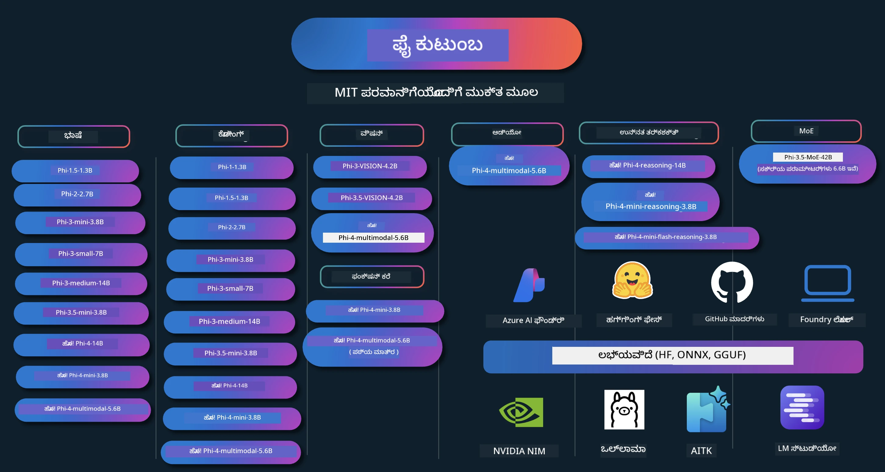

# ಫೈ ಕುಕ್‌ಬುಕ್: ಮೈಕ್ರೋಸಾಫ್ಟ್‌ನ ಫೈ ಮಾದರಿಗಳೊಂದಿಗೆ ಪ್ರಾಯೋಗಿಕ ಉದಾಹರಣೆಗಳು

[](https://codespaces.new/microsoft/phicookbook)
[](https://vscode.dev/redirect?url=vscode://ms-vscode-remote.remote-containers/cloneInVolume?url=https://github.com/microsoft/phicookbook)

[](https://GitHub.com/microsoft/phicookbook/graphs/contributors/?WT.mc_id=aiml-137032-kinfeylo)
[](https://GitHub.com/microsoft/phicookbook/issues/?WT.mc_id=aiml-137032-kinfeylo)
[](https://GitHub.com/microsoft/phicookbook/pulls/?WT.mc_id=aiml-137032-kinfeylo)
[](http://makeapullrequest.com?WT.mc_id=aiml-137032-kinfeylo)

[](https://GitHub.com/microsoft/phicookbook/watchers/?WT.mc_id=aiml-137032-kinfeylo)
[](https://GitHub.com/microsoft/phicookbook/network/?WT.mc_id=aiml-137032-kinfeylo)
[](https://GitHub.com/microsoft/phicookbook/stargazers/?WT.mc_id=aiml-137032-kinfeylo)

[](https://discord.com/invite/ByRwuEEgH4)

ಫೈ ಮೈಕ್ರೋಸಾಫ್ಟ್‌ರಿಂದ ಅಭಿವೃದ್ಧಿಪಡಿಸಲಾದ ಒಂದು ಸರಣಿ ಓಪನ್ ಸೋರ್ಸ್ AI ಮಾದರಿಗಳಾಗಿವೆ.

ಫೈ ಪ್ರಸ್ತುತ ಅತ್ಯಂತ ಶಕ್ತಿಶಾಲಿ ಮತ್ತು ವೆಚ್ಚ-ಪ್ರಭಾವಿ ಸಣ್ಣ ಭಾಷಾ ಮಾದರಿ (SLM), ಬಹುಭಾಷಾ, ತರ್ಕ, ಪಠ್ಯ/ಚಾಟ್ ಜನರೇಶನ್, ಕೋಡಿಂಗ್, ಚಿತ್ರಗಳು, ಧ್ವನಿ ಮತ್ತು ಇತರೆ ಸಂದರ್ಭಗಳಲ್ಲಿ ಉತ್ತಮ ಬೆಂಚ್‌ಮಾರ್ಕ್‌ಗಳನ್ನು ಹೊಂದಿದೆ.

ನೀವು ಫೈ ಅನ್ನು ಮೋಡ ಅಥವಾ ಎಡ್ಜ್ ಸಾಧನೆಗಳಿಗೆ ನಿಯೋಜಿಸಬಹುದು, ಮತ್ತು ಸೀಮಿತ ಗಣನ ಶಕ್ತಿಯೊಂದಿಗೆ ಜನರೇಟಿವ್ AI ಅಪ್ಲಿಕೇಶನ್ಗಳನ್ನು ಸುಲಭವಾಗಿ ನಿರ್ಮಿಸಬಹುದು.

ಈ ಸಂಪನ್ಮೂಲ ಸಂಚಯವನ್ನು ಬಳಸಲು ಕೆಳಗಿನ ಹಂತಗಳನ್ನು ಅನುಸರಿಸಿ:
1. **ರಿಪೋಸಿಟರಿಯನ್ನು ಫೋರ್ಕ್ ಮಾಡಿ**: ಕ್ಲಿಕ್ ಮಾಡಿ [](https://GitHub.com/microsoft/phicookbook/network/?WT.mc_id=aiml-137032-kinfeylo)
2. **ರಿಪೋಸಿಟರಿಯನ್ನು ಕ್ಲೋನ್ ಮಾಡಿ**:   `git clone https://github.com/microsoft/PhiCookBook.git`
3. [**Microsoft AI Discord ಸಮುದಾಯದಲ್ಲಿ ಸೇರಿ ಹಾಗೂ ಪರಿಣಿತರ ಮತ್ತು ಸಹ ಡೆವಲಪರ್‌ರನ್ನು ಭೇಟಿ ಮಾಡಿ**](https://discord.com/invite/ByRwuEEgH4?WT.mc_id=aiml-137032-kinfeylo)



### 🌐 ಬಹುಭಾಷಾ ಬೆಂಬಲ

#### GitHub Action ಮೂಲಕ ಬೆಂಬಲಿಸಲಾಗಿದೆ (ಸ್ವಯಂಚಾಲಿತ ಮತ್ತು ಸದಾ ನವೀಕರಣ)

<!-- CO-OP TRANSLATOR LANGUAGES TABLE START -->
[ಅರೇಬಿಕ್](../ar/README.md) | [ಬೆಂಗಾಳಿ](../bn/README.md) | [ಬಲ್ಗೇರಿಯನ್](../bg/README.md) | [ಬರ್ಮೀಸ್ (ಮ್ಯಾನ್ಮಾರ್)](../my/README.md) | [ಚೈನೀಸ್ (ಸರಳೀಕೃತ)](../zh-CN/README.md) | [ಚೈನೀಸ್ (ಪಾರದರ್ಶಕ, ಹಾಂಗ್ ಕಾಂಗ್)](../zh-HK/README.md) | [ಚೈನೀಸ್ (ಪಾರದರ್ಶಕ, ಮಕಾವ್)](../zh-MO/README.md) | [ಚೈನೀಸ್ (ಪಾರದರ್ಶಕ, ತೈವಾನ್)](../zh-TW/README.md) | [ಕ್ರೋಯೇಷಿಯನ್](../hr/README.md) | [ಚೆಕ್](../cs/README.md) | [ಡೆನಿಷ್](../da/README.md) | [ಡಚ್](../nl/README.md) | [ಎಸ್ಟೋನಿಯನ್](../et/README.md) | [ಫಿನ್ನಿಷ್](../fi/README.md) | [ಫ್ರೆಂಚ್](../fr/README.md) | [ಜರ್ಮನ್](../de/README.md) | [ಗ್ರೀಕ್](../el/README.md) | [ಹೀಬ್ರೂ](../he/README.md) | [ಹಿಂದಿ](../hi/README.md) | [ಹಂಗೇರಿ](../hu/README.md) | [ಇಂಡೋನೇಷಿಯನ್](../id/README.md) | [ಇಟಾಲಿಯನ್](../it/README.md) | [ಜಪಾನೀಸ್](../ja/README.md) | [ಕನ್ನಡ](./README.md) | [ಕೋರಿಯನ್](../ko/README.md) | [ಲಿಥುವೇನಿಯನ್](../lt/README.md) | [ಮಲಯ್](../ms/README.md) | [ಮಲಯಾಳಂ](../ml/README.md) | [ಮರಾಠಿ](../mr/README.md) | [ನೇಪಾಳಿ](../ne/README.md) | [ನೈಜೀರಿಯನ್ ಪಿಡ್ಜಿನ್](../pcm/README.md) | [ನಾರ್ವೇಜಿಯನ್](../no/README.md) | [ಫಾರ್ಸಿ](../fa/README.md) | [ಪೋಲಿಷ್](../pl/README.md) | [ಪೋರ್ಚುಗೀಸ್ (ಬ್ರಾಜಿಲ್)](../pt-BR/README.md) | [ಪೋರ್ಚುಗೀಸ್ (ಪೋರ್ಚುಗಲ್)](../pt-PT/README.md) | [ಪುಂಜಾಬಿ (ಗುರ್ಮುಖಿ)](../pa/README.md) | [ರೋಮೇನಿಯನ್](../ro/README.md) | [ ರಷ್ಯನ್](../ru/README.md) | [ಸೆರ್ಬಿಯನ್ (ಸಿರಿಲಿಕ್)](../sr/README.md) | [ಸ್ಲೋಪಕ್](../sk/README.md) | [ಸ್ಲೋವೇನಿಯನ್](../sl/README.md) | [ಸ್ಪ್ಯಾನಿಷ್](../es/README.md) | [ಸ್ವಾಹಿಲಿ](../sw/README.md) | [ಸ್ವೀಡಿಶ್](../sv/README.md) | [ಟ್ಯಾಗಲೋಗ್ (ಫಿಲಿಪೈನೋ)](../tl/README.md) | [ತಮಿಳು](../ta/README.md) | [ತೆಲುಗು](../te/README.md) | [ಥಾಯ್](../th/README.md) | [ಟರ್ಕಿಷ್](../tr/README.md) | [ಉಕ್ರೇನಿಯನ್](../uk/README.md) | [ಉರ್ದು](../ur/README.md) | [ವಿಯೇಟ್ನಾಮಿ](../vi/README.md)

> **ಸ್ಥಳೀಯವಾಗಿ ಕ್ಲೋನ್ ಮಾಡೋದು ಪ್ರಾಥಮ್ಯ?**

> ಈ ರಿಪೋಸಿಟರಿ 50+ ಭಾಷಾ ಅನುವಾದಗಳನ್ನು ಒಳಗೊಂಡಿದ್ದು ಡೌನ್‌ಲೋಡ್ ಗಾತ್ರವನ್ನು ಬಹುಮಾನವಾಗಿ ಹೆಚ್ಚಿಸುತ್ತದೆ. ಅನುವಾದಗಳನ್ನು ಇಲ್ಲದೆ ಕ್ಲೋನ್ ಮಾಡಲು, ಸ್ಪಾರ್ಸ್‌ ಔಟ್‌ಚೆಕ್ ಬಳಸಿ:
> ```bash
> git clone --filter=blob:none --sparse https://github.com/microsoft/PhiCookBook.git
> cd PhiCookBook
> git sparse-checkout set --no-cone '/*' '!translations' '!translated_images'
> ```
> ಇದರಿಂದ ನಿಮ್ಮ ಕೋರ್ಸ್ ಪೂರ್ಣಗೊಳಿಸಲು ಅಗತ್ಯವಿರುವ ಎಲ್ಲವೂ Much ವೇಗವಾಗಿ ಡೌನ್‌ಲೋಡ್ ಆಗುತ್ತದೆ.
<!-- CO-OP TRANSLATOR LANGUAGES TABLE END -->

## ವಿಷಯ ವಿವರಣೆ

- ಪರಿಚಯ
  - [ಫೈ ಕುಟುಂಬಕ್ಕೆ ಕಾರಣಸ್ವಾಗತ](./md/01.Introduction/01/01.PhiFamily.md)
  - [ನಿಮ್ಮ ಪರಿಸರವನ್ನು ಸೆಟ್‌ಅಪ್ ಮಾಡುವುದು](./md/01.Introduction/01/01.EnvironmentSetup.md)
  - [ಪ್ರಮುಖ ತಂತ್ರಜ್ಞಾನಗಳನ್ನು ಅರ್ಥಮಾಡಿಕೊಳ್ಳುವುದು](./md/01.Introduction/01/01.Understandingtech.md)
  - [ಫೈ ಮಾದರಿಗಳ AI ಸುರಕ್ಷತೆ](./md/01.Introduction/01/01.AISafety.md)
  - [ಫೈ ಹಾರ್ಡ್‌ವೇರ್ ಬೆಂಬಲ](./md/01.Introduction/01/01.Hardwaresupport.md)
  - [ಪ್ಲಾಟ್‌ಫಾರ್ಮ್‌ಗಳು ವ್ಯಾಪಕವಾಗಿ ಫೈ ಮಾದರಿಗಳು ಮತ್ತು ಲಭ್ಯತೆ](./md/01.Introduction/01/01.Edgeandcloud.md)
  - [Guidance-ai ಮತ್ತು ಫೈನ ಬಳಸುವುದು](./md/01.Introduction/01/01.Guidance.md)
  - [GitHub ಮಾರ್ಕೆಟ್ಪ್ಲೇಸ್ ಮಾದರಿಗಳು](https://github.com/marketplace/models)
  - [Azure AI ಮಾದರಿ ಕ್ಯಾಟಲಾಗ್](https://ai.azure.com)

- ವಿವಿಧ ಪರಿಸರದಲ್ಲಿ ಫೈ ಇನ್ಫರೆನ್ಸ್
    -  [Hugging face](./md/01.Introduction/02/01.HF.md)
    -  [GitHub ಮಾದರಿಗಳು](./md/01.Introduction/02/02.GitHubModel.md)
    -  [Azure AI Foundry ಮಾದರಿ ಕ್ಯಾಟಲಾಗ್](./md/01.Introduction/02/03.AzureAIFoundry.md)
    -  [Ollama](./md/01.Introduction/02/04.Ollama.md)
    -  [AI Toolkit VSCode (AITK)](./md/01.Introduction/02/05.AITK.md)
    -  [NVIDIA NIM](./md/01.Introduction/02/06.NVIDIA.md)
    -  [Foundry Local](./md/01.Introduction/02/07.FoundryLocal.md)

- ಫೈ ಕುಟುಂಬದಲ್ಲಿ ಇನ್ಫರೆನ್ಸ್
    - [iOSನಲ್ಲಿ ಫೈ ಇನ್ಫರೆನ್ಸ್](./md/01.Introduction/03/iOS_Inference.md)
    - [Android ನಲ್ಲಿ ಫೈ ಇನ್ಫರೆನ್ಸ್](./md/01.Introduction/03/Android_Inference.md)
    - [ಜೆಟ್‌ಸಾನ್‌ನಲ್ಲಿ ಫೈ ಇನ್ಫರೆನ್ಸ್](./md/01.Introduction/03/Jetson_Inference.md)
    - [AI PCಯಲ್ಲಿ ಫೈ ಇನ್ಫರೆನ್ಸ್](./md/01.Introduction/03/AIPC_Inference.md)
    - [ಆಪಲ್ MLX ಫ್ರೇಮ್ವರ್ಕ್ ಸಹಿತ ಫೈ ಇನ್ಫರೆನ್ಸ್](./md/01.Introduction/03/MLX_Inference.md)
    - [ಸ್ಥಳೀಯ ಸರ್ವರ್‌ನಲ್ಲಿ ಫೈ ಇನ್ಫರೆನ್ಸ್](./md/01.Introduction/03/Local_Server_Inference.md)
    - [AI ಟೂಲ್‌ಕಿಟ್ ಬಳಸಿ ರಿಮೋಟ್ ಸರ್ವರ್‌ನಲ್ಲಿ ಫೈ ಇನ್ಫರೆನ್ಸ್](./md/01.Introduction/03/Remote_Interence.md)
    - [ರಸ್ಟ್ ಬಳಸಿ ಫೈ ಇನ್ಫರೆನ್ಸ್](./md/01.Introduction/03/Rust_Inference.md)
    - [ಸ್ಥಳೀಯ Vision ನಲ್ಲಿ ಫೈ ಇನ್ಫರೆನ್ಸ್](./md/01.Introduction/03/Vision_Inference.md)
    - [ಕೈಟೋ AKS, Azure ಕಂಟೈನರ್‌ಗಳ (ಆಧಿಕೃತ ಬೆಂಬಲ) ಜೊತೆಗೆ ಫೈ ಇನ್ಫರೆನ್ಸ್](./md/01.Introduction/03/Kaito_Inference.md)
-  [ಫೈ ಕುಟುಂಬದ ಪ್ರಮಾಣೀಕರಣ](./md/01.Introduction/04/QuantifyingPhi.md)
    - [llama.cpp ಬಳಸಿ ಫೈ-3.5 / 4 ಪ್ರಮಾಣೀಕರಣ](./md/01.Introduction/04/UsingLlamacppQuantifyingPhi.md)
    - [onnxruntime ಗಾಗಿ ಜನರೇಟಿವ್ AI ವಿಸ್ತರಣೆಗಳ ಮೂಲಕ ಫೈ-3.5 / 4 ಪ್ರಮಾಣೀಕರಣ](./md/01.Introduction/04/UsingORTGenAIQuantifyingPhi.md)
    - [Intel OpenVINO ಬಳಸಿ ಫೈ-3.5 / 4 ಪ್ರಮಾಣೀಕರಣ](./md/01.Introduction/04/UsingIntelOpenVINOQuantifyingPhi.md)
    - [ಆಪಲ್ MLX ಫ್ರೇಮ್ವರ್ಕ್ ಬಳಸಿ ಫೈ-3.5 / 4 ಪ್ರಮಾಣೀಕರಣ](./md/01.Introduction/04/UsingAppleMLXQuantifyingPhi.md)

- ಫೈ ಮೌಲ್ಯಮಾಪನ
    - [ದತ್ತ AI](./md/01.Introduction/05/ResponsibleAI.md)
    - [ಮೌಲ್ಯಮಾಪನಕ್ಕಾಗಿ Azure AI Foundry](./md/01.Introduction/05/AIFoundry.md)
    - [ಮೌಲ್ಯಮಾಪನಕ್ಕಾಗಿ Promptflow ಬಳಸುವುದು](./md/01.Introduction/05/Promptflow.md)
 
- Azure AI Search ಜೊತೆಗೆ RAG
    - [Phi-4-mini ಮತ್ತು Phi-4-multimodal(RAG) ನೊಂದಿಗೆ Azure AI Search ಅನ್ನು ಹೇಗೆ ಬಳಸುವುದು](https://github.com/microsoft/PhiCookBook/blob/main/code/06.E2E/E2E_Phi-4-RAG-Azure-AI-Search.ipynb)

- ಫೈ ಅಪ್ಲಿಕೇಶನ್ ಅಭಿವೃದ್ಧಿ ಮಾದರಿಗಳು
  - ಪಠ್ಯ & ಚಾಟ್ ಅಪ್ಲಿಕೇಶನ್‌ಗಳು
    - ಫೈ-4 ಮಾದರಿಗಳು 🆕
      - [📓] [Phi-4-mini ONNX ಮಾದರಿಯೊಂದಿಗೆ ಚಾಟ್ ಮಾಡಿ](./md/02.Application/01.TextAndChat/Phi4/ChatWithPhi4ONNX/README.md)
      - [ಫೈ-4 ಸ್ಥಳೀಯ ONNX ಮಾದರಿಯೊಂದಿಗೆ ಚಾಟ್ ಡಾಟ್ ನೆಟ್](../../md/04.HOL/dotnet/src/LabsPhi4-Chat-01OnnxRuntime)
      - [ಸೆಮೆಂಟಿಕ್ ಕర్నೆಲ್ ಬಳಸಿ ಫೈ-4 ONNX ಜೊತೆ ಡಾಟ್ ನೆಟ್ ಕಾನ್ಸೋಲ್ ಅಪ್](../../md/04.HOL/dotnet/src/LabsPhi4-Chat-02SK)
    - ಫೈ-3 / 3.5 ಮಾದರಿಗಳು
      - [Phi3, ONNX ರನ್‌ಟೈಮ್ ವೆಬ್ ಮತ್ತು WebGPU ಬಳಸಿ ಬ್ರೌಸರ್‍ನಲ್ಲಿ ಸ್ಥಳೀಯ ಚಾಟ್‌ಬಾಟ್](https://github.com/microsoft/onnxruntime-inference-examples/tree/main/js/chat)
      - [OpenVino ಚಾಟ್](./md/02.Application/01.TextAndChat/Phi3/E2E_OpenVino_Chat.md)
      - [ಮಲ್ಟಿ ಮಾದರಿ - ಇಂಟೆರ್ಯಾಕ್ಟಿವ್ ಫೈ-3-ಮಿನಿ ಮತ್ತು ಓಪನ್‌ಎಐ ವಿಸ್ಪರ್](./md/02.Application/01.TextAndChat/Phi3/E2E_Phi-3-mini_with_whisper.md)
      - [MLFlow - ಒಂದು ರ್ಯಾಪರ್ ನಿರ್ಮಿಸುವುದು ಮತ್ತು phi-3 ಅನ್ನು MLFlow ಜೊತೆ ಬಳಸುವುದು](./md//02.Application/01.TextAndChat/Phi3/E2E_Phi-3-MLflow.md)
      - [ಮಾದರಿ ಆಪ್ಟಿಮೈಜೆಶನ್ - phi-3-ಮಿನ್ ಮಾದರಿಯನ್ನು ONNX ರನ್‌ಟೈಮ್ ವೆಬ್‌ಗಾಗಿ Olive ಜೊತೆ ಹೇಗೆ ಆಪ್ಟಿಮೈಸ್ ಮಾಡುವುದು](https://github.com/microsoft/Olive/tree/main/examples/phi3)
      - [Phi-3 ಮಿನಿ-4k-ಇನ್‌ಸ್ಟ್ರಕ್ಟ್-onnx ಜೊತೆ WinUI3 ಅಪ್ಲಿಕೇಶನ್](https://github.com/microsoft/Phi3-Chat-WinUI3-Sample/)
      -[WinUI3 ಮಲ್ಟಿ ಮಾದರಿ AI ಶಕ್ತಿ ಪಡೆದ ನೋಟ್ಸ್ ಆಪ್ ಉದಾಹರಣೆ](https://github.com/microsoft/ai-powered-notes-winui3-sample)
      - [ಕಸ್ಟಮ್ ಫೈ-3 ಮಾದರಿಗಳನ್ನು ಫೈನ್-ಟ್ಯೂನ್ ಮಾಡಿ ಮತ್ತು ಪ್ರಾಂಪ್ಟ್ ಫ್ಲೋ ಜೊತೆ ಏಕೀಕರಿಸಿ](./md/02.Application/01.TextAndChat/Phi3/E2E_Phi-3-FineTuning_PromptFlow_Integration.md)
      - [ಆಜುರ್ AI ಫೌಂಡ್ರಿಯಲ್ಲಿ ಪ್ರಾಂಪ್ಟ್ ಫ್ಲೋ ಜೊತೆ ಕಸ್ಟಮ್ ಫೈ-3 ಮಾದರಿಗಳನ್ನು ಫೈನ್-ಟ್ಯೂನ್ ಮಾಡಿ ಮತ್ತು ಏಕೀಕರಿಸಿ](./md/02.Application/01.TextAndChat/Phi3/E2E_Phi-3-FineTuning_PromptFlow_Integration_AIFoundry.md)
      - [ಮೈಕ್ರೋಸಾಫ್ಟ್‌ನ ಹೊಣೆಗಾರ AI ಪ್ರವೃತ್ತಿಗಳನ್ನು ಗಮನದಲ್ಲಿ ಇಟ್ಟುಕೊಂಡು ಆಜುರ್ AI ಫೌಂಡ್ರಿಯಲ್ಲಿ ಫೈನ್-ಟ್ಯೂನ್ ಮಾಡಿದ phi-3 / phi-3.5 ಮಾದರಿಯನ್ನು ಮೌಲ್ಯಮಾಪನ ಮಾಡಿ](./md/02.Application/01.TextAndChat/Phi3/E2E_Phi-3-Evaluation_AIFoundry.md)
      - [📓] [ಫೈ-3.5-ಮಿನಿ-ಇನ್‌ಸ್ಟ್ರಕ್ಟ್ ಭಾಷೆ ಭವಿಷ್ಯವಾಣಿ ಉದಾಹರಣೆ (ಚೀನಾ/ಇಂಗ್ಲಿಷ್)](./md/02.Application/01.TextAndChat/Phi3/phi3-instruct-demo.ipynb)
      - [Phi-3.5-ಇನ್‌ಸ್ಟ್ರಕ್ಟ್ ವೆಬ್GPU RAG ಚಾಟ್‌ಬಾಟ್](./md/02.Application/01.TextAndChat/Phi3/WebGPUWithPhi35Readme.md)
      - [Windows GPU ಬಳಸಿ phi-3.5-Instruct ONNX ಜೊತೆ ಪ್ರಾಂಪ್ಟ್ ಫ್ಲೋ ಸೊಲ್ಯೂಷನ್ ರಚಿಸುವುದು](./md/02.Application/01.TextAndChat/Phi3/UsingPromptFlowWithONNX.md)
      - [Android ಅಪ್ಲಿಕೇಶನ್ ರಚಿಸಲು Microsoft Phi-3.5 tflite ಬಳಕೆ](./md/02.Application/01.TextAndChat/Phi3/UsingPhi35TFLiteCreateAndroidApp.md)
      - [ಸ್ಥಳೀಯ ONNX Phi-3 ಮಾದರಿಯನ್ನು ಬಳಸಿಕೊಂಡು Microsoft.ML.OnnxRuntime ಬಳಸಿ Q&A .NET ಉದಾಹರಣೆ](../../md/04.HOL/dotnet/src/LabsPhi301)
      - [Semantic Kernel ಮತ್ತು Phi-3 ಸಹಿತ ಕಾನ್ಸೋಲ್ ಚಾಟ್ .NET ಅಪ್ಲಿಕೇಶನ್](../../md/04.HOL/dotnet/src/LabsPhi302)

  - ಆಜುರ್ AI ಇನ್ಫರೆನ್ಸ್ SDK ಕೋಡ್ ಆಧಾರಿತ ಉದಾಹರಣೆಗಳು 
    - Phi-4 ಉದಾಹರಣೆಗಳು 🆕
      - [📓] [Phi-4-ಮಲ್ಟಿಮೋಡಲ್ ಬಳಸಿ ಪ್ರಾಜೆಕ್ಟ್ ಕೋಡ್ ತಯಾರಿಸಿ](./md/02.Application/02.Code/Phi4/GenProjectCode/README.md)
    - Phi-3 / 3.5 ಉದಾಹರಣೆಗಳು
      - [Microsoft Phi-3 ಕುಟುಂಬದ Visual Studio Code GitHub Copilot ಚಾಟ್ ನಿರ್ಮಿಸಿ](./md/02.Application/02.Code/Phi3/VSCodeExt/README.md)
      - [GitHub ಮಾದರಿಗಳಿಂದ Phi-3.5 ಬಳಸಿ Visual Studio Code ಚಾಟ್ ಕೋಪಿಲಟ್ ಏಜೆಂಟ್ ರಚಿಸಿ](/md/02.Application/02.Code/Phi3/CreateVSCodeChatAgentWithGitHubModels.md)

  - ಉನ್ನತ ತರ್ಕ ಉದಾಹರಣೆಗಳು
    - Phi-4 ಉದಾಹರಣೆಗಳು 🆕
      - [📓] [Phi-4-ಮಿನಿ-ತರ್ಕ ಅಥವಾ Phi-4-ತರ್ಕ ಉದಾಹರಣೆಗಳು](./md/02.Application/03.AdvancedReasoning/Phi4/AdvancedResoningPhi4mini/README.md)
      - [📓] [Microsoft Olive ಬಳಸಿ Phi-4-ಮಿನಿ-ತರ್ಕದ_FINE_TUNING](./md/02.Application/03.AdvancedReasoning/Phi4/AdvancedResoningPhi4mini/olive_ft_phi_4_reasoning_with_medicaldata.ipynb)
      - [📓] [Apple MLX ಬಳಸಿ Phi-4-ಮಿನಿ-ತರ್ಕದ_FINE_TUNING](./md/02.Application/03.AdvancedReasoning/Phi4/AdvancedResoningPhi4mini/mlx_ft_phi_4_reasoning_with_medicaldata.ipynb)
      - [📓] [GitHub ಮಾದರಿಗಳೊಂದಿಗೆ Phi-4-ಮಿನಿ-ತರ್ಕ](./md/02.Application/02.Code/Phi4r/github_models_inference.ipynb)
      - [📓] [ಆಜುರ್ AI ಫೌಂಡ್ರಿ ಮಾದರಿಗಳೊಂದಿಗೆ Phi-4-ಮಿನಿ-ತರ್ಕ](./md/02.Application/02.Code/Phi4r/azure_models_inference.ipynb)
  - ಡೆಮೋಗಳು
      - [Phi-4-ಮಿನಿ ಡೆಮೋಗಳು Hugging Face Spaces ನಲ್ಲಿ ಹೋಸ್ಟ್ ಮಾಡಲಾಗಿದೆ](https://huggingface.co/spaces/microsoft/phi-4-mini?WT.mc_id=aiml-137032-kinfeylo)
      - [Phi-4-ಮಲ್ಟಿಮೋಡಲ್ ಡೆಮೋಗಳು Hugginge Face Spaces ನಲ್ಲಿ ಹೋಸ್ಟ್ ಮಾಡಲಾಗಿದೆ](https://huggingface.co/spaces/microsoft/phi-4-multimodal?WT.mc_id=aiml-137032-kinfeylo)
  - ದೃಷ್ಟಿ ಉದಾಹರಣೆಗಳು
    - Phi-4 ಉದಾಹರಣೆಗಳು 🆕
      - [📓] [Phi-4-ಮಲ್ಟಿಮೋಡಲ್ ಬಳಸಿ ಚಿತ್ರಗಳನ್ನು ಓದಿ ಕೋಡ್ ರಚಿಸಿ](./md/02.Application/04.Vision/Phi4/CreateFrontend/README.md) 
    - Phi-3 / 3.5 ಉದಾಹರಣೆಗಳು
      -  [📓][Phi-3-ದೃಷ್ಟಿ-ಚಿತ್ರ ಪಠ್ಯದಿಂದ ಪಠ್ಯಕ್ಕೆ](./md/02.Application/04.Vision/Phi3/E2E_Phi-3-vision-image-text-to-text-online-endpoint.ipynb)
      - [Phi-3-ದೃಷ್ಟಿ-ONNX](https://onnxruntime.ai/docs/genai/tutorials/phi3-v.html)
      - [📓][Phi-3-ದೃಷ್ಟಿ CLIP ಇಂಬೆಡಿಂಗ್](./md/02.Application/04.Vision/Phi3/E2E_Phi-3-vision-image-text-to-text-online-endpoint.ipynb)
      - [ಡೆಮೋ: Phi-3 ರಿಸೈಕ್ಲಿಂಗ್](https://github.com/jennifermarsman/PhiRecycling/)
      - [Phi-3-ದೃಷ್ಟಿ - ದೃಶ್ಯ ಭಾಷಾ ಸಹಾಯಕ - Phi3-ದೃಷ್ಟಿ ಮತ್ತು OpenVINO ಜೊತೆ](https://docs.openvino.ai/nightly/notebooks/phi-3-vision-with-output.html)
      - [Phi-3 ದೃಷ್ಟಿ Nvidia NIM](./md/02.Application/04.Vision/Phi3/E2E_Nvidia_NIM_Vision.md)
      - [Phi-3 ದೃಷ್ಟಿ OpenVino](./md/02.Application/04.Vision/Phi3/E2E_OpenVino_Phi3Vision.md)
      - [📓][Phi-3.5 ದೃಷ್ಟಿ ಬಹು-ಫ್ರೇಮ್ ಅಥವಾ ಬಹು-ಚಿತ್ರ ಉದಾಹರಣೆ](./md/02.Application/04.Vision/Phi3/phi3-vision-demo.ipynb)
      - [Phi-3 ದೃಷ್ಟಿ ಸ್ಥಳೀಯ ONNX ಮಾದರಿ Microsoft.ML.OnnxRuntime .NET ಬಳಸಿ](../../md/04.HOL/dotnet/src/LabsPhi303)
      - [ಮೆನು ಆಧಾರಿತ Phi-3 ದೃಷ್ಟಿ ಸ್ಥಳೀಯ ONNX ಮಾದರಿ Microsoft.ML.OnnxRuntime .NET ಬಳಸಿ](../../md/04.HOL/dotnet/src/LabsPhi304)

  - ಗಣಿತ ಉದಾಹರಣೆಗಳು
    -  Phi-4-ಮಿನಿ-ಫ್ಲ್ಯಾಶ್-ತರ್ಕ-ಇನ್‌ಸ್ಟ್ರಕ್ಟ್ ಉದಾಹರಣೆಗಳು 🆕 [Phi-4-ಮಿನಿ-ಫ್ಲ್ಯಾಶ್-ತರ್ಕ-ಇನ್‌ಸ್ಟ್ರಕ್ಟ್ ಜೊತೆ ಗಣಿತ ಡೆಮೋ](./md/02.Application/09.Math/MathDemo.ipynb)

  - ಧ್ವನಿ ಉದಾಹರಣೆಗಳು
    - Phi-4 ಉದಾಹರಣೆಗಳು 🆕
      - [📓] [Phi-4-ಮಲ್ಟಿಮೋಡಲ್ ಬಳಸಿ ಧ್ವನಿ ಲಿಪ್ಯಂತರಣಗಳನ್ನು ತೆಗೆದುಹಾಕುವುದು](./md/02.Application/05.Audio/Phi4/Transciption/README.md)
      - [📓] [Phi-4-ಮಲ್ಟಿಮೋಡಲ್ ಧ್ವನಿ ಉದಾಹರಣೆ](./md/02.Application/05.Audio/Phi4/Siri/demo.ipynb)
      - [📓] [Phi-4-ಮಲ್ಟಿಮೋಡಲ್ ಭಾಷಾಂತರಣೆ ಧ್ವನಿ ಉದಾಹರಣೆ](./md/02.Application/05.Audio/Phi4/Translate/demo.ipynb)
      - [.NET ಕಾನ್ಸೋಲ್ ಅಪ್ಲಿಕೇಶನ್ Phi-4-ಮಲ್ಟಿಮೋಡಲ್ ಧ್ವನಿಯನ್ನು ವಿಶ್ಲೇಷಿಸಿ ಧ್ವನಿ ಕಡತ ಮತ್ತು ಲಿಪ್ಯಂತರಣ ರಚಿಸಲು](../../md/04.HOL/dotnet/src/LabsPhi4-MultiModal-02Audio)

  - MOE ಉದಾಹರಣೆಗಳು
    - Phi-3 / 3.5 ಉದಾಹರಣೆಗಳು
      - [📓] [Phi-3.5 ತಜ್ಞರ ಮಿಶ್ರಣ ಮಾದರಿಗಳು (MoEs) ಸಾಮಾಜಿಕ ಮಾಧ್ಯಮ ಉದಾಹರಣೆ](./md/02.Application/06.MoE/Phi3/phi3_moe_demo.ipynb)
      - [📓] [NVIDIA NIM Phi-3 MOE, ಆಜುರ್ AI ಶೋಧನೆ, ಮತ್ತು LlamaIndex ಜೊತೆ Retrieval-Augmented Generation (RAG) ಪೈಪ್ಲೈನ್ ನಿರ್ಮಿಸುವುದು](./md/02.Application/06.MoE/Phi3/azure-ai-search-nvidia-rag.ipynb)
      - 
  - ಕಾರ್ಯಾಗಾರ ಕರೆ ಉದಾಹರಣೆಗಳು
    - Phi-4 ಉದಾಹರಣೆಗಳು 🆕
      -  [📓] [Phi-4-ಮಿನಿ ಜೊತೆ ಕಾರ್ಯಾಗಾರ ಕರೆ ಬಳಸುವುದು](./md/02.Application/07.FunctionCalling/Phi4/FunctionCallingBasic/README.md)
      -  [📓] [Phi-4-ಮಿನಿ ಜೊತೆ ಬಹು-ಏಜೆಂಟ್‌ಗಳು ರಚಿಸಲು ಕಾರ್ಯಾಗಾರ ಕರೆ ಬಳಕೆ](./md/02.Application/07.FunctionCalling/Phi4/Multiagents/Phi_4_mini_multiagent.ipynb)
      -  [📓] [Ollama ಜೊತೆ ಕಾರ್ಯಾಗಾರ ಕರೆ ಬಳಸುವುದು](./md/02.Application/07.FunctionCalling/Phi4/Ollama/ollama_functioncalling.ipynb)
      -  [📓] [ONNX ಜೊತೆ ಕಾರ್ಯಾಗಾರ ಕರೆ ಬಳಸುವುದು](./md/02.Application/07.FunctionCalling/Phi4/ONNX/onnx_parallel_functioncalling.ipynb)
  - ಮಲ್ಟಿಮೋಡಲ್ ಮಿಶ್ರಣ ಉದಾಹರಣೆಗಳು
    - Phi-4 ಉದಾಹರಣೆಗಳು 🆕
      -  [📓] [ತಂತ್ರಜ್ಞಾನ ಪತ್ರಕರ್ತರಾಗಿ Phi-4-ಮಲ್ಟಿಮೋಡಲ್ ಬಳಕೆ](./md/02.Application/08.Multimodel/Phi4/TechJournalist/phi_4_mm_audio_text_publish_news.ipynb)
      - [.NET ಕಾನ್ಸೋಲ್ ಅಪ್ಲಿಕೇಶನ್ Phi-4-ಮಲ್ಟಿಮೋಡಲ್ ಬಳಸಿ ಚಿತ್ರಗಳನ್ನು ವಿಶ್ಲೇಷಿಸುವುದು](../../md/04.HOL/dotnet/src/LabsPhi4-MultiModal-01Images)

- ಫೈನ್-ಟ್ಯೂನಿಂಗ್ ಫೈ ಉದಾಹರಣೆಗಳು
  - [ಫೈನ್-ಟ್ಯೂನಿಂಗ್ ಸನ್ನಿವೇಶಗಳು](./md/03.FineTuning/FineTuning_Scenarios.md)
  - [ಫೈನ್-ಟ್ಯೂನಿಂಗ್ ಮತ್ತು RAG](./md/03.FineTuning/FineTuning_vs_RAG.md)
  - [ಫೈನ್-ಟ್ಯೂನಿಂಗ್: phi-3 ಅನ್ನು ಉದ್ಯಮ ತಜ್ಞನಾಗಿಸುವುದು](./md/03.FineTuning/LetPhi3gotoIndustriy.md)
  - [AI ಸಲಕರಣೆ ಕಿಟ್ ಬಳಸಿ Phi-3 ಅನ್ನು ಫೈನ್-ಟ್ಯೂನ್ ಮಾಡುವುದು VS Codeಗೆ](./md/03.FineTuning/Finetuning_VSCodeaitoolkit.md)
  - [ಆಜುರ್ ಯಂತ್ರ ಕಲಿಕೆಯ ಸೇವೆ ಬಳಸಿಕೊಂಡು Phi-3 ಫೈನ್-ಟ್ಯೂನಿಂಗ್](./md/03.FineTuning/Introduce_AzureML.md)
  - [Lora ಬಳಸಿ Phi-3 ಫೈನ್-ಟ್ಯೂನಿಂಗ್](./md/03.FineTuning/FineTuning_Lora.md)
  - [QLora ಬಳಸಿ Phi-3 ಫೈನ್-ಟ್ಯೂನಿಂಗ್](./md/03.FineTuning/FineTuning_Qlora.md)
  - [ಆಜುರ್ AI ಫೌಂಡ್ರಿ ಬಳಸಿ Phi-3 ಫೈನ್-ಟ್ಯೂನಿಂಗ್](./md/03.FineTuning/FineTuning_AIFoundry.md)
  - [ಆಜುರ್ ML CLI/SDK ಬಳಸಿ Phi-3 ಫೈನ್-ಟ್ಯೂನಿಂಗ್](./md/03.FineTuning/FineTuning_MLSDK.md)
  - [Microsoft Olive ಬಳಸಿ ಫೈನ್-ಟ್ಯೂನಿಂಗ್](./md/03.FineTuning/FineTuning_MicrosoftOlive.md)
  - [Microsoft Olive ಹ್ಯಾಂಡ್ಸ್-ಆನ್ ಲ್ಯಾಬ್ ಬಳಸಿ ಫೈನ್-ಟ್ಯೂನಿಂಗ್](./md/03.FineTuning/olive-lab/readme.md)
  - [Weights and Bias ಬಳಸಿ Phi-3-ದೃಷ್ಟಿ ಫೈನ್-ಟ್ಯೂನಿಂಗ್](./md/03.FineTuning/FineTuning_Phi-3-visionWandB.md)
  - [Apple MLX ಫ್ರೇಮಕವರ್ಕ್ ಬಳಸಿ Phi-3 ಫೈನ್-ಟ್ಯೂನಿಂಗ್](./md/03.FineTuning/FineTuning_MLX.md)
  - [Phi-3-ದೃಷ್ಟಿ ಫೈನ್-ಟ್ಯೂನಿಂಗ್ (ಅಧಿಕೃತ ಬೆಂಬಲ)](./md/03.FineTuning/FineTuning_Vision.md)
  - [Kaito AKS, ಆಜುರ್ ಕಂಟೈನರ್ ಗಳು (ಅಧಿಕೃತ ಬೆಂಬಲ) ಜೊತೆ Phi-3 ಫೈನ್-ಟ್ಯೂನಿಂಗ್](./md/03.FineTuning/FineTuning_Kaito.md)
  - [Phi-3 ಮತ್ತು 3.5 ದೃಷ್ಟಿ ಫೈನ್-ಟ್ಯೂನಿಂಗ್](https://github.com/2U1/Phi3-Vision-Finetune)

- ಹ್ಯಾಂಡ್ಸ್ ಆನ್ ಲ್ಯಾಬ್
  - [ಅತ್ಯಾಧುನಿಕ ಮಾದರಿಗಳ ಅನ್ವೇಷಣೆ: LLMಗಳು, SLMಗಳು, ಸ್ಥಳೀಯ ಅಭಿವೃದ್ಧಿ ಮತ್ತು ಇನ್ನು ಹೆಚ್ಚುವರಿ](https://github.com/microsoft/aitour-exploring-cutting-edge-models)
  - [NLP ಶಕ್ತಿ ಅನ್ಲಾಕ್ ಮಾಡುವುದು: Microsoft Olive ಬಳಸಿ ಫೈನ್-ಟ್ಯೂನಿಂಗ್](https://github.com/azure/Ignite_FineTuning_workshop)

- ಆಕಾಡೆಮಿಕ್ ಸಂಶೋಧನೆ ಪೇಪರ್ ಗಳು ಮತ್ತು ಪ್ರಕಟಣೆಗಳು
  - [ಪಠ್ಯಪುಸ್ತಕಗಳು ನಿಮ್ಮ ಎಲ್ಲದಿಂತ ಬೇಕಾಗಿರುವುದು II: phi-1.5 ತಾಂತ್ರಿಕ ವರದಿ](https://arxiv.org/abs/2309.05463)
  - [Phi-3 ತಾಂತ್ರಿಕ ವರದಿ: ನಿಮ್ಮ ಫೋನಿನಲ್ಲಿ ಸ್ಥಳೀಯವಾಗಿ ಅತ್ಯಂತ ಸಮರ್ಥ ಭಾಷಾ ಮಾದರಿ](https://arxiv.org/abs/2404.14219)
  - [Phi-4 ತಾಂತ್ರಿಕ ವರದಿ](https://arxiv.org/abs/2412.08905)
  - [Phi-4-ಮಿನಿ ತಾಂತ್ರಿಕ ವರದಿ: ಮಿಶ್ರಣ-ಆಫ್-ಲೋರಾಗಳ ಮೂಲಕ ಸಂಕ್ಷಿಪ್ತ ಆದರೆ ಶಕ್ತಿಶಾಲಿ ಮಲ್ಟಿಮೋಡಲ್ ಭಾಷಾ ಮಾದರಿಗಳು](https://arxiv.org/abs/2503.01743)
  - [ವಾಹನ ಆಧರಿತ ಕಾರ್ಯ-ಕರೆ کولوಗೆ ಸಣ್ಣ ಭಾಷಾ ಮಾದರಿಗಳ ಅನುಕೂಲತೆ](https://arxiv.org/abs/2501.02342)
  - [(WhyPHI) ಬಹು ಆಯ್ಕೆ ಪ್ರಶ್ನೋತ್ತರಗಳಿಗೆ PHI-3 ನ ಫೈನ್-ಟ್ಯೂನಿಂಗ್: ಕಾರ್ಯವಿಧಾನ, ಫಲಿತಾಂಶಗಳು ಮತ್ತು ಸವಾಲುಗಳು](https://arxiv.org/abs/2501.01588)
  - [Phi-4-ತರ್ಕ ತಾಂತ್ರಿಕ ವರದಿ](https://www.microsoft.com/en-us/research/wp-content/uploads/2025/04/phi_4_reasoning.pdf)
  - [Phi-4-ಮಿನಿ-ತರ್ಕ ತಾಂತ್ರಿಕ ವರದಿ](https://huggingface.co/microsoft/Phi-4-mini-reasoning/blob/main/Phi-4-Mini-Reasoning.pdf)

## ಫೈ ಮಾದರಿಗಳ ಬಳಕೆ

### ಆಜೂರ್ AI ಫೌಂಡ್ರಿಯಲ್ಲಿ ಫೈ

ನೀವು ಮೈಕ್ರೋಸಾಫ್ಟ್ ಫೈ ಹೇಗೆ ಬಳಸುವುದು ಮತ್ತು ನಿಮಗೆ ಬೇಕಾದ ಭಿನ್ನ ಹಾರ್ಡ್‌ವೇರ್ ಸಾಧನಗಳಲ್ಲಿ ಎ2ಇ ಪರಿಹಾರಗಳನ್ನು ಹೇಗೆ ನಿರ್ಮಿಸುವುದು ಎಂಬುದನ್ನು ಕಲಿಯಬಹುದು. ಫೈ ಅನ್ನು ನೇರವಾಗಿ ಅನುಭವಿಸಲು, ಮಾದರಿಗಳೊಂದಿಗೆ ಆಡುವುದು ಮತ್ತು ನಿಮ್ಮ ಸನ್ನಿವೇಶಗಳಿಗೆ ಫೈ ಅನ್ನು ಹೊಂದಿಕೊಳಲು ಪ್ರಾರಂಭಿಸಿ [ಆಜೂರ್ AI ಫೌಂಡ್ರಿ ಆಜೂರ್ AI ಮಾದರಿ ಕ್ಯಾಟಲಾಗ್](https://aka.ms/phi3-azure-ai) ಪ್ರಾರಂಭಿಕವಾಗಿ ತಿಳಿದುಕೊಳ್ಳಲು [ಆಜೂರ್ AI ಫೌಂಡ್ರಿ ಸೂಚನೆ]( /md/02.QuickStart/AzureAIFoundry_QuickStart.md) ಓದಿ

**ಪ್ಲೇಗ್ರೌಂಡ್**  
ಪ್ರತಿ ಮಾದರಿಗೆ ವಿಶೇಷ ಪ್ಲೇಗ್ರೌಂಡ್ ಇದೆ ಫೈ ಮಾದರಿಯನ್ನು ಪರೀಕ್ಷಿಸಲು [ಆಜೂರ್ AI ಪ್ಲೇಗ್ರೌಂಡ್](https://aka.ms/try-phi3).

### ಗಿಟ್‌ಹಬ್ ಮಾದರಿಗಳಲ್ಲಿ ಫೈ

ನೀವು ಮೈಕ್ರೋಸಾಫ್ಟ್ ಫೈ ಹೇಗೆ ಬಳಸುವುದು ಮತ್ತು ವಿವಿಧ ಹಾರ್ಡ್‌ವೇರ್ ಸಾಧನಗಳಲ್ಲಿ ಎ2ಇ ಪರಿಹಾರಗಳನ್ನು ಹೇಗೆ ನಿರ್ಮಿಸುವುದು ಎಂಬುದನ್ನು ಕಲಿಯಬಹುದು. ಫೈ ಅನ್ನು ನೇರವಾಗಿ ಅನುಭವಿಸಲು, ಮಾದರಿಯೊಂದಿಗೆ ಆಡುವುದು ಮತ್ತು ನಿಮ್ಮ ಸನ್ನಿವೇಶಗಳಿಗೆ ಫೈ ಅನ್ನು ಹೊಂದಿಕೊಳಲು ಪ್ರಾರಂಭಿಸಿ [ಗಿಟ್‌ಹಬ್ ಮಾದರಿ ಕ್ಯಾಟಲಾಗ್](https://github.com/marketplace/models?WT.mc_id=aiml-137032-kinfeylo) [ಗಿಟ್‌ಹಬ್ ಮಾದರಿ ಕ್ಯಾಟಲಾಗ್ ಸೂಚನೆ]( /md/02.QuickStart/GitHubModel_QuickStart.md) ಓದಿ

**ಪ್ಲೇಗ್ರೌಂಡ್**  
ಪ್ರತಿ ಮಾದರಿಗೆ ವಿಶಿಷ್ಟ [ಪ್ಲೇಗ್ರೌಂಡ್ ನಲ್ಲಿ ಮಾದರಿಯನ್ನು ಪರೀಕ್ಷಿಸಲು](/md/02.QuickStart/GitHubModel_QuickStart.md) ಇದೆ.

### ಹಗ್ಗಿಂಗ್ ಫೇಸ್ನಲ್ಲಿ ಫೈ

ನೀವು ಮಾದರಿಯನ್ನು [ಹಗ್ಗಿಂಗ್ ಫೇಸ್](https://huggingface.co/microsoft) ನಲ್ಲಿ ಕೂಡ ಹುಡುಕಬಹುದು

**ಪ್ಲೇಗ್ರೌಂಡ್**  
[ಹಗ್ಗಿಂಗ್ ಚಾಟ್ ಪ್ಲೇಗ್ರೌಂಡ್](https://huggingface.co/chat/models/microsoft/Phi-3-mini-4k-instruct)

## 🎒 ಇತರ ಕೋರ್ಸುಗಳು

ನಮ್ಮ ತಂಡವು ಇತರ ಕೋರ್ಸುಗಳನ್ನು ತಯಾರಿಸುತ್ತದೆ! ಪರಿಶೀಲಿಸಿ:

<!-- CO-OP TRANSLATOR OTHER COURSES START -->
### ಲ್ಯಾಂಗ್‌ಚೇನ್  
[](https://aka.ms/langchain4j-for-beginners)  
[](https://aka.ms/langchainjs-for-beginners?WT.mc_id=m365-94501-dwahlin)  
[](https://github.com/microsoft/langchain-for-beginners?WT.mc_id=m365-94501-dwahlin)  
---

### ಆಜೂರ್ / ಎಡ್ಜ್ / MCP / ಏಜಂಟ್‌ಗಳು  
[](https://github.com/microsoft/AZD-for-beginners?WT.mc_id=academic-105485-koreyst)  
[](https://github.com/microsoft/edgeai-for-beginners?WT.mc_id=academic-105485-koreyst)  
[](https://github.com/microsoft/mcp-for-beginners?WT.mc_id=academic-105485-koreyst)  
[](https://github.com/microsoft/ai-agents-for-beginners?WT.mc_id=academic-105485-koreyst)  

---

### ಜನರೇಟಿವ್ AI ಸರಣಿಗಳು  
[](https://github.com/microsoft/generative-ai-for-beginners?WT.mc_id=academic-105485-koreyst)  
[-9333EA?style=for-the-badge&labelColor=E5E7EB&color=9333EA)](https://github.com/microsoft/Generative-AI-for-beginners-dotnet?WT.mc_id=academic-105485-koreyst)  
[-C084FC?style=for-the-badge&labelColor=E5E7EB&color=C084FC)](https://github.com/microsoft/generative-ai-for-beginners-java?WT.mc_id=academic-105485-koreyst)  
[-E879F9?style=for-the-badge&labelColor=E5E7EB&color=E879F9)](https://github.com/microsoft/generative-ai-with-javascript?WT.mc_id=academic-105485-koreyst)  

---

### ಕೋರ್ ಲರ್ನಿಂಗ್  
[](https://aka.ms/ml-beginners?WT.mc_id=academic-105485-koreyst)  
[](https://aka.ms/datascience-beginners?WT.mc_id=academic-105485-koreyst)  
[](https://aka.ms/ai-beginners?WT.mc_id=academic-105485-koreyst)  
[](https://github.com/microsoft/Security-101?WT.mc_id=academic-96948-sayoung)  
[](https://aka.ms/webdev-beginners?WT.mc_id=academic-105485-koreyst)  
[](https://aka.ms/iot-beginners?WT.mc_id=academic-105485-koreyst)  
[](https://github.com/microsoft/xr-development-for-beginners?WT.mc_id=academic-105485-koreyst)  

---

### ಕೊಪೈಲಟ್ ಸರಣಿಗಳು  
[](https://aka.ms/GitHubCopilotAI?WT.mc_id=academic-105485-koreyst)  
[](https://github.com/microsoft/mastering-github-copilot-for-dotnet-csharp-developers?WT.mc_id=academic-105485-koreyst)  
[](https://github.com/microsoft/CopilotAdventures?WT.mc_id=academic-105485-koreyst)  
<!-- CO-OP TRANSLATOR OTHER COURSES END -->

## ಜವಾಬ್ದಾರಿಯಾದ AI

ಮೈಕ್ರೋಸಾಫ್ಟ್ ನಮ್ಮ ಗ್ರಾಹಕರು ನಮ್ಮ AI ಉತ್ಪನ್ನಗಳನ್ನು ಜವಾಬ್ದಾರಿಯಾಗಿ ಬಳಸಲು ಸಹಾಯ ಮಾಡಲು ಬದ್ಧವಾಗಿದೆ, ನಮ್ಮ ಕಲಿತ ಬಿಂದುಗಳನ್ನು ಹಂಚಿಕೊಳ್ಳುತ್ತಾ ಮತ್ತು ಪಾರದರ್ಶಕತಾ ಟಿಪ್ಪಣಿಗಳು ಮತ್ತು ಪರಿಣಾಮ ಮೌಲ್ಯಮಾಪನಗಳಂತಹ ಸಾಧನಗಳ ಮೂಲಕ ನಂಬಿಕೆಯನ್ನು ಕಟ್ಟಿಕೊಳ್ಳುತ್ತಾ. ಈ ಸಂಪನ್ಮೂಲಗಳೆಲ್ಲವು [https://aka.ms/RAI](https://aka.ms/RAI) ನಲ್ಲಿ ಲಭ್ಯವಿದೆ.  
ಮೈಕ್ರೋಸಾಫ್ಟ್ ನ ಜವಾಬ್ದಾರಿಯಾದ AI ದೃಷ್ಟಿಕೋನವು ನಮಗೆ ಸವಾಲು-ಸಮೃದ್ಧ, ನಂಬಲಾರherent, ಸುರಕ್ಷತೆ, ಪ್ರೈವೇಸಿ ಮತ್ತು ಭದ್ರತೆ, ಒಳಗೊಂಡಿಕೆ, ಪಾರದರ್ಶಕತೆ ಮತ್ತು ಹೊಣೆಗಾರಿಕೆಯಿಂದ ಆಧಾರಿತವಾಗಿದೆ.

ಈ ಉದಾಹರಣೆಯಲ್ಲಿ ಬಳಸಿದಂತಹ ದೊಡ್ಡ ಪ್ರಮಾಣದ ನೈಸರ್ಗಿಕ ಭಾಷೆ, ಚಿತ್ರ ಮತ್ತು ಮಾತಿನ ಮಾದರಿಗಳು ಸದುಪಯೋಗವಲ್ಲದ, ನಂಬಕೋಡದ ಅಥವಾ ಅಪಮಾನಕರವಾಗಿ ವರ್ತಿಸಬಲ್ಲವು, ಪರಿಣಾಮವಾಗಿ ಹಾನಿಗಳನ್ನು ಉಂಟುಮಾಡಬಹುದು. ದಯವಿಟ್ಟು ಅಪಾಯಗಳು ಮತ್ತು ಮಿತಿಗಳನ್ನು ತಿಳಿದುಕೊಳ್ಳಲು [ಆಜೂರ್ ಓಪನ್AI ಸೇವೆಯ ಪಾರದರ್ಶಕತಾ ಟಿಪ್ಪಣಿ](https://learn.microsoft.com/legal/cognitive-services/openai/transparency-note?tabs=text) ಅನ್ನು ಪರಿಶೀಲಿಸಿ.

ಈ ಅಪಾಯಗಳನ್ನು ತಪ್ಪಿಸುವ ಶಿಫಾರಸು ಮಾಡಿದ ವಿಧಾನವು ನಿಮ್ಮ ವಿನ್ಯಾಸದಲ್ಲಿ ಅಪಾಯಕಾರಿ ವರ್ತನೆಯನ್ನು ಕಂಡುಕೊಳ್ಳಲು ಮತ್ತು ತಡೆಹಿಡಿಯಲು ಸುರಕ್ಷತಾ ವ್ಯವಸ್ಥೆಯನ್ನು ಒಳಗೊಂಡಿರಬೇಕು. [ಆಜೂರ್ AI ವಿಷಯ ಸುರಕ್ಷತೆ](https://learn.microsoft.com/azure/ai-services/content-safety/overview) ಸ್ವತಂತ್ರ ರಕ್ಷಣಾ ಪದರವನ್ನು ಒದಗಿಸುತ್ತದೆ, ಅಪಾಯಕಾರಿ ಬಳಕೆದಾರ ಮತ್ತು AI ಉತ್ಪನ್ನ ವಿಷಯವನ್ನು ಅನ್ವೇಷಿಸಲು ಸಾಮರ್ಥ್ಯ ಹೊಂದಿದೆ. ಆಜೂರ್ AI ಫೌಂಡ್ರಿಯಲ್ಲಿಯೂ ವಿಷಯ ಸುರಕ್ಷತಾ ಸೇವೆ ವಿವಿಧ ವಿಧಾನಗಳಲ್ಲಿ ಅಪಾಯಕಾರಿ ವಿಷಯವನ್ನು ಕಂಡುಹಿಡಿಯಲು ಮಾದರಿಗಳಿಗೆ ಕೋಡ್ ನಮೂನೆಗಳನ್ನು ವೀಕ್ಷಿಸಲು, ಅನ್ವೇಷಿಸಲು ಮತ್ತು ಪ್ರಯತ್ನಿಸಲು ಅವಕಾಶ ನೀಡುತ್ತದೆ. ಕೆಳಗಿನ [ತ್ವರಿತ ಪ್ರಾರಂಭ ದಾಖಲೆ](https://learn.microsoft.com/azure/ai-services/content-safety/quickstart-text?tabs=visual-studio%2Clinux&pivots=programming-language-rest) ಸೇವೆಗೆ ವಿನಂತಿಗಳನ್ನು ಮಾಡುವುದರಲ್ಲಿ ನಿಮಗೆ ಮಾರ್ಗದರ್ಶನ ನೀಡುತ್ತದೆ.
ಆಡಳಿತದ ಮತ್ತೊಂದು ಪ್ರಮುಖ ಅಂಶವು ಒಟ್ಟಾರೆ ಅನ್ವಯಿಕೆಯ ಕಾರ್ಯಕ್ಷಮತೆಯಾಗಿದೆ. ಬಹು-ಮಾದರಿ ಮತ್ತು ಬಹು-ಮಾದರಿಗಳ ಅನ್ವಯಿಕೆಗಳಲ್ಲಿ, ನಾವು ಕಾರ್ಯಕ್ಷಮತೆಯನ್ನು ನಿಮ್ಮ ಮತ್ತು ನಿಮ್ಮ ಬಳಕೆದಾರರ ನಿರೀಕ್ಷೆಯಂತೆ ವ್ಯವಸ್ಥೆಯ ನಿರ್ವಹಣೆಯನ್ನು ಅರ್ಥಮಾಡಿಕೊಳ್ಳುತ್ತೇವೆ, ಹಾನಿಕಾರಕ ಫಲಿತಾಂಶಗಳನ್ನು ઉત್ಪಾದಿಸಲು ಒಳಪಡದಂತೆ. ನಿಮ್ಮ ಒಟ್ಟಾರೆ ಅನ್ವಯಿಕೆಯ ಕಾರ್ಯಕ್ಷಮತೆಯನ್ನು [ಕಾರ್ಯಕ್ಷಮತೆ ಮತ್ತು ಗುಣಮಟ್ಟ ಮತ್ತು ಅಪಾಯ ಮತ್ತು ಸುರಕ್ಷತಾ ಮೌಲ್ಯಮಾಪಕರು](https://learn.microsoft.com/azure/ai-studio/concepts/evaluation-metrics-built-in) ಬಳಸಿ ಅಂದಾಜಿಸಲು ಇದು ಮುಖ್ಯ. ನೀವು ಕೂಡ [ಕಸ್ಟಮ್ ಮೌಲ್ಯಮಾಪಕರ](https://learn.microsoft.com/azure/ai-studio/how-to/develop/evaluate-sdk#custom-evaluators)ೊಂದಿಗೆ ರಚನೆ ಮತ್ತು ಮೌಲ್ಯಮಾಪನ ಮಾಡುವ ಸಾಮರ್ಥ್ಯ ಹೊಂದಿದ್ದೀರಿ.

ನೀವು ನಿಮ್ಮ AI ಅನ್ವಯಿಕೆಯನ್ನು ಅಭಿವೃದ್ಧಿ ಪರಿಸರದಲ್ಲಿ [Azure AI Evaluation SDK](https://microsoft.github.io/promptflow/index.html) ಬಳಸಿ ಮೌಲ್ಯಮಾಪನ ಮಾಡಬಹುದು. ಪರೀಕ್ಷಾ ಡೇಟಾಸೆಟ್ ಅಥವಾ ಗುರಿಯನ್ನು ನೀಡಿದಾಗ, ನಿಮ್ಮ ಜನರೇಟಿವ್ AI ಅನ್ವಯಿಕೆಯ ಉತ್ಪನ್ನಗಳನ್ನು ನೀವಿರುವ ಒಳಗೊಂಡ ಮೌಲ್ಯಮಾಪಕರು ಅಥವಾ ನಿಮ್ಮ ಆಯ್ಕೆ ಮಾಡಿದ ಕಸ್ಟಮ್ ಮೌಲ್ಯಮಾಪಕರು quantitative ಆಧಾರದಲ್ಲಿ ಅಂದಾಜಿಸಲಾಗುತ್ತದೆ. ನಿಮ್ಮ ವ್ಯವಸ್ಥೆಯನ್ನು ಮೌಲ್ಯಮಾಪನ ಮಾಡಲು Azure AI Evaluation SDK ಅಂದರೆ ಪ್ರಾರಂಭಿಸಲು, ನೀವು [ಕ್ವಿಕ್ ಸ್ಟಾರ್ಟ್ ಗೈಡ್](https://learn.microsoft.com/azure/ai-studio/how-to/develop/flow-evaluate-sdk) ಅನುಸರಿಸಬಹುದು. ಒಂದು ಮೌಲ್ಯಮಾಪನ ಓಟವನ್ನು ನಡೆಸಿದ ಬಳಿಕ, ನೀವು [Azure AI Foundry ನಲ್ಲಿ ಫಲಿತಾಂಶಗಳನ್ನು ದೃಶ್ಯೀಕರಿಸಬಹುದು](https://learn.microsoft.com/azure/ai-studio/how-to/evaluate-flow-results).

## ಟ್ರೇಡ್ಮಾರ್ಕ್ಗಳು

ಈ ಯೋಜನೆಯಲ್ಲಿ ಯೋಜನೆಗಳ, ಉತ್ಪನ್ನಗಳ ಅಥವಾ ಸೇವೆಗಳ ಟ್ರೇಡ್ಮಾರ್ಕ್ಗಳು ಅಥವಾ ಲೋಗೋಗಳು ಇರಬಹುದು. Microsoft ಟ್ರೇಡ್ಮಾರ್ಕ್ ಗಳು ಅಥವಾ ಲೋಗೋಗಳ ಅಧಿಕಾರಿತ ಬಳಕೆ [Microsoft ನ ಟ್ರೇಡ್ಮಾರ್ಕ್ & ಬ್ರಾಂಡ್ ಮಾರ್ಗಸೂಚಿಗಳ](https://www.microsoft.com/legal/intellectualproperty/trademarks/usage/general) ಅವಲಂಬಿಸುವುದು ಮತ್ತು ಅನುಸರಿಸುವುದು ಅಗತ್ಯ. ಈ ಯೋಜನೆಯ ಬದಲಾದ ಆವೃತ್ತಿಗಳಲ್ಲಿ Microsoft ಟ್ರೇಡ್ಮಾರ್ಕ್ ಅಥವಾ ಲೋಗೋಗಳ ಬಳಕೆ Microsoft ನ ಪ್ರಾಯೋಜಕತ್ವವನ್ನು ತೋರಿಸಬಾರದು ಅಥವಾ ಗೊಂದಲ ಸೃಷ್ಟಿಸಬಾರದು. ಮೂರನೇ ಪಕ್ಷದ ಟ್ರೇಡ್ಮಾರ್ಕ್‌ಗಳ ಅಥವಾ ಲೋಗೋಗಳ ಯಾವುದೇ ಬಳಕೆ ಆ ಮೂರನೇ ಪಕ್ಷದ ನೀತಿಗಳಿಗೆ ಅಧೀನವಾಗಿರುತ್ತದೆ.

## ಸಹಾಯ ಪಡೆಯುವುದು

ನೀವು ಅಡಚಣೆ ಎದುರಿಸಿದಾಗ ಅಥವಾ AI ಆಪ್‌ಗಳನ್ನು ರಚಿಸುವ ಬಗ್ಗೆ ಯಾವುದೇ ಪ್ರಶ್ನೆಗಳಿದ್ದರೆ ಸೇರಿ:

[](https://aka.ms/foundry/discord)

ನೀವು ಉತ್ಪನ್ನ ಅಭಿಪ್ರಾಯ ಅಥವಾ ನಿರ್ಮಾಣದ ವೇಳೆ ದೋಷಗಳನ್ನು ಕಂಡುಹಿಡಿದರೆ ಭೇಟಿ ನೀಡಿ:

[](https://aka.ms/foundry/forum)

---

<!-- CO-OP TRANSLATOR DISCLAIMER START -->
**ಪ್ರತ್ಯಾಹರಣೆ**:  
ಈ ದಾಖಲೆವನ್ನು AI ಅನುವಾದ ಸೇವೆ [Co-op Translator](https://github.com/Azure/co-op-translator) ಬಳಸಿ ಅನುವಾದಿಸಲಾಗಿದೆ. ನಾವು ನಿಖರತೆಯನ್ನು ಸಾಧಿಸಲು ಪ್ರಯತ್ನಿಸಿದರೂ, ಸ್ವಯಂ ಚಲಿತ ಅನುವಾದಗಳಲ್ಲಿ ದೋಷಗಳು ಅಥವಾ ತಪ್ಪುಗಳು ಇರಬಹುದೆಂದು ಗಮನದಲ್ಲಿಡಿ. ಮೂಲ ಭಾಷೆಯಲ್ಲಿ ಇರುವ ಮೂಲ ದಾಖಲೆ ಪ್ರಾಮాణಿಕ ಮೂಲವಾಗಿರಲಿದೆ. ಪ್ರಮುಖ ಮಾಹಿತಿಗಾಗಿ ವೃತ್ತಿಪರ ಮಾನವ ಅನುವಾದವನ್ನು ಶಿಫಾರಸು ಮಾಡಲಾಗುತ್ತದೆ. ಈ ಅನುವಾದದ ಬಳಕೆದಿಂದ ಉಂಟಾಗುವ ಯಾವುದೇ ಗೊಂದಲಗಳು ಅಥವಾ ತಪ್ಪು ಅರ್ಥಗಳಿಗಾಗಿ ನಾವು ಹೊಣೆಗಾರರಾಗಿಲ್ಲ.
<!-- CO-OP TRANSLATOR DISCLAIMER END -->