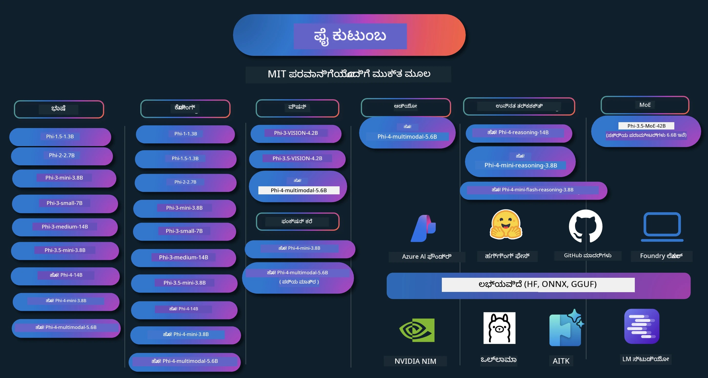

# ಫೈ ಕೂಕುಬುಕ್: ಮೈಕ್ರೋಸಾಫ್ಟ್‌ನ ಫೈ ಮಾದರಿಗಳೊಂದಿಗೆ ಪ್ರಾಯೋಗಿಕ ಉದಾಹರಣೆಗಳು

[](https://codespaces.new/microsoft/phicookbook)
[](https://vscode.dev/redirect?url=vscode://ms-vscode-remote.remote-containers/cloneInVolume?url=https://github.com/microsoft/phicookbook)

[](https://GitHub.com/microsoft/phicookbook/graphs/contributors/?WT.mc_id=aiml-137032-kinfeylo)
[](https://GitHub.com/microsoft/phicookbook/issues/?WT.mc_id=aiml-137032-kinfeylo)
[](https://GitHub.com/microsoft/phicookbook/pulls/?WT.mc_id=aiml-137032-kinfeylo)
[](http://makeapullrequest.com?WT.mc_id=aiml-137032-kinfeylo)

[](https://GitHub.com/microsoft/phicookbook/watchers/?WT.mc_id=aiml-137032-kinfeylo)
[](https://GitHub.com/microsoft/phicookbook/network/?WT.mc_id=aiml-137032-kinfeylo)
[](https://GitHub.com/microsoft/phicookbook/stargazers/?WT.mc_id=aiml-137032-kinfeylo)

[](https://discord.com/invite/ByRwuEEgH4)

ಫೈ ಮೈಕ್ರೋಸಾಫ್ಟ್ ಅಭಿವೃದ್ಧಿಪಡಿಸಿದ ತೆರೆದ ಮೂಲ AI ಮಾದರಿಗಳ ಸರಣಿಯಾಗಿದೆ.

ಫೈ ಪ್ರಸ್ತುತ ಅತ್ಯಂತ ಶಕ್ತಿಶಾಲಿ ಮತ್ತು ವೆಚ್ಚ ಫಲಕೃತ ಸಣ್ಣ ಭಾಷಾ ಮಾದರಿ (SLM), ಬಹುಭಾಷಾ, ತರ್ಕ, ಪಠ್ಯ/ಚಾಟ್ ಉತ್ಪಾದನೆ, ಕೋಡಿಂಗ್, ಚಿತ್ರಗಳು, ಧ್ವನಿ ಮತ್ತು ಇತರ ಸನ್ನಿವೇಶಗಳಲ್ಲಿ ಅತ್ಯುತ್ತಮ ಬेंಚ್ಮಾರ್ಕ್‌ಗಳೊಂದಿಗೆ.

ನೀವು ಫೈನನ್ನು ಮೆಘದಲ್ಲಿ ಅಥವಾ ಎಡ್ಜ್ ಸಾಧನಗಳಲ್ಲಿ ನಿಯೋಜಿಸಬಹುದು, ಮತ್ತು ನೀವು ಕಡಿಮೆ ಗಣನೆ ಶಕ್ತಿಯಿಂದ ಸುಲಭವಾಗಿ ಜನರೇಟಿವ್ AI ಅಪ್ಲಿಕೇಶನ್‌ಗಳನ್ನು ನಿರ್ಮಿಸಬಹುದು.

ಈ ಸಂಪನ್ಮೂಲಗಳನ್ನು ಬಳಸಲು ಪ್ರಾರಂಭಿಸಲು ಈ ಹಂತಗಳನ್ನು ಅನುಸರಿಸಿರಿ:
1. **ರಿಪೊಸಿಟರಿಯನ್ನು ಫೋರ್ಕ್ ಮಾಡಿ**: ಕ್ಲಿಕ್ ಮಾಡಿ [](https://GitHub.com/microsoft/phicookbook/network/?WT.mc_id=aiml-137032-kinfeylo)
2. **ರಿಪೊಸಿಟರಿಯನ್ನು ಕ್ಲೋನ್ ಮಾಡಿ**: `git clone https://github.com/microsoft/PhiCookBook.git`
3. [**Microsoft AI ಡಿಸ್ಕೋರ್ಡ್ ಸಮುದಾಯದಲ್ಲಿ ಸೇರಿ ತಜ್ಞರು ಮತ್ತು ಇತರ ಡೆವಲಪರ್‌ಗಳನ್ನು ಭೇಟಿ ಮಾಡಿ**](https://discord.com/invite/ByRwuEEgH4?WT.mc_id=aiml-137032-kinfeylo)



### 🌐 ಬಹುಭಾಷಾ ಬೆಂಬಲ

#### GitHub ಕ್ರಿಯ-action ಮುಖಾಂತರ ಬೆಂಬಲ (ಸ್ವಯಂಚಾಲಿತ ಮತ್ತು ಸದಾ ನವೀಕೃತ)

<!-- CO-OP TRANSLATOR LANGUAGES TABLE START -->
[ಅರೇಬಿಕ್](../ar/README.md) | [ಬೆಂಗಾಲಿ](../bn/README.md) | [ಬುಲ್ಗೇರ್](../bg/README.md) | [ಮಯಾನ್ಮಾರ್ (ಬರ್ಮೀಸ್)](../my/README.md) | [ಚೀನೀ (ಸರಳೀಕೃತ)](../zh-CN/README.md) | [ಚೀನೀ (ಪಾರಂಪರಿಕ, ಹಾಂಗ್ ಕಾಂಗ್)](../zh-HK/README.md) | [ಚೀನೀ (ಪಾರಂಪರಿಕ, ಮಾಕಾವು)](../zh-MO/README.md) | [ಚೀನೀ (ಪಾರಂಪರಿಕ, ತೈವಾನ್)](../zh-TW/README.md) | [ಕ್ರೊಯೇಷಿಯನ್](../hr/README.md) | [ಚೆಕ್](../cs/README.md) | [ಡೆನಿಶ್](../da/README.md) | [ಡಚ್](../nl/README.md) | [ಎಸ್ಟೋನಿಯನ್](../et/README.md) | [ಫిన్నಿಷ್](../fi/README.md) | [ಫ್ರೆಂಚ್](../fr/README.md) | [ಜರ್ಮನ್](../de/README.md) | [ಗ್ರೀಕ್](../el/README.md) | [ಹೀಬ್ರೂ](../he/README.md) | [ಹಿಂದಿ](../hi/README.md) | [ಹಂಗೇರಿಯನ್](../hu/README.md) | [ಇಂಡೋನೇಶಿಯನ್](../id/README.md) | [ಇಟಾಲಿಯನ್](../it/README.md) | [ಜಪಾನೀಸ್](../ja/README.md) | [ಕನ್ನಡ](./README.md) | [ಕೋರಿಯನ್](../ko/README.md) | [ಲಿಥುನಿಯನ್](../lt/README.md) | [ಮಲಾಯ್](../ms/README.md) | [ಮಲಯಾಳಂ](../ml/README.md) | [ಮರಾಠಿ](../mr/README.md) | [ನೇಪಾಳಿ](../ne/README.md) | [ನೈಜೇರಿಯನ್ ಪಿಡ್ಗಿನ್](../pcm/README.md) | [ನಾರ್ವೇಜಿಯನ್](../no/README.md) | [ಪರ್ಷಿಯನ್ (ಫಾರ್ಸಿ)](../fa/README.md) | [ಪೋಲೆಂಡ್](../pl/README.md) | [ಪೋಷ್ಚುಗೀಸ್ (ಬ್ರೆಜಿಲ್)](../pt-BR/README.md) | [ಪೋಷ್ಚುಗೀಸ್ (ಪೋರ್ಚುಗಲ್)](../pt-PT/README.md) | [ಪುಂಜಾಬಿ (ಗುರ್ಮುಖಿ)](../pa/README.md) | [ರೊಮೇನಿಯನ್](../ro/README.md) | [ರಶಿಯನ್](../ru/README.md) | [ಸರ್ಬಿಯನ್ (ಸಿರಿಲಿಕ್)](../sr/README.md) | [ಸ್ಲೋವಕ್](../sk/README.md) | [ಸ್ಲೋವೇನಿಯನ್](../sl/README.md) | [ಸ್ಪ್ಯಾನಿಷ್](../es/README.md) | [ಸ್ವಾಹಿಲಿ](../sw/README.md) | [ಸ್ವೀಡಿಷ್](../sv/README.md) | [ಟಾಗಲೋಕ್ (ಫಿಲಿಪಿನೋ)](../tl/README.md) | [ತಮಿಳು](../ta/README.md) | [ತೆಲುಗು](../te/README.md) | [ಥಾಯಿ](../th/README.md) | [ಟರ್ಕಿಷ್](../tr/README.md) | [ಉಕ್ರೇನಿಯನ್](../uk/README.md) | [ಉರ್ದು](../ur/README.md) | [ವಿಯೆಟ್ನಾಮೀಸ್](../vi/README.md)

> **ಸ್ಥಳೀಯವಾಗಿ ಕ್ಲೋನ್ ಮಾಡಬೇಕಾ?**
>
> ಈ ರಿಪೊಸಿಟರಿ 50+ ಭಾಷಾ ಭಾಷಾಂತರಗಳನ್ನು ಒಳಗೊಂಡಿದೆ, ಇದು ಡೌನ್‌ಲೋಡ್ ಗಾತ್ರವನ್ನು ಗಮನಾರ್ಹವಾಗಿ ಹೆಚ್ಚಿಸುತ್ತದೆ. ಭಾಷಾಂತರಗಳಿಲ್ಲದೆ ಕ್ಲೋನ್ ಮಾಡಲು sparse checkout ಬಳಸಿ:
>
> **ಬಾಷ್ / macOS / ಲಿನಕ್ಸ್:**
> ```bash
> git clone --filter=blob:none --sparse https://github.com/microsoft/PhiCookBook.git
> cd PhiCookBook
> git sparse-checkout set --no-cone '/*' '!translations' '!translated_images'
> ```
>
> **CMD (ವಿಂಡೋಸ್):**
> ```cmd
> git clone --filter=blob:none --sparse https://github.com/microsoft/PhiCookBook.git
> cd PhiCookBook
> git sparse-checkout set --no-cone "/*" "!translations" "!translated_images"
> ```
>
> ಇದರಿಂದ ಕೋರ್ಸ್ ಪೂರ್ಣಗೊಳಿಸಲು ಅಗತ್ಯವಿರುವ ಎಲ್ಲಾ ವಸ್ತುಗಳು ಬಹಳ ವೇಗದ ಡೌನ್‌ಲೋಡ್‌ಗೆ ಲಭ್ಯವಾಗುತ್ತವೆ.
<!-- CO-OP TRANSLATOR LANGUAGES TABLE END -->

## ವಿಷಯಗಳ ಪಟ್ಟಿ

- ಪರಿಚಯ
  - [ಫೈ ಕುಟುಂಬಕ್ಕೆ ಸ್ವಾಗತ](./md/01.Introduction/01/01.PhiFamily.md)
  - [ನಿಮ್ಮ ಪರಿಸರವನ್ನು ಹೊಂದಿಸಲಾಗುತ್ತಿದೆ](./md/01.Introduction/01/01.EnvironmentSetup.md)
  - [ಪ್ರಮುಖ ತಂತ್ರಜ್ಞಾನಗಳನ್ನು ಅರ್ಥಮಾಡಿಕೊಳ್ಳುವುದು](./md/01.Introduction/01/01.Understandingtech.md)
  - [ಫೈ ಮಾದರಿಗಳಿಗೆ AI ಸುರಕ್ಷತೆ](./md/01.Introduction/01/01.AISafety.md)
  - [ಫೈ ಹಾರ್ಡ್‌ವೇರ್ ಬೆಂಬಲ](./md/01.Introduction/01/01.Hardwaresupport.md)
  - [ಫೈ ಮಾದರಿಗಳು ಮತ್ತು ವೇದಿಕೆಗಳ ಬಗ್ಗೆ ಲಭ್ಯತೆ](./md/01.Introduction/01/01.Edgeandcloud.md)
  - [Guidance-ai ಮತ್ತು ಫೈ ಬಳಕೆ](./md/01.Introduction/01/01.Guidance.md)
  - [GitHub ಮಾರ್ಕೆಟ್ಪ್ಲೇಸ್ ಮಾದರಿಗಳು](https://github.com/marketplace/models)
  - [ಅಜೂರ್ AI ಮಾದರಿ ಕ್ಯಾಟಲಾಗ್](https://ai.azure.com)

- ವಿಭಿನ್ನ ಪರಿಸರದಲ್ಲಿ ಫೈ ಇನ್ಫರೆನ್ಸ್  
    -  [ಹಗ್ಗಿಂಗ್ ಫೇಸ್](./md/01.Introduction/02/01.HF.md)  
    -  [GitHub ಮಾದರಿಗಳು](./md/01.Introduction/02/02.GitHubModel.md)  
    -  [ಅಜೂರ್ AI ಫೌಂಡ್ರಿ ಮಾದರಿ ಕ್ಯಾಟಲಾಗ್](./md/01.Introduction/02/03.AzureAIFoundry.md)  
    -  [ಒಲ್ಲಮಾ](./md/01.Introduction/02/04.Ollama.md)  
    -  [AI ಟೂಲ್ಕಿಟ್ VSCode (AITK)](./md/01.Introduction/02/05.AITK.md)  
    -  [NVIDIA NIM](./md/01.Introduction/02/06.NVIDIA.md)  
    -  [ಫೌಂಡ್ರಿ ಲೊಕಲ್](./md/01.Introduction/02/07.FoundryLocal.md)

- ಫೈ ಕುಟುಂಬದ ಇನ್ಫರೆನ್ಸ್
    - [iOS ನಲ್ಲಿ ಫೈ ಇನ್ಫರೆನ್ಸ್](./md/01.Introduction/03/iOS_Inference.md)
    - [ಆಂಡ್ರಾಯ್ಡ್‌ನಲ್ಲಿ ಫೈ ಇನ್ಫರೆನ್ಸ್](./md/01.Introduction/03/Android_Inference.md)
    - [ಜೆಟ್‌ಸಾನ್‌ನಲ್ಲಿ ಫೈ ಇನ್ಫರೆನ್ಸ್](./md/01.Introduction/03/Jetson_Inference.md)
    - [AI PC ನಲ್ಲಿ ಫೈ ಇನ್ಫರೆನ್ಸ್](./md/01.Introduction/03/AIPC_Inference.md)
    - [ಆಪಲ್ MLX ಫ್ರೇಮ್‌ವರ್ಕ್‌ನೊಂದಿಗೆ ಫೈ ಇನ್ಫರೆನ್ಸ್](./md/01.Introduction/03/MLX_Inference.md)
    - [ಸ್ಥಳೀಯ ಸರ್ವರಿನಲ್ಲಿ ಫೈ ಇನ್ಫರೆನ್ಸ್](./md/01.Introduction/03/Local_Server_Inference.md)
    - [AI ಟೂಲ್ಕಿಟ್ ಬಳಸಿ ದೂರಸ್ಥ ಸರ್ವರಿನಲ್ಲಿ ಫೈ ಇನ್ಫರೆನ್ಸ್](./md/01.Introduction/03/Remote_Interence.md)
    - [ ರಸ್ಟ್ ಜೊತೆಗೆ ಫೈ ಇನ್ಫರೆನ್ಸ್](./md/01.Introduction/03/Rust_Inference.md)
    - [ಸ್ಥಳೀಯರಲ್ಲಿನ ವೀಕ್ಷಣ ಫೈ ಇನ್ಫರೆನ್ಸ್](./md/01.Introduction/03/Vision_Inference.md)
    - [ಕೈಟೋ AKS, ಅಜೂರ್ ಕಂಟೈನರ್‌ಗಳ (ಅಧಿಕೃತ ಬೆಂಬಲ)ೊಂದಿಗೆ ಫೈ ಇನ್ಫರೆನ್ಸ್](./md/01.Introduction/03/Kaito_Inference.md)
-  [ಫೈ ಕುಟುಂಬದ ಪ್ರಮಾಣೀಕರಣ](./md/01.Introduction/04/QuantifyingPhi.md)
    - [llama.cpp ಬಳಸಿ ಫೈ-3.5 / 4 ಪ್ರಮಾಣೀಕರಣ](./md/01.Introduction/04/UsingLlamacppQuantifyingPhi.md)
    - [onnxruntime ಗಾಗಿ ಜನರೇಟಿವ್ AI ವಿಸ್ತರಣೆಗಳೊಂದಿಗೆ ಫೈ-3.5 / 4 ಪ್ರಮಾಣೀಕರಣ](./md/01.Introduction/04/UsingORTGenAIQuantifyingPhi.md)
    - [Intel OpenVINO ಬಳಸಿ ಫೈ-3.5 / 4 ಪ್ರಮಾಣೀಕರಣ](./md/01.Introduction/04/UsingIntelOpenVINOQuantifyingPhi.md)
    - [ಆಪಲ್ MLX ಫ್ರೇಮ್‌ವರ್ಕ್ ಬಳಸಿ ಫೈ-3.5 / 4 ಪ್ರಮಾಣೀಕರಣ](./md/01.Introduction/04/UsingAppleMLXQuantifyingPhi.md)

-  ಫೈ ಮೌಲ್ಯಮಾಪನ  
    - [ಉತ್ತರದಾಯಕ AI](./md/01.Introduction/05/ResponsibleAI.md)  
    - [ಅಜೂರು AI ಫೌಂಡ್ರೀ ಮೂಲಕ ಮೌಲ್ಯಮಾಪನ](./md/01.Introduction/05/AIFoundry.md)  
    - [ಮೌಲ್ಯಮಾಪನಕ್ಕಾಗಿ ಪ್ರಾಂಪ್ಟ್‌ಫ್ಲೋ ಬಳಕೆ](./md/01.Introduction/05/Promptflow.md)
 
- ಅಜೂರ AI ಶೋಧನೊಂದಿಗೆ RAG
    - [Phi-4-mini ಮತ್ತು Phi-4-multimodal(RAG) ಅನ್ನು ಅಜೂರ AI ಶೋಧನೊಂದಿಗೆ ಹೇಗೆ ಬಳಕೆ ಮಾಡುವುದು](https://github.com/microsoft/PhiCookBook/blob/main/code/06.E2E/E2E_Phi-4-RAG-Azure-AI-Search.ipynb)

- Phi ಅಪ್ಲಿಕೇಶನ್ ಅಭಿವೃದ್ಧಿ ಮಾದರಿಗಳು
  - ಪಠ್ಯ ಮತ್ತು ಚಾಟ್ ಅಪ್ಲಿಕೇಶನ್‌ಗಳು
    - Phi-4 ಮಾದರಿಗಳು 🆕
      - [📓] [Phi-4-mini ONNX ಮಾದರಿಯೊಂದಿಗೆ ಚಾಟ್](./md/02.Application/01.TextAndChat/Phi4/ChatWithPhi4ONNX/README.md)
      - [स्थानीय ONNX ಮಾದರಿಯೊಂದಿಗೆ Phi-4 ಚಾಟ್ .NET](../../md/04.HOL/dotnet/src/LabsPhi4-Chat-01OnnxRuntime)
      - [Semantic Kernel ಬಳಸಿ Phi-4 ONNX ಜೊತೆ .NET ಕಾನ್ಸೋಲ್ ಅಪ್ಲಿಕೇಶನ್ ಚಾಟ್](../../md/04.HOL/dotnet/src/LabsPhi4-Chat-02SK)
    - Phi-3 / 3.5 ಮಾದರಿಗಳು  
      - [Phi3, ONNX ರಂಟೈಮ್ ವೆಬ್ ಮತ್ತು WebGPU ಬಳಸಿ ಬ್ರೌಸರ್‌ನಲ್ಲಿ ಸ್ಥಳೀಯ ಚಾಟ್‌ಬಾಟ್](https://github.com/microsoft/onnxruntime-inference-examples/tree/main/js/chat)
      - [OpenVino ಚಾಟ್](./md/02.Application/01.TextAndChat/Phi3/E2E_OpenVino_Chat.md)
      - [ಮಲ್ಟಿ ಮಾದರಿ - ಇಂಟರೆಕ್ಟಿವ್ ಫೈ-3-ಮಿನಿ ಮತ್ತು OpenAI ವಿಸ್‌ಪರ್](./md/02.Application/01.TextAndChat/Phi3/E2E_Phi-3-mini_with_whisper.md)
      - [MLFlow - ರ್ಯಾಪರ್ ನಿರ್ಮಿಸುವಿಕೆ ಮತ್ತು Phi-3 ಅನ್ನು MLFlow ಜೊತೆಗೆ ಬಳಸಿ](./md//02.Application/01.TextAndChat/Phi3/E2E_Phi-3-MLflow.md)
      - [ಮਾਡಲ್ ಗಡಿಬಿಡಿ - Phi-3-ಮಿನ್ ಮಾದರಿಯನ್ನು ONNX ರನ್‌టೈಮ್ ವೆಬ್‌ಗಾಗಿ ಎಷ್ಟು ಚೆನ್ನಾಗಿಸಬೇಕು Olive ಬಳಸಿ](https://github.com/microsoft/Olive/tree/main/examples/phi3)
      - [Phi-3 ಮಿನಿ-4k-ಇನ್‌ಸ್ಟ್ರಕ್ಟ್-onnx ಅನ್ನು ಬಳಸಿ WinUI3 ಆಪ್](https://github.com/microsoft/Phi3-Chat-WinUI3-Sample/)
      -[WinUI3 ಮಲ್ಟಿ ಮಾದರಿ AI ಪವರ್ಡ್ ನೋಟ್ಸ್ ಆಪ್ ಉದಾಹರಣೆ](https://github.com/microsoft/ai-powered-notes-winui3-sample)
      - [ಪ್ರಾಂಪ್ಟ್ ಫ್ಲೋ ಬಳಸಿ ಕಸ್ಟಮ್ Phi-3 ಮಾದರಿಗಳನ್ನು ಸೂಕ್ಷ್ಮಸಂಸ್ಕರಿಸಿ ಮತ್ತು ಏಕೀಕೃತಗೊಳಿಸಿ](./md/02.Application/01.TextAndChat/Phi3/E2E_Phi-3-FineTuning_PromptFlow_Integration.md)
      - [ಆಜೂರ್ AI ಫೌಂಡ್ರಿಯಲ್ಲಿ ಪ್ರಾಂಪ್ಟ್ ಫ್ಲೋ ಬಳಸಿ ಕಸ್ಟಮ್ Phi-3 ಮಾದರಿಗಳನ್ನು ಸೂಕ್ಷ್ಮಸಂಸ್ಕರಿಸಿ ಮತ್ತು ಏಕೀಕೃತಗೊಳಿಸಿ](./md/02.Application/01.TextAndChat/Phi3/E2E_Phi-3-FineTuning_PromptFlow_Integration_AIFoundry.md)
      - [ಮೈಕ್ರೊಸಾಫ್ಟ್ ಜವಾಬ್ದಾರಿಯ AI ತತ್ವಗಳ ಮೇಲೆ ಕೇಂದ್ರೀಕರಿಸಿ ಆಜೂರ್ AI ಫೌಂಡ್ರಿಯಲ್ಲಿ ಸೂಕ್ಷ್ಮಸಂಸ್ಕರಿಸಿದ Phi-3 / Phi-3.5 ಮಾದರಿಯನ್ನು ಅಂಕಿಅಂಶಗೊಳಿಸಿ](./md/02.Application/01.TextAndChat/Phi3/E2E_Phi-3-Evaluation_AIFoundry.md)
      - [📓] [Phi-3.5-ಮಿನಿ-ಇನ್‌ಸ್ಟ್ರಕ್ಟ್ ಭಾಷಾ ಭವಿಷ್ಯದ ಮಾದರಿ (ಚೈನೀಸ್/ಇಂಗ್ಲಿಷ್)](./md/02.Application/01.TextAndChat/Phi3/phi3-instruct-demo.ipynb)
      - [Phi-3.5-ಇನ್‌ಸ್ಟ್ರಕ್ಟ್ ವೆಬ್GPU RAG ಚಾಟ್‌ಬಾಟ್](./md/02.Application/01.TextAndChat/Phi3/WebGPUWithPhi35Readme.md)
      - [Windows GPU ಬಳಸಿ Phi-3.5-ಇನ್‌ಸ್ಟ್ರಕ್ಟ್ ONNX ಜೊತೆ ಪ್ರಾಂಪ್ಟ್ ಫ್ಲೋ ಪರಿಹಾರವನ್ನು ರಚಿಸುವ ವಿಧಾನ](./md/02.Application/01.TextAndChat/Phi3/UsingPromptFlowWithONNX.md)
      - [ಐಸ್ ಕಲಾನುಷ್ಠಾನ ಬಳಸಿ Phi-3.5 tflite ಮೂಲಕ ಆಂಡ್ರಾಯ್ಡ್ ಆಪ್ ರಚಿಸುವುದು](./md/02.Application/01.TextAndChat/Phi3/UsingPhi35TFLiteCreateAndroidApp.md)
      - [ನೋಟ್ & ಉತ್ತರ .NET ಉದಾಹರಣೆ ಸ್ಥಳೀಯ ONNX Phi-3 ಮಾದರಿ Microsoft.ML.OnnxRuntime ಬಳಸಿ](../../md/04.HOL/dotnet/src/LabsPhi301)
      - [ಕನ್ಸೋಲ್ ಚಾಟ್ .NET ಆಪ್ Semantic Kernel ಮತ್ತು Phi-3 ಜೊತೆಗೆ](../../md/04.HOL/dotnet/src/LabsPhi302)

  - ಆಜೂರ್ AI ಇನ್ಫರೆನ್ಸ್ SDK ಕೋಡ್ ಆಧಾರಿತ ಮಾದರಿಗಳು 
    - Phi-4 ಮಾದರಿಗಳು 🆕
      - [📓] [Phi-4-ಮಲ್ಟಿಮೋಡಲ್ ಬಳಸಿ ಪ್ರಾಜೆಕ್ಟ್ ಕೋಡ್ ರಚಿಸಿ](./md/02.Application/02.Code/Phi4/GenProjectCode/README.md)
    - Phi-3 / 3.5 ಮಾದರಿಗಳು
      - [ನಿಮ್ಮದೇ Visual Studio Code GitHub Copilot ಚಾಟ್ Microsoft Phi-3 ಕುಟುಂಬ ಬಳಸಿ ನಿರ್ಮಿಸಿ](./md/02.Application/02.Code/Phi3/VSCodeExt/README.md)
      - [Phi-3.5 ಬಳಸಿ GitHub ಮಾದರಿಗಳೊಂದಿಗೆ ನಿಮ್ಮದೇ Visual Studio Code ಚಾಟ್ ಕೋಪಿಲಟ್ ಏಜೆಂಟ್ ರಚಿಸಿ](/md/02.Application/02.Code/Phi3/CreateVSCodeChatAgentWithGitHubModels.md)

  - ಆಧುನಿಕ ತರ್ಕ ಮಾದರಿಗಳು
    - Phi-4 ಮಾದರಿಗಳು 🆕
      - [📓] [Phi-4-ಮಿನಿ-ತರ್ಕ ಅಥವಾ Phi-4-ತರ್ಕ ಮಾದರಿಗಳು](./md/02.Application/03.AdvancedReasoning/Phi4/AdvancedResoningPhi4mini/README.md)
      - [📓] [Microsoft Olive ಬಳಸಿ Phi-4-ಮಿನಿ-ತರ್ಕ ಸೂಕ್ಷ್ಮಸಂಸ್ಕರಣೆ](./md/02.Application/03.AdvancedReasoning/Phi4/AdvancedResoningPhi4mini/olive_ft_phi_4_reasoning_with_medicaldata.ipynb)
      - [📓] [Apple MLX ಬಳಸಿ Phi-4-ಮಿನಿ-ತರ್ಕ ಸೂಕ್ಷ್ಮಸಂಸ್ಕರಣೆ](./md/02.Application/03.AdvancedReasoning/Phi4/AdvancedResoningPhi4mini/mlx_ft_phi_4_reasoning_with_medicaldata.ipynb)
      - [📓] [GitHub ಮಾದರಿಗಳೊಂದಿಗೆ Phi-4-ಮಿನಿ-ತರ್ಕ](./md/02.Application/02.Code/Phi4r/github_models_inference.ipynb)
      - [📓] [ಆಜೂರ್ AI ಫೌಂಡ್ರಿ ಮಾದರಿಗಳೊಂದಿಗೆ Phi-4-ಮಿನಿ-ತರ್ಕ](./md/02.Application/02.Code/Phi4r/azure_models_inference.ipynb)
  - ಡೆಮೋಗಳು
      - [Phi-4-ಮಿನಿ ಡೆಮೋಗಳು Hugging Face Spaces ನಲ್ಲಿ ಹೋಸ್ಟ್ ಮಾಡಲಾಗಿದೆ](https://huggingface.co/spaces/microsoft/phi-4-mini?WT.mc_id=aiml-137032-kinfeylo)
      - [Phi-4-ಮಲ್ಟಿಮೋಡಲ್ ಡೆಮೋಗಳು Hugginge Face Spaces ನಲ್ಲಿ ಹೋಸ್ಟ್ ಮಾಡಿಸಲಾಗಿದೆ](https://huggingface.co/spaces/microsoft/phi-4-multimodal?WT.mc_id=aiml-137032-kinfeylo)
  - ದೃಶ್ಯ ಮಾದರಿಗಳು
    - Phi-4 ಮಾದರಿಗಳು 🆕
      - [📓] [Phi-4-ಮಲ್ಟಿಮೋಡಲ್ ಬಳಸಿ ಚಿತ್ರಗಳನ್ನು ಓದಿ ಕೋಡ್ ರಚಿಸಿ](./md/02.Application/04.Vision/Phi4/CreateFrontend/README.md) 
    - Phi-3 / 3.5 ಮಾದರಿಗಳು
      -  [📓][Phi-3-ದೃಶ್ಯ-ಚಿತ್ರ ಪಠ್ಯದಿಂದ ಪಠ್ಯಕ್ಕೆ](./md/02.Application/04.Vision/Phi3/E2E_Phi-3-vision-image-text-to-text-online-endpoint.ipynb)
      - [Phi-3-ದೃಶ್ಯ-ONNX](https://onnxruntime.ai/docs/genai/tutorials/phi3-v.html)
      - [📓][Phi-3-ದೃಶ್ಯ CLIP ಎम्बೆಡ್ಡಿಂಗ್](./md/02.Application/04.Vision/Phi3/E2E_Phi-3-vision-image-text-to-text-online-endpoint.ipynb)
      - [ಡೆಮೋ: Phi-3 ರಿಸೈಕ್ಲಿಂಗ್](https://github.com/jennifermarsman/PhiRecycling/)
      - [Phi-3-ದೃಶ್ಯ - ದೃಶ್ಯ ಭಾಷಾ ಸಹಾಯಕ - Phi3-ದೃಶ್ಯ ಮತ್ತು OpenVINO ಜೊತೆಗೆ](https://docs.openvino.ai/nightly/notebooks/phi-3-vision-with-output.html)
      - [Phi-3 ದೃಶ್ಯ Nvidia NIM](./md/02.Application/04.Vision/Phi3/E2E_Nvidia_NIM_Vision.md)
      - [Phi-3 ದೃಶ್ಯ OpenVino](./md/02.Application/04.Vision/Phi3/E2E_OpenVino_Phi3Vision.md)
      - [📓][Phi-3.5 ದೃಶ್ಯ ಬಹು-ಫ್ರೇಮ್ ಅಥವಾ ಬಹು-ಚಿತ್ರ ಮಾದರಿ](./md/02.Application/04.Vision/Phi3/phi3-vision-demo.ipynb)
      - [Phi-3 ದೃಶ್ಯ ಸ್ಥಳೀಯ ONNX ಮಾದರಿ Microsoft.ML.OnnxRuntime .NET ಬಳಸಿ](../../md/04.HOL/dotnet/src/LabsPhi303)
      - [ಮೆನು ಆಧಾರಿತ Phi-3 ದೃಶ್ಯ ಸ್ಥಳೀಯ ONNX ಮಾದರಿ Microsoft.ML.OnnxRuntime .NET ಬಳಸಿ](../../md/04.HOL/dotnet/src/LabsPhi304)

  - ಗಣಿತ ಮಾದರಿಗಳು
    -  Phi-4-ಮಿನಿ-ಫ್ಲಾಷ್-ತರ್ಕ-ಇನ್‌ಸ್ಟ್ರಕ್ಟ್ ಮಾದರಿಗಳು 🆕 [Phi-4-ಮಿನಿ-ಫ್ಲಾಷ್-ತರ್ಕ-ಇನ್‌ಸ್ಟ್ರಕ್ಟ್ ಜೊತೆ ಗಣಿತ ಡೆಮೋ](./md/02.Application/09.Math/MathDemo.ipynb)

  - ಧ್ವನಿ ಮಾದರಿಗಳು
    - Phi-4 ಮಾದರಿಗಳು 🆕
      - [📓] [Phi-4-ಮಲ್ಟಿಮೋಡಲ್ ಬಳಸಿ ಧ್ವನಿ ವರ್ಣನಗಳನ್ನು ತಳ್ಳುವುದು](./md/02.Application/05.Audio/Phi4/Transciption/README.md)
      - [📓] [Phi-4-ಮಲ್ಟಿಮೋಡಲ್ ಧ್ವನಿ ಮಾದರಿ](./md/02.Application/05.Audio/Phi4/Siri/demo.ipynb)
      - [📓] [Phi-4-ಮಲ್ಟಿಮೋಡಲ್ ಧ್ವನಿ ಭಾಷಾಂತರ ಮಾದರಿ](./md/02.Application/05.Audio/Phi4/Translate/demo.ipynb)
      - [.NET ಕನ್ಸೋಲ್ ಅಪ್ಲಿಕೇಶನ್ Phi-4-ಮಲ್ಟಿಮೋಡಲ್ ಧ್ವನಿ ಬಳಸಿ ಧ್ವನಿ ಕಡತ ವಿಶ್ಲೇಷಿಸಿ ವರ್ಣನ ತಯಾರಿಸುವುದು](../../md/04.HOL/dotnet/src/LabsPhi4-MultiModal-02Audio)

  - MOE ಮಾದರಿಗಳು
    - Phi-3 / 3.5 ಮಾದರಿಗಳು
      - [📓] [Phi-3.5 ತಜ್ಞರ ಮಿಶ್ರಣ (MoEs) ಸಾಮಾಜಿಕ ಮಾಧ್ಯಮ ಮಾದರಿ](./md/02.Application/06.MoE/Phi3/phi3_moe_demo.ipynb)
      - [📓] [NVIDIA NIM Phi-3 MOE, ಆಜೂರ್ AI ಹುಡುಕು ಮತ್ತು LlamaIndex ಹೊಂದಿರುವ Retrieval-Augmented Generation (RAG) ಪೈಪ್ಲೈನ್ ನಿರ್ಮಾಣ](./md/02.Application/06.MoE/Phi3/azure-ai-search-nvidia-rag.ipynb)
      - 
  - ಫಂಕ್ಷನ್ ಕರೆ ಮಾದರಿಗಳು
    - Phi-4 ಮಾದರಿಗಳು 🆕
      -  [📓] [Phi-4-ಮಿನಿ ಜೊತೆಗೆ ಫಂಕ್ಷನ್ ಕರೆ ಬಳಸುವುದು](./md/02.Application/07.FunctionCalling/Phi4/FunctionCallingBasic/README.md)
      -  [📓] [Phi-4-ಮಿನಿ ಬಳಸಿ ಬಹು-ಏಜೆಂಟ್‌ಗಳನ್ನು ರಚಿಸಲು ಫಂಕ್ಷನ್ ಕರೆ ಬಳಸುವುದು](./md/02.Application/07.FunctionCalling/Phi4/Multiagents/Phi_4_mini_multiagent.ipynb)
      -  [📓] [Ollama ಜೊತೆ ಫಂಕ್ಷನ್ ಕರೆ ಬಳಸು](./md/02.Application/07.FunctionCalling/Phi4/Ollama/ollama_functioncalling.ipynb)
      -  [📓] [ONNX ಜೊತೆಗೆ ಫಂಕ್ಷನ್ ಕರೆ ಬಳಸು](./md/02.Application/07.FunctionCalling/Phi4/ONNX/onnx_parallel_functioncalling.ipynb)
  - ಮಲ್ಟಿಮೋಡಲ್ ಮಿಶ್ರಣ ಮಾದರಿಗಳು
    - Phi-4 ಮಾದರಿಗಳು 🆕
      -  [📓] [ತಂತ್ರಜ್ಞಾನ ಪತ್ರಕರ್ತನಾಗಿ Phi-4-ಮಲ್ಟಿಮೋಡಲ್ ಬಳಸು](./md/02.Application/08.Multimodel/Phi4/TechJournalist/phi_4_mm_audio_text_publish_news.ipynb)
      - [.NET ಕನ್ಸೋಲ್ ಅಪ್ಲಿಕೇಶನ್ Phi-4-ಮಲ್ಟಿಮೋಡಲ್ ಬಳಸಿ ಚಿತ್ರಗಳನ್ನು ವಿಶ್ಲೇಷಿಸುವುದು](../../md/04.HOL/dotnet/src/LabsPhi4-MultiModal-01Images)

- Phi ಮಾದರಿಗಳ ಸೂಕ್ಷ್ಮಸಂಸ್ಕರಣೆ
  - [ಸೂಕ್ಷ್ಮಸಂಸ್ಕರಣೆ ಸಂದರ್ಭಗಳು](./md/03.FineTuning/FineTuning_Scenarios.md)
  - [ಸೂಕ್ಷ್ಮಸಂಸ್ಕರಣೆ ಮತ್ತು RAG ನಡುವೆ ವ್ಯತ್ಯಾಸ](./md/03.FineTuning/FineTuning_vs_RAG.md)
  - [Phi-3 ಅನ್ನು ಕೈಗಾರಿಕಾ ತಜ್ಞನಾಗಿಸಲು ಸೂಕ್ಷ್ಮಸಂಸ್ಕರಣೆ](./md/03.FineTuning/LetPhi3gotoIndustriy.md)
  - [VS ಕೋಡ್ AI ಟೂಲ್ಕಿಟ್ ಬಳಸಿ Phi-3 ಸೂಕ್ಷ್ಮಸಂಸ್ಕರಣೆ](./md/03.FineTuning/Finetuning_VSCodeaitoolkit.md)
  - [ಆಜೂರ್ ಮಶೀನ್ ಲರ್ನಿಂಗ್ ಸೇವೆ ಬಳಸಿ Phi-3 ಸೂಕ್ಷ್ಮಸಂಸ್ಕರಣೆ](./md/03.FineTuning/Introduce_AzureML.md)
  - [Lora ಬಳಸಿ Phi-3 ಸೂಕ್ಷ್ಮಸಂಸ್ಕರಣೆ](./md/03.FineTuning/FineTuning_Lora.md)
  - [QLora ಬಳಸಿ Phi-3 ಸೂಕ್ಷ್ಮಸಂಸ್ಕರಣೆ](./md/03.FineTuning/FineTuning_Qlora.md)
  - [ಆಜೂರ್ AI ಫೌಂಡ್ರಿ ಬಳಸಿ Phi-3 ಸೂಕ್ಷ್ಮಸಂಸ್ಕರಣೆ](./md/03.FineTuning/FineTuning_AIFoundry.md)
  - [ಆಜೂರ್ ML CLI/SDK ಬಳಸಿ Phi-3 ಸೂಕ್ಷ್ಮಸಂಸ್ಕರಣೆ](./md/03.FineTuning/FineTuning_MLSDK.md)
  - [Microsoft Olive ಬಳಸಿ ಸೂಕ್ಷ್ಮಸಂಸ್ಕರಣೆ](./md/03.FineTuning/FineTuning_MicrosoftOlive.md)
  - [Microsoft Olive ಹ್ಯಾಂಡ್ಸ್-ಆನ್ ಲ್ಯಾಬ್](./md/03.FineTuning/olive-lab/readme.md)
  - [Weights and Bias ಬಳಸಿ Phi-3-ದೃಶ್ಯ ಸೂಕ್ಷ್ಮಸಂಸ್ಕರಣೆ](./md/03.FineTuning/FineTuning_Phi-3-visionWandB.md)
  - [Apple MLX ಫ್ರೇಮ್ವರ್ಕ್ ಬಳಸಿ Phi-3 ಸೂಕ್ಷ್ಮಸಂಸ್ಕರಣೆ](./md/03.FineTuning/FineTuning_MLX.md)
  - [Phi-3-ದೃಶ್ಯ ಸೂಕ್ಷ್ಮಸಂಸ್ಕರಣೆ (ಸರ್ಕಾರಿ ಬೆಂಬಲ)](./md/03.FineTuning/FineTuning_Vision.md)
  - [Kaito AKS, ಆಜೂರ್ ಕಂಟೈನರ್‌ಗಳು (ಸರ್ಕಾರಿ ಬೆಂಬಲ) Phi-3 ಸೂಕ್ಷ್ಮಸಂಸ್ಕರಣೆ](./md/03.FineTuning/FineTuning_Kaito.md)
  - [Phi-3 ಮತ್ತು 3.5 ದೃಶ್ಯ ಸೂಕ್ಷ್ಮಸಂಸ್ಕರಣೆ](https://github.com/2U1/Phi3-Vision-Finetune)

- ಹ್ಯಾಂಡ್ಸ್ ಆನ್ ಲ್ಯಾಬ್
  - [ಸುತ್ತಿ ಹೊಸ ಮಾದರಿಗಳನ್ನು ಅನ್ವೇಷಿಸುತ್ತಿದೆ: LLM, SLM, ಸ್ಥಳೀಯ ಡೆವಲಪ್ ಮತ್ತು ಇನ್ನಷ್ಟು](https://github.com/microsoft/aitour-exploring-cutting-edge-models)
  - [NLP ಸಾಮರ್ಥ್ಯ ಅನ್ಲಾಕ್ ಮಾಡುವುದು: Microsoft Olive ಜೊತೆಗೆ ಸೂಕ್ಷ್ಮಸಂಸ್ಕರಣೆ](https://github.com/azure/Ignite_FineTuning_workshop)
- ಶೈಕ್ಷಣಿಕ ಅಧ್ಯಯನ ಪ್ರಬಂಧಗಳು ಮತ್ತು ಪ್ರಕಟಣೆಗಳು
  - [ಪಠ್ಯಪುಸ್ತಕಗಳು ನಿಮಗೆ ಬೇಕಾದವಷ್ಟೇ II: phi-1.5 ತಾಂತ್ರಿಕ ವರದಿ](https://arxiv.org/abs/2309.05463)
  - [Phi-3 ತಾಂತ್ರಿಕ ವರದಿ: ನಿಮ್ಮ ಫೋನಿನಲ್ಲಿ ಸ್ಥಳೀಯವಾಗಿ ಅತ್ಯಂತ ಸಾಮರ್ಥ್ಯವಂತ ಭಾಷಾ ಮಾದರಿ](https://arxiv.org/abs/2404.14219)
  - [Phi-4 ತಾಂತ್ರಿಕ ವರದಿ](https://arxiv.org/abs/2412.08905)
  - [Phi-4-ಮಿನಿ ತಾಂತ್ರಿಕ ವರದಿ: ಮಿಶ್ರಣ-ಆಫ್-ಲೊರಾಸ್ ಮೂಲಕ ಸಂಕ್ಷಿಪ್ತ ಆದರೆ ಸಾಮರ್ಥ್ಯವಂತ ಬಹುಮಾದರಿ ಭಾಷಾ ಮಾದರಿಗಳು](https://arxiv.org/abs/2503.01743)
  - [ವಾಹನದೊಳಗಿನ ಕಾರ್ಯ ಆಯ್ಕೆಗಾಗಿ ಸಣ್ಣ ಭಾಷಾ ಮಾದರಿಗಳನ್ನು ಉತ್ತಮಗೊಳಿಸುವಿಕೆ](https://arxiv.org/abs/2501.02342)
  - [(ಎಂದೇಯಾಕೆPHI) ಪಿಎಚ್‌ಐ-3 ಅನ್ನು ಬಹು ಆಯ್ಕೆ ಪ್ರಶ್ನೋತ್ತರಕ್ಕಾಗಿ ನಿಖರೀಕೃತಗೊಳಿಸುವಿಕೆ: ವಿಧಾನಶಾಸ್ತ್ರ, ಫಲಿತಾಂಶಗಳು ಮತ್ತು ಸವಾಲುಗಳು](https://arxiv.org/abs/2501.01588)
  - [Phi-4-ಕಾರಣಸಾಮರ್ಥ್ಯ ತಾಂತ್ರಿಕ ವರದಿ](https://www.microsoft.com/en-us/research/wp-content/uploads/2025/04/phi_4_reasoning.pdf)
  - [Phi-4-ಮಿನಿ-ಕಾರಣಸಾಮರ್ಥ್ಯ ತಾಂತ್ರಿಕ ವರದಿ](https://huggingface.co/microsoft/Phi-4-mini-reasoning/blob/main/Phi-4-Mini-Reasoning.pdf)

## ಫೈ ಮಾದರಿಗಳ ಬಳಕೆ

### Microsoft Foundry ನಲ್ಲಿ ಫೈ

ನೀವು ಮೈಕ್ರೋಸಾಫ್ಟ್ ಫೈ ಅನ್ನು ಹೇಗೆ ಬಳಸುವುದು ಮತ್ತು ವಿವಿಧ ಹಾರ್ಡ್‌ವೇರ್ ಸಾಧನಗಳಲ್ಲಿ ಕೊನೆಗೆ ಅಂತಿಮ ಪರಿಹಾರಗಳನ್ನು ನಿರ್ಮಿಸುವುದನ್ನು ತಿಳಿಯಬಹುದು. ನೇರವಾಗಿ ಫೈ ಅನ್ನು ಅನುಭವಿಸಲು, ಮಾದರಿಗಳೊಂದಿಗೆ ಆಟವಾಡಿ ಮತ್ತು ನಿಮ್ಮ ಸಂದರ್ಭಗಳಿಗೆ ಫೈಯನ್ನು ಕಸ್ಟಮೈಸ್ ಮಾಡಿ [Microsoft Foundry Azure AI Model Catalog](https://aka.ms/phi3-azure-ai)ಸಂದರ್ಶಿಸಿ; [Microsoft Foundry](/md/02.QuickStart/AzureAIFoundry_QuickStart.md) ನಲ್ಲಿ ಪ್ರಾರಂಭಿಸಲು ಹೆಚ್ಚಾದ ತಿಳಿವಳಿಕೆ ಪಡೆಯಿರಿ.

**ಆಟದ ಮೈದಾನ**
ಪ್ರತಿ ಮಾದರಿಗೂ ಒಂದು ಬಿಂಧುಗೊಳಿಸುವ ಆಶ್ರಿತ ಆಟದ ಮೈದಾನವಿದೆ [Azure AI Playground](https://aka.ms/try-phi3).

### GitHub Models ನಲ್ಲಿ ಫೈ

ನೀವು ಮೈಕ್ರೋಸಾಫ್ಟ್ ಫೈ ಅನ್ನು ಹೇಗೆ ಬಳಸುವುದು ಮತ್ತು ನಿಮ್ಮ ವಿವಿಧ ಉಪಕರಣಗಳಲ್ಲಿ ಕೊನೆಗೆ ಅಂತಿಮ ಪರಿಹಾರಗಳನ್ನು ಹೇಗೆ ನಿರ್ಮಿಸುವುದನ್ನು ತಿಳಿಯಬಹುದು. ನೇರವಾಗಿ ಫೈ ಅನ್ನು ಅನುಭವಿಸಲು, ಮಾದರಿಯೊಂದಿಗೆ ಆಟವಾಡಿ ಮತ್ತು ನಿಮ್ಮ ಸಂದರ್ಭಗಳಿಗೆ ಫೈಯನ್ನು ಕಸ್ಟಮೈಸ್ ಮಾಡಿ [GitHub Model Catalog](https://github.com/marketplace/models?WT.mc_id=aiml-137032-kinfeylo) ಬಳಸಿ; [GitHub Model Catalog](/md/02.QuickStart/GitHubModel_QuickStart.md) ನಲ್ಲಿ ಪ್ರಾರಂಭಿಸಲು ಹೆಚ್ಚಿನ ತಿಳಿವಳಿಕೆ ಪಡೆಯಿರಿ.

**ಆಟದ ಮೈದಾನ**
ಪ್ರತಿ ಮಾದರಿಗೂ ಪರೀಕ್ಷಿಸಲು ವಿಶೇಷ [ಆಟದ ಮೈದಾನವಿದೆ](/md/02.QuickStart/GitHubModel_QuickStart.md).

### Hugging Face ನಲ್ಲಿ ಫೈ

ನೀವು ಈ ಮಾದರಿಯನ್ನು [Hugging Face](https://huggingface.co/microsoft) ನಲ್ಲಿ ಕೂಡಾ ಹುಡುಕಬಹುದು

**ಆಟದ ಮೈದಾನ**
[Hugging Chat ಆಟದ ಮೈದಾನ](https://huggingface.co/chat/models/microsoft/Phi-3-mini-4k-instruct)

## 🎒 ಇತರೆ ಕೋರ್ಸುಗಳು

ನಮ್ಮ ತಂಡವು ಇತರೆ ಕೋರ್ಸುಗಳನ್ನು ಸೃಷ್ಟಿಸುತ್ತದೆ! ಪರಿಶೀಲಿಸಿ:

<!-- CO-OP TRANSLATOR OTHER COURSES START -->
### ಲ್ಯಾಂಚ್‌ಚೈನ್
[](https://aka.ms/langchain4j-for-beginners)
[](https://aka.ms/langchainjs-for-beginners?WT.mc_id=m365-94501-dwahlin)
[](https://github.com/microsoft/langchain-for-beginners?WT.mc_id=m365-94501-dwahlin)
---

### ಅಜ್ಯೂರ್ / ಎಡ್ಜ್ / MCP / ಏಜೆಂಟ್ಸ್
[](https://github.com/microsoft/AZD-for-beginners?WT.mc_id=academic-105485-koreyst)
[](https://github.com/microsoft/edgeai-for-beginners?WT.mc_id=academic-105485-koreyst)
[](https://github.com/microsoft/mcp-for-beginners?WT.mc_id=academic-105485-koreyst)
[](https://github.com/microsoft/ai-agents-for-beginners?WT.mc_id=academic-105485-koreyst)

---

### ಉತ್ಪಾದಕ ಎಐ ಸರಣಿ
[](https://github.com/microsoft/generative-ai-for-beginners?WT.mc_id=academic-105485-koreyst)
[-9333EA?style=for-the-badge&labelColor=E5E7EB&color=9333EA)](https://github.com/microsoft/Generative-AI-for-beginners-dotnet?WT.mc_id=academic-105485-koreyst)
[-C084FC?style=for-the-badge&labelColor=E5E7EB&color=C084FC)](https://github.com/microsoft/generative-ai-for-beginners-java?WT.mc_id=academic-105485-koreyst)
[-E879F9?style=for-the-badge&labelColor=E5E7EB&color=E879F9)](https://github.com/microsoft/generative-ai-with-javascript?WT.mc_id=academic-105485-koreyst)

---

### ಕೋರ್ ಲರ್ನಿಂಗ್
[](https://aka.ms/ml-beginners?WT.mc_id=academic-105485-koreyst)
[](https://aka.ms/datascience-beginners?WT.mc_id=academic-105485-koreyst)
[](https://aka.ms/ai-beginners?WT.mc_id=academic-105485-koreyst)
[](https://github.com/microsoft/Security-101?WT.mc_id=academic-96948-sayoung)
[](https://aka.ms/webdev-beginners?WT.mc_id=academic-105485-koreyst)
[](https://aka.ms/iot-beginners?WT.mc_id=academic-105485-koreyst)
[](https://github.com/microsoft/xr-development-for-beginners?WT.mc_id=academic-105485-koreyst)

---

### ಕೋಪೈಲಟ್ ಸರಣಿ
[](https://aka.ms/GitHubCopilotAI?WT.mc_id=academic-105485-koreyst)
[](https://github.com/microsoft/mastering-github-copilot-for-dotnet-csharp-developers?WT.mc_id=academic-105485-koreyst)
[](https://github.com/microsoft/CopilotAdventures?WT.mc_id=academic-105485-koreyst)
<!-- CO-OP TRANSLATOR OTHER COURSES END -->

## ಜವಾಬ್ದಾರಿಯಾದ AI

ಮೈಕ್ರೋಸಾಫ್ಟ್ ನಮ್ಮ ಗ್ರಾಹಕರು ನಮ್ಮ AI ಉತ್ಪನ್ನಗಳನ್ನು ಜವಾಬ್ದಾರಿಯುತವಾಗಿ ಬಳಸಲು ಸಹಾಯ ಮಾಡುವುದಕ್ಕೆ, ನಮ್ಮ ಕಲಿಕೆಗಳನ್ನು ಹಂಚಿಕೊಳ್ಳಲು ಮತ್ತು ಟ್ರಾನ್ಸ್‌ಪೇರೆನ್ಸಿ ನೋಟ್ಸ್ ಮತ್ತು ಪ್ರಭಾವ ಮೌಲ್ಯಮಾಪನಗಳಂತಹ ಉಪಕರಣಗಳ ಮೂಲಕ ನಂಬಿಕೆ ಆಧಾರಿತ ಭಾಗ್ಯತೆಯನ್ನು ನಿರ್ಮಿಸುವುದಕ್ಕೆ ಬದ್ಧವಾಗಿದೆ. ಈ ಸಂಪನ್ಮೂಲಗಳಲ್ಲಿ ಬಹುತೇಕವನ್ನು [https://aka.ms/RAI](https://aka.ms/RAI) ನಲ್ಲಿ ಕಾಣಬಹುದು.
ನಂಬಿಕೆಯಾಗುವ AI ಯಲ್ಲಿ Microsoft's ಪ್ರವೇಶವು ನ್ಯಾಯ, ಭರವಸೆ ಮತ್ತು ಸುರಕ್ಷತೆ, ಗೌಪ್ಯತೆ ಮತ್ತು ಭದ್ರತೆ, ಒಳಗೊಂಡಿಕೆ, ಪಾರದರ್ಶಕತೆ ಮತ್ತು ಜವಾಬ್ದಾರಿತ್ವ ಎಂಬ AI ತತ್ವಗಳ ಮೇಲೆ ಆಧಾರಿತವಾಗಿದೆ.

ಮುಖ್ಯ ವ್ಯಾಪ್ತಿಯ ನೈಸರ್ಗಿಕ ಭಾಷೆ, ಚಿತ್ರ ಮತ್ತು ಮಾತು ಮಾದರಿಗಳು - ಈ ಮಾದರಿಯಲ್ಲಿ ಬಳಸಿದವುಗಳು - ಅಸಮಾನತೆ, ಅನಿರೀಕ್ಷಿತತೆ ಅಥವಾ ಅಪದ್ರವ್ಯವನ್ನು ಉಂಟುಮಾಡುವ ರೀತಿಯಲ್ಲಿ ವರ್ತಿಸಬಹುದು, ಇದರಿಂದ ಹಾನಿಯಾಗಬಹುದು. ಕೃಪಯಾ [Azure OpenAI ಸೇವೆ ಟ್ರಾನ್ಸ್‌ಪೇರೆನ್ಸಿ ನೋಟ್](https://learn.microsoft.com/legal/cognitive-services/openai/transparency-note?tabs=text) ನೋಡಿಕೊಳ್ಳಿ, ಇದರಲ್ಲಿ ಅಪಾಯಗಳು ಮತ್ತು ಗಡಿಗಳು ವಿವರಿಸಲಾಗಿದೆ.

ಈ ಅಪಾಯಗಳನ್ನು ತಡೆಹಿಡಿಯುವ ಶಿಫಾರಸ್ಸು ಮಾಡಿದ ವಿಧಾನವು ನಿಮ್ಮ ವಾಸ್ತುಶಿಲ್ಪದಲ್ಲಿ ಹಾನಿಕರ ಚಟುವಟಿಕೆಯನ್ನು ಪತ್ತೆಹಚ್ಚಿ ತಡೆಹಿಡಿಯಬಹುದಾದ ಸುರಕ್ಷತಾ ವ್ಯವಸ್ಥೆಯನ್ನು ಸೇರಿಸುವುದಾಗಿದೆ. [Azure AI Content Safety](https://learn.microsoft.com/azure/ai-services/content-safety/overview) ಸ್ವತಂತ್ರ ರಕ್ಷಣೆ ಪದರ ಒದಗಿಸುತ್ತದೆ, ಅಪಾಯಕಾರಿ ಬಳಕೆದಾರ ಮತ್ತು AI ಉತ್ಪಾದಿತ ವಿಷಯಗಳನ್ನು ಅಪ್ಲಿಕೇಶನ್‌ಗಳು ಮತ್ತು ಸೇವೆಗಳಲ್ಲಿ ಪತ್ತೆಹಚ್ಚಬಲ್ಲದು. Microsoft Foundry ಯಲ್ಲಿ, Content Safety ಸೇವೆಯು ವಿವಿಧ ಮಾದರಿಗಳಲ್ಲಿ ಹಾನಿಕರ ವಿಷಯವನ್ನು ಪತ್ತೆಹಚ್ಚಲು ಪ್ರಯೋಗ ಕೋಡ್ಗಳನ್ನು ವೀಕ್ಷಿಸುವು, ಅನ್ವೇಷಿಸಲು ಮತ್ತು ಪ್ರಯತ್ನಿಸಲು ಅವಕಾಶ ನೀಡುತ್ತದೆ. ಕೆಳಗಿನ [ತ್ವರಿತ ಪ್ರಾರಂಭ ದಾಖಲೆ](https://learn.microsoft.com/azure/ai-services/content-safety/quickstart-text?tabs=visual-studio%2Clinux&pivots=programming-language-rest) ಸೇವೆಗೆ ವಿನಂತಿಗಳನ್ನು ಮಾಡುವುದು ಹೇಗೆ ಎನ್ನುವುದನ್ನು ಮಾರ್ಗದರ್ಶಿಸುತ್ತವೆ.
ಮತ್ತೊಂದು ಪರಿಗಣಿಸಬೇಕಾದ ಅಂಶವೆಂದರೆ ಒಟ್ಟು ಅಪ್ಲಿಕೇಶನ್ ಪ್ರದರ್ಶನ. ಬಹುಮಾದರಿಯ ಮತ್ತು ಬಹು ಮಾದರಿಗಳ ಅಪ್ಲಿಕೇಶನ್‌ಗಳಲ್ಲಿ, ಸಿಸ್ಟಮ್ ನೀವು ಮತ್ತು ನಿಮ್ಮ ಬಳಕೆದಾರರು ನಿರೀಕ್ಷಿಸುವಂತೆ ಕಾರ್ಯನಿರ್ವಹಿಸುವುದು ಅರ್ಥ, ಇದರಲ್ಲಿ ಹಾನಿಕಾರಕ ಔಟ್‌ಪುಟ್‌ಗಳನ್ನು ಉತ್ಪನ್ನಗೊಳಿಸುವುದಿಲ್ಲ. ನಿಮ್ಮ ಒಟ್ಟು ಅಪ್ಲಿಕೇಶನ್ ಪ್ರದರ್ಶನವನ್ನು [ಕಾರ್ಯಕ್ಷಮತೆ ಮತ್ತು ಗುಣಮಟ್ಟ ಮತ್ತು ಅಪಾಯ ಮತ್ತು ಸುರಕ್ಷತಾ ಮೌಲ್ಯಮಾಪಕಗಳನ್ನು](https://learn.microsoft.com/azure/ai-studio/concepts/evaluation-metrics-built-in) ಉಪಯೋಗಿಸಿ ಮೌಲ್ಯಮಾಪನ ಮಾಡುವುದು ಪ್ರಮುಖ. ನೀವು ಸ್ವಂತ [ಕಸ್ಟಮ್ ಮೌಲ್ಯಮಾಪಕಗಳನ್ನು](https://learn.microsoft.com/azure/ai-studio/how-to/develop/evaluate-sdk#custom-evaluators) ರಚಿಸಿ ಮತ್ತು ಮೌಲ್ಯಮಾಪನ ಮಾಡಬಹುದಾಗಿದೆ.

ನೀವು ನಿಮ್ಮ ಅಭಿವೃದ್ಧಿ ಪರಿಸರದಲ್ಲಿ [Azure AI Evaluation SDK](https://microsoft.github.io/promptflow/index.html) ಉಪಯೋಗಿಸಿ ನಿಮ್ಮ AI ಅಪ್ಲಿಕೇಶನ್ ಅನ್ನು ಮೌಲ್ಯಮಾಪನ ಮಾಡಬಹುದು. ಪರೀಕ್ಷಾ ಡೇಟಾ ಸೆಟ್ ಅಥವಾ ಗುರಿಯನ್ನು ನೀಡುವುದಾದರೆ, ನಿಮ್ಮ ಜನರೇಟಿವ್ AI ಅಪ್ಲಿಕೇಶನ್ ಜನರೇಶನ್ಗಳನ್ನು ನಿಮ್ಮ ಆಯ್ಕೆಯಲ್ಲಿರುವ ಒಳಗೊಳ್ಳಿಸಿರುವ ಮೌಲ್ಯಮಾಪಕಗಳು ಅಥವಾ ಕಸ್ಟಮ್ ಮೌಲ್ಯಮಾಪಕಗಳೊಂದಿಗೆ ಪ್ರಮాణಾತ್ಮಕವಾಗಿ ಅಳೆಯಲಾಗುತ್ತದೆ. ನಿಮ್ಮ ಸಿಸ್ಟಮ್ ಅನ್ನು ಮೌಲ್ಯಮಾಪನ ಮಾಡಲು azure ai evaluation sdkರೊಂದಿಗೆ ಪ್ರಾರಂಭಿಸಲು, ನೀವು [ತ್ವರಿತ ಆರಂಭ ಮಾರ್ಗದರ್ಶಿಯನ್ನು](https://learn.microsoft.com/azure/ai-studio/how-to/develop/flow-evaluate-sdk) ಅನುಸರಿಸಬಹುದು. ಮೌಲ್ಯಮಾಪನವನ್ನು ನಡೆಸಿದ ನಂತರ, ನೀವು [Microsoft Foundry ನಲ್ಲಿ ಫಲಿತಾಂಶಗಳನ್ನು ದೃಶ್ಯೀಕರಿಸಬಹುದು](https://learn.microsoft.com/azure/ai-studio/how-to/evaluate-flow-results).

## ಟ್ರೇಡ್‌ಮಾರ್ಕ್‌ಗಳು

ಈ ಯೋಜನೆಯಲ್ಲಿ ಯೋಜನೆಗಳು, ಉತ್ಪನ್ನಗಳು ಅಥವಾ ಸೇವೆಗಳಿಗೆ ಟ್ರೇಡ್‌ಮಾರ್ಕ್ ಅಥವಾ ಲೋಗೋಗಳು থাকতে ಸಾಧ್ಯತೆ ಇದೆ. Microsoft ಟ್ರೇಡ್‌ಮಾರ್ಕ್‌ಗಳು ಅಥವಾ ಲೋಗೋಗಳ ಅಧಿಕೃತ ಬಳಕೆ [Microsoftನ ಟ್ರೇಡ್‌ಮಾರ್ಕ್ ಮತ್ತು ಬ್ರ್ಯಾಂಡ್ ಮಾರ್ಗಸೂಚಿಗಳು](https://www.microsoft.com/legal/intellectualproperty/trademarks/usage/general) ಗಾಗಿ ಒಳಗೊಳ್ಳುತ್ತದೆ ಮತ್ತು ಅನುಸರಿಸಬೇಕಾಗಿರುತ್ತದೆ. ಈ ಯೋಜನೆಯ ತಿದ್ದುಪಡಿ ಮಾಡಲಾದ ಆವೃತ್ತಿಗಳಲ್ಲಿ Microsoft ಟ್ರೇಡ್‌ಮಾರ್ಕ್‌ಗಳು ಅಥವಾ ಲೋಗೋಗಳ ಬಳಕೆಯಿಂದ ಗೊಂದಲ ಅಥವಾ Microsoft ಪ್ರಾಯೋಜಕತೆ ಇದ್ದಂತೆ ತೋರುವುದಿಲ್ಲ. ಮೂರನೇ ಪಕ್ಷದ ಟ್ರೇಡ್‌ಮಾರ್ಕ್‌ಗಳು ಅಥವಾ ಲೋಗೋಗಳ ಯಾವುದೇ ಬಳಕೆ ಅವುಗಳ ಮೂರನೇ ಪಕ್ಷದ ನೀತಿಗಳನ್ನು ಅನ್ವಯಿಸುತ್ತದೆ.

## ಸಹಾಯ ಪಡೆಯುವುದು

ನೀವು ಸಂಕುಚಿತವಾಗಿದ್ದರೆ ಅಥವಾ AI ಅಪ್ಲಿಕೇಶನ್‌ಗಳನ್ನು ನಿರ್ಮಿಸಲು ಯಾವುದೇ ಪ್ರಶ್ನೆಗಳಿದ್ದರೆ, ಸೇರಿ:

[](https://aka.ms/foundry/discord)

ನೀವು ಉತ್ಪನ್ನ ಫೀಡ್ಬ್ಯಾಕ್ ಅಥವಾ ನಿರ್ಮಾಣದ ಸಮಯದಲ್ಲಿ ದೋಷಗಳನ್ನು ಹೊಂದಿದ್ದರೆ, ಭೇಟಿ ನೀಡಿ:

[](https://aka.ms/foundry/forum)

---

<!-- CO-OP TRANSLATOR DISCLAIMER START -->
**ತಪ್ಪು ಸೂಚನೆ**:  
ಈ ದಸ್ತಾವೇಜನ್ನು AI ಅನುವಾದ ಸೇವೆ [Co-op Translator](https://github.com/Azure/co-op-translator) ಬಳಸಿ ಅನುವಾದಿಸಲಾಗಿದೆ. ನಾವು ಸರಿಯಾದ ಅನುವಾದಕ್ಕಾಗಿ ಪ್ರಯತ್ನಿಸುತ್ತಿದ್ದರೂ, ಸ್ವಯಂಚಾಲಿತ ಅನುವಾದಗಳಲ್ಲಿ ತಪ್ಪುಗಳು ಅಥವಾ ಅಸತ್ಯತೆಗಳು ಇರುವ ಸಾಧ್ಯತೆ ಇದೆ. ಮೂಲ ದಸ್ತಾವೇಜಿನ ಮೂಲ ಭಾಷೆಯ ದಾಖಲೆ ಅಧಿಕೃತ ಮೂಲ ಎಂದು ಪರಿಗಣಿಸಬೇಕು. ಗಂಭೀರ ಮಾಹಿತಿಗಾಗಿ ವೃತ್ತಿ ಮಾನ್ಯ ಮಾನವ ಅನುವಾದವನ್ನು ಶಿಫಾರಸು ಮಾಡಲಾಗುತ್ತದೆ. ಈ ಅನುವಾದ ಬಳಕೆಯಿಂದ ಉಂಟಾಗುವ ಯಾವುದೇ ಅರ್ಥಮಾಡಿಕೊಳ್ಳುವ ತಪ್ಪುಗಳು ಅಥವಾ ತಪ್ಪು ವ್ಯಾಖ್ಯಾನಗಳಿಗೆ ನಾವು ಹೊಣೆ ಹೊಂದುವುದಿಲ್ಲ.
<!-- CO-OP TRANSLATOR DISCLAIMER END -->