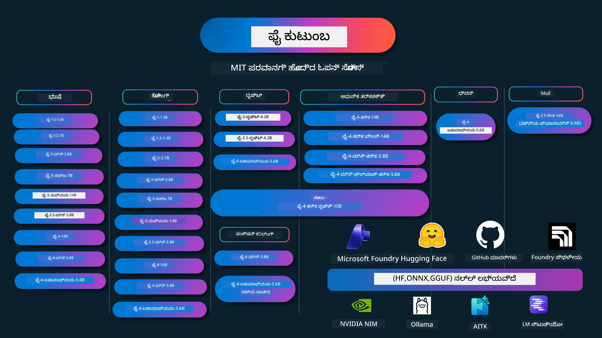

# ಫೈ ಕುಕ್‌ಬುಕ್: ಮೈಕ್ರೋಸಾಫ್ಟ್ ಫೈ ಮಾದರಿಗಳೊಂದಿಗೆ ಕೈಯಿಂದ ಮಾಡಬಹುದಾದ ಉದಾಹರಣೆಗಳು

[](https://codespaces.new/microsoft/phicookbook)
[](https://vscode.dev/redirect?url=vscode://ms-vscode-remote.remote-containers/cloneInVolume?url=https://github.com/microsoft/phicookbook)

[](https://GitHub.com/microsoft/phicookbook/graphs/contributors/?WT.mc_id=aiml-137032-kinfeylo)
[](https://GitHub.com/microsoft/phicookbook/issues/?WT.mc_id=aiml-137032-kinfeylo)
[](https://GitHub.com/microsoft/phicookbook/pulls/?WT.mc_id=aiml-137032-kinfeylo)
[](http://makeapullrequest.com?WT.mc_id=aiml-137032-kinfeylo)

[](https://GitHub.com/microsoft/phicookbook/watchers/?WT.mc_id=aiml-137032-kinfeylo)
[](https://GitHub.com/microsoft/phicookbook/network/?WT.mc_id=aiml-137032-kinfeylo)
[](https://GitHub.com/microsoft/phicookbook/stargazers/?WT.mc_id=aiml-137032-kinfeylo)

[](https://discord.com/invite/ByRwuEEgH4)

ಫೈ ಎಂಬುದು ಮೈಕ್ರೋಸಾಫ್ಟ್ ರಚಿಸಿರುವ ಮುಕ್ತ ಮೂಲ AI ಮಾದರಿಗಳ ಸರಣಿ.

ಫೈ ಇತ್ತೀಚೆಗೆ ಅತ್ಯಾಧುನಿಕ ಮತ್ತು ಕಡಿಮೆ ವೆಚ್ಚದ ಸಣ್ಣ ಭಾಷಾ ಮಾದರಿಯಾಗಿದ್ದು (SLM), ಬಹುಭಾಷಾ, ತರ್ಕಬುದ್ಧಿ, ಪಠ್ಯ/ಚಾಟ್ ಉತ್ಪತ್ತಿ, ಕೋಡಿಂಗ್, ಚಿತ್ರಗಳು, ಧ್ವನಿ ಮತ್ತು ಇತರ ಸಂದರ್ಭದಲ್ಲಿ ಅತ್ಯುತ್ತಮ ಫಲಿತಾಂಶಗಳನ್ನು ನೀಡುತ್ತದೆ.

ನೀವು ಫೈ ಅನ್ನು ಕ್ಲೌಡ್ ಅಥವಾ ಎಡ್ಜ್ ಸಾಧನಗಳಿಗೆ ನಿಯೋಜಿಸಬಹುದು, ಮತ್ತು ಕಡಿಮೆ ಗಣನ ಶಕ್ತಿ ಬಳಸಿ ಸುಲಭವಾಗಿ ಉತ್ಪಾದಕ AI ಅಪ್ಲಿಕೇಶನ್ಗಳನ್ನು ನಿರ್ಮಿಸಬಹುದಾಗಿದೆ.

ಈ ಸಂಪನ್ಮೂಲಗಳನ್ನು ಬಳಸಿ ಪ್ರಾರಂಭಿಸಲು ಈ ಹಂತಗಳನ್ನು ಅನುಸರಿಸಿ:
1. **ರಿಪೊಸಿಟರಿಯನ್ನು ಫೋರ್ಕ್ ಮಾಡಿ**: ಕ್ಲಿಕ್ ಮಾಡಿ [](https://GitHub.com/microsoft/phicookbook/network/?WT.mc_id=aiml-137032-kinfeylo)
2. **ರಿಪೊಸಿಟರಿಯನ್ನು ಕ್ಲೋನ್ ಮಾಡಿ**:  `git clone https://github.com/microsoft/PhiCookBook.git`
3. [**Microsoft AI Discord ಸಮುದಾಯದಲ್ಲಿ ಸೇರಿ, ಪರಿಣಿತರನ್ನೂ ಸಹ ಡೆವಲಪರ್‌ಗಳನ್ನೂ ಭೇಟಿಯಾಗಿರಿ**](https://discord.com/invite/ByRwuEEgH4?WT.mc_id=aiml-137032-kinfeylo)



### 🌐 ಬಹುಭಾಷಾ ಬೆಂಬಲ

#### GitHub ಕ್ರಿಯೆಯಿಂದ ಬೆಂಬಲಿತ (ಸ್ವಯಂಕ್ರಿಯ ಮತ್ತು ಯಾವಾಗಲೂ ನವೀಕರಿತ)

<!-- CO-OP TRANSLATOR LANGUAGES TABLE START -->
[ಅರೆಬಿಕ್](../ar/README.md) | [ಬಾಂಗ್ಲಾ](../bn/README.md) | [ಬಲ್ಗೇರಿಯನ್](../bg/README.md) | [ಬರ್ಮೀಸ್ (ಮಯನ್ಮಾರ್)](../my/README.md) | [ಚೀನೀಸ್ (ಸರಳೀಕೃತ)](../zh-CN/README.md) | [ಚೀನೀಸ್ (ಪಾರಂಪರಿಕ, ಹಾಂಗ್ ಕಾಂಗ್)](../zh-HK/README.md) | [ಚೀನೀಸ್ (ಪಾರಂಪರಿಕ, ಮಾಕಾವ್)](../zh-MO/README.md) | [ಚೀನೀಸ್ (ಪಾರಂಪರಿಕ, ತೈವಾನ್)](../zh-TW/README.md) | [ಕ್ರೊಯೇಷಿಯನ್](../hr/README.md) | [ಚೆಕ್](../cs/README.md) | [ಡೆನಿಷ್](../da/README.md) | [ಡಚ್](../nl/README.md) | [ಎಸ್ಟೋನಿಯನ್](../et/README.md) | [ಫಿನ್ನಿಷ್](../fi/README.md) | [ಫ್ರೆಂಚ್](../fr/README.md) | [ಜರ್ಮನ್](../de/README.md) | [ಗ್ರೀಕ್](../el/README.md) | [ಹೆಬ್ರೂ](../he/README.md) | [ಹಿಂದಿ](../hi/README.md) | [ಹಂಗೇರಿಯನ್](../hu/README.md) | [ಇಂಡೋನೇಷಿಯನ್](../id/README.md) | [ಇಟಾಲಿಯನ್](../it/README.md) | [ಜಪಾನೀಸ್](../ja/README.md) | [ಕನ್ನಡ](./README.md) | [ಖ್ಮೇರ್](../km/README.md) | [ಕೋರಿಯನ್](../ko/README.md) | [ಲಿಥುವೇನಿಯನ್](../lt/README.md) | [ಮಲಯ್](../ms/README.md) | [ಮಲಯಾಳಂ](../ml/README.md) | [ಮರಾಠಿ](../mr/README.md) | [ನೇಪಾಳಿ](../ne/README.md) | [ನೈಜೀರಿಯನ್ ಪಿಡ್ಜಿನ್](../pcm/README.md) | [ನಾರ್ವೇಜಿಯನ್](../no/README.md) | [ಪರ್ಶಿಯನ್ (ಫಾರ್ಸಿ)](../fa/README.md) | [ಪೋಲಿಷ್](../pl/README.md) | [ಪೋರ್ಚುಗೀಸ್ (ಬ್ರೆಜಿಲ್)](../pt-BR/README.md) | [ಪೋರ್ಚುಗೀಸ್ (ಪೋರ್ಟುಗಲ್)](../pt-PT/README.md) | [ಪಂಜಾಬಿ (ಗುರ್ಮುಖಿ)](../pa/README.md) | [ರೋಮೇನಿಯನ್](../ro/README.md) | [ರಷ್ಯನ್](../ru/README.md) | [ಸೆರ್ಬಿಯನ್ (ಸಿರಿಲಿಕ್)](../sr/README.md) | [ಸ್ಲೋವಕ್](../sk/README.md) | [ಸ್ಲೋವೇನಿಯನ್](../sl/README.md) | [ಎಸ್‌ಪ್ಯಾನಿಷ್](../es/README.md) | [ಸ್ವಾಹಿಲಿ](../sw/README.md) | [ಸ್ವೀಡಿಷ್](../sv/README.md) | [ಟ್ಯಾಗಾಲೋಗ್ (ಫಿಲಿಪಿನೋ)](../tl/README.md) | [ತಮಿಳು](../ta/README.md) | [ತೆಲುಗು](../te/README.md) | [ಥಾಯಿ](../th/README.md) | [ಟರ್ಕಿಷ್](../tr/README.md) | [ಉಕ್ರೇನಿಯನ್](../uk/README.md) | [ಉರ್ದು](../ur/README.md) | [ವಿಯೆಟ್‌ನೇಮ್](../vi/README.md)

> **ಸ್ಥಳೀಯವಾಗಿ ಕ್ಲೋನ್ ಮಾಡಬಯಸುತ್ತೀರಾ?**
>
> ಈ ರಿಪೊಸಿಟರಿ 50ಕ್ಕೂ ಹೆಚ್ಚು ಭಾಷಾ ಭಾಷಾಂತರಗಳನ್ನು ಹೊಂದಿದೆ, ಇದರಿಂದ ಡೌನ್ಲೋಡ್ ಗಾತ್ರವು ಹೆಚ್ಚಿನದಾಗುತ್ತದೆ. ಭಾಷಾಂತರಗಳಿಲ್ಲದೆ ಕ್ಲೋನ್ ಮಾಡಲು, ಸ್ಪಾರ್ಸ್ ಔಟ್ ಮಾಡಿಕೋಳ್ಳಿರಿ:
>
> **ಬ್ಯಾಶ್ / ಮ್ಯಾಕ್‌ಒಎಸ್ / ಲಿನಕ್ಸ್:**
> ```bash
> git clone --filter=blob:none --sparse https://github.com/microsoft/PhiCookBook.git
> cd PhiCookBook
> git sparse-checkout set --no-cone '/*' '!translations' '!translated_images'
> ```
>
> **CMD (ವಿಂಡೋಸ್):**
> ```cmd
> git clone --filter=blob:none --sparse https://github.com/microsoft/PhiCookBook.git
> cd PhiCookBook
> git sparse-checkout set --no-cone "/*" "!translations" "!translated_images"
> ```
>
> ಇದರಿಂದ ತರಗತಿಯನ್ನು ಪೂರ್ಣಗೊಳಿಸಲು ಬೇಕಾದ ಎಲ್ಲಾ ವಸ್ತುಗಳನ್ನು ಹೆಚ್ಚು ವೇಗದ ಡೌನ್ಲೋಡ್ ಸಹಿತ ಪಡೆಯಬಹುದು.
<!-- CO-OP TRANSLATOR LANGUAGES TABLE END -->

## ವಿಷಯಗಳ ಪಟ್ಟಿವು
- ಪರಿಚಯ - [ಫೈ ಕುಟುಂಬಕ್ಕೆ ಸ್ವಾಗತ](./md/01.Introduction/01/01.PhiFamily.md) - [ನಿಮ್ಮ ಪರಿಸರವನ್ನು ಹೊಂದಿಸುವುದು](./md/01.Introduction/01/01.EnvironmentSetup.md) - [ಮುಖ್ಯ ತಂತ್ರಜ್ಞಾನಗಳನ್ನು ಅರ್ಥಮಾಡಿಕೊಳ್ಳುವುದು](./md/01.Introduction/01/01.Understandingtech.md) - [ಫೈ ಮಾದರಿಗಳಿಗಾಗಿ AI ಭದ್ರತೆ](./md/01.Introduction/01/01.AISafety.md) - [ಫೈ ಹಾರ್ಡ್‌ವೇರ್ ಬೆಂಬಲ](./md/01.Introduction/01/01.Hardwaresupport.md) - [ಫೈ ಮಾದರಿಗಳು ಮತ್ತು ವೈವಿಧ್ಯಮಯ ವೇದಿಕೆಗಳಲ್ಲಿ ಲಭ್ಯತೆ](./md/01.Introduction/01/01.Edgeandcloud.md) - [Guidance-ai ಮತ್ತು ಫೈ ಬಳಕೆ](./md/01.Introduction/01/01.Guidance.md) - [GitHub ಮಾರ್ಕೆಟ್ಪ್ಲೇಸ್ ಮಾದರಿಗಳು](https://github.com/marketplace/models) - [ಅಜೂರ್ AI ಮಾದರಿ ಕ್ಯಾಟಲಾಗ್](https://ai.azure.com) - ವಿಭಿನ್ನ ಪರಿಸರಗಳಲ್ಲಿ ಫೈ ನಿರ್ಧಾರ - [ಹಗ್ಗಿಂಗ್ ಫೇಸ್](./md/01.Introduction/02/01.HF.md) - [GitHub ಮಾದರಿಗಳು](./md/01.Introduction/02/02.GitHubModel.md) - [Microsoft Foundry ಮಾದರಿ ಕ್ಯಾಟಲಾಗ್](./md/01.Introduction/02/03.AzureAIFoundry.md) - [ಒಳ್ಳಾಮಾ](./md/01.Introduction/02/04.Ollama.md) - [AI ಪಾತ್ರಾಭಿವೃದ್ಧಿ VSCode (AITK)](./md/01.Introduction/02/05.AITK.md) - [NVIDIA NIM](./md/01.Introduction/02/06.NVIDIA.md) - [Foundry ಲೋಕಲ್](./md/01.Introduction/02/07.FoundryLocal.md) - ಫೈ ಕುಟುಂಬದಲ್ಲಿ ನಿರ್ಧಾರ - [iOSನಲ್ಲಿ ಫೈ ನಿರ್ಧಾರ](./md/01.Introduction/03/iOS_Inference.md) - [ಅಂಡ್ರಾಯ್ಡ್‌ನಲ್ಲಿ ಫೈ ನಿರ್ಧಾರ](./md/01.Introduction/03/Android_Inference.md) - [ಜೆಟ್ಸಾನ್‌ನಲ್ಲಿ ಫೈ ನಿರ್ಧಾರ](./md/01.Introduction/03/Jetson_Inference.md) - [AI PC-ದಲ್ಲಿ ಫೈ ನಿರ್ಧಾರ](./md/01.Introduction/03/AIPC_Inference.md) - [ಆಪಲ್ MLX ಫ್ರೇಮ್‌ವರ್ಕ್‌ ಜೊತೆಗೆ ಫೈ ನಿರ್ಧಾರ](./md/01.Introduction/03/MLX_Inference.md) - [ಲೋಕಲ್ ಸರ್ವರ್‌ನಲ್ಲಿ ಫೈ ನಿರ್ಧಾರ](./md/01.Introduction/03/Local_Server_Inference.md) - [AIToolkit ಬಳಸಿ ರಿಮೋಟ್ ಸರ್ವರ್‌ನಲ್ಲಿ ಫೈ ನಿರ್ಧಾರ](./md/01.Introduction/03/Remote_Interence.md) - [ರಸ್ಟ್‌ನೊಂದಿಗೆ ಫೈ ನಿರ್ಧಾರ](./md/01.Introduction/03/Rust_Inference.md) - [ಲೋಕಲ್‌ ನಲ್ಲಿ ಫೈ–ವಿಷನ್ ನಿರ್ಧಾರ](./md/01.Introduction/03/Vision_Inference.md) - [ಕೈಟೋ AKS, ಅಜೂರ್ ಕನ್ಟೈನರ್‌ಗಳು (ಅಧಿಕೃತ ಬೆಂಬಲ) ಜೊತೆಗೆ ಫೈ ನಿರ್ಧಾರ](./md/01.Introduction/03/Kaito_Inference.md) - [ಫೈ ಕುಟುಂಬವನ್ನು ಪ್ರಮಾಣೀಕರಿಸುವುದು](./md/01.Introduction/04/QuantifyingPhi.md) - [llama.cpp ಬಳಸಿಫೈ-3.5 / 4 ಅನ್ನು ಪ್ರಮಾಣೀಕರಿಸುವುದು](./md/01.Introduction/04/UsingLlamacppQuantifyingPhi.md) - [onnxruntimeಗಾಗಿ ಜನರೇಟಿವ್ AI ವಿಸ್ತರಣೆಗಳನ್ನು ಬಳಸಿ ಫೈ-3.5 / 4 ಅನ್ನು ಪ್ರಮಾಣೀಕರಿಸುವುದು](./md/01.Introduction/04/UsingORTGenAIQuantifyingPhi.md) - [Intel OpenVINO ಬಳಸಿ ಫೈ-3.5 / 4 ಅನ್ನು ಪ್ರಮಾಣೀಕರಿಸುವುದು](./md/01.Introduction/04/UsingIntelOpenVINOQuantifyingPhi.md) - [ಆಪಲ್ MLX ಫ್ರೇಮ್‌ವರ್ಕ್ ಬಳಸಿ ಫೈ-3.5 / 4 ಅನ್ನು ಪ್ರಮಾಣೀಕರಿಸುವುದು](./md/01.Introduction/04/UsingAppleMLXQuantifyingPhi.md) - ಫೈ ಮೌಲ್ಯಮಾಪನ - [ಸಮಾಧಾನ AI](./md/01.Introduction/05/ResponsibleAI.md) - [ಮೌಲ್ಯಮಾಪನಕ್ಕಾಗಿ Microsoft Foundry](./md/01.Introduction/05/AIFoundry.md) - [ಮೌಲ್ಯಮಾಪನಕ್ಕಾಗಿ Promptflow ಬಳಕೆ](./md/01.Introduction/05/Promptflow.md) - Azure AI سرچ್ ಜೊತೆಗೆ RAG - [ಅಜೂರ್ AI سرچ್ ಜೊತೆಗೆ Phi-4-mini ಮತ್ತು Phi-4-multimodal(RAG) ಬಳಕೆ ಹೇಗೆ](https://github.com/microsoft/PhiCookBook/blob/main/code/06.E2E/E2E_Phi-4-RAG-Azure-AI-Search.ipynb) - ಫೈ ಆಪ್ಲಿಕೇಶನ್ ಅಭಿವೃದ್ಧಿ ಮಾದರಿಗಳು - ಪಠ್ಯ ಮತ್ತು ಚಾಟ್ ಆಪ್ಲಿಕೇಶನ್ಗಳು - Phi-4 ಮಾದರಿಗಳು - [📓] [Phi-4-mini ONNX ಮಾದರಿಯೊಂದಿಗೆ ಚಾಟ್](./md/02.Application/01.TextAndChat/Phi4/ChatWithPhi4ONNX/README.md) - [Phi-4 ಲೋಕಲ್ ONNX ಮಾದರಿಯೊಂದಿಗೆ .NET ನಲ್ಲಿ ಚಾಟ್](../../md/04.HOL/dotnet/src/LabsPhi4-Chat-01OnnxRuntime) - [ಸೆಮ್ಯಾಂಟಿಕ್ ಕರ್ಣಲ್ ಬಳಸಿಕೊಂಡು Phi-4 ONNX ಸಹಿತ .NET ಕಾನ್ಸೋಲ್ ಅಪ್ಲಿಕೇಶನ್ ಚಾಟ್](../../md/04.HOL/dotnet/src/LabsPhi4-Chat-02SK) - Phi-3 / 3.5 ಮಾದರಿಗಳು - [Phi3, ONNX_RUNTIME ವೆಬ್ ಮತ್ತು WebGPU ಬಳಸಿ ಬ್ರೌಸರ್‌ನಲ್ಲಿ ಲೋಕಲ್ ಚಾಟ್‌ಬಾಟ್](https://github.com/microsoft/onnxruntime-inference-examples/tree/main/js/chat) - [OpenVino ಚಾಟ್](./md/02.Application/01.TextAndChat/Phi3/E2E_OpenVino_Chat.md) - [ಬಹುಮಾದರಿ - ಇಂಟರಾಕ್ಟಿವ್ Phi-3-mini ಮತ್ತು OpenAI Whisper](./md/02.Application/01.TextAndChat/Phi3/E2E_Phi-3-mini_with_whisper.md) - [MLFlow - ರಾಪರ್ ನಿರ್ಮಾಣ ಮತ್ತು Phi-3 ಬಳಕೆ MLFlow ಜೊತೆಗೆ](./md//02.Application/01.TextAndChat/Phi3/E2E_Phi-3-MLflow.md) - [ಮಾದರಿ ಉತ್ತಮೀಕರಣ - Phi-3-mini ಮಾದರಿಯನ್ನು ONNX Runtime Webಗೆ Olive ಬಳಸಿ ಹೇಗೆ ಉತ್ತಮಗೊಳಿಸುವುದು](https://github.com/microsoft/Olive/tree/main/examples/phi3) - [Phi-3 mini-4k-instruct-onnx ಬಳಸಿ WinUI3 ಅಪ್ಲಿಕೇಶನ್](https://github.com/microsoft/Phi3-Chat-WinUI3-Sample/) - [WinUI3 ಬಹುಮಾದರಿ AI ಚಾಲಿತ ಟಿಪ್ಪಣಿಗಳು ಅಪ್ಲಿಕೇಶನ್ ಮಾದರಿ](https://github.com/microsoft/ai-powered-notes-winui3-sample) - [ಕಸ್ಟಮ್ Phi-3 ಮಾದರಿಗಳನ್ನು ಫೈನ್-ಟೂನ್ ಮಾಡಿ ಮತ್ತು Prompt flow ಜೊತೆ ಸಂಯೋಜಿಸುವುದು](./md/02.Application/01.TextAndChat/Phi3/E2E_Phi-3-FineTuning_PromptFlow_Integration.md) - [Microsoft Foundry ಯಲ್ಲಿ ಫೈನ್-ಟ್ಯೂನ್ ಮತ್ತು Prompt flow ಜೊತೆ ಕಸ್ಟಮ್ Phi-3 ಮಾದರಿಗಳನ್ನು ಸಂಯೋಜಿಸುವುದು](./md/02.Application/01.TextAndChat/Phi3/E2E_Phi-3-FineTuning_PromptFlow_Integration_AIFoundry.md) - [Microsoft -ನ ಜವಾಬ್ದಾರಿಯುತ AI ತತ್ವಗಳಿಗೆ ಧ್ಯಾನ ನೀಡಿ Microsoft Foundry ನಲ್ಲಿ ಫೈನ್-ಟ್ಯೂನ್ ಮಾಡಿದ Phi-3 / Phi-3.5 ಮಾದರಿಯನ್ನು ಮೌಲ್ಯಮಾಪನ ಮಾಡುವುದು](./md/02.Application/01.TextAndChat/Phi3/E2E_Phi-3-Evaluation_AIFoundry.md) - [📓] [Phi-3.5-mini-instruct ಭಾಷಾ ಪೂರ್ವಾನುಮಾನ ಮಾದರಿ (ಚೀನಾ/ಇಂಗ್ಲಿಷ್)](./md/02.Application/01.TextAndChat/Phi3/phi3-instruct-demo.ipynb) - [Phi-3.5-Instruct WebGPU RAG ಚಾಟ್‌ಬಾಟ್](./md/02.Application/01.TextAndChat/Phi3/WebGPUWithPhi35Readme.md) - [Windows GPU ಬಳಸಿ Phi-3.5-Instruct ONNX ಜೊತೆಗೆ Prompt flow ಪರಿಹಾರವನ್ನು ರಚಿಸುವುದು](./md/02.Application/01.TextAndChat/Phi3/UsingPromptFlowWithONNX.md) - [Android ಅಪ್ಲಿಕೇಶನ್ ರಚಿಸಲು Microsoft Phi-3.5 tflite ಬಳಕೆ](./md/02.Application/01.TextAndChat/Phi3/UsingPhi35TFLiteCreateAndroidApp.md) - [ಸ್ಥಳೀಯ ONNX Phi-3 ಮಾದರಿ ಬಳಸಿ Microsoft.ML.OnnxRuntime ಬಳಸಿ Q&A .NET ಉದಾಹರಣೆ](../../md/04.HOL/dotnet/src/LabsPhi301) - [ಸೆಮ್ಯಾಂಟಿಕ್ ಕರ್ಣಲ್ ಮತ್ತು Phi-3 ಜೊತೆಗೆ ಕಾನ್ಸೋಲ್ ಚಾಟ್ .NET ಅಪ್ಲಿಕೇಶನ್](../../md/04.HOL/dotnet/src/LabsPhi302) - ಅಜೂರ್ AI ನಿರ್ಧಾರ SDK ಕೋಡ್ ಆಧಾರಿತ ಮಾದರಿಗಳು - Phi-4 ಮಾದರಿಗಳು - [📓] [Phi-4-multimodal ಬಳಸಿಕೊಂಡು ಪ್ರಾಜೆಕ್ಟ್ ಕೋಡ್ ರಚಿಸಿ](./md/02.Application/02.Code/Phi4/GenProjectCode/README.md) - Phi-3 / 3.5 ಮಾದರಿಗಳು - [Microsoft Phi-3 ಕುಟುಂಬಕ್ಕೆ ನಿಮ್ಮ ಸ್ವಂತ Visual Studio Code GitHub Copilot ಚಾಟ್ ರಚಿಸಿ](./md/02.Application/02.Code/Phi3/VSCodeExt/README.md) - [GitHub ಮಾದರಿಗಳಿಂದ Phi-3.5 ಸಹಿತ ನಿಮ್ಮ ಸ್ವಂತ Visual Studio Code ಚಾಟ್ ಕಪಿ ಲಾಟ್ ಎಜೆಂಟ್ ರಚಿಸಿ](/md/02.Application/02.Code/Phi3/CreateVSCodeChatAgentWithGitHubModels.md) - ಸುಧಾರಿತ ತರ್ಕ ಮಾದರಿಗಳು - Phi-4 ಮಾದರಿಗಳು - [📓] [Phi-4-mini-ತರ್ಕ ಅಥವಾ Phi-4-ತರ್ಕ ಮಾದರಿಗಳು](./md/02.Application/03.AdvancedReasoning/Phi4/AdvancedResoningPhi4mini/README.md) - [📓] [Microsoft Olive ಜೊತೆ Phi-4-mini-ತರ್ಕ ಫೈನ್-ಟೂನಿಂಗ್](./md/02.Application/03.AdvancedReasoning/Phi4/AdvancedResoningPhi4mini/olive_ft_phi_4_reasoning_with_medicaldata.ipynb) - [📓] [ಆಪಲ್ MLX ಜೊತೆ Phi-4-mini-ತರ್ಕ ಫೈನ್-ಟೂನಿಂಗ್](./md/02.Application/03.AdvancedReasoning/Phi4/AdvancedResoningPhi4mini/mlx_ft_phi_4_reasoning_with_medicaldata.ipynb) - [📓] [GitHub ಮಾದರಿಗಳೊಂದಿಗೆ Phi-4-mini-ತರ್ಕ](./md/02.Application/02.Code/Phi4r/github_models_inference.ipynb) - [📓] [Microsoft Foundry ಮಾದರಿಗಳೊಂದಿಗೆ Phi-4-mini-ತರ್ಕ](./md/02.Application/02.Code/Phi4r/azure_models_inference.ipynb) -
ಡೆಮೊಗಳು - [Phi-4-mini ಡೆಮೊಗಳು Hugging Face Spaces ನಲ್ಲಿ ಹೋಸ್ಟ್ ಮಾಡಲಾಗಿದೆ](https://huggingface.co/spaces/microsoft/phi-4-mini?WT.mc_id=aiml-137032-kinfeylo) - [Phi-4-multimodal ಡೆಮೊಗಳು Hugging Face Spaces ನಲ್ಲಿ ಹೋಸ್ಟ್ ಮಾಡಲಾಗಿದೆ](https://huggingface.co/spaces/microsoft/phi-4-multimodal?WT.mc_id=aiml-137032-kinfeylo) - ದೃಷ್ಟಿ ಮಾದರಿಗಳು - Phi-4 ಮಾದರಿಗಳು - [📓] [ಚಿತ್ರಗಳನ್ನು ಓದಲು ಮತ್ತು ಕೋಡ್ ರಚಿಸಲು Phi-4-multimodal ಬಳಸಿ](./md/02.Application/04.Vision/Phi4/CreateFrontend/README.md) - Phi-3 / 3.5 ಮಾದರಿಗಳು - [📓][Phi-3-ದೃಷ್ಟಿ-ಚಿತ್ರದಿಂದ ಪಠ್ಯಕ್ಕೆ](./md/02.Application/04.Vision/Phi3/E2E_Phi-3-vision-image-text-to-text-online-endpoint.ipynb) - [Phi-3-vision-ONNX](https://onnxruntime.ai/docs/genai/tutorials/phi3-v.html) - [📓][Phi-3-vision CLIP ಎम्बೆಡಿಂಗ್](./md/02.Application/04.Vision/Phi3/E2E_Phi-3-vision-image-text-to-text-online-endpoint.ipynb) - [ಡೆಮೊ: Phi-3 ರಿಸೈಕ್ಲಿಂಗ್](https://github.com/jennifermarsman/PhiRecycling/) - [Phi-3-vision - ದೃಶ್ಯ ಭಾಷಾ ಸಹಾಯಕ - Phi3-Vision ಮತ್ತು OpenVINO ಜೊತೆಗೆ](https://docs.openvino.ai/nightly/notebooks/phi-3-vision-with-output.html) - [Phi-3 Vision Nvidia NIM](./md/02.Application/04.Vision/Phi3/E2E_Nvidia_NIM_Vision.md) - [Phi-3 Vision OpenVino](./md/02.Application/04.Vision/Phi3/E2E_OpenVino_Phi3Vision.md) - [📓][Phi-3.5 Vision ಬಹು-ಫ್ರೇಮ್ ಅಥವಾ ಬಹು-ಚಿತ್ರ ಮಾದರಿ](./md/02.Application/04.Vision/Phi3/phi3-vision-demo.ipynb) - [Phi-3 Vision ಸ್ಥಳೀಯ ONNX ಮಾದರಿ Microsoft.ML.OnnxRuntime .NET ಬಳಸಿ](../../md/04.HOL/dotnet/src/LabsPhi303) - [ಮೆನು ಆಧಾರಿತ Phi-3 Vision ಸ್ಥಳೀಯ ONNX ಮಾದರಿ Microsoft.ML.OnnxRuntime .NET ಬಳಸಿ](../../md/04.HOL/dotnet/src/LabsPhi304) - ತರ್ಕೀಕರಣ-ದೃಷ್ಟಿ ಮಾದರಿಗಳು - Phi-4-ತರ್ಕೀಕರಣ-ದೃಷ್ಟಿ-15B - [📓] [Phi-4-ತರ್ಕೀಕರಣ-ದೃಷ್ಟಿ-15B ಬಳಸಿ ಜಿಟಿಗೆ ಹಿಡಿಯುವಿಕೆ ತಾಳಲು](./md/02.Application/10.ReasoningVision/Phi_4_reasoning_vision_15b_Jaywalking.ipynb) - [📓] [Phi-4-ತರ್ಕೀಕರಣ-ದೃಷ್ಟಿ-15B ಬಳಸಿ ಗಣಿತ](./md/02.Application/10.ReasoningVision/Phi_4_reasoning_vision_15b_Math.ipynb) - [📓] [Phi-4-ತರ್ಕೀಕರಣ-ದೃಷ್ಟಿ-15B ಬಳಸಿ UI ಪತ್ತೆಮಾಡಲು](./md/02.Application/10.ReasoningVision/Phi_4_reasoning_vision_15b_ui.ipynb) - ಗಣಿತ ಮಾದರಿಗಳು - Phi-4-Mini-ಫ್ಲ್ಯಾಷ್-ತರ್ಕೀಕರಣ-ಆಜ್ಞೆ ಮಾದರಿಗಳು [Phi-4-Mini-ಫ್ಲ್ಯಾಷ್-ತರ್ಕೀಕರಣ-ಆಜ್ಞೆ ಜೊತೆ ಗಣಿತ ಡೆಮೊ](./md/02.Application/09.Math/MathDemo.ipynb) - ಧ್ವನಿ ಮಾದರಿಗಳು - Phi-4 ಮಾದರಿಗಳು - [📓] [Phi-4-multimodal ಬಳಸಿ ಧ್ವನಿ ಲಿಪ್ಯಂತರಣಗಳನ್ನು ತೆಗೆದುಕೊಳ್ಳುವುದು](./md/02.Application/05.Audio/Phi4/Transciption/README.md) - [📓] [Phi-4-multimodal ಧ್ವನಿ ಮಾದರಿ](./md/02.Application/05.Audio/Phi4/Siri/demo.ipynb) - [📓] [Phi-4-multimodal ಮಾತಿನ ಭಾಷಾಂತರ ಮಾದರಿ](./md/02.Application/05.Audio/Phi4/Translate/demo.ipynb) - [.NET ಕಾನ್ಸೋಲ್ ಅಪ್ಲಿಕೇಶನ್ Phi-4-multimodal ಬಳಸಿ ಧ್ವನಿ ಫೈಲ್ ವಿಶ್ಲೇಷಣೆ ಮತ್ತು ಲಿಪ್ಯಂತರಣ ರಚಿಸಲು](../../md/04.HOL/dotnet/src/LabsPhi4-MultiModal-02Audio) - MOE ಮಾದರಿಗಳು - Phi-3 / 3.5 ಮಾದರಿಗಳು - [📓] [Phi-3.5 ಕಲಾವಿದರ ಮಿಶ್ರಣ ಮಾದರಿಗಳು (MoEs) ಸಾಮಾಜಿಕ ಮಾಧ್ಯಮ ಮಾದರಿ](./md/02.Application/06.MoE/Phi3/phi3_moe_demo.ipynb) - [📓] [NVIDIA NIM Phi-3 MOE, Azure AI Search ಮತ್ತು LlamaIndex ಬಳಸಿ ರಿಟ್ರೀವಲ್-ಆಗ್ಮೆಂಟೆಡ್ ಜನರೇಷನ್ (RAG) ಪೈಪ್ಲೈನ್ ನಿರ್ಮಾಣ](./md/02.Application/06.MoE/Phi3/azure-ai-search-nvidia-rag.ipynb) - - ಕಾರ್ಯನಿರ್ವಹಣಾ ಕರೆ ಮಾದರಿಗಳು - Phi-4 ಮಾದರಿಗಳು 🆕 - [📓] [ಕಾರ್ಯನಿರ್ವಹಣಾ ಕರೆ Phi-4-mini ಜೊತೆ ಬಳಕೆ](./md/02.Application/07.FunctionCalling/Phi4/FunctionCallingBasic/README.md) - [📓] [Phi-4-mini ಜೊತೆ ಬಹು-ಏಜೆಂಟ್ಗಳನ್ನು ರಚಿಸಲು ಕಾರ್ಯನಿರ್ವಹಣಾ ಕರೆ ಬಳಕೆ](./md/02.Application/07.FunctionCalling/Phi4/Multiagents/Phi_4_mini_multiagent.ipynb) - [📓] [Ollama ಜೊತೆ ಕಾರ್ಯನಿರ್ವಹಣಾ ಕರೆ ಬಳಕೆ](./md/02.Application/07.FunctionCalling/Phi4/Ollama/ollama_functioncalling.ipynb) - [📓] [ONNX ಜೊತೆ ಕಾರ್ಯನಿರ್ವಹಣಾ ಕರೆ ಬಳಕೆ](./md/02.Application/07.FunctionCalling/Phi4/ONNX/onnx_parallel_functioncalling.ipynb) - ಬಹುಮಾಧ್ಯ ಮಿಶ್ರಣ ಮಾದರಿಗಳು - Phi-4 ಮಾದರಿಗಳು 🆕 - [📓] [ತಂತ್ರಜ್ಞಾನ ಪತ್ರಕರ್ತನಾಗಿ Phi-4-multimodal ಬಳಕೆ](./md/02.Application/08.Multimodel/Phi4/TechJournalist/phi_4_mm_audio_text_publish_news.ipynb) - [.NET ಕಾನ್ಸೋಲ್ ಅಪ್ಲಿಕೇಶನ್ Phi-4-multimodal ಬಳಸಿ ಚಿತ್ರಗಳನ್ನು ವಿಶ್ಲೇಷಿಸಲು](../../md/04.HOL/dotnet/src/LabsPhi4-MultiModal-01Images) - ಫೈನ್-ಟ್ಯೂನಿಂಗ್ Phi ಮಾದರಿಗಳು - [ಫೈನ್-ಟ್ಯೂನಿಂಗ್ ಪರಿಯಿಂದ](./md/03.FineTuning/FineTuning_Scenarios.md) - [ಫೈನ್-ಟ್ಯೂನಿಂಗ್ ವಿರುದ್ಧ RAG](./md/03.FineTuning/FineTuning_vs_RAG.md) - [Phi-3 ಅನ್ನು ಉದ್ಯಮ ತಜ್ಞರಾಗಿ ಕಮ್ಮಿ ಮಾಡುವ ಫೈನ್-ಟ್ಯೂನಿಂಗ್](./md/03.FineTuning/LetPhi3gotoIndustriy.md) - [VS Code ಗಾಗಿ AI ಟೂಲ್ಕಿಟ್ ಬಳಸಿ Phi-3 ಫೈನ್-ಟ್ಯೂನಿಂಗ್](./md/03.FineTuning/Finetuning_VSCodeaitoolkit.md) - [Azure ಯಂತ್ರ ಕಲಿಕಾ ಸೇವೆಯೊಂದಿಗೆ Phi-3 ಫೈನ್-ಟ್ಯೂನಿಂಗ್](./md/03.FineTuning/Introduce_AzureML.md) - [Lora ಬಳಸಿ Phi-3 ಫೈನ್-ಟ್ಯೂನಿಂಗ್](./md/03.FineTuning/FineTuning_Lora.md) - [QLora ಬಳಸಿ Phi-3 ಫೈನ್-ಟ್ಯೂನಿಂಗ್](./md/03.FineTuning/FineTuning_Qlora.md) - [Microsoft Foundry ಬಳಸಿ Phi-3 ಫೈನ್-ಟ್ಯೂನಿಂಗ್](./md/03.FineTuning/FineTuning_AIFoundry.md) - [Azure ML CLI/SDK ಬಳಸಿ Phi-3 ಫೈನ್-ಟ್ಯೂನಿಂಗ್](./md/03.FineTuning/FineTuning_MLSDK.md) - [Microsoft Olive ಬಳಸಿ ಫೈನ್-ಟ್ಯೂನಿಂಗ್](./md/03.FineTuning/FineTuning_MicrosoftOlive.md) - [Microsoft Olive ಹ್ಯಾಂಡ್ಸ್-ಆನ್ ಲ್ಯಾಬ್ ಬಳಸಿ ಫೈನ್-ಟ್ಯೂನಿಂಗ್](./md/03.FineTuning/olive-lab/readme.md) - [Weights and Bias ಬಳಸಿ Phi-3-vision ಫೈನ್-ಟ್ಯೂನಿಂಗ್](./md/03.FineTuning/FineTuning_Phi-3-visionWandB.md) - [Apple MLX ಫ್ರೇಮ್‌ವರ್ಕ್ ಬಳಸಿ Phi-3 ಫೈನ್-ಟ್ಯೂನಿಂಗ್](./md/03.FineTuning/FineTuning_MLX.md) - [Phi-3-vision ಫೈನ್-ಟ್ಯೂನಿಂಗ್ (ಅಧಿಕೃತ ಬೆಂಬಲ)](./md/03.FineTuning/FineTuning_Vision.md) - [Kaito AKS, Azure ಕನ್ಟೇನರ್‌ಗಳೊಂದಿಗೆ Phi-3 ಫೈನ್-ಟ್ಯೂನಿಂಗ್ (ಅಧಿಕೃತ ಬೆಂಬಲ)](./md/03.FineTuning/FineTuning_Kaito.md) - [Phi-3 ಮತ್ತು 3.5 Vision ಫೈನ್-ಟ್ಯೂನಿಂಗ್](https://github.com/2U1/Phi3-Vision-Finetune) - ಹ್ಯಾಂಡ್ಸ್ ಆನ್ ಲ್ಯಾಬ್ - [ಅತ್ಯಾಧುನಿಕ ಮಾದರಿಗಳನ್ನು ಅನ್ವೇಷಣೆ: LLMs, SLMs, ಸ್ಥಳೀಯ ಅಭಿವೃದ್ಧಿ ಮತ್ತು ಇನ್ನಷ್ಟು](https://github.com/microsoft/aitour-exploring-cutting-edge-models) - [NLP ಸಾಮರ್ಥ್ಯ ಅನ್ಲಾಕ್ ಮಾಡುವುದು: Microsoft Olive ಸಹಿತ ಫೈನ್-ಟ್ಯೂನಿಂಗ್](https://github.com/azure/Ignite_FineTuning_workshop) - ಐಕರ್ತಿಕ ಸಂಶೋಧನಾ ಪೇಪರ್‌ಗಳು ಮತ್ತು ಪ್ರಕಟಣೆಗಳು - [Textbooks Are All You Need II: phi-1.5 ತಾಂತ್ರಿಕ ವರದಿ](https://arxiv.org/abs/2309.05463) - [Phi-3 ತಾಂತ್ರಿಕ ವರದಿ: ನಿಮ್ಮ ಫೋನಿನಲ್ಲಿ ಸ್ಥಳೀಯವಾಗಿ ಉಚಿತ ಶಕ್ತಿಯುತ ಭಾಷಾ ಮಾದರಿ](https://arxiv.org/abs/2404.14219) - [Phi-4 ತಾಂತ್ರಿಕ ವರದಿ](https://arxiv.org/abs/2412.08905) - [Phi-4-Mini ತಾಂತ್ರಿಕ ವರದಿ: ಲೋ-ರಾ ಮಿಶ್ರಣದ ಮೂಲಕ ಸಂಕುಚಿತ ಆದರೆ ಶಕ್ತಿಯುತ ಬಹುಮಾಧ್ಯ ಭಾಷಾ ಮಾದರಿಗಳು](https://arxiv.org/abs/2503.01743) - [ವಾಹನದಲ್ಲಿ ಕಾರ್ಯನಿರ್ವಹಣಾ ಕರೆಗಾಗಿ ಸಣ್ಣ ಭಾಷಾ ಮಾದರಿಗಳ tốiಮೀಕರಣ](https://arxiv.org/abs/2501.02342) - [(WhyPHI) ಬಹು-ಆಯ್ಕೆ ಪ್ರಶ್ನೋತ್ತರಿಗಾಗಿ PHI-3 ಫೈನ್-ಟ್ಯೂನಿಂಗ್: ವಿಧಾನಶಾಸ್ತ್ರ, ಫಲಿತಾಂಶಗಳು ಮತ್ತು ಸವಾಲುಗಳು](https://arxiv.org/abs/2501.01588) - [Phi-4-ತರ್ಕೀಕರಣ ತಾಂತ್ರಿಕ ವರದಿ](https://www.microsoft.com/en-us/research/wp-content/uploads/2025/04/phi_4_reasoning.pdf)
- [Phi-4-mini-ತಾರ್ಕಿಕ ವರದಿ](https://huggingface.co/microsoft/Phi-4-mini-reasoning/blob/main/Phi-4-Mini-Reasoning.pdf)
# ಫೈ ಕುಕ್ಕುಪುಸ್ತಕ: ಮೈಕ್ರೋಸಾಫ್ಟ್‌ಗಿನ ಫೈ ಮಾದರಿಗಳೊಂದಿಗೆ ಕೈಗೊಂಡ ಉದಾಹರಣೆಗಳು

[](https://codespaces.new/microsoft/phicookbook)
[](https://vscode.dev/redirect?url=vscode://ms-vscode-remote.remote-containers/cloneInVolume?url=https://github.com/microsoft/phicookbook)

[](https://GitHub.com/microsoft/phicookbook/graphs/contributors/?WT.mc_id=aiml-137032-kinfeylo)
[](https://GitHub.com/microsoft/phicookbook/issues/?WT.mc_id=aiml-137032-kinfeylo)
[](https://GitHub.com/microsoft/phicookbook/pulls/?WT.mc_id=aiml-137032-kinfeylo)
[](http://makeapullrequest.com?WT.mc_id=aiml-137032-kinfeylo)

[](https://GitHub.com/microsoft/phicookbook/watchers/?WT.mc_id=aiml-137032-kinfeylo)
[](https://GitHub.com/microsoft/phicookbook/network/?WT.mc_id=aiml-137032-kinfeylo)
[](https://GitHub.com/microsoft/phicookbook/stargazers/?WT.mc_id=aiml-137032-kinfeylo)

[](https://discord.com/invite/ByRwuEEgH4)

ಫೈ ಮೈಕ್ರೋಸಾಫ್ಟ್ ಅಭಿವೃದ್ಧಿಪಡಿಸಿದ ಓಪನ್ ಸೋರಸ್ ಏಐ ಮಾದರಿಗಳ ಸರಣಿಯಾಗಿದೆ.

ಫೈ ಪ್ರಸ್ತುತ ಅತ್ಯಂತ ಶಕ್ತಿಶಾಲಿ ಮತ್ತು ಕಡಿಮೆ ವೆಚ್ಚದ ಸಣ್ಣ ಭಾಷಾ ಮಾದರಿ (SLM), ಬಹುಭಾಷಾ, ತರ್ಕ, ಪಠ್ಯ/ಚಾಟ್ ರಚನೆ, ಕೋಡಿಂಗ್, ಚಿತ್ರಗಳು, ಆಡಿಯೋ ಮತ್ತು ಇತರೆ ಸಂದರ್ಭಗಳಲ್ಲಿ ಉತ್ತಮ ಕಾರ್ಯಕ್ಷಮತೆ ಹೊಂದಿದೆ.

ನೀವು ಫೈ ಅನ್ನು ಕ್ಲೌಡ್ ಅಥವಾ ಎಡ್ಜ್ ಸಾಧನಗಳಿಗೆ ನಿಯೋಜಿಸಬಹುದು, ಮತ್ತು ನಿರ್ಬಂಧಿತ ಗಣನ ಶಕ್ತಿಯೊಂದಿಗೆ ಸುಗಮವಾಗಿ ಜನರೇಟಿವ್ ಏಐ ಅಪ್ಲಿಕೇಶನ್‌ಗಳನ್ನು ನಿರ್ಮಿಸಬಹುದು.

ಈ ಸಂಪನ್ಮೂಲವನ್ನು ಬಳಸುವಂತೆ ಪ್ರಾರಂಭಿಸಲು ಈ ಹಂತಗಳನ್ನು ಅನುಸರಿಸಿ:
1. **ರಿಪೋಜಿಟರಿಯನ್ನು ಫೋರ್ಕ್ ಮಾಡಿ**: ಕ್ಲಿಕ್ ಮಾಡಿ [](https://GitHub.com/microsoft/phicookbook/network/?WT.mc_id=aiml-137032-kinfeylo)
2. **ರಿಪೋಜಿಟರಿಯನ್ನು ಕ್ಲೋನ್ ಮಾಡಿ**:   `git clone https://github.com/microsoft/PhiCookBook.git`
3. [**Microsoft AI Discord ಸಮುದಾಯಕ್ಕೆ ಸೇರಿ ತಜ್ಞರು ಮತ್ತು ಸಹ ಡೆವಲಪರ್‌ಗಳನ್ನು ಭೇಟಿಯಾಗಿರಿ**](https://discord.com/invite/ByRwuEEgH4?WT.mc_id=aiml-137032-kinfeylo)


### 🌐 ಬಹುಭಾಷಾ ಬೆಂಬಲ

#### GitHub Action ಮೂಲಕ ಬೆಂಬಲಿತ (ಸ್ವಯಂಚಾಲಿತ ಮತ್ತು ಯಾವಾಗಲೂ تازಾ)

<!-- CO-OP TRANSLATOR LANGUAGES TABLE START -->
[ಅರಬಿಕ್](../ar/README.md) | [ಬಂಗಾಳಿ](../bn/README.md) | [ಬಲ್ಗೇರಿಯನ್](../bg/README.md) | [ಬರ್ಮೀಸ್ (ಮಯಾನ್ಯಾರ್)](../my/README.md) | [ಚೈನೀಸ್ (ಸರಳೀಕೃತ)](../zh-CN/README.md) | [ಚೈನೀಸ್ (ಪಾರಂಪರಿಕ, ಹಾಂಗ್ ಕಾಂಗ್)](../zh-HK/README.md) | [ಚೈನೀಸ್ (ಪಾರಂಪರಿಕ, ಮಕಾವ್)](../zh-MO/README.md) | [ಚೈನೀಸ್ (ಪಾರಂಪರಿಕ, ತೈವಾನ್)](../zh-TW/README.md) | [ಕ್ರೋಎಷಿಯನ್](../hr/README.md) | [ಚೆಕ್](../cs/README.md) | [ಡೆನಿಷ್](../da/README.md) | [ಡಚ್](../nl/README.md) | [ಎಸ್ಟೋನಿಯನ್](../et/README.md) | [ಫಿನ್ನಿಷ್](../fi/README.md) | [ಫ್ರೆಂಚ್](../fr/README.md) | [ಜರ್ಮನ್](../de/README.md) | [ಗ್ರೀಕ್](../el/README.md) | [ಹೆಬ್ರೂ](../he/README.md) | [ಹિಂದಿ](../hi/README.md) | [ಹಂಗೇರಿಯನ್](../hu/README.md) | [ಇಂಡೋನೇಶಿಯನ್](../id/README.md) | [ಇಟಾಲಿಯನ್](../it/README.md) | [ಜಪಾನೀಸ್](../ja/README.md) | [ಕನ್ನಡ](./README.md) | [ಖ್ಮೆರ್](../km/README.md) | [ಕೊರಿಯನ್](../ko/README.md) | [ಲಿತ್ವಾನಿಯನ್](../lt/README.md) | [ಮಲಯ್](../ms/README.md) | [ಮಲಯಾಳಂ](../ml/README.md) | [ಮರಾಠಿ](../mr/README.md) | [ನೇಪಾಳಿ](../ne/README.md) | [ನೈಜೀರಿಯನ್ ಪಿಡ್‌ಗಿನ](../pcm/README.md) | [ನಾರ್ವೇಜಿಯನ್](../no/README.md) | [ಪರ್ಶಿಯನ್ (ಫಾರ್ಸಿ)](../fa/README.md) | [ಪೋಲಿಷ್](../pl/README.md) | [ಪೋರ್ಚುಗೀಸ್ (ಬ್ರೆಜಿಲ್)](../pt-BR/README.md) | [ಪೋರ್ಚುಗೀಸ್ (ಪೋರ್ಟುಗಲ್)](../pt-PT/README.md) | [ಪಂಜಾಬಿ (ಗುರ್‌मुखಿ)](../pa/README.md) | [ರೊಮೇನಿಯನ್](../ro/README.md) | [ರಷ್ಯನ್](../ru/README.md) | [ಸರ್ಬಿಯನ್ (ಸಿರಿಲಿಕ್)](../sr/README.md) | [ಸ್ಲೋವಾಕ್](../sk/README.md) | [ಸ್ಲೋವೇನಿಯನ್](../sl/README.md) | [ಸ್ಪ್ಯಾನಿಷ್](../es/README.md) | [ಸ್ವಾಹಿಲಿ](../sw/README.md) | [ಸ್ವೀಡಿಷ್](../sv/README.md) | [ಟಗಲೋಗ್ (ಫಿಲಿಪೀನೋ)](../tl/README.md) | [തമിഴ്](../ta/README.md) | [తెలుగు](../te/README.md) | [ಥೈ](../th/README.md) | [ಟರ್ಕಿಷ್](../tr/README.md) | [ಉಕ್ರೇನಿಯನ್](../uk/README.md) | [ಉರ್ದು](../ur/README.md) | [ Vietnamese](../vi/README.md)

> **ಸ್ಥಳೀಯವಾಗಿ ಕ್ಲೋನ್ ಮಾಡಬೇಕೆಂದು ಬಯಸುವಿರಾ?**
>
> ಈ ರಿಪೋಜಿಟರಿ 50+ ಭಾಷಾಂತರಗಳನ್ನು ಒಳಗೊಂಡಿದೆ, ಇದು ಡೌನ್ಲೋಡ್ ಗಾತ್ರವನ್ನು ಗಣನೀಯವಾಗಿ ಹೆಚ್ಚಿಸುತ್ತದೆ. ಭಾಷಾಂತರಗಳನ್ನು ಹೊರತುಪಡಿಸಿ ಕ್ಲೋನ್ ಮಾಡಲು ಸ್ಪಾರ್ಸ್‌ಔಟ್‌ಚೆಕ್ ಬಳಸಿ:
>
> **ಬಾಶ್ / macOS / ಲಿನಕ್ಸ್ನಲ್ಲಿ:**
> ```bash
> git clone --filter=blob:none --sparse https://github.com/microsoft/PhiCookBook.git
> cd PhiCookBook
> git sparse-checkout set --no-cone '/*' '!translations' '!translated_images'
> ```
>
> **CMD (ವಿಂಡೋಸ್):**
> ```cmd
> git clone --filter=blob:none --sparse https://github.com/microsoft/PhiCookBook.git
> cd PhiCookBook
> git sparse-checkout set --no-cone "/*" "!translations" "!translated_images"
> ```
>
> ಇದರಿಂದ ನೀವು ಕೋರ್ಸ್ ಪೂರ್ಣಗೊಳಿಸಲು ಅಗತ್ಯವಿರುವ ಎಲ್ಲವನ್ನೂ ವೇಗವಾಗಿ ಡೌನ್ಲೋಡ್ ಮಾಡಬಹುದು.
<!-- CO-OP TRANSLATOR LANGUAGES TABLE END -->

## ವಿಷಯ ವಿತರಣೆ

## ಫೈ ಮಾದರಿಗಳನ್ನು ಬಳಸುವುದು

### Microsoft Foundry ನಲ್ಲಿ ಫೈ

ನೀವು Microsoft ಫೈ ಅನ್ನು ಹೇಗೆ ಬಳಸುವುದು ಮತ್ತು ವಿಭಿನ್ನ ಹಾರ್ಡ್‌ವೇರ್ ಸಾಧನಗಳಲ್ಲಿ ಎ2ಇ ಪರಿಹಾರಗಳನ್ನು ಹೇಗೆ ನಿರ್ಮಿಸುವುದು ಎಂದು ಕಲಿಯಬಹುದು. ನಿಮ್ಮ ಸ್ವಂತ ಅನುಭವಕ್ಕಾಗಿ, ಮಾದರಿಗಳೊಂದಿಗೆ ಆಟವಾಡಿ ಮತ್ತು ನಿಮ್ಮ ಸಂದರ್ಭಗಳಿಗೆ ಫೈ ಅನ್ನು ಹೊಂದಿಸಿ [Microsoft Foundry Azure AI Model Catalog](https://aka.ms/phi3-azure-ai) ಮೂಲಕ ನೀವು ಹೆಚ್ಚಿನ ಮಾಹಿತಿಗಾಗಿ [Microsoft Foundry](/md/02.QuickStart/AzureAIFoundry_QuickStart.md) ಬಗ್ಗೆ ತಿಳಿಯಬಹುದು.

**ಪ್ಲೇಗ್ರೌಂಡ್**  
ಪ್ರತಿ ಮಾದರಿಗೆ ಪ್ರತ್ಯೇಕ ಪ್ಲೇಗ್ರೌಂಡ್ ಇದೆ ಮಾದರಿಯನ್ನು ಪರೀಕ್ಷಿಸಲು [Azure AI Playground](https://aka.ms/try-phi3).

### GitHub ಮಾದರಿಗಳಲ್ಲಿ ಫೈ

ನೀವು Microsoft ಫೈ ಅನ್ನು ಹೇಗೆ ಬಳಸುವುದು ಮತ್ತು ವಿಭಿನ್ನ ಹಾರ್ಡ್‌ವೇರ್ ಸಾಧನಗಳಲ್ಲಿ ಎ2ಇ ಪರಿಹಾರಗಳನ್ನು ಹೇಗೆ ನಿರ್ಮಿಸುವುದು ಎಂದು ಕಲಿಯಬಹುದು. ಫೈ ಅನ್ನು ಅನುಭವಿಸಲು, ಮಾದರಿಯೊಂದಿಗೆ ಆಟವಾಡಿ ಮತ್ತು ನಿಮ್ಮ ಸಂದರ್ಭಗಳಿಗೆ ಫೈ ಅನ್ನು ಹೊಂದಿಸಿ [GitHub Model Catalog](https://github.com/marketplace/models?WT.mc_id=aiml-137032-kinfeylo) ಮೂಲಕ ನೀವು ಹೆಚ್ಚಿನ ಮಾಹಿತಿಗಾಗಿ [GitHub Model Catalog](/md/02.QuickStart/GitHubModel_QuickStart.md) ತಿಳಿಯಿರಿ.

**ಪ್ಲೇಗ್ರೌಂಡ್**  
ಪ್ರತಿ ಮಾದರಿಗೆ ಪರೀಕ್ಷಿಸಲು [ಪ್ಲೇಗ್ರೌಂಡ್](/md/02.QuickStart/GitHubModel_QuickStart.md) ಇದೆ.

### Hugging Face ನಲ್ಲಿ ಫೈ

ನೀವು ಮಾದರಿಯನ್ನು [Hugging Face](https://huggingface.co/microsoft) ಯಲ್ಲೂ ಕಾಣಬಹುದು

**ಪ್ಲೇಗ್ರೌಂಡ್**  
 [Hugging Chat ಪ್ಲೇಗ್ರೌಂಡ್](https://huggingface.co/chat/models/microsoft/Phi-3-mini-4k-instruct)

## 🎒 ಇತರೆ ಕೋರ್ಸ್ಗಳು

ನಮ್ಮ ತಂಡವು ಇತರೆ ಕೋರ್ಸ್ಗಳನ್ನು ತಯಾರಿಸುತ್ತದೆ! ನೋಡಿ:

<!-- CO-OP TRANSLATOR OTHER COURSES START -->
### LangChain
[](https://aka.ms/langchain4j-for-beginners)
[](https://aka.ms/langchainjs-for-beginners?WT.mc_id=m365-94501-dwahlin)
[](https://github.com/microsoft/langchain-for-beginners?WT.mc_id=m365-94501-dwahlin)
---

### ಅಝ್ಯೂರ್ / ಎಡ್ಜ್ / MCP / ಏಜೆಂಟ್‌ಗಳು
[](https://github.com/microsoft/AZD-for-beginners?WT.mc_id=academic-105485-koreyst)
[](https://github.com/microsoft/edgeai-for-beginners?WT.mc_id=academic-105485-koreyst)
[](https://github.com/microsoft/mcp-for-beginners?WT.mc_id=academic-105485-koreyst)
[](https://github.com/microsoft/ai-agents-for-beginners?WT.mc_id=academic-105485-koreyst)

---
 
### ಜನರೇಟಿವ್ ಏಐ ಸರಣಿ
[](https://github.com/microsoft/generative-ai-for-beginners?WT.mc_id=academic-105485-koreyst)
[-9333EA?style=for-the-badge&labelColor=E5E7EB&color=9333EA)](https://github.com/microsoft/Generative-AI-for-beginners-dotnet?WT.mc_id=academic-105485-koreyst)
[-C084FC?style=for-the-badge&labelColor=E5E7EB&color=C084FC)](https://github.com/microsoft/generative-ai-for-beginners-java?WT.mc_id=academic-105485-koreyst)
[-E879F9?style=for-the-badge&labelColor=E5E7EB&color=E879F9)](https://github.com/microsoft/generative-ai-with-javascript?WT.mc_id=academic-105485-koreyst)

---
 
### ಮುಖ್ಯ ಅಧ್ಯಯನ
[](https://aka.ms/ml-beginners?WT.mc_id=academic-105485-koreyst)
[](https://aka.ms/datascience-beginners?WT.mc_id=academic-105485-koreyst)
[](https://aka.ms/ai-beginners?WT.mc_id=academic-105485-koreyst)
[](https://github.com/microsoft/Security-101?WT.mc_id=academic-96948-sayoung)
[](https://aka.ms/webdev-beginners?WT.mc_id=academic-105485-koreyst)
[](https://aka.ms/iot-beginners?WT.mc_id=academic-105485-koreyst)
[](https://github.com/microsoft/xr-development-for-beginners?WT.mc_id=academic-105485-koreyst)

---
 
### ಕೋಪೈಲಟ್ ಸರಣಿ
[](https://aka.ms/GitHubCopilotAI?WT.mc_id=academic-105485-koreyst)
[](https://github.com/microsoft/mastering-github-copilot-for-dotnet-csharp-developers?WT.mc_id=academic-105485-koreyst)
[](https://github.com/microsoft/CopilotAdventures?WT.mc_id=academic-105485-koreyst)
<!-- CO-OP TRANSLATOR OTHER COURSES END -->

## ಜವಾಬ್ದಾರಿಯುತ AI

ಮೈಕ್ರೋಸಾಫ್ಟ್ ನಮ್ಮ ಗ್ರಾಹಕರು ನಮ್ಮ AI ಉತ್ಪನ್ನಗಳನ್ನು ಜವಾಬ್ದಾರಿಯುತವಾಗಿ ಬಳಸಲು ಸಹಾಯ ಮಾಡಲು, ನಮ್ಮ ಕಲಿಕೆಯನ್ನ ಹಂಚಿಕೊಳ್ಳಲು ಮತ್ತು ಟ್ರಾನ್ಸ್ಪಾರೆನ್ಸಿ ನೋಟ್‌ಗಳು ಮತ್ತು ಪರಿಣಾಮ ಮೌಲ್ಯಮಾಪನಗಳಂತಹ ಸಾಧನಗಳ ಮೂಲಕ ವಿಶ್ವಾಸಾಧಾರಿತ ಸಹಭಾಗಿತ್ವಗಳನ್ನು ನಿರ್ಮಿಸಲು ಬದ್ಧವಾಗಿದೆ. ಈ ಸಂಪನ್ಮೂಲಗಳ ಬಹುತೆಕ ಭಾಗಗಳನ್ನು ನೀವು [https://aka.ms/RAI](https://aka.ms/RAI) ನಲ್ಲಿ ಹುಡುಕಬಹುದು.
ಜವಾಬ್ದಾರಿಯುತ AI ಯ ಮೈಕ್ರೋಸಾಫ್ಟ್ ಧೋರಣೆ ನಮ್ಮ ನ್ಯಾಯತೆ, ವಿಶ್ವಾಸಾರ್ಹತೆ ಮತ್ತು ಸುರಕ್ಷತೆ, ಗೌಪ್ಯತೆ ಮತ್ತು ಭದ್ರತೆ, ಒಳಗೊಂಡಿಕೆ, ಪಾರದರ್ಶಕತೆ ಮತ್ತು ಹೊಣೆಗಾರಿಕೆಯ AI ತತ್ತ್ವಗಳ ಮೇಲೆ ಆಧರಿಸಿದೆ.

ಈ ಉದಾಹರಣೆಯಲ್ಲಿ ಬಳಸಲಾಗುವ ದೊಡ್ಡ ಪ್ರಮಾಣದ ನೈಸರ್ಗಿಕ ಭಾಷೆ, ಚಿತ್ರ ಮತ್ತು ಭಾಷಣ ಮಾದರಿಗಳು – ಅನ್ಯಾಯಕರ, ಅಸ್ಥಿರ ಅಥವಾ ಅಪಮಾನಕಾರಿ ರೀತಿಯಲ್ಲಿ ವರ್ತಿಸಬಹುದಾದವು, ಇದರಿಂದ ಹಾನಿ ಸಂಭವಿಸಬಹುದು. ಅಪಾಯಗಳು ಮತ್ತು ಸೀಮಿತತೆಗಳ ಬಗ್ಗೆ ತಿಳಿದುಕೊಳ್ಳಲು ದಯವಿಟ್ಟು [ಆಜ್ಯುರ್ ಓಪನ್‌ಎಐ ಸೇವೆಯ ಟ್ರಾನ್ಸ್ಪಾರೆನ್ಸಿ ನೋಟ್](https://learn.microsoft.com/legal/cognitive-services/openai/transparency-note?tabs=text) ಅನ್ನು ವೀಕ್ಷಿಸಿ.

ಈ ಅಪಾಯಗಳನ್ನು ಕಡಿಮೆ ಮಾಡುವ ಶಿಫಾರಸ್ಸಾದ ದಾರಿ ನಿಮ್ಮ वास्तವಿಕತೆಯಲ್ಲಿ ಹಾನಿಕರ ವರ್ತನೆಗಳನ್ನು ಗುರುತಿಸುವ ಮತ್ತು ತಡೆಯುವ ಸುರಕ್ಷತಾ ವ್ಯವಸ್ಥೆಯನ್ನು ಸೇರಿಸುವುದು. [ಆಜ್ಯುರ್ AI ವಿಷಯ ಸುರಕ್ಷತಾ](https://learn.microsoft.com/azure/ai-services/content-safety/overview) ಅಪ್ಲಿಕೇಶನ್‌ಗಳು ಮತ್ತು ಸೇವೆಗಳಲ್ಲಿ ಹಾನಿಕರ ಬಳಕೆದಾರ ರಚಿಸಿದ ಮತ್ತು AI ರಚಿಸಿದ ವಿಷಯವನ್ನು ಗುರುತಿಸುವ ಸಲುವಾಗಿ ಸ್ವತಂತ್ರ ರಕ್ಷಣಾ ಪದರವನ್ನು ಒದಗಿಸುತ್ತದೆ. ಮೈಕ್ರೋಸಾಫ್ಟ್ ಫೌಂಡ್ರಿಯೊಳಗೆ, ವಿಷಯ ಸುರಕ್ಷತಾ ಸೇವೆ ವಿಭಿನ್ನ ಮೋಡ್ಯಾಲಿಟಿಗಳಲ್ಲಿನ ಹಾನಿಕರ ವಿಷಯವನ್ನು ಗುರುತಿಸಲು ಮಾದರಿ ಕೋಡ್ ನೋಡಲು, ಅನ್ವೇಷಿಸಲು ಮತ್ತು ಪ್ರಯತ್ನಿಸಲು ಅವಕಾಶ ನೀಡುತ್ತದೆ. ಕೆಳಗಿನ [ತ್ವರಿತ ಪ್ರಾರಂಭ ದಾಖಲೆ](https://learn.microsoft.com/azure/ai-services/content-safety/quickstart-text?tabs=visual-studio%2Clinux&pivots=programming-language-rest) ಸೇವೆಗೆ ವಿನಂತಿಗಳನ್ನು ಮಾಡುವ ಮಾರ್ಗದರ್ಶನವನ್ನು ನೀಡುತ್ತದೆ.

ಮತ್ತೊಬ್ಬ ಅಂಶವೇ ಸಮಗ್ರ ಅಪ್ಲಿಕೇಶನ್ ಪ್ರದರ್ಶನವನ್ನು ಪರಿಗಣಿಸುವುದು. ಬಹು-ಮೋಡ್ಯಾಲಿಟಿ ಮತ್ತು ಬಹು-ಮಾದರಿ ಅಪ್ಲಿಕೇಶನ್‌ಗಳೊಂದಿಗೆ, ನಾವು ಪ್ರದರ್ಶನ ಎಂದರೆ ನೀವು ಮತ್ತು ನಿಮ್ಮ ಬಳಕೆದಾರರು ನಿರೀಕ್ಷಿಸುವಂತೆ ವ್ಯವಸ್ಥೆ ಕಾರ್ಯನಿರ್ವಹಿಸುವುದಾಗಿ ಪರಿಗಣಿಸುತ್ತೇವೆ, ಹಾನಿಕರ ನಿಷ್ಕರ್ಷೆಗಳನ್ನು ಉತ್ಪಾದಿಸುವುದನ್ನೂ ಒಳಗೊಂಡಂತೆ. ನಿಮ್ಮ ಸಮಗ್ರ ಅಪ್ಲಿಕೇಶನ್ ಪ್ರದರ್ಶನವನ್ನು [ಪ್ರದರ್ಶನ ಮತ್ತು ಗುಣಮಟ್ಟ ಮತ್ತು ಅಪಾಯ ಮತ್ತು ಸುರಕ್ಷತೆ ಮೌಲ್ಯಮಾಪಕರಿಂದ](https://learn.microsoft.com/azure/ai-studio/concepts/evaluation-metrics-built-in) ಅಂದಾಜಿಸುವುದು ಮಹತ್ವದ್ದು. ನೀವು [ಸ್ವಂತ ಮೌಲ್ಯಮಾಪಕರೊಂದಿಗೆ](https://learn.microsoft.com/azure/ai-studio/how-to/develop/evaluate-sdk#custom-evaluators) ರಚಿಸುವ ಮತ್ತು ಮೌಲ್ಯಮಾಪನ ಮಾಡುವ ಸಾಮರ್ಥ್ಯವನ್ನೂ ಹೊಂದಿರುತ್ತೀರಿ.

ನೀವು ನಿಮ್ಮ ಅಭಿವೃದ್ಧಿ ವಾತಾವರಣದಲ್ಲಿ [ಆಜ್ಯುರ್ AI ಮೌಲ್ಯಮಾಪನ SDK](https://microsoft.github.io/promptflow/index.html) ಬಳಸಿ ನಿಮ್ಮ AI ಅಪ್ಲಿಕೇಶನ್ ಅನ್ನು ಮೌಲ್ಯಮಾಪನ ಮಾಡಬಹುದು. ಪರೀಕ್ಷಾ ಡೇಟಾ ಸೆಟ್ ಅಥವಾ ಗುರಿಯನ್ನು ನೀಡಿದರೆ, ನಿಮ್ಮ ಜನರೇಟಿವ್ AI ಅಪ್ಲಿಕೇಶನ್ ಜನರೇಶನ್‌ಗಳನ್ನು ನಿರ್ಮಿತ ಮೌಲ್ಯಮಾಪಕರಿಂದ ಅಥವಾ ನಿಮ್ಮ ಆಯ್ಕೆಯ ಸ್ವತಂತ್ರ ಮೌಲ್ಯಮಾಪಕರಿಂದ ಪ್ರಮಾಣಿತವಾಗಿ ಅಳತೆಯಾಗಿ ಮಾಡಲಾಗುತ್ತದೆ. ನಿಮ್ಮ ವ್ಯವಸ್ಥೆಯನ್ನು ಮೌಲ್ಯಮಾಪನ ಮಾಡಲು ಆಜ್ಯುರ್ AI ಮೌಲ್ಯಮಾಪನಾ SDK ನೊಂದಿಗೆ ಆರಂಭಿಸಲು, ನೀವು [ತ್ವರಿತ ಪ್ರಾರಂಭ ಮಾರ್ಗದರ್ಶಿಯ](https://learn.microsoft.com/azure/ai-studio/how-to/develop/flow-evaluate-sdk) ಅನುಸರಿಸಬಹುದು. ಒಂದು ಮೌಲ್ಯಮಾಪನ ಚಾಲನೆಯ ನಂತರ, ನೀವು ಅದೃಷ್ಟಾಂಶಗಳನ್ನೂ [ಮೈಕ್ರೋಸಾಫ್ಟ್ ಫೌಂಡ್ರಿಯಲ್ಲಿ ದೃಶ್ಯೀಕರಿಸಬಹುದು](https://learn.microsoft.com/azure/ai-studio/how-to/evaluate-flow-results). 

## ವ್ಯಾಪಾರಚಿಹ್ನೆಗಳು

ಈ ಯೋಜನೆಯಲ್ಲಿ ಯೋಜನೆಗಳು, ಉತ್ಪನ್ನಗಳು, ಅಥವಾ ಸೇವೆಗಳ ವ್ಯಾಪಾರಚಿಹ್ನೆಗಳು ಅಥವಾ ಲೋಗೊಗಳು ಇರಬಹುದು. ಮೈಕ್ರೋಸಾಫ್ಟ್ ವ್ಯಾಪಾರಚಿಹ್ನೆಗಳು ಅಥವಾ ಲೋಗೊಗಳ ಅಧಿಕೃತ ಬಳಕೆ [ಮೈಕ್ರೋಸಾಫ್ಟ್ ವ್ಯಾಪಾರಚಿಹ್ನೆ ಮತ್ತು ಬ್ರ್ಯಾಂಡ್ ಮಾರ್ಗಸೂಚಿಗಳ](https://www.microsoft.com/legal/intellectualproperty/trademarks/usage/general) ಅಧೀನವಾಗಿರುತ್ತದೆ ಮತ್ತು ಅವುಗಳನ್ನು ಪಾಲಿಸಬೇಕು.
ಈ ಯೋಜನೆಯ ಬದಲಾವಣೆ ಮಾಡಲಾದ ಆವೃತ್ತಿಗಳಲ್ಲಿ ಮೈಕ್ರೋಸಾಫ್ಟ್ ವ್ಯಾಪಾರಚಿಹ್ನೆಗಳು ಅಥವಾ ಲೋಗೊಗಳ ಬಳಕೆ ಗೊಂದಲ ಸೃಷ್ಟಿಸಬಾರದು ಅಥವಾ ಮೈಕ್ರೋಸಾಫ್ಟ್ ಬೆಂಬಲದ ಅರ್ಥ ನೀಡಬಾರದು. ಮೂರನೇ ಪಕ್ಷದ ವ್ಯಾಪಾರಚಿಹ್ನೆಗಳು ಅಥವಾ ಲೋಗೊಗಳ ಯಾವ ಬಳಕೆ ಉಕ್ತ ಪಕ್ಷಗಳ ನೀತಿಗಳ ಅಧೀನವಾಗಿರುತ್ತದೆ.

## ಸಹಾಯ ಪಡೆಯುವುದು

ನೀವು ಅಡೆದಿದ್ದರೆ ಅಥವಾ AI ಅಪ್ಲಿಕೆಶನ್ಗಳ ನಿರ್ಮಾಣದ ಬಗ್ಗೆ ಯಾವುದೇ ಪ್ರಶ್ನೆಗಳಿದ್ದರೆ, ಸೇರಿರಿ:

[](https://aka.ms/foundry/discord)

ನೀವು ಉತ್ಪನ್ನ ಫೀಡ್‌ಬ್ಯಾಕ್ ಅಥವಾ ದೋಷಗಳನ್ನು ಹೊಂದಿದ್ದರೆ, ಭೇಟಿ ನೀಡಿ:

[](https://aka.ms/foundry/forum)

---

<!-- CO-OP TRANSLATOR DISCLAIMER START -->
**ಅस्वೀಕರಣ**:  
ಈ ದಾಖಲೆ AI ಅನುವಾದ ಸೇವೆ [Co-op Translator](https://github.com/Azure/co-op-translator) ಬಳಸಿ ಅನುವದಿಸಲಾಗಿದೆ. ನಾವು ನಿಖರತೆಯನ್ನು ಸಾಧಿಸಲು ಪ್ರಯತ್ನಿಸುತ್ತಿದ್ದರೂ, ಸ್ವಯಂಚಾಲಿತ ಅನುದಾನಗಳಲ್ಲಿದೆ ದೋಷಗಳು ಅಥವಾ ತಪ್ಪುಗಳ ವಿಧ್ಯಮಾನವಾಗಬಹುದು ಎಂಬುದನ್ನು ದಯವಿಟ್ಟು ಗಮನಿಸಿ. ಮೂಲ ಭಾಷೆಯಲ್ಲಿ ಇರುವ ಮೂಲ ದಾಖಲೆ ಪ್ರಾಮಾಣಿಕ ಮತ್ತು ಅಧಿಕೃತ ಮೂಲವೆಂದು ಪರಿಗಣಿಸಬೇಕು. ಅವಶ್ಯಕ ಮಾಹಿತಿಗಾಗಿ ವೃತ್ತಿಪರ ಮಾನವ ಅನುವಾದವನ್ನು ಶಿಫಾರಸು ಮಾಡಲಾಗುತ್ತದೆ. ಈ ಅನುವಾದದಿಂದ ಉಂಟಾಗುವ ಯಾವುದೇ ಅರ್ಥಮಾಡಿಕೊಳ್ಳುವುದು ಅಥವಾ ತಪ್ಪಾಗು ಅರ್ಥಗಳನ್ನು ಕುರಿತು ನಾವು ಹೊಣೆಗಾರರಾಗಿರುವುದಿಲ್ಲ.
<!-- CO-OP TRANSLATOR DISCLAIMER END -->