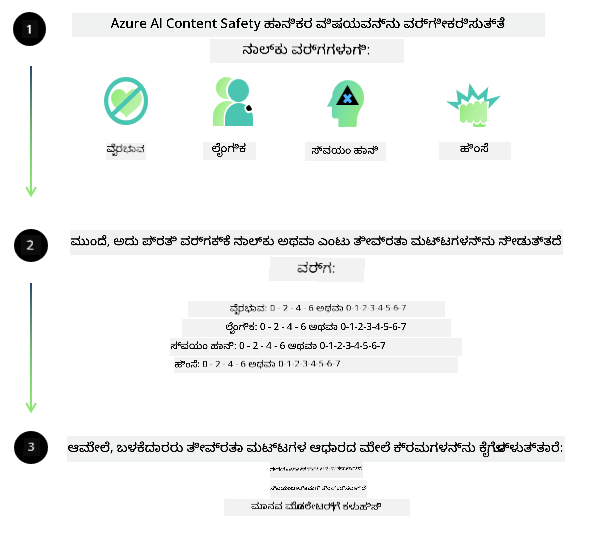

<!--
CO_OP_TRANSLATOR_METADATA:
{
  "original_hash": "c8273672cc57df2be675407a1383aaf0",
  "translation_date": "2025-12-21T23:27:54+00:00",
  "source_file": "md/01.Introduction/01/01.AISafety.md",
  "language_code": "kn"
}
-->
# Phi ಮಾದರಿಗಳಿಗಾಗಿ AI ಸುರಕ್ಷತೆ
The Phi family of models were developed in accordance with the [Microsoft Responsible AI Standard](https://query.prod.cms.rt.microsoft.com/cms/api/am/binary/RE5cmFl), which is a company-wide set of requirements based on the following six principles: accountability, transparency, fairness, reliability and safety, privacy and security, and inclusiveness which form [Microsoft’s Responsible AI principles](https://www.microsoft.com/ai/responsible-ai). 

ಹಿಂದಿನ Phi ಮಾದರಿಗಳಂತೆ, ಬಹುಮುಖ ಸುರಕ್ಷತಾ ಮೌಲ್ಯಮಾಪನ ಮತ್ತು ತರಬೇತಿ-ನಂತರದ ಸುರಕ್ಷತಾ ಕ್ರಮವನ್ನು ಅಳವಡಿಸಲಾಗಿದ್ದು, ಈ ಬಿಡುಗಡೆದ ಬಹುಭಾಷಾ ಸಾಮರ್ಥ್ಯಗಳನ್ನು ಪರಿಗಣಿಸಲು ಹೆಚ್ಚುವರಿ ಕ್ರಮಗಳನ್ನು ತೆಗೆದುಕೊಳ್ಳಲಾಗಿದೆ. ಬಹುಭಾಷಾ ಪರೀಕ್ಷೆಗಳು ಮತ್ತು ռಿಸ್ಕ್ ವರ್ಗಗಳನ್ನು ಒಳಗೊಂಡಿರುವ ಸುರಕ್ಷತಾ ತರಬೇತಿ ಮತ್ತು ಮೌಲ್ಯಮಾಪನದ ನಮ್ಮ ವಿಧಾನವನ್ನು [Phi Safety Post-Training Paper](https://arxiv.org/abs/2407.13833) ನಲ್ಲಿ ವಿವರಿಸಲಾಗಿದೆ. ಈ ವಿಧಾನದಿಂದ Phi ಮಾದರಿಗಳು ಲಾಭಾಂಶ ಪಡೆಯುವಾಗಲೂ, ಅಭಿವೃದ್ಧಿಕರ್ತರು ತಮ್ಮ ನಿರ್ದಿಷ್ಟ ಬಳಕೆ ಪ್ರಕರಣ ಮತ್ತು ಸಾಂಸ್ಕೃತಿಕ ಹಾಗೂ ಭಾಷಾ ಪ್ರಸಂಗವನ್ನು ಗಮನದಲ್ಲಿ ಇಟ್ಟುಕೊಂಡು ಜವಾಬ್ದಾರಿಯುತ AI ಅತ್ಯುತ್ತಮ ಅಭ್ಯಾಸಗಳನ್ನು ಅನ್ವಯಿಸಬೇಕು ಹಾಗೂ ಅಪಾಯಗಳನ್ನು ನkaart, ಅಳೆಯೋದು ಮತ್ತು ಕಡಿಮೆ ಮಾಡುವುದಕ್ಕಾಗಿ ಕ್ರಮಗಳನ್ನು ಕೈಗೊಳ್ಳಬೇಕು.

## ಉತ್ತಮ ಅಭ್ಯಾಸಗಳು

ಇತರ ಮಾದರಿಗಳಂತೆ, Phi ಕುಟುಂಬದ ಮಾದರಿಗಳು ಅನ್ಯಾಯಕರ, ಅವಿಶ್ವಾಸಾರ್ಹ ಅಥವಾ ಅಪಮಾನಕಾರಿ ರೀತಿಯಲ್ಲಿ ವರ್ತಿಸಬಹುದು.

SLM ಮತ್ತು LLM ನ ಕೆಲವು ನಿಯಂತ್ರಣಾತ್ಮಕ ವರ್ತನೆಗಳು ನೀವು ತಿಳಿದಿರಬೇಕಾದವುಗಳೆಂದರೆ:

- **ಸೆವೆಯ ಗುಣಮಟ್ಟ:** Phi ಮಾದರಿಗಳನ್ನು ಪ್ರಧಾನವಾಗಿ ಇಂಗ್ಲಿಷ್ ಪಠ್ಯದ ಮೇಲೆ ತರಬೇತಿಸಲಾಗಿದ್ದುದು. ಇಂಗ್ಲಿಷ್ ಹೊರಗಿನ ಭಾಷೆಗಳು ಕಡಿಮೆ ಕಾರ್ಯಕ್ಷಮತೆಯನ್ನು ಅನುಭವಿಸಬಹುದು. ತರಬೇತಿ ಡೇಟಾದಲ್ಲಿ ಕಡಿಮೆ ಪ್ರತಿನಿಧಾನವಿರುವ ಇಂಗ್ಲಿಷ್ ಭಾಷಾ ರೂಪಗಳು ಮಾನಕ ಅಮೆರಿಕನ್ ಇಂಗ್ಲಿಷ್ ಗಿಂತ ಕೆಟ್ಟ ಕಾರ್ಯಕ್ಷಮತೆಯನ್ನು ಅನುಭವಿಸಬಹುದು.
- **ಹಾನಿಗಳ ಪ್ರತಿನಿಧಾನ ಮತ್ತು ಸ್ಟೇರಿಯೋಟೈಪುಗಳ ಮುಂದುವರಿಕೆ:** ಈ ಮಾದರಿಗಳು ಜನಗಳ ಗುಂಪುಗಳನ್ನು ಹೆಚ್ಚುವರಿ ಅಥವಾ ಕಡಿಮೆ ಪ್ರತಿನಿಧಿಸುತ್ತವೆ, ಕೆಲವು ಗುಂಪುಗಳ ಪ್ರತಿನಿಧಾನವನ್ನು ಅಳಿಸಿಕೊಡಬಹುದು, ಅಥವಾ ಅವಮಾನಕಾರಿ ಅಥವಾ ನಕಾರಾತ್ಮಕ ಸ್ಟೀರಿಯೋಟೈಪ್‌ಗಳನ್ನು ಬಲಪಡಿಸಬಹುದು. ಸುರಕ್ಷತಾ ತರಬೇತಿಗಳನ್ನು ಮಾಡಿದರೂ, ವಿಭಿನ್ನ ಗುಂಪುಗಳ ಪ್ರತಿನಿಧಾನದ ವ್ಯತ್ಯಾಸಗಳು ಅಥವಾ ತರಬೇತಿ ಡೇಟಾದಲ್ಲಿ ನಕಾರಾತ್ಮಕ ಸ್ಟೀರಿಯೋಟೈಪ್ ಉದಾಹರಣೆಗಳ ಪ್ರಚಲಿತತೆಗಳ ಕಾರಣದಿಂದ ಈ ಮಿತಿ ಗಳು ಇನ್ನೂ ಇದ್ದಿರಬಹುದು, ಇದು ನೈಜ-ಜಗತ್ತಿನ ಬೇಡಿಕೆಗಳು ಮತ್ತು ಸಮಾಜಾತ್ಮಕ ಪೂರ್ವಾಗ್ರಹಗಳನ್ನು ಪ್ರತಿಬಿಂಬಿಸಬಹುದು.
- **ಅಸಂಗತ ಅಥವಾ ಅಪಮಾನಕಾರಿ ವಿಷಯ:** ಈ ಮಾದರಿಗಳು ಇತರ ವಿಧದ ಅಸಂಗತ ಅಥವಾ ಅಪಮಾನಕಾರಿ ವಿಷಯವನ್ನು ಉತ್ಪಾದಿಸಬಹುದು, இதೆಯು ಸಂವೇದನಶೀಲ প্ৰಸಂಗಗಳಿಗೆ ನಿರ್ವಹಣೆಗೆ ಅನುವೂಪಯುಕ್ತವಾಗದಿರಬಹುದು ಮತ್ತು ಬಳಕೆ-ಕೇಸಿಗೆ ನಿರ್ದಿಷ್ಟ ಹೆಚ್ಚುವರಿ ತಡೆಗಟ್ಟುವಿಕೆಗಳು ಅಗತ್ಯವிருக்கಬಹುದು.
Information Reliability: Language models can generate nonsensical content or fabricate content that might sound reasonable but is inaccurate or outdated.
- **ಕೋಡ್‌ಗೆ ಸೀಮಿತ ವ್ಯಾಪ್ತಿ:** Phi-3 ತರಬೇತಿ ಡೇಟಾದ ಬಹುಮತವು Python ನ ಆಧಾರದ ಮೇಲಿದ್ದು "typing, math, random, collections, datetime, itertools" ಮುಂತಾದ ಸಾಮಾನ್ಯ ಪ್ಯಾಕೇಜ್‌ಗಳನ್ನು ಬಳಸುತ್ತದೆ. ಮಾದರಿ Python ಸ್ಕ್ರಿಪ್ಟ್‌ಗಳನ್ನು 생성ಿಸಿ ಇತರ ಪ್ಯಾಕೇಜ್‌ಗಳು ಅಥವಾ ಇತರ ಭಾಷೆಗಳ ಸ್ಕ್ರಿಪ್ಟ್‌ಗಳನ್ನು ಬಳಸಿದರೆ, ಬಳಕೆದಾರರು ಎಲ್ಲಾ API ಬಳಕೆಗಳನ್ನು ಕೈಯಿಂದ ಪರಿಶೀಲಿಸುವದನ್ನು ನಾವು ಗಟ್ಟಿಯಾಗಿ ಶಿಫಾರಸು ಮಾಡುತ್ತೇವೆ.

ಅಭಿವೃದ್ಧಿಕರ್ತರು ಜವಾಬ್ದಾರಿಯುತ AI ಅತ್ಯುತ್ತಮ ಅಭ್ಯಾಸಗಳನ್ನು ಅನ್ವಯಿಸಬೇಕು ಮತ್ತು ನಿರ್ದಿಷ್ಟ ಬಳಕೆ ಪ್ರಕರಣವು ಸಂಬಂಧಿಸಿದ ಕಾನೂನುಗಳು ಮತ್ತು ನಿಯಮಾವಳಿಗಳಿಗೆ (ಉದಾ: ಗುಪ್ತೀಕರಣ, ವ್ಯಾಪಾರಿ ನಿಯಮಗಳು ಮುಂತಾದವು) ಅನುಕೂಲವಾಗಿರುವುದನ್ನು ಖಾತ್ರಿ ಪಡಿಸುವ ಜವಾಬ್ದಾರಿ ಅವರ ಮೇಲಿದೆ. 

## ಜವಾಬ್ದಾರಿಯುತ AI ಪರಿಗಣನೆಗಳು

ಇತರ ಭಾಷಾ ಮಾದರಿಗಳಂತೆ, Phi ಸರಣಿ ಮಾದರಿಗಳು ಅನ್ಯಾಯಕರ, ಅವಿಶ್ವಾಸಾರ್ಹ, ಅಥವಾ ಅಪಮಾನಕಾರಿ ರೀತಿಯಲ್ಲಿ ವರ್ತಿಸಬಹುದು. ಗಮನದಲ್ಲಿರಿಸಬೇಕಾದ ಕೆಲವು ನಿಯಂತ್ರಣಾತ್ಮಕ ವರ್ತನೆಗಳು:

** ಸೆವೆಯ ಗುಣಮಟ್ಟ:** Phi ಮಾದರಿಗಳನ್ನು ಪ್ರಧಾನವಾಗಿ ಇಂಗ್ಲಿಷ್ ಪಠ್ಯದ ಮೇಲೆ ತರಬೇತಿಸಲಾಗಿದ್ದುದು. ಇಂಗ್ಲಿಷ್ ಹೊರಗಿನ ಭಾಷೆಗಳು ಕಡಿಮೆ ಕಾರ್ಯಕ್ಷಮತೆಯನ್ನು ಅನುಭವಿಸಬಹುದು. ತರಬೇತಿ ಡೇಟಾದಲ್ಲಿ ಕಡಿಮೆ ಪ್ರತಿನಿಧಾನವಿರುವ ಇಂಗ್ಲಿಷ್ ಭಾಷಾ ರೂಪಗಳು ಮಾನಕ ಅಮೆರಿಕನ್ ಇಂಗ್ಲಿಷ್ ಗಿಂತ ಕೆಟ್ಟ ಕಾರ್ಯಕ್ಷಮತೆಯನ್ನು ಅನುಭವಿಸಬಹುದು.

**ಹಾನಿಗಳ ಪ್ರತಿನಿಧಾನ ಮತ್ತು ಸ್ಟೇರಿಯೋಟೈಪುಗಳ ಮುಂದುವರಿಕೆ:** ಈ ಮಾದರಿಗಳು ಜನರ ಗುಂಪುಗಳನ್ನು ಹೆಚ್ಚಾಗಿ ಅಥವಾ ಕಡಿಮೆ ಪ್ರತಿನಿಧಿಸಬಹುದು, ಕೆಲವು ಗುಂಪುಗಳ ಪ್ರತಿನಿಧಾನವನ್ನು ಅಳಿಸಬಹುದು, ಅಥವಾ ಅವಮಾನಕಾರಿ ಅಥವಾ ನಕಾರಾತ್ಮಕ ಸ್ಟೀರಿಯೋಟೈಪ್ಗಳನ್ನು ಬಲಪಡಿಸಬಹುದು. ಸುರಕ್ಷತಾ ತರಬೇತಿಯನ್ನು ಮಾಡಿದರೂ, ವಿಭಿನ್ನ ಗುಂಪುಗಳ ಪ್ರತಿನಿಧಾನದ ಮಟ್ಟಗಳಲ್ಲಿ ವ್ಯತ್ಯಾಸಗಳು ಅಥವಾ ತರಬೇತಿ ಡೇಟಾದಲ್ಲಿನ ನಕಾರಾತ್ಮಕ ಸ್ಟೀರಿಯೋಟೈಪ್ ಉದಾಹರಣೆಗಳ ವ್ಯಾಪಕತೆ ನೈಜ-ಜಗತ್ತಿನ ಮಾದರಿಗಳು ಮತ್ತು ಸಮಾಜಾತ್ಮಕ ಪೂರ್ವಾಗ್ರಹಗಳನ್ನು ಪ್ರತಿಬಿಂಬಿಸುವುದರಿಂದ ಈ ಮಿತಿಗಳು ಇನ್ನೂ ಇರುವ ಸಾಧ್ಯತೆ ಇದೆ.

**ಅಸಂಗತ ಅಥವಾ ಅಪಮಾನಕಾರಿ ವಿಷಯ:** ಈ ಮಾದರಿಗಳು ಇತರ ವಿಧದ ಅಸಂಗತ ಅಥವಾ ಅಪಮಾನಕಾರಿ ವಿಷಯವನ್ನು ಉತ್ಪಾದಿಸಬಹುದು, ಇದು ಸಂವೇದನಶೀಲ ಪ್ರಾಂಗಣಿಕಗಳಲ್ಲಿ ಅನ್ವಯಿಸಲು ಅಪ್ರಯೋಜನಕಾರಿಯಾಗಬಹುದು ಇಲ್ಲವೇ ಬಳಕೆ-ಕೇಸು ನಿರ್ದಿಷ್ಟ ಹೆಚ್ಚಿನ ತಡೆಗಟ್ಟುವಿಕೆಗಳ ಅಗತ್ಯವಿರಬಹುದು.
Information Reliability: Language models can generate nonsensical content or fabricate content that might sound reasonable but is inaccurate or outdated.

**ಕೋಡ್‌ಗೆ ಸೀಮಿತ ವ್ಯಾಪ್ತಿ:** Phi-3 ತರಬೇತಿ ಡೇಟಾದ ಬಹುಮತವು Python ಆಧಾರಿತವಾಗಿದೆ ಮತ್ತು "typing, math, random, collections, datetime, itertools" ಮುಂತಾದ ಸಾಮಾನ್ಯ ಪ್ಯಾಕೇಜ್‌ಗಳನ್ನು ಬಳಸುತ್ತದೆ. ಮಾದರಿ Python ಸ್ಕ್ರಿಪ್ಟ್‌ಗಳನ್ನು ಉತ್ಪಾದಿಸಿ ಇತರ ಪ್ಯಾಕೇಜ್‌ಗಳು ಅಥವಾ ಇತರ ಭಾಷೆಗಳ ಸ್ಕ್ರಿಪ್ಟ್‌ಗಳು ಬಳಸಿದರೆ, ಬಳಕೆದಾರರು ಎಲ್ಲಾ API ಬಳಕೆಗಳನ್ನು ಕೈಯಿಂದ ಪರಿಶೀಲಿಸುವದನ್ನು ನಾವು ಗಟ್ಟಿಯಾಗಿ ಶಿಫಾರಸು ಮಾಡುತ್ತೇವೆ.

ಅಭಿವೃದ್ಧಿಕರ್ತರು ಜವಾಬ್ದಾರಿಯುತ AI ಉತ್ತಮ ಅಭ್ಯಾಸಗಳನ್ನು ಅನುಸರಿಸಬೇಕು ಮತ್ತು ನಿರ್ದಿಷ್ಟ ಬಳಕೆ ಪ್ರಕರಣವು ಸಂಬಂಧಿಸಿದ ಕಾನೂನುಗಳು ಮತ್ತು ನಿಯಮಾವಳಿಗಳಿಗೆ (ಉದಾ: ಗೌಪ್ಯತೆ, ವ್ಯಾಪಾರ, ಇತ್ಯಾದಿ) ಅನುಸಾರವಾಗಿರುವುದನ್ನು ಖಾತ್ರಿಪಡಿಸುವ ಜವಾಬ್ದಾರಿಯು ಅವರ ಮೇಲೆ ಇದೆ. ಪರಿಗಣಿಸುವ ಪ್ರಮುಖ ಪ್ರದೇಶಗಳು ಒಳಗೊಂಡಿವೆ:

** ಹಂಚಿಕೆ:** ಮಾದರಿಗಳು ಕಾನೂನುಸ್ಥಿತಿ ಅಥವಾ ಸಂಪನ್ಮೂಲಗಳ ಹಂಚಿಕೆಯ ಮೇಲೆ ಅಥವಾ ಜೀವನಾವಕಾಶಗಳ ಹಂಚಿಕೆಗೆ ಗುರುತಾರ್ಹವಾದ ಪರಿಣಾಮ ಬೀರುವ ಸಂದರ್ಭಗಳಿಗೆ (ಉದಾ: housing, employment, credit, ಇತ್ಯಾದಿ) ಸೂಕ್ತವಾಗಿಲ್ಲವಾಗಬಹುದು, ಹೆಚ್ಚಿನ ಮೌಲ್ಯಮಾಪನಗಳು ಮತ್ತು ಹೆಚ್ಚಿದ ದೋೋಷಶುಧ್ಧಿ ತಂತಿಗಳನ್ನು ಹೊರತುಪಡಿಸಿ.

**ಉನ್ನತ-ಜೋಖಿಮ ದೃಶ್ಯಗಳು:** ಅನ್ಯಾಯಕರ, ಅವಿಶ್ವಾಸಾರ್ಹ ಅಥವಾ ಅಪಮಾನಕಾರಿ ಔಟ್‌ಪುಟ್‌ಗಳು ಅತ್ಯಂತ ದುಬಾರಿಗೆ ಅಥವಾ ಹಾನಿಗೆ ಕಾರಣವಾಗಬಹುದಾದ ಉನ್ನತ-ಜೋಖಿಮ ದೃಶ್ಯಗಳಲ್ಲಿ ಮಾದರಿಗಳನ್ನು ಬಳಸಲು ತಕ್ಕಮಟ್ಟಿಗೆ ಯೋಗ್ಯತೆಯನ್ನು ಅಭಿವೃದ್ಧಿಕರ್ತರು ಮೌಲ್ಯಮಾಪನ ಮಾಡಬೇಕು. ಇದರಲ್ಲಿ ನಿಖರತೆ ಮತ್ತು ವಿಶ್ವಾಸಾರ್ಹತೆ ಅತ್ಯಂತ ಮುಖ್ಯವಾಗಿರುವ ಸಂವೇದನಶೀಲ ಅಥವಾ ನಿಪುಣ ಕ್ಷೇತ್ರಗಳಲ್ಲಿ ಸಲಹೆ ನೀಡುವುದು ಸೇರಿದೆ (ಉದಾ: ಕಾನೂನು ಅಥವಾ ಆರೋಗ್ಯ ಸಲಹೆ). ನಿಯೋಜನೆ ಸಂದರ್ಭದಲ್ಲಿ ಅಪ್ಲಿಕೇಶನ್ ಮಟ್ಟದಲ್ಲಿ ಹೆಚ್ಚುವರಿ ಭದ್ರತಾ ಕ್ರಮಗಳನ್ನು ಜಾರಿಗೆ ತರಬೇಕು.

**ತಪ್ಪು ಮಾಹಿತಿ:** ಮಾದರಿಗಳು ತಪ್ಪು ಮಾಹಿತಿ ಉತ್ಪಾದಿಸಬಹುದು. ಅಭಿವೃದ್ಧಿಕರ್ತರು ಪಾರದರ್ಶಕತೆ ಉತ್ತಮ ಅಭ್ಯಾಸಗಳನ್ನು ಅನುಸರಿಸಬೇಕು ಮತ್ತು ಅಂತಿಮ ಬಳಕೆದಾರರಿಗೆ ಅವರು AI ವ್ಯವಸ್ಥೆಯೊಂದನ್ನು ಬಳಸುತ್ತಿರುವುದಾಗಿ ತಿಳಿಸಬೇಕು. ಅಪ್ಲಿಕೇಶನ್ ಮಟ್ಟದಲ್ಲಿ, ಬಳಕೆ-ಕೇಸು ನಿರ್ದಿಷ್ಟ, ಸಂದರ್ಭಾತ್ಮಕ ಮಾಹಿತಿಯಲ್ಲಿ ಉತ್ತರಗಳನ್ನು ನೆಲಮಟ್ಟಗೊಳಿಸಲು ಪ್ರತಿಕ್ರಿಯಾ ಯಂತ್ರಗಳು ಮತ್ತು ಪೈಪುಲೈನ್‌ಗಳನ್ನು ನಿರ್ಮಿಸಬಹುದು, ಇದನ್ನು Retrieval Augmented Generation (RAG) ಎಂದು ಕರೆಯಲಾಗುತ್ತದೆ.

**ಹಾನಿಕಾರಕ ವಿಷಯದ ರಚನೆ:** ಬಳಕೆ-ಕೇಸಿನ ಪ್ರಾಸಂಗಿಕತೆಗೆ ಅನುಗುಣವಾಗಿ ಔಟ್‌ಪುಟ್‌ಗಳನ್ನು ಮೌಲ್ಯಮಾಪನ ಮಾಡಿ ಮತ್ತು ಲಭ್ಯವಿರುವ ಸುರಕ್ಷತಾ ವರ್ಗೀಕರಣಶೀಲಕಗಳು ಅಥವಾ ನಿಮ್ಮ ಬಳಕೆ-ಕೇಸಿಗೆ ತಕ್ಕಂತೆ ಕಸ್ಟಮ್ ಪರಿಹಾರಗಳನ್ನು ಬಳಸಿರಿ.

** ದುರುಪಯೋಗ:** ವಂಚನೆ, സ്‍ಪ್ಯಾಮ್ ಅಥವಾ ಮಾಲ್ವೇರ್ ಉತ್ಪಾದನೆ ಮುಂತಾದ ಇತರ ದುರುಪಯೋಗ ರೂಪಗಳು ಸಂಭವನೀಯವಾಗಬಹುದು, ಮತ್ತು ಅಭಿವೃದ್ಧಿಕರ್ತರು ಅವರ ಅಪ್ಲಿಕೇಶನ್‌ಗಳು ಅನ್ವಯಿಸುವ ಕಾನೂನುಗಳು ಮತ್ತು ನಿಯಮಾವಳಿಗಳನ್ನು ಉಲ್ಲಂಘಿಸದಂತೆ ಖಾತ್ರಿ ಮಾಡಿಕೊಳ್ಳಬೇಕು.

### ಫೈನ್ಟ್ಯೂನಿಂಗ್ ಮತ್ತು AI ವಿಷಯ ಭದ್ರತೆ

ಮಾದರಿಯನ್ನು ಫೈನ್ಟ್ಯೂನ್ ಮಾಡಿದ ನಂತರ, ಮಾದರಿಗಳು ಉತ್ಪಾದಿಸುವ ವಿಷಯವನ್ನು ಮೇಲ್ವಿಚಾರಣೆ ಮಾಡಲು, ಸಾಧ್ಯವಿರುವ ಅಪಾಯಗಳು, ಬೆದರಿಕೆಗಳು ಮತ್ತು ಗುಣಮಟ್ಟದ ಸಮಸ್ಯೆಗಳನ್ನು ಗುರುತಿಸಲು ಮತ್ತು ತಡೆಗಟ್ಟಲು ನಾವು [Azure AI Content Safety](https://learn.microsoft.com/azure/ai-services/content-safety/overview) ಕ್ರಮಗಳನ್ನು ಬಳಸುವನ್ನು ಬಹುಮಾನವಾಗಿ ಶಿಫಾರಸು ಮಾಡುತ್ತೇವೆ.

[Azure AI Content Safety](https://learn.microsoft.com/azure/ai-services/content-safety/overview) ಪಠ್ಯ ಮತ್ತು ಚಿತ್ರ ವಿಷಯ ಎರಡನ್ನೂ ಬೆಂಬಲಿಸುತ್ತದೆ. ಇದನ್ನು ಕ್ಲೌಡ್‌ನಲ್ಲಿ, disconnected containers ಮತ್ತು edge/embedded ಸಾಧನಗಳಲ್ಲಿ ನಿಯೋಜಿಸಬಹುದು.

## Azure AI Content Safety ಪರಿಚಯ

Azure AI Content Safety ಒಂದು ಒಂದೇ-ಪ್ರಕಾರದ ಪರಿಹಾರವಲ್ಲ; ಇದನ್ನು ವ್ಯವಹಾರಗಳ ವಿಶೇಷ ನೀತಿಗಳೊಂದಿಗೆ ಹೊಂದಿಕೊಳಿಸುವಂತೆ ಕಸ್ಟಮೈಸ್ ಮಾಡಬಹುದು. ಹೆಚ್ಚಾಗಿ, ಅದರ ಬಹುಭಾಷಾ ಮಾದರಿಗಳು ಒಂದೇ ವೇಳೆ 여러 ಭಾಷೆಗಳನ್ನು ಅರ್ಥಮಾಡಿಕೊಳ್ಳುವ ಶಕ್ತಿಯನ್ನು ಒದಗಿಸುತ್ತವೆ.

- **Azure AI Content Safety**
- **Microsoft Developer**
- **5 ವೀಡಿಯೊಗಳು**

Azure AI Content Safety ಸೇವೆ ಅಪ್ಲಿಕೇಶನ್‌ಗಳು ಮತ್ತು ಸೇವೆಗಳಲ್ಲಿ ಹಾನಿಕಾರಕ ಬಳಕೆದಾರ-ಉತ್ಪಾದಿತ ಮತ್ತು AI-ಉತ್ಪಾದಿತ ವಿಷಯವನ್ನು ಪತ್ತೆಹಚ್ಚುತ್ತದೆ. ಇದು ಪಠ್ಯ ಮತ್ತು ಚಿತ್ರ API ಗಳನ್ನು ಒಳಗೊಂಡಿದೆ, ಇವು ಹಾನಿಕಾರಕ ಅಥವಾ ಅಸಂಗತ ವಸ್ತುಗಳನ್ನು ಪತ್ತೆಹಚ್ಚಲು ನಿಮಗೆ ಅವಕಾಶ ನೀಡುತ್ತವೆ.

[AI ವಿಷಯ ಭದ್ರತೆ ಪ್ಲೇಲಿಸ್ಟ್](https://www.youtube.com/playlist?list=PLlrxD0HtieHjaQ9bJjyp1T7FeCbmVcPkQ)

---

<!-- CO-OP TRANSLATOR DISCLAIMER START -->
ನಿರಾಕರಣೆ:
ಈ ದಸ್ತಾವೇಜನ್ನು AI ಅನುವಾದ ಸೇವೆ [Co-op Translator](https://github.com/Azure/co-op-translator) ಬಳಸಿ ಅನುವಾದಿಸಲಾಗಿದೆ. ನಾವು ನಿಖರತೆಯನ್ನು ಸಾಧಿಸಲು ಪ್ರಯತ್ನಿಸುತ್ತಿದ್ದರೂ, ಸ್ವಯಂಚಾಲಿತ ಅನುವಾದಗಳಲ್ಲಿ ತಪ್ಪುಗಳು ಅಥವಾ ಅಸತ್ಯತೆಗಳಿರಬಹುದೆಂದು ದಯವಿಟ್ಟು ಗಮನಿಸಿ. ಮೂಲ ದಸ್ಟಾವೇಜನ್ನು ಅದರ ಮೂಲ ಭಾಷೆಯಲ್ಲಿ ಅಧಿಕೃತ ಮೂಲವಾಗಿ ಪರಿಗಣಿಸಬೇಕು. ನಿರ್ಣಾಯಕ ಮಾಹಿತಿಗಾಗಿ ವೃತ್ತಿಪರ ಮಾನವ ಅನುವಾದವನ್ನು ಶಿಫಾರಸು ಮಾಡಲಾಗುತ್ತದೆ. ಈ ಅನುವಾದದ ಬಳಕೆಯಿಂದ ಉಂಟಾದ ಯಾವುದೇ ಅಸಮಂಜಸದತೆಗಳು ಅಥವಾ ತಪ್ಪು ವ್ಯಾಖ್ಯಾನಗಳಿಗಾಗಿ ನಾವು ಹೊಣೆಗಾರರಲ್ಲ.
<!-- CO-OP TRANSLATOR DISCLAIMER END -->