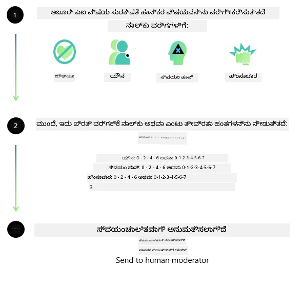
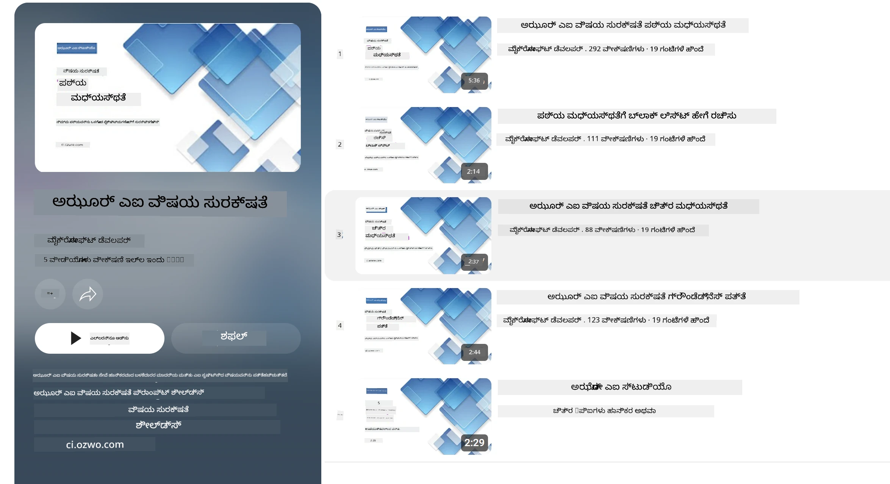

# Phi ಮಾದರಿಗಳಿಗಾಗಿ AI ಸುರಕ್ಷತೆ
Phi ಮಾದರಿಗಳ ಕುಟುಂಬ [ಮೈಕ್ರೋಸಾಫ್ಟ್ ಜವಾಬ್ದಾರಿಯುತ AI ಮಾನದಂಡ](https://www.microsoft.com/ai/principles-and-approach#responsible-ai-standard) ಅನುಸಾರವಾಗಿ ಅಭಿವೃದ್ಧಿಪಡಿಸಲಾಗಿದ್ದು, ಇದು ಕಂಪನಿಯ ಮಟ್ಟದ ಷರತ್ತುಗಳ ಸರಣಿಯಾಗಿದ್ದು, ಕೆಳಗಿನ ಆರು ತತ್ವಗಳ ಮೇಲೆ ಆಧಾರಿತವಾಗಿದೆ: ಜವಾಬ್ದಾರಿ, ಪಾರದರ್ಶಕತೆ, ನ್ಯಾಯತಂ, ವಿಶ್ವಾಸಾರ್ಹತೆ ಮತ್ತು ಸುರಕ್ಷತೆ, ಗೌಪ್ಯತೆ ಮತ್ತು ಭದ್ರತೆ, ಮತ್ತು ಒಳಗೊಳಿಸುವಿಕೆ, ಮತ್ತು ಇದು [ಮೈಕ್ರೋಸಾಫ್ಟ್ ಜವಾಬ್ದಾರಿಯುತ AI ತತ್ವಗಳು](https://www.microsoft.com/ai/responsible-ai) ಅನ್ನು ರೂಪಿಸುತ್ತದೆ.

ಹಿಂದಿನ Phi ಮಾದರಿಗಳಂತೆ, ಬಹುಮುಖ ಸುರಕ್ಷತಾ ಮೌಲ್ಯಮಾಪನ ಮತ್ತು ಸುರಕ್ಷತಾ ನಂತರ ತರಬೇತಿ ವಿಧಾನವನ್ನು ಸ್ವೀಕರಿಸಲಾಗಿದೆ, ಈ ಬಿಡುಗಡೆದ ಬಹು-ಭಾಷಾ ಸಾಮರ್ಥ್ಯಗಳನ್ನು ಪರಿಗಣಿಸಲು ಹೆಚ್ಚುವರಿ ಕ್ರಮಗಳನ್ನು ಕೈಗೊಂಡಾಗಿದೆ. ಬಹುಭಾಷಾ ಮತ್ತು ಅಪಾಯ ವರ್ಗಗಳಾದ್ಯಂತ ಪರೀಕ್ಷೆಗಳನ್ನು ಒಳಗೊಂಡಂತಿರುವ ನಮ್ಮ ಸುರಕ್ಷತೆ ತರಬೇತಿ ಮತ್ತು ಮೌಲ್ಯಮಾಪನಕ್ಕೆ ಸಂಬಂಧಿಸಿದ ಕ್ರಮವನ್ನು [Phi ಸುರಕ್ಷತೆ ನಂತರ-ತರಬೇತಿ ಪತ್ರಿಕೆಯಲ್ಲಿ](https://arxiv.org/abs/2407.13833) ವಿವರಿಸಲಾಗಿದೆ. Phi ಮಾದರಿಗಳು ಈ ವಿಧಾನದಿಂದ ಅನುಕೂಲ ಪಡೆಯುತ್ತವೆ, ಆದರೆ ಅಭಿವೃದ್ಧಿಪಡಿಸುವವರು ತಮ್ಮ ವಿಶಿಷ್ಟ ಬಳಕೆಯು ಮತ್ತು ಸಾಂಸ್ಕೃತಿಕ ಮತ್ತು ಭಾಷಾತ್ಮಕ ಪರಿಸರವನ್ನು ಪರಿಗಣಿಸಿ ಜವಾಬ್ದಾರಿಯುತ AI ಉತ್ತಮ ವಿಧಾನಗಳನ್ನು ಅನ್ವಯಿಸಬೇಕು,-risk ನಕ್ಷೆ ಮಾಡುವಿಕೆ, ಪ್ರಮಾಪಣ ಮತ್ತು ನಿವಾರಣೆಯನ್ನು ಒಳಗೊಂಡಂತೆ.

## ಉತ್ತಮ ವಿಧಿಗಳು

ಇತರ ಮಾದರಿಗಳಂತೆಯೇ, Phi ಮಾದರಿಗಳ ಕುಟುಂಬವು ಅನ್ಯಾಯ, ಅವಿಶ್ವಾಸಾರ್ಹ ಅಥವಾ ಅಪಮಾನಕಾರಿ ರೀತಿಯಲ್ಲಿ ವರ್ತಿಸಬಹುದಾಗಿರುತ್ತದೆ.

SLM ಮತ್ತು LLM ರ ಕೆಲ ನಿರ್ಬಂಧಿತ ವರ್ತನೆಗಳು ನಿಮಗೆ ತಿಳಿವಳಿಕೆಯಾಗಿ ಇರಬೇಕಾದವುಗಳು:

- **ಸೇವೆ ಗುಣಮಟ್ಟ:** Phi ಮಾದರಿಗಳು ಮುಖ್ಯವಾಗಿ ಇಂಗ್ಲಿಷ್ ಪಠ್ಯದ ಮೇಲೆ ತರಬೇತಿಯನ್ನು ಪಡೆದಿವೆ. ಇಂಗ್ಲಿಷ್ ಇದನ್ನು ಹೊರತುಪಡಿಸಿದ ಭಾಷೆಗಳು ಕೆಟ್ಟ ಪ್ರದರ್ಶನ ಅನುಭವಿಸಬಹುದು. ತರಬೇತಿ ಡೇಟಾದಲ್ಲಿ ಕಡಿಮೆ ಪ್ರತಿನಿಧೀಕರಣ ಇರುವ ಇಂಗ್ಲಿಷ್ ಭಾಷಾ ಬಗೆಗಳು ಸಾಮಾನ್ಯ ಅಮೆರಿಕನ್ ಇಂಗ್ಲಿಷ್ ಹೋಲಿಸಿದರೆ ಕೆಟ್ಟ ಪ್ರದರ್ಶನವನ್ನು ಅನುಭವಿಸಬಹುದು.
- **ನಷ್ಟಗಳ ಪ್ರತಿನಿಧಾನ ಮತ್ತು стереотипಗಳ ಮುಂದುವರಿಕೆ:** ಈ ಮಾದರಿಗಳು ಜನसमೂಹಗಳನ್ನು ಹೆಚ್ಚಾಗಿ ಅಥವಾ ಕಡಿಮೆ ಪ್ರತಿನಿಧಿಸಬಹುದು, ಕೆಲ ಸಮೂಹಗಳ ಪ್ರತಿನಿಧಾನವನ್ನು ಮಾಯಮಾಡಬಹುದು ಅಥವಾ ಹೀನಮಕ್ಕಳು ಅಥವಾ ನಕಾರಾತ್ಮಕ ಸ್ಟೆರಿಯೊಟೈಪ್ಗಳನ್ನು ಮತ್ತಷ್ಟು ಬಲಪಡಿಸಬಹುದು. ಸುರಕ್ಷತೆ ನಂತರ-ತರಬೇತಿ ಇದ್ದರೂ ಕೂಡ, ಬೇರೆಯ ಸಮೂಹಗಳ ವಿಭಿನ್ನ ಮಟ್ಟದ ಪ್ರತಿನಿಧಾನ ಅಥವಾ ತರಬೇತಿ ಡೇಟಾದಲ್ಲಿ ನಕಾರಾತ್ಮಕ ಸ್ಟೆರಿಯೋಟೈಪ್ನ ಉದಾಹರಣೆಗಳ ಪ್ರಚಲಿತತೆಯಿಂದ ಈ ಮಿತಿ ಸಮಸ್ಯೆಗಳು ಇನ್ನೂ ಇರುವುದು.
- **ಅನೌಚಿತ ಅಥವಾ ಅಪಮಾನಕಾರಿ ವಿಷಯ:** ಈ ಮಾದರಿಗಳು ಇನ್ನಿತರ ರೀತಿಯ ಅನೌಚಿತ ಅಥವಾ ಅಪಮಾನಕಾರಿ ವಿಷಯವನ್ನು ಉತ್ಪಾದಿಸಬಹುದು, ಮತ್ತು ಬಳಕೆಯ ವಿಶೇಷ ಪರಿಸ್ಥಿತಿಗೆ ಸಂಬಂಧಿಸಿದ ಹೆಚ್ಚುವರಿ ತಡೆಗಳನ್ನು ಇಲ್ಲದೆ ಸಿಂವೇದನಶೀಲ ಸಂದರ್ಭದಲ್ಲಿ ಬಳಸುವುದು ಅಸಮರ್ಪಕವಾಗಬಹುದು.
ಮಾಹಿತಿ ವಿಶ್ವಾಸಾರ್ಹತೆ: ಭಾಷಾ ಮಾದರಿಗಳು ಅರ್ಥವಿಲ್ಲದ ವಿಷಯವನ್ನು ಉತ್ಪಾದಿಸಬಹುದಾಗಿದೆ ಅಥವಾ ಸವಾಲು ಹೇಗೋ ತೋಚುವ ವಿಷಯವನ್ನು ಛಡಪಡಿಸಬಹುದು ಆದರೆ ಅದು ತಪ್ಪು ಅಥವಾ ಹಳೆಯದಾಗಿರಬಹುದು.
- **ಕೋಡ್ ಸಮಸ್ಯೆಯ ಸೀಮಿತ ವ್ಯಾಪ್ತಿ:** Phi-3 ತರಬೇತಿ ಡೇಟಾದ ಬಹುಮತ ಪೈಥಾನ್‌ನ ಮೇಲೆ ಆಧಾರಿತವಾಗಿದ್ದು, ಸಾಮಾನ್ಯ ಪ್ಯಾಕೇಜುಗಳನ್ನು ಬಳಸುತ್ತದೆ ಉದಾಹರಣೆಗೆ "typing, math, random, collections, datetime, itertools". ಮಾದರಿ ಪೈಥಾನ್ ಸ್ಕ್ರಿಪ್ಟ್‌ಗಳನ್ನು ರಚಿಸಿದರೆ, ಇತರ ಪ್ಯಾಕೇಜುಗಳನ್ನು ಅಥವಾ ಇತರ ಭಾಷೆಗಳ ಸ್ಕ್ರಿಪ್ಟ್‌ಗಳನ್ನು ಬಳಸಿದರೆ, ಬಳಕೆದಾರರು ಎಲ್ಲಾ API ಬಳಕೆಯನ್ನು ಕೈಯಾರೆ ಪರಿಶೀಲಿಸುವಂತೆ ನಾವು ಶಿಫಾರಸು ಮಾಡುತ್ತೇವೆ.

ಅಭಿವೃದ್ಧಿಪಡಿಸುವವರು ಜವಾಬ್ದಾರಿಯುತ AI ಅತ್ಯುತ್ತಮ ವಿಧಿಗಳನ್ನು ಅನ್ವಯಿಸಬೇಕು ಮತ್ತು ನಿರ್ದಿಷ್ಟ ಬಳಕೆಯು ಸಂಬಂಧಿಸಿದ ಕಾನೂನು ಮತ್ತು ನಿಯಮಗಳ (ಉದಾ: ಗೌಪ್ಯತೆ, ವ್ಯಾಪಾರ ಇತ್ಯಾದಿ) ಅನುಸರಣೆ ಮಾಡುವುದು அவரವರ ಜವಾಬ್ದಾರಿಯಾಗಿದೆ.

## ಜವಾಬ್ದಾರಿಯುತ AI ಪರಿಗಣನೆಗಳು

ಇತರ ಭಾಷಾ ಮಾದರಿಗಳಂತೆ, Phi ಸರಣಿಯ ಮಾದರಿಗಳು ಅನ್ಯಾಯ, ಅವಿಶ್ವಾಸಾರ್ಹ, ಅಥವಾ ಅಪಮಾನಕಾರಿ ರೀತಿಯಲ್ಲಿ ವರ್ತಿಸಬಹುದು. ತಿಳಿವಳಿಕೆಯಾಗಿ ಇರಬೇಕಾದ ಕೆಲವು ನಿರ್ಬಂಧಿತ ವರ್ತನೆಗಳು:

**ಸೇವೆ ಗುಣಮಟ್ಟ:** Phi ಮಾದರಿಗಳು ಮುಖ್ಯವಾಗಿ ಇಂಗ್ಲಿಷ್ ಪಠ್ಯದ ಮೇಲೆ ತರಬೇತಿಯನ್ನು ಪಡೆದಿವೆ. ಇಂಗ್ಲಿಷ್ ಹೊರತುಪಡಿಸಿದ ಭಾಷೆಗಳು ಕೆಟ್ಟ ಪ್ರದರ್ಶನ ಅನುಭವಿಸಬಹುದು. ತರಬೇತಿ ಡೇಟಾದಲ್ಲಿ ಕಡಿಮೆ ಪ್ರತಿನಿಧೈನ ಇರುವ ಇಂಗ್ಲಿಷ್ ಭಾಷಾ ಬಗೆಗಳು ಮಾದರಿಯ ಸಾಮಾನ್ಯ ಅಮೆರಿಕನ್ ಇಂಗ್ಲಿಷ್ ಹೋಲಿಸಿದರೆ ಕೆಟ್ಟ ಪ್ರದರ್ಶನ ಅನುಭವಿಸಬಹುದು.

**ನಷ್ಟಗಳ ಪ್ರತಿನಿಧಾನ ಮತ್ತು ಸ್ಟೆರಿಯೋಟೈಪ್ಗಳ ಮುಂದುವರಿಕೆ:** ಈ ಮಾದರಿಗಳು ಜನಸಮೂಹಗಳನ್ನು ಹೆಚ್ಚಾಗಿ ಅಥವಾ ಕಡಿಮೆ ಪ್ರತಿನಿಧಿಸಬಹುದು, ಕೆಲ ಸಮೂಹಗಳ ಪ್ರತಿನಿಧಾನವನ್ನು消失 ಮಾಡಬಹುದು ಅಥವಾ ಹೀನಮಕ್ಕಳು ಅಥವಾ ನಕಾರಾತ್ಮಕ ಸ್ಟೆರಿಯೋಟೈಪ್ಗಳನ್ನು ಮತ್ತಷ್ಟು ಬಲಪಡಿಸಬಹುದು. ಸುರಕ್ಷತೆ ನಂತರ-ತರಬೇತಿ ಇದ್ದರೂ ಕೂಡ, ವಿವಿಧ ಸಮೂಹಗಳ ಭಿನ್ನ ಮಟ್ಟದ ಪ್ರತಿನಿಧಾನ ಅಥವಾ ತರಬೇತಿ ಡೇಟಾದಲ್ಲಿ ನಕಾರಾತ್ಮಕ ಸ್ಟೆರಿಯೋಟೈಪ್ಗಳ ಉದಾಹರಣೆಗಳ ಚಾಲನೆ ನಿಜಜೀವನೀಯ ಮಾದರಿಗಳು ಮತ್ತು ಸಮಾಜದ ಬದ್ಧತೆಗಳನ್ನು phảnಾಯಿಸುತ್ತದೆ.

**ಅನೌಚಿತ ಅಥವಾ ಅಪಮಾನಕಾರಿ ವಿಷಯ:** ಈ ಮಾದರಿಗಳು ಇನ್ನಿತರ ರೀತಿಯ ಅನೌচিত ಅಥವಾ ಅಪಮಾನಕಾರಿ ವಿಷಯವನ್ನು ಉತ್ಪಾದಿಸಬಹುದು, ಮತ್ತು ಬಳಕೆಯ ವಿಶೇಷ ಪರಿಸ್ಥಿತಿಗೆ ಸಂಬಂಧಿಸಿದ ಹೆಚ್ಚುವರಿ ತಡೆಗಳನ್ನು ಇಲ್ಲದೆ ಸಿಂवेದನಶೀಲ ಸಂದರ್ಭದಲ್ಲಿ ಬಳಸುವುದು ಅಸಮರ್ಪಕವಾಗಬಹುದು.
ಮಾಹಿತಿ ವಿಶ್ವಾಸಾರ್ಹತೆ: ಭಾಷಾ ಮಾದರಿಗಳು ಅರ್ಥವಿಲ್ಲದ ವಿಷಯವನ್ನು ಉತ್ಪಾದಿಸಬಹುದು ಅಥವಾ ಅದಕ್ಕಾಗುವುದೇ ಸರಿಹೊದದೆಂದು ತೋಚುವ ವಿಷಯವನ್ನು ಛಡಪಡಿಸಬಹುದು, ಆದರೆ ಅದು ತಪ್ಪು ಅಥವಾ ಹಳೆಯದಾಗಿರಬಹುದು.

**ಕೋಡ್ ಸಮಸ್ಯೆಯ ಸೀಮಿತ ವ್ಯಾಪ್ತಿ:** Phi-3 ತರಬೇತಿ ಡೇಟಾದ ಬಹುಮತ ಪೈಥಾನ್‌ನ ಮೇಲೆ ಆಧಾರಿತವಾಗಿದ್ದು, ಸಾಮಾನ್ಯ ಪ್ಯಾಕೇಜುಗಳನ್ನು ಬಳಸುತ್ತದೆ ಉದಾ: "typing, math, random, collections, datetime, itertools". ಮಾದರಿ ಪೈಥಾನ್ ಸ್ಕ್ರಿಪ್ಟ್‌ಗಳನ್ನು ರಚಿಸಿದರೆ, ಇತರ ಪ್ಯಾಕೇಜುಗಳನ್ನು ಅಥವಾ ಇತರ ಭಾಷೆಗಳ ಸ್ಕ್ರಿಪ್ಟ್‌ಗಳನ್ನು ಬಳಸಿದರೆ, ಬಳಕೆದಾರರು ಎಲ್ಲಾ API ಬಳಕೆಯನ್ನು ಕೈಯಾರೆ ಪರಿಶೀಲಿಸುವಂತೆ ನಾವು ಶಿಫಾರಸು ಮಾಡುತ್ತೇವೆ.

ಅಭಿವೃದ್ಧಿಪಡಿಸುವವರು ಜವಾಬ್ದಾರಿಯುತ AI ಉತ್ತಮ ವಿಧಾನಗಳನ್ನು ಬಳಸಬೇಕು ಮತ್ತು ನಿರ್ದಿಷ್ಟ ಬಳಕೆಯು ಸಂಬಂಧಿಸಿದ ಕಾನೂನು ಮತ್ತು ನಿಯಮಗಳ (ಉದಾ: ಗೌಪ್ಯತೆ, ವ್ಯಾಪಾರ ಇತ್ಯಾದಿ) ಅನುಸರಣೆ ಮಾಡುವುದು ಅವರ ಜವಾಬ್ದಾರಿಯಾಗಿದೆ. ಪರಿಗಣನೆಗೆ ಪ್ರಮುಖ ಕ್ಷೇತ್ರಗಳು:

**ವಿಭಾಜನೆ:** ಮಾದರಿಗಳು ಕಾನೂನು ಸ್ಥಿತಿಗೆ ಅಥವಾ ಸಂಪನ್ಮೂಲಗಳು ಅಥವಾ ಜೀವನ ಅವಕಾಶಗಳ ಹಂಚಿಕೆಗೆ (ಉದಾ: ಗೃಹ, ಉದ್ಯೋಗ, ಕ್ರೆಡಿಟ್ ಇತ್ಯಾದಿ) ಪರಿಣಾಮಕಾರಿ ಪ್ರಭಾವ ಬೀರುವ ಸಂದರ್ಭಗಳಿಗೆ ಸೂಕ್ತವಾಗದಿರಬಹುದು, ಹೆಚ್ಚಿನ ಮೌಲ್ಯಮಾಪನಗಳು ಮತ್ತು ಹೆಚ್ಚುವರಿ ಬದ್ಧತೆ ತಂತ್ರಗಳನ್ನು ಅಗತ್ಯವಿರುತ್ತದೆ.

**ಉಚ್ಚ-ಅಪಾಯ ಪರಿಸ್ಥಿತಿಗಳು:** ಅನ್ಯಾಯ, ಅವಿಶ್ವಾಸಾರ್ಹ, ಅಥವಾ ಅಪಮಾನಕಾರಿ ಔಟ್‌ಪುಟ್‌ಗಳು ಅತ್ಯಂತ ದುರ್ಭಾಗ್ಯಕರವಾಗಬಹುದು ಅಥವಾ ಹಾನಿ ಉಂಟುಮಾಡಬಹುದು ಎಂದು ಅಪಾಯವಿರುವ ಪರಿಸ್ಥಿತಿಗಳಲ್ಲಿ ಮಾದರಿಗಳನ್ನು ಬಳಸುವ ಸೂಕ್ತತೆಗಳನ್ನು ಅಭಿವೃದ್ಧಿಪಡಿಸುವವರು ಮೌಲ್ಯಮಾಪನ ಮಾಡಬೇಕು. ಇದರಲ್ಲಿ ಶಿಷ್ಟತೆಯು ಮತ್ತು ವಿಶ್ವಾಸಾರ್ಹತೆ ಪ್ರಮುಖವಾಗಿರುವ ಸಂವೇದನಾಶೀಲ ಅಥವಾ ತಜ್ಞ ಕ್ಷೇತ್ರಗಳಲ್ಲಿ ಸಲಹೆ ನೀಡುವುದು ಸೇರಿದೆ (ಉದಾ: ಕಾನೂನು ಅಥವಾ ಆರೋಗ್ಯ ಸಲಹೆ). ವಿನ್ಯಾಸದ ಸನ್ನಿವೇಶವನ್ನು ಅನುಸರಿಸಿ ಅಪ್ಲಿಕೇಶನ್ ಮಟ್ಟದಲ್ಲಿ ಹೆಚ್ಚುವರಿ ರಕ್ಷಣೆಗಳನ್ನು ಜಾರಿಗೆ ತರಬೇಕು.

**ತಪ್ಪು ಮಾಹಿತಿ:** ಮಾದರಿಗಳು ತಪ್ಪು ಮಾಹಿತಿ ಒದಗಿಸಬಹುದು. ಅಭಿವೃದ್ಧಿಪಡಿಸುವವರು ಪಾರದರ್ಶಕತೆ ಉತ್ತಮ ವಿಧಾನಗಳನ್ನು ಅನುಸರಿಸಬೇಕು ಮತ್ತು ಬಳಕೆದಾರರಿಗೆ ಅವರು AI ವ್ಯವಸ್ಥೆಯೊಂದಿಗೆ ಸಂವಹನಿಸುತ್ತಿದ್ದಾರೆ ಎಂದು ತಿಳಿಸಬೇಕು. ಅಪ್ಲಿಕೇಶನ್ ಮಟ್ಟದಲ್ಲಿ, ಅಭಿವೃದ್ಧಿಪಡಿಸುವವರು ಪ್ರತಿಕ್ರಿಯಾ ವ್ಯವಸ್ಥೆಗಳನ್ನು ಮತ್ತು ಪೈಪ್ಲೈನ್ಗಳನ್ನು ನಿರ್ಮಿಸಿ ಪ್ರತಿಕ್ರಿಯೆಗಳನ್ನು ಬಳಕೆ ಸಂದರ್ಭದಲ್ಲಿನ ಸ್ಪಷ್ಟ, ಪ್ರಾಸಂಗಿಕ ಮಾಹಿತಿಯಲ್ಲಿ ಆಧಾರಿತಗೊಳಿಸಬಹುದು, ಇದನ್ನು Retrieval Augmented Generation (RAG) ಎಂದು ಕರೆಯಲಾಗುತ್ತದೆ.

**ಕ್ಷಾಮಕಾರಿ ವಿಷಯದ ಉತ್ಪಾದನೆ:** ಅಭಿವೃದ್ಧಿಪಡಿಸುವವರು ತಮ್ಮ ಔಟ್‌ಪುಟ್‌ಗಳನ್ನು ಬಳಕೆದಾರ ಸನ್ನಿವೇಶದಲ್ಲಿ ಮೌಲ್ಯಮಾಪನ ಮಾಡಬೇಕು ಮತ್ತು ಲಭ್ಯವಿರುವ ಸುರಕ್ಷತಾ ವರ್ಗೀಕರಣಗಳು ಅಥವಾ ತಮ್ಮ ಬಳಕೆದಾರನಿಗೆ ತಕ್ಕ ರಚನೆಗಳನ್ನು ಬಳಸಬೇಕು.

**ದುರುಪಯೋಗ:** ಹಾಳು ಉದ್ದೇಶಕ್ಕಾಗಿ ಸುಳ್ಳು, ಸ್ಪ್ಯಾಮ್ ಅಥವಾ ಮಾರುಕಟ್ಟೆ ಹಾನಿಕರ ಪ್ರೋಗ್ರಾಮ್ ತಯಾರಿಕೆ ಸೇರಿದಂತೆ ಇತರ ದುರುಪಯೋಗ ಸಾಧ್ಯತೆ ಇದೆ, ಮತ್ತು ಅಭಿವೃದ್ಧಿಪಡಿಸುವವರು ತಮ್ಮ ಅಪ್ಲಿಕೇಶನ್ಗಳನ್ನು ಅನ್ವಯಿಸಬಹುದಾದ ಕಾನೂನು ಮತ್ತು ನಿಯಮಗಳನ್ನು ಉಲ್ಲಂಘಿಸುವುದಿಲ್ಲ ಎಂದು ಖಚಿತಪಡಿಸಿಕೊಳ್ಳಬೇಕು.

### ಫೈನ್-ಟ್ಯೂನಿಂಗ್ ಮತ್ತು AI ವಿಷಯ ಸುರಕ್ಷತೆ

ಮಾದರಿಯನ್ನು ಫೈನ್-ಟ್ಯೂನ್ ಮಾಡಿದ ನಂತರ, ನಾವು ತುಂಬಾ ಶಿಫಾರಸು ಮಾಡುತ್ತೇವೆ [Azure AI Content Safety](https://learn.microsoft.com/azure/ai-services/content-safety/overview) ಕ್ರಮಗಳನ್ನು ಬಳಸಬೇಕೆಂದು, ಇದು ಮಾದರಿಗಳಿಂದ ಉತ್ಪಾದಿತ ವಿಷಯವನ್ನು ಮೇಲ್ವಿಚಾರಣೆ ಮಾಡುತ್ತದೆ, ಸಾಧ್ಯವಾದ ಅಪಾಯ, ಬೆದರಿಕೆಗಳು ಮತ್ತು ಗುಣಮಟ್ಟದ ಸಮಸ್ಯೆಗಳನ್ನು ಗುರುತಿಸಿ ತಡೆಹಿಡಿಯುತ್ತದೆ.

[Azure AI Content Safety](https://learn.microsoft.com/azure/ai-services/content-safety/overview) ಪಠ್ಯ ಮತ್ತು ಚಿತ್ರ ವಿಷಯ ಎರಡನ್ನೂ ಬೆಂಬಲಿಸುತ್ತದೆ. ಇದನ್ನು ಕ್ಲೌಡ್, ಡಿಸ್ಕನೆಕ್ಟೆಡ್ ಕಂಟೈನರ್‌ಗಳು ಮತ್ತು ಎಡ್ಜ್/ಎಂಬೆಡ್ಡೆಡ್ ಸಾಧನಗಳಲ್ಲಿ ನಿಯೋಜಿಸಬಹುದಾಗಿದೆ.

## Azure AI Content Safety ಸಂಕ್ಷಿಪ್ತ ಪರಿಚಯ

Azure AI Content Safety ಒಂದು ಸರ್ವತ್ರ ಅನ್ವಯಿಸಬಹುದಾದ ಪರಿಹಾರವಲ್ಲ; ಇವು ವ್ಯವಹಾರಗಳ ವಿಶೇಷ ನೀತಿಗಳೊಂದಿಗೆ ಹೊಂದಿಕೊಳ್ಳಲು ಕಸ್ಟಮೈಸ್ ಮಾಡಬಹುದು. ಇವು ಬಹು-ಭಾಷಾ ಮಾದರಿಗಳನ್ನು ಹೊಂದಿದ್ದು, ಒಂದೇ ಸಮಯದಲ್ಲಿ ಹಲವಾರು ಭಾಷೆಗಳನ್ನು ಅರ್ಥಮಾಡಿಕೊಳ್ಳಬಹುದು.

- **Azure AI Content Safety**
- **Microsoft Developer**
- **5 ವಿಡಿಯೋಗಳು**

Azure AI Content Safety ಸೇವೆ ಅಪ್ಲಿಕೇಶನ್‌ಗಳು ಮತ್ತು ಸೇವೆಗಳಲ್ಲಿ ಹಾನಿಕರ ಬಳಕೆದಾರ-ಉತ್ಪಾದಿತ ಮತ್ತು AI-ಉತ್ಪಾದಿತ ವಿಷಯವನ್ನು ಪತ್ತೆಮಾಡುತ್ತದೆ. ಇದರಲ್ಲಿ ಪಠ್ಯ ಮತ್ತು ಚಿತ್ರ API ಗಳು ಸೇರಿವೆ, ಅವುಗಳಿಂದ ನೀವು ಹಾನಿಕರ ಅಥವಾ ಅನೌಚಿತ ವಿಷಯವನ್ನು ಪತ್ತೆಮಾಡಬಹುದು.

[AI Content Safety Playlist](https://www.youtube.com/playlist?list=PLlrxD0HtieHjaQ9bJjyp1T7FeCbmVcPkQ)

---

<!-- CO-OP TRANSLATOR DISCLAIMER START -->
**ಅನುಷ್ಠಾನ ಸ್ಪಷ್ಟನೆ**:  
ಈ ದಾಖಲೆನ್ನು AI ಅನುವಾದ ಸೇವೆ [Co-op Translator](https://github.com/Azure/co-op-translator) ಬಳಸಿ ಅನುವಾದಿಸಲಾಗಿದೆ. ನಾವು ಖಚಿತತೆಯಿಗಾಗಿ ಪ್ರಯತ್ನಿಸುವಾಗ, ಸ್ವಯಂಕ್ರಿಯ ಅನುವಾದಗಳಲ್ಲಿ ತಪ್ಪುಗಳು ಅಥವಾ ಅಶುದ್ಧತೆಗಳು ಇರಬಹುದಾಗಿದೆ ಎಂದು ದಯವಿಟ್ಟು ಗಮನಿಸಿ. ಮೂಲ ಭಾಷೆಯಲ್ಲಿನ ಮೂಲ ದಾಖಲೆ ಅಧಿಕೃತ ಮೂಲವಾಗಿಯೇ ಪರಿಗಣಿಸಲಾಗಬೇಕು. ಸಮಗ್ರ ಮಾಹಿತಿಗಾಗಿ, ವೃತ್ತಿಪರ ಮಾನವ ಅನುವಾದವನ್ನು ಶಿಫಾರಸು ಮಾಡಲಾಗುತ್ತದೆ. ಈ ಅನುವಾದದ ಬಳಕೆಯಿಂದ ಉಂಟಾಗುವ ಯಾವುದೇ ತಪ್ಪು ಅರ್ಥಮಾಡಿಕೊಳ್ಳುವಿಕೆಗಳಿಗೆ ಅಥವಾ ಅಸಮಂಜಸತೆಗಳಿಗೆ нами ಹೊಣೆಗಾರರಲ್ಲ.
<!-- CO-OP TRANSLATOR DISCLAIMER END -->