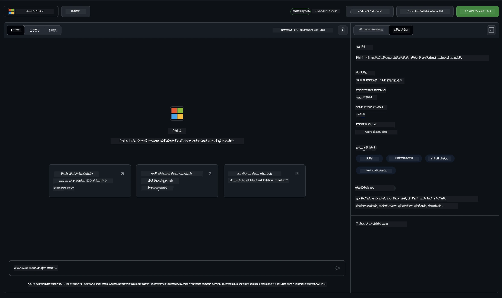

<!--
CO_OP_TRANSLATOR_METADATA:
{
  "original_hash": "fb67a08b9fc911a10ed58081fadef416",
  "translation_date": "2025-12-21T23:57:39+00:00",
  "source_file": "md/01.Introduction/02/02.GitHubModel.md",
  "language_code": "kn"
}
-->
## GitHub Models ನಲ್ಲಿ Phi ಕುಟುಂಬ

Welcome to [GitHub Models](https://github.com/marketplace/models) ! ನಾವು Azure AI ನಲ್ಲಿ ಹೋಸ್ಟ್ ಮಾಡಿರುವ AI Models ಅನ್ನು ನೀವು ಅನ್ವೇಷಿಸಲು ಎಲ್ಲವನ್ನೂ ಸಿದ್ಧಪಡಿಸಿದ್ದೇವೆ.


GitHub Models ನಲ್ಲಿ ಲಭ್ಯವಿರುವ ಮಾದರಿಗಳ ಕುರಿತು ಹೆಚ್ಚಿನ ಮಾಹಿತಿಗಾಗಿ, ನೋಡಿ [GitHub Model Marketplace](https://github.com/marketplace/models)

## ಲಭ್ಯವಿರುವ ಮಾದರಿಗಳು

ಪ್ರತಿ ಮಾದರಿಗೂ ಒಂದು ವಿಶೇಷ ಪ್ಲೇಗ್ರೌಂಡ್ ಮತ್ತು ಉದಾಹರಣೆ ಕೋಡ್ ಇರುತ್ತದೆ 



### GitHub Model ಕ್ಯಾಟಲೋಗ್ ನಲ್ಲಿ Phi ಕುಟುಂಬ

- [Phi-4](https://github.com/marketplace/models/azureml/Phi-4)

- [Phi-3.5-MoE instruct (128k)](https://github.com/marketplace/models/azureml/Phi-3-5-MoE-instruct)

- [Phi-3.5-vision instruct (128k)](https://github.com/marketplace/models/azureml/Phi-3-5-vision-instruct)

- [Phi-3.5-mini instruct (128k)](https://github.com/marketplace/models/azureml/Phi-3-5-mini-instruct)

- [Phi-3-Medium-128k-Instruct](https://github.com/marketplace/models/azureml/Phi-3-medium-128k-instruct)

- [Phi-3-medium-4k-instruct](https://github.com/marketplace/models/azureml/Phi-3-medium-4k-instruct)

- [Phi-3-mini-128k-instruct](https://github.com/marketplace/models/azureml/Phi-3-mini-128k-instruct)

- [Phi-3-mini-4k-instruct](https://github.com/marketplace/models/azureml/Phi-3-mini-4k-instruct)

- [Phi-3-small-128k-instruct](https://github.com/marketplace/models/azureml/Phi-3-small-128k-instruct)

- [Phi-3-small-8k-instruct](https://github.com/marketplace/models/azureml/Phi-3-small-8k-instruct)

## ಪ್ರಾರಂಭಿಸುವುದು

ನಡೆಸಲು ಸಿದ್ಧವಾಗಿರುವ ಕೆಲವು ಮೂಲ ಉದಾಹರಣೆಗಳು ಇವೆ. ಅವುಗಳನ್ನು samples directory ನಲ್ಲಿ ಕಂಡುಹಿಡಿಯಬಹುದು. ನೀವು ನಿಮ್ಮ ಪ್ರಿಯ ಭಾಷೆಗೆ ನೇರವಾಗಿ ಹೋಗಲು ಬಯಸಿದರೆ, ಕೆಳಗಿನ ಭಾಷೆಗಳಲ್ಲಿ ಉದಾಹರಣೆಗಳನ್ನು ಕಾಣಬಹುದು:

- Python
- JavaScript
- C#
- Java
- cURL

ಉದಾಹರಣೆಗಳು ಮತ್ತು ಮಾದರಿಗಳನ್ನು চালಿಸಲು ಒಂದು samarpita Codespaces Environment ಕೂಡಿದೆ. 


## ಉದಾಹರಣೆ ಕೋಡ್ 

ಕೆಳಕಾಣಿರುವವು ಕೆಲವು ಬಳಕಾ ಪ್ರಕರಣಗಳಿಗೆ ಉದಾಹರಣಾ ಕೋಡ್ ತುಣುಕುಗಳು. Azure AI Inference SDK ಬಗ್ಗೆ ಹೆಚ್ಚಿನ ಮಾಹಿತಿಗಾಗಿ, ಸಂಪೂರ್ಣ ಡಾಕ್ಯುಮೆಂಟೇಶನ್ ಮತ್ತು ಉದಾಹರಣೆಗಳನ್ನು ನೋಡಿ.

## ಸ್ಥಾಪನೆ 

1. ವೈಯಕ್ತಿಕ ಪ್ರವೇಶ ಟೋಕನ್ ರಚಿಸಿ
ನೀವು ಟೋಕನ್‌ಗೆ ಯಾವುದೇ ಅನುಮತಿಗಳನ್ನು ನೀಡಬೇಕಾಗಿಲ್ಲ. ಟೋಕನ್ ಒಂದು Microsoft ಸೇವೆಗೆ ಕಳುಹಿಸಲಾಗುತ್ತದೆ ಎಂಬುದನ್ನು ಗಮನಿಸಿ.

ಕೆಳಗಿನ ಕೋಡ್ ತುಣುಕಗಳನ್ನು ಬಳಸಲು, ನಿಮ್ಮ ಟೋಕನ್ ಅನ್ನು ಕ್ಲೈಯಂಟ್ ಕೋಡ್‌ನ ಕೀಲಿಯಾಗಿ ಹೊಂದಿಸಲು ಒಂದು ಪರಿಸರ ಚರ (environment variable) ರಚಿಸಿ.

If you're using bash:
```
export GITHUB_TOKEN="<your-github-token-goes-here>"
```
ನೀವು powershell‌ನಲ್ಲಿ ಇದ್ದರೆ:

```
$Env:GITHUB_TOKEN="<your-github-token-goes-here>"
```

ನೀವು Windows command prompt ಬಳಸುತ್ತಿದ್ದರೆ:

```
set GITHUB_TOKEN=<your-github-token-goes-here>
```

## Python ಉದಾಹರಣೆ

### ಅವಲಂಬನೆಗಳನ್ನು ಸ್ಥಾಪಿಸಿ
pip ಬಳಸಿಕೊಂಡು Azure AI Inference SDK ಅನ್ನು ಸ್ಥಾಪಿಸಿ (ಆವಶ್ಯಕತೆ: Python >=3.8):

```
pip install azure-ai-inference
```
### ಸರಳ ಕೋಡ್ ಉದಾಹರಣೆಯನ್ನು ರನ್ ಮಾಡಿ

ಈ ಉದಾಹರಣೆ ಚಾಟ್ ಪೂರ್ಣಗೊಳಿಸುವ API ಗೆ ಒಂದು ಸರಳ ಕರೆ ಹೇಗೆ ಮಾಡುವುದು ಎಂಬುದನ್ನು ತೋರಿಸುತ್ತದೆ. ಇದು GitHub AI ಮಾದರಿ ಇನ್ಫರೆನ್ಸ್ ಎಂಡ್‌ಪಾಯಿಂಟ್ ಮತ್ತು ನಿಮ್ಮ GitHub ಟೋಕನ್ ಅನ್ನು ಬಳಸುತ್ತಿದೆ. ಕರೆ ಸಿಂಕ್ರೋನಸ್ ಆಗಿದೆ.

```python
import os
from azure.ai.inference import ChatCompletionsClient
from azure.ai.inference.models import SystemMessage, UserMessage
from azure.core.credentials import AzureKeyCredential

endpoint = "https://models.inference.ai.azure.com"
model_name = "Phi-4"
token = os.environ["GITHUB_TOKEN"]

client = ChatCompletionsClient(
    endpoint=endpoint,
    credential=AzureKeyCredential(token),
)

response = client.complete(
    messages=[
        UserMessage(content="I have $20,000 in my savings account, where I receive a 4% profit per year and payments twice a year. Can you please tell me how long it will take for me to become a millionaire? Also, can you please explain the math step by step as if you were explaining it to an uneducated person?"),
    ],
    temperature=0.4,
    top_p=1.0,
    max_tokens=2048,
    model=model_name
)

print(response.choices[0].message.content)
```

### ಬಹು-ತಿರುಗು ಸಂಭಾಷಣೆಯನ್ನು ನಡೆಸಿ

ಈ ಉದಾಹರಣೆ ಚಾಟ್ ಪೂರ್ಣಗೊಳಿಸುವ API ಮೂಲಕ ಬಹು-ತಿರುಗು ಸಂಭಾಷಣೆಯನ್ನು ತೋರಿಸುತ್ತದೆ. ಚಾಟ್ ಅಪ್ಲಿಕೇಶನ್‌ಗಾಗಿ ಮಾದರಿಯನ್ನು ಬಳಸುವಾಗ, ಆ ಸಂಭಾಷಣೆಯ ಇತಿಹಾಸವನ್ನು ನಿರ್ವಹಿಸಿ ಮತ್ತು تازಾ ಸಂದೇಶಗಳನ್ನು ಮಾದರಿಗೆ ಕಳುಹಿಸಬೇಕಾಗುತ್ತದೆ.

```
import os
from azure.ai.inference import ChatCompletionsClient
from azure.ai.inference.models import AssistantMessage, SystemMessage, UserMessage
from azure.core.credentials import AzureKeyCredential

token = os.environ["GITHUB_TOKEN"]
endpoint = "https://models.inference.ai.azure.com"
# Replace Model_Name
model_name = "Phi-4"

client = ChatCompletionsClient(
    endpoint=endpoint,
    credential=AzureKeyCredential(token),
)

messages = [
    SystemMessage(content="You are a helpful assistant."),
    UserMessage(content="What is the capital of France?"),
    AssistantMessage(content="The capital of France is Paris."),
    UserMessage(content="What about Spain?"),
]

response = client.complete(messages=messages, model=model_name)

print(response.choices[0].message.content)
```

### ಔಟ್‌ಪುಟ್ ಅನ್ನು ಸ್ಟ್ರೀಮ್ ಮಾಡಿ

ಉತ್ತಮ ಬಳಕೆದಾರ ಅನುಭವಕ್ಕಾಗಿ, ಮೊದಲ ಟೋಕನ್ ಬೇಗ ತೋರಿಸುವಂತೆ ಮತ್ತು ಉದ್ದವಾದ ಪ್ರತಿಕ್ರಿಯೆಗಾಗಿ રાહ ನೋಡಬೇಕಾಗದಂತೆ ಮಾದರಿಯ ಪ್ರತಿಕ್ರಿಯೆಯನ್ನು ಸ್ಟ್ರೀಮ್ ಮಾಡಲು ನೀವು ಬಯಸುತ್ತೀರಿ.

```
import os
from azure.ai.inference import ChatCompletionsClient
from azure.ai.inference.models import SystemMessage, UserMessage
from azure.core.credentials import AzureKeyCredential

token = os.environ["GITHUB_TOKEN"]
endpoint = "https://models.inference.ai.azure.com"
# Replace Model_Name
model_name = "Phi-4"

client = ChatCompletionsClient(
    endpoint=endpoint,
    credential=AzureKeyCredential(token),
)

response = client.complete(
    stream=True,
    messages=[
        SystemMessage(content="You are a helpful assistant."),
        UserMessage(content="Give me 5 good reasons why I should exercise every day."),
    ],
    model=model_name,
)

for update in response:
    if update.choices:
        print(update.choices[0].delta.content or "", end="")

client.close()
```

## GitHub Models ಗಾಗಿ ಉಚಿತ ಬಳಕೆ ಮತ್ತು ದರ ಮಿತಿಗಳು


The [playground ಮತ್ತು ಉಚಿತ API ಬಳಕೆಗೆ ಇರುವ ದರ ಮಿತಿಗಳು](https://docs.github.com/en/github-models/prototyping-with-ai-models#rate-limits) ನಿಮಗೆ ಮಾದರಿಗಳನ್ನು ಪರಿಚಯಿಸಲು ಮತ್ತು ನಿಮ್ಮ AI ಅಪ್ಲಿಕೇಶನ್‌ನ ಪ್ರೋಟೋಟೈಪ್ ತಯಾರಿಸಲು ಸಹಾಯ ಮಾಡುವ ಉದ್ದೇಶವನ್ನು ಹೊಂದಿವೆ. ಆ ಮಿತಿಗಳ ಮೀರಿದ ಬಳಕೆಗೆ ಮತ್ತು ನಿಮ್ಮ ಅಪ್ಲಿಕೇಶನ್ ಅನ್ನು ತಾಣದ ಮಟ್ಟಕ್ಕೆ ತಂದುಕೊಳ್ಳಲು, ನೀವು Azure ಖಾತೆಯಿಂದ ಸಂಪನ್ಮೂಲಗಳನ್ನು ಒದಗಿಸಬೇಕಾಗುತ್ತದೆ ಮತ್ತು GitHub ವೈಯಕ್ತಿಕ ಪ್ರವೇಶ ಟೋಕನ್ ಬದಲು ಅಲ್ಲಿ ಸಂತೈಸಬೇಕು. ನಿಮ್ಮ ಕೋಡ್‌ನಲ್ಲಿ ಯಾವುದನ್ನೂ ಬದಲಾಯಿಸುವ ಅವಶ್ಯಕತೆ ಇಲ್ಲ. Azure AI ನಲ್ಲಿ ಉಚಿತ ಟಿಯರ್ ಮಿತಿಗಳನ್ನು ಹೇಗೆ ಮೀರುವುದು ಎಂದು ಕಂಡುಹಿಡಿಯಲು ಈ ಲಿಂಕ್ ಅನ್ನು ಬಳಸಿ.

### ಪ್ರಕಟಣೆಗಳು

ಮಾದರಿಯೊಂದಿಗೆ ಸಂವಹನ ಮಾಡುವಾಗ ನೀವು AI ಅನ್ನು ಪ್ರಯೋಗಿಸುತ್ತಿದ್ದೀರಿ ಎಂಬುದನ್ನು ನೆನಪಿಡಿ, ಆದ್ದರಿಂದ ವಿಷಯದ ತಪ್ಪುಗಳು ಸಂಭವಿಸಬಹುದು.

ಈ ವೈಶಿಷ್ಟ್ಯವು ವಿವಿಧ ಮಿತಿಗಳಿಗೆ ಒಳಪಟ್ಟಿದೆ (ಪ್ರತಿನಿಮಿಷೆಗೆ ವಿನಂತಿಗಳು, ಪ್ರತಿ ದಿನದ ವಿನಂತಿಗಳು, ಪ್ರತಿ ವಿನಂತಿಗೆ ಟೋಕನ್‌ಗಳು, ಮತ್ತು ಸಮಕಾಲೀನ ವಿನಂತಿಗಳು ಸೇರಿದಂತೆ) ಮತ್ತು ಉತ್ಪಾದನಾ ಬಳಕೆಗೆ ಉದ್ದೇಶಿಸಲ್ಪಟ್ಟಿಲ್ಲ.

GitHub Models Azure AI Content Safety ಅನ್ನು ಬಳಸುತ್ತದೆ. GitHub Models ಅನುಭವದ ಭಾಗವಾಗಿ ಈ ಫಿಲ್ಟರ್‌ಗಳನ್ನು ಆಫ್ ಮಾಡಲು ಸಾಧ್ಯವಿಲ್ಲ. ನೀವು ಪಾವತಿಸಿದ ಸೇವೆಯ ಮೂಲಕ ಮಾದರಿಗಳನ್ನು ಬಳಸಲು ನಿರ್ಧರಿಸಿದರೆ, ದಯವಿಟ್ಟು ನಿಮ್ಮ ಅವಶ್ಯಕತೆಗಳಿಗೆ ಅನುಗುಣವಾಗಿ ನಿಮ್ಮ ವಿಷಯ ಫಿಲ್ಟರ್‌ಗಳನ್ನು ಸಂರಚಿಸಿ.

ಈ ಸೇವೆ GitHub ನ ಪೂರ್ವ ಬಿಡುಗಡೆ ನಿಯಮಾವಳಿಗಳ ಅಡಿಯಲ್ಲಿ ಇದೆ.

---

<!-- CO-OP TRANSLATOR DISCLAIMER START -->
ಅಸ್ವೀಕರಣ:
ಈ ದಾಖಲೆ AI ಅನುವಾದ ಸೇವೆ [Co-op Translator](https://github.com/Azure/co-op-translator) ಬಳಸಿ ಅನುವಾದಿಸಲಾಗಿದೆ. ನಾವು ಶುದ್ಧತೆಗೆ ಪ್ರಯತ್ನಿಸಿದರೂ, ಸ್ವಯಂಚಾಲಿತ ಅನುವಾದಗಳಲ್ಲಿ ದೋಷಗಳು ಅಥವಾ ಅಸ್ಪಷ್ಟತೆಗಳಿರಬಹುದು ಎಂಬುದಕ್ಕೆ ದಯವಿಟ್ಟು ಗಮನಿಸಿ. ಮೂಲ ದಾಖಲೆ ಅದರ ಮೂಲಭಾಷೆಯಲ್ಲಿ ಅಧಿಕೃತವಾಗಿರಬೇಕು. ಮಹತ್ವದ ಮಾಹಿತಿ ಗುಣಮಟ್ಟಕ್ಕಾಗಿ ವೃತ್ತಿಪರ ಮಾನವ ಅನುವಾದವನ್ನು ಶಿಫಾರಸು ಮಾಡಲಾಗುತ್ತದೆ. ಈ ಅನುವಾದವನ್ನು ಬಳಸದಾಗ ಉಂಟಾಗುವ ಯಾವುದೇ ತಪ್ಪು ಅರ್ಥೈಸಿಕೆಗಳು ಅಥವಾ ದೋಷಗಳಿಗಾಗಿ ನಾವು ಜವಾಬ್ದಾರಿಯಲ್ಲ.
<!-- CO-OP TRANSLATOR DISCLAIMER END -->