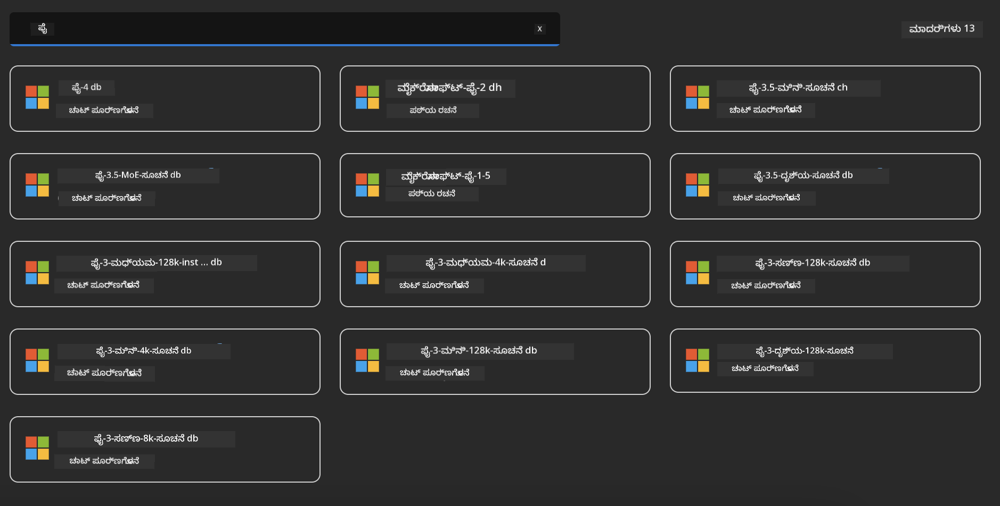
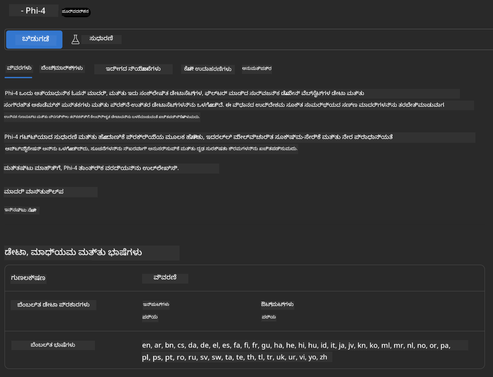

<!--
CO_OP_TRANSLATOR_METADATA:
{
  "original_hash": "3ae21dc5554e888defbe57946ee995ee",
  "translation_date": "2025-12-22T00:03:08+00:00",
  "source_file": "md/01.Introduction/02/03.AzureAIFoundry.md",
  "language_code": "kn"
}
-->
## Azure AI Foundry ನಲ್ಲಿ Phi ಕುಟುಂಬ

[Azure AI Foundry](https://ai.azure.com) ಒಂದು ವಿಶ್ವಾಸಾರ್ಹ ವೇದಿಕೆ, ಇದು ಡೆವಲಪರ್‌ಗಳನ್ನು ಸುರಕ್ಷಿತ, ಭದ್ರ ಮತ್ತು ಜವಾಬ್ದಾರಿಯುತ ರೀತಿಯಲ್ಲಿ AI ಮೂಲಕ ಹೊಸತನವನ್ನು ಒದಗಿಸಲು ಮತ್ತು ಭವಿಷ್ಯವನ್ನು ರೂಪಿಸಲು ಸಬಲಗೊಳಿಸುತ್ತದೆ。


[Azure AI Foundry](https://ai.azure.com) ಡೆವಲಪರ್‌ಗಳಿಗಾಗಿ ರೂಪಿಸಲಾಗಿದೆ:

- ಎಂಟರ್ಪ್ರೈಸ್-ಗ್ರೇಡ್ ವೇದಿಕೆಯಲ್ಲಿ ಜನರೇಟಿವ್ AI ಅಪ್ಲಿಕೇಶನ್‌ಗಳನ್ನು ನಿರ್ಮಿಸಲು.
- ಜವಾಬ್ದಾರಿಯುತ AI ಅಭ್ಯಾಸಗಳ ಮೇಲೆ ಆಧರಿಸಿ, ಅತ್ಯಾಧುನಿಕ AI ಉಪಕರಣಗಳು ಮತ್ತು ML ಮಾದರಿಗಳನ್ನು ಬಳಸಿ ಅನ್ವೇಷಿಸಲು, ನಿರ್ಮಿಸಲು, ಪರೀಕ್ಷಿಸಲು ಮತ್ತು ಡಿಪ್ಲಾಯ್ ಮಾಡಲು.
- ಅಪ್ಲಿಕೇಶನ್ ಅಭಿವೃದ್ಧಿಯ ಪೂರ್ಣ ಜೀವನಚಕ್ರಕ್ಕಾಗಿ ತಂಡದೊಂದಿಗೆ ಸಹಕರಿಸಲು.

Azure AI Foundry ನೊಂದಿಗೆ, ನೀವು ವಿವಿಧ ಮಾದರಿಗಳು, ಸೇವೆಗಳು ಮತ್ತು ಸಾಮರ್ಥ್ಯಗಳನ್ನು ಅನ್ವೇಷಿಸಿ, ನಿಮ್ಮ ಗುರಿಗಳಿಗೆ ಉತ್ತಮವಾಗಿ ಸೇವೆ ಸಲ್ಲಿಸುವ AI ಅಪ್ಲಿಕೇಶನ್‌ಗಳನ್ನು ರಚಿಸಲು ಪ್ರಾರಂಭಿಸಬಹುದು. Azure AI Foundry ವೇದಿಕೆ ಸಿದ್ಧಾಂತದ ತೋರಣೆಗಳನ್ನು (proof of concepts) ಸುಲಭವಾಗಿ ಪೂರ್ಣ ಪ್ರಮಾಣದ ಉತ್ಪಾದನಾ ಅಪ್ಲಿಕೇಶನ್‌ಗಳಾಗಿ ಪರಿವರ್ತಿಸಲು ಸ್ಕೇಲಬಿಲಿಟಿಯನ್ನು ಅನುಕೂಲಗೊಳಿಸುತ್ತದೆ. ನಿರಂತರ ಮೇಲ್ವಿಚಾರಣೆ ಮತ್ತು ಪರಿಷ್ಕರಣೆ ದೀರ್ಘಕಾಲಿಕ ಯಶಸ್ಸಿಗೆ ಸಹಾಯ ಮಾಡುತ್ತವೆ.


Azure AI Foundry ನಲ್ಲಿ Azure AOAI Service ಬಳಸದೆಯೂ, ನೀವು Azure AI Foundry Model Catalog ನಲ್ಲಿ ತೃತೀಯ ಪಕ್ಷದ ಮಾದರಿಗಳನ್ನು ಕೂಡ ಬಳಸಬಹುದು. ನೀವು Azure AI Foundry ಅನ್ನು ನಿಮ್ಮ AI ಪರಿಹಾರ ವೇದಿಕೆಯಾಗಿ ಬಳಸಲು ಬಯಸಿದರೆ ಇದು ಒಳ್ಳೆಯ ಆಯ್ಕೆಯಾಗಿದೆ.

ನಾವು Azure AI Foundry ನ Model Catalog ಮೂಲಕ Phi ಕುಟುಂಬದ ಮಾದರಿಗಳನ್ನು ತ್ವರಿತವಾಗಿ ನಿಯೋಜಿಸಬಹುದು 

[Microsoft Phi ಮಾದರಿಗಳು Azure AI Foundry Models ನಲ್ಲಿ](https://ai.azure.com/explore/models/?selectedCollection=phi)



### **Azure AI Foundry ನಲ್ಲಿ Phi-4 ಅನ್ನು ನಿಯೋಜಿಸಿ**




### **Azure AI Foundry Playground ನಲ್ಲಿ Phi-4 ಅನ್ನು ಪರೀಕ್ಷಿಸಿ**


### **Azure AI Foundry Phi-4 ಅನ್ನು ಕರೆ ಮಾಡಲು Python ಕೋಡ್ ಅನ್ನು ಚಲಾಯಿಸುವುದು**


```python

import os  
import base64
from openai import AzureOpenAI  
from azure.identity import DefaultAzureCredential, get_bearer_token_provider  
        
endpoint = os.getenv("ENDPOINT_URL", "Your Azure AOAI Service Endpoint")  
deployment = os.getenv("DEPLOYMENT_NAME", "Phi-4")  
      
token_provider = get_bearer_token_provider(  
    DefaultAzureCredential(),  
    "https://cognitiveservices.azure.com/.default"  
)  
  
client = AzureOpenAI(  
    azure_endpoint=endpoint,  
    azure_ad_token_provider=token_provider,  
    api_version="2024-05-01-preview",  
)  
  

chat_prompt = [
    {
        "role": "system",
        "content": "You are an AI assistant that helps people find information."
    },
    {
        "role": "user",
        "content": "can you introduce yourself"
    }
] 
    
# ಸ್ಪೀಚ್ ಸಕ್ರಿಯವಾಗಿದ್ದರೆ ಧ್ವನಿ ಫಲಿತಾಂಶವನ್ನು ಸೇರಿಸಿ
messages = chat_prompt 

completion = client.chat.completions.create(  
    model=deployment,  
    messages=messages,
    max_tokens=800,  
    temperature=0.7,  
    top_p=0.95,  
    frequency_penalty=0,  
    presence_penalty=0,
    stop=None,  
    stream=False  
)  
  
print(completion.to_json())  

```

---

<!-- CO-OP TRANSLATOR DISCLAIMER START -->
ಜವಾಬ್ದಾರಿ ನಿರಾಕರಣೆ:
ಈ ದಸ್ತಾವೇಜನ್ನು AI ಅನುವಾದ ಸೇವೆ [Co-op Translator](https://github.com/Azure/co-op-translator) ಬಳಸಿ ಅನುವಾದಿಸಲಾಗಿದೆ. ನಾವು ನಿಖರತೆಗೆ ಪ್ರಯತ್ನಿಸುತ್ತಿದ್ದರೂ ಸಹ, ದಯವಿಟ್ಟು ಗಮನದಲ್ಲಿರಿಸಿ — ಸ್ವಯಂಚಾಲಿತ ಅನುವಾದಗಳಲ್ಲಿ ತಪ್ಪುಗಳು ಅಥವಾ ಅಸತ್ಯತೆಗಳು ಇರಬಹುದು. ಮೂಲ ಭಾಷೆಯಲ್ಲಿರುವ ಅಸಲಿ ದಸ್ತಾವೇಜನ್ನು ಅಧಿಕೃತ ಮೂಲವೆಂದು ಪರಿಗಣಿಸಬೇಕು. ಗಂಭೀರ ಮಾಹಿತಿಗಾಗಿ ವೃತ್ತಿಪರ ಮಾನವ ಅನುವಾದವನ್ನು ಶಿಫಾರಸು ಮಾಡಲಾಗುತ್ತದೆ. ಈ ಅನುವಾದದ ಬಳಕೆಯಿಂದ ಉಂಟಾಗುವ ಯಾವುದೇ ತಪ್ಪು ಅರ್ಥಮಾಡಿಕೊಳ್ಳುವಿಕೆ ಅಥವಾ ತಪ್ಪು ವ್ಯಾಖ್ಯಾನದ ಬಗ್ಗೆ ನಾವು ಹೊಣೆಗಾರರಲ್ಲ.
<!-- CO-OP TRANSLATOR DISCLAIMER END -->