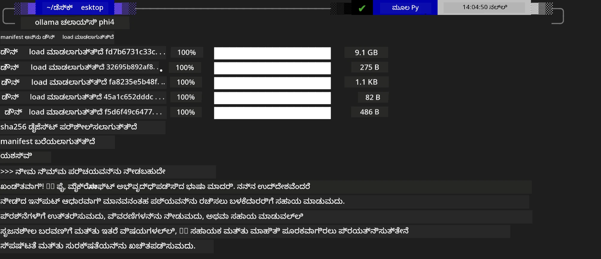

<!--
CO_OP_TRANSLATOR_METADATA:
{
  "original_hash": "2aa35f3c8b437fd5dc9995d53909d495",
  "translation_date": "2025-12-21T23:34:59+00:00",
  "source_file": "md/01.Introduction/02/04.Ollama.md",
  "language_code": "kn"
}
-->
## Ollama ನಲ್ಲಿ Phi ಕುಟುಂಬ


[Ollama](https://ollama.com) ಸರಳ ಸ್ಕ್ರಿಪ್ಟ್‌ಗಳ ಮೂಲಕ ಹೆಚ್ಚಿನ ಜನರಿಗೆ open source LLM ಅಥವಾ SLM ಅನ್ನು ನೇರವಾಗಿ ನಿಯೋಜಿಸಲು ಅನುಮತಿಸುತ್ತದೆ, ಮತ್ತು ಸ್ಥಳೀಯ Copilot ಅನ್ವಯ ಪ್ರಕರಣಗಳನ್ನು ಸಹಾಯ ಮಾಡಲು APIಗಳನ್ನು ನಿರ್ಮಿಸಬಹುದು.

## **1. ಸ್ಥಾಪನೆ**

Ollama Windows, macOS ಮತ್ತು Linux ನಲ್ಲಿ ಚಾಲನೆಗೆ ಬೆಂಬಲ ನೀಡುತ್ತದೆ. ನೀವು ಈ ಲಿಂಕ್ ಮೂಲಕ Ollama ಅನ್ನು ಸ್ಥಾಪಿಸಬಹುದು ([https://ollama.com/download](https://ollama.com/download)). ಸ್ಥಾಪನೆ ಯಶಸ್ವಿಯಾದ ನಂತರ, ನೀವು ಟರ್ಮಿನಲ್ ವಿಂಡೋ ಮೂಲಕ Ollama ಸ್ಕ್ರಿಪ್ಟ್ ಬಳಸಿ ನೇರವಾಗಿ Phi-3 ಅನ್ನು ಕರೆಮಾಡಬಹುದು. ನೀವು ಎಲ್ಲಾ [Ollama ನಲ್ಲಿ ಲಭ್ಯವಿರುವ ಲೈಬ್ರರಿಗಳನ್ನು](https://ollama.com/library) ನೋಡಬಹುದು. ನೀವು ಈ ರೆಪೋಸಿಟೊರಿ ಅನ್ನು Codespace ನಲ್ಲಿ ತೆರೆಯಿದರೆ, ಅದಕ್ಕೆ ಈಗಾಗಲೇ Ollama ಸ್ಥಾಪನೆ ಆಗಿರುತ್ತದೆ.

```bash

ollama run phi4

```

> [!NOTE]
> ಮೊದಲ ಬಾರಿ ನೀವು ಇದನ್ನು ರನ್ ಮಾಡುವಾಗ ಮೊದಲು ಮಾದರಿ ಡೌನ್‌ಲೋಡ್ ಆಗುತ್ತದೆ. ನಿಶ್ಚಿತವಾಗಿ, ನೀವು ಡೌನ್‌ಲೋಡ್ ಮಾಡಿದ Phi-4 ಮಾದರಿಯನ್ನು ನೇರವಾಗಿ ನಿರ್ದಿಷ್ಟಪಡಿಸಬಹುದು. ಕಮಾಂಡ್ ಅನ್ನು ನಡಿಸಲು ನಾವು WSL ಅನ್ನು ಉದಾಹರಣೆಯಾಗಿ ತೆಗೆದುಕೊಳ್ಳುತ್ತೇವೆ. ಮಾದರಿ ಯಶಸ್ವಿಯಾಗಿ ಡೌನ್‌ಲೋಡ್ ಆದ ನಂತರ, ನೀವು ನೇರವಾಗಿ ಟರ್ಮಿನಲ್‌ನಲ್ಲಿ ಸಂವಹನ ಮಾಡಬಹುದು.



## **2. Ollama ನಿಂದ phi-4 API ಅನ್ನು ಕರೆಮಾಡುವುದು**

Ollama ಮೂಲಕ ರಚಿತ Phi-4 API ಅನ್ನು ಕರೆಮಾಡಲು ಇಚ್ಛಿಸಿದರೆ, Ollama ಸರ್ವರ್ ಅನ್ನು ಪ್ರಾರಂಭಿಸಲು ನೀವು ಟರ್ಮಿನಲ್‌ನಲ್ಲಿ ಈ ಕಮಾಂಡ್ ಅನ್ನು ಬಳಸಿ.

```bash

ollama serve

```

> [!NOTE]
> MacOS ಅಥವಾ Linux ಅನ್ನು ಬಳಸಿದರೆ, ನೀವು ಕೆಳಗಿನ ದೋಷಕ್ಕೆ ಮೊರೆಹೊಯ್ಯಬಹುದು **"Error: listen tcp 127.0.0.1:11434: bind: address already in use"**. ಈ ಕಮಾಂಡ್ ಅನ್ನು ರನ್ ಮಾಡುವಾಗ ಈ ದೋಷವು ಕಾಣಿಸಬಹುದು. ಸಾಮಾನ್ಯವಾಗಿ ಇದು ಸರ್ವರ್ ಈಗಾಗಲೇ ಓಡುತ್ತದೆ ಎಂದು ಸೂಚಿಸುವ ಕಾರಣ, ನೀವು ಈ ದೋಷವನ್ನು ನಿರ್ಲಕ್ಷಿಸಬಹುದು, ಅಥವಾ Ollama ಅನ್ನು ನಿಲ್ಲಿಸಿ ಮರುಪ್ರಾರಂಭಿಸಬಹುದು:

**macOS**

```bash

brew services restart ollama

```

**Linux**

```bash

sudo systemctl stop ollama

```

Ollama ಎರಡು APIಗಳನ್ನು ಬೆಂಬಲಿಸುತ್ತದೆ: generate ಮತ್ತು chat. Ollama ನೀಡುವ ಮಾದರಿ APIಗಳನ್ನು ನಿಮ್ಮ ಅಗತ್ಯಗಳ ಪ್ರಕಾರ, ಪೋರ್ಟ್ 11434 ನಲ್ಲಿ ಓಡುತ್ತಿರುವ ಲೋಕಲ್ ಸರ್ವಿಸ್‌ಗೆ ವಿನಂತಿಗಳನ್ನು ಕಳುಹಿಸುವ ಮೂಲಕ ಕರೆಮಾಡಬಹುದು.

**Chat**

```bash

curl http://127.0.0.1:11434/api/chat -d '{
  "model": "phi3",
  "messages": [
    {
      "role": "system",
      "content": "Your are a python developer."
    },
    {
      "role": "user",
      "content": "Help me generate a bubble algorithm"
    }
  ],
  "stream": false
  
}'
```

ಇದು Postman‌ನಲ್ಲಿನ ಫಲಿತಾಂಶ.


## ಹೆಚ್ಚಿನ ಸಂಪನ್ಮೂಲಗಳು

Ollama ನಲ್ಲಿ ಲಭ್ಯವಿರುವ ಮಾದರಿಗಳ ಪಟ್ಟಿಯನ್ನು [ಅವರ ಲೈಬ್ರರಿಯಲ್ಲಿ](https://ollama.com/library) ಪರಿಶೀಲಿಸಿ.

ಈ ಕಮಾಂಡ್ ಬಳಸಿ ನಿಮ್ಮ ಮಾದರಿಯನ್ನು Ollama ಸರ್ವರ್‌ನಿಂದ ಪಡೆದಿರಿ

```bash
ollama pull phi4
```

ಈ ಕಮಾಂಡ್ ಬಳಸಿ ಮಾದರಿಯನ್ನು ರನ್ ಮಾಡಿ

```bash
ollama run phi4
```

***ಗಮನಿಸಿ:*** ಇನ್ನು ಹೆಚ್ಚು ತಿಳಿಯಲು ಈ ಲಿಂಕ್ ಅನ್ನು ಭೇಟಿ ಮಾಡಿ [https://github.com/ollama/ollama/blob/main/docs/api.md](https://github.com/ollama/ollama/blob/main/docs/api.md)

## Python ನಲ್ಲಿ Ollama ಅನ್ನು ಕರೆಮಾಡುವುದು

ಮೇಲಿನ ಸ್ಥಳೀಯ ಸರ್ವರ್ ಎಂಡ್ಪಾಯಿಂಟ್‌ಗಳಿಗೆ ವಿನಂತಿಗಳನ್ನು ಮಾಡಲು ನೀವು `requests` ಅಥವಾ `urllib3` ಅನ್ನು ಬಳಸಬಹುದು. ತದಾಹಿತಿಗೆ, Python ನಲ್ಲಿ Ollama ಅನ್ನು ಬಳಸುವ ಜನಪ್ರಿಯ ಮಾರ್ಗವೆಂದರೆ [openai](https://pypi.org/project/openai/) SDK ಮೂಲಕ, ಏಕೆಂದರೆ Ollama ಕೂಡ OpenAI-ಆನುರೂಪ ಸರ್ವರ್ ಎಂಡ್ಪಾಯಿಂಟ್‌ಗಳನ್ನು ಒದಗಿಸುತ್ತದೆ.

ಇವು phi3-miniಗಾಗಿ ಉದಾಹರಣೆ:

```python
import openai

client = openai.OpenAI(
    base_url="http://localhost:11434/v1",
    api_key="nokeyneeded",
)

response = client.chat.completions.create(
    model="phi4",
    temperature=0.7,
    n=1,
    messages=[
        {"role": "system", "content": "You are a helpful assistant."},
        {"role": "user", "content": "Write a haiku about a hungry cat"},
    ],
)

print("Response:")
print(response.choices[0].message.content)
```

## JavaScript ನಲ್ಲಿ Ollama ಅನ್ನು ಕರೆಮಾಡುವುದು 

```javascript
// Phi-4 ಬಳಸಿ ಫೈಲ್ ಅನ್ನು ಸಾರಾಂಶಗೊಳಿಸುವ ಉದಾಹರಣೆ
script({
    model: "ollama:phi4",
    title: "Summarize with Phi-4",
    system: ["system"],
})

// ಸಾರಾಂಶಗೊಳಿಸುವ ಉದಾಹರಣೆ
const file = def("FILE", env.files)
$`Summarize ${file} in a single paragraph.`
```

## C# ನಲ್ಲಿ Ollama ಅನ್ನು ಕರೆಮಾಡುವುದು

ಹೊಸ C# ಕಾನ್ಸೋಲ್ ಅಪ್ಲಿಕೇಶನ್ ರಚಿಸಿ ಮತ್ತು ಕೆಳಕಂಡ NuGet ಪ್ಯಾಕೇಜ್ ಅನ್ನು ಸೇರಿಸಿ:

```bash
dotnet add package Microsoft.SemanticKernel --version 1.34.0
```

ಅನಂತರ `Program.cs` ಫೈಲ್‌ನಲ್ಲಿ ಈ ಕೋಡ್ ಅನ್ನು ಬದಲಾಯಿಸಿ

```csharp
using Microsoft.SemanticKernel;
using Microsoft.SemanticKernel.ChatCompletion;

// add chat completion service using the local ollama server endpoint
#pragma warning disable SKEXP0001, SKEXP0003, SKEXP0010, SKEXP0011, SKEXP0050, SKEXP0052
builder.AddOpenAIChatCompletion(
    modelId: "phi4",
    endpoint: new Uri("http://localhost:11434/"),
    apiKey: "non required");

// invoke a simple prompt to the chat service
string prompt = "Write a joke about kittens";
var response = await kernel.InvokePromptAsync(prompt);
Console.WriteLine(response.GetValue<string>());
```

ಆ್ಯಪ್ ಅನ್ನು ಈ ಕಮಾಂಡ್ ಮೂಲಕ ರನ್ ಮಾಡಿ:

```bash
dotnet run
```

---

<!-- CO-OP TRANSLATOR DISCLAIMER START -->
ತಿರಸ್ಕರಣೆ:
ಈ ದಾಖಲೆ AI ಅನುವಾದ ಸೇವೆ [Co-op Translator](https://github.com/Azure/co-op-translator) ಬಳಸಿ ಅನುವಾದಿಸಲಾಗಿದೆ. ನಾವು ಶುದ್ಧತೆಗೆ ಪ್ರಯತ್ನಿಸಿದರೂ, ದಯವಿಟ್ಟು ಗಮನಿಸಿ — ಸ್ವಯಂಚಾಲಿತ ಅನುವಾದಗಳಲ್ಲಿ ದೋಷಗಳು ಅಥವಾ ಅಸತ್ಯತೆಗಳು ಇರಬಹುದಾಗಿದೆ. ಮೂಲ ಭಾಷೆಯಲ್ಲಿನ ಮೂಲ ದಾಖಲೆನ್ನು ಅಧಿಕೃತ ಮೂಲವೆಂದು ಪರಿಗಣಿಸಬೇಕು. ಮಹತ್ವದ ಮಾಹಿತಿಗಾಗಿ ವೃತ್ತಿಪರ ಮಾನವ ಅನುವಾದವನ್ನು ಶಿಫಾರಸು ಮಾಡಲಾಗುತ್ತದೆ. ಈ ಅನುವಾದವನ್ನು ಬಳಸುವುದರಿಂದ ಉಂಟಾಗುವ ಯಾವುದೇ ತೊಂದರೆಗಳು ಅಥವಾ ತಪ್ಪು ಅರ್ಥಗರ್ಭಣೆಗಳಿಗಾಗಿ ನಾವು ಜವಾಬ್ದಾರಿಯಲ್ಲ.
<!-- CO-OP TRANSLATOR DISCLAIMER END -->