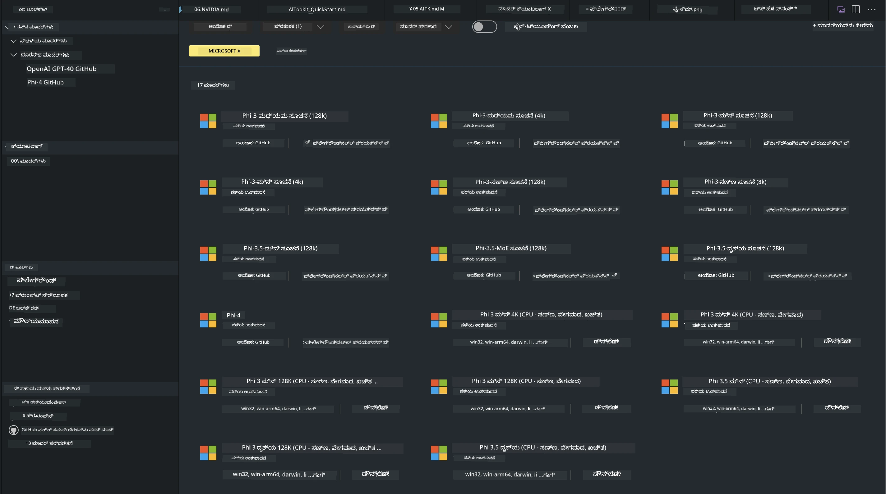
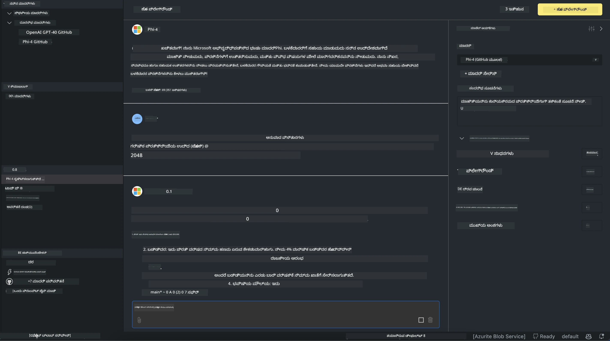

# AITK ನಲ್ಲಿ Phi ಕುಟುಂಬ

[VS Codeಗಾಗಿ AI Toolkit](https://marketplace.visualstudio.com/items?itemName=ms-windows-ai-studio.windows-ai-studio) Azure AI Foundry Catalog ಮತ್ತು Hugging Faceಗಳಂತಹ ಇತರ ಕ್ಯಾಟಲಾಗ್‌ಗಳಿಂದ ಅತಿ ನವೀನ AI ಅಭಿವೃದ್ಧಿ ಸಾಧನಗಳು ಮತ್ತು ಮಾದರಿಗಳನ್ನು ಒಟ್ಟುಗೂಡಿಸುವ ಮೂಲಕ ಜನರೇಟಿವ್ AI ಅಪ್‌ ಡೆವಲಪ್‌ಮೆಂಟ್ ಅನ್ನು ಸರಳಗೊಳಿಸುತ್ತದೆ. ನೀವು GitHub Models ಮತ್ತು Azure AI Foundry Model Catalogs ಮೂಲಕ ಸಶಕ್ತಗೊಳಿಸಲಾದ AI ಮಾದರಿ ಕ್ಯಾಟಲೋಗ್ ಅನ್ನು ವೀಕ್ಷಿಸಿ, ಅವುಗಳನ್ನು ಸ್ಥಳೀಯವಾಗಿ ಅಥವಾ ದೂರದಲ್ಲಿಟ್ಟುಕೊಂಡು ಡೌನ್‌ಲೋಡ್ ಮಾಡಬಹುದು, ಫೈನ್‑ಟ್ಯೂನ್ ಮಾಡಬಹುದು, ಪರೀಕ್ಷಿಸಬಹುದು ಮತ್ತು ನಿಮ್ಮ ಅಪ್ಲಿಕೇಶನ್‌ನಲ್ಲಿ ಬಳಸಬಹುದು.

AI Toolkit ಪೂರ್ವಪ್ರದರ್ಶನ ಸ್ಥಳೀಯವಾಗಿ ಚಾಲನೆ ಆಗುತ್ತದೆ. ಸ್ಥಳೀಯ ಇನ್ಫರೆನ್ಸ್ ಅಥವಾ ಫೈನ್‑ಟ್ಯೂನಿಂಗ್ ನಿಮ್ಮ ಆಯ್ಕೆಮಾಡಿದ ಮಾದರಿಯ ಮೇಲೆ ಅವಲಂಬಿತವಾಗಿದ್ದು, ನಿಮಗೆ NVIDIA CUDA GPU ಹಾಗಿರುವ GPU ಬೇಕಾಗಬಹುದು. ನೀವು AITK ಮೂಲಕ GitHub Models ಅನ್ನು ನೇರವಾಗಿ ಓಡಿಸಬಹುದು ಕೂಡಾ.

## ಪ್ರಾರಂಭಿಸಲು

[Windows subsystem for Linux ಅನ್ನು ಹೇಗೆ ಸ್ಥಾಪಿಸಬೇಕು ಎಂಬ ಬಗ್ಗೆ ಹೆಚ್ಚಿನ ಮಾಹಿತಿಯನ್ನು ತಿಳಿಯಿರಿ](https://learn.microsoft.com/windows/wsl/install?WT.mc_id=aiml-137032-kinfeylo)

ಮತ್ತು [ಡೀಫಾಲ್ಟ್ ಡಿಸ್ಟ್ರೊಬ್ಯೂಶನ್ ಬದಲಾಗಿಸುವುದನ್ನು](https://learn.microsoft.com/windows/wsl/install#change-the-default-linux-distribution-installed) ತಿಳಿಯಿರಿ.

[AI Toolkit GitHub Repo](https://github.com/microsoft/vscode-ai-toolkit/)

- Windows,Linux,macOS
  
- Windows ಮತ್ತು Linux ಎರಡರಲ್ಲಿಯೂ ಫೈನ್‌ಟ್ಯೂನಿಂಗ್ ಮಾಡಲು, ನಿಮಗೆ Nvidia GPU ಬೇಕಾಗುತ್ತದೆ. ಸಂಪೂರ್ಣವಾಗಿ, **Windows** ಗಾಗಿ subsystem for Linux ಅನ್ನು Ubuntu distro 18.4 ಅಥವಾ ಹೆಚ್ಚಿನದಾಗಿರಬೇಕಾಗಿದೆ. [Windows subsystem for Linux ಅನ್ನು ಹೇಗೆ ಸ್ಥಾಪಿಸಬೇಕು ಎಂಬ ಬಗ್ಗೆ ಹೆಚ್ಚಿನ ಮಾಹಿತಿಯನ್ನು ತಿಳಿಯಿರಿ](https://learn.microsoft.com/windows/wsl/install) ಮತ್ತು [ಡೀಫಾಲ್ಟ್ ಡಿಸ್ಟ್ರೊಬ್ಯೂಶನ್ ಬದಲಾಗಿಸುವುದನ್ನು](https://learn.microsoft.com/windows/wsl/install#change-the-default-linux-distribution-installed) ಪರಿಶೀಲಿಸಿ.

### AI Toolkit ಅನ್ನು ಸ್ಥಾಪಿಸುವುದು

AI Toolkit ಅನ್ನು [Visual Studio Code ವಿಸ್ತರಣೆ](https://code.visualstudio.com/docs/setup/additional-components#_vs-code-extensions) ಆಗಿ ನಿಮಗೆ ನೀಡಲಾಗಿದೆ, ಆದಕಾರಣ ಮೊದಲು [VS Code](https://code.visualstudio.com/docs/setup/windows?WT.mc_id=aiml-137032-kinfeylo) ಅನ್ನು ಸ್ಥಾಪಿಸಿ, ಮತ್ತು AI Toolkit ಅನ್ನು [VS Marketplace](https://marketplace.visualstudio.com/items?itemName=ms-windows-ai-studio.windows-ai-studio) ನಿಂದ ಡೌನ್‌ಲೋಡ್ ಮಾಡಿ.
[AI Toolkit Visual Studio Marketplace ನಲ್ಲಿ ಲಭ್ಯದೆ](https://marketplace.visualstudio.com/items?itemName=ms-windows-ai-studio.windows-ai-studio) ಮತ್ತು ಯಾವುದಾದರೂ ಇತರ VS Code ವಿಸ್ತರಣೆಯಂತೆ ಸ್ಥಾಪಿಸಬಹುದು. 

VS Code ವಿಸ್ತರಣೆಗಳನ್ನು ಸ್ಥಾಪಿಸುವುದರಲ್ಲಿ ನಿಮಗೆ ಪರಿಚಯವಿಲ್ಲದಿದ್ದರೆ, ಈ ಕ್ರಮಗಳನ್ನು ಅನುಸರಿಸಿ:

### ಸೈನ್ ಇನ್

1. VS Code ಯ Activity Bar ನಲ್ಲಿ **Extensions** ಆಯ್ಕೆಮಾಡಿ
1. Extensions ಸರ್ಚ್ ಬಾರಿನಲ್ಲಿ "AI Toolkit" ಅನ್ನು ಟೈಪ್ ಮಾಡಿ
1. "AI Toolkit for Visual Studio code" ಅನ್ನು ಆಯ್ಕೆಮಾಡಿ
1. **Install** ಆಯ್ಕೆಮಾಡಿ

ಇದೀಗ, ನೀವು ವಿಸ್ತರಣೆಯನ್ನು ಬಳಸಲು ಸಿದ್ಧರಿದ್ದೀರಾ!

ನೀವು GitHub ಗೆ ಸೈನ್ ಇನ್ ಮಾಡಲು ಸ್ಪರ್ದನನ್ನು ಪಡೆಯುತ್ತೀರಿ, ಮುಂದುವರೆಯಲು ದಯವಿಟ್ಟು "ಅನುಮತಿಸಿ" ಕ್ಲಿಕ್ ಮಾಡಿ. ನೀವು GitHub ಸೈನ್‑ಇನ್ ಪುಟಕ್ಕೆ ರೀಡೈರೆಕ್ಟ್ ಮಾಡಲಾಗುತ್ತದೆ.

ದಯವಿಟ್ಟು ಲಾಗಿನ್ ಮಾಡಿ ಮತ್ತು ಪ್ರಕ್ರಿಯೆಯ ಹಂತಗಳನ್ನು ಅನುಸರಿಸಿ. ಯಶಸ್ವಿ ಪೂರ್ಣಗೊಂಡ ನಂತರ, ನೀವು VS Code ಕ್ಕೆ ರೀಡೈರೆಕ್ಟ್ ಮಾಡಲ್ಪಡುತ್ತೀರಿ.

ವಿಸ್ತರಣೆ ಇನ್‌ಸ್ಟಾಲ್ ಆಗಿದ ನಂತರ ನಿಮ್ಮ Activity Bar ನಲ್ಲಿ AI Toolkit ಐಕಾನ್ ಕಾಣಿಸಿಕೊಳ್ಳುತ್ತದೆ.

ಆಗಬೇಕಾದ ಕ್ರಿಯೆಗಳು ನೋಡೋಣ!

### ಲಭ್ಯವಿರುವ ಕ್ರಿಯೆಗಳು

AI Toolkit_primary_ ಸೈಡ್‌ಬಾರ್ ಈ ಕೆಳಗಿನ ರೀತಿಯಲ್ಲಿ ವ್ಯವಸ್ಥಿತವಾಗಿದೆ  

- **Models**
- **Resources**
- **Playground**  
- **Fine-tuning**
- **Evaluation**

Resources ವಿಭಾಗದಲ್ಲಿ ಲಭ್ಯವಿದೆ. ಪ್ರಾರಂಭಿಸಲು **Model Catalog** ಅನ್ನು ಆಯ್ಕೆಮಾಡಿ.

### ಕ್ಯಾಟಲಾಗ್ ನಿಂದ ಮಾದರಿ ಡೌನ್‌ಲೋಡ್ ಮಾಡುವುದು

VS Code ಸೈಡ್ ಬಾರ್‌ನಿಂದ AI Toolkit ಅನ್ನು ಪ್ರಾರಂಭಿಸಿದ ಮೇಲೆ, ನೀವು ಕೆಳಗಿನ ಆಯ್ಕೆಗಳನ್ನಿಂದ ಆಯ್ಕೆಮಾಡಬಹುದು:



- **Model Catalog**ನಿಂದ ಬೆಂಬಲಿತ ಮಾದರಿಯನ್ನು ಕಂಡು ಸ್ಥಳೀಯವಾಗಿ ಡೌನ್‌ಲೋಡ್ ಮಾಡಿ
- **Model Playground** ನಲ್ಲಿ ಮಾದರಿ ಇನ್ಫರೆನ್ಸ್ ಅನ್ನು ಪರೀಕ್ಷಿಸಿ
- **Model Fine-tuning** ನಲ್ಲಿ ಸ್ಥಳೀಯ ಅಥವಾ ದೂರದಲ್ಲಿಟ್ಟು ಮಾದರಿಯನ್ನು ಫೈನ್‑ಟ್ಯೂನ್ ಮಾಡಿ
- AI Toolkit ಕಮಾಂಡ್ ಪ್ಯಾಲೆಟ್ ಮೂಲಕ ಫೈನ್‑ಟ್ಯೂನ್ಅಗಿರುವ ಮಾದರಿಗಳನ್ನು ಕ್ಲೌಡ್ ಗೆ ಡಿಪ್ಲಾಯ್ ಮಾಡಿ
- ಮೌಲ್ಯಮಾಪನ ಮಾದರಿಗಳು

> [!NOTE]
> 
> **GPU ಮತ್ತು CPU**
> 
> ನೀವು ಗಮನಿಸುತ್ತೀರಿ ಮಾದರಿ ಕಾರ್ಡ್‌ಗಳು ಮಾದರಿ ಗಾತ್ರ, ಪ್ಲಾಟ್‌ಫಾರ್ಮ್ ಮತ್ತು ತ್ವರಕ ಪ್ರಕಾರ (CPU, GPU) ಅನ್ನು ತೋರಿಸುತ್ತವೆ. **ಕನಿಷ್ಠ ಒಂದು GPU ಹೊಂದಿರುವ Windows ಸಾಧನಗಳಲ್ಲಿ** ಉತ್ತಮ ಪ್ರದರ್ಶನಕ್ಕಾಗಿ, ಕೇವಲ Windows ಗಾಗಿ ಉದ್ದೇಶಿಸಿದ ಮಾದರಿ ಆವೃತ್ತಿಗಳನ್ನು ಆಯ್ಕೆಮಾಡಿ.
> 
> ಇದು ನಿಮಗೆ DirectML ತ್ವರಕಕ್ಕೆ ಆಸಕ್ತ ಮಾದರಿಯನ್ನು ಖಚಿತಪಡಿಸುತ್ತದೆ.
> 
> ಮಾದರಿ ಹೆಸರುಗಳ ಸ್ವರೂಪವು
> 
> - `{model_name}-{accelerator}-{quantization}-{format}`.
> 
>Windows ಸಾಧನದಲ್ಲಿ ನಿಮ್ಮ ಬಳಿ GPU ಇದ್ದೆಯೇ ಎಂದು ಪರಿಶೀಲಿಸಲು, **Task Manager** ತೆರೆಯಿರಿ ಮತ್ತು ನಂತರ **Performance** ಟ್ಯಾಬ್ ಆಯ್ಕೆಮಾಡಿ. ನೀವು GPU(ಗಳು) ಹೊಂದಿದ್ದರೆ, ಅವು "GPU 0" ಅಥವಾ "GPU 1" ಎಂಬಂತಹ ಹೆಸರುಗಳ ಅಡಿಯಲ್ಲಿ ಪಟ್ಟಿ ಮಾಡಲ್ಪಡುತ್ತವೆ.

### ಪ್ಲೇಗ್ರೌಂಡ್ ನಲ್ಲಿ ಮಾದರಿಯನ್ನು ಓಡಿಸುವುದು

ಎಲ್ಲಾ ಪರಿಮಾಣಗಳು ಸೆಟ್ ಆಗಿದ ನಂತರ, **Generate Project** ಕ್ಲಿಕ್ ಮಾಡಿ.

ನಿಮ್ಮ ಮಾದರಿ ಡೌನ್‌ಲೋಡ್ ಆದ ನಂತರ, ಕ್ಯಾಟಲಾಗ್‌ನ ಮಾದರಿ ಕಾರ್ಡ್‌ನಲ್ಲಿ **Load in Playground** ಆಯ್ಕೆಮಾಡಿ:

- ಮಾದರಿ ಡೌನ್‌ಲೋಡ್ ಪ್ರಾರಂಭಿಸಿ
- ಎಲ್ಲಾ ಅಗತ್ಯವಿರುವ ಪೂರ್ವಾಪೇಕ್ಷೆಗಳು ಮತ್ತು ಅವಲಂಬನೆಗಳನ್ನು ಸ್ಥಾಪಿಸಿ
- VS Code ವರ್ಕ್‌ಸ್ಪೇಸ್ ರಚಿಸಿ



### ನಿಮ್ಮ ಅಪ್ಲಿಕೇಶನ್‌ನಲ್ಲಿ REST API ಅನ್ನು ಬಳಸಿ

AI Toolkit ಸ್ಥಳೀಯ REST API ವೆಬ್ ಸರ್ವರ್ **on port 5272** ಜೊತೆ ಬರುತ್ತದೆ ಮತ್ತು ಇದು [OpenAI chat completions format](https://platform.openai.com/docs/api-reference/chat/create) ಅನ್ನು ಬಳಸುತ್ತದೆ. 

ಇದು ನಿಮಗೆ ಕ್ಲೌಡ್ AI ಮಾದರಿ ಸೇವೆಯ ಮೇಲೆ ಅವಲಂಬಿಸಬೇಡಿ ಸ್ಥಳೀಯವಾಗಿ ನಿಮ್ಮ ಅಪ್ಲಿಕೇಶನ್ ಅನ್ನು ಪರೀಕ್ಷಿಸಲು ಸಾಧ್ಯವಾಗಿಸುತ್ತದೆ. ಉದಾಹರಣೆಗೆ, ಕೆಳಗಿನ JSON ಫೈಲ್ ಕೋರಿಕೆಯ ದೇಹವನ್ನು ಹೇಗೆ ಸಂರಚಿಸುವುದನ್ನು ತೋರಿಸುತ್ತದೆ:

```json
{
    "model": "Phi-4",
    "messages": [
        {
            "role": "user",
            "content": "what is the golden ratio?"
        }
    ],
    "temperature": 0.7,
    "top_p": 1,
    "top_k": 10,
    "max_tokens": 100,
    "stream": true
}
```

ನೀವು REST API ಅನ್ನು (ಉದಾಹರಣೆಗೆ) [Postman](https://www.postman.com/) ಅಥವಾ CURL (Client URL) ಉಪಕರಣವನ್ನು ಬಳಸಿ ಪರೀಕ್ಷಿಸಬಹುದು:

```bash
curl -vX POST http://127.0.0.1:5272/v1/chat/completions -H 'Content-Type: application/json' -d @body.json
```

### Pythonಗಾಗಿ OpenAI ಕ್ಲೈಂಟ್ ಲೈಬ್ರರಿ ಬಳಸುವುದು

```python
from openai import OpenAI

client = OpenAI(
    base_url="http://127.0.0.1:5272/v1/", 
    api_key="x" # API ಗಾಗಿ ಅಗತ್ಯವಿದೆ ಆದರೆ ಬಳಸಲಾಗುವುದಿಲ್ಲ
)

chat_completion = client.chat.completions.create(
    messages=[
        {
            "role": "user",
            "content": "what is the golden ratio?",
        }
    ],
    model="Phi-4",
)

print(chat_completion.choices[0].message.content)
```

### .NET ಗಾಗಿ Azure OpenAI ಕ್ಲೈಂಟ್ ಲೈಬ್ರರಿ ಬಳಸಿ

ನಿಮ್ಮ ಪ್ರಾಜೆಕ್ಟ್‌ಗೆ NuGet ಬಳಸಿಕೊಂಡು [Azure OpenAI client library for .NET](https://www.nuget.org/packages/Azure.AI.OpenAI/) ಅನ್ನು ಸೇರಿಸಿ:

```bash
dotnet add {project_name} package Azure.AI.OpenAI --version 1.0.0-beta.17
```

**OverridePolicy.cs** ಎಂಬ C# ಫೈಲ್ ಅನ್ನು ನಿಮ್ಮ ಪ್ರಾಜೆಕ್ಟ್‌ಗೆ ಸೇರಿಸಿ ಮತ್ತು ಕೆಳಗಿನ ಕೋಡ್ ಅನ್ನು ಪೇಸ್ಟ್ ಮಾಡಿ:

```csharp
// OverridePolicy.cs
using Azure.Core.Pipeline;
using Azure.Core;

internal partial class OverrideRequestUriPolicy(Uri overrideUri)
    : HttpPipelineSynchronousPolicy
{
    private readonly Uri _overrideUri = overrideUri;

    public override void OnSendingRequest(HttpMessage message)
    {
        message.Request.Uri.Reset(_overrideUri);
    }
}
```

ಅಗಲೆ, ಕೆಳಗಿನ ಕೋಡ್ ಅನ್ನು ನಿಮ್ಮ **Program.cs** ಫೈಲ್‌ಗೆ ಪೇಸ್ಟ್ ಮಾಡಿ:

```csharp
// Program.cs
using Azure.AI.OpenAI;

Uri localhostUri = new("http://localhost:5272/v1/chat/completions");

OpenAIClientOptions clientOptions = new();
clientOptions.AddPolicy(
    new OverrideRequestUriPolicy(localhostUri),
    Azure.Core.HttpPipelinePosition.BeforeTransport);
OpenAIClient client = new(openAIApiKey: "unused", clientOptions);

ChatCompletionsOptions options = new()
{
    DeploymentName = "Phi-4",
    Messages =
    {
        new ChatRequestSystemMessage("You are a helpful assistant. Be brief and succinct."),
        new ChatRequestUserMessage("What is the golden ratio?"),
    }
};

StreamingResponse<StreamingChatCompletionsUpdate> streamingChatResponse
    = await client.GetChatCompletionsStreamingAsync(options);

await foreach (StreamingChatCompletionsUpdate chatChunk in streamingChatResponse)
{
    Console.Write(chatChunk.ContentUpdate);
}
```


## AI Toolkit ಬಳಸಿ ಫೈನ್ ಟ್ಯೂನಿಂಗ್

- ಮಾದರಿ ಅನ್ವೇಷಣೆ ಮತ್ತು ಪ್ಲೇಗ್ರೌಂಡ್‌ನಿಂದ ಪ್ರಾರಂಭಿಸಿ.
- ಸ್ಥಳೀಯ కంప್ಯೂಟಿಂಗ್ ಸಂಪನ್ಮೂಲಗಳನ್ನು ಬಳಸಿಕೊಂಡು ಮಾದರಿ ಫೈನ್‑ಟ್ಯೂನಿಂಗ್ ಮತ್ತು ಇನ್ಫರೆನ್ಸ್.
- Azure ಸಂಪನ್ಮೂಲಗಳನ್ನು ಬಳಸಿ ದೂರಸ್ಥ ಫೈನ್‑ಟ್ಯೂನಿಂಗ್ ಮತ್ತು ಇನ್ಫರೆನ್ಸ್

[AI Toolkit ಬಳಸಿ ಫೈನ್ ಟ್ಯೂನಿಂಗ್](../../03.FineTuning/Finetuning_VSCodeaitoolkit.md)

## AI Toolkit Q&A ವನರಸೋರ್ಸಸ್

ಸಾಮಾನ್ಯ ಸಮಸ್ಯೆಗಳು ಮತ್ತು ಪರಿಹಾರಗಳಿಗಾಗಿ ದಯವಿಟ್ಟು ನಮ್ಮ [Q&A ಪುಟ](https://github.com/microsoft/vscode-ai-toolkit/blob/main/archive/QA.md) ಅನ್ನು ನೋಡಿ

---

<!-- CO-OP TRANSLATOR DISCLAIMER START -->
ಅಸ್ವೀಕರಣ:
ಈ ದಸ್ತಾವೇಜನ್ನು AI ಅನುವಾದ ಸೇವೆ [Co-op Translator](https://github.com/Azure/co-op-translator) ಬಳಸಿ ಅನುವಾದಿಸಲಾಗಿದೆ. ನಾವು ಶುದ್ಧತೆಯನ್ನು ಖಾತ್ರಿಗೊಳಿಸಲು ಪ್ರಯತ್ನಿಸುತ್ತಿದ್ದರೂ, ದಯವಿಟ್ಟು ಗಮನಿಸಿ — ಸ್ವಯಂಚಾಲಿತ ಅನುವಾದಗಳಲ್ಲಿ ದೋಷಗಳು ಅಥವಾ ಅಸಮರ್ಪಕತೆಗಳು ಇರಬಹುದಾಗಿದೆ. ಮೂಲ ದಸ್ತಾವೇಜನ್ನು ಅದರ ಮೂಲ ಭಾಷೆಯಲ್ಲೇ ಪ್ರಾಧಿಕೃತ ಮೂಲವೆಂದು ಪರಿಗಣಿಸಬೇಕು. ಮಹತ್ವಪೂರ್ಣ ಮಾಹಿತಿಗಾಗಿ ವೃತ್ತಿಪರ ಮಾನವ ಅನುವಾದವನ್ನು ಶಿಫಾರಸು ಮಾಡಲಾಗುತ್ತದೆ. ಈ ಅನುವಾದ ಬಳಕೆಗಳಿಂದ ಉಂಟಾಗುವ ಯಾವುದೇ ತಪ್ಪು ಅರ್ಥ ಅಥವಾ ದೋಷ ರೂಪಾಂತರಗಳಿಗೆ ನಾವು ಹೊಣೆಗಾರರಾಗುವುದಿಲ್ಲ.
<!-- CO-OP TRANSLATOR DISCLAIMER END -->