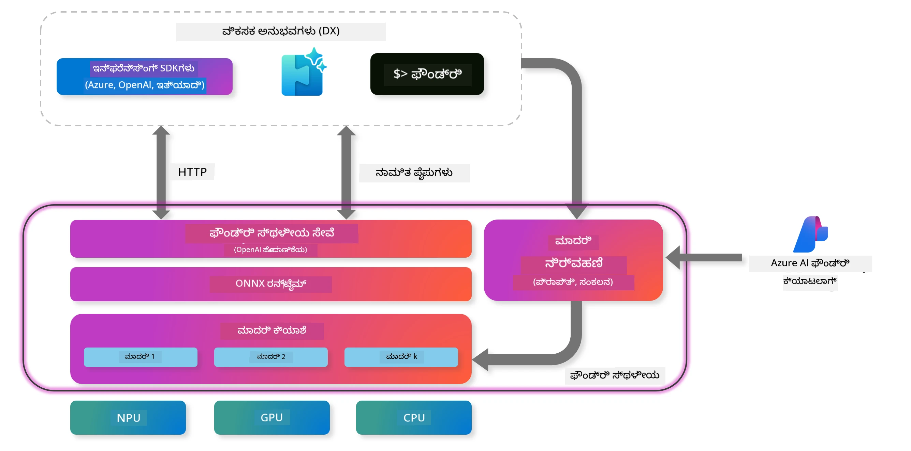
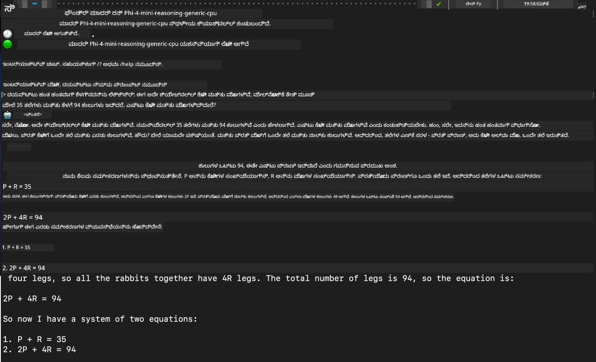

## Foundry Local ನಲ್ಲಿ Phi-Family ಮಾದರಿಗಳೊಂದಿಗೆ ಪ್ರಾರಂಭಿಸುವುದು

### Foundry Local ಗೆ ಪರಿಚಯ

Foundry Local ನು ನಿಮ್ಮ ಲೋಕಲ್ ಹಾರ್ಡ್‌ವೇರ್ ಮೇಲೆ ಎಂಟರ್ಪ್ರೈಸ್-ಸ್ಟ್ಯಾಂಡರ್ಡ್ AI ಸಾಮರ್ಥ್ಯಗಳನ್ನು সরাসরি ತಂದುಕೊಡುವ ಶಕ್ತಿಶಾಲಿ on-device AI ಇನ್ಫರೆನ್ಸ್ ಪರಿಹಾರವಾಗಿದೆ. ಈ ಟ್ಯುಟೋರಿಯಲ್ Foundry Local ನಲ್ಲಿ Phi-Family ಮಾದರಿಗಳನ್ನು ಸೆಟ್‌ಅಪ್ ಮಾಡುವುದು ಮತ್ತು ಬಳಸುವುದು ಹೇಗೆ ಎಂಬುದನ್ನು ನಿಮ್ಮೊಡನೆ ಗೈಡ್ ಮಾಡುತ್ತದೆ, ಇದು ನಿಮಗೆ ನಿಮ್ಮ AI ವರ್ಕ್‌ಲೋಡ್‌ಗಳ ಮೇಲೆ ಸಂಪೂರ್ಣ ನಿಯಂತ್ರಣವನ್ನು ನೀಡುತ್ತಾ ಗೌಪ್ಯತೆಯನ್ನು ಕಾಪಾಡಿ ವೆಚ್ಚಗಳನ್ನು ಕಡಿಮೆ ಮಾಡುತ್ತದೆ.

Foundry Local ನಿಮ್ಮ төхөөрөмжದಲ್ಲಿ AI ಮಾದರಿಗಳನ್ನು ಲೋಕಲ್‌ನಲ್ಲಿ ನಡೆಸುವುದು ಮೂಲಕ ಪ್ರದರ್ಶನ, ಗೌಪ್ಯತೆ, ಕಸ್ಟಮೈಜೆಷನ್ ಮತ್ತು ವೆಚ್ಚದ ಮುನ್ನಡೆಗಳನ್ನು ಒದಗಿಸುತ್ತದೆ. ಇದು ಸುಲಭವಾದ CLI, SDK, ಮತ್ತು REST API ಮೂಲಕ ನಿಮ್ಮ ಇತ್ತೀಚಿನ ವರ್ಕ್‌ಫ್ಲೋಗಳು ಮತ್ತು ಅಪ್ಲಿಕೇಶನ್‌ಗಳಿಗೆ ಸೀಮೋಲೇಸ್‌గా ಸಂಯೋಜಿತವಾಗುತ್ತದೆ.




### Foundry Local ಅನ್ನು ಯಾಕೆ ಆಯ್ಕೆ ಮಾಡಬೇಕು?

Foundry Local ನ ಪ್ರಯೋಜನಗಳನ್ನು ಅರ್ಥಮಾಡಿಕೊಳ್ಳುವುದರಿಂದ ನಿಮ್ಮ AI ನಿಯೋಜನೆ ತಂತ್ರತೀಮೆ ಬಗ್ಗೆ ಗೊತ್ತಾದ ನಿರ್ಣಯಗಳನ್ನು ತೆಗೆದುಕೊಳ್ಳಲು ಸಹಾಯವಾಗುತ್ತದೆ:

- **ಡಿವೈಸ್ನಲ್ಲಿ ಇನ್ಫರೆನ್ಸ್:** ನಿಮ್ಮ ಸ್ವಂತ ಹಾರ್ಡ್‌ವೇರ್‌ನಲ್ಲಿ ಮಾದರಿಗಳನ್ನು ಲೋಕಲ್‌ನಲ್ಲಿ ಓಡಿಸಿ, ನಿಮ್ಮ ವೆಚ್ಚಗಳನ್ನು ಕಡಿಮೆ ಮಾಡುತ್ತಾ ನಿಮ್ಮ ಎಲ್ಲಾ ಡೇಟಾವನ್ನು ನಿಮ್ಮ ಸಾಧನದಲ್ಲೇ ಇರಿಸಿ.

- **ಮಾದರಿ ಕಸ್ಟಮೈಜೆಷನ್:** ಪೂರ್ವನಿಯೋಜಿತ ಮಾದರಿಗಳಿಂದ ಆಯ್ಕೆಮಾಡಿ ಅಥವಾ ನಿರ್ದಿಷ್ಟ ಅಗತ್ಯಗಳು ಮತ್ತು ಬಳಕೆ ಪ್ರಕರಣಗಳಿಗೆ ನಿಮ್ಮ ಸ್ವಂತ ಮಾದರಿಗಳನ್ನು ಬಳಸಿರಿ.

- **ವೆಚ್ಚದ ಪರಿಣಾಮಕಾರಿತ್ವ:** ಇರುವ ಹಾರ್ಡ್‌ವೇರ್ ಅನ್ನು ಬಳಸುವುದರಿಂದ ಆವರ್ತಿತ ಕ್ಲೌಡ್ ಸರ್ವೀಸ್ ವೆಚ್ಚಗಳನ್ನು ನಿವಾರಿಸಬಹುದು, ಇದರಿಂದ AI ಇನ್ನಷ್ಟು ಪ್ರಾಪ್ಯವಾಗುತ್ತದೆ.

- **ಸರಳ ಸಂಯೋಜನೆ:** ನಿಮ್ಮ ಅಪ್ಲಿಕೇಶನ್ಗಳೊಂದಿಗೆ SDK, API ಎಂಡ್ಪಾಯಿಂಟ್ಗಳು ಅಥವಾ CLI ಮೂಲಕ ಸಂಪರ್ಕಿಸಿ, ಅಗತ್ಯವಿದ್ದಂತೆ Microsoft Foundry ಗೆ ಸುಲಭವಾಗಿ ಸ್ಕೇಲ್ ಮಾಡಬಹುದು.

> **ಪ್ರಾರಂಭಿಕ ಟಿಪ್:** ಈ ಟ್ಯುಟೋರಿಯಲ್ Foundry Local ಅನ್ನು CLI ಮತ್ತು SDK ಇಂಟರ್ಫೇಸ್ಗಳ ಮುಖಾಮುಖಿ ಬಳಕೆಯನ್ನು ಕೇಂದ್ರಗೊಳಿಸುತ್ತದೆ. ನಿಮ್ಮ ಬಳಕೆಗೊಂದು ಉತ್ತಮ ವಿಧಾನ ಆರಿಸಲು ನೀವು ಇಬ್ಬರನ್ನು ಕೂಡ ಕಲಿಯುತ್ತೀರಿ.

## ಭಾಗ 1: Foundry Local CLI ಸ್ಥಾಪನೆ

### ಹಂತ 1: ಸ್ಥಾಪನೆ

Foundry Local CLI ನಿಮ್ಮ ಸ್ಥಳೀಯವಾಗಿ AI ಮಾದರಿಗಳನ್ನು ನಿರ್ವಹಿಸಲು ಮತ್ತು ನಡೆಸಲು ಪ್ರವೇಶದ ದ್ವಾರವಾಗಿದೆ. ನಿಮ್ಮ ಸಿಸ್ಟಮ್‌ನಲ್ಲಿ ಇದನ್ನು ಸ್ಥಾಪಿಸುವುದರಿಂದ ಪ್ರಾರಂಭಿಸೋಣ.

**ಬೆಂಬಲಿತ ವೇದಿಕೆಗಳು:** Windows ಮತ್ತು macOS

ವಿಸ্তারিত ಸ್ಥಾಪನಾ ಸೂಚನೆಗಳಿಗಾಗಿ, ದಯವಿಟ್ಟು [ಅಧಿಕೃತ Foundry Local ಡಾಕ್ಯುಮೆಂಟೇಶನ್](https://github.com/microsoft/Foundry-Local/blob/main/README.md) ನೋಡಿ.

### ಹಂತ 2: ಲಭ್ಯವಿರುವ ಮಾದರಿಗಳ ಅನ್ವೇಷಣೆ

Foundry Local CLI ಅನ್ನು ಸ್ಥಾಪಿಸಿದ ಮೇಲೆ, ನೀವು ನಿಮ್ಮ ಬಳಕೆ ಪ್ರಕರಣಕ್ಕೆ ಲಭ್ಯವಿರುವ ಮಾದರಿಗಳನ್ನು ಕಂಡುಹಿಡಿಯಬಹುದು. ಈ ಕಮಾಂಡ್ ಎಲ್ಲಾ ಬೆಂಬಲಿತ ಮಾದರಿಗಳನ್ನು ತೋರಿಸುತ್ತದೆ:


```bash
foundry model list
```

### ಹಂತ 3: Phi ಫ್ಯಾಮಿಲಿ ಮಾದರಿಗಳನ್ನು ಅರ್ಥಮಾಡಿಕೊಳ್ಳುವುದು

Phi ಫ್ಯಾಮಿಲಿ ವಿವಿಧ ಬಳಕೆ ಪ್ರಕರಣಗಳು ಮತ್ತು ಹಾರ್ಡ್‌ವೇರ್ ಕಾಂಫಿಗರೇಶನ್‌ಗಳಿಗಾಗಿ ಆಪ್ಟಿಮೈಸ್ ಮಾಡಿದ ಹಲವಾರು ಮಾದರಿಗಳನ್ನು ನೀಡುತ್ತದೆ. Foundry Local ನಲ್ಲಿ ಲಭ್ಯವಿರುವ Phi ಮಾದರಿಗಳು ಹೀಗಿವೆ:

**ಲಭ್ಯವಿರುವ Phi ಮಾದರಿಗಳು:** 

- **phi-3.5-mini** - ಮೂಲಭೂತ ಕಾರ್ಯಗಳಿಗಾಗಿ ಕಾಂಪ್ಯಾಕ್ಟ್ ಮಾದರಿ
- **phi-3-mini-128k** - ಉದ್ದವಾದ ಸಂಭಾಷಣೆಗಳಿಗಾಗಿ ವಿಸ್ತರಿಸಿದ ಕಾಂಟೆಕ್ಸ್ಟ್ ಆವೃತ್ತಿ
- **phi-3-mini-4k** - ಸಾಮಾನ್ಯ ಉಪಯೋಗಕ್ಕಾಗಿ ಸ್ಥandard ಕಾಂটೆಕ್ಸ್ಟ್ ಮಾದರಿ
- **phi-4** - ಉತ್ತಮ ಸಾಮರ್ಥ್ಯಗಳೊಂದಿಗೆ ಅಭಿವೃದ್ಧಿಪಡಿಸಿದ ಮಾದರಿ
- **phi-4-mini** - Phi-4 ನ ಲೈಟ್‌ವೇಟ್ ಆವೃತ್ತಿ
- **phi-4-mini-reasoning** - ಸಂಕೀರ್ಣ ನಿರ್ಣಯ ಕಾರ್ಯಗಳಿಗೆ ವಿಶೇಷಗೊಳಿಸಲಾಗಿದೆ

> **ಹಾರ್ಡ್‌ವೇರ್ ಅನುಕೂಲತೆ:** ಪ್ರತಿಯೊಂದು ಮಾದರಿಯನ್ನು ನಿಮ್ಮ ಸಿಸ್ಟಮ್ ಸಾಮರ್ಥ್ಯದ ಆಧಾರದ ಮೇಲೆ ವಿವಿಧ ಹಾರ್ಡ್‌ವೇರ್ ತ್ವರಕ (CPU, GPU)ಗಳಿಗೆ ಕಾನ್ಫಿಗರ್ ಮಾಡಬಹುದು.

### ಹಂತ 4: ನಿಮ್ಮ ಪ್ರಥಮ Phi ಮಾದರಿಯನ್ನು ಚಾಲನೆ ಮಾಡುವುದು

ಪ್ರಾಯೋಗಿಕ ಉದಾಹರಣೆಯಿಂದ ಪ್ರಾರಂಭಿಸೋಣ. ನಾವು `phi-4-mini-reasoning` ಮಾದರಿಯನ್ನು ಓಡಿಸಲಾಗುತ್ತದೆ, ಇದು ಹಂತ ಹಂತವಾಗಿ ಸಂಕೀರ್ಣ ಸಮಸ್ಯೆಗಳನ್ನು ಪರಿಹರಿಸುವಲ್ಲಿ ಚುಟುಕು ಸಾಮರ್ಥ್ಯವನ್ನು ಹೊಂದಿದೆ.


**ಮಾದರಿಯನ್ನು ಓಡಿಸುವ ಕಮಾಂಡ್:**

```bash
foundry model run Phi-4-mini-reasoning-generic-cpu
```

> **ಮೊದಲ ಬಾರಿ ಸೆಟ್‌ಅಪ್:** ಮಾದರಿಯನ್ನು ಮೊದಲ ಬಾರಿ ಓಡಿಸುವಾಗ, Foundry Local ಅದನ್ನು ಸ್ವಯಂಚಾಲಿತವಾಗಿ ನಿಮ್ಮ ಸ್ಥಳೀಯ ಸಾಧನಕ್ಕೆ ಡೌನ್ಲೋಡ್ ಮಾಡುತ್ತದೆ. ಡೌನ್ಲೋಡ್ ಸಮಯ ನಿಮ್ಮ ನೆಟ್ವರ್ಕ್ ವೇಗದ ಮೇಲೆ ನಿರ್ಭರಿಸುತ್ತದೆ, ಆದ್ದರಿಂದ ಪ್ರಾಥಮಿಕ ಸೆಟ್‌ಅಪ್ ವೇಳೆ ದಯವಿಟ್ಟು ಧೈರ್ಯವಾಗಿರಿ.

### ಹಂತ 5: ವಾಸ್ತವ ಸಮಸ್ಯೆಯೊಂದಿಗೆ ಮಾದರಿಯನ್ನು ಪರೀಕ್ಷಿಸುವುದು

ಇದೀಗ ನಮ್ಮ ಮಾದರಿಯನ್ನು ಹಂತ ಹಂತವಾಗಿ ನಿರ್ಣಯ ಮಾಡುವುದನ್ನು ನೋಡಲು ಕ್ಲಾಸಿಕ್ ಲాజಿಕ್ ಸಮಸ್ಯೆಯೊಂದರೊಂದಿಗೆ ಪರೀಕ್ಷಿಸೋಣ:

**ಉದಾಹರಣೆ ಸಮಸ್ಯೆ:**

```txt
Please calculate the following step by step: Now there are pheasants and rabbits in the same cage, there are thirty-five heads on top and ninety-four legs on the bottom, how many pheasants and rabbits are there?
```

**ನಿರೀಕ್ಷಿತ ವರ್ತನೆ:** ಈ ಮಾದರಿ ಸಮಸ್ಯೆಯನ್ನು ತರ್ಕಸಹಿತ ಹಂತಗಳಾಗಿ ವಿಭಜಿಸಬೇಕು, pheasants ಗಳಿಗೆ 2 ಕಾಲುಗಳಿವೆ ಮತ್ತು ಮೂಂಗಿಗಳು (rabbits) 4 ಕಾಲುಗಳನ್ನು ಹೊಂದಿರುವ ತತ್ವವನ್ನು ಉಪಯೋಗಿಸಿ ಸಮೀಕರಣದ ವ್ಯವಸ್ಥೆಯನ್ನು ಪರಿಹರಿಸಬೇಕು.

**ಫಲಿತಾಂಶಗಳು:**



## ಭಾಗ 2: Foundry Local SDK ಬಳಸಿ ಅಪ್ಲಿಕೇಶನುಗಳನ್ನು ನಿರ್ಮಿಸುವುದು

### SDK ಯನ್ನು ಯಾಕೆ ಉಪಯೋಗಿಸಬೇಕು?

CLI ಪರೀಕ್ಷೆ ಮತ್ತು ತ್ವರಿತ ಪರಸ್ಪರಕ್ರಿಯೆಗಳಿಗಾಗಿ ಪರಿಪೂರ್ಣವಾಗಿದ್ದರೆ, SDK Foundry Local ಅನ್ನು ಪ್ರೋಗ್ರಾಮ್ಯಾಟಿಕ್ ಆಗಿ ನಿಮ್ಮ ಅಪ್ಲಿಕೇಶನ್‌ಗಳಿಗೆ ಸಂಯೋಜಿಸಲು ನಿಮಗೆ ಸಾಧ್ಯವಾಗಿಸುತ್ತದೆ. ಇದರಿಂದ ಕೆಳಗಿನ ಸಾಧ್ಯತೆಗಳು ತೆರೆಯುತ್ತವೆ:

- ಕಸ್ಟಮ್ AI-ಸಧಾರಿತ ಅಪ್ಲಿಕೇಶನ್‌ಗಳ ನಿರ್ಮಾಣ
- ಸ್ವಯಂಚಾಲಿತ ವರ್ಕ್‌ಫ್ಲೋಗಳ ಸೃಷ್ಟಿ
- ಉದ್ಭವ ವ್ಯವಸ್ಥೆಗಳಲ್ಲಿ AI ಸಾಮರ್ಥ್ಯಗಳನ್ನು ಸಂಯೋಜನೆ
- ಚಾಟ್‌ಬಾಟ್‌ಗಳು ಮತ್ತು ಇಂಟರಾಕ್ಟಿವ್ ಉಪಕರಣಗಳ ಅಭಿವೃದ್ಧಿ

### ಬೆಂಬಲಿತ ಪ್ರೋಗ್ರಾಮಿಂಗ್ ಭಾಷೆಗಳು

Foundry Local ಹಲವಾರು ಅಭಿವೃದ್ಧಿ ಪ್ರಾಧಾನ್ಯತಗಳಿಗೆ ಹೊಂದುವ SDK ಬೆಂಬಲವನ್ನು ಒದಗಿಸುತ್ತದೆ:

**📦 ಲಭ್ಯವಿರುವ SDKಗಳು:**

- **C# (.NET):** [SDK ಡಾಕ್ಯುಮೆಂಟೇಶನ್ ಮತ್ತು ಉದಾಹರಣೆಗಳು](https://github.com/microsoft/Foundry-Local/tree/main/sdk/cs)
- **Python:** [SDK ಡಾಕ್ಯುಮೆಂಟೇಶನ್ ಮತ್ತು ಉದಾಹರಣೆಗಳು](https://github.com/microsoft/Foundry-Local/tree/main/sdk/python)
- **JavaScript:** [SDK ಡಾಕ್ಯುಮೆಂಟೇಶನ್ ಮತ್ತು ಉದಾಹರಣೆಗಳು](https://github.com/microsoft/Foundry-Local/tree/main/sdk/js)
- **Rust:** [SDK ಡಾಕ್ಯುಮೆಂಟೇಶನ್ ಮತ್ತು ಉದಾಹರಣೆಗಳು](https://github.com/microsoft/Foundry-Local/tree/main/sdk/rust)

### ಮುಂದಿನ ಹಂತಗಳು

1. **ನಿಮ್ಮ ಅಭಿವೃದ್ಧಿ ವಾತಾವರಣದ ಆಧಾರದ ಮೇಲೆ ಇರುವ SDK ಆಯ್ಕೆ ಮಾಡಿ**
2. **ವಿಸ್ತೃತ ಅನುಷ್ಠಾನ ಮಾರ್ಗದರ್ಶಿಗಳಿಗಾಗಿ SDK-ನಿರ್ದಿಷ್ಟ ಡಾಕ್ಯುಮೆಂಟೇಶನ್ ಅನುಸರಿಸಿ**
3. **ಸಂಕೀರ್ಣ ಅಪ್ಲಿಕೇಶನ್‌ಗಳನ್ನು ನಿರ್ಮಿಸುವ ಮೊದಲು ಸರಳ ಉದಾಹರಣೆಗಳಿಂದ ಪ್ರಾರಂಭಿಸಿ**
4. **ಪ್ರತಿ SDK ಹಿತ<|vq_image_10131|><|image_border_901|><|vq_image_431|><|vq_image_12213|><|vq_image_12131|><|vq_image_6721|><|vq_image_4488|><|vq_image_11989|><|vq_image_6753|><|vq_image_12017|><|vq_image_3777|><|vq_image_13838|><|vq_image_651|><|vq_image_11271|><|vq_image_4990|><|vq_image_14871|><|vq_image_13136|><|vq_image_13136|><|vq_image_12872|><|vq_image_9611|><|vq_image_7000|><|vq_image_12374|><|vq_image_3709|><|vq_image_3082|><|vq_image_9317|><|vq_image_3417|><|vq_image_4360|><|vq_image_14518|><|vq_image_4020|><|vq_image_16064|><|vq_image_13271|><|vq_image_3944|><|vq_image_10040|><|vq_image_13639|><|vq_image_1138|><|vq_image_9097|><|vq_image_7088|><|vq_image_5727|><|vq_image_14735|><|vq_image_13039|><|vq_image_4345|><|vq_image_765|><|vq_image_4664|><|vq_image_14653|><|vq_image_15727|><|vq_image_9321|><|vq_image_12452|><|vq_image_7892|><|vq_image_13903|><|vq_image_7433|><|image_border_897|><|vq_image_2705|><|vq_image_14171|><|vq_image_11971|><|vq_image_8452|><|vq_image_12007|><|vq_image_16365|><|vq_image_8552|><|vq_image_3155|><|vq_image_8415|><|vq_image_2057|><|vq_image_15613|><|vq_image_6104|><|vq_image_7559|><|vq_image_7559|><|vq_image_8155|><|vq_image_1422|><|vq_image_9205|><|vq_image_5099|><|vq_image_2337|><|vq_image_2200|><|vq_image_12654|><|vq_image_11798|><|vq_image_13018|><|vq_image_14229|><|vq_image_15998|><|vq_image_5609|><|vq_image_14143|><|vq_image_14937|><|vq_image_708|><|vq_image_507|><|vq_image_1770|><|vq_image_2055|><|vq_image_12247|><|vq_image_6006|><|vq_image_15869|><|vq_image_12821|><|vq_image_15167|><|vq_image_16168|><|vq_image_10955|><|vq_image_14850|><|vq_image_8055|><|vq_image_15545|><|vq_image_832|><|vq_image_12544|><|vq_image_6763|><|vq_image_16005|><|vq_image_1970|><|vq_image_11528|><|image_border_898|><|vq_image_957|><|vq_image_2922|><|vq_image_8704|><|vq_image_3840|><|vq_image_16012|><|vq_image_14373|><|vq_image_8697|><|vq_image_14854|><|vq_image_619|><|vq_image_3182|><|vq_image_11961|><|vq_image_1574|><|vq_image_15546|><|vq_image_11267|><|vq_image_3083|><|vq_image_3927|><|vq_image_10991|><|vq_image_13339|><|vq_image_3691|><|vq_image_15001|><|vq_image_4003|><|vq_image_4584|><|vq_image_8994|><|vq_image_2232|><|vq_image_8337|><|vq_image_1834|><|vq_image_10407|><|vq_image_254|><|vq_image_9001|><|vq_image_11541|><|vq_image_8667|><|vq_image_13007|><|vq_image_14584|><|vq_image_9364|><|vq_image_11813|><|vq_image_6445|><|vq_image_15832|><|vq_image_12090|><|vq_image_12561|><|vq_image_9804|><|vq_image_4866|><|vq_image_10495|><|vq_image_13136|><|vq_image_2550|><|vq_image_1507|><|vq_image_2427|><|vq_image_5193|><|vq_image_5145|><|image_border_899|><|vq_image_9532|><|vq_image_789|><|vq_image_4834|><|vq_image_6910|><|vq_image_4869|><|vq_image_4869|><|vq_image_15910|><|vq_image_13357|><|vq_image_7349|><|vq_image_12926|><|vq_image_9802|><|vq_image_13572|><|vq_image_1027|><|vq_image_1003|><|vq_image_3246|><|vq_image_5931|><|vq_image_5771|><|vq_image_7120|><|vq_image_12264|><|vq_image_15134|><|vq_image_2439|><|vq_image_8687|><|vq_image_16172|><|vq_image_1175|><|vq_image_3993|><|vq_image_4554|><|vq_image_13722|><|vq_image_2653|><|vq_image_1548|><|vq_image_7650|><|vq_image_4214|><|vq_image_13819|><|vq_image_1959|><|vq_image_4451|><|vq_image_14725|><|vq_image_2768|><|vq_image_10893|><|vq_image_243|><|vq_image_10427|><|vq_image_14097|><|vq_image_6369|><|vq_image_14725|><|vq_image_9364|><|vq_image_12214|><|vq_image_7686|><|vq_image_10837|><|vq_image_4372|><|vq_image_12214|><|image_border_900|><|vq_image_13087|><|vq_image_1475|><|vq_image_13684|><|vq_image_2082|><|vq_image_101|><|vq_image_9205|><|vq_image_7098|><|vq_image_12937|><|vq_image_2175|><|vq_image_11704|><|vq_image_3927|><|vq_image_9416|><|vq_image_6473|><|vq_image_13563|><|vq_image_688|><|vq_image_5309|><|vq_image_2458|><|vq_image_15336|><|vq_image_11060|><|vq_image_12434|><|vq_image_2016|><|vq_image_5571|><|vq_image_10915|><|vq_image_14094|><|vq_image_14157|><|vq_image_3158|><|vq_image_7918|><|vq_image_6567|><|vq_image_2683|><|vq_image_10445|><|vq_image_7753|><|vq_image_15398|><|vq_image_11431|><|vq_image_15046|><|vq_image_1505|><|vq_image_5463|><|vq_image_9179|><|vq_image_3472|><|vq_image_1505|><|vq_image_1505|><|vq_image_6369|><|vq_image_1252|><|vq_image_1505|><|vq_image_1786|><|vq_image_13126|><|vq_image_13126|><|vq_image_4372|><|vq_image_14725|><|image_border_901|><|vq_image_7041|><|vq_image_15101|><|vq_image_15825|><|vq_image_335|><|vq_image_350|><|vq_image_16164|><|vq_image_16074|><|vq_image_5543|><|vq_image_13792|><|vq_image_358|><|vq_image_9692|><|vq_image_5456|><|vq_image_14483|><|vq_image_5494|><|vq_image_5642|><|vq_image_20|><|vq_image_14548|><|vq_image_8140|><|vq_image_8503|><|vq_image_13311|><|vq_image_11906|><|vq_image_7047|><|vq_image_10424|><|vq_image_1156|><|vq_image_11967|><|vq_image_1275|><|vq_image_7200|><|vq_image_12760|><|vq_image_9094|><|vq_image_15907|><|vq_image_3450|><|vq_image_5787|><|vq_image_11149|><|vq_image_11410|><|vq_image_8385|><|vq_image_15035|><|vq_image_13248|><|vq_image_1786|><|vq_image_13126|><|vq_image_10870|><|vq_image_13851|><|vq_image_10870|><|vq_image_1505|><|vq_image_12214|><|vq_image_15366|><|vq_image_4756|><|vq_image_1252|><|vq_image_1252|><|image_border_902|><|vq_image_12155|><|vq_image_16016|><|vq_image_14100|><|vq_image_12986|><|vq_image_6240|><|vq_image_2980|><|vq_image_14177|><|vq_image_8531|><|vq_image_12239|><|vq_image_7046|><|vq_image_13774|><|vq_image_14873|><|vq_image_3944|><|vq_image_3630|><|vq_image_15046|><|vq_image_8822|><|vq_image_12073|><|vq_image_12272|><|vq_image_3600|><|vq_image_3752|><|vq_image_10837|><|vq_image_2683|><|vq_image_7668|><|vq_image_1156|><|vq_image_11629|><|vq_image_12762|><|vq_image_16073|><|vq_image_11079|><|vq_image_8367|><|vq_image_2043|><|vq_image_16004|><|vq_image_1244|><|vq_image_8050|><|vq_image_13521|><|vq_image_1673|><|vq_image_2731|><|vq_image_16030|><|vq_image_12666|><|vq_image_9720|><|vq_image_13884|><|vq_image_7422|><|vq_image_5172|><|vq_image_11629|><|vq_image_7422|><|vq_image_16018|><|vq_image_925|><|vq_image_398|><|vq_image_1252|><|image_border_903|><|vq_image_12899|><|vq_image_5127|><|vq_image_15349|><|vq_image_8023|><|vq_image_3451|><|vq_image_11752|><|vq_image_15985|><|vq_image_4282|><|vq_image_14961|><|vq_image_13695|><|vq_image_4056|><|vq_image_3767|><|vq_image_12603|><|vq_image_438|><|vq_image_11978|><|vq_image_10974|><|vq_image_12167|><|vq_image_2137|><|vq_image_1573|><|vq_image_4413|><|vq_image_11752|><|vq_image_12112|><|vq_image_16339|><|vq_image_9092|><|vq_image_15836|><|vq_image_15553|><|vq_image_9009|><|vq_image_6555|><|vq_image_6799|><|vq_image_13339|><|vq_image_608|><|vq_image_501|><|vq_image_5890|><|vq_image_9166|><|vq_image_13250|><|vq_image_5874|><|vq_image_10029|><|vq_image_2870|><|vq_image_5572|><|vq_image_5251|><|vq_image_2518|><|vq_image_5135|><|vq_image_15081|><|vq_image_12610|><|vq_image_7853|><|vq_image_12616|><|vq_image_13964|><|vq_image_8157|><|image_border_904|><|vq_image_3152|><|vq_image_1225|><|vq_image_1829|><|vq_image_14775|><|vq_image_1884|><|vq_image_7954|><|vq_image_14695|><|vq_image_3147|><|vq_image_13867|><|vq_image_6131|><|vq_image_2017|><|vq_image_12073|><|vq_image_10894|><|vq_image_10870|><|vq_image_16201|><|vq_image_13939|><|vq_image_11142|><|vq_image_5660|><|vq_image_9952|><|vq_image_5156|><|vq_image_9802|><|vq_image_9449|><|vq_image_11315|><|vq_image_5771|><|vq_image_7930|><|vq_image_14498|><|vq_image_12168|><|vq_image_2109|><|vq_image_6092|><|vq_image_3210|><|vq_image_2137|><|vq_image_12083|><|vq_image_11001|><|vq_image_14425|><|vq_image_4251|><|vq_image_13605|><|vq_image_14375|><|vq_image_1242|><|vq_image_6864|><|vq_image_12283|><|vq_image_15093|><|vq_image_2276|><|vq_image_2608|><|vq_image_3493|><|vq_image_2665|><|vq_image_12816|><|vq_image_15691|><|vq_image_4372|><|image_border_905|><|vq_image_3183|><|vq_image_13789|><|vq_image_3910|><|vq_image_14188|><|vq_image_9494|><|vq_image_3990|><|vq_image_5516|><|vq_image_15324|><|vq_image_7252|><|vq_image_5942|><|vq_image_390|><|vq_image_14991|><|vq_image_6783|><|vq_image_11900|><|vq_image_8810|><|vq_image_9301|><|vq_image_16160|><|vq_image_9300|><|vq_image_13948|><|vq_image_6803|><|vq_image_10599|><|vq_image_8158|><|vq_image_16004|><|vq_image_12636|><|vq_image_15046|><|vq_image_14269|><|vq_image_12579|><|vq_image_11773|><|vq_image_10808|><|vq_image_1079|><|vq_image_4383|><|vq_image_15099|><|vq_image_5846|><|vq_image_11152|><|vq_image_475|><|vq_image_15107|><|vq_image_5652|><|vq_image_3739|><|vq_image_295|><|vq_image_9666|><|vq_image_15046|><|vq_image_12937|><|vq_image_13925|><|vq_image_5193|><|vq_image_12760|><|vq_image_11436|><|vq_image_15152|><|vq_image_14654|><|image_border_906|><|vq_image_4150|><|vq_image_2643|><|vq_image_7812|><|vq_image_16114|><|vq_image_15167|><|vq_image_14633|><|vq_image_8210|><|vq_image_15465|><|vq_image_113|><|vq_image_12209|><|vq_image_3383|><|vq_image_5869|><|vq_image_10833|><|vq_image_2238|><|vq_image_8143|><|vq_image_3097|><|vq_image_12457|><|vq_image_8663|><|vq_image_2038|><|vq_image_4149|><|vq_image_5204|><|vq_image_4451|><|vq_image_5239|><|vq_image_9004|><|vq_image_15904|><|vq_image_11308|><|vq_image_6613|><|vq_image_4119|><|vq_image_124|><|vq_image_3576|><|vq_image_2644|><|vq_image_3634|><|vq_image_4869|><|vq_image_7664|><|vq_image_13758|><|vq_image_1220|><|vq_image_11444|><|vq_image_3956|><|vq_image_13740|><|vq_image_11468|><|vq_image_2713|><|vq_image_15049|><|vq_image_9084|><|vq_image_10424|><|vq_image_11967|><|vq_image_13675|><|vq_image_11967|><|vq_image_10329|><|image_border_907|><|vq_image_5768|><|vq_image_3517|><|vq_image_7161|><|vq_image_12011|><|vq_image_1893|><|vq_image_8469|><|vq_image_3101|><|vq_image_12264|><|vq_image_13709|><|vq_image_5571|><|vq_image_3037|><|vq_image_12816|><|vq_image_7307|><|vq_image_1341|><|vq_image_11563|><|vq_image_3236|><|vq_image_14377|><|vq_image_11071|><|vq_image_3569|><|vq_image_14826|><|vq_image_3797|><|vq_image_11156|><|vq_image_9558|><|vq_image_15149|><|vq_image_14637|><|vq_image_3703|><|vq_image_14143|><|vq_image_4569|><|vq_image_7083|><|vq_image_10561|><|vq_image_14690|><|vq_image_3289|><|vq_image_4851|><|vq_image_1965|><|vq_image_16064|><|vq_image_5249|><|vq_image_15890|><|vq_image_12461|><|vq_image_16154|><|vq_image_763|><|vq_image_5840|><|vq_image_4154|><|vq_image_860|><|vq_image_5668|><|vq_image_11472|><|vq_image_11254|><|vq_image_5668|><|vq_image_2131|><|image_border_908|><|vq_image_4451|><|vq_image_14098|><|vq_image_13762|><|vq_image_12230|><|vq_image_6777|><|vq_image_8403|><|vq_image_2818|><|vq_image_11597|><|vq_image_15444|><|vq_image_4343|><|vq_image_15360|><|vq_image_12954|><|vq_image_6010|><|vq_image_9891|><|vq_image_15446|><|vq_image_10521|><|vq_image_3390|><|vq_image_15902|><|vq_image_15837|><|vq_image_2195|><|vq_image_15972|><|vq_image_11903|><|vq_image_5875|><|vq_image_1036|><|vq_image_798|><|vq_image_3437|><|vq_image_490|><|vq_image_1292|><|vq_image_10435|><|vq_image_5114|><|vq_image_5477|><|vq_image_10664|><|vq_image_2771|><|vq_image_3173|><|vq_image_1485|><|vq_image_16354|><|vq_image_7751|><|vq_image_5652|><|vq_image_6060|><|vq_image_11606|><|vq_image_8998|><|vq_image_15956|><|vq_image_11930|><|vq_image_16189|><|vq_image_12984|><|vq_image_12011|><|vq_image_14099|><|vq_image_7688|><|image_border_909|><|vq_image_2994|><|vq_image_729|><|vq_image_15835|><|vq_image_12697|><|vq_image_3911|><|vq_image_10332|><|vq_image_1257|><|vq_image_6790|><|vq_image_2275|><|vq_image_874|><|vq_image_2731|><|vq_image_10531|><|vq_image_15729|><|vq_image_4053|><|vq_image_215|><|vq_image_15443|><|vq_image_3507|><|vq_image_16335|><|vq_image_12022|><|vq_image_3859|><|vq_image_15738|><|vq_image_11536|><|vq_image_3136|><|vq_image_15618|><|vq_image_9550|><|vq_image_10218|><|vq_image_13621|><|vq_image_14713|><|vq_image_16074|><|vq_image_11932|><|vq_image_2531|><|vq_image_5829|><|vq_image_10177|><|vq_image_5598|><|vq_image_2841|><|vq_image_1355|><|vq_image_6292|><|vq_image_9382|><|vq_image_12195|><|vq_image_2087|><|vq_image_12952|><|vq_image_3010|> conveyed in findings of a previously translated text.

## ಸಾರಾಂಶ

ನೀವು ಈಗ ಕೆಳಕಂಡವುಗಳನ್ನು ಕಲಿತಿದ್ದೀರಿ:
- ✅ Foundry Local CLI ಅನ್ನು ಇನ್‌ಸ್ಟಾಲ್ ಮಾಡಿ ಮತ್ತು ಸೆಟ್‌ಅಪ್ ಮಾಡುವುದು
- ✅ Phi ಫ್ಯಾಮಿಲಿ ಮಾದರಿಗಳನ್ನು ಕಂಡುಹಿಡಿಯುವುದು ಮತ್ತು ಚಾಲನೆ ಮಾಡುವುದು
- ✅ ವಾಸ್ತವ-ಜಗತ್ತಿನ ಸಮಸ್ಯೆಗಳೊಂದಿಗೆ ಮಾದರಿಗಳನ್ನು ಪರೀಕ್ಷಿಸುವುದು
- ✅ ಅಪ್ಲಿಕೇಶನ್ ಅಭಿವೃದ್ಧಿಗಾಗಿ SDK ಆಯ್ಕೆಗಳನ್ನು ಅರ್ಥಮಾಡಿಕೊಳ್ಳುವುದು

Foundry Local ನಿಮ್ಮ ಸ್ಥಳೀಯ ಪರಿಸರಕ್ಕೆ ನೇರವಾಗಿ AI ಸಾಮರ್ಥ್ಯಗಳನ್ನು ತರಲು ಶಕ್ತಿಶಾಲಿ ಭೂಮಿಕೆಯನ್ನು ಒದಗಿಸುತ್ತದೆ — ಪ್ರದರ್ಶನ, ಗೌಪ್ಯತೆ ಮತ್ತು ವೆಚ್ಚಗಳ ಮೇಲೆ ನಿಮ್ಮ ನಿಯಂತ್ರಣವನ್ನು ನೀಡುತ್ತಾ ಅಗತ್ಯವಿರುವಾಗ ಕ್ಲೌಡ್ ಪರಿಹಾರಗಳಿಗೆ ಸ್ಕೇಲ್ ಮಾಡಲು ಬದ್ಧತೆಯನ್ನು ಕಾಪಾಡುತ್ತದೆ.

---

<!-- CO-OP TRANSLATOR DISCLAIMER START -->
ನಿರಾಕರಣೆ:
ಈ ದಾಖಲೆ AI ಅನುವಾದ ಸೇವೆ [Co-op Translator](https://github.com/Azure/co-op-translator) ಬಳಸಿ ಅನುವಾದಿಸಲಾಗಿದೆ. ನಿಖರತೆಗೆ ನಾವು ಪ್ರಯತ್ನಿಸಿದರೂ, ಸ್ವಯಂಚಾಲಿತ ಅನುವಾದಗಳಲ್ಲಿ ದೋಷಗಳು ಅಥವಾ ಅಶುದ್ಧಿಗಳು ಇರಬಹುದು ಎಂಬುದನ್ನು ದಯವಿಟ್ಟು ಗಮನಿಸಿ. ಮೂಲ ಭಾಷೆಯಲ್ಲಿರುವ ಮೂಲ ದಾಖಲೆ ಪ್ರಾಧಿಕಾರ ಹೊಂದಿರುವ ಮೂಲವೆಂದು ಪರಿಗಣಿಸಬೇಕು. ಗಂಭೀರವಾದ ಮಾಹಿತಿಗಾಗಿ ವೃತ್ತಿಪರ ಮಾನವ ಅನುವಾದವನ್ನು ಶಿಫಾರಸು ಮಾಡಲ್ಪಡುತ್ತದೆ. ಈ ಅನುವಾದದ ಬಳಕೆಯಿಂದ ಉಂಟಾಗುವ ಯಾವುದೇ ತಪ್ಪು ಅರ್ಥಗತಿಕೆಗಳು ಅಥವಾ ತಪ್ಪಾದ ವ್ಯಾಖ್ಯಾನಗಳಿಗಾಗಿ ನಾವು ಜವಾಬ್ದಾರರಾಗುವುದಿಲ್ಲ.
<!-- CO-OP TRANSLATOR DISCLAIMER END -->