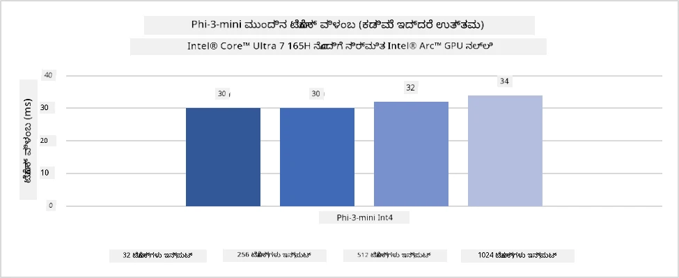
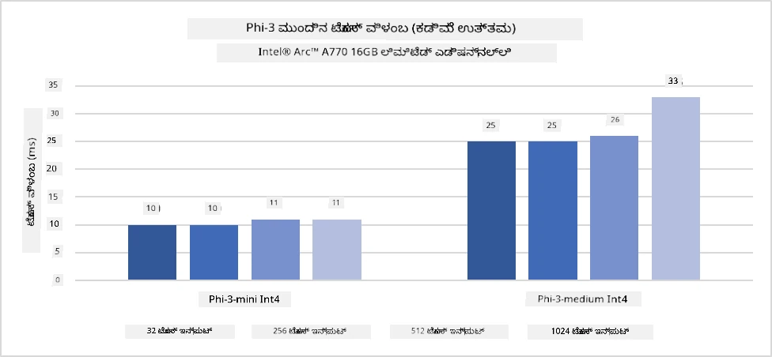
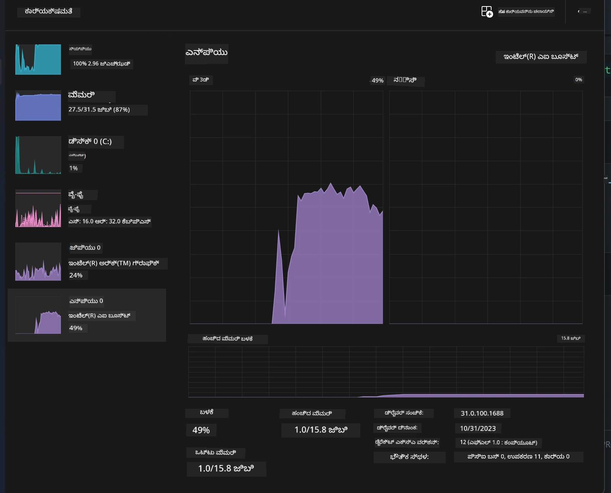
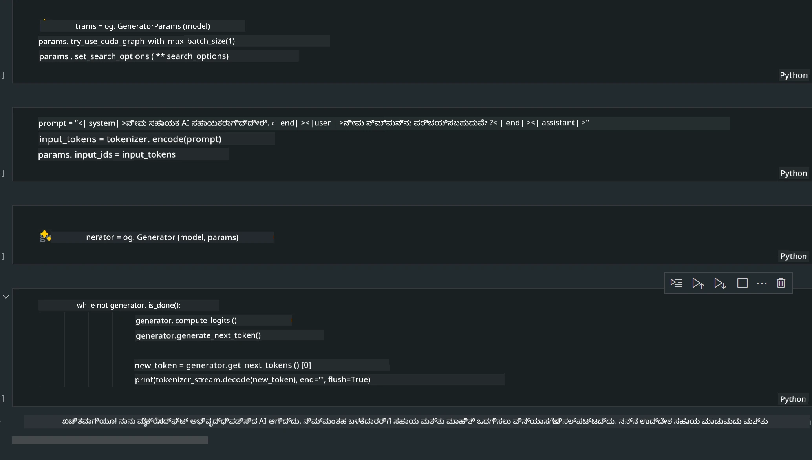
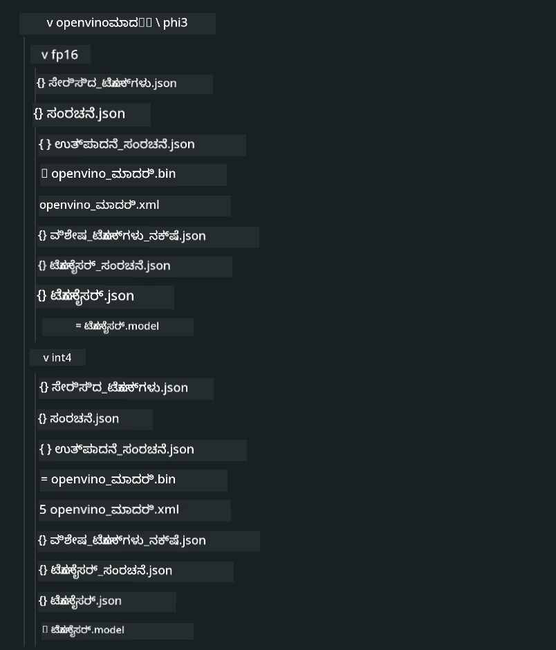
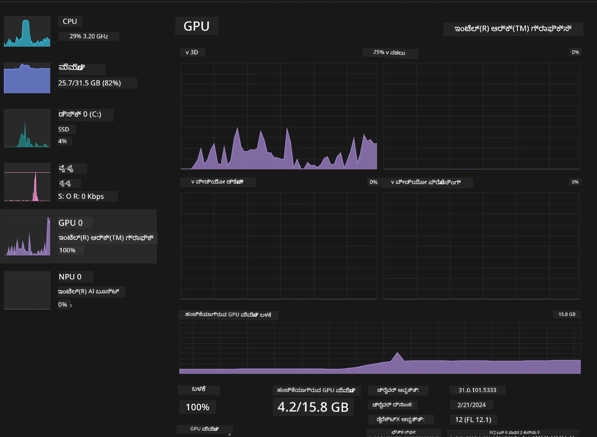

<!--
CO_OP_TRANSLATOR_METADATA:
{
  "original_hash": "e08ce816e23ad813244a09ca34ebb8ac",
  "translation_date": "2025-12-22T00:30:06+00:00",
  "source_file": "md/01.Introduction/03/AIPC_Inference.md",
  "language_code": "kn"
}
-->
# **AI PC ನಲ್ಲಿ Phi-3 ಇನ್ಫರೆನ್ಸ್**

ಜನರೇಟಿವ್ AI ಕ್ಷೇತ್ರದಲ್ಲಿ ಪ್ರಗತಿಯು ಮತ್ತು ಎಡ್‌ಜ್ ಸಾಧನಗಳ ಹಾರ್ಡ್‌ವೇರ್ ಸಾಮರ್ಥ್ಯದ ಸುಧಾರಣೆಯೊಂದಿಗೆ, ಹೆಚ್ಚಿನ ಸಂಖ್ಯೆಯ ಜನರೇಟಿವ್ AI ಮಾದರಿಗಳನ್ನು ಬಳಕೆದಾರರ Bring Your Own Device (BYOD) ಸಾಧನಗಳಲ್ಲಿ ಸಂಯೋಜಿಸಬಹುದು. AI PC ಗಳು ಈ ಮಾದರಿಗಳಲ್ಲಿ ಒಂದಾಗಿವೆ. 2024 ರಿಂದ ಪ್ರಾರಂಭಿಸಿ, Intel, AMD ಮತ್ತು Qualcomm ಕಂಪನಿಗಳು PC ತಯಾರಕರುಗಳೊಂದಿಗೆ ಸಹಕರಿಸಿ ಹಾರ್ಡ್‌ವೇರ್ ಬದಲಾವಣೆಗಳ ಮೂಲಕ ಸ್ಥಳೀಯ ಜನರೇಟಿವ್ AI ಮಾದರಿಗಳ ನಿಯೋಜನೆಯನ್ನು ಸುಲಭಗೊಳಿಸುವ AI PC ಗಳನ್ನು ಪರಿಚಯಿಸಿವೆ. ಈ ಚರ್ಚೆಯಲ್ಲಿ, ನಾವು Intel AI PC ಗಳನ್ನು ಗಮನಿಸಿ Intel AI PC ನಲ್ಲಿ Phi-3 ಅನ್ನು ಹೇಗೆ ನಿಯೋಜಿಸುವುದೆಂದು ಅನ್ವೇಷಿಸೋಣ.

### NPU ಎಂದರೆ ಏನು

NPU (Neural Processing Unit) ಒಂದು ವಿಶಿಷ್ಟವಾಗಿರುವ ಪ್ರೊಸೆಸರ್ ಅಥವಾ ದೊಡ್ಡ SoC ಒಳಗೆಲಾದ ಪ್ರೊಸೆಸಿಂಗ್ ಯೂನಿಟ್ ಆಗಿದ್ದು, ನರಜಾಲದ ಕಾರ್ಯಾಚರಣೆಗಳು ಮತ್ತು AI ಕಾರ್ಯಗಳನ್ನು ವೇಗವಾಗಿ ನಡೆಸಲು ವಿಶೇಷವಾಗಿ ವಿನ್ಯಾಸಗೊಳಿಸಲಾಗಿದೆ. ಸಾಮಾನ್ಯ ಉದ್ದೇಶದ CPUಗಳು ಮತ್ತು GPUಗಳಿಗಿಂತ ಭಿನ್ನವಾಗಿ, NPUs ಡೇಟಾ-ಚಾಲಿತ ಸಮಾನಾಂತರ ಗಣಕಯಂತ್ರಗಳಿಗೆ ಆಪ್ಟಿಮೈಸ್ ಮಾಡಲ್ಪಟ್ಟಿದ್ದು, ವೀಡಿಯೋಗಳು ಮತ್ತು ಚಿತ್ರಗಳಂತಹ ಭಾರೀ ಮಾಲ್ಟಿಮೀಡಿಯಾ ಡೇಟಾವನ್ನು ಮತ್ತು ನರಜಾಲಗಳಿಗಾಗಿ ಡೇಟಾ ಪ್ರಕ್ರಿಯೆಯನ್ನು ಪ್ರಾಸೆಸಿಂಗ್ ಮಾಡುವಲ್ಲಿ ಅತ್ಯಂತ ಪರಿಣಾಮಕಾರಿಯಾಗಿರುತ್ತವೆ. ಇದು ಸ್ಪೀಚ್ ಗುರುತುಮಾಡುವಿಕೆ, ವೀಡಿಯೋ ಕರೆಯಲ್ಲಿನ ಹಿನ್ನೆಲೆ ಮಂದಗೊಳಿಸುವಿಕೆ ಮತ್ತು ಆಬ್ಜೆಕ್ಟ್ ಪತ್ತೆ ಮುಂತಾದ ಫೋಟೋ ಅಥವಾ ವೀಡಿಯೋ ಸಂಪಾದನೆ ಪ್ರಕ್ರಿಯೆಗಳಿಗೆ ಸಂಬಂಧಿಸಿದ AI ಕಾರ್ಯಗಳನ್ನು ನಿರ್ವಹಿಸಲು ವಿಶೇಷವಾಗಿ handig.

## NPU ಮತ್ತು GPU ನಡುವಿನ ವ್ಯತ್ಯಾಸ

ಹೊಚ್ಚು AI ಮತ್ತು ಮೆಶಿನ್ ಲರ್ನಿಂಗ್ ಕಾರ್ಯಭಾರಗಳು GPU ಗಳ üzerinde ಓಡುತ್ತವೆ, ಆದರೆ GPU ಮತ್ತು NPU ಗಳ ನಡುವೆ ಪ್ರಮುಖ ಭೇದವಿದೆ.
GPU ಗಳನ್ನು ಅವರ ಸಮಾನಾಂತರ ಗಣನೆ ಸಾಮರ್ಥ್ಯದಿಗಾಗಿ ಪರಿಚಯಿಸಲಾಗುತ್ತದೆ, ಆದರೆ ಎಲ್ಲಾ GPU ಗಳು ಗ್ರಾಫಿಕ್ಸ್ ಪ್ರಕ್ರಿಯೆಗಿಂತ ಹೊರಗೆ ಸಮಾನ ಪರಿಣಾಮಕಾರಿಯಾಗುವುದಿಲ್ಲ. ಹತ್ತಿರವಾಗಿ, NPUs ನರಜಾಲ ಕಾರ್ಯಾಚರಣೆಗಳಲ್ಲಿ ಸಂಬಂದಪಟ್ಟ ಜಟಿಲ ಗಣಿತಗಳನ್ನು ನಿರ್ವಹಿಸಲು ಉಡುಗೊರೆಗೊಂಡಿದ್ದರೆ, ಅವು AI ಕಾರ್ಯಗಳಿಗೆ ಅತ್ಯಂತ ಪರಿಣಾಮಕಾರಿಯಾಗಿರುತ್ತವೆ.

ಸಂಗ್ರಹವಾಗಿ, NPUs ಗಳು AI ಗಣಿತಗಳನ್ನು ತುಲನಾತ್ಮಕವಾಗಿ ವೇಗಗೊಳಿಸುವ ಗಣಿತ ತಜ್ಞರು ಮತ್ತು ಅವು AI PCಗಳ ಉದಯೋನ್ಮುಖ ಯುಗದಲ್ಲಿ ಪ್ರಮುಖ ಪಾತ್ರ ವಹಿಸುತ್ತವೆ!

***This example is based on Intel's latest Intel Core Ultra Processor***

## **1. NPU ಬಳಸಿಕೋ Phi-3 ಮಾದರಿಯನ್ನು ರನ್ ಮಾಡುವುದು**

Intel® NPU ಸಾಧನವು Intel ಕ್ಲೈಂಟ್ CPUಗಳೊಂದಿಗೆ ಸಂಯೋಜಿತವಾದ AI ಇನ್ಫರೆನ್ಸ್ ಆಕ್ಸಲೆರೇಟರ್ ಆಗಿದ್ದು, Intel® Core™ Ultra ತಲೆಮೊದಲು (ಹಿಂದೆ Meteor Lake ಎಂದು ಪರಿಚಿತರಾಗಿದ್ದು) ಆಗಿ CPU ಗಳಲ್ಲಿ ಪ್ರಾರಂಭವಾಗಿದೆ. ಇದು ಕೃತಕ ನರಜಾಲದ ಕಾರ್ಯಗಳನ್ನು ಎನರ್ಜಿ-ಕಾರ್ಯಕ್ಷಮವಾಗಿ ಕಾರ್ಯನಿರ್ವಹಿಸಲು ಅನುಮತಿಸುತ್ತದೆ.





**Intel NPU Acceleration Library**

The Intel NPU Acceleration Library [https://github.com/intel/intel-npu-acceleration-library](https://github.com/intel/intel-npu-acceleration-library) ಒಂದು Python ಗ್ರಂಥಾಲಯವಾಗಿದ್ದು, ನೋಡಸಾಧ್ಯ ಹಾರ್ಡ್‌ವೇರ್ ಮೇಲೆ Intel Neural Processing Unit (NPU) の ಶಕ್ತಿ ಬಳಸಿಕೊಂಡು ನಿಮ್ಮ ಅಪ್ಲಿಕೇಶನ್ ಗಳ ಕಾರ್ಯಕ್ಷಮತೆಯನ್ನು ಏರಿಸಲು ರೂಪುಗೊಂಡಿದೆ.

AI PCಗಳನ್ನು ಚಾಲನೆಯಲ್ಲಿಡುವ Intel® Core™ Ultra ಪ್ರೊಸೆಸರ್‌ಗಳಿಂದ ಸಬಲಗೊಳಿಸಲಾದ Phi-3-mini ಉದಾಹರಣೆ.


Install the Python Library with pip

```bash

   pip install intel-npu-acceleration-library

```

***ಗಮನಿಸಿ*** ಪ್ರಾಜೆಕ್ಟ್ ಇನ್ನೂ ಅಭಿವೃದ್ಧಿಯಲ್ಲಿದೆ, ಆದರೆ ತಾತ್ಪರ್ಯ ಮಾದರಿ ಈಗಾಗಲೇ ತುಂಬಾ ಸಂಪೂರ್ಣವಾಗಿದೆ.

### **Intel NPU Acceleration Library ಬಳಸಿ Phi-3 ರನ್ ಮಾಡುವುದು**

Intel NPU ಆಕ್ಸಲೆರೇಶನ್ ಬಳಸಿ, ಈ ಗ್ರಂಥಾಲಯವು ಸಾಮಾನ್ಯ ಎನ್‌ಕೋಡಿಂಗ್ ಪ್ರಕ್ರಿಯೆಯ ಮೇಲೆ ಪ್ರಭಾವ ಬೀರದು. ನೀವು ಈ ಗ್ರಂಥಾಲಯವನ್ನು ಬಳಸಿ ಮೂಲ Phi-3 ಮಾದರಿಯನ್ನು ಕ್ವಾಂಟೈಸೇಶನ್ ಮಾಡಬೇಕಾಗುತ್ತದೆ, ಉದಾಹರಣೆಗೆ FP16, INT8, INT4 ಇತ್ಯಾದಿ.

```python
from transformers import AutoTokenizer, pipeline,TextStreamer
from intel_npu_acceleration_library import NPUModelForCausalLM, int4
from intel_npu_acceleration_library.compiler import CompilerConfig
import warnings

model_id = "microsoft/Phi-3-mini-4k-instruct"

compiler_conf = CompilerConfig(dtype=int4)
model = NPUModelForCausalLM.from_pretrained(
    model_id, use_cache=True, config=compiler_conf, attn_implementation="sdpa"
).eval()

tokenizer = AutoTokenizer.from_pretrained(model_id)

text_streamer = TextStreamer(tokenizer, skip_prompt=True)
```

ಕ್ವಾಂಟೈಫಿಕೇಶನ್ ಯಶಸ್ವಿಯಾಗಿ ನಡೆದ ನಂತರ, Phi-3 ಮಾದರಿಯನ್ನು ರನ್ ಮಾಡಲು NPU ಅನ್ನು ಕರೆ ಮಾಡಲು ಮುಂದುವರೆಸಿ ಕಾರ್ಯನಿರ್ವಹಿಸಬಹುದು.

```python
generation_args = {
   "max_new_tokens": 1024,
   "return_full_text": False,
   "temperature": 0.3,
   "do_sample": False,
   "streamer": text_streamer,
}

pipe = pipeline(
   "text-generation",
   model=model,
   tokenizer=tokenizer,
)

query = "<|system|>You are a helpful AI assistant.<|end|><|user|>Can you introduce yourself?<|end|><|assistant|>"

with warnings.catch_warnings():
    warnings.simplefilter("ignore")
    pipe(query, **generation_args)
```

ಕೋಡ್ ಅನ್ನು 실행ಿಸುತ್ತಿರುವಾಗ, ನಾವು Task Manager ಮುಖಾಂತರ NPU ರನ್ನಿಂಗ್ ಸ್ಥಿತಿಯನ್ನು ವೀಕ್ಷಿಸಬಹುದು



***Samples*** : [AIPC_NPU_DEMO.ipynb](../../../code/03.Inference/AIPC/AIPC_NPU_DEMO.ipynb)

## **2. DirectML + ONNX Runtime ಬಳಸಿ Phi-3 ಮಾದರಿಯನ್ನು ರನ್ ಮಾಡುವುದು**

### **DirectML ಎಂದರೆ ಏನು**

[DirectML](https://github.com/microsoft/DirectML) ಒಂದು ಉನ್ನತ-ಕಾರ್ಯಕ್ಷಮತಾ, ಹಾರ್ಡ್‌ವೇರ್-ಆಕ್ಸಲೆರೇಟೆಡ್ DirectX 12 ಗ್ರಂಥಾಲಯವಾಗಿದ್ದು ಮೆಷಿನ್ ಲರ್ನಿಂಗ್‌ಗಾಗಿ ರೂಪುಗೊಂಡಿದೆ. DirectML ಸಾಮಾನ್ಯ ಮೆಷಿನ್ ಲರ್ನಿಂಗ್ ಕಾರ್ಯಗಳಿಗೆ GPU ಆಕ್ಸಲರೇಶನ್ ಅನ್ನು ಬೆಂಬಲಿಸುತ್ತದೆ ಮತ್ತು AMD, Intel, NVIDIA, Qualcomm ಮುಂತಾದ.vendor ಗಳಿಂದ DirectX 12 ಸೂಕ್ತ GPU ಗಳ ದೂರವರೆಗೆ ಹಾರ್ಡ್‌ವೇರ್ ಮತ್ತು ಡ್ರೈವರ್‌ಗಳನ್ನು ವ್ಯಾಪಕವಾಗಿ ಬೆಂಬಲಿಸುತ್ತದೆ.

ಸ್ವತಂತ್ರವಾಗಿ ಉಪಯೋಗಿಸಿರುವಾಗ, DirectML API ಒಂದು ಕೆಳಮಟ್ಟದ DirectX 12 ಗ್ರಂಥಾಲಯವಾಗಿದೆ ಮತ್ತು ಫ್ರೇಮ್‌ವರ್ಕ್‌ಗಳು, ಗೇಮ್‌ಗಳು ಮತ್ತು ಇತರ ರಿಯಲ್-ಟೈಂ ಅಪ್ಲಿಕೇಶನ್‌ಗಳಂತಹ ಉನ್ನತ-ಕಾರ್ಯಕ್ಷಮತೆ, ಕಡಿಮೆ-ಡಿಲೇ ಅಪ್ಲಿಕೇಶನ್‌ಗಳಿಗೆ ಸೂಕ್ತವಾಗಿದೆ. Direct3D 12 ಜೊತೆಗೆ DirectML ನ ನಿರಂತರ ಇಂಟರ್‌ಆಪರೇಬಿಲಿಟಿ ಮತ್ತು ಅದರ ಕಡಿಮೆ ಓವರ್‌ಹೆಡ್ ಮತ್ತು ಹಾರ್ಡ್‌ವೇರ್ ಆವೃತ್ತಿಗಳಲ್ಲಿ ಸಮ್ಮತತೆಯು DirectML ಅನ್ನು ಮೆಷಿನ್ ಲರ್ನಿಂಗ್ ವೇಗಗೊಳಿಸುವುದಕ್ಕೆ ಆದರ್ಶ ಮಾಡುತ್ತದೆ, ವಿಶೇಷವಾಗಿ ಉನ್ನತ ಕಾರ್ಯಕ್ಷಮತೆ ಬೇಕಾದಾಗ ಮತ್ತು ವಿವಿಧ ಹಾರ್ಡ್‌ವೇರ್‌ನಲ್ಲಿ ಫಲಿತಾಂಶಗಳ ವಿಶ್ವಾಸಾರ್ಹತೆ ಮತ್ತು ನಿರೀಕ್ಷಿತತೆಯ ಅಗತ್ಯವಿದ್ದಾಗ.

***ಗಮನಿಸಿ*** : ಇತ್ತೀಚಿನ DirectML ಈಗಾಗಲೇ NPU ಅನ್ನು ಬೆಂಬಲಿಸುತ್ತದೆ(https://devblogs.microsoft.com/directx/introducing-neural-processor-unit-npu-support-in-directml-developer-preview/)

###  DirectML ಮತ್ತು CUDA ಅವರ ಸಾಮರ್ಥ್ಯಗಳು ಮತ್ತು ಕಾರ್ಯಕ್ಷಮತೆಯ ಪರಿಗಣನೆಗಳು:

**DirectML** ಮೈಸ್ರೋಸಾಫ್ಟ್ ಅಭಿವೃದ್ಧಿಪಡಿಸಿದ ಮೆಷಿನ್ ಲರ್ನಿಂಗ್ ಗ್ರಂಥಾಲಯ.
- DX12 ಆಧರಿತ: DirectML DirectX 12 (DX12) ಮೇಲೆ ನಿರ್ಮಿತವಾಗಿದ್ದು, NVIDIA ಮತ್ತು AMD ಸೇರಿದಂತೆ ಹಲವು GPU ಗಳಲ್ಲಿ ವ್ಯಾಪಕ ಹಾರ್ಡ್‌ವೇರ್ ಬೆಂಬಲವನ್ನು ಒದಗಿಸುತ್ತದೆ.
- ವಿಶಾಲ ಬೆಂಬಲ: ಅದು DX12 ಅನ್ನು ಉಪಯೋಗಿಸುವುದರಿಂದ, ಏನೇನಾದರೂ DX12 ಬೆಂಬಲಿಸುವ GPU ಜೊತೆಗೆ DirectML ಕೆಲಸ ಮಾಡಬಹುದು, ಇದರಲ್ಲಿ ಇಂಟಿಗ್ರೇಟೆಡ್ GPU ಗಳೂ ಸೇರಿವೆ.
- ಇಮೇಜ್ ಪ್ರಾಸೆಸಿಂಗ್: DirectML ನ್ಯೂರೆಲ್ ನೆಟ್‌ವರ್ಕ್‌ಗಳನ್ನು ಬಳಸಿ ಚಿತ್ರಗಳು ಮತ್ತು ಇತರೆ ಡೇಟಾವನ್ನು ಪ್ರಕ್ರಿಯೆ ಮಾಡುತ್ತದೆ, ಇದನ್ನು ಚಿತ್ರ ಗುರುತింపు, ವಸ್ತು ಪತ್ತೆ ಮುಂತಾದ ಕಾರ್ಯಗಳಿಗೆ ಸೂಕ್ತವಾಗಿಸುತ್ತದೆ.
- ಸೆಟ್ ಅಪ್ ಮಾಡಲು ಸುಲಭ: DirectML ಅನ್ನು ಸೆಟ್ ಅಪ್ ಮಾಡುವುದು ಸರಳವಾಗಿದೆ ಮತ್ತು GPU ತಯಾರಕರಿಂದ ಬೇಕಾಗುವ ವಿಶೇಷ SDKಗಳು ಅಥವಾ ಗ್ರಂಥಾಲಯಗಳನ್ನು ಅವಶ್ಯಕತೆಯಾಗಿ ಮಾಡದು.
- ಕಾರ್ಯಕ್ಷಮತೆ: ಕೆಲವು ಸಂದರ್ಭಗಳಲ್ಲಿ, DirectML ಉತ್ತಮ ಪ್ರದರ್ಶನ ನೀಡುತ್ತದೆ ಮತ್ತು ಕೆಲವು ಕಾರ್ಯಭಾರಗಳಿಗಾಗಿ CUDA ಯಿಗಿಂತ ವೇಗವಾಗಿರಬಹುದು.
- ಮಿತಿಗಳು: ಆದರೆ, ವಿಶಿಷ್ಟವಾಗಿ float16 ದೊಡ್ಡ ಬ್ಯಾಚ್ ಗಾತ್ರಗಳಿಗೆ ಕೆಲವು ಸಂದರ್ಭಗಳಲ್ಲಿ DirectML ನಿಧಾನಗೊಳ್ಳಬಹುದು.

**CUDA** NVIDIA ರ ಪ್ಯಾರಲಲ್ ಕಂಪ್ಯೂಟಿಂಗ್ ವೇದಿಕೆ ಮತ್ತು ಪ್ರೋಗ್ರಾಮಿಂಗ್ ಮಾದರಿ. ಇದು ಡೆವಲಪರ್‌ಗಳಿಗೆ ಸಾಮಾನ್ಯ ಉದ್ದೇಶದ ಗಣನೆಗಾಗಿ, ಮೆಷಿನ್ ಲರ್ನಿಂಗ್ ಮತ್ತು ವಿಜ್ಞಾನ ಪರಿಷ್ಕರಣೆಗಳಿಗೆ NVIDIA GPU ಗಳ ಶಕ್ತಿಯನ್ನು ಬಳಸಲು ಅನುಮತಿಸುತ್ತದೆ.
- NVIDIA-ವಿಶಿಷ್ಟ: CUDA NVIDIA GPU ಗಳೊಂದಿಗೆ ಅತಿ ಸಮೀಕ್ಷಿತವಾಗಿ ಸಂಯೋಜಿಸಲಾಗಿದೆ ಮತ್ತು ಅವುಗಳಿಗಾಗಿ ವಿನ್ಯಾಸಗೊಳ್ಳಲಾಗಿದೆ.
- ಅತ್ಯಂತ ಆప్టಿಮೈಜ್ಡ್: ಇದು GPU-ಆಕ್ಸಲೆರೇಟೆಡ್ ಕಾರ್ಯಗಳಿಗೆ ಉತ್ತಮ ಕಾರ್ಯಕ್ಷಮತೆಯನ್ನು ಒದಗಿಸುತ್ತದೆ, ವಿಶೇಷವಾಗಿ NVIDIA GPU ಗಳನ್ನು ಬಳಸದಿದ್ದಾಗ.
- ವ್ಯಾಪಕವಾಗಿ ಬಳಕೆಯಾಗುವದು: TensorFlow ಮತ್ತು PyTorch ಮುಂತಾದ ಅನೇಕ ಮೆಷಿನ್ ಲರ್ನಿಂಗ್ ಫ್ರೇಮ್‌ವರ್ಕ್‌ಗಳು CUDA ಬೆಂಬಲವನ್ನು ಹೊಂದಿವೆ.
- ವೈಯುಕ್ತಿಕರಣ: ಡೆವಲಪರ್‌ಗಳು ನಿರ್ದಿಷ್ಟ ಕಾರ್ಯಗಳಿಗೆ CUDA ಸೆಟ್ಟಿಂಗ್‌ಗಳನ್ನು ಸೂಕ್ಷ್ಮವಾಗಿ ತಿದ್ದುಪಡಿಸಬಹುದು, ಇದು ಕಡೆಯಾದಲ್ಲಿ ಉತ್ಕೃಷ್ಟ ಕಾರ್ಯಕ್ಷಮತೆಯನ್ನು ತೆಂದೆಯುತ್ತದೆ.
- ಮಿತಿಗಳು: ಆದರೆ, CUDA ಯ ಅವಲಂಬನೆ NVIDIA ಹಾರ್ಡ್‌ವೇರ್ ಮೇಲೆ ಇರುವುದರಿಂದ, ವಿಭಿನ್ನ GPU ಗಳಲ್ಲಿ ವ್ಯಾಪಕ ಹೊಂದಾಣಿಕೆಯ ಅಗತ್ಯವಿದ್ದರೆ ಇದು ಮಿತಿಯಾಗಬಹುದು.

### DirectML ಮತ್ತು CUDA ನಡುವಿನ ಆಯ್ಕೆ

DirectML ಮತ್ತು CUDA ನಡುವಿನ ಆಯ್ಕೆಯು ನಿಮ್ಮ ನಿರ್ದಿಷ್ಟ ಬಳಕೆದಾರಿಕೆಯ, ಹಾರ್ಡ್‌ವೇರ್ ಲಭ್ಯತೆ ಮತ್ತು ಇಚ್ಛೆಗಳನ್ನು ಆಧರಿಸುತ್ತದೆ.
ನೀವು ಹೆಚ್ಚಿದ ನಿಖರ ಹೊಂದಾಣಿಕೆ ಮತ್ತು ಸುಲಭ ಸೆಟ್ ಅಪ್ ಕಂಡುಹಿಡಿಯಲು ಬಯಸಿದರೆ, DirectML ಒಳ್ಳೆಯ ಆಯ್ಕೆ ಆಗಬಹುದು. ಆದರೆ, ನಿಮ್ಮ ಬಳಿ NVIDIA GPU ಗಳಿರುವುದಾದರೆ ಮತ್ತು ಅತ್ಯಂತ ಆಪ್ಟಿಮೈಜ್ಡ್ ಕಾರ್ಯಕ್ಷಮತೆ ಬೇಕಾದರೆ, CUDA ಇನ್ನೂ ಬಲಿಷ್ಠ ಆಯ್ಕೆಯಾಗಿರುತ್ತದೆ. ಸಾರಾಂಶವಾಗಿ, DirectML ಮತ್ತು CUDA ರಿಬ್ಬಿಬ್ಬಕ್ಕೂ ತಮ್ಮ ತಮ್ಮ ಶಕ್ತಿ ಮತ್ತು ದುರ್ಬಲತೆಗಳಿವೆ, ಆದ್ದರಿಂದ ನಿಮ್ಮ ಅವಶ್ಯಕತೆಗಳು ಮತ್ತು ಲಭ್ಯವಿರುವ ಹಾರ್ಡ್‌ವೇರ್ ಅನ್ನು ಪರಿಗಣಿಸಿ ನಿರ್ಧರಿಸಿ.

### **ONNX Runtime ನೊಂದಿಗೆ ಜನರೇಟಿವ್ AI**

AI ಯ ಯುಗದಲ್ಲಿ, AI ಮಾದರಿಗಳ ಪೋರ್ಟಬಿಲಿಟಿ ಅತ್ಯಂತ ಮಹತ್ವದ್ದು. ONNX Runtime ತರಬೇತಿಮಾಡಿದ ಮಾದರಿಗಳನ್ನು ವಿಭಿನ್ನ ಸಾಧನಗಳಿಗೆ ಸುಲಭವಾಗಿ ನಿಯೋಜಿಸಬಹುದು. ಡೆವಲಪರ್‌ಗಳು ಇನ್ಫರೆನ್ಸ್ ಫ್ರೇಮ್‌ವರ್ಕ್ ಬಗ್ಗೆ ಹೆಚ್ಚು ಚಿಂತೆ ಮಾಡಬೇಕಾಗದು; ಏಕೀಕೃತ API ಬಳಸಿ ಮಾದರಿ ಇನ್ಫರೆನ್ಸ್ ಪೂರ್ಣಗೊಳ್ಳುತ್ತದೆ. ಜನರೇಟಿವ್ AI ಯುಗದಲ್ಲಿ, ONNX Runtime ಕೂಡ ಕೋಡ್ ಆಪ್ಟಿಮೈಜೆಷನ್ ಮಾಡುವ ಮೂಲಕ ಸಾಧನೆ ಹೆಚ್ಚಿದೆ (https: //onnxruntime.ai/docs/genai/). ಆಪ್ಟಿಮೈಸ್ ಮಾಡಿದ ONNX Runtime ಮೂಲಕ, ಕ್ವಾಂಟೈಸ್ ಮಾಡಿದ ಜನರೇಟಿವ್ AI ಮಾದರಿಯನ್ನು ವಿಭಿನ್ನ ಟರ್ಮಿನಲ್‌ಗಳಲ್ಲಿ ಇನ್ಫರೆನ್ಸ್ ಮಾಡಬಹುದು. Generative AI with ONNX Runtime ನಲ್ಲಿ, ನೀವು Python, C#, C / C++ ಮೂಲಕ AI ಮಾದರಿ API ಅನ್ನು ಇನ್ಫರೆನ್ಸ್ ಮಾಡಬಹುದು. ನಿಸ್ಸಂದೇಹವಾಗಿ, iPhone ಮೇಲೆ ನಿಯೋಜಿಸುವಾಗ C++ ಆಧಾರಿತ Generative AI with ONNX Runtime API ಯ ಪ್ರಯೋಜನವನ್ನು ಪಡೆದುಕೊಳ್ಳಬಹುದು.

[Sample Code](https://github.com/Azure-Samples/Phi-3MiniSamples/tree/main/onnx)

***compile generative AI with ONNX Runtime library***

```bash

winget install --id=Kitware.CMake  -e

git clone https://github.com/microsoft/onnxruntime.git

cd .\onnxruntime\

./build.bat --build_shared_lib --skip_tests --parallel --use_dml --config Release

cd ../

git clone https://github.com/microsoft/onnxruntime-genai.git

cd .\onnxruntime-genai\

mkdir ort

cd ort

mkdir include

mkdir lib

copy ..\onnxruntime\include\onnxruntime\core\providers\dml\dml_provider_factory.h ort\include

copy ..\onnxruntime\include\onnxruntime\core\session\onnxruntime_c_api.h ort\include

copy ..\onnxruntime\build\Windows\Release\Release\*.dll ort\lib

copy ..\onnxruntime\build\Windows\Release\Release\onnxruntime.lib ort\lib

python build.py --use_dml


```

**Install library**

```bash

pip install .\onnxruntime_genai_directml-0.3.0.dev0-cp310-cp310-win_amd64.whl

```

ಇದು ರನ್ ಆದ ಫಲಿತಾಂಶ



***Samples*** : [AIPC_DirectML_DEMO.ipynb](../../../code/03.Inference/AIPC/AIPC_DirectML_DEMO.ipynb)

## **3. Intel OpenVino ಬಳಸಿ Phi-3 ಮಾದರಿಯನ್ನು ರನ್ ಮಾಡುವುದು**

### **OpenVINO ಎಂದರೆ ಏನು**

[OpenVINO](https://github.com/openvinotoolkit/openvino) ಒಂದು open-source ಉಪಕರಣಸಂಪುಟವಾಗಿದ್ದು ಡೀಪ್ ಲರ್ನಿಂಗ್ ಮಾದರಿಗಳನ್ನು ಆಪ್ಟಿಮೈಸ್ ಮತ್ತು ನಿಯೋಜಿಸಲು ಬಳಸಲಾಗುತ್ತದೆ. ಇದು TensorFlow, PyTorch ಮುಂತಾದ ಪ್ರಖ್ಯಾತ ಫ್ರೇಮ್‌ವರ್ಕ್‌ಗಳಿಂದ ದೃಶ್ಯ, ಧ್ವನಿ ಮತ್ತು ಭಾಷೆ ಮಾದರಿಗಳಿಗಾಗಿ ದ್ರುತಗೊಳಿಸಿದ ಡೀಪ್ ಲರ್ನಿಂಗ್ ಕಾರ್ಯಕ್ಷಮತೆಯನ್ನು ಒದಗಿಸುತ್ತದೆ. OpenVINO ಬಳಸಿ ಪ್ರಾರಂಭಿಸಿ. OpenVINO ಅನ್ನು CPU ಮತ್ತು GPU ಜೊತೆಗೆ ಸಂಯೋಜಿಸಿ Phi3 ಮಾದರಿಯನ್ನು ಓಡಿಸಲು ಕೂಡ ಬಳಸಬಹುದು.

***ಗಮನಿಸಿ***: ಇದುವರೆಗೂ, OpenVINO ಈ ಸಮಯದಲ್ಲಿ NPU ಅನ್ನು ಬೆಂಬಲಿಸುವುದಿಲ್ಲ.

### **OpenVINO ಗ್ರಂಥಾಲಯವನ್ನು ಇನ್‌ಸ್ಟಾಲ್ ಮಾಡಿ**

```bash

 pip install git+https://github.com/huggingface/optimum-intel.git

 pip install git+https://github.com/openvinotoolkit/nncf.git

 pip install openvino-nightly

```

### **OpenVINO সহ Phi-3 ನಡಿಸುವುದು**

NPU ಪ್ರಕಾರವಾಗಿ, OpenVINO ಕೂಡ ಕ್ವಾಂಟೈಸ್ ಮಾಡಲಾದ ಮಾದರಿಗಳನ್ನು ರನ್ ಮಾಡುವ ಮೂಲಕ ಜನರೇಟಿವ್ AI ಮಾದರಿಗಳನ್ನು ಕರೆನಿಸುತ್ತದೆ. ನಾವು ಮೊದಲು Phi-3 ಮಾದರಿಯನ್ನು ಕ್ವಾಂಟೈಸ್ ಮಾಡಬೇಕು ಮತ್ತು optimum-cli ಮೂಲಕ ಕಮಾಂಡ್ ಲೈನ್‌ನಲ್ಲಿ ಮಾದರಿ ಕ್ವಾಂಟೈಜೆಶನ್ ಪೂರ್ಣಗೊಳಿಸಬೇಕು

**INT4**

```bash

optimum-cli export openvino --model "microsoft/Phi-3-mini-4k-instruct" --task text-generation-with-past --weight-format int4 --group-size 128 --ratio 0.6  --sym  --trust-remote-code ./openvinomodel/phi3/int4

```

**FP16**

```bash

optimum-cli export openvino --model "microsoft/Phi-3-mini-4k-instruct" --task text-generation-with-past --weight-format fp16 --trust-remote-code ./openvinomodel/phi3/fp16

```

ಪರಿವರ್ತಿತ ಫಾರ್ಮಾಟ್, ಇಂತಹುದು



ಮಾದರಿ ಮಾರ್ಗಗಳನ್ನು (model_dir), ಸಂಬಂಧಿತ ಸಂರಚನೆಗಳನ್ನು (ov_config = {"PERFORMANCE_HINT": "LATENCY", "NUM_STREAMS": "1", "CACHE_DIR": ""}), ಮತ್ತು ಹಾರ್ಡ್‌ವೇರ್-ಆಕ್ಸಲೆರೇಟ್ ಸಾಧನಗಳನ್ನು (GPU.0) OVModelForCausalLM ಮೂಲಕ ಲೋಡ್ ಮಾಡಿ

```python

ov_model = OVModelForCausalLM.from_pretrained(
     model_dir,
     device='GPU.0',
     ov_config=ov_config,
     config=AutoConfig.from_pretrained(model_dir, trust_remote_code=True),
     trust_remote_code=True,
)

```

ಕೋಡ್ ಅನ್ನು 실행ಿಸುವಾಗ, ನಾವು Task Manager ಮೂಲಕ GPU ರನ್ ಸ್ಥಿತಿಯನ್ನು ವೀಕ್ಷಿಸಬಹುದು



***Samples*** : [AIPC_OpenVino_Demo.ipynb](../../../code/03.Inference/AIPC/AIPC_OpenVino_Demo.ipynb)

### ***ಗಮನಿಸಿ*** : ಮೇಲಿನ ಮೂರು ವಿಧಾನಗಳು ಪ್ರತಿಯೊಂದು ತನ್ನದೇ ಆದ ಪ್ರಯೋಜನಗಳನ್ನು ಹೊಂದಿವೆ, ಆದರೆ AI PC ಇನ್ಫರೆನ್ಸ್‌ಗೆ NPU ಆಕ್ಸಲೆರೇಶನ್ ಬಳಸುಲು ಶಿಫಾರಸು ಮಾಡಲಾಗಿದೆ.

---

<!-- CO-OP TRANSLATOR DISCLAIMER START -->
ಜವಾಬ್ದಾರಿ ನಿರಾಕರಣೆ:

ಈ ದಸ್ತಾವೇಜನ್ನು AI ಅನುವಾದ ಸೇವೆ [Co-op Translator](https://github.com/Azure/co-op-translator) ಬಳಸಿ ಅನುವಾದಿಸಲಾಗಿದೆ. ನಾವು ಸಮಗ್ರತೆಯತ್ತ ಪ್ರಯತ್ನಿಸುತ್ತಿದ್ದರೂ, ದಯವಿಟ್ಟು ಮನಗಂಡು கொள்ளಿ ಯಂತ್ರಾನುವಾದಗಳಲ್ಲಿ ದೋಷಗಳು ಅಥವಾ ತಪ್ಪುಗಳು ಇರಬಹುದು. ಮೂಲ ಭಾಷೆಯಲ್ಲಿನ ಮೂಲ ದಸ್ತಾವೇಜನ್ನು ಪ್ರಾಮಾಣಿಕ ಮೂಲವೆಂದು ಪರಿಗಣಿಸಬೇಕು. ಗಂಭೀರ ಮಾಹಿತಿಗಾಗಿ ವೃತ್ತಿಪರ ಮಾನವ ಅನುವಾದವನ್ನು ಶಿಫಾರಸು ಮಾಡಲಾಗುತ್ತದೆ. ಈ ಅನುವಾದದ ಬಳಕೆಯಿಂದ ಉಂಟಾಗುವ ಯಾವುದೇ ದುರ್ಬುದ್ದಿ ಅಥವಾ ತಪ್ಪು ಅರ್ಥಗರ್ಭಿತತೆಗಳಿಗೆ ನಾವು ಹೊಣೆಗಾರರಾಗುವುದಿಲ್ಲ.
<!-- CO-OP TRANSLATOR DISCLAIMER END -->