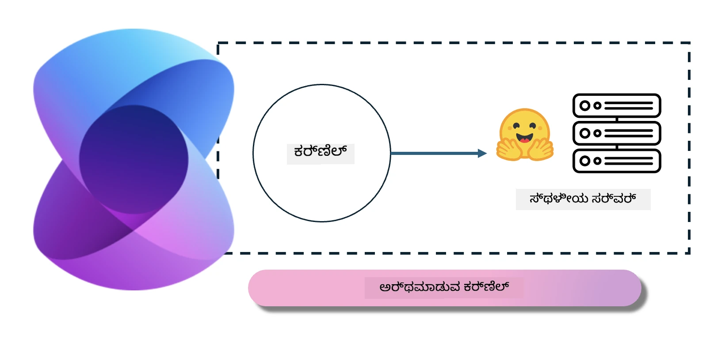
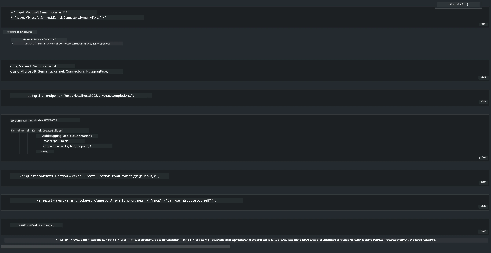

# **ಸ್ಥಳೀಯ ಸರ್ವರ್‌ನಲ್ಲಿ Phi-3 ಇನ್ಫರೆನ್ಸ್**

ನಾವು Phi-3 ಅನ್ನು ಸ್ಥಳೀಯ ಸರ್ವರ್‌ನಲ್ಲಿ ಡಿಪ್ಲಾಯ್ ಮಾಡಬಹುದು. ಬಳಕೆದಾರರು [Ollama](https://ollama.com) ಅಥವಾ [LM Studio](https://llamaedge.com) ಪರಿಹಾರಗಳನ್ನು ಆಯ್ಕೆ ಮಾಡಬಹುದು, ಅಥವಾ ತಮ್ಮದೇ ಕೋಡ್ ಬರೆಯಬಹುದು. ನೀವು Phi-3 ನ ಸ್ಥಳೀಯ ಸೇವೆಗಳನ್ನು [Semantic Kernel](https://github.com/microsoft/semantic-kernel?WT.mc_id=aiml-138114-kinfeylo) ಅಥವಾ [Langchain](https://www.langchain.com/) ಮೂಲಕ ಸಂಪರ್ಕಿಸಿ Copilot ಅಪ್ಲಿಕೇಶನ್‌ಗಳನ್ನು ನಿರ್ಮಿಸಬಹುದು

## **Phi-3-mini ಗೆ ಪ್ರವೇಶಿಸಲು Semantic Kernel ಅನ್ನು ಬಳಸಿ**

Copilot ಅಪ್ಲಿಕೇಶನ್‌ನಲ್ಲಿ, ನಾವು ಅಪ್ಲಿಕೇಶನ್‌ಗಳನ್ನು Semantic Kernel / LangChain ಮೂಲಕ ನಿರ್ಮಿಸುತ್ತೇವೆ. ಇಂತಹ ಅಪ್ಲಿಕೇಶನ್ ಫ್ರೇಮ್ವರ್ಕ್ ಸಾಮಾನ್ಯವಾಗಿ Azure OpenAI Service / OpenAI ಮಾದರಿಗಳೊಂದಿಗೆ ಹೊಂದಿಕೊಳ್ಳುತ್ತದೆ, ಮತ್ತು Hugging Face ಮೇಲಿನ ಓಪನ್‌ಸೋರ್ಸ್ ಮಾದರಿಗಳು ಮತ್ತು ಸ್ಥಳೀಯ ಮಾದರಿಗಳನ್ನು ಸಹ ಬೆಂಬಲಿಸಬಹುದು. Semantic Kernel ಬಳಸಿ Phi-3-mini ಗೆ ಪ್ರವೇಶಿಸಲು ನಾವು ಏನು ಮಾಡಬೇಕು? .NET ಅನ್ನು ಉದಾಹರಣೆಯಾಗಿ ಬಳಸಿಕೊಂಡು, ಅದನ್ನು Semantic Kernel ನಲ್ಲಿನ Hugging Face Connector ಜೊತೆ ಸಂಯೋಜಿಸಬಹುದು. ಡೀಫಾಲ್ಟ್ ಆಗಿ, ಅದು Hugging Face上的 model id ಗೆ ಹೊಂದಾಣಿಕೆಯಾಗುತ್ತದೆ (ಮೊದಲಬಾರಿಗೆ ಬಳಸುವಾಗ, ಮಾದರಿಯನ್ನು Hugging Face ನಿಂದ ಡೌನ್‌ಲೋಡ್ ಮಾಡಲಾಗುತ್ತದೆ, ಇದು ಬಹಳ ಸಮಯ ತೆಗೆದುಕೊಳ್ಳುತ್ತದೆ). ನೀವು ನಿರ್ಮಿಸಿದ ಸ್ಥಳೀಯ ಸೇವೆಗೆ ಕೂಡ ಸಂಪರ್ಕ ಮಾಡಬಹುದು. ಈ ಎರಡನ್ನು ಹೋಲಿಸಿದರೆ, ಹೆಚ್ಚು ಸ್ವಾಯತ್ತತೆಯನ್ನು ನೀಡುವ ಕಾರಣ, ವಿಶೇಷವಾಗಿ ಎಂಟರ್ಪ್ರೈಸ್ ಅಪ್ಲಿಕೇಶನ್‌ಗಳಲ್ಲಿ ನಾವು ನಂತರದ ವಿಧಾನವನ್ನು ಬಳಸುವುದನ್ನು ಶಿಫಾರಸು ಮಾಡುತ್ತೇವೆ.

ಚಿತ್ರದಿಂದ Semantic Kernel ಮೂಲಕ ಸ್ಥಳೀಯ ಸೇವೆಗಳನ್ನು ಪ್ರವೇಶಿಸುವುದು ಸುಲಭವಾಗಿ ಸ್ವ-ನಿರ್ಮಿತ Phi-3-mini ಮಾದರಿ ಸರ್ವರ್‌ಗೆ ಸಂಪರ್ಕ ಕಲ್ಪಿಸುವುದನ್ನು ತೋರಿಸುತ್ತದೆ. ಕೆಳಗೆ ಚಾಲನೆಯ ಫಲಿತಾಂಶ ಇಲ್ಲಿದೆ

***ಸ್ಯಾಂಪಲ್ ಕೋಡ್*** https://github.com/kinfey/Phi3MiniSamples/tree/main/semantickernel

---

<!-- CO-OP TRANSLATOR DISCLAIMER START -->
ಜವಾಬ್ದಾರಿ ನಿರಾಕರಣೆ:
ಈ ದಸ್ತಾವೇಜನ್ನು AI ಅನುವಾದ ಸೇವೆ Co-op Translator (https://github.com/Azure/co-op-translator) ಬಳಸಿ ಅನುವಾದಿಸಲಾಗಿದೆ. ನಾವು ನಿಖರತೆಗೆ ಪ್ರಯತ್ನಿಸಿದರೂ, ಸ್ವಯಂಚಾಲಿತ ಅನುವಾದಗಳಲ್ಲಿ ದೋಷಗಳು ಅಥವಾ ಅಸಮರ್ಥತೆಗಳು ಇರಬಹುದೆಂದು ದಯವಿಟ್ಟು ಗಮನಿಸಿ. ಮೂಲ ಭಾಷೆಯ ಅಸಲಿ ದಸ್ತಾವೇಜನ್ನು ಅಧಿಕೃತ ಮೂಲವೆಂದು ಪರಿಗಣಿಸಬೇಕಾಗಿದ್ದು, ಗಂಭೀರ ಮಾಹಿತಿಗೆ ವೃತ್ತಿಪರ ಮಾನವ ಅನುವಾದವನ್ನು ಶಿಫಾರಸು ಮಾಡಲಾಗಿದೆ. ಈ ಅನುವಾದದ ಬಳಕೆಯಿಂದ ಉಂಟಾಗುವ ಯಾವುದೇ ತಪ್ಪು ಅರ್ಥಗ್ರಹಣೆಗಳು ಅಥವಾ ದೂಷಿತ ವಿವರಣೆಗಳಿಗಾಗಿ ನಾವು ಜವಾಬ್ದಾರರಲ್ಲ.
<!-- CO-OP TRANSLATOR DISCLAIMER END -->