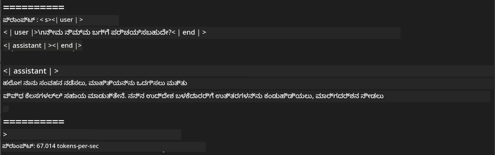
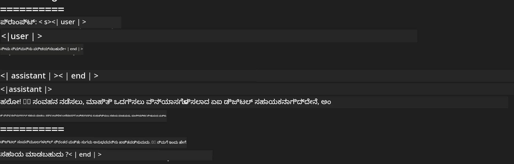

<!--
CO_OP_TRANSLATOR_METADATA:
{
  "original_hash": "dcb656f3d206fc4968e236deec5d4384",
  "translation_date": "2025-12-22T01:29:59+00:00",
  "source_file": "md/01.Introduction/03/MLX_Inference.md",
  "language_code": "kn"
}
-->
# **Apple MLX ಫ್ರೇಮ್‌ವರ್ಕ್‌ನೊಂದಿಗೆ Phi-3 ಇನ್‌ಫರೆನ್ಸ್**

## **MLX ಫ್ರೇಮ್‌ವರ್ಕ್ ಎಂದರೇನು**

MLXವು Apple machine learning research ಮೂಲಕ ಒದಗಿಸಲಾದ Apple ಸಿಲಿಕಾನ್‌ನಲ್ಲಿ ಯಂತ್ರ ಕಲಿಕೆ ಸಂಶೋಧನೆಗಾಗಿ ಬಳಸುವ ಒಂದು ಅರೆ ಫ್ರೇಮ್‌ವರ್ಕ್ ಆಗಿದೆ.

MLX ಅನ್ನು ಯಂತ್ರ ಕಲಿಕೆ ಸಂಶೋಧಕರು ಯಂತ್ರ ಕಲಿಕೆ ಸಂಶೋಧಕರಿಗಾಗಿ ವಿನ್ಯಾಸ ಮಾಡಿದ್ದಾರೆ. ಫ್ರೇಮ್‌ವರ್ಕ್ ಬಳಕೆದಾರ अनुकूलವಾಗಿರಲು ಉದ್ದೇಶಿಸಲಾಗಿದ್ದು, ಮోడಲ್‌ಗಳನ್ನು ತರಬೇತಿಗೆ ಹಾಗೂ ನಿಯೋಜನಗೆ ಪರಿಣಾಮಕಾರಿಯಾಗಿ ಕಾರ್ಯನಿರ್ವಹಿಸಲು ದಕ್ಷವಾಗುತ್ತದೆ. ಫ್ರೇಮ್‌ವರ್ಕ್‌ನ ವಿನ್ಯಾಸವೂ ತತ್ವಗತವಾಗಿ ಸರಳವಾಗಿದೆ. ಹೊಸ ఆಲೋಚನೆಗಳನ್ನು ತ್ವರಿತವಾಗಿ ಪರಿಶೀಲಿಸುವ ಉದ್ದೇಶದಿಂದ ಸಂಶೋಧಕರು MLX ಅನ್ನು ಸುಲಭವಾಗಿ ವಿಸ್ತರಿಸಿ ಸುಧಾರಿಸಲು ನಾವು ಉದ್ದೇಶಿಸುತ್ತೇವೆ.

MLX ಮೂಲಕ Apple ಸಿಲಿಕಾನ್ ಸಾಧನಗಳಲ್ಲಿ LLMs ಗಳನ್ನು ವೇಗಗೊಳಿಸಬಹುದು, ಮತ್ತು ಮಾದರಿಗಳನ್ನು ಸ್ಥಳೀಯವಾಗಿ ಸುಲಭವಾಗಿ ಚಲಾಯಿಸಬಹುದು.

## **MLX ಬಳಸಿ Phi-3-mini ನ ಇನ್‌ಫರೆನ್ಸ್**

### **1. ನಿಮ್ಮ MLX ಪರಿಸರವನ್ನು ಸೆಟ್ ಅಪ್ ಮಾಡಿ**

1. Python 3.11.x
2. MLX ಲೈಬ್ರರಿ ಇನ್‌ಸ್ಟಾಲ್ ಮಾಡಿ


```bash

pip install mlx-lm

```

### **2. MLX ಬಳಸಿ ಟರ್ಮಿನಲ್‌ನಲ್ಲಿ Phi-3-mini ಅನ್ನು ಚಾಲನೆ ಮಾಡುವುದು**


```bash

python -m mlx_lm.generate --model microsoft/Phi-3-mini-4k-instruct --max-token 2048 --prompt  "<|user|>\nCan you introduce yourself<|end|>\n<|assistant|>"

```

ಫಲಿತಾಂಶ (ನನ್ನ ಪರಿಸರ: Apple M1 Max,64GB) ಹೀಗಿದೆ



### **3. ಟರ್ಮಿನಲ್‌ನಲ್ಲಿ MLX ಬಳಸಿ Phi-3-mini ಅನ್ನು ಕ್ವಾಂಟೈಜ್ ಮಾಡುವುದು**


```bash

python -m mlx_lm.convert --hf-path microsoft/Phi-3-mini-4k-instruct

```

***ಗಮನಿಸಿ：*** ಮಾಡೆಲ್ ಅನ್ನು mlx_lm.convert ಮೂಲಕ ಕ್ವಾಂಟೈಜ್ ಮಾಡಬಹುದು, ಮತ್ತು ಡೀಫಾಲ್ಟ್ ಕ್ವಾಂಟೈಜೇಶನ್ INT4 ಆಗಿದೆ. ಈ ಉದಾಹರಣೆ Phi-3-mini ಅನ್ನು INT4 ಗೆ ಕ್ವಾಂಟೈಜ್ ಮಾಡುತ್ತದೆ

ಮಾಡೆಲ್ ಅನ್ನು mlx_lm.convert ಮೂಲಕ ಕ್ವಾಂಟೈಜ್ ಮಾಡಬಹುದು, ಮತ್ತು ಡೀಫಾಲ್ಟ್ ಕ್ವಾಂಟೈಜೇಶನ್ INT4 ಆಗಿದೆ. ಈ ಉದಾಹರಣೆಯು Phi-3-mini ಅನ್ನು INT4 ಆಗಿ ಕ್ವಾಂಟೈಜ್ ಮಾಡಲು ಉದ್ದೇಶಿಸಲಾಗಿದೆ. ಕ್ವಾಂಟೈಜೇಶನ್ ನಂತರ, ಅದು ಡೀಫಾಲ್ಟ್ ಡೈರೆಕ್ಟರಿ ./mlx_model ನಲ್ಲಿ ಸಂಗ್ರಹಿಸಲಾಗುತ್ತದೆ

ನಾವು ಟರ್ಮಿನಲ್‌ನಿಂದ MLX ಮೂಲಕ ಕ್ವಾಂಟೈಜ್ ಮಾಡಲಾದ ಮಾದರಿಯನ್ನು ಪರೀಕ್ಷಿಸಬಹುದು


```bash

python -m mlx_lm.generate --model ./mlx_model/ --max-token 2048 --prompt  "<|user|>\nCan you introduce yourself<|end|>\n<|assistant|>"

```

ಫಲಿತಾಂಶವು ಈಂತಿದೆ




### **4. Jupyter Notebook‌ನಲ್ಲಿ MLX ಬಳಸಿ Phi-3-mini ಅನ್ನು ಚಾಲನೆ ಮಾಡುವುದು**


***ಗಮನಿಸಿ:*** ದಯವಿಟ್ಟು ಈ ಮಾದರಿಯನ್ನು ಓದಿ [ಈ ಲಿಂಕ್ ಕ್ಲಿಕ್ ಮಾಡಿ](../../../code/03.Inference/MLX/MLX_DEMO.ipynb)


## **ಸಂಪನ್ಮೂಲಗಳು**

1. Apple MLX ಫ್ರೇಮ್‌ವರ್ಕ್ ಬಗ್ಗೆ ತಿಳಿದುಕೊಳ್ಳಿ [https://ml-explore.github.io](https://ml-explore.github.io/mlx/build/html/index.html)

2. Apple MLX GitHub ರೆಪೊಸಿಟರಿ [https://github.com/ml-explore](https://github.com/ml-explore)

---

<!-- CO-OP TRANSLATOR DISCLAIMER START -->
ಜವಾಬ್ದಾರಿಯ ನಿರಾಕರಣೆ:
ಈ ದಸ್ತಾವೇಜನ್ನು AI ಅನುವಾದ ಸೇವೆ Co-op Translator (https://github.com/Azure/co-op-translator) ಬಳಸಿ ಅನುವಾದಿಸಲಾಗಿದೆ. ನಾವು ನಿಖರತೆಗೆ ಪ್ರಯತ್ನಿಸಿದರೂ ಸಹ, ಸ್ವಯಂಚಾಲಿತ ಅನುವಾದಗಳಲ್ಲಿ ದೋಷಗಳು ಅಥವಾ ತಪ್ಪುಗಳಿರುವ ಸಾಧ್ಯತೆ ಇದೆ ಎಂಬುದನ್ನು ದಯವಿಟ್ಟು ಗಮನದಲ್ಲಿರಲಿ. ಮೂಲಭಾಷೆಯಲ್ಲಿ ಇರುವ ಅಸಲಿ ದಸ್ತಾವೇಜನ್ನು ಅಧಿಕೃತ ಮೂಲವೆಂದೇ ಪರಿಗಣಿಸಬೇಕು. ಅತ್ಯಂತ ಮಹತ್ವದ ಮಾಹಿತಿಗಾಗಿ ವೃತ್ತಿಪರ ಮಾನವ ಅನುವಾದವನ್ನು ಶಿಫಾರಸು ಮಾಡಲಾಗುತ್ತದೆ. ಈ ಅನುವಾದದ ಬಳಸುವುದರಿಂದ ಉಂಟಾಗುವ ಯಾವುದೇ ತಪ್ಪು ಅರ್ಥಗ erwart ಅಥವಾ ತಪ್ಪು ವ್ಯಾಖ್ಯಾನಗಳಿಗೆ ನಾವು ಜವಾಬ್ದಾರರಾಗುವುದಿಲ್ಲ.
<!-- CO-OP TRANSLATOR DISCLAIMER END -->