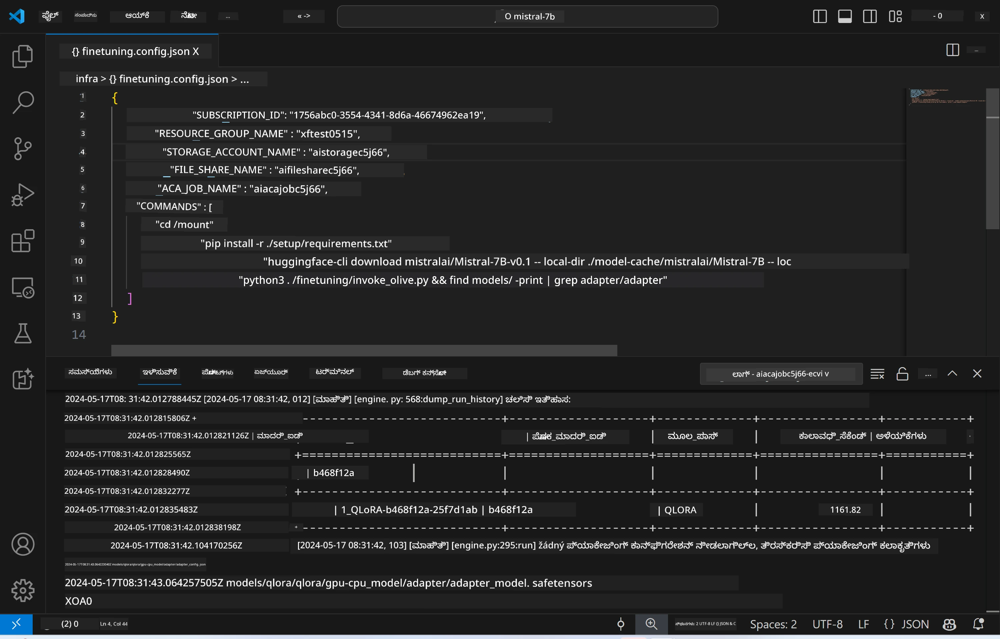
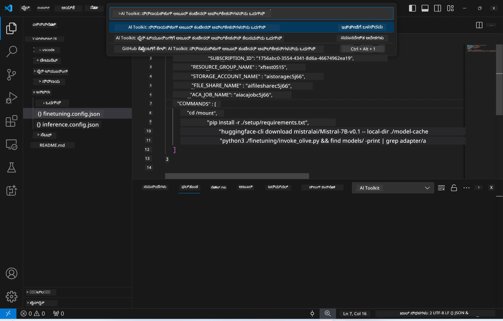
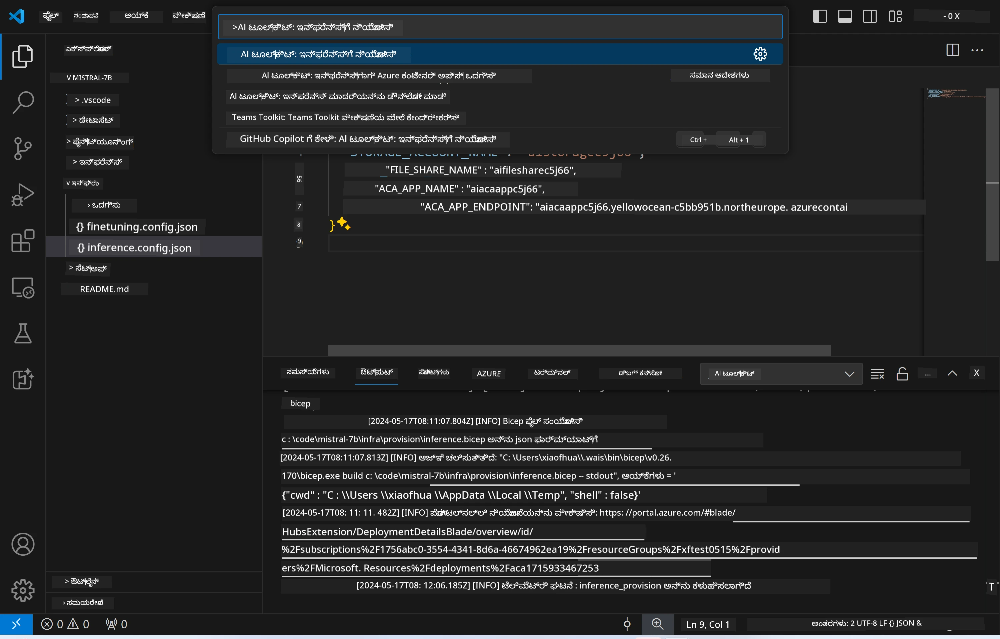
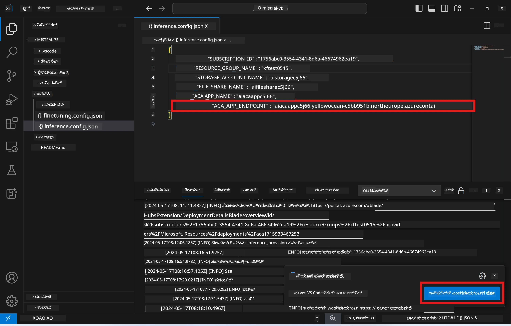

# ಫೈನ್-ಟ್ಯೂನ್ ಮಾಡಲಾದ ಮಾದರಿಯೊಂದಿಗೆ ರಿಮೋಟ್ ಇನ್ಫರೆನ್ಸಿಂಗ್

ರಿಮೋಟ್ ಪರಿಸರದಲ್ಲಿ ಅಡಾಪ್ಟರ್‌ಗಳು ಶಿಕ್ಷಿತರಾದ ನಂತರ, ಮಾದರಿಯೊಂದಿಗೆ ಸಂವಹನ ಮಾಡಲು ಒಂದು ಸರಳ Gradio ಅಪ್ಲಿಕೇಶನ್ ಅನ್ನು ಬಳಸಿ.



### Azure ಸಂಪನ್ಮೂಲಗಳನ್ನು ಪ್ರೊವಿಷನ್ ಮಾಡಿ
ನೀವು ಕಮಾಂಡ್ ಪ್ಯಾಲೆಟ್‌ನಿಂದ `AI Toolkit: Provision Azure Container Apps for inference` ಅನ್ನು ನಡೆಸುವ ಮೂಲಕ ರಿಮೋಟ್ ಇನ್ಫರೆನ್ಸಿಗಾಗಿ Azure ಸಂಪನ್ಮೂಲಗಳನ್ನು ಸಿದ್ಧಗೊಳಿಸಬೇಕು. ಈ ಸಿದ್ಧತಾ ಪ್ರಕ್ರಿಯೆಯಲ್ಲಿ, ನಿಮ್ಮ Azure Subscription ಮತ್ತು ಸಂಪನ್ಮೂಲ ಗುಂಪನ್ನು ಆಯ್ಕೆಮಾಡಲು ಕೇಳಲಾಗುತ್ತದೆ.  

   
ಡೀಫಾಲ್ಟ್‌ನಂತೆ, ಇನ್ಫರೆನ್ಸಿನಿಗಾಗಿ ಇರುವ ಸಬ್ಸ್‌ಕ್ರಿಪ್ಶನ್ ಮತ್ತು ಸಂಪನ್ಮೂಲ ಗುಂಪುಗಳು ಫೈನ್-ಟ್ಯೂನಿಂಗ್‌ಗೆ ಬಳಸಿದ వాటಿಗೆ ಹೊಂದಾಣಿಕೆಯಾಗಿರಬೇಕು. ಇನ್ಫರೆನ್ಸ್ ಅದೇ Azure Container App Environment ಅನ್ನು ಬಳಸಿ, ಫೈನ್-ಟ್ಯೂನಿಂಗ್ ಹಂತದಲ್ಲಿ ರಚಿಸಲಾದ ಮತ್ತು Azure Files ನಲ್ಲಿ ಸಂಗ್ರಹಿಸಲಾದ ಮಾದರಿಯನ್ನು ಮತ್ತು ಮಾದರಿ ಅಡಾಪ್ಟರ್‌ ಅನ್ನು ಪ್ರವೇಶಿಸುತ್ತದೆ. 

## AI Toolkit ಬಳಕೆ

### ಇನ್ಫರೆನ್ಸಿಗಾಗಿ ನಿಯೋಜನೆ  
ನೀವು ಇನ್ಫರೆನ್ಸ್ ಕೋಡ್ ಅನ್ನು ಪರಿಷ್ಕರಿಸಲು ಅಥವಾ ಇನ್ಫರೆನ್ಸ್ ಮಾದರಿಯನ್ನು ಮರುಲೋಡ್ ಮಾಡಲು ಬಯಸಿದರೆ, ದಯವಿಟ್ಟು `AI Toolkit: Deploy for inference` ಕಮಾಂಡ್ ಅನ್ನು ನಿರ್ವಹಿಸಿ. ಇದರಿಂದ ನಿಮ್ಮ ಇತ್ತೀಚಿನ ಕೋಡ್ ACA ಜೊತೆಗೆ ಸಮಕಾಲೀನಗೊಳ್ಳಲಿದೆ ಮತ್ತು ರೆಪ್ಲಿಕೆಯನ್ನು ಮರುಪ್ರಾರಂಭ ಮಾಡಲಾಗುತ್ತದೆ.  



ನಿಯೋಜನೆ ಯಶಸ್ವಿಯಾಗಿ ಪೂರ್ಣವಾದ ನಂತರ, ಮಾದರಿಗೆ ಈಗ ಈ ಎಂಡ್‌ಪಾಯಿಂಟ್ ಬಳಸಿ ಮೌಲ್ಯಮಾಪನ ಮಾಡಲು ಸಿದ್ಧವಾಗಿದೆ.

### ಇನ್ಫರೆನ್ಸ್ API ಗೆ ಪ್ರವೇಶ

VSCode ಸೂಚನೆಯಲ್ಲಿ ಪ್ರದರ್ಶಿತವಾದ "*ಇನ್ಫರೆನ್ಸ್ ಎಂಡ್‌ಪಾಯಿಂಟ್‌ಗೆ ಹೋಗಿ*" ಬಟನ್ ಕ್ಲಿಕ್ ಮಾಡುವ ಮೂಲಕ ನೀವು ಇನ್ಫರೆನ್ಸ್ APIಗೆ ಪ್ರವೇಶಿಸಬಹುದು. ಬದಲಿಗೆ, ವೆಬ್ API ಎಂಡ್‌ಪಾಯಿಂಟ್ ಅನ್ನು `ACA_APP_ENDPOINT` ನಲ್ಲಿ `./infra/inference.config.json` ಮತ್ತು ಔಟ್‌ಪುಟ್ ಪ್ಯಾನೆಲ್‌ನಲ್ಲಿ ಕಂಡುಹಿಡಿಯಬಹುದು.



> **ಗಮನಿಸಿ:** ಇನ್ಫರೆನ್ಸ್ ಎಂಡ್‌ಪಾಯಿಂಟ್ ಸಂಪೂರ್ಣವಾಗಿ ಕಾರ್ಯನಿರ್ವಹಿಸಲು ಕೆಲವು ನಿಮಿಷಗಳು ಬೇಕಾಗಬಹುದು.

## ಟೆಂಪ್ಲೇಟ್‌ನಲ್ಲಿ ಒಳಗೊಂಡಿರುವ ಇನ್ಫರೆನ್ಸ್ ಭಾಗಗಳು
 
| ಫೋಲ್ಡರ್ | ಒಳಗೊಂಡಿದೆ |
| ------ |--------- |
| `infra` | ರಿಮೋಟ್ ಕಾರ್ಯಾಚರಣೆಗಳಿಗೆ ಅಗತ್ಯವಿರುವ ಎಲ್ಲಾ ಸಂರಚನೆಗಳನ್ನು ಒಳಗೊಂಡಿದೆ. |
| `infra/provision/inference.parameters.json` | bicep ಟೆಂಪ್ಲೇಟ್‌ಗಳಿಗಾಗಿ ಪರಾಮೀಟರ್ಗಳನ್ನು ಹೊಂದಿರುತ್ತದೆ, ಇನ್ಫರೆನ್ಸ್‌ಗಾಗಿ Azure ಸಂಪನ್ಮೂಲಗಳನ್ನು ਪ੍ਰੋವಿಷನ್ ಮಾಡಲು ಬಳಸಲಾಗುತ್ತದೆ. |
| `infra/provision/inference.bicep` | ಇನ್ಫರೆನ್ಸ್‌ಗಾಗಿ Azure ಸಂಪನ್ಮೂಲಗಳನ್ನು ಪ್ರೊವಿಷನ್ ಮಾಡುವ ಟೆಂಪ್ಲೇಟ್ಗಳನ್ನು ಒಳಗೊಂಡಿದೆ. |
| `infra/inference.config.json` | ಕಾನ್ಫಿಗರೇಶನ್ ಫೈಲ್, ಇದು `AI Toolkit: Provision Azure Container Apps for inference` ಕಮಾಂಡ್ ಮೂಲಕ ರಚಿಸಲಾಗುತ್ತದೆ. ಇತರ ರಿಮೋಟ್ ಕಮಾಂಡ್ ಪ್ಯಾಲೆಟ್‌ಗಳಿಗೆ ಇನ್ಪುಟ್ ಆಗಿ ಇದನ್ನು ಬಳಸಲಾಗುತ್ತದೆ. |

### Azure ಸಂಪನ್ಮೂಲ ಪ್ರೊವಿಷನ್ ಕಾನ್ಫಿಗರೇಶನ್ ಮಾಡಲು AI Toolkit ಬಳಕೆ
Configure the [AI Toolkit](https://marketplace.visualstudio.com/items?itemName=ms-windows-ai-studio.windows-ai-studio)

Provision Azure Container Apps for inference` command.

ನೀವು ಕಾಂಫಿಗರೇಶನ್ ಪರಾಮೀಟರ್ಗಳನ್ನು `./infra/provision/inference.parameters.json` ಫೈಲ್‌ನಲ್ಲಿ ಕಂಡುಹಿಸಬಹುದು. ವಿವರಗಳು ಹೀಗೆಗಿವೆ:
| Parameter | Description |
| --------- |------------ |
| `defaultCommands` | ವೆಬ್ API ಪ್ರಾರಂಭಿಸಲು ಬಳಸುವ ಆಜ್ಞೆಗಳು. |
| `maximumInstanceCount` | GPU ಇನ್ಸ್ಟಾನ್ಸ್‌ಗಳ ಗರಿಷ್ಠ ಸಾಮರ್ಥ್ಯವನ್ನು ಈ ಪರಾಮೀಟರ್ ಸೆಟ್ ಮಾಡುತ್ತದೆ. |
| `location` | Azure ಸಂಪನ್ಮೂಲಗಳು ಪ್ರೊವಿಷನ್ ಆಗುವ ಸ್ಥಳ. ಡೀಫಾಲ್ಟ್ ಮೌಲ್ಯವು ಆಯ್ಕೆಮಾಡಲಾದ ಸಂಪನ್ಮೂಲ ಗುಂಪಿನ ಸ್ಥಳದೊಂದಿಗೆ ಒಂದೇ ಆಗಿರುತ್ತದೆ. |
| `storageAccountName`, `fileShareName` `acaEnvironmentName`, `acaEnvironmentStorageName`, `acaAppName`,  `acaLogAnalyticsName` | ಈ ಪರಾಮೀಟರ್ಗಳು ಪ್ರೊವಿಷನ್ ಮಾಡಲು Azure ಸಂಪನ್ಮೂಲಗಳಿಗೆ ಹೆಸರಿಡಲು ಬಳಸಲಾಗುತ್ತವೆ. ಡೀಫಾಲ್ಟ್‌ನಂತೆ, ಅವು ಫೈನ್-ಟ್ಯೂನಿಂಗ್ ಸಂಪನ್ಮೂಲದ ಹೆಸರಿನೊಂದಿಗೆ ಒಂದೇ ಇರುತ್ತವೆ. ನೀವು ಹೊಸ, ಉಪಯೋಗಿಸದಿರುವ ಸಂಪನ್ಮೂಲ ಹೆಸರನ್ನು ನಮೂದಿಸಿ ನಿಮ್ಮ ಸ್ವಂತ ಕಸ್ಟಮ್-ಹೆಸರಿನ ಸಂಪನ್ಮೂಲಗಳನ್ನು ರಚಿಸಬಹುದು, ಅಥವಾ ಈಗಾಗಲೇ ಇರುವ Azure ಸಂಪನ್ಮೂಲದ ಹೆಸರನ್ನು ಬಳಸಲು ಹೆಚ್ಚು ಇಚ್ಛಿಸಿದ್ದರೆ ಅದರ ಹೆಸರನ್ನು ನಮೂದಿಸಬಹುದು. ವಿವರಗಳಿಗಾಗಿ, [Using existing Azure Resources](../../../../../md/01.Introduction/03) ವಿಭಾಗವನ್ನು ನೋಡಿ. |

### ಇದ್ದಿರುವ Azure ಸಂಪನ್ಮೂಲಗಳನ್ನು ಬಳಸಿ

ಡೀಫಾಲ್ಟ್‌ನಂತೆ, ಇನ್ಫರೆನ್ಸ್ ಪ್ರೊವಿಷನ್ ಫೈನ್-ಟ್ಯೂನಿಂಗ್‌ಗೆ ಬಳಸಿದ್ದದೇ ಆದ Azure Container App Environment, Storage Account, Azure File Share, ಮತ್ತು Azure Log Analytics ಅನ್ನು ಬಳಸುತ್ತದೆ. ಇನ್ಫರೆನ್ಸ್ APIಗಾಗಿ ಪ್ರತ್ಯೇಕ Azure Container App ಒಂದನ್ನು ಮಾತ್ರ ರಚಿಸಲಾಗುತ್ತದೆ. 

ನೀವು ಫೈನ್-ಟ್ಯೂನಿಂಗ್ ಹಂತದಲ್ಲಿ Azure ಸಂಪನ್ಮೂಲಗಳನ್ನು ಕಸ್ಟಮೈಸ್ ಮಾಡಿದ್ದರೆ ಅಥವಾ ಇನ್ಫರೆನ್ಸ್‍ಗಾಗಿ ನಿಮ್ಮ ಸ್ವಂತ ಇದೇ ಇರುವ Azure ಸಂಪನ್ಮೂಲಗಳನ್ನು ಬಳಸಲು ಬಯಸಿದರೆ, ಅವುಗಳ ಹೆಸರನ್ನು `./infra/inference.parameters.json` ಫೈಲ್‌ನಲ್ಲಿ ದಾಖಲೆ ಮಾಡಿ. ನಂತರ, ಕಮಾಂಡ್ ಪ್ಯಾಲೆಟ್‌ನಿಂದ `AI Toolkit: Provision Azure Container Apps for inference` ಕಮಾಂಡ್ ಅನ್ನು ಚಲಾಯಿಸಿ. ಇದು ಸೂಚಿಸಲಾದ ಯಾವುದೇ ಸಂಪನ್ಮೂಲಗಳನ್ನು ನವೀಕರಿಸುತ್ತದೆ ಮತ್ತು ಕಾಣೆಯಾಗಿರುವುದನ್ನು ರಚಿಸುತ್ತದೆ.

ಉದಾಹರಣೆಗೆ, ನೀವು ಹಾಲಿ ಇರುವ Azure container ಪರಿಸರವನ್ನು ಹೊಂದಿದ್ದರೆ, ನಿಮ್ಮ `./infra/finetuning.parameters.json` ಹೀಗಿರಬೇಕು:

```json
{
    "$schema": "https://schema.management.azure.com/schemas/2019-04-01/deploymentParameters.json#",
    "contentVersion": "1.0.0.0",
    "parameters": {
      ...
      "acaEnvironmentName": {
        "value": "<your-aca-env-name>"
      },
      "acaEnvironmentStorageName": {
        "value": null
      },
      ...
    }
  }
```

### ಕೈಯಿಂದ ಪ್ರೊವಿಷನ್  
ನೀವು Azure ಸಂಪನ್ಮೂಲಗಳನ್ನು ಕೈಯಿಂದ ಕಾನ್ಫಿಗರ್ ಮಾಡಬೇಕು ಎಂದು ಇಚ್ಚಿಸಿದರೆ, `./infra/provision` ಫೋಲ್ಡರ್‌ಗಳಲ್ಲಿ ಒದಗಿಸಲಾಗಿರುವ bicep ಫೈಲ್‌ಗಳನ್ನು ಬಳಸಬಹುದು. ನೀವು AI Toolkit ಕಮಾಂಡ್ ಪ್ಯಾಲೆಟ್ ಬಳಿಸ್ತದೆ ಪ್ರತಿಭಟಿಸಿ ಎಲ್ಲಾ Azure ಸಂಪನ್ಮೂಲಗಳನ್ನು ಈಗಾಗಲೇ ಸೆಟ್ ಅಪ್ ಮಾಡಿ ಕಾನ್ಫಿಗರ್ ಮಾಡಿದ್ದರೆ, ನೀವು ಸರಳವಾಗಿ `inference.config.json` ಫೈಲ್‌ನಲ್ಲಿ ಸಂಪನ್ಮೂಲ ಹೆಸರನ್ನು ನಮೂದಿಸಬಹುದು.

ಉದಾಹರಣೆಗೆ:

```json
{
  "SUBSCRIPTION_ID": "<your-subscription-id>",
  "RESOURCE_GROUP_NAME": "<your-resource-group-name>",
  "STORAGE_ACCOUNT_NAME": "<your-storage-account-name>",
  "FILE_SHARE_NAME": "<your-file-share-name>",
  "ACA_APP_NAME": "<your-aca-name>",
  "ACA_APP_ENDPOINT": "<your-aca-endpoint>"
}
```

---

<!-- CO-OP TRANSLATOR DISCLAIMER START -->
ನಿರಾಕರಣೆ:
ಈ ದಸ್ತಾವೇಜನ್ನು AI ಅನುವಾದ ಸೇವೆ [Co-op Translator](https://github.com/Azure/co-op-translator) ಬಳಸಿ ಅನುವಾದಿಸಲಾಗಿದೆ. ನಾವು ಶುದ್ಧತೆಯ ಮೇಲೂ ಪ್ರಯತ್ನಿಸುತ್ತಿದ್ದರೂ, ಸ್ವಯಂಚಾಲಿತ ಅನುವಾದಗಳಲ್ಲಿ ತಪ್ಪುಗಳು ಅಥವಾ ಅಸೂಕ್ತತೆಗಳು ಇರಬಹುದು ಎಂಬುದನ್ನು ದಯವಿಟ್ಟು ಗಮನದಲ್ಲಿರಿಸಿ. ಮೂಲ ದಸ್ತಾವೇಜನ್ನು ಅದರ ಮೂಲ ಭಾಷೆಯಲ್ಲಿರುವ ಅಧಿಕೃತ ಮೂಲವೆಂದು ಪರಿಗಣಿಸಲು ವಿನಂತಿಸುತ್ತೇವೆ. ಮಹತ್ವದ ಮಾಹಿತಿಗಾಗಿ ವೃತ್ತಿಪರ ಮಾನವ ಅನುವಾದವನ್ನು ಶಿಫಾರಸು ಮಾಡಲಾಗುತ್ತದೆ. ಈ ಅನುವಾದವನ್ನು ಬಳಸುವುದರಿಂದ ಉಂಟಾಗುವ ಯಾವುದೇ ಗೊಂದಲಗಳು ಅಥವಾ ತಪ್ಪಾದ ವ್ಯಾಖ್ಯಾನಗಳಿಗಾಗಿ ನಾವು ಹೊಣೆಗಾರವಲ್ಲ.
<!-- CO-OP TRANSLATOR DISCLAIMER END -->