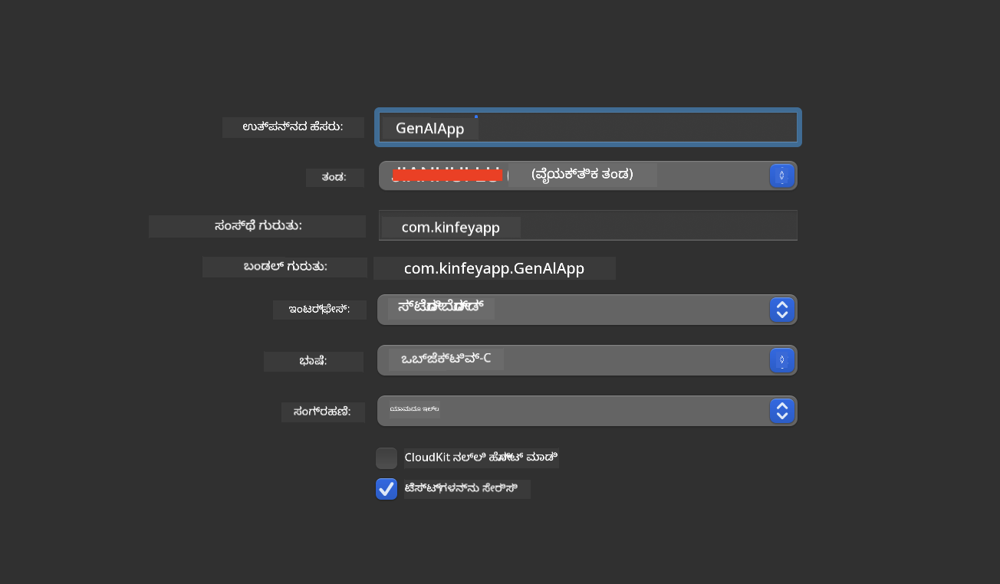
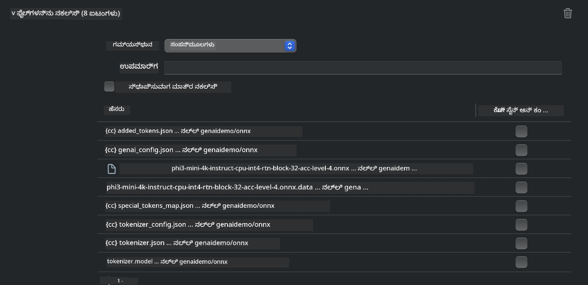

<!--
CO_OP_TRANSLATOR_METADATA:
{
  "original_hash": "82af197df38d25346a98f1f0e84d1698",
  "translation_date": "2025-12-22T00:36:48+00:00",
  "source_file": "md/01.Introduction/03/iOS_Inference.md",
  "language_code": "kn"
}
-->
# **iOS ನಲ್ಲಿ Phi-3 ಇನ್‌ಫರೆನ್ಸ್**

Phi-3-mini ಮೈಕ್ರೋಸಾಫ್ಟ್‌ನ ಹೊಸ ಮಾದರಿ ಸರಣಿ ಆಗಿದ್ದು, ಎಡ್ಜ್ ಸಾಧನಗಳ ಮತ್ತು IoT ಸಾಧನಗಳ ಮೇಲೆ ವಿಜ್ಞಾನೀಕೃತ ಭಾಷಾ ಮಾದರಿಗಳು (Large Language Models, LLMs) ಅನ್ನು ನಿಯೋಜಿಸಲು ಅನುಮತಿಸುತ್ತದೆ. Phi-3-mini iOS, Android ಮತ್ತು Edge Device ನಿಯೋಜನೆಗಳುಗಾಗಿ ಲಭ್ಯವಿದ್ದು, BYOD ಪರಿಸರಗಳಲ್ಲಿ ಜನರೆಟಿವ್ AI ಅನ್ನು ನಿಯೋಜಿಸುವುದಕ್ಕೆ ಅವಕಾಶ ನೀಡುತ್ತದೆ. ಕೆಳಗಿನ ಉದಾಹರಣೆಯೆ iOS ಮೇಲೆ Phi-3-mini ಅನ್ನು ಹೇಗೆ ನಿಯೋಜಿಸಬೇಕೆಂಬುದನ್ನು ತೋರಿಸುತ್ತದೆ.

## **1. ಸಿದ್ಧತೆ**

- **a.** macOS 14+
- **b.** Xcode 15+
- **c.** iOS SDK 17.x (iPhone 14 A16 ಅಥವಾ ಹೆಚ್ಚು)
- **d.** Python 3.10+ ಅನ್ನು ಇನ್‌ಸ್ಟಾಲ್ ಮಾಡಿ (Conda ಶಿಫಾರಸು ಮಾಡಲಾಗುತ್ತದೆ)
- **e.** Python ಗ್ರಂಥಾಲಯವನ್ನು ಇನ್‌ಸ್ಟಾಲ್ ಮಾಡಿ: `python-flatbuffers`
- **f.** CMake ಅನ್ನು ಸ್ಥಾಪಿಸಿ

### Semantic Kernel ಮತ್ತು ಇನ್‌ಫೆರನ್ಸ್

Semantic Kernel ಒಂದು ಅಪ್ಲಿಕೇಶನ್ ಫ್ರೇಂವರ್ಕ್ ಆಗಿದ್ದು, ಇದು ನೀವು Azure OpenAI Service, OpenAI ಮಾದರಿಗಳು ಮತ್ತು ಸ್ಥಳೀಯ ಮಾದರಿಗಳೊಂದಿಗೆ ಹೊಂದಾಣಿಕೆಯ ಅಪ್ಲಿಕೇಶನ್‌ಗಳನ್ನು ರಚಿಸಲು ಅನುಮತಿಸುತ್ತದೆ. Semantic Kernel ಮುಖಾಂತರ ಸ್ಥಳೀಯ ಸೇವೆಗಳಿಗೆ ಪ್ರವೇಶಿಸುವುದು ನಿಮ್ಮ ಸ್ವಯಂ-ಹೋಸ್ಟ್ ಮಾಡಿದ Phi-3-mini ಮಾದರಿ ಸರ್ವರ್‌ನೊಂದಿಗೆ ಸುಲಭ ಸಂಯೋಜನೆಯನ್ನು ಕಾರ್ಯಗತಗೊಳಿಸುತ್ತದೆ.

### Ollama ಅಥವಾ LlamaEdge ಮೂಲಕ ಕ್ವಾಂಟೈಜ್ಡ್ ಮಾದರಿಗಳನ್ನು ಕರೆ ಮಾಡುವುದು

ಹೆಚ್ಚು ಬಳಕೆದಾರರು ಸ್ಥಳೀಯವಾಗಿ ಮಾದರಿಗಳನ್ನು ಚಲಾಯಿಸಲು ಕ್ವಾಂಟೈಜ್ಡ್ ಮಾದರಿಗಳನ್ನು ಬಳಸುವುದನ್ನು ಪ್ರಾಧಾನ್ಯಮಾಡುತ್ತಾರೆ. [Ollama](https://ollama.com) ಮತ್ತು [LlamaEdge](https://llamaedge.com) ಬಳಕೆದಾರರಿಗೆ ವಿವಿಧ ಕ್ವಾಂಟೈಜ್ಡ್ ಮಾದರಿಗಳನ್ನು ಕರೆ ಮಾಡುವಂತೆ ಅವಕಾಶ ನೀಡುತ್ತವೆ:

#### **Ollama**

ನೀವು ನೇರವಾಗಿ `ollama run phi3` ಅನ್ನು ಚಲಾಯಿಸಬಹುದು ಅಥವಾ ಅದನ್ನು ಆಫ್‌ಲೈನ್‌ನಲ್ಲಿ ಸಂರಚಿಸಬಹುದು. ನಿಮ್ಮ `gguf` ಫೈಲಿನ ಮಾರ್ಗವನ್ನು ಹೊಂದಿರುವ Modelfile ಅನ್ನು ರಚಿಸಿ. Phi-3-mini ಕ್ವಾಂಟೈಜ್ಡ್ ಮಾದರಿಯನ್ನು ಚಾಲನೆ ಮಾಡುವ ಉದಾಹರಣಾ ಕೋಡ್:

```gguf
FROM {Add your gguf file path}
TEMPLATE \"\"\"<|user|> .Prompt<|end|> <|assistant|>\"\"\"
PARAMETER stop <|end|>
PARAMETER num_ctx 4096
```

#### **LlamaEdge**

ನೀವು `gguf` ಅನ್ನು ಕ್ಲೌಡ್ ಮತ್ತು ಎಡ್ಜ್ ಸಾಧನಗಳಲ್ಲಿ ಒಂದೇ ಸಮಯದಲ್ಲಿ ಬಳಸಲು ಬಯಸಿದರೆ, LlamaEdge ಉತ್ತಮ ಆಯ್ಕೆಯಾಗಿದೆ.

## **2. iOS ಗಾಗಿ ONNX Runtime ಸಂಯೋಜನೆ**

```bash

git clone https://github.com/microsoft/onnxruntime.git

cd onnxruntime

./build.sh --build_shared_lib --ios --skip_tests --parallel --build_dir ./build_ios --ios --apple_sysroot iphoneos --osx_arch arm64 --apple_deploy_target 17.5 --cmake_generator Xcode --config Release

cd ../

```

### **ಗಮನಿಸಿ**

- **a.** ಸಂಯೋಜಿಸುವ ಮೊದಲು, Xcode ಸರಿಯಾಗಿ ಸಂರಚಿಸಲ್ಪಟ್ಟಿರುವುದನ್ನು ಖಚಿತಪಡಿಸಿ ಮತ್ತು ಟರ್ಮಿನಲ್‌ನಲ್ಲಿ ಅದನ್ನು ಸಕ್ರಿಯ ಡೆವಲಪರ್ ಡೈರೆಕ್ಟರಿ ಆಗಿ ಸೆಟ್ ಮಾಡಿ:

    ```bash
    sudo xcode-select -switch /Applications/Xcode.app/Contents/Developer
    ```

- **b.** ONNX Runtime ಅನ್ನು ವಿಭಿನ್ನ ವೇದಿಕೆಗಳಿಗಾಗಿ ಸಂಯೋಜಿಸಬೇಕಾಗುತ್ತದೆ. iOS ಗಾಗಿ ನೀವು `arm64` ಅಥವಾ `x86_64`ಗಾಗಿ ಸಂಯೋಜಿಸಬಹುದು.

- **c.** ಸಂಯೋಜನೆಗಾಗಿ ಇತ್ತೀಚಿನ iOS SDK ಅನ್ನು ಬಳಸಲು ಶಿಫಾರಸು ಮಾಡಲಾಗುತ್ತದೆ. ಆದಾಗ್ಯೂ, ನೀವು ಹಿಂದಿನ SDK ಗಳೊಂದಿಗೆ ಹೊಂದಾಣಿಕೆ ಬೇಕಾದರೆ ಹಳೆಯ ಆವೃತ್ತಿಯನ್ನು ಸಹ ಬಳಸಬಹುದು.

## **3. ONNX Runtime ಜೊತೆಗೆ iOS ಗಾಗಿ ಜನರೆಟಿವ್ AI ಸಂಯೋಜನೆ**

> **ಗಮನಿಸಿ:** ONNX Runtime ಸಹಿತ ಜನರೆಟಿವ್ AI ಪ್ರಿವ್ಯೂದಲ್ಲಿದೆ, ಆದ್ದರಿಂದ ಸಾಧ್ಯವಾದ ಬದಲಾವಣೆಗಳ ಬಗ್ಗೆ ದಯವಿಟ್ಟು ಗಮನವಿಡಿ.

```bash

git clone https://github.com/microsoft/onnxruntime-genai
 
cd onnxruntime-genai
 
mkdir ort
 
cd ort
 
mkdir include
 
mkdir lib
 
cd ../
 
cp ../onnxruntime/include/onnxruntime/core/session/onnxruntime_c_api.h ort/include
 
cp ../onnxruntime/build_ios/Release/Release-iphoneos/libonnxruntime*.dylib* ort/lib
 
export OPENCV_SKIP_XCODEBUILD_FORCE_TRYCOMPILE_DEBUG=1
 
python3 build.py --parallel --build_dir ./build_ios --ios --ios_sysroot iphoneos --ios_arch arm64 --ios_deployment_target 17.5 --cmake_generator Xcode --cmake_extra_defines CMAKE_XCODE_ATTRIBUTE_CODE_SIGNING_ALLOWED=NO

```

## **4. Xcode ನಲ್ಲಿ App ಅಪ್ಲಿಕೇಶನ್ ರಚನೆ**

ನಾನು ಅಪ್ಲಿಕೇಶನ್ ಅಭಿವೃದ್ಧಿಯ әдіಗಾಗಿಯೇ Objective-C ಅನ್ನು ಆಯ್ಕೆಮಾಡಿದೆ, ಏಕೆಂದರೆ ONNX Runtime C++ API ನೊಂದಿಗೆ ಜನರೆಟಿವ್ AI ಅನ್ನು ಬಳಸುವಾಗ Objective-C ಉತ್ತಮ ಹೊಂದಾಣಿಕೆಯನ್ನು ನೀಡುತ್ತದೆ. ಖಚಿತವಾಗಿ, ನೀವು Swift ಬ್ರಿಡ್ಜಿಂಗ್ ಮೂಲಕ ಸಂಬಂಧಿತ ಕರೆಗಳನ್ನು ಸಹ ಪೂರ್ಣಗೊಳಿಸಬಹುದು.



## **5. ONNX ಕ್ವಾಂಟೈಜ್ಡ್ INT4 ಮಾದರಿಯನ್ನು App ಅಪ್ಲಿಕೇಶನ್ ಪ್ರಾಜೆಕ್ಟ್‌ಗೆ ಕಾಪಿ ಮಾಡುವದು**

ನಾವು ONNX ಫಾರ್ಮ್ಯಾಟ್‌ನ INT4 ಕ್ವಾಂಟೈಜೆಶನ್ ಮಾದರಿಯನ್ನು ಆಮದು ಮಾಡಬೇಕಾಗುತ್ತದೆ, ಅದನ್ನು ಮೊದಲು ಡೌನ್‌ಲೋಡ್ ಮಾಡಬೇಕು


ಡೌನ್‌ಲೋಡ್ ಮಾಡಿದ ನಂತರ, ಅದನ್ನು Xcode ಪ್ರಾಜೆಕ್ಟಿನ Resources ಡೈರೆಕ್ಟರಿಯಲ್ಲಿ ಸೇರಿಸಬೇಕು.



## **6. ViewControllers ನಲ್ಲಿ C++ API ಸೇರಿಸುವುದು**

> **ಗಮನಿಸಿ:**

- **a.** ಸಂಬಂಧಿತ C++ ಹೆಡರ್ ಫೈಲ್‌ಗಳನ್ನು ಪ್ರಾಜೆಕ್ಟ್‌ಗೆ ಸೇರಿಸಿ.

  

- **b.** `onnxruntime-genai` ಡೈನಾಮಿಕ್ ಲೈಬ್ರೆರಿಯನ್ನು Xcode ನಲ್ಲಿ ಸೇರಿಸಿ.

  

- **c.** ಪರೀಕ್ಷೆಗಾಗಿ C Samples ಕೋಡ್ ಅನ್ನು ಬಳಸಿ. ಹೆಚ್ಚಿನ ಕಾರ್ಯಕ್ಷಮತೆಗಾಗಿ ChatUI ಮುಂತಾದ ಹೆಚ್ಚುವರಿ ವೈಶಿಷ್ಟ್ಯಗಳನ್ನು ಕೂಡ ಸೇರಿಸಬಹುದು.

- **d.** ನಿಮ್ಮ ಪ್ರಾಜೆಕ್ಟ್‌ನಲ್ಲಿ C++ ಬಳಸಬೇಕಾಗಿದ್ದರೆ, Objective-C++ ಬೆಂಬಲಿಸಲು `ViewController.m` ಅನ್ನು `ViewController.mm` ಎಂದು ಮರುನಾಮಕರಣ ಮಾಡಿ.

```objc

    NSString *llmPath = [[NSBundle mainBundle] resourcePath];
    char const *modelPath = llmPath.cString;

    auto model =  OgaModel::Create(modelPath);

    auto tokenizer = OgaTokenizer::Create(*model);

    const char* prompt = "<|system|>You are a helpful AI assistant.<|end|><|user|>Can you introduce yourself?<|end|><|assistant|>";

    auto sequences = OgaSequences::Create();
    tokenizer->Encode(prompt, *sequences);

    auto params = OgaGeneratorParams::Create(*model);
    params->SetSearchOption("max_length", 100);
    params->SetInputSequences(*sequences);

    auto output_sequences = model->Generate(*params);
    const auto output_sequence_length = output_sequences->SequenceCount(0);
    const auto* output_sequence_data = output_sequences->SequenceData(0);
    auto out_string = tokenizer->Decode(output_sequence_data, output_sequence_length);
    
    auto tmp = out_string;

```

## **7. ಅಪ್ಲಿಕೇಶನ್ ಚಾಲನೆ**

ಸೆಟ್‌ಅಪ್ ಪೂರ್ಣವಾದ ನಂತರ, Phi-3-mini ಮಾದರಿ ಇನ್‌ಫೆರನ್ಸ್ ಫಲಿತಾಂಶಗಳನ್ನು ನೋಡಲು ಅಪ್ಲಿಕೇಶನ್ ಅನ್ನು ಚಾಲನೆ ಮಾಡಬಹುದು.


ಹೆಚ್ಚಿನ ಉದಾಹರಣಾ ಕೋಡ್ ಮತ್ತು ವಿವರವಾದ ಸೂಚನೆಗಳಿಗಾಗಿ, [Phi-3 Mini Samples ರೆಪೊಸಿಟರಿ](https://github.com/Azure-Samples/Phi-3MiniSamples/tree/main/ios) ಅನ್ನು ಭೇಟಿ ಮಾಡಿ.

---

<!-- CO-OP TRANSLATOR DISCLAIMER START -->
ನಿರಾಕರಣೆ:
ಈ ದಸ್ತಾವೇಜನ್ನು AI ಅನುವಾದ ಸೇವೆ Co-op Translator (https://github.com/Azure/co-op-translator) ಬಳಸಿ ಅನುವಾದಿಸಲಾಗಿದೆ. ನಾವು ಅನುವಾದದ ನಿಖರತೆಗೆ ಯತ್ನಿಸಿದರೂ, ಸ್ವಯಂಚಾಲಿತ ಅನುವಾದಗಳಲ್ಲಿ ತಪ್ಪುಗಳು ಅಥವಾ ಅಸತ್ಯತೆಗಳು ಇರಬಹುದೆಂದು ದಯವಿಟ್ಟು ಗಮನಿಸಿ. ಮೂಲ ದಸ್ತಾವೇಜನ್ನು ಅದರ ಮೂಲ ಭಾಷೆಯಲ್ಲಿಯೇ ಪ್ರಾಧಿಕಾರಮೂಲವೆಂದು ಪರಿಗಣಿಸಬೇಕು. ಅತ್ಯಂತ ಮಹತ್ವದ ಮಾಹಿತಿಗಾಗಿ ವೃತ್ತಿಪರ ಮಾನವ ಅನುವಾದವನ್ನು ಶಿಫಾರಸು ಮಾಡಲಾಗುತ್ತದೆ. ಈ ಅನುವಾದದ ಬಳಕೆಯಿಂದ ಉಂಟಾಗುವ ಯಾವುದೇ ಭ್ರಮೆ, ತಪ್ಪು ಗ್ರಹಿಕೆ ಅಥವಾ ತಪ್ಪಾದ ವ್ಯಾಖ್ಯಾನದ ಹೊಣೆಗಾರಿಕೆ ನಾವು ಸ್ವೀಕರಿಸುವುದಿಲ್ಲ.
<!-- CO-OP TRANSLATOR DISCLAIMER END -->