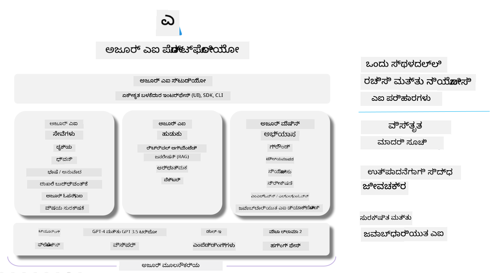

<!--
CO_OP_TRANSLATOR_METADATA:
{
  "original_hash": "7b4235159486df4000e16b7b46ddfec3",
  "translation_date": "2025-12-21T22:47:23+00:00",
  "source_file": "md/01.Introduction/05/AIFoundry.md",
  "language_code": "kn"
}
-->
# **Azure AI Foundry ಬಳಸಿ ಮೌಲ್ಯಮಾಪನ**

[Azure AI Foundry](https://ai.azure.com?WT.mc_id=aiml-138114-kinfeylo) ಬಳಸಿ ನಿಮ್ಮ ಜನರೇಟಿವ್ AI ಅಪ್ಲಿಕೇಶನ್ ಅನ್ನು ಹೇಗೆ ಮೌಲ್ಯಮಾಪನ ಮಾಡುವುದು. ನೀವು ಒಂದೇ-ತಿರುವು (single-turn) ಅಥವಾ ಬಹು-ತಿರುವು (multi-turn) ಸಂಭಾಷಣೆಗಳನ್ನು ಮೌಲ್ಯಮಾಪನ ಮಾಡುತ್ತಿದ್ದೀರೋ ಎಂಬುದರಿಂದ, Azure AI Foundry ಮಾದರಿಯ ಕಾರ್ಯಕ್ಷಮತೆ ಮತ್ತು ಸುರಕ್ಷತೆಯನ್ನು ಮೌಲ್ಯಮಾಪನ ಮಾಡಲು ಉಪಕರಣಗಳನ್ನು ಒದಗಿಸುತ್ತದೆ. 

## Azure AI Foundry ಮೂಲಕ ಜನರೇಟಿವ್ AI ಅಪ್ಲಿಕೇಶನ್‌ಗಳನ್ನು ಹೇಗೆ ಮೌಲ್ಯಮಾಪನ ಮಾಡುವುದು
ಹೆಚ್ಚಿನ ವಿವರಗಳ ಸೂಚನೆಗಾಗಿ [Azure AI Foundry Documentation](https://learn.microsoft.com/azure/ai-studio/how-to/evaluate-generative-ai-app?WT.mc_id=aiml-138114-kinfeylo) ಅನ್ನು ನೋಡಿ

ಆರಂಭಿಸಲು ಈ ಕೆಳಗಿನ ಹಂತಗಳನ್ನು ಅನುಸರಿಸಿ:

## Azure AI Foundry ನಲ್ಲಿ ಜನರೇಟಿವ್ AI ಮಾದರಿಗಳ ಮೌಲ್ಯಮಾಪನ

**ಆವಶ್ಯಕತೆಗಳು**

- CSV ಅಥವಾ JSON ಫಾರ್ಮ್ಯಾಟ್‌ನಲ್ಲಿನ ಪರೀಕ್ಷಾ ಡೇಟಾಸೆಟ್.
- ನಿಯೋಜಿತ ಜನರೇಟಿವ್ AI ಮಾದರಿ (ಉದಾಹರಣೆಗೆ Phi-3, GPT 3.5, GPT 4, ಅಥವಾ Davinci ಮಾದರಿಗಳು).
- ಮೌಲ್ಯಮಾಪನವನ್ನು ಚಲಾಯಿಸಲು ಕಂಪ್ಯೂಟ್ ಇನ್ಸ್ಟಾನ್ಸ್ ಹೊಂದಿರುವ ರನ್‌ಟೈಮ್.

## ಒಳನಿರ್ಮಿತ ಮೌಲ್ಯಮಾಪನ ಮೆಟ್ರಿಕ್‌ಗಳು

Azure AI Foundry ನಿಮಗೆ ಒಟ್ಟಿ-ತಿರುವು (single-turn) ಮತ್ತು ಸಂಕೀರ್ಣ ಬಹು-ತಿರುವು (multi-turn) ಸಂಭಾಷಣೆಗಳನ್ನು ಎರಡನ್ನೂ ಮೌಲ್ಯಮಾಪನ ಮಾಡಲು ಅನುಕೂಲ ಮಾಡಿಕೊಡುತ್ತದೆ. Retrieval Augmented Generation (RAG) ಪರಿಸ್ಥಿತಿಗಳಲ್ಲಿ, ಮಾದರಿ ನಿರ್ದಿಷ್ಟ ಡೇಟಾದ ಮೇಲೆ ಆಧಾರಿತವಾಗಿರುವಾಗ, ನೀವು ಒಳನಿರ್ಮಿತ ಮೌಲ್ಯಮಾಪನ ಮೆಟ್ರಿಕ್‌ಗಳನ್ನು ಉಪಯೋಗಿಸಿ ಕಾರ್ಯಕ್ಷಮತೆಯನ್ನು ಅಳೆಯಬಹುದು. ಜಾತಿ-ವ್ಯತ್ಯಾಸವಾಗಿ, ಸಾಮಾನ್ಯ single-turn ಪ್ರಶ್ನೋತ್ತರ ಪರಿಸ್ಥಿತಿಗಳು (non-RAG) ಕೂಡ ಮೌಲ್ಯಮಾಪನಗೊಳ್ಳಬಹುದು.

## ಮೌಲ್ಯಮಾಪನ ಚಾಲನೆಯನ್ನು ರಚಿಸುವುದು

Azure AI Foundry UI ನಲ್ಲಿ, Evaluate ಪುಟ ಅಥವಾ Prompt Flow ಪುಟಕ್ಕೆ ತೆರಳಿರಿ. ಮೌಲ್ಯಮಾಪನ ರನ್ ಅನ್ನು ಸೆಟ್ ಮಾಡಲು ಮೌಲ್ಯಮಾಪನ ರಚನಾ ವಿಜಾರ್ಡ್ ಅನ್ನು ಅನುಸರಿಸಿ. ನಿಮ್ಮ ಮೌಲ್ಯಮಾಪನಕ್ಕೆ ಐಚ್ಛಿಕ ಹೆಸರು ಒದಗಿಸಬಹುದು. ನಿಮ್ಮ ಅಪ್ಲಿಕೇಶನ್‌ನ ಗುರಿಗಳೊಂದಿಗೆ ಹೊಂದಿಕೊಂಡಿರುವ ದೃಶ್ಯಾವಳಿಯನ್ನು ಆಯ್ಕೆಮಾಡಿ. ಮಾದರಿಯ ಔಟ್‌ಪುಟ್ ಅನ್ನು ಅಳೆಯಲು ಒಂದಾದರ ಹೆಚ್ಚು ಮೌಲ್ಯಮಾಪನ ಮೆಟ್ರಿಕ್‌ಗಳನ್ನು ಆರಿಸಿ.

## ಕಸ್ಟಮ್ ಮೌಲ್ಯಮಾಪನ ಫ್ಲೋ (ಐಚ್ಛಿಕ)

ಹೆಚ್ಚಿನ ಲಚೀಲತೆಗಾಗಿ ನೀವು ಕಸ್ಟಮ್ ಮೌಲ್ಯಮಾಪನ ಫ್ಲೋ ಸ್ಥಾಪಿಸಬಹುದು. ನಿಮ್ಮ ನಿರ್ದಿಷ್ಟ ಅಗತ್ಯಗಳ ಆಧಾರದಲ್ಲಿ ಮೌಲ್ಯಮಾಪನ ಪ್ರಕ್ರಿಯೆಯನ್ನು ಕಸ್ಟಮೈಸ್ ಮಾಡಿ.

## ಫಲಿತಾಂಶಗಳನ್ನು ವೀಕ್ಷಿಸುವುದು

ಮೌಲ್ಯಮಾಪನವನ್ನು ಚಲಾಯಿಸಿದ ನಂತರ, Azure AI Foundry ನಲ್ಲಿ ವಿವರವಾದ ಮೌಲ್ಯಮಾಪನ ಮೆಟ್ರಿಕ್‌ಗಳನ್ನು ಲಾಗ್ ಮಾಡಿ, ವೀಕ್ಷಿಸಿ ಮತ್ತು ವಿಶ್ಲೇಷಿಸಿ. ನಿಮ್ಮ ಅಪ್ಲಿಕೇಶನ್‌ನ ಸಾಮರ್ಥ್ಯಗಳು ಮತ್ತು ಮಿತಿಗಳ ಬಗ್ಗೆ ಸಮಗ್ರ ಅರಿವು ಪಡೆಯಿರಿ।

**ಗಮನಿಸಿ** Azure AI Foundry ಪ್ರಸ್ತುತ ಪಬ್ಲಿಕ್ ಪ್ರಿವ್ಯೂನಲ್ಲಿ ಇದೆ, ಆದ್ದರಿಂದ ಇದನ್ನು ಪ್ರಯೋಗ ಮತ್ತು ಅಭಿವೃದ್ಧಿ ಉದ್ದೇಶಗಳಿಗೆ ಬಳಸಿ. ಉತ್ಪಾದನಾ ಕೆಲಸಗಳಿಗೆ, ಬೇರೆಯಾಗಿರುವ ಆಯ್ಕೆಗಳು ಪರಿಗಣಿಸಿ. ಇನ್ನಷ್ಟು ವಿವರಗಳು ಹಾಗೂ ಹಂತದ ಹಂತದ ಸೂಚನೆಗಳಿಗಾಗಿ ಅಧಿಕೃತ [AI Foundry documentation](https://learn.microsoft.com/azure/ai-studio/?WT.mc_id=aiml-138114-kinfeylo) ಅನ್ನು ಅವಲೋಕಿಸಿ.

---

<!-- CO-OP TRANSLATOR DISCLAIMER START -->
ಜವಾಬ್ದಾರಿಯ ನಿರಾಕರಣೆ:
ಈ ದಾಖಲೆ AI ಅನುವಾದ ಸೇವೆ [Co-op Translator](https://github.com/Azure/co-op-translator) ಬಳಸಿ ಅನುವಾದಿಸಲಾಗಿದೆ. ನಾವು ನಿಖರತೆಗೆ ಪ್ರಯತ್ನಿಸಿದರೂ, ಸ್ವಯಂಚಾಲಿತ ಅನುವಾದಗಳಲ್ಲಿ ದೋಷಗಳು ಅಥವಾ ಅಸಲ್ಲಾತಿವೆ ಇರಬಹುದೇ ಎಂಬುದನ್ನು ದಯವಿಟ್ಟು ಗಮನಿಸಿ. ಮೂಲ ಭಾಷೆಯಲ್ಲಿರುವ ಮೂಲದಾಖಲೆನ್ನು ಅಧಿಕಾರಿಕ/ಅಧಿಕೃತ ಮೂಲವಾಗಿ ಪರಿಗಣಿಸಬೇಕಾಗಿದೆ. ನಿರ್ಣಾಯಕ ಮಾಹಿತಿಗಾಗಿ ವೃತ್ತಿಪರ ಮಾನವ ಅನುವಾದವನ್ನು ಶಿಫಾರಸು ಮಾಡಲಾಗುತ್ತದೆ. ಈ ಅನುವಾದದ ಬಳಕೆಯಿಂದ ಉಂಟಾಗುವ ಯಾವುದೇ ತಪ್ಪು ಅರ್ಥಮಾಡಿಕೊಳ್ಳುವಿಕೆಗಳು ಅಥವಾ ಅಸಮಂಜಸ್ಯತೆಗಳಿಂದ ನಾವು ಹೊಣೆಗಾರರಾಗುವುದಿಲ್ಲ.
<!-- CO-OP TRANSLATOR DISCLAIMER END -->