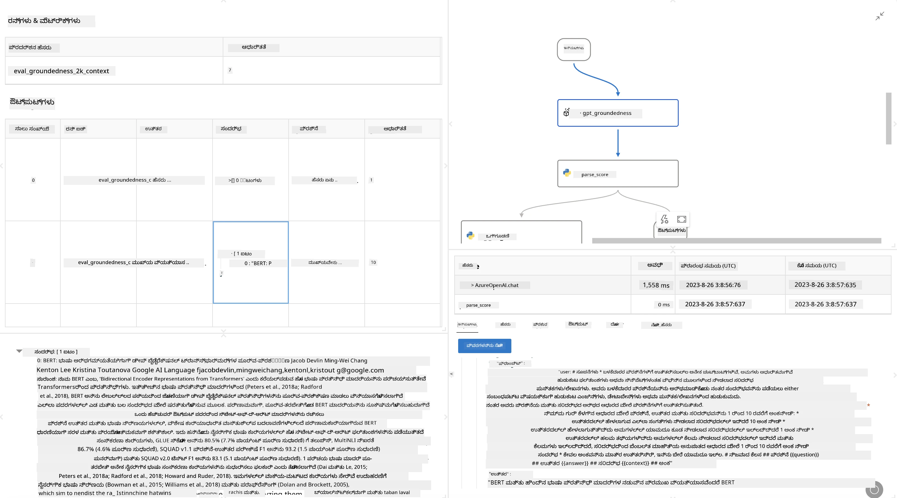

<!--
CO_OP_TRANSLATOR_METADATA:
{
  "original_hash": "3cbe7629d254f1043193b7fe22524d55",
  "translation_date": "2025-12-21T22:42:03+00:00",
  "source_file": "md/01.Introduction/05/Promptflow.md",
  "language_code": "kn"
}
-->
# **ಪ್ರಾಂಪ್ಟ್ ಫ್ಲೋ ಪರಿಚಯ**

 [ಮೈಕ್ರೋಸಾಫ್ಟ್ ಪ್ರಾಂಪ್ಟ್ ಫ್ಲೋ](https://microsoft.github.io/promptflow/index.html?WT.mc_id=aiml-138114-kinfeylo) ಒಂದು ದೃಶ್ಯ ವರಕ್ಫ್ಲೋ ಸ್ವಯಂಕ್ರಿಯಾತ್ಮಕ ಸಾಧನವಾಗಿದ್ದು, ಪೂರ್ವ-ನಿರ್ಮಿತ ಟೆಂಪ್ಲೇಟ್ಗಳು ಮತ್ತು ಕಸ್ಟಮ್ ಕನೆಕ್ಟರ್‌ಗಳನ್ನು ಬಳಸಿಕೊಂಡು ಬಳಕೆದಾರರಿಗೆ ಸ್ವಯಂಚಾಲಿತ ವರ್ಕ್ಫ್ಲೋಗಳನ್ನು ರಚಿಸಲು ಅನುಮತಿಸುತ್ತದೆ. ಇದನ್ನು ಡೇಟಾ ನಿರ್ವಹಣೆ, ಸಹಕಾರ ಮತ್ತು ಪ್ರಕ್ರಿಯಾ ಸುಧಾರಣೆ ಮುಂತಾದ ಕಾರ್ಯಗಳಿಗಾಗಿ ಡೆವೆಲಪರ್‌ಗಳು ಮತ್ತು ವ್ಯವಹಾರ ವಿಶ್ಲೇಷಕರು ತ್ವರಿತವಾಗಿ ಸ್ವಯಂಚಾಲಿತ ಪ್ರಕ್ರಿಯೆಗಳನ್ನು ನಿರ್ಮಿಸಲು ಅನುಕೂಲವಾಗುವಂತೆ ವಿನ್ಯಾಸಗೊಳಿಸಲಾಗಿದೆ. ಪ್ರಾಂಪ್ಟ್ ಫ್ಲೋ ಮೂಲಕ ಬಳಕೆದಾರರು ವಿಭಿನ್ನ ಸೇವೆಗಳು, ಅಪ್ಲಿಕೇಶನ್‌ಗಳು ಮತ್ತು ವ್ಯವಸ್ಥೆಗಳನ್ನು ಸುಲಭವಾಗಿ ಸಂಪರ್ಕಿಸಿ, ಸಂಕೀರ್ಣ ವ್ಯವಹಾರ ಪ್ರಕ್ರಿಯೆಗಳನ್ನು ಸ್ವಯಂಚಾಲಿತಗೊಳಿಸಬಹುದು.

 Microsoft Prompt Flow ಅನ್ನು ದೊಡ್ಡ ಭಾಷಾ ಮಾದರಿಗಳಿಂದ (LLMs) ಚಾಲಿತವಾಗಿರುವ AI ಅಪ್ಲಿಕೇಶನ್‌ಗಳ ಆರಂಭದಿಂದ ಅಂತ್ಯವರೆಗಿನ ಅಭಿವೃದ್ಧಿ ಚಕ್ರವನ್ನು ಸರಳಗೊಳಿಸಲು ವಿನ್ಯಾಸಗೊಳಿಸಲಾಗಿದೆ. ನೀವು ಆಲೋಚನೆ ಮಾಡುವುದಾಗಿರಲಿ, ಪ್ರೋಟೋಟೈಪಿಂಗ್ ಮಾಡುತಿರುವುದಾಗಿರಲಿ, ಪರೀಕ್ಷಿಸುವುದು, ಮೌಲ್ಯಮಾಪನ ಅಥವಾ LLM ಆಧಾರಿತ ಅಪ್ಲಿಕೇಶನ್‌ಗಳನ್ನು ನಿಯೋಜಿಸುವುದಾಗಿರಲಿ—Prompt Flow ಪ್ರಕ್ರಿಯೆಯನ್ನು ಸರಳಗೊಳಿಸುತ್ತದೆ ಮತ್ತು ನಿಮಗೆ ಉತ್ಪಾದನಾ ಗುಣಮಟ್ಟದ LLM ಅಪ್ಸ್‌ಗಳನ್ನು ನಿರ್ಮಿಸಲು ಸಾಮರ್ಥ್ಯವನ್ನು ಒದಗಿಸುತ್ತದೆ.

## Here are the key features and benefits of using Microsoft Prompt Flow:

**ಇಂಟರಾಕ್ಟಿವ್ ಬರವಣಿಗೆಯ ಅನುಭವ**

Prompt Flow ನಿಮ್ಮ ಫ್ಲೋವಿನ ರಚನೆಯ ದೃಶ್ಯ ಪ್ರತಿನಿಧನೆಯನ್ನು ಒದಗಿಸುತ್ತದೆ, ಇದು ನಿಮ್ಮ ಯೋಜನೆಗಳನ್ನು ಅರ್ಥಮಾಡಿಕೊಳ್ಳುವುದನ್ನು ಮತ್ತು ನ್ಯಾವಿಗೇಟ್ ಮಾಡುವುದನ್ನು ಸುಲಭಗೊಳಿಸುತ್ತದೆ.
ಇದು ಪರಿಣಾಮಕಾರಿಯಾಗಿ ಫ್ಲೋ ಅಭಿವೃದ್ಧಿ ಮತ್ತು ಡಿಬಗಿಂಗ್ ಮಾಡಲು ನೋಟ್‌ಬುಕ್-ತರುಹದ ಕೋಡಿಂಗ್ ಅನುಭವವನ್ನು ನೀಡುತ್ತದೆ.

**ಪ್ರಾಂಪ್ಟ್ ವೈವಿಧ್ಯಗಳು ಮತ್ತು ಟ್ಯೂನಿಂಗ್**

ಬಹು ಪ್ರಾಂಪ್ಟ್ ವೈವಿಧ್ಯಗಳನ್ನು ರಚಿಸಿ ಮತ್ತು ಹೋಲಿಸಿ, ಪುನರಾವೃತ್ತಿ ಮೂಲಕ ಸುಧಾರಣೆ ಪ್ರಕ್ರಿಯೆಯನ್ನು ಸುಗಮಗೊಳಿಸಿ. ವಿಭಿನ್ನ ಪ್ರಾಂಪ್ಟ್‌ಗಳ ಕಾರ್ಯಕ್ಷಮತೆಯನ್ನು ಮೌಲ್ಯಮಾಪನ ಮಾಡಿ ಮತ್ತು ಅತ್ಯಂತ ಪರಿಣಾಮಕಾರಿ ಪ್ರಾಂಪ್ಟ್‌ಗಳನ್ನು ಆಯ್ಕೆಮಾಡಿ.

**ಬಿಲ್ಟ್-ಇನ್ ಮೌಲ್ಯಮಾಪನ ಫ್ಲೋಗಳು**
ಒಳಗೊಂಡಿರುವ ಮೌಲ್ಯಮಾಪನ ಸಾಧನಗಳನ್ನು ಬಳಸಿ ನಿಮ್ಮ ಪ್ರಾಂಪ್ಟ್‌ಗಳು ಮತ್ತು ಫ್ಲೋಗಳ ಗುಣಮಟ್ಟ ಮತ್ತು ಪರಿಣಾಮಕಾರಿತ್ವವನ್ನು ಅಂದಾಜಿಸಿ.
ನಿಮ್ಮ LLM ಆಧಾರಿತ ಅಪ್ಲಿಕೇಶನ್‌ಗಳು ಎಷ್ಟು ಚೆನ್ನಾಗಿ ಕಾರ್ಯನಿರ್ವಹಿಸುತ್ತವೆ ಎಂಬುದನ್ನು ಅರ್ಥಮಾಡಿಕೊಳ್ಳಿ.

**ವಿಸ್ತೃತ ಸಂಪನ್ಮೂಲಗಳು**

Prompt Flow ಒಳಗೊಂಡಿದೆ ಬಿಲ್ಟ್-ಇನ್ ಸಾಧನಗಳು, ಮಾದರಿಗಳು ಮತ್ತು ಟೆಂಪ್ಲೇಟ್ಗಳ ಲೈಬ್ರರಿಯನ್ನು. ಈ ಸಂಪನ್ಮೂಲಗಳು ಅಭಿವೃದ್ಧಿಗಾಗಿ ಆರಂಭಿಕ ಬಿಂದುಗಳಾಗಿ ಸೇವೆ ಸಲ್ಲಿಸುತ್ತವೆ, ಸೃಜನಶೀಲತೆಯನ್ನು ಪ್ರೇರೇಪಿಸುತ್ತವೆ ಮತ್ತು ಪ್ರಕ್ರಿಯೆಯನ್ನು ವೇಗಗೊಳಿಸುತ್ತವೆ.

**ಸಹಯೋಗ ಮತ್ತು ಎಂಟರ್‌ಪ್ರೈಸ್ ಸಿದ್ಧತೆ**

ಬಹು ಬಳಕೆದಾರರು ಪ್ರಾಂಪ್ಟ್ ಎಂಜಿನಿಯರಿಂಗ್ ಪ್ರಾಜೆಕ್ಟ್‌ಗಳ ಮೇಲೆ ಒಟ್ಟಿಗೆ ಕೆಲಸ ನಡೆಸಲು ಅವಕಾಶ ನೀಡಿ ತಂಡದ ಸಹಯೋಗವನ್ನು ಬೆಂಬಲಿಸಿ.
ವರ್ಷನ್ ನಿಯಂತ್ರಣವನ್ನು ಕಾಪಾಡಿ ಮತ್ತು ಜ್ಞಾನವನ್ನು ಪರಿಣಾಮಕಾರಿಯಾಗಿ ಹಂಚಿಕೊಳ್ಳಿ. ಅಭಿವೃದ್ಧಿ ಮತ್ತು ಮೌಲ್ಯಮಾಪನದಿಂದ ನಿಯೋಜನೆ ಮತ್ತು ಮಾನಿಟರಿಂಗ್ ವರೆಗೆ ಸಂಪೂರ್ಣ ಪ್ರಾಂಪ್ಟ್ ಎಂಜಿನಿಯರಿಂಗ್ ಪ್ರಕ್ರಿಯೆಯನ್ನು ಸರಳಗೊಳಿಸಿ.

## ಪ್ರಾಂಪ್ಟ್ ಫ್ಲೋದಲ್ಲಿ ಮೌಲ್ಯಮಾಪನ 

ಮೈಕ್ರೋಸಾಫ್ಟ್ ಪ್ರಾಂಪ್ಟ್ ಫ್ಲೋ‌ನಲ್ಲಿ, ಮೌಲ್ಯಮಾಪನವು ನಿಮ್ಮ AI ಮಾದರಿಗಳು ಎಷ್ಟು ಉತ್ತಮವಾಗಿ ಕಾರ್ಯನಿರ್ವಹಿಸುತ್ತಿವೆ ಎಂದು ಅಂದಾಜಿಸಲು ಅತ್ಯಂತ ಪ್ರಮುಖ ಪಾತ್ರ ನಿರ್ವಹಿಸುತ್ತದೆ. Prompt Flow ಒಳಗೆ ನೀವು ಮೌಲ್ಯಮಾಪನ ಫ್ಲೋಗಳು ಮತ್ತು ಮೆಟ್ರಿಕ್‌ಗಳನ್ನು ಹೇಗೆ ಕಸ್ಟಮೈಸ್ ಮಾಡಬಹುದು ಎಂಬುದನ್ನು ನೋಡೋಣ:

**ಪ್ರಾಂಪ್ಟ್ ಫ್ಲೋದಲ್ಲಿ ಮೌಲ್ಯಮಾಪನವನ್ನು ಅರ್ಥಮಾಡಿಕೊಳ್ಳುವುದು**

Prompt Flow ನಲ್ಲಿ, ಒಂದು ಫ್ಲೋ ಇನ್‌ಪುಟ್ ಅನ್ನು ಪ್ರಕ್ರಿಯೆಗೊಳಿಸಿ ಔಟ್‌ಪುಟ್ ಅನ್ನು ಉತ್ಪಾದಿಸುವ ನೊಡ್‌ಗಳ ಕ್ರಮವನ್ನು ಪ್ರತಿನಿಧಿಸುತ್ತದೆ. ಮೌಲ್ಯಮಾಪನ ಫ್ಲೋಗಳು ವಿಶೇಷ ಪ್ರಕಾರದ ಫ್ಲೋಗಳು ಆಗಿದ್ದು, ನಿರ್ದಿಷ್ಟ ಮಾನದಂಡಗಳು ಮತ್ತು ಗುರಿಗಳ ಆಧಾರದ ಮೇಲೆ ರನ್‌ನ ಕಾರ್ಯಕ್ಷಮತೆಯನ್ನು ಅಂದಾಜಿಸಲು ವಿನ್ಯಾಸಗೊಳಿಸಲ್ಪಟ್ಟಿವೆ.

**ಮೌಲ್ಯಮಾಪನ ಫ್ಲೋಗಳ ಪ್ರಮುಖ ವೈಶಿಷ್ಟ್ಯಗಳು**

ಅವು ಸಾಮಾನ್ಯವಾಗಿ ಪರೀಕ್ಷಿಸಲ್ಪಟ್ಟ ಫ್ಲೋ ನಂತರ ಅದರ ಔಟ್‌ಪುಟ್‌ಗಳನ್ನು ಬಳಸಿ ಚಾಲನೆಮಾಡುತ್ತವೆ. ಪರೀಕ್ಷಿತ ಫ್ಲೋನ ಕಾರ್ಯಕ್ಷಮತೆಯನ್ನು ಅಳೆಯಲು ಸ್ಕೋರ್‌ಗಳು ಅಥವಾ ಮೆಟ್ರಿಕ್‌ಗಳನ್ನು ಗಣನೆಮಾಡುತ್ತವೆ. ಮೆಟ್ರಿಕ್‌ಗಳಲ್ಲಿ ಶುದ್ಧತೆ (accuracy), ಪ್ರಾಸಂಗಿಕತೆ ಸ್ಕೋರ್‌ಗಳು ಅಥವಾ ಇತರ ಸಂಬಂಧಿತ ಅಳತೆಗಳನ್ನೂ ಒಳಗೊಂಡಿರಬಹುದು.

### ಮೌಲ್ಯಮಾಪನ ಫ್ಲೋಗಳನ್ನು ಕಸ್ಟಮೈಸ್ ಮಾಡುವುದು

**ಇನ್‌ಪುಟ್‌ಗಳ ವ್ಯಾಖ್ಯಾನ**

ಮೌಲ್ಯಮಾಪನ ಫ್ಲೋಗಳು ಪರೀಕ್ಷಿಸಲ್ಪಟ್ಟ ರನ್‌ನ ಔಟ್‌ಪುಟ್‌ಗಳನ್ನು ಸ್ವೀಕರಿಸಬೇಕು. ಇನ್‌ಪುಟ್‌ಗಳನ್ನು ಸಾಮಾನ್ಯ ಫ್ಲೋಗಳಂತೆ ವ್ಯಾಖ್ಯಾನಿಸಿ.
ಉದಾಹರಣೆಗೆ, ನೀವು QnA ಫ್ಲೋವನ್ನು ಮೌಲ್ಯಮಾಪನ ಮಾಡುತ್ತಿದ್ದರೆ, ಒಂದು ಇನ್‌ಪುಟ್‌ಗೆ "answer" ಎಂಬ ಹೆಸರು ನೀಡಿ. ವರ್ಗೀಕರಣ ಫ್ಲೋವನ್ನು ಮೌಲ್ಯಮಾಪನ ಮಾಡುತ್ತಿದ್ದರೆ, ಒಂದು ಇನ್‌ಪುಟ್‌ಗೆ "category" ಎಂಬ ಹೆಸರು ನೀಡಿ. ಮೂಲ ಸತ್ಯ ಇನ್‌ಪುಟ್‌ಗಳು (ಉದಾ., ಯಥಾರ್ಥ ಲೇಬಲ್ಗಳು) ಕೂಡ ಬೇಕಾಗಬಹುದು.

**ಔಟ್‌ಪುಟ್‌ಗಳು ಮತ್ತು ಮೆಟ್ರಿಕ್‌ಗಳು**

ಮೌಲ್ಯಮಾಪನ ಫ್ಲೋಗಳು ಪರೀಕ್ಷಿತ ಫ್ಲೋನ ಕಾರ್ಯಕ್ಷಮತೆಯನ್ನು ಅಳೆಯುವ ಫಲಿತಾಂಶಗಳನ್ನು ಉತ್ಪಾದಿಸುತ್ತವೆ. ಮೆಟ್ರಿಕ್‌ಗಳನ್ನು Python ಅಥವಾ LLM (ದೊಡ್ಡ ಭಾಷಾ ಮಾದರಿಗಳು) ಬಳಸಿ ಲೆಕ್ಕಿಸಬಹುದು. ಸಂಬಂಧಿತ ಮೆಟ್ರಿಕ್‌ಗಳನ್ನು ಲಾಗ್ ಮಾಡಲು log_metric() ಫಂಕ್ಷನ್ ಅನ್ನು ಬಳಸಿ.

**ಕಸ್ಟಮೈಸ್ ಮಾಡಿದ ಮೌಲ್ಯಮಾಪನ ಫ್ಲೋಗಳ ಬಳಕೆ**

ನಿಮ್ಮ ನಿರ್ದಿಷ್ಟ ಕಾರ್ಯಗಳು ಮತ್ತು ಉದ್ದೇಶಗಳಿಗೆ ಹೊಂದಿಕೊಳ್ಳುವಂತೆ ನಿಮ್ಮದೇ ಮೌಲ್ಯಮಾಪನ ಫ್ಲೋವನ್ನು ಅಭಿವೃದ್ಧಿಪಡಿಸಿ. ನಿಮ್ಮ ಮೌಲ್ಯಮಾಪನ ಗುರಿಗಳ ಆಧಾರದ ಮೇಲೆ ಮೆಟ್ರಿಕ್‌ಗಳನ್ನು ಕಸ್ಟಮೈಸ್ ಮಾಡಿ.
ದೊಡ್ಡ ಪ್ರಮಾಣದ ಪರೀಕ್ಷೆಗಳಿಗೆ ಈ ಕಸ್ಟಮೈಸ್ ಮಾಡಿದ ಮೌಲ್ಯಮಾಪನ ಫ್ಲೋವನ್ನು ಬ್ಯಾಚ್ ರನ್ನ್ಗೆ ಅನ್ವಯಿಸಿ.

## ಬಿಲ್ಟ್-ಇನ್ ಮೌಲ್ಯಮಾಪನ ವಿಧಾನಗಳು

Prompt Flow ಇನ್ನೂ ಬಿಲ್ಟ್-ಇನ್ ಮೌಲ್ಯಮಾಪನ ವಿಧಾನಗಳನ್ನು ಒದಗಿಸುತ್ತದೆ.
ನೀವು ಬ್ಯಾಚ್ ರನ್ನ್ಗಳನ್ನು ಸಲ್ಲಿಸಿ ಮತ್ತು ಈ ವಿಧಾನಗಳನ್ನು օգտագործಿಸಿ ದೊಡ್ಡ ಡೇಟಾಸೆಟ್‌ಗಳೊಂದಿಗೆ ನಿಮ್ಮ ಫ್ಲೋ ಹೇಗೆ ಕಾರ್ಯನಿರ್ವಹಿಸುತ್ತದೆ ಎಂಬುದನ್ನು ಮೌಲ್ಯಮಾಪನ ಮಾಡಬಹುದು.
ಮೌಲ್ಯಮಾಪನ ಫಲಿತಾಂಶಗಳನ್ನು ವೀಕ್ಷಿಸಿ, ಮೆಟ್ರಿಕ್‌ಗಳನ್ನು ಹೋಲಿಸಿ ಮತ್ತು ಅಗತ್ಯಕ್ಕೆ ತಕ್ಕಂತೆ ಪುನರಾವೃತ್ತಿ ಮಾಡಿ.
ಗಮನವಾಗಿರಲಿ, ಮೌಲ್ಯಮಾಪನವು ನಿಮ್ಮ AI ಮಾದರಿಗಳು ನಿರೀಕ್ಷಿತ ಮಾನದಂಡಗಳು ಮತ್ತು ಗುರಿಗಳನ್ನು ತಲುಪುತ್ತಿವೆಯೇ ಎಂಬುದನ್ನು ಖಚಿತಪಡಿಸಲು ಅವಶ್ಯಕ. Microsoft Prompt Flow ನಲ್ಲಿ ಮೌಲ್ಯಮಾಪನ ಫ್ಲೋಗಳನ್ನು ಅಭಿವೃದ್ಧಿಪಡಿಸುವ ಮತ್ತು ಬಳಸುವ ಕುರಿತು ವಿವರವಾದ ಸೂಚನೆಗಳಿಗಾಗಿ ಅಧಿಕೃತ ದಾಖಲೆಗಳನ್ನು ಅನ್ವೇಷಿಸಿ.

In summary, ಮೈಕ್ರೋಸಾಫ್ಟ್ ಪ್ರಾಂಪ್ಟ್ ಫ್ಲೋ ಪ್ರಾಂಪ್ಟ್ ಎಂಜಿನಿಯರಿಂಗ್ ಅನ್ನು ಸರಳಗೊಳಿಸಿ ಮತ್ತು ಬಲವಾದ ಅಭಿವೃದ್ಧಿ ಪರಿಸರವನ್ನು ಒದಗಿಸುವ ಮೂಲಕ ಡೆವೆಲಪರ್‌ರಿಗೆ ಉನ್ನತ-ಗುಣಮಟ್ಟದ LLM ಅಪ್ಲಿಕೇಶನ್‌ಗಳನ್ನು ರಚಿಸಲು ಶಕ್ತಿ ನೀಡುತ್ತದೆ. ನೀವು LLMಗಳೊಂದಿಗೆ ಕೆಲಸ ಮಾಡುತ್ತಿದ್ದರೆ, ಪ್ರಾಂಪ್ಟ್ ಫ್ಲೋವನ್ನು ಅನ್ವೇಷಿಸುವುದು ಒಂದು ಅಮೂಲ್ಯ ಸಾಧನ. Microsoft Prompt Flow ನಲ್ಲಿ ಮೌಲ್ಯಮಾಪನ ಫ್ಲೋಗಳನ್ನು ಅಭಿವೃದ್ಧಿಪಡಿಸುವ ಮತ್ತು ಬಳಸುವ ಕುರಿತು ವಿವರವಾದ ಸೂಚನೆಗಳಿಗಾಗಿ [ಪ್ರಾಂಪ್ಟ್ ಫ್ಲೋ ಮೌಲ್ಯಮಾಪನ ದಾಖಲೆಗಳು](https://learn.microsoft.com/azure/machine-learning/prompt-flow/how-to-develop-an-evaluation-flow?view=azureml-api-2?WT.mc_id=aiml-138114-kinfeylo) ಅನ್ನು ನೋಡಿ.

---

<!-- CO-OP TRANSLATOR DISCLAIMER START -->
ಅಸ್ವೀಕರಣ:
ಈ ದಸ್ತಾವೇಜು AI ಅನುವಾದ ಸೇವೆ [Co-op Translator](https://github.com/Azure/co-op-translator) ಬಳಸಿ ಅನುವಾದಿಸಲಾಗಿದೆ. ನಾವು ನಿಖರತೆಯತ್ತ ಯತ್ನಿಸಿದರೂ, ಸ್ವಯಂಚಾಲಿತ ಅನುವಾದಗಳಲ್ಲಿ ದೋಷಗಳು ಅಥವಾ ಅಸತ್ಯತೆಗಳು ಇರುವ ಸಾಧ್ಯತೆ ಇದೆ ಎಂಬುದನ್ನು ದಯವಿಟ್ಟು ಗಮನಿಸಿ. ಮೂಲ ದಸ್ತಾವೇಜನ್ನು ಅದರ ಸ್ವಭಾಷೆಯಲ್ಲಿ ಅಧಿಕೃತ ಮೂಲವೆಂದು ಪರಿಗಣಿಸಬೇಕು. ಪ್ರಮುಖ ಮಾಹಿತಿಗಾಗಿ ವೃತ್ತಿಪರ ಮಾನವ ಅನುವಾದವನ್ನು ಶಿಫಾರಸು ಮಾಡಲಾಗುತ್ತದೆ. ಈ ಅನುವಾದವನ್ನು ಬಳಸುವುದರಿಂದ ಉಂಟಾಗುವ ಯಾವುದೇ ತಪ್ಪಾಗಿ ಅರ್ಥವಾಗುವಿಕೆಗಳು ಅಥವಾ ತ್ತಮಾಜಿಕತೆಯ ಬಗ್ಗೆ ನಾವು ಹೊಣೆಗಾರರಲ್ಲ.
<!-- CO-OP TRANSLATOR DISCLAIMER END -->