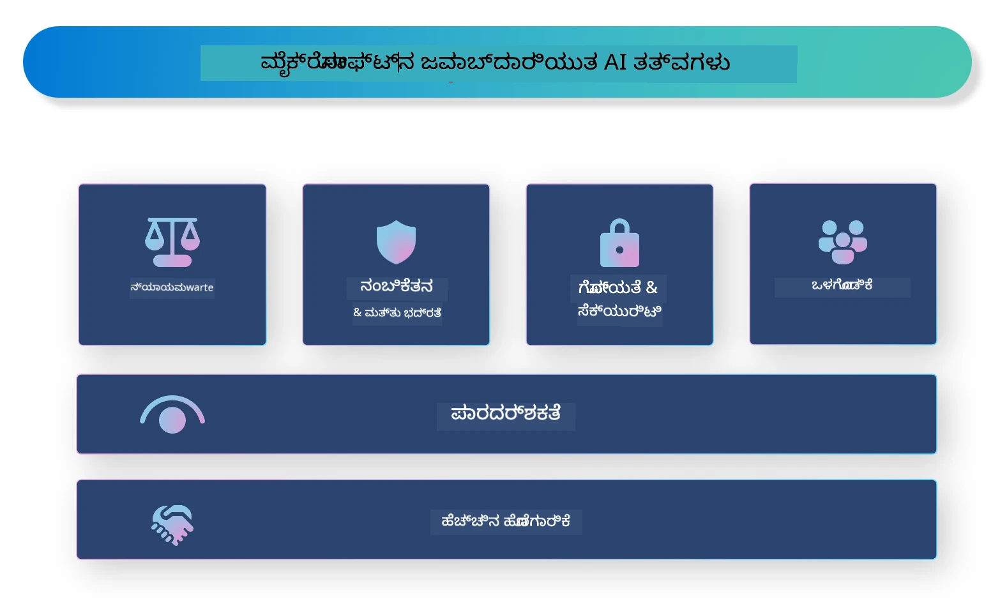

<!--
CO_OP_TRANSLATOR_METADATA:
{
  "original_hash": "805b96b20152936d8f4c587d90d6e06e",
  "translation_date": "2025-12-21T22:36:01+00:00",
  "source_file": "md/01.Introduction/05/ResponsibleAI.md",
  "language_code": "kn"
}
-->
# **ಜವಾಬ್ದಾರಿಯುತ AI ಪರಿಚಯ**

[Microsoft Responsible AI](https://www.microsoft.com/ai/responsible-ai?WT.mc_id=aiml-138114-kinfeylo) ಒಂದು ಉದ್ದೇಶವಾಗಿದೆ, ಇದು ಡೆವಲಪರ್‌ಗಳು ಮತ್ತು ಸಂಸ್ಥೆಗಳು ಪಾರದರ್ಶಕ, ನಂಬಬಹುದಾದ ಮತ್ತು ಹೊಣೆಗಾರಿಕೆಯನ್ನು ಹೊಂದಿರುವ AI ವ್ಯವಸ್ಥೆಗಳನ್ನು ನಿರ್ಮಿಸಲು ಸಹಾಯ ಮಾಡುತ್ತದೆ. ಈ ಆವೃತ್ತಿ ನೈತಿಕ ತತ್ವಗಳೊಂದಿಗೆ ಹೊಂದಾಣಿಕೆಯಲ್ಲಿರುವ ಜವಾಬ್ದಾರಿಯುತ AI ಪರಿಹಾರಗಳನ್ನು ಅಭಿವೃದ್ಧಿ ಪಡುವುದಕ್ಕಾಗಿ ಮಾರ್ಗದರ್ಶನ ಮತ್ತು ಸಂಪನ್ಮೂಲಗಳನ್ನು ಒದಗಿಸುತ್ತದೆ, ಉದಾಹರಣೆಗೆ ಗೌಪ್ಯತೆ, ನ್ಯಾಯತೆ ಮತ್ತು ಪಾರದರ್ಶಕತೆ. ನಾವು ಜವಾಬ್ದಾರಿಯುತ AI ವ್ಯವಸ್ಥೆಗಳನ್ನು ನಿರ್ಮಿಸುವ ಸಂಬಂಧದ ಕೆಲವು ಸವಾಲುಗಳು ಮತ್ತು ಉತ್ತಮ ಅಭ್ಯಾಸಗಳನ್ನು ಕೂಡ ಅನ್ವೇಷಿಸುತ್ತೇವೆ.

## Overview of Microsoft Responsible AI 

**ನೈತಿಕ ತತ್ವಗಳು** 

Microsoft Responsible AI ಅನ್ನು ಗೌಪ್ಯತೆ, ನ್ಯಾಯತೆ, ಪಾರದರ್ಶಕತೆ, ಹೊಣೆಗಾರಿಕೆ ಮತ್ತು ಸುರಕ್ಷತೆ ಮುಂತಾದ ನೈತಿಕ ತತ್ವಗಳ ಒಂದು ಸಮೂಹದಿಂದ ಮಾರ್ಗದರ್ಶನ ಮಾಡಲಾಗುತ್ತದೆ. ಈ ತತ್ವಗಳು AI ವ್ಯವಸ್ಥೆಗಳು ನೈತಿಕ ಹಾಗೂ ಜವಾಬ್ದಾರಿಯುತ ರೀತಿಯಲ್ಲಿ ಅಭಿವೃದ್ಧಿಪಡಿಸಲ್ಪಡುವಂತೆ ಭರವಸೆ ನೀಡಲು ರೂಪಿಸಲ್ಪಟ್ಟಿವೆ.

**ಪಾರದರ್ಶಕ AI**

Microsoft Responsible AI AI ವ್ಯವಸ್ಥೆಗಳಲ್ಲಿ ಪಾರದರ್ಶಕತೆಯ ಮಹತ್ವವನ್ನು ಒತ್ತಿಹೇಳುತ್ತದೆ. ಇದರಲ್ಲಿ AI ಮಾದರಿಗಳು ಹೇಗೆ ಕೆಲಸ ಮಾಡುತ್ತವೆ ಎಂಬುದರ ಸ್ಪಷ್ಟ ವಿವರಣೆಗಳನ್ನು ನೀಡುವುದು ಮತ್ತು ಡೇಟಾ ಉತ್ಸವಗಳು ಮತ್ತು ಆಲ್ಗೊರಿದಮ್ಗಳು ಸಾರ್ವಜನಿಕವಾಗಿ ಲಭ್ಯವಿರುವಂತೆ ನೋಡಿಕೊಳ್ಳುವುದು ಸೇರಿದೆ.

**ಹಣೆಗಾರಿಕೆ ಹೊಂದಿದ AI** 

[Microsoft Responsible AI](https://www.microsoft.com/ai/responsible-ai?WT.mc_id=aiml-138114-kinfeylo) ಹೊಣೆಗಾರಿಕೆಯನ್ನು ಹೊಂದಿರುವ AI ವ್ಯವಸ್ಥೆಗಳ ಅಭಿವೃದ್ಧಿಯನ್ನು ಉತ್ತೇಜಿಸುತ್ತದೆ, ಅವು AI ಮಾದರಿಗಳು ಹೇಗೆ ನಿರ್ಣಯಗಳನ್ನು ತೆಗೆದುಕೊಳ್ಳುತ್ತವೆ ಎಂಬುದರ ಒಳನೋಟವನ್ನು ಒದಗಿಸಬಹುದು. ಇದರಿಂದ ಬಳಕೆದಾರರು AI ವ್ಯವಸ್ಥೆಗಳ ಔಟ್‌ಪುಟ್‌ಗಳನ್ನು ಅರ್ಥಮಾಡಿಕೊಳ್ಳಲು ಮತ್ತು ವಿಶ್ವಾಸ ಇಡುವದಕ್ಕೆ ಸಹಾಯವಾಗುತ್ತದೆ.

**ಸಮಾವೇಶಿತತೆ** 

AI ವ್ಯವಸ್ಥೆಗಳನ್ನು ಎಲ್ಲರಿಗೂ ಪ್ರಯೋಜನಕರವಾಗುವಂತೆ ವಿನ್ಯಾಸಗೊಳಿಸಬೇಕು. Microsoft ವಿಭಿನ್ನ ದೃಷ್ಟಿಕೋಣಗಳನ್ನು ಪರಿಗಣಿಸುವ ಮತ್ತು পক্ষಪಾತ ಅಥವಾ ಭೇದಭಾವವನ್ನು ತಪ್ಪಿಸುವ ಸಮಾವೇಶಿ AI ಸೃಷ್ಟಿಸುವುದನ್ನು ಗುರಿಯಾಗಿಸಿಕೊಂಡಿದೆ.

**ವಿಶ್ವಾಸಾರ್ಹತೆ ಮತ್ತು ಸುರಕ್ಷತೆ**

AI ವ್ಯವಸ್ಥೆಗಳು ವಿಶ್ವಾಸಾರ್ಹ ಮತ್ತು ಸುರಕ್ಷಿತವಾಗಿರುವುದು ಅತ್ಯавಶ್ಯಕ. Microsoft ಶಕ್ತಿಶಾಲಿ, ಸ್ಥಿರವಾಗಿ ಕಾರ್ಯನಿರ್ವಹಿಸುವ ಮತ್ತು ಹಾನಿಕರ ಫಲಿತಾಂಶಗಳನ್ನು ತಪ್ಪಿಸುವ ಮಾದರಿಗಳನ್ನು ನಿರ್ಮಿಸುವ ಮೇಲೆ ಗಮನ ಹರಿಸುತ್ತದೆ.

**AI ನಲ್ಲಿ ನ್ಯಾಯತೆ** 

Microsoft Responsible AI ಎಂತಹಾಗಿಯೂ, AI ವ್ಯವಸ್ಥೆಗಳು ಪಕ್ಷಪಾತದублик ಮಾಹಿತಿಗಳ ಮೇಲೆ ತರಬೇತಿ ಹೊಂದಿದಾಗ ಅಥವಾ ಆಲ್ಗೊರಿದಮ್ಗಳಲ್ಲಿ ತಪ್ಪುಗಳಿದ್ದಾಗ ಅವು ಪಕ್ಷಪಾತವನ್ನು ಮುಂದುವರಿಸಲು ಸಾಧ್ಯವೆಂದು ಗುರುತಿಸುತ್ತದೆ. ಈ ಆವೃತ್ತಿ ಜನಾಂಗ, ಲಿಂಗ ಅಥವಾ ವಯಸ್ಸಿನಂತಹ ಪರಿಗಣನೆಗಳ ಆಧಾರದ ಮೇಲೆ ಭೇದಭಾವ göstermಿಸುವುದಿಲ್ಲದ ನ್ಯಾಯಸಂಗತ AI ವ್ಯವಸ್ಥೆಗಳನ್ನು ಅಭಿವೃದ್ಧಿಪಡಿಸಲು ಮಾರ್ಗದರ್ಶನ ಒದಗಿಸುತ್ತದೆ.

**ಗೌಪ್ಯತೆ ಮತ್ತು ಭದ್ರತೆ** 

Microsoft Responsible AI AI ವ್ಯವಸ್ಥೆಗಳಲ್ಲಿ ಬಳಕೆದಾರರ ಗೌಪ್ಯತೆ ಮತ್ತು ಡೇಟಾ ಭದ್ರತೆಯನ್ನು ರಕ್ಷಿಸುವ ಮಹತ್ವವನ್ನು ಒತ್ತಿಹೇಳುತ್ತದೆ. ಇದರಲ್ಲಿ ಬಲವಾದ ಡೇಟಾ ಎನ್ಕ್ರಿಪ್ಷನ್ ಮತ್ತು ಪ್ರವೇಶ ನಿಯಂತ್ರಣಗಳನ್ನು ಅನುಷ್ಠಾನಗೊಳಿಸುವುದು ಮತ್ತು ನಿಯಮಿತವಾಗಿ AI ವ್ಯವಸ್ಥೆಗಳನ್ನು ದುರ್ಬಲತೆಗಳಿಗಾಗಿ ಆಡಿಟ್ ಮಾಡುವುದೂ ಸೇರಿದೆ.

**ಹೆಕ್ಕದಾರಿ ಮತ್ತು ಜವಾಬ್ದಾರಿ** 

Microsoft Responsible AI AI ಅಭಿವೃದ್ಧಿ ಮತ್ತು ನಿಯೋಜನೆಯಲ್ಲಿ ಹೊಣೆಗಾರಿಕೆ ಮತ್ತು ಜವಾಬ್ದಾರಿಯನ್ನು ಉತ್ತೇಜಿಸುತ್ತದೆ. ಇದರಲ್ಲಿ ಡೆವಲಪರ್‌ಗಳು ಮತ್ತು ಸಂಸ್ಥೆಗಳು AI ವ್ಯವಸ್ಥೆಗಳಿಗೆ ಸಂಬಂಧಿಸಿದ ಸಾಧ್ಯವಿರುವ ಅಪಾಯಗಳನ್ನು ಅರಿತುಕೊಳ್ಳಲು ಮತ್ತು ಆ ಅಪಾಯಗಳನ್ನು ಕಡಿಮೆ ಮಾಡಲು ಕ್ರಮಗಳನ್ನು ಕೈಗೊಂಡಿರುವುದು ಖಚಿತಪಡಿಸುವುದು ಸೇರಿದೆ.

## ಜವಾಬ್ದಾರಿಯುತ AI ವ್ಯವಸ್ಥೆಗಳನ್ನು ನಿರ್ಮಿಸಲು ಉತ್ತಮ ಅಭ್ಯಾಸಗಳು

**ವಿವಿಧತೆಯ ಡೇಟಾ ಸೆಟ್‌ಗಳನ್ನು ಬಳಸಿಕೊಂಡು AI ಮಾದರಿಗಳನ್ನು ಅಭಿವೃದ್ಧಿಪಡಿಸಿ** 

AI ವ್ಯವಸ್ಥೆಗಳಲ್ಲಿನ ಪಕ್ಷಪಾತನ್ನು ತಪ್ಪಿಸಲು, ವಿಭಿನ್ನ ದೃಷ್ಟಿಕೋಣಗಳು ಮತ್ತು ಅನುಭವಗಳನ್ನು ಪ್ರತಿನಿಧಿಸುವ ವಿಭಿನ್ನತೆಯ ಡೇಟಾ ಸೆಟ್‌ಗಳನ್ನು ಬಳಸುವುದು ಮುಖ್ಯ.

**ವಿವರಣಾತ್ಮಕ AI ತಂತ್ರಗಳನ್ನು ಬಳಸಿ** 

ವಿವರಣಾತ್ಮಕ AI ತಂತ್ರಗಳು ಬಳಕೆದಾರರಿಗೆ AI ಮಾದರಿಗಳು ಹೇಗೆ ನಿರ್ಧಾರಗಳನ್ನು ಮಾಡುತ್ತವೇ ಎಂಬುದನ್ನು ಅರ್ಥಮಾಡಿಕೊಳ್ಳಲು ಸಹಾಯ ಮಾಡಬಹುದು, ಇದು ವ್ಯವಸ್ಥೆಯ ಮೇಲಿನ ವಿಶ್ವಾಸವನ್ನು ಹೆಚ್ಚಿಸುತ್ತದೆ.

**ಕಾಲಕಾಲಕ್ಕೆ AI ವ್ಯವಸ್ಥೆಗಳನ್ನು ದುರ್ಬಲತೆಗಳಿಗೆ ಪರಿಶೀಲಿಸಿ** 

AI ವ್ಯವಸ್ಥೆಗಳ ನಿಯಮಿತ ಆಡಿಟ್‌ಗಳು ಪರಿಹರಿಸಬೇಕಾದ ಸಾಧ್ಯವಿರುವ ಅಪಾಯಗಳು ಮತ್ತು ದುರ್ಬಲತೆಗಳನ್ನು ಗುರುತಿಸಲು ಸಹಾಯ ಮಾಡಬಹುದು.

**ಬಲಿಷ್ಠ ಡೇಟಾ ಎನ್ಕ್ರಿಪ್ಷನ್ ಮತ್ತು ಪ್ರವೇಶ ನಿಯಂತ್ರಣಗಳನ್ನು ಅನುಷ್ಠಾನಗೊಳಿಸಿ** 

ಡೇಟಾ ಎನ್ಕ್ರಿಪ್ಷನ್ ಮತ್ತು ಪ್ರವೇಶ ನಿಯಂತ್ರಣಗಳು AI ವ್ಯವಸ್ಥೆಗಳಲ್ಲಿ ಬಳಕೆದಾರರ ಗೌಪ್ಯತೆ ಮತ್ತು ಭದ್ರತೆಯನ್ನು ರಕ್ಷಿಸಲು ಸಹಾಯ ಮಾಡಬಹುದು.

**AI ಅಭಿವೃದ್ಧಿಯಲ್ಲಿ ನೈತಿಕ ತತ್ವಗಳನ್ನು ಅನುಸರಿಸಿ** 

ನ್ಯಾಯತೆ, ಪಾರದರ್ಶಕತೆ ಮತ್ತು ಹೊಣೆಗಾರಿಕೆಯಂತಹ ನೈತಿಕ ತತ್ವಗಳನ್ನು ಅನುಸರಿಸುವುದು AI ವ್ಯವಸ್ಥೆಗಳಲ್ಲಿ ವಿಶ್ವಾಸವನ್ನು ನಿರ್ಮಿಸಲು ಮತ್ತು ಅವುಗಳನ್ನು ಜವಾಬ್ದಾರಿಯುತ ರೀತಿಯಲ್ಲಿ ಅಭಿವೃದ್ಧಿಪಡಿಸಲು ಸಹಾಯ ಮಾಡುತ್ತದೆ.

## ಜವಾಬ್ದಾರಿಯುತ AI ಗಾಗಿ AI Foundry ಬಳಸುವುದು

[Azure AI Foundry](https://ai.azure.com?WT.mc_id=aiml-138114-kinfeylo) ಒಂದು ಶಕ್ತಿಶಾಲಿ ವೇದಿಕೆ ಆಗಿದೆ, ಇದು ಡೆವಲಪರ್‌ಗಳು ಮತ್ತು ಸಂಸ್ಥೆಗಳಿಗೆ ತ್ವರಿತವಾಗಿ ಬುದ್ಧಿವಂತ, ಕಟಿಂಗ್-ಎಡ್ಜ್, ಮಾರುಕಟ್ಟೆಗೆ ತಯಾರಾಗಿರುವ ಮತ್ತು ಜವಾಬ್ದಾರಿಯುತ ಅಪ್ಲಿಕೇಶನ್‌ಗಳನ್ನು ರಚಿಸಲು ಅನುಮತಿಸುತ್ತದೆ. ಇಲ್ಲಿ Azure AI Foundry ರ ಕೆಲವು ಪ್ರಮುಖ ವೈಶಿಷ್ಟ್ಯಗಳು ಮತ್ತು ಸಾಮರ್ಥ್ಯಗಳಿವೆ:

**ತಕ್ಷಣ ಬಳಕೆಗೆ ಸಿದ್ದವಾದ APIs ಮತ್ತು ಮಾದರಿಗಳು** 

Azure AI Foundry ಪೂರ್ವ-ನಿರ್ಮಿತ ಮತ್ತು ಕಸ್ಟಮೈಜ್ ಮಾಡಬಹುದಾದ APIs ಮತ್ತು ಮಾದರಿಗಳನ್ನು ಒದಗಿಸುತ್ತದೆ. ಇವು ಜನರೇಟಿವ್ AI, ಸಂಭಾಷಣೆಯಿಗಾಗಿ ನ್ಯಾಚುರಲ್ ಲ್ಯಾಂಗ್ವೇಜ್ ಪ್ರೊಸೆಸಿಂಗ್, ಹುಡುಕಾಟ, ಮೇಲ್ವಿಚಾರಣೆ, ಅನುವಾದ, ಧ್ವನಿ, ದೃಶ್ಯ ಮತ್ತು ನಿರ್ಧಾರ-ಮಾತಿನಂತಹ ವ್ಯಾಪಕ AI ಕಾರ್ಯಗಳನ್ನು ಆವರಿಸುತ್ತವೆ.

**Prompt Flow** 

Azure AI Foundry ನಲ್ಲಿ Prompt Flow ನಿಮಗೆ ಸಂಭಾಷಣಾತ್ಮಕ AI ಅನುಭವಗಳನ್ನು ರಚಿಸಲು ಅನುಮತಿಸುತ್ತದೆ. ಇದು ಸಂಭಾಷಣಾತ್ಮಕ ಫ್ಲೋಗಳನ್ನು ವಿನ್ಯಾಸಗೊಳಿಸುವ ಮತ್ತು ನಿರ್ವಹಿಸುವುದನ್ನು ಸುಗಮಗೊಳಿಸುತ್ತದೆ, ಚಾಟ್‌ಬಾಟ್‌ಗಳು, ವರ್ಚುವಲ್ ಅಸಿಸ್ಟಂಟ್‌ಗಳು ಮತ್ತು ಇತರ ಇಂಟರ್ಯಾಕ್ಟಿವ್ ಅಪ್ಲಿಕೇಶನ್‌ಗಳನ್ನು ನಿರ್ಮಿಸಲು ಇದು ಸಹಾಯ ಮಾಡುತ್ತದೆ.

**Retrieval Augmented Generation (RAG)** 

RAG ಒಂದು ತಂತ್ರವಾಗಿದೆ ಇದು ರಿಟ್ರಿವಲ್-ಆಧಾರಿತ ಮತ್ತು ಜನರೇಟಿವ್-ಆಧಾರಿತ ವಿಧಾನಗಳನ್ನು ಸಂಯೋಜಿಸುತ್ತದೆ. ಇದು ಪೂರ್ವನಿರೀಕ್ಷಿತ ಜ್ಞಾನ (retrieval) ಮತ್ತು ಸೃಜನಾತ್ಮಕ ಜನರೇಶನ್ (generation) ಎರಡನ್ನೂ ಬಳಸಿಕೊಂಡು ರಚಿಸಿದ ಪ್ರತಿಕ್ರಿಯೆಗಳ ಗುಣಮಟ್ಟವನ್ನು ಹೆಚ್ಚಿಸುತ್ತದೆ.

**ಸೃಜನಾತ್ಮಕ AI ಗಾಗಿ ಮೌಲ್ಯಮಾಪನ ಮತ್ತು ಮೇಲ್ವಿಚಾರಣೆ ಮೆಟ್ರಿಕ್ಸ್** 

Azure AI Foundry ಸೃಜನಾತ್ಮಕ AI ಮಾದರಿಗಳ ಮೌಲ್ಯಮಾಪನ ಮತ್ತು ಮೇಲ್ವಿಚಾರಣೆಗೆ ಉಪಕರಣಗಳನ್ನು ಒದಗಿಸುತ್ತದೆ. ನೀವು ಅವುಗಳ ಕಾರ್ಯಕ್ಷಮತೆ, ನ್ಯಾಯತೆ ಮತ್ತು ಇತರೆ ಪ್ರಮುಖ ಮೆಟ್ರಿಕ್ಸ್‌ಗಳನ್ನು ಅಳೆಯಬಹುದಾಗಿದೆ ώστε ಜವಾಬ್ದಾರಿಯುತ ನಿಯೋಜನೆಯನ್ನು ಖಚಿತಪಡಿಸಿಕೊಳ್ಳಲು. ಹೆಚ್ಚುವರಿಯಾಗಿ, ನೀವು ಡ್ಯಾಶ್‌ಬೋರ್ಡ್ ಅನ್ನು ರಚಿಸಿದ್ದರೆ, Azure Machine Learning Studio ಯ no-code UI ಅನ್ನು ಬಳಸಿ Responsible AI Dashboard ಮತ್ತು ಅದಕ್ಕೆ ಸಂಬಂಧಿಸಿದ ಸ್ಕೋರ್ಕಾರ್ಡ್ ಅನ್ನು [Responsible AI Toolbox](https://responsibleaitoolbox.ai/?WT.mc_id=aiml-138114-kinfeylo) ಪೈಥಾನ್ ಲೈಬ್ರರಿಗಳ ಆಧಾರದ ಮೇಲೆ ಕಸ್ಟಮೈಸ್ ಮಾಡಿ ರಚಿಸಬಹುದು. ಈ ಸ್ಕೋರ್ಕಾರ್ಡ್ ನ್ಯಾಯತೆ, ಫೀಚರ್ ಪ್ರಾಮುಖ್ಯತೆ ಮತ್ತು ಇತರೆ ಜವಾಬ್ದಾರಿಯುತ ನಿಯೋಜನೆ ಪರಿಗಣನೆಗಳಿಗೆ ಸಂಬಂಧಿಸಿದ ಮುಖ್ಯ洞ೃಷ್ಟಿಗಳನ್ನು ತಾಂತ್ರಿಕ ಮತ್ತು ತಾಂತ್ರಿಕವಲ್ಲದ ಹಿತಧಾರಕರೊಂದಿಗೆ ಹಂಚಿಕೊಳ್ಳಲು ಸಹಾಯ ಮಾಡುತ್ತದೆ.

AI Foundry ಅನ್ನು ಜವಾಬ್ದಾರಿಯುತ AIೊಂದಿಗೆ ಬಳಸಲು, ನೀವು ಈ ಉತ್ತಮ ಅಭ್ಯಾಸಗಳನ್ನು ಅನುಸರಿಸಬಹುದು:

**ನಿಮ್ಮ AI ವ್ಯವಸ್ಥೆಯ ಸಮಸ್ಯೆ ಮತ್ತು ಉದ್ದೇಶಗಳನ್ನು ನಿರ್ಧರಿಸಿ**

ಅಭಿವೃದ್ಧಿ ಪ್ರಕ್ರಿಯೆಯನ್ನು ಪ್ರಾರಂಭಿಸುವ ಮೊದಲು, ನಿಮ್ಮ AI ವ್ಯವಸ್ಥೆ ಪರಿಹರಿಸುವ ಉದ್ದೇಶ ಅಥವಾ ಸಮಸ್ಯೆಯನ್ನು ಸ್ಪಷ್ಟವಾಗಿ ನಿರ್ಧರಿಸುವುದು ಮುಖ್ಯ. ಇದರಿಂದ ಪರಿಣಾಮಕಾರಿಯಾದ ಮಾದರಿಯನ್ನು ನಿರ್ಮಿಸಲು ಅಗತ್ಯವಿರುವ ಡೇಟಾ, ಆಲ್ಗೊರಿದಮ್‌ಗಳು ಮತ್ತು ಸಂಪನ್ಮೂಲಗಳನ್ನು ಗುರುತಿಸಲು ಸಹಾಯವಾಗುತ್ತದೆ.

**ಸಂಬಂಧಿತ ಡೇಟಾವನ್ನು ಸಂಗ್ರಹಿಸಿ ಮತ್ತು ಪೂರ್ವಪ್ರಕ್ರಿಯೆ ಮಾಡಿ** 

AI ವ್ಯವಸ್ಥೆಯ ತರಬೇತಿಗೆ ಉಪಯೋಗಿಸಲಾದ ಡೇಟಾದ ಗುಣಮಟ್ಟ ಮತ್ತು ಪ್ರಮಾಣ ಅದರ ಕಾರ್ಯಕ್ಷಮತೆಗೆ ಪ್ರಮುಖ ಪರಿಣಾಮ ಉಂಟುಮಾಡಬಹುದು. ಆದ್ದರಿಂದ, ಸಂಬಂಧಿತ ಡೇಟಾವನ್ನು ಸಂಗ್ರಹಿಸಿ, ಅದನ್ನು ಸ್ವಚ್ಛಗೊಳಿಸಿ, ಪೂರ್ವಪ್ರಕ್ರಿಯೆ ಮಾಡಿ ಮತ್ತು ನೀವು ಪರಿಹರಿಸಲಿರುವ ಜನಸಂಖ್ಯೆ ಅಥವಾ ಸಮಸ್ಯೆಯನ್ನು ಪ್ರತಿನಿಧಿಸುವುದಾಗಿ ಖಚಿತಪಡಿಸಿಕೊಳ್ಳುವುದು ಮುಖ್ಯ.

**ಯೋಗ್ಯ ಮೌಲ್ಯಮಾಪನವನ್ನು ಆಯ್ಕೆಮಾಡಿ** 

ಬಹುಮಾನವಾದ ಮೌಲ್ಯಮಾಪನ ಆಲ್ಗೊರಿದಮ್ಗಳು ಲಭ್ಯವಿವೆ. ನಿಮ್ಮ ಡೇಟಾ ಮತ್ತು ಸಮಸ್ಯೆಯ ಆಧಾರದ ಮೇಲೆ ಅತ್ಯಂತ ಯೋಗ್ಯವಾದ ಆಲ್ಗೊರಿದಮ್ ಅನ್ನು ಆಯ್ಕೆಮಾಡುವುದು ಮುಖ್ಯ.

**ಮಾದರಿಯನ್ನು ಮೌಲ್ಯಮಾಪನ ಮಾಡಿ ಮತ್ತು ವಿಶ್ಲೇಷಿಸಿ** 

ನೀವು AI ಮಾದರಿಯನ್ನು ನಿರ್ಮಿಸಿದ್ದ ನಂತರ, ಸೂಕ್ತ ಮೆಟ್ರಿಕ್ಸ್ ಅನ್ನು ಬಳಸಿ ಅದರ ಕಾರ್ಯಕ್ಷಮತೆಯನ್ನು ಮೌಲ್ಯಮಾಪನ ಮಾಡುವುದು ಮತ್ತು ಫಲಿತಾಂಶಗಳನ್ನು ಪಾರದರ್ಶಕ ರೀತಿಯಲ್ಲಿ ವಿವರಣೆ ಮಾಡುವುದು ಅಗತ್ಯ. ಇದು ಮಾದರಿಯಿನಲ್ಲಿ ಯಾವುದೇ ಪಕ್ಷಪಾತಗಳು ಅಥವಾ పరಿಮಿತಿಗಳನ್ನು ಗುರುತಿಸಲು ಮತ್ತು ಅಗತ್ಯವಿದ್ದಲ್ಲಿ ಸುಧಾರಣೆಗಳನ್ನು ಮಾಡಿಸಬಲ್ಲಂತೆ ಮಾಡುತ್ತದೆ.

**ಪಾರದರ್ಶಕತೆ ಮತ್ತು ವಿವರಣಾಶೀಲತೆಯನ್ನು ಖಚಿತಪಡಿಸಿಕೊಳ್ಳಿ** 

AI ವ್ಯವಸ್ಥೆಗಳು ಪಾರದರ್ಶಕ ಮತ್ತು ವಿವರಣಾಶೀಲವಾಗಿರಬೇಕು, ಹೀಗಾಗಿ ಬಳಕೆದಾರರು ಅವು ಹೇಗೆ ಕಾರ್ಯನಿರ್ವಹಿಸುತ್ತವೆ ಮತ್ತು ನಿರ್ಧಾರಗಳನ್ನು ಹೇಗೆ ತೆಗೆದುಕೊಳ್ಳಲಾಗುತ್ತದೆ ಎಂಬುದನ್ನು ಅರ್ಥಮಾಡಿಕೊಳ್ಳಬಹುದು. ಆರೋಗ್ಯಸೇವೆ, ಹಣಕಾಸು ಮತ್ತು ಕಾನೂನು ವ್ಯವಸ್ಥೆಗಳಂತಹ ಮಾನವ ಜೀವನಗಳಿಗೆ ಮಹತ್ವಪೂರ್ಣ ಪ್ರಭಾವವುಳ್ಳ ಅಪ್ಲಿಕೇಶನ್‌ಗಳಿಗಾಗಿ ಇದು ವಿಶೇಷವಾಗಿ ಮುಖ್ಯ.

**ಮಾದರಿಯನ್ನು ಮೇಲ್ವಿಚಾರಣೆ ಮಾಡಿ ಮತ್ತು ನವೀಕರಿಸಿ** 

AI ವ್ಯವಸ್ಥೆಗಳನ್ನು ಧೃಡವಾಗಿ ಮೇಲ್ವಿಚಾರಣೆ ಮಾಡಬೇಕು ಮತ್ತು ಸಮಯದೊಂದಿಗೆ ಅವು ನಿಖರವಾಗಿರಲು ಮತ್ತು ಪರಿಣಾಮಕಾರಿಯಾಗಿರಲು ನವೀಕರಿಸಲಾಗಬೇಕು. ಇದಕ್ಕಾಗಿ ನಿರಂತರ ನಿರ್ವಹಣೆ, ಪರೀಕ್ಷೆ ಮತ್ತು ಮಾದರಿಯ ಮರುತರಬೇತಿ ಅಗತ್ಯವಿದೆ.

ಕೆಲಸದಾಂತ್ಯವಾಗಿ, Microsoft Responsible AI ಒಂದು ಉದ್ದೇಶವಾಗಿದೆ, ಇದು ಡೆವಲಪರ್‌ಗಳು ಮತ್ತು ಸಂಸ್ಥೆಗಳು ಪಾರದರ್ಶಕ, ನಂಬಬಹುದಾದ ಮತ್ತು ಹೊಣೆಗಾರಿಕೆಯನ್ನು ಹೊಂದಿರುವ AI ವ್ಯವಸ್ಥೆಗಳನ್ನು ನಿರ್ಮಿಸಲು ಸಹಾಯ ಮಾಡುತ್ತದೆ. ಜವಾಬ್ದಾರಿಯುತ AI ಅನುಷ್ಠಾನವು ಅತ್ಯಾವಶ್ಯಕವಾಗಿದ್ದು, Azure AI Foundry ಸಂಸ್ಥೆಗಳಿಗಾಗಿ ಅದನ್ನು ಪ್ರಾಯೋಗಿಕಗೊಳಿಸುವುದಾಗಿ ಗುರಿಯಾಗಿಸಿದೆ ಎಂಬುದನ್ನು ನೆನಪಿಡಿ. ನೈತಿಕ ತತ್ವಗಳು ಮತ್ತು ಉತ್ತಮ ಅಭ್ಯಾಸಗಳನ್ನು ಅನುಸರಿಸುವ ಮೂಲಕ, ನಾವು AI ವ್ಯವಸ್ಥೆಗಳನ್ನು ಸಮಾಜಕ್ಕೆ ಸಮಗ್ರವಾಗಿ ಪ್ರಯೋಜನಕಾರಿಯಾಗಲು ಜವಾಬ್ದಾರಿಯುತ ರೀತಿಯಲ್ಲಿ ಅಭಿವೃದ್ಧಿ ಮಾಡಲಾಗುತ್ತದೆ ಮತ್ತು ನಿಯೋಜಿಸಬಹುದೆಂದು ಖಚಿತಪಡಿಸಬಹುದು.

---

<!-- CO-OP TRANSLATOR DISCLAIMER START -->
ನಿರಾಕರಣೆ:
ಈ ದಸ್ತಾವೇಜನ್ನು AI ಅನುವಾದ ಸೇವೆ Co-op Translator (https://github.com/Azure/co-op-translator) ಬಳಸಿ ಅನುವಾದಿಸಲಾಗಿದೆ. ನಾವು ಶುದ್ಧತೆಯನ್ನು ಉದ್ದೇಶಿಸೀಗಲರೂ, ದಯವಿಟ್ಟು ಗಮನಿಸಿ ಸ್ವಯಂಚಾಲಿತ ಅನುವಾದಗಳಲ್ಲಿ ದೋಷಗಳು ಅಥವಾ ಅಸತ್ಯತೆಗಳು ಇರಬಹುದೆಂದು. ಮೂಲ ಭಾಷೆಯಲ್ಲಿನ ಮೂಲ ದಸ್ತಾವೇಜನ್ನು ಅಧಿಕೃತ ಮೂಲವೆಂದು ಪರಿಗಣಿಸಬೇಕು. ಗಂಭೀರ ಅಥವಾ ಅತ್ಯಾವಶ್ಯಕ ಮಾಹಿತಿಗಾಗಿ ವೃತ್ತಿಪರ ಮಾನವ ಅನುವಾದವನ್ನು ಶಿಫಾರಸು ಮಾಡಲಾಗುತ್ತದೆ. ಈ ಅನುವಾದದ ಬಳಕೆಯಿಂದ ಉಂಟಾದ ಯಾವುದೇ ಅರ್ಥಭ್ರಂಶಗಳು ಅಥವಾ ತಪ್ಪು ವ್ಯಾಖ್ಯಾನಗಳಿಗಾಗಿ ನಾವು ಹೊಣೆಗಾರರಾಗುವುದಿಲ್ಲ.
<!-- CO-OP TRANSLATOR DISCLAIMER END -->