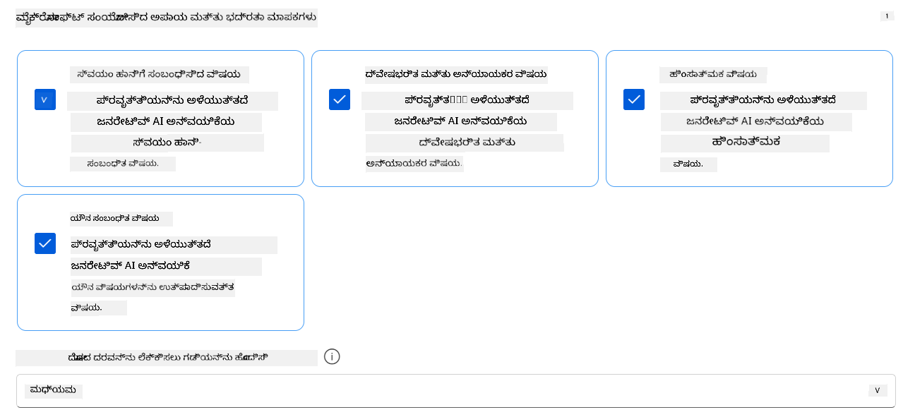
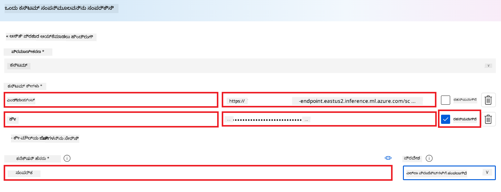
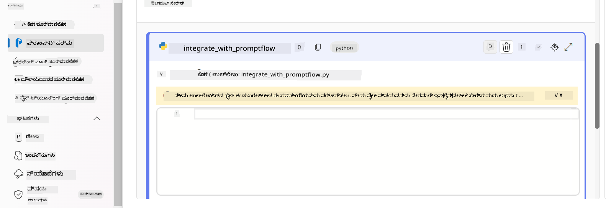
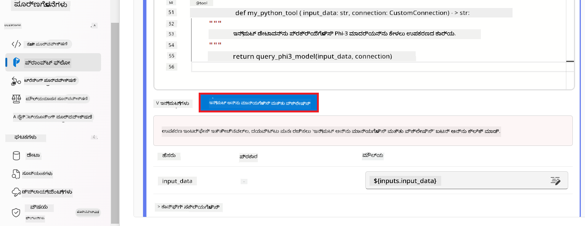
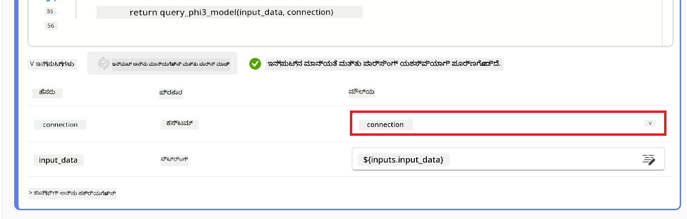

<!--
CO_OP_TRANSLATOR_METADATA:
{
  "original_hash": "80a853c08e4ee25ef9b4bfcedd8990da",
  "translation_date": "2025-12-21T21:26:49+00:00",
  "source_file": "md/02.Application/01.TextAndChat/Phi3/E2E_Phi-3-Evaluation_AIFoundry.md",
  "language_code": "kn"
}
-->
# ಫೈನ್-ಟ್ಯೂನ್ ಮಾಡಲಾದ Phi-3 / Phi-3.5 ಮಾದರಿಯನ್ನು Azure AI Foundry ನಲ್ಲಿ Microsoft's Responsible AI ತತ್ವಗಳ ಮೇಲೆ ಧ್ಯಾನದೊಂದಿಗೆ ಮೌಲ್ಯಮಾಪನ ಮಾಡಿ

ಈ ಇಂದ-ಟು-ರೆಂಡ್ (E2E) ಉದಾಹರಣೆ Microsoft Tech Community ಯಲ್ಲಿರುವ "[Evaluate Fine-tuned Phi-3 / 3.5 Models in Azure AI Foundry Focusing on Microsoft's Responsible AI](https://techcommunity.microsoft.com/blog/educatordeveloperblog/evaluate-fine-tuned-phi-3--3-5-models-in-azure-ai-studio-focusing-on-microsofts-/4227850?WT.mc_id=aiml-137032-kinfeylo)" ಎಂಬ ಮಾರ್ಗದರ್ಶಿಯ ಮೇಲೆ ಆಧಾರಿತವಾಗಿದೆ.

## ಅವಲೋಕನ

### ನೀವು Azure AI Foundry ನಲ್ಲಿ ಫೈನ್-ಟ್ಯೂನ್ ಮಾಡಿದ Phi-3 / Phi-3.5 ಮಾದರಿಯ ಸುರಕ್ಷತೆ ಮತ್ತು ಕಾರ್ಯಕ್ಷಮತೆಯನ್ನು ಹೇಗೆ ಮೌಲ್ಯಮಾಪನ ಮಾಡಬಹುದು?

ಮಾದರಿಯನ್ನು ಫೈನ್-ಟ್ಯೂನ್ ಮಾಡುವುದು ಕೆಲವೊಮ್ಮೆ ಉಲ್ಲೇಖವಲ್ಲದ ಅಥವಾ ಅನாகರಿಕೆ ಪ್ರತಿಕ್ರಿಯೆಗಳಿಗೆ ಕಾರಣವಾಗಬಹುದು. ಮಾದರಿ ಸುರಕ್ಷಿತ ಮತ್ತು ಪರಿಣಾಮಕಾರಿಯಾಗಿ ಉಳಿಯಲು, ಅದು ಹಾನಿಕರ ವಿಷಯವನ್ನು ಉಂಟುಮಾಡುವ ಸಾಧ್ಯತೆ ಮತ್ತು ಸঠিক, ಸಂಬಂಧಿತ ಮತ್ತು ಸुसಂಗತ ಪ್ರತಿಕ್ರಿಯೆಗಳನ್ನು ಉತ್ಪಾದಿಸುವ ಸಾಮರ್ಥ್ಯವನ್ನು ಮೌಲ್ಯಮಾಪನ ಮಾಡುವುದು ಮುಖ್ಯವಾಗಿದೆ. ಈ ಪಾಠದಲ್ಲಿ, ನೀವು Azure AI Foundry ನಲ್ಲಿ Prompt flow ಜೊತೆಗೆ ಸಂಯೋಜಿಸಲಾದ ಫೈನ್-ಟ್ಯೂನ್ ಮಾಡಿದ Phi-3 / Phi-3.5 ಮಾದರಿಯ ಸುರಕ್ಷತೆ ಮತ್ತು ಕಾರ್ಯಕ್ಷಮತೆಯನ್ನು ಹೇಗೆ ಮೌಲ್ಯಮಾಪನ ಮಾಡಬೇಕೆಂದು ಕಲಿಯೋದು.

ಇತ್ತೀಚೀಗ Azure AI Foundry ನ ಮೌಲ್ಯಮಾಪನ ಪ್ರಕ್ರಿಯೆ ಇಲ್ಲಿದೆ.


*ಚಿತ್ರದ ಮೂಲ: [Evaluation of generative AI applications](https://learn.microsoft.com/azure/ai-studio/concepts/evaluation-approach-gen-ai?wt.mc_id%3Dstudentamb_279723)*

> [!NOTE]
>
> ಚೆನ್ನಾಗಿ ವಿವರಿಸಿದ ಮಾಹಿತಿ ಮತ್ತು Phi-3 / Phi-3.5 ಕುರಿತ ಹೆಚ್ಚುವರಿ ಸಂಪನ್ಮೂಲಗಳನ್ನು ಅನ್ವೇಷಿಸಲು, ದಯವಿಟ್ಟು [Phi-3CookBook](https://github.com/microsoft/Phi-3CookBook?wt.mc_id=studentamb_279723) ಅನ್ನು ಭೇಟಿ ಮಾಡಿ.

### ಅಗತ್ಯವಾಗುವ ವಸ್ತುಗಳು

- [Python](https://www.python.org/downloads)
- [Azure subscription](https://azure.microsoft.com/free?wt.mc_id=studentamb_279723)
- [Visual Studio Code](https://code.visualstudio.com)
- ಫೈನ್-ಟ್ಯೂನ್ ಮಾಡಲಾದ Phi-3 / Phi-3.5 ಮಾದರಿ

### ವಿಷಯಗಳ ಪಟ್ಟಿಗಳು

1. [**Scenario 1: Introduction to Azure AI Foundry's Prompt flow evaluation**](../../../../../../md/02.Application/01.TextAndChat/Phi3)

    - [Introduction to safety evaluation](../../../../../../md/02.Application/01.TextAndChat/Phi3)
    - [Introduction to performance evaluation](../../../../../../md/02.Application/01.TextAndChat/Phi3)

1. [**Scenario 2: Evaluating the Phi-3 / Phi-3.5 model in Azure AI Foundry**](../../../../../../md/02.Application/01.TextAndChat/Phi3)

    - [Before you begin](../../../../../../md/02.Application/01.TextAndChat/Phi3)
    - [Deploy Azure OpenAI to evaluate the Phi-3 / Phi-3.5 model](../../../../../../md/02.Application/01.TextAndChat/Phi3)
    - [Evaluate the fine-tuned Phi-3 / Phi-3.5 model using Azure AI Foundry's Prompt flow evaluation](../../../../../../md/02.Application/01.TextAndChat/Phi3)

1. [Congratulations!](../../../../../../md/02.Application/01.TextAndChat/Phi3)

## **Scenario 1: Introduction to Azure AI Foundry's Prompt flow evaluation**

### ಸುರಕ್ಷತೆ ಮೌಲ್ಯಮಾಪನಕ್ಕೆ ಪರಿಚಯ

ನಿಮ್ಮ AI ಮಾದರಿ ನೈತಿಕ ಮತ್ತು ಸುರಕ್ಷಿತವಾಗಿರಬೇಕೆಂಬುದನ್ನು ಖಾತ್ರಿ ಪಡಿಸಲು, ಅದನ್ನು Microsoft's Responsible AI ತತ್ವಗಳ ವಿರುದ್ಧ ಮೌಲ್ಯಮಾಪನ ಮಾಡುವುದು ಅತ್ಯಾಕಾಂಕ್ಷೆಯಾಗಿದೆ. Azure AI Foundry ನಲ್ಲಿ, ಸುರಕ್ಷತಾ ಮೌಲ್ಯಮಾಪನಗಳು ನಿಮ್ಮ ಮಾದರಿಯ ಜೈಲ್‌ಬ್ರೆಕ್ ಹಲ್ಲೆಗಳಿಗೆ ಅಡಕದಂತಹ ಮತು ಅಥವಾ ಹಾನಿಕರ ವಿಷಯವನ್ನು ಉತ್ಪಾದಿಸುವ ಸಾಮರ್ಥ್ಯವನ್ನು ಮೌಲ್ಯಮಾಪನ ಮಾಡಲು ಅನುಮತಿಸುತ್ತವೆ, ಇದು ಈ ತತ್ವಗಳಿಗೆ ನೇರ ಸಂಯೋಜನೆಯಾಗಿದೆ.


*ಚಿತ್ರದ ಮೂಲ: [Evaluation of generative AI applications](https://learn.microsoft.com/azure/ai-studio/concepts/evaluation-approach-gen-ai?wt.mc_id%3Dstudentamb_279723)*

#### Microsoft's Responsible AI ತತ್ವಗಳು

ತಾಂತ್ರಿಕ ಹೆಜ್ಜೆಗಳನ್ನು ಆರಂಭಿಸುವ ಮೊದಲು, Microsoft's Responsible AI ತತ್ವಗಳನ್ನು ಅರ್ಥಮಾಡಿಕೊಳ್ಳುವುದು ಅತ್ಯವಶ್ಯक — ಇದು AI ವ್ಯವಸ್ಥೆಗಳ ಜವಾಬ್ದಾರಿಯುತ ಅಭಿವೃದ್ಧಿ, ನಿಯೋಜನೆ, ಮತ್ತು ಕಾರ್ಯಾಚರಣೆಯನ್ನು ಮಾರ್ಗದರ್ಶಿಸುವ ನೈತಿಕ ಚೌಕಟ್ಟಾಗಿದೆ. ಈ ತತ್ವಗಳು AI ವ್ಯವಸ್ಥೆಗಳನ್ನು ಸಮ, ಪಾರದರ್ಶಕ ಮತ್ತು ಒಳಗೊಂಡ ರೂಪದಲ್ಲಿ ನಿರ್ಮಿಸುವಂತೆ ವಿನ್ಯಾಸ, ಅಭಿವೃದ್ಧಿ ಮತ್ತು ನಿಯೋಜನೆಯನ್ನು ಮಾರ್ಗದರ್ಶಿಸುತ್ತವೆ. ಈ ತತ್ವಗಳು AI ಮಾದರಿಗಳ ಸುರಕ್ಷತೆ ಮೌಲ್ಯಮಾಪನದ ಆಧಾರವಾಗಿದೆ.

Microsoft ನ Responsible AI ತತ್ವಗಳಲ್ಲಿ ಸೇರಿವೆ:

- **ಸಮಾನುಚಿತತೆ ಮತ್ತು ಒಳಗೂಡುವಿಕೆ**: AI ವ್ಯವಸ್ಥೆಗಳು ಎಲ್ಲರನ್ನು ಸಮವಾಗಿ ನಡೆಸಬೇಕು ಮತ್ತು ಸಮಾನ ಸ್ಥಿತಿಯಲ್ಲಿರುವ ಗುಂಪುಗಳನ್ನು ವಿಭಿನ್ನವಾಗಿ ಪರಿಣಾಮಗೊಳಿಸುವುದನ್ನು ತಪ್ಪಿಸಬೇಕು. ಉದಾಹರಣೆಗೆ, AI ವ್ಯವಸ್ಥೆಗಳು ವೈದ್ಯಕೀಯ ಚಿಕಿತ್ಸೆ, ಸಾಲ ಅರ್ಜಿಗಳು, ಅಥವಾ ಉದ್ಯೋಗ ಸಂಬಂಧಿ ಸಲಹೆಗಳನ್ನು ನೀಡುತ್ತಿರುವಾಗ, ಒಂದೇ ರೀತಿ ಲಕ್ಷಣಗಳಿರುವ, ಆರ್ಥಿಕ ಪರಿಸ್ಥಿತಿಗಳಿರುವ, ಅಥವಾ ವೃತ್ತಿ ಅರ್ಹತೆ ಹೊಂದಿರುವ ಎಲ್ಲರಿಗೆ ಒಂದೇ ಶಿಫಾರಸುಗಳನ್ನು ನೀಡಬೇಕು.

- **ನಂಬಿಕೆ ಮತ್ತು ಸುರಕ್ಷತೆ**: ನಂಬಿಕೆಯನ್ನು ನಿರ್ಮಿಸಲು, AI ವ್ಯವಸ್ಥೆಗಳು ನಂಬಿಗಸ್ತವಾಗಿ, ಸುರಕ್ಷಿತವಾಗಿ ಮತ್ತು ಸ್ಥಿರವಾಗಿ ಕಾರ್ಯನಿರ್ವಹಿಸಬೇಕು. ಈ ವ್ಯವಸ್ಥೆಗಳು ಮೂಲಭೂತ ವಿನ್ಯಾಸದಂತೆ ಕಾರ್ಯನಿರ್ವಹಿಸಬೇಕು, ಅನಿಯೋಜಿತ ಪರಿಸ್ಥಿತಿಗಳಿಗೆ ಭದ್ರವಾಗಿ ಪ್ರತಿಕ್ರಿಯಿಸಬೇಕು ಮತ್ತು ಹಾನಿಕರ ಪರಿಷ್ಕಾರಗಳನ್ನು ತಡೆಯಲು ಸಾಧ್ಯವಾಗಬೇಕು. ಅವು ಹೇಗೆ ವರ್ತಿಸುತ್ತವೆ ಮತ್ತು ಎಷ್ಟು ವಿಭಿನ್ನ ಪರಿಸ್ಥಿತಿಗಳನ್ನು ನಿರ್ವಹಿಸಬಹುದು ಎಂಬುದು ವಿನ್ಯಾಸ ಮತ್ತು ಪರೀಕ್ಷೆಯ ಸಂದರ್ಭದಲ್ಲಿ ಅಭಿವೃದ್ಧಿಪಡಕರು ಊಹಿಸಿದ ಸಂದರ್ಭಗಳ ವ್ಯಾಪ್ತಿಯನ್ನು ಪ್ರತಿಬಿಂಬಿಸುತ್ತದೆ.

- **ಪಾರದರ್ಶಕತೆ**: AI ವ್ಯವಸ್ಥೆಗಳು ಜನರ ಬದುಕಿನ ಮೇಲೆ ದೊಡ್ಡ ಪರಿಣಾಮ ಬೀರುವ ನಿರ್ಣಯಗಳನ್ನು ಸಹಯೋಗಿಸಿದಾಗ, ಆ ನಿರ್ಣಯಗಳು ಹೇಗೆ ತೆಗೆದುಕೊಂಡವೋ ಜನರಿಗೆ ಅರ್ಥವಾಗಿರಬೇಕು. ಉದಾಹರಣೆಗೆ, ಬ್ಯಾಂಕ್ ಒಂದು ವ್ಯಕ್ತಿಯ ಕ್ರೆಡಿಟ್ ಯೋಗ್ಯತೆಯನ್ನು ನಿರ್ಧರಿಸಲು AI ವ್ಯವಸ್ಥೆಯನ್ನು ಬಳಸಬಹುದು. ಸಂಸ್ಥೆಯು ಯಾರೆಂದು ನೇಮಕ ಮಾಡಲು ಅತ್ಯಂತ ಯೋಗ್ಯ ಅಭ್ಯರ್ಥಗಳನ್ನು ನಿರ್ಧರಿಸಲು AI ವ್ಯವಸ್ಥೆಯನ್ನು ಬಳಸಬಹುದು.

- **ಗೌಪ್ಯತೆ ಮತ್ತು ಭದ್ರತೆ**: AI ಹೆಚ್ಚಿಸುತ್ತಿರುವಂತೆ, ಗೌಪ್ಯತೆಯನ್ನು ರಕ್ಷಿಸುವುದು ಮತ್ತು ವೈಯಕ್ತಿಕ ಮತ್ತು ವ್ಯಾಪಾರಿಕ ಮಾಹಿತಿಯನ್ನು ಭದ್ರಗೊಳಿಸುವುದು ಹೆಚ್ಚು ಪ್ರಮುಖ ಮತ್ತು ಸಂಕೀರ್ಣವಾಗುತ್ತಿದೆ. AI ದೊಂದಿಗೆ, ವೆತ್ತಭದ್ರತೆ ಮತ್ತು ಡೇಟಾ ಸುರಕ್ಷತೆಗೆ ಆಳವಾದ ಗಮನ ಅಗತ್ಯವಿದೆ ಏಕೆಂದರೆ ಡೇಟಾಗೆ ಪ್ರವೇಶ AI ವ್ಯವಸ್ಥೆಗಳಿಗೆ ಜನರನ್ನು ಕುರಿತಂತೆ ನಿಯಮಿತ ಮತ್ತು ಮಾಹಿತಿ ಆಧಾರಿತ ಭವಿಷ್ಯವಾಣಿ ಮತ್ತು ನಿರ್ಣಯಗಳನ್ನು ಮಾಡಲಿಕ್ಕೆ ಅವಶ್ಯಕವಾಗಿದೆ.

- **ಲೆಕ್ಕಪತ್ರದ ಕರ್ತವ್ಯ (Accountability)**: AI ವ್ಯವಸ್ಥೆಗಳನ್ನು ವಿನ್ಯಾಸಗೊಳಿಸುವ ಮತ್ತು ನಿಯೋಜಿಸುವವರು ತಮ್ಮ ವ್ಯವಸ್ಥೆಗಳ ಕಾರ್ಯಾಚರಣೆಗೆ ಜವಾಬ್ದಾರಿಯಾಗಿರಬೇಕು. ಸಂಸ್ಥೆಗಳು ಕೈಗಾರಿಕಾ ಮಾನದಂಡಗಳನ್ನು ಆಧರಿಸಿ ಲೆಕ್ಕಪತ್ರದ ನಿಬಂಧನೆಗಳನ್ನು ಅಭಿವೃದ್ಧಿಪಡಿಸಬೇಕು. ಈ ನಿಬಂಧನೆಗಳು ಜನರ ಜೀವನದ ಮೇಲೆ ಪ್ರಭಾವ ಬೀರುವ ಯಾವುದೇ ನಿರ್ಣಯದಲ್ಲಿ AI ವ್ಯವಸ್ಥೆಗಳು ಅಂತಿಮ ಪ್ರಾಧಿಕಾರವಾಗದ ರೀತಿಯನ್ನು ಖಚಿತಪಡಿಸಬಹುದು. ಇವು ತುಂಬಾ ಸ್ವಾಯತ್ತತೆಗೆ ಒಳപ്പെട്ട AI ವ್ಯವಸ್ಥೆಗಳ ಮೇಲೆ ಮಾನವರ ನಿಯಂತ್ರಣವನ್ನು ನಿರ್ವಹಿಸುವುದನ್ನು ಖಚಿತಪಡಿಸಬಹುದು.


*ಚಿತ್ರದ ಮೂಲ: [What is Responsible AI?](https://learn.microsoft.com/azure/machine-learning/concept-responsible-ai?view=azureml-api-2&viewFallbackFrom=azureml-api-2%253fwt.mc_id%3Dstudentamb_279723)*

> [!NOTE]
> Microsoft's Responsible AI ತತ್ವಗಳ ಬಗ್ಗೆ ಮತ್ತಷ್ಟು ತಿಳಿದುಕೊಳ್ಳಲು, [What is Responsible AI?](https://learn.microsoft.com/azure/machine-learning/concept-responsible-ai?view=azureml-api-2?wt.mc_id=studentamb_279723) ಅನ್ನು ಭೇಟಿ ಮಾಡಿ.

#### ಸುರಕ್ಷತಾ ಮಾನದಂಡಗಳು

ಈ ಪಾಠದಲ್ಲಿ, ನೀವು Azure AI Foundry ರ ಸುರಕ್ಷತಾ ಮಾನದಂಡಗಳನ್ನು ಬಳಸಿಕೊಂಡು ಫೈನ್-ಟ್ಯೂನ್ ಮಾಡಿದ Phi-3 ಮಾದರಿಯ ಸುರಕ್ಷತೆಯನ್ನು ಮೌಲ್ಯಮಾಪನ ಮಾಡುತ್ತೀರಿ. ಈ ಮಾನದಂಡಗಳು ಮಾದರಿ ಹಾನಿಕರ ವಿಷಯವನ್ನು ಉತ್ಪಾದಿಸುವ ಸಾಧ್ಯತೆ ಮತ್ತು ಜೈಲ್‌ಬ್ರೆಕ್ ಹಲ್ಲೆಗಳಿಗೆ ಅಡಕದ ಪ್ರಮಾಣವನ್ನು ಅಳೆಯುವುದರಲ್ಲಿ ನಿಮಗೆ ಸಹಾಯ ಮಾಡುತ್ತವೆ. ಸುರಕ್ಷತಾ ಮಾನದಂಡಗಳಲ್ಲಿ ಸೇರಿವೆ:

- **ಸ್ವಯಂ-ಹಾನಿ ಸಂಬಂಧಿ ವಿಷಯ**: ಮಾದರಿ ಸ್ವಯಂ-ಹಾನಿ ಸಂಬಂಧಿ ವಿಷಯವನ್ನು ಉತ್ಪಾದಿಸುವ ಪ್ರವೃತ್ತಿಯು ಇದ್ದೇ ಎಂಬುದನ್ನು ಮೌಲ್ಯಮಾಪನ ಮಾಡುತ್ತದೆ.
- **ಹೇಟ್ ಅಥವಾ ಅಸಮೋಚಿತ ವಿಷಯ**: ಮಾದರಿ ಹೇಟ್ ಅಥವಾ ಅಸಮೋಚಿತ ವಿಷಯವನ್ನು ಉತ್ಪಾದಿಸುವ ಪ್ರವೃತ್ತಿಯು 있었ೆಯೇ ಎಂಬುದನ್ನು ಮೌಲ್ಯಮಾಪನ ಮಾಡುತ್ತದೆ.
- **ಹಿಂಸಾತ್ಮಕ ವಿಷಯ**: ಮಾದರಿ ಹಿಂಸಾತ್ಮಕ ವಿಷಯವನ್ನು ಉತ್ಪಾದಿಸುವ ಪ್ರವೃತ್ತಿಯು 있었ೆಯೇ ಎಂಬುದನ್ನು ಮೌಲ್ಯಮಾಪನ ಮಾಡುತ್ತದೆ.
- **ಲೈಂಗಿಕ ವಿಷಯ**: ಮಾದರಿ ಅಯೋಗ್ಯವಾದ ಲೈಂಗಿಕ ವಿಷಯವನ್ನು ಉತ್ಪಾದಿಸುವ ಪ್ರವೃತ್ತಿಯು 있었ೆಯೇ ಎಂಬುದನ್ನು ಮೌಲ್ಯಮಾಪನ ಮಾಡುತ್ತದೆ.

ಈ ಅಂಶಗಳನ್ನು ಮೌಲ್ಯಮಾಪನ ಮಾಡುವ ಮೂಲಕ AI ಮಾದರಿ ಹಾನಿಕರ ಅಥವಾಅಪಮಾನಕರ ವಿಷಯವನ್ನು ಉತ್ಪಾದಿಸದಿರುವುದನ್ನು ಖಚಿತಪಡಿಸಿಕೊಳ್ಳಬಹುದು ಮತ್ತು ಸಮಾಜದ ಮೌಲ್ಯಗಳು ಮತ್ತು ನಿಯಂತ್ರಣ ಮಾನದಂಡಗಳಿಗೆ ಅನುಗುಣವಾಗಿರುತ್ತದೆ.



### ಕಾರ್ಯಕ್ಷಮತಾ ಮೌಲ್ಯಮಾಪನಕ್ಕೆ ಪರಿಚಯ

ನಿಮ್ಮ AI ಮಾದರಿ ನಿರೀಕ್ಷೆಯಂತೆ ಕಾರ್ಯನಿರ್ವಹಿಸುತ್ತಿದೆಯೇ ಎಂದು ಖಚಿತಪಡಿಸಲು, ಅದನ್ನು ಕಾರ್ಯಕ್ಷಮತಾ ಮಾನದಂಡಗಳ ವಿರುದ್ಧ ಮೌಲ್ಯಮಾಪನ ಮಾಡುವುದು ಮುಖ್ಯವಾಗಿದೆ. Azure AI Foundry ನಲ್ಲಿ, ಕಾರ್ಯಕ್ಷಮತಾ ಮೌಲ್ಯಮಾಪನಗಳು ನಿಮಗೆ ಮಾದರಿಯ ಸತ್ಯಸಂದર્ભ, ಪ್ರಾಸಕ್ತತೆ ಮತ್ತು ಸुसಂಬಂಧಿತ ಪ್ರತಿಕ್ರಿಯೆಗಳನ್ನು ಉತ್ಪಾದಿಸುವ ಸಾಮರ್ಥ್ಯವನ್ನು ಮೌಲ್ಯಮಾಪನ ಮಾಡಲು ಸಹಾಯ ಮಾಡುತ್ತವೆ.


*ಚಿತ್ರದ ಮೂಲ: [Evaluation of generative AI applications](https://learn.microsoft.com/azure/ai-studio/concepts/evaluation-approach-gen-ai?wt.mc_id%3Dstudentamb_279723)*

#### ಕಾರ್ಯಕ್ಷಮತಾ ಮಾನದಂಡಗಳು

ಈ ಪಾಠದಲ್ಲಿ, ನೀವು Azure AI Foundry ರ ಕಾರ್ಯಕ್ಷಮತಾ ಮಾನದಂಡಗಳನ್ನು ಬಳಸಿಕೊಂಡು ಫೈನ್-ಟ್ಯೂನ್ ಮಾಡಿದ Phi-3 / Phi-3.5 ಮಾದರಿಯ ಕಾರ್ಯಕ್ಷಮತೆಯನ್ನು ಮೌಲ್ಯಮಾಪನ ಮಾಡುತ್ತೀರಿ. ಈ ಮಾನದಂಡಗಳು ಮಾದರಿ ನಿಖರ, ಸಂಬಂಧಿತ ಮತ್ತು ಸुसಂಬಂಧಿತ ಪ್ರತಿಕ್ರಿಯೆಗಳನ್ನು ಉತ್ಪಾದಿಸುವ ಸಾಮರ್ಥ್ಯವನ್ನು ಅಳೆಯಲು ಸಹಾಯ ಮಾಡುತ್ತವೆ. ಕಾರ್ಯಕ್ಷಮತಾ মানದಂಡಗಳಲ್ಲಿ ಸೇರಿವೆ:

- **ಮೂಲಸಂಗತತೆ (Groundedness)**: ಉತ್ಪಾದಿತ ಉತ್ತರಗಳು ಇನ್ಪುಟ್ ಮೂಲದ ಮಾಹಿತಿಯೊಂದಿಗೆ ಎಷ್ಟು ಹೊಂದಿಕೊಂಡಿವೆ ಎಂಬುದನ್ನು ಮೌಲ್ಯಮಾಪನ ಮಾಡಿ.
- **ಪ್ರಾಸಕ್ತತೆ (Relevance)**: ನೀಡಲಾದ ಪ್ರಶ್ನೆಗಳಿಗೆ ಉತ್ಪಾದಿತ ಪ್ರತಿಕ್ರಿಯೆಗಳು ಎಷ್ಟು ಸಂಬಂಧಿತವಾಗಿವೆ ಎಂಬುದನ್ನು ಮೌಲ್ಯಮಾಪನ ಮಾಡಿ.
- **ಸೂತ್ರಭಾವ (Coherence)**: ಉತ್ಪಾದಿತ ಪಠ್ಯ ಹೇಗೆ ಸೊಗಸಾಗಿ ಓದುತ್ತದೆ, ನೈಸರ್ಗಿಕವಾಗಿ ಓದುವಂತಿದೆ ಮತ್ತು ಮಾನವ-ಸಮಾನ ಭಾಷೆಗೆ ಹೋಲುತ್ತದೆ ಎಂಬುದನ್ನು ಮೌಲ್ಯಮಾಪನ ಮಾಡಿ.
- **ಪ್ರವಾಹೋಪವಾಹ (Fluency)**: ಉತ್ಪಾದಿತ ಪಠ್ಯದ ಭಾಷಾ ಪ್ರಾವೀಣ್ಯತೆಯನ್ನು ಮೌಲ್ಯಮಾಪನ ಮಾಡಿ.
- **GPT ಸಮಾನತೆ (GPT Similarity)**: ಉತ್ಪಾದಿತ ಪ್ರತಿಕ್ರಿಯೆಯನ್ನು ಭೂಮಿತಿಯ ಸತ್ಯತ್ವದೊಂದಿಗೆ ಹೋಲಿಸಿದೆ.
- **F1 ಮಾನ (F1 Score)**: ಉತ್ಪಾದಿತ ಪ್ರತಿಕ್ರಿಯೆ ಮತ್ತು ಮೂಲ ಡೇಟಾದ ಮಧ್ಯೆ ಹಂಚಿಕೊಂಡ ಪದಗಳ ಪ್ರಮಾಣವನ್ನು ಲೆಕ್ಕಿಸುತ್ತದೆ.

ಈ ಮಾನದಂಡಗಳು ನೀವು ಮಾದರಿಯ ನಿಖರ, ಸಂಬಂಧಿತ ಮತ್ತು ಸुसಂಬಂಧಿತ ಪ್ರತಿಕ್ರಿಯೆಗಳನ್ನು ಉತ್ಪಾದಿಸುವ ಸಾಮರ್ಥ್ಯವನ್ನು ಮೌಲ್ಯಮಾಪನ ಮಾಡಲು ಸಹಾಯ ಮಾಡುತ್ತವೆ.


## **Scenario 2: Evaluating the Phi-3 / Phi-3.5 model in Azure AI Foundry**

### ಪ್ರಾರಂಭಿಸುವ ಮೊದಲು

ಈ ಪಾಠವು ಹಿಂದಿನ ಬ್ಲಾಗ್ ಪೋಸ್ಟ್‌ಗಳ "[Fine-Tune and Integrate Custom Phi-3 Models with Prompt Flow: Step-by-Step Guide](https://techcommunity.microsoft.com/t5/educator-developer-blog/fine-tune-and-integrate-custom-phi-3-models-with-prompt-flow/ba-p/4178612?wt.mc_id=studentamb_279723)" ಮತ್ತು "[Fine-Tune and Integrate Custom Phi-3 Models with Prompt Flow in Azure AI Foundry](https://techcommunity.microsoft.com/t5/educator-developer-blog/fine-tune-and-integrate-custom-phi-3-models-with-prompt-flow-in/ba-p/4191726?wt.mc_id=studentamb_279723)" ಎಂಬ ಪೋಸ್ಟ್‌ಗಳ ಅನುಶೇಷವಾಗಿದೆ. ಈ ಪೋಸ್ಟ್‌ಗಳಲ್ಲಿ, ನಾವು Azure AI Foundry ನಲ್ಲಿ Phi-3 / Phi-3.5 ಮಾದರಿಯನ್ನು ಫೈನ್-ಟ್ಯೂನ್ ಮಾಡುವುದು ಮತ್ತು ಅದನ್ನು Prompt flow ಜೊತೆಗೆ ಸಂಯೋಜಿಸುವ ಪ್ರಕ್ರಿಯೆಯನ್ನು ಹಾದುಹೋಗಿದ್ದೇವೆ.

ಈ ಪಾಠದಲ್ಲಿ, ನೀವು Azure AI Foundry ನಲ್ಲಿ ಮೌಲ್ಯಮಾಪನಕಾರರಾಗಿ Azure OpenAI ಮಾದರಿಯನ್ನು ನಿಯೋಜಿಸಿ, ಅದನ್ನು ಬಳಸಿ ನಿಮ್ಮ ಫೈನ್-ಟ್ಯೂನ್ ಮಾಡಿದ Phi-3 / Phi-3.5 ಮಾದರಿಯನ್ನು ಮೌಲ್ಯಮಾಪನ ಮಾಡುತ್ತೀರಿ.

ಈ ಪಾಠವನ್ನು ಪ್ರಾರಂಭಿಸುವ ಮೊದಲು, ಹಿಂದಿನ ಪಾಠಗಳಲ್ಲಿ ವಿವರಿಸಿದಂತೆ ಕೆಳಗಿನ ಅಗತ್ಯಗಳನ್ನು ಹೊಂದಿರುವುದನ್ನು ಖಚಿತಪಡಿಸಿಕೊಳ್ಳಿ:

1. ಫೈನ್-ಟ್ಯೂನ್ ಮಾಡಿದ Phi-3 / Phi-3.5 ಮಾದರಿಯನ್ನು ಮೌಲ್ಯಮಾಪನಗೊಳಿಸಲು ಸಿದ್ಧಪಡಿಸಿದ ಒಂದು ಡೇಟಾಸೆಟ್.
1. Phi-3 / Phi-3.5 ಮಾದರಿ, ಯಾವನ್ನು ಫೈನ್-ಟ್ಯೂನ್ ಮಾಡಿ Azure Machine Learning ಗೆ ನಿಯೋಜಿಸಲಾಗಿದೆ.
1. Azure AI Foundry ನಲ್ಲಿ ನಿಮ್ಮ ಫೈನ್-ಟ್ಯೂನ್ ಮಾಡಿದ Phi-3 / Phi-3.5 ಮಾದರಿಯೊಂದಿಗೆ Prompt flow ಇಂಟಿಗ್ರೇಟ್ ಮಾಡಲಾಗಿದೆ.

> [!NOTE]
> ನೀವು ಹಿಂದಿನ ಬ್ಲಾಗ್ ಪೋಸ್ಟ್‌ಗಳಲ್ಲಿ ಡೌನ್ಲೋಡ್ ಮಾಡಿದ **ULTRACHAT_200k** ಡೇಟಾಸೆಟ್‌ನ data ಫೋಲ್ದರಿನಲ್ಲಿ ಇರುವ *test_data.jsonl* ಫೈಲ್ ಅನ್ನು ಫೈನ್-ಟ್ಯೂನ್ ಮಾಡಿದ Phi-3 / Phi-3.5 ಮಾದರಿಯನ್ನು ಮೌಲ್ಯಮಾಪನ ಮಾಡಲು ಡೇಟಾಸೆಟ್ ಆಗಿ ಬಳಸುತ್ತೀರಿ.

#### Azure AI Foundry ನಲ್ಲಿ Prompt flow ಜೊತೆಗೆ ಕಸ್ಟಮ್ Phi-3 / Phi-3.5 ಮಾದರಿಯನ್ನು ಇಂಟಿಗ್ರೇಟ್ ಮಾಡಿ (Code first approach)

> [!NOTE]
> ನೀವು "[Fine-Tune and Integrate Custom Phi-3 Models with Prompt Flow in Azure AI Foundry](https://techcommunity.microsoft.com/t5/educator-developer-blog/fine-tune-and-integrate-custom-phi-3-models-with-prompt-flow-in/ba-p/4191726?wt.mc_id=studentamb_279723)" ನಲ್ಲಿ ವರ್ಣಿಸಲಾದ low-code ವಿಧಾನವನ್ನು ಅನುಸರಿಸಿದ್ದರೆ, ಈ ಅಭ್ಯಾಸವನ್ನು ಮೀರಿ ಮುಂದಿನ ಹಂತಕ್ಕೆ ಹೋಗಬಹುದು.
> ಆದಾಗ್ಯೂ, ನೀವು "[Fine-Tune and Integrate Custom Phi-3 Models with Prompt Flow: Step-by-Step Guide](https://techcommunity.microsoft.com/t5/educator-developer-blog/fine-tune-and-integrate-custom-phi-3-models-with-prompt-flow/ba-p/4178612?wt.mc_id=studentamb_279723)" ನಲ್ಲಿ ವರ್ಣಿಸಲಾದ code-first ವಿಧಾನವನ್ನು ಅನುಸರಿಸಿ ನಿಮ್ಮ Phi-3 / Phi-3.5 ಮಾದರಿಯನ್ನು ಫೈನ್-ಟ್ಯೂನ್ ಮಾಡಿ ನಿಯೋಜಿಸಿದಿದ್ದರೆ, ನಿಮ್ಮ ಮಾದರಿಯನ್ನು Prompt flow ಗೆ ಸಂಪರ್ಕಿಸುವ ಪ್ರಕ್ರಿಯೆ ಸ್ವಲ್ಪ ವಿಭಿನ್ನವಾಗಿರುತ್ತದೆ. ನೀವು ಈ ಅಭ್ಯಾಸದಲ್ಲಿ ಈ ಪ್ರಕ್ರಿಯೆಯನ್ನು ಕಲಿತೀರಿ.

ಮುಂದುವರೆಯಲು, ನಿಮಗೆ ನಿಮ್ಮ ಫೈನ್-ಟ್ಯೂನ್ ಮಾಡಿದ Phi-3 / Phi-3.5 ಮಾದರಿಯನ್ನು Azure AI Foundry ನ Prompt flow ಗೆ ಸಂಯೋಜಿಸುವ ಅಗತ್ಯವಿದೆ.

#### Azure AI Foundry ಹಬ್ ರಚಿಸಿ

ಪ್ರಾಜೆಕ್ಟ್ ರಚಿಸುವ ಮೊದಲು ನೀವು ಒಂದು ಹಬ್ ರಚಿಸಬೇಕಾಗುತ್ತದೆ. ಹಬ್ ಒಂದು Resource Group ಹಾಗೆಯೇ ಕಾರ್ಯನಿರ್ವಹಿಸುತ್ತದೆ, ಇದು ನಿಮಗೆ Azure AI Foundry ಒಳಗೆ ಬಹು ಪ್ರಾಜೆಕ್ಟ್ಗಳನ್ನು ಕಾರ್ಯಕ್ರಮಗೊಳಿಸಲು ಮತ್ತು ನಿರ್ವಹಿಸಲು ಅನುಮತಿಸುತ್ತದೆ.

1. [Azure AI Foundry](https://ai.azure.com/?wt.mc_id=studentamb_279723) ಗೆ ಸೈನ್ ಇನ್ ಆಗಿ.

1. ಎಡ ಬದಿಯ ಟ್ಯಾಬ್ ನಲ್ಲಿ **All hubs** ಆಯ್ಕೆಮಾಡಿ.

1. ನ್ಯಾವಿಗೇಷನ್ ಮೆನುದಿಂದ **+ New hub** ಆಯ್ಕೆಮಾಡಿ.

    
1. ಕೆಳಗಿನ ಕಾರ್ಯಗಳನ್ನು ಮಾಡಿ:

    - **ಹಬ್ ಹೆಸರು** ನಮೂದಿಸಿ. ಇದು ಒಂದು ವಿಶಿಷ್ಟ ಮೌಲ್ಯವಾಗಿರಬೇಕು.
    - ನಿಮ್ಮ Azure **Subscription** ಆಯ್ಕೆಮಾಡಿ.
    - ಬಳಸಲು **Resource group** ಆಯ್ಕೆಮಾಡಿ (ಅವಶ್ಯಕವಾದರೆ ಹೊಸದನ್ನು ರಚಿಸಿ).
    - ನೀವು ಬಳಸಲು ಇಚ್ಛಿಸುವ **Location** ಆಯ್ಕೆಮಾಡಿ.
    - ಬಳಸಲು **Connect Azure AI Services** ಆಯ್ಕೆಮಾಡಿ (ಅವಶ್ಯಕವಾದರೆ ಹೊಸದನ್ನು ರಚಿಸಿ).
    - **Connect Azure AI Search** ಗೆ **Skip connecting** ಆಯ್ಕೆಮಾಡಿ.

    

1. **Next** ಆಯ್ಕೆಮಾಡಿ.

#### Azure AI Foundry ಪ್ರಾಜೆಕ್ಟ್ ರಚನೆ

1. ನೀವು ರಚಿಸಿದ ಹಬ್‌ನಲ್ಲಿ, ಎಡದ ಟ್ಯಾಬ್‌ನಿಂದ **All projects** ಆಯ್ಕೆಮಾಡಿ.

1. ನೇವಿಗೇಶನ್ ಮೆನುವಿನಿಂದ **+ New project** ಆಯ್ಕೆಮಾಡಿ.

    

1. **Project name** ನಮೂದಿಸಿ. ಇದು ಒಂದು ವಿಶಿಷ್ಟ ಮೌಲ್ಯವಾಗಿರಬೇಕು.

    

1. **Create a project** ಆಯ್ಕೆಮಾಡಿ.

#### ಫೈನ್-ಟ್ಯೂನ್ ಮಾಡಿದ Phi-3 / Phi-3.5 ಮಾದರಿಗಾಗಿ ಕಸ್ಟಮ್ ಸಂಪರ್ಕವನ್ನು ಸೇರಿಸಿ

ನಿಮ್ಮ ಕಸ್ಟಮ್ Phi-3 / Phi-3.5 ಮಾದರಿಯನ್ನು Prompt flow ಜೊತೆಗೆ ಏಕೀಕರಿಸಲು, ಮಾದರಿಯ endpoint ಮತ್ತು key ಅನ್ನು ಕಸ್ಟಮ್ ಸಂಪರ್ಕದಲ್ಲಿ ಸಂರಕ್ಷಿಸಬೇಕಾಗುತ್ತದೆ. ಈ ಸಂರಚನೆ Prompt flow ನಲ್ಲಿ ನಿಮ್ಮ ಕಸ್ಟಮ್ Phi-3 / Phi-3.5 ಮಾದರಿಯನ್ನು ಪ್ರವೇಶಿಸಲು ಖಾತ್ರಿ ವಾಗಿಸುತ್ತದೆ.

#### ಫೈನ್-ಟ್ಯೂನ್ ಮಾಡಿದ Phi-3 / Phi-3.5 ಮಾದರಿಯ api key ಮತ್ತು endpoint uri ಸೆಟ್ ಮಾಡಿ

1. [Azure ML Studio](https://ml.azure.com/home?wt.mc_id=studentamb_279723) ಗೆ ಭೇಟಿ ನೀಡಿ.

1. ನೀವು ರಚಿಸಿದ Azure Machine learning workspace ಗೆ ಹೋಗಿ.

1. ಎಡದ ಟ್ಯಾಬ್‌ನಿಂದ **Endpoints** ಆಯ್ಕೆಮಾಡಿ.

    

1. ನೀವು ರಚಿಸಿದ endpoint ಆಯ್ಕೆಮಾಡಿ.

    

1. ನೇವಿಗೇಶನ್ ಮೆನುವಿನಿಂದ **Consume** ಆಯ್ಕೆಮಾಡಿ.

1. ನಿಮ್ಮ **REST endpoint** ಮತ್ತು **Primary key** ಅನ್ನು ನಕಲಿಸಿ.

    

#### ಕಸ್ಟಮ್ ಸಂಪರ್ಕವನ್ನು ಸೇರಿಸಿ

1. [Azure AI Foundry](https://ai.azure.com/?wt.mc_id=studentamb_279723) ಗೆ ಭೇಟಿ ನೀಡಿ.

1. ನೀವು ರಚಿಸಿದ Azure AI Foundry ಪ್ರಾಜೆಕ್ಟ್‌ಗೆ ಹೋಗಿ.

1. ನೀವು ರಚಿಸಿದ ಪ್ರಾಜೆಕ್ಟ್‌ನಲ್ಲಿ, ಎಡದ ಟ್ಯಾಬ್‌ನಿಂದ **Settings** ಆಯ್ಕೆಮಾಡಿ.

1. **+ New connection** ಆಯ್ಕೆಮಾಡಿ.

    

1. ನೇವಿಗೇಶನ್ ಮೆನುವಿನಿಂದ **Custom keys** ಆಯ್ಕೆಮಾಡಿ.

    

1. ಕೆಳಗಿನ ಕಾರ್ಯಗಳನ್ನು ಮಾಡಿ:

    - **+ Add key value pairs** ಆಯ್ಕೆಮಾಡಿ.
    - ಕೀ ಹೆಸರಿಗಾಗಿ, **endpoint** ಅನ್ನು ನಮೂದಿಸಿ ಮತ್ತು ನೀವು Azure ML Studio ನಿಂದ ನಕಲಿಸಿದ endpoint ಅನ್ನು value ಕ್ಷೇತ್ರಕ್ಕೆ ಪೇಸ್ಟ್ ಮಾಡಿ.
    - ಮತ್ತೆ **+ Add key value pairs** ಆಯ್ಕೆಮಾಡಿ.
    - ಕೀ ಹೆಸರಿಗಾಗಿ, **key** ಅನ್ನು ನಮೂದಿಸಿ ಮತ್ತು ನೀವು Azure ML Studio ನಿಂದ ನಕಲಿಸಿದ ಕಿಯನ್ನು value ಕ್ಷೇತ್ರಕ್ಕೆ ಪೇಸ್ಟ್ ಮಾಡಿ.
    - ಕೀಗಳನ್ನು ಸೇರಿಸಿದ ನಂತರ, ಕೀ ಹೊರತಾಗುವ ಹಾಗೆ ನಿಲ್ಲಿಸಲು **is secret** ಆಯ್ಕೆಮಾಡಿ.

    

1. **Add connection** ಆಯ್ಕೆಮಾಡಿ.

#### Prompt flow ರಚಿಸಿ

ನೀವು Azure AI Foundry ನಲ್ಲಿ ಕಸ್ಟಮ್ ಸಂಪರ್ಕವನ್ನು ಸೇರಿಸಿದ್ದೀರಿ. ಈಗ, ಕೆಳಗಿನ ಕ್ರಮಗಳನ್ನು ಬಳಸಿ Prompt flow ಅನ್ನು ರಚಿಸೋಣ. ನಂತರ, ಫೈನ್-ಟ್ಯೂನ್ ಮಾಡಿದ ಮಾದರಿಯನ್ನು Prompt flow ನಲ್ಲಿ ಬಳಸಲು ಈ Prompt flow ಅನ್ನು ಕಸ್ಟಮ್ ಸಂಪರ್ಕಕ್ಕೆ ಸಂಪರ್ಕಿಸುವಿರಿ.

1. ನೀವು ರಚಿಸಿದ Azure AI Foundry ಪ್ರಾಜೆಕ್ಟ್‌ಗೆ ಹೋಗಿ.

1. ಎಡದ ಟ್ಯಾಬ್‌ನಿಂದ **Prompt flow** ಆಯ್ಕೆಮಾಡಿ.

1. ನೇವಿಗೇಶನ್ ಮೆನುವಿನಿಂದ **+ Create** ಆಯ್ಕೆಮಾಡಿ.

    

1. ನೇವಿಗೇಶನ್ ಮೆನುವಿನಿಂದ **Chat flow** ಆಯ್ಕೆಮಾಡಿ.

    

1. ಬಳಸಲು **Folder name** ನಮೂದಿಸಿ.

    

1. **Create** ಆಯ್ಕೆಮಾಡಿ.

#### ನಿಮ್ಮ ಕಸ್ಟಮ್ Phi-3 / Phi-3.5 ಮಾದರಿಯೊಂದಿಗೆ Prompt flow ಅನ್ನು ಸಿದ್ಧಪಡಿಸಿ

ಫೈನ್-ಟ್ಯೂನ್ ಮಾಡಿದ Phi-3 / Phi-3.5 ಮಾದರಿಯನ್ನು Prompt flow ಗೆ ಏಕೀಕರಿಸಬೇಕಾಗುತ್ತದೆ. ಆದಾಗ್ಯೂ, ನೀಡಲಾದ ಪ್ರಸ್ತುತ Prompt flow ಈ ಉದ್ದೇಶಕ್ಕೆ ವಿನ್ಯಾಸಗೊಳಿಸಲಾಗಿಲ್ಲ. ಆದ್ದರಿಂದ, ಕಸ್ಟಮ್ ಮಾದರಿಯ ಏಕೀಕರಣವನ್ನು ಸಕ್ರಿಯಗೊಳಿಸಲು Prompt flow ಅನ್ನು ಮರುರಚಿಸಬೇಕು.

1. Prompt flow ನಲ್ಲಿ, ಅಸ್ತಿತ್ವದಲ್ಲಿರುವ ಫ್ಲೋವನ್ನು ಮರುನಿರ್ಮಿಸಲು ಕೆಳಗಿನ ಕಾರ್ಯಗಳನ್ನು ಮಾಡಿ:

    - **Raw file mode** ಆಯ್ಕೆಮಾಡಿ.
    - *flow.dag.yml* ಫೈಲ್ನಲ್ಲಿರುವ ಎಲ್ಲಾ ಕೋಡ್ ಅನ್ನು ಅಳಿಸಿ.
    - ಕೆಳಗಿನ ಕೋಡ್ ಅನ್ನು *flow.dag.yml* ಗೆ ಸೇರಿಸಿ.

        ```yml
        inputs:
          input_data:
            type: string
            default: "Who founded Microsoft?"

        outputs:
          answer:
            type: string
            reference: ${integrate_with_promptflow.output}

        nodes:
        - name: integrate_with_promptflow
          type: python
          source:
            type: code
            path: integrate_with_promptflow.py
          inputs:
            input_data: ${inputs.input_data}
        ```

    - **Save** ಆಯ್ಕೆಮಾಡಿ.

    

1. Prompt flow ನಲ್ಲಿ ಕಸ್ಟಮ್ Phi-3 / Phi-3.5 ಮಾದರಿಯನ್ನು ಬಳಕೆ ಮಾಡಲು *integrate_with_promptflow.py* ಗೆ ಕೆಳಗಿನ ಕೋಡ್ ಅನ್ನು ಸೇರಿಸಿ.

    ```python
    import logging
    import requests
    from promptflow import tool
    from promptflow.connections import CustomConnection

    # ಲಾಗಿಂಗ್ ಸೆಟಪ್
    logging.basicConfig(
        format="%(asctime)s - %(levelname)s - %(name)s - %(message)s",
        datefmt="%Y-%m-%d %H:%M:%S",
        level=logging.DEBUG
    )
    logger = logging.getLogger(__name__)

    def query_phi3_model(input_data: str, connection: CustomConnection) -> str:
        """
        Send a request to the Phi-3 / Phi-3.5 model endpoint with the given input data using Custom Connection.
        """

        # "connection" ಎಂಬುದು ಕಸ್ಟಮ್ ಕನೆಕ್ಷನ್‌ನ ಹೆಸರು, "endpoint" ಮತ್ತು "key" ಕಸ್ಟಮ್ ಕನೆಕ್ಷನ್‌ನಲ್ಲಿನ ಕೀಲಿಗಳು
        endpoint_url = connection.endpoint
        api_key = connection.key

        headers = {
            "Content-Type": "application/json",
            "Authorization": f"Bearer {api_key}"
        }
    data = {
        "input_data": [input_data],
        "params": {
            "temperature": 0.7,
            "max_new_tokens": 128,
            "do_sample": True,
            "return_full_text": True
            }
        }
        try:
            response = requests.post(endpoint_url, json=data, headers=headers)
            response.raise_for_status()
            
            # ಪೂರ್ಣ JSON ಪ್ರತಿಕ್ರಿಯೆಯನ್ನು ಲಾಗ್ ಮಾಡಿ
            logger.debug(f"Full JSON response: {response.json()}")

            result = response.json()["output"]
            logger.info("Successfully received response from Azure ML Endpoint.")
            return result
        except requests.exceptions.RequestException as e:
            logger.error(f"Error querying Azure ML Endpoint: {e}")
            raise

    @tool
    def my_python_tool(input_data: str, connection: CustomConnection) -> str:
        """
        Tool function to process input data and query the Phi-3 / Phi-3.5 model.
        """
        return query_phi3_model(input_data, connection)

    ```

    

> [!NOTE]
> Prompt flow ಅನ್ನು Azure AI Foundry ನಲ್ಲಿ ಬಳಸುವ ಕುರಿತು ಹೆಚ್ಚಿನ ವಿವರಗಳಿಗಾಗಿ, ನೀವು [Prompt flow in Azure AI Foundry](https://learn.microsoft.com/azure/ai-studio/how-to/prompt-flow) ಅನ್ನು ನೋಡಬಹುದು.

1. ನಿಮ್ಮ ಮಾದರಿಯೊಂದಿಗೆ ಚಾಟ್ ಮಾಡಲು **Chat input**, **Chat output** ಆಯ್ಕೆಮಾಡಿ.

    

1. ಈಗ ನೀವು ನಿಮ್ಮ ಕಸ್ಟಮ್ Phi-3 / Phi-3.5 ಮಾದರಿಯೊಂದಿಗೆ ಚಾಟ್ ಮಾಡಲು ತಯಾರಾಗಿದ್ದೀರಿ. ಮುಂದಿನ ವ್ಯಾಯಾಮದಲ್ಲಿ, Prompt flow ಅನ್ನು ಹೇಗೆ ಪ್ರಾರಂಭಿಸಿ ಮತ್ತು ಫೈನ್-ಟ್ಯೂನ್ ಮಾಡಿದ Phi-3 / Phi-3.5 ಮಾದರಿಯೊಂದಿಗೆ ಚಾಟ್ ಮಾಡಲು ಅದನ್ನು ಹೇಗೆ ಬಳಸಬೇಕು ಎಂಬುದನ್ನು ನೀವು ಕಲಿಯೋಿರಿ.

> [!NOTE]
>
> ಪುನಃ ರಚಿಸಿದ ಫ್ಲೋ ಕೆಳಗಿನ ಚಿತ್ರದಂತಿರಬೇಕು:
>
> 
>

#### Prompt flow ಪ್ರಾರಂಭಿಸಿ

1. Prompt flow ಪ್ರಾರಂಭಿಸಲು **Start compute sessions** ಆಯ್ಕೆಮಾಡಿ.

    

1. ಪರಿಮಾಣಗಳನ್ನು ನವೀಕರಿಸಲು **Validate and parse input** ಆಯ್ಕೆಮಾಡಿ.

    

1. ನೀವು ರಚಿಸಿದ ಕಸ್ಟಮ್ ಸಂಪರ್ಕಕ್ಕೆ ಇರುವ **connection** ರ **Value** ಅನ್ನು ಆಯ್ಕೆಮಾಡಿ. ಉದಾಹರಣೆಗೆ, *connection*.

    

#### ನಿಮ್ಮ ಕಸ್ಟಮ್ Phi-3 / Phi-3.5 ಮಾದರಿಯೊಂದಿಗೆ ಚಾಟ್ ಮಾಡಿ

1. **Chat** ಆಯ್ಕೆಮಾಡಿ.

    

1. ಫಲಿತಾಂಶಗಳ ಉದಾಹರಣೆ ಇಲ್ಲಿದೆ: ಈಗ ನೀವು ನಿಮ್ಮ ಕಸ್ಟಮ್ Phi-3 / Phi-3.5 ಮಾದರಿಯೊಂದಿಗೆ ಚಾಟ್ ಮಾಡಬಹುದು. ಫೈನ್-ಟ್ಯುನಿಂಗ್‌ಗೆ ಬಳಸಿದ ದತ್ತಾಂಶವನ್ನು ಆಧರಿಸಿ ಪ್ರಶ್ನೆಗಳನ್ನು ಕೇಳುವುದು ಶಿಫಾರಸು ಮಾಡಲಾಗುತ್ತದೆ.

    

### Phi-3 / Phi-3.5 ಮಾದರಿಯನ್ನು ಮೌಲ್ಯಮಾಪನ ಮಾಡಲು Azure OpenAI ಅನ್ನು ಡಿಪ್ಲಾಯ್ ಮಾಡಿ

Phi-3 / Phi-3.5 ಮಾದರಿಯನ್ನು Azure AI Foundry ನಲ್ಲಿ ಮೌಲ್ಯಮಾಪನ ಮಾಡಲು, ನೀವು Azure OpenAI ಮಾದರಿಯನ್ನು ಡಿಪ್ಲಾಯ್ ಮಾಡಬೇಕಾಗುತ್ತದೆ. ಈ ಮಾದರಿಯನ್ನು Phi-3 / Phi-3.5 ಮಾದರಿಯ ಪ್ರದರ್ಶನವನ್ನು ಮೌಲ್ಯಮಾಪನ ಮಾಡಲು ಬಳಸಲಾಗುತ್ತದೆ.

#### Azure OpenAI ಅನ್ನು ಡಿಪ್ಲಾಯ್ ಮಾಡಿ

1. [Azure AI Foundry](https://ai.azure.com/?wt.mc_id=studentamb_279723) ಗೆ ಸೈನ್ ಇನ್ ಮಾಡಿ.

1. ನೀವು ರಚಿಸಿದ Azure AI Foundry ಪ್ರಾಜೆಕ್ಟ್‌ಗೆ ಹೋಗಿ.

    

1. ನೀವು ರಚಿಸಿದ ಪ್ರಾಜೆಕ್ಟ್‌ನಲ್ಲಿ, ಎಡದ ಟ್ಯಾಬ್‌ನಿಂದ **Deployments** ಆಯ್ಕೆಮಾಡಿ.

1. ನೇವಿಗೇಶನ್ ಮೆನುವಿನಿಂದ **+ Deploy model** ಆಯ್ಕೆಮಾಡಿ.

1. **Deploy base model** ಆಯ್ಕೆಮಾಡಿ.

    

1. ನೀವು ಬಳಸಲು ಬಯಸುವ Azure OpenAI ಮಾದರಿಯನ್ನು ಆಯ್ಕೆಮಾಡಿ. ಉದಾಹರಣೆಗೆ, **gpt-4o**.

    

1. **Confirm** ಆಯ್ಕೆಮಾಡಿ.

### Azure AI Foundry‌ನ Prompt flow ಮೌಲ್ಯಮಾಪನವನ್ನು ಬಳಸಿ ಫೈನ್-ಟ್ಯೂನ್ ಮಾಡಿದ Phi-3 / Phi-3.5 ಮಾದರಿಯನ್ನು ಮೌಲ್ಯಮಾಪನ ಮಾಡಿ

### ಹೊಸ ಮೌಲ್ಯಮಾಪನ ಪ್ರಾರಂಭಿಸಿ

1. [Azure AI Foundry](https://ai.azure.com/?wt.mc_id=studentamb_279723) ಗೆ ಹೋಗಿ.

1. ನೀವು ರಚಿಸಿದ Azure AI Foundry ಪ್ರಾಜೆಕ್ಟ್‌ಗೆ ಹೋಗಿ.

    

1. ನೀವು ರಚಿಸಿದ ಪ್ರಾಜೆಕ್ಟ್‌ನಲ್ಲಿ, ಎಡದ ಟ್ಯಾಬ್‌ನಿಂದ **Evaluation** ಆಯ್ಕೆಮಾಡಿ.

1. ನೇವಿಗೇಶನ್ ಮೆನುವಿನಿಂದ **+ New evaluation** ಆಯ್ಕೆಮಾಡಿ.

    

1. **Prompt flow** ಮೌಲ್ಯಮಾಪನವನ್ನು ಆಯ್ಕೆಮಾಡಿ.

    

1. ಕೆಳಗಿನ ಕಾರ್ಯಗಳನ್ನು ಮಾಡಿ:

    - ಮೌಲ್ಯಮಾಪನದ ಹೆಸರು ನಮೂದಿಸಿ. ಇದು ಒಂದು ವಿಶಿಷ್ಟ ಮೌಲ್ಯವಾಗಿರಬೇಕು.
    - ಕಾರ್ಯದ ಪ್ರಕಾರವಾಗಿ **Question and answer without context** ಆಯ್ಕೆಮಾಡಿ. ಯಾಕಂದ್ರೆ, ಈ ಟ್ಯುಟೋರಿಯಲ್‌ನಲ್ಲಿ ಬಳಸಲಾದ **ULTRACHAT_200k** ಡೇಟಾಸೆಟ್‌ನಲ್ಲಿ.context ಇಲ್ಲ.
    - ನೀವು ಮೌಲ್ಯಮಾಪನ ಮಾಡಲು ಬಯಸುವ prompt flow ಅನ್ನು ಆಯ್ಕೆಮಾಡಿ.

    

1. **Next** ಆಯ್ಕೆಮಾಡಿ.

1. ಕೆಳಗಿನ ಕಾರ್ಯಗಳನ್ನು ಮಾಡಿ:

    - **Add your dataset** ಆಯ್ಕೆಮಾಡಿ ಮತ್ತು ಡೇಟಾಸೆಟ್ ಅನ್ನು ಅಪ್‌ಲೋಡ್ ಮಾಡಿ. ಉದಾಹರಣೆಗೆ, ನೀವು ULTRACHAT_200k ಡೇಟಾಸೆಟ್ ಡೌನ್‌ಲೋಡ್ ಮಾಡಿದಾಗ ಸೇರಿದ್ದ test dataset ಫೈಲ್, ಉದಾಹರಣೆಗೆ *test_data.json1*, ಅನ್ನು ಅಪ್‌ಲೋಡ್ ಮಾಡಬಹುದು.
    - ನಿಮ್ಮ ಡೇಟಾಸೆಟ್‌ಗೆ ಹೊಂದುವ megfelelő **Dataset column** ಅನ್ನು ಆಯ್ಕೆಮಾಡಿ. ಉದಾಹರಣೆಗೆ, ನೀವು **ULTRACHAT_200k** ಡೇಟಾಸೆಟ್ ಬಳಸಿ ಇದ್ದರೆ, **${data.prompt}** ಅನ್ನು Dataset column ಆಗಿ ಆಯ್ಕೆಮಾಡಿ.

    

1. **Next** ಆಯ್ಕೆಮಾಡಿ.

1. ಕಾರ್ಯ ಪ್ರಾರಂಭ ಮತ್ತು ಗುಣಮಟ್ಟ ಮೀಟ್ರಿಕ್ಸ್ ಅನ್ನು ಸಂರಚಿಸಲು ಕೆಳಗಿನ ಕಾರ್ಯಗಳನ್ನು ಮಾಡಿ:

    - ನೀವು ಬಳಸಲು ಬಯಸುವ ಪ್ರದರ್ಶನ ಮತ್ತು ಗುಣಮಟ್ಟ ಮೀಟ್ರಿಕ್ಸ್ ಅನ್ನು ಆಯ್ಕೆಮಾಡಿ.
    - ಮೌಲ್ಯಮಾಪನಕ್ಕೆ ನೀವು ರಚಿಸಿದ Azure OpenAI ಮಾದರಿಯನ್ನು ಆಯ್ಕೆಮಾಡಿ. ಉದಾಹರಣೆಗೆ, **gpt-4o** ಆಯ್ಕೆಮಾಡಿ.

    

1. ಅಪಾಯ ಮತ್ತು ಸುರಕ್ಷತೆ ಮೀಟ್ರಿಕ್ಸ್ ಅನ್ನು ಸಂರಚಿಸಲು ಕೆಳಗಿನ ಕಾರ್ಯಗಳನ್ನು ಮಾಡಿ:

    - ನೀವು ಬಳಸಲು ಬಯಸುವ ಅಪಾಯ ಮತ್ತು ಸುರಕ್ಷತೆ ಮೀಟ್ರಿಕ್ಸ್ ಅನ್ನು ಆಯ್ಕೆಮಾಡಿ.
    - ಅಪಘಾತ ದರವನ್ನು ಗಣನೆ ಮಾಡಲು Threshold ಅನ್ನು ಆಯ್ಕೆಮಾಡಿ. ಉದಾಹರಣೆಗೆ, **Medium** ಆಯ್ಕೆಮಾಡಿ.
    - **question**ಗಾಗಿ, **Data source** ಅನ್ನು **{$data.prompt}** ಆಗಿ ಆಯ್ಕೆಮಾಡಿ.
    - **answer**ಗಾಗಿ, **Data source** ಅನ್ನು **{$run.outputs.answer}** ಆಗಿ ಆಯ್ಕೆಮಾಡಿ.
    - **ground_truth**ಗಾಗಿ, **Data source** ಅನ್ನು **{$data.message}** ಆಗಿ ಆಯ್ಕೆಮಾಡಿ.

    

1. **Next** ಆಯ್ಕೆಮಾಡಿ.

1. ಮೌಲ್ಯಮಾಪನವನ್ನು ಪ್ರಾರಂಭಿಸಲು **Submit** ಆಯ್ಕೆಮಾಡಿ.

1. ಮೌಲ್ಯಮಾಪನ ಪೂರ್ಣಗೊಳ್ಳಲು ಸಮಯ ಬೇಕಾಗುತ್ತದೆ. ನೀವು ಪ್ರಗತಿಯನ್ನು **Evaluation** ಟ್ಯಾಬ್‌ನಲ್ಲಿ ನೋಟಮಾಡಬಹುದು.

### ಮೌಲ್ಯಮಾಪನ ಫಲಿತಾಂಶಗಳನ್ನು ಪರಿಶೀಲಿಸಿ

> [!NOTE]
> ಕೆಳಗೆ ನೀಡಲಾದ ಫಲಿತಾಂಶಗಳು ಮೌಲ್ಯಮಾಪನ 프로세ನ್ನು ವಿವರಿಸಲು ಉದ್ದೇಶಿಸಿದವು. ಈ ಟ್ಯುಟೋರಿಯಲ್‌ನಲ್ಲಿ ನಾವು 상대적으로 ಸಣ್ಣ ಡೇಟಾಸೆಟ್ ಮೇಲೆ ಫೈನ್-ಟ್ಯೂನ್ ಮಾಡಿದ ಮಾದರಿಯನ್ನು ಬಳಸಿದ್ದೇವೆ, ಇದರಿಂದ ತೃಪ್ತಿದಾಯಕವಲ್ಲದ ಫಲಿತಾಂಶಗಳು ಉಂಟಾಗಬಹುದು. ವೈಧಾನಿಕ ಫಲಿತಾಂಶಗಳು ಡೇಟಾಸೆಟ್‌ನ ಗಾತ್ರ, ಗುಣಮಟ್ಟ ಮತ್ತು ವೈವಿಧ್ಯತೆ, ಹಾಗು ಮಾದರಿ ಸಂರಚನೆಯ ಪ್ರಕಾರ ಬಹುಮಟ್ಟದಲ್ಲಿ ಬದಲಾಗಬಹುದು.

ಮೌಲ್ಯಮಾಪನ ಪೂರ್ಣಗೊಂಡ ಮೇಲೆ, ನೀವು ಪ್ರದರ್ಶನ ಮತ್ತು ಸುರಕ್ಷತೆ ಮೀಟ್ರಿಕ್ಸ್ ಎರಡರ ಫಲಿತಾಂಶಗಳನ್ನು ಪರಿಶೀಲಿಸಬಹುದು.

1. ಪ್ರದರ್ಶನ ಮತ್ತು ಗುಣಮಟ್ಟ ಮೀಟ್ರಿಕ್ಸ್:

    - ಸಮಗ್ರ, ಸುಗಮ ಹಾಗೂ ಸಂಬಂಧಿತ ಪ್ರತಿಕ್ರಿಯೆಗಳನ್ನು ತಯಾರಿಸುವಲ್ಲಿ ಮಾದರಿಯ ಪರಿಣಾಮಕಾರಿತ್ವವನ್ನು ಅಳೆಯಲು.

    

1. ಅಪಾಯ ಮತ್ತು ಸುರಕ್ಷತೆ ಮೀಟ್ರಿಕ್ಸ್:
    - ಮಾದರಿಯ ಔಟ್‌ಪುಟ್‌ಗಳು ಸುರಕ್ಷಿತವಾಗಿರಬೇಕು ಮತ್ತು ಜವಾಬ್ದಾರಿಯುತ ಏಐ ತತ್ವಗಳಿಗೆ ಹೊಂದಿಕೊಳ್ಳಬೇಕು, ಯಾವುದೇ ಹಾನಿಕರ ಅಥವಾ ಆಕ್ಷೇಪಾರ್ಹ ವಿಷಯಗಳನ್ನು ತಪ್ಪಿಸಿಕೊಳ್ಳಬೇಕು.

    

1. ನೀವು ಕೆಳಗೆ ಸ್ಕ್ರೋಲ್ ಮಾಡಿ **ವಿಸ್ತೃತ ಮೀಟ್ರಿಕ್ ಫಲಿತಾಂಶ** ಅನ್ನು ವೀಕ್ಷಿಸಬಹುದು.

    

1. ನಿಮ್ಮ ಕಸ್ಟಮ್ Phi-3 / Phi-3.5 ಮಾದರಿಯನ್ನು ಕಾರ್ಯಕ್ಷಮತೆ ಮತ್ತು ಸುರಕ್ಷತಾ ಮೀಟ್ರಿಕ್‌ಗಳ ವಿರುದ್ಧ ಮೌಲ್ಯಮಾಪನ ಮಾಡುವ ಮೂಲಕ, ಆ ಮಾದರಿ ಕೇವಲ ಪರಿಣಾಮಕಾರಿ ಮಾತ್ರವಲ್ಲ, ಜವಾಬ್ದಾರಿಯುತ ಏಐ ಅಭ್ಯಾಸಗಳನ್ನು ಅನುಸರಿಸುತ್ತದ್ದು ಎಂದು ನೀವು ದೃಢೀಕರಿಸಬಹುದು, ಇದರಿಂದಾಗಿ ಅದು ವಾಸ್ತವ ಜಗತ್ತಿನ ನಿಯೋಜನೆಗೆ ಸಿದ್ಧವಾಗುತ್ತದೆ.

## ಅಭಿನಂದನೆಗಳು!

### ನೀವು ಈ ಟ್ಯೂಟೋರಿಯಲ್ ಅನ್ನು ಪೂರ್ಣಗೊಳಿಸಿದ್ದೀರಿ

ನೀವು ಯಶಸ್ವಿಯಾಗಿ Prompt flow ಜೊತೆಗೆ ಸಂಯೋಜಿತ fine-tuned Phi-3 ಮಾದರಿಯನ್ನು Azure AI Foundry ನಲ್ಲಿ ಮೌಲ್ಯಮಾಪನ ಮಾಡಿದ್ದಾರೆ. ಇದು ನಿಮ್ಮ ಏಐ ಮಾದರಿಗಳು ಒಳ್ಳೆಯ ಪರಿಚಯವನ್ನು ನೀಡುವುದಕ್ಕಾಗಿ ಮಾತ್ರವಲ್ಲ, बल्कि Microsoft ನ ಜವಾಬ್ದಾರಿಯುತ ಏಐ ತತ್ತ್ವಗಳನ್ನು ಅನುಸರಿಸುವುದಾಗಿ ಖಚಿತಪಡಿಸುವ ಒಂದು ಪ್ರಮುಖ ಹೆಜ್ಜೆ, ಇದರಿಂದ ನಿಮಗೆ ವಿಶ್ವಾಸಾರ್ಹ ಮತ್ತು ನಂಬಿಗಸ್ತ ಏಐ ಅಪ್ಲಿಕೇಶನ್ಗಳನ್ನು ನಿರ್ಮಿಸಲು ಸಹಾಯವಾಗುತ್ತದೆ.


## Azure ಸಂಪನ್ಮೂಲಗಳನ್ನು ತೆರವುಗೊಳಿಸಿ

ನಿಮ್ಮ ಖಾತೆಗೆ ಹೆಚ್ಚುವರಿ ಶುಲ್ಕ ಬಂದುವನ್ನು ತಪ್ಪಿಸಲು ನಿಮ್ಮ Azure ಸಂಪನ್ಮೂಲಗಳನ್ನು ತೆರವುಗೊಳಿಸಿ. Azure ಪೋರ್ಟಲ್‌ಗೆ ಹೋಗಿ ಕೆಳಗಿನ ಸಂಪನ್ಮೂಲಗಳನ್ನು ಅಳಿಸಿ:

- ಈ Azure Machine learning ಸಂಪನ್ಮೂಲ.
- ಈ Azure Machine learning ಮಾದರಿ ಎಂಡ್‌ಪಾಯಿಂಟ್.
- ಈ Azure AI Foundry Project ಸಂಪನ್ಮೂಲ.
- ಈ Azure AI Foundry Prompt flow ಸಂಪನ್ಮೂಲ.

### ಮುಂದಿನ ಹಂತಗಳು

#### ಡಾಕ್ಯುಮೆಂಟೇಶನ್

- [Responsible AI ಡ್ಯಾಶ್‌ಬೋರ್ಡ್ ಬಳಸಿ ಏಐ ವ್ಯವಸ್ಥೆಗಳ ಮೌಲ್ಯಮಾಪನ ಮಾಡಿ](https://learn.microsoft.com/azure/machine-learning/concept-responsible-ai-dashboard?view=azureml-api-2&source=recommendations?wt.mc_id=studentamb_279723)
- [ಜನರೇಟಿವ್ ಏಐಗಾಗಿ ಮೌಲ್ಯಮಾಪನ ಮತ್ತು ಮೇಲ್ವಿಚಾರಣಾ ಮೀಟ್ರಿಕ್‌ಗಳು](https://learn.microsoft.com/azure/ai-studio/concepts/evaluation-metrics-built-in?tabs=definition?wt.mc_id=studentamb_279723)
- [Azure AI Foundry ಡಾಕ್ಯುಮೆಂಟೇಶನ್](https://learn.microsoft.com/azure/ai-studio/?wt.mc_id=studentamb_279723)
- [Prompt flow ಡಾಕ್ಯುಮೆಂಟೇಶನ್](https://microsoft.github.io/promptflow/?wt.mc_id=studentamb_279723)

#### ತರಬೇತಿ ವಿಷಯ

- [Microsoft ನ ಜವಾಬ್ದಾರಿಯುತ ಏಐ ದೃಷ್ಟಿಕೋನಕ್ಕೆ ಪರಿಚಯ](https://learn.microsoft.com/training/modules/introduction-to-microsofts-responsible-ai-approach/?source=recommendations?wt.mc_id=studentamb_279723)
- [Azure AI Foundry ಗೆ ಪರಿಚಯ](https://learn.microsoft.com/training/modules/introduction-to-azure-ai-studio/?wt.mc_id=studentamb_279723)

### ಉಲ್ಲೇಖ

- [Responsible AI ಎಂದರೆ ಏನು?](https://learn.microsoft.com/azure/machine-learning/concept-responsible-ai?view=azureml-api-2?wt.mc_id=studentamb_279723)
- [ನಿಮಗೆ ಹೆಚ್ಚು ಸುರಕ್ಷಿತ ಮತ್ತು ವಿಶ್ವಾಸಾರ್ಹ ಜನರೇಟಿವ್ ಏಐ ಅಪ್ಲಿಕೇಶನ್ಗಳನ್ನು ನಿರ್ಮಿಸಲು ಸಹಾಯ ಮಾಡುವಂತೆ Azure AI ನಲ್ಲಿ ಹೊಸ ಸಾಧನಗಳನ್ನು ಘೋಷಿಸಲಾಗಿದೆ](https://azure.microsoft.com/blog/announcing-new-tools-in-azure-ai-to-help-you-build-more-secure-and-trustworthy-generative-ai-applications/?wt.mc_id=studentamb_279723)
- [ಜನರೇಟಿವ್ ಏಐ ಅಪ್ಲಿಕೇಶನ್ಗಳ ಮೌಲ್ಯಮಾಪನ](https://learn.microsoft.com/azure/ai-studio/concepts/evaluation-approach-gen-ai?wt.mc_id%3Dstudentamb_279723)

---

<!-- CO-OP TRANSLATOR DISCLAIMER START -->
ಜವಾಬ್ದಾರಿ ನಿರಾಕರಣೆ:
ಈ ದಾಖಲೆವನ್ನು AI ಅನುವಾದ ಸೇವೆ [Co-op Translator](https://github.com/Azure/co-op-translator) ಬಳಸಿ ಅನುವಾದಿಸಲಾಗಿದೆ. ನಾವು ನಿಖರತೆಗೆ ಪ್ರಯತ್ನಿಸಿದರೂ, ಸ್ವಯಂಚಾಲಿತ ಅನುವಾದಗಳಲ್ಲಿ ದೋಷಗಳು ಅಥವಾ ಅನಿಖರತೆಗಳು ಇರಬಹುದೆಂದು ದಯವಿಟ್ಟು ಗಮನಿಸಿ. ಮೂಲ ಭಾಷೆಯಲ್ಲಿರುವ ಮೂಲ ದಾಖಲೆವನ್ನು ಅಧಿಕೃತ ಮಟ್ಟದ ಮೂಲವೆಂದು ಪರಿಗಣಿಸಬೇಕು. ಅತ್ಯಂತ ಮುಖ್ಯ ಮಾಹಿತಿಗಾಗಿ ವೃತ್ತಿಪರ ಮಾನವ ಅನುವಾದವನ್ನು ಶಿಫಾರಸು ಮಾಡಲಾಗುತ್ತದೆ. ಈ ಅನುವಾದದ ಬಳಕೆಯಿಂದ ಉಂಟಾಗುವ ಯಾವುದೇ ತಪ್ಪು ಮನಗಾಣಿಕೆಗಳು ಅಥವಾ ತಪ್ಪು ವ್ಯಾಖ್ಯಾನಗಳಿಗಾಗಿ ನಾವು ಹೊಣೆಗಾರರಲ್ಲ.
<!-- CO-OP TRANSLATOR DISCLAIMER END -->