<!--
CO_OP_TRANSLATOR_METADATA:
{
  "original_hash": "7ca2c30fdb802664070e9cfbf92e24fe",
  "translation_date": "2026-01-05T15:11:15+00:00",
  "source_file": "md/02.Application/01.TextAndChat/Phi3/E2E_Phi-3-FineTuning_PromptFlow_Integration.md",
  "language_code": "kn"
}
-->
# ಕಸ್ಟಮ್ ಫೈ-3 ಮಾದರಿಗಳನ್ನು ಫೈನ್-ಟ್ಯೂನ್ ಮಾಡಿ ಪ್ರಾಂಪ್ಟ್ ಫ್ಲೋೊಂದಿಗೆ ಇंटीಗ್ರೆಟ್ ಮಾಡುವುದು

ಈ ಎಂಡ್-ಟು-ಎಂಡ್ (E2E) ಮಾದರಿಯು ಮೈಕ್ರೋಸಾಫ್ಟ್ ಟೆಕ್ ಸಮುದಾಯದಿಂದ "[ಫೈನ್-ಟ್ಯೂನ್ ಮತ್ತು ಕಸ್ಟಮ್ ಫೈ-3 ಮಾದರಿಗಳನ್ನು ಪ್ರಾಂಪ್ಟ್ ಫ್ಲೋೊಂದಿಗೆ ಸಂಯೋಜಿಸುವುದು: ಹಂತ ಬದುಕು](https://techcommunity.microsoft.com/t5/educator-developer-blog/fine-tune-and-integrate-custom-phi-3-models-with-prompt-flow/ba-p/4178612?WT.mc_id=aiml-137032-kinfeylo)" ಎಂಬ ಮಾರ್ಗಸೂಚಿಯ ಆಧಾರದಲ್ಲಿದೆ. ಇದು ಫೈನ್-ಟ್ಯೂನಿಂಗ್, ನಿಯೋಜನೆ ಮತ್ತು ಪ್ರಾಂಪ್ಟ್ ಫ್ಲೋ ಜೊತೆಗೆ ಕಸ್ಟಮ್ ಫೈ-3 ಮಾದರಿಗಳನ್ನು ಸಂಯೋಜಿಸುವ ಪ್ರಕ್ರಿಯೆಗಳನ್ನು ಪರಿಚಯಿಸುತ್ತದೆ.

## ಅವಲೋಕನ

ಈ E2E ಮಾದರಿಯಲ್ಲಿ, ನೀವು ಫೈ-3 ಮಾದರಿಯನ್ನು ಫೈನ್-ಟ್ಯೂನ್ ಮಾಡುವ ಮತ್ತು ಪ್ರಾಂಪ್ಟ್ ಫ್ಲೋ ಜೊತೆ ಸಂಯೋಜಿಸುವ ವಿಧಾನವನ್ನು ಕಲಿತೀರಿ. ಅಜುರ್ ಮೆಷಿನ್ ಲರ್ನಿಂಗ್ ಮತ್ತು ಪ್ರಾಂಪ್ಟ್ ಫ್ಲೋವನ್ನು ಬಳಸಿಕೊಂಡು, ನೀವು ಕಸ್ಟಮ್ AI ಮಾದರಿಗಳನ್ನು ನಿಯೋಜಿಸುವ ಮತ್ತು ಬಳಸುವ ವರ್ಕ್‌ಫ್ಲೋವನ್ನು ಸ್ಥಾಪಿಸುತ್ತೀರಿ. ಈ E2E ಮಾದರಿ ಮೂರು ದೃಷ್ಟಾಂತಗಳಾಗಿ ವಿಭಜಿಸಲಾಗಿದೆ:

**ದೃಷ್ಟಾಂತ 1: ಅಜುರ್ ಸಂಪನ್ಮೂಲಗಳನ್ನು ಸಜ್ಜುಗೊಳ್ಳಿಸಿ ಮತ್ತು ಫೈನ್-ಟ್ಯೂನಿಂಗ್‌ಗೆ ಸಿದ್ಧರಾಗಿ**

**ದೃಷ್ಟಾಂತ 2: ಫೈ-3 ಮಾದರಿಯನ್ನು ಫೈನ್-ಟ್ಯೂನ್ ಮಾಡಿ ಮತ್ತು ಅಜುರ್ ಮೆಷಿನ್ ಲರ್ನಿಂಗ್ ಸ್ಟುಡಿಯೋದಲ್ಲಿ ನಿಯೋಜಿಸಿ**

**ದೃಷ್ಟಾಂತ 3: ಪ್ರಾಂಪ್ಟ್ ಫ್ಲೋ ಜೊತೆ ಸಂಯೋಜಿಸಿ ಮತ್ತು ನಿಮ್ಮ ಕಸ್ಟಮ್ ಮಾದರಿಯೊಂದಿಗೆ ಮಾತುನಾಡಿ**

ಈ E2E ಮಾದರಿಯ ಅವಲೋಕನ ಇಲ್ಲಿದೆ.


### ವಿಷಯದ ಪಟ್ಟಿಯು

1. **[ದೃಷ್ಟಾಂತ 1: ಅಜುರ್ ಸಂಪನ್ಮೂಲಗಳನ್ನು ಸಜ್ಜುಗೊಳ್ಳಿಸಿ ಮತ್ತು ಫೈನ್-ಟ್ಯೂನಿಂಗ್‌ಗೆ ಸಿದ್ಧರಾಗಿ](../../../../../../md/02.Application/01.TextAndChat/Phi3)**
    - [ಅಜುರ್ ಮೆಷಿನ್ ಲರ್ನಿಂಗ್ ವರ್ಕ್‌ಸ್ಪೇಸ್ ಅನ್ನು ರಚಿಸಿ](../../../../../../md/02.Application/01.TextAndChat/Phi3)
    - [ಅಜುರ್ ಚಂದಾದಾರಿಕೆಯಲ್ಲಿ GPU ಕ್ವೋಟಾ ವಿನಂತಿಸಿ](../../../../../../md/02.Application/01.TextAndChat/Phi3)
    - [ಪಾತ್ರ ನಿಯೋಜನೆ ಸೇರಿಸಿ](../../../../../../md/02.Application/01.TextAndChat/Phi3)
    - [ಪ್ರಾಜೆಕ್ಟ್ ಸಜ್ಜುಗೊಳಿಸಿ](../../../../../../md/02.Application/01.TextAndChat/Phi3)
    - [ಫೈನ್-ಟ್ಯೂನಿಂಗ್ ಅವರಿಗೆ ಡೇಟಾಸೆಟ್ ಸಿದ್ಧರಿಸಿ](../../../../../../md/02.Application/01.TextAndChat/Phi3)

1. **[ದೃಷ್ಟಾಂತ 2: ಫೈ-3 ಮಾದರಿಯನ್ನು ಫೈನ್-ಟ್ಯೂನ್ ಮಾಡಿ ಮತ್ತು ಅಜುರ್ ಮೆಷಿನ್ ಲರ್ನಿಂಗ್ ಸ್ಟುಡಿಯೋದಲ್ಲಿ ನಿಯೋಜಿಸಿ](../../../../../../md/02.Application/01.TextAndChat/Phi3)**
    - [ಅಜುರ್ CLI ಸಜ್ಜುಗೊಳಿಸಿ](../../../../../../md/02.Application/01.TextAndChat/Phi3)
    - [ಫೈ-3 ಮಾದರಿಯನ್ನು ಫೈನ್-ಟ್ಯೂನ್ ಮಾಡಿ](../../../../../../md/02.Application/01.TextAndChat/Phi3)
    - [ಫೈನ್-ಟ್ಯೂನ್ ಮಾಡಿದ ಮಾದರಿಯನ್ನು ನಿಯೋಜಿಸಿ](../../../../../../md/02.Application/01.TextAndChat/Phi3)

1. **[ದೃಷ್ಟಾಂತ 3: ಪ್ರಾಂಪ್ಟ್ ಫ್ಲೋ ಜೊತೆ ಸಂಯೋಜಿಸಿ ಮತ್ತು ನಿಮ್ಮ ಕಸ್ಟಮ್ ಮಾದರಿಯೊಂದಿಗೆ ಮಾತುನಾಡಿ](../../../../../../md/02.Application/01.TextAndChat/Phi3)**
    - [ಕಸ್ಟಮ್ ಫೈ-3 ಮಾದರಿಯನ್ನು ಪ್ರಾಂಪ್ಟ್ ಫ್ಲೋ ಜೊತೆಗೆ ಸಂಯೋಜಿಸಿ](../../../../../../md/02.Application/01.TextAndChat/Phi3)
    - [ನಿಮ್ಮ ಕಸ್ಟಮ್ ಮಾದರಿಯೊಂದಿಗೆ ಮಾತುನಾಡಿ](../../../../../../md/02.Application/01.TextAndChat/Phi3)

## ದೃಷ್ಟಾಂತ 1: ಅಜುರ್ ಸಂಪನ್ಮೂಲಗಳನ್ನು ಸಜ್ಜುಗೊಳ್ಳಿಸಿ ಮತ್ತು ಫೈನ್-ಟ್ಯೂನಿಂಗ್‌ಗೆ ಸಿದ್ಧರಾಗಿ

### ಅಜುರ್ ಮೆಷಿನ್ ಲರ್ನಿಂಗ್ ವರ್ಕ್‌ಸ್ಪೇಸ್ ರಚಿಸಿ

1. ಪೋರ್ಟಲ್ ಪುಟದ ಮೇಲ್ಭಾಗದಲ್ಲಿರುವ **ಶೋಧನೆ ಬಾರ್**ನಲ್ಲಿ *azure machine learning* ಅನ್ನು ಟೈಪ್ ಮಾಡಿ ಮತ್ತು ಕಾಣುವ ಆಯ್ಕೆಯಿಂದ **Azure Machine Learning** ಅನ್ನು ಆಯ್ಕೆಮಾಡಿ.

    

1. ನ್ಯಾವಿಗೇಶನ್ ಮෙනುದಿಂದ **+ Create** ಆಯ್ಕೆಮಾಡಿ.

1. ನ್ಯಾವಿಗೇಶನ್ ಮෙනುದಿಂದ **New workspace** ಆಯ್ಕೆಮಾಡಿ.

    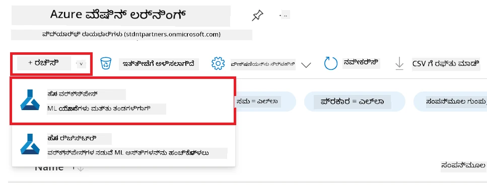

1. ಕೆಳಗಿನ ಕಾರ್ಯಗಳನ್ನು ನಿರ್ವಹಿಸಿ:

    - ನಿಮ್ಮ ಅಜುರ್ **Subscription** ಅನ್ನು ಆಯ್ಕೆಮಾಡಿ.
    - ಬಳಸಬೇಕಾದ **Resource group** ಅನ್ನು ಆಯ್ಕೆಮಾಡಿ (ಅವಶ್ಯಕವಿದ್ದರೆ ಹೊಸದನ್ನು ರಚಿಸಿ).
    - **Workspace Name** ನಮೂದಿಸಿ. ಇದು ವಿಶಿಷ್ಟ ಮೌಲ್ಯವಾಗಿರಬೇಕು.
    - ಬಳಸಬೇಕಾದ **Region** ಅನ್ನು ಆಯ್ಕೆಮಾಡಿ.
    - ಬಳಸಬೇಕಾದ **Storage account** ಅನ್ನು ಆಯ್ಕೆಮಾಡಿ (ಅವಶ್ಯಕವಿದ್ದರೆ ಹೊಸದನ್ನು ರಚಿಸಿ).
    - ಬಳಸಬೇಕಾದ **Key vault** ಅನ್ನು ಆಯ್ಕೆಮಾಡಿ (ಅವಶ್ಯಕವಿದ್ದರೆ ಹೊಸದನ್ನು ರಚಿಸಿ).
    - ಬಳಸಬೇಕಾದ **Application insights** ಅನ್ನು ಆಯ್ಕೆಮಾಡಿ (ಅವಶ್ಯಕವಿದ್ದರೆ ಹೊಸದನ್ನು ರಚಿಸಿ).
    - ಬಳಸಬೇಕಾದ **Container registry** ಅನ್ನು ಆಯ್ಕೆಮಾಡಿ (ಅವಶ್ಯಕವಿದ್ದರೆ ಹೊಸದನ್ನು ರಚಿಸಿ).

    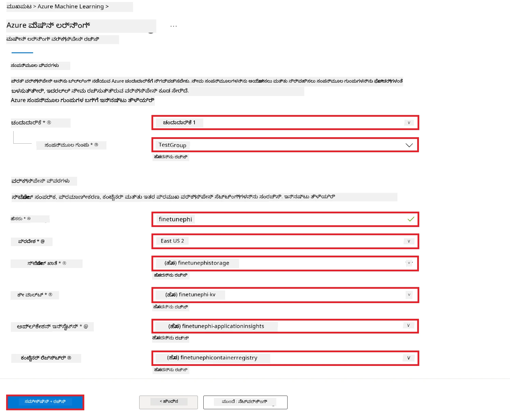

1. **Review + Create** ಆಯ್ಕೆಮಾಡಿ.

1. **Create** ಆಯ್ಕೆಮಾಡಿ.

### ಅಜುರ್ ಚಂದಾದಾರಿಕೆಯಲ್ಲಿ GPU ಕ್ವೋಟಾ ವಿನಂತಿಸಿ

ಈ E2E ಮಾದರಿಯಲ್ಲಿ, ಫೈನ್-ಟ್ಯೂನಿಂಗ್‌ಗೆ *Standard_NC24ads_A100_v4 GPU* ಬಳಸಲಾಗುತ್ತದೆ, ಇದಕ್ಕೆ ಕ್ವೋಟಾ ವಿನಂತಿಯ ಅಗತ್ಯವಿದೆ, ಮತ್ತು ನಿಯೋಜನಿಗಾಗಿ *Standard_E4s_v3* CPU ಬಳಸಲಾಗುತ್ತದೆ, ಇದಕ್ಕೆ ಕ್ವೋಟಾ ವಿನಂತಿಯ ಅಗತ್ಯವಿಲ್ಲ.

> [!NOTE]
>
> ಕೇವಲ ಪೇ-ಆಸ್-ಯು-ಗೋ (Pay-As-You-Go) ಚಂದಾದಾರಿಗಳು (ಪ್ರಮಾಣಿತ ಚಂದಾದಾರಿ ಪ್ರಕಾರ) ಗೆ ಮಾತ್ರ GPU ಹಂಚಿಕೆಗೆ ಅರ್ಹತೆ ಇದೆ; ಲಾಭ ಚಂದಾದಾರಿಗಳು ಪ್ರಸ್ತುತ ಬೆಂಬಲಿಸಲ್ಪಟ್ಟಿಲ್ಲ.
>
> ಲಾಭ ಚಂದಾದಾರಿಗಳು (ಉದಾಹರಣೆಗೆ Visual Studio Enterprise Subscription) ಬಳಸುವವರು ಅಥವಾ ಫೈನ್-ಟ್ಯೂನಿಂಗ್ ಮತ್ತು ನಿಯೋಜನಾ ಪ್ರಕ್ರಿಯೆಯನ್ನು ಶೀಘ್ರವಾಗಿ ಪರೀಕ್ಷಿಸಲು ಬಯಸುವವರು CPU ಉಪಯೋಗಿಸಿ ಕನಿಷ್ಠ ಡೇಟಾಸೆಟ್‌ನೊಂದಿಗೆ ಫೈನ್-ಟ್ಯೂನಿಂಗ್ ಮಾಡಲು ಈ ಪಾಠ ಸಹ ಮಾರ್ಗದರ್ಶನ ಒದಗಿಸುತ್ತದೆ. ಆದಾಗ್ಯೂ, ದೊಡ್ಡ ಡೇಟಾಸೆಟ್‌ಗಳನ್ನು ಬಳಸುವಾಗ GPU ಉಪಯೋಗಿಸಿದಾಗ ಫೈನ್-ಟ್ಯೂನಿಂಗ್ ಫಲಿತಾಂಶಗಳು ಬಹು ಮಟ್ಟಿಗೆ ಉತ್ತಮವಾಗಿರುತ್ತವೆ.

1. [Azure ML Studio](https://ml.azure.com/home?wt.mc_id=studentamb_279723) ತೆರೆಯಾಗಿರಿ.

1. *Standard NCADSA100v4 Family* ಕ್ವೋಟಾ ವಿನಂತಿಸಲು ಕೆಳಗಿನ ಕಾರ್ಯಗಳನ್ನು ನಿರ್ವಹಿಸಿ:

    - ಎಡ ಬದಿಯ ಟ್ಯಾಬ್‌ನಿಂದ **Quota** ಆಯ್ಕೆಮಾಡಿ.
    - ಬಳಸಬೇಕಾದ **Virtual machine family** ಆಯ್ಕೆಮಾಡಿ. ಉದಾಹರಣೆಗೆ, *Standard NCADSA100v4 Family Cluster Dedicated vCPUs* ಅನ್ನು ಆಯ್ಕೆಮಾಡಿ, ಇದು *Standard_NC24ads_A100_v4* GPU ಅನ್ನು ಒಳಗೊಂಡಿದೆ.
    - ನ್ಯಾವಿಗೇಶನ್ ಮெனುದಿಂದ **Request quota** ಆಯ್ಕೆಮಾಡಿ.

        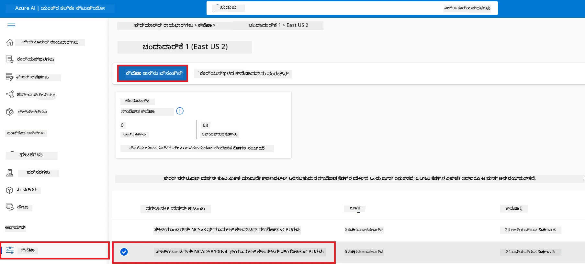

    - Request quota ಪುಟದೊಳಗೆ ನೀವು ಬಳಸಲು ಬಯಸುವ **New cores limit** ನಮೂದಿಸಿ. ಉದಾಹರಣೆಗೆ, 24.
    - Request quota ಪುಟದಲ್ಲಿ **Submit** ಆಯ್ಕೆಮಾಡಿ GPU ಕ್ವೋಟಾಗಾಗಿ ವಿನಂತಿಸಲು.

> [!NOTE]
> ನಿಮ್ಮ ಅಗತ್ಯಗಳಿಗೆ ತಕ್ಕಂತೆ GPU ಅಥವಾ CPU ಆಯ್ಕೆ ಮಾಡಲು [Sizes for Virtual Machines in Azure](https://learn.microsoft.com/azure/virtual-machines/sizes/overview?tabs=breakdownseries%2Cgeneralsizelist%2Ccomputesizelist%2Cmemorysizelist%2Cstoragesizelist%2Cgpusizelist%2Cfpgasizelist%2Chpcsizelist) ದಾಖಲೆಯನ್ನು ಗುರುತಿಸಿ.

### ಪಾತ್ರ ನಿಯೋಜನೆ ಸೇರಿಸಿ

ನೀವು ನಿಮ್ಮ ಮಾದರಿಗಳನ್ನು ಫೈನ್-ಟ್ಯೂನ್ ಮತ್ತು ನಿಯೋಜಿಸಲು ಮೊದಲು ಬಳಕೆದಾರ ನಿಯೋಜಿತ ನಿರ್ವಹಿತ ಗುರುತಿಸಿಕೊಂಡಿಕೆ (User Assigned Managed Identity - UAI) ರಚಿಸಿ ಮತ್ತು ಅದಕ್ಕೆ ಸೂಕ್ತ ಅನುಮತಿಗಳನ್ನು ನೀಡಬೇಕು. ನಿಯೋಜನೆಯ ಸಂದರ್ಭದಲ್ಲಿ ಈ UAI ಪ್ರಮಾಣೀಕರಣಕ್ಕಾಗಿ ಬಳಸಲಾಗುತ್ತದೆ.

#### ಬಳಕೆದಾರ ನಿಯೋಜಿತ ನಿರ್ವಹಿತ ಗುರುತಿಸಿಕೊಂಡಿಕೆ (UAI) ರಚಿಸಿ

1. ಪೋರ್ಟಲ್ ಪುಟದ ಮೇಲ್ಭಾಗದಲ್ಲಿನ **ಶೋಧನೆ ಬಾರ್**ನಲ್ಲಿ *managed identities* ಅನ್ನು ಟೈಪ್ ಮಾಡಿ ಮತ್ತು ಕಾಣುವ ಆಯ್ಕೆಯಿಂದ **Managed Identities** ಆಯ್ಕೆಮಾಡಿ.

    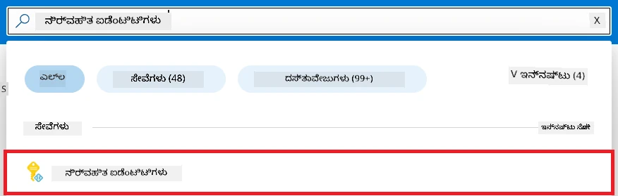

1. **+ Create** ಆಯ್ಕೆಮಾಡಿ.

    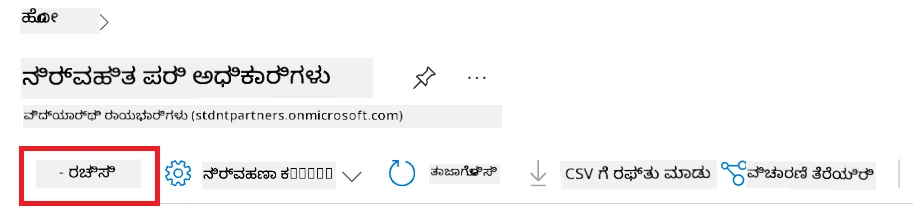

1. ಕೆಳಗಿನ ಕಾರ್ಯಗಳನ್ನು ನಿರ್ವಹಿಸಿ:

    - ನಿಮ್ಮ ಅಜುರ್ **Subscription** ಆಯ್ಕೆಮಾಡಿ.
    - ಬಳಸಬೇಕಾದ **Resource group** ಆಯ್ಕೆಮಾಡಿ (ಅವಶ್ಯಕವಿದ್ದರೆ ಹೊಸದನ್ನು ರಚಿಸಿ).
    - ಬಳಸಬೇಕಾದ **Region** ಆಯ್ಕೆಮಾಡಿ.
    - **Name** ನಮೂದಿಸಿ. ಇದು ವಿಶಿಷ್ಟವಾಗಿರಬೇಕು.

1. **Review + create** ಆಯ್ಕೆಮಾಡಿ.

1. **+ Create** ಆಯ್ಕೆಮಾಡಿ.

#### ನಿರ್ವಹಿತ ಗುರುತಿಸಿಕೊಂಡಿಕೆಗೆ ಮೂಲಭೂತ ಪಾತ್ರ ಹಂಚಿಕೆ ಸೇರಿಸಿ

1. ನೀವು ರಚಿಸಿದ ನಿರ್ವಹಿತ ಗುರುತಿಸಿಕೊಂಡಿಕೆ ಸಂಪನ್ಮೂಲಕ್ಕೆ ನಾವಿಗೇಟ್ ಮಾಡಿ.

1. ಎಡಬದಿ ಟ್ಯಾಬ್‌ನಿಂದ **Azure role assignments** ಆಯ್ಕೆಮಾಡಿ.

1. ನ್ಯಾವಿಗೇಶನ್ ಮෙනುದಿಂದ **+Add role assignment** ಆಯ್ಕೆಮಾಡಿ.

1. Add role assignment ಪುಟದಲ್ಲಿ ಕೆಳಗಿನ ಕಾರ್ಯಗಳನ್ನು ನಿರ್ವಹಿಸಿ:
    - **Scope**ಗೆ **Resource group** ಆಯ್ಕೆಮಾಡಿ.
    - ನಿಮ್ಮ ಅಜುರ್ **Subscription** ಆಯ್ಕೆಮಾಡಿ.
    - ಬಳಸಬೇಕಾದ **Resource group** ಆಯ್ಕೆಮಾಡಿ.
    - **Role**ಗೆ **Contributor** ಆಯ್ಕೆಮಾಡಿ.

    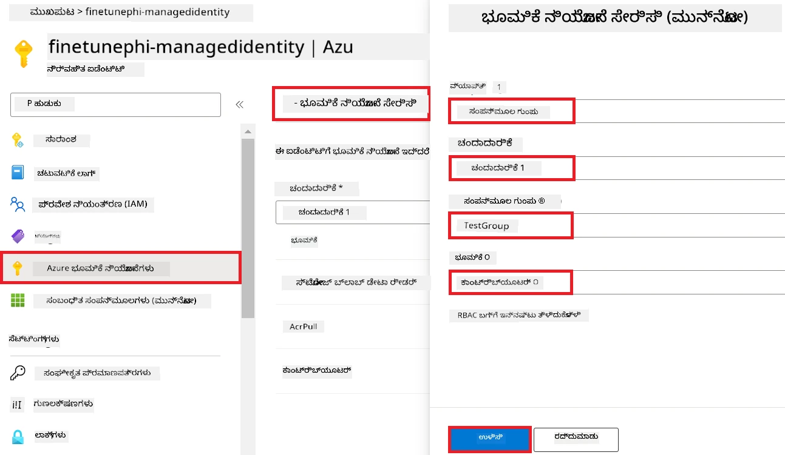

1. **Save** ಆಯ್ಕೆಮಾಡಿ.

#### ನಿರ್ವಹಿತ ಗುರುತಿಸಿಕೊಂಡಿಕೆಗೆ ಸ್ಟೋರೇಜ್ ಬ್ಲಾಬ್ ಡೇಟಾ ರೀಡರ್ ಪಾತ್ರ ಹಂಚಿಕೆ ಸೇರಿಸಿ

1. ಪೋರ್ಟಲ್ ಪುಟದ ಮೇಲ್ಭಾಗದಲ್ಲಿನ **search bar**ನಲ್ಲಿ *storage accounts* ಟೈಪ್ ಮಾಡಿ ಮತ್ತು ಕಾಣುವ ಆಯ್ಕೆಯಿಂದ **Storage accounts** ಆಯ್ಕೆಮಾಡಿ.

    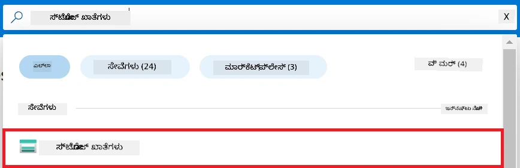

1. ನೀವು ರಚಿಸಿದ ಅಜುರ್ ಮೆಷಿನ್ ಲರ್ನಿಂಗ್ ವರ್ಕ್‌ಸ್ಪೇಸ್‌ಗೆ ಸಂಬಂಧಿಸಿದ ಸ್ಟೋರೇಜ್ ಖಾತೆಯನ್ನು ಆಯ್ಕೆಮಾಡಿ. ಉದಾಹರಣೆಗೆ, *finetunephistorage*.

1. Add role assignment ಪುಟಕ್ಕೆ ನವಿಗೇಟ್ ಮಾಡಲು ಕೆಳಗಿನ ಕೆಲಸಗಳನ್ನು ಮಾಡಿ:

    - ನೀವು ರಚಿಸಿದ ಅಜುರ್ ಸ್ಟೋರೇಜ್ ಖಾತೆ ಗೆ ನವಿಗೇಟ್ ಮಾಡಿ.
    - ಎಡಬದಿ ಟ್ಯಾಬ್‌ನಿಂದ **Access Control (IAM)** ಆಯ್ಕೆಮಾಡಿ.
    - ನ್ಯಾವಿಗೇಶನ್ ಮெனುದಿಂದ **+ Add** ಆಯ್ಕೆಮಾಡಿ.
    - ನ್ಯಾವಿಗೇಶನ್ ಮෙනುದಿಂದ **Add role assignment** ಆಯ್ಕೆಮಾಡಿ.

    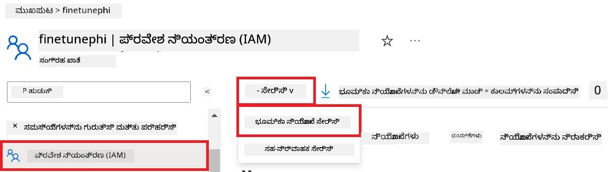

1. Add role assignment ಪುಟದಲ್ಲಿ ಕೆಳಗಿನ ಕಾರ್ಯಗಳನ್ನು ನಿರ್ವಹಿಸಿ:

    - Role ಪುಟದಲ್ಲಿ **search bar**ನಲ್ಲಿ *Storage Blob Data Reader* ಟೈಪ್ ಮಾಡಿ ಮತ್ತು ತೋರಿಸಿದ ಆಯ್ಕೆಗಳಲ್ಲಿ **Storage Blob Data Reader** ಆಯ್ಕೆಮಾಡಿ.
    - Role ಪುಟದಲ್ಲಿ **Next** ಆಯ್ಕೆಮಾಡಿ.
    - Members ಪುಟದಲ್ಲಿ **Assign access to**ಗೆ **Managed identity** ಆಯ್ಕೆಮಾಡಿ.
    - Members ಪುಟದಲ್ಲಿ **+ Select members** ಆಯ್ಕೆಮಾಡಿ.
    - Select managed identities ಪುಟದಲ್ಲಿ ನಿಮ್ಮ ಅಜುರ್ **Subscription** ಆಯ್ಕೆಮಾಡಿ.
    - Select managed identities ಪುಟದಲ್ಲಿ **Managed identity**ಗೆ **Manage Identity** ಆಯ್ಕೆಮಾಡಿ.
    - Select managed identities ಪುಟದಲ್ಲಿ ನೀವು ರಚಿಸಿದ Manage Identity ಆಯ್ಕೆಮಾಡಿ. ಉದಾಹರಣೆಗೆ, *finetunephi-managedidentity*.
    - Select managed identities ಪುಟದಲ್ಲಿ **Select** ಆಯ್ಕೆಮಾಡಿ.

    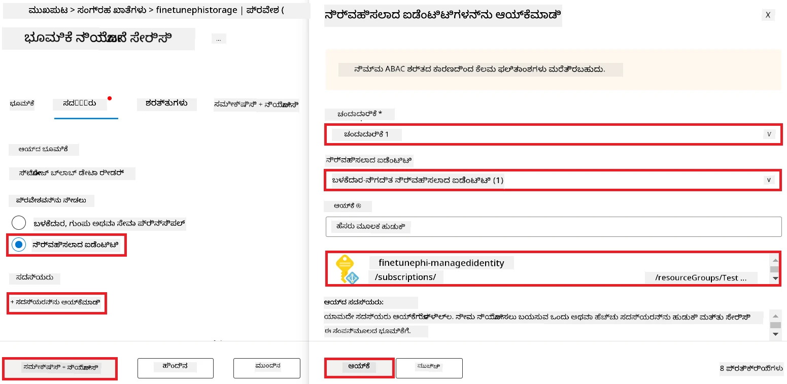

1. **Review + assign** ಆಯ್ಕೆಮಾಡಿ.

#### ನಿರ್ವಹಿತ ಗುರುತಿಸಿಕೊಂಡಿಕೆಗೆ AcrPull ಪಾತ್ರ ಹಂಚಿಕೆ ಸೇರಿಸಿ

1. ಪೋರ್ಟಲ್ ಪುಟದ ಮೇಲ್ಭಾಗದಲ್ಲಿ **search bar**ನಲ್ಲಿ *container registries* ಟೈಪ್ ಮಾಡಿ ಮತ್ತು ಕಾಣುವ ಆಯ್ಕೆಗಳಿಂದ **Container registries** ಆಯ್ಕೆಮಾಡಿ.

    

1. ಅಜುರ್ ಮೆಷಿನ್ ಲರ್ನಿಂಗ್ ವರ್ಕ್‌ಸ್ಪೇಸ್‌ಗೆ ಸಂಬಂಧಿಸಿದ ಕಂಟೈನರ್ ರಜಿಸ್ಟ್ರಿಯನ್ನು ಆಯ್ಕೆಮಾಡಿ. ಉದಾಹರಣೆಗೆ, *finetunephicontainerregistries*

1. Add role assignment ಪುಟಕ್ಕೆ ನವಿಗೇಟ್ ಮಾಡಲು ಕೆಳಗಿನ ಕಾರ್ಯಗಳನ್ನು ಮಾಡಿ:

    - ಎಡಬದಿ ಟ್ಯಾಬ್‌ನಿಂದ **Access Control (IAM)** ಆಯ್ಕೆಮಾಡಿ.
    - ನ್ಯಾವಿಗೇಶನ್ ಮெனುದಿಂದ **+ Add** ಆಯ್ಕೆಮಾಡಿ.
    - ನ್ಯಾವಿಗೇಶನ್ ಮெனುದಿಂದ **Add role assignment** ಆಯ್ಕೆಮಾಡಿ.

1. Add role assignment ಪುಟದಲ್ಲಿ ಕೆಳಗಿನ ಕಾರ್ಯಗಳನ್ನು ಮಾಡಿ:

    - Role ಪುಟದಲ್ಲಿ **search bar**ನಲ್ಲಿ *AcrPull* ಟೈಪ್ ಮಾಡಿ ಮತ್ತು ತೋರಿದ ಆಯ್ಕೆಗಳಲ್ಲಿ **AcrPull** ಆಯ್ಕೆಮಾಡಿ.
    - Role ಪುಟದಲ್ಲಿ **Next** ಆಯ್ಕೆಮಾಡಿ.
    - Members ಪುಟದಲ್ಲಿ **Assign access to**ಗೆ **Managed identity** ಆಯ್ಕೆಮಾಡಿ.
    - Members ಪುಟದಲ್ಲಿ **+ Select members** ಆಯ್ಕೆಮಾಡಿ.
    - Select managed identities ಪುಟದಲ್ಲಿ ನಿಮ್ಮ ಅಜುರ್ **Subscription** ಆಯ್ಕೆಮಾಡಿ.
    - Select managed identities ಪುಟದಲ್ಲಿ **Managed identity**ಗೆ **Manage Identity** ಆಯ್ಕೆಮಾಡಿ.
    - Select managed identities ಪುಟದಲ್ಲಿ ನೀವು ರಚಿಸಿದ Manage Identity ಆಯ್ಕೆಮಾಡಿ. ಉದಾಹರಣೆಗೆ, *finetunephi-managedidentity*.
    - Select managed identities ಪುಟದಲ್ಲಿ **Select** ಆಯ್ಕೆಮಾಡಿ.
    - **Review + assign** ಆಯ್ಕೆಮಾಡಿ.

### ಪ್ರಾಜೆಕ್ಟ್ ಸಜ್ಜುಗೊಳಿಸಿ

ಈಗ, ನೀವು ಕೆಲಸ ಮಾಡಲು ಫೋಲ್ಡರ್ ರಚಿಸಿ, ಬಳಕೆದಾರರೊಂದಿಗೆ ಸಂವಹನ ಮಾಡಲು ಮತ್ತು ಅಜುರ್ ಕೋಸ್ಮೋಸ್ DB ನಲ್ಲಿರುವ ಸಂವಾದ ಇತಿಹಾಸವನ್ನು ಉಪಯೋಗಿಸಿ ಉತ್ತರವನ್ನುವೂ ನೀಡುವ ಕಾರ್ಯಕ್ರಮವನ್ನು ಅಭಿವೃದ್ಧಿಪಡಿಸುವ ವರ್ಚುವಲ್ ಎನ್ವಯರನ್ಮೆಂಟ್ ಸಜ್ಜುಗೊಳಿಸುವетесь.

#### ಅದರೊಳಗೆ ಕಾರ್ಯನಿರ್ವಹಿಸಲು ಫೋಲ್ಡರ್ ರಚಿಸಿ

1. ಟರ್ಮಿನಲ್ ವಿಂಡೋ ತೆರೆಯಿರಿ ಮತ್ತು ಡೀಫಾಲ್ಟ್ ಪಾತದಲ್ಲಿ *finetune-phi* ಎಂಬ ಫೋಲ್ಡರ್ ರಚಿಸಲು ಕೆಳಗಿನ ಆಜ್ಞೆಯನ್ನು ಟೈಪ್ ಮಾಡಿ.

    ```console
    mkdir finetune-phi
    ```

1. ನೀವು ರಚಿಸಿದ *finetune-phi* ಫೋಲ್ಡರ್ಗೆ ನವಿಗೇಟ್ ಮಾಡಲು ಟರ್ಮಿನಲ್ ನಲ್ಲಿ ಕೆಳಗಿನ ಆಜ್ಞೆಯನ್ನು ಟೈಪ್ ಮಾಡಿ.

    ```console
    cd finetune-phi
    ```

#### ವರ್ಚುವಲ್ ಎನ್ವಯರನ್ಮೆಂಟ್ ರಚಿಸಿ

1. *.venv* ಎಂಬ ವರ್ಚುವಲ್ ಎನ್ವಯರನ್ಮೆಂಟ್ ರಚಿಸಲು ಟರ್ಮಿನಲ್ ನಲ್ಲಿ ಕೆಳಗಿನ ಆಜ್ಞೆಯನ್ನು ಟೈಪ್ ಮಾಡಿ.

    ```console
    python -m venv .venv
    ```

1. ವರ್ಚುವಲ್ ಎನ್ವಯರನ್ಮೆಂಟ್ ಆಟಿವೇಟ್ ಮಾಡಲು ಟರ್ಮಿನಲ್‌ನಲ್ಲಿ ಕೆಳಗಿನ ಆಜ್ಞೆಯನ್ನು ಟೈಪ್ ಮಾಡಿ.

    ```console
    .venv\Scripts\activate.bat
    ```

> [!NOTE]
>
> ಇದು ಯಶಸ್ವಿಯಾಗಿದ್ದರೆ, ಕಮ್ಯಾಂಡ್ ಪ್ರಾಂಪ್ಟ್ ಮುಂದೆ *(.venv)* ಕಾಣಿಸಿಕೊಳ್ಳುತ್ತದೆ.

#### ಅಗತ್ಯ ಪ್ಯಾಕೇಜ್‌ಗಳನ್ನು ಸ್ಥಾಪಿಸಿ

1. ಅಗತ್ಯಪಡುವ ಪ್ಯಾಕೇಜ್‌ಗಳನ್ನು ಸ್ಥಾಪಿಸಲು ಟರ್ಮಿನಲ್‌ನಲ್ಲಿ ಕೆಳಗಿನ ಆಜ್ಞೆಗಳನ್ನು ಟೈಪ್ ಮಾಡಿ.

    ```console
    pip install datasets==2.19.1
    pip install transformers==4.41.1
    pip install azure-ai-ml==1.16.0
    pip install torch==2.3.1
    pip install trl==0.9.4
    pip install promptflow==1.12.0
    ```

#### ಪ್ರಾಜೆಕ್ಟ್ ಫೈಲ್‌ಗಳನ್ನು ರಚಿಸಿ
ಈ ವ್ಯಾಯಾಮದಲ್ಲಿ, ನೀವು ನಮ್ಮ ಯೋಜನೆಗಾಗಿ ಅಗತ್ಯವಿರುವ ಕಡತಗಳನ್ನು ಸೃಷ್ಟಿಸುವಿರಿ. ಈ ಕಡತಗಳಲ್ಲಿ ಡೇಟಾಸೆಟ್ ಡೌನ್‌ಲೋಡ್ ಮಾಡುವುದು, ಅಜೂರ್ ಮಶಿನ್ ಲರ್ನಿಂಗ್ ಪರಿಸರವನ್ನುಕ್ಷಣಗೊಳಿಸುವುದು, Phi-3 ಮಾದರಿಯನ್ನು ಸೂಕ್ಷ್ಮೀಕರಿಸುವುದು ಮತ್ತು ಸೂಕ್ಷ್ಮೀಕರಿಸಿದ ಮಾದರಿಯನ್ನು ನಿಯೋಜಿಸುವ ಸ್ಕ್ರಿಪ್ಟ್‌ಗಳಿದೆ. ನೀವು ಸೂಕ್ಷ್ಮೀಕರಣ ವ್ಯವಸ್ಥೆಯನ್ನು ಸೆಟ್‌ಅಪ್ ಮಾಡಲು *conda.yml* ಕಡತವನ್ನೂ ಸೃಷ್ಟಿಸುತ್ತೀರಿ.

ಈ ವ್ಯಾಯಾಮದಲ್ಲಿ ನೀವು:

- ಡೇಟಾಸೆಟ್‌ನ್ನು ಡೌನ್‌ಲೋಡ್ ಮಾಡಲು *download_dataset.py* ಫೈಲ್ ಸೃಷ್ಟಿಸಿ.
- ಅಜೂರ್ ಮಶಿನ್ ಲರ್ನಿಂಗ್ ಪರಿಸರವನ್ನು ಸೆಟ್‌ಅಪ್ ಮಾಡಲು *setup_ml.py* ಫೈಲ್ ಸೃಷ್ಟಿಸಿ.
- ಡೇಟಾಸೆಟ್ನ್ನು ಬಳಸಿಕೊಂಡು Phi-3 ಮಾದರಿಯನ್ನು ಸೂಕ್ಷ್ಮೀಕರಿಸಲು *finetuning_dir* ಫೋಲ್ಡರ್‌ನ *fine_tune.py* ಫೈಲ್ ಸೃಷ್ಟಿಸಿ.
- ಸೂಕ್ಷ್ಮೀಕರಣ ಪರಿಸರವನ್ನು ಸೆಟ್‌ಅಪ್ ಮಾಡಲು *conda.yml* ಫೈಲ್ ಸೃಷ್ಟಿಸಿ.
- ಸೂಕ್ಷ್ಮೀಕರಿಸಿದ ಮಾದರಿಯನ್ನು ನಿಯೋಜಿಸಲು *deploy_model.py* ಫೈಲ್ ಸೃಷ್ಟಿಸಿ.
- ಸೂಕ್ಷ್ಮೀಕರಿಸಿದ ಮಾದರಿಯನ್ನು Prompt flow ಮೂಲಕ ಸಂಯೋಜಿಸಿ ಮತ್ತು ಕಾರ್ಯಗತಗೊಳಿಸಲು *integrate_with_promptflow.py* ಫೈಲ್ ಸೃಷ್ಟಿಸಿ.
- Prompt flowಗೆ ಕೆಲಸದ ಧಾರೆ (workflow) ರಚನೆಗಾಗಿ flow.dag.yml ಫೈಲ್ ಸೃಷ್ಟಿಸಿ.
- ಅಜೂರ್ ಮಾಹಿತಿ ನಮೂದಿಸಲು *config.py* ಫೈಲ್ ಸೃಷ್ಟಿಸಿ.

> [!NOTE]
>
> ಸಂಪೂರ್ಣ ಫೋಲ್ಡರ್ ರಚನೆ:
>
> ```text
> └── YourUserName
> .    └── finetune-phi
> .        ├── finetuning_dir
> .        │      └── fine_tune.py
> .        ├── conda.yml
> .        ├── config.py
> .        ├── deploy_model.py
> .        ├── download_dataset.py
> .        ├── flow.dag.yml
> .        ├── integrate_with_promptflow.py
> .        └── setup_ml.py
> ```

1. **Visual Studio Code** ಅನ್ನು ತೆರೆಯಿರಿ.

1. ಮೆನು ಬಾರ್‌ನಿಂದ **File** ಆಯ್ಕೆಮಾಡಿ.

1. **Open Folder** ಆಯ್ಕೆಮಾಡಿ.

1. ನೀವು ಸೃಷ್ಟಿಸಿದ *finetune-phi* ಫೋಲ್ಡರ್ ಆಯ್ಕೆಮಾಡಿ, ಇದು *C:\Users\yourUserName\finetune-phi* ನಲ್ಲಿ ಇದೆ.

    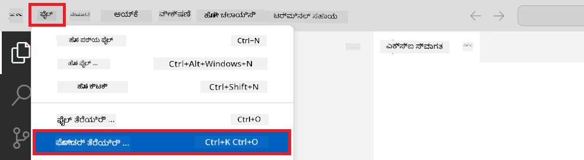

1. Visual Studio Code ನ ಎಡ ಪ್ಯಾನೆಲ್‌ನಲ್ಲಿ, ರೈಟ್ ಕ್ಲಿಕ್ ಮಾಡಿ ಮತ್ತು **New File** ಆಯ್ಕೆಮಾಡಿ, ನಂತರ *download_dataset.py* ಎಂಬ ಹೊಸ ಫೈಲ್ ಸೃಷ್ಟಿಸಿ.

1. Visual Studio Code ನ ಎಡ ಪ್ಯಾನೆಲ್‌ನಲ್ಲಿ, ರೈಟ್ ಕ್ಲಿಕ್ ಮಾಡಿ ಮತ್ತು **New File** ಆಯ್ಕೆಮಾಡಿ, ನಂತರ *setup_ml.py* ಎಂಬ ಹೊಸ ಫೈಲ್ ಸೃಷ್ಟಿಸಿ.

1. Visual Studio Code ನ ಎಡ ಪ್ಯಾನೆಲ್‌ನಲ್ಲಿ, ರೈಟ್ ಕ್ಲಿಕ್ ಮಾಡಿ ಮತ್ತು **New File** ಆಯ್ಕೆಮಾಡಿ, ನಂತರ *deploy_model.py* ಎಂಬ ಹೊಸ ಫೈಲ್ ಸೃಷ್ಟಿಸಿ.

    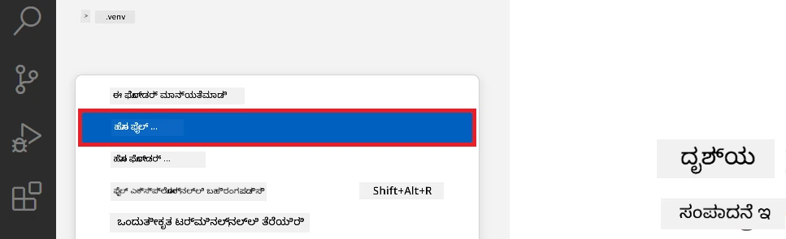

1. Visual Studio Code ನ ಎಡ ಪ್ಯಾನೆಲ್‌ನಲ್ಲಿ, ರೈಟ್ ಕ್ಲಿಕ್ ಮಾಡಿ ಮತ್ತು **New Folder** ಆಯ್ಕೆಮಾಡಿ, ನಂತರ *finetuning_dir* ಎಂಬ ಹೊಸ ಫೋಲ್ಡರ್ ಸೃಷ್ಟಿಸಿ.

1. *finetuning_dir* ಫೋಲ್ಡರ್‌ನಲ್ಲಿ, *fine_tune.py* ಎಂಬ ಹೊಸ ಫೈಲ್ ಸೃಷ್ಟಿಸಿ.

#### *conda.yml* ಫೈಲ್ ಸೃಷ್ಟಿಸಿ ಮತ್ತು ಸಂರಚಿಸಿ

1. Visual Studio Code ನ ಎಡ ಪ್ಯಾನೆಲ್‌ನಲ್ಲಿ, ರೈಟ್ ಕ್ಲಿಕ್ ಮಾಡಿ ಮತ್ತು **New File** ಆಯ್ಕೆಮಾಡಿ, ನಂತರ *conda.yml* ಎಂಬ ಫೈಲ್ ಸೃಷ್ಟಿಸಿ.

1. Phi-3 ಮಾದರಿಗಾಗಿ ಸೂಕ್ಷ್ಮೀಕರಣ ಪರಿಸರವನ್ನು ಸೆಟ್‌ಅಪ್ ಮಾಡಲು ಕೆಳಗಿನ ಕೋಡ್ ಅನ್ನು *conda.yml* ಫೈಲ್‌ಗೆ ಸೇರಿಸಿ.

    ```yml
    name: phi-3-training-env
    channels:
      - defaults
      - conda-forge
    dependencies:
      - python=3.10
      - pip
      - numpy<2.0
      - pip:
          - torch==2.4.0
          - torchvision==0.19.0
          - trl==0.8.6
          - transformers==4.41
          - datasets==2.21.0
          - azureml-core==1.57.0
          - azure-storage-blob==12.19.0
          - azure-ai-ml==1.16
          - azure-identity==1.17.1
          - accelerate==0.33.0
          - mlflow==2.15.1
          - azureml-mlflow==1.57.0
    ```

#### *config.py* ಫೈಲ್ ಸೃಷ್ಟಿಸಿ ಮತ್ತು ಸಂರಚಿಸಿ

1. Visual Studio Code ನ ಎಡ ಪ್ಯಾನೆಲ್‌ನಲ್ಲಿ, ರೈಟ್ ಕ್ಲಿಕ್ ಮಾಡಿ ಮತ್ತು **New File** ಆಯ್ಕೆಮಾಡಿ, ನಂತರ *config.py* ಎಂಬ ಫೈಲ್ ಸೃಷ್ಟಿಸಿ.

1. ನಿಮ್ಮ ಅಜೂರ್ ಮಾಹಿತಿಯನ್ನು ಸೇರಿಸಲು ಕೆಳಗಿನ ಕೋಡ್ ಅನ್ನು *config.py* ಫೈಲ್‌ಗೆ ಸೇರಿಸಿ.

    ```python
    # ಅಜೂರ್ ಸೆಟ್ಟಿಂಗ್ಸ್
    AZURE_SUBSCRIPTION_ID = "your_subscription_id"
    AZURE_RESOURCE_GROUP_NAME = "your_resource_group_name" # "ಟೆಸ್ಟ್‌ಗ್ರೂಪ್"

    # ಅಜೂರ್ ಮಷೀನ್ ಲರ್ನಿಂಗ್ ಸೆಟ್ಟಿಂಗ್ಸ್
    AZURE_ML_WORKSPACE_NAME = "your_workspace_name" # "ಫೈನಿಟ್ಯೂನ್‌ಫಿ-ವರක්‌ಸ್ಪೇಸ್"

    # ಅಜೂರ್ ಮೇನೇಜ್ಡ್ ಐಡೆಂಟಿಟಿ ಸೆಟ್ಟಿಂಗ್ಸ್
    AZURE_MANAGED_IDENTITY_CLIENT_ID = "your_azure_managed_identity_client_id"
    AZURE_MANAGED_IDENTITY_NAME = "your_azure_managed_identity_name" # "ಫೈನಿಟ್ಯೂನ್‌ಫಿ-ಮೇನೇಜ್ಡ್‌ಐಡೆಂಟಿಟಿ"
    AZURE_MANAGED_IDENTITY_RESOURCE_ID = f"/subscriptions/{AZURE_SUBSCRIPTION_ID}/resourceGroups/{AZURE_RESOURCE_GROUP_NAME}/providers/Microsoft.ManagedIdentity/userAssignedIdentities/{AZURE_MANAGED_IDENTITY_NAME}"

    # ಡೇಟಾಸೆಟ್ ಫೈಲ್ ಮಾರ್ಗಗಳು
    TRAIN_DATA_PATH = "data/train_data.jsonl"
    TEST_DATA_PATH = "data/test_data.jsonl"

    # ಫೈನ್-ಟ್ಯೂನ್ ಮಾಡಲಾದ ಮಾದರಿ ಸೆಟ್ಟಿಂಗ್ಸ್
    AZURE_MODEL_NAME = "your_fine_tuned_model_name" # "ಫೈನಿಟ್ಯೂನ್-ಫಿ-ಮಾದರಿ"
    AZURE_ENDPOINT_NAME = "your_fine_tuned_model_endpoint_name" # "ಫೈನಿಟ್ಯೂನ್-ಫಿ-ಎಂಡ್‌ಪಾಯಿಂಟ್"
    AZURE_DEPLOYMENT_NAME = "your_fine_tuned_model_deployment_name" # "ಫೈನಿಟ್ಯೂನ್-ಫಿ-ಡಿಪ್ಲಾಯ್‌ಮೆಂಟ್"

    AZURE_ML_API_KEY = "your_fine_tuned_model_api_key"
    AZURE_ML_ENDPOINT = "your_fine_tuned_model_endpoint_uri" # "https://{ನಿಮ್ಮ-ಎಂಡ್‌ಪಾಯಿಂಟ್-ಹೆಸರು}.{ನಿಮ್ಮ-ಪ್ರದೇಶ}.inference.ml.azure.com/ಸ್ಕೋರ್"
    ```

#### ಅಜೂರ್ ಪರಿಸರಚರಗಳು ಸೇರಿಸಿ

1. ಅಜೂರ್ ನೋಂದಣಿ (Subscription) ID ಸೇರಿಸಲು ಅನುಸರಿಸಬೇಕಾದ ಹಂತಗಳು:

    - ಪೋರ್ಟಲ್ ಪುಟದ ಮೇಲ್ಭಾಗದ **search bar** ನಲ್ಲಿ *subscriptions* ಅನ್ನು ಟಾಕ್ ಮಾಡಿ ಮತ್ತು ಬರುತ್ತಿರುವ ಆಯ್ಕೆಯಿಂದ **Subscriptions** ಆಯ್ಕೆಮಾಡಿ.
    - ನೀವು ಪ್ರಸ್ತುತ ಬಳಕೆ ಮಾಡುತ್ತಿರುವ ಅಜೂರ್ Subscription ಆಯ್ಕೆಮಾಡಿ.
    - ನಿಮ್ಮ Subscription ID ಅನ್ನು *config.py* ಫೈಲ್‌ಗೆ ನಕಲಿಸಿ.

    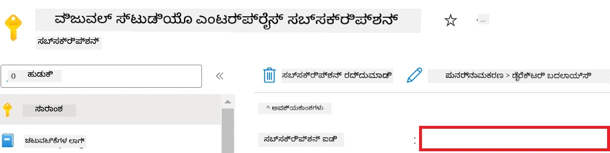

1. ಅಜೂರ್ ವರ್ಕ್‌ಸ್ಪೇಸ್ ಹೆಸರನ್ನು ಸೇರಿಸಲು:

    - ನೀವು ಸೃಷ್ಟಿಸಿದ ಅಜೂರ್ ಮಶಿನ್ ಲರ್ನಿಂಗ್ ಸ蜜ಸಾಧನಕ್ಕೆ ಹೋಗಿ.
    - ನಿಮ್ಮ ಅಕೌಂಟ್ ಹೆಸರನ್ನು *config.py* ಗೆ ನಕಲಿಸಿ.

    

1. ಅಜೂರ್ ರಿಸೋರ್ಸ್ ಗ್ರೂಪ್ ಹೆಸರು ಸೇರಿಸಲು:

    - ನೀವು ಸೃಷ್ಟಿಸಿದ ಅಜೂರ್ ಮಶಿನ್ ಲರ್ನಿಂಗ್ ಸ蜜ಸಾಧನಕ್ಕೆ ಹೋಗಿ.
    - ನಿಮ್ಮ ಅಜೂರ್ ರಿಸೋರ್ಸ್ ಗ್ರೂಪ್ ಹೆಸರನ್ನು *config.py* ಗೆ ನಕಲಿಸಿ.

    

2. ಅಜೂರ್ ಮ್ಯಾನೇಜ್ಡ್ ಐಡಂಟಿಟಿ ಹೆಸರು ಸೇರಿಸಲು

    - ನೀವು ಸೃಷ್ಟಿಸಿದ ಮ್ಯಾನೇಜ್ಡ್ ಐಡಂಟಿಟೀಸ್ ಸ蜜ಸಾಧನಕ್ಕೆ ಹೋಗಿ.
    - ನಿಮ್ಮ ಅಜೂರ್ ಮ್ಯಾನೇಜ್ಡ್ ಐಡಂಟಿಟಿ ಎಂಬುದನ್ನು *config.py* ಗೆ ನಕಲಿಸಿ.

    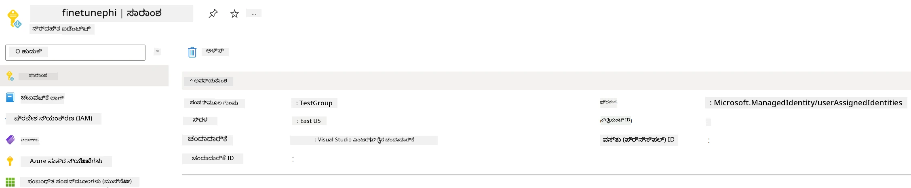

### ಸೂಕ್ಷ್ಮೀಕರಣಕ್ಕಾಗಿ ಡೇಟಾಸೆಟ್ ತಯಾರು ಮಾಡಿ

ಈ ವ್ಯಾಯಾಮದಲ್ಲಿ, ನೀವು *download_dataset.py* ಫೈಲ್ ಅನ್ನು ರನ್ ಮಾಡಿ *ULTRACHAT_200k* ಡೇಟಾಸೆಟ್‌ನ್ನು ನೀವು ಬಳಸದಿರುವ ಸ್ಥಳೀಯ ಪರಿಸರಕ್ಕೆ ಡೌನ್‌ಲೋಡ್ ಮಾಡುತ್ತೀರಿ. ನಂತರ, ಈ ಡೇಟಾಸೆಟ್ ಬಳಸಿ ಅಜೂರ್ ಮಶಿನ್ ಲರ್ನಿಂಗ್‌ನಲ್ಲಿ Phi-3 ಮಾದರಿಯನ್ನು ಸೂಕ್ಷ್ಮೀಕರಿಸುತ್ತೀರಿ.

#### *download_dataset.py* ಬಳಸಿ ಡೇಟಾಸೆಟ್ ಡೌನ್‌ಲೋಡ್ ಮಾಡಿ

1. Visual Studio Code ನಲ್ಲಿ *download_dataset.py* ಫೈಲ್ ತೆರೆಯಿರಿ.

1. ಕೆಳಗಿನ ಕೋಡ್ ಅನ್ನು *download_dataset.py* ಒಳಗೆ ಸೇರಿಸಿ.

    ```python
    import json
    import os
    from datasets import load_dataset
    from config import (
        TRAIN_DATA_PATH,
        TEST_DATA_PATH)

    def load_and_split_dataset(dataset_name, config_name, split_ratio):
        """
        Load and split a dataset.
        """
        # ನಿಶ್ಚಿತರಿಸಿದ ಹೆಸರು, ಸಂರಚನೆ ಮತ್ತು ವಿಭಜನೆ ಅನುಪಾತದೊಂದಿಗೆ ಡೇಟಾಸೆಟ್ ಅನ್ನು ಲೋಡ್ ಮಾಡಿ
        dataset = load_dataset(dataset_name, config_name, split=split_ratio)
        print(f"Original dataset size: {len(dataset)}")
        
        # ಡೇಟಾಸೆಟ್ ಅನ್ನು ತರಬೆತಿ ಮತ್ತು ಪರೀಕ್ಷಾ ಸೆಟ್‌ಗಳಾಗಿ ವಿಭಜಿಸಿ (80% ತರಬೆತಿ, 20% ಪರೀಕ್ಷೆ)
        split_dataset = dataset.train_test_split(test_size=0.2)
        print(f"Train dataset size: {len(split_dataset['train'])}")
        print(f"Test dataset size: {len(split_dataset['test'])}")
        
        return split_dataset

    def save_dataset_to_jsonl(dataset, filepath):
        """
        Save a dataset to a JSONL file.
        """
        # ಡೈರೆಕ್ಟರಿಯನ್ನು ಅಸ್ತಿತ್ವದಲ್ಲಿಲ್ಲದಿದ್ದರೆ ರಚಿಸಿ
        os.makedirs(os.path.dirname(filepath), exist_ok=True)
        
        # ಫೈಲ್ ಅನ್ನು ಬರೆಯುವ ಮೋಡ್‌ನಲ್ಲಿ ತೆರೆಯಿರಿ
        with open(filepath, 'w', encoding='utf-8') as f:
            # ಡೇಟಾಸೆಟ್‌ನ ಪ್ರತಿ ದಾಖಲೆಮೇಲೆ ಇಟರೇಟ್ ಮಾಡಿ
            for record in dataset:
                # ದಾಖಲೆವನ್ನು JSON ವಸ್ತು ರೂಪದಲ್ಲಿ ಡಂಪ് ಮಾಡಿ ಫೈಲ್‌ಗೆ ಬರೆಯಿರಿ
                json.dump(record, f)
                # ದಾಖಲೆಗಳನ್ನು ವಿಭಜಿಸಲು ಹೊಸ‌ ಸಾಲಿನ ಅಕ್ಷರವನ್ನು ಬರೆಯಿರಿ
                f.write('\n')
        
        print(f"Dataset saved to {filepath}")

    def main():
        """
        Main function to load, split, and save the dataset.
        """
        # ನಿರ್ದಿಷ್ಟ ಸಂರಚನೆ ಮತ್ತು ವಿಭಜನೆ ಅನುಪಾತದೊಂದಿಗೆ ULTRACHAT_200k ಡೇಟಾಸೆಟ್ ಅನ್ನು ಲೋಡ್ ಮಾಡಿ ಮತ್ತು ವಿಭಜಿಸಿ
        dataset = load_and_split_dataset("HuggingFaceH4/ultrachat_200k", 'default', 'train_sft[:1%]')
        
        # ವಿಭಜನೆದಿಂದ ತರಬೆತಿ ಮತ್ತು ಪರೀಕ್ಷಾ ಡೇಟಾಸೆಟ್‌ಗಳನ್ನು ತೆಗೆದುಹಾಕಿ
        train_dataset = dataset['train']
        test_dataset = dataset['test']

        # ತರಬೆತಿ ಡೇಟಾಸೆಟ್ ಅನ್ನು JSONL ಫೈಲ್‌ಗೆ ಉಳಿಸಿ
        save_dataset_to_jsonl(train_dataset, TRAIN_DATA_PATH)
        
        # ಪರೀಕ್ಷೆಯ ಡೇಟಾಸೆಟ್ ಅನ್ನು ವಿಭಿನ್ನ JSONL ಫೈಲ್‌ಗೆ ಉಳಿಸಿ
        save_dataset_to_jsonl(test_dataset, TEST_DATA_PATH)

    if __name__ == "__main__":
        main()

    ```

> [!TIP]
>
> **CPU ಬಳಸಿ ಕನಿಷ್ಠ ಡೇಟಾಸೆಟ್‌ನಲ್ಲಿ ಸೂಕ್ಷ್ಮೀಕರಣ**ಗೆ ಮಾರ್ಗದರ್ಶನ:
>
> ನೀವು CPU ಬಳಸಿ ಸೂಕ್ಷ್ಮೀಕರಣ ಮಾಡಲು ಬಯಸಿದರೆ, ಇದು Visual Studio ಎಂಟರ್ಪ್ರೈಸ್ ಸಬ್ಸ್ಕ್ರಿಪ್ಶನ್ ಹಾಗು ಬೇಗ ಸೂಕ್ಷ್ಮೀಕರಣ ಮತ್ತು ನಿಯೋಜನೆ ಪ್ರಕ್ರಿಯೆ ಪರೀಕ್ಷಿಸಲು ಅನುಕೂಲಕರ.
>
> `dataset = load_and_split_dataset("HuggingFaceH4/ultrachat_200k", 'default', 'train_sft[:1%]')` ಅನ್ನು `dataset = load_and_split_dataset("HuggingFaceH4/ultrachat_200k", 'default', 'train_sft[:10]')` ಗೆ ಬದಲಾಯಿಸಿ
>

1. ನಿಮ್ಮ ಟರ್ಮಿನಲ್‌ನಲ್ಲಿ ಕೆಳಗಿನ ಕಮಾಂಡ್ ಅನ್ನು ಟೈಪ್ ಮಾಡಿ ಸ್ಕ್ರಿಪ್ಟ್ ರನ್ ಮಾಡಿ ಮತ್ತು ಡೇಟಾಸೆಟ್ ಅನ್ನು ಸ್ಥಳೀಯ ಪರಿಸರಕ್ಕೆ ಡೌನ್‌ಲೋಡ್ ಮಾಡಿ.

    ```console
    python download_data.py
    ```

1. ಡೇಟಾಸೆಟ್ ಯಶಸ್ವಿಯಾಗಿ ನಿಮ್ಮ *finetune-phi/data* ಡೈರೆಕ್ಟರಿಯಲ್ಲಿ ಉಳಿದಿರುವುದಾಗಿ ಖಚಿತಪಡಿಸಿ.

> [!NOTE]
>
> **ಡೇಟಾಸೆಟ್ ಗಾತ್ರ ಮತ್ತು ಸೂಕ್ಷ್ಮೀಕರಣ ಸಮಯ**
>
> ಈ E2E ಉದಾಹರಣೆಯಲ್ಲಿ, ನೀವು ಡೇಟಸೇಟ್‌ನ ಕೇವಲ 1% (`train_sft[:1%]`) ಬಳಸುತ್ತಿದ್ದೀರಿ. ಇದರಿಂದ ಡೇಟಾ ಪ್ರಮಾಣ ಗಮನಾರ್ಹವಾಗಿ ಕಡಿಮೆಯಾಗುತ್ತದೆ ಮತ್ತು ಅಪ್‌ಲೋಡ್ ಮತ್ತು ಸೂಕ್ಷ್ಮೀಕರಣ ಸಮಯವನ್ನು ವೇಗಗೊಳಿಸುತ್ತದೆ. ಸಮರ್ಪಕ ಅಭ್ಯಾಸ ಸಿಗಲು ನೀವು ಈ ಶೇಟ್ಟನ್ನು ಹೊಂದಿಸಬಹುದು. ಡೇಟಾಸೆಟ್‌ನ ಸಣ್ಣ ಉಪಸಮೂಹವನ್ನು ಬಳಸುವುದರಿಂದ ಸೂಕ್ಷ್ಮೀಕರಣ ಸಮಯ ಕಡಿಮೆಗೊಳ್ಳುತ್ತದೆ ಮತ್ತು E2E ಪ್ರಕ್ರಿಯೆಯನ್ನು ಸುಲಭಗೊಳಿಸುತ್ತದೆ.

## ಪರಸ್ತಿತಿ 2: Phi-3 ಮಾದರಿಯನ್ನು ಸೂಕ್ಷ್ಮೀಕರಿಸಿ ಮತ್ತು ಅಜೂರ್ ಮಶಿನ್ ಲರ್ನಿಂಗ್ ಸ್ಟೂಡಿಯೋದಲ್ಲಿ ನಿಯೋಜಿಸಿ

### ಅಜೂರ್ CLI ಸೆಟ್‌ಅಪ್ ಮಾಡಿ

ನಿರ್ವಾತನೆಗೆ ನಿಮ್ಮ ಪರಿಸರವನ್ನು ಮಾನ್ಯತೆಗೊಳಿಸಲು ಅಜೂರ್ CLI ಸೆಟ್‌ಅಪ್ ಮಾಡಿಕೊಳ್ಳಬೇಕು. ಅಜೂರ್ CLI ಮೂಲಕ ನೀವು ಕಮಾಂಡ್ ಲೈನಿನಿಂದ ನೇರವಾಗಿ ಅಜೂರ್ ಸಂಪನ್ಮೂಲಗಳನ್ನು ನಿರ್ವಹಿಸಬಹುದು ಮತ್ತು ಅಜೂರ್ ಮಶಿನ್ ಲರ್ನಿಂಗ್‌ಗೆ ಈ ಸಂಪನ್ಮೂಲಗಳ ಪ್ರವೇಶಕ್ಕೆ ಅಗತ್ಯಪಡುವ ಪ್ರಮಾಣಪತ್ರಗಳನ್ನು ಒದಗಿಸುತ್ತದೆ. ಪ್ರಾರಂಭ ಮಾಡಲು [ಅಜೂರ್ CLI](https://learn.microsoft.com/cli/azure/install-azure-cli) ಅನ್ನು ಇನ್‌ಸ್ಟಾಲ್ ಮಾಡಿ.

1. ಟರ್ಮಿನಲ್ ವಿಂಡೋ ತೆರೆದು ಕೆಳಗಿನ ಕಮಾಂಡ್ ಅನ್ನು ಟೈಪ್ ಮಾಡಿ ಅಜೂರ್ ಖಾತೆಗೆ ಲಾಗಿನ್ ಆಗಿ.

    ```console
    az login
    ```

1. ನಿಮ್ಮ ಅಜೂರ್ ಖಾತೆ ಆಯ್ಕೆಮಾಡಿ.

1. ನೀವು ಬಳಸಬೇಕಾದ ಅಜೂರ್ ಸಬ್ಸ್ಕ್ರಿಪ್ಶನ್ ಆಯ್ಕೆಮಾಡಿ.

    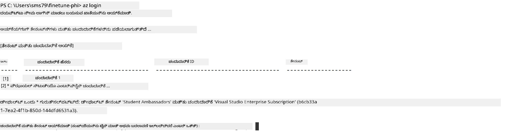

> [!TIP]
>
> ಅಜೂರ್‌ಗೆ ಸೈನ್ ಇನ್ ಆಗಲು ತೊಂದರೆ ಇದ್ದರೆ, ಡಿವೈಸ್ ಕೋಡ್ ಬಳಸಿ ಪ್ರಯತ್ನಿಸಿ. ಟರ್ಮಿನಲ್‌ನಲ್ಲಿ ಕೆಳಗಿನ ಕಮಾಂಡ್ ರನ್ ಮಾಡಿ:
>
> ```console
> az login --use-device-code
> ```
>

### Phi-3 ಮಾದರಿಯನ್ನು ಸೂಕ್ಷ್ಮೀಕರಿಸಿ

ಈ ವ್ಯಾಯಾಮದಲ್ಲಿ, ನೀವು ನೀಡಲಾದ ಡೇಟಾಸೆಟ್ ಬಳಸಿ Phi-3 ಮಾದರಿಯನ್ನು ಸೂಕ್ಷ್ಮೀಕರಿಸುತ್ತೀರಿ. ಮೊದಲು, *fine_tune.py* ಫೈಲ್‌ನಲ್ಲಿ ಸೂಕ್ಷ್ಮೀಕರಣ ಪ್ರಕ್ರಿಯೆಯನ್ನು ವ್ಯಾಖ್ಯಾನಿಸುತ್ತೀರಿ. ಬಳಿಕ, ಅಜೂರ್ ಮಶಿನ್ ಲರ್ನಿಂಗ್ ಪರಿಸರವನ್ನು ಸಂರಚಿಸಿ *setup_ml.py* ಫೈಲ್ ರನ್ ಮೂಲಕ ಸೂಕ್ಷ್ಮೀಕರಣ ಪ್ರಕ್ರಿಯೆಯನ್ನು ಪ್ರಾರಂಭಿಸುತ್ತೀರಿ. ಈ ಸ್ಕ್ರಿಪ್ಟ್ ಸೂಕ್ಷ್ಮೀಕರಣ ಕಾರ್ಯವನ್ನು ಅಜೂರ್ ಮಶಿನ್ ಲರ್ನಿಂಗ್ ಪರಿಸರದಲ್ಲಿ ನಡೆಯುವಂತೆ ಮಾಡುತ್ತದೆ.

*setup_ml.py* ರನ್ ಮಾಡುವುದು ಅಜೂರ್ ಮಶಿನ್ ಲರ್ನಿಂಗ್ ನೆಲೆಯಲ್ಲಿ ಸೂಕ್ಷ್ಮೀಕರಣ ಪ್ರಕ್ರಿಯೆಯನ್ನು ಪ್ರಾರಂಭಿಸುವುದು.

#### *fine_tune.py* ಫೈಲ್‌ಗೆ ಕೋಡ್ ಸೇರಿಸಿ

1. *finetuning_dir* ಫೋಲ್ಡರ್‌ಗೆ ಹೋಗಿ Visual Studio Code ನಲ್ಲಿ *fine_tune.py* ಫೈಲ್ ತೆರೆಯಿರಿ.

1. ಕೆಳಗಿನ ಕೋಡ್ ಅನ್ನು *fine_tune.py* ಒಳಗೆ ಸೇರಿಸಿ.

    ```python
    import argparse
    import sys
    import logging
    import os
    from datasets import load_dataset
    import torch
    import mlflow
    from transformers import AutoModelForCausalLM, AutoTokenizer, TrainingArguments
    from trl import SFTTrainer

    # MLflow ನಲ್ಲಿ INVALID_PARAMETER_VALUE ದೋಷವನ್ನು ತಪ್ಪಿಸಲು, MLflow ಸಂಯೋಜನೆಯನ್ನು ನಿಷ್ಕ್ರಿಯಗೊಳಿಸಿ
    os.environ["DISABLE_MLFLOW_INTEGRATION"] = "True"

    # ಲಾಗಿಂಗ್ ಸಂರಚನೆ
    logging.basicConfig(
        format="%(asctime)s - %(levelname)s - %(name)s - %(message)s",
        datefmt="%Y-%m-%d %H:%M:%S",
        handlers=[logging.StreamHandler(sys.stdout)],
        level=logging.WARNING
    )
    logger = logging.getLogger(__name__)

    def initialize_model_and_tokenizer(model_name, model_kwargs):
        """
        Initialize the model and tokenizer with the given pretrained model name and arguments.
        """
        model = AutoModelForCausalLM.from_pretrained(model_name, **model_kwargs)
        tokenizer = AutoTokenizer.from_pretrained(model_name)
        tokenizer.model_max_length = 2048
        tokenizer.pad_token = tokenizer.unk_token
        tokenizer.pad_token_id = tokenizer.convert_tokens_to_ids(tokenizer.pad_token)
        tokenizer.padding_side = 'right'
        return model, tokenizer

    def apply_chat_template(example, tokenizer):
        """
        Apply a chat template to tokenize messages in the example.
        """
        messages = example["messages"]
        if messages[0]["role"] != "system":
            messages.insert(0, {"role": "system", "content": ""})
        example["text"] = tokenizer.apply_chat_template(
            messages, tokenize=False, add_generation_prompt=False
        )
        return example

    def load_and_preprocess_data(train_filepath, test_filepath, tokenizer):
        """
        Load and preprocess the dataset.
        """
        train_dataset = load_dataset('json', data_files=train_filepath, split='train')
        test_dataset = load_dataset('json', data_files=test_filepath, split='train')
        column_names = list(train_dataset.features)

        train_dataset = train_dataset.map(
            apply_chat_template,
            fn_kwargs={"tokenizer": tokenizer},
            num_proc=10,
            remove_columns=column_names,
            desc="Applying chat template to train dataset",
        )

        test_dataset = test_dataset.map(
            apply_chat_template,
            fn_kwargs={"tokenizer": tokenizer},
            num_proc=10,
            remove_columns=column_names,
            desc="Applying chat template to test dataset",
        )

        return train_dataset, test_dataset

    def train_and_evaluate_model(train_dataset, test_dataset, model, tokenizer, output_dir):
        """
        Train and evaluate the model.
        """
        training_args = TrainingArguments(
            bf16=True,
            do_eval=True,
            output_dir=output_dir,
            eval_strategy="epoch",
            learning_rate=5.0e-06,
            logging_steps=20,
            lr_scheduler_type="cosine",
            num_train_epochs=3,
            overwrite_output_dir=True,
            per_device_eval_batch_size=4,
            per_device_train_batch_size=4,
            remove_unused_columns=True,
            save_steps=500,
            seed=0,
            gradient_checkpointing=True,
            gradient_accumulation_steps=1,
            warmup_ratio=0.2,
        )

        trainer = SFTTrainer(
            model=model,
            args=training_args,
            train_dataset=train_dataset,
            eval_dataset=test_dataset,
            max_seq_length=2048,
            dataset_text_field="text",
            tokenizer=tokenizer,
            packing=True
        )

        train_result = trainer.train()
        trainer.log_metrics("train", train_result.metrics)

        mlflow.transformers.log_model(
            transformers_model={"model": trainer.model, "tokenizer": tokenizer},
            artifact_path=output_dir,
        )

        tokenizer.padding_side = 'left'
        eval_metrics = trainer.evaluate()
        eval_metrics["eval_samples"] = len(test_dataset)
        trainer.log_metrics("eval", eval_metrics)

    def main(train_file, eval_file, model_output_dir):
        """
        Main function to fine-tune the model.
        """
        model_kwargs = {
            "use_cache": False,
            "trust_remote_code": True,
            "torch_dtype": torch.bfloat16,
            "device_map": None,
            "attn_implementation": "eager"
        }

        # pretrained_model_name = "microsoft/Phi-3-mini-4k-instruct"
        pretrained_model_name = "microsoft/Phi-3.5-mini-instruct"

        with mlflow.start_run():
            model, tokenizer = initialize_model_and_tokenizer(pretrained_model_name, model_kwargs)
            train_dataset, test_dataset = load_and_preprocess_data(train_file, eval_file, tokenizer)
            train_and_evaluate_model(train_dataset, test_dataset, model, tokenizer, model_output_dir)

    if __name__ == "__main__":
        parser = argparse.ArgumentParser()
        parser.add_argument("--train-file", type=str, required=True, help="Path to the training data")
        parser.add_argument("--eval-file", type=str, required=True, help="Path to the evaluation data")
        parser.add_argument("--model_output_dir", type=str, required=True, help="Directory to save the fine-tuned model")
        args = parser.parse_args()
        main(args.train_file, args.eval_file, args.model_output_dir)

    ```

1. *fine_tune.py* ಫೈಲ್ ಉಳಿಸಿ ಮತ್ತು ಮುಚ್ಚಿ.

> [!TIP]
> **ನೀವು Phi-3.5 ಮಾದರಿಯನ್ನು ಸೂಕ್ಷ್ಮೀಕರಿಸಬಹುದು**
>
> *fine_tune.py* ಫೈಲ್‌ನಲ್ಲಿ, `pretrained_model_name` ಅನ್ನು `"microsoft/Phi-3-mini-4k-instruct"` ಇರಿಸುವ ಬದಲು, ನೀವು ಬಯಸುವ ಯಾವುದೇ ಮಾದರಿಯೊಂದಿಗೆ ಬದಲಾಯಿಸಬಹುದು. ಉದಾಹರಣೆಗೆ, `"microsoft/Phi-3.5-mini-instruct"`ಗೆ ಬದಲಾಯಿಸಿದರೆ, ನೀವು Phi-3.5-mini-instruct ಮಾದರಿಯನ್ನು ಬಳಸುತ್ತೀರಿ. ಬಯಸುವ ಮಾದರಿಯ ಹೆಸರು ಕಂಡುಹಿಡಿಯಲು ಮತ್ತು ಬಳಕೆ ಮಾಡಿಕೊಳ್ಳಲು [Hugging Face](https://huggingface.co/) ಭೇಟಿ ನೀಡಿ, ನಿಮ್ಮ ಬಯಸಿದ ಮಾದರಿಯ ಹೆಸರನ್ನು ನಕಲಿಸಿ ಮತ್ತು `pretrained_model_name` ಕ್ಷೇತ್ರದಲ್ಲಿ ಪೇಸ್ಟ್ ಮಾಡಿ.
>
> <image type="content" src="../../../../imgs/02/FineTuning-PromptFlow/finetunephi3.5.png" alt-text="Phi-3.5 ಸೂಕ್ಷ್ಮೀಕರಣ.">
>

#### *setup_ml.py* ಫೈಲ್‌ಗೆ ಕೋಡ್ ಸೇರಿಸಿ

1. Visual Studio Code ನಲ್ಲಿ *setup_ml.py* ಫೈಲ್ ತೆರೆಯಿರಿ.

1. ಕೆಳಗಿನ ಕೋಡ್ ಅನ್ನು *setup_ml.py* ಒಳಗೆ ಸೇರಿಸಿ.

    ```python
    import logging
    from azure.ai.ml import MLClient, command, Input
    from azure.ai.ml.entities import Environment, AmlCompute
    from azure.identity import AzureCliCredential
    from config import (
        AZURE_SUBSCRIPTION_ID,
        AZURE_RESOURCE_GROUP_NAME,
        AZURE_ML_WORKSPACE_NAME,
        TRAIN_DATA_PATH,
        TEST_DATA_PATH
    )

    # ಸ್ಥಿರಾಂಕಗಳು

    # ತರಬೇತಿಯಿಗಾಗಿ CPU ಉದಾಹರಣೆಯನ್ನು ಬಳಸಲು ಕೆಳಗಿನ ಸಾಲುಗಳನ್ನು ಅನಕಮೆಂಟ್ ಮಾಡಿ
    # COMPUTE_INSTANCE_TYPE = "Standard_E16s_v3" # CPU
    # COMPUTE_NAME = "cpu-e16s-v3"
    # DOCKER_IMAGE_NAME = "mcr.microsoft.com/azureml/openmpi4.1.0-ubuntu20.04:latest"

    # ತರಬೇತಿಯಗಾಗಿ GPU ಉದಾಹರಣೆಯನ್ನು ಬಳಸಲು ಕೆಳಗಿನ ಸಾಲುಗಳನ್ನು ಅನಕಮೆಂಟ್ ಮಾಡಿ
    COMPUTE_INSTANCE_TYPE = "Standard_NC24ads_A100_v4"
    COMPUTE_NAME = "gpu-nc24s-a100-v4"
    DOCKER_IMAGE_NAME = "mcr.microsoft.com/azureml/curated/acft-hf-nlp-gpu:59"

    CONDA_FILE = "conda.yml"
    LOCATION = "eastus2" # ನಿಮ್ಮ ಗಣನೆ ಗುಂಪಿನ ಸ್ಥಳವನ್ನು ಬದಲಿಸಿ
    FINETUNING_DIR = "./finetuning_dir" # ಫೈನ್-ಟ್ಯೂನಿಂಗ್ ಸ್ಕ್ರಿಪ್ಟ್‌ಗೆ ಮಾರ್ಗ
    TRAINING_ENV_NAME = "phi-3-training-environment" # ತರಬೇತಿ ಪರಿಸರದ ಹೆಸರು
    MODEL_OUTPUT_DIR = "./model_output" # ಆಜ್ಯೂರ್ ಎಂಎಲ್‌ನಲ್ಲಿ ಮಾದರಿ ರಫ್ತು ಡೈರೆಕ್ಟರಿಯ ಮಾರ್ಗ

    # ಪ್ರಕ್ರಿಯೆಯನ್ನು ಟ್ರ್ಯಾಕ್ ಮಾಡಲು ಲಾಗ್ ನಿರ್ವಹಣೆ
    logger = logging.getLogger(__name__)
    logging.basicConfig(
        format="%(asctime)s - %(levelname)s - %(name)s - %(message)s",
        datefmt="%Y-%m-%d %H:%M:%S",
        level=logging.WARNING
    )

    def get_ml_client():
        """
        Initialize the ML Client using Azure CLI credentials.
        """
        credential = AzureCliCredential()
        return MLClient(credential, AZURE_SUBSCRIPTION_ID, AZURE_RESOURCE_GROUP_NAME, AZURE_ML_WORKSPACE_NAME)

    def create_or_get_environment(ml_client):
        """
        Create or update the training environment in Azure ML.
        """
        env = Environment(
            image=DOCKER_IMAGE_NAME,  # ಪರಿಸರಕ್ಕಾಗಿ ಡೋಕರ್ ಚಿತ್ರ
            conda_file=CONDA_FILE,  # ಕೊಂಡಾ ಪರಿಸರ ಫೈಲ್
            name=TRAINING_ENV_NAME,  # ಪರಿಸರದ ಹೆಸರು
        )
        return ml_client.environments.create_or_update(env)

    def create_or_get_compute_cluster(ml_client, compute_name, COMPUTE_INSTANCE_TYPE, location):
        """
        Create or update the compute cluster in Azure ML.
        """
        try:
            compute_cluster = ml_client.compute.get(compute_name)
            logger.info(f"Compute cluster '{compute_name}' already exists. Reusing it for the current run.")
        except Exception:
            logger.info(f"Compute cluster '{compute_name}' does not exist. Creating a new one with size {COMPUTE_INSTANCE_TYPE}.")
            compute_cluster = AmlCompute(
                name=compute_name,
                size=COMPUTE_INSTANCE_TYPE,
                location=location,
                tier="Dedicated",  # ಗಣನೆ ಗುಂಪಿನ ಮಟ್ಟ
                min_instances=0,  # ಕನಿಷ್ಠ ಉದಾಹರಣೆಗಳ ಸಂಖ್ಯೆ
                max_instances=1  # ಗರಿಷ್ಠ ಉದಾಹರಣೆಗಳ ಸಂಖ್ಯೆ
            )
            ml_client.compute.begin_create_or_update(compute_cluster).wait()  # ಗುಂಪು ಸೃಷ್ಟಿಯಾಗಲು ಕಾಯಿರಿ
        return compute_cluster

    def create_fine_tuning_job(env, compute_name):
        """
        Set up the fine-tuning job in Azure ML.
        """
        return command(
            code=FINETUNING_DIR,  # fine_tune.py ಗೆ ಮಾರ್ಗ
            command=(
                "python fine_tune.py "
                "--train-file ${{inputs.train_file}} "
                "--eval-file ${{inputs.eval_file}} "
                "--model_output_dir ${{inputs.model_output}}"
            ),
            environment=env,  # ತರಬೇತಿ ಪರಿಸರ
            compute=compute_name,  # ಬಳಸಬೇಕಾದ ಗಣನೆ ಗುಂಪು
            inputs={
                "train_file": Input(type="uri_file", path=TRAIN_DATA_PATH),  # ತರಬೇತಿ ಡೇಟಾ ಫೈಲ್‌ಗೆ ಮಾರ್ಗ
                "eval_file": Input(type="uri_file", path=TEST_DATA_PATH),  # ಮೌಲ್ಯಮಾಪನ ಡೇಟಾ ಫೈಲ್‌ಗೆ ಮಾರ್ಗ
                "model_output": MODEL_OUTPUT_DIR
            }
        )

    def main():
        """
        Main function to set up and run the fine-tuning job in Azure ML.
        """
        # ಎಂಎಲ್ ಕ್ಲೈಂಟ್ ಪ್ರಾರಂಭಿಸಿ
        ml_client = get_ml_client()

        # ಪರಿಸರ ರಚಿಸಿ
        env = create_or_get_environment(ml_client)
        
        # ಇExisting.uriCompute cluster ರಚಿಸಿ ಅಥವಾ ಮತ್ತು ಪಡೆಯಿರಿ
        create_or_get_compute_cluster(ml_client, COMPUTE_NAME, COMPUTE_INSTANCE_TYPE, LOCATION)

        # ಫೈನ್-ಟ್ಯೂನಿಂಗ್ ಕೆಲಸವನ್ನು ರಚಿಸಿ ಮತ್ತು ಸಲ್ಲಿಸಿ
        job = create_fine_tuning_job(env, COMPUTE_NAME)
        returned_job = ml_client.jobs.create_or_update(job)  # ಕೆಲಸವನ್ನು ಸಲ್ಲಿಸಿ
        ml_client.jobs.stream(returned_job.name)  # ಕೆಲಸದ ಲಾಗ್‌ಗಳನ್ನು ಸ್ಟ್ರೀಮ್ ಮಾಡಿ
        
        # ಕೆಲಸದ ಹೆಸರನ್ನು ಹಿಡಿಯಿರಿ
        job_name = returned_job.name
        print(f"Job name: {job_name}")

    if __name__ == "__main__":
        main()

    ```

1. `COMPUTE_INSTANCE_TYPE`, `COMPUTE_NAME`, ಮತ್ತು `LOCATION` ಅನ್ನು ನಿಮ್ಮ ವಿವರಗಳಿಗೆ ಬದಲಿಸಿಕೊಳ್ಳಿ.

    ```python
   # ತರಬೇತಿಗಾಗಿ GPU ಘಟನೆ ಬಳಸಲು ಕೆಳಗಿನ ಸಾಲುಗಳನ್ನು ಅನಕಮೆಂಟ್ ಮಾಡಿ
    COMPUTE_INSTANCE_TYPE = "Standard_NC24ads_A100_v4"
    COMPUTE_NAME = "gpu-nc24s-a100-v4"
    ...
    LOCATION = "eastus2" # ನಿಮ್ಮ ಕಂಪ್ಯೂಟರ್ ಕ್ಲಸ್ಟರ್‌ನ ಸ್ಥಾನದ ಜೊತೆಗೆ ಬದಲಾಯಿಸಿ
    ```

> [!TIP]
>
> **CPU ಬಳಸಿ ಕನಿಷ್ಠ ಡೇಟಾಸೆಟ್‌ನಲ್ಲಿ ಸೂಕ್ಷ್ಮೀಕರಣ**ಗೆ ಮಾರ್ಗದರ್ಶನ:
>
> ನೀವು CPU ಬಳಸಿ ಸೂಕ್ಷ್ಮೀಕರಣ ಮಾಡಲು ಬಯಸಿದರೆ, ಇದು Visual Studio ಎಂಟರ್ಪ್ರೈಸ್ ಸಬ್ಸ್ಕ್ರಿಪ್ಶನ್ ಹಾಗು ಬೇಗ ಸೂಕ್ಷ್ಮೀಕರಣ ಮತ್ತು ನಿಯೋಜನೆ ಪ್ರಕ್ರಿಯೆ ಪರೀಕ್ಷಿಸಲು ಅನುಕೂಲಕರ.
>
> 1. *setup_ml* ಫೈಲ್ ತೆರೆಯಿರಿ.
> 1. `COMPUTE_INSTANCE_TYPE`, `COMPUTE_NAME`, ಮತ್ತು `DOCKER_IMAGE_NAME` ಅನ್ನು ಕೆಳಗಿನಂತೆ ಬದಲಾಯಿಸಿ. ನಿಮಗೆ *Standard_E16s_v3* ಯಾಕೆಯಾದರೂ ಲಭ್ಯವಿಲ್ಲದಿದ್ದರೆ, ಸಮೋಚ್ಚ инструмент CPU ಇನ್ಸ್ಟಾನ್ಸ್ ಅಥವಾ ಹೊಸ ಕ್ವೋಟಾ ಕೋರಿಕೆ ಮಾಡಬಹುದು.
> 1. `LOCATION` ಅನ್ನು ನಿಮ್ಮ ಸ್ಥಳೀಯ ವಿವರಗಳಿಗೆ ಬದಲಾಯಿಸಿ.
>
>    ```python
>    # Uncomment the following lines to use a CPU instance for training
>    COMPUTE_INSTANCE_TYPE = "Standard_E16s_v3" # cpu
>    COMPUTE_NAME = "cpu-e16s-v3"
>    DOCKER_IMAGE_NAME = "mcr.microsoft.com/azureml/openmpi4.1.0-ubuntu20.04:latest"
>    LOCATION = "eastus2" # Replace with the location of your compute cluster
>    ```
>

1. *setup_ml.py* ಸ್ಕ್ರಿಪ್ಟ್ ರನ್ ಮಾಡಿ ಮತ್ತು ಅಜೂರ್ ಮಶಿನ್ ಲರ್ನಿಂಗ್‌ನಲ್ಲಿ ಸೂಕ್ಷ್ಮೀಕರಣ ಪ್ರಕ್ರಿಯೆಯನ್ನು ಪ್ರಾರಂಭಿಸಲು ಕೆಳಗಿನ ಕಮಾಂಡ್ ಟೈಪ್ ಮಾಡಿ.

    ```python
    python setup_ml.py
    ```

1. ಈ ವ್ಯಾಯಾಮದಲ್ಲಿ, ನೀವು ಯಶಸ್ವಿಯಾಗಿ ಅಜೂರ್ ಮಶಿನ್ ಲರ್ನಿಂಗ್ ಬಳಸಿ Phi-3 ಮಾದರಿಯನ್ನು ಸೂಕ್ಷ್ಮೀಕರಿಸಿದ್ದೀರಿ. *setup_ml.py* ಸ್ಕ್ರಿಪ್ಟ್ ರನ್ ಮಾಡುವ ಮೂಲಕ, ನೀವು ಅಜೂರ್ ಮಶಿನ್ ಲರ್ನಿಂಗ್ ಪರಿಸರವನ್ನು ಸೆಟ್‌ಅಪ್ ಮಾಡಿ *fine_tune.py* ಫೈಲ್‌ನಲ್ಲಿ ವ್ಯಾಖ್ಯಾನಿಸಿದ ಸೂಕ್ಷ್ಮೀಕರಣ ಪ್ರಕ್ರಿಯೆಯನ್ನು ಪ್ರಾರಂಭಿಸಿದ್ದೀರಿ. ಸೂಕ್ಷ್ಮೀಕರಣ ಪ್ರಕ್ರಿಯೆ ಕೆಲಾವೇಳೆ ಬಹಳ ಸಮಯ ತೆಗೆದುಕೊಳ್ಳಬಹುದು. `python setup_ml.py` ಕಮಾಂಡ್ ರನ್ ಮಾಡಿದ ನಂತರ, ಪ್ರಕ್ರಿಯೆ ಪೂರ್ಣಗೊಳ್ಳುವವರೆಗೆ ಕಾಯಬೇಕು. ಟರ್ಮಿನಲ್‌ನಲ್ಲಿ ನೀಡಲಾದ ಲಿಂಕ್ ಮೂಲಕ ನೀವು ಸೂಕ್ಷ್ಮೀಕರಣ ಕೆಲಸದ ಸ್ಥಿತಿಯನ್ನು ಅಜೂರ್ ಮಶಿನ್ ಲರ್ನಿಂಗ್ ಪೋರ್ಟಲ್‌ನಲ್ಲಿ ಮೇಲ್ವಿಚಾರಣೆ ಮಾಡಬಹುದು.

    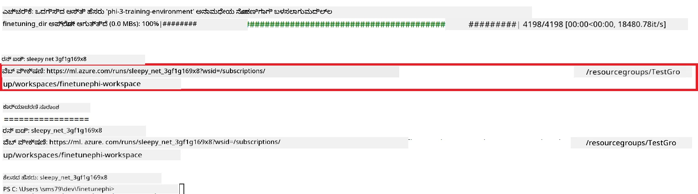

### ಸೂಕ್ಷ್ಮೀಕರಿಸಿದ ಮಾದರಿಯನ್ನು ನಿಯೋಜಿಸಿ

ಸೂಕ್ಷ್ಮೀಕರಿಸಿದ Phi-3 ಮಾದರಿಯನ್ನು Prompt Flow ಜೊತೆ ಸಂಯೋಜಿಸಲು, ಈ ಮಾದರಿಯನ್ನು ನೈಜಸಮಯ ಇನ್ಫರೆನ್ಸ್‌ಗಾಗಿ ಪ್ರವೇಶಿಸಬಹುದಾಗಿಸುವಂತೆ ನಿಯೋಜಿಸಬೇಕಾಗುತ್ತದೆ. ಈ ಪ್ರಕ್ರಿಯೆಯಲ್ಲಿ ಮಾದರಿಯನ್ನು ನೋಂದಣಿ ಮಾಡುವುದು, ಆನ್‌ಲೈನ್ ಎಂಡ್ಪಾಯಿಂಟ್ ಸೃಷ್ಟಿಸುವುದು ಮತ್ತು ಮಾದರಿಯನ್ನು ನಿಯೋಜಿಸುವುದು ಸೇರಿವೆ.

#### ನಿಯೋಜನೆಗಾಗಿ ಮಾದರಿಯ ಹೆಸರು, ಎಂಡ್ಪಾಯಿಂಟ್ ಹೆಸರು ಮತ್ತು ನಿಯೋಜನೆ ಹೆಸರನ್ನು ಸೆಟ್ ಮಾಡು

1. *config.py* ಫೈಲ್ ತೆರೆಯಿರಿ.

1. `AZURE_MODEL_NAME = "your_fine_tuned_model_name"` ಅನ್ನು ನಿಮ್ಮ ಬಯಸಿದ ಮಾದರಿಯ ಹೆಸರಿನಲ್ಲಿ ಬದಲಾಯಿಸಿ.

1. `AZURE_ENDPOINT_NAME = "your_fine_tuned_model_endpoint_name"` ಅನ್ನು ನಿಮ್ಮ ಬಯಸಿದ ಎಂಡ್ಪಾಯಿಂಟ್ ಹೆಸರಿನಲ್ಲಿ ಬದಲಾಯಿಸಿ.

1. `AZURE_DEPLOYMENT_NAME = "your_fine_tuned_model_deployment_name"` ಅನ್ನು ನಿಮ್ಮ ಬಯಸಿದ ನಿಯೋಜನೆ ಹೆಸರಿನಲ್ಲಿ ಬದಲಾಯಿಸಿ.

#### *deploy_model.py* ಫೈಲ್‌ಗೆ ಕೋಡ್ ಸೇರಿಸಿ

*deploy_model.py* ಫೈಲ್ ರನ್ ಮಾಡುವುದರಿಂದ ಸಂಪೂರ್ಣ ನಿಯೋಜನೆ ಪ್ರಕ್ರಿಯೆ ಸ್ವಯಂಚಾಲಿತವಾಗುತ್ತದೆ. ಇದು ಮಾದರಿಯನ್ನು ನೋಂದಣಿ ಮಾಡುವುದು, ಎಂಡ್ಪಾಯಿಂಟ್ ಸೃಷ್ಟಿಸುವುದು ಮತ್ತು config.py ಕಡತದ ಸೆಟ್ಟಿಂಗ್‌ಗಳ (ಮಾದರಿ ಹೆಸರು, ಎಂಡ್ಪಾಯಿಂಟ್ ಹೆಸರು ಮತ್ತು ನಿಯೋಜನೆ ಹೆಸರು) ಆಧಾರದ ಮೇಲೆ ನಿಯೋಜಿಸುವುದನ್ನು ಮಾಡುತ್ತದೆ.

1. Visual Studio Code ನಲ್ಲಿ *deploy_model.py* ಫೈಲ್ ತೆರೆಯಿರಿ.

1. ಕೆಳಗಿನ ಕೋಡ್ ಅನ್ನು *deploy_model.py* ಒಳಗೆ ಸೇರಿಸಿ.

    ```python
    import logging
    from azure.identity import AzureCliCredential
    from azure.ai.ml import MLClient
    from azure.ai.ml.entities import Model, ProbeSettings, ManagedOnlineEndpoint, ManagedOnlineDeployment, IdentityConfiguration, ManagedIdentityConfiguration, OnlineRequestSettings
    from azure.ai.ml.constants import AssetTypes

    # ಸಂರಚನೆ ಆಮದುಗಳು
    from config import (
        AZURE_SUBSCRIPTION_ID,
        AZURE_RESOURCE_GROUP_NAME,
        AZURE_ML_WORKSPACE_NAME,
        AZURE_MANAGED_IDENTITY_RESOURCE_ID,
        AZURE_MANAGED_IDENTITY_CLIENT_ID,
        AZURE_MODEL_NAME,
        AZURE_ENDPOINT_NAME,
        AZURE_DEPLOYMENT_NAME
    )

    # ಸ್ಥಿರಾಂಕಗಳು
    JOB_NAME = "your-job-name"
    COMPUTE_INSTANCE_TYPE = "Standard_E4s_v3"

    deployment_env_vars = {
        "SUBSCRIPTION_ID": AZURE_SUBSCRIPTION_ID,
        "RESOURCE_GROUP_NAME": AZURE_RESOURCE_GROUP_NAME,
        "UAI_CLIENT_ID": AZURE_MANAGED_IDENTITY_CLIENT_ID,
    }

    # ಲಾಗಿಂಗ್ ಸೆಟ್ಟಪ್
    logging.basicConfig(
        format="%(asctime)s - %(levelname)s - %(name)s - %(message)s",
        datefmt="%Y-%m-%d %H:%M:%S",
        level=logging.DEBUG
    )
    logger = logging.getLogger(__name__)

    def get_ml_client():
        """Initialize and return the ML Client."""
        credential = AzureCliCredential()
        return MLClient(credential, AZURE_SUBSCRIPTION_ID, AZURE_RESOURCE_GROUP_NAME, AZURE_ML_WORKSPACE_NAME)

    def register_model(ml_client, model_name, job_name):
        """Register a new model."""
        model_path = f"azureml://jobs/{job_name}/outputs/artifacts/paths/model_output"
        logger.info(f"Registering model {model_name} from job {job_name} at path {model_path}.")
        run_model = Model(
            path=model_path,
            name=model_name,
            description="Model created from run.",
            type=AssetTypes.MLFLOW_MODEL,
        )
        model = ml_client.models.create_or_update(run_model)
        logger.info(f"Registered model ID: {model.id}")
        return model

    def delete_existing_endpoint(ml_client, endpoint_name):
        """Delete existing endpoint if it exists."""
        try:
            endpoint_result = ml_client.online_endpoints.get(name=endpoint_name)
            logger.info(f"Deleting existing endpoint {endpoint_name}.")
            ml_client.online_endpoints.begin_delete(name=endpoint_name).result()
            logger.info(f"Deleted existing endpoint {endpoint_name}.")
        except Exception as e:
            logger.info(f"No existing endpoint {endpoint_name} found to delete: {e}")

    def create_or_update_endpoint(ml_client, endpoint_name, description=""):
        """Create or update an endpoint."""
        delete_existing_endpoint(ml_client, endpoint_name)
        logger.info(f"Creating new endpoint {endpoint_name}.")
        endpoint = ManagedOnlineEndpoint(
            name=endpoint_name,
            description=description,
            identity=IdentityConfiguration(
                type="user_assigned",
                user_assigned_identities=[ManagedIdentityConfiguration(resource_id=AZURE_MANAGED_IDENTITY_RESOURCE_ID)]
            )
        )
        endpoint_result = ml_client.online_endpoints.begin_create_or_update(endpoint).result()
        logger.info(f"Created new endpoint {endpoint_name}.")
        return endpoint_result

    def create_or_update_deployment(ml_client, endpoint_name, deployment_name, model):
        """Create or update a deployment."""

        logger.info(f"Creating deployment {deployment_name} for endpoint {endpoint_name}.")
        deployment = ManagedOnlineDeployment(
            name=deployment_name,
            endpoint_name=endpoint_name,
            model=model.id,
            instance_type=COMPUTE_INSTANCE_TYPE,
            instance_count=1,
            environment_variables=deployment_env_vars,
            request_settings=OnlineRequestSettings(
                max_concurrent_requests_per_instance=3,
                request_timeout_ms=180000,
                max_queue_wait_ms=120000
            ),
            liveness_probe=ProbeSettings(
                failure_threshold=30,
                success_threshold=1,
                period=100,
                initial_delay=500,
            ),
            readiness_probe=ProbeSettings(
                failure_threshold=30,
                success_threshold=1,
                period=100,
                initial_delay=500,
            ),
        )
        deployment_result = ml_client.online_deployments.begin_create_or_update(deployment).result()
        logger.info(f"Created deployment {deployment.name} for endpoint {endpoint_name}.")
        return deployment_result

    def set_traffic_to_deployment(ml_client, endpoint_name, deployment_name):
        """Set traffic to the specified deployment."""
        try:
            # ಪ್ರಸ್ತುತ ಎಂಡ್‌ಪಾಯಿಂಟ್ ವಿವರಗಳನ್ನು ಪಡೆಯಿರಿ
            endpoint = ml_client.online_endpoints.get(name=endpoint_name)
            
            # ಡೀಬಗ್ಗಿಂಗ್‌ಗೆ ಪ್ರಸ್ತುತ ಟ್ರಾಫಿಕ್ ವಂಚನೆಯನ್ನು ಲಾಗ್ ಮಾಡಿ
            logger.info(f"Current traffic allocation: {endpoint.traffic}")
            
            # ನಿಯೋಜನೆಗೆ ಟ್ರಾಫಿಕ್ ವಂಚನೆಯನ್ನು ಹೊಂದಿಸಿ
            endpoint.traffic = {deployment_name: 100}
            
            # ಹೊಸ ಟ್ರಾಫಿಕ್ ವಂಚನೆೊಂದಿಗೆ ಎಂಡ್‌ಪಾಯಿಂಟ್ ಅನ್ನು ನವೀಕರಿಸಿ
            endpoint_poller = ml_client.online_endpoints.begin_create_or_update(endpoint)
            updated_endpoint = endpoint_poller.result()
            
            # ಡೀಬಗ್ಗಿಂಗ್‌ಗೆ ನವೀಕೃತ ಟ್ರಾಫಿಕ್ ವಂಚನೆಯನ್ನು ಲಾಗ್ ಮಾಡಿ
            logger.info(f"Updated traffic allocation: {updated_endpoint.traffic}")
            logger.info(f"Set traffic to deployment {deployment_name} at endpoint {endpoint_name}.")
            return updated_endpoint
        except Exception as e:
            # ಪ್ರಕ್ರಿಯೆಯಾದ ಸಂದರ್ಭದಲ್ಲಿ ಸಂಭವಿಸುವ ಯಾವುದೇ ದೋಷಗಳನ್ನು ಲಾಗ್ ಮಾಡಿ
            logger.error(f"Failed to set traffic to deployment: {e}")
            raise


    def main():
        ml_client = get_ml_client()

        registered_model = register_model(ml_client, AZURE_MODEL_NAME, JOB_NAME)
        logger.info(f"Registered model ID: {registered_model.id}")

        endpoint = create_or_update_endpoint(ml_client, AZURE_ENDPOINT_NAME, "Endpoint for finetuned Phi-3 model")
        logger.info(f"Endpoint {AZURE_ENDPOINT_NAME} is ready.")

        try:
            deployment = create_or_update_deployment(ml_client, AZURE_ENDPOINT_NAME, AZURE_DEPLOYMENT_NAME, registered_model)
            logger.info(f"Deployment {AZURE_DEPLOYMENT_NAME} is created for endpoint {AZURE_ENDPOINT_NAME}.")

            set_traffic_to_deployment(ml_client, AZURE_ENDPOINT_NAME, AZURE_DEPLOYMENT_NAME)
            logger.info(f"Traffic is set to deployment {AZURE_DEPLOYMENT_NAME} at endpoint {AZURE_ENDPOINT_NAME}.")
        except Exception as e:
            logger.error(f"Failed to create or update deployment: {e}")

    if __name__ == "__main__":
        main()

    ```

1. `JOB_NAME` ಪಡೆಯಲು ಕೆಳಗಿನ ಹಂತಗಳನ್ನು ಅನುಸರಿಸಿ:

    - ನೀವು ಸೃಷ್ಟಿಸಿದ ಅಜೂರ್ ಮಶಿನ್ ಲರ್ನಿಂಗ್ ಸ蜜ಸಾಧನಕ್ಕೆ ಹೋಗಿ.
    - **Studio web URL** ಆಯ್ಕೆಮಾಡಿ, ಅಜೂರ್ ಮಶಿನ್ ಲರ್ನಿಂಗ್ ವರ್ಕ್‌ಸ್ಪೇಸ್ ತೆರೆಯಲು.
    - ಎಡದ ಟ್ಯಾಬ್‌ನಿಂದ **Jobs** ಆಯ್ಕೆಮಾಡಿ.
    - ಸೂಕ್ಷ್ಮೀಕರಣಕ್ಕಾಗಿ ನಡೆಸುತ್ತಿರುವ ಎಕ್ಸ್ಪೆರಿಮೆಂಟ್ ಆಯ್ಕೆಮಾಡಿ. ಉದಾಹರಣೆಗೆ, *finetunephi*.
    - ನೀವು ಸೃಷ್ಟಿಸಿದ ಕೆಲಸ (job) ಆಯ್ಕೆಮಾಡಿ.
- ನಿಮ್ಮ ಕೆಲಸದ ಹೆಸರನ್ನು *deploy_model.py* ಫೈಲ್‌ನ `JOB_NAME = "your-job-name"` ನಲ್ಲಿ ಕಾಪಿ ಮಾಡಿ ಪೇಸ್ಟ್ ಮಾಡಿ.

1. `COMPUTE_INSTANCE_TYPE` ಅನ್ನು ನಿಮ್ಮ ವಿಶೇಷ ವಿವರಗಳೊಂದಿಗೆ ಬದಲಾಯಿಸಿ.

1. *deploy_model.py* ಸ್ಕ್ರಿಪ್ಟ್ ಅನ್ನು ರನ್ ಮಾಡಲು ಮತ್ತು Azure ಮೆಶಿನ್ ಲರ್ನಿಂಗ್‌ನಲ್ಲಿ ಡಿಪ್ಲಾಯ್‌ಮೆಂಟ್ ಪ್ರಕ್ರಿಯೆಯನ್ನು ಪ್ರಾರಂಭಿಸಲು ಕೆಳಗಿನ ಆಜ್ಞೆಯನ್ನು ಟೈಪಿಸಿ.

    ```python
    python deploy_model.py
    ```

> [!WARNING]
> ನಿಮ್ಮ ಖಾತೆಗೆ ಹೆಚ್ಚುವರಿ ಶುಲ್ಕಗಳನ್ನು ತಪ್ಪಿಸಲು, Azure ಮೆಶಿನ್ ಲರ್ನಿಂಗ್ ವರ್ಕ್‌ಸ್ಪೇಸ್‌ನಲ್ಲಿ ರಚಿಸಿರುವ ಎಂಡ್‌ಪಾಯಿಂಟ್ ಅನ್ನು ಅಳಿಸುವುದನ್ನು ಖಚಿತಪಡಿಸಿಕೊಳ್ಳಿ.
>

#### Azure ಮೆಶಿನ್ ಲರ್ನಿಂಗ್ ವರ್ಕ್‌ಸ್ಪೇಸ್‌ನಲ್ಲಿನ ಡಿಪ್ಲಾಯ್‌ಮೆಂಟ್ ಸ್ಥಿತಿಯನ್ನು ಪರಿಶೀಲಿಸಿ

1. [Azure ML ಸ್ಟುಡಿಯೋ](https://ml.azure.com/home?wt.mc_id=studentamb_279723) ಅನ್ನು ಭೇಟಿ ಮಾಡಿ.

1. ನೀವು ರಚಿಸಿದ Azure ಮೆಶಿನ್ ಲರ್ನಿಂಗ್ ವರ್ಕ್‌ಸ್ಪೇಸ್‌ಗೆ ನಾವಿಗೇಟ್ ಮಾಡಿ.

1. Azure ಮೆಶಿನ್ ಲರ್ನಿಂಗ್ ವರ್ಕ್‌ಸ್ಪೇಸ್ ಅನ್ನು ತೆರೆಯಲು **Studio web URL** ಅನ್ನು ಆಯ್ಕೆಮಾಡಿ.

1. ಎಡಭಾಗದ ಟ್ಯಾಬ್‌ನಿಂದ **Endpoints** ಆಯ್ಕೆಮಾಡಿ.

    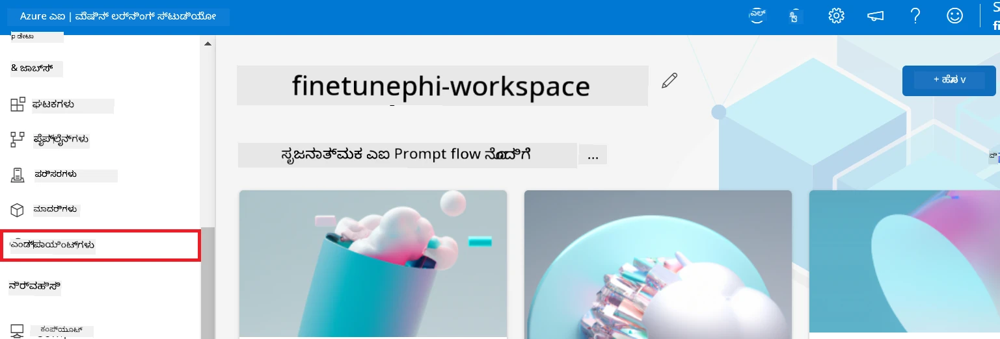

2. ನೀವು ರಚಿಸಿದ ಎಂಡ್‌ಪಾಯಿಂಟ್ ಅನ್ನು ಆಯ್ಕೆಮಾಡಿ.

    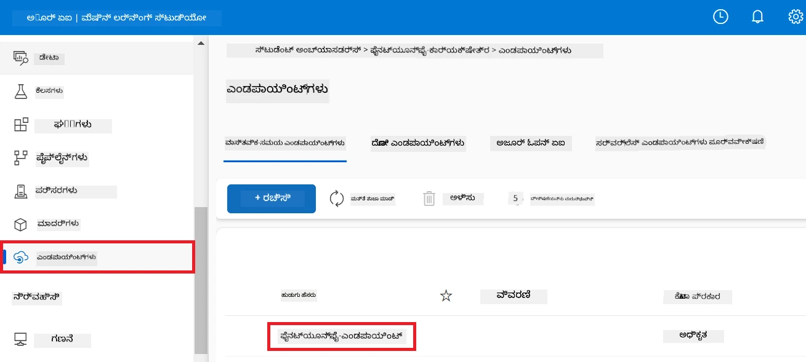

3. ಈ ಪುಟದಲ್ಲಿ, ನೀವು ಡಿಪ್ಲಾಯ್‌ಮೆಂಟ್ ಪ್ರಕ್ರಿಯೆಯಲ್ಲಿನ ಎಂಡ್‌ಪಾಯಿಂಟ್‌ಗಳನ್ನು ನಿರ್ವಹಿಸಬಹುದು.

## ದೃಶ್ಯ 3: ಪ್ರಾಂಪ್ಟ್ ಫ್ಲೋಯೊಂದಿಗೆ ಏಕೀಭವನ ಮಾಡಿಸಿ ಮತ್ತು ನಿಮ್ಮ ಕಸ್ಟಮ್ ಮಾದರಿಯಿಂದ ಚಾಟ್ ಮಾಡಿ

### ಕಸ್ಟಮ್ Phi-3 ಮಾದರಿಯನ್ನು ಪ್ರಾಂಪ್ಟ್ ಫ್ಲೋಯೊಂದಿಗೆ ಏಕೀಭವನ ಮಾಡಿಸಿ

ನೀವು ಯಶಸ್ವಿಯಾಗಿ ನಿಮ್ಮ ಫೈನ್-ಟ್ಯೂನ್ ಮಾಡಿದ ಮಾದರಿಯನ್ನು ಡಿಪ್ಲಾಯ್ ಮಾಡಿದ ನಂತರ, ನೀವು ಈಗ ಅದನ್ನು ಪ್ರಾಂಪ್ಟ್ ಫ್ಲೋಯೊಂದಿಗೆ ಏಕೀಭವನ ಮಾಡಿಸಿ, ನಿಮ್ಮ ಕಸ್ಟಮ್ Phi-3 ಮಾದರಿಯೊಂದಿಗೆ ವಿವಿಧ ಆಂತರಿಕ ಕಾಮಗಾರಿಗಳನ್ನು ಮಾಡಬಹುದಾಗುತ್ತದೆ.

#### ಫೈನ್-ಟ್ಯೂನ್ ಮಾಡಿದ Phi-3 ಮಾದರಿಯ ಎಪಿ ಕೀ ಮತ್ತು ಎಂಡ್‌ಪಾಯಿಂಟ್ ಯುಆರ್‌ಐ ನಿಡಿ

1. ನೀವು ರಚಿಸಿದ Azure ಮೆಶಿನ್ ಲರ್ನಿಂಗ್ ವರ್ಕ್‌ಸ್ಪೇಸ್‌ಗೆ ನಾವಿಗೇಟ್ ಮಾಡಿ.
1. ಎಡಭಾಗದ ಟ್ಯಾಬ್‌ನಿಂದ **Endpoints** ಆಯ್ಕೆಮಾಡಿ.
1. ನೀವು ರಚಿಸಿದ ಎಂಡ್‌ಪಾಯಿಂಟ್ ಅನ್ನು ಆಯ್ಕೆಮಾಡಿ.
1. ನಾವಿಗೇಶನ್ ಮನುಃಯಿಂದ **Consume** ಆಯ್ಕೆಮಾಡಿ.
1. `AZURE_ML_ENDPOINT = "your_fine_tuned_model_endpoint_uri"` ಅನ್ನು ನಿಮ್ಮ **REST ಎಂಡ್‌ಪಾಯಿಂಟ್**‌ನೊಂದಿಗೆ ಬದಲಾಯಿಸಿ ಮತ್ತು ಅದನ್ನು *config.py* ಫೈಲ್‌ಗೆ ಕಾಪಿ ಮಾಡಿ.
1. `AZURE_ML_API_KEY = "your_fine_tuned_model_api_key"` ಅನ್ನು ನಿಮ್ಮ **ಪ್ರಾಥಮಿಕ ಕೀ** ಯೊಂದಿಗೆ ಬದಲಾಯಿಸಿ ಮತ್ತು ಅದನ್ನು *config.py* ಫೈಲ್ ಗೆ ಕಾಪಿ ಮಾಡಿ.

    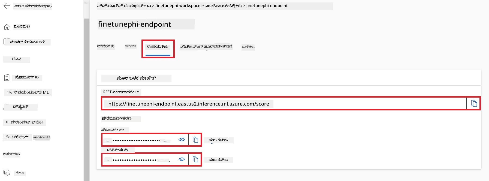

#### *flow.dag.yml* ಫೈಲ್‌ಗೆ ಕೋಡ್ ಸೇರಿಸಿ

1. Visual Studio Code ನಲ್ಲಿ *flow.dag.yml* ಫೈಲ್ ಅನ್ನು ತೆರೆಯಿರಿ.

1. *flow.dag.yml* ಗೆ ಕೆಳಗಿನ ಕೋಡ್ ಅನ್ನು ಸೇರಿಸಿ.

    ```yml
    inputs:
      input_data:
        type: string
        default: "Who founded Microsoft?"

    outputs:
      answer:
        type: string
        reference: ${integrate_with_promptflow.output}

    nodes:
    - name: integrate_with_promptflow
      type: python
      source:
        type: code
        path: integrate_with_promptflow.py
      inputs:
        input_data: ${inputs.input_data}
    ```

#### *integrate_with_promptflow.py* ಫೈಲ್‌ಗೆ ಕೋಡ್ ಸೇರಿಸಿ

1. Visual Studio Code ನಲ್ಲಿ *integrate_with_promptflow.py* ಫೈಲ್ ಅನ್ನು ತೆರೆಯಿರಿ.

1. *integrate_with_promptflow.py* ಗೆ ಕೆಳಗಿನ ಕೋಡ್ ಅನ್ನು ಸೇರಿಸಿ.

    ```python
    import logging
    import requests
    from promptflow.core import tool
    import asyncio
    import platform
    from config import (
        AZURE_ML_ENDPOINT,
        AZURE_ML_API_KEY
    )

    # ಲಾಗ್ ಸೆಟಪ್
    logging.basicConfig(
        format="%(asctime)s - %(levelname)s - %(name)s - %(message)s",
        datefmt="%Y-%m-%d %H:%M:%S",
        level=logging.DEBUG
    )
    logger = logging.getLogger(__name__)

    def query_azml_endpoint(input_data: list, endpoint_url: str, api_key: str) -> str:
        """
        Send a request to the Azure ML endpoint with the given input data.
        """
        headers = {
            "Content-Type": "application/json",
            "Authorization": f"Bearer {api_key}"
        }
        data = {
            "input_data": [input_data],
            "params": {
                "temperature": 0.7,
                "max_new_tokens": 128,
                "do_sample": True,
                "return_full_text": True
            }
        }
        try:
            response = requests.post(endpoint_url, json=data, headers=headers)
            response.raise_for_status()
            result = response.json()[0]
            logger.info("Successfully received response from Azure ML Endpoint.")
            return result
        except requests.exceptions.RequestException as e:
            logger.error(f"Error querying Azure ML Endpoint: {e}")
            raise

    def setup_asyncio_policy():
        """
        Setup asyncio event loop policy for Windows.
        """
        if platform.system() == 'Windows':
            asyncio.set_event_loop_policy(asyncio.WindowsSelectorEventLoopPolicy())
            logger.info("Set Windows asyncio event loop policy.")

    @tool
    def my_python_tool(input_data: str) -> str:
        """
        Tool function to process input data and query the Azure ML endpoint.
        """
        setup_asyncio_policy()
        return query_azml_endpoint(input_data, AZURE_ML_ENDPOINT, AZURE_ML_API_KEY)

    ```

### ನಿಮ್ಮ ಕಸ್ಟಮ್ ಮಾದರಿಯೊಂದಿಗೆ ಚಾಟ್ ಮಾಡಿ

1. *deploy_model.py* ಸ್ಕ್ರಿಪ್ಟ್ ಅನ್ನು ರನ್ ಮಾಡಲು ಮತ್ತು Azure ಮೆಶಿನ್ ಲರ್ನಿಂಗ್‌ನಲ್ಲಿ ಡಿಪ್ಲಾಯ್‌ಮೆಂಟ್ ಪ್ರಕ್ರಿಯೆಯನ್ನು ಪ್ರಾರಂಭಿಸಲು ಕೆಳಗಿನ ಆಜ್ಞೆಯನ್ನು ಟೈಪಿಸಿ.

    ```python
    pf flow serve --source ./ --port 8080 --host localhost
    ```

1. ಫಲಿತಾಂಶಗಳ ಉದಾಹರಣೆ ಇಲ್ಲಿದೆ: ಈಗ ನೀವು ನಿಮ್ಮ ಕಸ್ಟಮ್ Phi-3 ಮಾದರಿಯೊಂದಿಗೆ ಚಾಟ್ ಮಾಡಬಹುದು. ಫೈನ್-ಟ್ಯೂನಿಂಗ್‌ಗೆ ಬಳಸಿದ ಡೇಟಾದ ಆಧಾರದ ಮೇಲೆ ಪ್ರಶ್ನೆಗಳನ್ನು ನೀಡುವುದು ಶಿಫಾರಸು ಮಾಡಲಾಗಿದೆ.

    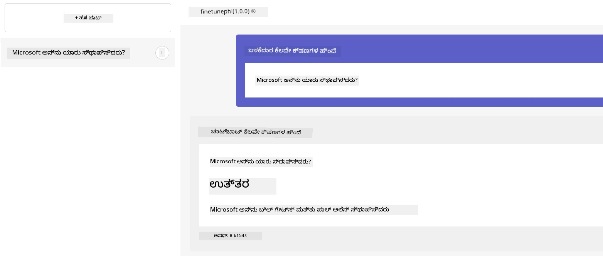

---

<!-- CO-OP TRANSLATOR DISCLAIMER START -->
**ಅಜ್ಞಾಪನೆ**:  
ಈ ದಾಖಲೆ AI ಅನುವಾದ ಸೇವೆ [Co-op Translator](https://github.com/Azure/co-op-translator) ಬಳಸಿ ಅನುವಾದಿಸಲಾಗಿದೆ. ನಾವು ನಿಖರತೆಯನ್ನು ಒತ್ತಾಯಿಸುತ್ತಿದ್ದರೂ, ಸ್ವಯಂಚಾಲಿತ ಅನುವಾದಗಳಲ್ಲಿ ಎರರಗಳು ಅಥವಾ ಅಸಮಾನತೆಗಳು ಇರುವ ಸಾಧ್ಯತೆ ಇದೆ ಎಂದು ದಯವಿಟ್ಟು ಗಮನಿಸಿ. ಮೂಲ ಭಾಷೆಯಲ್ಲಿನ ಪ್ರಾರಂಭಿಕ ದಾಖಲೆ ಈ ಮಾಹಿತಿಯ ಅಧಿಕೃತ ಮೂಲವಾಗಿರಬೇಕು. ಮಹತ್ವವಾದ ಮಾಹಿತಿಗೆ ವೃತ್ತಿಪರ ಮಾನವ ಅನುವಾದಿಕೆಯನ್ನು ಶಿಫಾರಸು ಮಾಡಲಾಗುತ್ತದೆ. ಈ ಅನುವಾದ ಬಳಕೆಯಿಂದ ಉಂಟಾಗುವ ಯಾವುದೇ ಕಳಪೆರ್ಥಗಳು ಅಥವಾ ತಪ್ಪು ಅರ್ಥೈಸಿಕೆಗಳಿಗೆ ನಾವು ಜವಾಬ್ದಾರಿಯಾಗಿರುವುದಿಲ್ಲ.
<!-- CO-OP TRANSLATOR DISCLAIMER END -->