<!--
CO_OP_TRANSLATOR_METADATA:
{
  "original_hash": "455be2b7b9c3390d367d528f8fab2aa0",
  "translation_date": "2025-12-21T20:37:50+00:00",
  "source_file": "md/02.Application/01.TextAndChat/Phi3/E2E_Phi-3-FineTuning_PromptFlow_Integration.md",
  "language_code": "kn"
}
-->
# Prompt flow ಸಹಿತ ಕಸ್ಟಮ್ Phi-3 ಮಾದರಿಗಳನ್ನು ಫೈನ್‑ಟ್ಯೂನ್ ಮಾಡಿ ಮತ್ತು ಏಕೀಕರಿಸಿ

ಈ ಎಂಡ್‑ಟು‑ಎಂಡ್ (E2E) ಉದಾಹರಣೆ Microsoft Tech Community ಯ ಲೇಖನ "[Fine-Tune and Integrate Custom Phi-3 Models with Prompt Flow: Step-by-Step Guide](https://techcommunity.microsoft.com/t5/educator-developer-blog/fine-tune-and-integrate-custom-phi-3-models-with-prompt-flow/ba-p/4178612?WT.mc_id=aiml-137032-kinfeylo)" ಆಧಾರಿತವಾಗಿದೆ. ಇದು ಫೈನ್‑ಟ್ಯೂನಿಂಗ್, ಡಿಪ್ಲಾಯ್‌ಮೆಂಟ್ ಮತ್ತು Prompt flow ಜೊತೆಗೆ ಕಸ್ಟಮ್ Phi-3 ಮಾದರಿಗಳ ಏಕೀಕರಣದ ಪ್ರಕ್ರಿಯೆಗಳನ್ನು ಪರಿಚಯಿಸುತ್ತದೆ.

## Overview

ಈ E2E ಉದಾಹರಣೆಯಲ್ಲಿ, ನೀವು Phi-3 ಮಾದರಿಯನ್ನು ಹೇಗೆ ಫೈನ್‑ಟ್ಯೂನ್ ಮಾಡಿ Prompt flow ಜೊತೆಗೆ ಏಕೀಕರಿಸಬಹುದು ಎಂಬುದನ್ನು ಕಲಿತೀರಿ. Azure Machine Learning ಮತ್ತು Prompt flow ಅನ್ನು ಉಪಯೋಗಿಸುವ ಮೂಲಕ, ನೀವು ಕಸ್ಟಮ್ AI ಮಾದರಿಗಳನ್ನು ಡಿಪ್ಲಾಯ್ ಮಾಡಲು ಮತ್ತು ಬಳಸಲು ಒಂದು ವರ್ಕ್‌ಫ್ಲೋ ಸ್ಥಾಪಿಸುತ್ತೀರಿ. ಈ E2E ಉದಾಹರಣೆ ಮೂರು ದೃಶ್ಯಾವಳಿಗಳಾಗಿ ವಿಂಗಡಿಸಲಾಗಿದೆ:

**ದೃಶ್ಯಾವಳಿ 1: Azure ಸಂಪನ್ಮೂಲಗಳನ್ನು ಸೆಟ್ ಅಪ್ ಮಾಡಿ ಮತ್ತು ಫೈನ್‑ಟ್ಯೂನಿಂಗ್‌ಗೆ ತಯಾರು ಮಾಡಿಕೊಳ್ಳಿ**

**ದೃಶ್ಯಾವಳಿ 2: Phi-3 ಮಾದರಿಯನ್ನು ಫೈನ್‑ಟ್ಯೂನ್ ಮಾಡಿ ಮತ್ತು Azure Machine Learning ಸ್ಟುಡಿಯೊದಲ್ಲಿ ಡಿಪ್ಲಾಯ್ ಮಾಡಿ**

**ದೃಶ್ಯಾವಳಿ 3: Prompt flow ಜೊತೆ ಏಕೀಕರಿಸಿ ಮತ್ತು ನಿಮ್ಮ ಕಸ್ಟಮ್ ಮಾದರಿಯೊಂದಿಗೆ ಚಾಟ್ ಮಾಡಿ**

ಇದು ಈ E2E ಉದಾಹರಣೆಯ ಒಂದು ಅವಲೋಕನವಾಗಿದೆ.


### Table of Contents

1. **[ದೃಶ್ಯಾವಳಿ 1: Azure ಸಂಪನ್ಮೂಲಗಳನ್ನು ಸೆಟ್ ಅಪ್ ಮಾಡಿ ಮತ್ತು ಫೈನ್‑ಟ್ಯೂನಿಂಗ್‌ಗೆ ತಯಾರಾಗಿರಿ](../../../../../../md/02.Application/01.TextAndChat/Phi3)**
    - [Azure Machine Learning ವರ್ಕ್‌ಸ್ಪೇಸ್ ಅನ್ನು ರಚಿಸಿ](../../../../../../md/02.Application/01.TextAndChat/Phi3)
    - [Azure ಸಬ್ಸ್ಕ್ರಿಪ್ಶನ್‌ನಲ್ಲಿ GPU ಕೋಟ್ಟಾ(Quota)ಗಳನ್ನು ಕೇಳಿ](../../../../../../md/02.Application/01.TextAndChat/Phi3)
    - [ರೋಲ್ ನಿಯೋಜನೆ ಸೇರಿಸಿ](../../../../../../md/02.Application/01.TextAndChat/Phi3)
    - [ಪ್ರಾಜೆಕ್ಟ್ ಸೆಟ್ ಅಪ್ ಮಾಡಿ](../../../../../../md/02.Application/01.TextAndChat/Phi3)
    - [ಫೈನ್‑ಟ್ಯೂನಿಂಗ್‌ಗೆ ಡೇಟಾಸೆಟ್ ತಯಾರಿಸಿ](../../../../../../md/02.Application/01.TextAndChat/Phi3)

1. **[ದೃಶ್ಯಾವಳಿ 2: Phi-3 ಮಾದರಿಯನ್ನು ಫೈನ್‑ಟ್ಯೂನ್ ಮಾಡಿ ಮತ್ತು Azure Machine Learning ಸ್ಟುಡಿಯೊದಲ್ಲಿ ಡಿಪ್ಲಾಯ್ ಮಾಡಿ](../../../../../../md/02.Application/01.TextAndChat/Phi3)**
    - [Azure CLI ಅನ್ನು ಸೆಟ್ ಅಪ್ ಮಾಡಿ](../../../../../../md/02.Application/01.TextAndChat/Phi3)
    - [Phi-3 ಮಾದರಿಯನ್ನು ಫೈನ್‑ಟ್ಯೂನ್ ಮಾಡಿ](../../../../../../md/02.Application/01.TextAndChat/Phi3)
    - [ಫೈನ್‑ಟ್ಯೂನ್ಡ್ ಮಾದರಿಯನ್ನು ಡಿಪ್ಲಾಯ್ ಮಾಡಿ](../../../../../../md/02.Application/01.TextAndChat/Phi3)

1. **[ದೃಶ್ಯಾವಳಿ 3: Prompt flow ಜೊತೆ ಏಕೀಕರಿಸಿ ಮತ್ತು ನಿಮ್ಮ ಕಸ್ಟಮ್ ಮಾದರಿಯೊಂದಿಗೆ ಚಾಟ್ ಮಾಡಿ](../../../../../../md/02.Application/01.TextAndChat/Phi3)**
    - [ಕಸ್ಟಮ್ Phi-3 ಮಾದರಿಯನ್ನು Prompt flow ಜೊತೆ ಏಕೀಕರಿಸಿ](../../../../../../md/02.Application/01.TextAndChat/Phi3)
    - [ನಿಮ್ಮ ಕಸ್ಟಮ್ ಮಾದರಿಯೊಂದಿಗೆ ಚಾಟ್ ಮಾಡಿ](../../../../../../md/02.Application/01.TextAndChat/Phi3)

## Scenario 1: Set up Azure resources and Prepare for fine-tuning

### Create an Azure Machine Learning Workspace

1. ಪೋರ್ಟಲ್ ಪುಟದ ಮೇಲ್ಭಾಗದಲ್ಲಿ ಇರುವ **search bar** ನಲ್ಲಿ *azure machine learning* ಎಂದು ಟೈಪ್ ಮಾಡಿ ಮತ್ತು ಕಾಣುವ ಆಯ್ಕೆಗಳಲ್ಲಿ **Azure Machine Learning** ಅನ್ನು ಆಯ್ಕೆಮಾಡಿ.

    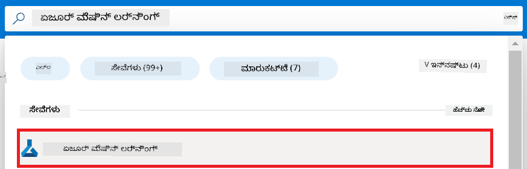

1. ನ್ಯಾವಿಗೇಶನ್ ಮெனುವಿನಿಂದ **+ Create** ಅನ್ನು ಆಯ್ಕೆಮಾಡಿ.

1. ನ್ಯಾವಿಗೇಶನ್ ಮெனುವಿನಿಂದ **New workspace** ಅನ್ನು ಆಯ್ಕೆಮಾಡಿ.

    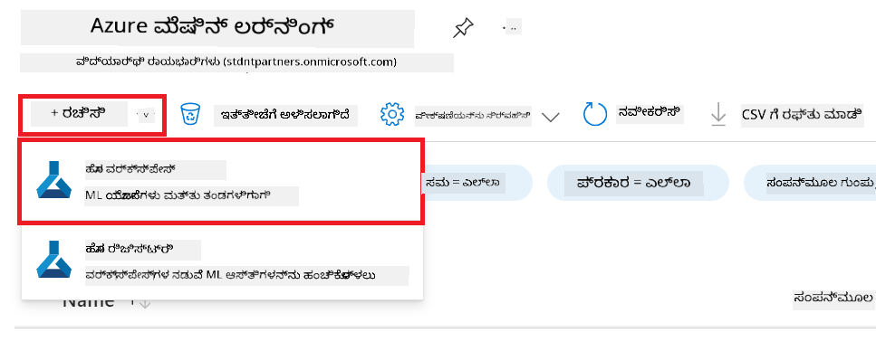

1. ಕೆಳಗಿನ ಕಾರ್ಯಗಳನ್ನು ನಿರ್ವಹಿಸಿ:

    - ನಿಮ್ಮ Azure **Subscription** ಅನ್ನು ಆಯ್ಕೆಮಾಡಿ.
    - ಉಪಯೋಗಿಸಲು **Resource group** ಅನ್ನು ಆಯ್ಕೆಮಾಡಿ (ಅವಶ್ಯಕತೆ ಇದ್ದಲ್ಲಿ ಹೊಸದನ್ನು ರಚಿಸಿ).
    - **Workspace Name** ನಮೂದಿಸಿ. ಇದು ಏಕೈಕವಾಗಿರಬೇಕು.
    - ನೀವು ಬಳಸಲು ಬಯಸುವ **Region** ಅನ್ನು ಆಯ್ಕೆಮಾಡಿ.
    - ಉಪಯೋಗಿಸಲು **Storage account** ಅನ್ನು ಆಯ್ಕೆಮಾಡಿ (ಅವಶ್ಯಕತೆ ಇದ್ದಲ್ಲಿ ಹೊಸದನ್ನು ರಚಿಸಿ).
    - ಉಪಯೋಗಿಸಲು **Key vault** ಅನ್ನು ಆಯ್ಕೆಮಾಡಿ (ಅವಶ್ಯಕತೆ ಇದ್ದಲ್ಲಿ ಹೊಸದನ್ನು ರಚಿಸಿ).
    - ಉಪಯೋಗಿಸಲು **Application insights** ಅನ್ನು ಆಯ್ಕೆಮಾಡಿ (ಅವಶ್ಯಕತೆ ಇದ್ದಲ್ಲಿ ಹೊಸದನ್ನು ರಚಿಸಿ).
    - ಉಪಯೋಗಿಸಲು **Container registry** ಅನ್ನು ಆಯ್ಕೆಮಾಡಿ (ಅವಶ್ಯಕತೆ ಇದ್ದಲ್ಲಿ ಹೊಸದನ್ನು ರಚಿಸಿ).

    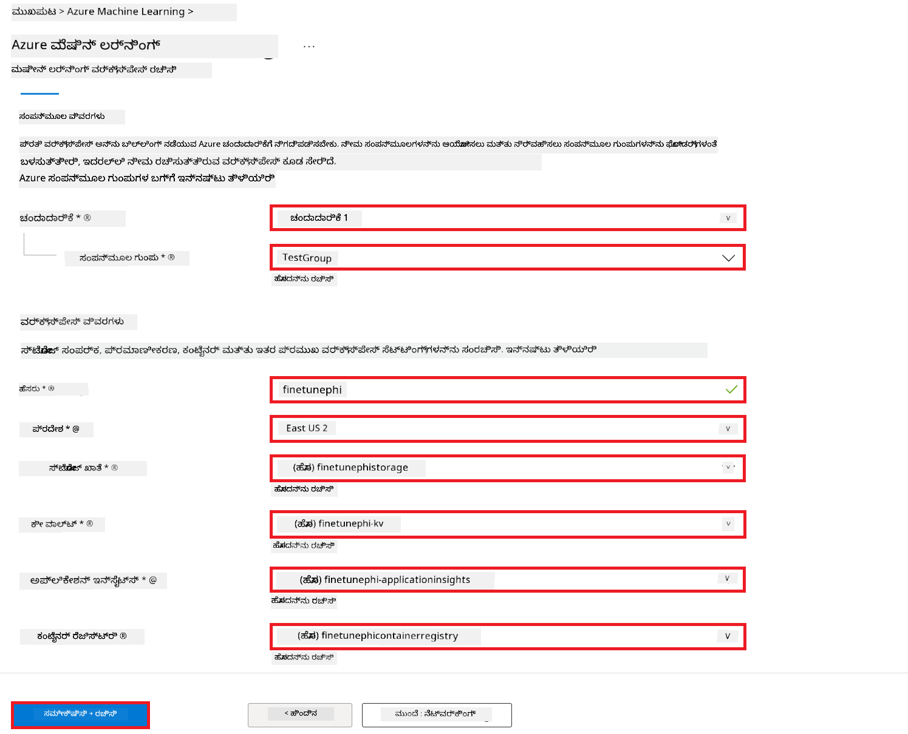

1. **Review + Create** ಅನ್ನು ಆಯ್ಕೆಮಾಡಿ.

1. **Create** ಅನ್ನು ಆಯ್ಕೆಮಾಡಿ.

### Request GPU quotas in Azure Subscription

ಈ E2E ಉದಾಹರಣೆಯಲ್ಲಿ, ಫೈನ್‑ಟ್ಯೂನಿಂಗ್‌ಗಾಗಿ *Standard_NC24ads_A100_v4 GPU* ಅನ್ನು ಬಳಸಲಾಗುತ್ತದೆ, ಇದು ಕೋಟ್ಟಾ ವಿನಂತಿಯನ್ನು талапಿಸುತ್ತದೆ, ಮತ್ತು ಡಿಪ್ಲಾಯ್‌ಮೆಂಟ್‌‌ಗಾಗಿ *Standard_E4s_v3* CPU ಅನ್ನು ಬಳಸಲಾಗುತ್ತದೆ, ಇದು ಕೋಟ್ಟಾ ವಿನಂತಿಯನ್ನು ಅವಶ್ಯಕವಾಗಿಸುದಿಲ್ಲ.

> [!NOTE]
>
> ಕಡತ-ಗಮನಿಕೆ: Only Pay-As-You-Go subscriptions (the standard subscription type) are eligible for GPU allocation; benefit subscriptions are not currently supported.
>
> ಫಾಯ್ಬೆನೆಟ್ ಸಬ್ಸ್ಕ್ರಿಪ್ಶನ್‌ಗಳನ್ನು (ಉದಾಹರಣೆಗೆ Visual Studio Enterprise Subscription) ಬಳಸುತ್ತಿರುವವರು ಅಥವಾ ಫೈನ್‑ಟ್ಯೂನಿಂಗ್ ಮತ್ತು ಡಿಪ್ಲಾಯ್‌ಮೆಂಟ್ ಪ್ರಕ್ರಿಯೆಯನ್ನು ತ್ವರಿತವಾಗಿ ಪರೀಕ್ಷಿಸಲು ಬಯಸುವವರು ಕನಿಷ್ಠ ಡೇಟಾಸೆಟ್‌ನೊಂದಿಗೆ CPU ಬಳಸಿ ಫೈನ್‑ಟ್ಯೂನ್ ಮಾಡುವ ಮಾರ್ಗದರ್ಶನವನ್ನು ಈ ಟ್ಯುಟೋರಿಯಲ್ ನೀಡುತ್ತದೆ. ಆದರೆ, ದೊಡ್ಡ ಡೇಟಾಸೆಟ್‌ಗಳೊಂದಿಗೆ GPU ಬಳಿಸಿದರೆ ಫೈನ್‑ಟ್ಯೂನಿಂಗ್ ಫಲಿತಾಂಶಗಳು ಬಹುಮಟ್ಟಿಗೆ ಉತ್ತಮವಾಗುತ್ತವೆ ಎಂಬುದನ್ನು ಗಮನದಲ್ಲಿಡಿ.

1. [Azure ML Studio](https://ml.azure.com/home?wt.mc_id=studentamb_279723)‌ಗೆ ಭೇಟಿ ನೀಡಿ.

1. *Standard NCADSA100v4 Family* ಕೋಟ್ಟಾಗೆ ಬೇಡಿಕೆ ಸಲ್ಲಿಸಲು ಕೆಳಗಿನ ಕಾರ್ಯಗಳನ್ನು ನಿರ್ವಹಿಸಿ:

    - ಎಡದ ಬಾಗಿಲಿನ ಟ್ಯಾಬ್‌ನಿಂದ **Quota** ಅನ್ನು ಆಯ್ಕೆಮಾಡಿ.
    - ಬಳಸಲು ಇಚ್ಛಿಸುವ **Virtual machine family** ಅನ್ನು ಆಯ್ಕೆಮಾಡಿ. ಉದಾಹರಣೆಗೆ, *Standard NCADSA100v4 Family Cluster Dedicated vCPUs* ಅನ್ನು ಆಯ್ಕೆಮಾಡಿ, ಇದು *Standard_NC24ads_A100_v4* GPU ಅನ್ನು ಒಳಗೊಂಡಿದೆ.
    - ನ್ಯಾವಿಗೇಶನ್ ಮெனುವಿನಿಂದ **Request quota** ಅನ್ನು ಆಯ್ಕೆಮಾಡಿ.

        

    - Request quota ಪುಟದ ಒಳಗೆ, ನೀವು ಬಳಸಲು ಬಯಸುವ **New cores limit** ಅನ್ನು ನಮೂದಿಸಿ. ಉದಾಹರಣೆಗೆ, 24.
    - Request quota ಪುಟದ ಒಳಗೆ, GPU ಕೋಟ್ಟಾ ಬೇಡಿಕೆಯಾಗಿ **Submit** ಅನ್ನು ಆಯ್ಕೆಮಾಡಿ.

> [!NOTE]
> ನೀವು ನಿಮ್ಮ ಅಗತ್ಯಗಳಿಗೆ ಅನುಗುಣವಾಗಿ ಸೂಕ್ತ GPU ಅಥವಾ CPU ಅನ್ನು ಆಯ್ಕೆಮಾಡಬಹುದು; ವಿವರಗಳಿಗೆ [Sizes for Virtual Machines in Azure](https://learn.microsoft.com/azure/virtual-machines/sizes/overview?tabs=breakdownseries%2Cgeneralsizelist%2Ccomputesizelist%2Cmemorysizelist%2Cstoragesizelist%2Cgpusizelist%2Cfpgasizelist%2Chpcsizelist) ಡಾಕ್ಯುಮೆಂಟ್ ಅನ್ನು ನೋಡಿ.

### Add role assignment

ನಿಮ್ಮ ಮಾದರಿಗಳನ್ನು ಫೈನ್‑ಟ್ಯೂನ್ ಮತ್ತು ಡಿಪ್ಲಾಯ್ ಮಾಡಲು, ಮೊದಲು User Assigned Managed Identity (UAI) ರಚಿಸಿ ಮತ್ತು ಅದಕ್ಕೆ ಸಂಬಂಧಿಸಿದ ಅನುಮತಿಗಳನ್ನು ನಿಯೋಜಿಸಬೇಕು. ಈ UAI ಅನ್ನು ಡಿಪ್ಲಾಯ್‌ಮೆಂಟ್ ಸಮಯದಲ್ಲಿ ಲಾಗಿನ್ ಮಾಡುವಂತೆ ಬಳಸಲಾಗುತ್ತದೆ.

#### Create User Assigned Managed Identity(UAI)

1. ಪೋರ್ಟಲ್ ಪುಟದ ಮೇಲ್ಭಾಗದಲ್ಲಿರುವ **search bar** ನಲ್ಲಿ *managed identities* ಎಂದು ಟೈಪ್ ಮಾಡಿ ಮತ್ತು ಕಾಣುವ ಆಯ್ಕೆಗಳಲ್ಲಿ **Managed Identities** ಅನ್ನು ಆಯ್ಕೆಮಾಡಿ.

    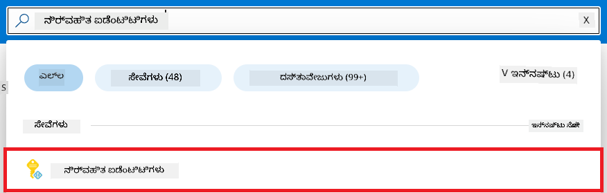

1. **+ Create** ಅನ್ನು ಆಯ್ಕೆಮಾಡಿ.

    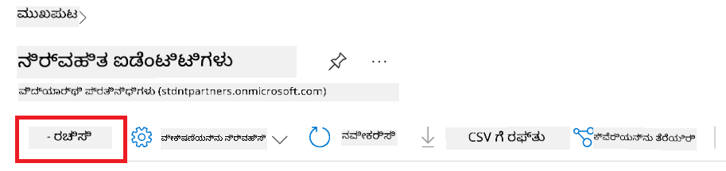

1. ಕೆಳಗಿನ ಕಾರ್ಯಗಳನ್ನು ನಿರ್ವಹಿಸಿ:

    - ನಿಮ್ಮ Azure **Subscription** ಅನ್ನು ಆಯ್ಕೆಮಾಡಿ.
    - ಉಪಯೋಗಿಸಲು **Resource group** ಅನ್ನು ಆಯ್ಕೆಮಾಡಿ (ಅವಶ್ಯಕತೆ ಇದ್ದಲ್ಲಿ ಹೊಸದನ್ನು ರಚಿಸಿ).
    - ನೀವು ಬಳಸಲು ಬಯಸುವ **Region** ಅನ್ನು ಆಯ್ಕೆಮಾಡಿ.
    - **Name** ನಮೂದಿಸಿ. ಇದು ಏಕೈಕವಾಗಿರಬೇಕು.

1. **Review + create** ಅನ್ನು ಆಯ್ಕೆಮಾಡಿ.

1. **+ Create** ಅನ್ನು ಆಯ್ಕೆಮಾಡಿ.

#### Add Contributor role assignment to Managed Identity

1. ನೀವು ರಚಿಸಿದ Managed Identity ಸಂಪನ್ಮೂಲಕ್ಕೆ ನ್ಯಾವಿಗೇಟ್ ಮಾಡಿ.

1. ಎಡ ಬದಿಯ ಟ್ಯಾಬ್‌ನಿಂದ **Azure role assignments** ಅನ್ನು ಆಯ್ಕೆಮಾಡಿ.

1. ನ್ಯಾವಿಗೇಶನ್ ಮெனುವಿನಿಂದ **+Add role assignment** ಅನ್ನು ಆಯ್ಕೆಮಾಡಿ.

1. Add role assignment ಪುಟದ ಒಳಗೆ, ಕೆಳಗಿನ ಕಾರ್ಯಗಳನ್ನು ನಿರ್ವಹಿಸಿ:
    - **Scope** ಅನ್ನು **Resource group** ಗೆ ಸೆಟ್ ಮಾಡಿ.
    - ನಿಮ್ಮ Azure **Subscription** ಅನ್ನು ಆಯ್ಕೆಮಾಡಿ.
    - ಉಪಯೋಗಿಸಲು **Resource group** ಅನ್ನು ಆಯ್ಕೆಮಾಡಿ.
    - **Role** ಅನ್ನು **Contributor** ಗೆ ಸೆಟ್ ಮಾಡಿ.

    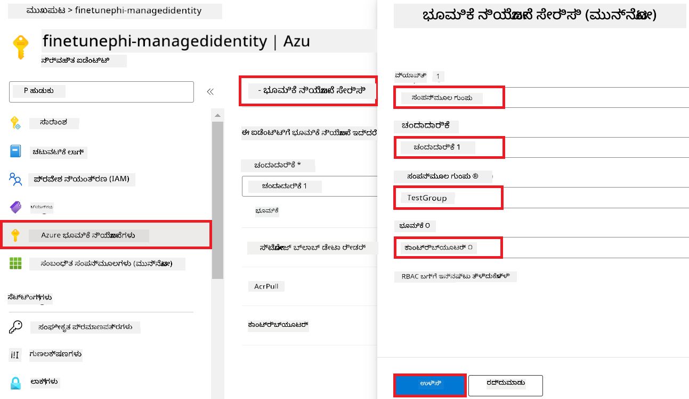

1. **Save** ಅನ್ನು ಆಯ್ಕೆಮಾಡಿ.

#### Add Storage Blob Data Reader role assignment to Managed Identity

1. ಪೋರ್ಟಲ್ ಪುಟದ ಮೇಲ್ಭಾಗದಲ್ಲಿರುವ **search bar** ನಲ್ಲಿ *storage accounts* ಎಂದು ಟೈಪ್ ಮಾಡಿ ಮತ್ತು ಕಾಣುವ ಆಯ್ಕೆಗಳಲ್ಲಿ **Storage accounts** ಅನ್ನು ಆಯ್ಕೆಮಾಡಿ.

    

1. ನೀವು ರಚಿಸಿದ Azure Machine Learning ವರ್ಕ್‌ಸ್ಪೇಸ್‌ಗೆ ಸಂಬಂಧಿಸಿದ ಸ್ಟೋರ್‌ಜೆ ಖಾತೆಯನ್ನು ಆಯ್ಕೆಮಾಡಿ. ಉದಾಹರಣೆಗೆ, *finetunephistorage*.

1. Add role assignment ಪುಟಕ್ಕೆ ನ್ಯಾವಿಗೇಟ್ ಮಾಡಲು ಕೆಳಗಿನ ಕಾರ್ಯಗಳನ್ನು ನಿರ್ವಹಿಸಿ:

    - ನೀವು ರಚಿಸಿದ Azure Storage ಖಾತೆಗೆ ನ್ಯಾವಿಗೇಟ್ ಮಾಡಿ.
    - ಎಡ ಬದಿಯ ಟ್ಯಾಬ್‌ನಿಂದ **Access Control (IAM)** ಅನ್ನು ಆಯ್ಕೆಮಾಡಿ.
    - ನ್ಯಾವಿಗೇಶನ್ ಮெனುವಿಂದ **+ Add** ಅನ್ನು ಆಯ್ಕೆಮಾಡಿ.
    - ನ್ಯಾವಿಗೇಶನ್ ಮெனುವಿಂದ **Add role assignment** ಅನ್ನು ಆಯ್ಕೆಮಾಡಿ.

    

1. Add role assignment ಪುಟದ ಒಳಗೆ, ಕೆಳಗಿನ ಕಾರ್ಯಗಳನ್ನು ನಿರ್ವಹಿಸಿ:

    - Role ಪುಟದ ಒಳಗೆ, **search bar** ನಲ್ಲಿ *Storage Blob Data Reader* ಅನ್ನು ಟೈಪ್ ಮಾಡಿ ಮತ್ತು ಕಾಣುವ ಆಯ್ಕೆಗಳಲ್ಲಿ **Storage Blob Data Reader** ಅನ್ನು ಆಯ್ಕೆಮಾಡಿ.
    - Role ಪುಟದ ಒಳಗೆ, **Next** ಅನ್ನು ಆಯ್ಕೆಮಾಡಿ.
    - Members ಪುಟದೊಳಗೆ, **Assign access to** ಯಾಗಿ **Managed identity** ಅನ್ನು ಆಯ್ಕೆಮಾಡಿ.
    - Members ಪುಟದೊಳಗೆ, **+ Select members** ಅನ್ನು ಆಯ್ಕೆಮಾಡಿ.
    - Select managed identities ಪುಟದಲ್ಲಿಗೆ, ನಿಮ್ಮ Azure **Subscription** ಅನ್ನು ಆಯ್ಕೆಮಾಡಿ.
    - Select managed identities ಪುಟದಲ್ಲಿಗೆ, **Managed identity** ಆಯ್ಕೆಯನ್ನು **Manage Identity** ಗೆ ಸೆಟ್ ಮಾಡಿ.
    - Select managed identities ಪುಟದಲ್ಲಿಗೆ, ನೀವು ರಚಿಸಿದ Manage Identity ಅನ್ನು ಆಯ್ಕೆಮಾಡಿ. ಉದಾಹರಣೆಗೆ, *finetunephi-managedidentity*.
    - Select managed identities ಪುಟದಲ್ಲಿಗೆ, **Select** ಅನ್ನು ಆಯ್ಕೆಮಾಡಿ.

    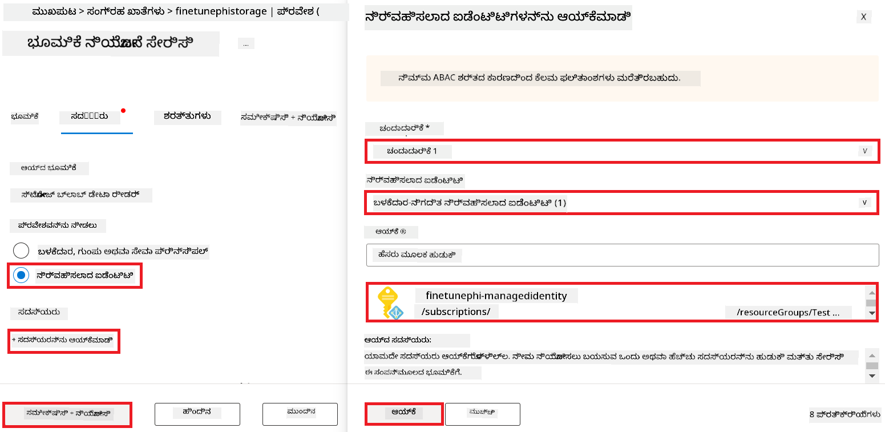

1. **Review + assign** ಅನ್ನು ಆಯ್ಕೆಮಾಡಿ.

#### Add AcrPull role assignment to Managed Identity

1. ಪೋರ್ಟಲ್ ಪುಟದ ಮೇಲ್ಭಾಗದಲ್ಲಿರುವ **search bar** ನಲ್ಲಿ *container registries* ಎಂದು ಟೈಪ್ ಮಾಡಿ ಮತ್ತು ಕಾಣುವ ಆಯ್ಕೆಗಳಲ್ಲಿ **Container registries** ಅನ್ನು ಆಯ್ಕೆಮಾಡಿ.

    

1. Azure Machine Learning ವರ್ಕ್‌ಸ್ಪೇಸ್‌ಗೆ ಸಂಬಂಧಿಸಿದ container registry ಅನ್ನು ಆಯ್ಕೆಮಾಡಿ. ಉದಾಹರಣೆಗೆ, *finetunephicontainerregistries*

1. Add role assignment ಪುಟಕ್ಕೆ ನ್ಯಾವಿಗೇಟ್ ಮಾಡಲು ಕೆಳಗಿನ ಕಾರ್ಯಗಳನ್ನು ನಿರ್ವಹಿಸಿ:

    - ಎಡ ಬದಿಯ ಟ್ಯಾಬ್‌ನಿಂದ **Access Control (IAM)** ಅನ್ನು ಆಯ್ಕೆಮಾಡಿ.
    - ನ್ಯಾವಿಗೇಶನ್ ಮெனುವಿಂದ **+ Add** ಅನ್ನು ಆಯ್ಕೆಮಾಡಿ.
    - ನ್ಯಾವಿಗೇಶನ್ ಮெனುವಿಂದ **Add role assignment** ಅನ್ನು ಆಯ್ಕೆಮಾಡಿ.

1. Add role assignment ಪುಟದ ಒಳಗೆ, ಕೆಳಗಿನ ಕಾರ್ಯಗಳನ್ನು ನಿರ್ವಹಿಸಿ:

    - Role ಪುಟದ ಒಳಗೆ, **search bar** ನಲ್ಲಿ *AcrPull* ಎಂದು ಟೈಪ್ ಮಾಡಿ ಮತ್ತು ಕಾಣುವ ಆಯ್ಕೆಗಳಲ್ಲಿ **AcrPull** ಅನ್ನು ಆಯ್ಕೆಮಾಡಿ.
    - Role ಪುಟದ ಒಳಗೆ, **Next** ಅನ್ನು ಆಯ್ಕೆಮಾಡಿ.
    - Members ಪುಟದೊಳಗೆ, **Assign access to** ಯಾಗಿ **Managed identity** ಅನ್ನು ಆಯ್ಕೆಮಾಡಿ.
    - Members ಪುಟದೊಳಗೆ, **+ Select members** ಅನ್ನು ಆಯ್ಕೆಮಾಡಿ.
    - Select managed identities ಪುಟದಲ್ಲಿಗೆ, ನಿಮ್ಮ Azure **Subscription** ಅನ್ನು ಆಯ್ಕೆಮಾಡಿ.
    - Select managed identities ಪುಟದಲ್ಲಿಗೆ, **Managed identity** ಆಯ್ಕೆಯನ್ನು **Manage Identity** ಗೆ ಸೆಟ್ ಮಾಡಿ.
    - Select managed identities ಪುಟದಲ್ಲಿಗೆ, ನೀವು ರಚಿಸಿದ Manage Identity ಅನ್ನು ಆಯ್ಕೆಮಾಡಿ. ಉದಾಹರಣೆಗೆ, *finetunephi-managedidentity*.
    - Select managed identities ಪುಟದಲ್ಲಿಗೆ, **Select** ಅನ್ನು ಆಯ್ಕೆಮಾಡಿ.
    - **Review + assign** ಅನ್ನು ಆಯ್ಕೆಮಾಡಿ.

### Set up project

ಈಗ, ನೀವು ಕೆಲಸ ಮಾಡುವ ಫೋಲ್ಡರ್ ಅನ್ನು ರಚಿಸಿ ಮತ್ತು ಬಳಕೆದಾರರೊಂದಿಗೆ ಪರಸ್ಪರ ಕ್ರಿಯೆ ನಡೆಸುವ ಪ್ರೋಗ್ರಾಮ್ ಅನ್ನು ಅಭಿವೃದ್ಧಿಪಡಿಸಲು ವರ್ಚುಯಲ್ ಎನ್ನುವಿರಾನ್ಮೆಂಟ್ ಅನ್ನು ಸೆಟ್ ಅಪ್ ಮಾಡಿ, ಜೊತೆಗೆ Azure Cosmos DB ನಲ್ಲಿರುವ ಸಂಗ್ರಹಿತ ಚಾಟ್ ಇತಿಹಾಸವನ್ನು ಅದರ ಉತ್ತರಗಳಿಗೆ ಸಂದರ್ಭ ನೀಡಿ ಬಳಸಲು ಸಿದ್ಧಪಡಿಸಲಿ.

#### Create a folder to work inside it

1. ಟರ್ಮಿನಲ್ ವಿಂಡೋ ಓಪನ್ ಮಾಡಿ ಮತ್ತು ಡೀಫಾಲ್ಟ್ ಪಾತ್ನಲ್ಲಿ *finetune-phi* ಎಂಬ ಹೆಸರಿನ ಫೋಲ್ಡರ್ ರಚಿಸಲು ಕೆಳಗಿನ ಕಮಾಂಡ್ ಟೈಪ್ ಮಾಡಿ.

    ```console
    mkdir finetune-phi
    ```

1. ನೀವು ರಚಿಸಿದ *finetune-phi* ಫೋಲ್ಡರ್‌ಗೆ ನ್ಯಾವಿಗೇಟ್ ಮಾಡಲು ಟರ್ಮಿನಲ್‌ನಲ್ಲಿ ಕೆಳಗಿನ ಕಮಾಂಡ್ ಟೈಪ್ ಮಾಡಿ.

    ```console
    cd finetune-phi
    ```

#### Create a virtual environment

1. *.venv* ಎಂಬ ಹೆಸರಿನ ವರ್ಚುಯಲ್ ಎನ್ವಿರಾನ್ಮೆಂಟ್ ರಚಿಸಲು ಟರ್ಮಿನಲ್‌ನಲ್ಲಿ ಕೆಳಗಿನ ಕಮಾಂಡ್ ಟೈಪ್ ಮಾಡಿ.

    ```console
    python -m venv .venv
    ```

1. ವರ್ಚುಯಲ್ ಎನ್ವಿರಾನ್ಮೆಂಟ್ ಅನ್ನು ಸಕ್ರಿಯಗೊಳಿಸಲು ಟರ್ಮಿನಲ್‌ನಲ್ಲಿ ಕೆಳಗಿನ ಕಮಾಂಡ್ ಟೈಪ್ ಮಾಡಿ.

    ```console
    .venv\Scripts\activate.bat
    ```

> [!NOTE]
>
> ಇದು ಸಫಲವಾಗಿದ್ದರೆ, ಕಮಾಂಡ್ ಪ್ರಾಂಪ್ಟ್ алдында *(.venv)* ಕಾಣಿಸಬೇಕು.

#### Install the required packages

1. ಅಗತ್ಯವಾದ ಪ್ಯಾಕೇಜ್‌ಗಳನ್ನು ಇನ್ಸ್ಟಾಲ್ ಮಾಡಲು ಟರ್ಮಿನಲ್‌ನಲ್ಲಿ ಕೆಳಗಿನ ಕಮಾಂಡ್‌ಗಳನ್ನು ಟೈಪ್ ಮಾಡಿ.

    ```console
    pip install datasets==2.19.1
    pip install transformers==4.41.1
    pip install azure-ai-ml==1.16.0
    pip install torch==2.3.1
    pip install trl==0.9.4
    pip install promptflow==1.12.0
    ```

#### Create project files
ಈ ವ್ಯಾಯಾಮದಲ್ಲಿ, ನೀವು ನಮ್ಮ ಪ್ರಾಜೆಕ್ಟ್‌ಗಾಗಿ ಅಗತ್ಯವಿರುವ ಫೈಲ್‌ಗಳನ್ನು ರಚಿಸುತ್ತೀರಿ. ಈ ಫೈಲ್‌ಗಳಲ್ಲಿ ಡೇಟಾಸೆಟ್ ಡೌನ್‌ಲೋಡ್ ಮಾಡಲು ಸ್ಕ್ರಿಪ್ಟ್‌ಗಳು, Azure Machine Learning ಪರಿಸರವನ್ನು ಸೆಟ್ ಅಪ್ ಮಾಡುವದು, Phi-3 ಮಾದರಿಯನ್ನು ಫೈನ್-ಟ್ಯೂನ್ ಮಾಡುವದು ಮತ್ತು ಫೈನ್-ಟ್ಯೂನ್ ಮಾಡಿದ ಮಾದರಿಯನ್ನು ಡಿಪ್ಲಾಯ್ ಮಾಡುವದು ಸೇರಿವೆ. ನೀವು ಫೈನ್-ಟ್ಯೂನಿಂಗ್ ಪರಿಸರವನ್ನು ಸೆಟ್ ಅಪ್ ಮಾಡಲು *conda.yml* ಫೈಲ್ ಅನ್ನು ಕೂಡ ರಚಿಸುತ್ತೀರಿ.

ಈ ವ್ಯಾಯಾಮದಲ್ಲಿ ನೀವು:

- ಡೇಟಾಸೆಟ್ ಡೌನ್‌ಲೋಡ್ ಮಾಡಲು *download_dataset.py* ಫೈಲ್ ಅನ್ನು ರಚಿಸಿ.
- Azure Machine Learning ಪರಿಸರವನ್ನು ಸೆಟ್ ಅಪ್ ಮಾಡಲು *setup_ml.py* ಫೈಲ್ ಅನ್ನು ರಚಿಸಿ.
- ಡೇಟಾಸೆಟ್ ಬಳಸಿ Phi-3 ಮಾದರಿಯನ್ನು ಫೈನ್-ಟ್ಯೂನು ಮಾಡಲು *finetuning_dir* ಫೋಲ್ಡರ್‌ನಲ್ಲಿ *fine_tune.py* ಫೈಲ್ ಅನ್ನು ರಚಿಸಿ.
- ಫೈನ್-ಟ್ಯೂನಿಂಗ್ ಪರಿಸರವನ್ನು ಸೆಟ್ ಅಪ್ ಮಾಡಲು *conda.yml* ಫೈಲ್ ಅನ್ನು ರಚಿಸಿ.
- ಫೈನ್-ಟ್ಯೂನ್ ಮಾಡಿದ ಮಾದರಿಯನ್ನು ಡಿಪ್ಲಾಯ್ ಮಾಡಲು *deploy_model.py* ಫೈಲ್ ಅನ್ನು ರಚಿಸಿ.
- ಫೈನ್-ಟ್ಯೂನ್ ಮಾಡಿದ ಮಾದರಿಯನ್ನು Prompt flow ಜೊತೆ ಸಂಯೋಜಿಸಲು ಮತ್ತು ಮಾದರಿಯನ್ನು Prompt flow ಮೂಲಕ ನಿರ್ವಹಿಸಲು *integrate_with_promptflow.py* ಫೈಲ್ ಅನ್ನು ರಚಿಸಿ.
- Prompt flow ಪ್ರಾರಂಭಿಕ ಕೆಲಸದ ವ್ಯವಸ್ಥೆಯನ್ನು ಸಿದ್ಧಪಡಿಸಲು flow.dag.yml ಫೈಲ್ ಅನ್ನು ರಚಿಸಿ.
- Azure ಮಾಹಿತಿ ನಮೂದಿಸಲು *config.py* ಫೈಲ್ ಅನ್ನು ರಚಿಸಿ.

> [!NOTE]
>
> ಸಂಪೂರ್ಣ ಫೋಲ್ಡರ್ ರಚನೆ:
>
> ```text
> └── YourUserName
> .    └── finetune-phi
> .        ├── finetuning_dir
> .        │      └── fine_tune.py
> .        ├── conda.yml
> .        ├── config.py
> .        ├── deploy_model.py
> .        ├── download_dataset.py
> .        ├── flow.dag.yml
> .        ├── integrate_with_promptflow.py
> .        └── setup_ml.py
> ```

1. **Visual Studio Code** ಅನ್ನು ತೆರೆಯಿರಿ.

1. ಮೆನು ಬಾರ್‌ನಿಂದ **File** ಅನ್ನು ಆಯ್ಕೆಮಾಡಿ.

1. **Open Folder** ಅನ್ನು ಆಯ್ಕೆಮಾಡಿ.

1. ನೀವು ರಚಿಸಿದ *finetune-phi* ಫೋಲ್ಡರ್ ಅನ್ನು ಆಯ್ಕೆಮಾಡಿ, ಅದು *C:\Users\yourUserName\finetune-phi* ನಲ್ಲಿ ಇದೆ.

    

1. Visual Studio Code‌ನ ಎಡ ಪೇನ್‌ನಲ್ಲಿ, ರೈಟ್-ಕ್ಲಿಕ್ ಮಾಡಿ ಮತ್ತು **New File** ಅನ್ನು ಆಯ್ಕೆಮಾಡಿ ಮತ್ತು *download_dataset.py* ಎಂಬ ಹೊಸ ಫೈಲ್ ರಚಿಸಿ.

1. Visual Studio Code‌ನ ಎಡ ಪೇನ್‌ನಲ್ಲಿ, ರೈಟ್-ಕ್ಲಿಕ್ ಮಾಡಿ ಮತ್ತು **New File** ಅನ್ನು ಆಯ್ಕೆಮಾಡಿ ಮತ್ತು *setup_ml.py* ಎಂಬ ಹೊಸ ಫೈಲ್ ರಚಿಸಿ.

1. Visual Studio Code‌ನ ಎಡ ಪೇನ್‌ನಲ್ಲಿ, ರೈಟ್-ಕ್ಲಿಕ್ ಮಾಡಿ ಮತ್ತು **New File** ಅನ್ನು ಆಯ್ಕೆಮಾಡಿ ಮತ್ತು *deploy_model.py* ಎಂಬ ಹೊಸ ಫೈಲ್ ರಚಿಸಿ.

    

1. Visual Studio Code‌ನ ಎಡ ಪೇನ್‌ನಲ್ಲಿ, ರೈಟ್-ಕ್ಲಿಕ್ ಮಾಡಿ ಮತ್ತು **New Folder** ಅನ್ನು ಆಯ್ಕೆಮಾಡಿ ಮತ್ತು *finetuning_dir* ಎಂಬ ಹೊಸ ಫೋಲ್ಡರ್ ರಚಿಸಿ.

1. *finetuning_dir* ಫೋಲ್ಡರ್‌ನಲ್ಲಿ, *fine_tune.py* ಎಂಬ ಹೊಸ ಫೈಲ್ ರಚಿಸಿ.

#### Create and Configure *conda.yml* file

1. Visual Studio Code‌ನ ಎಡ ಪೇನ್‌ನಲ್ಲಿ, ರೈಟ್-ಕ್ಲಿಕ್ ಮಾಡಿ ಮತ್ತು **New File** ಅನ್ನು ಆಯ್ಕೆಮಾಡಿ ಮತ್ತು *conda.yml* ಎಂಬ ಹೊಸ ಫೈಲ್ ರಚಿಸಿ.

1. Phi-3 ಮಾದರಿಗಾಗಿ ಫೈನ್-ಟ್ಯೂನಿಂಗ್ ಪರಿಸರವನ್ನು ಸೆಟ್ ಅಪ್ ಮಾಡುವುದಕ್ಕಾಗಿ ಕೆಳಗಿನ ಕೋಡ್ ಅನ್ನು *conda.yml* ಫೈಲಿಗೆ ಸೇರಿಸಿ.

    ```yml
    name: phi-3-training-env
    channels:
      - defaults
      - conda-forge
    dependencies:
      - python=3.10
      - pip
      - numpy<2.0
      - pip:
          - torch==2.4.0
          - torchvision==0.19.0
          - trl==0.8.6
          - transformers==4.41
          - datasets==2.21.0
          - azureml-core==1.57.0
          - azure-storage-blob==12.19.0
          - azure-ai-ml==1.16
          - azure-identity==1.17.1
          - accelerate==0.33.0
          - mlflow==2.15.1
          - azureml-mlflow==1.57.0
    ```

#### Create and Configure *config.py* file

1. Visual Studio Code‌ನ ಎಡ ಪೇನ್‌ನಲ್ಲಿ, ರೈಟ್-ಕ್ಲಿಕ್ ಮಾಡಿ ಮತ್ತು **New File** ಅನ್ನು ಆಯ್ಕೆಮಾಡಿ ಮತ್ತು *config.py* ಎಂಬ ಹೊಸ ಫೈಲ್ ರಚಿಸಿ.

1. ನಿಮ್ಮ Azure ಮಾಹಿತಿಯನ್ನು ಸೇರಿಸಲು ಕೆಳಗಿನ ಕೋಡ್ ಅನ್ನು *config.py* ಫೈಲಿಗೆ ಸೇರಿಸಿ.

    ```python
    # Azure ಸಂರಚನೆಗಳು
    AZURE_SUBSCRIPTION_ID = "your_subscription_id"
    AZURE_RESOURCE_GROUP_NAME = "your_resource_group_name" # "TestGroup"

    # Azure ಯಂತ್ರ ಕಲಿಕೆ ಸಂರಚನೆಗಳು
    AZURE_ML_WORKSPACE_NAME = "your_workspace_name" # "finetunephi-workspace"

    # Azure ನಿರ್ವಹಿತ ಐಡೆಂಟಿಟಿ ಸಂರಚನೆಗಳು
    AZURE_MANAGED_IDENTITY_CLIENT_ID = "your_azure_managed_identity_client_id"
    AZURE_MANAGED_IDENTITY_NAME = "your_azure_managed_identity_name" # "finetunephi-mangedidentity"
    AZURE_MANAGED_IDENTITY_RESOURCE_ID = f"/subscriptions/{AZURE_SUBSCRIPTION_ID}/resourceGroups/{AZURE_RESOURCE_GROUP_NAME}/providers/Microsoft.ManagedIdentity/userAssignedIdentities/{AZURE_MANAGED_IDENTITY_NAME}"

    # ಡೇಟಾಸೆಟ್ ಕಡತ ಮಾರ್ಗಗಳು
    TRAIN_DATA_PATH = "data/train_data.jsonl"
    TEST_DATA_PATH = "data/test_data.jsonl"

    # ಸೂಕ್ಷ್ಮಗೊಳಿಸಿದ ಮಾದರಿ ಸಂರಚನೆಗಳು
    AZURE_MODEL_NAME = "your_fine_tuned_model_name" # "finetune-phi-model"
    AZURE_ENDPOINT_NAME = "your_fine_tuned_model_endpoint_name" # "finetune-phi-endpoint"
    AZURE_DEPLOYMENT_NAME = "your_fine_tuned_model_deployment_name" # "finetune-phi-deployment"

    AZURE_ML_API_KEY = "your_fine_tuned_model_api_key"
    AZURE_ML_ENDPOINT = "your_fine_tuned_model_endpoint_uri" # "https://{your-endpoint-name}.{your-region}.inference.ml.azure.com/score"
    ```

#### Add Azure environment variables

1. Azure Subscription ID ಸೇರಿಸಲು ಕೆಳಗಿನ ಕಾರ್ಯಗಳನ್ನು ಮಾಡಿ:

    - ಪೋರ್ಟಲ್ ಪುಟದ ಮೇಲಿರುವ **search bar** ನಲ್ಲಿ *subscriptions* ಅನ್ನು ನಮೂದಿಸಿ ಮತ್ತು ತೋರಿಸುವ ಆಯ್ಕೆಗಳಲ್ಲಿಂದ **Subscriptions** ಅನ್ನು ಆಯ್ಕೆಮಾಡಿ.
    - ನೀವು ಪ್ರಸ್ತುತ ಬಳಸುತ್ತಿರುವ Azure Subscription ಅನ್ನು ಆಯ್ಕೆಮಾಡಿ.
    - ನಿಮ್ಮ Subscription ID ಅನ್ನು ಕಾಪಿ ಮಾಡಿ ಮತ್ತು *config.py* ಫೈಲಿನಲ್ಲಿ ಪೇಸ್ಟ್ ಮಾಡಿ.

    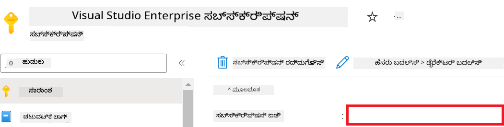

1. Azure Workspace Name ಸೇರಿಸಲು ಕೆಳಗಿನ ಕಾರ್ಯಗಳನ್ನು ಮಾಡಿ:

    - ನೀವು ರಚಿಸಿದ Azure Machine Learning ಸಂಪನ್ಮೂಲಕ್ಕೆ ಹೋಗಿ.
    - ನಿಮ್ಮ ಖಾತೆಯ ಹೆಸರನ್ನು ಕಾಪಿ ಮಾಡಿ ಮತ್ತು *config.py* ಫೈಲಿಗೆ ಪೇಸ್ಟ್ ಮಾಡಿ.

    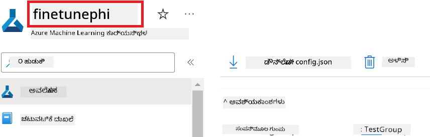

1. Azure Resource Group Name ಸೇರಿಸಲು ಕೆಳಗಿನ ಕಾರ್ಯಗಳನ್ನು ಮಾಡಿ:

    - ನೀವು ರಚಿಸಿದ Azure Machine Learning ಸಂಪನ್ಮೂಲಕ್ಕೆ ಹೋಗಿ.
    - ನಿಮ್ಮ Azure Resource Group ಹೆಸರನ್ನು ಕಾಪಿ ಮಾಡಿ ಮತ್ತು *config.py* ಫೈಲಿಗೆ ಪೇಸ್ಟ್ ಮಾಡಿ.

    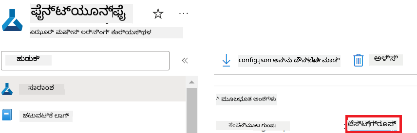

2. Azure Managed Identity ಹೆಸರು ಸೇರಿಸಲು ಕೆಳಗಿನ ಕಾರ್ಯಗಳನ್ನು ಮಾಡಿ

    - ನೀವು ರಚಿಸಿದ Managed Identities ಸಂಪನ್ಮೂಲಕ್ಕೆ ಹೋಗಿ.
    - ನಿಮ್ಮ Azure Managed Identity ಹೆಸರನ್ನು ಕಾಪಿ ಮಾಡಿ ಮತ್ತು *config.py* ಫೈಲಿಗೆ ಪೇಸ್ಟ್ ಮಾಡಿ.

    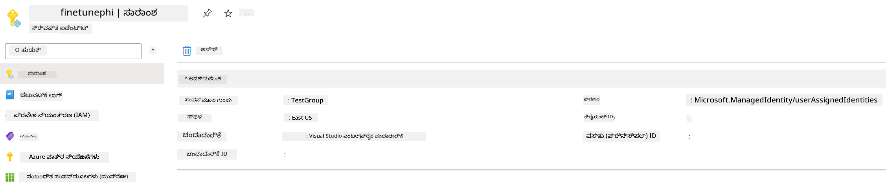

### ಫೈನ್-ಟ್ಯೂನಿಂಗ್‌ಗಾಗಿ ಡೇಟಾಸೆಟ್ ತಯಾರಿಸಿ

ಈ ವ್ಯಾಯಾಮದಲ್ಲಿ, ನೀವು *download_dataset.py* ಫೈಲ್ ಅನ್ನು ರನ್ ಮಾಡಿ *ULTRACHAT_200k* ಡೇಟಾಸೆಟ್‌ಗಳನ್ನು ನಿಮ್ಮ ಸ್ಥಳೀಯ ಪರಿಸರಕ್ಕೆ ಡೌನ್‌ಲೋಡ್ ಮಾಡುತ್ತೀರಿ. ನಂತರ ನೀವು ಈ ಡೇಟಾಸೆಟ್‌ಗಳನ್ನು Azure Machine Learning‌ನಲ್ಲಿ Phi-3 ಮಾದರಿಯನ್ನು ಫೈನ್-ಟ್ಯೂನ್ ಮಾಡಲು ಬಳಸುತ್ತೀರಿ.

#### *download_dataset.py* ಅನ್ನು ಬಳಸಿ ನಿಮ್ಮ ಡೇಟಾಸೆಟ್ ಅನ್ನು ಡೌನ್‌ಲೋಡ್ ಮಾಡಿ

1. Visual Studio Code‌ನಲ್ಲಿ *download_dataset.py* ಫೈಲ್ ಅನ್ನು ತೆರೆಯಿರಿ.

1. ಕೆಳಗಿನ ಕೋಡ್ ಅನ್ನು *download_dataset.py* ಗೆ ಸೇರಿಸಿ.

    ```python
    import json
    import os
    from datasets import load_dataset
    from config import (
        TRAIN_DATA_PATH,
        TEST_DATA_PATH)

    def load_and_split_dataset(dataset_name, config_name, split_ratio):
        """
        Load and split a dataset.
        """
        # ನಿರ್ದಿಷ್ಟ ಹೆಸರಿನ, ಸಂರಚನೆ ಮತ್ತು ವಿಭಜನೆ ಅನುಪಾತದೊಂದಿಗೆ ಡೇಟಾಸೆಟ್ ಅನ್ನು ಲೋಡ್ ಮಾಡಿ
        dataset = load_dataset(dataset_name, config_name, split=split_ratio)
        print(f"Original dataset size: {len(dataset)}")
        
        # ಡೇಟಾಸೆಟ್ ಅನ್ನು ತರಬೇತಿ ಮತ್ತು ಪರೀಕ್ಷಾ ಸೆಟ್‌ಗಳಾಗಿ ವಿಭಾಗಿಸಿ (80% ತರಬೇತಿ, 20% ಪರೀಕ್ಷೆ)
        split_dataset = dataset.train_test_split(test_size=0.2)
        print(f"Train dataset size: {len(split_dataset['train'])}")
        print(f"Test dataset size: {len(split_dataset['test'])}")
        
        return split_dataset

    def save_dataset_to_jsonl(dataset, filepath):
        """
        Save a dataset to a JSONL file.
        """
        # ಡೈರೆಕ್ಟರಿಯನ್ನು ಇಲ್ಲದಿದ್ದರೆ ರಚಿಸಿ
        os.makedirs(os.path.dirname(filepath), exist_ok=True)
        
        # ಫೈಲ್ ಅನ್ನು ಬರೆಯುವ ಮೋಡ್‌ನಲ್ಲಿ ತೆರೆಯಿರಿ
        with open(filepath, 'w', encoding='utf-8') as f:
            # ಡೇಟಾಸೆಟ್‌ನ ಪ್ರತಿಯೊಂದು ದಾಖಲೆ ಮೇಲೆ ಪುನರಾವರ್ತಿಸಿ
            for record in dataset:
                # ದಾಖಲೆಯನ್ನು JSON ವಸ್ತುವಾಗಿ ಡಂಪ್ ಮಾಡಿ ಮತ್ತು ಅದನ್ನು ಫೈಲ್‌ಗೆ ಬರೆಯಿರಿ
                json.dump(record, f)
                # ದಾಖಲೆಗಳನ್ನು ವಿಭಜಿಸಲು ಹೊಸ ಸಾಲಿನ ಅಕ್ಷರವನ್ನು ಬರೆಯಿರಿ
                f.write('\n')
        
        print(f"Dataset saved to {filepath}")

    def main():
        """
        Main function to load, split, and save the dataset.
        """
        # ನಿರ್ದಿಷ್ಟ ಸಂರಚನೆ ಮತ್ತು ವಿಭಜನೆ ಅನುಪಾತದೊಂದಿಗೆ ULTRACHAT_200k ಡೇಟಾಸೆಟ್ ಅನ್ನು ಲೋಡ್ ಮಾಡಿ ಮತ್ತು ವಿಭಜಿಸಿ
        dataset = load_and_split_dataset("HuggingFaceH4/ultrachat_200k", 'default', 'train_sft[:1%]')
        
        # ವಿಭಜನೆಯಿಂದ ತರಬೇತಿ ಮತ್ತು ಪರೀಕ್ಷಾ ಡೇಟಾಸೆಟ್‌ಗಳನ್ನು ತೆಗೆಯಿರಿ
        train_dataset = dataset['train']
        test_dataset = dataset['test']

        # ತರಬೇತಿ ಡೇಟಾಸೆಟ್ ಅನ್ನು JSONL ಫೈಲ್‌ಗೆ ಉಳಿಸಿ
        save_dataset_to_jsonl(train_dataset, TRAIN_DATA_PATH)
        
        # ಪರೀಕ್ಷಾ ಡೇಟಾಸೆಟ್ ಅನ್ನು ಪ್ರತ್ಯೇಕ JSONL ಫೈಲ್‌ಗೆ ಉಳಿಸಿ
        save_dataset_to_jsonl(test_dataset, TEST_DATA_PATH)

    if __name__ == "__main__":
        main()

    ```

> [!TIP]
>
> **CPU ಬಳಸಿ ಸಣ್ಣ ಡೇಟಾಸೆಟ್‌ನೊಂದಿಗೆ ಫೈನ್-ಟ್ಯೂನಿಂಗ್‌ಗಾಗಿ ಮಾರ್ಗದರ್ಶನ**
>
> ನೀವು ಫೈನ್-ಟ್ಯೂನಿಂಗ್‌ಗೆ CPU ಅನ್ನು ಬಳಸಲು ಬಯಸಿದರೆ, ಈ ವಿಧಾನವು benefit subscription (ಉದಾಹರಣೆಗೆ Visual Studio Enterprise Subscription) ಹೊಂದಿರುವವರಿಗೆ ಅಥವಾ ಫೈನ್-ಟ್ಯೂನಿಂಗ್ ಮತ್ತು ಡಿಪ್ಲಾಯ್ ಪ್ರಕ್ರಿಯೆಯನ್ನು ಬೇಗ ಚೆಕ್ ಮಾಡಲು ಸೂಕ್ತವಾಗಿದೆ.
>
> `dataset = load_and_split_dataset("HuggingFaceH4/ultrachat_200k", 'default', 'train_sft[:1%]')` ಅನ್ನು `dataset = load_and_split_dataset("HuggingFaceH4/ultrachat_200k", 'default', 'train_sft[:10]')` ಎಂಬುದಿನಿಂದ ಬದಲಿಸಿ
>

1. ಸ್ಕ್ರಿಪ್ಟ್ ಅನ್ನು ರನ್ ಮಾಡಿ ಮತ್ತು ಡೇಟಾಸೆಟ್ ಅನ್ನು ನಿಮ್ಮ ಸ್ಥಳೀಯ ಪರಿಸರಕ್ಕೆ ಡೌನ್‌ಲೋಡ್ ಮಾಡಲು ಟರ್ಮಿನಲ್‌ನಲ್ಲಿ ಕೆಳಗಿನ ಕಮಾಂಡ್ ಅನ್ನು ಟೈಪ್ ಮಾಡಿ.

    ```console
    python download_data.py
    ```

1. ಡೇಟಾಸೆಟ್‌ಗಳು ಯಶಸ್ವಿಯಾಗಿ ನಿಮ್ಮ ಸ್ಥಳೀಯ *finetune-phi/data* ಡೈರೆಕ್ಟರಿಯಲ್ಲಿ ಉಳಿದಿದೆಯೇ ಎಂಬುದನ್ನು ಪರಿಶೀಲಿಸಿ.

> [!NOTE]
>
> **ಡೇಟಾಸೆಟ್ ಗಾತ್ರ ಮತ್ತು ಫೈನ್-ಟ್ಯೂನಿಂಗ್ ಸಮಯ**
>
> ಈ E2E ಉದಾಹರಣೆಯಲ್ಲಿ, ನೀವು ಕೇವಲ ಡೇಟಾಸೆಟ್‌ನ 1% (`train_sft[:1%]`) ಅನ್ನು ಬಳಸುತ್ತೀರಿ. ಇದರಿಂದ ಡೇಟಾ ಪ್ರಮಾಣವು ಸಾಕಷ್ಟು ಕಡಿಮೆ ಆಗುತ್ತದೆ ಮತ್ತು ಅಪ್‌ಲೋಡ್ ಹಾಗೂ ಫೈನ್-ಟ್ಯೂನಿಂಗ್ ಪ್ರಕ್ರಿಯೆಗಳನ್ನು ವೇಗಗೊಳಿಸುತ್ತದೆ. ತರಬೇತಿಯ ಸಮಯ ಮತ್ತು ಮಾದರಿ ಕಾರ್ಯಕ್ಷಮತೆಯ ನಡುವೆ ಸಮತೋಲವನ್ನು ಕಂಡುಕೊಳ್ಳಲು ನೀವು ಶೇ. ಬದಲಾಯಿಸಬಹುದು. ಡೇಟಾಸೆಟ್‌ನ ಸಣ್ಣ ಉಪಸೆಟ್ ಅನ್ನು ಬಳಸುವುದರಿಂದ ಫೈನ್-ಟ್ಯೂನಿಂಗ್‌ಗೆ ಬೇಕಾಗುವ ಸಮಯ ಕಡಿಮೆಯಾಗುತ್ತದೆ ಮತ್ತು E2E ಸ್ಯಾಂಪಲ್‌ಗೆ ಪ್ರಕ್ರಿಯೆಯನ್ನು ಸುಗಮಗೊಳಿಸುತ್ತದೆ.

## ಸನ್ನಿವೇಶ 2: Phi-3 ಮಾದರಿಯನ್ನು ಫೈನ್-ಟ್ಯೂನ್ ಮಾಡಿ ಮತ್ತು Azure Machine Learning Studio ನಲ್ಲಿ ನಿಯೋಜಿಸಿ

### Azure CLI ಅನ್ನು ಸೆಟ್ ಅಪ್ ಮಾಡಿ

ನಿಮ್ಮ ಪರಿಸರದ ಪ್ರಾಮಾಣೀಕರಣಕ್ಕೆ Azure CLI ಅನ್ನು ಸೆಟ್ ಅಪ್ ಮಾಡಬೇಕಾಗುತ್ತದೆ. Azure CLI ಮೂಲಕ ನೀವು ಕಮಾಂಡ್ ಲೈನ್‌ನಿಂದ ನೇರವಾಗಿ Azure ಸಂಪನ್ಮೂಲಗಳನ್ನು ನಿರ್ವಹಿಸಬಹುದು ಮತ್ತು Azure Machine Learning ಈ ಸಂಪನ್ಮೂಲಗಳನ್ನು ಪ್ರವೇಶಿಸಬಹುದಾದ ಕ್ರೆಡೆನ್ಶಿಯಲ್‌ಗಳನ್ನು ಒದಗಿಸುತ್ತದೆ. ಪ್ರಾರಂಭಿಸಲು [Azure CLI](https://learn.microsoft.com/cli/azure/install-azure-cli) ಅನ್ನು ин್‌ಸ್ಟಾಲ್ ಮಾಡಿ

1. ಟರ್ಮಿನಲ್ ವಿಂಡೋವನ್ನು ತೆರೆಯಿರಿ ಮತ್ತು ನಿಮ್ಮ Azure ಖಾತೆಗೆ ಲಾಗಿನ್ ಮಾಡಲು ಕೆಳಗಿನ ಕಮಾಂಡ್ ಅನ್ನು ಟೈಪ್ ಮಾಡಿ.

    ```console
    az login
    ```

1. ಬಳಸಲು ನಿಮ್ಮ Azure ಖಾತೆಯನ್ನು ಆಯ್ಕೆಮಾಡಿ.

1. ಬಳಸಲು ನಿಮ್ಮ Azure ಸಬ್ಸ್ಕ್ರಿಪ್ಶನ್ ಅನ್ನು ಆಯ್ಕೆಮಾಡಿ.

    

> [!TIP]
>
> ನೀವು Azure ಗೆ ಸೈನ್-ಇನ್ ಮಾಡುವಲ್ಲಿ ತೊಂದರೆ ಎದುರಿಸುತ್ತಿದ್ದರೆ, ಡಿವೈಸ್ ಕೋಡ್ ಬಳಸಿ ಪ್ರಯತ್ನಿಸಿ. ಟರ್ಮಿನಲ್ ವಿಂಡೋವನ್ನು ತೆರೆಯಿರಿ ಮತ್ತು ನಿಮ್ಮ Azure ಖಾತೆಗೆ ಸೈನ್-ಇನ್ ಬಹುದು ಮಾಡಲು ಕೆಳಗಿನ ಕಮಾಂಡ್ ಅನ್ನು ಟೈಪ್ ಮಾಡಿ:
>
> ```console
> az login --use-device-code
> ```
>

### Phi-3 ಮಾದರಿಯನ್ನು ಫೈನ್-ಟ್ಯೂನ್ ಮಾಡಿ

ಈ ವ್ಯಾಯಾಮದಲ್ಲಿ, ಒದಗಿಸಲಾದ ಡೇಟಾಸೆಟ್ ಬಳಸಿ ನೀವು Phi-3 ಮಾದರಿಯನ್ನು ಫೈನ್-ಟ್ಯೂನ್ ಮಾಡುತ್ತೀರಿ. ಮೊದಲು ನೀವು *fine_tune.py* ಫೈಲ್‌ನಲ್ಲಿ ಫೈನ್-ಟ್ಯೂನಿಂಗ್ ಪ್ರಕ್ರಿಯೆಯನ್ನು ವ್ಯಾಖ್ಯಾನಿಸುತ್ತೀರಿ. ನಂತರ ನೀವು Azure Machine Learning ಪರಿಸರವನ್ನನ್ನು կազմೀಕರಿಸಿ ಫೈನ್-ಟ್ಯೂನಿಂಗ್ ಪ್ರಕ್ರಿಯೆಯನ್ನು ಪ್ರಾರಂಭಿಸಲು *setup_ml.py* ಫೈಲ್ ಅನ್ನು ಚಾಲನೆ ಮಾಡುತ್ತೀರಿ. ಈ ಸ್ಕ್ರಿಪ್ಟ್ ಫೈನ್-ಟ್ಯೂನಿಂಗ್ Azure Machine Learning ಪರಿಸರವಲ್ಲೇ ಸಾಗುವಂತೆ ಖಾತ್ರಿ ಮಾಡುತ್ತದೆ.

*setup_ml.py* ಅನ್ನು ರನ್ ಮಾಡುವ ಮೂಲಕ, ನೀವು Azure Machine Learning ಪರಿಸರದಲ್ಲಿ ಫೈನ್-ಟ್ಯೂನಿಂಗ್ ಪ್ರಕ್ರಿಯೆಯನ್ನು ಚಾಲನೆ ಮಾಡುತ್ತೀರಿ.

#### *fine_tune.py* ಫೈಲ್‌ಗೆ ಕೋಡ್ ಸೇರಿಸಿ

1. *finetuning_dir* ಫೋಲ್ಡರ್‌ಗೆ ಹೋಗಿ ಮತ್ತು Visual Studio Code‌ನಲ್ಲಿ *fine_tune.py* ಫೈಲ್ ಅನ್ನು ತೆರೆಯಿರಿ.

1. ಕೆಳಗಿನ ಕೋಡ್ ಅನ್ನು *fine_tune.py* ಗೆ ಸೇರಿಸಿ.

    ```python
    import argparse
    import sys
    import logging
    import os
    from datasets import load_dataset
    import torch
    import mlflow
    from transformers import AutoModelForCausalLM, AutoTokenizer, TrainingArguments
    from trl import SFTTrainer

    # MLflow ನಲ್ಲಿ INVALID_PARAMETER_VALUE ದೋಷವನ್ನು ತಪ್ಪಿಸಲು, MLflow ಏಕೀಕರಣವನ್ನು ನಿಷ್ಕ್ರಿಯಗೊಳಿಸಿ
    os.environ["DISABLE_MLFLOW_INTEGRATION"] = "True"

    # ಲಾಗಿಂಗ್ ಸಂರಚನೆ
    logging.basicConfig(
        format="%(asctime)s - %(levelname)s - %(name)s - %(message)s",
        datefmt="%Y-%m-%d %H:%M:%S",
        handlers=[logging.StreamHandler(sys.stdout)],
        level=logging.WARNING
    )
    logger = logging.getLogger(__name__)

    def initialize_model_and_tokenizer(model_name, model_kwargs):
        """
        Initialize the model and tokenizer with the given pretrained model name and arguments.
        """
        model = AutoModelForCausalLM.from_pretrained(model_name, **model_kwargs)
        tokenizer = AutoTokenizer.from_pretrained(model_name)
        tokenizer.model_max_length = 2048
        tokenizer.pad_token = tokenizer.unk_token
        tokenizer.pad_token_id = tokenizer.convert_tokens_to_ids(tokenizer.pad_token)
        tokenizer.padding_side = 'right'
        return model, tokenizer

    def apply_chat_template(example, tokenizer):
        """
        Apply a chat template to tokenize messages in the example.
        """
        messages = example["messages"]
        if messages[0]["role"] != "system":
            messages.insert(0, {"role": "system", "content": ""})
        example["text"] = tokenizer.apply_chat_template(
            messages, tokenize=False, add_generation_prompt=False
        )
        return example

    def load_and_preprocess_data(train_filepath, test_filepath, tokenizer):
        """
        Load and preprocess the dataset.
        """
        train_dataset = load_dataset('json', data_files=train_filepath, split='train')
        test_dataset = load_dataset('json', data_files=test_filepath, split='train')
        column_names = list(train_dataset.features)

        train_dataset = train_dataset.map(
            apply_chat_template,
            fn_kwargs={"tokenizer": tokenizer},
            num_proc=10,
            remove_columns=column_names,
            desc="Applying chat template to train dataset",
        )

        test_dataset = test_dataset.map(
            apply_chat_template,
            fn_kwargs={"tokenizer": tokenizer},
            num_proc=10,
            remove_columns=column_names,
            desc="Applying chat template to test dataset",
        )

        return train_dataset, test_dataset

    def train_and_evaluate_model(train_dataset, test_dataset, model, tokenizer, output_dir):
        """
        Train and evaluate the model.
        """
        training_args = TrainingArguments(
            bf16=True,
            do_eval=True,
            output_dir=output_dir,
            eval_strategy="epoch",
            learning_rate=5.0e-06,
            logging_steps=20,
            lr_scheduler_type="cosine",
            num_train_epochs=3,
            overwrite_output_dir=True,
            per_device_eval_batch_size=4,
            per_device_train_batch_size=4,
            remove_unused_columns=True,
            save_steps=500,
            seed=0,
            gradient_checkpointing=True,
            gradient_accumulation_steps=1,
            warmup_ratio=0.2,
        )

        trainer = SFTTrainer(
            model=model,
            args=training_args,
            train_dataset=train_dataset,
            eval_dataset=test_dataset,
            max_seq_length=2048,
            dataset_text_field="text",
            tokenizer=tokenizer,
            packing=True
        )

        train_result = trainer.train()
        trainer.log_metrics("train", train_result.metrics)

        mlflow.transformers.log_model(
            transformers_model={"model": trainer.model, "tokenizer": tokenizer},
            artifact_path=output_dir,
        )

        tokenizer.padding_side = 'left'
        eval_metrics = trainer.evaluate()
        eval_metrics["eval_samples"] = len(test_dataset)
        trainer.log_metrics("eval", eval_metrics)

    def main(train_file, eval_file, model_output_dir):
        """
        Main function to fine-tune the model.
        """
        model_kwargs = {
            "use_cache": False,
            "trust_remote_code": True,
            "torch_dtype": torch.bfloat16,
            "device_map": None,
            "attn_implementation": "eager"
        }

        # pretrained_model_name = "microsoft/Phi-3-mini-4k-instruct"
        pretrained_model_name = "microsoft/Phi-3.5-mini-instruct"

        with mlflow.start_run():
            model, tokenizer = initialize_model_and_tokenizer(pretrained_model_name, model_kwargs)
            train_dataset, test_dataset = load_and_preprocess_data(train_file, eval_file, tokenizer)
            train_and_evaluate_model(train_dataset, test_dataset, model, tokenizer, model_output_dir)

    if __name__ == "__main__":
        parser = argparse.ArgumentParser()
        parser.add_argument("--train-file", type=str, required=True, help="Path to the training data")
        parser.add_argument("--eval-file", type=str, required=True, help="Path to the evaluation data")
        parser.add_argument("--model_output_dir", type=str, required=True, help="Directory to save the fine-tuned model")
        args = parser.parse_args()
        main(args.train_file, args.eval_file, args.model_output_dir)

    ```

1. *fine_tune.py* ಫೈಲ್ ಅನ್ನು ಉಳಿಸಿ ಮತ್ತು ಮುಚ್ಚಿ.

> [!TIP]
> **ನೀವು Phi-3.5 ಮಾದರಿಯನ್ನು ಫೈನ್-ಟ್ಯೂನ್ ಮಾಡಬಹುದು**
>
> *fine_tune.py* ಫೈಲ್‌ನಲ್ಲಿ, `pretrained_model_name` ಅನ್ನು `"microsoft/Phi-3-mini-4k-instruct"` ನಿಂದ ನೀವು ಫೈನ್-ಟ್ಯೂನ್ ಮಾಡಲು ಬೇಕಾದ ಯಾವುದೇ ಮಾದರಿಯ ಹೆಸರಿಗೆ ಬದಲಾಯಿಸಬಹುದು. ಉದಾಹರಣೆಗೆ, ನೀವು ಅದನ್ನು `"microsoft/Phi-3.5-mini-instruct"` ಗೆ ಬದಲಾಯಿಸಿದರೆ, ನೀವು Phi-3.5-mini-instruct ಮಾದರಿಯನ್ನು ಫೈನ್-ಟ್ಯೂನ್ ಮಾಡುತ್ತೀರಿ. ನೀವು ಬಳಸಲು ಇಚ್ಛಿಸುವ ಮಾದರಿಯ ಹೆಸರನ್ನು ಹುಡುಕಲು ಮತ್ತು ತೆಗೆದುಕೊಳ್ಳಲು [Hugging Face](https://huggingface.co/) ಅನ್ನು ಭೇಟಿ ಮಾಡಿ ಮತ್ತು ನಿಮ್ಮ ಸ್ಕ್ರಿಪ್ಟ್‌ನ `pretrained_model_name` ಕ್ಷೇತ್ರಕ್ಕೆ ಅದರ ಹೆಸರನ್ನು ನಕಲಿಸಿ ಹಾಗೂ ಹಾಕಿ.
>
> :::image type="content" source="../../imgs/03/FineTuning-PromptFlow/finetunephi3.5.png" alt-text="Phi-3.5 ಅನ್ನು ಫೈನ್-ಟ್ಯೂನ್ ಮಾಡಿ.":::
>

#### *setup_ml.py* ಫೈಲ್‌ಗೆ ಕೋಡ್ ಸೇರಿಸಿ

1. Visual Studio Code‌ನಲ್ಲಿ *setup_ml.py* ಫೈಲ್ ಅನ್ನು ತೆರೆಯಿರಿ.

1. ಕೆಳಗಿನ ಕೋಡ್ ಅನ್ನು *setup_ml.py* ಗೆ ಸೇರಿಸಿ.

    ```python
    import logging
    from azure.ai.ml import MLClient, command, Input
    from azure.ai.ml.entities import Environment, AmlCompute
    from azure.identity import AzureCliCredential
    from config import (
        AZURE_SUBSCRIPTION_ID,
        AZURE_RESOURCE_GROUP_NAME,
        AZURE_ML_WORKSPACE_NAME,
        TRAIN_DATA_PATH,
        TEST_DATA_PATH
    )

    # ಸ್ಥಿರ ಮೌಲ್ಯಗಳು

    # التدريبಕ್ಕಾಗಿ CPU ಉದಾಹರಣೆಯನ್ನು ಬಳಸಲು ಕೆಳಗಿನ ಸಾಲುಗಳ ಮೇಲೆ ಇರುವ ಕಾಮೆಂಟ್ ತೆಗೆದುಹಾಕಿ
    # COMPUTE_INSTANCE_TYPE = "Standard_E16s_v3" # ಸಿಪಿಯು
    # COMPUTE_NAME = "cpu-e16s-v3"
    # DOCKER_IMAGE_NAME = "mcr.microsoft.com/azureml/openmpi4.1.0-ubuntu20.04:latest"

    # التدريبಗಾಗಿ GPU ಉದಾಹರಣೆಯನ್ನು ಬಳಸಲು ಕೆಳಗಿನ ಸಾಲುಗಳ ಮೇಲೆ ಇರುವ ಕಾಮೆಂಟ್ ತೆಗೆದುಹಾಕಿ
    COMPUTE_INSTANCE_TYPE = "Standard_NC24ads_A100_v4"
    COMPUTE_NAME = "gpu-nc24s-a100-v4"
    DOCKER_IMAGE_NAME = "mcr.microsoft.com/azureml/curated/acft-hf-nlp-gpu:59"

    CONDA_FILE = "conda.yml"
    LOCATION = "eastus2" # ನಿಮ್ಮ ಕಂಪ್ಯೂಟ್ ಕ್ಲಸ್ಟರ್‌ನ ಸ್ಥಳವನ್ನು ಬದಲಿಸಿ
    FINETUNING_DIR = "./finetuning_dir" # ಫೈನ್‌ಟ್ಯೂನಿಂಗ್ ಸ್ಕ್ರಿಪ್ಟ್‌ನ ಮಾರ್ಗ
    TRAINING_ENV_NAME = "phi-3-training-environment" # treinamento ವಾತಾವರಣದ ಹೆಸರು
    MODEL_OUTPUT_DIR = "./model_output" # Azure ML ನಲ್ಲಿ ಮಾದರಿ ಔಟ್‌ಪುಟ್ ಡೈರೆಕ್ಟರಿಯ ಮಾರ್ಗ

    # ಪ್ರಕ್ರಿಯೆಯನ್ನು ಟ್ರ್ಯಾಕ್ ಮಾಡಲು ಲಾಗಿಂಗ್ ವ್ಯವಸ್ಥೆ
    logger = logging.getLogger(__name__)
    logging.basicConfig(
        format="%(asctime)s - %(levelname)s - %(name)s - %(message)s",
        datefmt="%Y-%m-%d %H:%M:%S",
        level=logging.WARNING
    )

    def get_ml_client():
        """
        Initialize the ML Client using Azure CLI credentials.
        """
        credential = AzureCliCredential()
        return MLClient(credential, AZURE_SUBSCRIPTION_ID, AZURE_RESOURCE_GROUP_NAME, AZURE_ML_WORKSPACE_NAME)

    def create_or_get_environment(ml_client):
        """
        Create or update the training environment in Azure ML.
        """
        env = Environment(
            image=DOCKER_IMAGE_NAME,  # ವಾತಾವರಣಕ್ಕಾಗಿ Docker ಇಮೇಜ್
            conda_file=CONDA_FILE,  # Conda ವಾತಾವರಣ ಫೈಲ್
            name=TRAINING_ENV_NAME,  # ವಾತಾವರಣೆದ ಹೆಸರು
        )
        return ml_client.environments.create_or_update(env)

    def create_or_get_compute_cluster(ml_client, compute_name, COMPUTE_INSTANCE_TYPE, location):
        """
        Create or update the compute cluster in Azure ML.
        """
        try:
            compute_cluster = ml_client.compute.get(compute_name)
            logger.info(f"Compute cluster '{compute_name}' already exists. Reusing it for the current run.")
        except Exception:
            logger.info(f"Compute cluster '{compute_name}' does not exist. Creating a new one with size {COMPUTE_INSTANCE_TYPE}.")
            compute_cluster = AmlCompute(
                name=compute_name,
                size=COMPUTE_INSTANCE_TYPE,
                location=location,
                tier="Dedicated",  # ಕಂಪ್ಯೂಟ್ ಕ್ಲಸ್ಟರ್‌ನ ಸ್ತರ
                min_instances=0,  # ಕನಿಷ್ಠ ಉದಾಹರಣೆಗಳ ಸಂಖ್ಯೆ
                max_instances=1  # ಗರಿಷ್ಠ ಉದಾಹರಣೆಗಳ ಸಂಖ್ಯೆ
            )
            ml_client.compute.begin_create_or_update(compute_cluster).wait()  # ಕ್ಲಸ್ಟರ್ ರಚನೆಯಾಗುವವರೆಗೆ ಕಾಯಿರಿ
        return compute_cluster

    def create_fine_tuning_job(env, compute_name):
        """
        Set up the fine-tuning job in Azure ML.
        """
        return command(
            code=FINETUNING_DIR,  # fine_tune.py ಫೈಲಿನ ಮಾರ್ಗ
            command=(
                "python fine_tune.py "
                "--train-file ${{inputs.train_file}} "
                "--eval-file ${{inputs.eval_file}} "
                "--model_output_dir ${{inputs.model_output}}"
            ),
            environment=env,  # treinamento ವಾತಾವರಣ
            compute=compute_name,  # ಬಳಸಬೇಕಾದ ಕಂಪ್ಯೂಟ್ ಕ್ಲಸ್ಟರ್
            inputs={
                "train_file": Input(type="uri_file", path=TRAIN_DATA_PATH),  # প্রশিক্ষಣ ಡೇಟಾ ಫೈಲಿನ ಮಾರ್ಗ
                "eval_file": Input(type="uri_file", path=TEST_DATA_PATH),  # ಮೌಲ್ಯಮಾಪನಾ ಡೇಟಾ ಫೈಲಿನ ಮಾರ್ಗ
                "model_output": MODEL_OUTPUT_DIR
            }
        )

    def main():
        """
        Main function to set up and run the fine-tuning job in Azure ML.
        """
        # ML ಕ್ಲೈಂಟ್ ಅನ್ನು ಪ್ರಾರಂಭಿಸಿ
        ml_client = get_ml_client()

        # ವಾತಾವರಣವನ್ನು ರಚಿಸಿ
        env = create_or_get_environment(ml_client)
        
        # compute ಕ್ಲಸ್ಟರ್ ಅನ್ನು ರಚಿಸಿ ಅಥವಾ ಇರುವುದನ್ನು ಪಡೆಯಿರಿ
        create_or_get_compute_cluster(ml_client, COMPUTE_NAME, COMPUTE_INSTANCE_TYPE, LOCATION)

        # ಫೈನ್‌ಟ್ಯೂನಿಂಗ್ ಕೆಲಸವನ್ನು ರಚಿಸಿ ಮತ್ತು ಸಲ್ಲಿಸಿ
        job = create_fine_tuning_job(env, COMPUTE_NAME)
        returned_job = ml_client.jobs.create_or_update(job)  # ಕೆಲಸವನ್ನು ಸಲ್ಲಿಸಿ
        ml_client.jobs.stream(returned_job.name)  # 工作的 ಲಾಗ್‌ಗಳನ್ನು ಸ್ಟ್ರೀಮ್ ಮಾಡಿ
        
        # 工作的 ಹೆಸರನ್ನು ಸೆರೆಹಿಡಿ
        job_name = returned_job.name
        print(f"Job name: {job_name}")

    if __name__ == "__main__":
        main()

    ```

1. `COMPUTE_INSTANCE_TYPE`, `COMPUTE_NAME`, ಮತ್ತು `LOCATION` ಅನ್ನು ನಿಮ್ಮ ನಿರ್ದಿಷ್ಟ ವಿವರಗಳೊಂದಿಗೆ ಬದಲಾಯಿಸಿ.

    ```python
   # ತರಬೇತಿಗಾಗಿ GPU ಇನ್ಸ್ಟನ್ಸ್ ಬಳಸಲು ಕೆಳಗಿನ ಸಾಲುಗಳ ಕಾಮೆಂಟ್ ತೆಗೆದುಹಾಕಿ
    COMPUTE_INSTANCE_TYPE = "Standard_NC24ads_A100_v4"
    COMPUTE_NAME = "gpu-nc24s-a100-v4"
    ...
    LOCATION = "eastus2" # ನಿಮ್ಮ ಗಣನಾ ಕ್ಲಸ್ಟರ್‌ನ ಸ್ಥಳದೊಂದಿಗೆ ಬದಲಾಯಿಸಿ
    ```

> [!TIP]
>
> **CPU ಬಳಸಿ ಸಣ್ಣ ಡೇಟಾ ಸೆಟ್‌ನೊಂದಿಗೆ ಫೈನ್-ಟ್ಯೂನಿಂಗ್ ಮಾಡುವ ಮಾರ್ಗದರ್ಶನ**
>
> ನೀವು ಫೈನ್-ಟ್ಯೂನಿಂಗ್‌ಗೆ CPU ಅನ್ನು ಬಳಸಲು ಬಯಸಿದರೆ, ಇದು ಮಾರುಕಟ್ಟೆ ಉಚಿತವಾದ ಅಥವಾ ಪ್ರಯೋಗಾತ್ಮಕವಾಗಿ ಫೈನ್-ಟ್ಯೂನಿಂಗ್ ಮತ್ತು ಡಿಪ್ಲಾಯ್ ಪ್ರಕ್ರಿಯೆಯನ್ನು ತ್ವರಿತವಾಗಿ ಪರೀಕ್ಷಿಸಲು ಸೂಕ್ತ ಪರಿಹಾರವಾಗಿದೆ.
>
> 1. *setup_ml* ಫೈಲ್ ಅನ್ನು ತೆರೆಯಿರಿ.
> 1. `COMPUTE_INSTANCE_TYPE`, `COMPUTE_NAME`, ಮತ್ತು `DOCKER_IMAGE_NAME`ಗಳನ್ನು ಕೆಳಗಿನಂತೆ ಬದಲಾಯಿಸಿ. ನೀವು *Standard_E16s_v3* ಗೆ ಪ್ರವೇಶ ಇಲ್ಲದಿದ್ದರೆ, ಸಮಾನ CPU ಇನ್‌ಸ್ಟ್ಯಾನ್ಸ್ ಅನ್ನು ಬಳಸಬಹುದು ಅಥವಾ ಹೊಸ quota ಕೋರಬಹುದು.
> 1. `LOCATION` ಅನ್ನು ನಿಮ್ಮ ನಿರ್ದಿಷ್ಟ ವಿವರಗಳಿಂದ ಬದಲಾಯಿಸಿ.
>
>    ```python
>    # Uncomment the following lines to use a CPU instance for training
>    COMPUTE_INSTANCE_TYPE = "Standard_E16s_v3" # cpu
>    COMPUTE_NAME = "cpu-e16s-v3"
>    DOCKER_IMAGE_NAME = "mcr.microsoft.com/azureml/openmpi4.1.0-ubuntu20.04:latest"
>    LOCATION = "eastus2" # Replace with the location of your compute cluster
>    ```
>

1. *setup_ml.py* ಸ್ಕ್ರಿಪ್ಟ್ ಅನ್ನು ಚಲಾಯಿಸಲು ಮತ್ತು Azure Machine Learning ನಲ್ಲಿ ಫೈನ್-ಟ್ಯೂನಿಂಗ್ ಪ್ರಕ್ರಿಯೆಯನ್ನು ಪ್ರಾರಂಭಿಸಲು ಕೆಳಗಿನ ಕಮಾಂಡ್ ಅನ್ನು ಟೈಪ್ ಮಾಡಿ.

    ```python
    python setup_ml.py
    ```

1. ಈ ವ್ಯಾಯಾಮದಲ್ಲಿ, ನೀವು ಯಶಸ್ವಿಯಾಗಿ Azure Machine Learning ಅನ್ನು ಬಳಸಿ Phi-3 ಮಾದರಿಯನ್ನು ಫೈನ್-ಟ್ಯೂನ್ ಮಾಡಿದಿರಿ. *setup_ml.py* ಸ್ಕ್ರಿಪ್ಟ್ ಅನ್ನು ರನ್ ಮಾಡುವ ಮೂಲಕ, ನೀವು Azure Machine Learning ಪರಿಸರವನ್ನು ಸೆಟ್ ಅಪ್ ಮಾಡಿ ಮತ್ತು *fine_tune.py* ಫೈಲ್‌ನಲ್ಲಿ ವ್ಯಾಖ್ಯಾನಿಸಿದ ಫೈನ್-ಟ್ಯೂನಿಂಗ್ ಪ್ರಕ್ರಿಯೆಯನ್ನು ಪ್ರಾರಂಭಿಸಿದ್ದೀರಿ. ದಯವಿಟ್ಟು ಗಮನಿಸಿ ಫೈನ್-ಟ್ಯೂನಿಂಗ್ ಪ್ರಕ್ರಿಯೆಗೆ ಹಲವಾರು ಸಮಯ ಬೇಕಾಗಬಹುದು. `python setup_ml.py` ಕಮಾಂಡ್ ರನ್ ಮಾಡಿದ ನಂತರ ಪ್ರಕ್ರಿಯೆ ಪೂರ್ಣವಾಗುವವರೆಗೆ ನೀವು ಕಾಯಬೇಕು. ಟರ್ಮಿನಲ್‌ನಲ್ಲಿ ನೀಡಲ್ಪಟ್ಟ ಲಿಂಕ್ ಮೂಲಕ ನೀವು Azure Machine Learning ಪೋರ್ಟಲ್‌ನಲ್ಲಿ ಫೈನ್-ಟ್ಯೂನಿಂಗ್ ಕೆಲಸದ ಸ್ಥಿತಿಯನ್ನು ವೀಕ್ಷಿಸಬಹುದು.

    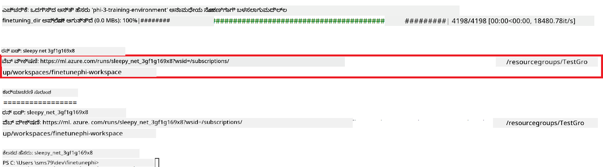

### ಫೈನ್-ಟ್ಯೂನ್ ಮಾಡಿದ ಮಾದರಿಯನ್ನು ಡಿಪ್ಲಾಯ್ ಮಾಡಿ

ಫೈನ್-ಟ್ಯೂನ್ ಮಾಡಿದ Phi-3 ಮಾದರಿಯನ್ನು Prompt Flow ಜೊತೆಗೆ ಸಂಯೋಜಿಸಲು, ನೀವು ಮಾದರಿಯನ್ನು ರಿಯಲ್-ಟೈಮ್ ಇನ್ಫರೆನ್ಸ್‌ಗೆ ಲಭ್ಯವಾಗುವಂತೆ ಡಿಪ್ಲಾಯ್ ಮಾಡಬೇಕಾಗುತ್ತದೆ. ಈ ಪ್ರಕ್ರಿಯೆಯಲ್ಲಿ ಮಾದರಿಯನ್ನು ರೆಜಿಸ್ಟರ್ ಮಾಡುವುದು, ಆನ್‌ಲೈನ್ ಎಂಡ್‌ಪಾಯಿಂಟ್ ಅನ್ನು ರಚಿಸುವುದು ಮತ್ತು ಮಾದರಿಯನ್ನು ಡಿಪ್ಲಾಯ್ ಮಾಡುವದು ಸೇರಿವೆ.

#### ಡಿಪ್ಲಾಯ್‌ಗಾಗಿ ಮಾದರಿ ಹೆಸರು, ಎಂಡ್‌ಪಾಯಿಂಟ್ ಹೆಸರು ಮತ್ತು ಡಿಪ್ಲಾಯ್‌ಮೆಂಟ್ ಹೆಸರನ್ನು ಸೆಟ್ ಮಾಡಿ

1. *config.py* ಫೈಲ್ ಅನ್ನು ತೆರೆಯಿರಿ.

1. `AZURE_MODEL_NAME = "your_fine_tuned_model_name"` ಅನ್ನು ನಿಮ್ಮ ಬಯಸಿದ ಮಾದರಿ ಹೆಸರಿನಿಂದ ಬದಲಾಯಿಸಿ.

1. `AZURE_ENDPOINT_NAME = "your_fine_tuned_model_endpoint_name"` ಅನ್ನು ನಿಮ್ಮ ಬಯಸಿದ ಎಂಡ್‌ಪಾಯಿಂಟ್ ಹೆಸರಿನಿಂದ ಬದಲಾಯಿಸಿ.

1. `AZURE_DEPLOYMENT_NAME = "your_fine_tuned_model_deployment_name"` ಅನ್ನು ನಿಮ್ಮ ಬಯಸಿದ ಡಿಪ್ಲಾಯ್‌ಮೆಂಟ್ ಹೆಸರಿನಿಂದ ಬದಲಾಯಿಸಿ.

#### *deploy_model.py* ಫೈಲ್‌ಗೆ ಕೋಡ್ ಸೇರಿಸಿ

*deploy_model.py* ಫೈಲ್ ಅನ್ನು ರನ್ ಮಾಡುವುದರಿಂದ ಸಮಗ್ರ ಡಿಪ್ಲಾಯ್ ಪ್ರಕ್ರಿಯೆ ಸ್ವಯಂಚಾಲಿತವಾಗುತ್ತದೆ. ಇದು ಮಾದರಿಯನ್ನು ರಜಿಸ್ಟರ್ ಮಾಡುತ್ತದೆ, ಎಂಡ್‌ಪಾಯಿಂಟ್ ಅನ್ನು ರಚಿಸುತ್ತದೆ ಮತ್ತು *config.py* ಫೈಲ್‌ನಲ್ಲಿ belirtilan ಸೆಟ್ಟಿಂಗ್ಸ್ ಆಧಾರದ ಮೇಲೆ ಡಿಪ್ಲಾಯ್ ಅನ್ನು ನಡೆಯಿಸುತ್ತದೆ, ಇದರಲ್ಲಿ ಮಾದರಿ ಹೆಸರು, ಎಂಡ್‌ಪಾಯಿಂಟ್ ಹೆಸರು ಮತ್ತು ಡಿಪ್ಲಾಯ್‌ಮೆಂಟ್ ಹೆಸರು ಸೇರಿವೆ.

1. Visual Studio Code‌ನಲ್ಲಿ *deploy_model.py* ಫೈಲ್ ಅನ್ನು ತೆರೆಯಿರಿ.

1. ಕೆಳಗಿನ ಕೋಡ್ ಅನ್ನು *deploy_model.py* ಗೆ ಸೇರಿಸಿ.

    ```python
    import logging
    from azure.identity import AzureCliCredential
    from azure.ai.ml import MLClient
    from azure.ai.ml.entities import Model, ProbeSettings, ManagedOnlineEndpoint, ManagedOnlineDeployment, IdentityConfiguration, ManagedIdentityConfiguration, OnlineRequestSettings
    from azure.ai.ml.constants import AssetTypes

    # ಕಾನ್ಫಿಗರೇಶನ್ ಆಮದುಗಳು
    from config import (
        AZURE_SUBSCRIPTION_ID,
        AZURE_RESOURCE_GROUP_NAME,
        AZURE_ML_WORKSPACE_NAME,
        AZURE_MANAGED_IDENTITY_RESOURCE_ID,
        AZURE_MANAGED_IDENTITY_CLIENT_ID,
        AZURE_MODEL_NAME,
        AZURE_ENDPOINT_NAME,
        AZURE_DEPLOYMENT_NAME
    )

    # ಸ್ಥಿರಾಂಕಗಳು
    JOB_NAME = "your-job-name"
    COMPUTE_INSTANCE_TYPE = "Standard_E4s_v3"

    deployment_env_vars = {
        "SUBSCRIPTION_ID": AZURE_SUBSCRIPTION_ID,
        "RESOURCE_GROUP_NAME": AZURE_RESOURCE_GROUP_NAME,
        "UAI_CLIENT_ID": AZURE_MANAGED_IDENTITY_CLIENT_ID,
    }

    # ಲಾಗಿಂಗ್ ಸಿದ್ಧತೆ
    logging.basicConfig(
        format="%(asctime)s - %(levelname)s - %(name)s - %(message)s",
        datefmt="%Y-%m-%d %H:%M:%S",
        level=logging.DEBUG
    )
    logger = logging.getLogger(__name__)

    def get_ml_client():
        """Initialize and return the ML Client."""
        credential = AzureCliCredential()
        return MLClient(credential, AZURE_SUBSCRIPTION_ID, AZURE_RESOURCE_GROUP_NAME, AZURE_ML_WORKSPACE_NAME)

    def register_model(ml_client, model_name, job_name):
        """Register a new model."""
        model_path = f"azureml://jobs/{job_name}/outputs/artifacts/paths/model_output"
        logger.info(f"Registering model {model_name} from job {job_name} at path {model_path}.")
        run_model = Model(
            path=model_path,
            name=model_name,
            description="Model created from run.",
            type=AssetTypes.MLFLOW_MODEL,
        )
        model = ml_client.models.create_or_update(run_model)
        logger.info(f"Registered model ID: {model.id}")
        return model

    def delete_existing_endpoint(ml_client, endpoint_name):
        """Delete existing endpoint if it exists."""
        try:
            endpoint_result = ml_client.online_endpoints.get(name=endpoint_name)
            logger.info(f"Deleting existing endpoint {endpoint_name}.")
            ml_client.online_endpoints.begin_delete(name=endpoint_name).result()
            logger.info(f"Deleted existing endpoint {endpoint_name}.")
        except Exception as e:
            logger.info(f"No existing endpoint {endpoint_name} found to delete: {e}")

    def create_or_update_endpoint(ml_client, endpoint_name, description=""):
        """Create or update an endpoint."""
        delete_existing_endpoint(ml_client, endpoint_name)
        logger.info(f"Creating new endpoint {endpoint_name}.")
        endpoint = ManagedOnlineEndpoint(
            name=endpoint_name,
            description=description,
            identity=IdentityConfiguration(
                type="user_assigned",
                user_assigned_identities=[ManagedIdentityConfiguration(resource_id=AZURE_MANAGED_IDENTITY_RESOURCE_ID)]
            )
        )
        endpoint_result = ml_client.online_endpoints.begin_create_or_update(endpoint).result()
        logger.info(f"Created new endpoint {endpoint_name}.")
        return endpoint_result

    def create_or_update_deployment(ml_client, endpoint_name, deployment_name, model):
        """Create or update a deployment."""

        logger.info(f"Creating deployment {deployment_name} for endpoint {endpoint_name}.")
        deployment = ManagedOnlineDeployment(
            name=deployment_name,
            endpoint_name=endpoint_name,
            model=model.id,
            instance_type=COMPUTE_INSTANCE_TYPE,
            instance_count=1,
            environment_variables=deployment_env_vars,
            request_settings=OnlineRequestSettings(
                max_concurrent_requests_per_instance=3,
                request_timeout_ms=180000,
                max_queue_wait_ms=120000
            ),
            liveness_probe=ProbeSettings(
                failure_threshold=30,
                success_threshold=1,
                period=100,
                initial_delay=500,
            ),
            readiness_probe=ProbeSettings(
                failure_threshold=30,
                success_threshold=1,
                period=100,
                initial_delay=500,
            ),
        )
        deployment_result = ml_client.online_deployments.begin_create_or_update(deployment).result()
        logger.info(f"Created deployment {deployment.name} for endpoint {endpoint_name}.")
        return deployment_result

    def set_traffic_to_deployment(ml_client, endpoint_name, deployment_name):
        """Set traffic to the specified deployment."""
        try:
            # ಪ್ರಸ್ತುತ ಎಂಡ್‌ಪಾಯಿಂಟ್ ವಿವರಗಳನ್ನು ಪಡೆದುಕೊಳ್ಳಿ
            endpoint = ml_client.online_endpoints.get(name=endpoint_name)
            
            # ಡಿಬಗಿಂಗ್‌ಗಾಗಿ ಪ್ರಸ್ತುತ ಟ್ರ್ಯಾಫಿಕ್ ಹಂಚಿಕೆಯನ್ನು ಲಾಗ್ ಮಾಡಿ
            logger.info(f"Current traffic allocation: {endpoint.traffic}")
            
            # ಡಿಪ್ಲಾಯ್‌ಮೆಂಟ್‌ಗೆ ಟ್ರ್ಯಾಫಿಕ್ ಹಂಚಿಕೆಯನ್ನು ಹೊಂದಿಸಿ
            endpoint.traffic = {deployment_name: 100}
            
            # ಹೊಸ ಟ್ರ್ಯಾಫಿಕ್ ಹಂಚಿಕೆಯನ್ನು ಬಳಸಿಕೊಂಡು ಎಂಡ್‌ಪಾಯಿಂಟ್ ಅನ್ನು ಅಪ್‌ಡೇಟ್ ಮಾಡಿ
            endpoint_poller = ml_client.online_endpoints.begin_create_or_update(endpoint)
            updated_endpoint = endpoint_poller.result()
            
            # ಡಿಬಗಿಂಗ್‌ಗಾಗಿ ಅಪ್‌ಡೇಟ್ ಮಾಡಿದ ಟ್ರ್ಯಾಫಿಕ್ ಹಂಚಿಕೆಯನ್ನು ಲಾಗ್ ಮಾಡಿ
            logger.info(f"Updated traffic allocation: {updated_endpoint.traffic}")
            logger.info(f"Set traffic to deployment {deployment_name} at endpoint {endpoint_name}.")
            return updated_endpoint
        except Exception as e:
            # ಕ್ರಿಯೆಯ ವೇಳೆ ಸಂಭವಿಸಬಹುದಾದ ಯಾವುದೇ ದೋಷಗಳನ್ನು ಲಾಗ್ ಮಾಡಿ
            logger.error(f"Failed to set traffic to deployment: {e}")
            raise


    def main():
        ml_client = get_ml_client()

        registered_model = register_model(ml_client, AZURE_MODEL_NAME, JOB_NAME)
        logger.info(f"Registered model ID: {registered_model.id}")

        endpoint = create_or_update_endpoint(ml_client, AZURE_ENDPOINT_NAME, "Endpoint for finetuned Phi-3 model")
        logger.info(f"Endpoint {AZURE_ENDPOINT_NAME} is ready.")

        try:
            deployment = create_or_update_deployment(ml_client, AZURE_ENDPOINT_NAME, AZURE_DEPLOYMENT_NAME, registered_model)
            logger.info(f"Deployment {AZURE_DEPLOYMENT_NAME} is created for endpoint {AZURE_ENDPOINT_NAME}.")

            set_traffic_to_deployment(ml_client, AZURE_ENDPOINT_NAME, AZURE_DEPLOYMENT_NAME)
            logger.info(f"Traffic is set to deployment {AZURE_DEPLOYMENT_NAME} at endpoint {AZURE_ENDPOINT_NAME}.")
        except Exception as e:
            logger.error(f"Failed to create or update deployment: {e}")

    if __name__ == "__main__":
        main()

    ```

1. `JOB_NAME` ಅನ್ನು ಪಡೆಯಲು ಕೆಳಗಿನ ಕಾರ್ಯಗಳನ್ನು ಮಾಡಿ:

    - ನೀವು ರಚಿಸಿದ Azure Machine Learning ಸಂಪನ್ಮೂಲಕ್ಕೆ ಹೋಗಿ.
    - **Studio web URL** ಅನ್ನು ಆಯ್ಕೆಮಾಡಿ ಮತ್ತು Azure Machine Learning ವರ್ಕ್‌ಸ್ಪೇಸ್ ಅನ್ನು ತೆರೆಯಿರಿ.
    - ಎಡ ಬದಿಯ ಟ್ಯಾಬ್‌ನಿಂದ **Jobs** ಅನ್ನು ಆಯ್ಕೆಮಾಡಿ.
    - ಫೈನ್-ಟ್ಯೂನಿಂಗ್‌ಗೆ ಸಂಬಂಧಿಸಿದ ಪ್ರಯೋಗವನ್ನು ಆಯ್ಕೆಮಾಡಿ. ಉದಾಹರಣೆಗೆ, *finetunephi*.
    - ನೀವು ರಚಿಸಿದ ಕೆಲಸವನ್ನು ಆಯ್ಕೆಮಾಡಿ.
    - ನಿಮ್ಮ ಕೆಲಸದ ಹೆಸರನ್ನು *deploy_model.py* ಫೈಲಿನ `JOB_NAME = "your-job-name"` ಗೆ ನಕಲಿಸಿ ಮತ್ತು ಅಂಟಿಸಿ.

1. `COMPUTE_INSTANCE_TYPE` ಅನ್ನು ನಿಮ್ಮ ನಿರ್ದಿಷ್ಟ ವಿವರಗಳೊಂದಿಗೆ ಬದಲಾಯಿಸಿ.

1. ಕೆಳಗಿನ ಕಮಾಂಡ್ ಟೈಪ್ ಮಾಡಿ *deploy_model.py* ಸ್ಕ್ರಿಪ್ಟ್ ಅನ್ನು ರನ್ ಮಾಡಿ ಮತ್ತು Azure Machine Learning ನಲ್ಲಿ ನಿಯೋಜನೆ ಪ್ರಕ್ರಿಯೆಯನ್ನು ಪ್ರಾರಂಭಿಸಿ.

    ```python
    python deploy_model.py
    ```

> [!WARNING]
> ನಿಮ್ಮ ಖಾತೆಗೆ ಹೆಚ್ಚುವರಿ ಶುಲ್ಕಗಳನ್ನು ತಪ್ಪಿಸಲು, Azure Machine Learning ವರ್ಕ್‌ಸ್ಪೇಸ್‌ನಲ್ಲಿ ರಚಿಸಿದ ಎಂಡ್‌ಪಾಯಿಂಟ್ ಅನ್ನು ಅಳಿಸಿ.
>

#### Azure Machine Learning ವರ್ಕ್‌ಸ್ಪೇಸ್‌ನಲ್ಲಿ ನಿಯೋಜನೆ ಸ್ಥಿತಿಯನ್ನು ಪರಿಶೀಲಿಸಿ

1. [Azure ML Studio](https://ml.azure.com/home?wt.mc_id=studentamb_279723) ಗೆ ಭೇಟಿ ನೀಡಿ.

1. ನೀವು ರಚಿಸಿದ Azure Machine Learning ವರ್ಕ್‌ಸ್ಪೇಸ್‌ಗೆ ನ್ಯಾವಿಗೇಟ್ ಮಾಡಿ.

1. Azure Machine Learning ವರ್ಕ್‌ಸ್ಪೇಸ್ ತೆರೆಯಲು **Studio web URL** ಅನ್ನು ಆಯ್ಕೆಮಾಡಿ.

1. ಎಡಬದಿಯ ಟ್ಯಾಬ್‌ನಿಂದ **Endpoints** ಅನ್ನು ಆಯ್ಕೆಮಾಡಿ.

    

2. ನೀವು ರಚಿಸಿದ ಎಂಡ್‌ಪಾಯಿಂಟ್ ಅನ್ನು ಆಯ್ಕೆಮಾಡಿ.

    

3. ಈ ಪುಟದಲ್ಲಿ, ನೀವು ನಿಯೋಜನೆ ಪ್ರಕ್ರಿಯೆಯ ಸಮಯದಲ್ಲಿ ರಚಿಸಿದ ಎಂಡ್‌ಪಾಯಿಂಟ್‌ಗಳನ್ನು ನಿರ್ವಹಿಸಬಹುದು.

## ದೃಶ್ಯ 3: Prompt flow ಜೊತೆ ಏಕರೂಪಗೊಳಿಸಿ ಮತ್ತು ನಿಮ್ಮ ಕಸ್ಟಮ್ ಮಾದರಿಯೊಂದಿಗೆ ಚಾಟ್ ಮಾಡಿ

### Prompt flow ಜೊತೆಗೆ ಕಸ್ಟಮ್ Phi-3 ಮಾದರಿಯನ್ನು ಏಕರೂಪಗೊಳಿಸಿ

ನೀವು ಫೈನ್‑ಟ್ಯೂನ್ ಮಾಡಿದ ಮಾದರಿಯನ್ನು ಯಶಸ್ವಿಯಾಗಿ ನಿಯೋಜಿಸಿದ ನಂತರ, ಅದನ್ನು Prompt flow ಜೊತೆ ಏಕರೂಪಗೊಳಿಸಿ ನಿಮ್ಮ ಕಸ್ಟಮ್ Phi‑3 ಮಾದರಿಯನ್ನು ರಿಯಲ್‑ಟೈಮ್ ಅಪ್ಲಿಕೇಶನ್‌ಗಳಲ್ಲಿ ಬಳಸಬಹುದು, ವಿವಿಧ ಸಂವಹನಾತ್ಮಕ ಕಾರ್ಯಗಳನ್ನು ನೆರವೇರಿಸಲು ಅವಕಾಶ ಸಿಗುತ್ತದೆ.

#### ಫೈನ್‑ಟ್ಯೂನ್ ಮಾಡಿದ Phi-3 ಮಾದರಿಯ API ಕೀ ಮತ್ತು ಎಂಡ್‌ಪಾಯಿಂಟ್ URI ಅನ್ನು ಸೆಟ್ ಮಾಡಿ

1. ನೀವು ರಚಿಸಿದ Azure Machine Learning ವರ್ಕ್‌ಸ್ಪೇಸ್‌ಗೆ ನ್ಯಾವಿಗೇಟ್ ಮಾಡಿ.
1. ಎಡಬದಿಯ ಟ್ಯಾಬ್‌ನಿಂದ **Endpoints** ಅನ್ನು ಆಯ್ಕೆಮಾಡಿ.
1. ನೀವು ರಚಿಸಿದ ಎಂಡ್‌ಪಾಯಿಂಟ್ ಅನ್ನು ಆಯ್ಕೆಮಾಡಿ.
1. ನ್ಯಾವಿಗೇಷನ್ ಮೆನುದಿಂದ **Consume** ಅನ್ನು ಆಯ್ಕೆಮಾಡಿ.
1. ನಿಮ್ಮ **REST endpoint** ಅನ್ನು *config.py* ಫೈಲಿನಲ್ಲಿ ನಕಲಿಸಿ ಮತ್ತು ಅಂಟಿಸಿ, `AZURE_ML_ENDPOINT = "your_fine_tuned_model_endpoint_uri"` ಅನ್ನು ನಿಮ್ಮ **REST endpoint** ನೊಂದಿಗೆ ಬದಲಾಯಿಸಿ.
1. ನಿಮ್ಮ **Primary key** ಅನ್ನು *config.py* ಫೈಲಿನಲ್ಲಿ ನಕಲಿಸಿ ಮತ್ತು ಅಂಟಿಸಿ, `AZURE_ML_API_KEY = "your_fine_tuned_model_api_key"` ಅನ್ನು ನಿಮ್ಮ **Primary key** ನೊಂದಿಗೆ ಬದಲಾಯಿಸಿ.

    

#### *flow.dag.yml* ಫೈಲಿಗೆ ಕೋಡ್ ಸೇರಿಸಿ

1. Visual Studio Code ನಲ್ಲಿ *flow.dag.yml* ಫೈಲನ್ನು ತೆರೆಯಿರಿ.

1. ಕೆಳಗಿನ ಕೋಡ್ ಅನ್ನು *flow.dag.yml* ಗೆ ಸೇರಿಸಿ.

    ```yml
    inputs:
      input_data:
        type: string
        default: "Who founded Microsoft?"

    outputs:
      answer:
        type: string
        reference: ${integrate_with_promptflow.output}

    nodes:
    - name: integrate_with_promptflow
      type: python
      source:
        type: code
        path: integrate_with_promptflow.py
      inputs:
        input_data: ${inputs.input_data}
    ```

#### *integrate_with_promptflow.py* ಫೈಲಿಗೆ ಕೋಡ್ ಸೇರಿಸಿ

1. Visual Studio Code ನಲ್ಲಿ *integrate_with_promptflow.py* ಫೈಲನ್ನು ತೆರೆಯಿರಿ.

1. ಕೆಳಗಿನ ಕೋಡ್ ಅನ್ನು *integrate_with_promptflow.py* ಗೆ ಸೇರಿಸಿ.

    ```python
    import logging
    import requests
    from promptflow.core import tool
    import asyncio
    import platform
    from config import (
        AZURE_ML_ENDPOINT,
        AZURE_ML_API_KEY
    )

    # ಲಾಗಿಂಗ್ ಸಂರಚನೆ
    logging.basicConfig(
        format="%(asctime)s - %(levelname)s - %(name)s - %(message)s",
        datefmt="%Y-%m-%d %H:%M:%S",
        level=logging.DEBUG
    )
    logger = logging.getLogger(__name__)

    def query_azml_endpoint(input_data: list, endpoint_url: str, api_key: str) -> str:
        """
        Send a request to the Azure ML endpoint with the given input data.
        """
        headers = {
            "Content-Type": "application/json",
            "Authorization": f"Bearer {api_key}"
        }
        data = {
            "input_data": [input_data],
            "params": {
                "temperature": 0.7,
                "max_new_tokens": 128,
                "do_sample": True,
                "return_full_text": True
            }
        }
        try:
            response = requests.post(endpoint_url, json=data, headers=headers)
            response.raise_for_status()
            result = response.json()[0]
            logger.info("Successfully received response from Azure ML Endpoint.")
            return result
        except requests.exceptions.RequestException as e:
            logger.error(f"Error querying Azure ML Endpoint: {e}")
            raise

    def setup_asyncio_policy():
        """
        Setup asyncio event loop policy for Windows.
        """
        if platform.system() == 'Windows':
            asyncio.set_event_loop_policy(asyncio.WindowsSelectorEventLoopPolicy())
            logger.info("Set Windows asyncio event loop policy.")

    @tool
    def my_python_tool(input_data: str) -> str:
        """
        Tool function to process input data and query the Azure ML endpoint.
        """
        setup_asyncio_policy()
        return query_azml_endpoint(input_data, AZURE_ML_ENDPOINT, AZURE_ML_API_KEY)

    ```

### ನಿಮ್ಮ ಕಸ್ಟಮ್ ಮಾದರಿಯೊಂದಿಗೆ ಚಾಟ್ ಮಾಡಿ

1. ಕೆಳಗಿನ ಕಮಾಂಡ್ ಟೈಪ್ ಮಾಡಿ *deploy_model.py* ಸ್ಕ್ರಿಪ್ಟ್ ಅನ್ನು ರನ್ ಮಾಡಿ ಮತ್ತು Azure Machine Learning ನಲ್ಲಿ ನಿಯೋಜನೆ ಪ್ರಕ್ರಿಯೆಯನ್ನು ಪ್ರಾರಂಭಿಸಿ.

    ```python
    pf flow serve --source ./ --port 8080 --host localhost
    ```

1. ಇದು ಫಲಿತಾಂಶದ ಉದಾಹರಣೆ: ಈಗ ನೀವು ನಿಮ್ಮ ಕಸ್ಟಮ್ Phi-3 ಮಾದರಿಯೊಂದಿಗೆ ಚಾಟ್ ಮಾಡಬಹುದು. ಫೈನ್‑ಟ್ಯೂನಿಂಗ್‌ಗೆ ಬಳಸಿದ ಡೇಟಾದ ಆಧಾರದ ಮೇಲೆ ಪ್ರಶ್ನೆಗಳು ಕೇಳಲು ಶಿಫಾರಸು ಮಾಡಲಾಗುತ್ತದೆ.

    

---

<!-- CO-OP TRANSLATOR DISCLAIMER START -->
ಜವಾಬ್ದಾರಿ ನಿರಾಕರಣೆ:
ಈ ದಾಖಲೆ AI ಅನುವಾದ ಸೇವೆ [Co-op Translator](https://github.com/Azure/co-op-translator) ಬಳಸಿ ಅನುವಾದಿಸಲಾಗಿದೆ. ನಾವು ನಿಖರತೆಗೆ ಪ್ರಯತ್ನಿಸಿದರೂ, ಸ್ವಯಂಚಾಲಿತ ಅನುವಾದಗಳಲ್ಲಿ ದೋಷಗಳು ಅಥವಾ ಅಸ್ಪಷ್ಟತೆಗಳು ಇರಬಹುದೆಂದು ದಯವಿಟ್ಟು ಗಮನಿಸಿ. ಮೂಲ ಭಾಷೆಯಲ್ಲಿರುವ ಮೂಲ ದಾಖಲೆವೇ ಅಧಿಕೃತ ಪ್ರಾಮಾಣಿಕ ಮೂಲವೆಂದು ಪರಿಗಣಿಸಬೇಕು. ಮಹತ್ವপূর্ণ ಮಾಹಿತಿಗಾಗಿ ವೃತ್ತಿಪರ ಮಾನವನುವಾದವನ್ನು ಶಿಫಾರಸು ಮಾಡಲಾಗುತ್ತದೆ. ಈ ಅನುವಾದದ ಬಳಕೆಯಿಂದ ಉಂಟಾಗುವ ಯಾವುದೇ ಅರ್ಥಭ್ರಮೆ ಅಥವಾ ತಪ್ಪು ವ್ಯಾಖ್ಯಾನಗಳಿಗಾಗಿ ನಾವು ಜವಾಬ್ದಾರರಾಗಿರುವುದಿಲ್ಲ.
<!-- CO-OP TRANSLATOR DISCLAIMER END -->