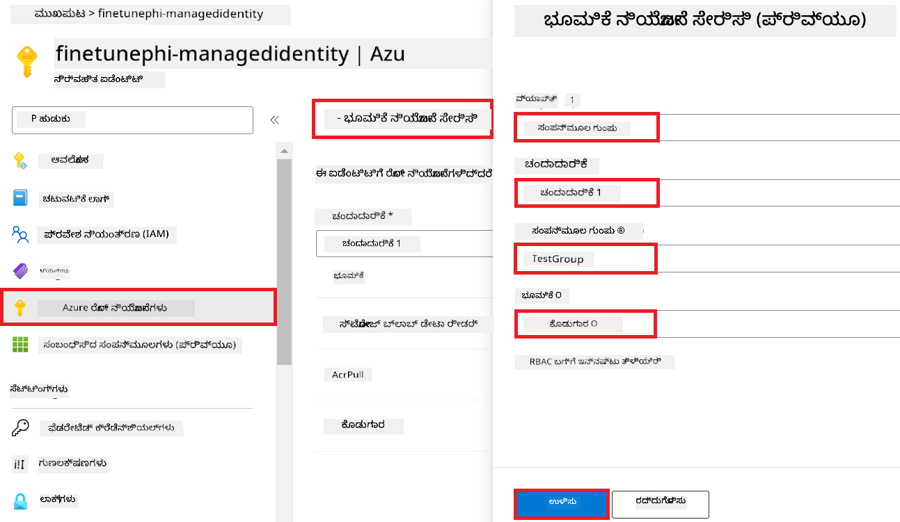
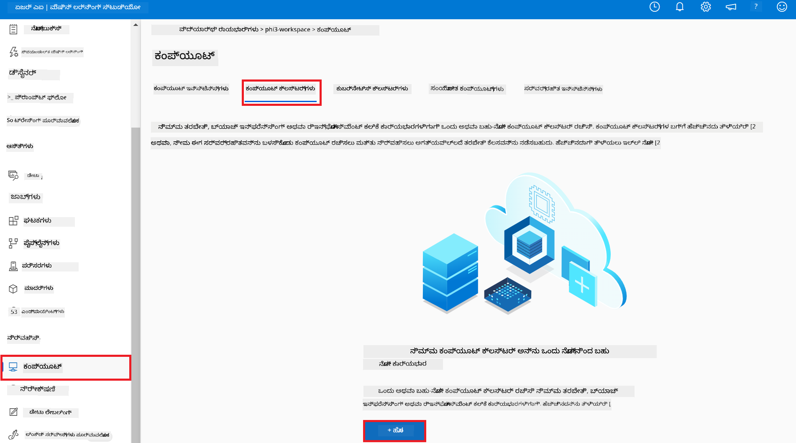
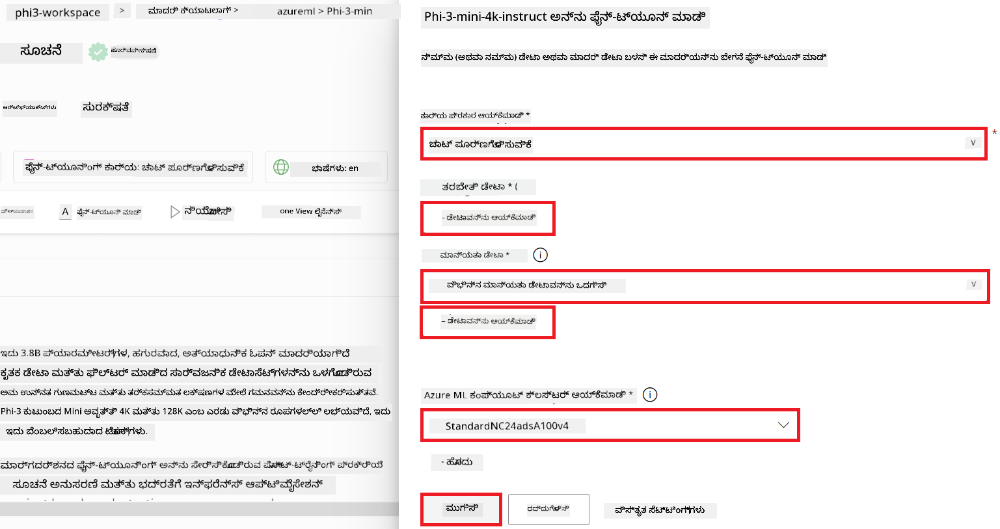
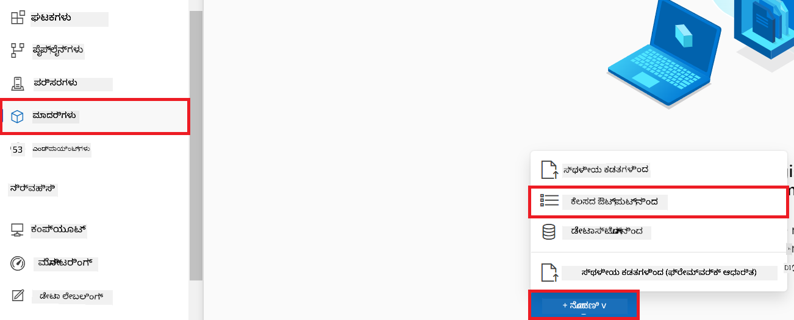
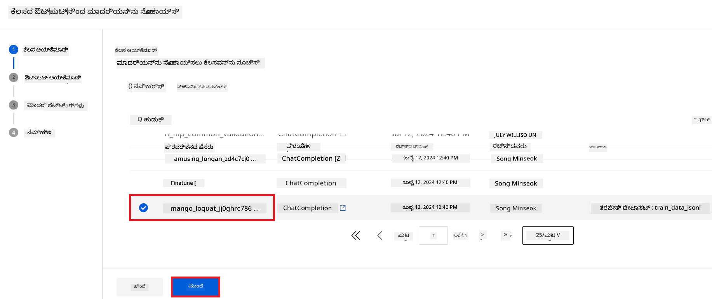
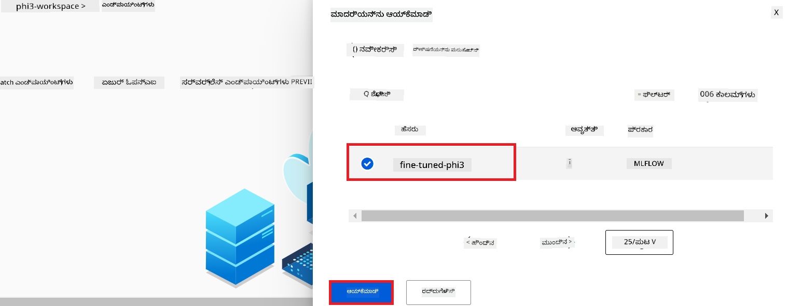
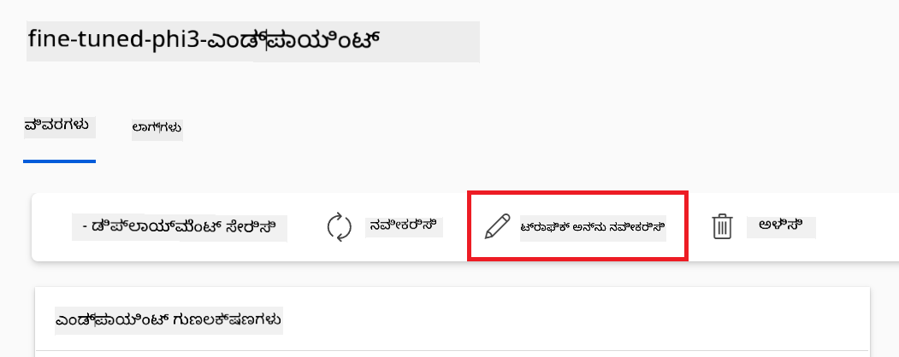
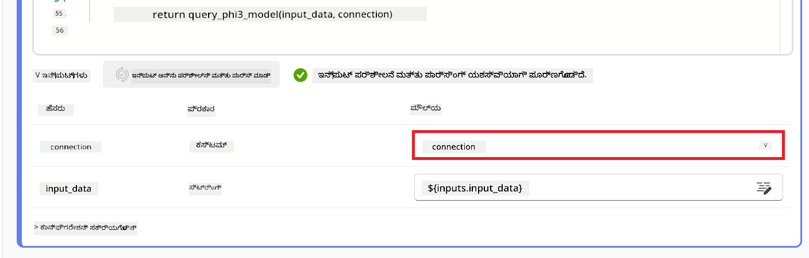
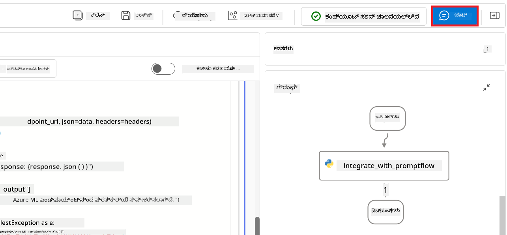

<!--
CO_OP_TRANSLATOR_METADATA:
{
  "original_hash": "ecbd9179a21edbaafaf114d47f09f3e3",
  "translation_date": "2025-12-21T20:50:22+00:00",
  "source_file": "md/02.Application/01.TextAndChat/Phi3/E2E_Phi-3-FineTuning_PromptFlow_Integration_AIFoundry.md",
  "language_code": "kn"
}
-->
# Azure AI Foundry ನಲ್ಲಿ Prompt flow ಜೊತೆಗೆ ಕಸ್ಟಮ್ Phi-3 ಮಾದರಿಗಳನ್ನು ಫೈನ್‑ಟ್ಯೂನ್ ಮಾಡಿ ಮತ್ತು ಇಂಟಿಗ್ರೇಟ್ ಮಾಡಿ

ಈ ಎಂಡ್‑ಟು‑ಎಂಡ್ (E2E) ಉದಾಹರಣೆ Microsoft Tech Community ನಿಂದಲಾದ ಮಾರ್ಗದರ್ಶಿ "[Azure AI Foundry ನಲ್ಲಿ Prompt Flow ಜೊತೆಗೆ ಕಸ್ಟಮ್ Phi-3 ಮಾದರಿಗಳನ್ನು ಫైన్‑ಟ್ಯೂನ್ ಮತ್ತು ಇಂಟಿಗ್ರೇಟ್ ಮಾಡಿ](https://techcommunity.microsoft.com/t5/educator-developer-blog/fine-tune-and-integrate-custom-phi-3-models-with-prompt-flow-in/ba-p/4191726?WT.mc_id=aiml-137032-kinfeylo)" ಆಧರಿಸಿದೆ. ಇದು Azure AI Foundry ನಲ್ಲಿ Prompt flow ಜೊತೆಗೆ ಕಸ್ಟಮ್ Phi-3 ಮಾದರಿಗಳನ್ನು ಫೈನ್‑ಟ್ಯೂನ್ ಮಾಡುವ, ನಿಯೋಜಿಸುವ ಮತ್ತು ಇಂಟಿಗ್ರೇಟ್ ಮಾಡುವ ಪ್ರಕ್ರಿಯೆಗಳನ್ನು ಪರಿಚಯಿಸುತ್ತದೆ.
E2E ಉದಾಹರಣೆಯಾದ "[Fine-Tune and Integrate Custom Phi-3 Models with Prompt Flow](./E2E_Phi-3-FineTuning_PromptFlow_Integration.md)" ಗಳಿಗಿಂತ ಭಿನ್ನವಾಗಿ, ಅದು ಲೋಕಲ್‌ಲ್ಲಿ ಕೋಡ್ ರನ್ ಮಾಡುವುದನ್ನು ಒಳಗೊಂಡಿದ್ದರೆ, ಈ ಟ್ಯುಟೋರಿಯಲ್ ಸಂಪೂರ್ಣವಾಗಿ Azure AI / ML Studio ಒಳಗೆ ನಿಮ್ಮ ಮಾದರಿಯನ್ನು ಫೈನ್‑ಟ್ಯೂನ್ ಮಾಡುವುದು ಮತ್ತು ಇಂಟಿಗ್ರೇಟ್ ಮಾಡುವುದು ಮೇಲೆ কেন্দ್ರೀಕರಿಸಿದೆ.

## ಸಾರಾಂಶ

ಈ E2E ಉದಾಹರಣೆಯಲ್ಲಿ, ನೀವು Phi-3 ಮಾದರಿಯನ್ನು ಹೇಗೆ ಫೈನ್‑ಟ್ಯೂನ್ ಮಾಡಬೇಕು ಮತ್ತು ಅದನ್ನು Azure AI Foundry ನಲ್ಲಿ Prompt flow ಜೊತೆ ಹೇಗೆ ಇಂಟಿಗ್ರೇಟ್ ಮಾಡಬೇಕು ಎಂಬುದನ್ನು ಕಲಿಯುತ್ತೀರಿ. Azure AI / ML Studio ಅನ್ನು ಉಪಯೋಗಿಸಿ, ನೀವು ಕಸ್ಟಮ್ AI ಮಾದರಿಗಳನ್ನು ನಿಯೋಜಿಸಲು ಮತ್ತು ಬಳಸಲು ಒಂದು ವರ್ಕ್‌ಫ್ಲೋ ಸ್ಥಾಪಿಸುತ್ತೀರಿ. ಈ E2E ಉದಾಹರಣೆ ಮೂರು ಸನ್ನಿವೇಶಗಳಿಗೆ ವಿಭಾಗಿಸಲಾಗಿದೆ:

**Scenario 1: Azure ಸಂಪನ್ಮೂಲಗಳನ್ನು ಸೆಟ್ ಅಪ್ ಮಾಡಿ ಮತ್ತು ಫೈನ್‑ಟ್ಯೂನಿಂಗ್‌ಗಾಗಿ ಸಿದ್ಧತೆಯನ್ನು ಮಾಡಿ**

**Scenario 2: Phi-3 ಮಾದರಿಯನ್ನು ಫೈನ್‑ಟ್ಯೂನ್ ಮಾಡಿ ಮತ್ತು Azure Machine Learning Studio ನಲ್ಲಿ ನಿಯೋಜಿಸಿ**

**Scenario 3: Prompt flow ಜೊತೆಗೆ ಇಂಟಿಗ್ರೇಟ್ ಮಾಡಿ ಮತ್ತು Azure AI Foundry ನಲ್ಲಿ ನಿಮ್ಮ ಕಸ್ಟಮ್ ಮಾದರಿಯೊಂದಿಗೆ ಚಾಟ್ ಮಾಡಿ**

ಈ E2E ಉದಾಹರಣೆಯ ಒಂದು ಅವಲೋಕನ ಇಲ್ಲಿದೆ.


### ವಿಷಯ ಸೂಚಿ

1. **[Scenario 1: Azure ಸಂಪನ್ಮೂಲಗಳನ್ನು ಸಿದ್ಧಪಡಿಸಿ ಮತ್ತು ಫೈನ್‑ಟ್ಯೂನಿಂಗ್‌ಗಾಗಿ ತಯಾರಾಗಿರಿ](../../../../../../md/02.Application/01.TextAndChat/Phi3)**
    - [Create an Azure Machine Learning Workspace](../../../../../../md/02.Application/01.TextAndChat/Phi3)
    - [Request GPU quotas in Azure Subscription](../../../../../../md/02.Application/01.TextAndChat/Phi3)
    - [Add role assignment](../../../../../../md/02.Application/01.TextAndChat/Phi3)
    - [Set up project](../../../../../../md/02.Application/01.TextAndChat/Phi3)
    - [Prepare dataset for fine-tuning](../../../../../../md/02.Application/01.TextAndChat/Phi3)

1. **[Scenario 2: Phi-3 ಮಾದರಿಯನ್ನು ಫೈನ್‑ಟ್ಯೂನ್ ಮಾಡಿ ಮತ್ತು Azure Machine Learning Studio ನಲ್ಲಿ ನಿಯೋಜಿಸಿ](../../../../../../md/02.Application/01.TextAndChat/Phi3)**
    - [Fine-tune the Phi-3 model](../../../../../../md/02.Application/01.TextAndChat/Phi3)
    - [Deploy the fine-tuned Phi-3 model](../../../../../../md/02.Application/01.TextAndChat/Phi3)

1. **[Scenario 3: Prompt flow ಜೊತೆ ಇಂಟಿಗ್ರೇಟ್ ಮಾಡಿ ಮತ್ತು Azure AI Foundry ನಲ್ಲಿ ನಿಮ್ಮ ಕಸ್ಟಮ್ ಮಾದರಿಯೊಂದಿಗೆ ಚಾಟ್ ಮಾಡಿ](../../../../../../md/02.Application/01.TextAndChat/Phi3)**
    - [Integrate the custom Phi-3 model with Prompt flow](../../../../../../md/02.Application/01.TextAndChat/Phi3)
    - [Chat with your custom Phi-3 model](../../../../../../md/02.Application/01.TextAndChat/Phi3)

## Scenario 1: Azure ಸಂಪನ್ಮೂಲಗಳನ್ನು ಸಿದ್ಧಪಡಿಸಿ ಮತ್ತು ಫೈನ್‑ಟ್ಯೂನಿಂಗ್‌ಗಾಗಿ ತಯಾರಾಗಿರಿ

### Create an Azure Machine Learning Workspace

1. ಪೋರ್ಟಲ್ ಪುಟದ ಮೇಲ್ಭಾಗದಲ್ಲಿರುವ **search bar** ನಲ್ಲಿ *azure machine learning* ಟೈಪ್ ಮಾಡಿ ಮತ್ತು ಹೋಲುವ ಆಯ್ಕೆಗಳಿಂದ **Azure Machine Learning** ಆಯ್ಕೆಮಾಡಿ.

    

2. ನ್ಯಾವಿಗೇಶನ್ ಮೆನುೆಯಲ್ಲಿಂದ **+ Create** ಆಯ್ಕೆಮಾಡಿ.

3. ನ್ಯಾವಿಗೇಶನ್ ಮೆನುೆಯಲ್ಲಿಂದ **New workspace** ಆಯ್ಕೆಮಾಡಿ.

    

4. ಕೆಳಗಿನ ಕಾರ್ಯಗಳನ್ನು ನಡೆಸಿ:

    - ನಿಮ್ಮ Azure **Subscription** ಆಯ್ಕೆಮಾಡಿ.
    - ಬಳಸಲುಬೇಕಾದ **Resource group** ಆಯ್ಕೆಮಾಡಿ (ಆವಶ್ಯಕತೆ ಇದ್ದರೆ ಹೊಸದನ್ನು ಸೃಷ್ಟಿಸಿ).
    - **Workspace Name** ನಮೂದಿಸಿ. ಇದು ವಿಶಿಷ್ಟ ಮೌಲ್ಯವಾಗಿರಬೇಕು.
    - ನೀವು ಬಳಸಲು ಬಯಸುವ **Region** ಆಯ್ಕೆಮಾಡಿ.
    - ಬಳಸಲು ಬೇಕಾದ **Storage account** ಆಯ್ಕೆಮಾಡಿ (ಆವಶ್ಯಕತೆ ಇದ್ದರೆ ಹೊಸದನ್ನು ಸೃಷ್ಟಿಸಿ).
    - ಬಳಸಲು ಬೇಕಾದ **Key vault** ಆಯ್ಕೆಮಾಡಿ (ಆವಶ್ಯಕತೆ ಇದ್ದರೆ ಹೊಸದನ್ನು ಸೃಷ್ಟಿಸಿ).
    - ಬಳಸಲು ಬೇಕಾದ **Application insights** ಆಯ್ಕೆಮಾಡಿ (ಆವಶ್ಯಕತೆ ಇದ್ದರೆ ಹೊಸದನ್ನು ಸೃಷ್ಟಿಸಿ).
    - ಬಳಸಲು ಬೇಕಾದ **Container registry** ಆಯ್ಕೆಮಾಡಿ (ಆವಶ್ಯಕತೆ ಇದ್ದರೆ ಹೊಸದನ್ನು ಸೃಷ್ಟಿಸಿ).

    

5. **Review + Create** ಆಯ್ಕೆಮಾಡಿ.

6. **Create** ಆಯ್ಕೆಮಾಡಿ.

### Request GPU quotas in Azure Subscription

ಈ ಟ್ಯುಟೋರಿಯಲ್‌ನಲ್ಲಿ, ನೀವು Phi-3 ಮಾದರಿಯನ್ನು ಫೈನ್‑ಟ್ಯೂನ್ ಮಾಡುವುದು ಮತ್ತು ನಿಯೋಜಿಸುವುದಕ್ಕೆ GPUs ಬಳಸುತ್ತೀರಿ. ಫೈನ್‑ಟ್ಯೂನಿಂಗ್‌ಗೆ, ನೀವು *Standard_NC24ads_A100_v4* GPU ಅನ್ನು ಉಪಯೋಗಿಸುತ್ತೀರಿ, ಇದಕ್ಕೆ quota ವಿನಂತಿ ಅಗತ್ಯವಿದೆ. ನಿಯೋಜನೆಗಾಗಿ, ನೀವು *Standard_NC6s_v3* GPU ಅನ್ನು ಉಪಯೋಗಿಸುತ್ತೀರಿ, ಅದಕ್ಕೂ quota ವಿನಂತಿ ಅಗತ್ಯವಿದೆ.

> [!NOTE]
>
> Pay-As-You-Go_subscriptions (ಸಾಮಾನ್ಯ ಸಬ್ಸ್ಕ್ರಿಪ್ಶನ್ ಪ್ರಕಾರ) ಮಾತ್ರ GPU ಅಲೋಕೇಶನ್‌ಗೆ ಅರ್ಹವಾಗಿವೆ; benefit subscriptions ಪ್ರಸ್ತುತ ಬೆಂಬಲಿಸಲಾಗುವುದಿಲ್ಲ.
>

1. [Azure ML Studio](https://ml.azure.com/home?wt.mc_id=studentamb_279723) ಭೇಟಿನೀಡಿ.

1. *Standard NCADSA100v4 Family* quota ಅನ್ನು ವಿನಂತಿಸಲು ಕೆಳಗಿನ ಕಾರ್ಯಗಳನ್ನು ಮಾಡಿ:

    - ಎಡ ಮೇಲ್ಭಾಗದ ಟ್ಯಾಬ್‌ನಿಂದ **Quota** ಆಯ್ಕೆಮಾಡಿ.
    - ಬಳಸಬೇಕಾದ **Virtual machine family** ಆಯ್ಕೆಮಾಡಿ. ಉದಾಹರಣೆಗೆ, *Standard NCADSA100v4 Family Cluster Dedicated vCPUs* ಆಯ್ಕೆಮಾಡಿ, ಇದರಲ್ಲಿ *Standard_NC24ads_A100_v4* GPU ಇದೆ.
    - ನ್ಯಾವಿಗೇಶನ್ ಮೆನುеннಿಂದ **Request quota** ಆಯ್ಕೆಮಾಡಿ.

        

    - Request quota ಪುಟದೊಳಗೆ, ನೀವು ಬಳಸಲು ಬಯಸುವ **New cores limit** ನಮೂದಿಸಿ. ಉದಾಹರಣೆಗೆ, 24.
    - Request quota ಪುಟದೊಳಗೆ, GPU quota ವಿನಂತಿಸಲು **Submit** ಆಯ್ಕೆಮಾಡಿ.

1. *Standard NCSv3 Family* quota ಅನ್ನು ವಿನಂತಿಸಲು ಕೆಳಗಿನ ಕಾರ್ಯಗಳನ್ನು ಮಾಡಿ:

    - ಎಡ ಮೆಲುಭಾಗದ ಟ್ಯಾಬ್‌ನಿಂದ **Quota** ಆಯ್ಕೆಮಾಡಿ.
    - ಬಳಸಬೇಕಾದ **Virtual machine family** ಆಯ್ಕೆಮಾಡಿ. ಉದಾಹರಣೆಗೆ, *Standard NCSv3 Family Cluster Dedicated vCPUs* ಆಯ್ಕೆಮಾಡಿ, ಇದರಲ್ಲಿ *Standard_NC6s_v3* GPU ಇದೆ.
    - ನ್ಯಾವಿಗೇಶನ್ ಮೆನುеннಿಂದ **Request quota** ಆಯ್ಕೆಮಾಡಿ.
    - Request quota ಪುಟದೊಳಗೆ, ನೀವು ಬಳಸಲು ಬಯಸುವ **New cores limit** ನಮೂದಿಸಿ. ಉದಾಹರಣೆಗೆ, 24.
    - Request quota ಪುಟದೊಳಗೆ, GPU quota ವಿನಂತಿಸಲು **Submit** ಆಯ್ಕೆಮಾಡಿ.

### Add role assignment

ನಿಮ್ಮ ಮಾದರಿಗಳನ್ನು ಫೈನ್‑ಟ್ಯೂನ್ ಮಾಡಿ ಮತ್ತು ನಿಯೋಜಿಸಲು, ಮೊದಲು User Assigned Managed Identity (UAI) ರಚಿಸಿ ಮತ್ತು ಅದಕ್ಕೆ ಸೂಕ್ತ ಅನುವುಗಳನ್ನು (permissions) ನೀಡಿ. ನಿಯೋಜನೆಯ ಸಮಯದಲ್ಲಿ ಪ್ರಾಮಾಣೀಕರಣಕ್ಕಾಗಿ ಈ UAI ಉಪಯೋಗಿಸಲ್ಪಡುತ್ತದೆ

#### Create User Assigned Managed Identity(UAI)

1. ಪೋರ್ಟಲ್ ಪುಟದ ಮೇಲ್ಭಾಗದಲ್ಲಿರುವ **search bar** ನಲ್ಲಿ *managed identities* ಟೈಪ್ ಮಾಡಿ ಮತ್ತು ಹೋಲುವ ಆಯ್ಕೆಗಳಿಂದ **Managed Identities** ಆಯ್ಕೆಮಾಡಿ.

    

1. **+ Create** ಆಯ್ಕೆಮಾಡಿ.

    

1. ಕೆಳಗಿನ ಕಾರ್ಯಗಳನ್ನು ನಿರ್ವಹಿಸಿ:

    - ನಿಮ್ಮ Azure **Subscription** ಆಯ್ಕೆಮಾಡಿ.
    - ಬಳಸಲು ಬೇಕಾದ **Resource group** ಆಯ್ಕೆಮಾಡಿ (ಆವಶ್ಯಕತೆ ಇದ್ದರೆ ಹೊಸದನ್ನು ಸೃಷ್ಟಿಸಿ).
    - ನೀವು ಬಳಸಲು ಬಯಸುವ **Region** ಆಯ್ಕೆಮಾಡಿ.
    - **Name** ನಮೂದಿಸಿ. ಇದು ವಿಶಿಷ್ಟ ಮೌಲ್ಯವಾಗಿರಬೇಕು.

    

1. **Review + create** ಆಯ್ಕೆಮಾಡಿ.

1. **+ Create** ಆಯ್ಕೆಮಾಡಿ.

#### Add Contributor role assignment to Managed Identity

1. ನೀವು ರಚಿಸಿದ Managed Identity ಸಂಪನ್ಮೂಲಕ್ಕೆ ನಾವಿಗೇಟ್ ಮಾಡಿ.

1. ಎಡ ಮೆನುеннಿಂದ **Azure role assignments** ಆಯ್ಕೆಮಾಡಿ.

1. ನ್ಯಾವಿಗೇಶನ್ ಮೆನುеннಿಂದ **+Add role assignment** ಆಯ್ಕೆಮಾಡಿ.

1. Add role assignment ಪುಟದೊಳಗೆ, ಕೆಳಗಿನ ಕಾರ್ಯಗಳನ್ನು ಮಾಡಿ:
    - **Scope** ಅನ್ನು **Resource group** ಆಗಿ ಆಯ್ಕೆಮಾಡಿ.
    - ನಿಮ್ಮ Azure **Subscription** ಆಯ್ಕೆಮಾಡಿ.
    - ಬಳಸಲು ಬೇಕಾದ **Resource group** ಆಯ್ಕೆಮಾಡಿ.
    - **Role** ಅನ್ನು **Contributor** ಎಂದು ಆಯ್ಕೆಮಾಡಿ.

    

2. **Save** ಆಯ್ಕೆಮಾಡಿ.

#### Add Storage Blob Data Reader role assignment to Managed Identity

1. ಪೋರ್ಟಲ್ ಪುಟದ ಮೇಲ್ಭಾಗದಲ್ಲಿರುವ **search bar** ನಲ್ಲಿ *storage accounts* ಟೈಪ್ ಮಾಡಿ ಮತ್ತು ಹೋಲುವ ಆಯ್ಕೆಗಳಲ್ಲಿಂದ **Storage accounts** ಆಯ್ಕೆಮಾಡಿ.

    

1. ನೀವು ರಚಿಸಿದ್ದ Azure Machine Learning workspace ಗೆ ಸಂಬಂಧಿಸಿದ ಸ್ಟೋರೇಜ್ ಅಕೌಂಟ್ ಆಯ್ಕೆಮಾಡಿ. ಉದಾಹರಣೆಗೆ, *finetunephistorage*.

1. Add role assignment ಪುಟಕ್ಕೆ ನಾವಿಗೇಟ್ ಮಾಡಲು ಕೆಳಗಿನ ಕಾರ್ಯಗಳನ್ನು ನಿರ್ವಹಿಸಿ:

    - ನೀವು ರಚಿಸಿದ Azure Storage ಅಕೌಂಟಿಗೆ ನಾವಿಗೇಟ್ ಮಾಡಿ.
    - ಎಡ ಮೆನುеннಿಂದ **Access Control (IAM)** ಆಯ್ಕೆಮಾಡಿ.
    - ನ್ಯಾವಿಗೇಶನ್ ಮೆನುеннಿಂದ **+ Add** ಆಯ್ಕೆಮಾಡಿ.
    - ನ್ಯಾವಿಗೇಶನ್ ಮೆನುеннಿಂದ **Add role assignment** ಆಯ್ಕೆಮಾಡಿ.

    

1. Add role assignment ಪುಟದೊಳಗೆ, ಕೆಳಗಿನ ಕಾರ್ಯಗಳನ್ನು ಮಾಡಿ:

    - Role ಪುಟದೊಳಗೆ, **search bar** ನಲ್ಲಿ *Storage Blob Data Reader* ಟೈಪ್ ಮಾಡಿ ಮತ್ತು ಹೋಲುವ ಆಯ್ಕೆಗಳಿಂದ **Storage Blob Data Reader** ಆಯ್ಕೆಮಾಡಿ.
    - Role ಪುಟದೊಳಗೆ, **Next** ಆಯ್ಕೆಮಾಡಿ.
    - Members ಪುಟದೊಳಗೆ, **Assign access to**ನ್ನಾಗಿ **Managed identity** ಆಯ್ಕೆಮಾಡಿ.
    - Members ಪುಟದೊಳಗೆ, **+ Select members** ಆಯ್ಕೆಮಾಡಿ.
    - Select managed identities ಪುಟದೊಳಗೆ, ನಿಮ್ಮ Azure **Subscription** ಆಯ್ಕೆಮಾಡಿ.
    - Select managed identities ಪುಟದೊಳಗೆ, **Managed identity** ಅನ್ನು **Manage Identity** ಎಂದು ಆಯ್ಕೆಮಾಡಿ.
    - Select managed identities ಪುಟದೊಳಗೆ, ನೀವು ರಚಿಸಿದ Manage Identity ಅನ್ನು ಆಯ್ಕೆಮಾಡಿ. ಉದಾಹರಣೆಗೆ, *finetunephi-managedidentity*.
    - Select managed identities ಪುಟದೊಳಗೆ, **Select** ಆಯ್ಕೆಮಾಡಿ.

    

1. **Review + assign** ಆಯ್ಕೆಮಾಡಿ.

#### Add AcrPull role assignment to Managed Identity

1. ಪೋರ್ಟಲ್ ಪುಟದ ಮೇಲ್ಭಾಗದಲ್ಲಿರುವ **search bar** ನಲ್ಲಿ *container registries* ಟೈಪ್ ಮಾಡಿ ಮತ್ತು ಹೋಲುವ ಆಯ್ಕೆಗಳಿಂದ **Container registries** ಆಯ್ಕೆಮಾಡಿ.

    

1. Azure Machine Learning workspace ಗೆ ಸಂಬಂಧಿಸಿದ container registry ಆಯ್ಕೆಮಾಡಿ. ಉದಾಹರಣೆಗೆ, *finetunephicontainerregistry*

1. Add role assignment ಪುಟಕ್ಕೆ ನಾವಿಗೇಟ್ ಮಾಡಲು ಕೆಳಗಿನ ಕಾರ್ಯಗಳನ್ನು ಮಾಡಿ:

    - ಎಡ ಮೆನುеннಿಂದ **Access Control (IAM)** ಆಯ್ಕೆಮಾಡಿ.
    - ನ್ಯಾವಿಗೇಶನ್ ಮೆನುеннಿಂದ **+ Add** ಆಯ್ಕೆಮಾಡಿ.
    - ನ್ಯಾವಿಗೇಶನ್ ಮೆನುеннಿಂದ **Add role assignment** ಆಯ್ಕೆಮಾಡಿ.

1. Add role assignment ಪುಟದೊಳಗೆ, ಕೆಳಗಿನ ಕಾರ್ಯಗಳನ್ನು ಮಾಡಿ:

    - Role ಪುಟದೊಳಗೆ, **search bar** ನಲ್ಲಿ *AcrPull* ಟೈಪ್ ಮಾಡಿ ಮತ್ತು ಹೋಲುವ ಆಯ್ಕೆಗಳಿಂದ **AcrPull** ಆಯ್ಕೆಮಾಡಿ.
    - Role ಪುಟದೊಳಗೆ, **Next** ಆಯ್ಕೆಮಾಡಿ.
    - Members ಪುಟದೊಳಗೆ, **Assign access to**ನ್ನು **Managed identity** ಆಗಿ ಆಯ್ಕೆಮಾಡಿ.
    - Members ಪುಟದೊಳಗೆ, **+ Select members** ಆಯ್ಕೆಮಾಡಿ.
    - Select managed identities ಪುಟದೊಳಗೆ, ನಿಮ್ಮ Azure **Subscription** ಆಯ್ಕೆಮಾಡಿ.
    - Select managed identities ಪುಟದೊಳಗೆ, **Managed identity** ಅನ್ನು **Manage Identity** ಎಂದು ಆಯ್ಕೆಮಾಡಿ.
    - Select managed identities ಪುಟದೊಳಗೆ, ನೀವು ರಚಿಸಿದ Manage Identity ಅನ್ನು ಆಯ್ಕೆಮಾಡಿ. ಉದಾಹರಣೆಗೆ, *finetunephi-managedidentity*.
    - Select managed identities ಪುಟದೊಳಗೆ, **Select** ಆಯ್ಕೆಮಾಡಿ.
    - **Review + assign** ಆಯ್ಕೆಮಾಡಿ.

### Set up project

ಫೈನ್‑ಟ್ಯೂನಿಂಗ್‌ಗೆ ಅಗತ್ಯವಿರುವ datasets ಡೌನ್‌ಲೋಡ್ ಮಾಡಲು, ನೀವು ಲೋಕಲ್ ಪರಿಸರವನ್ನು ಸೆಟ್ ಅಪ್ ಮಾಡುತ್ತೀರಿ.

ಈ ವ್ಯಾಯಾಮದಲ್ಲಿ, ನೀವು

- ಒಳಗೆ ಕೆಲಸ ಮಾಡಲು ಒಂದು ಫೋಲ್ಡರ್ ರಚಿಸುವಿರಿ.
- ಒಂದು ವರ್ಚುಯಲ್ ಎನ್‌ವೈರನ್ಮೆಂಟ್ ರಚಿಸುವಿರಿ.
- ಅಗತ್ಯವಿರುವ ಪ್ಯಾಕೇಜ್‌ಗಳನ್ನು ಇನ್‌ಸ್ಟಾಲ್ ಮಾಡುವಿರಿ.
- dataset ಅನ್ನು ಡೌನ್‌ಲೋಡ್ ಮಾಡಲು *download_dataset.py* ಫೈಲ್ ರಚಿಸುವಿರಿ.

#### Create a folder to work inside it

1. ಒಂದು ಟರ್ಮಿನಲ್ ವಿಂಡೋ ತೆರೆಯಿರಿ ಮತ್ತು ಡಿಫಾಲ್ಟ್ ಪಾಥ್‌ನಲ್ಲಿ *finetune-phi* ಎಂಬ ಹೆಸರಿನ ಫೋಲ್ಡರ್ ರಚಿಸಲು ಕೆಳಗಿನ ಆಜ್ಞೆಯನ್ನು ಟೈಪ್ ಮಾಡಿ.

    ```console
    mkdir finetune-phi
    ```

2. ನಿಮ್ಮ ಟೆರ್ಮಿನಲ್‌ನಲ್ಲಿ ಕೆಳಗಿನ命令ವನ್ನು ಟೈಪ್ ಮಾಡಿ ನಿಮ್ಮ ರಚಿಸಿದ *finetune-phi* ಫೋಲ್ಡರ್‌ಗೆ ನಾವಿಗೇಟ್ ಆಗಲು.

    ```console
    cd finetune-phi
    ```

#### ವರ್ಚುಯಲ್ ಪರಿಸರವನ್ನು ರಚಿಸಿ

1. ನಿಮ್ಮ ಟೆರ್ಮಿನಲ್‌ನಲ್ಲಿ ಕೆಳಗಿನ命令ವನ್ನು ಟೈಪ್ ಮಾಡಿ *.venv* ಎಂಬ ಹೆಸರಿನಲ್ಲಿ ವರ್ಚುಯಲ್ ಪರಿಸರವನ್ನು ರಚಿಸಲು.

    ```console
    python -m venv .venv
    ```

2. ನಿಮ್ಮ ಟೆರ್ಮಿನಲ್‌ನಲ್ಲಿ ಕೆಳಗಿನ命令ವನ್ನು ಟೈಪ್ ಮಾಡಿ ವರ್ಚುಯಲ್ ಪರಿಸರವನ್ನು ಸಕ್ರಿಯಗೊಳಿಸಲು.

    ```console
    .venv\Scripts\activate.bat
    ```

> [!NOTE]
> ಅದು ಯಶಸ್ವಿಯಾದರೆ, ನಿಮಗೆ ಕಮಾಂಡ್ ಪ್ರಾಂಪ್ಟ್‌ಗೆ ಮುಂದೆ *(.venv)* ಕಾಣಿಸಬೇಕು.

#### ಅಗತ್ಯ ಪ್ಯಾಕೇಜ್‌ಗಳನ್ನು इंस्टಾಲ್ ಮಾಡಿ

1. ಅಗತ್ಯ ಪ್ಯಾಕೇಜ್‌ಗಳನ್ನು ಇನ್‌ಸ್ಟಾಲ್ ಮಾಡಲು ನಿಮ್ಮ ಟೆರ್ಮಿನಲ್‌ನಲ್ಲಿ ಕೆಳಗಿನ命令ಗಳನ್ನು ಟೈಪ್ ಮಾಡಿ.

    ```console
    pip install datasets==2.19.1
    ```

#### `donload_dataset.py` ರಚಿಸಿ

> [!NOTE]
> ಪೂರ್ಣ ಫೋಲ್ಡರ್ ರಚನೆ:
>
> ```text
> └── YourUserName
> .    └── finetune-phi
> .        └── download_dataset.py
> ```

1. **Visual Studio Code** ತೆರೆಯಿರಿ.

1. ಮೆನು ಬಾರಿನಿಂದ **File**ನ್ನು ಆಯ್ಕೆಮಾಡಿ.

1. **Open Folder** ಅನ್ನು ಆಯ್ಕೆಮಾಡಿ.

1. ನೀವು ರಚಿಸಿದ *finetune-phi* ಫೋಲ್ಡರ್ ಅನ್ನು ಆಯ್ಕೆಮಾಡಿ, ಅದು ಈ ಸ್ಥಳದಲ್ಲಿ ಇದೆ: *C:\Users\yourUserName\finetune-phi*.

    

1. Visual Studio Code‌ನ ಎಡ ಪ್ಯಾನ್‌ನಲ್ಲಿ,right-click ಮಾಡಿ **New File** ಅನ್ನು ಆಯ್ಕೆಮಾಡಿ ಮತ್ತು *download_dataset.py* ಎಂಬ ಹೆಸರಿನ ಹೊಸ ಫೈಲ್ ರಚಿಸಿ.

    

### ಫೈನ್-ಟ್ಯೂನಿಂಗ್‌ಗೆ ಡೇಟಾಸೆಟ್ ಸಿದ್ಧಪಡಿಸಿ

ಈ ವ್ಯಾಯಾಮದಲ್ಲಿ, ನೀವು *download_dataset.py* ಫೈಲ್ ಅನ್ನು 실행 ಮಾಡಿ *ultrachat_200k* ಡೇಟಾಸೆಟ್‌ಗಳನ್ನು ನಿಮ್ಮ ಲೋಕಲ್ ಪರಿಸರಕ್ಕೆ ಡೌನ್‌ಲೋಡ್ ಮಾಡುತ್ತೀರಿ. ನಂತರ ನೀವು ಈ ಡೇಟಾಸೆಟ್‌ಗಳನ್ನು Azure Machine Learning‌ನಲ್ಲಿ Phi-3 ಮಾದರಿಯನ್ನು ಫೈನ್-ಟ್ಯೂನ್ ಮಾಡಲು ಬಳಸುತ್ತೀರಿ.

ಈ ವ್ಯಾಯಾಮದಲ್ಲಿ, ನೀವು:

- *download_dataset.py* ಫೈಲ್‌ಗೆ ಡೇಟಾಸೆಟ್‌ಗಳನ್ನು ಡೌನ್‌ಲೋಡ್ ಮಾಡುವ ಕೋಡ್ ಸೇರಿಸಬಹುದು.
- *download_dataset.py* ಫೈಲ್ ಅನ್ನು 실행ಿಸಿ ಡೇಟಾ ಸೆಟ್‌ಗಳನ್ನು ನಿಮ್ಮ ಲೋಕಲ್ ಪರಿಸರಕ್ಕೆ ಡೌನ್‌ಲೋಡ್ ಮಾಡಿ.

#### *download_dataset.py* ಬಳಸಿ ನಿಮ್ಮ ಡೇಟಾಸೆಟ್ ಡೌನ್‌ಲೋಡ್ ಮಾಡಿ

1. Visual Studio Code ನಲ್ಲಿ *download_dataset.py* ಫೈಲ್ ಅನ್ನು ತೆರೆಯಿರಿ.

1. ಕೆಳಗಿನ ಕೋಡ್ ಅನ್ನು *download_dataset.py* ಫೈಲ್‌ಗೆ ಸೇರಿಸಿ.

    ```python
    import json
    import os
    from datasets import load_dataset

    def load_and_split_dataset(dataset_name, config_name, split_ratio):
        """
        Load and split a dataset.
        """
        # ನಿಗದಿಪಡಿಸಿದ ಹೆಸರು, ಸಂರಚನೆ ಮತ್ತು ವಿಭಜನೆ ಅನುಪಾತದೊಂದಿಗೆ ಡೇಟಾಸೆಟ್ ಅನ್ನು ಲೋಡ್ ಮಾಡಿ
        dataset = load_dataset(dataset_name, config_name, split=split_ratio)
        print(f"Original dataset size: {len(dataset)}")
        
        # ಡೇಟಾಸೆಟ್ ಅನ್ನು ತರಬೇತಿ ಮತ್ತು ಪರೀಕ್ಷಾ ಸೆಟ್‌ಗಳಾಗಿ ವಿಭಜಿಸಿ (80% ತರಬೇತಿ, 20% ಪರೀಕ್ಷೆ)
        split_dataset = dataset.train_test_split(test_size=0.2)
        print(f"Train dataset size: {len(split_dataset['train'])}")
        print(f"Test dataset size: {len(split_dataset['test'])}")
        
        return split_dataset

    def save_dataset_to_jsonl(dataset, filepath):
        """
        Save a dataset to a JSONL file.
        """
        # ಡೈರೆಕ್ಟರಿ ಇಲ್ಲದಿದ್ದರೆ ಅದನ್ನು ರಚಿಸಿ
        os.makedirs(os.path.dirname(filepath), exist_ok=True)
        
        # ಫೈಲನ್ನು ಬರೆಯುವ ಮೋಡ್‌ನಲ್ಲಿ ತೆರೆಯಿರಿ
        with open(filepath, 'w', encoding='utf-8') as f:
            # ಡೇಟಾಸೆಟ್‌ನ ಪ್ರತಿಯೊಂದು ದಾಖಲೆ ಮೇಲೆ ಪುನರಾವರ್ತಿಸಿ
            for record in dataset:
                # ದಾಖಲೆಯನ್ನು JSON ವಸ್ತುವಾಗಿ ಡಂಪ್ ಮಾಡಿ ಮತ್ತು ಅದನ್ನು ಫೈಲ್‌ಗೆ ಬರೆಯಿರಿ
                json.dump(record, f)
                # ದಾಖಲೆಗಳನ್ನು ವಿಭಜಿಸಲು ಹೊಸ ಸಾಲಿನ ಅಕ್ಷರವನ್ನು ಬರೆಯಿರಿ
                f.write('\n')
        
        print(f"Dataset saved to {filepath}")

    def main():
        """
        Main function to load, split, and save the dataset.
        """
        # ನಿರ್ದಿಷ್ಟ ಸಂರಚನೆ ಮತ್ತು ವಿಭಜನೆ ಅನುಪಾತದೊಂದಿಗೆ ULTRACHAT_200k ಡೇಟಾಸೆಟ್ ಅನ್ನು ಲೋಡ್ ಮಾಡಿ ಮತ್ತು ವಿಭಜಿಸಿ
        dataset = load_and_split_dataset("HuggingFaceH4/ultrachat_200k", 'default', 'train_sft[:1%]')
        
        # ವಿಭಜನೆಯಿಂದ ತರಬೇತಿ ಮತ್ತು ಪರೀಕ್ಷಾ ಡೇಟಾಸೆಟ್‌ಗಳನ್ನು ಹೊರತೆಗೆದಿಕೊಳ್ಳಿ
        train_dataset = dataset['train']
        test_dataset = dataset['test']

        # ತರಬೇತಿ ಡೇಟಾಸೆಟ್ ಅನ್ನು JSONL ಫೈಲ್‌ಗೆ ಉಳಿಸಿ
        save_dataset_to_jsonl(train_dataset, "data/train_data.jsonl")
        
        # ಪರೀಕ್ಷಾ ಡೇಟಾಸೆಟ್ ಅನ್ನು ಪ್ರತ್ಯೇಕ JSONL ಫೈಲ್‌ಗೆ ಉಳಿಸಿ
        save_dataset_to_jsonl(test_dataset, "data/test_data.jsonl")

    if __name__ == "__main__":
        main()

    ```

1. ಸ್ಕ್ರಿಪ್ಟನ್ನು 실행 ಮಾಡಿ ಡೇಟಾಸೆಟ್ ಅನ್ನು ನಿಮ್ಮ ಲೋಕಲ್ ಪರಿಸರಕ್ಕೆ ಡೌನ್‌ಲೋಡ್ ಮಾಡಲು ನಿಮ್ಮ ಟೆರ್ಮಿನಲ್‌ನಲ್ಲಿ ಕೆಳಗಿನ命令ವನ್ನು ಟೈಪ್ ಮಾಡಿ.

    ```console
    python download_dataset.py
    ```

1. ಡೇಟಾಸೆಟ್‌ಗಳು ಯಶಸ್ವಿಯಾಗಿ ನಿಮ್ಮ ಲೋಕಲ್ *finetune-phi/data* ಡೈರೆಕ್ಟರಿಯಲ್ಲಿ ಉಳಿದಿರುವುದನ್ನು ಪರಿಶೀಲಿಸಿ.

> [!NOTE]
>
> #### ಡೇಟಾಸೆಟ್ ಗಾತ್ರ ಮತ್ತು ಫೈನ್-ಟ್ಯೂನಿಂಗ್ ಸಮಯದ ಬಗ್ಗೆ ಗಮನಿಸಿ
>
> ಈ ಟ್ಯುಟೋರಿಯಲ್‌ನಲ್ಲಿ, ನೀವು ಡೇಟಾಸೆಟ್‌ನ ಕೇವಲ 1% (`split='train[:1%]'`) ಅನ್ನು ಮಾತ್ರ ಬಳಸಲಾಗುತ್ತದೆ. ಇದು ಡೇಟಾದ ಪ್ರಮಾಣವನ್ನು ಗಮನಾರ್ಹವಾಗಿ ಕಡಿಮೆ ಮಾಡುತ್ತದೆ, ಅಪ್ಲೋಡ್ ಮತ್ತು ಫೈನ್-ಟ್ಯೂನಿಂಗ್ ಪ್ರಕ್ರಿಯೆಗಳನ್ನು ವೇಗಗೊಳಿಸುತ್ತದೆ. ತರಬೇತಿ ಸಮಯ ಮತ್ತು ಮಾದರಿ ಕಾರ್ಯಕ್ಷಮತೆಯ ನಡುವೆ ಸರಿಯಾದ ಸಮತೋಲನವನ್ನು ಕಂಡುಹಿಡಿಯಲು ನೀವು ಶೇಕಡಾವಾರು ಹೊಂದಿಸಿ ಹೊಂದಿಸಬಹುದು. ಡೇಟಾಸೆಟ್‌ನ ಸಣ್ಣ ಉಪసಟು ಬಳಸಿ ಫೈನ್-ಟ್ಯೂನಿಂಗ್‌ಗೆ ಬೇಕಾದ ಸಮಯವನ್ನು ಕಡಿಮೆ ಮಾಡುತ್ತದೆ, ಇದರಿಂದ ಟ್ಯುಟೋರಿಯಲ್‌ಗಾಗಿ ಪ್ರಕ್ರಿಯೆ ಹೆಚ್ಚು ನಿರ್ವಹಣೀಯವಾಗುತ್ತದೆ.

## ಪರಿಸ್ಥಿತಿ 2: Phi-3 ಮಾದರಿಯನ್ನು ಫೈನ್-ಟ್ಯೂನ್ ಮಾಡಿ ಮತ್ತು Azure Machine Learning Studio ನಲ್ಲಿ ಡಿಪ್ಲಾಯ್ ಮಾಡಿ

### Phi-3 ಮಾದರಿಯನ್ನು ಫೈನ್-ಟ್ಯೂನ್ ಮಾಡಿ

ಈ ವ್ಯಾಯಾಮದಲ್ಲಿ, ನೀವು Azure Machine Learning Studio ನಲ್ಲಿ Phi-3 ಮಾದರಿಯನ್ನು ಫೈನ್-ಟ್ಯೂನ್ ಮಾಡುತ್ತೀರಿ.

ಈ ವ್ಯಾಯಾಮದಲ್ಲಿ, ನೀವು:

- ಫೈನ್-ಟ್ಯೂನಿಂಗ್‌ಗೆ ಕಂಪ್ಯೂಟರ್ ಕ್ಲಸ್ಟರ್ ಅನ್ನು ರಚಿಸುವುದು.
- Azure Machine Learning Studio ನಲ್ಲಿ Phi-3 ಮಾದರಿಯನ್ನು ಫೈನ್-ಟ್ಯೂನ್ ಮಾಡುವುದು.

#### ಫೈನ್-ಟ್ಯೂನಿಂಗ್‌ಗೆ ಕಂಪ್ಯೂಟರ್ ಕ್ಲಸ್ಟರ್ ರಚಿಸಿ

1. [Azure ML Studio](https://ml.azure.com/home?wt.mc_id=studentamb_279723) ಗೆ ಭೇಟಿ ನೀಡಿ.

1. ಎಡ ಬದಿಯ ಟ್ಯಾಬ್‌ನಿಂದ **Compute** ಅನ್ನು ಆಯ್ಕೆಮಾಡಿ.

1. ನ್ಯಾವಿಗೇಶನ್ ಮೆನುವಿನಿಂದ **Compute clusters** ಅನ್ನು ಆಯ್ಕೆಮಾಡಿ.

1. **+ New** ಅನ್ನು ಆಯ್ಕೆಮಾಡಿ.

    

1. ಕೆಳಗಿನ ಕಾರ್ಯಗಳನ್ನು ನಿರ್ವಹಿಸಿ:

    - ನೀವು ಬಳಸಲು ಬಯಸುವ **Region** ಅನ್ನು ಆಯ್ಕೆಮಾಡಿ.
    - **Virtual machine tier** ಅನ್ನು **Dedicated** ಗೆ ಸೆಟ್ ಮಾಡಿ.
    - **Virtual machine type** ಅನ್ನು **GPU** ಗೆ ಸೆಟ್ ಮಾಡಿ.
    - **Virtual machine size** ಫಿಲ್ಟರ್ ಅನ್ನು **Select from all options** ಗೆ ಸೆಟ್ ಮಾಡಿ.
    - **Virtual machine size** ಅನ್ನು **Standard_NC24ads_A100_v4** ಅನ್ನು ಆಯ್ಕೆಮಾಡಿ.

    

1. **Next** ಅನ್ನು ಆಯ್ಕೆಮಾಡಿ.

1. ಕೆಳಗಿನ ಕಾರ್ಯಗಳನ್ನು ನಿರ್ವಹಿಸಿ:

    - **Compute name** ನಮೂದಿಸಿ. ಇದು ಏಕೈಕ ಮೌಲ್ಯವಾಗಿರಬೇಕು.
    - **Minimum number of nodes** ಅನ್ನು **0** ಗೆ ಸೆಟ್ ಮಾಡಿ.
    - **Maximum number of nodes** ಅನ್ನು **1** ಗೆ ಸೆಟ್ ಮಾಡಿ.
    - **Idle seconds before scale down** ಅನ್ನು **120** ಗೆ ಸೆಟ್ ಮಾಡಿ.

    

1. **Create** ಅನ್ನು ಆಯ್ಕೆಮಾಡಿ.

#### Phi-3 ಮಾದರಿಯನ್ನು ಫೈನ್-ಟ್ಯೂನ್ ಮಾಡಿ

1. [Azure ML Studio](https://ml.azure.com/home?wt.mc_id=studentamb_279723) ಗೆ ಭೇಟಿ ನೀಡಿ.

1. ನೀವು ರಚಿಸಿದ Azure Machine Learning ವರ್ಕ್‌ಸ್ಪೇಸ್ ಅನ್ನು ಆಯ್ಕೆಮಾಡಿ.

    

1. ಕೆಳಗಿನ ಕಾರ್ಯಗಳನ್ನು ನಿರ್ವಹಿಸಿ:

    - ಎಡ ಬದಿಯ ಟ್ಯಾಬ್‌ನಿಂದ **Model catalog** ಅನ್ನು ಆಯ್ಕೆಮಾಡಿ.
    - **search bar** ನಲ್ಲಿ *phi-3-mini-4k* ಎಂದು ಟೈಪ್ ಮಾಡಿ ಮತ್ತು ತೋರಿಸಿದ ಆಯ್ಕೆಗಳಿಂದ **Phi-3-mini-4k-instruct** ಅನ್ನು ಆಯ್ಕೆಮಾಡಿ.

    

1. ನ್ಯಾವಿಗೇಶನ್ ಮೆನುವಿನಿಂದ **Fine-tune** ಅನ್ನು ಆಯ್ಕೆಮಾಡಿ.

    

1. ಕೆಳಗಿನ ಕಾರ್ಯಗಳನ್ನು ನಿರ್ವಹಿಸಿ:

    - **Select task type** ಅನ್ನು **Chat completion** ಗೆ ಸೆಟ್ ಮಾಡಿ.
    - **+ Select data** ಅನ್ನು ಆಯ್ಕೆಮಾಡಿ **Traning data** ಅಪ್ಲೋಡ್ ಮಾಡಲು.
    - ಮಾನ್ಯತಾ ಡೇಟಾ ಅಪ್ಲೋಡ್ ಪ್ರಕಾರವನ್ನು **Provide different validation data** ಗೆ ಸೆಟ್ ಮಾಡಿ.
    - **+ Select data** ಅನ್ನು ಆಯ್ಕೆಮಾಡಿ **Validation data** ಅಪ್ಲೋಡ್ ಮಾಡಲು.

    

    > [!TIP]
    >
    > ನೀವು **Advanced settings** ಅನ್ನು ಆಯ್ಕೆಮಾಡಿ **learning_rate** ಮತ್ತು **lr_scheduler_type** ಮುಂತಾದ ಕಾನ್ಫಿಗರೇಷನ್‌ಗಳನ್ನು ಕಸ್ಟಮೈಸ್ ಮಾಡಿ, ನಿಮ್ಮ ನಿರ್ದಿಷ್ಟ ಅಗತ್ಯಗಳಿಗನುಗುಣವಾಗಿ ಫೈನ್-ಟ್ಯೂನಿಂಗ್ ಪ್ರಕ್ರಿಯೆಯನ್ನು ಆಪ್ಟಿಮೈಜ್ ಮಾಡಲು.

1. **Finish** ಅನ್ನು ಆಯ್ಕೆಮಾಡಿ.

1. ಈ ವ್ಯಾಯಾಮದಲ್ಲಿ, ನೀವು ಯಶಸ್ವಿಯಾಗಿ Azure Machine Learning ಬಳಸಿ Phi-3 ಮಾದರಿಯನ್ನು ಫೈನ್-ಟ್ಯೂನ್ ಮಾಡಿದ್ದೀರಿ. ದಯವಿಟ್ಟು ಗಮನಿಸಿ ಫೈನ್-ಟ್ಯೂನಿಂಗ್ ಪ್ರಕ್ರಿಯೆ ಹೆಚ್ಚಿನ ಸಮಯವನ್ನು ತೆಗೆದುಕೊಳ್ಳಬಹುದು. ಫೈನ್-ಟ್ಯೂನಿಂಗ್ ಕೆಲಸವನ್ನು ಚಾಲನೆ ಮಾಡಿದ ನಂತರ, ಅದು ಪೂರ್ಣಗೊಳ್ಳುವದನ್ನು ನಿರೀಕ್ಷಿಸಬೇಕು. ಫಿನ್-ಟ್ಯೂನಿಂಗ್ ಕೆಲಸದ ಸ್ಥಿತಿಯನ್ನು მონಿಟರ್ ಮಾಡಲು ನೀವು ನಿಮ್ಮ Azure Machine Learning ವರ್ಕ್‌ಸ್ಪೇಸ್‌ನ ಎಡ ಬದಿಯ ಟ್ಯಾಬ್‌ನಲ್ಲಿ Jobs ಟ್ಯಾಬ್‌ಗೆ ಹೋಗಿ ನೋಡುವಬಹುದು. ಮುಂದಿನ ಸರಣಿಯಲ್ಲಿ, ನೀವು ಫೈನ್-ಟ್ಯೂನ್ ಮಾಡಲಾದ ಮಾದರಿಯನ್ನು ಡಿಪ್ಲಾಯ್ ಮಾಡಿ ಮತ್ತು ಅದನ್ನು Prompt flow ಜೊತೆಗೆ ಏಕೀಕೃತಗೊಳಿಸುವಿರಿ.

    

### ಫೈನ್-ಟ್ಯೂನ್ ಮಾಡಿದ Phi-3 ಮಾದರಿಯನ್ನು ಡಿಪ್ಲಾಯ್ ಮಾಡಿ

ನಿಮ್ಮ ಫೈನ್-ಟ್ಯೂನ್ ಮಾಡಿದ Phi-3 ಮಾದರಿಯನ್ನು Prompt flow ಜೊತೆಗೆ ಏಕೀಕೃತಗೊಳಿಸಲು, ರಿಯಲ್-ಟೈಮ್ ಇನ್ಫರೆನ್ಸ್‌ಗೆ ಲಭ್ಯವಾಗುವಂತೆ ಮಾದರಿಯನ್ನು ಡಿಪ್ಲಾಯ್ ಮಾಡಬೇಕಾಗುತ್ತದೆ. ಈ ಪ್ರಕ್ರಿಯೆಯಲ್ಲಿ ಮಾದರಿಯನ್ನು ರಿಜಿಸ್ಟರ್ ಮಾಡುವುದು, ಆನ್ಲೈನ್ ಎಂಡ್‌ಪಾಯಿಂಟ್ ರಚಿಸುವುದು ಮತ್ತು ಮಾದರಿಯನ್ನು ಡಿಪ್ಲಾಯ್ ಮಾಡುವುದು ಒಳಗೊಳ್ಳುತ್ತದೆ.

ಈ ವ್ಯಾಯಾಮದಲ್ಲಿ, ನೀವು:

- ಫೈನ್-ಟ್ಯೂನ್ ಮಾಡಿದ ಮಾದರಿಯನ್ನು Azure Machine Learning ವರ್ಕ್‌ಸ್ಪೇಸ್‌ನಲ್ಲಿ ರಿಜಿಸ್ಟರ್ ಮಾಡುವುದು.
- ಆನ್ಲೈನ್ ಎಂಡ್‌ಪಾಯಿಂಟ್ ರಚಿಸುವುದು.
- ರಿಜಿಸ್ಟರ್ ಮಾಡಿದ ಫೈನ್-ಟ್ಯೂನ್ ಮಾಡಿದ Phi-3 ಮಾದರಿಯನ್ನು ಡಿಪ್ಲಾಯ್ ಮಾಡುವುದು.

#### ಫೈನ್-ಟ್ಯೂನ್ ಮಾಡಿದ ಮಾದರಿಯನ್ನು ರಿಜಿಸ್ಟರ್ ಮಾಡಿ

1. [Azure ML Studio](https://ml.azure.com/home?wt.mc_id=studentamb_279723) ಗೆ ಭೇಟಿ ನೀಡಿ.

1. ನೀವು ರಚಿಸಿದ Azure Machine Learning ವರ್ಕ್‌ಸ್ಪೇಸ್ ಅನ್ನು ಆಯ್ಕೆಮಾಡಿ.

    

1. ಎಡ ಬದಿಯ ಟ್ಯಾಬ್‌ನಿಂದ **Models** ಅನ್ನು ಆಯ್ಕೆಮಾಡಿ.
1. **+ Register** ಅನ್ನು ಆಯ್ಕೆಮಾಡಿ.
1. **From a job output** ಅನ್ನು ಆಯ್ಕೆಮಾಡಿ.

    

1. ನೀವು ರಚಿಸಿದ ಕೆಲಸವನ್ನು ಆಯ್ಕೆಮಾಡಿ.

    

1. **Next** ಅನ್ನು ಆಯ್ಕೆಮಾಡಿ.

1. **Model type** ಅನ್ನು **MLflow** ಗೆ ಸೆಟ್ ಮಾಡಿ.

1. **Job output** ಆಯ್ಕೆಗೊಂಡಿರುವುದನ್ನು ಖಚಿತಪಡಿಸಿಕೊಳ್ಳಿ; ಅದು ಸ್ವಯಂಚಾಲಿತವಾಗಿ ಆಯ್ಕೆ ಆಗಿರಬೇಕು.

    

2. **Next** ಅನ್ನು ಆಯ್ಕೆಮಾಡಿ.

3. **Register** ಅನ್ನು ಆಯ್ಕೆಮಾಡಿ.

    

4. ನಿಮ್ಮ ನೋಂದಾಯಿಸಿದ ಮಾದರಿಯನ್ನು ವೀಕ್ಷಿಸಲು ಎಡ ಬದಿಯ ಟ್ಯಾಬ್‌ನಿಂದ **Models** ಮೆನುವಿಗೆ ಹೋಗಿ.

    

#### ಫೈನ್-ಟ್ಯೂನ್ ಮಾಡಿದ ಮಾದರಿಯನ್ನು ಡಿಪ್ಲಾಯ್ ಮಾಡಿ

1. ನೀವು ರಚಿಸಿದ Azure Machine Learning ವರ್ಕ್‌ಸ್ಪೇಸ್ ಗೆ ಹೋಗಿ.

1. ಎಡ ಬದಿಯ ಟ್ಯಾಬ್‌ನಲ್ಲಿ **Endpoints** ಅನ್ನು ಆಯ್ಕೆಮಾಡಿ.

1. ನ್ಯಾವಿಗೇಶನ್ ಮೆನುವಿನಿಂದ **Real-time endpoints** ಅನ್ನು ಆಯ್ಕೆಮಾಡಿ.

    

1. **Create** ಅನ್ನು ಆಯ್ಕೆಮಾಡಿ.

1. ನೀವು ರಚಿಸಿದ ನೋಂದಾಯಿಸಿದ ಮಾದರಿಯನ್ನು ಆಯ್ಕೆಮಾಡಿ.

    

1. **Select** ಅನ್ನು ಆಯ್ಕೆಮಾಡಿ.

1. ಕೆಳಗಿನ ಕಾರ್ಯಗಳನ್ನು ನಿರ್ವಹಿಸಿ:

    - **Virtual machine** ಅನ್ನು *Standard_NC6s_v3* ಗೆ ಆಯ್ಕೆಮಾಡಿ.
    - ನೀವು ಬಳಸಲು ಬಯಸುವ **Instance count** ಅನ್ನು ಆಯ್ಕೆಮಾಡಿ. ಉದಾಹರಣೆಗೆ, *1*.
    - **Endpoint** ಅನ್ನು ಹೊಸದಾಗಿ ರಚಿಸಲು **New** ಗೆ ಸೆಟ್ ಮಾಡಿ.
    - **Endpoint name** ನಮೂದಿಸಿ. ಇದು ಏಕೈಕ ಮೌಲ್ಯವಾಗಿರಬೇಕು.
    - **Deployment name** ನಮೂದಿಸಿ. ಇದು ಏಕೈಕ ಮೌಲ್ಯವಾಗಿರಬೇಕು.

    

1. **Deploy** ಅನ್ನು ಆಯ್ಕೆಮಾಡಿ.

> [!WARNING]
> ನಿಮ್ಮ ಖಾತೆಗೆ ಹೆಚ್ಚುವರಿ ಶುಲ್ಕಗಳು ಆಗದಂತೆ ನೋಡಿಕೊಳ್ಳಲು, ದಯವಿಟ್ಟು Azure Machine Learning ವರ್ಕ್‌ಸ್ಪೇಸ್‌ನಲ್ಲಿ ರಚಿಸಿದ ಎಂಡ್‌ಪಾಯಿಂಟ್ ಅನ್ನು ಅಳಿಸಬೇಕು.
>

#### Azure Machine Learning ವರ್ಕ್‌ಸ್ಪೇಸ್‌ನಲ್ಲಿ ಡಿಪ್ಲಾಯ್ ಸ್ಥಿತಿಯನ್ನು ಪರಿಶೀಲಿಸಿ

1. ನೀವು ರಚಿಸಿದ Azure Machine Learning ವರ್ಕ್‌ಸ್ಪೇಸ್ ಗೆ ನಾವಿಗೇಟ್ ಮಾಡಿ.

1. ಎಡ ಬದಿಯ ಟ್ಯಾಬ್‌ನಲ್ಲಿ **Endpoints** ಅನ್ನು ಆಯ್ಕೆಮಾಡಿ.

1. ನೀವು ರಚಿಸಿದ ಎಂಡ್‌ಪಾಯಿಂಟ್ ಅನ್ನು ಆಯ್ಕೆಮಾಡಿ.

    

1. ಈ ಪುಟದಲ್ಲಿ, ನೀವು ಡಿಪ್ಲಾಯ್ಮೆಂಟ್ ಪ್ರಕ್ರಿಯೆಯ ಸಮಯದಲ್ಲಿ ಎಂಡ್‌ಪಾಯಿಂಟ್‌ಗಳನ್ನು ನಿರ್ವಹಿಸಬಹುದು.

> [!NOTE]
> ಡಿಪ್ಲಾಯ್ಮೆಂಟ್ ಪೂರ್ಣಗೊಂಡ ನಂತರ, **Live traffic** ಅನ್ನು **100%** ಗಾಗಿ ಸೆಟ್ ಮಾಡಲಾಗಿದೆಯೇ ಎಂದು ಖಚಿತಪಡಿಸಿಕೊಳ್ಳಿ. ಇದು ಅಲ್ಲದಿದ್ದರೆ, ಟ್ರಾಫಿಕ್ ಸೆಟ್ಟಿಂಗ್‌ಗಳನ್ನು ಹೊಂದಿಸಲು **Update traffic** ಅನ್ನು ಆಯ್ಕೆಮಾಡಿ. ಟ್ರಾಫಿಕ್ 0% ಆಗಿದ್ದರೆ ನೀವು ಮಾದರಿಯನ್ನು ಪರೀಕ್ಷಿಸಲು ಆಗದು.
>
> 
>

## ಪರಿಸ್ಥಿತಿ 3: Prompt flow ಜೊತೆಗೆ ಏಕೀಕೃತಗೊಳಿಸಿ ಮತ್ತು Azure AI Foundry‌ನಲ್ಲಿ ನಿಮ್ಮ ಕಸ್ಟಮ್ ಮಾದರಿಯೊಂದಿಗೆ ಚಾಟ್ ಮಾಡಿ

### Prompt flow ಜೊತೆ ಕಸ್ಟಮ್ Phi-3 ಮಾದರಿಯನ್ನು ಏಕೀಕೃತಗೊಳಿಸಿ

ನೀವು ಯಶಸ್ವಿಯಾಗಿ ಫೈನ್-ಟ್ಯೂನ್ ಮಾಡಿದ ಮಾದರಿಯನ್ನು ಡಿಪ್ಲಾಯ್ ಮಾಡಿದ ನಂತರ, ಅದನ್ನು Prompt Flow ಜೊತೆ ಏಕೀಕೃತಗೊಳಿಸಿ ರಿಯಲ್-ಟೈಮ್ ಅಪ್ಲಿಕೇಶನ್‌ಗಳಲ್ಲಿ ಬಳಸಲು ಸಾಧ್ಯವಾಗುತ್ತದೆ, ಇದರಿಂದ ನಿಮ್ಮ ಕಸ್ಟಮ್ Phi-3 ಮಾದರಿಯೊಂದಿಗೆ ವೈವಿಧ್ಯಮಯ ಇಂಟೆರಾಕ್ಟಿವ್ ಕಾರ್ಯಗಳನ್ನು ನಡೆಸಲು ಸಾಧ್ಯವಾಗುತ್ತೆ.

ಈ ವ್ಯಾಯಾಮದಲ್ಲಿ, ನೀವು:

- Azure AI Foundry Hub ರಚಿಸುವುದು.
- Azure AI Foundry Project ರಚಿಸುವುದು.
- Prompt flow ರಚಿಸುವುದು.
- ಫೈನ್-ಟ್ಯೂನ್ ಮಾಡಿದ Phi-3 ಮಾದರಿಗಾಗಿ ಕಸ್ಟಮ್ ಕನೆಕ್ಷನ್ ಸೇರಿಸುವುದು.
- ನಿಮ್ಮ ಕಸ್ಟಮ್ Phi-3 ಮಾದರಿಯೊಂದಿಗೆ ಚಾಟ್ ಮಾಡಲು Prompt flow ಅನ್ನು ಸೆಟ್ ಅಪ್ ಮಾಡುವುದು

> [!NOTE]
> ನೀವು Azure ML Studio ಬಳಸಿ ಕೂಡ Promptflow ಜೊತೆಗೆ ಏಕೀಕೃತಗೊಳಿಸಬಹುದು. ಅದೇ ಏಕೀಕರಣ ಪ್ರಕ್ರಿಯೆಯನ್ನು Azure ML Studio ಗೆ ಅನ್ವಯಿಸಬಹುದು.

#### Azure AI Foundry Hub ರಚಿಸಿ

Project ಅನ್ನು ರಚಿಸುವ ಮೊದಲು ನೀವು Hub ರಚಿಸಬೇಕು. Hub ಎಂದರೆ	Resource Group ಗುಂಪಿನಂತೆ ಕಾರ್ಯನಿರ್ವಹಿಸುತ್ತದೆ, ಇದು Azure AI Foundry ಒಳಗೆ ನೀವು ಅನೇಕ Projects ಅನ್ನು ಸಂಘಟಿಸಲು ಮತ್ತು ನಿರ್ವಹಿಸಲು ಸಹಾಯ ಮಾಡುತ್ತದೆ.

1. [Azure AI Foundry](https://ai.azure.com/?WT.mc_id=aiml-137032-kinfeylo) ಗೆ ಭೇಟಿ ನೀಡಿ.

1. ಎಡ ಬದಿಯ ಟ್ಯಾಬ್‌ನಲ್ಲಿ **All hubs** ಅನ್ನು ಆಯ್ಕೆಮಾಡಿ.

1. ನ್ಯಾವಿಗೇಶನ್ ಮೆನುವಿನಿಂದ **+ New hub** ಅನ್ನು ಆಯ್ಕೆಮಾಡಿ.
    

1. ಕೆಳಗಿನ ಕಾರ್ಯಗಳನ್ನು ನಿರ್ವಹಿಸಿ:

    - **ಹಬ್ ಹೆಸರು** ನಮೂದಿಸಿ. ಇದು منفردವಾದ ಮೌಲ್ಯವಾಗಿರಬೇಕು.
    - ನಿಮ್ಮ Azure **ಚಂದಾದಾರಿಕೆ** ಆಯ್ಕೆಮಾಡಿ.
    - ಬಳಸಲು **ಸಂಪನ್ಮೂಲ ಗುಂಪು** ಆಯ್ಕೆಮಾಡಿ (ಅಗತ್ಯವಿದ್ದರೆ ಹೊಸದು ರಚಿಸಿ).
    - ನೀವು ಬಳಸಲು ಇಚ್ಛಿಸುವ **ಸ್ಥಳ** ಆಯ್ಕೆಮಾಡಿ.
    - ಬಳಸಲು **Azure AI Services ಸಂಪರ್ಕಿಸಿ** ಆಯ್ಕೆಮಾಡಿ (ಅಗತ್ಯವಿದ್ದರೆ ಹೊಸದು ರಚಿಸಿ).
    - **Connect Azure AI Search** ಗೆ **Skip connecting** ಆಯ್ಕೆಮಾಡಿ.

    

1. **Next** ಆಯ್ಕೆಮಾಡಿ.

#### Azure AI Foundry ಪ್ರಾಜೆಕ್ಟ್ ರಚಿಸಿ

1. ನೀವು ರಚಿಸಿದ ಹಬ್‌ನಲ್ಲಿ ಎಡ ಬದಿಯ ಟ್ಯಾಬ್‌ನಿಂದ **All projects** ಆಯ್ಕೆಮಾಡಿ.

1. ನ್ಯಾವಿಗೇಶನ್ ಮೆನುವಿನಿಂದ **+ New project** ಆಯ್ಕೆಮಾಡಿ.

    

1. **Project name** ನಮೂದಿಸಿ. ಇದು منفردವಾದ ಮೌಲ್ಯವಾಗಿರಬೇಕು.

    

1. **Create a project** ಆಯ್ಕೆಮಾಡಿ.

#### ಫೈನ್‑ಟ್ಯೂನ್ ಮಾಡಲಾದ Phi-3 ಮಾದರಿಗಾಗಿ ಕಸ್ಟಮ್ ಸಂಪರ್ಕ ಸೇರಿಸಿ

ನಿಮ್ಮ ಕಸ್ಟಮ್ Phi-3 ಮಾದರಿಯನ್ನು Prompt flow ಗೆ ಇಂಟಿಗ್ರೇಟ್ ಮಾಡಲು, ಮಾದರಿಯ ಎಂಡ್ಪಾಯಿಂಟ್ ಮತ್ತು ಕೀಯನ್ನು ಕಸ್ಟಮ್ ಸಂಪರ್ಕದಲ್ಲಿ ಸಂರಕ್ಷಿಸಬೇಕಾಗುತ್ತದೆ. ಈ ಸೆಟಪ್ ನಿಮ್ಮ ಕಸ್ಟಮ್ Phi-3 ಮಾದರಿಯನ್ನು Prompt flow ನಲ್ಲಿ ಪ್ರವೇಶಿಸಲು ಅನುಮತಿಸುತ್ತದೆ.

#### ಫೈನ್‑ಟ್ಯೂನ್ ಮಾಡಿದ Phi-3 ಮಾದರಿಯ api ಕೀ ಮತ್ತು ಎಂಡ್ಪಾಯಿಂಟ್ URI ಹೊಂದಿಸಿ

1. [Azure ML Studio](https://ml.azure.com/home?WT.mc_id=aiml-137032-kinfeylo) ಗೆ ಭೇಟಿ ನೀಡಿ.

1. ನೀವು ರಚಿಸಿದ Azure Machine learning ವರ್ಕ್‌ಸ್ಪೇಸ್‌ಗೆ ನ್ಯಾವಿಗೇಟ್ ಮಾಡಿ.

1. ಎಡ ಬದಿಯ ಟ್ಯಾಬ್‌ನಿಂದ **Endpoints** ಆಯ್ಕೆಮಾಡಿ.

    

1. ನೀವು ರಚಿಸಿದ ಎಂಡ್‌ಪಾಯಿಂಟ್ ಆಯ್ಕೆಮಾಡಿ.

    

1. ನ್ಯಾವಿಗೇಶನ್ ಮೆನುವಿನಿಂದ **Consume** ಆಯ್ಕೆಮಾಡಿ.

1. ನಿಮ್ಮ **REST endpoint** ಮತ್ತು **Primary key** ಅನ್ನು ನಕಲಿಸಿ.

    

#### ಕಸ್ಟಮ್ ಸಂಪರ್ಕ ಸೇರಿಸಿ

1. [Azure AI Foundry](https://ai.azure.com/?WT.mc_id=aiml-137032-kinfeylo) ಗೆ ಭೇಟಿ ನೀಡಿ.

1. ನೀವು ರಚಿಸಿದ Azure AI Foundry ಪ್ರಾಜೆಕ್ಟ್‌ಗೆ ನ್ಯಾವಿಗೇಟ್ ಮಾಡಿ.

1. ನೀವು ರಚಿಸಿದ ಪ್ರಾಜೆಕ್ಟ್‌ನಲ್ಲಿ ಎಡ ಬದಿಯ ಟ್ಯಾಬ್‌ನಿಂದ **Settings** ಆಯ್ಕೆಮಾಡಿ.

1. **+ New connection** ಆಯ್ಕೆಮಾಡಿ.

    

1. ನ್ಯಾವಿಗೇಶನ್ ಮೆನುವಿನಿಂದ **Custom keys** ಆಯ್ಕೆಮಾಡಿ.

    

1. ಕೆಳಗಿನ ಕಾರ್ಯಗಳನ್ನು ನಿರ್ವಹಿಸಿ:

    - **+ Add key value pairs** ಆಯ್ಕೆಮಾಡಿ.
    - ಕೀ ಹೆಸರಿಗಾಗಿ **endpoint** ನಮೂದಿಸಿ ಮತ್ತು Azure ML Studio ನಿಂದ ನಕಲಿಸಿದ endpoint ಅನ್ನು value ಫೀಲ್ಡ್‌ಗೆ ಅಂಟಿಸಿ.
    - ಮತ್ತೊಮ್ಮೆ **+ Add key value pairs** ಆಯ್ಕೆಮಾಡಿ.
    - ಕೀ ಹೆಸರಿಗಾಗಿ **key** ನಮೂದಿಸಿ ಮತ್ತು Azure ML Studio ನಿಂದ ನಕಲಿಸಿದ key ಅನ್ನು value ಫೀಲ್ಡ್‌ಗೆ ಅಂಟಿಸಿ.
    - ಕ_far_inserted_ಕೆಗಳು ಸೇರಿಸಿದ ನಂತರ, ಕೀ ಹೊರಹೋಗದಿರಲು **is secret** ಆಯ್ಕೆಮಾಡಿ.

    

1. **Add connection** ಆಯ್ಕೆಮಾಡಿ.

#### Prompt flow ರಚಿಸಿ

ನೀವು Azure AI Foundry ನಲ್ಲಿ ಕಸ್ಟಮ್ ಸಂಪರ್ಕವನ್ನು ಸೇರಿಸಿದ್ದೀರಿ. ಈಗ, ಕೆಳಗಿನ ಹೆಜ್ಜೆಗಳ ಮೂಲಕ ಒಂದು Prompt flow ರಚಿಸೋಣ. ನಂತರ, ನೀವು ಈ Prompt flow ಅನ್ನು ಕಸ್ಟಮ್ ಸಂಪರ್ಕಕ್ಕೆ ಜೋಡಿಸಿ, ಅಲ್ಲಿಂದ ಫೈನ್‑ಟ್ಯೂನ್ ಮಾಡಿದ ಮಾದರಿಯನ್ನು Prompt flow ನಲ್ಲಿ ಬಳಸಬಹುದು.

1. ನೀವು ರಚಿಸಿದ Azure AI Foundry ಪ್ರಾಜೆಕ್ಟ್‌ಗೆ ನ್ಯಾವಿಗೇಟ್ ಮಾಡಿ.

1. ಎಡ ಬದಿಯ ಟ್ಯಾಬ್‌ನಿಂದ **Prompt flow** ಆಯ್ಕೆಮಾಡಿ.

1. ನ್ಯಾವಿಗೇಶನ್ ಮೆನುವಿನಿಂದ **+ Create** ಆಯ್ಕೆಮಾಡಿ.

    

1. ನ್ಯಾವಿಗೇಶನ್ ಮೆನುವಿನಿಂದ **Chat flow** ಆಯ್ಕೆಮಾಡಿ.

    

1. ಬಳಸಲು **Folder name** ನಮೂದಿಸಿ.

    

2. **Create** ಆಯ್ಕೆಮಾಡಿ.

#### ನಿಮ್ಮ ಕಸ್ಟಮ್ Phi-3 ಮಾದರಿಯೊಂದಿಗೆ ಚಾಟ್ ಮಾಡಲು Prompt flow ಸೆಟ್ ಅಪ್ ಮಾಡಿ

ಫೈನ್‑ಟ್ಯೂನ್ ಮಾಡಿದ Phi-3 ಮಾದರಿಯನ್ನು Prompt flow ಗೆ ಎಂಟಿಗ್ರೇಟ್ ಮಾಡಬೇಕಿದೆ.现有 Prompt flow ಈ ಉದ್ದೇಶಕ್ಕಾಗಿ ವಿನ್ಯಾಸಗೊಳಿಸಲಾಗಿಲ್ಲ. ಆದ್ದರಿಂದ, ಕಸ್ಟಮ್ ಮಾದರಿಯ ಸಂಯೋಜನೆಗೆ ಅನುಕೂಲವಾಗುವಂತೆ Prompt flow ಅನ್ನು ಮರುರಚಿಸಬೇಕು.

1. Prompt flow ನಲ್ಲಿ ಕೆಳಗಿನ ಕಾರ್ಯಗಳನ್ನು ಮಾಡಿ，以 ಮೌಲ್ಯಮತದ ಫ್ಲೋ ಅನ್ನು ಪುನರ್ ರಚಿಸಿ:

    - **Raw file mode** ಆಯ್ಕೆಮಾಡಿ.
    - *flow.dag.yml* ಫೈಲ್ನಲ್ಲಿರುವ ಎಲ್ಲಾ ಇದ್ದ ಕೋಡ್ ಅನ್ನು ಅಳಿಸಿ.
    - ಕೆಳಗಿನ ಕೋಡ್ ಅನ್ನು *flow.dag.yml* ಫೈಲಿಗೆ ಸೇರಿಸಿ.

        ```yml
        inputs:
          input_data:
            type: string
            default: "Who founded Microsoft?"

        outputs:
          answer:
            type: string
            reference: ${integrate_with_promptflow.output}

        nodes:
        - name: integrate_with_promptflow
          type: python
          source:
            type: code
            path: integrate_with_promptflow.py
          inputs:
            input_data: ${inputs.input_data}
        ```

    - **Save** ಆಯ್ಕೆಮಾಡಿ.

    

1. Prompt flow ನಲ್ಲಿ ಕಸ್ಟಮ್ Phi-3 ಮಾದರಿಯನ್ನು ಬಳಸಲು *integrate_with_promptflow.py* ಫೈಲಿಗೆ ಕೆಳಗಿನ ಕೋಡ್ ಅನ್ನು ಸೇರಿಸಿ.

    ```python
    import logging
    import requests
    from promptflow import tool
    from promptflow.connections import CustomConnection

    # ಲಾಗಿಂಗ್ ಸಂರಚನೆ
    logging.basicConfig(
        format="%(asctime)s - %(levelname)s - %(name)s - %(message)s",
        datefmt="%Y-%m-%d %H:%M:%S",
        level=logging.DEBUG
    )
    logger = logging.getLogger(__name__)

    def query_phi3_model(input_data: str, connection: CustomConnection) -> str:
        """
        Send a request to the Phi-3 model endpoint with the given input data using Custom Connection.
        """

        # "connection" ಕಸ್ಟಮ್ ಕನೆಕ್ಷನ್‌ನ ಹೆಸರು, "endpoint", "key" ಕಸ್ಟಮ್ ಕನೆಕ್ಷನ್‌ನಲ್ಲಿ ಇರುವ ಕೀಗಳು
        endpoint_url = connection.endpoint
        api_key = connection.key

        headers = {
            "Content-Type": "application/json",
            "Authorization": f"Bearer {api_key}"
        }
        data = {
            "input_data": {
                "input_string": [
                    {"role": "user", "content": input_data}
                ],
                "parameters": {
                    "temperature": 0.7,
                    "max_new_tokens": 128
                }
            }
        }
        try:
            response = requests.post(endpoint_url, json=data, headers=headers)
            response.raise_for_status()
            
            # ಸಂಪೂರ್ಣ JSON ಪ್ರತಿಕ್ರಿಯೆಯನ್ನು ಲಾಗ್ ಮಾಡಿ
            logger.debug(f"Full JSON response: {response.json()}")

            result = response.json()["output"]
            logger.info("Successfully received response from Azure ML Endpoint.")
            return result
        except requests.exceptions.RequestException as e:
            logger.error(f"Error querying Azure ML Endpoint: {e}")
            raise

    @tool
    def my_python_tool(input_data: str, connection: CustomConnection) -> str:
        """
        Tool function to process input data and query the Phi-3 model.
        """
        return query_phi3_model(input_data, connection)

    ```

    

> [!NOTE]
> Azure AI Foundry ನಲ್ಲಿ Prompt flow ಬಳಕೆಯ ಕುರಿತು ಹೆಚ್ಚಿನ ವಿವರಗಳಿಗಾಗಿ, ನೀವು [Prompt flow in Azure AI Foundry](https://learn.microsoft.com/azure/ai-studio/how-to/prompt-flow) ಅನ್ನು ಉಲ್ಲೇಖಿಸಬಹುದು.

1. ನಿಮ್ಮ ಮಾದರಿಗಾಗಿ ಚಾಟ್ ಸಕ್ರಿಯಗೊಳಿಸಲು **Chat input**, **Chat output** ಆಯ್ಕೆಮಾಡಿ.

    

1. ಈಗ ನೀವು ನಿಮ್ಮ ಕಸ್ಟಮ್ Phi-3 ಮಾದರಿಯೊಂದಿಗೆ ಚಾಟ್ ಮಾಡಲು ಸಿದ್ಧರಾಗಿದ್ದೀರಿ. ಮುಂದಿನ ವ್ಯಾಯಾಮದಲ್ಲಿ, Prompt flow ಅನ್ನು ಹೇಗೆ ಆರಂಭಿಸಿ ಮತ್ತು ಫೈನ್‑ಟ್ಯೂನ್ ಮಾಡಿದ Phi-3 ಮಾದರಿಯನ್ನು ಬಳಸಿ ಚಾಟ್ ಮಾಡುವುದು ಎಂಬುದನ್ನು ನೀವು ಕಲಿತೀರಿ.

> [!NOTE]
>
> ಮರುರಚಿಸಿದ ಫ್ಲೋ ಕೆಳಗಿನ ಚಿತ್ರದಂತೆ ಕಾಣಬೇಕು:
>
> 
>

### ನಿಮ್ಮ ಕಸ್ಟಮ್ Phi-3 ಮಾದರಿಯೊಂದಿಗೆ ಚಾಟ್ ಮಾಡಿ

ಈಗ ನೀವು Phi-3 ಅನ್ನು ಫೈನ್‑ಟ್ಯೂನ್ ಮಾಡಿ Prompt flow ಗೆ ಆಮಲಿದೆರಿಸಿದ್ದೀರಿ, ಮತ್ತು ಅದನ್ನು ಬಳಸಿಕೊಂಡು ಸಂವಾದ ಆರಂಭಿಸಲು ಸಿದ್ಧರಿದ್ದೀರಿ. ಈ ವ್ಯಾಯಾಮವು Prompt flow ಬಳಸಿ ನಿಮ್ಮ ಮಾದರಿಯೊಂದಿಗೆ ಚಾಟ್‌ನ್ನು ಸೆಟ್ ಅಪ್ ಮಾಡಿ ಪ್ರಾರಂಭಿಸುವ ಪ್ರಕ್ರಿಯೆಯನ್ನು ಮಾರ್ಗದರ್ಶನ ಮಾಡುತ್ತದೆ. ಈ ಹಂತಗಳನ್ನು ಅನುಸರಿಸುವ ಮೂಲಕ, ವಿವಿಧ ಕಾರ್ಯಗಳು ಮತ್ತು ಸಂವಾದಗಳಿಗೆ ನಿಮ್ಮ ಫೈನ್‑ಟ್ಯೂನ್ ಮಾಡಿದ Phi-3 ಮಾದರಿಯ ಸಾಮರ್ಥ್ಯವನ್ನು ಪೂರ್ಣವಾಗಿ ಉಪಯೋಗಿಸಬಹುದು.

- Prompt flow ಬಳಸಿ ನಿಮ್ಮ ಕಸ್ಟಮ್ Phi-3 ಮಾದರಿಯೊಂದಿಗೆ ಚಾಟ್ ಮಾಡಿ.

#### Prompt flow ಪ್ರಾರಂಭಿಸಿ

1. Prompt flow ಪ್ರಾರಂಭಿಸಲು **Start compute sessions** ಆಯ್ಕೆಮಾಡಿ.

    

1. ಪ್ಯಾರಾಮೀಟರ್ಗಳನ್ನು ನವೀಕರಿಸಲು **Validate and parse input** ಆಯ್ಕೆಮಾಡಿ.

    

1. ನೀವು ರಚಿಸಿದ ಕಸ್ಟಮ್ ಸಂಪರ್ಕಕ್ಕೆ **connection** ಎಂಬ ಉಲ್ಲೇಖದ **Value** ಅನ್ನು ಆಯ್ಕೆಮಾಡಿ. ಉದಾಹರಣೆಗೆ, *connection*.

    

#### ನಿಮ್ಮ ಕಸ್ಟಮ್ ಮಾದರಿಯೊಂದಿಗೆ ಚಾಟ್ ಮಾಡಿ

1. **Chat** ಆಯ್ಕೆಮಾಡಿ.

    

1. ಫಲಿತಾಂಶಗಳ ಉದಾಹರಣೆ ಇಲ್ಲಿದೆ: ಈಗ ನೀವು ನಿಮ್ಮ ಕಸ್ಟಮ್ Phi-3 ಮಾದರಿಯೊಂದಿಗೆ ಚಾಟ್ ಮಾಡಬಹುದು. ಫೈನ್‑ಟ್ಯೂನಿಂಗ್‌ಗಾಗಿ ಬಳಸಲ್ಪಟ್ಟ ಡೇಟಾವನ್ನು ಆಧರಿಸಿ ಪ್ರಶ್ನೆಗಳನ್ನ ಕೇಳುವುದನ್ನು ಶಿಫಾರಸು ಮಾಡಲಾಗಿದೆ.

    

---

<!-- CO-OP TRANSLATOR DISCLAIMER START -->
ಅಸ್ವೀಕರಣ:
ಈ ದಾಖಲೆ AI ಅನುವಾದ ಸೇವೆ [Co-op Translator](https://github.com/Azure/co-op-translator) ಬಳಸಿ ಅನುವಾದಿಸಲಾಗಿದೆ. ನಾವು ನಿಖರತೆಯನ್ನು ಸಾಧಿಸಲು ಪ್ರಯತ್ನಿಸುತ್ತಿದ್ದರೂ, ದಯವಿಟ್ಟು ಗಮನಿಸಿ — ಸ್ವಯಂಚಾಲಿತ ಅನುವಾದಗಳಲ್ಲಿ ತಪ್ಪುಗಳು ಅಥವಾ ಅಸತ್ಯತೆಗಳಿರಬಹುದು. ಮೂಲ ದಾಖಲೆ ಅದನ್ನು ಅದರ ಮೂಲ ಭಾಷೆಯಲ್ಲಿ ಇರುವಂತೆ ಅಧಿಕೃತ ಮೂಲವೆಂದು ಪರಿಗಣಿಸಬೇಕು. ಗಂಭೀರ ಮಾಹಿತಿಗಾಗಿ ವೃತ್ತಿಪರ ಮಾನವ ಅನುವಾದವನ್ನು ಶಿಫಾರಸು ಮಾಡಲಾಗುತ್ತದೆ. ಈ ಅನುವಾದವನ್ನು ಬಳಸುವುದರಿಂದ ಉಂಟಾಗುವ ಯಾವುದೇ ತಪ್ಪು ಅರ್ಥಮಾಡಿಕೆಗಳು ಅಥವಾ ತಪ್ಪು ವ್ಯಾಖ್ಯಾನಗಳಿಗಾಗಿ ನಾವು ಹೊಣೆಗಾರರಲ್ಲ.
<!-- CO-OP TRANSLATOR DISCLAIMER END -->