<!--
CO_OP_TRANSLATOR_METADATA:
{
  "original_hash": "0df910a227098303cc392b6ad204c271",
  "translation_date": "2026-01-06T05:39:57+00:00",
  "source_file": "md/02.Application/01.TextAndChat/Phi3/E2E_Phi-3-FineTuning_PromptFlow_Integration_AIFoundry.md",
  "language_code": "kn"
}
-->
# Azure AI Foundry ನಲ್ಲಿನ Prompt flow ಜೊತೆ ಕಸ್ಟಮ್ Phi-3 ಮಾದರಿಗಳನ್ನು ಸೂಕ್ಷ್ಮವಾಗಿ ಹೊಂದಿಸಿ ಮತ್ತು ಏಕೀಕೃತಗೊಳಿಸಿ

ಈ ಮುಗಿಸಲು ಮುಗಿಸುವ (E2E) ಉದಾಹರಣೆ Microsoft Tech Community ನಿಂದ "[Azure AI Foundry ನಲ್ಲಿ Prompt Flow ಜೊತೆ ಕಸ್ಟಮ್ Phi-3 ಮಾದರಿಗಳನ್ನು ಸೂಕ್ಷ್ಮವಾಗಿ ಹೊಂದಿಸಿ ಮತ್ತು ಏಕೀಕೃತಗೊಳಿಸಿ](https://techcommunity.microsoft.com/t5/educator-developer-blog/fine-tune-and-integrate-custom-phi-3-models-with-prompt-flow-in/ba-p/4191726?WT.mc_id=aiml-137032-kinfeylo)" ಎಂಬ ಮಾರ್ಗದರ್ಶನ ಆಧಾರಿತವಾಗಿದೆ. ಇದು Azure AI Foundry ನಲ್ಲಿನ Prompt flow ಜೊತೆಗೆ ಕಸ್ಟಮ್ Phi-3 ಮಾದರಿಗಳ ಸೂಕ್ಷ್ಮ ಹೊಂದಿಕೆ, ನಿಯೋಜನೆ ಮತ್ತು ಏಕೀಕರಣ ಪ್ರಕ್ರಿಯೆಗಳನ್ನು ಪರಿಚಯಿಸುತ್ತದೆ. E2E ಉದಾಹರಣೆಯಾಗಿ, "[Prompt Flow ಜೊತೆ ಕಸ್ಟಮ್ Phi-3 ಮಾದರಿಗಳನ್ನು ಸೂಕ್ಷ್ಮವಾಗಿ ಹೊಂದಿಸಿ ಮತ್ತು ಏಕೀಕರಿಸಿ](./E2E_Phi-3-FineTuning_PromptFlow_Integration.md)" ಎಂಬುದು ಲೋಕರಿತವಾಗಿ ಕೋಡ್ ಚಾಲನೆಯಲ್ಲಿತ್ತು, ಆದರೆ ಈ ಪಾಠಪುಸ್ತಕವು ಸಂಪೂರ್ಣವಾಗಿ Azure AI / ML ಸ್ಟುಡಿಯೋಯಲ್ಲಿ ನಿಮ್ಮ ಮಾದರಿಯನ್ನು ಸೂಕ್ಷ್ಮವಾಗಿ ಹೊಂದಿಸುವುದು ಮತ್ತು ಏಕೀಕರಿಸುವುದರ ಮೇಲೆ ಕೇಂದ್ರೀಕರಿಸಿದೆ.

## ಅವಲೋಕನ

ಈ E2E ಉದಾಹರಣೆಯಲ್ಲಿ, ನೀವು Phi-3 ಮಾದರಿಯನ್ನು ಸೂಕ್ಷ್ಮವಾಗಿ ಹೊಂದಿಸುವುದು ಮತ್ತು ಅದನ್ನು Azure AI Foundry ನಲ್ಲಿ Prompt flow ಜೊತೆಗೆ ಏಕೀಕರಿಸುವುದನ್ನು ಕಲಿಯೋಿರಿ. Azure AI / ML ಸ್ಟುಡಿಯೋ ಬಳಸಿ, ನೀವು ಕಸ್ಟಮ್ AI ಮಾದರಿಗಳನ್ನು ನಿಯೋಜಿಸಲು ಮತ್ತು ಬಳಸಲು ಒಂದು ಕೆಲಸದ ಪ್ರವಾಹವನ್ನು ಸ್ಥಾಪಿಸುವಿರಿ. ಈ E2E ಉದಾಹರಣೆ ಮೂರು ಸಂದರ್ಭಗಳಾಗಿ ವಿಭಾಗಿಸಲಾಗಿದೆ:

**ಸಂದರ್ಭ 1: Azure ಸಂಪನ್ಮೂಲಗಳನ್ನು ترتیبಮಾಡಿ ಮತ್ತು ಸೂಕ್ಷ್ಮ ಹೊಂದಿಕೆಗಾಗಿ ತಯಾರಾಗಿರಿ**

**ಸಂದರ್ಭ 2: Phi-3 ಮಾದರಿಯನ್ನು ಸೂಕ್ಷ್ಮವಾಗಿ ಹೊಂದಿಸಿ ಮತ್ತು Azure ಮೆಷಿನ್ ಲರ್ನಿಂಗ್ ಸ್ಟುಡಿಯೋದಲ್ಲಿ ನಿಯೋಜಿಸಿ**

**ಸಂದರ್ಭ 3: Prompt flow ಜೊತೆ ಏಕೀಕರಿಸಿ ಮತ್ತು Azure AI Foundry ನಲ್ಲಿ ನಿಮ್ಮ ಕಸ್ಟಮ್ ಮಾದರಿಯೊಂದಿಗೆ ಮಾತುಕತೆ ಮಾಡಿ**

ಇದು ಈ E2E ಉದಾಹರಣೆಯ ಅವಲೋಕನವಾಗಿದೆ.

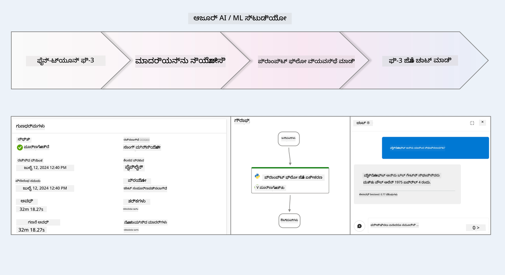

### ಒಳಗೊಂಡಿರುವ ವಿಷಯಗಳು

1. **[ಸಂದರ್ಭ 1: Azure ಸಂಪನ್ಮೂಲಗಳನ್ನು ترتیبಮಾಡಿ ಮತ್ತು ಸೂಕ್ಷ್ಮ ಹೊಂದಿಕೆಗಾಗಿ ತಯಾರಾಗಿರಿ](../../../../../../md/02.Application/01.TextAndChat/Phi3)**
    - [Azure ಮೆಷಿನ್ ಲರ್ನಿಂಗ್ ವರ್ಕ್‌ಸ್ಪೇಸ್ ರಚಿಸಿ](../../../../../../md/02.Application/01.TextAndChat/Phi3)
    - [Azure ಚಂದಾದಾರಿಕೆಯಲ್ಲಿ GPU ಕೊಟ್ಗಳನ್ನು ವಿನಂತಿಸಿ](../../../../../../md/02.Application/01.TextAndChat/Phi3)
    - [ಪಾತ್ರ ಪ್ರಮಾಣ ಪತ್ರವನ್ನು ಸೇರಿಸಿ](../../../../../../md/02.Application/01.TextAndChat/Phi3)
    - [ಪ್ರಾಜೆಕ್ಟ್ ترتیبಮಾಡಿ](../../../../../../md/02.Application/01.TextAndChat/Phi3)
    - [ಸೂಕ್ಷ್ಮ ಹೊಂದಿಕೆಗಾಗಿ ಡೇಟಾ ಸೆಟ್ ತಯಾರಿಸಿ](../../../../../../md/02.Application/01.TextAndChat/Phi3)

1. **[ಸಂದರ್ಭ 2: Phi-3 ಮಾದರಿಯನ್ನು ಸೂಕ್ಷ್ಮವಾಗಿ ಹೊಂದಿಸಿ ಮತ್ತು Azure ಮೆಷಿನ್ ಲರ್ನಿಂಗ್ ಸ್ಟುಡಿಯೋದಲ್ಲಿ ನಿಯೋಜಿಸಿ](../../../../../../md/02.Application/01.TextAndChat/Phi3)**
    - [Phi-3 ಮಾದರಿಯನ್ನು ಸೂಕ್ಷ್ಮವಾಗಿ ಹೊಂದಿಸಿ](../../../../../../md/02.Application/01.TextAndChat/Phi3)
    - [ಸೂಕ್ಷ್ಮ ಹೊಂದಿಸಿದ Phi-3 ಮಾದರಿಯನ್ನು ನಿಯೋಜಿಸಿ](../../../../../../md/02.Application/01.TextAndChat/Phi3)

1. **[ಸಂದರ್ಭ 3: Prompt flow ಜೊತೆ ಏಕೀಕರಿಸಿ ಮತ್ತು Azure AI Foundry ನಲ್ಲಿ ನಿಮ್ಮ ಕಸ್ಟಮ್ ಮಾದರಿಯೊಂದಿಗೆ ಮಾತುಕತೆ ಮಾಡಿ](../../../../../../md/02.Application/01.TextAndChat/Phi3)**
    - [ಕಸ್ಟಮ್ Phi-3 ಮಾದರಿಯನ್ನು Prompt flow ಜೊತೆ ಏಕೀಕರಿಸಿ](../../../../../../md/02.Application/01.TextAndChat/Phi3)
    - [ನಿಮ್ಮ ಕಸ್ಟಮ್ Phi-3 ಮಾದರಿಯೊಂದಿಗೆ ಮಾತುಕತೆ ಮಾಡಿ](../../../../../../md/02.Application/01.TextAndChat/Phi3)

## ಸಂದರ್ಭ 1: Azure ಸಂಪನ್ಮೂಲಗಳನ್ನು ترتیبಮಾಡಿ ಮತ್ತು ಸೂಕ್ಷ್ಮ ಹೊಂದಿಕೆಗಾಗಿ ತಯಾರಾಗಿರಿ

### Azure ಮೆಷಿನ್ ಲರ್ನಿಂಗ್ ವರ್ಕ್‌ಸ್ಪೇಸ್ ರಚಿಸಿ

1. ಪೋರ್ಟಲ್ ಪುಟದ ಮೇಲ್ಭಾಗದಲ್ಲಿ **search bar** ನಲ್ಲಿ *azure machine learning* ಎಂದು ಟೈಪ್ ಮಾಡಿ ಮತ್ತು ತೋರಿದ ಆಯ್ಕೆಗಳಿಂದ **Azure Machine Learning** ಅನ್ನು ಆರಿಸಿ.

    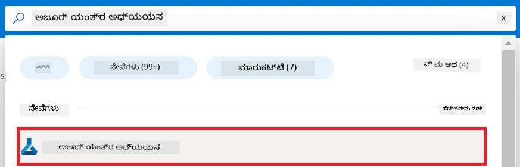

2. ನ್ಯಾವಿಗೇಶನ್ ಮೆನುನಿಂದ **+ Create** ಆಯ್ಕೆಮಾಡಿ.

3. ನ್ಯಾವಿಗೇಶನ್ ಮೆನುನಿಂದ **New workspace** ಆಯ್ಕೆಮಾಡಿ.

    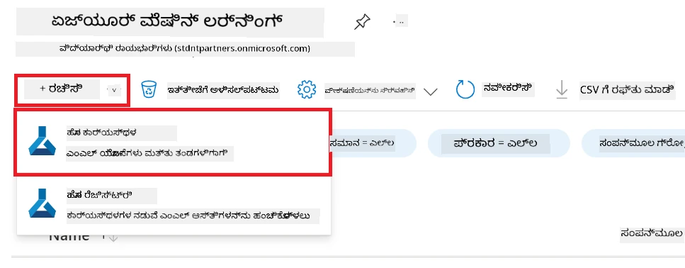

4. ಕೆಳಗಿನ ಕಾರ್ಯಗಳನ್ನು ನೆರವೇರಿಸಿ:

    - ನಿಮ್ಮ Azure **Subscription** ಆಯ್ಕೆಮಾಡಿ.
    - ಬಳಸುವ **Resource group** ಆಯ್ಕೆಮಾಡಿ (ತಯಾರಿಸಲು ಹೊಸದನ್ನು ರಚಿಸಿ).
    - **Workspace Name** ನಮೂದಿಸಿ. ಇದು ವಿಭಿನ್ನವಾಗಿರಬೇಕು.
    - ನೀವು ಬಳಸಬೇಕಾದ **Region** ಆಯ್ಕೆಮಾಡಿ.
    - ಬಳಸಬೇಕಾದ **Storage account** ಆಯ್ಕೆಮಾಡಿ (ಹೊಸದನ್ನು ರಚಿಸಿ).
    - ಬಳಸಬೇಕಾದ **Key vault** ಆಯ್ಕೆಮಾಡಿ (ಹೊಸದನ್ನು ರಚಿಸಿ).
    - ಬಳಸಬೇಕಾದ **Application insights** ಆಯ್ಕೆಮಾಡಿ (ಹೊಸದನ್ನು ರಚಿಸಿ).
    - ಬಳಸಬೇಕಾದ **Container registry** ಆಯ್ಕೆಮಾಡಿ (ಹೊಸದನ್ನು ರಚಿಸಿ).

    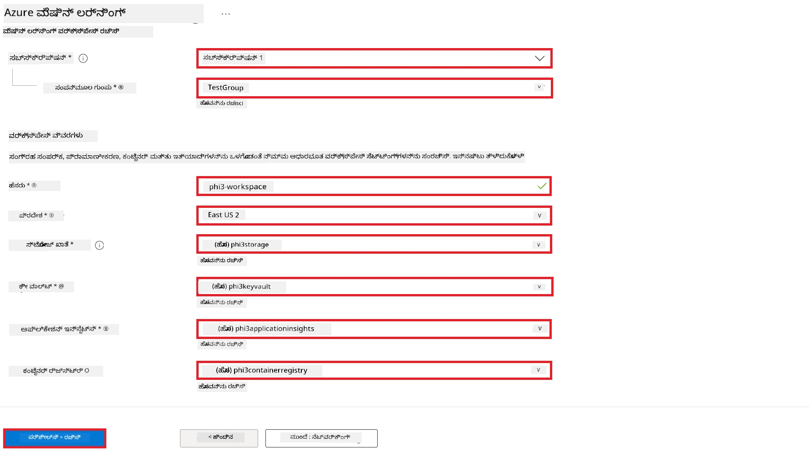

5. **Review + Create** ಆಯ್ಕೆಮಾಡಿ.

6. **Create** ಆಯ್ಕೆಮಾಡಿ.

### Azure ಚಂದಾದಾರಿಕೆಯಲ್ಲಿ GPU ಕೊಟ್ಗಳನ್ನು ವಿನಂತಿಸಿ

ಈ ಪಾಠದಲ್ಲಿ, ನೀವು Phi-3 ಮಾದರಿಯನ್ನು ಸೂಕ್ಷ್ಮವಾಗಿ ಹೊಂದಿಸುವುದು ಮತ್ತು ನಿಯೋಜಿಸುವುದು GPU ಗಳನ್ನು ಬಳಸಿಕೊಂಡಾಗ ಕಲಿಯೋಿರಿ. ಸೂಕ್ಷ್ಮ ಹೊಂದಿಕೆಗೆ, ನೀವು *Standard_NC24ads_A100_v4* GPU ಬಳಸುವಿರಿ, ಇದು ಕೊಟಾ ವಿನಂತಿಯನ್ನು ಅವಶ್ಯಕತೆ ಮಾಡುತ್ತದೆ. ನಿಯೋಜನೆಗೆ, ನೀವು *Standard_NC6s_v3* GPU ಬಳಸುವಿರಿ, ಇದು ಕೂಡ ಕೊಟಾ ವಿನಂತಿಯನ್ನು ಅಗತ್ಯವಿದೆ.

> [!NOTE]
>
> ಕೇವಲ Pay-As-You-Go ಚಂದಾದಾರಿಗಳು (ಪ್ರಮಾಣಿತ ಚಂದಾದಾರಿ ಪ್ರಕಾರ) ಗೆ GPU ಹಂಚಿಕೆ ಲಭ್ಯ, ಲಾಭ ಚಂದಾದಾರಿಗಳು ಪ್ರಸ್ತುತ ಬೆಂಬಲಿಸಲ್ಪಟ್ಟಿಲ್ಲ.
>

1. [Azure ML Studio](https://ml.azure.com/home?wt.mc_id=studentamb_279723) ಗೆ ಭೇಟಿ ನೀಡಿ.

1. *Standard NCADSA100v4 Family* ಕೊಟಾ ವಿನಂತಿಸಲು ಕೆಳಗಿನ ಕಾರ್ಯಗಳನ್ನು ನೆರವೇರಿಸಿ:

    - ಎಡಬದಿಯ ಟ್ಯಾಬ್‌ನಿಂದ **Quota** ಆಯ್ಕೆಮಾಡಿ.
    - ಬಳಸಲು ಇಚ್ಛಿಸುವ **Virtual machine family** ಆಯ್ಕೆಮಾಡಿ. ಉದಾಹರಣೆಗೆ, *Standard_NC24ads_A100_v4* GPU ಸಮೇತರಿಸಿದ **Standard NCADSA100v4 Family Cluster Dedicated vCPUs** ಆಯ್ಕೆಮಾಡಿ.
    - ನ್ಯಾವಿಗೇಶನ್ ಮೆನುನಿಂದ **Request quota** ಆಯ್ಕೆಮಾಡಿ.

        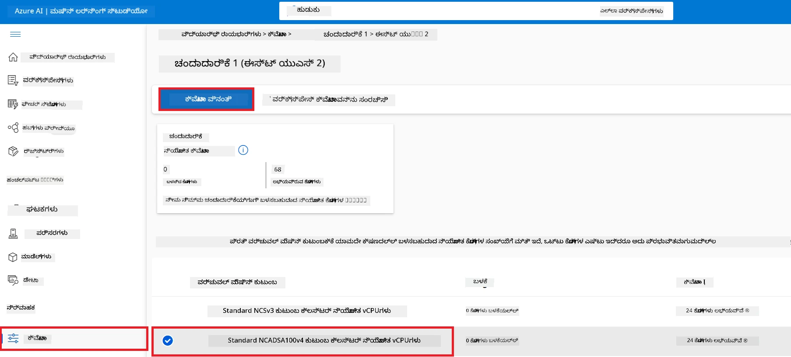

    - Request quota ಪುಟದಲ್ಲಿ, ನೀವು ಬಳಸಬೇಕೆಂದು ಬಯಸುವ **New cores limit** ನಮೂದಿಸಿ. ಉದಾಹರಣೆಗೆ, 24.
    - Request quota ಪುಟದಲ್ಲಿ, **Submit** ಆಯ್ಕೆಮಾಡಿ GPU ಕೊಟಾ ವಿನಂತಿಸಲು.

1. *Standard NCSv3 Family* ಕೊಟಾ ವಿನಂತಿಸಲು ಕೆಳಗಿನ ಕಾರ್ಯಗಳನ್ನು ನೆರವೇರಿಸಿ:

    - ಎಡಬದಿಯ ಟ್ಯಾಬ್‌ನಿಂದ **Quota** ಆಯ್ಕೆಮಾಡಿ.
    - ಬಳಸಲು ಇಚ್ಛಿಸುವ **Virtual machine family** ಆಯ್ಕೆಮಾಡಿ. ಉದಾಹರಣೆಗೆ, *Standard_NC6s_v3* GPU ಸಮೇತರಿಸಿದ **Standard NCSv3 Family Cluster Dedicated vCPUs** ಆಯ್ಕೆಮಾಡಿ.
    - ನ್ಯಾವಿಗೇಶನ್ ಮೆನುನಿಂದ **Request quota** ಆಯ್ಕೆಮಾಡಿ.
    - Request quota ಪುಟದಲ್ಲಿ, ನೀವು ಬಳಸಬೇಕೆಂದು ಬಯಸುವ **New cores limit** ನಮೂದಿಸಿ. ಉದಾಹರಣೆಗೆ, 24.
    - Request quota ಪುಟದಲ್ಲಿ, **Submit** ಆಯ್ಕೆಮಾಡಿ GPU ಕೊಟಾ ವಿನಂತಿಸಲು.

### ಪಾತ್ರ ಪ್ರಮಾಣ ಪತ್ರವನ್ನು ಸೇರಿಸಿ

ನಿಮ್ಮ ಮಾದರಿಗಳನ್ನು ಸೂಕ್ಷ್ಮವಾಗಿ ಹೊಂದಿಸಲು ಮತ್ತು ನಿಯೋಜಿಸಲು, ಮೊದಲು ನೀವು User Assigned Managed Identity (UAI) ರಚಿಸಿ ಮತ್ತು ಅದಕ್ಕೆ ಸೂಕ್ತ ಅನುಮತಿಗಳನ್ನು ನೀಡಬೇಕು. ಈ UAI ನಿಯೋಜನೆ ಸಮಯದಲ್ಲಿ ದೃಢೀಕರಣಕ್ಕಾಗಿ ಬಳಸಲಾಗುವುದು.

#### User Assigned Managed Identity (UAI) ರಚಿಸಿ

1. ಪೋರ್ಟಲ್ ಪುಟದ ಮೇಲ್ಭಾಗದಲ್ಲಿ **search bar** ನಲ್ಲಿ *managed identities* ಎಂದು ಟೈಪ್ ಮಾಡಿ ಮತ್ತು ತೋರಿದ ಆಯ್ಕೆಗಳಿಂದ **Managed Identities** ಆಯ್ಕೆಮಾಡಿ.

    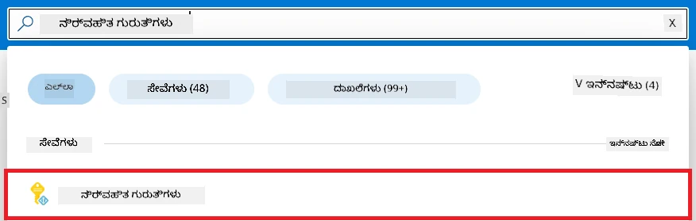

1. **+ Create** ಆಯ್ಕೆಮಾಡಿ.

    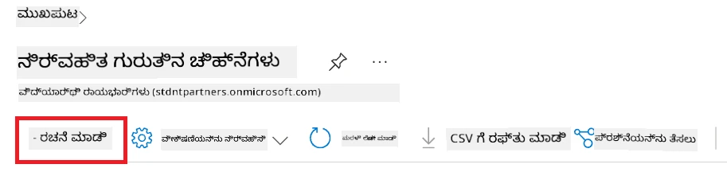

1. ಕೆಳಗಿನ ಕಾರ್ಯಗಳನ್ನು ನೆರವೇರಿಸಿ:

    - ನಿಮ್ಮ Azure **Subscription** ಆಯ್ಕೆಮಾಡಿ.
    - ಬಳಸುವ **Resource group** ಆಯ್ಕೆಮಾಡಿ (ಹೊಸದನ್ನು ರಚಿಸಿ).
    - ಬಳಸಬೇಕಾದ **Region** ಆಯ್ಕೆಮಾಡಿ.
    - **Name** ನಮೂದಿಸಿ. ಇದು ವಿಭಿನ್ನವಾಗಿರಬೇಕು.

    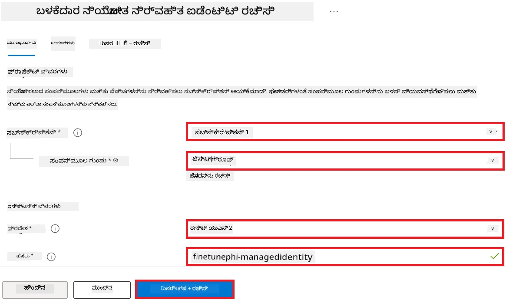

1. **Review + create** ಆಯ್ಕೆಮಾಡಿ.

1. **+ Create** ಆಯ್ಕೆಮಾಡಿ.

#### Managed Identity ಗೆ Contributor ಪಾತ್ರವನ್ನು ಸೇರಿಸಿ

1. ನೀವು ರಚಿಸಿದ Managed Identity ಸಂಪನ್ಮೂಲಕ್ಕೆ ನ್ಯಾವಿಗೇಟ್ ಮಾಡಿರಿ.

1. ಎಡಬದಿ ಟ್ಯಾಬ್‌ನಿಂದ **Azure role assignments** ಆಯ್ಕೆಮಾಡಿ.

1. ನ್ಯಾವಿಗೇಶನ್ ಮೆನುನಿಂದ **+Add role assignment** ಆಯ್ಕೆಮಾಡಿ.

1. Add role assignment ಪುಟದಲ್ಲಿ, ಕೆಳಗಿನ ಕಾರ್ಯಗಳನ್ನು ನೆರವೇರಿಸಿ:
    - **Scope** ಅನ್ನು **Resource group** ಗೆ ನಿಗದಿಪಡಿಸಿ.
    - ನಿಮ್ಮ Azure **Subscription** ಆಯ್ಕೆಮಾಡಿ.
    - ಬಳಸುವ **Resource group** ಆಯ್ಕೆಮಾಡಿ.
    - **Role** ಅನ್ನು **Contributor** ಗೆ ನಿಗದಿಪಡಿಸಿ.

    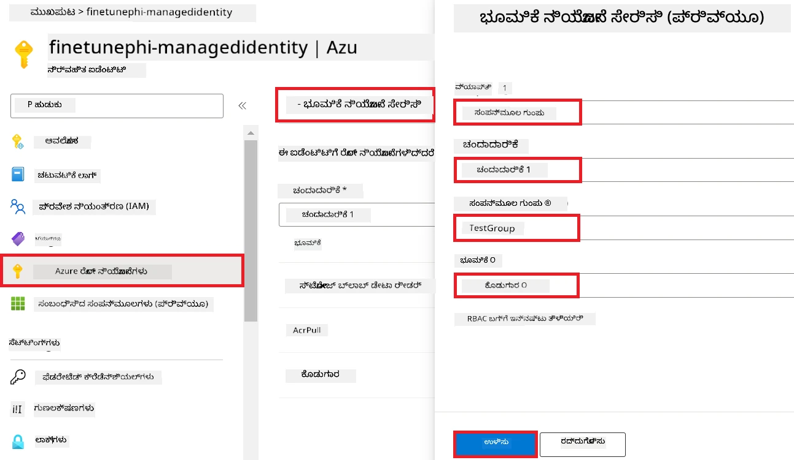

2. **Save** ಆಯ್ಕೆಮಾಡಿ.

#### Managed Identity ಗೆ Storage Blob Data Reader ಪಾತ್ರವನ್ನು ಸೇರಿಸಿ

1. ಪೋರ್ಟಲ್ ಪುಟದ ಮೇಲ್ಭಾಗದಲ್ಲಿ **search bar** ನಲ್ಲಿ *storage accounts* ಎಂದು ಟೈಪ್ ಮಾಡಿ ಮತ್ತು ತೋರಿದ ಆಯ್ಕೆಗಳಿಂದ **Storage accounts** ನೋಡಿರಿ.

    

1. ನೀವು ರಚಿಸಿದ Azure Machine Learning ವರ್ಕ್‌ಸ್ಪೇಸಿಗೆ ಸಂಬಂಧಿಸಿದ ಸಂಗ್ರಹ ಖಾತೆಯನ್ನು ಆಯ್ಕೆಮಾಡಿ. ಉದಾ., *finetunephistorage*.

1. Add role assignment ಪುಟಕ್ಕೆ ನ್ಯಾವಿಗೇಟ್ ಮಾಡಲು ಕೆಳಗಿನ ಕಾರ್ಯಗಳನ್ನು ನೆರವೇರಿಸಿ:

    - ನೀವು ರಚಿಸಿದ Azure Storage ಖಾತೆಗೆ ನ್ಯಾವಿಗೇಟ್ ಮಾಡಿರಿ.
    - ಎಡಬದಿ ಟ್ಯಾಬ್‌ನಿಂದ **Access Control (IAM)** ಆಯ್ಕೆಮಾಡಿ.
    - ನ್ಯಾವಿಗೇಶನ್ ಮೆನುನಿಂದ **+ Add** ಆಯ್ಕೆಮಾಡಿ.
    - ನ್ಯಾವಿಗೇಶನ್ ಮೆನುನಿಂದ **Add role assignment** ಆಯ್ಕೆಮಾಡಿ.

    

1. Add role assignment ಪುಟದಲ್ಲಿ, ಕೆಳಗಿನ ಕಾರ್ಯಗಳನ್ನು ನೆರವೇರಿಸಿ:

    - **Role** ಪುಟದಲ್ಲಿ **search bar** ನಲ್ಲಿ *Storage Blob Data Reader* ಎಂದು ಟೈಪ್ ಮಾಡಿ ಮತ್ತು ತೋರಿದ ಆಯ್ಕೆಗಳಿಂದ **Storage Blob Data Reader** ಆಯ್ಕೆಮಾಡಿ.
    - **Role** ಪುಟದಲ್ಲಿ **Next** ಆಯ್ಕೆಮಾಡಿ.
    - **Members** ಪುಟದಲ್ಲಿ **Assign access to** ಆಗಿ **Managed identity** ಆಯ್ಕೆಮಾಡಿ.
    - **Members** ಪುಟದಲ್ಲಿ **+ Select members** ಆಯ್ಕೆಮಾಡಿ.
    - **Select managed identities** ಪುಟದಲ್ಲಿ ನಿಮ್ಮ Azure **Subscription** ಆಯ್ಕೆಮಾಡಿ.
    - **Select managed identities** ಪುಟದಲ್ಲಿ **Managed identity** ಅನ್ನು **Manage Identity** ಗೆ ನಿಗದಿಪಡಿಸಿ.
    - ನೀವು ರಚಿಸಿದ Manage Identity ಆಯ್ಕೆಮಾಡಿ. ಉದಾ., *finetunephi-managedidentity*.
    - **Select managed identities** ಪುಟದಲ್ಲಿ **Select** ಆಯ್ಕೆಮಾಡಿ.

    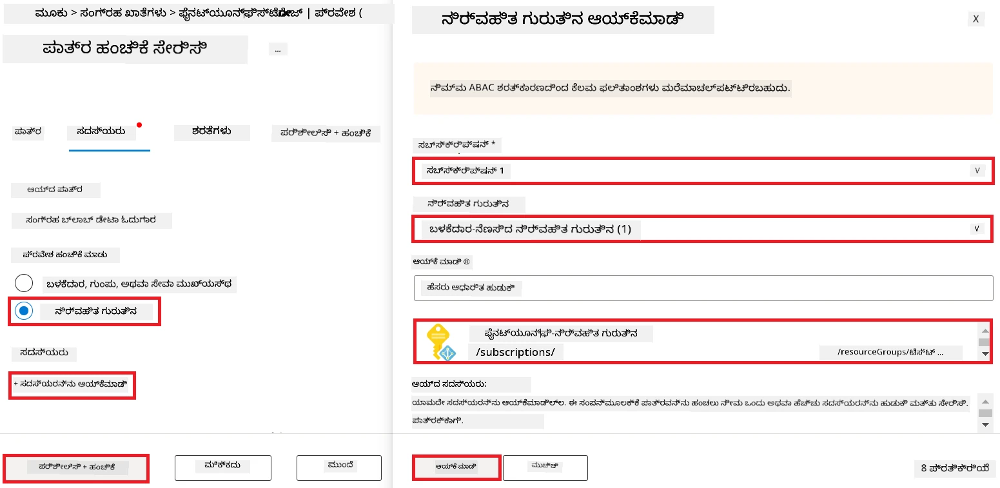

1. **Review + assign** ಆಯ್ಕೆಮಾಡಿ.

#### Managed Identity ಗೆ AcrPull ಪಾತ್ರವನ್ನು ಸೇರಿಸಿ

1. ಪೋರ್ಟಲ್ ಪುಟದ ಮೇಲ್ಭಾಗದಲ್ಲಿ **search bar** ನಲ್ಲಿ *container registries* ಎಂದು ಟೈಪ್ ಮಾಡಿ ಮತ್ತು ತೋರಿದ ಆಯ್ಕೆಗಳಿಂದ **Container registries** ಆಯ್ಕೆಮಾಡಿ.

    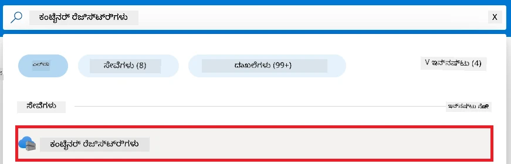

1. Azure Machine Learning ವರ್ಕ್‌ಸ್ಪೇಸ್‌ಗೆ ಸಂಬಂಧಿಸಿದ ಪಡಗು რეგಿಸ್ಟ್ರಿಯನ್ನು ಆಯ್ಕೆಮಾಡಿ. ಉದಾ., *finetunephicontainerregistry*

1. Add role assignment ಪುಟಕ್ಕೆ ನ್ಯಾವಿಗೇಟ್ ಮಾಡಲು ಕೆಳಗಿನ ಕಾರ್ಯಗಳನ್ನು ನೆರವೇರಿಸಿ:

    - ಎಡಬದಿ ಟ್ಯಾಬ್‌ನಿಂದ **Access Control (IAM)** ಆಯ್ಕೆಮಾಡಿ.
    - ನ್ಯಾವಿಗೇಶನ್ ಮೆನುನಿಂದ **+ Add** ಆಯ್ಕೆಮಾಡಿ.
    - ನ್ಯಾವಿಗೇಶನ್ ಮೆನುನಿಂದ **Add role assignment** ಆಯ್ಕೆಮಾಡಿ.

1. Add role assignment ಪುಟದಲ್ಲಿ, ಕೆಳಗಿನ ಕಾರ್ಯಗಳನ್ನು ನೆರವೇರಿಸಿ:

    - **Role** ಪುಟದಲ್ಲಿ **search bar** ನಲ್ಲಿ *AcrPull* ಎಂದು ಟೈಪ್ ಮಾಡಿ ಮತ್ತು ತೋರಿದ ಆಯ್ಕೆಗಳಿಂದ **AcrPull** ಆಯ್ಕೆಮಾಡಿ.
    - **Role** ಪುಟದಲ್ಲಿ **Next** ಆಯ್ಕೆಮಾಡಿ.
    - **Members** ಪುಟದಲ್ಲಿ **Assign access to** ಆಗಿ **Managed identity** ಆಯ್ಕೆಮಾಡಿ.
    - **Members** ಪುಟದಲ್ಲಿ **+ Select members** ಆಯ್ಕೆಮಾಡಿ.
    - **Select managed identities** ಪುಟದಲ್ಲಿ ನಿಮ್ಮ Azure **Subscription** ಆಯ್ಕೆಮಾಡಿ.
    - **Select managed identities** ಪುಟದಲ್ಲಿ **Managed identity** ಅನ್ನು **Manage Identity** ಗೆ ನಿಗದಿಪಡಿಸಿ.
    - ನೀವು ರಚಿಸಿದ Manage Identity ಆಯ್ಕೆಮಾಡಿ. ಉದಾ., *finetunephi-managedidentity*.
    - **Select managed identities** ಪುಟದಲ್ಲಿ **Select** ಆಯ್ಕೆಮಾಡಿ.
    - **Review + assign** ಆಯ್ಕೆಮಾಡಿ.

### ಪ್ರಾಜೆಕ್ಟ್ ترتیبಮಾಡಿ

ಸೂಕ್ಷ್ಮ ಹೊಂದಿಕೆಗಾಗಿ ಅಗತ್ಯವಿರುವ ಡೇಟಾಸೆಟ್‌ಗಳನ್ನು ಡೌನ್ಲೋಡ್ ಮಾಡಲು ನೀವು ಸ್ಥಳೀಯ ಪರಿಸರವನ್ನು ترتیبಮಾಡುವಿರಿ.

ಈ ವ್ಯಾಯಾಮದಲ್ಲಿ ನೀವು

- ಕೆಲಸ ಮಾಡಲು ಒಂದು ಫೋಲ್ಡರ್ ರಚಿಸುವಿರಿ.
- ಒಂದು ವರ್ಚುವಲ್ ಪರಿಸರ ರಚಿಸುವಿರಿ.
- ಅಗತ್ಯ ಪ್ಯಾಕೇಜುಗಳನ್ನು ಸ್ಥಾಪಿಸುವಿರಿ.
- ಡೇಟಾಸೆಟ್ ಡೌನ್ಲೋಡ್ ಮಾಡಲು *download_dataset.py* ಫೈಲ್ ರಚಿಸುವಿರಿ.

#### ಕೆಲಸ ಮಾಡಲು ಫೋಲ್ಡರ್ ರಚಿಸಿ

1. ಟರ್ಮಿನಲ್ ವಿಂಡೋ ತೆರೆಯಿರಿ ಮತ್ತು ಡೀಫಾಲ್ಟ್ ಪಥದಲ್ಲಿ *finetune-phi* ಎಂಬ ಫೋಲ್ಡರ್ ರಚಿಸಲು ಕೆಳಗಿನ ಕಮಾಂಡ್ ಟೈಪ್ ಮಾಡಿ.

    ```console
    mkdir finetune-phi
    ```

2. ನೀವು ರಚಿಸಿದ *finetune-phi* ಫೋಲ್ಡರ್‌ಗೆ ನ್ಯಾವಿಗೇಟ್ ಮಾಡಲು ನಿಮ್ಮ ಟರ್ಮಿನಲ್‌ನಲ್ಲಿ ಕೆಳಗಿನ ಕಮಾಂಡ್ ಅನ್ನು ಟೈಪ್ ಮಾಡಿ.

    ```console
    cd finetune-phi
    ```

#### ಒಂದು ವರ್ಚುವಲ್ ಪರಿಸರವನ್ನು ರಚಿಸಿ

1. *.venv* ಎಂದು ಹೆಸರಿಸಿರುವ ವರ್ಚುವಲ್ ಪರಿಸರವನ್ನು ರಚಿಸಲು ನಿಮ್ಮ ಟರ್ಮಿನಲ್‌ನಲ್ಲಿ ಕೆಳಗಿನ ಕಮಾಂಡ್ ಅನ್ನು ಟೈಪ್ ಮಾಡಿ.

    ```console
    python -m venv .venv
    ```

2. ವರ್ಚುವಲ್ ಪರಿಸರವನ್ನು ಉದ್ಘಾಟಿಸಲು ನಿಮ್ಮ ಟರ್ಮಿನಲ್‌ನಲ್ಲಿ ಕೆಳಗಿನ ಕಮಾಂಡ್ ಅನ್ನು ಟೈಪ್ ಮಾಡಿ.

    ```console
    .venv\Scripts\activate.bat
    ```

> [!NOTE]
> ಇದು ಕಾರ್ಯನಿರ್ವಹಿಸಿದರೆ, ಕಮಾಂಡ್ ಪ್ರಾಂಪ್ಟ್ನ ಮುಂಚೆ *(.venv)* ಕಾಣಿಸಬೇಕು.

#### ಅಗತ್ಯ ಪ್ಯಾಕೇಜುಗಳನ್ನು ಇನ್‌ಸ್ಟಾಲ್ ಮಾಡಿ

1. ಅಗತ್ಯ ಪ್ಯಾಕೇಜುಗಳನ್ನು ಇನ್‌ಸ್ಟಾಲ್ ಮಾಡಲು ನಿಮ್ಮ ಟರ್ಮಿನಲ್‌ನಲ್ಲಿ ಕೆಳಗಿನ ಕಮಾಂಡ್‌ಗಳನ್ನು ಟೈಪ್ ಮಾಡಿ.

    ```console
    pip install datasets==2.19.1
    ```

#### `download_dataset.py` ರಚಿಸಿ

> [!NOTE]
> ಪೂರ್ಣ ಫೋಲ್ಡರ್ ರಚನೆ:
>
> ```text
> └── YourUserName
> .    └── finetune-phi
> .        └── download_dataset.py
> ```

1. **Visual Studio Code** ಅನ್ನು ತೆರೆಯಿರಿ.

1. ಮೆನು ಬಾರ್‌ನಿಂದ **File** ಆಯ್ಕೆಮಾಡಿ.

1. **Open Folder** ಅನ್ನು ಆಯ್ಕೆಮಾಡಿ.

1. ನೀವು ರಚಿಸಿದ *finetune-phi* ಫೋಲ್ಡರ್ ಅನ್ನು ಆಯ್ಕೆಮಾಡಿ, ಅದು *C:\Users\yourUserName\finetune-phi* ಸ್ಥಳದಲ್ಲಿದೆ.

    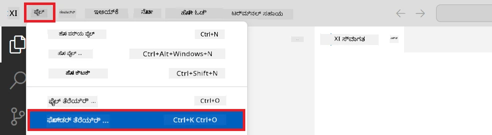

1. Visual Studio Code‌ನ ಎಡ ಬದಿಯ ಪ್ಯಾನುಲ್‌ನಲ್ಲಿ, ರೈಟ್-ಕ್ಲಿಕ್ ಮಾಡಿ ಮತ್ತು **New File** ಆಯ್ಕೆಮಾಡಿ ಮತ್ತು *download_dataset.py* ಎಂದು ಹೆಸರಿಸಿದ ಹೊಸ ಫೈಲ್ ರಚಿಸಿ.

    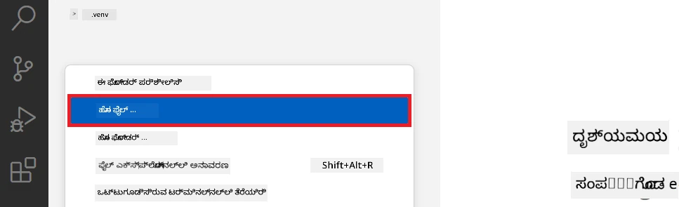

### ಫೈನ್-ಟ್ಯೂನಿಂಗ್‌ಗೆ ಡೇಟಾಸೆಟ್ ಸಿದ್ಧಪಡಿಸಿ

ಈ ವ್ಯಾಯಾಮದಲ್ಲಿ, ನೀವು *download_dataset.py* ಫೈಲ್ನ್ನು ಚಾಲನೆ ಮಾಡಿ *ultrachat_200k* ಡೇಟಾಸೆಟ್‌ಗಳನ್ನು ನಿಮ್ಮ ಸ್ಥಳೀಯ ಪರಿಸರಕ್ಕೆ ಡೌನ್‌ಲೋಡ್ ಮಾಡುತ್ತೀರಿ. ನಂತರ, ನೀವು ಈ ಡೇಟಾಸೆಟ್‌ಗಳನ್ನು ಬಳಸಿಕೊಂಡು Azure Machine Learning ನಲ್ಲಿ Phi-3 ಮಾದರಿಯನ್ನು ಫೈನ್-ಟ್ಯೂನ್ ಮಾಡುತ್ತೀರಿ.

ಈ ವ್ಯಾಯಾಮದಲ್ಲಿ ನೀವು:

- ಡೇಟಾಸೆಟ್‌ಗಳನ್ನು ಡೌನ್‌ಲೋಡ್ ಮಾಡಲು *download_dataset.py* ಫೈಲಿಗೆ ಕೋಡ್ ಅನ್ನು ಸೇರಿಸುತ್ತೀರಿ.
- ಡೇಟಾಸೆಟ್‌ಗಳನ್ನು ನಿಮ್ಮ ಸ್ಥಳೀಯ ಪರಿಸರಕ್ಕೆ ಡೌನ್‌ಲೋಡ್ ಮಾಡಲು *download_dataset.py* ಫೈಲನ್ನು ಚಾಲನೆ ಮಾಡುತ್ತೀರಿ.

#### *download_dataset.py* ಬಳಸಿ ನಿಮ್ಮ ಡೇಟಾಸೆಟ್ ಅನ್ನು ಡೌನ್‌ಲೋಡ್ ಮಾಡಿ

1. Visual Studio Code ನಲ್ಲಿ *download_dataset.py* ಫೈಲನ್ನು ತೆರೆಯಿರಿ.

1. ಕೆಳಗಿನ ಕೋಡ್ ಅನ್ನು *download_dataset.py* ಫೈಲಿನಲ್ಲಿ ಸೇರಿಸಿ.

    ```python
    import json
    import os
    from datasets import load_dataset

    def load_and_split_dataset(dataset_name, config_name, split_ratio):
        """
        Load and split a dataset.
        """
        # ನಿರ್ದಿಷ್ಟ ಹೆಸರು, ವಿನ್ಯಾಸ ಮತ್ತು ಬಿದಿ ಅನುಪಾತದೊಂದಿಗೆ ಡೇಟಾಸೆಟ್ ಅನ್ನು ಲೋಡ್ ಮಾಡು
        dataset = load_dataset(dataset_name, config_name, split=split_ratio)
        print(f"Original dataset size: {len(dataset)}")
        
        # ಡೇಟಾಸೆಟ್ ಅನ್ನು ತರಬೇತಿ ಮತ್ತು ಪರೀಕ್ಷಾ ಸೆಟ್ ಗಳಾಗಿ വിഭಜಿಸು (80% ತರಬೇತಿ, 20% ಪರೀಕ್ಷೆ)
        split_dataset = dataset.train_test_split(test_size=0.2)
        print(f"Train dataset size: {len(split_dataset['train'])}")
        print(f"Test dataset size: {len(split_dataset['test'])}")
        
        return split_dataset

    def save_dataset_to_jsonl(dataset, filepath):
        """
        Save a dataset to a JSONL file.
        """
        # ಅದರಲ್ಲಿಲ್ಲದಿದ್ದರೆ ಡೈರೆಕ್ಟರಿ ರಚಿಸು
        os.makedirs(os.path.dirname(filepath), exist_ok=True)
        
        # ಫೈಲನ್ನು ಬರೆಯುವ ಮೋಡ್‌ನಲ್ಲಿ ತೆರೆಯು
        with open(filepath, 'w', encoding='utf-8') as f:
            # ಡೇಟಾಸೆಟ್‌ನ ಪ್ರತಿಯೊಂದು ದಾಖಲೆ ಮೇಲೆ ಪುನರಾವರ್ತಿಸು
            for record in dataset:
                # ದಾಖಲೆ ಅನ್ನು JSON ವಸ್ತುವಾಗಿ ಡಂಪ್ ಮಾಡಿ ಫೈಲಿಗೆ ಬರೆಯು
                json.dump(record, f)
                # ದಾಖಲೆಗಳನ್ನು ವಿಭಜಿಸಲು ನ್ಯೂಲೈನ್ ಅಕ್ಷರವನ್ನು ಬರೆಯು
                f.write('\n')
        
        print(f"Dataset saved to {filepath}")

    def main():
        """
        Main function to load, split, and save the dataset.
        """
        # ವಿನಿರ್ದಿಷ್ಟ ವಿನ್ಯಾಸ ಮತ್ತು ಬಿದಿ ಅನುಪಾತದೊಂದಿಗೆ ULTRACHAT_200k ಡೇಟಾಸೆಟ್ ಅನ್ನು ಲೋಡ್ ಮಾಡಿ ವಿಭಜಿಸು
        dataset = load_and_split_dataset("HuggingFaceH4/ultrachat_200k", 'default', 'train_sft[:1%]')
        
        # ವಿಭಜನೆದಿಂದ ತರಬೇತಿ ಮತ್ತು ಪರೀಕ್ಷಾ ಡೇಟಾಸೆಟ್ ಗಳನ್ನು ಹೊರತೆಗೆದುಕೊಳ್ಳು
        train_dataset = dataset['train']
        test_dataset = dataset['test']

        # ತರಬೇತಿ ಡೇಟಾಸೆಟ್ ಅನ್ನು JSONL ಫೈಲಾಗಿ ಉಳಿಸು
        save_dataset_to_jsonl(train_dataset, "data/train_data.jsonl")
        
        # ಪರೀಕ್ಷಾ ಡೇಟಾಸೆಟ್ ಅನ್ನು ಬೇರೆ JSONL ಫೈಲಾಗಿ ಉಳಿಸು
        save_dataset_to_jsonl(test_dataset, "data/test_data.jsonl")

    if __name__ == "__main__":
        main()

    ```

1. ಸ್ಪ್ರಿಪ್ಟ್ ಅನ್ನು ಚಾಲನೆ ಮಾಡಿ ಮತ್ತು ಡೇಟಾಸೆಟ್ ಅನ್ನು ನಿಮ್ಮ ಸ್ಥಳೀಯ ಪರಿಸರಕ್ಕೆ ಡೌನ್‌ಲೋಡ್ ಮಾಡಲು ನಿಮ್ಮ ಟರ್ಮಿನಲ್‌ನಲ್ಲಿ ಕೆಳಗಿನ ಕಮಾಂಡ್ ಅನ್ನು ಟೈಪ್ ಮಾಡಿ.

    ```console
    python download_dataset.py
    ```

1. ಡೇಟಾಸೆಟ್‌ಗಳು ಯಶಸ್ವಿಯಾಗಿ ನಿಮ್ಮ ಸ್ಥಳೀಯ *finetune-phi/data* ಡೈರೆಕ್ಟರಿಗೂ ಉಳಿಸಲಾಗಿದೆ ಎಂಬುದನ್ನು ಪರಿಶೀಲಿಸಿ.

> [!NOTE]
>
> #### ಡೇಟಾಸೆಟ್ ಗಾತ್ರ ಮತ್ತು ಫೈನ್-ಟ್ಯೂನಿಂಗ್ ಸಮಯದ ಬಗ್ಗೆ ಟಿಪ್ಪಣಿ
>
> ಈ ಟ್ಯುಟೋರಿಯಲ್‌ನಲ್ಲಿ ನೀವು ಡೇಟಾಸೆಟ್‌ನ ಕೇವಲ 1% ಅನ್ನು ಬಳಸುತ್ತೀರಿ (`split='train[:1%]'`). ಇದರಿಂದ ಡೇಟಾ ಪ್ರಮಾಣ ಬಹಳಷ್ಟು ಕಡಿಮೆಯಾಗುತ್ತದೆ, ಅಪ್‌ಲೋಡ್ ಮತ್ತು ಫೈನ್-ಟ್ಯೂನಿಂಗ್ ಪ್ರಕ್ರಿಯೆಗಳು ವೇಗವಾಗುತ್ತವೆ. ನೀವು ತರಬೇತಿ ಸಮಯ ಮತ್ತು ಮಾದರಿ ಕಾರ್ಯಕ್ಷಮತೆಯ ನಡುವಣ ಸರಿಯಾದ ಸಮತೋಲನವನ್ನು ಕಂಡುಹಿಡಿಯಲು ಶೇಕಡವಾರು ಬದಲಾಯಿಸಬಹುದು. ಡೇಟಾಸೆಟ್‌ನ ಚಿಕ್ಕ ಉಪಸಮूहವನ್ನು ಬಳಸುವುದರಿಂದ ಫೈನ್-ಟ್ಯೂನಿಂಗ್‌ಗೆ ಬೇಕಾದ ಸಮಯ ಕಡಿಮೆಯಾಗುತ್ತದೆ, ಇದು ಟ್ಯುಟೋರಿಯಲ್‌ಗೆ ಹೆಚ್ಚು ನಿರ್ವಹಿಸಲು ಸುಲಭವಾಗಿಸುತ್ತದೆ.

## ಕಂಡುಬರುವನೆ 2: Phi-3 ಮಾದರಿಯನ್ನು ಫೈನ್-ಟ್ಯೂನ್ ಮಾಡಿ ಮತ್ತು Azure Machine Learning ಸ್ಟುಡಿಯೋದಲ್ಲಿ ಡಿಪ್ಲಾಯ್ ಮಾಡಿ

### Phi-3 ಮಾದರಿಯನ್ನು ಫೈನ್-ಟ್ಯೂನ್ ಮಾಡಿ

ಈ ವ್ಯಾಯಾಮದಲ್ಲಿ, ನೀವು Azure Machine Learning ಸ್ಟುಡಿಯೋದಲ್ಲಿ Phi-3 ಮಾದರಿಯನ್ನು ಫೈನ್-ಟ್ಯೂನ್ ಮಾಡುತ್ತೀರಿ.

ಈ ವ್ಯಾಯಾಮದಲ್ಲಿ ನೀವು:

- ಫೈನ್-ಟ್ಯೂನಿಂಗ್‌ಗೆ ಕಂಪ್ಯೂಟರ್ ಕ್ಲಸ್ಟರ್ ರಚಿಸಿ.
- Azure Machine Learning ಸ್ಟುಡಿಯೋದಲ್ಲಿ Phi-3 ಮಾದರಿಯನ್ನು ಫೈನ್-ಟ್ಯೂನ್ ಮಾಡಿ.

#### ಫೈನ್-ಟ್ಯೂನಿಂಗ್‌ಗೆ ಕಂಪ್ಯೂಟರ್ ಕ್ಲಸ್ಟರ್ ರಚಿಸಿ

1. [Azure ML Studio](https://ml.azure.com/home?wt.mc_id=studentamb_279723) ಗೆ ಭೇಟಿ ನೀಡಿ.

1. ಎಡ ಬದಿಯ ಟ್ಯಾಬ್‌ನಿಂದ **Compute** ಆಯ್ಕೆಮಾಡಿ.

1. ನ್ಯಾವಿಗೇಶನ್ ಮೆನುನಿಂದ **Compute clusters** ಆಯ್ಕೆಮಾಡಿ.

1. **+ New** ಆಯ್ಕೆಮಾಡಿ.

    

1. ಕೆಳಗಿನ ಕಾರ್ಯಗಳನ್ನು ಮಾಡಿ:

    - ನೀವು ಬಳಸಲು ಇಚ್ಛಿಸುವ **Region** ಆಯ್ಕೆಮಾಡಿ.
    - **Virtual machine tier** ಅನ್ನು **Dedicated** ಆಗಿ ಆಯ್ಕೆಮಾಡಿ.
    - **Virtual machine type** ಅನ್ನು **GPU** ಆಗಿ ಆಯ್ಕೆಮಾಡಿ.
    - **Virtual machine size** ಫಿಲ್ಟರ್ ಅನ್ನು **Select from all options** ಆಗಿ ಆಯ್ಕೆಮಾಡಿ.
    - **Virtual machine size** ಯಾಗಿ **Standard_NC24ads_A100_v4** ಆಯ್ಕೆಮಾಡಿ.

    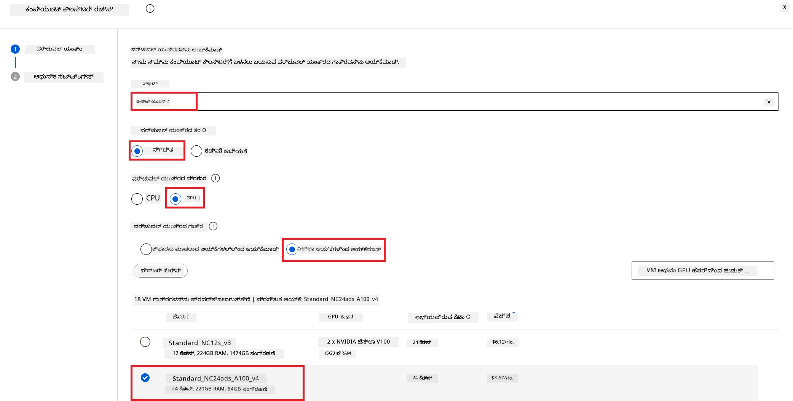

1. **Next** ಆಯ್ಕೆಮಾಡಿ.

1. ಕೆಳಗಿನ ಕಾರ್ಯಗಳನ್ನು ಮಾಡಿ:

    - **Compute name** ಅನ್ನು ನಮೂದಿಸಿ. ಇದು ಅನನ್ಯವಾಗಿರಬೇಕು.
    - **Minimum number of nodes** ಅನ್ನು **0** ಆಗಿ ಆಯ್ಕೆಮಾಡಿ.
    - **Maximum number of nodes** ಅನ್ನು **1** ಆಗಿ ಆಯ್ಕೆಮಾಡಿ.
    - **Idle seconds before scale down** ಅನ್ನು **120** ಆಗಿ ಆಯ್ಕೆಮಾಡಿ.

    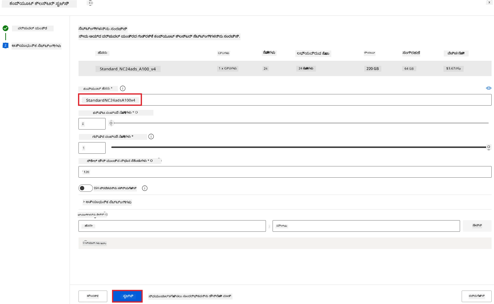

1. **Create** ಆಯ್ಕೆಮಾಡಿ.

#### Phi-3 ಮಾದರಿಯನ್ನು ಫೈನ್-ಟ್ಯೂನ್ ಮಾಡಿ

1. [Azure ML Studio](https://ml.azure.com/home?wt.mc_id=studentamb_279723) ಗೆ ಭೇಟಿ ನೀಡಿ.

1. ನೀವು ರಚಿಸಿದ Azure Machine Learning ವರ್ಕ್‌ಸ್ಪೇಸ್ ಅನ್ನು ಆಯ್ಕೆಮಾಡಿ.

    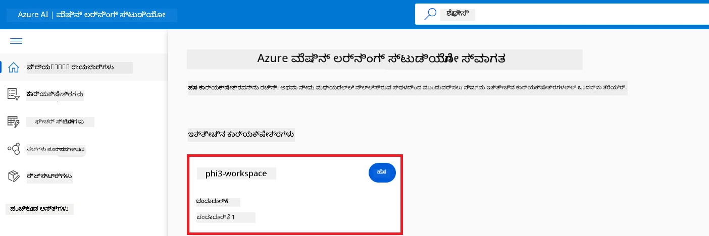

1. ಕೆಳಗಿನ ಕಾರ್ಯಗಳನ್ನು ಮಾಡಿ:

    - ಎಡ ಬದಿಯ ಟ್ಯಾಬ್‌ನಿಂದ **Model catalog** ಆಯ್ಕೆಮಾಡಿ.
    - **ಸರ್ಚ್ ಬಾರ್** ನಲ್ಲಿ *phi-3-mini-4k* ಟೈಪ್ ಮಾಡಿ ಮತ್ತು ಕಾಣುವ ಆಯ್ಕೆಗಳಲ್ಲಿ **Phi-3-mini-4k-instruct** ಆಯ್ಕೆಮಾಡಿ.

    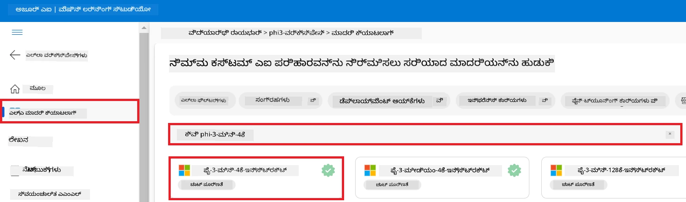

1. ನ್ಯಾವಿಗೇಶನ್ ಮೆನುನಿಂದ **Fine-tune** ಆಯ್ಕೆಮಾಡಿ.

    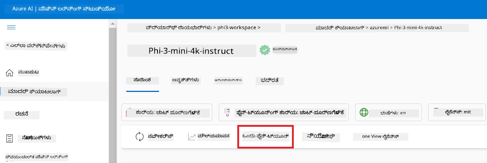

1. ಕೆಳಗಿನ ಕಾರ್ಯಗಳನ್ನು ಮಾಡಿ:

    - **Select task type** ಅನ್ನು **Chat completion** ಆಗಿ ಆಯ್ಕೆಮಾಡಿ.
    - **+ Select data** ಆಯ್ಕೆ ಮಾಡಿ **Traning data** ಅಪ್ಲೋಡ್ ಮಾಡಿ.
    - Validation data ಅಪ್ಲೋಡ್ ಪ್ರಕಾರವನ್ನು **Provide different validation data** ಆಗಿ ಆಯ್ಕೆಮಾಡಿ.
    - **+ Select data** ಆಯ್ಕೆ ಮಾಡಿ **Validation data** ಅಪ್ಲೋಡ್ ಮಾಡಿ.

    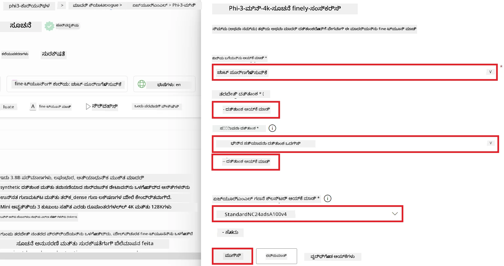

> [!TIP]
>
> ನೀವೇನು ನಿಮ್ಮ ವಿಶೇಷ ಅಗತ್ಯಗಳಿಗೆ ಅನುಗುಣವಾಗಿ ಫೈನ್-ಟ್ಯೂನಿಂಗ್ ಪ್ರಕ್ರಿಯೆಯನ್ನು ಉತ್ತಮಗೊಳಿಸಲು **learning_rate** ಮತ್ತು **lr_scheduler_type** ಸೇರಿದಂತೆ ಕಸ್ಟಮ್ ಸೆಟ್ಟಿಂಗ್‌ಗಳನ್ನು ಸರಿಹೊಂದಿಸಲು **Advanced settings** ಆಯ್ಕೆ ಮಾಡಬಹುದು.

1. **Finish** ಆಯ್ಕೆಮಾಡಿ.

1. ಈ ವ್ಯಾಯಾಮದಲ್ಲಿ, ನೀವು ಯಶಸ್ವಿಯಾಗಿ Azure Machine Learning ಬಳಸಿ Phi-3 ಮಾದರಿಯನ್ನು ಫೈನ್-ಟ್ಯೂನ್ ಮಾಡಿದ್ದೀರಿ. ದಯವಿಟ್ಟು ಗಮನಿಸಿ, ಫೈನ್-ಟ್ಯೂನಿಂಗ್ ಪ್ರಕ್ರಿಯೆಗೆ ಹೆಚ್ಚಿನ ಸಮಯ लागಬಹುದು. ಫೈನ್-ಟ್ಯೂನಿಂಗ್ ಜಾಬ್ ರನ್ ಮಾಡಿದ ನಂತರ, ಅದನ್ನು ಪೂರ್ಣಗೊಳ್ಳಲು ನಿರೀಕ್ಷಿಸಬೇಕಾಗುತ್ತದೆ. ಫೈನ್-ಟ್ಯೂನಿಂಗ್ ಜಾಬ್ ಸ್ಥಿತಿಯನ್ನು ನಿರೀಕ್ಷಿಸಲು, ನಿಮ್ಮ Azure Machine Learning ವರ್ಕ್‌ಸ್ಪೇಸ್‌ನ ಎಡಭಾಗದಲ್ಲಿರುವ Jobs ಟ್ಯಾಬ್‌ಗೆ ಹೋಗಿ ನೋಡಬಹುದು. ಮುಂದಿನ ಸರಣಿಯಲ್ಲಿ, ನೀವು ಫೈನ್-ಟ್ಯೂನ್ಡ್ ಮಾದರಿಯನ್ನು ಡಿಪ್ಲಾಯ್ ಮಾಡಿ Prompt flow ಜೊತೆಗೆ ಸಂಯೋಜಿಸುವಿರಿ.

    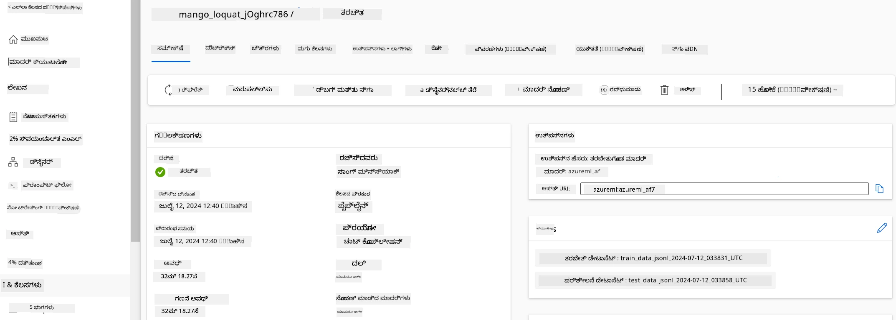

### ಫೈನ್-ಟ್ಯೂನ್ಡ್ Phi-3 ಮಾದರಿಯನ್ನು ಡಿಪ್ಲಾಯ್ ಮಾಡಿ

ಫೈನ್-ಟ್ಯೂನ್ಡ್ Phi-3 ಮಾದರಿಯನ್ನು Prompt flow ಜೊತೆ ಸಂಯೋಜಿಸಲು, ನೀವು ಮಾದರಿಯನ್ನು ಆನ್‌ಲೈನ್‌ನಲ್ಲಿ ಪ್ರವೇಶಿಸಲು ಲಭ್ಯವಾಗುವಂತೆ ಮಾಡಬೇಕಾಗುತ್ತದೆ. ಈ ಪ್ರಕ್ರಿಯೆಯಲ್ಲಿ ಮಾದರಿಯನ್ನು ನೋಂದಾಯಿಸುವುದು, ಆನ್‌ಲೈನ್ ಎಂಡ್ಪಾಯಿಂಟ್ ರಚಿಸುವುದು ಮತ್ತು ಮಾದರಿಯನ್ನು ಡಿಪ್ಲಾಯ್ ಮಾಡುವುದೂ ಸೇರಿವೆ.

ಈ ವ್ಯಾಯಾಮದಲ್ಲಿ ನೀವು:

- Azure Machine Learning ವರ್ಕ್‌ಸ್ಪೇಸ್‌ನಲ್ಲಿ ಫೈನ್-ಟ್ಯೂನ್ಡ್ ಮಾದರಿಯನ್ನು ನೋಂದಾಯಿಸುವುದು.
- ಆನ್‌ಲೈನ್ ಎಂಡ್ಪಾಯಿಂಟ್ ರಚಿಸುವುದು.
- ನೋಂದಾಯಿಸಿದ ಫೈನ್-ಟ್ಯೂನ್ಡ್ Phi-3 ಮಾದರಿಯನ್ನು ಡಿಪ್ಲಾಯ್ ಮಾಡುವುದು.

#### ಫೈನ್-ಟ್ಯೂನ್ಡ್ ಮಾದರಿಯನ್ನು ನೋಂದಾಯಿಸಿ

1. [Azure ML Studio](https://ml.azure.com/home?wt.mc_id=studentamb_279723) ಗೆ ಭೇಟಿ ನೀಡಿ.

1. ನೀವು ರಚಿಸಿದ Azure Machine Learning ವರ್ಕ್‌ಸ್ಪೇಸ್ ಆಯ್ಕೆಮಾಡಿ.

    

1. ಎಡ ಬದಿಯ ಟ್ಯಾಬ್‌ನಿಂದ **Models** ಆಯ್ಕೆಮಾಡಿ.
1. **+ Register** ಆಯ್ಕೆಮಾಡಿ.
1. **From a job output** ಆಯ್ಕೆಮಾಡಿ.

    

1. ನೀವು ರಚಿಸಿದ ಜಾಬ್ ಆಯ್ಕೆಮಾಡಿ.

    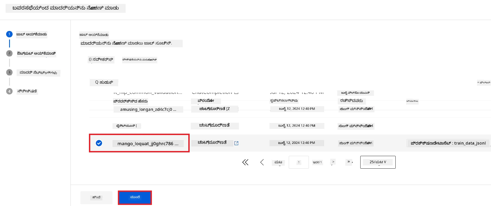

1. **Next** ಆಯ್ಕೆಮಾಡಿ.

1. **Model type** ಅನ್ನು **MLflow** ಆಗಿ ಆಯ್ಕೆಮಾಡಿ.

1. **Job output** ಆಯ್ಕೆಮಾಡಲಾಗಿದೆ ಎಂಬುದನ್ನು ಖಚಿತಪಡಿಸಿಕೊಳ್ಳಿ; ಇದು ಸ್ವಯಂಚಾಲಿತವಾಗಿ ಆಯ್ಕೆಮಾಡಲ್ಪಟ್ಟಿರುವುದು.

    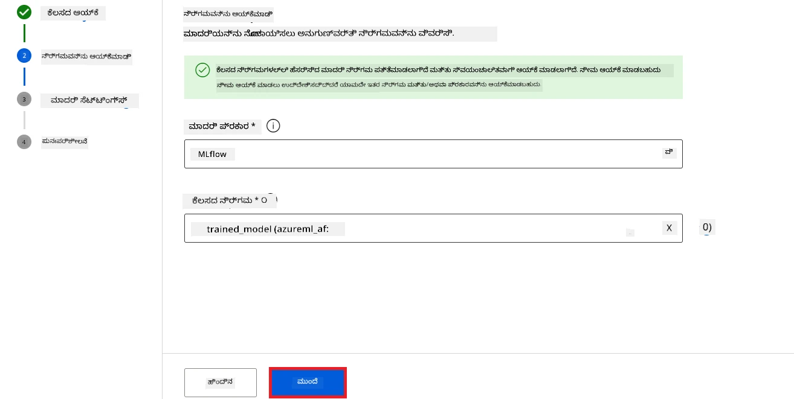

2. **Next** ಆಯ್ಕೆಮಾಡಿ.

3. **Register** ಆಯ್ಕೆಮಾಡಿ.

    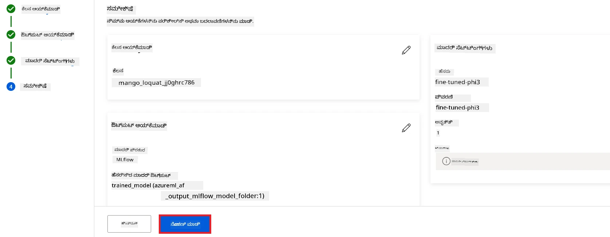

4. ನೀವು ನೋಂದಾಯಿಸಿದ ಮಾದರಿಯನ್ನು ಎಡಬದಿಯ ಟ್ಯಾಬ್‌ನಿಂದ **Models** ಮೆನು ಆಯ್ಕೆಮಾಡಿ ನೋಡಬಹುದು.

    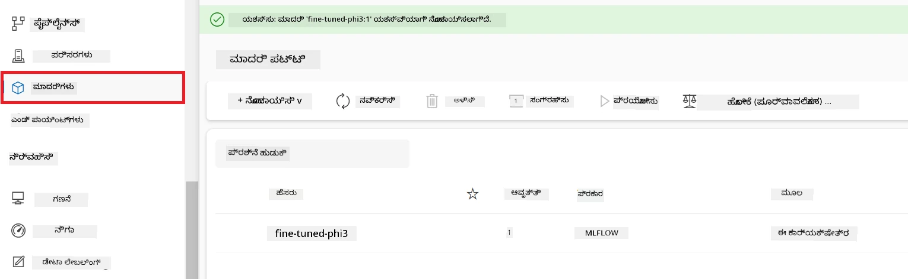

#### ಫೈನ್-ಟ್ಯೂನ್ಡ್ ಮಾದರಿಯನ್ನು ಡಿಪ್ಲಾಯ್ ಮಾಡಿ

1. ನೀವು ರಚಿಸಿದ Azure Machine Learning ವರ್ಕ್‌ಸ್ಪೇಸ್ ಗೆ ಹೋಗಿ.

1. ಎಡ ಬದಿಯ ಟ್ಯಾಬ್‌ನಿಂದ **Endpoints** ಆಯ್ಕೆಮಾಡಿ.

1. ನ್ಯಾವಿಗೇಶನ್ ಮೆನುನಿಂದ **Real-time endpoints** ಆಯ್ಕೆಮಾಡಿ.

    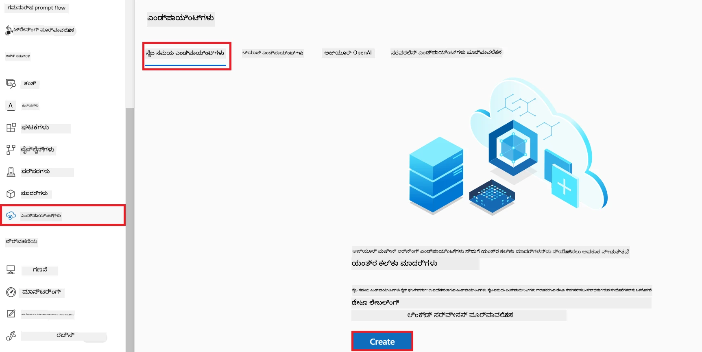

1. **Create** ಆಯ್ಕೆಮಾಡಿ.

1. ನೀವು ರಚಿಸಿದ ನೋಂದಾಯಿಸಿದ ಮಾದರಿಯನ್ನು ಆಯ್ಕೆಮಾಡಿ.

    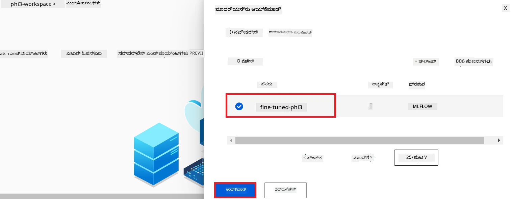

1. **Select** ಆಯ್ಕೆಮಾಡಿ.

1. ಕೆಳಗಿನ ಕಾರ್ಯಗಳನ್ನು ಮಾಡಿ:

    - **Virtual machine** ಆಯ್ಕೆ ಮಾಡಿ *Standard_NC6s_v3*.
    - ನೀವು ಬಳಸಲು ಇಚ್ಛಿಸುವ **Instance count** ಆಯ್ಕೆಮಾಡಿ. ಉದಾಹರಣೆಗೆ, *1*.
    - **Endpoint** ನ್ನು **New** ಆಗಿ ಆಯ್ಕೆ ಮಾಡಿ ಹೊಸ ಎಂಡ್ಪಾಯಿಂಟ್ ರಚಿಸಿ.
    - **Endpoint name** ನಮೂದಿಸಿ. ಇದು ಅನನ್ಯವಾಗಿರಬೇಕು.
    - **Deployment name** ನಮೂದಿಸಿ. ಇದು ಅನನ್ಯವಾಗಿರಬೇಕು.

    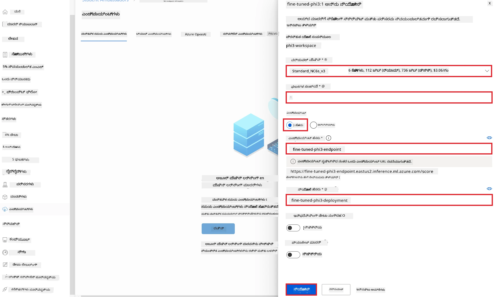

1. **Deploy** ಆಯ್ಕೆಮಾಡಿ.

> [!WARNING]
> ನಿಮ್ಮ ಖಾತೆಗೆ ಹೆಚ್ಚುವರಿ ವಿಧಿಸಲ್ಪಡುವ ಶುಲ್ಕಗಳನ್ನು ತಡೆಯಲು, ನೀವು ರಚಿಸಿದ ಎಂಡ್ಪಾಯಿಂಟ್ ಅನ್ನು Azure Machine Learning ವರ್ಕ್‌ಸ್ಪೇಸ್‌ನಲ್ಲಿ ಅಳಿಸಬೇಕು.
>

#### Azure Machine Learning ವರ್ಕ್‌ಸ್ಪೇಸ್‌ನಲ್ಲಿ ಡಿಪ್ಲಾಯ್ ಸ್ಥಿತಿಯನ್ನು ಪರೀಕ್ಷಿಸಿ

1. ನೀವು ರಚಿಸಿದ Azure Machine Learning ವರ್ಕ್‌ಸ್ಪೇಸ್ ಗೆ ಹೋಗಿ.

1. ಎಡ ಬದಿಯ ಟ್ಯಾಬ್‌ನಿಂದ **Endpoints** ಆಯ್ಕೆಮಾಡಿ.

1. ನೀವು ರಚಿಸಿದ ಎಂಡ್ಪಾಯಿಂಟ್ ಆಯ್ಕೆಮಾಡಿ.

    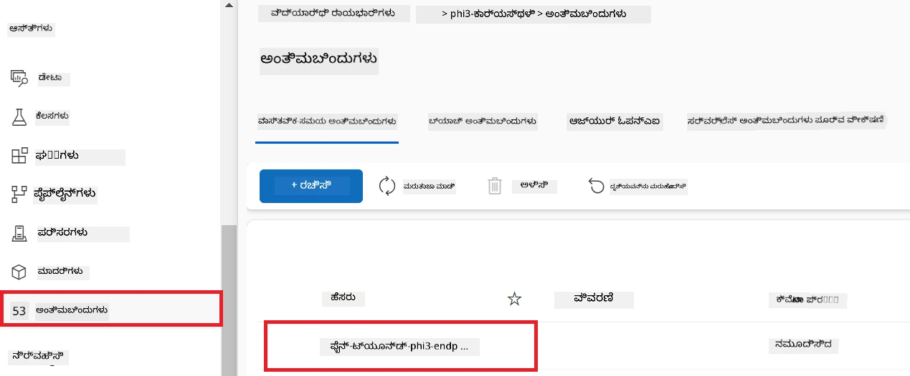

1. ಈ ಪುಟದಲ್ಲಿ, ನೀವು ಡಿಪ್ಲಾಯ್ ಪ್ರಕ್ರಿಯೆಯ ಸಮಯದಲ್ಲಿ ಎಂಡ್ಪಾಯಿಂಟ್‌ಗಳನ್ನು ನಿರ್ವಹಿಸಬಹುದು.

> [!NOTE]
> ಡಿಪ್ಲಾಯ್ ಪ್ರಕ್ರಿಯೆ ಪೂರ್ಣಗೊಂಡ ನಂತರ, **Live traffic** ಅನ್ನು **100%** ಗೆ ಸೆಟ್ ಮಾಡಿರುವುದನ್ನು ಖಚಿತಪಡಿಸಿಕೊಳ್ಳಿ. ಅದು ಅಲ್ಲದಿದ್ದರೆ, ಟ್ರಾಫಿಕ್ ಸೆಟ್ಟಿಂಗ್‌ಗಳನ್ನು ಸರಿಪಡಿಸಲು **Update traffic** ಆಯ್ಕೆಮಾಡಿ. ಟ್ರಾಫಿಕ್ 0% ಗೆ ಸೆಟ್ ಆಗಿದ್ದರೆ, ನೀವು ಮಾದರಿಯನ್ನು ಪರೀಕ್ಷಿಸಲು ಸಾಧ್ಯವಿಲ್ಲ.
>
> 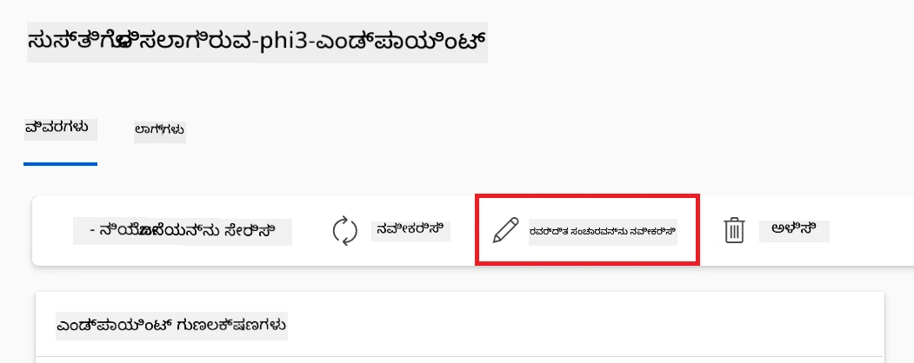
>

## ಕಂಡುಬರುವನೆ 3: Prompt flow ಜೊತೆಗೆ ಸಂಯೋಜಿಸಿ ಮತ್ತು Azure AI Foundry ನಲ್ಲಿ ನಿಮ್ಮ ಕಸ್ಟಮ್ ಮಾದರಿಯೊಂದಿಗೆ ಚಾಟ್ ಮಾಡಿ

### ಕಸ್ಟಮ್ Phi-3 ಮಾದರಿಯನ್ನು Prompt flow ಜೊತೆಗೆ ಸಂಯೋಜಿಸಿ

ನೀವು ಫೈನ್-ಟ್ಯೂನ್ಡ್ ಮಾದರಿಯನ್ನು ಯಶಸ್ವಿಯಾಗಿ ಡಿಪ್ಲಾಯ್ ಮಾಡಿದ ನಂತರ, Prompt Flow ಜೊತೆಗೆ ಅದನ್ನು ಸಂಯೋಜಿಸಿ ನಿಮ್ಮ ಮಾದರಿಯನ್ನು ರಿಯಲ್-ಟೈಮ್ ಅಪ್ಲಿಕೇಶನ್‌ಗಳಲ್ಲಿ ಬಳಸಬಹುದು, ಇದು ವಿವಿಧ ಸಂವಾದಾತ್ಮಕ ಕಾರ್ಯಗಳಿಗೆ ನಿಮ್ಮ ಕಸ್ಟಮ್ Phi-3 ಮಾದರಿಯನ್ನು ಅನುಮತಿಸುತ್ತದೆ.

ಈ ವ್ಯಾಯಾಮದಲ್ಲಿ ನೀವು:

- Azure AI Foundry Hub ರಚಿಸಿ.
- Azure AI Foundry Project ರಚಿಸಿ.
- Prompt flow ರಚಿಸಿ.
- ಫೈನ್-ಟ್ಯೂನಡ್ Phi-3 ಮಾದರಿಗಾಗಿ ಕಸ್ಟಮ್ ಸಂಪರ್ಕವನ್ನು ಸೇರಿಸಿ.
- ನಿಮ್ಮ ಕಸ್ಟಮ್ Phi-3 ಮಾದರಿಯೊಂದಿಗೆ ಗಮನಾರ್ಥ ಚಾಟ್ ಮಾಡಲು Prompt flow ಅನ್ನು ಹೊಂದಿಸಿ.

> [!NOTE]
> ನೀವು Azure ML Studio ಬಳಸಿ ಕೂಡ Promptflow ಜೊತೆಗೆ ಸಂಯೋಜಿಸಬಹುದು. ಅದೇ ಸಂಯೋಜನಾ ಪ್ರಕ್ರಿಯೆಯನ್ನು Azure ML Studio ಗೆ ಸಹ ಅನ್ವಯಿಸಬಹುದು.

#### Azure AI Foundry Hub ರಚಿಸಿ

ಪ್ರಾಜೆಕ್ಟ್ ರಚಿಸುವ ಮೊದಲು ನೀವು ಒಂದು ಹಬ್ ರಚಿಸಬೇಕಾಗುತ್ತದೆ. ಹಬ್ ಒಂದು Resource Group ನಂತೆ ಕಾರ್ಯನಿರ್ವಹಿಸುತ್ತದೆ, ಇದು ನಿಮ್ಮ Azure AI Foundry ಒಳಗಿನ ಹಲವಾರು ಪ್ರಾಜೆಕ್ಟುಗಳನ್ನು ಸಂಘಟಿಸಿ ನಿರ್ವಹಿಸಲು ಅನುಮತಿಸುತ್ತದೆ.

1. [Azure AI Foundry](https://ai.azure.com/?WT.mc_id=aiml-137032-kinfeylo) ಗೆ ಭೇಟಿ ನೀಡಿ.

1. ಎಡ ಬದಿಯ ಟ್ಯಾಬ್‌ನಿಂದ **All hubs** ಆಯ್ಕೆಮಾಡಿ.

1. ನ್ಯಾವಿಗೇಶನ್ ಮೆನುನಿಂದ **+ New hub** ಆಯ್ಕೆಮಾಡಿ.
    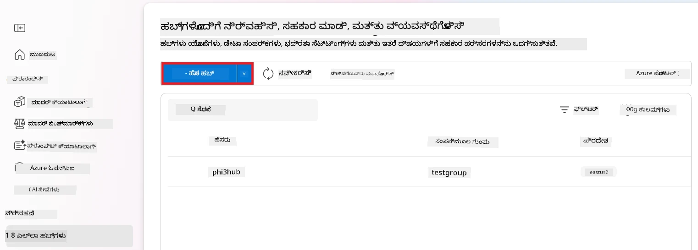

1. ಕೆಳಗಿನ ಕಾರ್ಯಗಳನ್ನು ನಿರ್ವಹಿಸಿ:

    - **ಹಬ್ ಹೆಸರು** ನಮೂದಿಸಿ. ಇದು ವಿಶಿಷ್ಟ ಮೌಲ್ಯವಾಗಿರಬೇಕು.
    - ನಿಮ್ಮ ಅಜೂರ್ **ಚಂದಾದಾರಿಕೆಯನ್ನು** ಆಯ್ಕೆಮಾಡಿ.
    - ಬಳಸಲು **ಸಂಪನ್ಮೂಲ ಗುಂಪು** ಆಯ್ಕೆಮಾಡಿ (ಅವಶ್ಯಕತೆ ಇದ್ದರೆ ಹೊಸದನ್ನು ರಚಿಸಿ).
    - ನೀವು ಬಳಸಲು ಬಯಸುವ **ಸ್ಥಳ** ಆಯ್ಕೆಮಾಡಿ.
    - ಬಳಸಲು **ಅಜೂರ್ AI ಸೇವೆಗಳನ್ನು ಸಂಪರ್ಕಿಸಿ** ಆಯ್ಕೆಮಾಡಿ (ಅವಶ್ಯಕತೆ ಇದ್ದರೆ ಹೊಸದನ್ನು ರಚಿಸಿ).
    - **ಅಜೂರ್ AI ಹುಡುಕಣೆಯನ್ನು ಸಂಪರ್ಕಿಸುವುದನ್ನು** **ಛುಟುಮಾಡಿ** ಆಯ್ಕೆಮಾಡಿ.

    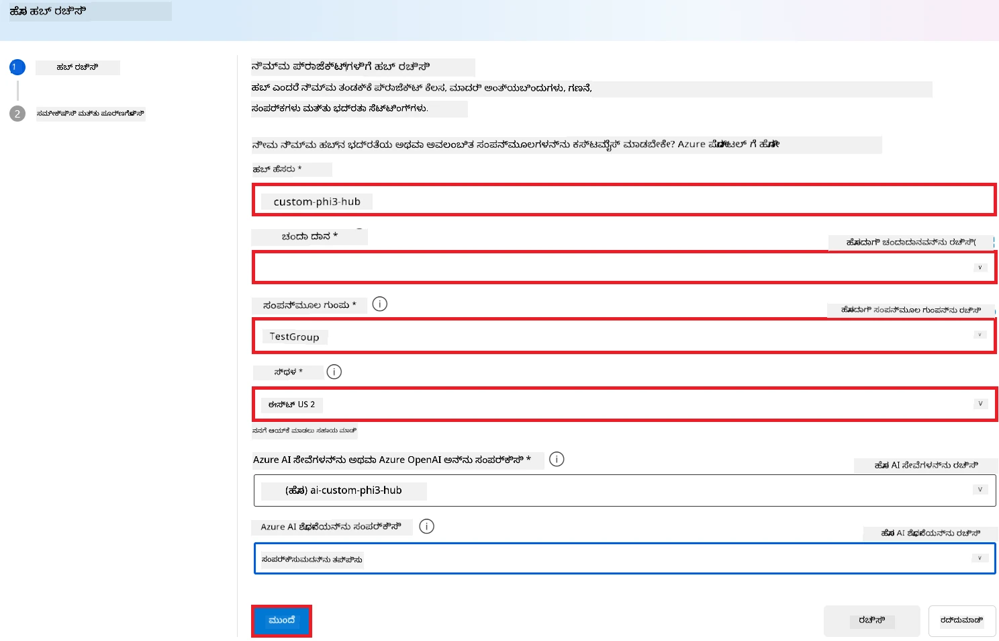

1. **ಮುಂದೆ** ಆಯ್ಕೆಮಾಡಿ.

#### ಅಜೂರ್ AI ಫೌಂಡ್ರಿ ಪ್ರೊಜೆಕ್ಟ್ ರಚನೆ

1. ನೀವು ರಚಿಸಿದ ಹಬ್ ನಲ್ಲಿ ಎಡಭಾಗದ ಟ್ಯಾಬ್ ನಿಂದ **ಎಲ್ಲಾ ಪ್ರೊಜೆಕ್ಟ್ಗಳು** ಆಯ್ಕೆಮಾಡಿ.

1. ನ್ಯಾವಿಗೇಷನ್ ಮೆನುನಿಂದ **+ ಹೊಸ ಪ್ರೊಜೆಕ್ಟ್** ಆಯ್ಕೆಮಾಡಿ.

    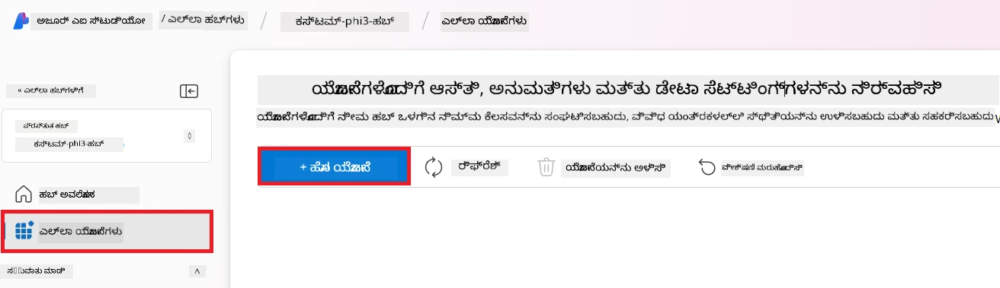

1. **ಪ್ರೊಜೆಕ್ಟ್ ಹೆಸರು** ನಮೂದಿಸಿ. ಇದು ವಿಶಿಷ್ಟ ಮೌಲ್ಯವಾಗಿರಬೇಕು.

    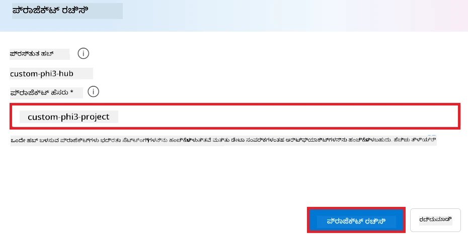

1. **ಪ್ರೊಜೆಕ್ಟ್ ರಚಿಸಿ** ಆಯ್ಕೆಮಾಡಿ.

#### ಫೈನ್-ಟ್ಯೂನ್ಡ್ ಫೈ-3 ಮಾದರಿಗಾಗಿ ಕಸ್ಟಮ್ ಸಂಪರ್ಕ ಸೇರಿಸಿ

ನಿಮ್ಮ ಕಸ್ಟಮ್ ಫೈ-3 ಮಾದರಿಯನ್ನು ಪ್ರಾಂಪ್ಟ್ ಫ್ಲೋ ಜೊತೆ ಸಂಯೋಜಿಸಲು, ನೀವು ಮಾದರಿಯ ಎಂಡ್ಪಾಯಿಂಟ್ ಮತ್ತು ಕೀ ಅನ್ನು ಕಸ್ಟಮ್ ಸಂಪರ್ಕದಲ್ಲಿ ಉಳಿಸಬೇಕು. ಈ ಸಂಯೋಜನೆ ಪ್ರಾಂಪ್ಟ್ ಫ್ಲೋಯಲ್ಲಿ ನಿಮ್ಮ ಕಸ್ಟಮ್ ಫೈ-3 ಮಾದರಿಗೆ ಪ್ರವೇಶವನ್ನು ಖಚಿತಪಡಿಸುತ್ತದೆ.

#### ಫೈನ್-ಟ್ಯೂನ್ಡ್ ಫೈ-3 ಮಾದರಿಯ api ಕೀ ಮತ್ತು ಎಂಡ್ಪಾಯಿಂಟ್ URI ಸೆಟ್ ಮಾಡಿ

1. [ಅಜೂರ್ ML ಸ್ಟುಡಿಯೋಗೆ](https://ml.azure.com/home?WT.mc_id=aiml-137032-kinfeylo) ಭೇಟಿ ನೀಡಿ.

1. ನೀವು ರಚಿಸಿದ ಅಜೂರ್ ಮೆಷಿನ್ ಲರ್ನಿಂಗ್ ವರ್ಕ್‌ಸ್ಪೇಸ್‌ಗೆ ನ್ಯಾವಿಗೇಟ್ ಮಾಡಿ.

1. ಎಡಭಾಗದ ಟ್ಯಾಬ್‌ನಿಂದ **ಎಂಡ್ಪಾಯಿಂಟ್‌ಗಳು** ಆಯ್ಕೆಮಾಡಿ.

    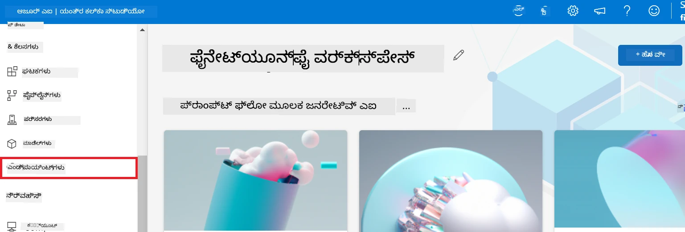

1. ನೀವು ರಚಿಸಿದ ಎಂಡ್ಪಾಯಿಂಟ್ ಆಯ್ಕೆಮಾಡಿ.

    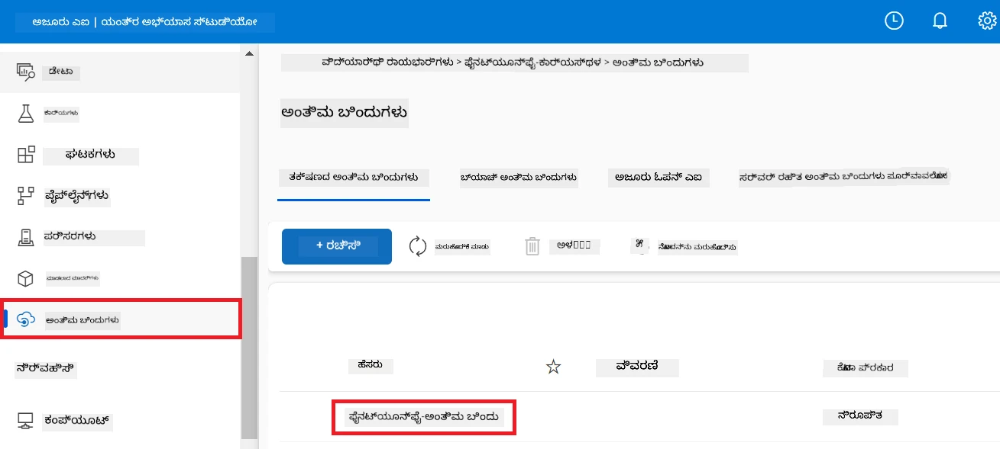

1. ನ್ಯಾವಿಗೇಷನ್ ಮೆನುನಿಂದ **ಉಪಯೋಗಿಸಿ** ಆಯ್ಕೆಮಾಡಿ.

1. ನಿಮ್ಮ **REST ಎಂಡ್ಪಾಯಿಂಟ್** ಮತ್ತು **ಪ್ರಾಥಮಿಕ ಕೀ** ನಕಲಿ ಮಾಡಿ.

    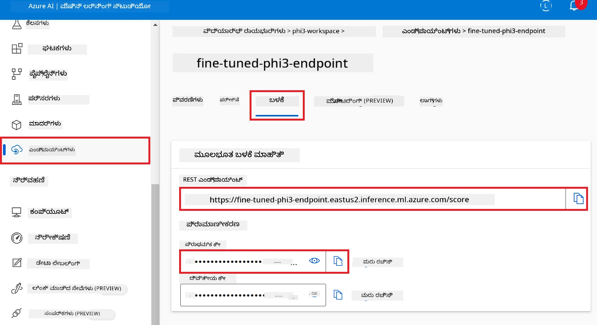

#### ಕಸ್ಟಮ್ ಸಂಪರ್ಕ ಸೇರಿಸಿ

1. [ಅಜೂರ್ AI ಫೌಂಡ್ರಿಗೆ](https://ai.azure.com/?WT.mc_id=aiml-137032-kinfeylo) ಭೇಟಿ ನೀಡಿ.

1. ನೀವು ರಚಿಸಿದ ಅಜೂರ್ AI ಫೌಂಡ್ರಿ ಪ್ರೊಜೆಕ್ಟಿಗೆ ನ್ಯಾವಿಗೇಟ್ ಮಾಡಿ.

1. ನೀವು ರಚಿಸಿದ ಪ್ರೊಜೆಕ್ಟ್ನಲ್ಲಿ ಎಡಭಾಗದ ಟ್ಯಾಬ್‌ನಿಂದ **ಸೆಟ್ಟಿಂಗ್ಸ್** ಆಯ್ಕೆಮಾಡಿ.

1. **+ ಹೊಸ ಸಂಪರ್ಕ** ಆಯ್ಕೆಮಾಡಿ.

    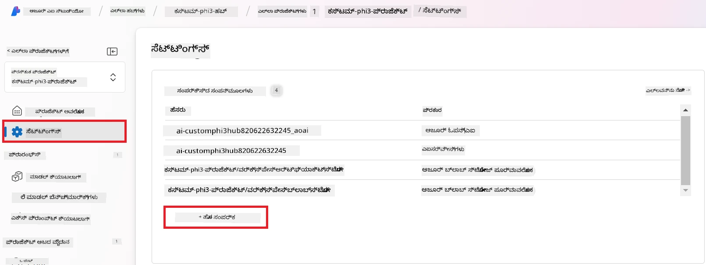

1. ನ್ಯಾವಿಗೇಷನ್ ಮೆನುನಿಂದ **ಕಸ್ಟಮ್ ಕೀಸ್** ಆಯ್ಕೆಮಾಡಿ.

    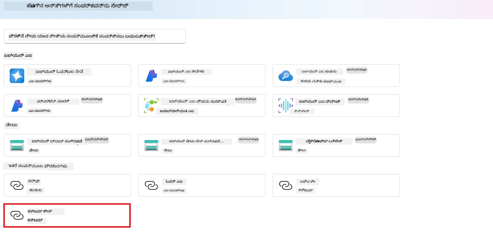

1. ಕೆಳಗಿನ ಕಾರ್ಯಗಳನ್ನು ನಿರ್ವಹಿಸಿ:

    - **+ ಕೀ ಮತ್ತು ಮೌಲ್ಯ ಜೋಡಣೆಗಳು ಸೇರಿಸಿ** ಆಯ್ಕೆಮಾಡಿ.
    - ಕೀ ಹೆಸರಿಗಾಗಿ **endpoint** ನಮೂದಿಸಿ ಮತ್ತು ಮೌಲ್ಯ ಕ್ಷೇತ್ರದಲ್ಲಿ ಅಜೂರ್ ML ಸ್ಟುಡಿಯೋದಿಂದ ನಕಲಿಸಿದ ಎಂಡ್ಪಾಯಿಂಟ್ ಪೇಸ್ಟ್ ಮಾಡಿ.
    - ಮತ್ತೊಮ್ಮೆ **+ ಕೀ ಮತ್ತು ಮೌಲ್ಯ ಜೋಡಣೆಗಳು ಸೇರಿಸಿ** ಆಯ್ಕೆಮಾಡಿ.
    - ಕೀ ಹೆಸರಿಗಾಗಿ **key** ನಮೂದಿಸಿ ಮತ್ತು ಮೌಲ್ಯ ಕ್ಷೇತ್ರದಲ್ಲಿ ಅಜೂರ್ ML ಸ್ಟುಡಿಯೋದಿಂದ ನಕಲಿಸಿದ ಕೀ ಪೇಸ್ಟ್ ಮಾಡಿ.
    - ಕೀಸ್ ಸೇರಿಸಿದ ನಂತರ, ಕೀ ಬಹಿರಂಗವಾಗದಂತೆ **ರಹಸ್ಯವಾಗಿದೆ** ಆಯ್ಕೆಮಾಡಿ.

    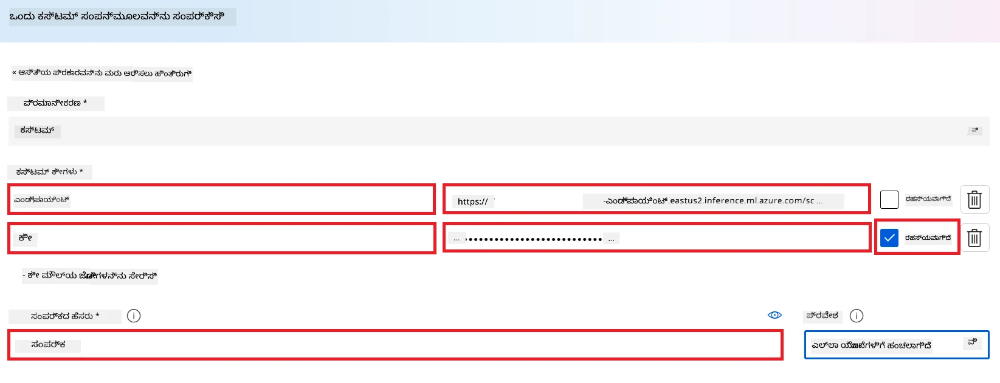

1. **ಸಂಪರ್ಕ ಸೇರಿಸಿ** ಆಯ್ಕೆಮಾಡಿ.

#### ಪ್ರಾಂಪ್ಟ್ ಫ್ಲೋ ರಚಿಸಿ

ನೀವು ಅಜೂರ್ AI ಫೌಂಡ್ರಿಯಲ್ಲಿ ಕಸ್ಟಮ್ ಸಂಪರ್ಕ ಸೇರಿಸಿದ್ದೀರಾ. ಈಗ ಕೆಳಗಿನ ಹಂತಗಳನ್ನು ಅನುಸರಿಸಿ ಪ್ರಾಂಪ್ಟ್ ಫ್ಲೋ ರಚಿಸೋಣ. ನಂತರ, ನೀವು ಈ ಪ್ರಾಂಪ್ಟ್ ಫ್ಲೋ ನ್ನು ಕಸ್ಟಮ್ ಸಂಪರ್ಕಕ್ಕೆ ಸಂಪರ್ಕಿಸಿ ಫೈನ್-ಟ್ಯೂನ್ಡ್ ಮಾದರಿಯನ್ನು ಪ್ರಾಂಪ್ಟ್ ಫ್ಲೋಯಲ್ಲಿ ಬಳಸಬಹುದು.

1. ನೀವು ರಚಿಸಿದ ಅಜೂರ್ AI ಫೌಂಡ್ರಿ ಪ್ರೊಜೆಕ್ಟಿಗೆ ನ್ಯಾವಿಗೇಟ್ ಮಾಡಿ.

1. ಎಡಭಾಗದ ಟ್ಯಾಬ್‌ನಿಂದ **ಪ್ರಾಂಪ್ಟ್ ಫ್ಲೋ** ಆಯ್ಕೆಮಾಡಿ.

1. ನ್ಯಾವಿಗೇಷನ್ ಮೆನುನಿಂದ **+ ರಚಿಸಿ** ಆಯ್ಕೆಮಾಡಿ.

    

1. ನ್ಯಾವಿಗೇಷನ್ ಮೆನುನಿಂದ **ಚಾಟ್ ಫ್ಲೋ** ಆಯ್ಕೆಮಾಡಿ.

    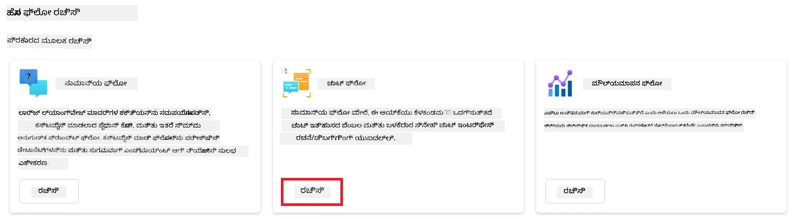

1. ಬಳಸಲು **ಫೋಲ್ಡರ್ ಹೆಸರು** ನಮೂದಿಸಿ.

    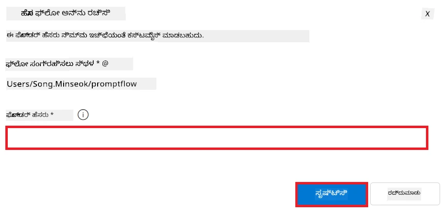

2. **ರಚಿಸಿ** ಆಯ್ಕೆಮಾಡಿ.

#### ನಿಮ್ಮ ಕಸ್ಟಮ್ ಫೈ-3 ಮಾದರಿಯನ್ನು ಚಾಟ್ ಮಾಡಲು ಪ್ರಾಂಪ್ಟ್ ಫ್ಲೋ ಸೆಟ್ ಅಪ್ ಮಾಡಿ

ನೀವು ಫೈನ್-ಟ್ಯೂನ್ಡ್ ಫೈ-3 ಮಾದರಿಯನ್ನು ಪ್ರಾಂಪ್ಟ್ ಫ್ಲೋಗೆ ಸಂಯೋಜಿಸಬೇಕಾಗಿದೆ. ಆದರೆ, ಈಗಿನ ಪ್ರಾಂಪ್ಟ್ ಫ್ಲೋ ಇದಕ್ಕಾಗಿ ವಿನ್ಯಾಸಗೊಳ್ಳಿಲ್ಲ. ಇದು ಕಾರಣದಿಂದ, ನೀವು ಪ್ರಾಂಪ್ಟ್ ಫ್ಲೋವನ್ನು ಕಸ್ಟಮ್ ಮಾದರಿಯ ಸಂಯೋಜನೆಗೆ ಯೋಗ್ಯವಾಗಿ ಮರು ವಿನ್ಯಾಸಗೊಳಿಸಬೇಕು.

1. ಪ್ರಾಂಪ್ಟ್ ಫ್ಲೋದಲ್ಲಿ ಹಳೆಯ ಫ್ಲೋವನ್ನು ಪುನರ್ ರಚಿಸಲು ಕೆಳಗಿನ ಕಾರ್ಯಗಳನ್ನು ಮಾಡಿರಿ:

    - **ಕಚ್ಚಾ ಫೈಲ್ ಮೋಡ್** ಆಯ್ಕೆಮಾಡಿ.
    - *flow.dag.yml* ಫೈಲ್‌ನ ಎಲ್ಲಾ ಹಳೆಯ ಕೋಡ್ ಅನ್ನು ಅಳಿಸಿ.
    - *flow.dag.yml* ಫೈಲ್‌ಗೆ ಕೆಳಗಿನ ಕೋಡ್ ಸೇರಿಸಿ.

        ```yml
        inputs:
          input_data:
            type: string
            default: "Who founded Microsoft?"

        outputs:
          answer:
            type: string
            reference: ${integrate_with_promptflow.output}

        nodes:
        - name: integrate_with_promptflow
          type: python
          source:
            type: code
            path: integrate_with_promptflow.py
          inputs:
            input_data: ${inputs.input_data}
        ```

    - **ಉಳಿಸಿ** ಆಯ್ಕೆಮಾಡಿ.

    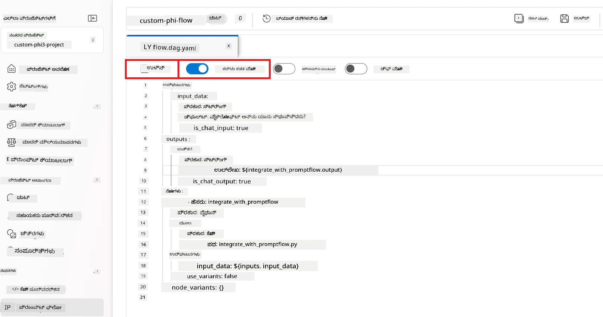

1. ಪ್ರಾಂಪ್ಟ್ ಫ್ಲೋಯಲ್ಲಿ ಕಸ್ಟಮ್ ಫೈ-3 ಮಾದರಿಯನ್ನು ಬಳಸಲು *integrate_with_promptflow.py* ಫೈಲ್‌ಗೆ ಕೆಳಗಿನ ಕೋಡ್ ಸೇರಿಸಿ.

    ```python
    import logging
    import requests
    from promptflow import tool
    from promptflow.connections import CustomConnection

    # ಲಾಗ್ ಸೆಟ್ ಅಪ್
    logging.basicConfig(
        format="%(asctime)s - %(levelname)s - %(name)s - %(message)s",
        datefmt="%Y-%m-%d %H:%M:%S",
        level=logging.DEBUG
    )
    logger = logging.getLogger(__name__)

    def query_phi3_model(input_data: str, connection: CustomConnection) -> str:
        """
        Send a request to the Phi-3 model endpoint with the given input data using Custom Connection.
        """

        # "connection" ಕಸ್ಟಮ್ ಸಂಪರ್ಕನ ಹೆಸರು, "endpoint", "key" ಗಳು ಕಸ್ಟಮ್ ಸಂಪರ್ಕದ ಕೀಲೆಗಳು
        endpoint_url = connection.endpoint
        api_key = connection.key

        headers = {
            "Content-Type": "application/json",
            "Authorization": f"Bearer {api_key}"
        }
        data = {
            "input_data": {
                "input_string": [
                    {"role": "user", "content": input_data}
                ],
                "parameters": {
                    "temperature": 0.7,
                    "max_new_tokens": 128
                }
            }
        }
        try:
            response = requests.post(endpoint_url, json=data, headers=headers)
            response.raise_for_status()
            
            # ಸಂಪೂರ್ಣ JSON ಪ್ರತಿಕ್ರಿಯೆಯನ್ನು ಲಾಗ್ ಮಾಡಿ
            logger.debug(f"Full JSON response: {response.json()}")

            result = response.json()["output"]
            logger.info("Successfully received response from Azure ML Endpoint.")
            return result
        except requests.exceptions.RequestException as e:
            logger.error(f"Error querying Azure ML Endpoint: {e}")
            raise

    @tool
    def my_python_tool(input_data: str, connection: CustomConnection) -> str:
        """
        Tool function to process input data and query the Phi-3 model.
        """
        return query_phi3_model(input_data, connection)

    ```

    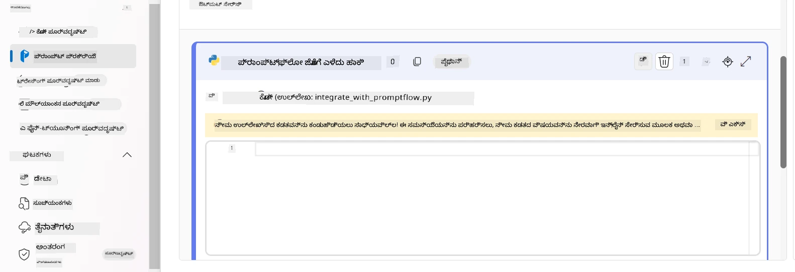

> [!NOTE]
> ಅಜೂರ್ AI ಫೌಂಡ್ರಿ ನಲ್ಲಿ ಪ್ರಾಂಪ್ಟ್ ಫ್ಲೋ ಬಳಕೆ ಕುರಿತು ಇನ್ನಷ್ಟು ವಿವರಗಳಿಗಾಗಿ, ನೀವು [ಅಜೂರ್ AI ಫೌಂಡ್ರಿಯಲ್ಲಿ ಪ್ರಾಂಪ್ಟ್ ಫ್ಲೋ](https://learn.microsoft.com/azure/ai-studio/how-to/prompt-flow) ನ್ನು ಸಂಪರ್ಕಿಸಬಹುದು.

1. ನಿಮ್ಮ ಮಾದರಿಯೊಂದಿಗೆ ಚಾಟ್ ಮಾಡಲು **ಚಾಟ್ ಇನ್‌ಪುಟ್**, **ಚಾಟ್ ಔಟ್‌ಪುಟ್** ಆಯ್ಕೆಮಾಡಿ.

    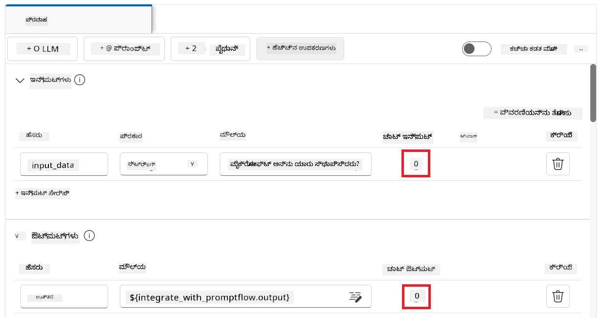

1. ಈಗ ನೀವು ನಿಮ್ಮ ಕಸ್ಟಮ್ ಫೈ-3 ಮಾದರಿಯೊಂದಿಗೆ ಚಾಟ್ ಮಾಡಲು ಸಿದ್ಧರಿದ್ದೀರಿ. ಮುಂದಿನ ಅಭ್ಯಾಸದಲ್ಲಿ, ನೀವು ಪ್ರಾಂಪ್ಟ್ ಫ್ಲೋ ಪ್ರಾರಂಭಿಸುವುದು ಮತ್ತು ಅದರೊಂದಿಗೆ ಫೈನ್-ಟ್ಯೂನ್ಡ್ ಫೈ-3 ಮಾದರಿಯನ್ನು ಬಳಸಿ ಚಾಟ್ ಮಾಡುವುದನ್ನು ಕಲಿಯುತ್ತೀರಿ.

> [!NOTE]
>
> ಮರು ನಿರ್ಮಿತ ಫ್ಲೋ ಕೆಳಗಿನ ಚಿತ್ರದಲ್ಲಿಯಂತಿರಬೇಕು:
>
> 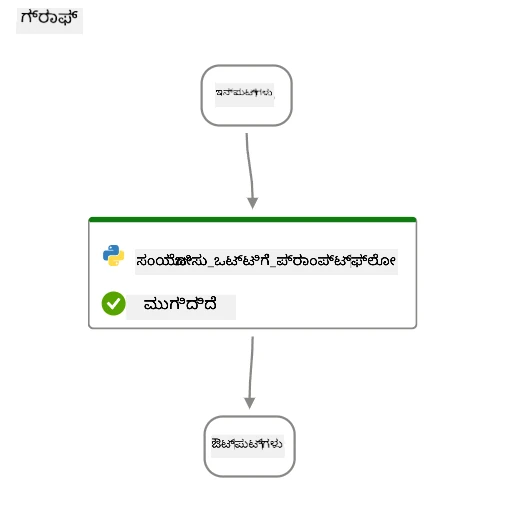
>

### ನಿಮ್ಮ ಕಸ್ಟಮ್ ಫೈ-3 ಮಾದರಿಯೊಂದಿಗೆ ಚಾಟ್ ಮಾಡಿ

ನೀವು ಫೈನ್-ಟ್ಯೂನಿಂಗ್ ಮಾಡಿ ಕಸ್ಟಮ್ ಫೈ-3 ಮಾದರಿಯನ್ನು ಪ್ರಾಂಪ್ಟ್ ಫ್ಲೋ ಜೊತೆ ಸಂಯೋಜಿಸಿದ್ದೀರಿ. ಈಗ ನಿಮಗೆ ಇದರೊಂದಿಗೆ ಸಂವಹನ ಆರಂಭಿಸಲು ಸಿದ್ಧತೆ ಇದೆ. ಈ ಅಭ್ಯಾಸವು ಪ್ರಾಂಪ್ಟ್ ಫ್ಲೋ ಬಳಸಿ ನಿಮ್ಮ ಮಾದರಿಯೊಂದಿಗೆ ಚಾಟ್ ಸ್ಥಾಪಿಸುವ ಹಂತಗಳನ್ನು ತೋರಿಸುತ್ತದೆ. ಈ ಹಂತಗಳನ್ನು ಅನುಸರಿಸುವ ಮೂಲಕ, ನೀವು ನಿಮ್ಮ ಫೈನ್-ಟ್ಯೂನ್ಡ್ ಫೈ-3 ಮಾದರಿಯ ಸಾಮರ್ಥ್ಯಗಳನ್ನು ಪೂರ್ಣವಾಗಿ ಬಳಸಬಹುದು.

- ಪ್ರಾಂಪ್ಟ್ ಫ್ಲೋ ಬಳಸಿ ನಿಮ್ಮ ಕಸ್ಟಮ್ ಫೈ-3 ಮಾದರಿಯೊಂದಿಗೆ ಚಾಟ್ ಮಾಡಿ.

#### ಪ್ರಾಂಪ್ಟ್ ಫ್ಲೋ ಪ್ರಾರಂಭಿಸಿ

1. ಪ್ರಾಂಪ್ಟ್ ಫ್ಲೋ ಪ್ರಾರಂಭಿಸಲು **ಕಂಪ್ಯೂಟ್ ಸೆಶನ್‌ಗಳು ಪ್ರಾರಂಭಿಸಿ** ಆಯ್ಕೆಮಾಡಿ.

    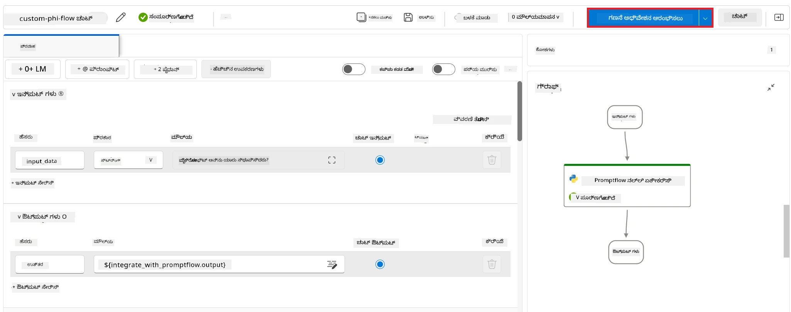

1. ಪರಿಮಾಣಗಳನ್ನು ನವೀಕರಿಸಲು **ಇನ್‌ಪುಟ್ ಪರಿಶೀಲಿಸಿ ಮತ್ತು ವಿಂಗಡಿಸಿ** ಆಯ್ಕೆಮಾಡಿ.

    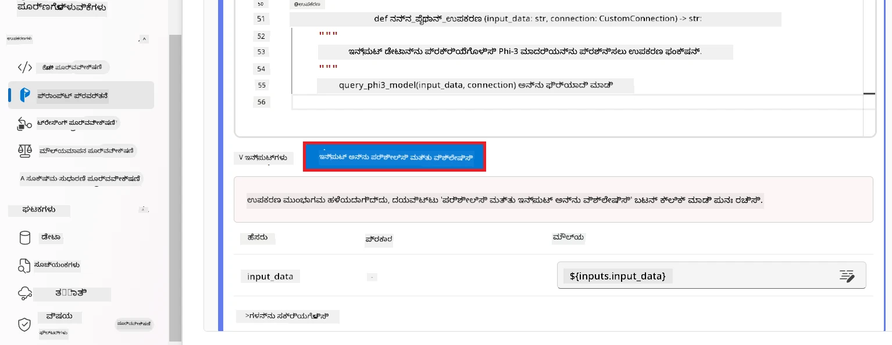

1. ನೀವು ರಚಿಸಿದ ಕಸ್ಟಮ್ ಸಂಪರ್ಕದ **ಸಂಪರ್ಕ** ಮೌಲ್ಯವನ್ನು ಆಯ್ಕೆಮಾಡಿ. ಉದಾಹರಣೆಗೆ, *connection*.

    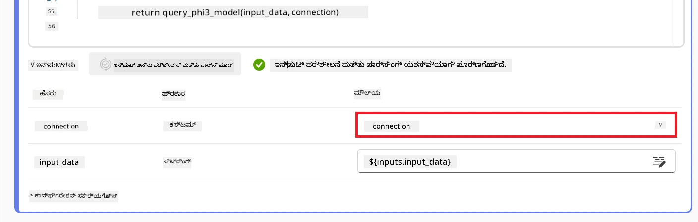

#### ನಿಮ್ಮ ಕಸ್ಟಮ್ ಮಾದರಿಯೊಂದಿಗೆ ಚಾಟ್ ಮಾಡಿ

1. **ಚಾಟ್** ಆಯ್ಕೆಮಾಡಿ.

    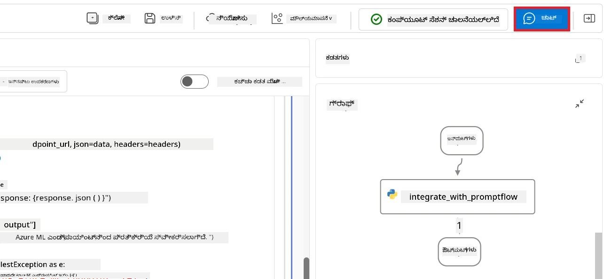

1. ಫಲಿತಾಂಶಗಳ ಉದಾಹರಣೆ ಇಲ್ಲಿದೆ: ಈಗ ನೀವು ನಿಮ್ಮ ಕಸ್ಟಮ್ ಫೈ-3 ಮಾದರಿಯೊಂದಿಗೆ ಚಾಟ್ ಮಾಡಬಹುದು. ಫೈನ್-ಟ್ಯೂನಿಂಗ್‌ನಲ್ಲಿ ಬಳಸಿದ ಡೇಟಾದ ಆಧಾರದಲ್ಲಿ ಪ್ರಶ್ನೆಗಳನ್ನು ಕೇಳಬೇಕೆಂದು ಶಿಫಾರಸು ಮಾಡಲಾಗಿದೆ.

    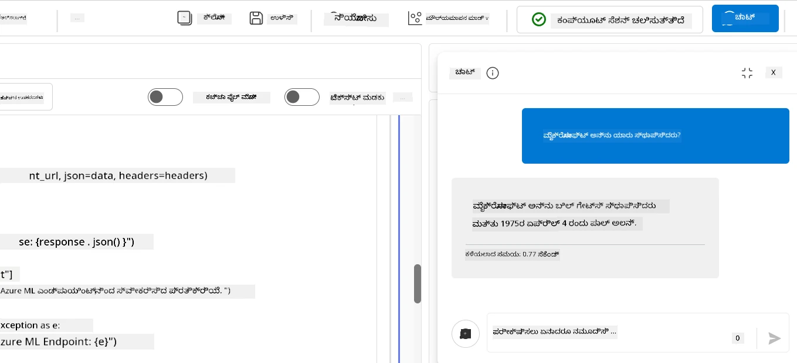

---

<!-- CO-OP TRANSLATOR DISCLAIMER START -->
**ಅಪಾಯವಿಚರಣೆ**:  
ಈ ದಾಖಲೆ [Co-op Translator](https://github.com/Azure/co-op-translator) ಎಂಬ AI ಅನುವಾದ ಸೇವೆಯನ್ನು ಬಳಸಿ ಅನುವಾದಿಸಲಾಗಿದೆ. ನಾವು ನಿಖರತೆಯನ್ನು ಸಾಧಿಸಲು ಪ್ರಯತ್ನಿಸುತ್ತಿದ್ದರೂ, ಸ್ವಯಂಚಾಲಿತ ಅನುವಾದಗಳಲ್ಲಿ ತಪ್ಪುಗಳು ಅಥವಾ ಅಸತ್ಯತೆಗಳಿರುವ ಸಂಭವನೆಯಿದೆ. ಮೂಲ ಭಾಷೆಯಲ್ಲಿರುವ ಮೂಲ ದಾಖಲೆ ಮಾನ್ಯತೆಯ ಮೂಲ ಎಂದು ಪರಿಗಣಿಸಬೇಕು. ಮುಖ್ಯ ಮಾಹಿತಿಗಾಗಿ ವೃತ್ತಿಪರ ಮಾನವ ಅನುವಾದವನ್ನು ಶಿಫಾರಸು ಮಾಡಲಾಗುತ್ತದೆ. ಈ ಅನುವಾದದ ಬಳಕೆಯಿಂದ ಉಂಟಾಗುವ ಯಾವುದೇ ತಪ್ಪು ಅರ್ಥಗಳಿಗಾಗಿ ನಾವು ಹೊಣೆಗಾರರಲ್ಲ.
<!-- CO-OP TRANSLATOR DISCLAIMER END -->