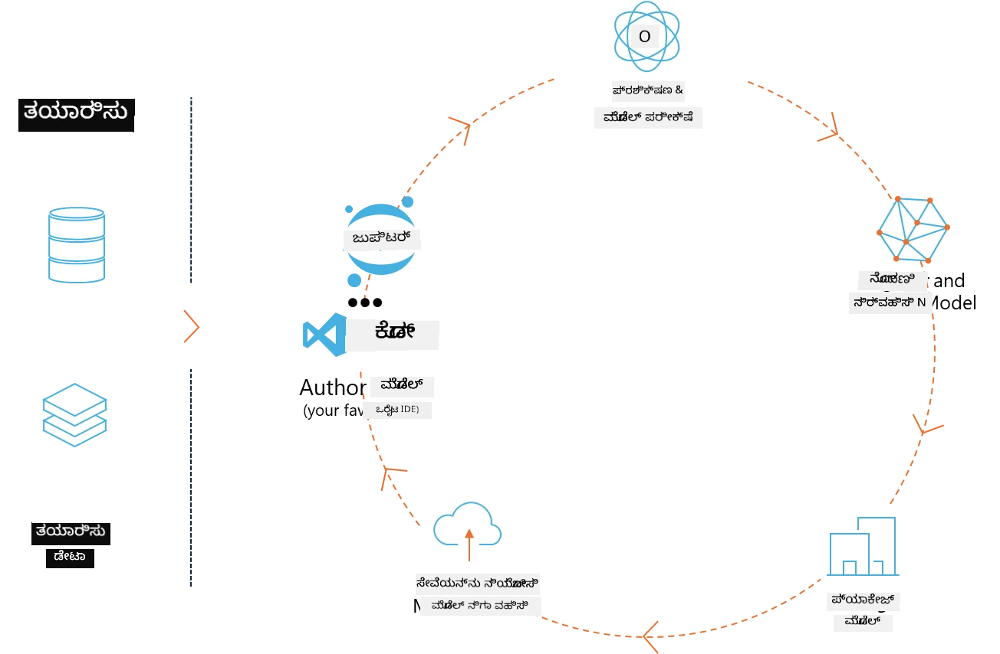
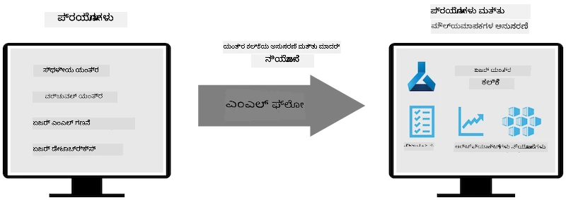
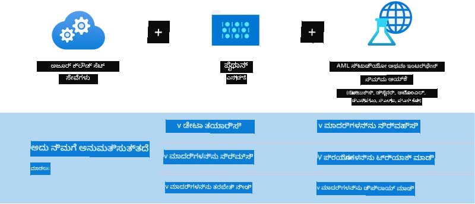

# MLflow

[MLflow](https://mlflow.org/) ಒಂದು ಓಪನ್-ಸೋರ್ಸ್ ಪ್ಲಾಟ್‌ಫಾರ್ಮ್ ಆಗಿದ್ದು ಎಂಡ್-ಟು-ಎಂಡ್ ಮೆಷಿನ್ ಲರ್ನಿಂಗ್ ಜೀವನಚಕ್ರವನ್ನು ನಿರ್ವಹಿಸಲು ವಿನ್ಯಾಸಗೊಳಿಸಲಾಗಿದೆ.



MLFlow ಅನ್ನು ಪ್ರಯೋಗ, ಪುನರुत್ಪಾದಕತೆ, ನಿಯೋಜನೆ ಮತ್ತು ಕೇಂದ್ರಿತ ಮಾದರಿ ರೆಜಿಸ್ಟ್ರಿಯನ್ನು ಒಳಗೊಂಡಂತೆ ML ಜೀವನಚಕ್ರವನ್ನು ನಿರ್ವಹಿಸಲು ಬಳಸಲಾಗುತ್ತದೆ. ML flow ಸದ್ಯದಲ್ಲಿಯೇ ನಾಲ್ಕು ಘಟಕಗಳನ್ನು ಒದಗಿಸುತ್ತದೆ. 

- **MLflow Tracking:** ಪ್ರಯೋಗಗಳು, ಕೋಡ್, ಡೇಟಾ ಕಾನ್ಫಿಗರೇಶನ್ ಮತ್ತು ಫಲಿತಾಂಶಗಳನ್ನು ದಾಖಲಿಸು ಮತ್ತು ಪ್ರಶ್ನೆಮಾಡು.
- **MLflow Projects:** ಯಾವುದೇ ವೇದಿಕೆಯ ಮೇಲೆ ರನ್‌ಗಳನ್ನು ಪುನರुत್ಪಾದಿಸಲು ಕೋಡ್ ಅನ್ನು ಪ್ಯಾಕೇಜ್ ಮಾಡಿ.
- **Mlflow Models:** ವೈವಿಧ್ಯಮಯ ಸರ್ವಿಂಗ್ ಪರಿಸರಗಳಲ್ಲಿ ಮೆಷಿನ್ ಲರ್ನಿಂಗ್ ಮಾದರಿಗಳನ್ನು ನಿಯೋಜಿಸಿ.
- **Model Registry:** ಮಾದರಿಗಳನ್ನು ಒಟ್ಟು ಸಂಗ್ರಹಣೆಯಲ್ಲಿ ಸಂಗ್ರಹಿಸಿ, ಟಿಪ್ಪಣಿಗಳನ್ನು ಸೇರ್ಪಡೆ ಮಾಡಿ ಮತ್ತು ನಿರ್ವಹಿಸಿ.

ಇದರಲ್ಲಿ ಪ್ರಯೋಗಗಳನ್ನು ట్ర್ಯಾಕ್ ಮಾಡುವ ಸಾಮರ್ಥ್ಯಗಳು, ಕೋಡ್ ಅನ್ನು ಪುನರುತ್ಪಾದಕ ರನ್‌ಗಳಾಗಿ ಪ್ಯಾಕೇಜ್ ಮಾಡುವುದರಲ್ಲಿನ ಸಹಾಯ, ಮತ್ತು ಮಾದರಿಗಳನ್ನು ಹಂಚಿಕೊಳ್ಳುವುದಾಗಿಯೂ ಹಾಗೂ ನಿಯೋಜಿಸುವಾಗಿನ ಸಾಮರ್ಥ್ಯಗಳಿವೆ. MLFlow ಅನ್ನು Databricks ನಲ್ಲಿ ಏಕೀಕೃತಗೊಳಿಸಲಾಗಿದೆ ಮತ್ತು ಇದು ಹಲವು ML ಗ್ರಂಥಾಲಯಗಳನ್ನು ಬೆಂಬಲಿಸುತ್ತದೆ, ಆದ್ದರಿಂದ ಇದು ಗ್ರಂಥಾಲಯ-ನಿರಪಕ್ಷವಾಗಿದೆ. ಇದು ಯಾವುದೇ ಮೆಷಿನ್ ಲರ್ನಿಂಗ್ ಗ್ರಂಥಾಲಯದೊಂದಿಗೆ ಮತ್ತು ಯಾವುದೇ ಪ್ರೋಗ್ರಾಮಿಂಗ್ ಭಾಷೆಯಲ್ಲಿಯೂ ಬಳಸಬಹುದಾಗಿದೆ, ಏಕೆಂದರೆ ಅನುಕೂಲಕ್ಕಾಗಿ ಇದು REST API ಮತ್ತು CLI ಅನ್ನು ಒದಗಿಸುತ್ತದೆ.



MLFlow ನ ಪ್ರಮುಖ ಲಕ್ಷಣಗಳು ಇವೆ:

- **Experiment Tracking:** ನಿಯಮಗಳು ಮತ್ತು ಫಲಿತಾಂಶಗಳನ್ನು ದಾಖಲಿಸಿ ಮತ್ತು ಹೋಲಿಕೊಳ್ಳಿ.
- **Model Management:** ವಿವಿಧ ಸರ್ವಿಂಗ್ ಮತ್ತು ಇನ್‌ಫರೆನ್ಸ್ ಪ್ಲಾಟ್‌ಫಾರ್ಮ್ಗೆ ಮಾದರಿಗಳನ್ನು ನಿಯೋಜಿಸಿ.
- **Model Registry:** MLflow Models ಗಳ ಜೀವನಚಕ್ರವನ್ನು ಸಹಯೋಗಾತ್ಮಕವಾಗಿ ನಿರ್ವಹಿಸಿ, ಆವೃತ್ತೀಕರಣ ಮತ್ತು ಟಿಪ್ಪಣಿಗಳನ್ನು ಒಳಗೊಂಡಂತೆ.
- **Projects:** ಹಂಚಿಕೊಳ್ಳಲು ಅಥವಾ ಉತ್ಪಾದನೆಯಲ್ಲಿ ಬಳಸಲು ML ಕೋಡ್ ಅನ್ನು ಪ್ಯಾಕೇಜ್ ಮಾಡಿ.
MLFlow MLOps ಲೂಪ್ ಅನ್ನು ಸಹ ಬೆಂಬಲಿಸುತ್ತದೆ, ಇದರಲ್ಲಿ ಡೇಟಾವನ್ನು ಸಿದ್ಧಪಡಿಸುವುದು, ಮಾದರಿಗಳನ್ನು ದಾಖಲಿಸುವುದು ಮತ್ತು ನಿರ್ವಹಿಸುವುದು, ನಿರ್ವಹಣೆಗೆ ಮಾದರಿಗಳನ್ನು ಪ್ಯಾಕೇಜ್ ಮಾಡುವುದು, ಸೇವೆಗಳನ್ನು ನಿಯೋಜಿಸುವುದು ಮತ್ತು ಮಾದರಿಗಳನ್ನು ಮಾನಿಟರ್ ಮಾಡುವುದನ್ನು ಒಳಗೊಂಡಿದೆ. ಇದು ಪ್ರೊಟೋಟೈಪ್ ನಿಂದ ಉತ್ಪಾದನಾ ವರ್ಕ್‌ಫ್ಲೋಗೆ ಹೋಗುವ ಪ್ರಕ್ರಿಯೆಯನ್ನು ಸರಳಗೊಳಿಸುವುದೇ ಉದ್ದೇಶವಾಗಿದೆ, ವಿಶೇಷವಾಗಿ ಕ್ಲೌಡ್ ಮತ್ತು ಎಡ್ಜ್ ಪರಿಸರಗಳಲ್ಲಿ.

## E2E Scenario - Building a wrapper and using Phi-3 as an MLFlow model

ಈ E2E ಉದಾಹರಣೆಯಲ್ಲಿ ನಾವು Phi-3 ಸ್ಮಾಲ್ ಲ್ಯಾಂಗ್ವೇಜ್ ಮಾದರಿಯನ್ನು (SLM) ಸುತ್ತಲೂ wrapper ರಚಿಸುವ ಎರಡು ವಿಭಿನ್ನ ವಿಧಾನಗಳನ್ನು ಮತ್ತು ನಂತರ ಅದನ್ನು ಸ್ಥಳೀಯವಾಗಿ ಅಥವಾ క్లೌಡ್‌ನಲ್ಲಿ (ಉದಾಹರಣೆಗೆ, Azure Machine Learning ಕಾರ್ಯಕ್ಷೇತ್ರದಲ್ಲಿ) MLFlow ಮಾದರಿಯಾಗಿ ಚಲಾಯಿಸುವುದನ್ನು ಪ್ರದರ್ಶಿಸುತ್ತೇವೆ.



| Project | Description | Location |
| ------------ | ----------- | -------- |
| Transformer Pipeline | ಟ್ರಾನ್ಸ್‌ಫಾರ್ಮರ್ ಪೈಪ್‌ಲೈನ್ ಅನ್ನು ಬಳಸಿಕೊಂಡು, ನೀವು HuggingFace ಮಾದರಿಯನ್ನು MLFlow ನ ಪ್ರಯೋಗಾತ್ಮಕ transformers ಫ್ಲೇವರ್ ಜೊತೆ ಬಳಸಲು ಬಯಸಿದರೆ wrapper ರಚಿಸುವುದು ಅತ್ಯಂತ ಸುಲಭವಾದ ಆಯ್ಕೆಯಾಗುತ್ತದೆ. | [**TransformerPipeline.ipynb**](../../../../code/06.E2E/E2E_Phi-3-MLflow_TransformerPipeline.ipynb) |
| Custom Python Wrapper | ಪ್ರಕಟಿಸಿದ ಸಮಯದಲ್ಲಿ, transformers ಪೈಪ್‌ಲೈನ್ MLFlow wrapper ರಚನೆಯನ್ನು HuggingFace ಮಾದರಿಗಳಿಗಾಗಿ ONNX ಫಾರ್ಮ್ಯಾಟ್‌ನಲ್ಲಿ (ಧ್ಮಾನವಾಗಿ optimum ಪೈಥಾನ್ ಪ್ಯಾಕೇಜ್‌ನೊಂದಿಗೆ ಕೂಡ) ಬೆಂಬಲಿಸಿರಲಿಲ್ಲ. ಇಂತಹ ಪ್ರಕರಣಗಳಿಗೆ, ನೀವು MLFlow ಮಾದರಿಗಾಗಿ ನಿಮ್ಮ ಕಸ್ಟಮ್ ಪೈಥಾನ್ ರಾಪರ್ ಅನ್ನು ನಿರ್ಮಿಸಬಹುದು. | [**CustomPythonWrapper.ipynb**](../../../../code/06.E2E/E2E_Phi-3-MLflow_CustomPythonWrapper.ipynb) |

## Project: Transformer Pipeline

1. ನಿಮಗೆ MLFlow ಮತ್ತು HuggingFace ನಿಂದ ಸಂಬಂಧಿತ ಪೈಥಾನ್ ಪ್ಯಾಕೇಜುಗಳು ಬೇಕಾಗುತ್ತವೆ:

    ``` Python
    import mlflow
    import transformers
    ```

2. ನಂತರ, HuggingFace ರೆಜಿಸ್ಟ್ರಿಯಲ್ಲಿನ ಗುರಿ Phi-3 ಮಾದರಿಯನ್ನು ಉಲ್ಲೇಖಿಸಿ transformer ಪೈಪ್‌ಲೈನ್‌ ಅನ್ನು ಪ್ರಾರಂಭಿಸಬೇಕು. _Phi-3-mini-4k-instruct_ ನ ಮಾದರಿ ಕಾರ್ಡ್‌ನಿಂದ ಕಾಣಬಹುದಾದಂತೆ, ಇದರ ಕರ್ತವ್ಯವು “Text Generation” ಪ್ರಕಾರದಾಗಿದೆ:

    ``` Python
    pipeline = transformers.pipeline(
        task = "text-generation",
        model = "microsoft/Phi-3-mini-4k-instruct"
    )
    ```

3. ನೀವು ಈಗ ನಿಮ್ಮ Phi-3 ಮಾದರಿಯ transformer ಪೈಪ್‌ಲೈನ್ ಅನ್ನು MLFlow ಫಾರ್ಮ್ಯಾಟ್‌ಗೆ ಉಳಿಸಿ ಮತ್ತು ಗುರಿ ಆರ್ಥಿಫ್ಯಾಕ್ಟ್‌ ಪಥ, ನಿರ್ದಿಷ್ಟ ಮಾದರಿ ಕಾನ್ಫಿಗರೇಶನ್ ಸೆಟ್ಟಿಂಗ್‌ಗಳು ಮತ್ತು ಇನ್‌ಫರೆನ್ಸ್ API ಪ್ರಕಾರದಂತಹ ಹೆಚ್ಚುವರಿ ವಿವರಗಳನ್ನು ಒದಗಿಸಬಹುದು:

    ``` Python
    model_info = mlflow.transformers.log_model(
        transformers_model = pipeline,
        artifact_path = "phi3-mlflow-model",
        model_config = model_config,
        task = "llm/v1/chat"
    )
    ```

## Project: Custom Python Wrapper

1. ಇಲ್ಲಿ ನಾವು Microsoft's [ONNX Runtime generate() API](https://github.com/microsoft/onnxruntime-genai) ಅನ್ನು ONNX ಮಾದರಿಯ ಇನ್‌ಫರೆನ್ಸ್ ಮತ್ತು ಟೋಕನ್ ಎನ್‌ಕೋಡಿಂಗ್/ಡಿಕೋಡಿಂಗ್ కోసం ಬಳಸಬಹುದು. ಗುರಿ ಕಾಂಪ್ಯೂಟ್‌ಗಾಗಿ ನೀವು _onnxruntime_genai_ ಪ್ಯಾಕೇಜನ್ನು ಆಯ್ಕೆ ಮಾಡಬೇಕು, ಕೆಳಗಿನ ಉದಾಹರಣೆಯಲ್ಲಿ CPU ಗುರಿಯಾಗಿದ್ದು:

    ``` Python
    import mlflow
    from mlflow.models import infer_signature
    import onnxruntime_genai as og
    ```

1. ನಮ್ಮ ಕಸ್ಟಮ್ ಕ್ಲಾಸ್ ಎರಡು ವಿಧಾನಗಳನ್ನು ಜಾರಿಗೊಳಿಸುತ್ತದೆ: _load_context()_ವು Phi-3 Mini 4K Instruct ನ **ONNX model**, **generator parameters** ಮತ್ತು **tokenizer** ಅನ್ನು ಐನಿಷಿಯಲೈಸ್ ಮಾಡುತ್ತದೆ; ಮತ್ತು _predict()_ವು ನೀಡಲಾದ ಪ್ರಾಂಪ್‌ಗೆ output ಟೋಕನ್ಗಳನ್ನು ರಚಿಸುತ್ತದೆ:

    ``` Python
    class Phi3Model(mlflow.pyfunc.PythonModel):
        def load_context(self, context):
            # ಮಾದರಿಯನ್ನು ಆರ್ಟಿಫ್ಯಾಕ್ಟ್‌ಗಳಿಂದ ಪಡೆಯಲಾಗುತ್ತಿದೆ
            model_path = context.artifacts["phi3-mini-onnx"]
            model_options = {
                 "max_length": 300,
                 "temperature": 0.2,         
            }
        
            # ಮಾದರಿಯನ್ನು ವ್ಯಾಖ್ಯಾನಿಸಲಾಗುತ್ತಿದೆ
            self.phi3_model = og.Model(model_path)
            self.params = og.GeneratorParams(self.phi3_model)
            self.params.set_search_options(**model_options)
            
            # ಟೋಕನೈಸರ್ ಅನ್ನು ವ್ಯಾಖ್ಯಾನಿಸಲಾಗುತ್ತಿದೆ
            self.tokenizer = og.Tokenizer(self.phi3_model)
    
        def predict(self, context, model_input):
            # ಇನ್‌ಪುಟ್‌ನಿಂದ ಪ್ರಾಂಪ್ಟ್‌ನ್ನು ಪಡೆಯಲಾಗುತ್ತಿದೆ
            prompt = model_input["prompt"][0]
            self.params.input_ids = self.tokenizer.encode(prompt)
    
            # ಮಾದರಿಯ ಪ್ರತಿಕ್ರಿಯೆಯನ್ನು ರಚಿಸಲಾಗುತ್ತಿದೆ
            response = self.phi3_model.generate(self.params)
    
            return self.tokenizer.decode(response[0][len(self.params.input_ids):])
    ```

1. ನೀವು ಈಗ _mlflow.pyfunc.log_model()_ ಫಂಕ್ಷನ್ ಅನ್ನು ಬಳಸಿಕೊಂಡು Phi-3 ಮಾದರಿಗಾಗಿ ಕಸ್ಟಮ್ ಪೈಥಾನ್ ರಾಪರ್ (pickle ಫಾರ್ಮ್ಯಾಟ್‌ನಲ್ಲಿ) ರಚಿಸಬಹುದು, ಮೂಲ ONNX ಮಾದರಿಯನ್ನು ಮತ್ತು ಅಗತ್ಯವಾದ ಅವಲಂಬನೆಗಳನ್ನು ಜೊತೆಗೆ ಸಂಗ್ರಹಿಸುವಂತೆ:

    ``` Python
    model_info = mlflow.pyfunc.log_model(
        artifact_path = artifact_path,
        python_model = Phi3Model(),
        artifacts = {
            "phi3-mini-onnx": "cpu_and_mobile/cpu-int4-rtn-block-32-acc-level-4",
        },
        input_example = input_example,
        signature = infer_signature(input_example, ["Run"]),
        extra_pip_requirements = ["torch", "onnxruntime_genai", "numpy"],
    )
    ```

## Signatures of generated MLFlow models

1. ಮೊದಲ ಭಾಗದಲ್ಲಿTransformer Pipeline ಪ್ರಾಜೆಕ್ಟಿನ ಹಂತ 3 ರಲ್ಲಿ, ನಾವು MLFlow ಮಾದರಿಯ ಟಾಸ್ಕ್ ಅನ್ನು “_llm/v1/chat_” ಎಂದು ಸೆಟ್ ಮಾಡಿದ್ದೇವೆ. ಈ ಸೂಚನೆ OpenAI ಯ Chat API ಗೆ ಅನುಗುಣವಾಗಿರುವ ಮಾದರಿಯ API ರಾಪರ್ ಅನ್ನು ರಚಿಸುತ್ತದೆ, ಕೆಳಗಿನಂತೆ:

    ``` Python
    {inputs: 
      ['messages': Array({content: string (required), name: string (optional), role: string (required)}) (required), 'temperature': double (optional), 'max_tokens': long (optional), 'stop': Array(string) (optional), 'n': long (optional), 'stream': boolean (optional)],
    outputs: 
      ['id': string (required), 'object': string (required), 'created': long (required), 'model': string (required), 'choices': Array({finish_reason: string (required), index: long (required), message: {content: string (required), name: string (optional), role: string (required)} (required)}) (required), 'usage': {completion_tokens: long (required), prompt_tokens: long (required), total_tokens: long (required)} (required)],
    params: 
      None}
    ```

1. ಫಲವಾಗಿ, ನೀವು ಕೆಳಗಿನ ಸ್ವರೂಪದಲ್ಲಿ ನಿಮ್ಮ ಪ್ರಾಂಪ್ ಅನ್ನು ಸಲ್ಲಿಸಬಹುದು:

    ``` Python
    messages = [{"role": "user", "content": "What is the capital of Spain?"}]
    ```

1. ನಂತರ, OpenAI API-ಅನುಕೂಳ ತಂತ್ರಪ್ರಕ್ರಿಯೆಯನ್ನು ಬಳಸಿ, ಉದಾಹರಣೆಗೆ, _response[0][‘choices’][0][‘message’][‘content’]_, ನಿಮ್ಮ output ಅನ್ನು ಈ ರೀತಿಯಲ್ಲಿ ಸುಂದರಗೊಳಿಸಬಹುದು:

    ``` JSON
    Question: What is the capital of Spain?
    
    Answer: The capital of Spain is Madrid. It is the largest city in Spain and serves as the political, economic, and cultural center of the country. Madrid is located in the center of the Iberian Peninsula and is known for its rich history, art, and architecture, including the Royal Palace, the Prado Museum, and the Plaza Mayor.
    
    Usage: {'prompt_tokens': 11, 'completion_tokens': 73, 'total_tokens': 84}
    ```

1. Custom Python Wrapper ಪ್ರಾಜೆಕ್ಟಿನ ಹಂತ 3 ರಲ್ಲಿ, ನಾವು ನೀಡಲಾದ ಇನ್‌ಪುಟ್ ಉದಾಹರಣೆಯಿಂದ MLFlow ಪ್ಯಾಕೇಜ್‌ಗೆ ಮಾದರಿಯ ಸಿಗ್ನೇಚರ್ ಅನ್ನು ಜನರೇಟ್ ಮಾಡಲು ಅನುಮತಿಸಿದ್ದೇವೆ. ನಮ್ಮ MLFlow ರಾಪರ್‌ನ ಸಿಗ್ನೇಚರ್ ಈ ರೀತಿಯಿರುತ್ತದೆ:

    ``` Python
    {inputs: 
      ['prompt': string (required)],
    outputs: 
      [string (required)],
    params: 
      None}
    ```

1. ಆದ್ದರಿಂದ, ನಮ್ಮ ಪ್ರಾಂಪ್ "prompt" ಎಂಬ ಪದಕೋಶ ಕೀ ಬಿಟ್ಟುಕೊಳಬೇಕಾಗುತ್ತದೆ, ಇದುವರೆಗೆ ಉದಾಹರಣೆಯಂತೆ:

    ``` Python
    {"prompt": "<|system|>You are a stand-up comedian.<|end|><|user|>Tell me a joke about atom<|end|><|assistant|>",}
    ```

1. ನಂತರ ಮಾದರಿಯ ಔಟ್‌ಪುಟ್ ಸ್ಟ್ರಿಂಗ್ ಫಾರ್ಮ್ಯಾಟ್‌ನಲ್ಲಿ ಒದಗಿಸಲಾಗುತ್ತದೆ:

    ``` JSON
    Alright, here's a little atom-related joke for you!
    
    Why don't electrons ever play hide and seek with protons?
    
    Because good luck finding them when they're always "sharing" their electrons!
    
    Remember, this is all in good fun, and we're just having a little atomic-level humor!
    ```

---

<!-- CO-OP TRANSLATOR DISCLAIMER START -->
ನಿರಾಕರಣೆ:
ಈ ದಸ್ತಾವೇಜನ್ನು AI ಅನುವಾದ ಸೇವೆ [Co-op Translator](https://github.com/Azure/co-op-translator) ಬಳಸಿ ಅನುವಾದಿಸಲಾಗಿದೆ. ನಾವು ಶುದ್ಧತೆಗೆ ಪ್ರಯತ್ನಿಸುತ್ತಿದ್ದರೂ, ಸ್ವಯಂಚಾಲಿತ ಅನುವಾದಗಳಲ್ಲಿ ದೋಷಗಳು ಅಥವಾ ಅಸತ್ಯತೆಗಳು ಇರಬಹುದೆಂದು ದಯವಿಟ್ಟು ಗಮನದಲ್ಲಿರಿಸಿಕೊಳ್ಳಿ. ಮೂಲ ಭಾಷೆಯಲ್ಲಿ ಇರುವ ಮೂಲ ದস্তಾವೇಜನ್ನು ಅಧಿಕೃತ ಮೂಲವಾಗಿ ಪರಿಗಣಿಸಬೇಕು. ಗಂಭೀರ ಮಾಹಿತಿಗಾಗಿ ವೃತ್ತಿಪರ ಮಾನವ ಅನುವಾದವನ್ನು ಶಿಫಾರಸು ಮಾಡಲಾಗುತ್ತದೆ. ಈ ಅನುವಾದವನ್ನು ಬಳಸುವ ಮೂಲಕ ಉಂಟಾಗುವ ಯಾವುದೇ ತಪ್ಪು ಅರ್ಥಮಾಡಿಕೆಗಳು ಅಥವಾ ತಪ್ಪು ವ್ಯಾಖ್ಯಾನಗಳಿಗೆ ನಾವು ಹೊಣೆಗಾರರಲ್ಲ.
<!-- CO-OP TRANSLATOR DISCLAIMER END -->