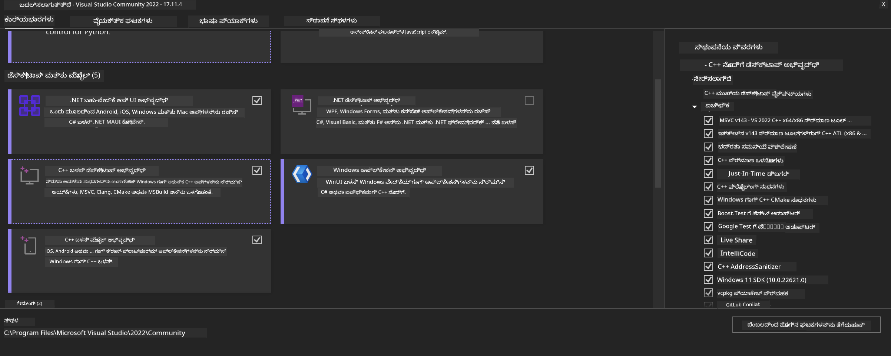
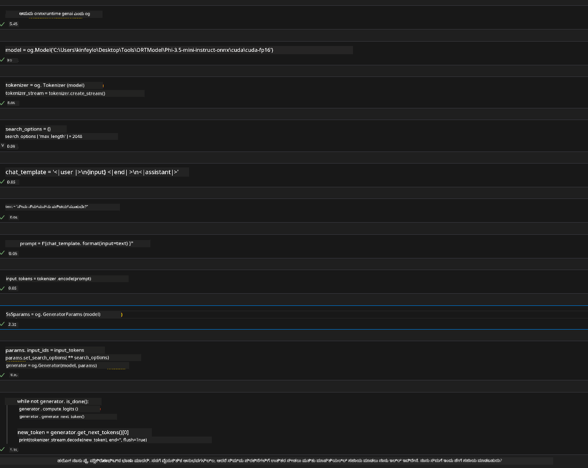
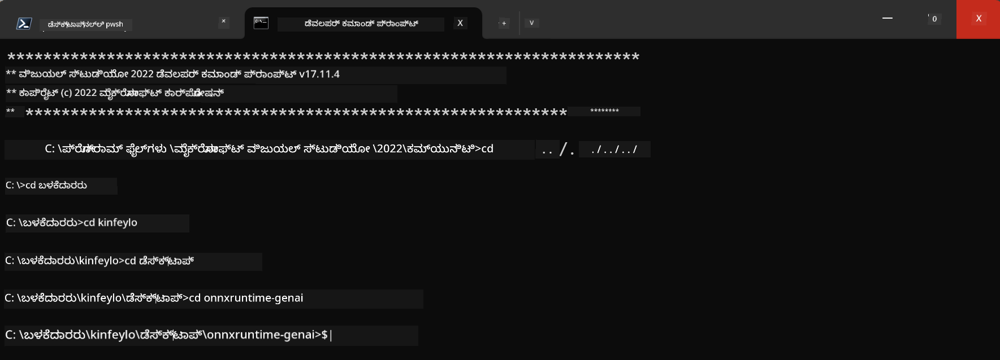

<!--
CO_OP_TRANSLATOR_METADATA:
{
  "original_hash": "b066fc29c1b2129df84e027cb75119ce",
  "translation_date": "2025-12-21T21:10:32+00:00",
  "source_file": "md/02.Application/01.TextAndChat/Phi3/ORTWindowGPUGuideline.md",
  "language_code": "kn"
}
-->
# **OnnxRuntime GenAI  Windows GPU ಗಾಗಿ ಮಾರ್ಗಸೂಚಿ**

ಈ ಮಾರ್ಗಸೂಚಿ Windows ನಲ್ಲಿ GPU ಗಳೊಂದಿಗೆ ONNX Runtime (ORT) ಅನ್ನು ಸೆಟ್ ಅಪ್ ಮತ್ತು ಬಳಸುವುದಕ್ಕೆ ಬೇಕಾದ ಹಂತಗಳನ್ನು ನೀಡುತ್ತದೆ. ಇದು ನಿಮ್ಮ ಮಾದರಿಗಳಿಗಾಗಿ GPU ವೇಗೋನ್ನತಿ ಬಳಸಿಕೊಂಡು ಕಾರ್ಯಕ್ಷಮತೆ ಮತ್ತು ದಕ್ಷತೆಯನ್ನು ಸುಧಾರಿಸಲು ನಿಮಗೆ ಸಹಾಯ ಮಾಡುವಂತೆ ವಿನ್ಯಾಸಗೊಳಿಸಲಾಗಿದೆ.

ಈ ಡಾಕ್ಯುಮೆಂಟ್ ಕೆಳಕಂಡದ ಮೇಲೆ ಮಾರ್ಗದರ್ಶನ ನೀಡುತ್ತದೆ:

- Environment Setup: CUDA, cuDNN ಮತ್ತು ONNX Runtime ಇತ್ಯಾದಿ ಅಗತ್ಯ_dependencie_ಗಳನ್ನು ಇನ್ಸ್ಟಾಲ್ ಮಾಡುವ ಸೂಚನೆಗಳು.
- Configuration: ಪರಿಸರ ಮತ್ತು ONNX Runtime ಅನ್ನು GPU ಸಂಸಾಧನಗಳನ್ನು ಪರಿಣಾಮಕಾರಿಯಾಗಿ ಬಳಸುವುದಕ್ಕಾಗಿ ಸಂರಚಿಸುವ ವಿಧಾನ.
- Optimization Tips: ಆಪ್ಟಿಮಲ್ ಪ್ರದರ್ಶನಕ್ಕಾಗಿ ನಿಮ್ಮ GPU ಸೆಟ್ಟಿಂಗ್‌ಗಳನ್ನು ಫೈನ್‑ಟ್ಯೂನ್ ಮಾಡುವ ಕುರಿತು ಸಲಹೆಗಳು.

### **1. Python 3.10.x /3.11.8**

   ***ಗಮನಿಸಿ*** [miniforge](https://github.com/conda-forge/miniforge/releases/latest/download/Miniforge3-Windows-x86_64.exe) ಅನ್ನು ನಿಮ್ಮ Python ಪರಿಸರವಾಗಿ ಬಳಸಲು ಶಿಫಾರಸು ಮಾಡಲಾಗುವುದೆಂದು ಸೂಚಿಸಲಾಗುತ್ತದೆ

   ```bash

   conda create -n pydev python==3.11.8

   conda activate pydev

   ```

   ***ಸ್ಮರಣೆ*** Python ONNX ಲೈಬ್ರರಿಗೊಂದು ಸಂಬಂಧಿಸಿದ ಯಾವುದೇ ಪ್ಯಾಕೇಜ್ ಅನ್ನು ನೀವು ಸ್ಥಾಪಿಸಿದ್ದರೆ, ದಯವಿಟ್ಟು ಅದನ್ನು ಅನ್‌ಇನ್ಸ್ಟಾಲ್ ಮಾಡಿ

### **2. Install CMake with winget**


   ```bash

   winget install -e --id Kitware.CMake

   ```

### **3. Install Visual Studio 2022 - Desktop Development with C++**

   ***ಗಮನಿಸಿ*** ನೀವು ಸಂಯೋಜಿಸಲು ಇಚ್ಛಿಸದಿದ್ದರೆ ಈ ಹಂತವನ್ನು ಬಿಡಬಹುದು




### **4. Install NVIDIA Driver**

1. **NVIDIA GPU Driver**  [https://www.nvidia.com/en-us/drivers/](https://www.nvidia.com/en-us/drivers/)

2. **NVIDIA CUDA 12.4** [https://developer.nvidia.com/cuda-12-4-0-download-archive](https://developer.nvidia.com/cuda-12-4-0-download-archive)

3. **NVIDIA CUDNN 9.4**  [https://developer.nvidia.com/cudnn-downloads](https://developer.nvidia.com/cudnn-downloads)

***ಸ್ಮರಣೆ*** ದಯವಿಟ್ಟು ಇನ್ಸ್ಟಲೇಶನ್ ಪ್ರಕ್ರಿಯೆಯಲ್ಲಿ ಡೀಫಾಲ್ಟ್ ಸೆಟ್ಟಿಂಗ್‌ಗಳನ್ನು ಬಳಸಿ 

### **5. Set NVIDIA Env**

NVIDIA CUDNN 9.4 ನ lib, bin, include ಫೈಲ್‌ಗಳನ್ನು NVIDIA CUDA 12.4 ನ lib, bin, include ಗೆ ನಕಲಿಸಿ

- ನಕಲು ಮಾಡಿ *'C:\Program Files\NVIDIA\CUDNN\v9.4\bin\12.6'* ಫೈಲ್‌ಗಳನ್ನು  *'C:\Program Files\NVIDIA GPU Computing Toolkit\CUDA\v12.4\bin'* ಗೆ

- ನಕಲು ಮಾಡಿ *'C:\Program Files\NVIDIA\CUDNN\v9.4\include\12.6'* ಫೈಲ್‌ಗಳನ್ನು  *'C:\Program Files\NVIDIA GPU Computing Toolkit\CUDA\v12.4\include'* ಗೆ

- ನಕಲು ಮಾಡಿ *'C:\Program Files\NVIDIA\CUDNN\v9.4\lib\12.6'* ಫೈಲ್‌ಗಳನ್ನು  *'C:\Program Files\NVIDIA GPU Computing Toolkit\CUDA\v12.4\lib\x64'* ಗೆ


### **6. Download Phi-3.5-mini-instruct-onnx**


   ```bash

   winget install -e --id Git.Git

   winget install -e --id GitHub.GitLFS

   git lfs install

   git clone https://huggingface.co/microsoft/Phi-3.5-mini-instruct-onnx

   ```

### **7. Runing InferencePhi35Instruct.ipynb**

   [ನೋಟ್‌ಬುಕ್](../../../../code/09.UpdateSamples/Aug/ortgpu-phi35-instruct.ipynb) ಅನ್ನು ತೆರೆಯಿ ಮತ್ತು ನಿರ್ವಹಿಸಿ





### **8. Compile ORT GenAI GPU**


   ***ಗಮನಿಸಿ*** 
   
   1. ದಯವಿಟ್ಟು ಮೊದಲು onnx ಮತ್ತು onnxruntime ಮತ್ತು onnxruntime-genai ಸಂಬಂಧಿಸಿದ ಎಲ್ಲಾ ಪ್ಯಾಕೇಜ್‌ಗಳನ್ನು ಅನ್‌ಇನ್ಸ್ಟಾಲ್ ಮಾಡಿ

   
   ```bash

   pip list 
   
   ```

   ನಂತರ ಎಲ್ಲಾ onnxruntime ಲೈಬ್ರರಿ‌ಗಳನ್ನು ಅನ್‌ಇನ್ಸ್ಟಾಲ್ ಮಾಡಿ ಉದಾಹರಣೆಗೆ


   ```bash

   pip uninstall onnxruntime

   pip uninstall onnxruntime-genai

   pip uninstall onnxruntume-genai-cuda
   
   ```

   2. Visual Studio ವಿಸ್ತರಣಾ ಬೆಂಬಲವನ್ನು ಪರಿಶೀಲಿಸಿ 

   ಪರಿಶೀಲಿಸಿ C:\Program Files\NVIDIA GPU Computing Toolkit\CUDA\v12.4\extras ನಲ್ಲಿ C:\Program Files\NVIDIA GPU Computing Toolkit\CUDA\v12.4\extras\visual_studio_integration ಅನ್ನು ಕಂಡುಬರುತ್ತದೆ ಎಂಬುದನ್ನು. 
   
   ಕಂಡುಬರದಿದ್ದರೆ ಇತರ Cuda toolkit ಡ್ರೈವರ್ ಫೋಲ್ಡರ್‌ಗಳನ್ನು ಪರಿಶೀಲಿಸಿ ಮತ್ತು visual_studio_integration ಫೋಲ್ಡರ್ ಮತ್ತು ಅದರ ವಿಷಯವನ್ನು C:\Program Files\NVIDIA GPU Computing Toolkit\CUDA\v12.4\extras\visual_studio_integration ಗೆ ನಕಲಿಸಿ


   - ನೀವು ಸಂಯೋಜಿಸಲು ಇಚ್ಛಿಸದಿದ್ದರೆ ಈ ಹಂತವನ್ನು ಬಿಡಬಹುದು


   ```bash

   git clone https://github.com/microsoft/onnxruntime-genai

   ```

   - ಡೌನ್‌ಲೋಡ್ ಮಾಡಿ [https://github.com/microsoft/onnxruntime/releases/download/v1.19.2/onnxruntime-win-x64-gpu-1.19.2.zip](https://github.com/microsoft/onnxruntime/releases/download/v1.19.2/onnxruntime-win-x64-gpu-1.19.2.zip)

   - onnxruntime-win-x64-gpu-1.19.2.zip ಅನ್ನು ಅನ್ಜಿಪ್ ಮಾಡಿ, ಮತ್ತು ಅದನ್ನು **ort** ಎಂದು ಮರುನಾಮಕರಿಸಿ, ort ಫೋಲ್ಡರ್ ಅನ್ನು onnxruntime-genai ಗೆ ನಕಲಿಸಿ

   - Windows Terminal ಅನ್ನು ಬಳಸಿಕೊಂಡು, VS 2022 ಗಾಗಿ Developer Command Prompt ಗೆ ಹೋಗಿ ಮತ್ತು onnxruntime-genai ಗೆ ಹೋಗಿ



   - ನಿಮ್ಮ python ಪರಿಸರದೊಂದಿಗೆ ಅದನ್ನು ಕಂಪೈಲ್ ಮಾಡಿ

   
   ```bash

   cd onnxruntime-genai

   python build.py --use_cuda  --cuda_home "C:\Program Files\NVIDIA GPU Computing Toolkit\CUDA\v12.4" --config Release
 

   cd build/Windows/Release/Wheel

   pip install .whl

   ```

---

<!-- CO-OP TRANSLATOR DISCLAIMER START -->
ಅಸ್ವೀಕರಣ:
ಈ ದಾಖಲೆ AI ಭಾಷಾಂತರ ಸೇವೆ [Co-op Translator](https://github.com/Azure/co-op-translator) ಬಳಸಿಕೊಂಡು ಭಾಷಾಂತರಿಸಲಾಗಿದೆ. ನಾವು ನಿಖರತೆಯನ್ನು ಒದಗಿಸಲು ಪ್ರಯತ್ನಿಸಿದರೂ, ಸ್ವಯಂಚಾಲಿತ ಭಾಷಾಂತರಗಳಲ್ಲಿ ತಪ್ಪುಗಳು ಅಥವಾ ಅಸಮಂಜಸತೆಗಳು ಇರಬಹುದೆಂದು ದಯವಿಟ್ಟು ಗಮನಿಸಿ. ಮೂಲ ಭಾಷೆಯಲ್ಲಿರುವ ಮೂಲ ದಾಖಲೆ ಅನ್ನು ಅಧಿಕೃತ ಮೂಲವೆಂದು ಪರಿಗಣಿಸಬೇಕು. ಗಂಭೀರ ಅಥವಾ ಮಹತ್ವದ ಮಾಹಿತಿಗಾಗಿ ವೃತ್ತಿಪರ ಮಾನವ ಭಾಷಾಂತರವನ್ನು ಶಿಫಾರಸು ಮಾಡಲಾಗುತ್ತದೆ. ಈ ಭಾಷಾಂತರವನ್ನು ಬಳಸಿದ ಕಾರಣ ಉಂಟಾದ ಯಾವುದೇ ಅಸಮಂಜಸತೆಗಳಿಗೂ ಅಥವಾ ತಪ್ಪು ವ್ಯಾಖ್ಯಾನಗಳಿಗೆ ನಾವು ಹೊಣೆಗಾರರಲ್ಲ.
<!-- CO-OP TRANSLATOR DISCLAIMER END -->