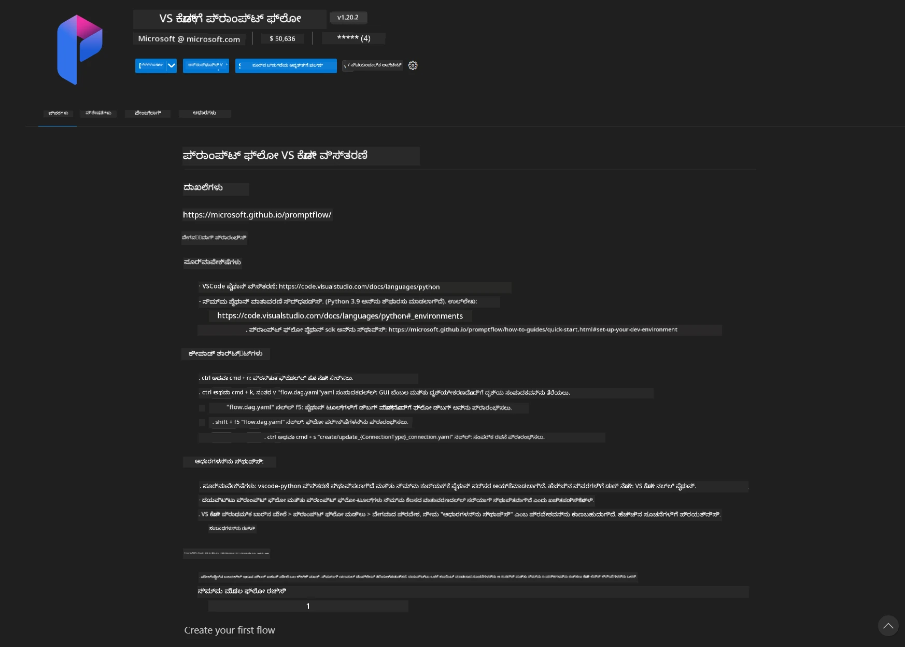
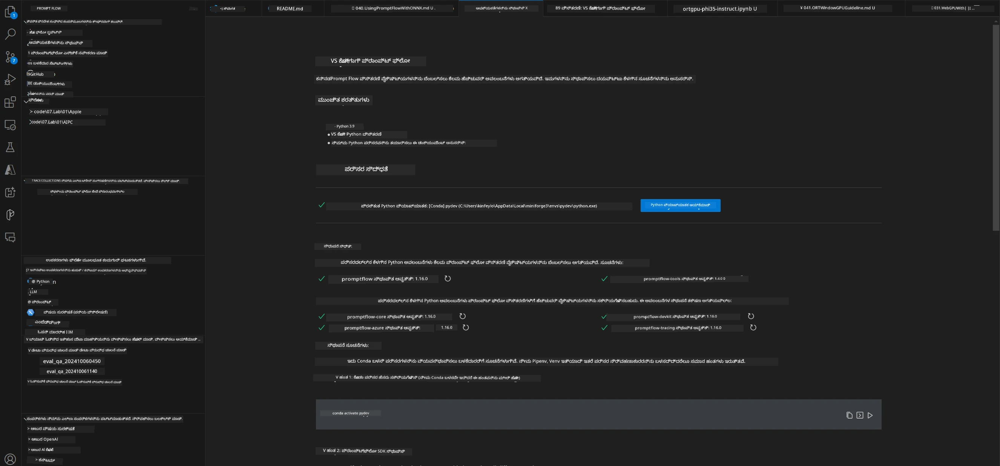
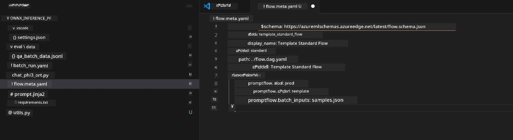
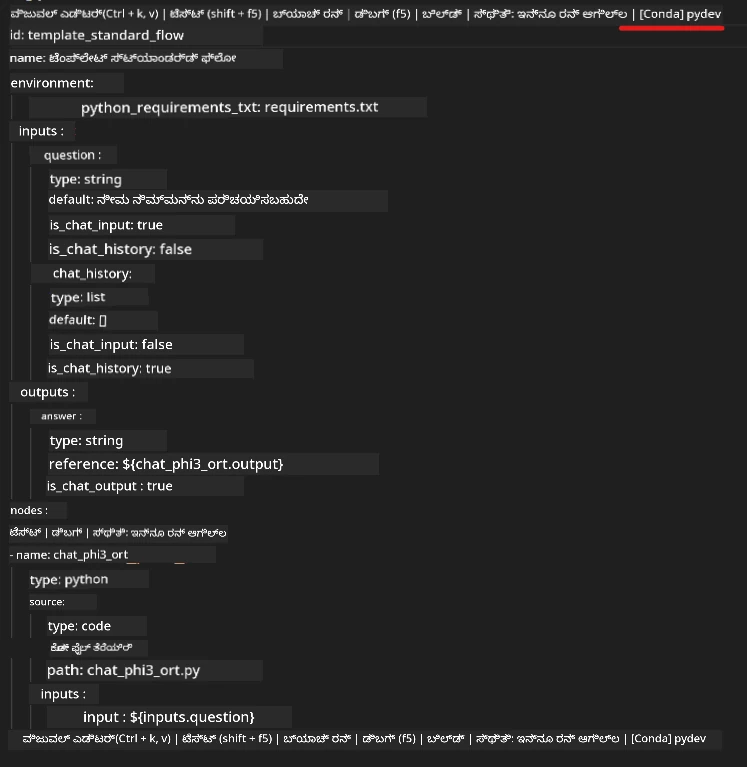
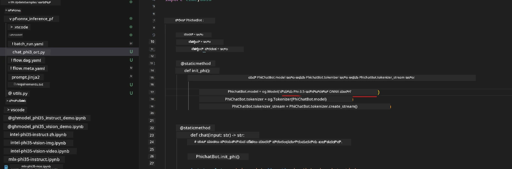
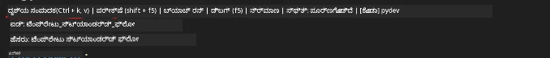
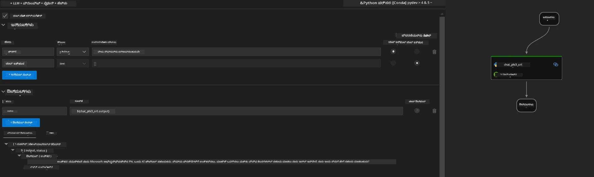
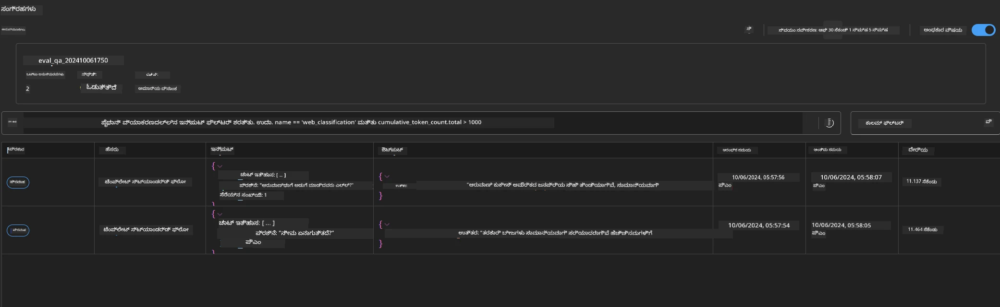

# Windows GPU ಬಳಸಿ Phi-3.5-Instruct ONNX ಜೊತೆ Prompt flow ಪರಿಹಾರವನ್ನು ರಚಿಸುವುದು

ಕೆಳಗಿನ ದಾಖಲೆವು Phi-3 ಮಾದರಿಗಳ ಆಧಾರಿತ AI ಅಪ್ಲಿಕೇಶನಗಳನ್ನು ಅಭಿವೃದ್ಧಿಪಡಿಸಲು ONNX (Open Neural Network Exchange) ನೊಂದಿಗೆ PromptFlow ಅನ್ನು ಹೇಗೆ ಬಳಸುವುದೆಂಬ ಉದಾಹರಣೆ ಆಗಿದೆ.

PromptFlow ಎನ್ನುವುದು ಐಡಿಯೇಷನ್ ಮತ್ತು ಪ್ರೋಟೋಟೈಪಿಂಗ್‌ನಿಂದ ಪರೀಕ್ಷೆ ಮತ್ತು ಮೌಲ್ಯಮಾಪನದವರೆಗೆ LLM ಆಧಾರಿತ (Large Language Model) AI ಅಪ್ಲಿಕೇಶನಗಳ ಎಂಡ್-ಟು-ಎಂಡ್ ಅಭಿವೃದ್ಧಿ ಚಕ್ರವನ್ನು ಸರಳಗೊಳಿಸಲು ರಚಿಸಲಾದ ಅಭಿವೃದ್ಧಿ ಸಾಧನಗಳ ಸಮೂಹವಾಗಿದೆ.

PromptFlow ಅನ್ನು ONNX ಜೊತೆಗೆ ಸಂಯೋಜಿಸುವ ಮೂಲಕ ಡೆವಲಪರ್ ಗಳು:

- ಮಾದರಿ ಕಾರ್ಯಕ್ಷಮತೆಯನ್ನು ಆಪ್ಟಿಮೈಸ್ ಮಾಡಿ: ಪರಿಣಾಮಕಾರಿ ಮಾದರಿ ಇನ್ಫರೆನ್ಸ್ ಮತ್ತು ನಿಯೋಜನೆಗಾಗಿ ONNX ಅನ್ನು ಉಪಯೋಗಿಸಿ.
- ಅಭಿವೃದ್ಧಿಯನ್ನು ಸರಳಗೊಳಿಸಿ: ವರ್ಕ್‌ಫ್ಲೋ ಅನ್ನು ನಿರ್ವಹಿಸಲು ಮತ್ತು ಪುನರಾವರ್ತಿತ ಕಾರ್ಯಗಳನ್ನು ಸ್ವಯಂಚಾಲಿತಗೊಳಿಸಲು PromptFlow ಅನ್ನು ಬಳಸಿ.
- ಸಹಕಾರವನ್ನು ಹೆಚ್ಚಿಸಿ: ಏಕೀಕೃತ ಅಭಿವೃದ್ಧಿ ಪರಿಸರವನ್ನು ಒದಗಿಸುವ ಮೂಲಕ ತಂಡದ ಸದಸ್ಯರ మధ్య ಉತ್ತಮ ಸಹಕಾರವನ್ನು ಸುಗಮಗೊಳಿಸಿ.

**Prompt flow** ಎಂಬುದು ಐಡಿಯೇಷನ್, ಪ್ರೋಟೋಟೈಪಿಂಗ್, ಪರೀಕ್ಷೆ, ಮೌಲ್ಯಮಾಪನದಿಂದ ಉತ್ಪಾದನೆಗೆ ನಿಯೋಜನೆ ಮತ್ತು ಮಾನಿಟರಿಂಗ್ ವರೆಗೆ LLM ಆಧಾರಿತ AI ಅಪ್ಲಿಕೇಶನಗಳ ಎಂಡ್-ಟು-ಎಂಡ್ ಅಭಿವೃದ್ಧಿ ಚಕ್ರವನ್ನು ಸರಳಗೊಳಿಸಲು ರಚಿಸಲಾದ развити құралಗಳ ಸಮೂಹವಾಗಿದೆ. ಇದು ಪ್ರಾಂಪ್ಟ್ ಎಂಜಿನಿಯರಿಂಗ್ ಅನ್ನು ಬಹಳ ಸುಲಭಗೊಳಿಸುತ್ತದೆ ಮತ್ತು ನಿಮಗೆ ಉತ್ಪಾದನಾ ಗುಣಮಟ್ಟದ LLM ಅಪ್ಲಿಕೇಶನಗಳನ್ನು ನಿರ್ಮಿಸಲು ಸಹಾಯ ಮಾಡುತ್ತದೆ.

Prompt flow OpenAI, Azure OpenAI Service, ಮತ್ತು ಕಸ್ಟಮೈಸ್ ಮಾಡಬಹುದಾದ ಮಾದರಿಗಳನ್ನು (Huggingface, local LLM/SLM) ಸಂಪರ್ಕಿಸಬಹುದು. ನಾವು Phi-3.5 の quantized ONNX ಮಾದರಿಯನ್ನು ಸ್ಥಳೀಯ ಅಪ್ಲಿಕೇಶನ್ ಗಳಿಗೆ ನಿಯೋಜಿಸಲು ನಿರೀಕ್ಷಿಸುತ್ತೇವೆ. Prompt flow ನಮಗೆ ನಮ್ಮ ವ್ಯವಹಾರವನ್ನು ಉತ್ತಮವಾಗಿ ಯೋಜಿಸಲು ಮತ್ತು Phi-3.5 ಆಧಾರಿತ ಸ್ಥಳೀಯ ಪರಿಹಾರಗಳನ್ನು ಪೂರ್ಣಗೊಳಿಸಲು ಸಹಾಯ ಮಾಡಬಹುದು. ಈ ಉದಾಹರಣೆಯಲ್ಲಿ, ನಾವು Windows GPU ಆಧಾರಿತ Prompt flow ಪರಿಹಾರವನ್ನು ಪೂರ್ಣಗೊಳಿಸಲು ONNX Runtime GenAI ಲೈಬ್ರರಿಯನ್ನು ಸಂಯೋಜಿಸುತ್ತೇವೆ.

## **ಸ್ಥಾಪನೆ**

### **Windows GPU ಗಾಗಿ ONNX Runtime GenAI**

Windows GPU ಗಾಗಿ ONNX Runtime GenAI ಅನ್ನು ಸೆಟ್ ಮಾಡಲು ಈ ಮಾರ್ಗದರ್ಶನವನ್ನು ಓದಿ [ಇಲ್ಲಿ ಕ್ಲಿಕ್ ಮಾಡಿ](./ORTWindowGPUGuideline.md)

### **VSCode ನಲ್ಲಿ Prompt flow ಅನ್ನು ಸಜ್ಜುಗೊಳಿಸುವುದು**

1. Prompt flow VS Code ವಿಸ್ತರಣೆಯನ್ನು ಸ್ಥಾಪಿಸಿ



2. Prompt flow VS Code ವಿಸ್ತರಣೆ ಸ್ಥಾಪಿಸಿದ ನಂತರ, ವಿಸ್ತರಣೆಯ ಮೇಲೆ ಕ್ಲಿಕ್ ಮಾಡಿ ಮತ್ತು **Installation dependencies** ಅನ್ನು ಆಯ್ಕೆ ಮಾಡಿ. ನಿಮ್ಮ env ನಲ್ಲಿ Prompt flow SDK ಅನ್ನು ಸ್ಥಾಪಿಸಲು ಈ ಮಾರ್ಗದರ್ಶನವನ್ನು ಅನುಸರಿಸಿ



3. [ಸ್ಯಾಂಪಲ್ ಕೋಡ್](../../../../../../code/09.UpdateSamples/Aug/pf/onnx_inference_pf) ಅನ್ನು ಡೌನ್‌ಲೋಡ್ ಮಾಡಿ ಮತ್ತು ಈ ಉದಾಹರಣೆಯನ್ನು ತೆರೆಯಲು VS Code ಅನ್ನು ಬಳಸಿ



4. ನಿಮ್ಮ Python env ಆಯ್ಕೆ ಮಾಡಲು **flow.dag.yaml** ತೆರೆಯಿರಿ



   **chat_phi3_ort.py** ತೆರೆಯಿರಿ ಮತ್ತು ನಿಮ್ಮ Phi-3.5-instruct ONNX ಮಾದರಿಯ ಸ್ಥಳವನ್ನು ಬದಲಿಸಿ



5. ನಿಮ್ಮ prompt flow ಅನ್ನು ಪರೀಕ್ಷಿಸಲು ಚಲಾಯಿಸಿ

Open **flow.dag.yaml** click visual editor



ಇದನ್ನು ಕ್ಲಿಕ್ ಮಾಡಿದ ನಂತರ, ಪರೀಕ್ಷಿಸಲು ಅದನ್ನು ಚಾಲನೆ ಮಾಡಿ



1. ಹೆಚ್ಚಿನ ಫಲಿತಾಂಶಗಳನ್ನು ಪರಿಶೀಲಿಸಲು ನೀವು ಟರ್ಮಿನಲ್‌ನಲ್ಲಿ ಬ್ಯಾಚ್ ಅನ್ನು ಚಾಲನೆ ಮಾಡಬಹುದು


```bash

pf run create --file batch_run.yaml --stream --name 'Your eval qa name'    

```

ನೀವು ನಿಮ್ಮ ಡೀಫಾಲ್ಟ್ ಬ್ರೌಸರ್‌ನಲ್ಲಿ ಫಲಿತಾಂಶಗಳನ್ನು ಪರಿಶೀಲಿಸಬಹುದು




---

<!-- CO-OP TRANSLATOR DISCLAIMER START -->
ಅಸ್ವೀಕರಣ:
ಈ ದಾಖಲೆ AI ಅನುವಾದ ಸೇವೆ Co-op Translator (https://github.com/Azure/co-op-translator) ಬಳಸಿ ಅನುವಾದಿಸಲಾಗಿದೆ. ನಾವು ನಿಖರತೆಯನ್ನು ಸಾಧಿಸಲು ಪ್ರಯತ್ನಿಸಿದರೂ, ದಯವಿಟ್ಟು ಗಮನಿಸಿ — ಸ್ವಯಂಚಾಲಿತ ಅನುವಾದಗಳಲ್ಲಿ ತಪ್ಪುಗಳು ಅಥವಾ ಅಸತ್ಯತೆಗಳು ಇರಬಹುದು. ಮೂಲ ದಾಖಲೆ ಅದರ ಮೂಲ ಭಾಷೆಯಲ್ಲಿ ಅಧಿಕೃತ ಮೂಲವೆಂದು ಪರಿಗಣಿಸಬೇಕು. ಗಂಭೀರ ಮಾಹಿತಿಗಾಗಿ ವೃತ್ತಿಪರ ಮಾನವ ಅನುವಾದವನ್ನು ಶಿಫಾರಸು ಮಾಡಲಾಗುತ್ತದೆ. ಈ ಅನುವಾದದ ಬಳಕೆಯಿಂದ ಉಂಟಾಗುವ ಯಾವುದೇ ತಪ್ಪು ಗ್ರಹಿಕೆಗಳು ಅಥವಾ ತಪ್ಪು ವ್ಯಾಖ್ಯಾನಗಳಿಗಾಗಿ ನಾವು ಹೊಣೆಗಾರರಲ್ಲ.
<!-- CO-OP TRANSLATOR DISCLAIMER END -->