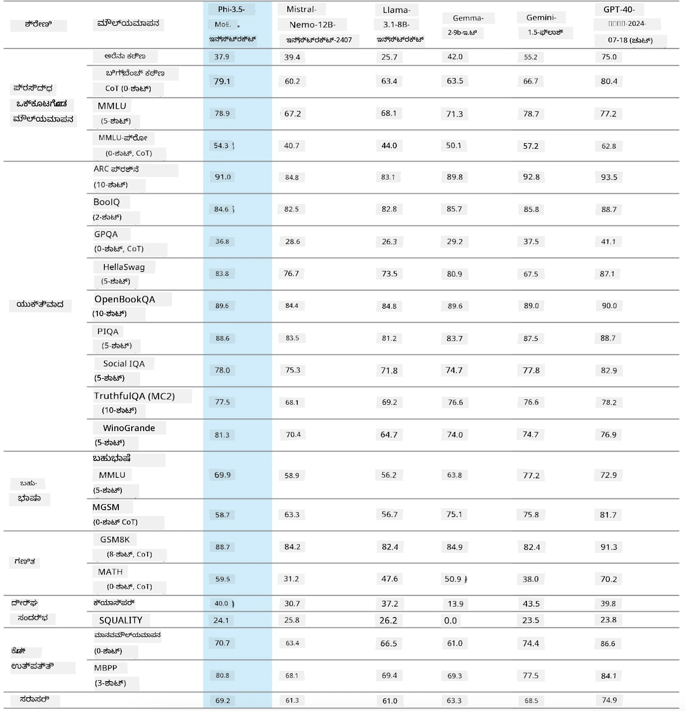
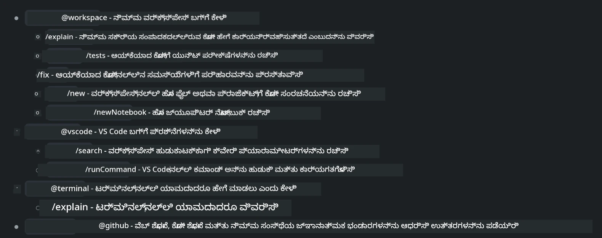
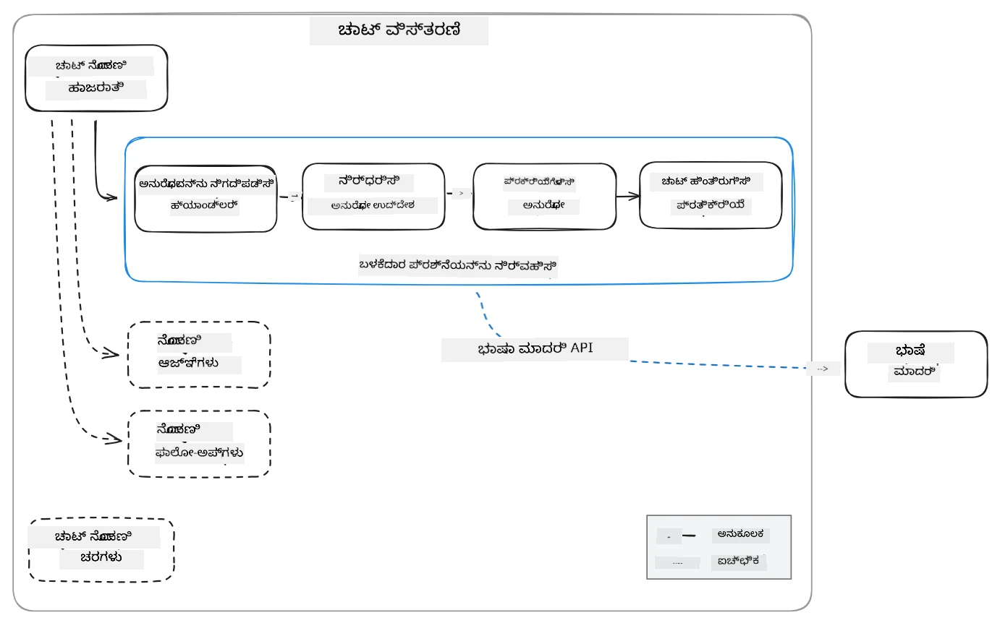
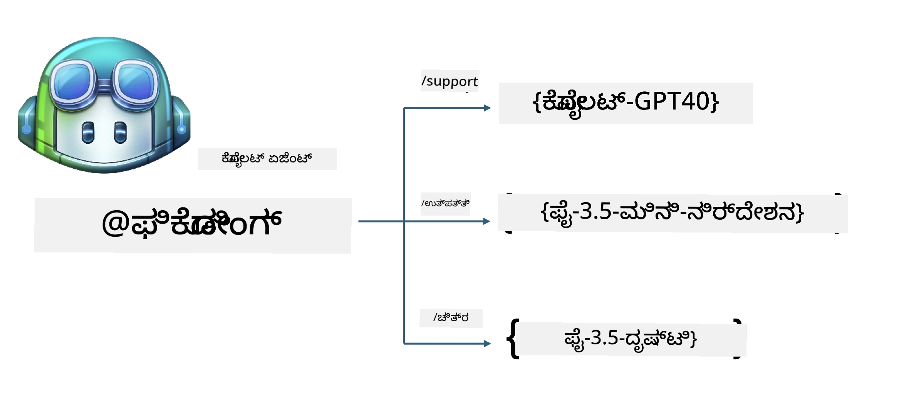
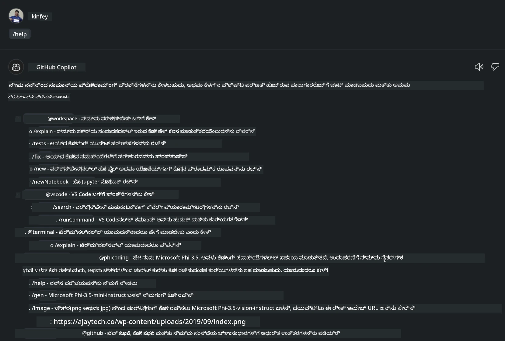
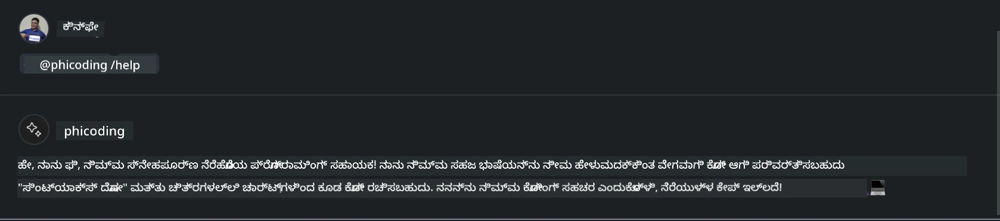
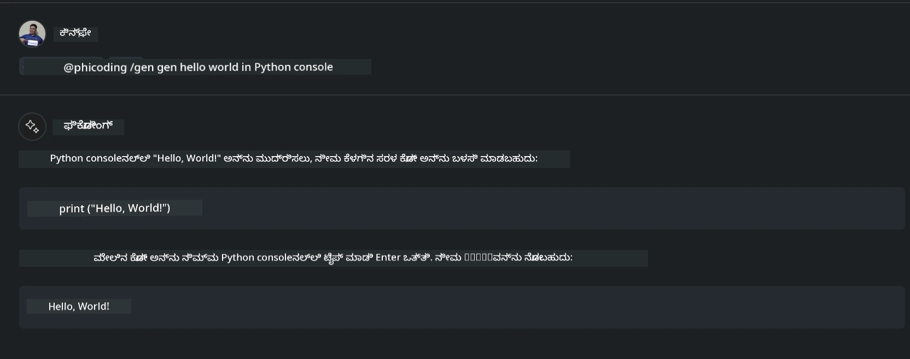
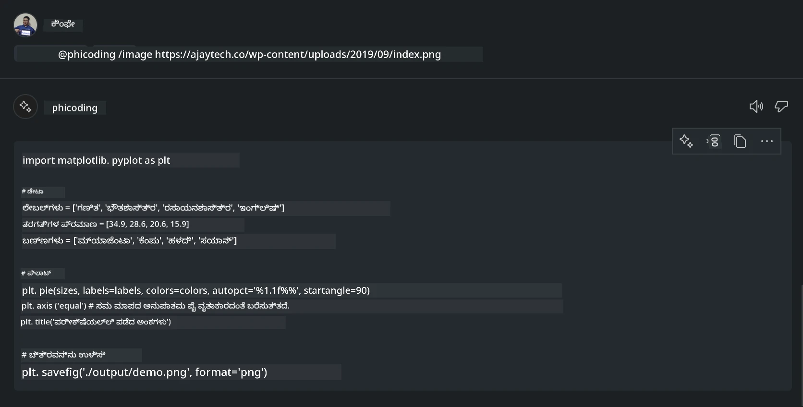

# **GitHub Models ಮೂಲಕ Phi-3.5 ಬಳಸಿಕೊಂಡು ನಿಮ್ಮದೇ Visual Studio Code Chat Copilot ಏಜೆಂಟ್ ರಚಿಸಿ**

ನೀವು Visual Studio Code Copilot ಅನ್ನು ಬಳಸುತ್ತೀರಾ? ವಿಶೇಷವಾಗಿ Chat ನಲ್ಲಿ, ನಿಮ್ಮ Visual Studio Code ಯೋಜನೆಗಳನ್ನು ರಚಿಸುವುದು, ಬರೆಯುವುದು ಮತ್ತು ನಿರ್ವಹಿಸುವ ಸಾಮರ್ಥ್ಯವನ್ನು ಸುಧಾರಿಸಲು ವಿಭಿನ್ನ ಏಜೆಂಟ್‌ಗಳನ್ನು ಬಳಸಬಹುದು. Visual Studio Code ಕಂಪನಿಗಳು ಮತ್ತು ವ್ಯಕ್ತಿಗಳು ತಮ್ಮ ವ್ಯಾಪಾರ ಆಧಾರಿತ ವಿಭಿನ್ನ ವೈಯಕ್ತಿಕ ಕ್ಷೇತ್ರಗಳಲ್ಲಿ ಸಾಮರ್ಥ್ಯವನ್ನು ವಿಸ್ತರಿಸಲು ವಿಭಿನ್ನ ಏಜೆಂಟ್‌ಗಳನ್ನು ರಚಿಸಲು ಅನುಮತಿಸುವ API ಅನ್ನು ಒದಗಿಸುತ್ತದೆ. ಈ ಲೇಖನದಲ್ಲಿ, ನಾವು GitHub Models ನ **Phi-3.5-mini-instruct (128k)** ಮತ್ತು **Phi-3.5-vision-instruct (128k)** ಗಳೆ ಆಧರಿಸಿದ ನಿಮ್ಮದೇ Visual Studio Code ಏಜೆಂಟ್ ರಚಿಸುವದನ್ನು ಕೇಂದ್ರೀಯಗೊಳಿಸುತ್ತೇವೆ.

## **GitHub Models上的 Phi-3.5 ಕುರಿತು**

Phi-3/3.5 ಫ್ಯಾಮಿಲಿಯಲ್ಲಿರುವ Phi-3/3.5-mini-instruct ಗೆ ಕೋಡ್ ಅರ್ಥಮಾಡಿಕೊಳ್ಳುವುದು ಮತ್ತು ಜನರೇಷನ್ ಸಾಮರ್ಥ್ಯದಲ್ಲಿ ಶಕ್ತಿಯಿದೆ ಎಂದು ನಾವು ತಿಳಿದಿದ್ದೇವೆ, ಮತ್ತು ಅದು Gemma-2-9b ಮತ್ತು Mistral-Nemo-12B-instruct-2407 шақಿಂತ ಉತ್ತಮವಾಗಿದೆ.



ಇತ್ತೀಚಿನ GitHub Models ಈಗ Phi-3.5-mini-instruct (128k) ಮತ್ತು Phi-3.5-vision-instruct (128k) ಮಾಡೆಲ್ಗಳಿಗೆ ಪ್ರವೇಶವನ್ನು ಒದಗಿಸುತ್ತವೆ. ಡೆವಲಪರ್‌ಗಳು ಅವುಗಳನ್ನು OpenAI SDK, Azure AI Inference SDK, ಮತ್ತು REST API ಮೂಲಕ ಪ್ರಾಪ್ತಿಸಬಲ್ಲರು.


***Note: ***production ಪರಿಸರದಲ್ಲಿ Azure Model Catalog ಜೊತೆಗೆ ಉತ್ತಮವಾಗಿ ಸ್ವಿಚ್ ಮಾಡಲು ಹಲವಾರು ಕಾರಣಗಳಿಂದ ಇಲ್ಲಿ Azure AI Inference SDK ಬಳಸುವುದು ಶಿಫಾರಸು ಮಾಡಲಾಗಿದೆ

ಕೆಳಗಿನವುಗಳೆ GitHub Models ಜೊತೆಗೆ ಡೋಕಿಂಗ್ ಮಾಡಿದ ನಂತರ ಕೋಡ್ ಜನರೇಷನ್ ದೃಶ್ಯದಲ್ಲಿ **Phi-3.5-mini-instruct (128k)** ಮತ್ತು **Phi-3.5-vision-instruct (128k)** ರ ಫಲಿತಾಂಶಗಳಾಗಿವೆ, ಮತ್ತು ಕೆಳಗಿನ ಉದಾಹರಣೆಗಳಿಗೆ ಪೂರ್ವಸಿದ್ಧತೆಯನ್ನೂ ಒದಗಿಸುತ್ತವೆ

**Demo: GitHub Models Phi-3.5-mini-instruct (128k) Prompt ನಿಂದ ಕೋಡ್ ರಚನೆ** ([ಈ ಲಿಂಕ್ ಮೇಲೆ ಕ್ಲಿಕ್ ಮಾಡಿ](../../../../code/09.UpdateSamples/Aug/ghmodel_phi35_instruct_demo.ipynb))

**Demo: GitHub Models Phi-3.5-vision-instruct (128k) ಚಿತ್ರದಿಂದ ಕೋಡ್ ರಚನೆ** ([ಈ ಲಿಂಕ್ ಮೇಲೆ ಕ್ಲಿಕ್ ಮಾಡಿ](../../../../code/09.UpdateSamples/Aug/ghmodel_phi35_vision_demo.ipynb))


## **GitHub Copilot Chat Agent ಬಗ್ಗೆ**

GitHub Copilot Chat Agent ಕೋಡ್ ಆಧಾರಿತ ವಿಭಿನ್ನ ಪ್ರಾಜೆಕ್ಟ್ ದೃಶ್ಯಗಳಲ್ಲಿ ವಿವಿಧ ಕಾರ್ಯಗಳನ್ನು ಪೂರ್ಣಗೊಳಿಸಬಹುದು. ಸಿಸ್ಟಂಗಳಲ್ಲಿ ನಾಲ್ಕು ಏಜೆಂಟ್‌ಗಳಿವೆ: workspace, github, terminal, vscode



ಏಜೆಂಟ್‌ನ ಹೆಸರನ್ನು ‘@’ ಜೊತೆಗೆ ಸೇರಿಸುವ ಮೂಲಕ, ನೀವು ಸಂಬಂಧಿಸಿದ ಕೆಲಸವನ್ನು ವೇಗವಾಗಿ ಪೂರ್ಣಗೊಳಿಸಬಹುದು. ಉಧ್ಯಮಗಳಿಗಾಗಿ, ನೀವು ನಿಮ್ಮ ಸ್ವಂತ ವ್ಯವಹಾರ-ಸಂಬಂಧಿತ ವಿಷಯಗಳನ್ನು (ಅರ್ಹತೆಗಳು, ಕೋಡಿಂಗ್, ಪರೀಕ್ಷಾ ನಿರ್ದಿಷ್ಟತೆಗಳು, ಬಿಡುಗಡೆ ಇತ್ಯಾದಿ) ಸೇರಿಸಿದರೆ, GitHub Copilot ಆಧಾರಿತ 더욱 ಶಕ್ತಿಶಾಲಿ ಏಜೆಂಟ್‌ಗಳನ್ನೂ ಹೊಂದಬಹುದು.

Visua Studio Code Chat Agent ಈಗ ಅಧಿಕೃತವಾಗಿ ಅದರ API ಅನ್ನು ಬಿಡುಗಡೆ ಮಾಡಿದೆ, ಇದು ಉಧ್ಯಮಗಳು ಅಥವಾ ಉಧ್ಯಮ ಡೆವಲಪರ್‌ಗಳಿಗೆ ವಿಭಿನ್ನ ಸಾಫ್ಟ್‌ವೇರ್ ವ್ಯವಹಾರ ಪರಿಸರಗಳ ಆಧಾರದ ಮೇಲೆ ಏಜೆಂಟ್‌ಗಳನ್ನು ಅಭಿವೃದ್ಧಿಪಡಿಸಲು ಅನುಮತಿಸುತ್ತದೆ. Visual Studio Code Extension Development 的 ಅಭಿವೃದ್ಧಿ ವಿಧಾನವನ್ನು ಆಧರಿಸಿ, ನೀವು Visua Studio Code Chat Agent API ನ ಇಂಟರ್ಫೇಸ್ ಅನ್ನು ಸುಲಭವಾಗಿ ಪ್ರವೇಶಿಸಬಹುದು. ನಾವು ಈ ಪ್ರಕ್ರಿಯೆಯ ಆಧಾರದ ಮೇಲೆ ಅಭಿವೃದ್ಧಿ ಮಾಡಬಹುದು



ಈ ಅಭಿವೃದ್ಧಿ ದೃಶ್ಯವು ತೃತೀಯ-পಕ್ಷದ ಮಾಡೆಲ್ API ಗಳಿಗೆ (ಉದಾಹರಣೆಗಾಗಿ GitHub Models, Azure Model Catalog, ಮತ್ತು open source ಮಾಡೆಲ್ ಗಳ ಆಧಾರದ ಮೇಲೆ ಸ್ವಂತ ನಿರ್ಮಿತ ಸರ್ವಿಸ್‌ಗಳು) ಪ್ರವೇಶವನ್ನು ಬೆಂಬಲಿಸುತ್ತದೆ ಮತ್ತು GitHub Copilot ಒದಗಿಸುವ gpt-35-turbo, gpt-4, ಮತ್ತು gpt-4o ಮಾಡೆಲ್‌ಗಳನ್ನೂ ಬಳಸಬಹುದು.

## **Phi-3.5 ಆಧಾರಿತ @phicoding ಎಂಬ ಏಜೆಂಟ್ ಸೇರಿಸುವುದು**

ನಾವು Phi-3.5 ರ ಪ್ರೋಗ್ರಾಮಿಂಗ್ ಸಾಮರ್ಥ್ಯಗಳನ್ನು ಸಂಯೋಜಿಸಲು ಪ್ರಯತ್ನಿಸುತ್ತೇವೆ, ಕೋಡ್ ಬರೆಯುವುದು, ಚಿತ್ರ ಆಧಾರಿತ ಕೋಡ್ ಮತ್ತು ಇತರೆ ಕಾರ್ಯಗಳನ್ನು ಪೂರ್ಣಗೊಳಿಸಲು. Phi-3.5 ಸುತ್ತಲಿನ ಒಂದು ಏಜೆಂಟ್ — @PHI — ನಿರ್ಮಿಸುವುದನ್ನು ಪೂರ್ಣಗೊಳಿಸಿವೆ, ಕೆಳಗಿನವು ಕೆಲವು ಕಾರ್ಯಗಳು

1. GitHub Copilot ಒದಗಿಸುವ GPT-4o ಆಧಾರಿತವಾಗಿ **@phicoding /help** ಕಮಾಂಡ್ ಮೂಲಕ ಸ್ವ-ಪರಿಚಯವನ್ನು ರಚಿಸು

2. **Phi-3.5-mini-instruct (128k)** ಆಧಾರಿತವಾಗಿ ವಿವಿಧ ಪ್ರೋಗ್ರಾಮಿಂಗ್ ಭಾಷೆಗಳಿಗಾಗಿ ಕೋಡ್ ರಚಿಸುವುದನ್ನು **@phicoding /gen** ಕಮಾಂಡ್ ಮೂಲಕ ನೆರವೇರಿಸು

3. **Phi-3.5-vision-instruct (128k)** ಮತ್ತು ಚಿತ್ರ ಪೂರ್ಣಗೊಳಿಸುವಿಕೆಯ ಮೂಲಕ ಕೋಡ್ ರಚಿಸುವುದನ್ನು **@phicoding /image** ಕಮಾಂಡ್ ಮೂಲಕ ನೆರವೇರಿಸು



## **ಸಂಬಂಧಿತ ಹಂತಗಳು**

1. npm ಉಪಯೋಗಿಸಿ Visual Studio Code Extension development ಬೆಂಬಲವನ್ನು ಇನ್ಸ್ಟಾಲ್ ಮಾಡಿ

```bash

npm install --global yo generator-code 

```
2. Create a Visual Studio Code Extension plugin (using Typescript development mode, named phiext)


```bash

yo code 

```

3. ನಿರ್ಮಿಸಿದ ಪ್ರಾಜೆಕ್ಟ್ ಅನ್ನು ತೆರೆಯಿರಿ ಮತ್ತು package.json ಅನ್ನು ತಿದ್ದಿ. ಇಲ್ಲಿ ಸಂಬಂಧಿತ ಸೂಚನೆಗಳು ಮತ್ತು ಜೋಡಣಾ ಕಾಂಫಿಗರೇಷನ್‌ಗಳು以及GitHub Models ನ ಕಾನ್ಫಿಗರೇಶನ್ রয়েছে. ಗಮನಿಸಿ, ನೀವು ಇಲ್ಲಿ ನಿಮ್ಮ GitHub Models token ಅನ್ನು ಸೇರಿಸಬೇಕು.


```json

{
  "name": "phiext",
  "displayName": "phiext",
  "description": "",
  "version": "0.0.1",
  "engines": {
    "vscode": "^1.93.0"
  },
  "categories": [
    "AI",
    "Chat"
  ],
  "activationEvents": [],
  "enabledApiProposals": [
      "chatVariableResolver"
  ],
  "main": "./dist/extension.js",
  "contributes": {
    "chatParticipants": [
        {
            "id": "chat.phicoding",
            "name": "phicoding",
            "description": "Hey! I am Microsoft Phi-3.5, She can help me with coding problems, such as generation code with your natural language, or even generation code about chart from images. Just ask me anything!",
            "isSticky": true,
            "commands": [
                {
                    "name": "help",
                    "description": "Introduce myself to you"
                },
                {
                    "name": "gen",
                    "description": "Generate code for you with Microsoft Phi-3.5-mini-instruct"
                },
                {
                    "name": "image",
                    "description": "Generate code for chart from image(png or jpg) with Microsoft Phi-3.5-vision-instruct, please add image url like this : https://ajaytech.co/wp-content/uploads/2019/09/index.png"
                }
            ]
        }
    ],
    "commands": [
        {
            "command": "phicoding.namesInEditor",
            "title": "Use Microsoft Phi 3.5 in Editor"
        }
    ],
    "configuration": {
      "type": "object",
      "title": "githubmodels",
      "properties": {
        "githubmodels.endpoint": {
          "type": "string",
          "default": "https://models.inference.ai.azure.com",
          "description": "Your GitHub Models Endpoint",
          "order": 0
        },
        "githubmodels.api_key": {
          "type": "string",
          "default": "Your GitHub Models Token",
          "description": "Your GitHub Models Token",
          "order": 1
        },
        "githubmodels.phi35instruct": {
          "type": "string",
          "default": "Phi-3.5-mini-instruct",
          "description": "Your Phi-35-Instruct Model",
          "order": 2
        },
        "githubmodels.phi35vision": {
          "type": "string",
          "default": "Phi-3.5-vision-instruct",
          "description": "Your Phi-35-Vision Model",
          "order": 3
        }
      }
    }
  },
  "scripts": {
    "vscode:prepublish": "npm run package",
    "compile": "webpack",
    "watch": "webpack --watch",
    "package": "webpack --mode production --devtool hidden-source-map",
    "compile-tests": "tsc -p . --outDir out",
    "watch-tests": "tsc -p . -w --outDir out",
    "pretest": "npm run compile-tests && npm run compile && npm run lint",
    "lint": "eslint src",
    "test": "vscode-test"
  },
  "devDependencies": {
    "@types/vscode": "^1.93.0",
    "@types/mocha": "^10.0.7",
    "@types/node": "20.x",
    "@typescript-eslint/eslint-plugin": "^8.3.0",
    "@typescript-eslint/parser": "^8.3.0",
    "eslint": "^9.9.1",
    "typescript": "^5.5.4",
    "ts-loader": "^9.5.1",
    "webpack": "^5.94.0",
    "webpack-cli": "^5.1.4",
    "@vscode/test-cli": "^0.0.10",
    "@vscode/test-electron": "^2.4.1"
  },
  "dependencies": {
    "@types/node-fetch": "^2.6.11",
    "node-fetch": "^3.3.2",
    "@azure-rest/ai-inference": "latest",
    "@azure/core-auth": "latest",
    "@azure/core-sse": "latest"
  }
}


```

4. src/extension.ts ಅನ್ನು ತಿದ್ದುಪಡಿಮಾಡಿ


```typescript

// 'vscode' ಮಾಡ್ಯೂಲ್ VS Code ವಿಸ್ತರಣಾ API ಅನ್ನು ಒಳಗೊಂಡಿದೆ
// ಮಾಡ್ಯೂಲ್ ಅನ್ನು ಆಮದು ಮಾಡಿ ಮತ್ತು ಕೆಳಗಿನ ನಿಮ್ಮ ಕೋಡ್‌ನಲ್ಲಿ ಅದನ್ನು vscode ಎಂಬ ಉಪನಾಮದಿಂದ ಉಲ್ಲೇಖಿಸಿ
import * as vscode from 'vscode';
import ModelClient from "@azure-rest/ai-inference";
import { AzureKeyCredential } from "@azure/core-auth";


interface IPhiChatResult extends vscode.ChatResult {
    metadata: {
        command: string;
    };
}


const MODEL_SELECTOR: vscode.LanguageModelChatSelector = { vendor: 'copilot', family: 'gpt-4o' };

function isValidImageUrl(url: string): boolean {
    const regex = /^(https?:\/\/.*\.(?:png|jpg))$/i;
    return regex.test(url);
}
  

// ಈ ವಿಧಾನವನ್ನು ನಿಮ್ಮ ವಿಸ್ತರಣೆ ಸಕ್ರಿಯಗೊಳ್ಳುವಾಗ ಕರೆಲಾಗುತ್ತದೆ
// ನಿಮ್ಮ ವಿಸ್ತರಣೆ ಆ ಕಮಾಂಡ್ ಮೊದಲ ಬಾರಿಗೆ ನಿರ್ವಹಿಸಿದಾಗವೇ ಸಕ್ರಿಯಗೊಳ್ಳುತ್ತದೆ
export function activate(context: vscode.ExtensionContext) {

    const codinghandler: vscode.ChatRequestHandler = async (request: vscode.ChatRequest, context: vscode.ChatContext, stream: vscode.ChatResponseStream, token: vscode.CancellationToken): Promise<IPhiChatResult> => {


        const config : any = vscode.workspace.getConfiguration('githubmodels');
        const endPoint: string = config.get('endpoint');
        const apiKey: string = config.get('api_key');
        const phi35instruct: string = config.get('phi35instruct');
        const phi35vision: string = config.get('phi35vision');
        
        if (request.command === 'help') {

            const content = "Welcome to Coding assistant with Microsoft Phi-3.5"; 
            stream.progress(content);


            try {
                const [model] = await vscode.lm.selectChatModels(MODEL_SELECTOR);
                if (model) {
                    const messages = [
                        vscode.LanguageModelChatMessage.User("Please help me express this content in a humorous way: I am a programming assistant who can help you convert natural language into code and generate code based on the charts in the images. output format like this : Hey I am Phi ......")
                    ];
                    const chatResponse = await model.sendRequest(messages, {}, token);
                    for await (const fragment of chatResponse.text) {
                        stream.markdown(fragment);
                    }
                }
            } catch(err) {
                console.log(err);
            }


            return { metadata: { command: 'help' } };

        }

        
        if (request.command === 'gen') {

            const content = "Welcome to use phi-3.5 to generate code";

            stream.progress(content);

            const client = new ModelClient(endPoint, new AzureKeyCredential(apiKey));

            const response = await client.path("/chat/completions").post({
              body: {
                messages: [
                  { role:"system", content: "You are a coding assistant.Help answer all code generation questions." },
                  { role:"user", content: request.prompt }
                ],
                model: phi35instruct,
                temperature: 0.4,
                max_tokens: 1000,
                top_p: 1.
              }
            });

            stream.markdown(response.body.choices[0].message.content);

            return { metadata: { command: 'gen' } };

        }


        
        if (request.command === 'image') {


            const content = "Welcome to use phi-3.5 to generate code from image(png or jpg),image url like this:https://ajaytech.co/wp-content/uploads/2019/09/index.png";

            stream.progress(content);

            if (!isValidImageUrl(request.prompt)) {
                stream.markdown('Please provide a valid image URL');
                return { metadata: { command: 'image' } };
            }
            else
            {

                const client = new ModelClient(endPoint, new AzureKeyCredential(apiKey));
    
                const response = await client.path("/chat/completions").post({
                    body: {
                      messages: [
                        { role: "system", content: "You are a helpful assistant that describes images in details." },
                        { role: "user", content: [
                            { type: "text", text: "Please generate code according to the chart in the picture according to the following requirements\n1. Keep all information in the chart, including data and text\n2. Do not generate additional information that is not included in the chart\n3. Please extract data from the picture, do not generate it from csv\n4. Please save the regenerated chart as a chart and save it to ./output/demo.png"},
                            { type: "image_url", image_url: {url: request.prompt}
                            }
                          ]
                        }
                      ],
                      model: phi35vision,
                      temperature: 0.4,
                      max_tokens: 2048,
                      top_p: 1.
                    }
                  });
    
                
                stream.markdown(response.body.choices[0].message.content);
    
                return { metadata: { command: 'image' } };
            }


        }


        return { metadata: { command: '' } };
    };


    const phi_ext = vscode.chat.createChatParticipant("chat.phicoding", codinghandler);

    phi_ext.iconPath = new vscode.ThemeIcon('sparkle');


    phi_ext.followupProvider = {
        provideFollowups(result: IPhiChatResult, context: vscode.ChatContext, token: vscode.CancellationToken) {
            return [{
                prompt: 'Let us coding with Phi-3.5 😋😋😋😋',
                label: vscode.l10n.t('Enjoy coding with Phi-3.5'),
                command: 'help'
            } satisfies vscode.ChatFollowup];
        }
    };

    context.subscriptions.push(phi_ext);
}

// ನಿಮ್ಮ ವಿಸ್ತರಣೆ ನಿಷ್ಕ್ರಿಯಗೊಳ್ಳುವಾಗ ಈ ವಿಧಾನವನ್ನು ಕರೆಯಲಾಗುತ್ತದೆ
export function deactivate() {}


```

6. ರನ್‌ಮಾಡುವುದು

***/help***



***@phicoding /help***



***@phicoding /gen***




***@phicoding /image***




ನೀವು ಸಂಭಾವ್ಯ ಕೋಡ್ ಡೌನ್‌ಲೋಡ್ ಮಾಡಬಹುದು :[클ಿಕ್](../../../../../../code/09.UpdateSamples/Aug/vscode)

## **ಸಂಪನ್ಮೂಲಗಳು**

1. GitHub Models ಗೆ ಸೈನ್ ಅಪ್ ಮಾಡಿ [https://gh.io/models](https://gh.io/models)

2. Visual Studio Code Extension Development ಅನ್ನು ಕಲಿಯಿರಿ [https://code.visualstudio.com/api/get-started/your-first-extension](https://code.visualstudio.com/api/get-started/your-first-extension)

3. Visual Studio Code Coilot Chat API ಬಗ್ಗೆ ತಿಳಿಯಿರಿ [https://code.visualstudio.com/api/extension-guides/chat](https://code.visualstudio.com/api/extension-guides/chat)

---

<!-- CO-OP TRANSLATOR DISCLAIMER START -->
ಜವಾಬ್ದಾರಿ ನಿರಾಕರಣೆ:

ಈ ದಸ್ತಾವೇಜನ್ನು AI ಅನುವಾದ ಸೇವೆ [Co-op Translator](https://github.com/Azure/co-op-translator) ಬಳಸಿ ಅನುವಾದಿಸಲಾಗಿದೆ. ನಾವು ನಿಖರತೆಗೆ ಪ್ರಯತ್ನಿಸಿದರೂ, ಸ್ವಯಂಚಾಲಿತ ಅನುವಾದಗಳಲ್ಲಿ ತಪ್ಪುಗಳು ಅಥವಾ ಅಸಮತ್ಯತೆಗಳು ಇರಬಹುದು ಎಂಬುದನ್ನು ದಯವಿಟ್ಟು ಗಮನಿಸಿ. ಮೂಲ ದಸ್ತಾವೇಜನ್ನು ಅದರ ಸ್ಥಳೀಯ ಭಾಷೆಯಲ್ಲಿ ಪ್ರಾಧಿಕಾರಿತ ಮೂಲವೆಂದು ಪರಿಗಣಿಸಬೇಕು. ಮಹತ್ವದ ಮಾಹಿತಿಗಳಿಗಾಗಿ ವೃತ್ತಿಪರ ಮಾನವ ಅನುವಾದವನ್ನು ಶಿಫಾರಸು ಮಾಡಲಾಗುತ್ತದೆ. ಈ ಅನುವಾದದ ಬಳಕೆಯಿಂದ ಉಂಟಾಗುವ ಯಾವುದೇ ತಪ್ಪುಬುದ್ದಿ ಅಥವಾ ತಪ್ಪಾಗಿ ಅರ್ಥಮಾಡಿಕೊಳ್ಳುವುದಕ್ಕಾಗಿ ನಾವು ಜವಾಬ್ದಾರಿಯಲ್ಲ.
<!-- CO-OP TRANSLATOR DISCLAIMER END -->