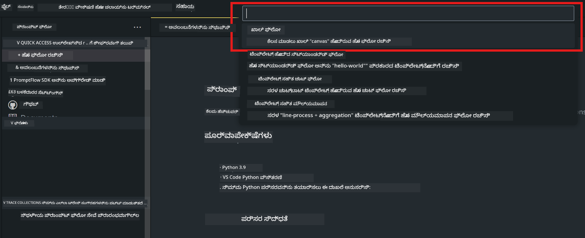
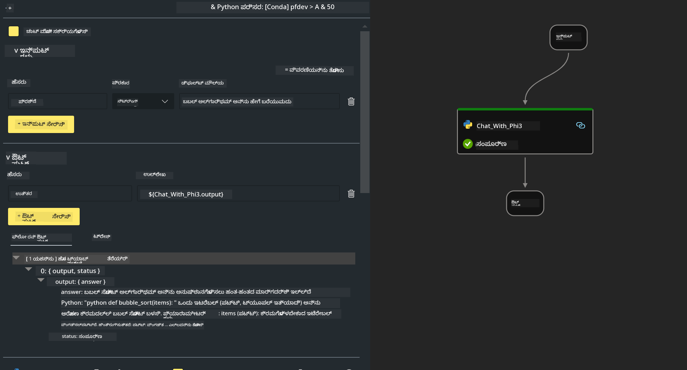

<!--
CO_OP_TRANSLATOR_METADATA:
{
  "original_hash": "bc29f7fe7fc16bed6932733eac8c81b8",
  "translation_date": "2025-12-21T19:45:53+00:00",
  "source_file": "md/02.Application/02.Code/Phi3/VSCodeExt/HOL/AIPC/02.PromptflowWithNPU.md",
  "language_code": "kn"
}
-->
# **ಲೆಬ್ 2 - AIPC ನಲ್ಲಿ Phi-3-mini ಬಳಸಿ Prompt flow ಚಲಾಯಿಸಿ**

## **Prompt flow ಎಂದರೇನು**

Prompt flow ಎಂಬುದು LLM ಆಧಾರಿತ AI ಅನ್ವಯಗಳ ಅಂತ್ಯದಿಂದ ಅಂತ್ಯವರೆಗಿನ ಅಭಿವೃದ್ಧಿ ಚಕ್ರವನ್ನು (ಐಡಿಯೇಷನ್, ಪ್ರೋಟೋಟೈಪಿಂಗ್, ಪರೀಕ್ಷೆ, ಮೌಲ್ಯಮಾಪನದಿಂದ ಉತ್ಪಾದನೆಗೆ ನಿಯೋಜನೆ ಮತ್ತು ನಿರ್ವಹಣೆ) ಸರಳಗೊಳಿಸಲು ರೂಪುಗೊಂಡ ಅಭಿವೃದ್ಧಿ ಉಪಕರಣಗಳ ಸಂಗ್ರಹವಾಗಿದೆ. ಇದು ಪ್ರಾಂಪ್ಟ್ ಎಂಜಿನಿಯರಿಂಗ್ ಅನ್ನು ಬಹಳ ಸುಲಭಗೊಳಿಸುತ್ತದೆ ಮತ್ತು ನಿಮಗೆ ಉತ್ಪಾದನಾ ಗುಣಮಟ್ಟದ LLM ಅಪ್ಲಿಕೇಶನ್‌ಗಳನ್ನು ರಚಿಸಲು ಸಾಧ್ಯವಾಗುತ್ತದೆ.

Prompt flow ಬಳಸಿ, ನೀವು ಸಾಧ್ಯವಾಗುತ್ತದೆ:

- LLMಗಳು, ಪ್ರಾಂಪ್ಟ್‌ಗಳು, Python ಕೋಡ್ ಮತ್ತು ಇತರೆ ಸಲಕರಣೆಗಳನ್ನು executable ವರ್ಕ್‌ಫ್ಲೋದಲ್ಲಿ ಜೋಡಿಸುವ ಫ್ಲೋಗಳನ್ನು ರಚಿಸಲು.

- ನಿಮ್ಮ ಫ್ಲೋಗಳ ವಿಶೇಷವಾಗಿ LLMಗಳೊಂದಿಗೆ ಇರುವ ಪರಸ್ಪರ ಕ್ರಿಯೆಯನ್ನು ಸುಲಭವಾಗಿ ಡಿಬಗ್ ಮಾಡುವುದು ಮತ್ತು ಪುನರಾವೃತ್ತಿ ನಡೆಸುವುದು.

- ದೊಡ್ಡ ಡೇಟಾಸೆಟ್‌ಗಳೊಂದಿಗೆ ನಿಮ್ಮ ಫ್ಲೋಗಳನ್ನು ಮೌಲ್ಯಮಾಪನ ಮಾಡಿ, ಗುಣಮಟ್ಟ ಮತ್ತು ಕಾರ್ಯಕ್ಷಮತೆಯ ಮ್ಯಾೆಟ್ರಿಕ್‌ಗಳನ್ನು ಗಣನೆ ಮಾಡಲು.

- ನಿಮ್ಮ ಫ್ಲೋಗೆ ಗುಣಮಟ್ಟವನ್ನು ಖಚಿತಪಡಿಸಲು ಪರೀಕ್ಷೆ ಮತ್ತು ಮೌಲ್ಯಮಾಪನವನ್ನು ನಿಮ್ಮ CI/CD ವ್ಯವಸ್ಥೆಯೊಂದಿಗೆ ಐಂಟಿಗ್ರೇಟ್ ಮಾಡುವುದು.

- ನಿಮ್ಮ ಆಯ್ಕೆ ಮಾಡಿದ ಸರ್ವಿಂಗ್ ಪ್ಲಾಟ್‌ಫಾರ್ಮ್‌ಗೆ ಅಥವಾ ನಿಮ್ಮ ಅಪ್ಲಿಕೇಶನ್ ಕೋಡ್ ಬೇಸ್‌ಗೆ ಸುಲಭವಾಗಿ ಫ್ಲೋಗಳನ್ನು ನಿಯೋಜಿಸಲು.

- (ಐಚ್ಚಿಕ ಆದರೆ ಶಿಫಾರಸು ಮಾಡಲಾಗಿದೆ) Prompt flow ನ ಕ್ಲೌಡ್ ಆವೃತ್ತಿಯನ್ನು Azure AI ನಲ್ಲಿ ಬಳಸಿ ನಿಮ್ಮ ತಂಡದೊಂದಿಗೆ ಸಹಕರಿಸಲು.

## **AIPC ಎಂದರೇನು**

AI PC પાસે CPU, GPU ಮತ್ತು NPU ಇವೆ, ಪ್ರತಿಯೊಂದು ನಿರ್ದಿಷ್ಟ AI ವೇಗವರ್ಧಕ ಸಾಮರ್ಥ್ಯಗಳೊಂದಿಗೆ. NPU ಅಥವಾ neural processing unit ಎನ್ನುವುದು ಒಂದು ವಿಶೇಷ ಯಂತ್ರವಾಗಿದ್ದು, ಡೇಟಾವನ್ನು ಕ್ಲೌಡ್‌ಗೆ ಪ್ರೊಸೆಸಿಂಗ್‌ಗೆ ಕಳುಹಿಸದೆ ನಿಮ್ಮ PC ನಲ್ಲಿ ನೇರವಾಗಿ ಕೃತಕ ಬುದ್ಧಿಮತ್ತೆ (AI) ಮತ್ತು ಯಂತ್ರಕಲಿಕೆ (ML) ಕಾರ್ಯಗಳನ್ನು ನಿರ್ವಹಿಸುತ್ತದೆ. GPU ಮತ್ತು CPU ಕೂಡ ಈ ಕೆಲಸಗಳನ್ನು ಪ್ರೋಸೆಸ್ ಮಾಡಬಹುದು, ಆದರೆ NPU ವಿಶೇಷವಾಗಿ ಕಡಿಮೆ ಶಕ್ತಿಯ AI ಗಣನೆಗಳಿಗೆ ಉತ್ತಮವಾಗಿದೆ. AI PC ನಮ್ಮ ಕಂಪ್ಯೂಟರ್‌ಗಳು ಕಾರ್ಯನಿರ್ವಹಿಸುವ ರೀತಿಯಲ್ಲಿ ಮೂಲಭೂತ ಬದಲಾವಣೆಯನ್ನು ಪ್ರತಿನಿಧಿಸುತ್ತದೆ. ಇದು ಹಿಂದೆ ಇರಲಿಲ್ಲದ ಸಮಸ್ಯೆಗೆ ಪರಿಹಾರವಲ್ಲ; ಬದಲಾಗಿ, ಇದು ದಿನನಿತ್ಯದ PC ಬಳಕೆಯಿಗಾಗಿ ದೊಡ್ಡ ಸುಧಾರಣೆಯನ್ನು ವಾಗ್ದಾನಿಸುತ್ತದೆ.

ಅದು ಹೇಗಾಗಿ ಕೆಲಸ ಮಾಡುತ್ತದೆ ಎಂಬುದು: ಬಹುತೇಕ ಸಾರ್ವಜನಿಕ ಡೇಟಾದಲ್ಲಿ ತರಬೇತಿಯಾದ ಜನರೇಟಿವ್ AI ಮತ್ತು ಭರೀ LLM ಗಳಿಗಿಂತ ಹೋಲಿಸಿದರೆ, ನಿಮ್ಮ PC ನಲ್ಲಿ ನಡೆಯುವ AI ಎಲ್ಲ ಮಟ್ಟಗಳಲ್ಲಿ ಹೆಚ್ಚು ಪ್ರವೇಶಸಾಧ್ಯವಾಗಿದೆ. ಕಲ್ಪನೆ ಸಹಜವಾಗಿ ಗ್ರಹಿಸಲು ಸುಲಭವಿದೆ, ಮತ್ತು ಇದು ನಿಮ್ಮ ಡೇಟಾ ಮೇಲೆ ತರಬೇತಿಯಾಗಿರುವುದರಿಂದ ಮತ್ತು ಕ್ಲೌಡ್‌ಗೆ ಪ್ರವೇಶಿಸಬೇಕಾಗದೆ, ಲಾಭಗಳು ತಕ್ಷಣವೇ ವ್ಯಾಪಕ ಜನಸಾಮಾನ್ಯರಿಗೆ ಆಕರ್ಷಕವಾಗುತ್ತವೆ.

ನಿಕಟ ಭವಿಷ್ಯದಲ್ಲಿ, AI PC ಪ್ರಪಂಚವು ವೈಯಕ್ತಿಕ ಸಹಾಯಕರು ಮತ್ತು ನಿಮ್ಮ PC ನಲ್ಲಿ ನೇರವಾಗಿ ನಡೆಯುವ ಸಣ್ಣ AI ಮಾದರಿಗಳನ್ನು ಒಳಗೊಂಡಿರುತ್ತದೆ, ձեր ಡೇಟಾವನ್ನು ಬಳಸಿಕೊಂಡು ವೈಯಕ್ತಿಕ, ಖಾಸಗಿ, ಮತ್ತು ಹೆಚ್ಚು ಸುರಕ್ಷಿತ AI ಸುಧಾರಣೆಗಳನ್ನು ನಿಮ್ಮ ದಿನನಿತ್ಯದ ಕಾರ್ಯಗಳಿಗಾಗಿ — ಸಭೆಯ ನೋಟ್ಸ್ ತೆಗೆದುವುದು, ಫ್ಯಾಂಟಸಿ ಫುಟ್‌ಬಾಲ್ ಲೀಗ್ ಅನ್ನು ಸಂಘಟಿಸುವುದು, ಫೋಟೋ ಮತ್ತು ವೀಡಿಯೋ ಎಡಿಟಿಂಗ್‌ಗಾಗಿ ಸ್ವಯಂಚಾಲಿತ ಸುಧಾರಣೆಗಳನ್ನು ಮಾಡುವುದು, ಅಥವಾ ಪ್ರತಿಯೊಬ್ಬರ ಆಗಮನ ಮತ್ತು ನಿರ್ಗಮನ ಸಮಯಗಳ ಆಧಾರದ ಮೇಲೆ ಕುಟುಂಬ ಮಿಲನಕ್ಕಾಗಿ ಪರಿಪೂರ್ಣ ಪ್ರಯಾಣಕ్రమ ರಚಿಸುವುದು.

## **AIPC ನಲ್ಲಿ ಜನೆರೇಶನ್ ಕೋಡ್ ಫ್ಲೋಗಳನ್ನು ನಿರ್ಮಿಸುವುದು**

***ಗಮನಿಸಿ*** ：ನೀವು ವಾತಾವರಣ ಸ್ಥಾಪನೆಯನ್ನು ಪೂર્ણಗೊಳಿಸದಿದ್ದರೆ, ದಯವಿಟ್ಟು [Lab 0 -Installations](./01.Installations.md) ವೀಕ್ಷಿಸಿ

1. Visual Studio Code ನಲ್ಲಿ Prompt flow ಎಕ್ಸ್ಟೆಂಚನ್ ಅನ್ನು ತೆರೆದು ಖಾಲಿ ಫ್ಲೋ ಪ್ರಾಜೆಕ್ಟ್ ಅನ್ನು ರಚಿಸಿ



2. Inputs ಮತ್ತು Outputs ಪ್ಯಾರಾಮೀಟರ್‌ಗಳನ್ನು ಸೇರಿಸಿ ಮತ್ತು Python ಕೋಡ್ ಅನ್ನು ಹೊಸ ಫ್ಲೋ ಆಗಿ ಸೇರಿಸಿ




You can refer to this structure (flow.dag.yaml) to construct your flow

```yaml

inputs:
  question:
    type: string
    default: how to write Bubble Algorithm
outputs:
  answer:
    type: string
    reference: ${Chat_With_Phi3.output}
nodes:
- name: Chat_With_Phi3
  type: python
  source:
    type: code
    path: Chat_With_Phi3.py
  inputs:
    question: ${inputs.question}


```

3. ***Chat_With_Phi3.py*** ನಲ್ಲಿ ಕೋಡ್ ಸೇರಿಸಿ


```python


from promptflow.core import tool

# ಟಾರ್ಚ್ ಅನ್ನು ಆಮದು ಮಾಡಿ
from transformers import AutoTokenizer, pipeline,TextStreamer
import intel_npu_acceleration_library as npu_lib

import warnings

import asyncio
import platform

class Phi3CodeAgent:
    
    model = None
    tokenizer = None
    text_streamer = None
    
    model_id = "microsoft/Phi-3-mini-4k-instruct"

    @staticmethod
    def init_phi3():
        
        if Phi3CodeAgent.model is None or Phi3CodeAgent.tokenizer is None or Phi3CodeAgent.text_streamer is None:
            Phi3CodeAgent.model = npu_lib.NPUModelForCausalLM.from_pretrained(
                                    Phi3CodeAgent.model_id,
                                    torch_dtype="auto",
                                    dtype=npu_lib.int4,
                                    trust_remote_code=True
                                )
            Phi3CodeAgent.tokenizer = AutoTokenizer.from_pretrained(Phi3CodeAgent.model_id)
            Phi3CodeAgent.text_streamer = TextStreamer(Phi3CodeAgent.tokenizer, skip_prompt=True)

    

    @staticmethod
    def chat_with_phi3(prompt):
        
        Phi3CodeAgent.init_phi3()

        messages = "<|system|>You are a AI Python coding assistant. Please help me to generate code in Python.The answer only genertated Python code, but any comments and instructions do not need to be generated<|end|><|user|>" + prompt +"<|end|><|assistant|>"


        generation_args = {
            "max_new_tokens": 1024,
            "return_full_text": False,
            "temperature": 0.3,
            "do_sample": False,
            "streamer": Phi3CodeAgent.text_streamer,
        }

        pipe = pipeline(
            "text-generation",
            model=Phi3CodeAgent.model,
            tokenizer=Phi3CodeAgent.tokenizer,
            # **ಉತ್ಪಾದನೆ_ಆರ್ಗ್‌ಗಳು
        )

        result = ''

        with warnings.catch_warnings():
            warnings.simplefilter("ignore")
            response = pipe(messages, **generation_args)
            result =response[0]['generated_text']
            return result


@tool
def my_python_tool(question: str) -> str:
    if platform.system() == 'Windows':
        asyncio.set_event_loop_policy(asyncio.WindowsSelectorEventLoopPolicy())
    return Phi3CodeAgent.chat_with_phi3(question)


```

4. ನೀವು Debug ಅಥವಾ Run ನಿಂದ ಫ್ಲೋವನ್ನು ಪರೀಕ್ಷಿಸಿ ಜನೆರೇಶನ್ ಕೋಡ್ ಸರಿಯಾಗಿದೆಯೇ ಎಂದು ಪರಿಶೀಲಿಸಬಹುದು


5. ಟರ್ಮಿನಲ್‌ನಲ್ಲಿ ಡೆವಲಪ್‌ಮೆಂಟ್ API ಆಗಿ ಫ್ಲೋ ಅನ್ನು ಚಲಾಯಿಸಿ

```

pf flow serve --source ./ --port 8080 --host localhost   

```

ನೀವು ಇದನ್ನು Postman / Thunder Client ನಲ್ಲಿ ಪರೀಕ್ಷಿಸಬಹುದು


### **ಗಮನಿಸಿ**

1. ಮೊದಲ ರನ್ ಹೆಚ್ಚಿನ ಸಮಯ ತೆಗೆದುಕೊಳ್ಳುತ್ತದೆ. Hugging face CLI ಯಿಂದ phi-3 ಮಾದರಿಯನ್ನು ಡೌನ್ಲೋಡ್ ಮಾಡಬೇಕೆಂದು ಶಿಫಾರಸು ಮಾಡಲಾಗುತ್ತದೆ.

2. Intel NPU ನ ಗಣನ ಶಕ್ತಿಯ ಮಿತಿಯನ್ನು ಪರಿಗಣಿಸಿ, Phi-3-mini-4k-instruct ಬಳಸಲು ಶಿಫಾರಸು ಮಾಡಲಾಗುತ್ತದೆ

3. ನಾವು Intel NPU Acceleration ಅನ್ನು INT4 ಕ್ವಾಂಟೈಜೆಶನ್ ರೂಪಾಂತರಕ್ಕಾಗಿ ಬಳಸುತ್ತೇವೆ, ಆದರೆ ನೀವು ಸೇವೆಯನ್ನು ಮರುಚಲಾಯಿಸಿದರೆ, cache ಮತ್ತು nc_workshop ಫೋಲ್ಡರ್‌ಗಳನ್ನು ಅಳಿಸಲು ಬೇಕಾಗಿ ಬರುವುದಿಲ್ಲ.

## **ಸಂಪನ್ಮೂಲಗಳು**

1. Promptflow ಅನ್ನು ಕಲಿಯಿರಿ [https://microsoft.github.io/promptflow/](https://microsoft.github.io/promptflow/)

2. Intel NPU Acceleration ಅನ್ನು ಕಲಿಯಿರಿ [https://github.com/intel/intel-npu-acceleration-library](https://github.com/intel/intel-npu-acceleration-library)

3. ಸ್ಯಾಂಪಲ್ ಕೋಡ್, ಡೌನ್ಲೋಡ್ [Local NPU Agent Sample Code](../../../../../../../../../code/07.Lab/01/AIPC)

---

<!-- CO-OP TRANSLATOR DISCLAIMER START -->
ನಿರಾಕರಣೆ:
ಈ ದಸ್ತಾವೇಜನ್ನು AI ಅನುವಾದ ಸೇವೆ [Co-op Translator](https://github.com/Azure/co-op-translator) ಬಳಸಿ ಅನುವದಿಸಲಾಗಿದೆ. ನಾವು ನಿಖರತೆಯನ್ನು ಸಾಧಿಸಲು ಪ್ರಯತ್ನಿಸಿದರೂ, ಸ್ವಯಂಚಾಲಿತ ಅನುವಾದಗಳಲ್ಲಿ ದೋಷಗಳು ಅಥವಾ ಅಸತ್ಯತೆಗಳು ಇರಬಹುದಾದುದಾಗಿ ದಯವಿಟ್ಟು ಗಮನಿಸಿ. ಮೂಲ ಭಾಷೆಯಲ್ಲಿರುವ ಮೂಲ ದಸ್ತಾವೇಜನ್ನು ಅಧಿಕೃತ ಮೂಲವೆಂದು ಪರಿಗಣಿಸಬೇಕು. ಮಹತ್ವಪೂರ್ಣ ಮಾಹಿತಿಗಾಗಿ ವೃತ್ತಿಪರ ಮಾನವ ಅನುವಾದವನ್ನು ಶಿಫಾರಸು ಮಾಡಲಾಗುತ್ತದೆ. ಈ ಅನುವಾದದ ಬಳಕೆಯಿಂದ ಉಂಟಾಗುವ ಯಾವುದೇ ಗೊಂದಲಗಳು ಅಥವಾ ತಪ್ಪು ಅರ್ಥಗರ್ಭಿತತೆಗಳಿಗೆ ನಾವು ಹೊಣೆಗಾರರಲ್ಲ.
<!-- CO-OP TRANSLATOR DISCLAIMER END -->