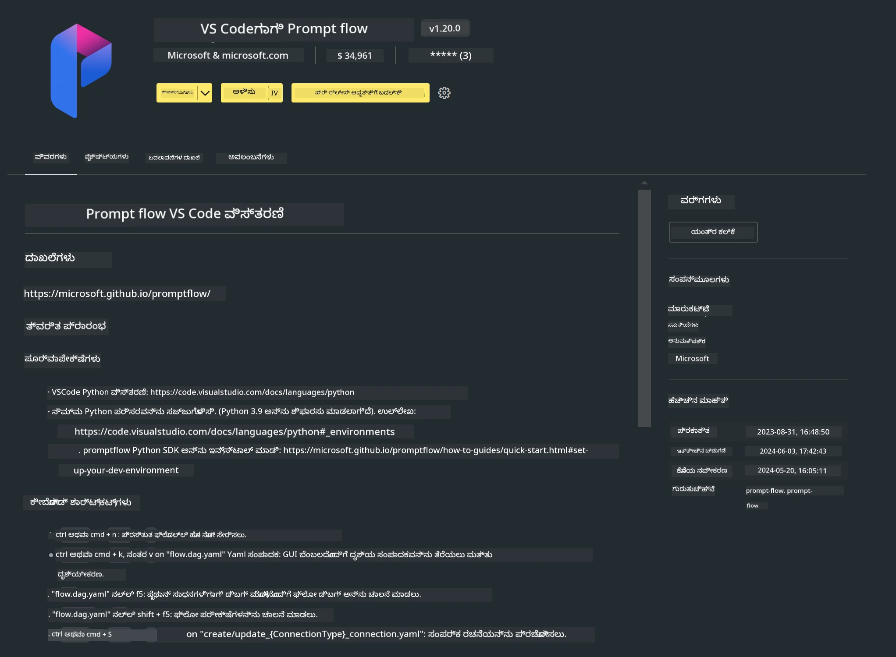

<!--
CO_OP_TRANSLATOR_METADATA:
{
  "original_hash": "4b16264917d9b93169745d92b8ce8c65",
  "translation_date": "2025-12-21T20:09:48+00:00",
  "source_file": "md/02.Application/02.Code/Phi3/VSCodeExt/HOL/Apple/01.Installations.md",
  "language_code": "kn"
}
-->
# **Lab 0 - ಸ್ಥಾಪನೆ**

When we enter the Lab, we need to configure the relevant environment :


### **1. Python 3.11+**

Python ಪರಿಸರವನ್ನು ಸಂರಚಿಸಲು miniforge ಅನ್ನು ಬಳಸಲು ಶಿಫಾರಸು ಮಾಡಲಾಗಿದೆ 

To configure miniforge, please refer to [https://github.com/conda-forge/miniforge](https://github.com/conda-forge/miniforge)

After configuring miniforge, run the following command in Power Shell

```bash

conda create -n pyenv python==3.11.8 -y

conda activate pyenv

```


### **2. Prompt flow SDK ಅನ್ನು ಸ್ಥಾಪಿಸಿ**

Lab 1 ನಲ್ಲಿ ನಾವು Prompt flow ಅನ್ನು ಬಳಸುತ್ತೇವೆ, ಆದ್ದರಿಂದ Prompt flow SDK ಅನ್ನು ಸಂರಚಿಸಬೇಕಾಗುತ್ತದೆ.

```bash

pip install promptflow --upgrade

```

You can check promptflow sdk in this command


```bash

pf --version

```

### **3. Visual Studio Code Prompt flow ವಿಸ್ತರಣೆ ಸ್ಥಾಪಿಸಿ**



### **4. Apple ನ MLX ಫ್ರೇಮ್‌ವರ್ಕ್**

MLXವು Apple silicon ಮೇಲಿನ ಯಂತ್ರ ಕಲಿಕೆ ಸಂಶೋಧನೆಗಾಗಿ Apple ಯಂತ್ರ ಕಲಿಕೆ ಸಂಶೋಧನಾ ತಂಡದಿಂದ ನೀಡಲಾದ ಒಂದು ಫ್ರೇಮ್‌ವರ್ಕ್ ಆಗಿದೆ. ನೀವು Apple Silicon ಬಳಸಿ LLM / SLM ಅನ್ನು ವೇಗಗೊಳಿಸಲು **Apple MLX framework** ಅನ್ನು ಬಳಸಬಹುದು. ಹೆಚ್ಚು ತಿಳಿಯಲು, ನೀವು [https://github.com/microsoft/PhiCookBook/blob/main/md/01.Introduction/03/MLX_Inference.md](https://github.com/microsoft/PhiCookBook/blob/main/md/01.Introduction/03/MLX_Inference.md) ಓದಬಹುದು.

Install MLX framework Library in bash


```bash

pip install mlx-lm

```


### **5. ಇತರ Python ಲೈಬ್ರರಿ**


requirements.txt ಅನ್ನು ರಚಿಸಿ ಮತ್ತು ಈ ವಿಷಯವನ್ನು ಸೇರಿಸಿ

```txt

notebook
numpy 
scipy 
scikit-learn 
matplotlib 
pandas 
pillow 
graphviz

```


### **6. NVM ಅನ್ನು ಸ್ಥಾಪಿಸಿ**

Powershell ನಲ್ಲಿ nvm ಅನ್ನು ಸ್ಥಾಪಿಸಿ 


```bash

brew install nvm

```

nodejs 18.20 ಅನ್ನು ಇನ್ಸ್ಟಾಲ್ ಮಾಡಿ


```bash

nvm install 18.20.0

nvm use 18.20.0

```

### **7. Visual Studio Code ಅಭಿವೃದ್ಧಿ ಬೆಂಬಲವನ್ನು ಸ್ಥಾಪಿಸಿ**


```bash

npm install --global yo generator-code

```

ಅಭಿನಂದನೆಗಳು! ನೀವು ಯಶಸ್ವಿಯಾಗಿ SDK ಅನ್ನು ಸಂರಚಿಸಿದ್ದೀರಿ. ಮುಂದಾಗಿ, ಪ್ರಾಯೋಗಿಕ ಹಂತಗಳಿಗೆ ಮುಂದುವರಿಯಿರಿ.

---

<!-- CO-OP TRANSLATOR DISCLAIMER START -->
ಅಸ್ವೀಕಾರಣೆ:
ಈ ದಾಖಲೆ AI ಅನುವಾದ ಸೇವೆ [Co-op Translator](https://github.com/Azure/co-op-translator) ಬಳಸಿ ಅನುವಾದಿಸಲಾಗಿದೆ. ನಾವು ಶುದ್ಧತೆಗೆ ಪ್ರಯತ್ನಿಸಿದರೂ, ಸ್ವಯಂಚಾಲಿತ ಅನುವಾದಗಳಲ್ಲಿ ದೋಷಗಳು يا ಅಸತ್ಯತೆಗಳಿರಬಹುದು ಎಂದು ದಯವಿಟ್ಟು ಗಮನಿಸಿ. ಮೂಲ ಭಾಷೆಯಲ್ಲಿ ಇರುವ ಮೂಲ ದಾಖಲೆನ್ನು ಅಧಿಕೃತ ಮೂಲವೆಂದು ಪರಿಗಣಿಸಬೇಕು. ಮಹತ್ವದ ಮಾಹಿತಿಗಾಗಿ ವೃತ್ತಿಪರ ಮಾನವ ಅನುವಾದವನ್ನು ಶಿಫಾರಸು ಮಾಡಲಾಗಿದೆ. ಈ ಅನುವಾದದ ಬಳಕೆಯಿಂದ ಉಂಟಾಗುವ ಯಾವುದೇ ಭ್ರಮೆಗಳು ಅಥವಾ ತಪ್ಪು ಅರ್ಥಮಾಡಿಕೆಗಳಿಗೆ ನಾವು ಜವಾಬ್ದಾರರಾಗುವುದಿಲ್ಲ.
<!-- CO-OP TRANSLATOR DISCLAIMER END -->