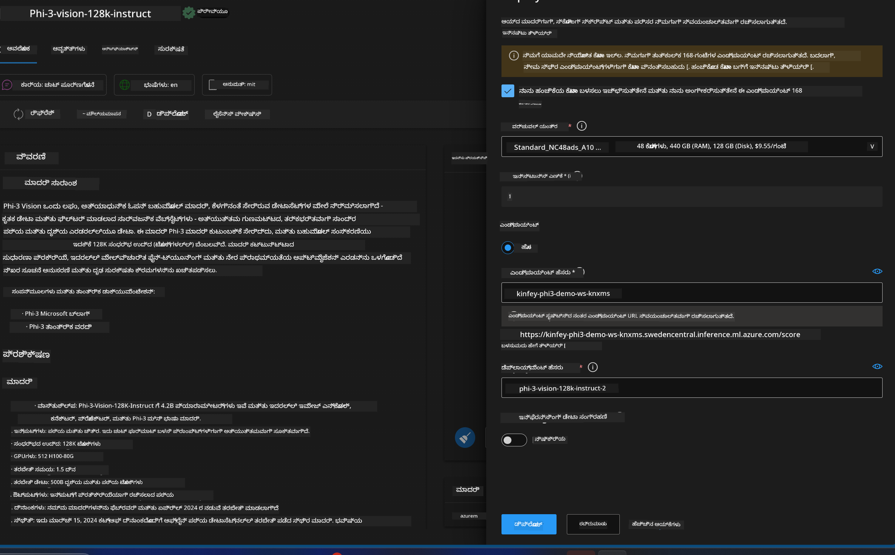

<!--
CO_OP_TRANSLATOR_METADATA:
{
  "original_hash": "20cb4e6ac1686248e8be913ccf6c2bc2",
  "translation_date": "2025-12-21T20:22:16+00:00",
  "source_file": "md/02.Application/02.Code/Phi3/VSCodeExt/HOL/Apple/03.DeployPhi3VisionOnAzure.md",
  "language_code": "kn"
}
-->
# **Lab 3 - Phi-3-vision ಅನ್ನು Azure Machine Learning Service ರಲ್ಲಿ ನಿಯೋಜಿಸಿ**

ನಾವು NPU ಅನ್ನು ಬಳಸಿ ಸ್ಥಳೀಯ ಕೋಡ್‌ನ ಉತ್ಪಾದನಾ ನಿಯೋಜನೆಯನ್ನು ಪೂರ್ಣಗೊಳಿಸುತ್ತೇವೆ, ಮತ್ತು ನಂತರ ಇದರ ಮೂಲಕ PHI-3-VISION ಅನ್ನು ಪರಿಚಯಿಸಿ ಚಿತ್ರಗಳಿಂದ ಕೋಡ್ ಉತ್ಪಾದಿಸುವ ಸಾಮರ್ಥ್ಯವನ್ನು ಸೇರಿಸಲು ಬಯಸುತ್ತೇವೆ.

ಈ ಪರಿಚಯದಲ್ಲಿ, ನಾವು Azure Machine Learning Service ನಲ್ಲಿ Model As Service ಆಗಿ Phi-3 Vision ಸೇವೆಯನ್ನು ಬೇಗನೆ ನಿರ್ಮಿಸಬಹುದು.

***ಗಮನಿಸು***： Phi-3 Vision ಹೆಚ್ಚು ವೇಗದಲ್ಲಿ ವಿಷಯವನ್ನು ರಚಿಸಲು ಗಣನ ಶಕ್ತಿಯನ್ನು ಅಗತ್ಯವಿದೆ. ಅದನ್ನು ಸಾಧಿಸಲು ನಾವು ಕ್ಲೌಡ್ ಗಣನಶಕ್ತಿಯನ್ನು ಬಳಸಬೇಕಾಗುತ್ತದೆ.


### **1. Azure Machine Learning Service ನಿರ್ಮಿಸಿ**

ನಾವು Azure ಪೋರ್ಟಲ್ನಲ್ಲಿ Azure Machine Learning Service ಅನ್ನು ರಚಿಸಬೇಕು. ಹೇಗೆ ಎಂಬುದನ್ನು ತಿಳಿಯಲು, ದಯವಿಟ್ಟು ಈ ಲಿಂಕ್ ನೋಡಿ [https://learn.microsoft.com/azure/machine-learning/quickstart-create-resources?view=azureml-api-2](https://learn.microsoft.com/azure/machine-learning/quickstart-create-resources?view=azureml-api-2)


### **2. Azure Machine Learning Service ನಲ್ಲಿ Phi-3 Vision ಆಯ್ಕೆಮಾಡಿ**


### **3. Azure ನಲ್ಲಿ Phi-3-Vision ಅನ್ನು ನಿಯೋಜಿಸಿ**





### **4. Postman ನಲ್ಲಿ ಎಂಡ್ಪಾಯಿಂಟ್ ಅನ್ನು ಪರೀಕ್ಷಿಸಿ**


***ಗಮನಿಸು***

1. ಪ್ರಸಾರಮಾಡಬೇಕಾದ ಪ್ಯಾರಾಮೀಟರ್‌ಗಳಲ್ಲಿ Authorization, azureml-model-deployment, ಮತ್ತು Content-Type ಸೇರಬೇಕು. ಅವನ್ನು ಪಡೆಯಲು ನೀವು ನಿಯೋಜನೆ ಮಾಹಿತಿಯನ್ನು ಪರಿಶೀಲಿಸಬೇಕಿದೆ.

2. ಪ್ಯಾರಾಮೀಟರ್‌ಗಳನ್ನು ಪ್ರಸಾರ ಮಾಡಲು, Phi-3-Vision ಗೆ ಚಿತ್ರ ಲಿಂಕ್ ಅನ್ನು ಪ್ರಸಾರ ಮಾಡಬೇಕಾಗುತ್ತದೆ. ಪ್ಯಾರಾಮೀಟರ್‌ಗಳನ್ನು ಹೇಗೆ ಪ್ರಸಾರ ಮಾಡುವುದು ಎಂಬುದಕ್ಕಾಗಿ GPT-4-Vision ವಿಧಾನವನ್ನು ಉಲ್ಲೇಖಿಸಿ, ಉದಾಹರಣೆಗೆ

```json

{
  "input_data":{
    "input_string":[
      {
        "role":"user",
        "content":[ 
          {
            "type": "text",
            "text": "You are a Python coding assistant.Please create Python code for image "
          },
          {
              "type": "image_url",
              "image_url": {
                "url": "https://ajaytech.co/wp-content/uploads/2019/09/index.png"
              }
          }
        ]
      }
    ],
    "parameters":{
          "temperature": 0.6,
          "top_p": 0.9,
          "do_sample": false,
          "max_new_tokens": 2048
    }
  }
}

```

3. POST ವಿಧಾನವನ್ನು ಬಳಸಿ **/score** ಅನ್ನು ಕರೆಮಾಡಿ

**ಅಭಿನಂದನೆಗಳು** ！ನೀವು ತ್ವರಿತ PHI-3-VISION ನಿಯೋಜನೆಯನ್ನು ಪೂರ್ಣಗೊಳಿಸಿದ್ದೀರಿ ಮತ್ತು ಚಿತ್ರಗಳನ್ನು ಬಳಸಿ ಕೋಡ್ ಅನ್ನು ರಚಿಸುವುದನ್ನು ಪರೀಕ್ಷಿಸಿದ್ದೀರಿ. ಮುಂದಿನದಾಗಿ, ನಾವು NPUಗಳು ಮತ್ತು ಕ್ಲೌಡ್‌ಗಳನ್ನು ಸಂಯೋಜಿಸಿ ಅಪ್ಲಿಕೇಶನ್‌ಗಳನ್ನು ನಿರ್ಮಿಸಬಹುದು

---

<!-- CO-OP TRANSLATOR DISCLAIMER START -->
ಅಸ್ವೀಕರಣ:
ಈ ದಾಖಲೆವನ್ನು AI ಭಾಷಾಂತರ ಸೇವೆ Co-op Translator (https://github.com/Azure/co-op-translator) ಬಳಸಿ ಅನುವಾದಿಸಲಾಗಿದೆ. ನಾವು ನಿಖರತೆಯತ್ತ ಪ್ರಯತ್ನಿಸಿದರೂ, ಸ್ವಯಂಚಾಲಿತ ಅನುವಾದಗಳಲ್ಲಿ ದೋಷಗಳು ಅಥವಾ ಅಸ್ಪಷ್ಟತೆಗಳು ಇರಬಹುದೆಂದು ದಯವಿಟ್ಟು ಗಮನಿಸಿ. ಮೂಲದಾಖಲೆ ಅದರ ಮೂಲಭಾಷೆಯಲ್ಲಿ ಇರುವ ಆಧಾರಿತ ಕಾಗದವಾಗಿದೆ ಎಂದು ಪರಿಗಣಿಸಬೇಕು. ಮಹತ್ವದ ಮಾಹಿತಿಗಾಗಿ ವೃತ್ತಿಪರ ಮಾನವ ಭಾಷಾಂತರವನ್ನು ಬಳಸಲು ಶಿಫಾರಸು ಮಾಡಲಾಗುತ್ತದೆ. ಈ ಅನುವಾದದ ಬಳಕೆಯಿಂದ ಉಂಟಾಗುವ ಯಾವುದೇ ಭ್ರಮೆ ಅಥವಾ ತಪ್ಪು ಅರ್ಥಗೈಕೆಗಳಿಗಾಗಿ ನಾವು ಜವಾಬ್ದಾರರಾಗುವುದಿಲ್ಲ.
<!-- CO-OP TRANSLATOR DISCLAIMER END -->