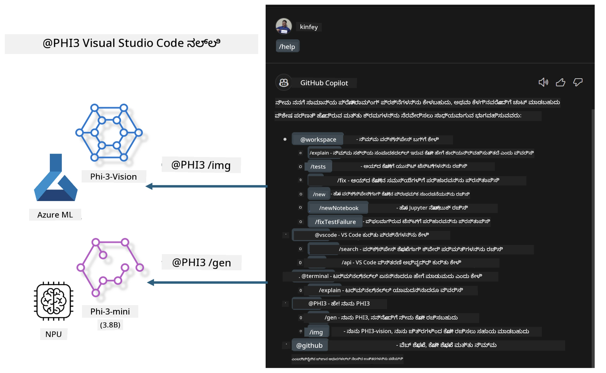

# **ನಿಮ್ಮದೇ ಆದ Visual Studio Code GitHub Copilot ಚಾಟ್ ಅನ್ನು Microsoft Phi-3 ಕುಟುಂಬದೊಂದಿಗೆ ನಿರ್ಮಿಸಿ**

GitHub Copilot Chat ನಲ್ಲಿ workspace agent ಅನ್ನು ನೀವು ಬಳಸಿದ್ದೀರೇ? ನಿಮ್ಮ ತಂಡದ ಸ್ವಂತ ಕೋಡ್ ಏಜೆಂಟ್ ಅನ್ನು ನಿರ್ಮಿಸಲು ಇಚ್ಛಿಸುತ್ತೀರೇ? ಈ ಕೈಗToute ಪ್ರಯೋಗಶಾಲೆಯು ತೆರೆಯಾದ ಮೂಲ ಮಾದರಿಯನ್ನು ಸಂಯೋಜಿಸಿ ಎಂಟರ್‌ಪ್ರೈಸ್-ಮಟ್ಟದ ಕೋಡ್ ವ್ಯವಹಾರ ಏಜೆಂಟ್ ಅನ್ನು ನಿರ್ಮಿಸುವುದನ್ನು ಉದ್ದೇಶಿಸಿದೆ.

## **ಅಡಿಪಾಯ**

### **Microsoft Phi-3 ಅನ್ನು ಏಕೆ ಆರಿಸಬೇಕು**

Phi-3 ಒಂದು ಕುಟುಂಬ ಸರಣಿ, ಇದರಲ್ಲಿ phi-3-mini, phi-3-small, ಮತ್ತು phi-3-medium ಇದ್ದಾರೆ — ಪಠ್ಯ ಜನರೇಷನ್, ಸಂಭಾಷಣೆ ಪೂರ್ಣಗೊಳಿಸುವಿಕೆ ಮತ್ತು ಕೋಡ್ ಜನರೇಷನ್ ಗೆ ವಿವಿಧ ತರಬೇತಿ ಪರಾಮೀಟರ್ಗಳ ಆಧಾರದ ಮೇಲೆ. Vision ಆಧಾರಿತ phi-3-vision ಕೂಡಿದೆ. ಇದು ಎಂಟರ್‌ಪ್ರೈಸುಗಳು ಅಥವಾ ವಿಭಿನ್ನ ತಂಡಗಳು ಆಫ್‌ಲೈನ್ ಜನರೇಟಿವ್ AI ಪರಿಹಾರಗಳನ್ನು ರಚಿಸಲು ಸೂಕ್ತವಾಗಿದೆ.

Recommended to read this link [https://github.com/microsoft/PhiCookBook/blob/main/md/01.Introduction/01/01.PhiFamily.md](https://github.com/microsoft/PhiCookBook/blob/main/md/01.Introduction/01/01.PhiFamily.md)

### **Microsoft GitHub Copilot Chat**

GitHub Copilot Chat ವಿಸ್ತರಣೆಯು ನಿಮಗೆ ಚಾಟ್ ಇಂಟರ್ಫೇಸ್ ಒದಗಿಸುತ್ತದೆ, ಇದು GitHub Copilot ಜೊತೆಗೆ ಸಂವಹನ ಮಾಡಲು ಮತ್ತು ಡಾಕ್ಯುಮೆಂಟೇಷನ್ ಅಥವಾ ಆನ್ಲೈನ್ ಫೋರಮ್‍ಗಳನ್ನು ಹುಡುಕದೆ ನೇರವಾಗಿ VS Code ಒಳಗಿನ ಕೋಡಿಂಗ್-ಸಂಬಂಧಿತ ಪ್ರಶ್ನೆಗಳಿಗೆ ಉತ್ತರಗಳನ್ನು ಪಡೆಯಲು ಸಹಾಯ ಮಾಡುತ್ತದೆ.

Copilot Chat ರಚಿಸಿದ ಪ್ರತಿಕ್ರಿಯೆಗೆ ಸ್ಪಷ್ಟತೆ ನೀಡಲು ಸಿಂಟ್ಯಾಕ್ಸ್ ಹೈಲೈಟಿಂಗ್, ಇನ್‌ಡೆಂಟೇಷನ್ ಮತ್ತು ಇತರ ಫಾರ್ಮ್ಯಾಟಿಂಗ್ ವೈಶಿಷ್ಟ್ಯಗಳನ್ನು ಬಳಸಬಹುದು. ಬಳಕೆದಾರರಿಂದ ಬಂದ ಪ್ರಶ್ನೆಯ ಪ್ರಕಾರ, ಫಲಿತಾಂಶದಲ್ಲಿ Copilot ಪ್ರತಿಕ್ರಿಯೆಯನ್ನು ರಚಿಸಲು ಬಳಸಿದ ಸಂದರ್ಭಕ್ಕೆ ಸಂಬಂಧಿಸಿದ ಲಿಂಕ್‌ಗಳು ಇರಬಹುದು, ಉದಾಹರಣೆಗೆ ಮೂಲ ಕೋಡ್ ಫೈಲ್‌ಗಳು ಅಥವಾ ಡಾಕ್ಯುಮೆಂಟೇಷನ್, ಅಥವಾ VS Code ಕಾರ್ಯಕ್ಷಮತೆಯನ್ನು ಪ್ರವೇಶಿಸುವ ಬಟನ್‌ಗಳು ಇರಬಹುದು.

- Copilot Chat ನಿಮ್ಮ ಡೆವಲಪರ್ ಫ್ಲೋದಲ್ಲಿ ಎಂಟಿಗ್ರೇಟ್ ಆಗಿ ನಿಮಗೆ ಬೇಕಾದಲ್ಲಿ ಸಹಾಯವನ್ನು ಒದಗಿಸುತ್ತದೆ:

- ಸಂಪಾದಕದಿಂದಲೇ ಅಥವಾ ಟರ್ಮಿನಲ್‌ನಿಂದಲೇ ಸದ್ಯದಲ್ಲಿಯೇ	inline ಚಾಟ್ ಸಂಭಾಷಣೆಯನ್ನು ಪ್ರಾರಂಭಿಸಿ ಕೋಡ್ ಬರೆಯುವಾಗ ನೆರವಾಗಿಸಲು

- ಯಾವುದೇ ಸಮಯದಲ್ಲಿ ಸಹಾಯಕ್ಕೆ ಪರಿಕರವಾಗಿ ಇರಲು ಬದಿಯಲ್ಲಿರುವ Chat ವೀಕ್ಷಣೆಯನ್ನು ಬಳಸಿ

- ದ್ರುತ ಚಾಟ್(Quick Chat) ಪ್ರಾರಂಭಿಸಿ ಒಂದು ತ್ವರಿತ ಪ್ರಶ್ನೆಯನ್ನು ಕೇಳಿ ಮತ್ತು ನಿಮ್ಮ ಕೆಲಸಕ್ಕೆ ಮರುಹೊಂದಿ

ನೀವು GitHub Copilot Chat ಅನ್ನು ವಿವಿಧ ಸಂದರ್ಭಗಳಲ್ಲಿ ಬಳಸಬಹುದು, ಉದಾಹರಣೆಗೆ:

- ಸಮಸ್ಯೆಯನ್ನು ಅತ್ಯುತ್ತಮವಾಗಿ ಹೇಗೆ ಪರಿಹರಿಸಬೇಕು ಎಂಬ ಕೋಡಿಂಗ್ ಪ್ರಶ್ನೆಗಳಿಗೆ ಉತ್ತರ ನೀಡುವುದು

- ಇತರರ ಕೋಡ್ ಅನ್ನು ವಿವರಿಸುವುದು ಮತ್ತು ಸುಧಾರಣೆಗಳನ್ನು ಸಲಹೆ ಮಾಡುವುದು

- ಕೋಡ್ ದೋಷ ಪರಿಹಾರಗಳನ್ನು ಪ್ರಸ್ತಾಪಿಸುವುದು

- ಯುನಿಟ್ ಟೆಸ್ಟ್ ಪ್ರಕರಣಗಳನ್ನು ರಚಿಸುವುದು

- ಕೋಡ್ ಡಾಕ್ಯುಮೆಂಟೇಷನ್ ಅನ್ನು ರಚಿಸುವುದು

###  **Microsoft GitHub Copilot Chat @workspace**

Copilot Chat ನಲ್ಲಿ **@workspace** ಅನ್ನು ಉಲ್ಲೇಖಿಸುವುದು ನಿಮ್ಮ ಸಂಪೂರ್ಣ ಕೋಡ್‌ಬೇಸಿನ ಕುರಿತು ಪ್ರಶ್ನೆಗಳನ್ನು ಕೇಳಲು ಅನುವು ಮಾಡಿಕೊಡುತ್ತದೆ. ಪ್ರಶ್ನೆಯ ಆಧಾರದ ಮೇಲೆ, Copilot ಸಂಬಂಧಿತ ಫೈಲ್‌ಗಳು ಮತ್ತು ಸಿಂಬಲ್ಗಳನ್ನು vecinoವಾಗಿ ಹುಡುಕುತ್ತದೆ ಮತ್ತು ಅವುಗಳನ್ನು ಉತ್ತರದಲ್ಲಿ ಲಿಂಕ್‌ಗಳು ಮತ್ತು ಕೋಡ್ ಉದಾಹರಣೆಗಳಾಗಿ ಉಲ್ಲೇಖಿಸುತ್ತದೆ.

ನಿಮ್ಮ ಪ್ರಶ್ನೆಗೆ ಉತ್ತರಿಸಲು, **@workspace** VS Code ನಲ್ಲಿ ಕೋಡ್‌ಬೇಸ್ ಅನ್ನು ನ್ಯಾವಿಗೇಟ್ ಮಾಡುತ್ತಿರುವ ಡೆವಲಪರ್ ಬಳಸುವ ಅದೇ ಮೂಲಗಳನ್ನು ಹುಡುಕುತ್ತದೆ:

- .gitignore ಫೈಲ್ ಮೂಲಕ ನಿರ್ಲಕ್ಷ್ಯಗೊಳಿಸಲ್ಪಟ್ಟ ಫೈಲ್‌ಗಳನ್ನು ಹೊರತುಪಡಿಸಿ ವರ್ಕ್‌ಸ್ಪೇಸಿನ ಎಲ್ಲ ಫೈಲ್‌ಗಳು

- ನೆಸ್ಟ್ ಮಾಡಿದ ಫೋಲ್ಡರ್ ಮತ್ತು ಫೈಲ್ ಹೆಸರಿನ ಡೈರೆಕ್ಟರಿ ರಚನೆ

- ವರ್ಕ್‌ಸ್ಪೇಸ್ GitHub ರೆಪೊಸಿಟರಿ ಆಗಿದ್ದು ಕೋಡ್ ಸರ್ಚ್ ಮೂಲಕ ಸೂಚ್ಯಂಕಗೊಳಿಸಲ್ಪಟ್ಟಿದ್ದರೆ GitHub ನ ಕೋಡ್ ಹುಡುಕಾಟ ಸೂಚ್ಯಂಕ

- ವರ್ಕ್‌ಸ್ಪೇಸ್‌ನಲ್ಲಿನ ಸಿಂಬಲ್‌ಗಳು ಮತ್ತು ವ್ಯಾಖ್ಯಾನಗಳು

- ಪ್ರಸ್ತುತ ಆರಿಸಿಕೊಂಡ ಪాఠ್ಯ ಅಥವಾ ಸಕ್ರಿಯ ಸಂಪಾದಕದಲ್ಲಿ видноವಾಗಿರುವ ಪಠ್ಯ

Note: .gitignore ಅನ್ನು ನೀವು ನಿರ್ಲಕ್ಷ್ಯಗೊಳಿಸಿದ ಫೈಲ್‌ನಲ್ಲಿ ಫೈಲ್ ತೆರೆಯಿದ್ದರೆ ಅಥವಾ ಪಠ್ಯ ಆಯ್ಕೆಗೊಂಡಿದ್ದರೆ ಮೀರಿಸಲಾಗುತ್ತದೆ.

Recommended to read this link [[https://code.visualstudio.com/docs/copilot/copilot-chat](https://code.visualstudio.com/docs/copilot/workspace-context?WT.mc_id=aiml-137032-kinfeylo)]

## **ಈ ಪ್ರಯೋಗಶಾಲೆಯ ಬಗ್ಗೆ ಮತ್ತಷ್ಟು ತಿಳಿದುಕೊಳ್ಳಿ**

GitHub Copilot ಸಂಸ್ಥೆಗಳಿಗೆ ಪ್ರೋಗ್ರಾಮಿಂಗ್ ಕಾರ್ಯಕ್ಷಮತೆಯನ್ನು ಬಹುಮಟ್ಟಿಗೆ ಉತ್ತಮಗೊಳಿಸಿದೆ, ಮತ್ತು ಪ್ರತಿಯೊಂದು ಸಂಸ್ಥೆಯೂ GitHub Copilot ನ ಸಂಬಂಧಿತ ಕಾರ್ಯಗಳನ್ನು ಕಸ್ಟಮೈಸ್ ಮಾಡಲು ಬಯಸುತ್ತದೆ. ಅನೇಕ ಸಂಸ್ಥೆಗಳು ತಮ್ಮ ಸ್ವಂತ ವ್ಯವಹಾರ ಸಂದರ್ಭಗಳ ಮತ್ತು open source ಮಾದರಿಗಳ ಆಧಾರಿತವಾಗಿ GitHub Copilot ತರಹದ ಕಸ್ಟಮೈಸ್ ಮಾಡಿದ ವಿಸ್ತರಣೆಗಳನ್ನು ರಚಿಸಿರುವುದನ್ನು ನೋಡಬಹುದಾಗಿದೆ. ಸಂಸ್ಥೆಗಳಿಗಾಗಿ, ಕಸ್ಟಮೈಸ್ ಮಾಡಿದ ವಿಸ್ತರಣೆಗಳನ್ನು ನಿಯಂತ್ರಿಸಲು ಸುಲಭವಾಗಿದೆ, ಆದರೆ ಇದರಿಂದ ಬಳಕೆದಾರ ಅನುಭವದ ಮೇಲೆ ಪರಿಣಾಮ ಬೀರುವುದು. ಅಂತಹ ಸಂದರ್ಭಗಳಲ್ಲಿ GitHub Copilot ಸಾಮಾನ್ಯ ಪರಿಸ್ಥಿತಿಗಳಲ್ಲಿನ ವಿಸ್ತೃತ ಕಾರ್ಯಕ್ಷಮತೆ ಮತ್ತು ವೃತ್ತಿಪರತೆಯನ್ನು ಒದಗಿಸುತ್ತದೆ. ಅನುಭವವು ಸुसಂಗತವಾಗಿರಬಹುದಾದರೆ, ಸಂಸ್ಥೆಯದೇ ಸ್ವಂತ ವಿಸ್ತರಣೆಯನ್ನು ಕಸ್ಟಮೈಸ್ ಮಾಡುವುದು ಉತ್ತಮ.

GitHub Copilot Chat ಸಂಸ್ಥೆಗಳು ಚಾಟ್ ಅನುಭವವನ್ನು ವಿಸ್ತರಿಸಲು ಸಂಬಂಧಿತ APIಗಳನ್ನು ಒದಗಿಸುತ್ತದೆ. ಸुसಂಗತ ಅನುಭವವನ್ನು ನಿರ್ವಹಿಸುವುದು ಮತ್ತು ಕಸ್ಟಮೈಸ್ ಮಾಡಿದ ಕಾರ್ಯಗಳನ್ನು ಹೊಂದಿರುವುದು ಉತ್ತಮ ಬಳಕೆದಾರ ಅನುಭವವನ್ನು ನೀಡುತ್ತದೆ.

ಈ ಪ್ರಯೋಗಶಾಲೆ ಮುಖ್ಯವಾಗಿ Phi-3 ಮಾದರಿಯನ್ನು ಸ್ಥಳೀಯ NPU ಮತ್ತು Azure ಸಂಯೋಜನೆಯೊಂದಿಗೆ ಸಂಯೋಜಿಸಿ GitHub Copilot Chat ನಲ್ಲಿ ಕಸ್ಟಮ್ ಏಜೆಂಟ್ ***@PHI3*** ಅನ್ನು ನಿರ್ಮಿಸಲು ಬಳಸುತ್ತದೆ, ಇದು ಎಂಟರ್‌ಪ್ರೈಸ್ ಡೆವಲಪರ್‌ಗಳಿಗೆ ಕೋಡ್ ಜನರೇಷನ್***(@PHI3 /gen)*** ಮತ್ತು ಚಿತ್ರ ಆಧಾರಿತ ಕೋಡ್ ಜನರೇಟ್***(@PHI3 /img)*** ನಲ್ಲಿ ಸಹಾಯ ಮಾಡುತ್ತದೆ.

### ***ಗಮನಿಸಿ:*** 

ಈ ಪ್ರಯೋಗಶಾಲೆ ಪ್ರಸ್ತುತ Intel CPU ಆಧಾರಿತ AIPC ಮತ್ತು Apple Silicon ನಲ್ಲಿ ಅನುಷ್ಠಾನಗೊಳಿಸಲಾಗಿದೆ. ನಾವು ಮುಂದೆಯೂ Qualcomm ಆಧಾರಿತ NPU ಆವೃತ್ತಿಯನ್ನು ಅಪ್ಡೇಟ್ ಮಾಡುತ್ತೇವೆ.

## **ಪ್ರಯೋಗಶಾಲೆ**

| Name | Description | AIPC | Apple |
| ------------ | ----------- | -------- |-------- |
| Lab0 - Installations(✅) | ಸಂಬಂಧಿತ ಪರಿಸರಗಳನ್ನು ಮತ್ತು ಸ್ಥಾಪನಾ ಯಂತ್ರಾಂಶಗಳನ್ನು ಕಾನ್ಫಿಗರ್ ಮಾಡುವುದು ಮತ್ತು ಸ್ಥಾಪಿಸುವುದು | [Go](./HOL/AIPC/01.Installations.md) |[Go](./HOL/Apple/01.Installations.md) |
| Lab1 - Run Prompt flow with Phi-3-mini (✅) | AIPC / Apple Silicon ಜೊತೆಗೆ ಸಂಯೋಜಿಸಿ, ಸ್ಥಳೀಯ NPU ಅನ್ನು ಬಳಸಿ Phi-3-mini ಮೂಲಕ ಕೋಡ್ ಜನರೇಷನ್ ಸೃಷ್ಟಿ ಮಾಡುವುದು | [Go](./HOL/AIPC/02.PromptflowWithNPU.md) |  [Go](./HOL/Apple/02.PromptflowWithMLX.md) |
| Lab2 - Deploy Phi-3-vision on Azure Machine Learning Service(✅) | Azure Machine Learning Service ನ Model Catalog - Phi-3-vision ಚಿತ್ರವನ್ನು ಡಿಪ್ಲಾಯ್ ಮಾಡಿ ಕೋಡ್ ಜನರೇಟ್ ಮಾಡುವುದು | [Go](./HOL/AIPC/03.DeployPhi3VisionOnAzure.md) |[Go](./HOL/Apple/03.DeployPhi3VisionOnAzure.md) |
| Lab3 - Create a @phi-3 agent in GitHub Copilot Chat(✅)  | GitHub Copilot Chat ನಲ್ಲಿ ಕಸ್ಟಮ್ Phi-3 ಏಜೆಂಟ್ ರಚಿಸಿ ಕೋಡ್ ಜನರೇಷನ್, ಗ್ರಾಫ್ ಜನರೇಶನ್ ಕೋಡ್, RAG ಇತ್ಯಾದಿ ಪೂರ್ಣಗೊಳಿಸುವುದು | [Go](./HOL/AIPC/04.CreatePhi3AgentInVSCode.md) | [Go](./HOL/Apple/04.CreatePhi3AgentInVSCode.md) |
| Sample Code (✅)  | ಉದಾಹರಣೆಯ ಕೋಡ್ ಅನ್ನು ಡೌನ್‌ಲೋಡ್ ಮಾಡಿ | [Go](../../../../../../../code/07.Lab/01/AIPC) | [Go](../../../../../../../code/07.Lab/01/Apple) |

## **ಸಂಪನ್ಮೂಲಗಳು**

1. Phi-3 Cookbook [https://github.com/microsoft/Phi-3CookBook](https://github.com/microsoft/Phi-3CookBook)

2. GitHub Copilot ಬಗ್ಗೆ ಹೆಚ್ಚಿನ ಮಾಹಿತಿಗಾಗಿ [https://learn.microsoft.com/training/paths/copilot/](https://learn.microsoft.com/training/paths/copilot/?WT.mc_id=aiml-137032-kinfeylo)

3. GitHub Copilot Chat ಬಗ್ಗೆ ಹೆಚ್ಚಿನ ಮಾಹಿತಿಗಾಗಿ [https://learn.microsoft.com/training/paths/accelerate-app-development-using-github-copilot/](https://learn.microsoft.com/training/paths/accelerate-app-development-using-github-copilot/?WT.mc_id=aiml-137032-kinfeylo)

4. GitHub Copilot Chat API ಬಗ್ಗೆ ಹೆಚ್ಚಿನ ಮಾಹಿತಿಗಾಗಿ [https://code.visualstudio.com/api/extension-guides/chat](https://code.visualstudio.com/api/extension-guides/chat?WT.mc_id=aiml-137032-kinfeylo)

5. Azure AI Foundry ಬಗ್ಗೆ ಹೆಚ್ಚಿನ ಮಾಹಿತಿಗಾಗಿ [https://learn.microsoft.com/training/paths/create-custom-copilots-ai-studio/](https://learn.microsoft.com/training/paths/create-custom-copilots-ai-studio/?WT.mc_id=aiml-137032-kinfeylo)

6. Azure AI Foundry ನ Model Catalog ಬಗ್ಗೆ ಹೆಚ್ಚಿನ ಮಾಹಿತಿಗಾಗಿ [https://learn.microsoft.com/azure/ai-studio/how-to/model-catalog-overview](https://learn.microsoft.com/azure/ai-studio/how-to/model-catalog-overview)

---

<!-- CO-OP TRANSLATOR DISCLAIMER START -->
ಜವಾಬ್ದಾರಿ ನಿರಾಕರಣೆ:
ಈ ದಾಖಲೆ AI ಅನುವಾದ ಸೇವೆ [Co-op Translator](https://github.com/Azure/co-op-translator) ಬಳಸಿ ಅನುವಾದಿಸಲಾಗಿದೆ. ನಾವು ಶುದ್ಧತೆಯನ್ನು ಸಾಧಿಸಲು ಪ್ರಯತ್ನಿಸಿದರೂ, ಸ್ವಯಂಚಾಲಿತ ಅನುವಾದಗಳಲ್ಲಿ ದೋಷಗಳು ಅಥವಾ ಅನಿಖರತೆಗಳು ಇರಬಹುದೆಂದು ದಯವಿಟ್ಟು ಗಮನಿಸಿ. ಮೂಲ ದಾಖಲೆ ಅದರ ಮೂಲಭಾಷೆಯಲ್ಲಿ ಇರುವದಾಗಿ ಅಧಿಕೃತ ಮೂಲವೆಂದು ಪರಿಗಣಿಸಬೇಕು. ಗಂಭೀರ ಮಾಹಿತಿಗಾಗಿ ವೃತ್ತಿಪರ ಮಾನವ ಅನುವಾದವನ್ನು ಶಿಫಾರಸು ಮಾಡಲಾಗುತ್ತದೆ. ಈ ಅನುವಾದ ಬಳಕೆಯಿಂದ ಉಂಟಾಗುವ ಯಾವುದೇ ತಪ್ಪು-ಅರ್ಥಗಳು ಅಥವಾ ವ್ಯಾಖ್ಯಾನದ ದೋಷಗಳಿಗೆ ನಾವು ಹೊಣೆಗಾರರಲ್ಲ.
<!-- CO-OP TRANSLATOR DISCLAIMER END -->