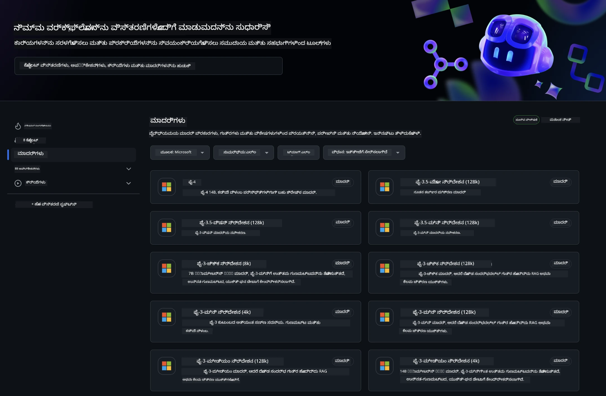
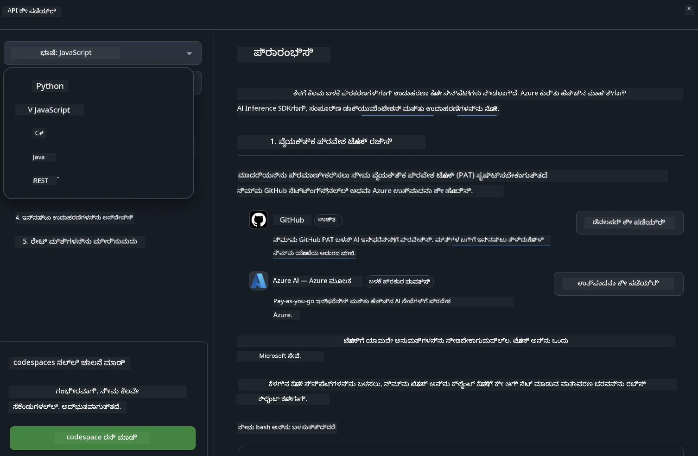
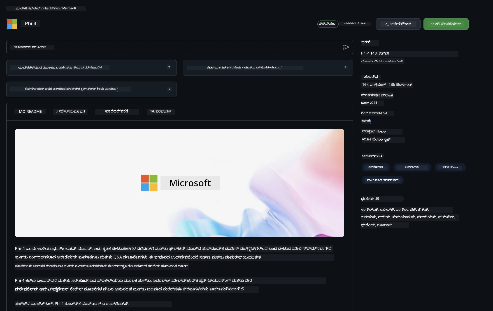

## GitHub Models - ಸೀಮಿತ ಸಾರ್ವಜನಿಕ ಬೇಟಾ

Welcome to [GitHub Models](https://github.com/marketplace/models)! ನಾವು ಎಲ್ಲವೂ ಸಿದ್ಧಪಡಿಸಿದ್ದೇವೆ ಮತ್ತು ನೀವು Azure AI ನಲ್ಲಿ ಹೋಸ್ಟ್ ಮಾಡಲಾಗಿರುವ AI ಮಾದರಿಗಳನ್ನು ಅನ್ವೇಷಿಸಲು ಸಿದ್ದರಾಗಿದ್ದೇವೆ.



GitHub Models ನಲ್ಲಿ ಲಭ್ಯವಿರುವ ಮಾದರಿಗಳ ಬಗ್ಗೆ ಹೆಚ್ಚಿನ ಮಾಹಿತಿಗಾಗಿ, [GitHub Model Marketplace](https://github.com/marketplace/models) ಅನ್ನು ಪರಿಶೀಲಿಸಿ

## ಲಭ್ಯವಿರುವ ಮಾದರಿಗಳು

प्रತಿಯೊಂದು ಮಾದರಿಗೆ ಸಮರ್ಪಿತ ಪ್ಲೇಗ್ರೌಂಡ್ ಮತ್ತು ಉದಾಹರಣೆ ಕೋಡ್ ಇದೆ


### GitHub Model Catalog ನಲ್ಲಿ Phi-3 ಮಾದರಿಗಳು

[Phi-3-Medium-128k-Instruct](https://github.com/marketplace/models/azureml/Phi-3-medium-128k-instruct)

[Phi-3-medium-4k-instruct](https://github.com/marketplace/models/azureml/Phi-3-medium-4k-instruct)

[Phi-3-mini-128k-instruct](https://github.com/marketplace/models/azureml/Phi-3-mini-128k-instruct)

[Phi-3-mini-4k-instruct](https://github.com/marketplace/models/azureml/Phi-3-mini-4k-instruct)

[Phi-3-small-128k-instruct](https://github.com/marketplace/models/azureml/Phi-3-small-128k-instruct)

[Phi-3-small-8k-instruct](https://github.com/marketplace/models/azureml/Phi-3-small-8k-instruct)

## ಪ್ರಾರಂಭಿಸುವುದು

ನಡೆಗತ್ತಲು ಸಿದ್ಧವಾಗಿರುವ ಕೆಲವು ಮೂಲ ಉದಾಹರಣೆಗಳಿವೆ. ಅವುಗಳನ್ನು samples directory ನಲ್ಲಿ ನೀವು ಕಾಣಬಹುದು. ನೀವು ನೇರವಾಗಿ ನಿಮ್ಮ ಮೆಚ್ಚಿನ ಭಾಷೆಗೆ ಹೋಗಲು ಬಯಸಿದರೆ, ಕೆಳಗಿನ ಭಾಷೆಗಳಲ್ಲಿ ಉದಾಹರಣೆಗಳನ್ನು ಕಾಣಬಹುದು:

- Python
- JavaScript
- cURL

ಉದಾಹರಣೆಗಳು ಮತ್ತು ಮಾದರಿಗಳನ್ನು ನಿರ್ವಹಿಸಲು ಒಂದು ಸಮರ್ಪಿತ Codespaces ಪರಿಸರವೂ ಇದೆ. 




## ಉದಾಹರಣಾ ಕೋಡ್ 

ಕೆಳಗಿನವು ಕೆಲವು ಬಳಕೆಯ ಪ್ರಕರಣಗಳಿಗಾಗಿ ಉದಾಹರಣಾ ಕೋಡ್ ಸ್ನಿಪೆಟ್‌ಗಳು. Azure AI Inference SDK ಬಗ್ಗೆ ಹೆಚ್ಚಿನ ಮಾಹಿತಿಗೆ, ಪೂರ್ಣ ಡಾಕ್ಯುಮೆಂಟೇಶನ್ ಮತ್ತು samples ಅನ್ನು ನೋಡಿ.

## ಸಿದ್ಧತೆ 

1. ವೈಯಕ್ತಿಕ ಪ್ರವೇಶ ಟೋಕನ್ ರಚಿಸಿ
ಟೋಕನ್‌ಗೆ ಯಾವುದೇ ಅನುಮತಿಗಳನ್ನು ನೀಡಬೇಕಿಲ್ಲ. ಟೋಕನ್ ಅನ್ನು ಒಂದು Microsoft ಸೇವೆಗೆ ಕಳುಹಿಸಲಾಗುತ್ತದೆ ಎಂದು ಗಮನಿಸಿ.

ಕೆಳಗಿನ ಕೋಡ್ ಸ್ನಿಪೆಟ್‌ಗಳನ್ನು ಬಳಸಲು, ನಿಮ್ಮ ಟೋಕನ್ ಅನ್ನು ಕ್ಲೈಂಟ್ ಕೋಡ್‌ನ ಕೀ ಆಗಿ ಹೊಂದಿಸಲು ಒಂದು ಪರಿಸರ ಚರ (environment variable) ರಚಿಸಿ.

If you're using bash:
```
export GITHUB_TOKEN="<your-github-token-goes-here>"
```
If you're in powershell:

```
$Env:GITHUB_TOKEN="<your-github-token-goes-here>"
```

If you're using Windows command prompt:

```
set GITHUB_TOKEN=<your-github-token-goes-here>
```

## Python Sample

### Install dependencies
pip ಬಳಸಿಸಿ Azure AI Inference SDK ಅನ್ನು ಇನ್‌ಸ್ಟಾಲ್ ಮಾಡಿ (ಅವಶ್ಯಕತೆ: Python >=3.8):

```
pip install azure-ai-inference
```
### Run a basic code sample

ಈ ಉದಾಹರಣೆ ಚಾಟ್ ಪೂರ್ಣಗೊಳಿಸುವ API ಗೆ ಮೂಲ ಕರೆ ಹೇಗೆ ಮಾಡಬಹುದು ಎಂಬುದನ್ನು ತೋರಿಸುತ್ತದೆ. ಇದು GitHub AI ಮಾದರಿ ಇನ್ಫರೆನ್ಸ್ ಎಂಡ್ಪಾಯಿಂಟ್ ಮತ್ತು ನಿಮ್ಮ GitHub ಟೋಕನ್ ಅನ್ನು ಬಳಸುತ್ತದೆ. ಕರೆ ಸಮಕಾಲೀನವಾಗಿದೆ.

```
import os
from azure.ai.inference import ChatCompletionsClient
from azure.ai.inference.models import SystemMessage, UserMessage
from azure.core.credentials import AzureKeyCredential

endpoint = "https://models.inference.ai.azure.com"
# Replace Model_Name 
model_name = "Phi-3-small-8k-instruct"
token = os.environ["GITHUB_TOKEN"]

client = ChatCompletionsClient(
    endpoint=endpoint,
    credential=AzureKeyCredential(token),
)

response = client.complete(
    messages=[
        SystemMessage(content="You are a helpful assistant."),
        UserMessage(content="What is the capital of France?"),
    ],
    model=model_name,
    temperature=1.,
    max_tokens=1000,
    top_p=1.
)

print(response.choices[0].message.content)
```

### Run a multi-turn conversation

ಈ ಉದಾಹರಣೆ ಚಾಟ್ ಪೂರ್ಣಗೊಳಿಸುವ API ಮೂಲಕ ಬಹು-ಚರಣ ಸಂಭಾಷಣೆಯನ್ನು ತೋರಿಸುತ್ತದೆ. ಚಾಟ್ ಅಪ್ಲಿಕೇಶನ್‌ಗಾಗಿ ಮಾದರಿಯನ್ನು ಬಳಸುವಾಗ, ಆ ಸಂಭಾಷಣೆಯ ಇತಿಹಾಸವನ್ನು ನಿರ್ವಹಿಸಿ ಮತ್ತು ಇತ್ತೀಚಿನ ಸಂದೇಶಗಳನ್ನು ಮಾದರಿಗೆ ಕಳುಹಿಸುವ ಅಗತ್ಯವಿರುತ್ತದೆ.

```
import os
from azure.ai.inference import ChatCompletionsClient
from azure.ai.inference.models import AssistantMessage, SystemMessage, UserMessage
from azure.core.credentials import AzureKeyCredential

token = os.environ["GITHUB_TOKEN"]
endpoint = "https://models.inference.ai.azure.com"
# Replace Model_Name
model_name = "Phi-3-small-8k-instruct"

client = ChatCompletionsClient(
    endpoint=endpoint,
    credential=AzureKeyCredential(token),
)

messages = [
    SystemMessage(content="You are a helpful assistant."),
    UserMessage(content="What is the capital of France?"),
    AssistantMessage(content="The capital of France is Paris."),
    UserMessage(content="What about Spain?"),
]

response = client.complete(messages=messages, model=model_name)

print(response.choices[0].message.content)
```

### Stream the output

ಉತ್ತಮ ಬಳಕೆದಾರ ಅನುಭವಕ್ಕಾಗಿ, ಮೊದಲ ಟೋಕನ್ ಬೇಗ ಕಾಣುವಂತೆ ಮತ್ತು ದೀರ್ಘ ಪ್ರತಿಕ್ರಿಯೆಗಾಗಿ ನಿರೀಕ್ಷಿಸುವ ಅಗತ್ಯವನ್ನು ಕಡಿಮೆ ಮಾಡಿಕೊಳ್ಳಲು, ಮಾದರಿಯ ಪ್ರತಿಕ್ರಿಯೆಯನ್ನು ಸ್ಟ್ರೀಮ್ ಮಾಡಬೇಕು.

```
import os
from azure.ai.inference import ChatCompletionsClient
from azure.ai.inference.models import SystemMessage, UserMessage
from azure.core.credentials import AzureKeyCredential

token = os.environ["GITHUB_TOKEN"]
endpoint = "https://models.inference.ai.azure.com"
# Replace Model_Name
model_name = "Phi-3-small-8k-instruct"

client = ChatCompletionsClient(
    endpoint=endpoint,
    credential=AzureKeyCredential(token),
)

response = client.complete(
    stream=True,
    messages=[
        SystemMessage(content="You are a helpful assistant."),
        UserMessage(content="Give me 5 good reasons why I should exercise every day."),
    ],
    model=model_name,
)

for update in response:
    if update.choices:
        print(update.choices[0].delta.content or "", end="")

client.close()
```
## JavaScript 

### Install dependencies

Node.js ಅನ್ನು ಇನ್‌ಸ್ಟಾಲ್ ಮಾಡಿ.

ಕೆಳಗಿನ ಸಾಲುಗಳನ್ನು ನಕಲಿಸಿ ಮತ್ತು ನಿಮ್ಮ ಫೋಲ್ಡರಿನ ಒಳಗೆ package.json ಎಂಬ ಫೈಲ್ ಆಗಿ ಉಳಿಸಿ.

```
{
  "type": "module",
  "dependencies": {
    "@azure-rest/ai-inference": "latest",
    "@azure/core-auth": "latest",
    "@azure/core-sse": "latest"
  }
}
```

Note: @azure/core-sse is only needed when you stream the chat completions response.

ಈ ಫೋಲ್ಡರಿನಲ್ಲಿ ಟೆರ್ಮಿನಲ್ ವಿಂಡೋ ಓಪನ್ ಮಾಡಿ ಮತ್ತು npm install ರನ್ ಮಾಡಿ.

ಕೆಳಗಿನ ಪ್ರತಿಯೊಂದು ಕೋಡ್ ಸ್ನಿಪೆಟ್‌ಗಾಗಿ, ವಿಷಯವನ್ನು sample.js ಎಂಬ ಫೈಲಿಗೆ ನಕಲಿಸಿ ಮತ್ತು node sample.js ಮೂಲಕ ರನ್ ಮಾಡಿ.

### Run a basic code sample

ಈ ಉದಾಹರಣೆ ಚಾಟ್ ಪೂರ್ಣಗೊಳಿಸುವ API ಗೆ ಮೂಲ ಕರೆ ಹೇಗೆ ಮಾಡಬಹುದು ಎಂಬುದನ್ನು ತೋರಿಸುತ್ತದೆ. ಇದು GitHub AI ಮಾದರಿ ಇನ್ಫರೆನ್ಸ್ ಎಂಡ್ಪಾಯಿಂಟ್ ಮತ್ತು ನಿಮ್ಮ GitHub ಟೋಕನ್ ಅನ್ನು ಬಳಸುತ್ತದೆ. ಕರೆ ಸಮಕಾಲೀನವಾಗಿದೆ.

```
import ModelClient from "@azure-rest/ai-inference";
import { AzureKeyCredential } from "@azure/core-auth";

const token = process.env["GITHUB_TOKEN"];
const endpoint = "https://models.inference.ai.azure.com";
// Update your modelname
const modelName = "Phi-3-small-8k-instruct";

export async function main() {

  const client = new ModelClient(endpoint, new AzureKeyCredential(token));

  const response = await client.path("/chat/completions").post({
    body: {
      messages: [
        { role:"system", content: "You are a helpful assistant." },
        { role:"user", content: "What is the capital of France?" }
      ],
      model: modelName,
      temperature: 1.,
      max_tokens: 1000,
      top_p: 1.
    }
  });

  if (response.status !== "200") {
    throw response.body.error;
  }
  console.log(response.body.choices[0].message.content);
}

main().catch((err) => {
  console.error("The sample encountered an error:", err);
});
```

### Run a multi-turn conversation

ಈ ಉದಾಹರಣೆ ಚಾಟ್ ಪೂರ್ಣಗೊಳಿಸುವ API ಮೂಲಕ ಬಹು-ಚರಣ ಸಂಭಾಷಣೆಯನ್ನು ತೋರಿಸುತ್ತದೆ. ಚಾಟ್ ಅಪ್ಲಿಕೇಶನ್‌ಗಾಗಿ ಮಾದರಿಯನ್ನು ಬಳಸುವಾಗ, ಆ ಸಂಭಾಷಣೆಯ ಇತಿಹಾಸವನ್ನು ನಿರ್ವಹಿಸಿ ಮತ್ತು ಇತ್ತೀಚಿನ ಸಂದೇಶಗಳನ್ನು ಮಾದರಿಗೆ ಕಳುಹಿಸುವ ಅಗತ್ಯವಿರುತ್ತದೆ.

```
import ModelClient from "@azure-rest/ai-inference";
import { AzureKeyCredential } from "@azure/core-auth";

const token = process.env["GITHUB_TOKEN"];
const endpoint = "https://models.inference.ai.azure.com";
// Update your modelname
const modelName = "Phi-3-small-8k-instruct";

export async function main() {

  const client = new ModelClient(endpoint, new AzureKeyCredential(token));

  const response = await client.path("/chat/completions").post({
    body: {
      messages: [
        { role: "system", content: "You are a helpful assistant." },
        { role: "user", content: "What is the capital of France?" },
        { role: "assistant", content: "The capital of France is Paris." },
        { role: "user", content: "What about Spain?" },
      ],
      model: modelName,
    }
  });

  if (response.status !== "200") {
    throw response.body.error;
  }

  for (const choice of response.body.choices) {
    console.log(choice.message.content);
  }
}

main().catch((err) => {
  console.error("The sample encountered an error:", err);
});
```

### Stream the output
ಉತ್ತಮ ಬಳಕೆದಾರ ಅನುಭವಕ್ಕಾಗಿ, ಮೊದಲ ಟೋಕನ್ ಬೇಗ ಕಾಣುವಂತೆ ಮತ್ತು ದೀರ್ಘ ಪ್ರತಿಕ್ರಿಯೆಗಾಗಿ ನಿರೀಕ್ಷಿಸುವ ಅಗತ್ಯವನ್ನು ಕಡಿಮೆ ಮಾಡಿಕೊಳ್ಳಲು, ಮಾದರಿಯ ಪ್ರತಿಕ್ರಿಯೆಯನ್ನು ಸ್ಟ್ರೀಮ್ ಮಾಡಬೇಕು.

```
import ModelClient from "@azure-rest/ai-inference";
import { AzureKeyCredential } from "@azure/core-auth";
import { createSseStream } from "@azure/core-sse";

const token = process.env["GITHUB_TOKEN"];
const endpoint = "https://models.inference.ai.azure.com";
// Update your modelname
const modelName = "Phi-3-small-8k-instruct";

export async function main() {

  const client = new ModelClient(endpoint, new AzureKeyCredential(token));

  const response = await client.path("/chat/completions").post({
    body: {
      messages: [
        { role: "system", content: "You are a helpful assistant." },
        { role: "user", content: "Give me 5 good reasons why I should exercise every day." },
      ],
      model: modelName,
      stream: true
    }
  }).asNodeStream();

  const stream = response.body;
  if (!stream) {
    throw new Error("The response stream is undefined");
  }

  if (response.status !== "200") {
    stream.destroy();
    throw new Error(`Failed to get chat completions, http operation failed with ${response.status} code`);
  }

  const sseStream = createSseStream(stream);

  for await (const event of sseStream) {
    if (event.data === "[DONE]") {
      return;
    }
    for (const choice of (JSON.parse(event.data)).choices) {
        process.stdout.write(choice.delta?.content ?? ``);
    }
  }
}

main().catch((err) => {
  console.error("The sample encountered an error:", err);
});
```

## REST 

### Run a basic code sample

ಕೆಳಗಿನುದನ್ನು ಒಂದು ಶೆಲ್‌ಗೆ ಪೇಸ್ಟ್ ಮಾಡಿ:

```
curl -X POST "https://models.inference.ai.azure.com/chat/completions" \
    -H "Content-Type: application/json" \
    -H "Authorization: Bearer $GITHUB_TOKEN" \
    -d '{
        "messages": [
            {
                "role": "system",
                "content": "You are a helpful assistant."
            },
            {
                "role": "user",
                "content": "What is the capital of France?"
            }
        ],
        "model": "Phi-3-small-8k-instruct"
    }'
```
### Run a multi-turn conversation

ಚಾಟ್ ಪೂರ್ಣಗೊಳಿಸುವ API ಅನ್ನು ಕರೆ ಮಾಡಿ ಮತ್ತು ಚಾಟ್ ಇತಿಹಾಸವನ್ನು ಕಳುಹಿಸಿ:

```
curl -X POST "https://models.inference.ai.azure.com/chat/completions" \
    -H "Content-Type: application/json" \
    -H "Authorization: Bearer $GITHUB_TOKEN" \
    -d '{
        "messages": [
            {
                "role": "system",
                "content": "You are a helpful assistant."
            },
            {
                "role": "user",
                "content": "What is the capital of France?"
            },
            {
                "role": "assistant",
                "content": "The capital of France is Paris."
            },
            {
                "role": "user",
                "content": "What about Spain?"
            }
        ],
        "model": "Phi-3-small-8k-instruct"
    }'
```
### Stream the output

ಇದು ಎಂಡ್ಪಾಯಿಂಟ್ ಅನ್ನು ಕರೆಮಾಡಿ ಪ್ರತಿಕ್ರಿಯೆಯನ್ನು ಸ್ಟ್ರೀಮ್ ಮಾಡುವ ಉದಾಹರಣೆ.

```
curl -X POST "https://models.inference.ai.azure.com/chat/completions" \
    -H "Content-Type: application/json" \
    -H "Authorization: Bearer $GITHUB_TOKEN" \
    -d '{
        "messages": [
            {
                "role": "system",
                "content": "You are a helpful assistant."
            },
            {
                "role": "user",
                "content": "Give me 5 good reasons why I should exercise every day."
            }
        ],
        "stream": true,
        "model": "Phi-3-small-8k-instruct"
    }'
```

## GitHub Models ಗಾಗಿ ಉಚಿತ ಬಳಕೆ ಮತ್ತು ರೇಟ್ ಮಿತಿಗಳು



[playground ಮತ್ತು ಉಚಿತ API ಬಳಕೆಯ ರೇಟ್ ಮಿತಿಗಳು](https://docs.github.com/en/github-models/prototyping-with-ai-models#rate-limits) ನಿಮಗೆ ಮಾದರಿಗಳೊಂದಿಗೆ ಪ್ರಯೋಗ ಮಾಡಲು ಮತ್ತು ನಿಮ್ಮ AI ಅಪ್ಲಿಕೇಶನ್‌ನ ಪ್ರೋಟೋಟೈಪ್ ರಚಿಸಲು ಸಹಾಯ ಮಾಡುವ ಉದ್ದೇಶಕ್ಕಾಗಿ ಇರುವುವು. ಆ ಮಿತಿಗಳನ್ನು ಮೀರಿ ಬಳಕೆ ಮಾಡಲು ಮತ್ತು ನಿಮ್ಮ ಅಪ್ಲಿಕೇಶನನ್ನು ಅಳೆತಿಟ್ಟು ದೊಡ್ಡ ಮಟ್ಟಕ್ಕೆ ತರುವುದಕ್ಕಾಗಿ, ನೀವು Azure ಖಾತೆಯಿಂದ ಸಂಪನ್ಮೂಲಗಳನ್ನು ಒದಗಿಸಬೇಕು ಮತ್ತು ಅಲ್ಲಿ GitHub ವೈಯಕ್ತಿಕ ಪ್ರವೇಶ ಟೋಕನ್ ಬದಲಾಗಿಸಿ ಅಲ್ಲಿ ಪ್ರಾಮಾಣೀಕರಣ ಮಾಡಬೇಕು. ನಿಮ್ಮ ಕೋಡ್‌ನಲ್ಲಿ ಬೇರೆ ಯಾವುದನ್ನು ಬದಲಾಯಿಸುವ ಅಗತ್ಯವಿಲ್ಲ. Azure AIನಲ್ಲಿ ಉಚಿತ ಶ್ರೇಣಿ ಮಿತಿಗಳನ್ನು ಮೀರೆದು ಹೇಗೆ ಮುಂದುವರಿಯುವುದನ್ನು ಕಂಡುಹಿಡಿಯಲು ಈ ಲಿಂಕ್ ಅನ್ನು ಬಳಸಿರಿ.


### ಬಹಿರಂಗಪಡಣೆಗಳು

ಮಾದರಿಯೊಂದರೊಂದಿಗೆ ಮಾತುಕತೆ ನಡೆಸುವಾಗ ನೀವು AI ಯೊಂದಿಗೆ ಪ್ರಯೋಗ ಮಾಡುತ್ತಿದ್ದೀರಿ ಎಂದು ನೆನಪಿರಲಿ, ಆದ್ದರಿಂದ ವಿಷಯದ ತಪ್ಪುಗಳಾಗುವ ಸಾಧ್ಯತೆ ಇದೆ.

ಈ ವೈಶಿಷ್ಟ್ಯವು ವಿವಿಧ ಮಿತಿಗಳಿಗೆ ಒಳಪಡುತ್ತದೆ (ಪ್ರತಿ ನಿಮಿಷಕ್ಕೆ ಕೋರಿಕೆಗಳು, ಪ್ರತಿ ದಿನಕ್ಕೆ ಕೋರಿಕೆಗಳು, ಪ್ರತಿ ಕೋರಿಕೆಗೆ ಟೋಕನ್ಸ್, ಮತ್ತು ಸಮಕಾಲೀನ ಕೋರಿಕೆಗಳು ಸೇರಿ) ಮತ್ತು ಉತ್ಪಾದನಾ ಬಳಕೆಯ ಸಂದರ್ಭಗಳಿಗೆ ರೂಪುಗೊಂಡದ್ದು ಅಲ್ಲ.

GitHub Models Azure AI Content Safety ಅನ್ನು ಬಳಸುತ್ತದೆ. GitHub Models ಅನುಭವದ ಭಾಗವಾಗಿ ಈ ಫಿಲ್ಟರ್‌ಗಳನ್ನು ನಿಷ್ಕ್ರಿಯಗೊಳಿಸಲಾಗುವುದಿಲ್ಲ. ನೀವು ಪಾವತಿಸಬಹುದಾದ ಸೇವೆಯ ಮೂಲಕ ಮಾದರಿಗಳನ್ನು ಉದ್ಯೋಗದಲ್ಲಿ ಬಳಸಲು ನಿರ್ಧರಿಸಿದರೆ, ದಯವಿಟ್ಟು ನಿಮ್ಮ ಅವಶ್ಯಕತೆಗಳನ್ನು ಪೂರೈಸಲು ನಿಮ್ಮ ವಿಷಯ ಫಿಲ್ಟರ್‌ಗಳನ್ನು ಸಂರಚಿಸಿ.

ಈ ಸೇವೆ GitHub ನ ಪೂರ್ವ-ರಿಲೀಸ್ ನಿಯಮಗಳ ಅಡಿ ಬರುತ್ತದೆ.

---

<!-- CO-OP TRANSLATOR DISCLAIMER START -->
ಅಸ್ವೀಕರಣ:

ಈ ದಸ್ತಾವೇಜನ್ನು AI ಅನುವಾದ ಸೇವೆ [Co-op Translator](https://github.com/Azure/co-op-translator) ಬಳಸಿ ಅನುವಾದಿಸಲಾಗಿದೆ. ನಾವು ಶುದ್ಧತೆಯತ್ತ ಪ್ರಯತ್ನಿಸುತ್ತಿದ್ದರೂ ಸಹ, ಸ್ವಯಂಚಾಲಿತ ಅನುವಾದಗಳಲ್ಲಿ ದೋಷಗಳು ಅಥವಾ ಅಸಮತ್ಯತೆಗಳು থাকতে ಸಾಧ್ಯವೆನನ್ನು ದಯವಿಟ್ಟು ಗಮನಿಸಿ. ಮೂಲ ಭಾಷೆಯಲ್ಲಿರುವ ಮೂಲ ದಸ್ತಾವೇಜನ್ನು ಅಧಿಕಾರಪ್ರದ ಮತ್ತು ಪ್ರಾಮಾಣಿಕ ಮೂಲವಾಗಿ ಪರಿಗಣಿಸಬೇಕು. ನಿರ್ಣಾಯಕ ಮಾಹಿತಿಗಾಗಿ ವೃತ್ತಿಪರ ಮಾನವ ಅನುವಾದವನ್ನು ಶಿಫಾರಸುಿಸಲಾಗುತ್ತದೆ. ಈ ಅನುವಾದದ ಬಳಕೆಯಿಂದ ಉಂಟಾಗುವ ಯಾವುದೇ ತಪ್ಪು ಅರ್ಥಗರ್ಭಿತತೆಗಳು ಅಥವಾ ದೋಷಭ್ರಮೆಗಳಿಗಾಗಿ ನಾವು ಹೊಣೆಗಾರರಾಗಿರುವುದಿಲ್ಲ.
<!-- CO-OP TRANSLATOR DISCLAIMER END -->