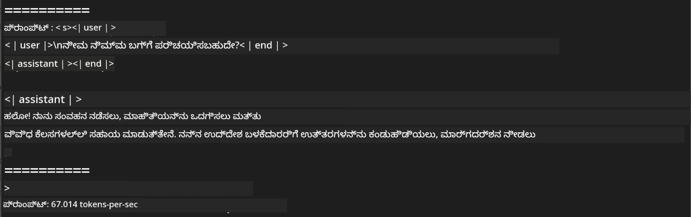
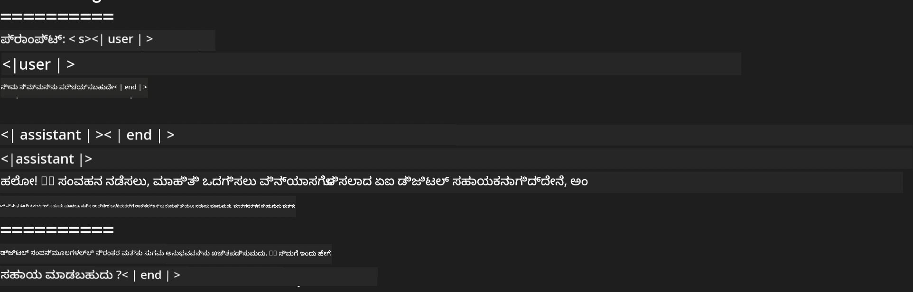

<!--
CO_OP_TRANSLATOR_METADATA:
{
  "original_hash": "dcb656f3d206fc4968e236deec5d4384",
  "translation_date": "2025-12-21T22:14:55+00:00",
  "source_file": "md/03.FineTuning/03.Inference/MLX_Inference.md",
  "language_code": "kn"
}
-->
# **Apple MLX ಫ್ರೆಮ್ವರ್ಕ್‌ನೊಂದಿಗೆ Phi-3 ಅನ್ನು ಇನುಫರೆನ್ಸ್ ಮಾಡುವುದು**

## **MLX ಫ್ರೆಮ್ವರ್ಕ್ ಎಂದರೆ ಏನು**

MLX は Apple silikon ಮೇಲೆ ಯಂತ್ರ ಅಧ್ಯಯನ ಸಂಶೋಧನೆಗೆ ಇರುವ ಒಂದು ಅರೇ ಫ್ರೆಮ್ವರ್ಕ್, ಇದು Apple machine learning research ಮೂಲಕ ನಿಮಗೆ ಪರಿಚಯಿಸಲಾಗಿದೆ.

MLX ಅನ್ನು ಯಂತ್ರ ಅಧ್ಯಯನ ಸಂಶೋಧಕರ 의해 ಯಂತ್ರ ಅಧ್ಯಯನ ಸಂಶೋಧಕರಿಗಾಗಿ ವಿನ್ಯಾಸಗೊಳಿಸಲಾಗಿದೆ. ಫ್ರೆಮ್ವರ್ಕ್ ಬಳಕೆದಾರ ಸ್ನೇಹಿ ಆಗಿರಲು ಉದ್ದೇಶಿಸಲಾಗಿದೆ, ಆದರೆ ಮಾದರಿಗಳನ್ನು ತರಬೇತು ಮಾಡುವುದು ಮತ್ತು despley ಮಾಡಿ ನಿರ್ವಹಿಸೋದಕ್ಕೆ ಪರಿಣಾಮಕಾರಿಯಾಗಿ ಕೂಡಿದೆ. ಫ್ರೆಮ್ವარკಿನ ವಿನ್ಯಾಸ ತತ್ತ್ವಾತ್ಮಕವಾಗಿ ಸರಳವಾಗಿದೆ. ಹೊಸ ಐದೀಯಾಗಳನ್ನು ತ್ವರಿತವಾಗಿ ಪರಿಶೀಲಿಸುವ ಉದ್ದೇಶದಿಂದ ಸಂಶೋಧಕರು MLX ಅನ್ನು ವಿಸ್ತರಿಸಿ ಸುಧಾರಿಸಬಹುದಾದಂತೆ ಮಾಡುವುದು ನಮ್ಮ ಉದ್ದೇಶವಾಗಿದೆ.

LLMs ಗಳನ್ನು Apple Silicon ಸಾಧನಗಳಲ್ಲಿ MLX ಮೂಲಕ ವೇಗವರ್ಧನೆ ಮಾಡಬಹುದು, ಮತ್ತು ಮಾದರಿಗಳನ್ನು ಸ್ಥಳೀಯವಾಗಿ ಸುಗಮವಾಗಿ ಚಾಲನೆ ಮಾಡಬಹುದು.

## **MLX ಬಳಸಿ Phi-3-mini ಇನುಫರೆನ್ಸ್ ಮಾಡುವುದು**

### **1. ನಿಮ್ಮ MLX ಪರಿಸರವನ್ನು ಸಜ್ಜುಗೊಳಿಸುವುದು**

1. Python 3.11.x
2. Install MLX Library


```bash

pip install mlx-lm

```

### **2. MLX ಬಳಸಿ ಟರ್ಮಿನಲ್‌ನಲ್ಲಿ Phi-3-mini ರನ್ನು ರನ್ ಮಾಡುವುದು**


```bash

python -m mlx_lm.generate --model microsoft/Phi-3-mini-4k-instruct --max-token 2048 --prompt  "<|user|>\nCan you introduce yourself<|end|>\n<|assistant|>"

```

ಫಲಿತಾಂಶ (ನನ್ನ ಪರಿಸರ Apple M1 Max,64GB) ಇಂತಿದೆ



### **3. ಟರ್ಮಿನಲ್‌ನಲ್ಲಿ MLX ಬಳಸಿ Phi-3-mini ಅನ್ನು ಕ್ವಾಂಟೈಜ್ ಮಾಡುವುದು**


```bash

python -m mlx_lm.convert --hf-path microsoft/Phi-3-mini-4k-instruct

```

***ಗಮನಿಸಿ：*** ಮಾದರಿಯನ್ನು mlx_lm.convert ಮೂಲಕ ಕ್ವಾಂಟೈಜ್ ಮಾಡಬಹುದು, ಮತ್ತು ಡೀಫಾಲ್ಟ್ ಕ್ವಾಂಟೈಸೇಶನ್ INT4 ಆಗಿದೆ. ಈ ಉದಾಹರಣೆ Phi-3-mini ಅನ್ನು INT4 ಗೆ ಕ್ವಾಂಟೈಜ್ ಮಾಡುತ್ತದೆ

ಮಾದರಿಯನ್ನು mlx_lm.convert ಮೂಲಕ ಕ್ವಾಂಟೈಜ್ ಮಾಡಬಹುದು, ಮತ್ತು ಡೀಫಾಲ್ಟ್ ಕ್ವಾಂಟೈಸೇಶನ್ INT4 ಆಗಿದೆ. ಈ ಉದಾಹರಣೆಯ ಉದ್ದೇಶ Phi-3-mini ಅನ್ನು INT4 ಗೆ ಕ್ವಾಂಟೈಜ್ ಮಾಡುವುದು. ಕ್ವಾಂಟೈಸೇಶನ್ ನಂತರ, ಅದು ಡೀಫಾಲ್ಟ್ ಡೈರೆಕ್ಟರಿಯಲ್ಲಿ ./mlx_model ನಲ್ಲಿ ಸಂರಕ್ಷಿಸబడುತ್ತದೆ

ನಾವು ಟರ್ಮಿನಲ್‌ನಿಂದ MLX ನಲ್ಲಿ ಕ್ವಾಂಟೈಜ್ ಮಾಡಿದ ಮಾದರಿಯನ್ನು ಪರೀಕ್ಷಿಸಬಹುದು


```bash

python -m mlx_lm.generate --model ./mlx_model/ --max-token 2048 --prompt  "<|user|>\nCan you introduce yourself<|end|>\n<|assistant|>"

```

ಫಲಿತಾಂಶ ಇದಾಗಿದೆ




### **4. Jupyter Notebook ನಲ್ಲಿ MLX ಬಳಸಿ Phi-3-mini ರನ್ ಮಾಡುವುದು**


***ಗಮನಿಸಿ:*** ದಯವಿಟ್ಟು ಈ ಮಾದರಿಯನ್ನು ಓದಿ [ಈ ಲಿಂಕ್ ಅನ್ನು ಕ್ಲಿಕ್ ಮಾಡಿ](../../../code/03.Inference/MLX/MLX_DEMO.ipynb)


## **ಸಂಪನ್ಮೂಲಗಳು**

1. Apple MLX ಫ್ರೆಮ್ವರ್ಕ್ ಕುರಿತು ತಿಳಿಯಿರಿ [https://ml-explore.github.io](https://ml-explore.github.io/mlx/build/html/index.html)

2. Apple MLX GitHub ರೆಪೊ [https://github.com/ml-explore](https://github.com/ml-explore)

---

<!-- CO-OP TRANSLATOR DISCLAIMER START -->
ಅಸ್ವೀಕಾರ:
ಈ ದಸ್ತಾವೇಜು AI ಅನುವಾದ ಸೇವೆ [Co-op Translator](https://github.com/Azure/co-op-translator) ಬಳಸಿ ಅನುವಾದಿಸಲಾಗಿದೆ. ನಾವು ನಿಖರತೆಗೆ ಪ್ರಯತ್ನಿಸಿದರೂ, ಸ್ವಯಂಚಾಲಿತ ಅನುವಾದಗಳಲ್ಲಿ ತಪ್ಪುಗಳು ಅಥವಾ ಅಸತ್ಯತೆಗಳು ಇರಬಹುದು ಎಂಬುದನ್ನು ದಯವಿಟ್ಟು ಗಮನಿಸಿ. ಮೂಲ ದಸ್ತಾವೇಜನ್ನು ಅದರ ಮೂಲ ಭಾಷೆಯಲ್ಲಿನ ಪ್ರತಿಯನ್ನು ಅಧಿಕೃತ ಮೂಲವಾಗಿ ಪರಿಗಣಿಸಬೇಕು. ಗಂಭೀರ ಮಾಹಿತಿಗಾಗಿ ವೃತ್ತಿಪರ ಮಾನವ ಅನುವಾದವನ್ನು ಶಿಫಾರಸು ಮಾಡಲಾಗುತ್ತದೆ. ಈ ಅನುವಾದದ ಬಳಕೆಯಿಂದ ಉಂಟಾಗುವ ಯಾವುದೇ ತಪ್ಪು ಅರ್ಥಗಳೋ ಅಥವಾ ತಪ್ಪಾದ ವ್ಯಾಖ್ಯಾನಗಳೋಗಾಗಿ ನಾವು ಹೊಣೆಗಾರರಾಗುವುದಿಲ್ಲ.
<!-- CO-OP TRANSLATOR DISCLAIMER END -->