# Azure AI Foundry ಬಳಸಿ Phi-3 ಅನ್ನು ಫೈನ್-ಟ್ಯೂನ್ ಮಾಡುವುದು

 ನಮಗೆ Azure AI Foundry ಬಳಸಿ Microsoft ಅವರ Phi-3 Mini ಭಾಷಾ ಮಾದರಿಯನ್ನು ಹೇಗೆ ಫೈನ್-ಟ್ಯೂನ್ ಮಾಡಬೇಕು ಎಂಬುದನ್ನು ಅನ್ವೇಷಿಸೋಣ. ಫೈನ್-ಟ್ಯೂನಿಂಗ್ Phi-3 Mini ಅನ್ನು ನಿರ್ದಿಷ್ಟ ಕಾರ್ಯಗಳಿಗೆ ಹೊಂದಿಸಲು ಸಹಾಯ ಮಾಡುತ್ತದೆ, ಅದನ್ನು ಇನ್ನೂ ಶಕ್ತಿಶಾಲಿ ಮತ್ತು ಸನ್ನಿವೇಶ-ಅನಿವಾರ್ಯವಾಗಿಸಲು ಮಾಡುತ್ತದೆ.

## ಪರಿಗಣನೆಗಳು

- **Capabilities:** ಯಾವ ಮಾದರಿಗಳನ್ನು ಫೈನ್-ಟ್ಯೂನ್ ಮಾಡಬಹುದು? ಮೂಲ ಮಾದರಿಯನ್ನು ಯಾವ ಕಾರ್ಯಗಳಿಗೆ ಫೈನ್-ಟ್ಯೂನ್ ಮಾಡಬಹುದು?
- **Cost:** ಫೈನ್ ಟ್ಯೂನಿಂಗ್‌ಗಾಗಿ ಬೆಲಾ ಮಾದರಿ ಏನಿದೆ
**Customizability:** ಮೂಲ ಮಾದರಿಯನ್ನು ಎಷ್ಟು ಬದಲಾಯಿಸಬಹುದು – ಮತ್ತು ಯಾವ ರೀತಿಯಲ್ಲಿ?
- **Convenience:** ಫೈನ್-ಟ್ಯೂನಿಂಗ್ ವಾಸ್ತವವಲ್ಲದೆ ಹೇಗೆ ನಡೆಯುತ್ತದೆ – ನನಗೆ ಕಸ್ಟಮ್ ಕೋಡ್ ಬರೆಯಬೇಕಾಗುತ್ತದಾ? ನನ್ನದೇ ಕಂಪ್ಯೂಟ್ ತರಬೇಕು ಎಲ್ಲ?
- **Safety:** ಫೈನ್-ಟ್ಯೂನ್ ಮಾಡಿದ ಮಾದರಿಗಳಿಗೆ ಸುರಕ್ಷತಾ ಅಪಾಯಗಳು ಇರುವಂತೆ ತಿಳಿದು ಬಂದಿದೆ – ಅನೇಕದೋಷವುಂಟಾಗದಿರಲು ಯಾವ ರಕ್ಷಣೆಗಳು ಇದ್ದಾವು?

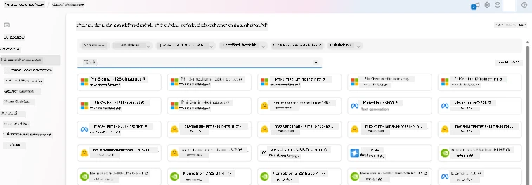

## ಫೈನ್-ಟ್ಯೂನಿಂಗ್‌ಗೆ ತಯಾರಿಕೆ

### ಪೂರ್ವಾಪೇಕ್ಷೆಗಳು

> [!NOTE]
> Phi-3 ಕುಟುಂಬದ ಮಾದರಿಗಳಿಗಾಗಿ, pay-as-you-go ಮಾದರಿಯ ಫೈನ್-ಟ್ಯೂನ್ առաջարկವು **East US 2** ಪ್ರದೇಶದಲ್ಲಿ ರಚಿಸಲಾದ ಹಬ್ಬುಗಳೊಂದಿಗೆ ಮಾತ್ರ ಲಭ್ಯವಿದೆ.

- ಒಂದು Azure ಸಬ್‌ಸ್ಕ್ರಿಪ್ಷನ್. ನಿಮಗೆ Azure ಸಬ್‌ಸ್ಕ್ರಿಪ್ಷನ್ ಇಲ್ಲದಿದ್ದರೆ, ಪ್ರಾರಂಭಿಸಲು ಒಂದು [ಪಾವತಿಸಬಹುದಾದ Azure ಖಾತೆ](https://azure.microsoft.com/pricing/purchase-options/pay-as-you-go) ರಚಿಸಿ.

- ಒಂದು [AI Foundry ಪ್ರಾಜೆಕ್ಟ್](https://ai.azure.com?WT.mc_id=aiml-138114-kinfeylo).
- Azure role-based access controls (Azure RBAC) ಅನ್ನು Azure AI Foundry ನಲ್ಲಿ ಕಾರ್ಯಾಚರಣೆಗಳಿಗೆ ಪ್ರಾಪ್ತಿಯನ್ನು ನೀಡಲು ಬಳಕೆ ಮಾಡಲಾಗುತ್ತದೆ. ಈ ಲೇಖನದ ಹಂತಗಳನ್ನು ನಿರ್ವಹಿಸಲು, ನಿಮ್ಮ ಬಳಕೆದಾರ ಖಾತೆಗೆ ರಿಸೋರ್ಸ್ ಗ್ರೂಪ್ ನಲ್ಲಿ __Azure AI Developer role__ ನಿಯೋಜಿಸಲಾಗಿದೆ ಇರಬೇಕು.

### ಸಬ್ಸ್ಕ್ರಿಪ್ಶನ್ ಪ್ರೊವೈಡರ್ ನೋಂದಣಿ

ಸಬ್ಸ್ಕ್ರಿಪ್ಶನ್ `Microsoft.Network` ರಿಸೋರ್ಸ್ ಪ್ರೊವೈಡರ್‌ಗೆ ನೋಂದಾಯಿಸಲಾಗಿದೆ ಎಂದು ದೃಢೀಕರಿಸಿ.

1. [Azure portal](https://portal.azure.com) ಗೆ ಸೈನ್ ಇನ್ ಆಗಿ.
1. ಎಡ ಮೆನುದಿಂದ **Subscriptions** ಆಯ್ಕೆಮಾಡಿ.
1. ನೀವು ಬಳಸಲು ಬೇಕಾದ ಸಬ್ಸ್ಕ್ರಿಪ್ಷನ್ ಅನ್ನು ಆಯ್ಕೆಮಾಡಿ.
1. ಎಡ ಮೆನುನಿಂದ **AI project settings** > **Resource providers** ಆಯ್ಕೆಮಾಡಿ.
1. resource providers ಪಟ್ಟಿಯಲ್ಲಿ **Microsoft.Network** ಇದೆ ಎಂದು ದೃಢೀಕರಿಸಿ. ಇಲ್ಲದಿದ್ದರೆ ಅದನ್ನು ಸೇರಿಸಿ.

### ಡೇಟಾ ತಯಾರಿಕೆ

ನಿಮ್ಮ ಮಾದರಿಯನ್ನು ಫೈನ್-ಟ್ಯೂನ್ ಮಾಡಲು ನಿಮ್ಮ ತರಬೇತಿ ಮತ್ತು ಮಾನ್ಯತೆ (validation) ಡೇಟಾವನ್ನು ತಯಾರಿಸಿ. ನಿಮ್ಮ ತರಬೇತಿ ಡೇಟಾ ಮತ್ತು ಮಾನ್ಯತೆ ಡೇಟಾ ಸೆಟ್‌ಗಳು ಮಾದರಿ ಹೇಗೆ ಕಾರ್ಯನಿರ್ವಹಿಸಬೇಕೆಂದಿರುವುದಕ್ಕೆ ಇನ್‌ಪುಟ್ ಮತ್ತು ಔಟ್‌ಪುಟ್ ಉದಾಹರಣೆಗಳನ್ನು ಒಳಗೊಂಡಿರುತ್ತವೆ.

ನಿಮ್ಮ ಎಲ್ಲಾ ತರಬೇತಿ ಉದಾಹರಣೆಗಳು ನಿರೀಕ್ಷಿತ ಇನ್ಫರೆನ್ಸ್ ಫಾರ್ಮಾಟ್ ಅನ್ನು ಅನುಸರಿಸುತ್ತವೆ ಎಂದು ಖಚಿತಪಡಿಸಿಕೊಳ್ಳಿ. ಮಾದರಿಗಳನ್ನು ಪರಿಣಾಮಕಾರಿಯಾಗಿ ಫೈನ್-ಟ್ಯೂನ್ ಮಾಡಲು, ಸಮತೋಲಿತ ಮತ್ತು ವಿಭಿನ್ನ ಡೇಟಾ ಸೆಟ್ ಇರಿಸಿಕೊಳ್ಳಿ.

ಇದರೊಳಗೆ ಡೇಟಾ ಸಮತೋಲನೆ ಕಾಪಾಡುವುದು, ವಿಭಿನ್ನ السينಾರಿಯೋಗಳನ್ನು ಸೇರಿಸುವುದು, ಮತ್ತು რეಲ್-ವರ್ಡ್ ನಿರೀಕ್ಷೆಗಳೊಂದಿಗೆ ಹೊಂದಿಸಲು ನಿಯತಕಾಲಿಕವಾಗಿ ತರಬೇತಿ ಡೇಟಾ ನವೀಕರಿಸುವುದು ಸೇರಿದೆ, ಅಂದರೆ ಹೆಚ್ಚು ನಿಖರ ಮತ್ತು ಸಮತೋಲಿತ ಮಾದರಿ ಪ್ರತಿಕ್ರಿಯೆಗಳು ಸಿಗುತ್ತವೆ.

ವಿವೀಧ ಮಾದರಿ ಪ್ರಕಾರಗಳಿಗೆ ತರಬೇತಿ ಡೇಟಾದ ವಿಭಿನ್ನ ಫಾರ್ಮ್ಯಾಟ್ ಅಗತ್ಯವಿರುತ್ತದೆ.

### ಚಾಟ್ ಪೂರ್ಣಗೊಳಿಸುವಿಕೆ

ನೀವು ಬಳಸುವ ತರಬೇತಿ ಮತ್ತು ಮಾನ್ಯತೆ ಡೇಟಾವನ್ನು JSON Lines (JSONL) ಡಾಕ್ಯುಮೆಂಟ್ ಆಗಿ ರೂಪಿಸಬೇಕು. `Phi-3-mini-128k-instruct` ಗಾಗಿ ಫೈನ್-ಟ್ಯೂನಿಂಗ್ ಡೇಟಾಸೆಟ್ ಅನ್ನು Chat completions API ಯಲ್ಲಿನ ಸಂಭಾಷಣಾತ್ಮಕ ಫಾರ್ಮ್ಯಾಟ್‌ನಲ್ಲಿ ರೂಪಿಸಿರಬೇಕಾಗುತ್ತದೆ.

### ಉದಾಹರಣಾ ಫೈಲ್‌ ಫಾರ್ಮಾಟ್

```json
    {"messages": [{"role": "system", "content": "You are an Xbox customer support agent whose primary goal is to help users with issues they are experiencing with their Xbox devices. You are friendly and concise. You only provide factual answers to queries, and do not provide answers that are not related to Xbox."}, {"role": "user", "content": "Is Xbox better than PlayStation?"}, {"role": "assistant", "content": "I apologize, but I cannot provide personal opinions. My primary job is to assist you with any issues related to your Xbox device. Do you have any Xbox-related issues that need addressing?"}]}
    {"messages": [{"role": "system", "content": "You are an Xbox customer support agent whose primary goal is to help users with issues they are experiencing with their Xbox devices. You are friendly and concise. You only provide factual answers to queries, and do not provide answers that are not related to Xbox."}, {"role": "user", "content": "Can I play PC games on my Xbox?"}, {"role": "assistant", "content": "While Xbox consoles don't natively support PC games, they can play an array of Xbox games, many of which are also available on PC. Can I assist you with finding games compatible with your Xbox device?"}]}
    {"messages": [{"role": "system", "content": "You are an Xbox customer support agent whose primary goal is to help users with issues they are experiencing with their Xbox devices. You are friendly and concise. You only provide factual answers to queries, and do not provide answers that are not related to Xbox."}, {"role": "user", "content": "I'm having trouble connecting my Xbox to the Wi-Fi."}, {"role": "assistant", "content": "No worries, let's go through the network settings on your Xbox. Can you please tell me what happens when you try to connect it to the Wi-Fi?"}]}
```

ಬೆಂಬಲಿತ ಫೈಲ್ ಪ್ರಕಾರ JSON Lines ಆಗಿದೆ. ಫೈಲ್‌ಗಳನ್ನ默认 ಡಾಟಾಸ್ಟೋರ್‌ಗೆ ಅಪ್‌ಲೋಡ್ ಮಾಡಿ ಮತ್ತು ನಿಮ್ಮ ಪ್ರಾಜೆಕ್ಟ್‌ನಲ್ಲಿ ಲಭ್ಯವಾಗುವಂತೆ ಮಾಡಲಾಗುತ್ತದೆ.

## Azure AI Foundry ಬಳಸಿ Phi-3 ನ ಫೈನ್-ಟ್ಯೂನಿಂಗ್

Azure AI Foundry ನಿಮಗೆ ಫೈನ್-ಟ್ಯೂನಿಂಗ್ ಎಂದು ಕರೆಯಲ್ಪಡುವ ಪ್ರಕ್ರಿಯೆಯನ್ನು ಬಳಸಿಕೊಂಡು ದೊಡ್ಡ ಭಾಷಾ ಮಾದರಿಗಳನ್ನು ನಿಮ್ಮ ಸ್ವಂತ ಡೇಟಾ ಸೆಟ್‌ಗಳಿಗೆ ಹೊಂದಿಸಿಕೊಳ್ಳಲು ಅನುಮತಿಸುತ್ತದೆ. ಫೈನ್-ಟ್ಯೂನಿಂಗ್ ವಿಶಿಷ್ಟ ಕಾರ್ಯಗಳು ಮತ್ತು ಅಪ್ಲಿಕೇಷನ್ ಗಾಗಿ ಕಸ್ಟಮೈಜೇಷನ್ ಮತ್ತು ಆಪ್ಟಿಮೈಸೇಷನ್‌ ಅನ್ನು ಒದಗಿಸುವ ಮೂಲಕ ಪ್ರಮುಖ ಮೌಲ್ಯವನ್ನು ನೀಡುತ್ತದೆ. ಇದು ಉತ್ತಮ ಕಾರ್ಯಕ್ಷಮತೆ, ವೆಚ್ಚದ ಪರಿಣಾಮಕಾರಿತ್ವ, ಕಡಿಮೆ ವಿಳಂಬ ಮತ್ತು ಕಸ್ಟಮೈಸ್ ಮಾಡಲಾದ ಔಟ್‌ಪುಟ್‌ಗಳನ್ನು ಉಂಟುಮಾಡುತ್ತದೆ.

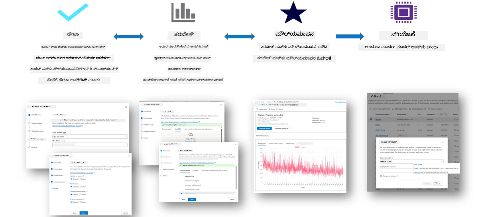

### ಹೊಸ ಪ್ರಾಜೆಕ್ಟ್ ರಚಿಸಿ

1. [Azure AI Foundry](https://ai.azure.com) ಗೆ ಸೈನ್ ಇನ್ ಮಾಡಿ.

1. Azure AI Foundry ನಲ್ಲಿ ಹೊಸ ಪ್ರಾಜೆಕ್ಟ್ ರಚಿಸಲು **+New project** ಆಯ್ಕೆಮಾಡಿ.

    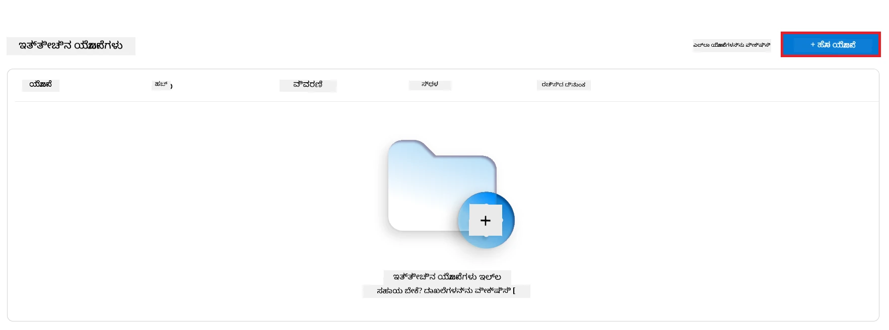

1. ಕೆಳಗಿನ ಕಾರ್ಯಗಳನ್ನು ಮಾಡಿ:

    - Project **Hub name**. ಇದು ವಿಶಿಷ್ಟವಾದ ಮೌಲ್ಯವಾಗಿರಬೇಕು.
    - ಬಳಸುಬೇಕಾದ **Hub** ಅನ್ನು ಆಯ್ಕೆಮಾಡಿ (ಅವಶ್ಯಕರವಿದ್ದಲ್ಲಿ ಹೊಸದನ್ನು ರಚಿಸಿ).

    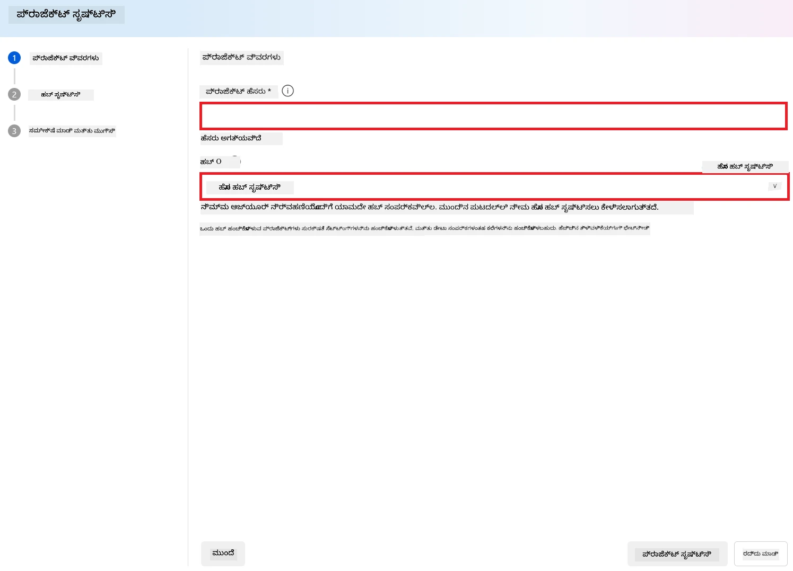

1. ಹೊಸ ಹಬ್ ರಚಿಸಲು ಕೆಳಗಿನ ಕಾರ್ಯಗಳನ್ನು ಮಾಡಿ:

    - **Hub name** ನಮೂದಿಸಿ. ಇದು ವಿಶಿಷ್ಟವಾಗಿರಬೇಕು.
    - ನಿಮ್ಮ Azure **Subscription** ಆಯ್ಕೆಮಾಡಿ.
    - ಬಳಸಬಹುದಾದ **Resource group** ಆಯ್ಕೆಮಾಡಿ (ಅವಶ್ಯಕವಾದರೆ ಹೊಸದನ್ನು ರಚಿಸಿ).
    - ನೀವು ಬಳಸಲು ಬಯಸುವ **Location** ಆಯ್ಕೆಮಾಡಿ.
    - ಬಳಸಲು **Connect Azure AI Services** ಆಯ್ಕೆಮಾಡಿ (ಅವಶ್ಯಕವಿದ್ದರೆ ಹೊಸದನ್ನು ರಚಿಸಿ).
    - **Connect Azure AI Search** ಅನ್ನು **Skip connecting** ಆಯ್ಕೆಮಾಡಿ.

    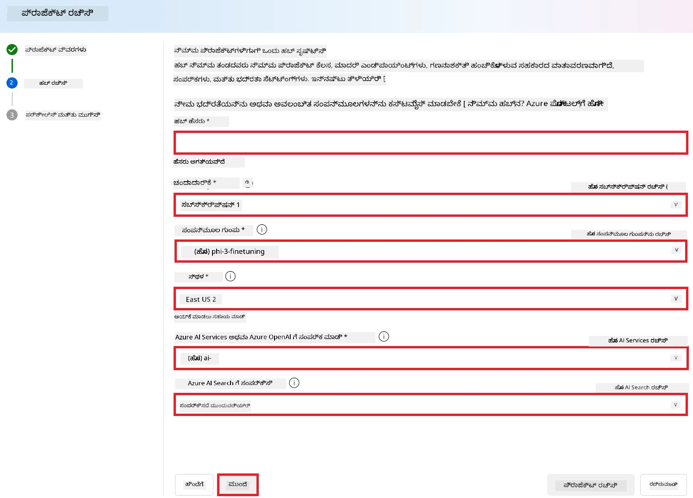

1. Select **Next**.
1. Select **Create a project**.

### ಡೇಟಾ ತಯಾರಿಕೆ

ಫೈನ್-ಟ್ಯೂನಿಂಗ್ ಮೊದಲು, ನಿಮ್ಮ ಕಾರ್ಯಕ್ಕೆ ಸಂಬಂಧಿಸಿದ ಡೇಟಾಸೆಟ್ ತ सङ್ರಹಿಸಿಕೊಳ್ಳಿ ಅಥವಾ ರಚಿಸಿ, ಉದಾಹರಣೆಗೆ ಚಾಟ್ ಸೂಚನೆಗಳು, ಪ್ರಶ್ನೆ-ಉತ್ತರ ಜೋಡಿಗಳು ಅಥವಾ ಇತರ ಪಠ್ಯದ ಡೇಟಾ. ಈ ಡೇಟಾವನ್ನು ಶುದ್ಧಗೊಳಿಸಿ ಮತ್ತು ಪೂರ್ವಪ್ರಕ್ರಿಯೆ ಮಾಡಿ — ಶಬ್ದವನ್ನು ತೆಗೆದುಹಾಕುವುದು, ಅಪೂರ್ಣ ಮೌಲ್ಯಗಳನ್ನು ನಿರ್ವಹಿಸುವುದು ಮತ್ತು ಪಠ್ಯವನ್ನು ಟೋಕನೈಸಿಂಗ್ ಮಾಡುವುದು.

### Azure AI Foundry ನಲ್ಲಿ Phi-3 ಮಾದರಿಗಳನ್ನು ಫೈನ್-ಟ್ಯೂನ್ ಮಾಡುವುದು

> [!NOTE]
> Phi-3 ಮಾದರಿಗಳ ಫೈನ್-ಟ್ಯೂನಿಂಗ್ ಪ್ರಸ್ತುತ East US 2 ನಲ್ಲಿ ಇದ್ದ ಪ್ರಾಜೆಕ್ಟ್‌ಗಳಲ್ಲಿ ಬೆಂಬಲಿತವಾಗಿದೆ.

1. ಎಡ ಪಕ್ಕದ ಟ್ಯಾಬ್‌ನಿಂದ **Model catalog** ಆಯ್ಕೆಮಾಡಿ.

1. **search bar** ನಲ್ಲಿ *phi-3* type ಮಾಡಿ ಮತ್ತು ನೀವು ಬಳಸಲು ಬಯಸುವ phi-3 ಮಾದರಿಯನ್ನು ಆಯ್ಕೆಮಾಡಿ.

    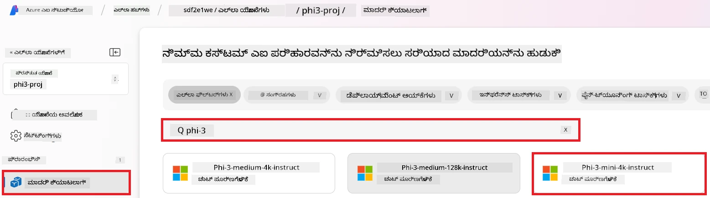

1. **Fine-tune** ಆಯ್ಕೆಮಾಡಿ.

    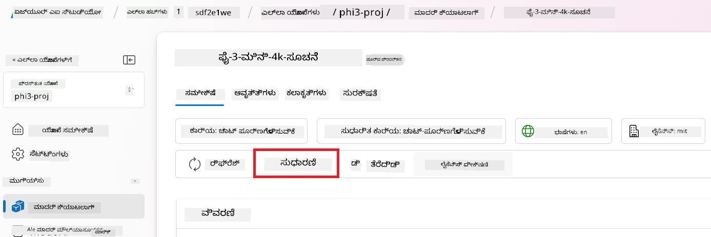

1. **Fine-tuned model name** ನಮೂದಿಸಿ.

    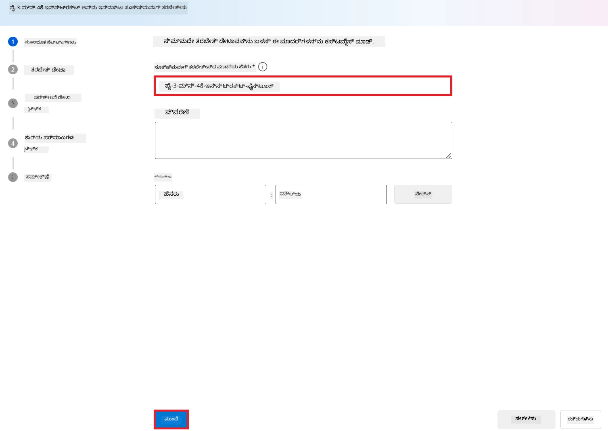

1. **Next** ಆಯ್ಕೆಮಾಡಿ.

1. ಕೆಳಗಿನ ಕಾರ್ಯಗಳನ್ನು ಮಾಡಿ:

    - **task type** ಅನ್ನು **Chat completion** ಗೆ ಆಯ್ಕೆಮಾಡಿ.
    - ನೀವು ಬಳಸಲು ಬಯಸುವ **Training data** ಆಯ್ಕೆಮಾಡಿ. ನೀವು ಅದನ್ನು Azure AI Foundry ನ ಡೇಟಾ ಮೂಲಕ ಅಥವಾ ನಿಮ್ಮ ಲೋಕಲ್ ಪರಿಸರದಿಂದ ಅಪ್‌ಲೋಡ್ ಮಾಡಬಹುದು.

    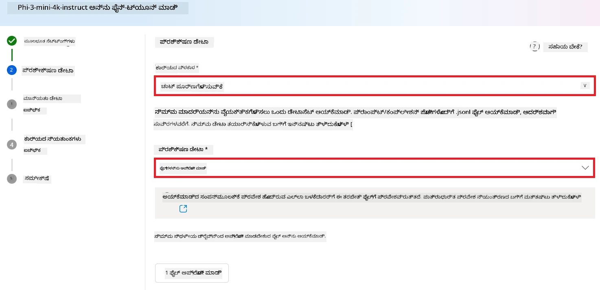

1. **Next** ಆಯ್ಕೆಮಾಡಿ.

1. ನೀವು ಬಳಸಲು ಬಯಸುವ **Validation data** ಅನ್ನು ಅಪ್‌ಲೋಡ್ ಮಾಡಿ. ಅಥವಾ ನೀವು **Automatic split of training data** ಆಯ್ಕೆಮಾಡಬಹುದು.

    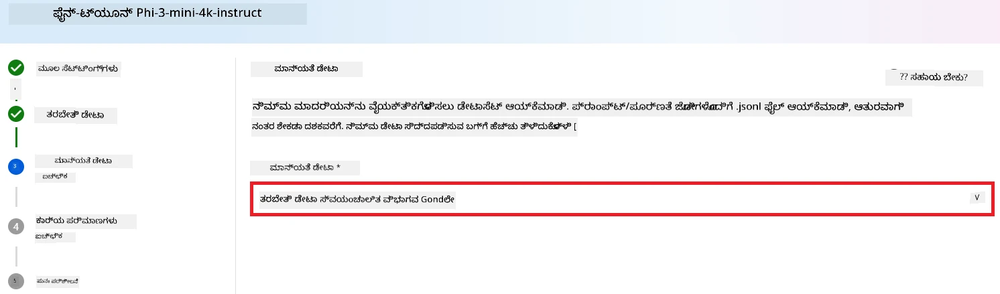

1. **Next** ಆಯ್ಕೆಮಾಡಿ.

1. ಕೆಳಗಿನ ಕಾರ್ಯಗಳನ್ನು ಮಾಡಿ:

    - ನೀವು ಬಳಸಲು ಬಯಸುವ **Batch size multiplier** ಆಯ್ಕೆಮಾಡಿ.
    - ನೀವು ಬಳಸಲು ಬಯಸುವ **Learning rate** ಆಯ್ಕೆಮಾಡಿ.
    - ನೀವು ಬಳಸಲು ಬಯಸುವ **Epochs** ಆಯ್ಕೆಮಾಡಿ.

    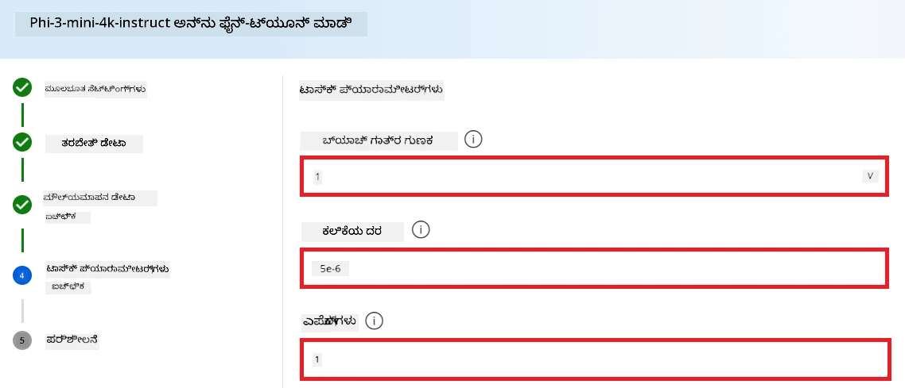

1. ಫೈನ್-ಟ್ಯೂನಿಂಗ್ ಪ್ರಕ್ರಿಯೆಯನ್ನು ಪ್ರಾರಂಭಿಸಲು **Submit** ಆಯ್ಕೆಮಾಡಿ.

    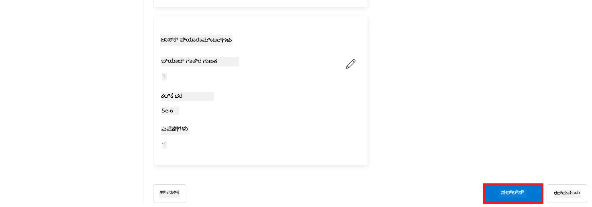


1. ನಿಮ್ಮ ಮಾದರಿ ಫೈನ್-ಟ್ಯೂನ್ಡ್ ಆದ ನಂತರ, ಸ್ಥಿತಿಯು **Completed** ಎಂದು ಪ್ರದರ್ಶಿಸಲಾಗುತ್ತದೆ, ಕೆಳಗಿನ ಚಿತ್ರದಲ್ಲಿ ತೋರಿರುವಂತೆ. ಈಗ ನೀವು ಮಾದರಿಯನ್ನು ನಿಯೋಜಿಸಿ ಮತ್ತು ನಿಮ್ಮ ಆಪ್‌ನಲ್ಲಿ, ಪ್ಲೇಗ್ರೌಂಡ್‌ನಲ್ಲಿ ಅಥವಾ ಪ್ರಾಂಪ್ ಫ್ಲೋದಲ್ಲಿ ಬಳಸಬಹುದು. ಹೆಚ್ಚಿನ ಮಾಹಿತಿಗಾಗಿ, ನೋಡಿ [How to deploy Phi-3 family of small language models with Azure AI Foundry](https://learn.microsoft.com/azure/ai-studio/how-to/deploy-models-phi-3?tabs=phi-3-5&pivots=programming-language-python).

    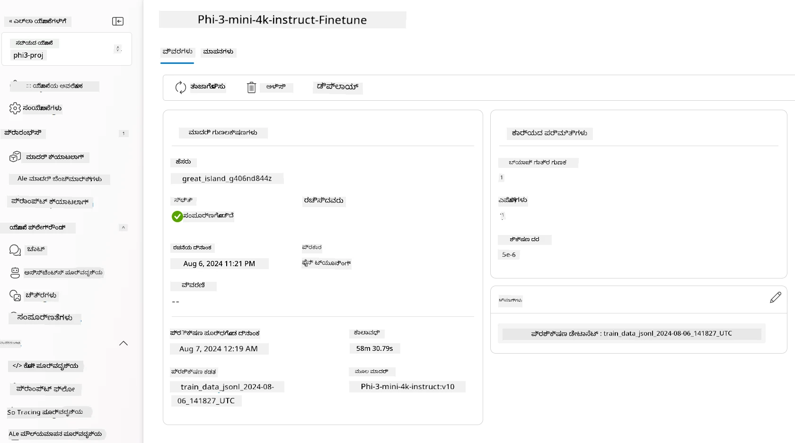

> [!NOTE]
> Phi-3ನ ಫೈನ್-ಟ್ಯೂನಿಂಗ್ ಕುರಿತು ಹೆಚ್ಚಿನ ವಿವರವಾದ ಮಾಹಿತಿಗಾಗಿ, ದಯವಿಟ್ಟು [Fine-tune Phi-3 models in Azure AI Foundry](https://learn.microsoft.com/azure/ai-studio/how-to/fine-tune-phi-3?tabs=phi-3-mini) ಅನ್ನು ಭೇಟಿ ಮಾಡಿ.

## ನಿಮ್ಮ ಫೈನ್-ಟ್ಯೂನಡ್ ಮಾದರಿಗಳನ್ನು ತೆರವುಗೊಳಿಸುವುದು

ನೀವು Azure AI Foundry (https://ai.azure.com) ನಲ್ಲಿ ಫೈನ್-ಟ್ಯೂನಿಂಗ್ ಮಾದರಿಗಳ ಪಟ್ಟಿ ಅಥವಾ ಮಾದರಿ ವಿವರ ಪುಟದಿಂದ ಫೈನ್-ಟ್ಯೂನ್ಡ್ ಮಾದರಿಯನ್ನು ಅಳಿಸಬಹುದು. ಫೈನ್-ಟ್ಯೂನಿಂಗ್ ಪುಟದಲ್ಲಿ ಅಳಿಸಲು ಬಯಸುವ ಫೈನ್-ಟ್ಯೂನಡ್ ಮಾದರಿಯನ್ನು ಆಯ್ಕೆಮಾಡಿ, ನಂತರ Delete ಬಟನ್ ಅನ್ನು ಆಯ್ಕೆಮಾಡಿ ಫೈನ್-ಟ್ಯೂನ್ಡ್ ಮಾದರಿಯನ್ನು ಅಳಿಸಲು.

> [!NOTE]
> ಅದರಲ್ಲಿನ ನಿಯೋಜನೆ ಇದ್ದರೆ ನೀವು ಕಸ್ಟಮ್ ಮಾದರಿಯನ್ನು ಅಳಿಸಲಾಗುವುದಿಲ್ಲ. ನಿಮ್ಮ ಕಸ್ಟಮ್ ಮಾದರಿಯನ್ನು ಅಳಿಸುವ ಮೊದಲು ನೀವು ನಿಮ್ಮ ಮಾದರಿ ನಿಯೋಜನೆಯನ್ನು ಮೊದಲು ಅಳಿಸಬೇಕು.

## ವೆಚ್ಚ ಮತ್ತು ಕೋಟಾ

### ಸೇವೆಯಾಗಿ ಫೈನ್-ಟ್ಯೂನ್ ಮಾಡಿದ Phi-3 ಮಾದರಿಗಳ ವೆಚ್ಚ ಮತ್ತು ಕೊಟಾ ಪರಿಗಣನೆಗಳು

Phi ಮಾದರಿಗಳು ಸೇವೆಯಾಗಿ Microsoft тарабынан ನೀಡಲ್ಪಟ್ಟಿವೆ ಮತ್ತು Azure AI Foundry ಜೊತೆ ಏಕೀಕೃತಗೊಂಡಿವೆ. ನೀವು ಮಾದರಿಗಳನ್ನು [ಡಿಪ್ಲಾಯ್ ಮಾಡುವಾಗ](https://learn.microsoft.com/azure/ai-studio/how-to/deploy-models-phi-3?tabs=phi-3-5&pivots=programming-language-python) ಅಥವಾ ಫೈನ್-ಟ್ಯೂನ್ ಮಾಡುವಾಗ ಪ್ರೈಸಿಂಗ್ ಅನ್ನು deployment wizard ನಲ್ಲಿನ Pricing and terms ಟ್ಯಾಬ್‌ನಲ್ಲಿ ನೋಡಬಹುದು.

## ವಿಷಯ ಫಿಲ್ಟರಿಂಗ್

pay-as-you-go സഹಿತ ಸೇವೆಯಾಗಿ ನಿಯೋಜಿಸಿದ ಮಾದರಿಗಳು Azure AI Content Safety ಮೂಲಕ ರಕ್ಷಿಸಲ್ಪಟ್ಟಿರುತ್ತವೆ. ನೈಜ ಸಮಯ ಎಂಡ್‌ಪಾಯಿಂಟ್‌ಗಳಿಗೆ ನಿಯೋಜಿಸಿದಾಗ, ನೀವು ಈ ಸಾಮರ್ಥ್ಯವನ್ನು opt out ಮಾಡಬಹುದು. Azure AI content safety ಸಕ್ರಿಯವಾಗಿರುವಾಗ, ಪ್ರಮ್ಪ್ಟ್ ಮತ್ತು ಪೂರ್ಣಗೊಳ್ಳುವ ಓಟ್ಟಪಡಿಸುವಿಕೆಯಾಗುವ ಎರಡು ಭಾಗങ്ങളും ಹಾನಿಕರ ವಿಷಯ ರೀತಿ ಪತ್ತೆಮಾಡಲು ಮತ್ತು ತಡೆಯಲು ಗುರಿ ಹೊಂದಿದ ವರ್ಗೀಕರಣ ಮಾದರಿಗಳ ಒಂದು ಸಮೂಹದ ಮೂಲಕ ಸಾಗುತ್ತವೆ. ವಿಷಯ ಫಿಲ್ಟರಿಂಗ್ ವ್ಯವಸ್ಥೆ ಎಂಟ್ರಿ ಪ್ರಮ್ಪ್ಟ್‌ಗಳಲ್ಲೂ ಮತ್ತು ಔಟ್‌ಪುಟ್ ಪೂರ್ಣಗೊಳ್ಳುವಿಕেয়ಲ್ಲೂ ಸಂಭಾವ್ಯ ಹಾನಿಕರ ವಿಷಯದ ನಿರ್ದಿಷ್ಟ ವರ್ಗಗಳನ್ನು ಪತ್ತೆಮಾಡಿ ಕ್ರಮಗಳನ್ನು ಕೈಗೊಳ್ಳುತ್ತದೆ. [Azure AI Content Safety](https://learn.microsoft.com/azure/ai-studio/concepts/content-filtering) గురించి ಹೆಚ್ಚಿನ ಮಾಹಿತಿಯನ್ನು ತಿಳಿದುಕೊಳ್ಳಿ.

**ಫೈನ್-ಟ್ಯೂನಿಂಗ್ ಕಾನ್ಫಿಗರೇಷನ್**

ಹೈಪರ್‌ಪರಾಮೀಟರ್‌ಗಳು: ಲರ್ನಿಂಗ್ ರೇಟ್, ಬ್ಯಾಚ್ ಗಾತ್ರ ಮತ್ತು ತರಬೇತಿ epochಗಳ ಸಂಖ್ಯೆ ಹಾಗು ಇತರೆ ಹೈಪರ್‌ಪರಾಮೀಟರ್‌ಗಳನ್ನು ನಿರ್ಧರಿಸಿ.

**ಲಾಸ್ ಫಂಕ್ಷನ್**

ನಿಮ್ಮ ಕಾರ್ಯಕ್ಕೆ ಸೂಕ್ತವಾದ ಲಾಸ್ ಫಂಕ್ಷನ್ ಆಯ್ಕೆಮಾಡಿ (ಉದಾಹರಣೆಗೆ, ಕ್ರಾಸ್-ಎಂಟ್ರೋಪಿ).

**ಆಪ್ಟಿಮೈಸರ್**

ಟ್ರೆನಿಂಗ್ ಸಮಯದಲ್ಲಿ ಗ್ರೇಡಿಯಂಟ್ ಅಪ್‌ಡೇಟ್‌ಗಳಿಗೆ ಆಪ್ಟಿಮೈಸರ್ ಆಯ್ಕೆಮಾಡಿ (ಉದಾ., Adam).

**ಫೈನ್-ಟ್ಯೂನಿಂಗ್ ಪ್ರಕ್ರಿಯೆ**

- Pre-Trained Model ಲೋಡ್ ಮಾಡಿ: Phi-3 Mini checkpoint ಅನ್ನು ಲೋಡ್ ಮಾಡಿ.
- ಕಸ್ಟಮ್ ಲೇಯರ್‌ಗಳನ್ನು ಸೇರಿಸಿ: ಕಾರ್ಯ-ವಿಶೇಷ ಲೇಯರ್‌ಗಳನ್ನು ಸೇರಿಸಿ (ಉದಾ., ಚಾಟ್ ಸೂಚನೆಗಳಿಗಾಗಿ ವರ್ಗೀಕರಣ ಹೆಡ್).

**ಮಾದರಿಯನ್ನು ತರಬೇತಿಮಾಡಿ**
ನಿಮ್ಮ ತಯಾರಿಸಿದ ಡೇಟಾಸೆಟ್ ಬಳಸಿ ಮಾದರಿಯನ್ನು ಫೈನ್-ಟ್ಯೂನ್ ಮಾಡಿ. ತರಬೇತಿ ಪ್ರಗತಿಯನ್ನು ಗಮನಿಸಿ ಮತ್ತು ಅಗತ್ಯವಾದರೆ ಹೈಪರ್‌ಪರಾಮೀಟರ್‌ಗಳನ್ನು ಮರುಸಂರಚಿಸಿ.

**ಮೌಲ್ಯಮಾಪನ ಮತ್ತು ಮಾನ್ಯತೆ**

Validation ಸೆಟ್: ನಿಮ್ಮ ಡೇಟಾವನ್ನು ತರಬೇತಿ ಹಾಗೂ ಮಾನ್ಯತೆ ಸೆಟ್‌ಗಳಾಗಿ ವಿಭಜಿಸಿ.

**ಕಾರ್ಯಕ್ಷಮತೆಯನ್ನು ಮೌಲ್ಯಮಾಪನ ಮಾಡಿ**

ಮಾದರಿಯ ಕಾರ್ಯಕ್ಷಮತೆಯನ್ನು ಅ精准ಪಡಿಸಲು accuracy, F1-score ಅಥವಾ perplexity ಮುಂತಾದ ಮೆಟ್ರಿಕ್‌ಗಳನ್ನು ಬಳಸಿ.

## ಫೈನ್-ಟ್ಯೂನ್ಡ್ ಮಾದರಿಯನ್ನು ಉಳಿಸಿ

**ಚೆಕ್‌ಪಾಯಿಂಟ್**
ಭವಿಷ್ಯದಲ್ಲಿ ಬಳಕೆಗಾಗಿ ಫೈನ್-ಟ್ಯೂನ್ಡ್ ಮಾದರಿ ಚೆಕ್‌ಪಾಯಿಂಟ್ ಅನ್ನು ಸيوವಿಸಿ.

## ನಿಯೋಜನೆ

- ವೆಬ್ ಸೇವೆಯಾಗಿ ನಿಯೋಜಿಸಿ: ನಿಮ್ಮ ಫೈನ್-ಟ್ಯೂನ್ಡ್ ಮಾದರಿಯನ್ನು Azure AI Foundry ನಲ್ಲಿ ವೆಬ್ ಸೇವೆಯಾಗಿ ನಿಯೋಜಿಸಿ.
- ಎಂಡ್‌ಪಾಯಿಂಟ್ ಅನ್ನು ಪರೀಕ್ಷಿಸಿ: ನಿಯೋಜಿತ ಎಂಡ್‌ಪಾಯಿಂಟ್ ಗೆ ಟೆಸ್ಟ್ ಕ್ವೆರಿಗಳನ್ನು ಕಳುಹಿಸಿ ಮತ್ತು ಅದರ ಕಾರ್ಯಕ್ಷಮತೆಯನ್ನು ದೃಢೀಕರಿಸಿ.

## ಪುನರಾವರ್ತಿ ಮಾಡಿ ಮತ್ತು ಸುಧಾರಣೆ ಮಾಡಿ

ಪುನರಾವರ್ತಿಸಿ: ಕಾರ್ಯಕ್ಷಮತೆ ತೃಪ್ತಿಕರವಾಗದಿದ್ದರೆ, ಹೈಪರ್‌ಪರಾಮೀಟರ್‌ಗಳನ್ನು ಸರಿಹೊಂದಿಸುವ ಮೂಲಕ, ಇನ್ನಷ್ಟು ಡೇಟಾ ಸೇರಿಸುವ ಮೂಲಕ ಅಥವಾ ಹೆಚ್ಚುವರಿ epochs ಗೆ ಫೈನ್-ಟ್ಯೂನ್ ಮಾಡುವ ಮೂಲಕ ಪುನರಾವರ್ತಿಸಿ.

## ಗಮನಿಸಿ ಮತ್ತು ಶುದ್ಧೀಕರಿಸಿ

ನಿರಂತರವಾಗಿ ಮಾದರಿಯ ವರ್ತನೆಯನ್ನು ಮೇಲ್ವಿಚಾರಣೆ ಮಾಡಿ ಮತ್ತು ಅಗತ್ಯವಿದ್ದರೆ ಅದನ್ನು ಪರಿಷ್ಕರಿಸಿ.

## ಕಸ್ಟಮೈಸ್ ಮಾಡಿ ಮತ್ತು ವಿಸ್ತರಿಸಿ

Custom Tasks: Phi-3 Mini ಅನ್ನು ಚಾಟ್ ಸೂಚನೆಗಳ ಹೊರಗೆ ವಿನ್ಯಾಸಗೊಳಿಸಿದ ವಿವಿಧ ಕಾರ್ಯಗಳಿಗೆ ಫೈನ್-ಟ್ಯೂನ್ ಮಾಡಬಹುದು. ಇತರ ಬಳಕೆದಾರದ ಪ್ರಕರಣಗಳನ್ನು ಅನ್ವೇಷಿಸಿ!
ಪ್ರಯೋಗ ಮಾಡಿ: ಕಾರ್ಯಕ್ಷಮತೆಯನ್ನು ಹೆಚ್ಚಿಸಲು ವಿಭಿನ್ನ ಆರ್ಕಿಟೆಕ್ಷರ್‌ಗಳು, ಲೇಯರ್ ಸಂಯೋಜನೆಗಳು ಮತ್ತು ತಂತ್ರಗಳನ್ನು ಪ್ರಯತ್ನಿಸಿ.

> [!NOTE]
> ಫೈನ್-ಟ್ಯೂನಿಂಗ್ ಒಂದು ಪುನರಾವರ್ತಿತ ಪ್ರಕ್ರಿಯೆಯಾಗಿದೆ. ಉತ್ತಮ ಫಲಿತಾಂಶಗಳನ್ನು ಪಡೆಯಲು ಪ್ರಯೋಗ ಮಾಡಿ, ಕಲಿಯಿರಿ ಮತ್ತು ನಿಮ್ಮ ಮಾದರಿಯನ್ನು ಹೊಂದಿಕೊಳ್ಳಿ!

---

<!-- CO-OP TRANSLATOR DISCLAIMER START -->
ಜವಾಬ್ದಾರಿ ನಿರಾಕರಣೆ:
ಈ ದಸ್ತಾವೇಜನ್ನು AI ಅನುವಾದ ಸೇವೆ Co-op Translator (https://github.com/Azure/co-op-translator) ಬಳಸಿಕೊಂಡು ಅನುವಾದಿಸಲಾಗಿದೆ. ನಾವು ನಿಖರತೆಯನ್ನು ಪಡೆಯಲು ಪ್ರಯತ್ನಿಸಿದರೂ, ಸ್ವಯಂಚಾಲಿತ ಅನುವಾದಗಳಲ್ಲಿ ದೋಷಗಳು ಅಥವಾ ಅಸತ್ಯತೆಗಳು ಇರಬಹುದೆಂದು ದಯವಿಟ್ಟು ಗಮನಿಸಿ. ಮೂಲ ದಸ್ತಾವೇಜಿನ ಸ್ಥಳೀಯ ಭಾಷೆಯನ್ನು ಅಧಿಕೃತ ಮೂಲವೆಂದು ಪರಿಗಣಿಸಬೇಕು. ಗಂಭೀರ ಮಾಹಿತಿಗಾಗಿ ವೃತ್ತಿಪರ ಮಾನವ ಅನುವಾದವನ್ನು ಶಿಫಾರಸು ಮಾಡಲಾಗುತ್ತದೆ. ಈ ಅನುವಾದದ ಬಳಕೆಯಿಂದ ಉಂಟಾಗುವ ಯಾವುದೇ ತಪ್ಪು ಗ್ರಹಿಕೆಗಳು ಅಥವಾ ವ್ಯಾಖ್ಯಾನದ ದೋಷಗಳಿಗಾಗಿ ನಾವು ಹೊಣೆಗಾರರಾಗಿರುವುದಿಲ್ಲ.
<!-- CO-OP TRANSLATOR DISCLAIMER END -->