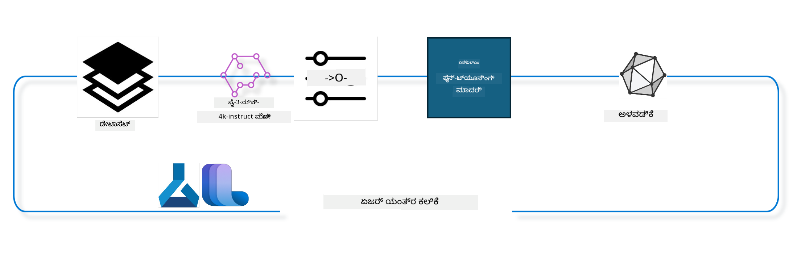

<!--
CO_OP_TRANSLATOR_METADATA:
{
  "original_hash": "944949f040e61b2ea25b3460f7394fd4",
  "translation_date": "2025-12-21T17:48:18+00:00",
  "source_file": "md/03.FineTuning/FineTuning_MLSDK.md",
  "language_code": "kn"
}
-->
## How use chat-completion components from the Azure ML system registry to fine tune a model

In this example we will undertake fine tuning of the Phi-3-mini-4k-instruct model to complete a conversation between 2 people using ultrachat_200k dataset.



The example will show you how to undertake fine tuning using the Azure ML SDK and Python and then deploy the fine tuned model to an online endpoint for real time inference.

### Training data

We will use the ultrachat_200k dataset. This is a heavily filtered version of the UltraChat dataset and was used to train Zephyr-7B-β, a state of the art 7b chat model.

### Model

We will use the Phi-3-mini-4k-instruct model to show how user can finetune a model for chat-completion task. If you opened this notebook from a specific model card, remember to replace the specific model name.

### Tasks

- Pick a model to fine tune.
- Pick and explore training data.
- Configure the fine tuning job.
- Run the fine tuning job.
- Review training and evaluation metrics.
- Register the fine tuned model.
- Deploy the fine tuned model for real time inference.
- Clean up resources.

## 1. Setup pre-requisites

- Install dependencies
- Connect to AzureML Workspace. Learn more at set up SDK authentication. Replace <WORKSPACE_NAME>, <RESOURCE_GROUP> and <SUBSCRIPTION_ID> below.
- Connect to azureml system registry
- Set an optional experiment name
- Check or create compute.

> [!NOTE]
> Requirements a single GPU node can have multiple GPU cards. For example, in one node of Standard_NC24rs_v3 there are 4 NVIDIA V100 GPUs while in Standard_NC12s_v3, there are 2 NVIDIA V100 GPUs. Refer to the docs for this information. The number of GPU cards per node is set in the param gpus_per_node below. Setting this value correctly will ensure utilization of all GPUs in the node. The recommended GPU compute SKUs can be found here and here.

### Python Libraries

Install dependencies by running below cell. This is not an optional step if running in a new environment.

```bash
pip install azure-ai-ml
pip install azure-identity
pip install datasets==2.9.0
pip install mlflow
pip install azureml-mlflow
```

### Interacting with Azure ML

1. This Python script is used to interact with Azure Machine Learning (Azure ML) service. Here's a breakdown of what it does:

    - It imports necessary modules from the azure.ai.ml, azure.identity, and azure.ai.ml.entities packages. It also imports the time module.

    - It tries to authenticate using DefaultAzureCredential(), which provides a simplified authentication experience to quickly start developing applications run in the Azure cloud. If this fails, it falls back to InteractiveBrowserCredential(), which provides an interactive login prompt.

    - It then tries to create an MLClient instance using the from_config method, which reads the configuration from the default config file (config.json). If this fails, it creates an MLClient instance by manually providing the subscription_id, resource_group_name, and workspace_name.

    - It creates another MLClient instance, this time for the Azure ML registry named "azureml". This registry is where models, fine-tuning pipelines, and environments are stored.

    - It sets the experiment_name to "chat_completion_Phi-3-mini-4k-instruct".

    - It generates a unique timestamp by converting the current time (in seconds since the epoch, as a floating point number) to an integer and then to a string. This timestamp can be used for creating unique names and versions.

    ```python
    # Azure ML ಮತ್ತು Azure Identity ನಿಂದ ಅಗತ್ಯವಿರುವ ಮೋಡ್ಯೂಲ್‌ಗಳನ್ನು ಆಮದುಮಾಡಿ
    from azure.ai.ml import MLClient
    from azure.identity import (
        DefaultAzureCredential,
        InteractiveBrowserCredential,
    )
    from azure.ai.ml.entities import AmlCompute
    import time  # time ಮೋಡ್ಯೂಲ್ ಅನ್ನು ಆಮದುಮಾಡಿ
    
    # DefaultAzureCredential ಅನ್ನು ಬಳಸಿ ಪ್ರಾಮಾಣೀಕರಿಸಲು ಪ್ರಯತ್ನಿಸಿ
    try:
        credential = DefaultAzureCredential()
        credential.get_token("https://management.azure.com/.default")
    except Exception as ex:  # DefaultAzureCredential ವಿಫಲವಾದರೆ InteractiveBrowserCredential ಅನ್ನು ಬಳಸಿ
        credential = InteractiveBrowserCredential()
    
    # ಡೀಫಾಲ್ಟ್ ಕಾನ್ಫಿಗ್ ಫೈಲ್ ಬಳಸಿ MLClient ಇನ್ಸ್ಟನ್ಸ್ ರಚಿಸಲು ಪ್ರಯತ್ನಿಸಿ
    try:
        workspace_ml_client = MLClient.from_config(credential=credential)
    except:  # ಅದು ವಿಫಲನಾದರೆ, ವಿವರಗಳನ್ನು ಕೈಯಿಂದ ಒದಗಿಸಿ MLClient ಇನ್ಸ್ಟನ್ಸ್ ರಚಿಸಿ
        workspace_ml_client = MLClient(
            credential,
            subscription_id="<SUBSCRIPTION_ID>",
            resource_group_name="<RESOURCE_GROUP>",
            workspace_name="<WORKSPACE_NAME>",
        )
    
    # azureml ಎಂದು ಹೆಸರಿಸಲಾದ Azure ML ರೆಜಿಸ್ಟ್ರಿಗಾಗಿ ಮತ್ತೊಂದು MLClient ಇನ್ಸ್ಟನ್ಸ್ ರಚಿಸಿ
    # ಈ ರೆಜಿಸ್ಟ್ರಿಯಲ್ಲಿ ಮಾದರಿಗಳು, ಫೈನ್-ಟ್ಯುನಿಂಗ್ ಪೈಪ್‌ಲೈನ್ಗಳು ಮತ್ತು ಪರಿಸರಗಳು ಸಂಗ್ರಹಿಸಲಾಗುತ್ತವೆ
    registry_ml_client = MLClient(credential, registry_name="azureml")
    
    # ಪ್ರಯೋಗದ ಹೆಸರು ನಿಗದಿಪಡಿಸಿ
    experiment_name = "chat_completion_Phi-3-mini-4k-instruct"
    
    # ವಿಶೇಷವಾಗಿ ಅನನ್ಯವಾಗಿರಬೇಕಾದ ಹೆಸರುಗಳು ಮತ್ತು ಆವೃತ್ತಿಗಳಿಗೆ ಬಳಸಬಹುದಾದ ಅನನ್ಯ ಟೈಂಸ್ಟ್ಯಾಂಪ್ ರಚಿಸಿ
    timestamp = str(int(time.time()))
    ```

## 2. Pick a foundation model to fine tune

1. Phi-3-mini-4k-instruct is a 3.8B parameters, lightweight, state-of-the-art open model built upon datasets used for Phi-2. The model belongs to the Phi-3 model family, and the Mini version comes in two variants 4K and 128K which is the context length (in tokens) it can support, we need to finetune the model for our specific purpose in order to use it. You can browse these models in the Model Catalog in the AzureML Studio, filtering by the chat-completion task. In this example, we use the Phi-3-mini-4k-instruct model. If you have opened this notebook for a different model, replace the model name and version accordingly.

    > [!NOTE]
    > the model id property of the model. This will be passed as input to the fine tuning job. This is also available as the Asset ID field in model details page in AzureML Studio Model Catalog.

2. This Python script is interacting with Azure Machine Learning (Azure ML) service. Here's a breakdown of what it does:

    - It sets the model_name to "Phi-3-mini-4k-instruct".

    - It uses the get method of the models property of the registry_ml_client object to retrieve the latest version of the model with the specified name from the Azure ML registry. The get method is called with two arguments: the name of the model and a label specifying that the latest version of the model should be retrieved.

    - It prints a message to the console indicating the name, version, and id of the model that will be used for fine-tuning. The format method of the string is used to insert the name, version, and id of the model into the message. The name, version, and id of the model are accessed as properties of the foundation_model object.

    ```python
    # ಮಾದರಿ ಹೆಸರನ್ನು ಸೆಟ್ ಮಾಡಿ
    model_name = "Phi-3-mini-4k-instruct"
    
    # Azure ML ರಿಜಿಸ್ಟ್ರಿಯಿಂದ ಮಾದರಿಯ ಇತ್ತೀಚಿನ ಆವೃತ್ತಿಯನ್ನು ಪಡೆಯಿರಿ
    foundation_model = registry_ml_client.models.get(model_name, label="latest")
    
    # ಮಾದರಿ ಹೆಸರು, ಆವೃತ್ತಿ ಮತ್ತು ಐಡಿ ಅನ್ನು ಮುದ್ರಿಸಿ
    # ಈ ಮಾಹಿತಿ ಟ್ರ್ಯಾಕಿಂಗ್ ಮತ್ತು ಡಿಬಗಿಂಗ್‌ಗಾಗಿ ಉಪಯುಕ್ತವಾಗಿದೆ
    print(
        "\n\nUsing model name: {0}, version: {1}, id: {2} for fine tuning".format(
            foundation_model.name, foundation_model.version, foundation_model.id
        )
    )
    ```

## 3. Create a compute to be used with the job

The finetune job works ONLY with GPU compute. The size of the compute depends on how big the model is and in most cases it becomes tricky to identify the right compute for the job. In this cell, we guide the user to select the right compute for the job.

> [!NOTE]
> The computes listed below work with the most optimized configuration. Any changes to the configuration might lead to Cuda Out Of Memory error. In such cases, try to upgrade the compute to a bigger compute size.

> [!NOTE]
> While selecting the compute_cluster_size below, make sure the compute is available in your resource group. If a particular compute is not available you can make a request to get access to the compute resources.

### Checking Model for Fine Tuning Support

1. This Python script is interacting with an Azure Machine Learning (Azure ML) model. Here's a breakdown of what it does:

    - It imports the ast module, which provides functions to process trees of the Python abstract syntax grammar.

    - It checks if the foundation_model object (which represents a model in Azure ML) has a tag named finetune_compute_allow_list. Tags in Azure ML are key-value pairs that you can create and use to filter and sort models.

    - If the finetune_compute_allow_list tag is present, it uses the ast.literal_eval function to safely parse the tag's value (a string) into a Python list. This list is then assigned to the computes_allow_list variable. It then prints a message indicating that a compute should be created from the list.

    - If the finetune_compute_allow_list tag is not present, it sets computes_allow_list to None and prints a message indicating that the finetune_compute_allow_list tag is not part of the model's tags.

    - In summary, this script is checking for a specific tag in the model's metadata, converting the tag's value to a list if it exists, and providing feedback to the user accordingly.

    ```python
    # ast ಮಾದ್ಯೂಲ್ ಅನ್ನು ಆಮದುಮಾಡಿ, ಇದು Python ನ ಅಬ್ಸ್ಟ್ರಾಕ್ಟ್ ಸಿಂಟ್ಯಾಕ್ಸ್ ಗ್ರ್ಯಾಮರ್‌ನ ಮರಗಳನ್ನು ಪ್ರಕ್ರಿಯೆಗೊಳಿಸಲು ಕಾರ್ಯಗಳನ್ನು ಒದಗಿಸುತ್ತದೆ
    import ast
    
    # ಮಾದರಿಯ ಟ್ಯಾಗ್‌ಗಳಲ್ಲಿ 'finetune_compute_allow_list' ಟ್ಯಾಗ್ ಇದೆ ಎಂಬುದನ್ನು ಪರಿಶೀಲಿಸಿ
    if "finetune_compute_allow_list" in foundation_model.tags:
        # ಟ್ಯಾಗ್ ಇದ್ದರೆ, ast.literal_eval ಅನ್ನು ಉಪಯೋಗಿಸಿ ಟ್ಯಾಗ್‌ನ ಮೌಲ್ಯವನ್ನು (ಸ್ಟ್ರಿಂಗ್) ಸುರಕ್ಷಿತವಾಗಿ Python ಪಟ್ಟಿಯಾಗಿ ಪಾರ್ಸ್ ಮಾಡಿ
        computes_allow_list = ast.literal_eval(
            foundation_model.tags["finetune_compute_allow_list"]
        )  # ಸ್ಟ್ರಿಂಗ್ ಅನ್ನು Python ಪಟ್ಟಿಯಾಗಿ ಪರಿವರ್ತಿಸಿ
        # ಆ ಪಟ್ಟಿಯಿಂದ compute ಅನ್ನು ರಚಿಸುವ ಅಗತ್ಯವಿದೆ ಎಂದು ಸೂಚಿಸುವ ಸಂದೇಶವನ್ನು ಮುದ್ರಿಸಿ
        print(f"Please create a compute from the above list - {computes_allow_list}")
    else:
        # ಟ್ಯಾಗ್ ಇದ್ದಿಲ್ಲದಿದ್ದರೆ, computes_allow_list ಅನ್ನು None ಗೆ ಹೊಂದಿಸಿ
        computes_allow_list = None
        # ಮಾದರಿಯ ಟ್ಯಾಗ್‌ಗಳಲ್ಲಿ 'finetune_compute_allow_list' ಟ್ಯಾಗ್ ಭಾಗವಲ್ಲ ಎಂದು ಸೂಚಿಸುವ ಸಂದೇಶವನ್ನು ಮುದ್ರಿಸಿ
        print("`finetune_compute_allow_list` is not part of model tags")
    ```

### Checking Compute Instance

1. This Python script is interacting with Azure Machine Learning (Azure ML) service and performing several checks on a compute instance. Here's a breakdown of what it does:

    - It tries to retrieve the compute instance with the name stored in compute_cluster from the Azure ML workspace. If the compute instance's provisioning state is "failed", it raises a ValueError.

    - It checks if computes_allow_list is not None. If it's not, it converts all the compute sizes in the list to lowercase and checks if the size of the current compute instance is in the list. If it's not, it raises a ValueError.

    - If computes_allow_list is None, it checks if the size of the compute instance is in a list of unsupported GPU VM sizes. If it is, it raises a ValueError.

    - It retrieves a list of all available compute sizes in the workspace. It then iterates over this list, and for each compute size, it checks if its name matches the size of the current compute instance. If it does, it retrieves the number of GPUs for that compute size and sets gpu_count_found to True.

    - If gpu_count_found is True, it prints the number of GPUs in the compute instance. If gpu_count_found is False, it raises a ValueError.

    - In summary, this script is performing several checks on a compute instance in an Azure ML workspace, including checking its provisioning state, its size against an allow list or a deny list, and the number of GPUs it has.
    
    ```python
    # ಎಕ್ಸೆಪ್ಶನ್ ಸಂದೇಶವನ್ನು ಮುದ್ರಿಸಿ
    print(e)
    # ಕಂಪ್ಯೂಟ್ ಗಾತ್ರ ವರ್ಕ್‌ಸ್ಪೇಸ್ನಲ್ಲಿ ಲಭ್ಯವಿಲ್ಲದಿದ್ದರೆ ValueError ಎತ್ತಿ
    raise ValueError(
        f"WARNING! Compute size {compute_cluster_size} not available in workspace"
    )
    
    # Azure ML ವರ್ಕ್‌ಸ್ಪೇಸ್ನಿಂದ ಕಂಪ್ಯೂಟ್ ಇನ್ಸ್ಟೆನ್ಸ್ ಅನ್ನು ಪಡೆದುಕೊಳ್ಳಿ
    compute = workspace_ml_client.compute.get(compute_cluster)
    # ಕಂಪ್ಯೂಟ್ ಇನ್ಸ್ಟೆನ್ಸ್‌ನ ಪ್ರೊವಿಜನಿಂಗ್ ಸ್ಥಿತಿ "failed" ಆಗಿದೆಯೇ ಎಂದು ಪರಿಶೀಲಿಸಿ
    if compute.provisioning_state.lower() == "failed":
        # ಪ್ರೊವಿಜನಿಂಗ್ ಸ್ಥಿತಿ "failed" ಆಗಿದ್ದರೆ ValueError ಎತ್ತಿ
        raise ValueError(
            f"Provisioning failed, Compute '{compute_cluster}' is in failed state. "
            f"please try creating a different compute"
        )
    
    # computes_allow_list Noneಲ್ಲದೆಯೇ ಎಂದು ಪರಿಶೀಲಿಸಿ
    if computes_allow_list is not None:
        # computes_allow_list ನಲ್ಲಿ ಇರುವ ಎಲ್ಲಾ ಕಂಪ್ಯೂಟ್ ಗಾತ್ರಗಳನ್ನು lowercase ಗೆ ಪರಿವರ್ತಿಸಿ
        computes_allow_list_lower_case = [x.lower() for x in computes_allow_list]
        # ಕಂಪ್ಯೂಟ್ ಇನ್ಸ್ಟೆನ್ಸ್‌ನ ಗಾತ್ರ computes_allow_list_lower_case ನಲ್ಲಿ ಇದೆ ಎಂದು ಪರಿಶೀಲಿಸಿ
        if compute.size.lower() not in computes_allow_list_lower_case:
            # ಕಂಪ್ಯೂಟ್ ಇನ್ಸ್ಟೆನ್ಸ್‌ನ ಗಾತ್ರ computes_allow_list_lower_case ನಲ್ಲಿ ಇಲ್ಲದಿದ್ದರೆ ValueError ಎತ್ತಿ
            raise ValueError(
                f"VM size {compute.size} is not in the allow-listed computes for finetuning"
            )
    else:
        # ಬೆಂಬಲಿಸಲಾಗದ GPU VM ಗಾತ್ರಗಳ ಪಟ್ಟಿಯನ್ನು ವ್ಯಾಖ್ಯಾನಿಸಿ
        unsupported_gpu_vm_list = [
            "standard_nc6",
            "standard_nc12",
            "standard_nc24",
            "standard_nc24r",
        ]
        # ಕಂಪ್ಯೂಟ್ ಇನ್ಸ್ಟೆನ್ಸ್‌ನ ಗಾತ್ರ unsupported_gpu_vm_list ನಲ್ಲಿ ಇದೆ ಎಂದು ಪರಿಶೀಲಿಸಿ
        if compute.size.lower() in unsupported_gpu_vm_list:
            # ಕಂಪ್ಯೂಟ್ ಇನ್ಸ್ಟೆನ್ಸ್‌ನ ಗಾತ್ರ unsupported_gpu_vm_list ನಲ್ಲಿ ಇದ್ದರೆ ValueError ಎತ್ತಿ
            raise ValueError(
                f"VM size {compute.size} is currently not supported for finetuning"
            )
    
    # ಕಂಪ್ಯೂಟ್ ಇನ್ಸ್ಟೆನ್ಸ್‌ನಲ್ಲಿ GPUಗಳ ಸಂಖ್ಯೆ ಕಂಡುಬಂದಿದೆಯೇ ಎಂದು ಪರೀಕ್ಷಿಸಲು ಒಂದು ಫ್ಲಾಗ್ ಅನ್ನು ಪ್ರಾರಂಭಿಸಿ
    gpu_count_found = False
    # ವರ್ಕ್‌ಸ್ಪೇಸ್ನಲ್ಲಿರುವ ಎಲ್ಲಾ ಲಭ್ಯವಿರುವ ಕಂಪ್ಯೂಟ್ ಗಾತ್ರಗಳ ಪಟ್ಟಿಯನ್ನು ಪಡೆದುಕೊಳ್ಳಿ
    workspace_compute_sku_list = workspace_ml_client.compute.list_sizes()
    available_sku_sizes = []
    # ಲಭ್ಯವಿರುವ ಕಂಪ್ಯೂಟ್ ಗಾತ್ರಗಳ ಪಟ್ಟಿಯಲ್ಲಿ ಪುನರಾವರ್ತಿಸಿ
    for compute_sku in workspace_compute_sku_list:
        available_sku_sizes.append(compute_sku.name)
        # ಕಂಪ್ಯೂಟ್ ಗಾತ್ರದ ಹೆಸರು ಕಂಪ್ಯೂಟ್ ಇನ್ಸ್ಟೆನ್ಸ್‌ನ ಗಾತ್ರಕ್ಕೆ ಹೊಂದಿಕೆಯಾಗುತ್ತದೆಯೇ ಎಂದು ಪರಿಶೀಲಿಸಿ
        if compute_sku.name.lower() == compute.size.lower():
            # ಇದು ಹೊಂದಿಕೆಯಾಗಿದ್ದರೆ, ಆ ಕಂಪ್ಯೂಟ್ ಗಾತ್ರದ GPU ಸಂಖ್ಯೆಯನ್ನು ಪಡೆಯಿರಿ ಮತ್ತು gpu_count_found ಅನ್ನು True ಗೆ ಸೆಟ್ ಮಾಡಿ
            gpus_per_node = compute_sku.gpus
            gpu_count_found = True
    # gpu_count_found True ಆಗಿದ್ದರೆ, ಕಂಪ್ಯೂಟ್ ಇನ್ಸ್ಟೆನ್ಸ್‌ನ GPU ಸಂಖ್ಯೆಯನ್ನು ಮುದ್ರಿಸಿ
    if gpu_count_found:
        print(f"Number of GPU's in compute {compute.size}: {gpus_per_node}")
    else:
        # gpu_count_found False ಆಗಿದ್ದರೆ, ValueError ಎತ್ತಿ
        raise ValueError(
            f"Number of GPU's in compute {compute.size} not found. Available skus are: {available_sku_sizes}."
            f"This should not happen. Please check the selected compute cluster: {compute_cluster} and try again."
        )
    ```

## 4. Pick the dataset for fine-tuning the model

1. We use the ultrachat_200k dataset. The dataset has four splits, suitable for Supervised fine-tuning (sft).
Generation ranking (gen). The number of examples per split is shown as follows:

    ```bash
    train_sft test_sft  train_gen  test_gen
    207865  23110  256032  28304
    ```

1. The next few cells show basic data preparation for fine tuning:

### Visualize some data rows

We want this sample to run quickly, so save train_sft, test_sft files containing 5% of the already trimmed rows. This means the fine tuned model will have lower accuracy, hence it should not be put to real-world use.
The download-dataset.py is used to download the ultrachat_200k dataset and transform the dataset into finetune pipeline component consumable format. Also as the dataset is large, hence we here have only part of the dataset.

1. Running the below script only downloads 5% of the data. This can be increased by changing dataset_split_pc parameter to desired percenetage.

    > [!NOTE]
    > Some language models have different language codes and hence the column names in the dataset should reflect the same.

1. Here is an example of how the data should look like
The chat-completion dataset is stored in parquet format with each entry using the following schema:

    - This is a JSON (JavaScript Object Notation) document, which is a popular data interchange format. It's not executable code, but a way to store and transport data. Here's a breakdown of its structure:

    - "prompt": This key holds a string value that represents a task or question posed to an AI assistant.

    - "messages": This key holds an array of objects. Each object represents a message in a conversation between a user and an AI assistant. Each message object has two keys:

    - "content": This key holds a string value that represents the content of the message.
    - "role": This key holds a string value that represents the role of the entity that sent the message. It can be either "user" or "assistant".
    - "prompt_id": This key holds a string value that represents a unique identifier for the prompt.

1. In this specific JSON document, a conversation is represented where a user asks an AI assistant to create a protagonist for a dystopian story. The assistant responds, and the user then asks for more details. The assistant agrees to provide more details. The entire conversation is associated with a specific prompt id.

    ```python
    {
        // The task or question posed to an AI assistant
        "prompt": "Create a fully-developed protagonist who is challenged to survive within a dystopian society under the rule of a tyrant. ...",
        
        // An array of objects, each representing a message in a conversation between a user and an AI assistant
        "messages":[
            {
                // The content of the user's message
                "content": "Create a fully-developed protagonist who is challenged to survive within a dystopian society under the rule of a tyrant. ...",
                // The role of the entity that sent the message
                "role": "user"
            },
            {
                // The content of the assistant's message
                "content": "Name: Ava\n\n Ava was just 16 years old when the world as she knew it came crashing down. The government had collapsed, leaving behind a chaotic and lawless society. ...",
                // The role of the entity that sent the message
                "role": "assistant"
            },
            {
                // The content of the user's message
                "content": "Wow, Ava's story is so intense and inspiring! Can you provide me with more details.  ...",
                // The role of the entity that sent the message
                "role": "user"
            }, 
            {
                // The content of the assistant's message
                "content": "Certainly! ....",
                // The role of the entity that sent the message
                "role": "assistant"
            }
        ],
        
        // A unique identifier for the prompt
        "prompt_id": "d938b65dfe31f05f80eb8572964c6673eddbd68eff3db6bd234d7f1e3b86c2af"
    }
    ```

### Download Data

1. This Python script is used to download a dataset using a helper script named download-dataset.py. Here's a breakdown of what it does:

    - It imports the os module, which provides a portable way of using operating system dependent functionality.

    - It uses the os.system function to run the download-dataset.py script in the shell with specific command-line arguments. The arguments specify the dataset to download (HuggingFaceH4/ultrachat_200k), the directory to download it to (ultrachat_200k_dataset), and the percentage of the dataset to split (5). The os.system function returns the exit status of the command it executed; this status is stored in the exit_status variable.

    - It checks if exit_status is not 0. In Unix-like operating systems, an exit status of 0 usually indicates that a command has succeeded, while any other number indicates an error. If exit_status is not 0, it raises an Exception with a message indicating that there was an error downloading the dataset.

    - In summary, this script is running a command to download a dataset using a helper script, and it raises an exception if the command fails.
    
    ```python
    # ಆಪರೇಟಿಂಗ್ ಸಿಸ್ಟಮ್ ಅವಲಂಬಿತ ಕಾರ್ಯಕ್ಷಮತೆಯನ್ನು ಬಳಸಲು ಮಾರ್ಗವನ್ನು ಒದಗಿಸುವ os ಮಾಡ್ಯೂಲ್ ಅನ್ನು ಆಮದು ಮಾಡಿ
    import os
    
    # ವಿಶೇಷ ಕಮಾಂಡ್‌-ಲೈನ್ ಆರ್ಗ್ಯುಮೆಂಟ್‌ಗಳೊಂದಿಗೆ ಶೆಲ್‌ನಲ್ಲಿ download-dataset.py ಸ್ಕ್ರಿಪ್ಟ್ ಅನ್ನು ಚಲಿಸಲು os.system ಫಂಕ್ಷನ್ ಅನ್ನು ಬಳಸಿ
    # ಆರ್ಗ್ಯುಮೆಂಟ್‌ಗಳು ಡೌನ್‌ಲೋಡ್ ಪಡೆಯಬೇಕಾದ ಡೇಟಾಸೆಟ್ ಅನ್ನು ಸೂಚಿಸುತ್ತವೆ (HuggingFaceH4/ultrachat_200k), ಅದನ್ನು ಡೌನ್‌ಲೋಡ್ ಮಾಡಬೇಕಾದ ಡೈರೆಕ್ಟರಿ (ultrachat_200k_dataset), ಮತ್ತು ಡೇಟಾಸೆಟ್ ಅನ್ನು ವಿಭಜಿಸುವ ಶೇಕಡಾವಾರು (5)
    # os.system ಫಂಕ್ಷನ್ ಅದು ನಿರ್ವಹಿಸಿದ ಕಮಾಂಡ್‌ನ ನಿರ್ಗಮನ ಸ್ಥಿತಿಯನ್ನು ಹಿಂತಿರುಗಿಸುತ್ತದೆ; ಈ ಸ್ಥಿತಿ exit_status ಚರದಲ್ಲಿ ಸಂಗ್ರಹಿಸಲಾಗುತ್ತದೆ
    exit_status = os.system(
        "python ./download-dataset.py --dataset HuggingFaceH4/ultrachat_200k --download_dir ultrachat_200k_dataset --dataset_split_pc 5"
    )
    
    # exit_status 0 ಅಲ್ಲವೆಂದು ಪರಿಶೀಲಿಸಿ
    # Unix-ಸಮಾನ ಆಪರೇಟಿಂಗ್ ಸಿಸ್ಟಮ್‌ಗಳಲ್ಲಿ, ನಿರ್ಗಮನ ಸ್ಥಿತಿ 0 ಸಾಮಾನ್ಯವಾಗಿ ಆ ಕಮಾಂಡ್ ಯಶಸ್ವಿಯಾಗಿದೆ ಎಂಬುದನ್ನು ಸೂಚಿಸುತ್ತದೆ, ಯಾವುದೇ ಬೇರೆ ಸಂಖ್ಯೆ ದೋಷವನ್ನು ಸೂಚಿಸುತ್ತದೆ
    # exit_status 0 ಆಗಿಲ್ಲದಿದ್ದರೆ, ಡೇಟಾಸೆಟ್ ಡೌನ್‌ಲೋಡ್ ಮಾಡುವಾಗ ದೋಷವ suspensión ಎಂಬ ಸಂದೇಶದೊಂದಿಗೆ Exception ಅನ್ನು ಎಸೆಯಿರಿ
    if exit_status != 0:
        raise Exception("Error downloading dataset")
    ```

### Loading Data into a DataFrame

1. This Python script is loading a JSON Lines file into a pandas DataFrame and displaying the first 5 rows. Here's a breakdown of what it does:

    - It imports the pandas library, which is a powerful data manipulation and analysis library.

    - It sets the maximum column width for pandas' display options to 0. This means that the full text of each column will be displayed without truncation when the DataFrame is printed.
    - ಇದು pd.read_json ಫಂಕ್ಷನ್ ಅನ್ನು ಬಳಸಿಕೊಂಡು ultrachat_200k_dataset ಡೈರೆಕ್ಟರಿಯಲ್ಲಿರುವ train_sft.jsonl ಫೈಲ್ ಅನ್ನು DataFrame ಗೆ ಲೋಡ್ ಮಾಡುತ್ತದೆ. lines=True ಆರ್ಥುಗುಮೆಂಟ್ ಫೈಲ್ JSON Lines ಫಾರ್ಮ್ಯಾಟ್‌ನಲ್ಲಿ ಇದೆ ಎಂಬುದನ್ನು ಸೂಚಿಸುತ್ತದೆ, ಅಂದರೆ ಪ್ರತಿ ಸಾಲು ಪ್ರತ್ಯೇಕ JSON ಆಬ್ಜೆಕ್ಟ್ ಆಗಿದೆ.

    - ಇದು head ಮೆಥಡ್ ಅನ್ನು ಬಳಸಿಕೊಂಡು DataFrame ನ ಮೊದಲ 5 ಸಾಲುಗಳನ್ನು ಪ್ರದರ್ಶಿಸುತ್ತದೆ. DataFrame ನಲ್ಲಿ 5 ಕಿಂತ ಕಡಿಮೆ ಸಾಲುಗಳಿದ್ದರೆ, ಇದು ಎಲ್ಲಾ ಸಾಲುಗಳನ್ನು ಪ್ರದರ್ಶಿಸುತ್ತದೆ.

    - ಸಾರಾಂಶವಾಗಿ, ಈ ಸ್ಕ್ರಿಪ್ಟ್ ಒಂದು JSON Lines ಫೈಲ್ ಅನ್ನು DataFrame ಗೆ ಲೋಡ್ ಮಾಡಿ ಸಂಪೂರ್ಣ ಕಾಲಮ್ ಪಠ್ಯದೊಂದಿಗೆ ಮೊದಲ 5 ಸಾಲುಗಳನ್ನು ಪ್ರದರ್ಶಿಸುತ್ತಿದೆ.
    
    ```python
    # pandas ಗ್ರಂಥಾಲಯವನ್ನು ಆಮದು ಮಾಡಿ, ಇದು ಡೇಟಾದ ತಿದ್ದುಪಡಿ ಮತ್ತು ವಿಶ್ಲೇಷಣೆಗೆ ಶಕ್ತಿಶಾಲಿ ಗ್ರಂಥಾಲಯ.
    import pandas as pd
    
    # pandas ನ ಪ್ರದರ್ಶನ ಆಯ್ಕೆಗಳಲ್ಲಿ ಕಾಲಮ್ ಗರಿಷ್ಠ ಅಗಲವನ್ನು 0 ಗೆ ಹೊಂದಿಸಿ
    # DataFrame ಅನ್ನು ಮುದ್ರಿಸುವಾಗ ಪ್ರತಿ ಕಾಲಮ್‌ನ ಪೂರ್ಣ ಪಠ್ಯವು ಕತ್ತರಿಸದೆ ಪ್ರದರ್ಶಿಸಲಾಗುತ್ತದೆ
    pd.set_option("display.max_colwidth", 0)
    
    # pd.read_json ಕಾರ್ಯವನ್ನು ಬಳಸಿ ultrachat_200k_dataset ಡೈರೆಕ್ಟರಿಯಲ್ಲಿರುವ train_sft.jsonl ಫೈಲೆಯನ್ನು DataFrame ಗೆ ಲೋಡ್ ಮಾಡಿ
    # lines=True ಆರ್ಗ್ಯುಮೆಂಟ್ ಫೈಲ್ JSON Lines ಸ್ವರೂಪದಲ್ಲಿದೆ ಎಂದು ಸೂಚಿಸುತ್ತದೆ, ಅಲ್ಲಿ ಪ್ರತಿ ಸಾಲು ಪ್ರತ್ಯೇಕ JSON ವಸ್ತು ಆಗಿದೆ
    df = pd.read_json("./ultrachat_200k_dataset/train_sft.jsonl", lines=True)
    
    # DataFrame ನ ಮೊದಲ 5 ಸಾಲುಗಳನ್ನು ಪ್ರದರ್ಶಿಸಲು head ವಿಧಾನವನ್ನು ಬಳಸಿ
    # DataFrame ಗೆ 5 ಕ್ಕಿಂತ ಕಡಿಮೆ ಸಾಲುಗಳು ಇದ್ದರೆ, ಅವೆಲ್ಲವನ್ನೂ ಪ್ರದರ್ಶಿಸಲಾಗುತ್ತದೆ
    df.head()
    ```

## 5. ಮಾದರಿ ಮತ್ತು ಡೇಟಾಗಳನ್ನು ಇನ್‌ಪುಟ್‌ಗಳಾಗಿ ಬಳಸಿಕೊಂಡು ಫೈನ್‑ಟ್ಯೂನಿಂಗ್ ಕೆಲಸವನ್ನು ಸಲ್ಲಿಸಿ

Create the job that uses the chat-completion pipeline component. Learn more about all the parameters supported for fine tuning.

### Define finetune parameters

1. Finetune parameters can be grouped into 2 categories - training parameters, optimization parameters

1. Training parameters define the training aspects such as -

    - ಬಳಸುವ ಆಪ್ಟಿಮೈಸರ್ ಮತ್ತು ಶೆಡ್ಯೂಲರ್
    - ಫೈನ್‌ಟ್ಯೂನ್ ಅನ್ನು ಸುಧಾರಿಸಲು ಬಳಸುವ ಮೆಟ್ರಿಕ್
    - ತರಬೇತಿ ಸ್ಟೆಪ್‌ಗಳ ಸಂಖ್ಯೆ, ಬ್ಯಾಚ್ ಗಾತ್ರ ಇತ್ಯಾದಿ
    - ಆಪ್ಟಿಮೈಜೇಶನ್ ಪ್ಯಾರಾಮೀಟರ್‌ಗಳು GPU ಮೆಮೊರಿಯನ್ನು ಉಚಿತಗೊಳಿಸಲು ಮತ್ತು ಗಣನ ಸಂಪನ್ಮೂಲಗಳನ್ನು ಪರಿಣಾಮಕಾರಿಯಾಗಿ ಬಳಸಲು ಸಹಾಯ ಮಾಡುತ್ತವು. 

1. ಕೆಳಗಿರುವ ಕೆಲವು ಪ್ಯಾರಾಮೀಟರ್‌ಗಳು ಈ ವರ್ಗಕ್ಕೆ ಸೇರಿವೆ. ಆಪ್ಟಿಮೈಜೇಶನ್ ಪ್ಯಾರಾಮೀಟರ್‌ಗಳು ಪ್ರತಿಯೊಂದು ಮಾದರಿಗಾಗಿ ಬೇರೆ ಬೇರೆ ಆಗಿದ್ದು, ಈ ವ್ಯತ್ಯಾಸಗಳನ್ನು ನಿರ್ವಹಿಸಲು ಮಾದರಿಯೊಂದಿಗೆ ಪ್ಯಾಕೇಜ್ ಆಗಿರುತ್ತವೆ.

    - deepspeed ಮತ್ತು LoRA ಅನ್ನು ಸಕ್ರಿಯಗೊಳಿಸಿ
    - ಮಿಕ್ಸ್ಡ್ ಪ್ರೆಸಿಷನ್ ತರಬೇತಿಯನ್ನು ಸಕ್ರಿಯಗೊಳಿಸಿ
    - ಮಲ್ಟಿ-ನೋಡ್ ತರಬೇತಿಯನ್ನು ಸಕ್ರಿಯಗೊಳಿಸಿ

> [!NOTE]
> ನಿರೀಕ್ಷಿತ ಫೈನ್‌ಟ್ಯೂನಿಂಗ್ ಅಲೈನ್‌ಮೆಂಟ್ ನಷ್ಟವನ್ನೋ ಅಥವಾ ಭೀಕರ ಮರೆತದುಕೊಳ್ಳುವಿಕೆಯನ್ನು (catastrophic forgetting) ಉಂಟುಮಾಡಬಹುದು. ಈ ಸಮಸ್ಯೆಯನ್ನು ಪರಿಶೀಲಿಸುವುದು ಮತ್ತು ಫೈನ್‌ಟ್ಯೂನ್ ಮಾಡಿದ ನಂತರ ಒಂದು ಅಲೈನ್‌ಮೆಂಟ್ ಹಂತವನ್ನು ನಡೆಸುವದು ನಾವು ಶಿಫಾರಸು ಮಾಡುತ್ತಿರುವುದು.

### Fine Tuning Parameters

1. ಈ Python ಸ್ಕ್ರಿಪ್ಟ್ ಮಷಿನ್ ಲರ್ನಿಂಗ್ ಮಾದರಿಯನ್ನು ಫೈನ್‑ಟ್ಯೂನ್ ಮಾಡಲು ಪ್ಯಾರಾಮೀಟರ್‌ಗಳನ್ನು ಸೆಟ್ ಮಾಡುತ್ತಿದೆ. ಇದರ ಕಾರ್ಯಗಳ ವಿವರಣೆ ಕೆಳಗಿದೆ:

    - ಇದು ಡಿಫಾಲ್ಟ್ ಟ್ರೈನಿಂಗ್ ಪ್ಯಾರಾಮೀಟರ್‌ಗಳನ್ನು ಸೆಟ್ ಮಾಡುತ್ತದೆ, ಉದಾಹರಣೆಗೆ ತರಬೇತಿ ಎಪೋಕ್‌ಗಳ ಸಂಖ್ಯೆ, ತರಬೇತಿ ಮತ್ತು ಮೌಲ್ಯಮಾಪನಕ್ಕಾಗಿ ಬ್ಯಾಚ್ ಗಾತ್ರಗಳು, learning rate, ಮತ್ತು learning rate scheduler ಪ್ರಕಾರ.
    - ಇದು ಡಿಫಾಲ್ಟ್ ಆಪ್ಟಿಮೈಸೇಶನ್ ಪ್ಯಾರಾಮೀಟರ್‌ಗಳನ್ನು ಸೆಟ್ ಮಾಡುತ್ತದೆ, ಉದಾಹರಣೆಗೆ Layer-wise Relevance Propagation (LoRa) ಮತ್ತು DeepSpeed ಅನುಪ್ರಯೋಗದ ವಿವರಗಳು, ಹಾಗೂ DeepSpeed ಹಂತ.
    - ಇದು training ಮತ್ತು optimization ಪ್ಯಾರಾಮೀಟರ್‌ಗಳನ್ನು finetune_parameters ಎಂಬ ಒಂದೇ ಡಿಕ್ಷನರಿಯಲ್ಲಿ ಸಂಯೋಜಿಸುತ್ತದೆ.
    - ಇದು foundation_model に модел್-ವಿಶೇಷ ಡಿಫಾಲ್ಟ್ ಪ್ಯಾರಾಮೀಟರ್‌ಗಳಿದ್ದರೆ ಅವುಗಳನ್ನು ಪರಿಶೀಲಿಸುತ್ತದೆ. ಇದ್ದರೆ, ಅದು ಎಚ್ಚರಿಕೆ ಸಂದೇಶವನ್ನು ಮುದ್ರಿಸಿ ಈ ಮಾದರಿ‑ವಿಶೇಷ ಡಿಫಾಲ್ಟ್‌ಗಳೊಂದಿಗೆ finetune_parameters ಡಿಕ್ಷನರಿಯನ್ನು ಅಪ್ಡೇಟ್ ಮಾಡುತ್ತದೆ. ast.literal_eval ಫಂಕ್ಷನ್ ಅನ್ನು ಮಾದರಿ-ವಿಶೇಷ ಡಿಫಾಲ್ಟ್‌ಗಳನ್ನು ಸ್ಟ್ರಿಂಗ್‌ನಿಂದ Python ಡಿಕ್ಷನರಿಗೆ ಪರಿವರ್ತಿಸಲು ಬಳಸಲಾಗುತ್ತದೆ.
    - ಇದು ರನ್‌ಗೆ ಬಳಸಲಾಗಲಿರುವ ಅಂತಿಮ ಫೈನ್‑ಟ್ಯೂನಿಂಗ್ ಪ್ಯಾರಾಮೀಟರ್‌ಗಳ ಸೆಟ್ ಅನ್ನು ಪ್ರಿಂಟ್ ಮಾಡುತ್ತದೆ.

    - ಸಾರಾಂಶವಾಗಿ, ಈ ಸ್ಕ್ರಿಪ್ಟ್ ಫೈನ್‑ಟ್ಯೂನಿಂಗ್‌ಗೆ ಬೇಕಾದ ಪ್ಯಾರಾಮೀಟರ್‌ಗಳನ್ನು ಸೆಟ್ ಮಾಡಿ ಅವುಗಳನ್ನು ಪ್ರದರ್ಶಿಸುತ್ತಿದೆ ಮತ್ತು ಮಾದರಿ‑ವಿಶೇಷ ಡಿಫಾಲ್ಟ್‌ಗಳ ಮೂಲಕ ಡಿಫಾಲ್ಟ್‌ಗಳನ್ನು ಓವರ್‌ರೈಡ್ ಮಾಡುವ ಸಾಮರ್ಥ್ಯವಿದೆ.

    ```python
    # ತರಬೇತಿ ಎಪೋಕ್‌ಗಳ ಸಂಖ್ಯೆ, ತರಬೇತಿ ಮತ್ತು ಮೌಲ್ಯಮಾಪನೆಗಾಗಿ ಬ್ಯಾಚ್ ಗಾತ್ರಗಳು, ಲರ್ನಿಂಗ್ ರೇಟ್ ಮತ್ತು ಲರ್ನಿಂಗ್ ರೇಟ್ ಶೆಡ್ಯೂಲರ್ ಪ್ರಕಾರವನ್ನು ಸೇರಿಸಿ ಡೀಫಾಲ್ಟ್ ತರಬೇತಿ ಪ್ಯಾರಾಮೀಟರ್‌ಗಳನ್ನು ಹೊಂದಿಸಿ
    training_parameters = dict(
        num_train_epochs=3,
        per_device_train_batch_size=1,
        per_device_eval_batch_size=1,
        learning_rate=5e-6,
        lr_scheduler_type="cosine",
    )
    
    # Layer-wise Relevance Propagation (LoRa) ಮತ್ತು DeepSpeed ಅನ್ನು ಅನ್ವಯಿಸಬೇಕೇ ಮತ್ತು DeepSpeed ಹಂತ ಏನು ಎಂಬುದನ್ನು ಸೇರಿದಂತೆ ಡೀಫಾಲ್ಟ್ ಆಪ್ಟಿಮೈಸೇಶನ್ پ್ಯಾರಾಮೀಟರ್‌ಗಳನ್ನು ಹೊಂದಿಸಿ
    optimization_parameters = dict(
        apply_lora="true",
        apply_deepspeed="true",
        deepspeed_stage=2,
    )
    
    # ತರಬೇತಿ ಮತ್ತು ಆಪ್ಟಿಮೈಸೇಶನ್ ಪ್ಯಾರಾಮೀಟರ್ಗಳನ್ನು finetune_parameters ಎಂಬ ಒಂದು ಡಿಕ್ಷನರಿಯಲ್ಲಿ ಏಕೀಕರಿಸಿ
    finetune_parameters = {**training_parameters, **optimization_parameters}
    
    # foundation_modelಗೆ ಯಾವುದೇ ಮಾದರಿ-ನಿರ್ದಿಷ್ಟ ಡೀಫಾಲ್ಟ್ ಪ್ಯಾರಾಮೀಟರ್‌ಗಳಿವೆಯೇ ಎಂದು ಪರಿಶೀಲಿಸಿ
    # ಇದೆಯಾದರೆ, ಎಚ್ಚರಿಕೆಯ ಸಂದೇಶವನ್ನು ಮುದ್ರಿಸಿ ಮತ್ತು ಆ ಮಾದರಿ-ನಿರ್ದಿಷ್ಟ ಡೀಫಾಲ್ಟ್‌ಗಳೊಂದಿಗೆ finetune_parameters ಡಿಕ್ಷನರಿಯನ್ನು ನವೀಕರಿಸಿ
    # ಮಾದರಿ-ನಿರ್ದಿಷ್ಟ ಡೀಫಾಲ್ಟ್ಗಳನ್ನು ಸ್ಟ್ರಿಂಗ್‌ನಿಂದ ಪೈಥಾನ್ ಡಿಕ್ಷನರಿಯಾಗಿಸಲು ast.literal_eval ಫಂಕ್ಷನ್ ಬಳಸಲಾಗುತ್ತದೆ
    if "model_specific_defaults" in foundation_model.tags:
        print("Warning! Model specific defaults exist. The defaults could be overridden.")
        finetune_parameters.update(
            ast.literal_eval(  # ಸ್ಟ್ರಿಂಗ್ ಅನ್ನು ಪೈಥಾನ್ ಡಿಕ್ಷನರಿಯಾಗೆ ಪರಿವರ್ತಿಸಿ
                foundation_model.tags["model_specific_defaults"]
            )
        )
    
    # ರನ್‌ಗೆ ಬಳಸಲಾಗುವ ಅಂತಿಮ ಫೈನ್-ಟ್ಯೂನಿಂಗ್ ಪ್ಯಾರಾಮೀಟರ್‌ಗಳ ಸಂಪುಟವನ್ನು ಮುದ್ರಿಸಿ
    print(
        f"The following finetune parameters are going to be set for the run: {finetune_parameters}"
    )
    ```

### Training Pipeline

1. ಈ Python ಸ್ಕ್ರಿಪ್ಟ್ ಒಂದು ಮಷಿನ್ ಲರ್ನಿಂಗ್ ತರಬೇತಿ ಪೈಪ್‌ಲೈನ್‌ಗೆ ಪ್ರದರ್ಶನ ಹೆಸರು (display name) ರಚಿಸುವ ಫಂಕ್ಷನ್ ಅನ್ನು ಪರಿಭಾಷಿಸಿ, ನಂತರ ಆ ಫಂಕ್ಷನ್ ಅನ್ನು ಕರೆದು ಆ ಪ್ರದರ್ಶನ ಹೆಸರನ್ನು ಮುದ್ರಿಸುತ್ತದೆ. ಇದರ ಕಾರ್ಯಗಳ ವಿವರಣೆ ಕೆಳಗಿದೆ:

1. get_pipeline_display_name ಫಂಕ್ಷನ್ ಅನ್ನು ನಿರ್ವಾಹಿಸಲಾಗಿದೆ. ಈ ಫಂಕ್ಷನ್ ತರಬೇತಿ ಪೈಪ್‌ಲೈನ್ ಸಂಬಂಧಿತ ವಿವಿಧ ಪ್ಯಾರಾಮೀಟರ್‌ಗಳ ಆಧಾರದ ಮೇಲೆ ಪ್ರದರ್ಶನ ಹೆಸರನ್ನು ರಚಿಸುತ್ತದೆ.

1. ಫಂಕ್ಷನ್ ಒಳಗೆ, ಪ್ರತಿ-ಡಿವೈಸ್ ಬ್ಯಾಚ್ ಗಾತ್ರ, ಗ್ರೇಡಿಯಂಟ್ ಅಕ್ಮ್ಯುಲೇಶನ್ ಸ್ಟೆಪ್‌ಗಳ ಸಂಖ್ಯೆ, ಪ್ರತಿ ನೋಡ್ ಗೆ GPUಗಳ ಸಂಖ್ಯೆ ಮತ್ತು ಫೈನ್‑ಟ್ಯೂನಿಂಗ್‌ಗೆ ಬಳಸಲಾದ ನೋಡ್‌ಗಳ ಸಂಖ್ಯೆಯನ್ನು ಗುಣಿಸಿ ಒಟ್ಟು ಬ್ಯಾಚ್ ಗಾತ್ರವನ್ನು ಲೆಕ್ಕಿಸುತ್ತದೆ.

1. ಇದು learning rate scheduler ಪ್ರಕಾರ, DeepSpeed ಅನ್ವಯಿಸಲಾಯಿತೇ ಎಂಬುದು, DeepSpeed ಹಂತ, Layer-wise Relevance Propagation (LoRa) ಅನ್ವಯಿಸಲಾಯಿತೇ ಎಂಬುದು, ಉಳಿಸಬೇಕಾದ ಮಾದರಿ ಚೆಕ್‌ಪಾಯಿಂಟ್‌ಗಳ ಮಿತಿ, ಮತ್ತು ಗರಿಷ್ಠ ಕ್ರಮದ ಉದ್ದ (maximum sequence length) ಮುಂತಾದ ಇತರ ಬಾಹ್ಯ ಪ್ಯಾರಾಮೀಟರ್‌ಗಳನ್ನು ಪಡೆದುತ್ತದೆ.

1. ಇದು ಎಲ್ಲ ಈ ಪ್ಯಾರಾಮೀಟರ್‌ಗಳನ್ನು ಹೈಫನ್‌ಗಳಿಂದ ವಿಭಜಿಸುವಂತೆ ಒಳಗೊಂಡಿರುವ ಒಂದು ಸ್ಟ್ರಿಂಗ್ ಅನ್ನು ನಿರ್ಮಿಸುತ್ತದೆ. DeepSpeed ಅಥವಾ LoRa ಅನ್ವಯಿಸಿದರೆ, ಸ್ಟ್ರಿಂಗ್‌ನಲ್ಲಿ "ds" ನಂತರ DeepSpeed ಹಂತವನ್ನು ಸೇರಿಸುವುದು ಅಥವಾ ಕ್ರಮವಾಗಿ "lora" ಅನ್ನು ಸೇರಿಸುವುದು ಕಂಡುಬರುತ್ತದೆ. ಇಲ್ಲದಿದ್ದರೆ ಕ್ರಮವಾಗಿ "nods" ಅಥವಾ "nolora" ಅನ್ನು ಸೇರಿಸಲಾಗುತ್ತದೆ.

1. ಫಂಕ್ಷನ್ ಈ ಸ್ಟ್ರಿಂಗ್ ಅನ್ನು ರಿಟರ್ನ್ ಮಾಡುತ್ತದೆ, ಇದು ತರಬೇತಿ ಪೈಪ್‌ಲೈನ್‌ಗೆ ಪ್ರದರ್ಶನ ಹೆಸರಿನಾಗಿ ಕಾರ್ಯನಿರ್ವಹಿಸುತ್ತದೆ.

1. ಫಂಕ್ಷನ್ ನಿರ್ವಾಹನೆಯಾದ ನಂತರ, ಅದನ್ನು ಕರೆದು ಪ್ರದರ್ಶನ ಹೆಸರನ್ನು ರಚಿಸಲಾಗುತ್ತದೆ ಮತ್ತು ನಂತರ ಮುದ್ರಿಸಲಾಗುತ್ತದೆ.

1. ಸಾರಾಂಶವಾಗಿ, ಈ ಸ್ಕ್ರಿಪ್ಟ್ ವಿವಿಧ ಪರಿಮಾಣಗಳ ಆಧಾರದ ಮೇಲೆ ಒಂದು ಮಷಿನ್ ಲರ್ನಿಂಗ್ ತರಬೇತಿ ಪೈಪ್‌ಲೈನ್‌ಗೆ ಪ್ರದರ್ಶನ ಹೆಸರನ್ನು ರಚಿಸಿ ಆ ಪ್ರದರ್ಶನ ಹೆಸರನ್ನು ಮುದ್ರಿಸುತ್ತಿದೆ.

    ```python
    # ಪ್ರಶಿಕ್ಷಣ ಪೈಪ್‌ಲೈನ್‌ನ ಪ್ರದರ್ಶನ ಹೆಸರನ್ನು ರಚಿಸುವ ಫಂಕ್ಶನ್ ಅನ್ನು ವ್ಯಾಖ್ಯಾನಿಸಿ
    def get_pipeline_display_name():
        # ಪ್ರತಿ ಡಿವೈಸ್‌ನ ಬ್ಯಾಚ್ ಗಾತ್ರವನ್ನು, ಗ್ರೇಡಿಯಂಟ್ ಅಕ್ಯುಮುಲೇಷನ್ ಹೆಜ್ಜೆಗಳ ಸಂಖ್ಯೆಯನ್ನು, ಪ್ರತಿ ನೋಡ್‌ನ GPUಗಳ ಸಂಖ್ಯೆಯನ್ನು ಮತ್ತು ಫೈನ್‑ಟ್ಯೂನಿಂಗ್‌ಗೆ ಬಳಸುವ ನೋಡ್‌ಗಳ ಸಂಖ್ಯೆಯನ್ನು ಗುಣಿಸಿ ಒಟ್ಟು ಬ್ಯಾಚ್ ಗಾತ್ರವನ್ನು ಲೆಕ್ಕಿಸಿ
        batch_size = (
            int(finetune_parameters.get("per_device_train_batch_size", 1))
            * int(finetune_parameters.get("gradient_accumulation_steps", 1))
            * int(gpus_per_node)
            * int(finetune_parameters.get("num_nodes_finetune", 1))
        )
        # ಲರ್ನಿಂಗ್‑ರೇಟ್ ಶೆಡ್ಯೂಲರ್ ಪ್ರಕಾರವನ್ನು ಪಡೆಯಿರಿ
        scheduler = finetune_parameters.get("lr_scheduler_type", "linear")
        # DeepSpeed ಅನ್ವಯಿಸಲ್ಪಡುತ್ತದೆಯೇ ಎಂದು ಪಡೆಯಿರಿ
        deepspeed = finetune_parameters.get("apply_deepspeed", "false")
        # DeepSpeed ಹಂತವನ್ನು ಪಡೆಯಿರಿ
        ds_stage = finetune_parameters.get("deepspeed_stage", "2")
        # DeepSpeed ಅನ್ವಯಿಸಲ್ಪಟ್ಟರೆ, ಪ್ರದರ್ಶನ ಹೆಸರಿನಲ್ಲಿ "ds" ಅನ್ನು ಮತ್ತು ನಂತರ DeepSpeed ಹಂತವನ್ನು ಸೇರಿಸಿ; ಇಲ್ಲದಿದ್ದರೆ "nods" ಅನ್ನು ಸೇರಿಸಿ
        if deepspeed == "true":
            ds_string = f"ds{ds_stage}"
        else:
            ds_string = "nods"
        # Layer-wise Relevance Propagation (LoRa) ಅನ್ವಯಿಸಲ್ಪಡುತ್ತದೆಯೇ ಎಂಬುದನ್ನು ಪಡೆಯಿರಿ
        lora = finetune_parameters.get("apply_lora", "false")
        # LoRa ಅನ್ವಯಿಸಲ್ಪಟ್ಟರೆ, ಪ್ರದರ್ಶನ ಹೆಸರಿನಲ್ಲಿ "lora" ಅನ್ನು ಸೇರಿಸಿ; ಇಲ್ಲದಿದ್ದರೆ "nolora" ಅನ್ನು ಸೇರಿಸಿ
        if lora == "true":
            lora_string = "lora"
        else:
            lora_string = "nolora"
        # ಉಳಿಸಬೇಕಾದ ಮಾದರಿ ಚೆಕ್ಪಾಯಿಂಟ್‌ಗಳ ಸಂಖ್ಯೆಯ ಮಿತಿಯನ್ನು ಪಡೆಯಿರಿ
        save_limit = finetune_parameters.get("save_total_limit", -1)
        # ಗರಿಷ್ಠ ಸೀಕ್ವೆನ್ಸ್ ಉದ್ದವನ್ನು ಪಡೆಯಿರಿ
        seq_len = finetune_parameters.get("max_seq_length", -1)
        # ಈ ಎಲ್ಲಾ ಪ್ಯಾರಾಮೀಟರ್‌ಗಳನ್ನು ಹೈಫನ್‌ಗಳಿಂದ ವಿಭಜಿಸಿ ಸೇರಿಸಿ ಪ್ರದರ್ಶನ ಹೆಸರನ್ನು ರಚಿಸಿ
        return (
            model_name
            + "-"
            + "ultrachat"
            + "-"
            + f"bs{batch_size}"
            + "-"
            + f"{scheduler}"
            + "-"
            + ds_string
            + "-"
            + lora_string
            + f"-save_limit{save_limit}"
            + f"-seqlen{seq_len}"
        )
    
    # ಪ್ರದರ್ಶನ ಹೆಸರನ್ನು ರಚಿಸಲು ಫಂಕ್ಶನ್ ಅನ್ನು ಕರೆ ಮಾಡಿ
    pipeline_display_name = get_pipeline_display_name()
    # ಪ್ರದರ್ಶನ ಹೆಸರನ್ನು ಮುದ್ರಿಸಿ
    print(f"Display name used for the run: {pipeline_display_name}")
    ```

### Configuring Pipeline

This Python script is defining and configuring a machine learning pipeline using the Azure Machine Learning SDK. Here's a breakdown of what it does:

1. ಇದು Azure AI ML SDK ನಿಂದ ಅಗತ್ಯವಾದ ಮೋಡ್ಯೂಲ್‌ಗಳನ್ನು ಇಂಪೋರ್ಟ್ ಮಾಡುತ್ತದೆ.

1. ಇದು ರೆಜಿಸ್ಟ್ರಿಯಿಂದ "chat_completion_pipeline" ಎಂಬ ಹೆಸರಿನ ಪೈಪ್‌ಲೈನ್ ಕಾಂಪೊನೆಂಟ್ ಅನ್ನು ಪಡೆದುಕೊಳ್ಳುತ್ತದೆ.

1. ಇದು `@pipeline` ಡೆಕೊರೇಟರ್ ಮತ್ತು `create_pipeline` ಫಂಕ್ಷನ್ ಬಳಸಿಕೊಂಡು ಒಂದು ಪೈಪ್‌ಲೈನ್ ಜಾಬ್ ಅನ್ನು ನಿರ್ವಹಿಸುತ್ತದೆ. ಪೈಪ್‌ಲೈನ್‌ನ ಹೆಸರು `pipeline_display_name` ಗೆ ಸೆಟ್ ಮಾಡಲಾಗಿದೆ.

1. `create_pipeline` ಫಂಕ್ಷನ್ ಒಳಗೆ, ಇದು ಹಿಂತಿರುಗಿಸಿಕೊಂಡ ಪೈಪ್‌ಲೈನ್ ಕಾಂಪೊನೆಂಟ್ ಅನ್ನು ಮಾದರಿ ಪಾತ್, ವಿಭಿನ್ನ ಹಂತಗಳಿಗಾಗಿ compute ಕ್ಲಸ್ಟರ್‌ಗಳು, ತರಬೇತಿ ಮತ್ತು ಪರೀಕ್ಷೆಗಳಿಗಾಗಿ dataset ಸ್ಪ್ಲಿಟ್‌ಗಳು, ಫೈನ್‑ಟ್ಯೂನಿಂಗ್‌ಗೆ ಬಳಸಬೇಕಾದ GPUಗಳ ಸಂಖ್ಯೆ ಮತ್ತು ಇತರ ಫೈನ್‑ಟ್ಯೂನಿಂಗ್ ಪ್ಯಾರಾಮೀಟರ್‌ಗಳೊಂದಿಗೆ ಪ್ರಾರಂಭಗೊಳಿಸುತ್ತದೆ.

1. ಫೈನ್‑ಟ್ಯೂನಿಂಗ್ ಜಾಬ್‌ನ ಔಟ್‌ಪುಟ್ ಅನ್ನು ಪೈಪ್‌ಲೈನ್ ಜಾಬ್‌ನ ಔಟ್‌ಪುಟ್‌ಗೆ మ్యಾಪ್ ಮಾಡುತ್ತದೆ. ಇದರಿಂದ ಫೈನ್‑ಟ್ಯೂನ್ ಮಾಡಿದ ಮಾದರಿಯನ್ನು ಸುಲಭವಾಗಿ ರಿಜಿಸ್ಟರ್ ಮಾಡಲು ಸಾಧ್ಯವಾಗುತ್ತದೆ, ಮತ್ತು ಇದು ಮಾದರಿಯನ್ನು ಆನ್‌ಲೈನ್ ಅಥವಾ ಬ್ಯಾಚ್ ಎಂಡ್ಪಾಯಿಂಟ್‌ಗೆ ಡಿಪ್ಲಾಯ್ ಮಾಡಲು ಅಗತ್ಯವಾಗಿರುತ್ತದೆ.

1. `create_pipeline` ಫಂಕ್ಷನ್ ಅನ್ನು ಕರೆದು ಪೈಪ್‌ಲೈನ್‌ನ ಒಂದು ಉದಾಹರಣೆಯನ್ನು ರಚಿಸುತ್ತದೆ.

1. ಪೈಪ್‌ಲೈನ್‌ನ `force_rerun` ಸೆಟ್ಟಿಂಗ್ ಅನ್ನು `True` గా ಸೆಟ್ ಮಾಡುತ್ತದೆ, ಅಂದರೆ ಹಿಂದಿನ ಜಾಬ್‌ಗಳಿಂದಿರುವ ಕ್ಯಾಷ್ಡ್ ಫಲಿತಾಂಶಗಳನ್ನು ಬಳಸದಂತೆ ಮಾಡುತ್ತದೆ.

1. ಪೈಪ್‌ಲೈನ್‌ನ `continue_on_step_failure` ಸೆಟ್ಟಿಂಗ್ ಅನ್ನು `False` ಆಗಿ ಸೆಟ್ ಮಾಡುತ್ತದೆ, ಅಂದರೆ ಯಾವುದೇ ಸ್ಟೆಪ್ ವಿಫಲವಾದರೆ ಪೈಪ್‌ಲೈನ್ ನಿಲ್ಲಿಸುತ್ತದೆ.

1. ಸಾರಾಂಶವಾಗಿ, ಈ ಸ್ಕ್ರಿಪ್ಟ್ Azure Machine Learning SDK ಬಳಸಿ ಚಾಟ್ ಕಂಪ್ಲೀಶನ್ ಕಾರ್ಯಕ್ಕಾಗಿ ಒಂದು ಮಷಿನ್ ಲರ್ನಿಂಗ್ ಪೈಪ್‌ಲೈನ್ ಅನ್ನು ನಿರ್ವಹಿಸಿ ಸಂರಚಿಸುತ್ತಿದೆ.

    ```python
    # Azure AI ML SDK‌ನಿಂದ ಅಗತ್ಯವಾದ ಮಾಡ್ಯೂಲ್‌ಗಳನ್ನು ಆಮದು ಮಾಡಿ
    from azure.ai.ml.dsl import pipeline
    from azure.ai.ml import Input
    
    # ರೆಜಿಸ್ಟ್ರಿಯಿಂದ "chat_completion_pipeline" ಎಂಬ ಪೈಪ್‌ಲೈನ್ ಘಟಕವನ್ನು ಪಡೆಯಿರಿ
    pipeline_component_func = registry_ml_client.components.get(
        name="chat_completion_pipeline", label="latest"
    )
    
    # @pipeline ಡೆಕೊರೆಟರ್ ಮತ್ತು create_pipeline ಫಂಕ್ಷನ್ ಅನ್ನು ಬಳಸಿ ಪೈಪ್‌ಲೈನ್ ಕೆಲಸವನ್ನು ವ್ಯಾಖ್ಯಾನಿಸಿ
    # ಪೈಪ್‌ಲೈನ್‌ ಹೆಸರನ್ನು pipeline_display_name ಎಂದು ಹೊಂದಿಸಲಾಗಿದೆ
    @pipeline(name=pipeline_display_name)
    def create_pipeline():
        # ಪಡೆದ ಪೈಪ್‌ಲೈನ್ ಘಟಕವನ್ನು ವಿವಿಧ ಪ್ಯಾರಾಮೀಟರ್‌ಗಳೊಂದಿಗೆ ಆರಂಭಿಸಿ
        # ಇದರಲ್ಲಿ model path, ವಿವಿಧ ಹಂತಗಳಿಗಾಗಿ ಕಂಪ್ಯೂಟ್ ಕ್ಲಸ್ಟರ್‌ಗಳು, ತರಬೇತಿ ಮತ್ತು ಪರೀಕ್ಷೆಗಾಗಿ ಡೇಟಾಸೆಟ್ ವಿಭಜನೆಗಳು, ಫೈನ್‑ಟ್ಯೂನಿಂಗ್‌ಗೆ ಬಳಸಲಾದ GPUಗಳ ಸಂಖ್ಯೆ ಮತ್ತು ಇತರ ಫೈನ್‑ಟ್ಯೂನಿಂಗ್ ಪ್ಯಾರಾಮೀಟರ್‌ಗಳು ಸೇರಿವೆ
        chat_completion_pipeline = pipeline_component_func(
            mlflow_model_path=foundation_model.id,
            compute_model_import=compute_cluster,
            compute_preprocess=compute_cluster,
            compute_finetune=compute_cluster,
            compute_model_evaluation=compute_cluster,
            # ಡೇಟಾಸೆಟ್ ವಿಭಜನೆಗಳನ್ನು ಪ್ಯಾರಾಮೀಟರ್‌ಗಳಿಗೆ ನಕ್ಷೆ ಮಾಡಿ
            train_file_path=Input(
                type="uri_file", path="./ultrachat_200k_dataset/train_sft.jsonl"
            ),
            test_file_path=Input(
                type="uri_file", path="./ultrachat_200k_dataset/test_sft.jsonl"
            ),
            # ತರಬೇತಿ ಸೆಟ್ಟಿಂಗ್‌ಗಳು
            number_of_gpu_to_use_finetuning=gpus_per_node,  # ಕಂಪ್ಯೂಟ್‌ನಲ್ಲಿ ಲಭ್ಯವಿರುವ GPUಗಳ ಸಂಖ್ಯೆಗೆ ಹೊಂದಿಸಿ
            **finetune_parameters
        )
        return {
            # ಫೈನ್‑ಟ್ಯೂನಿಂಗ್ ಕೆಲಸದ ಔಟ್‌ಪುಟ್ ಅನ್ನು ಪೈಪ್‌ಲೈನ್ ಕೆಲಸದ ಔಟ್‌ಪುಟ್‌ಗೆ ನಕ್ಷೆ ಮಾಡಿ
            # ಇದರಿಂದ ನಾವು ಫೈನ್‑ಟ್ಯೂನ್ಡ್ ಮಾದರಿಯನ್ನು ಸುಲಭವಾಗಿ ನೋಂದಾಯಿಸಿಕೊಳ್ಳಬಹುದು
            # ಮಾದರಿಯನ್ನು ನೋಂದಾಯಿಸುವುದು ಆನ್‌ಲೈನ್ ಅಥವಾ ಬ್ಯಾಚ್ ಎಂಡ್‌ಪಾಯಿಂಟ್‌ಗೆ ನಿಯೋಜಿಸಲು ಅಗತ್ಯ
            "trained_model": chat_completion_pipeline.outputs.mlflow_model_folder
        }
    
    # create_pipeline ಫಂಕ್ಷನ್ ಅನ್ನು ಕರೆದೊಯ್ದು ಪೈಪ್‌ಲೈನಿನ ಒಂದು ಉದಾಹರಣೆಯನ್ನು ರಚಿಸಿ
    pipeline_object = create_pipeline()
    
    # ಹಿಂದಿನ ಜಾಬ್‌ಗಳಲ್ಲಿನ ಕ್ಯಾಶೆಡ್ ಫಲಿತಾಂಶಗಳನ್ನು ಬಳಸಬೇಡಿ
    pipeline_object.settings.force_rerun = True
    
    # ಸ್ಟೆಪ್ ವೈಫಲ್ಯವಾದಾಗ ಮುಂದುವರಿಯುವಿಕೆಯನ್ನು Falseಗೆ ಹೊಂದಿಸಿ
    # ಇದರಿಂದ ಯಾವುದೇ ಸ್ಟೆಪ್ ವಿಫಲವಾದರೆ ಪೈಪ್‌ಲೈನ್ ನಿಂತುಹೋಗುತ್ತದೆ
    pipeline_object.settings.continue_on_step_failure = False
    ```

### Submit the Job

1. ಈ Python ಸ್ಕ್ರಿಪ್ಟ್ ಒಂದು ಮಷಿನ್ ಲರ್ನಿಂಗ್ ಪೈಪ್‌ಲೈನ್ ಜಾಬ್ ಅನ್ನು Azure Machine Learning ವರ್ಕ್‌ಸ್ಪೇಸ್‌ಗೆ ಸಲ್ಲಿಸಿ ನಂತರ ಜಾಬ್ ಪೂರ್ಣವಾಗುವವರೆಗೆ ಕಾಯುತ್ತದೆ. ಇದರ ಕಾರ್ಯಗಳ ವಿವರಣೆ ಕೆಳಗಿದೆ:

    - ಇದು workspace_ml_client ನಲ್ಲಿ jobs ಶ್ರೇಣಿಯ create_or_update 메ಥಡ್ ಅನ್ನು ಕರೆದು ಪೈಪ್‌ಲೈನ್ ಜಾಬ್ ಅನ್ನು ಸಲ್ಲಿಸುತ್ತದೆ. ಚಲಾಯಿಸಬೇಕಾದ ಪೈಪ್‌ಲೈನ್ ಅನ್ನು pipeline_object ಮೂಲಕ ಸೂಚಿಸಲಾಗಿದೆ, ಮತ್ತು ಜಾಬ್ ಚಲಾಯಿಸಲ್ಪಡುವ ಪ್ರಯೋಗವನ್ನು experiment_name ಮೂಲಕ ಸೂಚಿಸಲಾಗಿದೆ.

    - ನಂತರ ಇದು workspace_ml_client ನಲ್ಲಿ jobs ಶ್ರೇಣಿಯ stream 메ಥಡ್ ಅನ್ನು ಕರೆದು ಪೈಪ್‌ಲೈನ್ ಜಾಬ್ ಪೂರ್ಣವಾಗುವವರೆಗೆ ಕಾಯುತ್ತದೆ. ಕಾಯಬೇಕಾದ ಜಾಬ್ ಅನ್ನು pipeline_job ವಸ್ತುವಿನ name ಆ್ಯಟ್ರಿಬ್ಯೂಟ್ ಮೂಲಕ ಸೂಚಿಸಲಾಗುತ್ತದೆ.

    - ಸಾರಾಂಶವಾಗಿ, ಈ ಸ್ಕ್ರಿಪ್ಟ್ ಒಂದು ಮಷಿನ್ ಲರ್ನಿಂಗ್ ಪೈಪ್‌ಲೈನ್ ಜಾಬ್ ಅನ್ನು Azure Machine Learning ವರ್ಕ್‌ಸ್ಪೇಸ್‌ಗೆ ಸಲ್ಲಿಸಿ ನಂತರ ಜಾಬ್ ಪೂರ್ಣವಾಗುವವರೆಗೆ ಕಾಯುತ್ತದೆ.

    ```python
    # ಪೈಪ್‌ಲೈನ್ ಜಾಬ್ ಅನ್ನು Azure Machine Learning ವರ್ಕ್‌ಸ್ಪೇಸ್‌ಗೆ ಸಲ್ಲಿಸಿ
    # ಚಾಲಿಸಲಾಗುವ ಪೈಪ್‌ಲೈನ್ ಅನ್ನು pipeline_object ಮೂಲಕ ನಿರ್ದಿಷ್ಟಪಡಿಸಲಾಗಿದೆ
    # ಜಾಬ್ ಯಾವ ಪ್ರಯೋಗದ ಅಡಿಯಲ್ಲಿ ಚಲಿಸುವುದು ಎಂಬುದನ್ನು experiment_name ಮೂಲಕ ನಿರ್ದಿಷ್ಟಪಡಿಸಲಾಗಿದೆ
    pipeline_job = workspace_ml_client.jobs.create_or_update(
        pipeline_object, experiment_name=experiment_name
    )
    
    # ಪೈಪ್‌ಲೈನ್ ಜಾಬ್ ಪೂರ್ಣಗೊಳ್ಳುವವರೆಗೆ ಕಾಯಿರಿ
    # ಕಾಯಬೇಕಾದ ಜಾಬ್ ಅನ್ನು pipeline_job ವಸ್ತುವಿನ name ಗುಣಧರ್ಮದಿಂದ ನಿರ್ದಿಷ್ಟಪಡಿಸಲಾಗಿದೆ
    workspace_ml_client.jobs.stream(pipeline_job.name)
    ```

## 6. ವರ್ಕ್‌ಸ್ಪೇಸ್‌ನಲ್ಲಿ ಫೈನ್‑ಟ್ಯೂನ್ ಮಾಡಿದ ಮಾದರಿಯನ್ನು ರಿಜಿಸ್ಟರ್ ಮಾಡಿ

ನಾವು ಫೈನ್‑ಟ್ಯೂನಿಂಗ್ ಜಾಬ್‌ನ ಔಟ್‌ಪುಟ್‌ನಿಂದ ಮಾದರಿಯನ್ನು ರಿಜಿಸ್ಟರ್ ಮಾಡೋಣ. ಇದರಿಂದ ಫೈನ್‑ಟ್ಯೂನ್ ಮಾಡಿದ ಮಾದರಿ ಮತ್ತು ಫೈನ್‑ಟ್ಯೂನಿಂಗ್ ಜಾಬ್ ನಡುವೆ ಲೈನೇಜ್ ಟ್ರಾಕ್ ಆಗುತ್ತದೆ. ಫೈನ್‑ಟ್ಯೂನಿಂಗ್ ಜಾಬ್ ಮುಂದುವರಿದಂತೆ ಫೌಂಡೇಶನ್ ಮಾದರಿ, ಡೇಟಾ ಮತ್ತು ತರಬೇತಿ ಕೋಡ್‌ಗೆ ಲೈನೇಜ್ ಅನ್ನು ಟ್ರ್ಯಾಕ್ ಮಾಡುತ್ತದೆ.

### Registering the ML Model

1. ಈ Python ಸ್ಕ್ರಿಪ್ಟ್ Azure Machine Learning ಪೈಪ್‌ಲೈನ್‌ನಲ್ಲಿ ತರಬೇತಿಗೊಂಡಿರುವ ಒಂದೇ ಒಂದು ಮಷಿನ್ ಲರ್ನಿಂಗ್ ಮಾದರಿಯನ್ನು ರಿಜಿಸ್ಟರ್ ಮಾಡುತ್ತಿದೆ. ಇದರ ಕೆಲಸಗಳ ವಿವರ ಕೆಳಗಿವೆ:

    - ಇದು Azure AI ML SDK ನಿಂದ ಅಗತ್ಯವಾದ ಮೋಡ್ಯೂಲ್‌ಗಳನ್ನು ಇಂಪೋರ್ಟ್ ಮಾಡುತ್ತದೆ.

    - ಇದು pipeline_job ನ outputs ಆ್ಯಟ್ರಿಬ್ಯೂಟ್‌ಗೆ ಪ್ರಾಪ್ತಿಯಾಗುವ ಮೂಲಕ trained_model ಔಟ್‌ಪುಟ್ ಲಭ್ಯವಿದೆಯೇ ಎಂದು workspace_ml_client ನಲ್ಲಿ jobs ವಸ್ತುವಿನ get 메ಥಡ್ ಅನ್ನು ಕರೆದು ಪರಿಶೀಲಿಸುತ್ತದೆ.

    - ಇದು pipeline_job ನ ಹೆಸರು ಮತ್ತು ಔಟ್‌ಪುಟಿನ ("trained_model") ಹೆಸರನ್ನು ಫಾರ್ಮ್ಯಾಟ್ ಮಾಡಿ ತರಬೇತಿಗೊಂಡ ಮಾದರಿಗೆ ಪಾತ್ ರಚಿಸುತ್ತದೆ.

    - ಇದು ಮೂಲ ಮಾದರಿ ಹೆಸರಿಗೆ "-ultrachat-200k" ಅನ್ನು ಸೇರಿಸಿ ಮತ್ತು ಯಾವುದೇ ಸ್ನಾಯುಚಿಹ್ನೆಗಳನ್ನು (slashes) ಹೈಫನ್‌ಗಳಾಗಿ ಬದಲಾಯಿಸಿ ಫೈನ್‑ಟ್ಯೂನ್ ಮಾಡಿದ ಮಾದರಿಗಾಗಿ.NAME ಅನ್ನು ನಿರ್ಧರಿಸುತ್ತದೆ.

    - ಇದು ಮಾದರಿಯನ್ನು ರಿಜಿಸ್ಟರ್ ಮಾಡಲು Model ವಸ್ತುವನ್ನು ವಿಭಿನ್ನ ಪ್ಯಾರಾಮೀಟರ್‌ಗಳೊಂದಿಗೆ ರಚಿಸಿ, ಉದಾಹರಣೆಗೆ ಮಾದರಿಯ ಪಾತ್, ಮಾದರಿಯ ಪ್ರಕಾರ (MLflow model), ಮಾದರಿಯ ಹೆಸರು ಮತ್ತು ಆವೃತ್ತಿ, ಮತ್ತು ಮಾದರಿಯ ವಿವರಣೆ.

    - ಇದು Model ವಸ್ತುವನ್ನು ಆರ್ಗ್ಯೂಮೆಂಟಿನಿಂದ workspace_ml_client ನಲ್ಲಿ models ಶ್ರೇಣಿಯ create_or_update 메ಥಡ್ ಅನ್ನು ಕರೆದು ಮಾದರಿಯನ್ನು ರಿಜಿಸ್ಟರ್ ಮಾಡುತ್ತದೆ.

    - ಅದು ರಿಜೆಸ್ಟರ್ ಮಾಡಿದ ಮಾದರಿಯನ್ನು ಪ್ರಿಂಟ್ ಮಾಡುತ್ತದೆ.

1. ಸಾರಾಂಶವಾಗಿ, ಈ ಸ್ಕ್ರಿಪ್ಟ್ Azure Machine Learning ಪೈಪ್‌ಲೈನ್‌ನಲ್ಲಿ ತರಬೇತಿಗೊಂಡಿರುವ ಮಷಿನ್ ಲರ್ನಿಂಗ್ ಮಾದರಿಯನ್ನು ರಿಜಿಸ್ಟರ್ ಮಾಡುತ್ತಿದೆ.
    
    ```python
    # Azure AI ML SDK ನಿಂದ ಅಗತ್ಯ ಮಾಡ್ಯೂಲ್ಗಳನ್ನು ಆಮದು ಮಾಡಿ
    from azure.ai.ml.entities import Model
    from azure.ai.ml.constants import AssetTypes
    
    # ಪೈಪ್‌ಲೈನ್ ಕೆಲಸದಿಂದ `trained_model` ಔಟ್ಪುಟ್ ಲಭ್ಯವಿದೆಯೇ ಎಂದು ಪರಿಶೀಲಿಸಿ
    print("pipeline job outputs: ", workspace_ml_client.jobs.get(pipeline_job.name).outputs)
    
    # ಪೈಪ್‌ಲೈನ್ ಕೆಲಸದ ಹೆಸರು ಮತ್ತು ಔಟ್ಪುಟ್ ಹೆಸರು ("trained_model") ಬಳಸಿ ಸ್ಟ್ರಿಂಗ್ ಅನ್ನು ಫಾರ್ಮ್ಯಾಟ್ ಮಾಡಿ ತರಬೇತಿಗೊಂಡ ಮಾದರಿಗಾಗಿ ಮಾರ್ಗವನ್ನು ರಚಿಸಿ
    model_path_from_job = "azureml://jobs/{0}/outputs/{1}".format(
        pipeline_job.name, "trained_model"
    )
    
    # ಮೂಲ ಮಾದರಿಯ ಹೆಸರಿಗೆ "-ultrachat-200k" ಅನ್ನು ಸೇರಿಸಿ ಮತ್ತು ಯಾವುದೇ ಸ್ಲ್ಯಾಶ್‌ಗಳನ್ನು ಹೈಫನ್‌ಗಳಾಗಿ ಬದಲಾಯಿಸಿ ತಕ್ಕಂತೆ ಫೈನ್-ಟ್ಯೂನ್ಡ್ ಮಾದರಿಗೆ ಹೆಸರು ನಿರ್ಧರಿಸಿ
    finetuned_model_name = model_name + "-ultrachat-200k"
    finetuned_model_name = finetuned_model_name.replace("/", "-")
    
    print("path to register model: ", model_path_from_job)
    
    # ವಿವಿಧ ಪ್ಯಾರಾಮೀಟರ್‌ಗಳೊಂದಿಗೆ Model ವಸ್ತುವನ್ನು ಸೃಷ್ಟಿಸುವ ಮೂಲಕ ಮಾದರಿಯನ್ನು ನೋಂದಾಯಿಸಲು ಸಿದ್ಧತೆ ಮಾಡಿ
    # ಇದರಲ್ಲಿ ಮಾದರಿಯ ಮಾರ್ಗ, ಮಾದರಿಯ ಪ್ರಕಾರ (MLflow model), ಮಾದರಿಯ ಹೆಸರು ಮತ್ತು ಆವೃತ್ತಿ ಮತ್ತು ಮಾದರಿಯ ವಿವರಣೆ ಸೇರಿವೆ
    prepare_to_register_model = Model(
        path=model_path_from_job,
        type=AssetTypes.MLFLOW_MODEL,
        name=finetuned_model_name,
        version=timestamp,  # ಆವೃತ್ತಿ ಗೊಂದಲ ತಪ್ಪಿಸಲು ಟೈಮ್‌ಸ್ಟ್ಯಾಂಪ್ ಅನ್ನು ಆವೃತ್ತಿಯಾಗಿ ಬಳಸಿ
        description=model_name + " fine tuned model for ultrachat 200k chat-completion",
    )
    
    print("prepare to register model: \n", prepare_to_register_model)
    
    # Model ವಸ್ತುವನ್ನು ಆರ್ಗ್ಯುಮೆಂಟ್ ಆಗಿ ನೀಡಿ workspace_ml_client ನಲ್ಲಿ ಇರುವ models ಆಬ್ಜೆಕ್ಟ್‌ನ create_or_update ಮೆಥಡ್ ಅನ್ನು ಕರೆ ಮಾಡಿ ಮಾದರಿಯನ್ನು ನೋಂದಾಯಿಸಿ
    registered_model = workspace_ml_client.models.create_or_update(
        prepare_to_register_model
    )
    
    # ನೋಂದಾಯಿಸಿದ ಮಾದರಿಯನ್ನು ಮುದ್ರಿಸಿ
    print("registered model: \n", registered_model)
    ```

## 7. ಫೈನ್‑ಟ್ಯೂನ್ಡ್ ಮಾದರಿಯನ್ನು ಆನ್‌ಲೈನ್ ಎಂಡ್ಪಾಯಿಂಟ್‌ಗೆ ಡಿಪ್ಲಾಯ್ ಮಾಡಿ

ಆನ್‌ಲೈನ್ ಎಂಡ್ಪಾಯಿಂಟ್‌ಗಳು ಮಾದರಿಯನ್ನು ಬಳಸಬೇಕಾದ ಅಪ್ಲಿಕೇಶನ್‌ಗಳೊಂದಿಗೆ ಇಂಟಿಗ್ರೇಟ್ ಮಾಡಲು ಬಳಸಬಹುದಾದ ಸ್ಥಿರ REST API ಒದಗಿಸುತ್ತವೆ.

### Manage Endpoint

1. ಈ Python ಸ್ಕ್ರಿಪ್ಟ್ ರಿಜಿಸ್ಟರ್ ಮಾಡಿದ ಮಾದರಿಗಾಗಿ Azure Machine Learning ನಲ್ಲಿ ಒಂದು managed online endpoint ಅನ್ನು ರಚಿಸುತ್ತಿದೆ. ಇದರ ಕಾರ್ಯಗಳ ವಿವರಣೆ:

    - ಇದು Azure AI ML SDK ನಿಂದ ಅಗತ್ಯವಾದ ಮೋಡ್ಯೂಲ್‌ಗಳನ್ನು ಇಂಪೋರ್ಟ್ ಮಾಡುತ್ತದೆ.

    - ಇದು "ultrachat-completion-" סטרಿಂಗ್‌ಗೆ ಟೈಮ್‌ಸ್ಟ್ಯಾಂಪ್ ಅನ್ನು ಜೋಡಿಸಿ ಆನ್‌ಲೈನ್ ಎಂಡ್ಪಾಯಿಂಟ್‌ಗಾಗಿ ವಿಶಿಷ್ಟ ಹೆಸರು ನಿರ್ಧರಿಸುತ್ತದೆ.

    - ಇದು ಎಂಡ್ಪಾಯಿಂಟ್ ಅನ್ನು ರಚಿಸಲು ManagedOnlineEndpoint ವಸ್ತುವನ್ನು ವಿವಿಧ ಪ್ಯಾರಾಮೀಟರ್‌ಗಳೊಂದಿಗೆ ರಚಿಸಲು ತಯಾರಾಗುತ್ತದೆ, ಅಲ್ಲಿ ಎಂಡ್ಪಾಯಿಂಟ್‌ನ ಹೆಸರು, ವಿವರಣೆ ಮತ್ತು authentication mode ("key") ಸೇರಿವೆ.

    - ಇದು workspace_ml_client ನಲ್ಲಿ begin_create_or_update 메ಥಡ್ ಅನ್ನು ಕರೆದು online endpoint ಅನ್ನು ರಚಿಸುತ್ತದೆ, ನಂತರ creation ಕಾರ್ಯ ಪೂರ್ಣಗೊಳ್ಳುವವರೆಗೆ wait 메ಥಡ್ ಅನ್ನು ಕರೆದು ಕಾಯುತ್ತದೆ.

1. ಸಾರಾಂಶವಾಗಿ, ಈ ಸ್ಕ್ರಿಪ್ಟ್ ರಿಜಿಸ್ಟರ್ ಮಾಡಿದ ಮಾದರಿಗಾಗಿ Azure Machine Learning ನಲ್ಲಿ ಒಂದು managed online endpoint ಅನ್ನು ರಚಿಸುತ್ತಿದೆ.

    ```python
    # Azure AI ML SDK‌ನಿಂದ ಅಗತ್ಯವಾದ ಮಾಡ್ಯೂಲ್‌ಗಳನ್ನು ಆಮದು ಮಾಡಿ
    from azure.ai.ml.entities import (
        ManagedOnlineEndpoint,
        ManagedOnlineDeployment,
        ProbeSettings,
        OnlineRequestSettings,
    )
    
    # ಟೈಮ್‌ಸ್ಟ್ಯಾಂಪ್ ಅನ್ನು "ultrachat-completion-" ಸ್ಟ್ರಿಂಗ್‌ಗೆ ಸೇರಿಸುವ ಮೂಲಕ ಆನ್‌ಲೈನ್ ಎಂಡ್‌ಪಾಯಿಂಟ್‌ಗಾಗಿ ವಿಶಿಷ್ಟ ಹೆಸರು ನಿರ್ಧರಿಸಿ
    online_endpoint_name = "ultrachat-completion-" + timestamp
    
    # ವಿವಿಧ ಪರಾಮೆಟರ್‌ಗಳೊಂದಿಗೆ ManagedOnlineEndpoint ಆಬ್ಜೆಕ್ಟ್ ಅನ್ನು ರಚಿಸುವ ಮೂಲಕ ಆನ್‌ಲೈನ್ ಎಂಡ್‌ಪಾಯಿಂಟ್ ರಚಿಸಲು ತಯಾರಿ ಮಾಡಿ
    # ಇವುಗಳಲ್ಲಿ ಎಂಡ್‌ಪಾಯಿಂಟ್‌ನ ಹೆಸರು, ಎಂಡ್‌ಪಾಯಿಂಟ್‌ನ ವಿವರಣೆ ಮತ್ತು ಪ್ರಾಮಾಣೀಕರಣ ಮೋಡ್ ("key") ಸೇರಿವೆ
    endpoint = ManagedOnlineEndpoint(
        name=online_endpoint_name,
        description="Online endpoint for "
        + registered_model.name
        + ", fine tuned model for ultrachat-200k-chat-completion",
        auth_mode="key",
    )
    
    # ManagedOnlineEndpoint ಆಬ್ಜೆಕ್ಟ್ ಅನ್ನು ಆರ್ಗ್ಯುಮೆಂಟ್ ಆಗಿ ನೀಡಿ workspace_ml_client‌ನ begin_create_or_update ಮೆಥಡ್ ಅನ್ನು ಕರೆಸಿ ಆನ್‌ಲೈನ್ ಎಂಡ್‌ಪಾಯಿಂಟ್ ರಚಿಸಿ
    # ನಂತರ wait ಮೆಥಡ್ ಅನ್ನು ಕರೆಸಿ ರಚನಾ ಕಾರ್ಯ ಪೂರ್ಣಗೊಳ್ಳುವವರೆಗೆ ಕಾದಿರಿ
    workspace_ml_client.begin_create_or_update(endpoint).wait()
    ```

> [!NOTE]
> ನೀವು ಇಲ್ಲಿ ನಿಯೋಜನೆಗೆ ಬೆಂಬಲವಾಗುವ SKU ಗಳ ಪಟ್ಟಿ ಕಂಡುಹಿಡಿಯಬಹುದು - [ವ್ಯವಸ್ಥಿತ ಆನ್‌ಲೈನ್ ಎಂಡ್ಪಾಯಿಂಟ್‌ಗಳ SKU ಪಟ್ಟಿ](https://learn.microsoft.com/azure/machine-learning/reference-managed-online-endpoints-vm-sku-list)

### Deploying ML Model

1. ಈ Python ಸ್ಕ್ರಿಪ್ಟ್ ರಿಜಿಸ್ಟರ್ ಮಾಡಲಾದ ಮಷಿನ್ ಲರ್ನಿಂಗ್ ಮಾದರಿಯನ್ನು Azure Machine Learning ನಲ್ಲಿ ಒಂದು managed online endpoint ಗೆ ಡಿಪ್ಲಾಯ್ ಮಾಡುತ್ತಿದೆ. ಇದರ ಕಾರ್ಯಗಳ ವಿವರಣೆ:

    - ಇದು Python abstract syntax grammar ನ ಟ್ರೀಗಳನ್ನು ಪ್ರೊಸೆಸ್ ಮಾಡಲು ಬಳಕೆಯಾಗುವ ಫಂಕ್ಷನ್ಗಳನ್ನು ಒದಗಿಸುವ ast ಮೊಡ್ಯೂಲ್ ಅನ್ನು ಇಂಪೋರ್ಟ್ ಮಾಡುತ್ತದೆ.

    - ಇದು ನಿಯೋಜನೆಗಾಗಿ instance type ಅನ್ನು "Standard_NC6s_v3" ಗೆ ಸೆಟ್ ಮಾಡುತ್ತದೆ.

    - ಇದು foundation model ನಲ್ಲಿ inference_compute_allow_list ಟ್ಯಾಗ್ ಇದೆ ಎಂದು ಪರಿಶೀಲಿಸುತ್ತದೆ. ಇದ್ದಲ್ಲಿ, ಟ್ಯಾಗ್ ಮೌಲ್ಯವನ್ನು ಸ್ಟ್ರಿಂಗ್‌ನಿಂದ Python ಪಟ್ಟಿಗೆ ಪರಿವರ್ತಿಸಿ inference_computes_allow_list ಗೆ ಹಂಚಿ. ಇಲ್ಲದಿದ್ದರೆ, inference_computes_allow_list ಅನ್ನು None ಗೆ ಸೆಟ್ ಮಾಡಲಾಗುತ್ತದೆ.

    - ನಮೂದಿಸಿದ instance type ಅನ್ನು allow list ನಲ್ಲಿ ಪರಿಶೀಲಿಸಲಾಗುತ್ತದೆ. ಇದು ಇಲ್ಲದಿದ್ದರೆ, ಬಳಕೆದಾರರನ್ನು allow list ನಿಂದ ಒಂದೊಂದು instance type ಆಯ್ಕೆಮಾಡುವಂತೆ ಮನವಿ ಮಾಡುವ ಸಂದೇಶವನ್ನು ಮುದ್ರಿಸಲಾಗುತ್ತದೆ.

    - ಇದು ManagedOnlineDeployment ವಸ್ತುವನ್ನು ನಿಯೋಜನೆ ಹೆಸರು, ಎಂಡ್ಪಾಯಿಂಟ್ ಹೆಸರು, ಮಾದರಿ ID, instance type ಮತ್ತು ಎಣಿಕೆ, liveness probe ಸೆಟ್ಟಿಂಗ್‌ಗಳು ಮತ್ತು request ಸೆಟ್ಟಿಂಗ್‌ಗಳು ಸೇರಿದಂತೆ ವಿವಿಧ ಪ್ಯಾರಾಮೀಟರ್‌ಗಳೊಂದಿಗೆ ರಚಿಸಿ ನಿಯೋಜನೆ ಸಿದ್ದಪಡಿಸುತ್ತದೆ.

    - ಇದು workspace_ml_client ನಲ್ಲಿ begin_create_or_update 메ಥಡ್ ಅನ್ನು ಕರೆದು ManagedOnlineDeployment ವಸ್ತುವಿನೊಂದಿಗೆ ನಿಯೋಜನೆಯನ್ನು ರಚಿಸುತ್ತದೆ ಮತ್ತು creation ಕಾರ್ಯ ಪೂರ್ಣಗೊಳ್ಳುವವರೆಗೆ wait 메ಥಡ್ ಅನ್ನು ಕರೆದು ಕಾಯುತ್ತದೆ.

    - ಇದು ಎಂಡ್ಪಾಯಿಂಟ್‌ನ ಟ್ರಾಫಿಕ್ ಅನ್ನು 100% "demo" ನಿಯೋಜನಕ್ಕೆ ನೇರಗೊಳಿಸಲು ಸೆಟ್ ಮಾಡುತ್ತದೆ.

    - ಇದು endpoint ವಸ್ತುವನ್ನು ಆರ್ಗ್ಯೂಮೆಂಟಿಯಾಗಿ workspace_ml_client ನಲ್ಲಿ begin_create_or_update 메ಥಡ್ ಕರೆದು ಅಪ್ಡೇಟ್ ಮಾಡುತ್ತದೆ ಮತ್ತು ಅಪ್ಡೇಟ್ ಕಾರ್ಯ ಪೂರ್ಣಗೊಳ್ಳುವವರೆಗೆ result 메ಥಡ್ ಅನ್ನು ಕರೆದು ಕಾಯುತ್ತದೆ.

1. ಸಾರಾಂಶವಾಗಿ, ಈ ಸ್ಕ್ರಿಪ್ಟ್ ರಿಜಿಸ್ಟರ್ ಮಾಡಲಾದ ಮಾದರಿಯನ್ನು managed online endpoint ಗೆ ಡಿಪ್ಲಾಯ್ ಮಾಡುತ್ತದೆ.

    ```python
    # Python ಅಬ್ಸ್ಟ್ರಾಕ್ಟ್ ಸಿಂಟ್ಯಾಕ್ಸ್ ವ್ಯಾಕರಣದ ಮರಗಳನ್ನು ಪ್ರಕ್ರಿಯೆಗೊಳಿಸಲು ಕಾರ್ಯಗಳನ್ನು ಒದಗಿಸುವ ast ಮಾದ್ಯೂಲ್ ಅನ್ನು ಆಮದು ಮಾಡಿ
    import ast
    
    # ಡಿಪ್ಲಾಯ್‌ಮೆಂಟ್‌ಗಾಗಿ ಇನ್ಸ್ಟನ್ಸ್ ಪ್ರಕಾರವನ್ನು ನಿಗದಿ ಮಾಡಿ
    instance_type = "Standard_NC6s_v3"
    
    # ಮೂಲ ಮಾದರಿಯಲ್ಲಿ `inference_compute_allow_list` ಟ್ಯಾಗ್ ಇದ್ದೇ ಇದೆಯೋ ಎಂದು ಪರಿಶೀಲಿಸಿ
    if "inference_compute_allow_list" in foundation_model.tags:
        # ಇದ್ದರೆ, ಟ್ಯಾಗ್ ಮೌಲ್ಯವನ್ನು ಸ್ಟ್ರಿಂಗ್‌ನಿಂದ Python ಪಟ್ಟಿಗೆ ಪರಿವರ್ತಿಸಿ ಮತ್ತು ಅದನ್ನು `inference_computes_allow_list`ಗೆ ನಿಯೋಜಿಸಿ
        inference_computes_allow_list = ast.literal_eval(
            foundation_model.tags["inference_compute_allow_list"]
        )
        print(f"Please create a compute from the above list - {computes_allow_list}")
    else:
        # ಇಲ್ಲದಿದ್ದರೆ, `inference_computes_allow_list` ಅನ್ನು `None`ಗೆ ಸೆಟ್ ಮಾಡಿ
        inference_computes_allow_list = None
        print("`inference_compute_allow_list` is not part of model tags")
    
    # ನಿರ್ದಿಷ್ಟ ಮಾಡಿದ ಇನ್ಸ್ಟನ್ಸ್ ಪ್ರಕಾರವು ಅನುಮತಿ ಪಟ್ಟಿಯಲ್ಲಿ (allow list) ಇದೆಯೇ ಎಂದು ಪರಿಶೀಲಿಸಿ
    if (
        inference_computes_allow_list is not None
        and instance_type not in inference_computes_allow_list
    ):
        print(
            f"`instance_type` is not in the allow listed compute. Please select a value from {inference_computes_allow_list}"
        )
    
    # ವಿವಿಧ ಪಾರಾಮೀಟರ್‌ಗಳೊಂದಿಗೆ `ManagedOnlineDeployment` ವಸ್ತುವನ್ನು ಸೃಷ್ಟಿಸುವ ಮೂಲಕ ಡಿಪ್ಲಾಯ್‌ಮೆಂಟ್ ಸೃಷ್ಟಿಸಲು ಸಿದ್ಧತೆ ಮಾಡಿ
    demo_deployment = ManagedOnlineDeployment(
        name="demo",
        endpoint_name=online_endpoint_name,
        model=registered_model.id,
        instance_type=instance_type,
        instance_count=1,
        liveness_probe=ProbeSettings(initial_delay=600),
        request_settings=OnlineRequestSettings(request_timeout_ms=90000),
    )
    
    # `ManagedOnlineDeployment` ವಸ್ತುವನ್ನು ಆರ್ಗ್ಯುಮೆಂಟ್ ಆಗಿ ನೀಡಿ `workspace_ml_client` ನ `begin_create_or_update` ವಿಧಾನವನ್ನು ಕರೆಸಿ ಡಿಪ್ಲಾಯ್‌ಮೆಂಟ್ ಅನ್ನು ರಚಿಸಿ
    # ನಂತರ, `wait` ವಿಧಾನವನ್ನು ಕರೆಸಿ ರಚನಾ ಕಾರ್ಯ ಪೂರ್ಣಗೊಳ್ಳುತ್ತದೆವರೆಗೆ ಕಾಯಿರಿ
    workspace_ml_client.online_deployments.begin_create_or_update(demo_deployment).wait()
    
    # ಎಂಡ್‌ಪಾಯಿಂಟ್‌ನ ಟ್ರಾಫಿಕ್ ಅನ್ನು "demo" ಡಿಪ್ಲಾಯ್‌ಮೆಂಟ್‌ಗೆ 100% ಕಳುಹಿಸುವಂತೆ ಸೆಟ್ ಮಾಡಿ
    endpoint.traffic = {"demo": 100}
    
    # `endpoint` ವಸ್ತುವನ್ನು ಆರ್ಗ್ಯುಮೆಂಟ್ ಆಗಿ ನೀಡಿ `workspace_ml_client` ನ `begin_create_or_update` ವಿಧಾನವನ್ನು ಕರೆಸಿ ಎಂಡ್‌ಪಾಯಿಂಟ್ ಅನ್ನು ಅಪ್ಡೇಟ್ ಮಾಡಿ
    # ನಂತರ, `result` ವಿಧಾನವನ್ನು ಕರೆಸಿ ಅಪ್ಡೇಟ್ ಕಾರ್ಯ ಪೂರ್ಣಗೊಳ್ಳುವುದನ್ನು ಕಾಯಿರಿ
    workspace_ml_client.begin_create_or_update(endpoint).result()
    ```

## 8. ಸ್ಯಾಂಪಲ್ ಡೇಟával ಎಂಡ್ಪಾಯಿಂಟ್ ಅನ್ನು ಪರೀಕ್ಷಿಸಿ

ನಾವು ಪರೀಕ್ಷಾ ಡೇಟಾಸೆಟ್‌ನಿಂದ ಕೆಲವು ಸ್ಯಾಂಪಲ್ ಡೇಟಾವನ್ನು ತೆಗೆದುಕೊಂಡು ಆನ್‌ಲೈನ್ ಎಂಡ್ಪಾಯಿಂಟ್‌ಗೆ ಇನ್ಫರೆನ್ಸ್‌ಗಾಗಿ ಸಲ್ಲಿಸೋಣ. ನಂತರ ಸ್ಕೋರ್ ಮಾಡಲಾದ ಲೇಬಲ್‌ಗಳನ್ನು ನೈರ್ಮಲ್ಯ ಲೇಬಲ್‌ಗಳ ಜೊತೆಗೆ ಪ್ರದರ್ಶಿಸುತ್ತೇವೆ.

### Reading the results

1. ಈ Python ಸ್ಕ್ರಿಪ್ಟ್ pandas DataFrame ಗೆ JSON Lines ಫೈಲ್ ಅನ್ನು ಓದಿಕೊಂಡು, ಒಂದು ರ್ಯಾಂಡಮ್ ನೂತನ ಪ್ರಧಾನಿ ಆಯ್ಕೆ ಮಾಡಿ ಮತ್ತು ಸೂಚ್ಯಂಕವನ್ನು ರಿಸೆಟ್ ಮಾಡುತ್ತದೆ. ಅದರಲ್ಲಿನ ಕಾರ್ಯಗಳು:

    - ಇದು ./ultrachat_200k_dataset/test_gen.jsonl ಫೈಲ್ ಅನ್ನು pandas DataFrame ಗೆ ಓದುತ್ತದೆ. ಫೈಲ್ JSON Lines ಫಾರ್ಮ್ಯಾಟ್‌ನಲ್ಲಿ olduğu ಕಾರಣ read_json ಫಂಕ್ಷನ್ lines=True ಆರ್ಗ್ಯೂಮೆಂಟ್ ಜೊತೆ ಬಳಸಲಾಗುತ್ತದೆ.

    - ಇದು DataFrame ನಿಂದ 1 ಸಾಲಿನ ಯಾದೃಚ್ಛಿಕ ನიმೂನೆಯನ್ನು ತೆಗೆದುಕೊಳ್ಳುತ್ತದೆ. sample ಫಂಕ್ಷನ್ n=1 ಆರ್ಗ್ಯೂಮೆಂಟ್ ಅನ್ನು ಬಳಸುತ್ತದೆ რათა random ಸಾಲುಗಳ ಸಂಖ್ಯೆಯನ್ನು ಸೂಚಿಸಲು.

    - ಇದು DataFrame ನ ಸೂಚ್ಯಂಕವನ್ನು reset ಮಾಡುತ್ತದೆ. reset_index ಫಂಕ್ಷನ್ drop=True ಆರ್ಗ್ಯೂಮೆಂಟ್ ಜೊತೆ ಬಳಸಿ ಮೂಲ ಸೂಚ್ಯಂಕವನ್ನು ಹೊರىتى, ಹೊಸ ಪೂರ್ಣಾಂಕ ಸೂಚ್ಯಂಕವನ್ನು ಬದಲಿ ಮಾಡುತ್ತದೆ.

    - ಇದು head(2) ಫಂಕ್ಷನ್ ಅನ್ನು ಬಳಸಿ DataFrame ನ ಮೊದಲ 2 ಸಾಲುಗಳನ್ನು ಪ್ರದರ್ಶಿಸುತ್ತದೆ. ಆದಾಗ್ಯೂ, ಸ್ಯಾಂಪ್ಲಿಂಗ್ ನಂತರ DataFrame ನಲ್ಲಿ ಕೇವಲ ಒಂದು ಸಾಲು ಮಾತ್ರ ಇರುವ ಕಾರಣ ಇದು ಆ ಒಂದು ಸಾಲನ್ನು ಮಾತ್ರ ಪ್ರದರ್ಶಿಸುತ್ತದೆ.

1. ಸಾರಾಂಶವಾಗಿ, ಈ ಸ್ಕ್ರಿಪ್ಟ್ JSON Lines ಫೈಲ್ ಅನ್ನು pandas DataFrame ಗೆ ಓದಿ, 1 ರ್ಯಾಂಡಮ್ ನიმುನೆಯನ್ನು ತೆಗೆದು ಸೂಚ್ಯಂಕವನ್ನು ರಿಸೆಟ್ ಮಾಡಿ ಮೊದಲ ಸಾಲನ್ನು ಪ್ರದರ್ಶಿಸುತ್ತದೆ.
    
    ```python
    # pandas ಗ್ರಂಥಾಲಯವನ್ನು ಆಮದು ಮಾಡಿ
    import pandas as pd
    
    # JSON Lines ಫೈಲ್ './ultrachat_200k_dataset/test_gen.jsonl' ಅನ್ನು pandas DataFrame ಆಗಿ ಓದಿ
    # 'lines=True' ಆರ್ಗ್ಯುಮೆಂಟ್ ಫೈಲ್ JSON Lines ಸ್ವರೂಪದಲ್ಲಿದೆ ಎಂದು ಸೂಚಿಸುತ್ತದೆ, ಪ್ರತಿಯೊಂದು ಸಾಲು ಪ್ರತ್ಯೇಕ JSON ವಸ್ತುವಾಗಿರುತ್ತದೆ
    test_df = pd.read_json("./ultrachat_200k_dataset/test_gen.jsonl", lines=True)
    
    # DataFrame ನಿಂದ 1 ಸಾಲಿನ ಯಾದೃಚ್ಛಿಕ ಮಾದರಿಯನ್ನು ತೆಗೆದುಕೊಳ್ಳಿ
    # 'n=1' ಆರ್ಗ್ಯುಮೆಂಟ್ ಆಯ್ಕೆಮಾಡಬೇಕಾದ ಯಾದೃಚ್ಛಿಕ ಸಾಲುಗಳ ಸಂಖ್ಯೆಯನ್ನು ನಿರ್ದಿಷ್ಟಪಡಿಸುತ್ತದೆ
    test_df = test_df.sample(n=1)
    
    # DataFrame の ಸೂಚ್ಯಂಕವನ್ನು ರೀಸೆಟ್ ಮಾಡಿ
    # 'drop=True' ಆರ್ಗ್ಯುಮೆಂಟ್ ಮೂಲ ಸೂಚ್ಯಂಕವನ್ನು ತೆಗೆದುಹಾಕಿ ಡೀಫಾಲ್ಟ್ ಪೂರ್ಣಾಂಕ ಮೌಲ್ಯಗಳ ಹೊಸ ಸೂಚ್ಯಂಕದಿಂದ ಬದಲಾಯಿಸುವುದಾಗಿ ಸೂಚಿಸುತ್ತದೆ
    # 'inplace=True' ಆರ್ಗ್ಯುಮೆಂಟ್ DataFrame ಅನ್ನು ಸ್ಥಳದಲ್ಲೇ (ಹೊಸ ವಸ್ತುವನ್ನು ಸೃಷ್ಟಿಸದೆ) ಪರಿಷ್ಕರಿಸಲು ಸೂಚಿಸುತ್ತದೆ
    test_df.reset_index(drop=True, inplace=True)
    
    # DataFrame ನ ಮೊದಲ 2 ಸಾಲುಗಳನ್ನು ಪ್ರದರ್ಶಿಸಿ
    # ಆದರೆ, ಸ್ಯಾಂಪ್ಲಿಂಗ್ ನಂತರ DataFrame ನಲ್ಲಿ ಕೇವಲ ಒಂದು ಸಾಲು ಮಾತ್ರ ಇರುವುದರಿಂದ ಇದು ಆ ಒಂದೇ ಸಾಲನ್ನು ಮಾತ್ರ ಪ್ರದರ್ಶಿಸುತ್ತದೆ
    test_df.head(2)
    ```

### Create JSON Object

1. ಈ Python ಸ್ಕ್ರಿಪ್ಟ್ ನಿರ್ದಿಷ್ಟ ಪ್ಯಾರಾಮೀಟರ್‌ಗಳೊಂದಿಗೆ ಒಂದು JSON ಆಬ್ಜೆಕ್ಟ್ ಅನ್ನು ರಚಿಸಿ ಅದನ್ನು ಫೈಲ್‌ಗೆ ಸೇಫ್ ಮಾಡುತ್ತಿದೆ. ಇದರ ಕಾರ್ಯವೆಂದರೆ:

    - ಇದು JSON ಡೇಟಾ ಕೆಲಸ ಮಾಡಲು ಫಂಕ್ಷನ್‌ಗಳನ್ನು ಒದಗಿಸುವ json ಮೊಡ್ಯೂಲ್ ಅನ್ನು ಇಂಪೋರ್ಟ್ ಮಾಡುತ್ತದೆ.
    - ಇದು parameters ಎಂಬ ಡಿಕ್ಷನರಿ ಅನ್ನು ರಚಿಸುತ್ತದೆ, ಇದರ ಕೀಗಳು ಮತ್ತು ಮೌಲ್ಯಗಳು ಯಂತ್ರ ಕಲಿಕೆಯ ಮಾದರಿಗಾಗಿ ಪರಿಮೆಟರ್ಗಳನ್ನು ಪ್ರತಿನಿಧಿಸುತ್ತವೆ. ಕೀಗಳು "temperature", "top_p", "do_sample", ಮತ್ತು "max_new_tokens" ಮತ್ತು ಅವುಗಳಿಗೆ ಹೊಂದಿಕೊಂಡಿರುವ ಮೌಲ್ಯಗಳು ಕ್ರಮವಾಗಿ 0.6, 0.9, True, ಮತ್ತು 200 ಆಗಿವೆ.

    - ಇದು ಇನ್ನೊಂದು ಡಿಕ್ಷನರಿ test_json ಅನ್ನು ರಚಿಸುತ್ತದೆ, ಇದಕ್ಕೆ "input_data" ಮತ್ತು "params" ಎಂಬ ಎರಡು ಕೀಗಳಿವೆ. "input_data" ಯ ಮೌಲ್ಯವು ಇನ್ನೊಂದು ಡಿಕ್ಷನರಿಯನ್ನು ಹೊಂದಿದೆ, ಅದರ ಕೀಗಳು "input_string" ಮತ್ತು "parameters". "input_string" ಯ ಮೌಲ್ಯವು test_df DataFrame ನ ಮೊದಲ ಸಂದೇಶ-containing ಪಟ್ಟಿಯಾಗಿದೆ. "parameters" ಯ ಮೌಲ್ಯವು ಮೊದಲಿಗೆ ರಚಿಸಿದ parameters ಡಿಕ್ಷನರಿಯೇ. "params" ಯ ಮೌಲ್ಯವು ಖಾಲಿ ಡಿಕ್ಷನರಿ.

    - ಇದು sample_score.json ಎಂಬ ಫೈಲ್ ಅನ್ನು ತೆರೆಯುತ್ತದೆ
    
    ```python
    # json ಮೋಡ್ಯೂಲ್ ಅನ್ನು ಆಮದು ಮಾಡಿ, ಇದು JSON ಡೇಟಾ ಜೊತೆ ಕೆಲಸ ಮಾಡುವ ಫಂಕ್ಷನ್‌ಗಳನ್ನು ಒದಗಿಸುತ್ತದೆ
    import json
    
    # ಯಂತ್ರ ಕಲಿಕೆ ಮಾದರಿಗಾಗಿ ಪರಿಮಾಣಗಳನ್ನು ಪ್ರತಿನಿಧಿಸುವ ಕೀಗಳು ಮತ್ತು ಮೌಲ್ಯಗಳೊಂದಿಗೆ `parameters` ಎಂಬ ಡಿಕ್ಷನರಿ ರಚಿಸಿ
    # ಕೀಗಳು "temperature", "top_p", "do_sample", ಮತ್ತು "max_new_tokens" ಆಗಿದ್ದು, ಅವುಗಳಿಗೆ ಹೊಂದುವ ಮೌಲ್ಯಗಳು ಕ್ರಮವಾಗಿ 0.6, 0.9, True, ಮತ್ತು 200 ಆಗಿವೆ
    parameters = {
        "temperature": 0.6,
        "top_p": 0.9,
        "do_sample": True,
        "max_new_tokens": 200,
    }
    
    # `test_json` ಎಂಬ ಇನ್ನೊಂದು ಡಿಕ್ಷನರಿ ರಚಿಸಿ, ಅದರ ಎರಡು ಕೀಗಳು: "input_data" ಮತ್ತು "params"
    # "input_data" ರ ಮೌಲ್ಯವು ಮತ್ತೊಂದು ಡಿಕ್ಷನರಿ ಆಗಿದ್ದು, ಅದರಲ್ಲಿ "input_string" ಮತ್ತು "parameters" ಎಂಬ ಕೀಗಳಿವೆ
    # "input_string" ರ ಮೌಲ್ಯವು `test_df` DataFrame ನ ಮೊದಲ ಸಂದೇಶವನ್ನು ಒಳಗೊಂಡಿರುವ ಒಂದು ಪಟ್ಟಿಯಾಗಿದೆ
    # "parameters" ರ ಮೌಲ್ಯವು ಮೊದಲೇ ರಚಿಸಿದ `parameters` ಡಿಕ್ಷನರಿ ಆಗಿದೆ
    # "params" ರ ಮೌಲ್ಯವು ಖಾಲಿ ಡಿಕ್ಷನರಿ ಆಗಿದೆ
    test_json = {
        "input_data": {
            "input_string": [test_df["messages"][0]],
            "parameters": parameters,
        },
        "params": {},
    }
    
    # `./ultrachat_200k_dataset` ಡೈರೆಕ್ಟರಿಯಲ್ಲಿ `sample_score.json` ಎಂಬ ಫೈಲ್ ಅನ್ನು ಬರೆಯುವ ಮೋಡ್‌ನಲ್ಲಿ ತೆರೆಯಿರಿ
    with open("./ultrachat_200k_dataset/sample_score.json", "w") as f:
        # `json.dump` ಫಂಕ್ಷನ್ ಬಳಸಿಕೊಂಡು `test_json` ಡಿಕ್ಷನರಿಯನ್ನು JSON ಫಾರ್ಮ್ಯಾಟ್‌ನಲ್ಲಿ ಫೈಲ್‌ಗೆ ಬರೆಯಿರಿ
        json.dump(test_json, f)
    ```

### ಎಂಡ್ಪಾಯಿಂಟ್ ಅನ್ನು ಕರೆಸುವುದು

1. ಈ Python ಸ್ಕ್ರಿಪ್ಟ್ Azure Machine Learning ನಲ್ಲಿ ಆನ್‌ಲೈನ್ ಎಂಡ್ಪಾಯಿಂಟ್ ಅನ್ನು ಕರೆಸುತ್ತಿದ್ದು ಒಂದು JSON ಫೈಲ್ ಅನ್ನು ಅಂಕಮಟ್ಟಿಸಲು (score) ಬಳಸುತ್ತದೆ. ಇದರ ಕಾರ್ಯಗಳ ವಿಶ್ಲೇಷಣೆ ಹೀಗಿದೆ:

    - ಇದು workspace_ml_client ಆಬ್ಜೆಕ್ಟ್‌ನ online_endpoints ಗುಣದ invoke ವಿಧಾನವನ್ನು ಕರೆಸುತ್ತದೆ. ಈ ವಿಧಾನವನ್ನು ಆನ್‌ಲೈನ್ ಎಂಡ್ಪಾಯಿಂಟ್‌ಗೆ ವಿನಂತಿಯನ್ನು ಕಳುಹಿಸಿ ಪ್ರತಿಕ್ರಿಯೆ ಪಡೆಯಲು ಬಳಸಲಾಗುತ್ತದೆ.

    - ಇದು endpoint_name ಮತ್ತು deployment_name ಆರ್ಗ್ಯುಮೆಂಟ್‌ಗಳ ಮೂಲಕ ಎಂಡ್ಪಾಯಿಂಟ್ ಮತ್ತು ಡಿಪ್ಲಾಯ್ಮೆಂಟ್ ಹೆಸರುಗಳನ್ನು ನಿರ್ದಿಷ್ಟಪಡಿಸುತ್ತದೆ. ಈ ಸಂದರ್ಭದಲ್ಲಿ, ಎಂಡ್ಪಾಯಿಂಟ್ ಹೆಸರು online_endpoint_name ವ್ಯಾರಿಯಬಲ್‌ನಲ್ಲಿ ಸಂಗ್ರಹಿಸಲಾಗಿದೆ ಮತ್ತು ಡಿಪ್ಲಾಯ್ಮೆಂಟ್ ಹೆಸರು "demo".

    - ಇದು request_file ಆರ್ಗ್ಯುಮೆಂಟ್‌ನೊಂದಿಗೆ ಅಂಕಮಟ್ಟಿಸಲಿರುವ JSON ಫೈಲ್‌ನ ಪಥವನ್ನು ನಿರ್ದಿಷ್ಟಪಡಿಸುತ್ತದೆ. ಈ ಸಂದರ್ಭದಲ್ಲಿ, ಫೈಲ್ ಪಥವು ./ultrachat_200k_dataset/sample_score.json.

    - ಇದು ಎಂಡ್ಪಾಯಿಂಟ್‌ನಿಂದ ಬಂದ ಪ್ರತಿಕ್ರಿಯೆಯನ್ನು response ವ್ಯಾರಿಯಬಲ್‌ನಲ್ಲಿ ಸಂಗ್ರಹಿಸುತ್ತದೆ.

    - ಇದು ಕಚ್ಚಾ (raw) ಪ್ರತಿಕ್ರಿಯೆಯನ್ನು ಮುದ್ರಣಿಸುತ್ತದೆ.

1. ಸಾರಾಂಶವಾಗಿ, ಈ ಸ್ಕ್ರಿಪ್ಟ್ Azure Machine Learning ನಲ್ಲಿ ಆನ್‌ಲೈನ್ ಎಂಡ್ಪಾಯಿಂಟ್ ಅನ್ನು ಕರೆಸಿಕೊಂಡು ಒಂದು JSON ಫೈಲ್ ಅನ್ನು ಅಂಕಮಟ್ಟಿಸಿ ಪ್ರತಿಕ್ರಿಯೆಯನ್ನು ಮುದ್ರಣಿಸುತ್ತದೆ.

    ```python
    # Azure Machine Learning ನಲ್ಲಿ ಆನ್ಲೈನ್ ಎಂಡ್‌ಪಾಯಿಂಟ್ ಅನ್ನು ಕರೆಯಿಸಿ `sample_score.json` ಫೈಲ್ ಅನ್ನು ಸ್ಕೋರ್ ಮಾಡಲು
    # `workspace_ml_client` ವಸ್ತುವಿನ `online_endpoints` ಗುಣಲಕ್ಷಣದ `invoke` ವಿಧಾನವನ್ನು ಆನ್ಲೈನ್ ಎಂಡ್‌ಪಾಯಿಂಟ್‌ಗೆ ವಿನಂತಿಯನ್ನು ಕಳುಹಿಸಲು ಮತ್ತು ಪ್ರತಿಕ್ರಿಯೆ ಪಡೆಯಲು ಬಳಸಲಾಗುತ್ತದೆ
    # `endpoint_name` ಆರ್ಗ್ಯುಮೆಂಟ್ ಎಂಡ್‌ಪಾಯಿಂಟ್‌ನ ಹೆಸರನ್ನು ಸೂಚಿಸುತ್ತದೆ, ಅದು `online_endpoint_name` ಚರದಲ್ಲಿ ಸಂಗ್ರಹಿತವಾಗಿದೆ
    # `deployment_name` ಆರ್ಗ್ಯುಮೆಂಟ್ ಡಿಪ್ಲಾಯ್ಮೆಂಟ್‌ನ ಹೆಸರನ್ನು ಸೂಚಿಸುತ್ತದೆ, ಅದು "demo"
    # `request_file` ಆರ್ಗ್ಯುಮೆಂಟ್ ಸ್ಕೋರ್ ಮಾಡಲು ಇರುವ JSON ಫೈಲಿನ ಪಥವನ್ನು ಸೂಚಿಸುತ್ತದೆ, ಅದು `./ultrachat_200k_dataset/sample_score.json`
    response = workspace_ml_client.online_endpoints.invoke(
        endpoint_name=online_endpoint_name,
        deployment_name="demo",
        request_file="./ultrachat_200k_dataset/sample_score.json",
    )
    
    # ಎಂಡ್‌ಪಾಯಿಂಟ್‌ನ ಕಚ್ಚಾ ಪ್ರತಿಕ್ರಿಯೆಯನ್ನು ಮುದ್ರಿಸಿ
    print("raw response: \n", response, "\n")
    ```

## 9. ಆನ್‌ಲೈನ್ ಎಂಡ್ಪಾಯಿಂಟ್ ಅನ್ನು ಅಳಿಸಲು

1. ಆನ್‌ಲೈನ್ ಎಂಡ್ಪಾಯಿಂಟ್ ಅನ್ನು ಅಳಿಸುವುದನ್ನು ಮರೆಯಬೇಡಿ — ಇಲ್ಲದಿದ್ದರೆ ಎಂಡ್ಪಾಯಿಂಟ್ ಬಳಸಿದ compute ಗಾಗಿ ಬಿಲ್ಲಿಂಗ್ ಕ್ರಮ ಚಾಲಿತವಾಗಿರುವಂತೆ ಉಳಿಯುತ್ತದೆ. ಈ Python ಕೋಡ್ ಸಾಲು Azure Machine Learning ನಲ್ಲಿ ಒಂದು ಆನ್‌ಲೈನ್ ಎಂಡ್ಪಾಯಿಂಟ್ ಅನ್ನು ಅಳಿಸುತ್ತಿದೆ. ಇದರ ಕಾರ್ಯದ ವಿವರ ಕೆಳಗಿನಂತಿದೆ:

    - ಇದು workspace_ml_client ಆಬ್ಜೆಕ್ಟ್‌ನ online_endpoints ಗುಣದ begin_delete ವಿಧಾನವನ್ನು ಕರೆಸುತ್ತದೆ. ಈ ವಿಧಾನವನ್ನು ಆನ್‌ಲೈನ್ ಎಂಡ್ಪಾಯಿಂಟ್ ಅಳಿಸುವ ಕಾರ್ಯವನ್ನು ಪ್ರಾರಂಭಿಸಲು ಬಳಸಲಾಗುತ್ತದೆ.

    - ಇದು name ಆರ್ಗ್ಯುಮೆಂಟ್ ಮೂಲಕ ಅಳಿಸಬೇಕಾದ ಎಂಡ್ಪಾಯಿಂಟ್ ಹೆಸರನ್ನು ನಿರ್ದಿಷ್ಟಪಡಿಸುತ್ತದೆ. ಈ ಸಂದರ್ಭದಲ್ಲಿ, ಎಂಡ್ಪಾಯಿಂಟ್ ಹೆಸರು online_endpoint_name ವ್ಯಾರಿಯಬಲ್‌ನಲ್ಲಿ ಸಂಗ್ರಹಿಸಲಾಗಿದೆ.

    - ಇದು wait ವಿಧಾನವನ್ನು ಕರೆಸುತ್ತದೆ, ಅಳಿಸುವ ಕಾರ್ಯ ಪೂರ್ಣಗೊಳ್ಳುವವರೆಗೆ ಕಾಯಲು. ಇದು ಒಂದು ಬ್ಲಾಕಿಂಗ್ ಕಾರ್ಯವಾಗಿದ್ದು, ಅಳಿಸುವಿಕೆ ಮುಗಿಯುವವರೆಗೆ ಸ್ಕ್ರಿಪ್ಟ್ ಮುಂದುವರೆಯುವುದನ್ನು ತಡೆಯುತ್ತದೆ.

    - ಸಾರಾಂಶವಾಗಿ, ಈ ಕೋಡ್ ಸಾಲು Azure Machine Learning ನಲ್ಲಿ ಒಂದು ಆನ್‌ಲೈನ್ ಎಂಡ್ಪಾಯಿಂಟ್ ಅಳಿಸುವ ಪ್ರಕ್ರಿಯೆಯನ್ನು ಪ್ರಾರಂಭಿಸಿ ಆ ಕಾರ್ಯ ಪೂರ್ಣಗೊಳ್ಳುವವರೆಗೆ ಕಾಯುತ್ತದೆ.

    ```python
    # Azure Machine Learning ನಲ್ಲಿ ಆನ್‌ಲೈನ್ ಎಂಡ್ಪಾಯಿಂಟ್ ಅನ್ನು ಅಳಿಸಿ
    # `workspace_ml_client` ಆಬ್ಜೆಕ್ಟ್‌ನ `online_endpoints` ಗುಣಧರ್ಮದ `begin_delete` ಮೆಥಡ್ ಅನ್ನು ಆನ್‌ಲೈನ್ ಎಂಡ್ಪಾಯಿಂಟ್ ಅಳಿಸುವುದನ್ನು ಪ್ರಾರಂಭಿಸಲು ಬಳಸಲಾಗುತ್ತದೆ
    # `name` ಆರ್ಗ್ಯುಮೆಂಟ್ ಅಳಿಸಲು ಇರುವ ಎಂಡ್ಪಾಯಿಂಟ್‌ನ ಹೆಸರನ್ನು ಸೂಚಿಸುತ್ತದೆ, ಅದು `online_endpoint_name` ಚರದಲ್ಲಿ ಸಂಗ್ರಹಿಸಲಾಗಿದೆ
    # ಅಳಿಸುವ ಉದ್ಧೇಶದ ಕಾರ್ಯ ಪೂರ್ಣಗೊಳ್ಳುವವರೆಗೆ ನಿರೀಕ್ಷಿಸಲು `wait` ಮೆಥಡ್ ಅನ್ನು ಕರೆಮಾಡಲಾಗುತ್ತದೆ. ಇದು ತಡೆಹಿಡಿಯುವ ಕಾರ್ಯವಾಗಿದೆ, ಅಂದರೆ ಅಳಿಸುವಿಕೆ ಮುಗಿಯುವವರೆಗೂ ಸ್ಕ್ರಿಪ್ಟ್ ಮುಂದುವರಿಯುವುದನ್ನು ನಿಲ್ಲಿಸುತ್ತದೆ
    workspace_ml_client.online_endpoints.begin_delete(name=online_endpoint_name).wait()
    ```

---

<!-- CO-OP TRANSLATOR DISCLAIMER START -->
ನಿರಾಕರಣೆ:
ಈ ದಸ್ತಾವೇಜನ್ನು AI ಅನುವಾದ ಸೇವೆ [Co-op Translator](https://github.com/Azure/co-op-translator) ಬಳಸಿ ಅನುವಾದಿಸಲಾಗಿದೆ. ನಾವು ಸಮರ್ಪಕತೆಗೆ ಪ್ರಯತ್ನಿಸಟ್ಟಿದ್ದರೂ, ದಯವಿಟ್ಟು ಗಮನಿಸಿ ಸ್ವಯಂಕ್ರಿಯ ಅನುವಾದಗಳಲ್ಲಿ ದೋಷಗಳು ಅಥವಾ ತಪ್ಪುಗಳಿರಬಹುದೆಂದು. ಮೂಲ ದಸ್ತಾವೇಜನ್ನು ಅದರ ಮೂಲಭಾಷೆಯಲ್ಲಿ ಅಧಿಕೃತ ಮೂಲವೆಂದು ಪರಿಗಣಿಸಬೇಕು. ಪ್ರಮುಖ ಮಾಹಿತಿಗಾಗಿ ವೃತ್ತಿಪರ ಮಾನವ ಅನುವಾದವನ್ನು ಸಲಹೆ ಮಾಡಲಾಗುತ್ತದೆ. ಈ ಅನುವಾದದ ಬಳಕೆಯಿಂದ ಉಂಟಾಗುವ ಯಾವುದೇ ತಪ್ಪು ಅರ್ಥಗ್ರಹಣೆಗಳು ಅಥವಾ ತಪ್ಪಾದ ವ್ಯಾಖ್ಯಾನಗಳಿಗೆ ನಾವು ಹೊಣೆಗಾರರಲ್ಲ.
<!-- CO-OP TRANSLATOR DISCLAIMER END -->