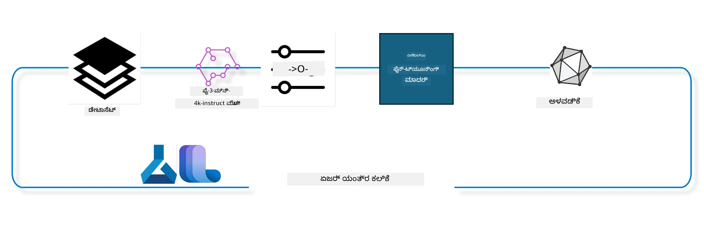

## ಮಾದರಿಯನ್ನು ಫೈನ್-ಟ್ಯೂನ್ ಮಾಡಲು ಆಜೂರ್‌ ಎಂಎಲ್ ಸಿಸ್ಟಮ್ ರಿಜಿಸ್ಟ್ರಿಯಿಂದ ಚಾಟ್-ಪೂರಕ ಘಟಕಗಳನ್ನು ಬಳಸುವುದು ಹೇಗೆ

ಈ ಉದಾಹರಣೆಯಲ್ಲಿ ನಾವು ultrachat_200k ಡೇಟಾಸೆಟ್ ಬಳಸಿ 2 ಜನರ ನಡುವಿನ ಸಂಭಾಷಣೆಯನ್ನು ಪೂರ್ಣಗೊಳಿಸಲು Phi-3-mini-4k-instruct ಮಾದರಿಯನ್ನು ಫೈನ್ ಟ್ಯೂನ್ ಮಾಡುತ್ತೇವೆ.



ಈ ಉದಾಹರಣೆ ನಿಮಗೆ ಆಜೂರ್ ಎಂಎಲ್ SDK ಮತ್ತು ಪೈಥಾನ್ ಬಳಸಿ ಫೈನ್ ಟ್ಯೂನಿಂಗ್ ಹೇಗೆ ಮಾಡಬೇಕೆಂದು ತೋರಿಸುತ್ತದೆ ಮತ್ತು ನಂತರ ಫೈನ್ ಟ್ಯೂನ್ ಮಾಡಲಾದ ಮಾದರಿಯನ್ನು ಆನ್‌ಲೈನ್ ಎಂಡ್‌ಪಾಯಿಂಟ್‌ಗೆ ನಿಯೋಜಿಸಿ ರಿಯಲ್ ಟೈಮ್ ಇನ್ಫರೆನ್ಸ್‌ಗಾಗಿ ಬಳಸುವುದು ಹೇಗೆ ಎಂಬುದನ್ನು ತೋರಿಸುತ್ತದೆ.

### ತರಬೆತಿ ಡೇಟಾ

ನಾವು ultrachat_200k ಡೇಟಾಸೆಟ್ ಅನ್ನು ಬಳಸುತ್ತೇವೆ. ಇದು UltraChat ಡೇಟಾಸೆಟ್‌ನ ಭಾರೀ ಫಿಲ್ಟರ್ ಮಾಡಿದ ಆವೃತ್ತಿಯಾಗಿದೆ ಮತ್ತು Zephyr-7B-β ತರಬೇತಿಯಿಂದ 7ಬಿ ಚಾಟ್ ಮಾದರಿ ತರಬೇತಿಗೆ ಬಳಸಲ್ಪಟ್ಟಿತು.

### ಮಾದರಿ

ನಾವು Phi-3-mini-4k-instruct ಮಾದರಿಯನ್ನು ಚಾಟ್-ಪೂರಕ ಕಾರ್ಯಕ್ಕಾಗಿ ಮಾದರಿಯನ್ನು ಫೈನ್ ಟ್ಯೂನ್ ಮಾಡುವುದು ಹೇಗೆ ಎನ್ನುವುದನ್ನು ತೋರಿಸಲು ಬಳಸುತ್ತೇವೆ. ನೀವು ಈ ನೋಟ್‌ಬುಕ್ ಅನ್ನು ವಿಶೇಷ ಮಾದರಿ ಕಾರ್ಡ್‌ನಿಂದ ತೆರೆಯಿಸಿಕೊಂಡಿದ್ದರೆ, ಆ ವಿಶೇಷ ಮಾದರಿಯ ಹೆಸರನ್ನು ಬದಲಾಯಿಸಬೇಕು.

### ಕಾರ್ಯಗಳು

- ಫೈನ್ ಟ್ಯೂನ್ ಮಾಡಲು ಮಾದರಿಯನ್ನು ಆರಿಸು.
- ತರಬೆತಿ ಡೇಟಾವನ್ನು ಆರಿಸಿ ಮತ್ತು ಅನ್ವೇಷಿಸಿ.
- ಫೈನ್ ಟ್ಯೂನ್ ಕೆಲಸವನ್ನು ಸಂರಚಿಸಿ.
- ಫೈನ್ ಟ್ಯೂನ್ ಕೆಲಸವನ್ನು চালಿಸಿ.
- ತರಬೆತಿ ಮತ್ತು ಮೌಲ್ಯಮಾಪನ ಮಿತಿಗಳು ಪರಿಶೀಲಿಸಿ.
- ಫೈನ್ ಟ್ಯೂನ್ ಮಾಡಲಾದ ಮಾದರಿಯನ್ನು ನೋಂದಣಿ ಮಾಡಿಸಿ.
- ಫೈನ್ ಟ್ಯೂನ್ ಮಾಡಲಾದ ಮಾದರಿಯನ್ನು ರಿಯಲ್ ಟೈಮ್ ಇನ್ಫರೆನ್ಸ್‌ಗೆ ನಿಯೋಜಿಸಿ.
- ಸಂಪನ್ಮೂಲಗಳನ್ನು ಸಫಾಯಿಸು.

## 1. ಪೂರ್ವಾಪೇಕ್ಷೆಗಳ ಸಿದ್ಧತೆ

- ಅವಶ್ಯಕತೆಗಳ इंस्टಾಲ್ ಮಾಡಿ
- AzureML ವರ್ಕ್‌ಸ್ಪೇಸ್‌ಗೆ ಸಂಪರ್ಕ ಸಾಧಿಸಿ. SDK ದೃಢೀಕರಣವನ್ನು ಸೆಟ್ ಅಪ್ ಮಾಡಲು ಇನ್ನಷ್ಟು ತಿಳಿಯಿರಿ. ಕೆಳಗಿನ <WORKSPACE_NAME>, <RESOURCE_GROUP>, ಮತ್ತು <SUBSCRIPTION_ID> ಅನ್ನು ಬದಲಾಯಿಸಿ.
- azureml ಸಿಸ್ಟಮ್ ರಿಜಿಸ್ಟ್ರಿಗೆ ಸಂಪರ್ಕ ಸಾಧಿಸಿ
- ಐಚ್ಛಿಕ ಪ್ರಯೋಗ ನಾಮವನ್ನು ಸೆಟ್ ಮಾಡಿ
- ಕಂಪ್ಯೂಟ್ ಪರಿಶೀಲನೆ ಅಥವಾ ರಚನೆ ಮಾಡಿ.

> [!NOTE]
> ಒಬ್ಬ GPU ನೋಡ್‌ಗೂ ಹಲವಾರು GPU ಕಾರ್ಡ್‌ಗಳು ಇರಬಹುದು. ಉದಾಹರಣೆಗೆ, Standard_NC24rs_v3 ನ ಒಂದು ನೋಡ್‌ನಲ್ಲಿ 4 NVIDIA V100 GPUಗಳಿವೆ ಮತ್ತು Standard_NC12s_v3 ನಲ್ಲಿ 2 NVIDIA V100 GPUಗಳಿವೆ. ಇದರ ಬಗ್ಗೆ ಮಾಹಿತಿಗಾಗಿ ಡಾಕ್ಸ್ ನೋಡಿ. ನೋಡ್‌ಗೆ ಪ್ರತಿ GPU ಕಾರ್ಡ್ ಸಂಖ್ಯೆಯನ್ನು ಕೆಳಗಿನ param gpus_per_node ನಲ್ಲಿ ಸೆಟ್ ಮಾಡಲಾಗುತ್ತದೆ. ಈ ಮೌಲ್ಯವನ್ನು ಸರಿಯಾಗಿ ಹೊಂದಿಸುವುದು ನೋಡ್‌ನ ಎಲ್ಲಾ GPUಗಳ ಬಳಕೆಯನ್ನು ಖಚಿತಪಡಿಸುತ್ತದೆ. ಶಿಫಾರಸು ಮಾಡಿದ GPU ಕಂಪ್ಯೂಟ್ SKUs ಇಲ್ಲಿಯೂ ಮತ್ತು ಇಲ್ಲಿಯೂ ಲಭ್ಯವಿದೆ.

### ಪೈಥಾನ್ ಲೈಸಬ್ರರಿಗಳು

ಕೆಳಗಿನ ಕೋಡ್ ಚಲನೆಯನ್ನು ರನ್ ಮಾಡುವ ಮೂಲಕ ಅವಶ್ಯಕತೆಗಳನ್ನು ಇನ್ಸ್ಟಾಲ್ ಮಾಡಿ. ಹೊಸ ಪರಿಸರದಲ್ಲಿ ಹೋಲಿಸುವಾಗ ಇದು ಐಚ್ಛಿಕ ಹಂತವಲ್ಲ.

```bash
pip install azure-ai-ml
pip install azure-identity
pip install datasets==2.9.0
pip install mlflow
pip install azureml-mlflow
```

### ಆಜೂರ್ ಎಂಎಲ್ನೊಂದಿಗೆ ಸಂವಹನ

1. ಈ ಪೈಥಾನ್ ಸ್ಕ್ರಿಪ್ಟ್ ಆಜೂರ್ ಮೆಷಿನ್ ಲರ್ನಿಂಗ್ (Azure ML) ಸೇವೆಯೊಂದಕ್ಕೆ ಸಂಪರ್ಕ ಸಾಧಿಸಲು ಬಳಸಲಾಗುತ್ತದೆ. ಇದರ ಕಾರ್ಯ ವಿಶೇಷ ವಿವರ ಇಲ್ಲಿದೆ:

    - azure.ai.ml, azure.identity, ಮತ್ತು azure.ai.ml.entities ಪ್ಯಾಕೇಜ್‌ಗಳಿಂದ ಅಗತ್ಯವಿರುವ ಮಾಡ್ಯೂಲ್‌ಗಳನ್ನು ಆಮದು ಮಾಡಿಕೊಳ್ಳುತ್ತದೆ. time ಮಾಡ್ಯೂಲ್ ಅನ್ನು ಕೂಡ ಆಮದು ಮಾಡುತ್ತದೆ.

    - DefaultAzureCredential() ಬಳಸಿ ಪ್ರಮಾಣೀಕರಣ ಮಾಡಲು ಪ್ರಯತ್ನಿಸುತ್ತದೆ, ಇದು ಆಜೂರ್ ಕ್ಲೌಡ್‌ನಲ್ಲಿ ವೇಗವಾಗಿ ಆ್ಯಪ್ಸ್ ಅಭಿವೃದ್ಧಿಪಡಿಸುವ ಸರಳವಾದ ಪ್ರಮಾಣೀಕರಣ ಅನುಭವವನ್ನು ಒದಗಿಸುತ್ತದೆ. ಅದು ವಿಫಲವಾದರೆ, InteractiveBrowserCredential() ಮೂಲಕ ಲಾಗಿನ್ ಪ್ರಾಂಪ್ಟ್ ನೀಡಲಾಗುತ್ತದೆ.

    - ನಂತರ config.json ಡಿಪಾಠದಿಂದ ಕಾನ್ಫಿಗರ್‌ ಮಾಡಿದ MLClient ಅನ್ನು from_config ವಿಧಾನದಿಂದ ರಚಿಸಲು ಪ್ರಯತ್ನಿಸುತ್ತದೆ. ವಿಫಲವಾದರೆ, subscription_id, resource_group_name, ಹಾಗೂ workspace_name ನಿಂದ MLClient ಅನ್ನು ಕೈಯಿಂದ ರಚಿಸುತ್ತದೆ.

    - “azureml” ಎಂಬ ಆಜೂರ್ ಎಂಎಲ್ ರಿಜಿಸ್ಟ್ರಿಗಾಗಿ ಮತ್ತೊಂದು MLClient ಸ್ವರೂಪವನ್ನು ರಚಿಸುತ್ತದೆ, ಇಲ್ಲಿಗೆ ಮಾದರಿಗಳು, ಫೈನ್-ಟ್ಯೂನಿಂಗ್ ಪೈಪ್‌ಲೈನ್‌ಗಳು, ಮತ್ತು ವಾತಾವರಣಗಳು ಸಂಗ್ರಹಿತವಾಗಿವೆ.

    - experiment_name ಅನ್ನು "chat_completion_Phi-3-mini-4k-instruct" ಎಂದು ಸೆಟ್ ಮಾಡುತ್ತದೆ.

    - ಪ್ರಸ್ತುತ ಕಾಲ (ಸೆಕೆಂಡುಗಳಲ್ಲಿ) ಅನ್ನು ಪೂರ್ಣಾಂಕಕ್ಕೆ ಪರಿವರ್ತಿಸಿ ನಂತರ ಸ್ಟ್ರಿಂಗ್‌ಗೆ ಪರಿವರ್ತಿಸಿ ವಿಶಿಷ್ಟ ಟೈಮ್‌ಸ್ಟ್ಯಾಂಪ್ ಸೃಷ್ಟಿ ಮಾಡುತ್ತದೆ. ಇದು ವಿಶಿಷ್ಟ ಹೆಸರು ಮತ್ತು ಆವೃತ್ತಿ ಸೃಷ್ಟಿಗೆ ಬಳಸಬಹುದು.

    ```python
    # Azure ML ಮತ್ತು Azure Identity ನಿಂದ ಅಗತ್ಯ ಮಡ್ಯೂಲ್ ಗಳು ಆಮದುಮಾಡಿ
    from azure.ai.ml import MLClient
    from azure.identity import (
        DefaultAzureCredential,
        InteractiveBrowserCredential,
    )
    from azure.ai.ml.entities import AmlCompute
    import time  # time ಬಳಕೆ ಮಾಡುವುದು
    
    # DefaultAzureCredential ಬಳಸಿ ಪ್ರಮಾಣೀಕರಣ ಮಾಡಲು ಪ್ರಯತ್ನಿಸಿ
    try:
        credential = DefaultAzureCredential()
        credential.get_token("https://management.azure.com/.default")
    except Exception as ex:  # DefaultAzureCredential ಅಸಫಲವಾದರೆ, InteractiveBrowserCredential ಬಳಸಿ
        credential = InteractiveBrowserCredential()
    
    # ಡಿಫಾಲ್ಟ್ ಕಾನ್ಫಿಗ್ ಫೈಲ್ ಬಳಸಿ MLClient ಇನ್ಸ್ಟೆನ್ಸ್ ಸೃಷ್ಟಿಸಲು ಪ್ರಯತ್ನಿಸಿ
    try:
        workspace_ml_client = MLClient.from_config(credential=credential)
    except:  # ಅದು ವಿಫಲವಾದರೆ, ವಿವರಗಳನ್ನು ಕೈಯಿಂದ ನೀಡಿ MLClient ಇನ್ಸ್ಟೆನ್ಸ್ ಅನ್ನು ಸೃಷ್ಟಿಸಿ
        workspace_ml_client = MLClient(
            credential,
            subscription_id="<SUBSCRIPTION_ID>",
            resource_group_name="<RESOURCE_GROUP>",
            workspace_name="<WORKSPACE_NAME>",
        )
    
    # "azureml" ಎಂಬ ಹೆಸರು ಇರುವ Azure ML ರೇಜಿಸ್ಟ್ರಿ కోసం ಮತ್ತೊಂದು MLClient ಇನ್ಸ್ಟೆನ್ಸ್ ಸೃಷ್ಟಿಸಿ
    # ಈ ರೇಜಿಸ್ಟ್ರಿಯಲ್ಲಿ ಮಾದರಿಗಳು, ಫೈನ್-ಟ್ಯೂನಿಂಗ್ ಪೈಪ್‌ಲೈನ್‌ಗಳು ಮತ್ತು ಪರಿಸರಗಳು ಸಂರಕ್ಷಿಸಲಾಗುತ್ತವೆ
    registry_ml_client = MLClient(credential, registry_name="azureml")
    
    # ಪ್ರಯೋಗದ ಹೆಸರು ನಿಗದಿಪಡಿಸಿ
    experiment_name = "chat_completion_Phi-3-mini-4k-instruct"
    
    # ಒಂದೇ ರೀತಿಯಲ್ಲಿರಬೇಕಾದ ಹೆಸರಿಗಳು ಮತ್ತು ಆವೃತ್ತಿಗಳಿಗಾಗಿ ಒಂದು ವಿಶೇಷ ಟೈಮ್ಸ್ಟ್ಯಾಂಪ್ ರಚಿಸಿ
    timestamp = str(int(time.time()))
    ```

## 2. ಫೈನ್ ಟ್ಯೂನ್ ಮಾಡಲು ಆಧಾರಿತ ಮಾದರಿಯನ್ನು ಆರಿಸು

1. Phi-3-mini-4k-instruct ಒಂದು 3.8 ಬಿಲಿಯನ್ ಪ್ಯಾರಾಮೀಟರ್‌ಗಳ, ಲಘು-ತೂಕದ, ಅತ್ಯಾಧುನಿಕ ಬಡ್ಡಿ ಮಾದರಿಯಾಗಿದೆ, ಇದು Phi-2 ಬಳಸಿದ ಡೇಟಾಸೆಟ್‌ಗಳ ಮೇಲೆ ನಿರ್ಮಿಸಲಾದದ್ದು. ಈ ಮಾದರಿ Phi-3 ಮಾದರಿ ಕುಟುಂಬಕ್ಕೆ ಸೇರಿದ್ದು, ಮಿನಿ ಆವೃತ್ತಿಯು 4K ಮತ್ತು 128K ಎಂಬ ಎರಡು ಬದ್ಧದ ಅವಿಭಾಜ್ಯ ಗಾತ್ರಗಳು (ಕೈಗೊಳ್ಳಬಲ್ಲ ಟೋಕನ್ಗಳ ಸಂಖ್ಯೆ) ಇದ್ದು, ನಾವು ನಿಜವಾಗಿಯೂ ಬಳಕೆ ಮಾಡಲು ಸ್ಪೆಷಲ್ ಗಾಗಿ ಫೈನ್ ಟ್ಯೂನಿಂಗ್ ಮಾಡಬೇಕು. ಈ ಮಾದರಿಗಳನ್ನು ನೀವು ಆಜೂರ್ ಎಂಎಲ್ ಸ್ಟುಡಿಯೋದ ಮಾದರಿ ಕ್ಯಾಟಲಾಕ್‌ನಲ್ಲಿ ಚಾಟ್-ಪೂರಕ ಕಾರ್ಯ फिल್ಟರ್ ಮಾಡಿ ಅನ್ವೇಷಿಸಬಹುದು. ಈ ಉದಾಹರಣೆಯಲ್ಲಿ Phi-3-mini-4k-instruct ಮಾದರಿಯನ್ನು ಬಳಸಲಾಗಿದೆ. ನೀವು ಬೇರೆ ಮಾದರಿಗಾಗಿ ಈ ನೋಟ್‌ಬುಕ್ ತೆರೆಯುತ್ತಿದ್ದರೆ, ಅದಕ್ಕೆ ಅನುಗುಣವಾಗಿ ಮಾದರಿ ಹೆಸರು ಮತ್ತು ಆವೃತ್ತಿಯನ್ನು ಬದಲಾಯಿಸಿ.

> [!NOTE]
> ಮಾದರಿಯ ಆದಾಯ ಆಸ್ತಿ ID. ಇದನ್ನು ಫೈನ್-ಟ್ಯೂನಿಂಗ್ ಕೆಲಸಕ್ಕೆ ಇನ್ಪುಟ್ ಆಗಿ ಪಾಸ್ ಮಾಡಲಾಗುತ್ತದೆ. ಇದು sidoo AzureML ಸ್ಟುಡಿಯೋ ಮಾದರಿ ಕ್ಯಾಟಲಾಕ್‌ನ ಮೋತ್ರ ಅವಕಾಶ ಅಂಕಿಯಲ್ಲಿ ಲಭ್ಯವಿದೆ.

2. ಈ ಪೈಥಾನ್ ಸ್ಕ್ರಿಪ್ಟ್ ಆಜೂರ ಎಂಎಲ್ ಸೇವೆಯೊಂದಿಗೆ ಸಂವಹನ ಮಾಡುತ್ತಿದೆ. ಅದರ ವಿವರಣೆ ಇಲ್ಲಿದೆ:

    - ಮಾದರಿ ಹೆಸರನ್ನು "Phi-3-mini-4k-instruct" ಎಂದು ಸೆಟ್ ಮಾಡುತ್ತದೆ.

    - registry_ml_client ವಸ್ತುವಿನ models ಗುಣಲಕ್ಷಣದ get ವಿಧಾನದಿಂದ ಆಜೂರ್ ಎಂಎಲ್ ರಿಜಿಸ್ಟ್ರಿಯಿಂದ ಇತ್ತೀಚಿನ ಆವೃತ್ತಿಯ ಮಾದರಿ ಪಡೆಯುತ್ತದೆ. get ವಿಧಾನಕ್ಕೆ ಮಾದರಿ ಹೆಸರು ಮತ್ತು ನವೀಕರಿಸಿದ ಆವೃತ್ತಿಯನ್ನು ಪಡೆಯಲು ಲೇಬಲ್ (latest) ಅನ್ನು ಕೊಡಲಾಗುತ್ತದೆ.

    - ಫೈನ್ ಟ್ಯೂನಿಂಗ್‌ಗೆ ಬಳಸಲಿರುವ ಮಾದರಿಯ ಹೆಸರು, ಆವೃತ್ತಿ, ಮತ್ತು ID ಬಗ್ಗೆ ಕನ್ಸೋಲ್‌ನಲ್ಲಿ הודעה ಪ್ರದರ್ಶಿಸುತ್ತದೆ. ಇಲ್ಲಿಗೆ string.format ಸಮಯವನ್ನು ಉಪಯೋಗಿಸಿ ಮಾಹಿತಿ ಸೇರಿಸಲಾಗುತ್ತದೆ, ಹಾಗೂ foundation_model ಆಸ್ತಿ ಮೂಲಕ ಲಕ್ಷಣಗಳನ್ನು ಪಡೆಯಲಾಗುತ್ತದೆ.

    ```python
    # ಮಾದರಿಯ ಹೆಸರನ್ನು ಸೆಟ್ ಮಾಡಿ
    model_name = "Phi-3-mini-4k-instruct"
    
    # ಅಜೂರ್ ಎಂಎಲ್ ರೆಜಿಸ್ಟ್ರಿಯಿಂದ ಮಾದರಿಯ ಇತ್ತೀಚಿನ ಆವೃತ್ತಿಯನ್ನು ಪಡೆಯಿರಿ
    foundation_model = registry_ml_client.models.get(model_name, label="latest")
    
    # ಮಾದರಿಯ ಹೆಸರು, ಆವೃತ್ತಿ ಮತ್ತು ಐಡಿಯನ್ನು ಮುದ್ರಿಸಿ
    # ಈ ಮಾಹಿತಿ ಟ್ರ್ಯಾಕಿಂಗ್ ಮತ್ತು ಡಿಬಗ್ಗಿಂಗ್‌ಗಾಗಿ ಉಪಯುಕ್ತವಾಗಿದೆ
    print(
        "\n\nUsing model name: {0}, version: {1}, id: {2} for fine tuning".format(
            foundation_model.name, foundation_model.version, foundation_model.id
        )
    )
    ```

## 3. ಕೆಲಸಕ್ಕೆ ಉಪಯೋಗಿಸುವ ಕಂಪ್ಯೂಟ್ ರಚಿಸಿ

ಫೈನ್ ಟ್ಯೂನ್ ಕೆಲಸ GPU ಕಂಪ್ಯೂಟ್ ಜೊತೆ ಮಾತ್ರ ಕೆಲಸ ಮಾಡುತ್ತದೆ. ಕಂಪ್ಯೂಟ್ ಗಾತ್ರವು ಮಾದರಿಯ ಗಾತ್ರದ ಮೇಲೆ ಅವಲಂಬಿತವಾಗಿದೆ ಮತ್ತು ಸರಿಯಾದ ಕಂಪ್ಯೂಟ್ ಆಯ್ಕೆ ಮಾಡುವುದು ಬಹಳ ಕಷ್ಟ. ಈ ಚರಣದಲ್ಲಿ, ಸರಿಯಾದ ಕಂಪ್ಯೂಟ್ ಆಯ್ಕೆ ಮಾಡಲು ಬಳಕೆದಾರನು ಮಾರ್ಗದರ್ಶನ ಮಾಡಲಾಗುತ್ತದೆ.

> [!NOTE]
> ಕೆಳಗಿನ ಕಂಪ್ಯೂಟ್‌ಗಳು ಅತ್ಯಾಧಿಕಾರಿತ ವಿನ್ಯಾಸದೊಂದಿಗೆ ಕಾರ್ಯನಿರ್ವಹಿಸುತ್ತವೆ. ವಿನ್ಯಾಸದಲ್ಲಿ ಯಾವುದೇ ಬದಲಾವಣೆ CUDA Out Of Memory ದೋಷ ನೀಡಬಹುದು. ಇಂತಹ ಸಂದರ್ಭಗಳಲ್ಲಿ, ದೊಡ್ಡ ಕಂಪ್ಯೂಟ್ ಗಾತ್ರಕ್ಕೆ ಅಪ್ಗ್ರೇಡ್ ಮಾಡಲು ಪ್ರಯತ್ನಿಸಿ.

> [!NOTE]
> ಕೆಳಗಿನ compute_cluster_size ತಲುಪಿಸುವಾಗ, ಕಂಪ್ಯೂಟ್ ನಿಮ್ಮ resource group ನಲ್ಲಿ ಲಭ್ಯವಿದೆಯೇ ಎಂದು ಖಚಿತಪಡಿಸಿ. ಲಭ್ಯವಿಲ್ಲದೆ ಇದ್ದರೆ, ಕಂಪ್ಯೂಟ್ ಸಂಪನ್ಮೂಲಗಳ ಪ್ರವೇಶಕ್ಕಾಗಿ ವಿನಂತಿ ಮಾಡಬಹುದು.

### ಫೈನ್ ಟ್ಯೂನಿಂಗ್ ಬೆಂಬಲಕ್ಕಾಗಿ ಮಾದರಿಯನ್ನು ಪರಿಶೀಲನೆ

1. ಈ ಪೈಥಾನ್ ಸ್ಕ್ರಿಪ್ಟ್ ಆಜೂರ್ ಎಂಎಲ್ ಮಾದರಿಯೊಂದಿಗೆ ಸಂವಹನ ಮಾಡುತ್ತಿದೆ. ವಿವರ ಇಲ್ಲಿದೆ:

    - ast ಮಾಡ್ಯೂಲ್‌ನ್ನು ಆಮದು ಮಾಡಿಕೊಳ್ಳುತ್ತದೆ, ಇದು ಪೈಥಾನ್ ಖಾಲಿ ಸಿಂಟ್ಯಾಕ್ಸ್ ಮರಗಳನ್ನು ಪ್ರಕ್ರಿಯೆಗೊಳಿಸಲು ಉಪಯೋಗಿಸಲಾಗುತ್ತದೆ.

    - foundation_model ವಸ್ತುವಿನ finetune_compute_allow_list ಎಂಬ ಟ್ಯಾಗ್ ಇದ್ದುದನ್ನು ಪರಿಶೀಲಿಸುತ್ತದೆ. ಟ್ಯಾಗ್‌ಗಳು ಕೀ-ವ್ಯಾಲ್ಯೂ ಜೋಡಿಗಳಾಗಿದ್ದು, ಅವುಗಳ ನೆರವಿನಿಂದ ಮಾದರಿಗಳನ್ನು ಫಿಲ್ಟರ್ ಮಾಡಬಹುದು.

    - finetune_compute_allow_list ಇದ್ದರೆ, ast.literal_eval() ಉಪಯೋಗಿಸಿ ಈ ಸ್ಟ್ರಿಂಗ್ ಮೌಲ್ಯವನ್ನು ಸುರಕ್ಷಿತವಾಗಿ ಪೈಥಾನ್ ಪಟ್ಟಿ ಆಗಿ ಪರಿವರ್ತಿಸಿ computes_allow_list ಗೆ ಹಂಚಿಸುತ್ತದೆ. ನಂತರ ಪಟ್ಟಿ ಯಿಂದ ಕಂಪ್ಯೂಟ್ ನಿರ್ಮಾಣ ಮಾಡಬೇಕೆಂದು ಸಲಹೆ ನೀಡುತ್ತದೆ.

    - finetune_compute_allow_list ಇಲ್ಲದಿದ್ದರೆ, computes_allow_list ಗೆ None ನೀಡುತ್ತಾ ಅದರ ಮಾಹಿತಿ ಕೊಡುತ್ತದೆ.

    - ಸಾರಾಂಶವಾಗಿ, ಈ ಸ್ಕ್ರಿಪ್ಟ್ ನಿಮ್ಮ ಮಾದರಿಯ ಮೆಟಾಡೇಟಾದ ಟ್ಯಾಗ್ ಪರಿಶೀಲಿಸುತ್ತಾ, ಅಲ್ಲಿದ್ದಲ್ಲಿ ಪಟ್ಟಿ ರೂಪದಲ್ಲಿ ಅನ್ವಯಿಸಿ ಬಳಕೆದಾರರಿಗೆ ಮಾಹಿತಿ ನೀಡುತ್ತದೆ.

    ```python
    # Python ಅಧೋಲೇಖ ಗಣಿತ ಶಾಸ്ത್ರದ ಮರಗಳನ್ನು ಪ್ರಕ್ರಿಯೆ ಮಾಡಬೇಕಾದ ಫಂಕ್ಷನ್‌ಗಳನ್ನು ಒದಗಿಸುವ ast მಾಡ್ಯೂಲ್ ಅನ್ನು ಆಮದು ಮಾಡಿ
    import ast
    
    # ಮಾದರಿಯ ಟ್ಯಾಗ್‌ಗಳಲ್ಲಿ 'finetune_compute_allow_list' ಟ್ಯಾಗ್ ಇದೆ ಎಂದು ಪರಿಶೀಲಿಸಿ
    if "finetune_compute_allow_list" in foundation_model.tags:
        # ಟ್ಯಾಗ್ ಇದ್ದಲ್ಲಿ, ast.literal_eval ಉಪಯೋಗಿಸಿ ಟ್ಯಾಗ್‌ನ ಮೌಲ್ಯವನ್ನು (ಸ್ಟ್ರಿಂಗ್) ಸುರಕ್ಷಿತವಾಗಿ ಪೈಥಾನ್ ಪಟ್ಟಿ ಆಗಿ ವಿಶ್ಲೇಷಿಸಿ
        computes_allow_list = ast.literal_eval(
            foundation_model.tags["finetune_compute_allow_list"]
        )  # ಸ್ಟ್ರಿಂಗ್ ಅನ್ನು ಪೈಥಾನ್ ಪಟ್ಟಿಗೆ ಪರಿವರ್ತಿಸಿ
        # ಪಟ್ಟಿಯಿಂದ ಕುಂಪ್ಯೂಟ್ ಸೃಷ್ಟಿಸಬೇಕೆಂದು ಸೂಚಿಸುವ ಸಂದೇಶವನ್ನು ಮುದ್ರಿಸಿ
        print(f"Please create a compute from the above list - {computes_allow_list}")
    else:
        # ಟ್ಯಾಗ್ ಇಲ್ಲದಿದ್ದರೆ, computes_allow_list ಅನ್ನು None ಗೆ ಸೆಟ್ ಮಾಡಿ
        computes_allow_list = None
        # 'finetune_compute_allow_list' ಟ್ಯಾಗ್ ಮಾದರಿಯ ಟ್ಯಾಗ್‌ಗಳಲ್ಲಿ ಇಲ್ಲ ಎಂದ ಸಂದೇಶವನ್ನು ಮುದ್ರಿಸಿ
        print("`finetune_compute_allow_list` is not part of model tags")
    ```

### ಕಂಪ್ಯೂಟ್ ಇನ್ಸ್‌ಟ್ಯಾನ್ಸ್ ಪರಿಶೀಲನೆ

1. ಈ ಪೈಥಾನ್ ಸ್ಕ್ರಿಪ್ಟ್ ಆಜೂರ್ ಎಂಎಲ್ ಸೇವೆಯೊಂದಿಗೆ ಸಂಪರ್ಕ ಸಾಧಿಸಿ ಒಂದು ಕಂಪ್ಯೂಟ್ ಇನ್ಸ್‌ಟ್ಯಾನ್ಸ್ ಮೇಲೆ ಹಲವು ಪರಿಶೀಲನೆಗಳು ಮಾಡುತ್ತಿದೆ:

    - compute_cluster ಹೆಸರಿನ ಕಂಪ್ಯೂಟ್ ಇನ್ಸ್‌ಟ್ಯಾನ್ಸ್ ಪಡೆಯಲು ಪ್ರಯತ್ನಿಸುತ್ತದೆ. Provisioning state "failed" ಇದ್ದರೆ, ValueError ಎಬ್ಬಿಸುತ್ತದೆ.

    - computes_allow_list None ಅಲ್ಲದಿದ್ದರೆ, ಎಲ್ಲಾ ಕಂಪ್ಯೂಟ್ ಸೈಜ್‌ಗಳನ್ನು lowercase ಗೆ ಪರಿವರ್ತಿಸಿ, ಪ್ರಸ್ತುತ ಕಂಪ್ಯೂಟ್ ಗಾತ್ರ ಈ ಪಟ್ಟಿಯಲ್ಲಿ ಇದೆಯೇ ಎಂದು ನೋಡುತ್ತದೆ. ಇಲ್ಲದಿದ್ದರೆ ValueError ಎಬ್ಬಿಸುತ್ತದೆ.

    - computes_allow_list None ಇದ್ದರೆ, ಪ್ರಸ್ತುತ ಕಂಪ್ಯೂಟ್ ಗಾತ್ರ ಅನುಮೋದಿತ_GPU VM ಗಾತ್ರಗಳ ಪಟ್ಟಿ ಒಳಗೊಂಡಿದೆಯೇ ತಪಾಸ್ ಮಾಡುತ್ತಾ ಇದ್ದರೆ ValueError ಎಬ್ಬಿಸುತ್ತದೆ.

    - ವ266ರ್ಕ್‌ಸ್ಪೇಸ್‌ನ ಎಲ್ಲಾ ಲಭ್ಯವಿರುವ ಕಂಪ್ಯೂಟ್ ಗಾತ್ರಗಳ ಪಟ್ಟಿಯನ್ನು ಪಡೆದು, ಪ್ರತಿ ಸೈಜ್‌ಗಾಗಿ ಗಾತ್ರವು ಪ್ರಸ್ತುತ ಕಂಪ್ಯೂಟ್ ಗಾತ್ರಕ್ಕೆ ಹೊಂದಿಕೆಯಾಗಿದೆಯೇ ಎಂದು ಪರಿಶೀಲಿಸುತ್ತದೆ. ಹೊಂದಿದ್ದರೆ, ಆ ಕಂಪ್ಯೂಟ್ ಗಾತ್ರದ GPU ಸಂಖ್ಯೆ ಪಡೆಯುತ್ತದೆ ಮತ್ತು gpu_count_found ಅನ್ನು Trueಗೆ ಸೆಟ್ ಮಾಡುತ್ತದೆ.

    - gpu_count_found True ಆಗಿದ್ದರೆ, ಕಂಪ್ಯೂಟ್‌ನಲ್ಲಿ ಇರುವ GPUಗಳ ಸಂಖ್ಯೆಯನ್ನು ಪ್ಯಾಜೀರುತ್ತದೆ. ಇಲ್ಲದಿದ್ದರೆ, ValueError ಎಬ್ಬಿಸುತ್ತದೆ.

    - ಸಾರಾಂಶವಾಗಿ, ಈ ಸ್ಕ್ರಿಪ್ಟ್ ಆಜೂರ್ ಎಂಎಲ್ ವರ್ಕ್‌ಸ್ಪೇಸ್‌ನಲ್ಲಿ ಕಂಪ್ಯೂಟ್ ಇನ್ಸ್‌ಟ್ಯಾನ್ಸ್‌ನ provisioning ಸ್ಥಿತಿ, ಗಾತ್ರ ಅನುವುಲಾದ ಸಿಸ್ಟ್ಪಟ್ಟಿ ಆಧಾರಿತ ಪರಿಶೀಲನೆಗಳು ಮತ್ತುGPU ಗಳ ಸಂಖ್ಯೆ ಮೊದಲವುಗಳನ್ನಷ್ಟೇ ಮಾಡುವುದಾಗಿದೆ.

    ```python
    # ಅಪವಾದ ಸಂದೇಶವನ್ನು ಮುದ್ರಿಸಿ
    print(e)
    # ಎಲ್ಲಿ ಕಂಪ್ಯೂಟ್ ಗಾತ್ರ ವರ್ಕ್‌ಸ್ಪೇಸ್‌ನಲ್ಲಿ ಲಭ್ಯವಿಲ್ಲದಿದ್ದರೆ ValueError ಅನ್ನು ಎಬ್ಬಿಸಿ
    raise ValueError(
        f"WARNING! Compute size {compute_cluster_size} not available in workspace"
    )
    
    # ಅಜೂರ್ ಎಂಎಲ್ ವರ್ಕ್‌ಸ್ಪೇಸ್‌ನಿಂದ ಕಂಪ್ಯೂಟ್ ಇನ್‌ಸ್ಟೆನ್ಸ್ ಅನ್ನು ಪಡೆಯಿರಿ
    compute = workspace_ml_client.compute.get(compute_cluster)
    # ಕಂಪ್ಯೂಟ್ ಇನ್‌ಸ್ಟೆನ್ಸ್‌ನ ಪ್ರೊವಿಷನಿಂಗ್ ಸ್ಥಿತಿಯನ್ನು "ಫೇಲ್ಡ್" ಆಗಿದೆಯೇ ಎಂದು ಪರಿಶೀಲಿಸಿ
    if compute.provisioning_state.lower() == "failed":
        # ಪ್ರೊವಿಷನಿಂಗ್ ಸ್ಥಿತಿ "ಫೇಲ್ಡ್" ಇದ್ದರೆ ValueError ಅನ್ನು ಎಬ್ಬಿಸಿ
        raise ValueError(
            f"Provisioning failed, Compute '{compute_cluster}' is in failed state. "
            f"please try creating a different compute"
        )
    
    # computes_allow_list.None ಆಗಿಲ್ಲವೆಂದು ಪರಿಶೀಲಿಸಿ
    if computes_allow_list is not None:
        # computes_allow_listನಲ್ಲಿನ ಎಲ್ಲಾ ಕಂಪ್ಯೂಟ್ ಗಾತ್ರಗಳನ್ನು ಲೋವರಕೇಸ್‌ಗೆ ಮಾರ್ಪಡಿಸಿ
        computes_allow_list_lower_case = [x.lower() for x in computes_allow_list]
        # ಕಂಪ್ಯೂಟ್ ಇನ್‌ಸ್ಟೆನ್ಸ್ ಗಾತ್ರವು computes_allow_list_lower_case್‌ನಲ್ಲಿ ಇದೆಯೇ ಎಂದು ಪರಿಶೀಲಿಸಿ
        if compute.size.lower() not in computes_allow_list_lower_case:
            # ಕಂಪ್ಯೂಟ್ ಇನ್‌ಸ್ಟೆನ್ಸ್ ಗಾತ್ರವು computes_allow_list_lower_case್‌ನಲ್ಲಿ ಇಲ್ಲದಿದ್ದರೆ ValueError ಅನ್ನು ಎಬ್ಬಿಸಿ
            raise ValueError(
                f"VM size {compute.size} is not in the allow-listed computes for finetuning"
            )
    else:
        # ಬೆಂಬಲಿಸಲಾಗದ GPU ವಿ.ಎಂ ಗಾತ್ರಗಳ ಪಟ್ಟಿಯನ್ನು นิಧರಿಸಿ
        unsupported_gpu_vm_list = [
            "standard_nc6",
            "standard_nc12",
            "standard_nc24",
            "standard_nc24r",
        ]
        # ಕಂಪ್ಯೂಟ್ ಇನ್‌ಸ್ಟೆನ್ಸ್ ಗಾತ್ರವು unsupported_gpu_vm_list್‌ನಲ್ಲಿ ಇದೆಯೇ ಎಂದು ಪರಿಶೀಲಿಸಿ
        if compute.size.lower() in unsupported_gpu_vm_list:
            # ಕಂಪ್ಯೂಟ್ ಇನ್‌ಸ್ಟೆನ್ಸ್ ಗಾತ್ರವು unsupported_gpu_vm_list್‌ನಲ್ಲಿ ಇದ್ದರೆ ValueError ಅನ್ನು ಎಬ್ಬಿಸಿ
            raise ValueError(
                f"VM size {compute.size} is currently not supported for finetuning"
            )
    
    # ಕಂಪ್ಯೂಟ್ ಇನ್‌ಸ್ಟೆನ್ಸ್‌ನಲ್ಲಿ GPUಗಳ ಸಂಖ್ಯೆಯನ್ನು ಪತ್ತೆಮಾಡುವುದಕ್ಕಾಗಿ ಒಂದು ಧ್ವಜವನ್ನು ಆರಂಭಿಸಿ
    gpu_count_found = False
    # ವರ್ಕ್‌ಸ್ಪೇಸ್‌ನಲ್ಲಿನ ყველა ಲಭ್ಯವಿರುವ ಕಂಪ್ಯೂಟ್ ಗಾತ್ರಗಳ ಪಟ್ಟಿಯನ್ನು ಪಡೆಯಿರಿ
    workspace_compute_sku_list = workspace_ml_client.compute.list_sizes()
    available_sku_sizes = []
    # ಲಭ್ಯವಿರುವ ಕಂಪ್ಯೂಟ್ ಗಾತ್ರಗಳ ಪಟ್ಟಿಯ ಮೇಲೆ ಪುನರಾವೃತ್ತಿ ಮಾಡಿ
    for compute_sku in workspace_compute_sku_list:
        available_sku_sizes.append(compute_sku.name)
        # ಕಂಪ್ಯೂಟ್ ಗಾತ್ರದ ಹೆಸರವು ಕಂಪ್ಯೂಟ್ ಇನ್‌ಸ್ಟೆನ್ಸ್ ಗಾತ್ರಕ್ಕೆ ಹೊಂದಿಕೆಯಾಗಿದೆಯೇ ಎಂದು ಪರಿಶೀಲಿಸಿ
        if compute_sku.name.lower() == compute.size.lower():
            # ಅದಾದರೆ, ಆ ಕಂಪ್ಯೂಟ್ ಗಾತ್ರಕ್ಕೆ GPUಗಳ ಸಂಖ್ಯೆಯನ್ನು ಪಡೆದು gpu_count_found ನ್ನು Trueಗೆ ಹೊಂದಿಸಿ
            gpus_per_node = compute_sku.gpus
            gpu_count_found = True
    # gpu_count_found True ಇದ್ದರೆ, ಕಂಪ್ಯೂಟ್ ಇನ್‌ಸ್ಟೆನ್ಸ್‌ನ GPUಗಳ ಸಂಖ್ಯೆಯನ್ನು ಮುದ್ರಿಸಿ
    if gpu_count_found:
        print(f"Number of GPU's in compute {compute.size}: {gpus_per_node}")
    else:
        # gpu_count_found False ಇದ್ದರೆ, ValueError ಅನ್ನು ಎಬ್ಬಿಸಿ
        raise ValueError(
            f"Number of GPU's in compute {compute.size} not found. Available skus are: {available_sku_sizes}."
            f"This should not happen. Please check the selected compute cluster: {compute_cluster} and try again."
        )
    ```

## 4. ಮಾದರಿಯನ್ನು ಫೈನ್ ಟ್ಯೂನಿಂಗ್ ಮಾಡಲು ಡೇಟಾಸೆಟ್ ಆರಿಸು

1. ನಾವು ultrachat_200k ಡೇಟಾಸೆಟ್ ಬಳಸುತ್ತೇವೆ. ಈ ಡೇಟಾಸೆಟ್ ನಾಲ್ಕು ವಿಭಾಗಗಳಾಗಿ ಹಂಚಲ್ಪಟ್ಟಿದ್ದು, ಸೂಪರ್ವೈಸ್ಡ್ ಫೈನ್-ಟ್ಯೂನಿಂಗ್ (sft) ಗೆ ಸೂಕ್ತವಾಗಿದೆ.
ಜನರೇಶನ್ ರ್ಯಾಂಕಿಂಗ್ (gen). ವಿಭಾಗದ ಪ್ರತಿ ಉದಾಹರಣೆಗಳ ಸಂಖ್ಯೆ ಕೆಳಗಿನಂತೆ:

    ```bash
    train_sft test_sft  train_gen  test_gen
    207865  23110  256032  28304
    ```

1. ಮುಂದಿನ ಕೆಲವು ಸೆಲ್ಸ್ ಮೂಲಭೂತ ಡೇಟಾ ಸಿದ್ಧತೆ ಪ್ರದರ್ಶಿಸುತ್ತವೆ.

### ಕೆಲವು ಡೇಟಾ ಸಾಲುಗಳನ್ನು ವೀಕ್ಷಣೆಮಾಡಿ

ನಾವು ಈ ಮಾದರಿಯನ್ನು ವೇಗವಾಗಿ ಓಡಿಸಲು ಬಯಸುತ್ತೇವೆ, ಆದ್ದರಿಂದ train_sft ಮತ್ತು test_sft ಎไฟಲ್‌ಗಳಲ್ಲಿನ ಮೊದಲ 5% ಸಾಲುಗಳನ್ನು ಉಳಿಸುತ್ತೇವೆ. ಇದರರ್ಥ ಫೈನ್ ಟ್ಯೂನ್ ಮಾಡಿದ ಮಾದರಿ ಕಡಿಮೆ ಅಚ್ಚುಮೆಚ್ಚು ಹೊಂದಿರುತ್ತದೆ ಮತ್ತು ಯಾವಾಗಲೂ ಪ್ರಾಯೋಗಿಕ ಉಪಯೋಗಕ್ಕೆ ಹೊಂದಿಕೆಯಾಗದು.

download-dataset.py ultrachat_200k ಡೇಟಾಸೆಟ್ ಅನ್ನು ಡೌನ್‌ಲೋಡ್ ಮಾಡಿ ಫೈನ್ ಟ್ಯೂನ್ ಪೈಪ್‌ಲೈನ್ ಘಟಕಗಳಿಗೆ ಅನುಕೂಲವಾಗುವಂತೆ ಡೇಟಾ ಪರಿವರ್ತನೆಗಾಗಿ ಬಳಸಲಾಗುತ್ತದೆ. ಏಕೆಂದರೆ ಡೇಟಾ ದೊಡ್ಡದಾಗಿದೆ, ಇಲ್ಲಿ ಡೇಟಾಸೆಟ್‌ನ ಭಾಗ ಮಾತ್ರ ಇದೆ.

1. ಕೆಳಗಿನ ಸ್ಕ್ರಿಪ್ಟ್ 5% ಮಾತ್ರ ಡೇಟಾವನ್ನು ಡೌನ್‌ಲೋಡ್ ಮಾಡುತ್ತದೆ. ಇದನ್ನು dataset_split_pc ಪರಾಮೀಟರ್ ಬದಲಾಯಿಸಿ ಹೆಚ್ಚಿಸಬಹುದು.

> [!NOTE]
> ಕೆಲವು ಭಾಷಾ ಮಾದರಿಗಳ ಭಾಷಾ ಕೋಡ್‌ಗಳು ವಿಭಿನ್ನವಾಗಿರುತ್ತವೆ ಮತ್ತು ಆದ್ದರಿಂದ ಡೇಟಾಸೆಟ್‌ನ ಕಾಲಮ್ ಹೆಸರುಗಳು ಕೂಡ ಅದನ್ನು ಪ್ರತಿಬಿಂಬಿಸಬೇಕು.

1. ಡೇಟಾ ಈ ರೀತಿಯಿರಬೇಕು ಎಂಬ ಉದಾಹರಣೆ ಇಲ್ಲಿದೆ:
ಚಾಟ್-ಪೂರಕ ಡೇಟಾಸೆಟ್ parquet ಸ್ವರೂಪದಲ್ಲಿ ಸಂಗ್ರಹವಾಗಿದೆ ಮತ್ತು ಪ್ರತಿಯೊಂದು ದಾಖಲೆ ಈ ಕೆಳಗಿನ ಸ್ಕೀಮಾದಲ್ಲಿ ಇರುತ್ತದೆ:

    - ಇದು JSON (ಜಾವಾಸ್ಕ್ರಿಪ್ಟ್ ಆಬ್ಜೆಕ್ಟ್ ನೋಟೇಷನ್) ಡಾಕ್ಯುಮೆಂಟ್ ಆಗಿದ್ದು, ಜನಪ್ರಿಯ ಡೇಟಾ ವಿನಿಮಯ ಸ್ವರೂಪ. ಇದು ಕಾರ್ಯನಿರ್ವಹಿಸಲು ಕೋಡ್ ಅಲ್ಲ.

    - "prompt": ಇದು ಒಂದು ಸ್ಟ್ರಿಂಗ್ ಮೌಲ್ಯ, ಅದು AI ಸಹಾಯಕನಿಗೆ ನಿಟ್ಟಿದ ಪ್ರಶ್ನೆ ಅಥವಾ ಕಾರ್ಯ.

    - "messages": ಇದು ಅಭಿಪ್ರಾಯಗಳ ಅರೇ (array). ಪ್ರತಿ ಅರೇ ವಸ್ತು ಒಂದು ಸಂದೇಶವನ್ನು ತೋರಿಸುತ್ತದೆ, ಬಳಕೆದಾರ ಮತ್ತು AI ಸಹಾಯಕನ ನಡುವೆ. ಪ್ರತಿ ಸಂದೇಶವು ಎರಡು ಕೀಲಿಗಳನ್ನು ಹೊಂದಿದೆ:

    - "content": ಸಂದೇಶದ ವಿಷಯವಿರುವ ಸ್ಟ್ರಿಂಗ್ ಮೌಲ್ಯ.
    - "role": ಸಂದೇಶ ಕಳುಹಿಸಿದ ಅಂಗಳದ ಪಾತ್ರವನ್ನು ತೋರಿಸುವ ಸ್ಟ್ರಿಂಗ್ ಮೌಲ್ಯ. "user" ಅಥವಾ "assistant" ಆಗಿರಬಹುದು.
    - "prompt_id": ಪ್ರತಿಯೊಂದು ಪ್ರಾಂಪ್ಟ್‌ಗೆ ಒದಗಿಸುವ ಅನನ್ಯ ಗುರುತಿನ ಸಂಖ್ಯೆ.

1. ಈ JSON ಡಾಕ್ಯುಮೆಂಟ್ನಲ್ಲಿ, ಒಂದು ಸಂಭಾಷಣೆಯನ್ನು ತೋರಿಸಲಾಗಿದ್ದು, ಬಳಕೆದಾರ dystopian ಕಥೆಯ ನಾಯಕನು ರಚಿಸಲು ಅ AI ಸಹಾಯಕನಿಗೆ ಕೇಳುತ್ತಾನೆ. ಸಹಾಯಕ ಪ್ರತಿಕ್ರಿಯಿಸುತ್ತಾನೆ, ನಂತರ ಬಳಕೆದಾರ ಹೆಚ್ಚಿನ ವಿವರಗಳನ್ನು ಕೇಳುತ್ತಾನೆ. ಸಹಾಯಕ ಇನ್ನಷ್ಟು ವಿವರಗಳನ್ನು ಒದಗಿಸಲು ಒಪ್ಪಿಕೊಳ್ಳುತ್ತಾನೆ. ಸಂಪೂರ್ಣ ಸಂಭಾಷಣೆ ವಿವಿದ prompt id ಗೆ ಸೇರಿದೆ.

    ```python
    {
        // The task or question posed to an AI assistant
        "prompt": "Create a fully-developed protagonist who is challenged to survive within a dystopian society under the rule of a tyrant. ...",
        
        // An array of objects, each representing a message in a conversation between a user and an AI assistant
        "messages":[
            {
                // The content of the user's message
                "content": "Create a fully-developed protagonist who is challenged to survive within a dystopian society under the rule of a tyrant. ...",
                // The role of the entity that sent the message
                "role": "user"
            },
            {
                // The content of the assistant's message
                "content": "Name: Ava\n\n Ava was just 16 years old when the world as she knew it came crashing down. The government had collapsed, leaving behind a chaotic and lawless society. ...",
                // The role of the entity that sent the message
                "role": "assistant"
            },
            {
                // The content of the user's message
                "content": "Wow, Ava's story is so intense and inspiring! Can you provide me with more details.  ...",
                // The role of the entity that sent the message
                "role": "user"
            }, 
            {
                // The content of the assistant's message
                "content": "Certainly! ....",
                // The role of the entity that sent the message
                "role": "assistant"
            }
        ],
        
        // A unique identifier for the prompt
        "prompt_id": "d938b65dfe31f05f80eb8572964c6673eddbd68eff3db6bd234d7f1e3b86c2af"
    }
    ```

### ಡೇಟಾವನ್ನು ಡೌನ್‌ಲೋಡ್ ಮಾಡುವುದು

1. ಈ ಪೈಥಾನ್ ಸ್ಕ್ರಿಪ್ಟ್ download-dataset.py ಎಂಬ ಸಹಾಯಕ ಸ್ಕ್ರಿಪ್ಟ್ ಬಳಸಿ ಡೇಟಾಸೆಟ್ ಡೌನ್‌ಲೋಡ್ ಮಾಡಲು ಬಳಸಲಾಗುತ್ತದೆ. ಇದರ ವಿವರಣೆ ಇಲ್ಲಿದೆ:

    - os ಮಾಡ್ಯೂಲ್ ಅನ್ನು ಆಮದು ಮಾಡಿಕೊಳ್ಳುತ್ತದೆ, ಇದು ಕಾರ್ಯಾಚರಣಾ ವ್ಯವಸ್ಥೆಯ ನಿಖರ ಕಾರ್ಯಗಳನ್ನು ಪ್ರಾಯೋಗನೆಗೊಳಿಸುತ್ತದೆ.

    - os.system ಫಂಕ್ಷನ್ ಬಳಸಿ download-dataset.py ಸ್ಕ್ರಿಪ್ಟ್ನೊಂದಿಗೆ ಆರ್ಜುಗಳನ್ನು shell ನಲ್ಲಿ ಕಳುಹಿಸಲಾಗುತ್ತದೆ: ಡೇಟಾಸೆಟ್ (HuggingFaceH4/ultrachat_200k), ಡೌನ್‌ಲೋಡ್ ಡೈರಕ್ಟರಿ ultrachat_200k_dataset ಮತ್ತು ಡೇಟಾಸೆಟ್ ಭಾಗದ ಪ್ರಮಾಣವು 5%. os.system ಇದರ ಕಾರ್ಯ ಮುಗಿಸಿಕೊಳ್ಳುವ ಸ್ಥಿತಿಯನ್ನು exit_status ಗೆ ನೀಡುತ್ತದೆ.

    - exit_status 0 ಅಲ್ಲದಿದ್ದರೆ (ಅಥವಾ ವಿಫಲವಾದರೆ) Exception ಎಬ್ಬಿಸಿ ಡೇಟಾಸೆಟ್ ಡೌನ್‌ಲೋಡ್ ತಪ್ಪಿದ ಬಗ್ಗೆ ತಿಳಿಸುತ್ತದೆ.

    - ಮುಕ್ತಾಯವಾಗಿ, ಇದು ಸಹಾಯಕ ಸ್ಕ್ರಿಪ್ಟ್ ಮೂಲಕ ಡೇಟಾಸೆಟ್ ಡೌನ್‌ಲೋಡ್ ಮಾಡಲು ಆಜ್ಞೆ ನೀಡುತ್ತವೆ ಮತ್ತು ವಿಫಲವಾದಾಗ ಕಣ್ಣು ತೆರೆಯುತ್ತದೆ.

    ```python
    # ಆಪರೇಟಿಂಗ್ ಸಿಸ್ಟಮ್ ಅವಲಂಬಿತ ಕಾರ್ಯಕ್ಷಮತೆಯನ್ನು ಬಳಸುವ ಮಾರ್ಗವನ್ನು ನೀಡುವ os模块 ಅನ್ನು ಆಮದುಮಾಡಿ
    import os
    
    # ನಿರ್ದಿಷ್ಟ ಕಮಾಂಡ್-ಲೈನ್ ಆರ್ಗ್ಯುಮೆಂಟ್ ಗಳೊಂದಿಗೆ ಶೆಲ್‌ನಲ್ಲಿ download-dataset.py ಸ್ಕ್ರಿಪ್ಟ್ ಅನ್ನು ಚಾಲನೆಯಲ್ಲಿಡಲು os.system ಕಾರ್ಯವನ್ನು ಬಳಸಿ
    # ಆರ್ಗ್ಯುಮೆಂಟ್ ಗಳಲ್ಲಿ ಡೌನ್‌ಲೋಡ್ ಮಾಡಬೇಕಾದ ಡೇಟಾಸೆಟ್ (HuggingFaceH4/ultrachat_200k), ಅದನ್ನು ಡೌನ್‌ಲೋಡ್ ಮಾಡಲು ಡೈರೆಕ್ಟರಿ (ultrachat_200k_dataset), ಮತ್ತು ಡೇಟಾಸೆಟ್ ಅನ್ನು ವಿಭಜಿಸಲು ಶೇಕಡಾವಾರು (5) ನಿರ್ಧರಿಸಲಾಗಿದೆ
    # os.system ಕಾರ್ಯವು ಅದು ಕಾರ್ಯಗತಗೊಳಿಸಿದ ಕಮಾಂಡ್‌ನ ನಿರ್ಗಮನ ಸ್ಥಿತಿಯನ್ನು ಹಿಂತಿರುಗಿಸುತ್ತದೆ; ಈ ಸ್ಥಿತಿಯನ್ನು exit_status 변수ದಲ್ಲಿ ಸಂಗ್ರಹಿಸಲಾಗಿದೆ
    exit_status = os.system(
        "python ./download-dataset.py --dataset HuggingFaceH4/ultrachat_200k --download_dir ultrachat_200k_dataset --dataset_split_pc 5"
    )
    
    # exit_status 0 ಅಲ್ಲದಿದೆಯೇ ಎಂದು ಪರಿಶೀಲಿಸಿ
    # ಯುನಿಕ್ಸ್-ಂತಹ ಆಪರೇಟಿಂಗ್ ಸಿಸ್ಟಂಗಳಲ್ಲಿ, 0 ನೇರಗತ ನಿರ್ಗಮನ ಸ್ಥಿತಿ ಸಾಮಾನ್ಯವಾಗಿ ಕಮಾಂಡ್ ಯಶಸ್ವಿಯಾಗಿದೆ ಎಂದು ಸೂಚಿಸುತ್ತದೆ, ಆದರೆ ಯಾವುದೇ ಇತರೆ ಸಂಖ್ಯೆ ದೋಷದ ಸಂಕೇತವಿರುತ್ತದೆ
    # exit_status 0 ಅಲ್ಲದಿದ್ದರೆ, ಡೇಟಾಸೆಟ್ ಡೌನ್‌ಲೋಡ್ ಮಾಡುವಲ್ಲಿ ದೋಷವಾಯಿತು ಎಂಬ ಸಂದೇಶದೊಂದಿಗೆ Exception ಎಕೆರಿಸಿ
    if exit_status != 0:
        raise Exception("Error downloading dataset")
    ```

### ಡೇಟಾವನ್ನು ಡೇಟಾಫ್ರೇಮ್‌ಗೆ ಲೋಡ್ ಮಾಡುವುದು
1. ಈ ಪೈಥಾನ್ ಸ್ಕ್ರಿಪ್ಟ್ pandas DataFrame ಗೆ JSON Lines ಫೈಲ್ ಅನ್ನು ಲೋಡ್ ಮಾಡಿ ಮೊದಲ 5 ಸಾಲುಗಳನ್ನು ಪ್ರದರ್ಶಿಸುತ್ತಿದೆ. ಅದರ ಕಾರ್ಯವಿವರಣೆ ಇಲ್ಲಿದೆ:

    - ಇದು pandas ಲೈಬ್ರರಿ ಅನ್ನು ಆಮದು ಮಾಡಿಕೊಳ್ಳುತ್ತದೆ, ಇದು ಶಕ್ತಿಶಾಲಿ ದತ್ತಾಂಶ ನಿರ್ವಹಣೆ ಮತ್ತು ವಿಶ್ಲೇಷಣಾ ಲೈಬ್ರರಿ.

    - pandas ಪ್ರದರ್ಶನ ಆಯ್ಕೆಗಳಿಗಾಗಿಯು ಗరిష್ಠ ಕಾಲಮ್ ಅಗಲವನ್ನು 0ಗೆ ಸೆಟ್ ಮಾಡುತ್ತದೆ. ಇದರರ್ಥ, DataFrame ಮುದ್ರಣ ಮಾಡುವಾಗ ಪ್ರತಿ ಕಾಲಮ್‌ನ ಸಂಪೂರ್ಣ ಪಠ್ಯವನ್ನು ಕಡಿತವಿಲ್ಲದೆ ಪ್ರದರ್ಶಿಸುವುದು.

    - pd.read_json ಫಂಕ್ಷನ್ ಬಳಸಿ ultrachat_200k_dataset ಡೈರೆಕ್ಟರಿಯ train_sft.jsonl ಫೈಲ್ ಅನ್ನು DataFrame ಗೆ ಲೋಡ್ ಮಾಡುತ್ತದೆ. lines=True ಪರಾಮೆಟರ್ ಫೈಲ್ JSON Lines ಸ್ವರೂಪದಲ್ಲಿದೆ ಎಂದು ಸೂಚಿಸುತ್ತದೆ, ಅಲ್ಲಿ ಪ್ರತಿ ಸಾಲು ಪ್ರತ್ಯೇಕ JSON ವಸ್ತುವಾಗಿರುತ್ತದೆ.

    - head ಮೆತೋಡ್ನನ್ನು ಬಳಸಿ DataFrame ನ ಮೊದಲ 5 ಸಾಲುಗಳನ್ನು ಪ್ರದರ್ಶಿಸುತ್ತದೆ. DataFrame 5 ಕ್ಕಿಂತ ಕಡಿಮೆ ಸಾಲುಗಳು ಇದ್ದರೆ ಎಲ್ಲಾ ಮುದ್ರಣವಾಗುತ್ತದೆ.

    - ಸಾರાંಶವಾಗಿ, ಈ ಸ್ಕ್ರಿಪ್ಟ್ JSON Lines ಫೈಲನ್ನು DataFrame ಗೆ ಲೋಡ್ ಮಾಡಿ ಮೊದಲ 5 ಸಾಲುಗಳನ್ನು ಸಂಪೂರ್ಣ ಕಾಲಮ್ ಪಠ್ಯದೊಂದಿಗೆ ಪ್ರದರ್ಶಿಸುತ್ತಿದೆ.
    
    ```python
    # ಶಕ್ತಿಶಾಲಿ ಡೇಟಾ ಮನಿಪ್ಯುಲೇಶನ್ ಮತ್ತು ವಿಶ್ಲೇಷಣೆ ಲೈಬ್ರರಿಯಾದ pandas ಲೈಬ್ರರಿಯನ್ನು ಆಮದುಮಾಡಿ
    import pandas as pd
    
    # pandas ನ ಪ್ರದರ್ಶನ ಆಯ್ಕೆಗಳಲ್ಲಿ ಗರಿಷ್ಠ ಕಾಲಮ್ ಅಗಲವನ್ನು 0ಗೆ ಸೆಟ್ ಮಾಡಿ
    # ಇದು ಅರ್ಥ ಪಟ್ಟಿದೆ ಎಂದರೆ ಪ್ರತಿ ಕಾಲಮ್‌ನ ಪೂರ್ಣ ಪಠ್ಯವು ಸಂಕೊಚಿತವಾಗದೆ DataFrame ಮುದ್ರಿಸಲಾಗಿದೆ
    pd.set_option("display.max_colwidth", 0)
    
    # pd.read_json ಫಂಕ್ಷನ್ ಬಳಸಿ ultrachat_200k_dataset ಡೈರೆಕ್ಟರಿಯಲ್ಲಿ train_sft.jsonl ಫೈಲನ್ನು DataFrame ಗೆ ಲೋಡ್ ಮಾಡಿ
    # lines=True ಆರ್ಗ್ಯುಮೆಂಟ್ ಆ ಫೈಲು JSON Lines ಫಾರ್ಮ್ಯಾಟ್ ನಲ್ಲಿ ಇದೆ ಎಂದು ಸೂಚಿಸುತ್ತದೆ, ಅಲ್ಲಿ ಪ್ರತಿ ಸಾಲು ಒಬ್ಬ JSON ವಸ್ತು ಆಗಿದೆ
    df = pd.read_json("./ultrachat_200k_dataset/train_sft.jsonl", lines=True)
    
    # head ವಿಧಾನವನ್ನು ಬಳಸಿ DataFrame ನ ಮೊದಲ 5 ಸಾಲುಗಳನ್ನು ಪ್ರದರ್ಶಿಸಿ
    # DataFrame ನಲ್ಲಿ 5 ಕ್ಕಿಂತ ಕಡಿಮೆ ಸಾಲುಗಳಿದ್ದರೆ ಎಲ್ಲಾ ಸಾಲುಗಳನ್ನೂ ಪ್ರದರ್ಶಿಸಲಾಗುತ್ತದೆ
    df.head()
    ```

## 5. ಮಾದರಿ ಮತ್ತು ಡೇಟಾ ಇನ್‌ಪುಟ್‌‌ಗಳನ್ನು ಬಳಸಿ ಫೈನ್ ಟ್ಯೂನಿಂಗ್ ಕೆಲಸವನ್ನು ಸಲ್ಲಿಸಿ

ಚಾಟ್-ಕಂಪ್ಲೀಶನ್ ಪೈಪ್ಲೈನ್ಘಟಕವನ್ನು ಬಳಸುವ ಕೆಲಸವನ್ನು ರಚಿಸಿ. ಫೈನ್ ಟ್ಯೂನಿಂಗ್‌ಗೆ ಬೆಂಬಲಿತ ಎಲ್ಲಾ ಪರಾಮಿತಿಗಳನ್ನು ಇನ್ನಷ್ಟು ತಿಳಿದುಕೊಳ್ಳಿ.

### ಫೈನ್ ಟ್ಯೂನ್ ಪರಾಮಿತಿಗಳನ್ನು ವ್ಯಾಖ್ಯಾನಿಸಿ

1. ಫೈನ್ ಟ್ಯೂನ್ ಪರಾಮಿತಿಗಳನ್ನು 2 ವರ್ಗಗಳಲ್ಲಿ ಗುಂಪು ಮಾಡಬಹುದು - ತರಬೇತಿ ಪರಾಮಿತಿಗಳು, ಅನೂಕೂಲನೆ ಪರಾಮಿತಿಗಳು

1. ತರಬೇತಿ ಪರಾಮಿತಿಗಳು ತರಬೇತಿಯ ಅಂಶಗಳನ್ನು ವ್ಯಾಖ್ಯಾನಿಸುತ್ತವೆ, ಉದಾಹರಣೆಗೆ -

    - ಬಳಸದ ಪ್ರಕ್ರಿಯಿಸಿ, ವೇಳಾಪಟ್ಟಿ (scheduler)
    - ಫೈನ್ ಟ್ಯೂನಿಂಗ್ ಅನ್ನು tốiಮೈಜ್ ಮಾಡುವ ಮಾಪನ
    - ತರಬೇತಿ ಹಂತಗಳ ಸಂಖ್ಯೆ ಮತ್ತು ಬ್ಯಾಚ್ ಗಾತ್ರ ಇತ್ಯಾದಿ
    - ಅನೂಕೂಲನೆ ಪರಾಮಿತಿಗಳು GPU ಮೆಮರಿ tốiಮೈಜ್ ಮಾಡತಕ್ಕೆ ಮತ್ತು ಗಣನೆ ಉಪಕರಣಗಳನ್ನು ಪರಿಣಾಮಕಾರಿಯಾಗಿ ಬಳಕೆಗೆ ಸಹಾಯ ಮಾಡುತ್ತವೆ.

1. ಕೆಳಗಿನವು ಈ ವರ್ಗಕ್ಕೆ ಸೇರಿದ ಕೆಲವು ಪರಾಮಿತಿಗಳು. ಅನೂಕೂಲನೆ ಪರಾಮಿತಿಗಳು ಪ್ರತಿ ಮಾದರಿಗಾಗಿ ವಿಭಿನ್ನವಾಗಿದ್ದು, ಈ ವೈವಿಧ್ಯತೆಯನ್ನು ಪರಿಹರಿಸಲು ಮಾದರಿಯೊಂದಿಗೆ ಪ್ಯಾಕೇಜ್ ಮಾಡಲಾಗಿವೆ.

    - ಡೀಪ್‌ಸ್ಪೀಡ್ ಮತ್ತು ಲೋರಾ ಸಕ್ರಿಯಗೊಳಿಸಿ
    - ಮಿಶ್ರಿತ ಪ್ರಿಸಿಷನ್ ತರಬೇತಿಯನ್ನು ಸಕ್ರಿಯಗೊಳಿಸಿ
    - ಮಲ್ಟಿ-ನೋಡ್ ತರಬೇತಿಯನ್ನು ಸಕ್ರಿಯಗೊಳಿಸಿ

> [!NOTE]
> ಸೂಪರ್ವೈಸ್ ಫೈನ್ ಟ್ಯೂನಿಂಗ್ ಕಾರಣ alignment ಕಳೆದುಕೊಳ್ಳುವ ಅಥವಾ ವಿನಾಶಕಾರಿ ಮರೆತುವಿಕೆ ಸಂಭವಿಸಬಹುದು. ಈ ಸಮಸ್ಯೆಯನ್ನು ಪರಿಶೀಲಿಸಿ, ಫೈನ್ ಟ್ಯೂನ್ ನಂತರ alignment ಹಂತವನ್ನು ನಡಿಸುವುದನ್ನು ನಾವು ಶಿಫಾರಸು ಮಾಡುತ್ತೇವೆ.

### ಫೈನ್ ಟ್ಯೂನಿಂಗ್ ಪರಾಮಿತಿಗಳು

1. ಈ ಪೈಥಾನ್ ಸ್ಕ್ರಿಪ್ಟ್ ಯಂತ್ರ ಕಲಿಕೆ ಮಾದರಿಯನ್ನು ಫೈನ್ ಟ್ಯೂನಿಂಗ್ ಮಾಡಲು ಪರಾಮಿತಿಗಳನ್ನು ಕಾರ್ಯಗತಗೊಳಿಸುತ್ತಿದೆ. ಅದರ ಕ್ರಿಯೆಯ ವಿವರಣೆ ಇಲ್ಲಿದೆ:

    - ತರಬೇತಿ ಇಪೋಕ್ಸ್ ಸಂಖ್ಯೆ, ತರಬೇತಿ ಮತ್ತು ಮೌಲ್ಯಮಾಪನ ಬ್ಯಾಚ್ ಗಾತ್ರಗಳು, ಕಲಿಕೆಯ ದರ, ಮತ್ತು ಕಲಿಕೆ ದರ ವೇಳಾಪಟ್ಟಿಯ ಪ್ರಕಾರ ಇತ್ಯಾದಿ ಡೀಫಾಲ್ಟ್ ತರಬೇತಿ ಪರಾಮಿತಿಗಳನ್ನು ಸ್ಥಾಪಿಸುತ್ತದೆ.

    - ಲೇವಲ್-ವೈಸ್ ರಿಲೆವೆನ್ಸ್ ಪ್ರೊಪಗೇಶನ್ (LoRa) ಮತ್ತು ದೀಪ್ಸ್ಪೀಡ್ ಅನ್ವಯಿಸುವುದರಂತೆ ಡೀಫಾಲ್ಟ್ ಫೈನ್ ಟ್ಯೂನಿಂಗ್ ಅನೂಕೂಲನೆ ಪರಾಮಿತಿಗಳನ್ನು ಸ್ಥಾಪಿಸುತ್ತದೆ ಮತ್ತು ದೀಪ್ಸ್ಪೀಡ್ ಹಂತವನ್ನು ಸೆಟ್ ಮಾಡುತ್ತದೆ.

    - ತರಬೇತಿ ಮತ್ತು ಅನೂಕೂಲನೆ ಪರಾಮಿತಿಗಳನ್ನು finetune_parameters ಎಂಬ ಒಟ್ಟು ಡಿಕ್ಷನರಿಯಲ್ಲಿ ಸಂಯೋಜಿಸುತ್ತದೆ.

    - ಫೌಂಡೇಶನ್_ಮಾದರಿಯು ಯಾವುದೇ ಮಾದರಿ-ನಿರ್ದಿಷ್ಟ ಡೀಫಾಲ್ಟ್ ಪರಾಮಿತಿಗಳನ್ನು ಹೊಂದಿದ್ದರೆ ಪರೀಕ್ಷಿಸಿ, ಎಚ್ಚರಿಕೆಯ ಸಂದೇಶವನ್ನು ಮುದ್ರಿಸಿ ಮತ್ತು finetune_parameters ಡಿಕ್ಷನರಿಯನ್ನು ಆ ಮಾದರಿ-ನಿರ್ದಿಷ್ಟ ಡೀಫಾಲ್ಟ್‌ಗಳಿಂದ ನವೀಕರಿಸುತ್ತದೆ. ast.literal_eval ಫಂಕ್ಷನ್ ಮಾದರಿ-ನಿರ್ದಿಷ್ಟ ಡೀಫಾಲ್ಟ್‌ಗಳನ್ನು ಸ್ಟ್ರಿಂಗ್‌ನಿಂದ ಪೈಥಾನ್ ಡಿಕ್ಷನರಿಯಲ್ಲಿ ಪರಿವರ್ತಿಸಲು ಬಳಸಲಾಗುತ್ತದೆ.

    - ಈ ರನ್‌ನಲ್ಲಿ ಉಪಯೋಗಿಸಲಿರುವ ಫೈನ್ ಟ್ಯೂನಿಂಗ್ ಪರಾಮಿತಿಗಳ ಅಂತಿಮ ಸೆಟ್ ಅನ್ನು ಮುದ್ರಿಸುತ್ತದೆ.

    - ಸಾರಾಂಶದಲ್ಲಿ, ಈ ಸ್ಕ್ರಿಪ್ಟ್ ಯಂತ್ರ ಕಲಿಕೆ ಮಾದರಿಯನ್ನು ಫೈನ್ ಟ್ಯೂನಿಂಗ್ ಮಾಡಲು ಪರಾಮಿತಿಗಳನ್ನು ಸ್ಥಾಪಿಸುವುದು ಮತ್ತು ಪ್ರದರ್ಶನ ಮಾಡುವುದು, ಜೊತೆಗೆ ನಿಬಂಧಿತ ಡೀಫಾಲ್ಟ್ ಪರಾಮಿತಿಗಳನ್ನು ಮಾದರಿ-ನಿರ್ದಿಷ್ಟ ಆಗ_OVERRIDE ಮಾಡಲು ಸಾಧ್ಯತೆ ಹೊಂದಿದೆ.

    ```python
    # ತರಬೇತಿ ಯುಗಗಳು, ತರಬೇತಿ ಮತ್ತು ಮೌಲ್ಯಮಾಪನಕ್ಕಾಗಿ ಬ್ಯಾಚ್ ಗಾತ್ರಗಳು, ಕಲಿಕೆಯ ದರ ಮತ್ತು ಕಲಿಕೆಯ ದರ ಶೆಡ್ಯೂಲರ್ ಪ್ರಕಾರ ಸೇರಿದಂತೆ ಡೀಫಾಲ್ಟ್ ತರಬೇತಿ ನಿಯಮಾವಳಿಗಳನ್ನು ಹೊಂದಿಸಿ
    training_parameters = dict(
        num_train_epochs=3,
        per_device_train_batch_size=1,
        per_device_eval_batch_size=1,
        learning_rate=5e-6,
        lr_scheduler_type="cosine",
    )
    
    # ಲೇಯರ್-ವೈಸ್ ರಿಲೆವನ್ಸ್ ಪ್ರೊಪಗೇಶನ್ (ಲೋರಾ) ಮತ್ತು ಡೀಪ್‌ಸ್ಪೀಡ್ ಅನ್ನು ಅನ್ವಯಿಸುವುದಾದರೆ ಮತ್ತು ಡೀಪ್‌ಸ್ಪೀಡ್ ಹಂತವನ್ನು ಹೊಂದಿಸಿ ಎಂಬ ಡೀಫಾಲ್ಟ್ ಆಪ್ಟಿಮೈಜೆಷನ್ ನಿಯಮಾವಳಿಗಳನ್ನು ಹೊಂದಿಸಿ
    optimization_parameters = dict(
        apply_lora="true",
        apply_deepspeed="true",
        deepspeed_stage=2,
    )
    
    # ತರಬೇತಿ ಮತ್ತು ಆಪ್ಟಿಮೈಜೆಷನ್ ನಿಯಮಾವಳಿಗಳನ್ನು finetune_parameters ಎಂದು ಒಬ್ಬ.dict ಆಗಿ ಸಂಯೋಜಿಸಿ
    finetune_parameters = {**training_parameters, **optimization_parameters}
    
    # ಫೌಂಡೇಶನ್_ಮಾದರಿಯ ಬಳಿ ಯಾವುದೇ ಮಾದರಿ-ವಿಶೇಷ ಡೀಫಾಲ್ಟ್ ನಿಯಮಾವಳಿಗಳಿದ್ದರೆ ಪರಿಶೀಲಿಸಿ
    # ಇದ್ದರೆ, ಎಚ್ಚರಿಕೆ ಸಂದೇಶವನ್ನು ಮುದ್ರಿಸಿ ಮತ್ತು finetune_parameters ಡಿಕ್ಷನರಿಯನ್ನು ಆ ಮಾದರಿ-ವಿಶೇಷ ಡೀಫಾಲ್‌ಟ್‌ಗಳೊಂದಿಗೆ ನವೀಕರಿಸಿ
    # ast.literal_eval ಫಂಕ್ಷನ್ ಅನ್ನು ಮಾದರಿ-ವಿಶೇಷ ಡೀಫಾಲ್‌ಟ್‌ಗಳನ್ನು ಸ್ಟ್ರಿಂಗ್‌ನಿಂದ ಪೈಥನ್ ಡಿಕ್ಷನರಿ ಆಗಿ ಪರಿವರ್ತಿಸುವುದಕ್ಕಾಗಿ ಬಳಸಲಾಗಿದೆ
    if "model_specific_defaults" in foundation_model.tags:
        print("Warning! Model specific defaults exist. The defaults could be overridden.")
        finetune_parameters.update(
            ast.literal_eval(  # ಸ್ಟ್ರಿಂಗ್ ಅನ್ನು ಪೈಥನ್ ಡಿಕ್ಷನರಿ ಆಗಿ ಪರಿವರ್ತಿಸಿ
                foundation_model.tags["model_specific_defaults"]
            )
        )
    
    # ಚಲಾಯಿಸುವುದಕ್ಕಾಗಿ ಬಳಸಲಿರುವ ಅಂತಿಮ ಫೈನ್-ಟ್ಯೂನಿಂಗ್ ನಿಯಮಾವಳಿ ಮುದ್ರಿಸಿ
    print(
        f"The following finetune parameters are going to be set for the run: {finetune_parameters}"
    )
    ```

### ತರಬೇತಿ ಪೈಪ್ಲೈನ್

1. ಈ ಪೈಥಾನ್ ಸ್ಕ್ರಿಪ್ಟ್ ಯಂತ್ರ ಕಲಿಕೆ ತರಬೇತಿ ಪೈಪ್ಲೈನ್‌ಗೆ ಪ್ರದರ್ಶನ نام ಉತ್ಪಾದಿಸಲು ಕಾರ್ಯವನ್ನು ವ್ಯಾಖ್ಯಾನಿಸುತ್ತಿದೆ ಮತ್ತು ಆ ನಂತರ ಅದನ್ನು ಕರೆಯುತ್ತದ ಮತ್ತು ಮುದ್ರಿಸುತ್ತದೆ. ಕಾರ್ಯವಿವರಣೆ ಇಲ್ಲಿದೆ:

1. get_pipeline_display_name ಎಂಬ ಕಾರ್ಯವನ್ನು ವ್ಯಾಖ್ಯಾನಿಸಲಾಗಿದೆ. ಈ ಕಾರ್ಯ ತರಬೇತಿ ಪೈಪ್ಲೈನ್‌ಗೆ ಸಂಬಂಧಿಸಿದ ವಿವಿಧ ಪರಾಮಿತಿಗಳ ಆಧಾರದ ಮೇಲೆ ಪ್ರದರ್ಶನ ನಾಮವನ್ನು ರಚಿಸುತ್ತದೆ.

1. ಕಾರ್ಯದಲ್ಲಿ ಒಟ್ಟು ಬ್ಯಾಚ್ ಗಾತ್ರವನ್ನು ಪ್ರತೀ ಉಪಕರಣದ ಬ್ಯಾಚ್ ಗಾತ್ರ, ಗ್ರೇಡಿಯಂಟ್ ಸಗ್ರಹಣ ಹಂತಗಳ ಸಂಖ್ಯೆ, ನೋಡ್ ಪ್ರತಿಖಂಡಿನ GPU ಗಳು ಮತ್ತು ಫೈನ್ ಟ್ಯೂನಿಂಗ್ ಕನಿಷ್ಠ ನೋಡ್ ಸಂಖ್ಯೆಯನ್ನು ಗುಣಿಸಿ ಲೆಕ್ಕಹಾಕುತ್ತದೆ.

1. ವಿವಿಧ ಇತರ ಪರಾಮಿತಿಗಳು ಪಡೆಯುತ್ತದೆ, ಉದಾಹರಣೆಗೆ ಕಲಿಕೆ ದರ ವೇಳಾಪಟ್ಟಿ ಪ್ರಕಾರ, ದೀಪ್ಸ್ಪೀಡ್ ಅನ್ವಯಿಸಿತ್ತೆ ಹಾಗೂ ಹಂತ, ಲೋರಾ ಅನ್ವಯಿಸಿತ್ತೆ, ಉಳಿಸಲಾಗುವ ಮಾದರಿ ಚೆಕ್‌ಪಾಯಿಂಟ್‌ಗಳ ಗಡಿ, ಮತ್ತು ಗರಿಷ್ಠ ಸರಣಿಯ ಉದ್ದ.

1. ಈ ಎಲ್ಲಾ ಪರಾಮಿತಿಗಳನ್ನು ಹೈಫನ್‌ಗಳಿಂದ ಬೇರ್ಪಡಿಸಿದ ಸ್ಟ್ರಿಂಗ್ ಆಗಿ ರೂಪಿಸುತ್ತದೆ. ದೀಪ್ಸ್‌ಪೀಡ್ ಅಥವಾ ಲೋರಾ ಅನ್ವಯಿಸಿದರೆ, ಸ್ಟ್ರಿಂಗ್ "ds" ಹಂತದೊಂದಿಗೆ ಅಥವಾ "lora" ಸೇರಿರುವುದು. ಇಲ್ಲದಿದ್ದರೆ "nods" ಅಥವಾ "nolora" ಸೇರಿದೆ.

1. ಕಾರ್ಯ ಈ ಸ್ಟ್ರಿಂಗ್ ಅನ್ನು ತರಬೇತಿ ಪೈಪ್ಲೈನ್‌ನ ಪ್ರದರ್ಶನ ಹೆಸರು ಆಗಿ ಮರಳಿಸುತ್ತದೆ.

1. ಕಾರ್ಯ ವ್ಯಾಖ್ಯಾನಗೊಂಡ ನಂತರ, ಅದನ್ನು ಕರೆಸುವುದು ಮತ್ತು ಪ್ರದರ್ಶನ ನಾಮವನ್ನು ಮುದ್ರಿಸುವುದು.

1. ಸಾರಾಂಶವಾಗಿ, ಈ ಸ್ಕ್ರಿಪ್ಟ್ ವಿವಿಧ ಪರಾಮಿತಿ ಆಧರಿಸಿ ಯಂತ್ರ ಕಲಿಕೆ ತರಬೇತಿ ಪೈಪ್ಲೈನ್‌ಗೆ ಪ್ರದರ್ಶನ ನಾಮವನ್ನು ರಚಿಸಿ ಮುದ್ರಿಸುತ್ತಿದೆ.

    ```python
    # ತರಬೇತಿ ಪೈಪ್‌ಲೈನ್‌ಗಾಗಿ ಪ್ರದರ್ಶನ ಹೆಸರು ತಯಾರಿಸಲು ಕಾರ್ಯವನ್ನು ವ್ಯಾಖ್ಯಾನೆ ಮಾಡಿ
    def get_pipeline_display_name():
        # प्रति-ಉಪಕರಣ ಬ್ಯಾಚ್ ಹುಟ್ಟು, ಗ್ರೇಡಿಯೆಂಟ್ ಸಂಗ್ರಹಣೆ ಹೆಜ್ಜೆಗಳ ಸಂಖ್ಯೆ, ಪ್ರತಿ ನೋಡ್‌ನಲ್ಲಿ GPUಗಳ ಸಂಖ್ಯೆ ಮತ್ತು ಸೂಕ್ಷ್ಮ ಸಮಯೋಚಿತಕ್ಕಾಗಿ ಬಳಸಿದ ನೋಡ್‌ಗಳ ಸಂಖ್ಯೆಯನ್ನು ಗುಣಿಸುತ್ತ ದೊಡ್ಡ ಬ್ಯಾಚ್ ಗಾತ್ರವನ್ನು ಲೆಕ್ಕ ಹಾಕಿ
        batch_size = (
            int(finetune_parameters.get("per_device_train_batch_size", 1))
            * int(finetune_parameters.get("gradient_accumulation_steps", 1))
            * int(gpus_per_node)
            * int(finetune_parameters.get("num_nodes_finetune", 1))
        )
        # ಕಲಿಕೆ ದರ ನಿರ್ವಹಕ ಶೈಲಿಯನ್ನು ಪಡೆಯಿರಿ
        scheduler = finetune_parameters.get("lr_scheduler_type", "linear")
        # ಡೀಪ್ಸ್ಪೀಡ್ ಅನ್ವಯವಾಗಿದೆಯೇ ಎನ್ನುವುದನ್ನು ಪಡೆಯಿರಿ
        deepspeed = finetune_parameters.get("apply_deepspeed", "false")
        # ಡೀಪ್ಸ್ಪೀಡ್ ಹಂತವನ್ನು ಪಡೆಯಿರಿ
        ds_stage = finetune_parameters.get("deepspeed_stage", "2")
        # ಡೀಪ್‌ಸ್ಪೀಡ್ ಅನ್ವಯಿಸಿದರೆ, ಪ್ರದರ್ಶನ ಹೆಸರಿನಲ್ಲಿ ಡೀಪ್‌ಸ್ಪೀಡ್ ಹಂತದ ನಂತರ "ds" ಅನ್ನು ಸೇರಿಸಿ; ಇಲ್ಲದಿದ್ದರೆ, "nods" ಅನ್ನು ಸೇರಿಸಿ
        if deepspeed == "true":
            ds_string = f"ds{ds_stage}"
        else:
            ds_string = "nods"
        # ಲೇಯರ್-ವೈಸ್ ರೆಲೆವನ್ ಪ್ರೊಪಗೇಶನ್ (ಲೋರಾ) ಅನ್ವಯವಾಗಿದೆ ಎಂದು ಪಡೆಯಿರಿ
        lora = finetune_parameters.get("apply_lora", "false")
        # ಲೋರಾ ಅನ್ವಯವಾದರೆ, ಪ್ರದರ್ಶನ ಹೆಸರಿನಲ್ಲಿ "lora" ಸೇರಿಸಿ; ಇಲ್ಲದಿದ್ದರೆ "nolora" ಸೇರಿಸಿ
        if lora == "true":
            lora_string = "lora"
        else:
            lora_string = "nolora"
        # ಉಳಿಸುವ ಮಾದರಿ ಚೆಕ್ಪಾಯಿಂಟ್‌ಗಳ ಸಂಖ್ಯೆಯ ಮಿತಿ ಪಡೆಯಿರಿ
        save_limit = finetune_parameters.get("save_total_limit", -1)
        # ಗರಿಷ್ಟ ಕ್ರಮಲಂಬವನ್ನು ಪಡೆಯಿರಿ
        seq_len = finetune_parameters.get("max_seq_length", -1)
        # ಎಲ್ಲಾ ಈ ಪರಿಮાણಗಳನ್ನು ಗುಲಾಬಿ-ಸಂಧಿಗಳಿಂದ ಪ್ರತ್ಯೇಕಿಸಿ ಸಂಯೋಜಿಸಿ ಪ್ರದರ್ಶನ ಹೆಸರನ್ನು ರಚಿಸಿ
        return (
            model_name
            + "-"
            + "ultrachat"
            + "-"
            + f"bs{batch_size}"
            + "-"
            + f"{scheduler}"
            + "-"
            + ds_string
            + "-"
            + lora_string
            + f"-save_limit{save_limit}"
            + f"-seqlen{seq_len}"
        )
    
    # ಪ್ರದರ್ಶನ ಹೆಸರನ್ನು ತಯಾರಿಸಲು ಕಾರ್ಯವನ್ನು ಕರೆ ಮಾಡಿ
    pipeline_display_name = get_pipeline_display_name()
    # ಪ್ರದರ್ಶನ ಹೆಸರನ್ನು ಮುದ್ರಿಸಿ
    print(f"Display name used for the run: {pipeline_display_name}")
    ```

### ಪೈಪ್ಲೈನ್ ವಿನ್ಯಾಸ

ಈ ಪೈಥಾನ್ ಸ್ಕ್ರಿಪ್ಟ್ Azure Machine Learning SDK ಬಳಸಿ ಯಂತ್ರ ಕಲಿಕೆ ಪೈಪ್ಲೈನ್ ಅನ್ನು ವ್ಯಾಖ್ಯಾನಿಸಿ ವಿನ್ಯಾಸಗೊಳಿಸುತ್ತಿದೆ. ಅದರ ಕ್ರಿಯೆಯ ವಿವರಣೆ ಇಲ್ಲಿದೆ:

1. Azure AI ML SDK ಯಿಂದ ಅಗತ್ಯ ಮ್ಯಾಡ್ಯೂಲ್‌ಗಳನ್ನು ಆಮದು ಮಾಡಿಕೊಳ್ಳುತ್ತದೆ.

1. "chat_completion_pipeline" ಎಂಬ ನಾಮದ ಪೈಪ್ಲೈನ್ ಘಟಕವನ್ನು ರಿಜಿಸ್ಟ್ರಿಯಿಂದ ಪಡೆಯುತ್ತದೆ.

1. `@pipeline` ಡೆಕೊರೇಟರ್ ಮತ್ತು `create_pipeline` ಕಾರ್ಯವನ್ನು ಬಳಸಿ ಪೈಪ್ಲೈನ್ ಕೆಲಸವನ್ನು ವ್ಯಾಖ್ಯಾನಿಸುತ್ತದೆ. ಪೈಪ್ಲೈನ್‌ನ ಹೆಸರನ್ನು `pipeline_display_name` ಆಗಿ ನಿಗದಿಮಾಡಲಾಗಿದೆ.

1. `create_pipeline` ಕಾರ್ಯದ ಒಳಗೆ, ಪಡೆದ ಪೈಪ್ಲೈನ್ ಘಟಕವನ್ನು ವಿವಿಧ ಪರಾಮಿತಿಗಳೊಂದಿಗೆ ಪ್ರಾರಂಭಿಸುತ್ತದೆ, ಉದಾಹರಣೆಗೆ ಮಾದರಿ ಮಾರ್ಗ, ವಿವಿಧ ಹಂತಗಳ ಗಣನೆ ಕ್ಲಸ್ಟರ್‌ಗಳು, ತರಬೇತಿ ಮತ್ತು ಪರೀಕ್ಷೆ ಡೇಟಾ ವಿಭಜನೆಗಳು, ಫೈನ್ ಟ್ಯೂನಿಂಗ್‌ಗೆ ಬಳಸುವ GPUಗಳ ಸಂಖ್ಯೆ ಮತ್ತು ಇತರ ಫೈನ್ ಟ್ಯೂನಿಂಗ್ ಪರಾಮಿತಿಗಳು.

1. ಫೈನ್ ಟ್ಯೂನಿಂಗ್ ಕೆಲಸದ ಔಟ್‌ಪುಟ್ ಅನ್ನು ಪೈಪ್ಲೈನ್ ಕೆಲಸದ ಔಟ್‌ಪುಟ್‌ಗೆ ನಕ್ಷೆ ಮಾಡುತ್ತದೆ. ಇದರಿಂದ ಫೈನ್ ಟ್ಯೂನ್ಡ್ ಮಾದರಿಯನ್ನು ಸುಲಭವಾಗಿ ನೋಂದಾಯಿಸಬಹುದು, ಇದು ಆನ್‌ಲೈನ್ ಅಥವಾ ಬ್ಯಾಚ್ ಎಂಡ್‌ಪಾಯಿಂಟ್‌ಗೆ ಮಾದರಿಯನ್ನು ಹೊರಡಿಸಲು ಅಗತ್ಯ.

1. `create_pipeline` ಕಾರ್ಯವನ್ನು ಕರೆಸಿ ಪೈಪ್ಲೈನ್ ಅನ್ನು ಉದಾಹರಿಸುತ್ತದೆ.

1. ಪೈಪ್ಲೈನ್‌ನ `force_rerun` ಸೆಟ್ಟಿಂಗ್ ಅನ್ನು `True` ಗೆ ನಿಗದಿಮಾಡುತ್ತದೆ, ಅರ್ಥಾತ್ ಹಿಂದಿನ ಕೆಲಸಗಳಿಂದ ಕ್ಯಾಶ್ ಮಾಡಿದ ಫಲಿತಾಂಶಗಳನ್ನು ಬಳಸುವುದಿಲ್ಲ.

1. ಪೈಪ್ಲೈನ್‌ನ `continue_on_step_failure` ಸೆಟ್ಟಿಂಗ್ ಅನ್ನು `False` ಗೆ ನಿಗದಿಮಾಡುತ್ತದೆ, ಅಂದರೆ ಯಾವುದೇ ಹಂತ ವಿಫಲವಾದರೆ ಪೈಪ್ಲೈನ್ ನಿಲ್ಲುತ್ತದೆ.

1. ಸಾರಾಂಶವಾಗಿ, ಈ ಸ್ಕ್ರಿಪ್ಟ್ ಚಾಟ್ ಕಂಪ್ಲೀಶನ್ ಕೆಲಸಕ್ಕಾಗಿ ಯಂತ್ರ ಕಲಿಕೆ ಪೈಪ್ಲೈನ್ ಅನ್ನು ವ್ಯಾಖ್ಯಾನಿಸಿ ವಿನ್ಯಾಸಗೊಳಿಸುವ ಕಾರ್ಯ ಮಾಡುತ್ತಿದೆ.

    ```python
    # Azure AI ML SDK ನಿಂದ ಅಗತ್ಯವಿರುವ ಮಾಡ್ಯೂಲ್‌ಗಳನ್ನು ಆಮದುಮಾಡಿ
    from azure.ai.ml.dsl import pipeline
    from azure.ai.ml import Input
    
    # ರೆಜಿಸ್ಟ್ರಿಯಿಂದ "chat_completion_pipeline" ಎಂಬ ಪೈಪ್ಲೈನ್ ಕಂಪೋನಂಟ್ ಅನ್ನು ತಂದುಕೊಳ್ಳಿ
    pipeline_component_func = registry_ml_client.components.get(
        name="chat_completion_pipeline", label="latest"
    )
    
    # @pipeline ಡೆಕೊರೇಟರ್ ಮತ್ತು create_pipeline ಫಂಕ್ಷನ್ ಬಳಸಿ ಪೈಪ್ಲೈನ್ ಕೆಲಸವನ್ನು ವ್ಯಾಖ್ಯಾನಿಸಿ
    # ಪೈಪ್ಲೈನಿನ ಹೆಸರು pipeline_display_name ಗೆ ಸೆಟ್ ಮಾಡಲಾಗಿದೆ
    @pipeline(name=pipeline_display_name)
    def create_pipeline():
        # ವಿವಿಧ ಪ್ಯಾರಾಮೀಟರ್‌ಗಳೊಂದಿಗೆ ತಂದ ಪೈಪ್ಲೈನ್ ಕಂಪೋನಂಟ್ ಅನ್ನು ಪ್ರಾರಂಭಿಸಿ
        # ಇದರಲ್ಲಿ ಮಾದರಿ ಪಥ, ವಿಭಿನ್ನ ಹಂತಗಳಿಗಾಗಿ ಕಂಪ್ಯೂಟ್ ಕ್ಲಸ್ಟರ್‌ಗಳು, ತರಬೇತಿ ಮತ್ತು ಪರೀಕ್ಷೆಯ ಡೇಟಾಸೆಟ್ ವಿಭಾಗಗಳು, ಫೈನ್ ಟ್ಯೂನಿಂಗ್‌ಗೆ ಉಪಯೋಗಿಸುವ GPUಗಳ ಸಂಖ್ಯೆ ಮತ್ತು ಇನ್ನಿತರ ಫೈನ್ ಟ್ಯೂನಿಂಗ್ ಪ್ರಾಮಾಣಿಕೆಗಳು ಸೇರಿವೆ
        chat_completion_pipeline = pipeline_component_func(
            mlflow_model_path=foundation_model.id,
            compute_model_import=compute_cluster,
            compute_preprocess=compute_cluster,
            compute_finetune=compute_cluster,
            compute_model_evaluation=compute_cluster,
            # ಡೇಟಾಸೆಟ್ ವಿಭಾಗಗಳನ್ನು ಪ್ಯಾರಾಮೀಟರ್‌ಗಳಿಗೆ ನಕ್ಷೆಗೊಳಿಸಿ
            train_file_path=Input(
                type="uri_file", path="./ultrachat_200k_dataset/train_sft.jsonl"
            ),
            test_file_path=Input(
                type="uri_file", path="./ultrachat_200k_dataset/test_sft.jsonl"
            ),
            # ತರಬೇತಿ ಅವಸ್ಥೆಗಳು
            number_of_gpu_to_use_finetuning=gpus_per_node,  # ಕಂಪ್ಯೂಟ್‌ನಲ್ಲಿ ಲಭ್ಯವಿರುವ GPUಗಳ ಸಂಖ್ಯೆಗೆ ಸೆಟ್ ಮಾಡಿ
            **finetune_parameters
        )
        return {
            # ಫೈನ್ ಟ್ಯೂನಿಂಗ್ ಕೆಲಸದ output ಅನ್ನು ಪೈಪ್ಲೈನ್ ಕೆಲಸದ output ಗೆ ನಕ್ಷೆಗೊಳಿಸಿ
            # ಇದರಿಂದ ನಾವು ಸುಲಭವಾಗಿ ಫೈನ್ ಟ್ಯೂನ್ ಮಾಡಿದ ಮಾದರಿಯನ್ನು ನೋಂದಾಯಿಸಬಹುದು
            # ಮಾದರಿಯನ್ನು ನೋಂದಾಯಿಸುವುದು ಆನ್‌ಲೈನ್ ಅಥವಾ ಬ್ಯಾಚ್ ಎಂಡ್‌ಪಾಯಿಂಟ್‌ಗೆ ನಿಯೋಜಿಸಲು ಅಗತ್ಯವಿದೆ
            "trained_model": chat_completion_pipeline.outputs.mlflow_model_folder
        }
    
    # create_pipeline ಫಂಕ್ಷನ್ ಅನ್ನು ಕರೆ하여 ಪೈಪ್ಲೈನ್ ಉದಾಹರಣೆಯನ್ನು ರಚಿಸಿ
    pipeline_object = create_pipeline()
    
    # ಹಿಂದಿನ ಕೆಲಸಗಳಿಂದ ಕ್ಯಾಶೆಡ್ ಫಲಿತಾಂಶಗಳನ್ನು ಬಳಸಬೇಡಿ
    pipeline_object.settings.force_rerun = True
    
    # ಸುತ್ತುಗಟ್ಟುವ ಹಂತದ ವೈಫಲ್ಯದಲ್ಲಿ ಮುಂದುವರೆಯುವುದನ್ನು False ಗೆ ಸೆಟ್ ಮಾಡಿ
    # ಇದರ ಅರ್ಥ ಪೈಪ್ಲೈನ್ ಯಾವುದೇ ಹಂತ ವಿಫಲವಾದರೆ ನಿಲ್ಲುತ್ತದೆ
    pipeline_object.settings.continue_on_step_failure = False
    ```

### ಕೆಲಸವನ್ನು ಸಲ್ಲಿಸಿ

1. ಈ ಪೈಥಾನ್ ಸ್ಕ್ರಿಪ್ಟ್ ಯಂತ್ರ ಕಲಿಕೆ ಪೈಪ್ಲೈನ್ ಕೆಲಸವನ್ನು Azure Machine Learning ವರ್ಕ್‌ಸ್ಪೇಸ್‌ಗೆ ಸಲ್ಲಿಸಿದ ನಂತರ ಕೆಲಸ ಪೂರ್ಣಗೊಳ್ಳುವವರೆಗೆ ಕಾಯುತ್ತಿದೆ. ಅದನ ಕ್ರಿಯೆಯ ವಿವರಣೆ ಇಲ್ಲಿದೆ:

    - workspace_ml_client ನಲ್ಲಿ jobs объектಿನ create_or_update ವಿಧಾನವನ್ನು ಕರೆಸಿ ಪೈಪ್ಲೈನ್ ಕೆಲಸವನ್ನು ಸಲ್ಲಿಸುತ್ತದೆ. ಚಾಲನೆಯಲ್ಲಿರುವ ಪೈಪ್ಲೈನ್ ಅನ್ನು pipeline_object ಮೂಲಕ ಸೂಚಿಸಲಾಗಿದ್ದು, ಈ ಕೆಲಸವನ್ನು experiment_name ಅಡಿಯಲ್ಲಿ ನಿರ್ವಹಿಸಲಾಗುವುದು.

    - ನಂತರ workspace_ml_client ನಲ್ಲಿ jobs объектಿನ stream ವಿಧಾನವನ್ನು ಕರೆಸಿ ಪೈಪ್ಲೈನ್ ಕೆಲಸ ಪೂರ್ಣವಾಗುವವರೆಗೆ ಕಾಯುತ್ತದೆ. ಕಾಯಬೇಕಾದ ಕೆಲಸ pipeline_job objekt ನ name ಗುಣಲಕ್ಷಣದ ಮೂಲಕ ಸೂಚಿಸಲಾಗಿದೆ.

    - ಸಾರಾಂಶವಾಗಿ, ಈ ಸ್ಕ್ರಿಪ್ಟ್ ಯಂತ್ರ ಕಲಿಕೆ ಪೈಪ್ಲೈನ್ ಕೆಲಸವನ್ನು Azure Machine Learning ವರ್ಕ್‌ಸ್ಪೇಸ್‌ಗೆ ಸಲ್ಲಿಸಿ ಕೆಲಸ ಪೂರ್ಣವಾಗುವವರೆಗೆ ಕಾಯುತ್ತಿದೆ.

    ```python
    # ಮೂಲಕೋಪಾಯ ಕಾರ್ಯವನ್ನು ಅಜೂರ್ ಮೆಷಿನ್ ಲರ್ನಿಂಗ್ ವರ್ಕ್‌ಸ್ಪೇಸ್ಗೆ ಸಲ್ಲಿಸಿ
    # ಚಾಲನೆಗೊಳಿಸಬೇಕಾದ ಮೂಲಕೋಪಾಯವನ್ನು pipeline_object ನಿರ್ಧರಿಸುತ್ತದೆ
    # ಕಾರ್ಯವನ್ನು ನಡೆಸುವ ಪ್ರಯೋಗ, experiment_name ಮೂಲಕ ನಿರ್ಧರಿಸಲಾಗುತ್ತದೆ
    pipeline_job = workspace_ml_client.jobs.create_or_update(
        pipeline_object, experiment_name=experiment_name
    )
    
    # ಮೂಲಕೋಪಾಯ ಕಾರ್ಯ ಪೂರ್ಣಗೊಳ್ಳಲು ಕಾಯಿರಿ
    # ಕಾಯಬೇಕಾದ ಕಾರ್ಯವನ್ನು pipeline_job ವಸ್ತುವಿನ name ಗುಣಲಕ್ಷಣವು ಸೂಚಿಸುತ್ತದೆ
    workspace_ml_client.jobs.stream(pipeline_job.name)
    ```

## 6. ಫೈನ್ ಟ್ಯೂನ್ಡ್ ಮಾದರಿಯನ್ನು ವರ್ಕ್‌ಸ್ಪೇಸ್‌ನಲ್ಲಿ ನೋಂದಾಯಿಸಿ

ನಾವು ಫೈನ್ ಟ್ಯೂನಿಂಗ್ ಕೆಲಸದ ಔಟ್‌ಪುಟ್‌ನಿಂದ ಮಾದರಿಯನ್ನು ನೋಂದಾಯಿಸುವೆವು. ಇದು ಫೈನ್ ಟ್ಯೂನ್ಡ್ ಮಾದರಿ ಮತ್ತು ಫೈನ್ ಟ್ಯೂನಿಂಗ್ ಕೆಲಸದ ನಡುವೆ ಲಿನೇಜ್ ಟ್ರ್ಯಾಕ್ ಮಾಡುತ್ತದೆ. ಫೈನ್ ಟ್ಯೂನಿಂಗ್ ಕೆಲಸ, ಮುಂದುವರೆಸಿ, ಫೌಂಡೇಶನ್ ಮಾದರಿ, ಡೇಟಾ ಮತ್ತು ತರಬೇತಿ ಕೋಡ್‌ಗಳಿಗೆ ಲಿನೇಜ್ ಟ್ರ್ಯಾಕ್ ಮಾಡುತ್ತದೆ.

### ಯಂತ್ರ ಕಲಿಕೆ ಮಾದರಿಯನ್ನು ನೋಂದಾಯಿಸುವುದು

1. ಈ ಪೈಥಾನ್ ಸ್ಕ್ರಿಪ್ಟ್ Azure Machine Learning ಪೈಪ್ಲೈನ್‌ನಲ್ಲಿ ತರಬೇತಿಯಾದ ಯಂತ್ರ ಕಲಿಕೆ ಮಾದರಿಯನ್ನು ನೋಂದಾಯಿಸುತ್ತಿದೆ. ಅದರ ಕ್ರಿಯೆಯ ವಿವರಣೆ ಇಲ್ಲಿದೆ:

    - Azure AI ML SDK ಯಿಂದ ಅಗತ್ಯ ಮಾಯાડ್ಯೂಲ್‌ಗಳನ್ನು ಆಮದು ಮಾಡಿಕೊಳ್ಳುತ್ತದೆ.

    -.pipeline_job ನಿಂದ trained_model ಔಟ್‌ಪುಟ್ ಲಭ್ಯವಿದೆಯೆ ಎಂದು workspace_ml_client ನಲ್ಲಿ jobs объектನ get ವಿಧಾನವನ್ನು ಕರೆಸಿ ಮತ್ತು ಅದರ outputs ಗುಣಲಕ್ಷಣವನ್ನು ಪ್ರವೇಶಿಸಿ ಪರಿಶೀಲಿಸುತ್ತದೆ.

    - pipeline_job ಹೆಸರಿನಿಂದ ಮತ್ತು "trained_model" ಔಟ್‌ಪುಟ್‌ನ ಹೆಸರಿನಿಂದ ಮಾರ್ಗವನ್ನು ರಚಿಸುತ್ತದೆ.

    - ಮೂಲ ಮಾದರಿಯ ಹೆಸರಿಗೆ "-ultrachat-200k" ಅನ್ನು ಸೇರಿಸಿ ಮತ್ತು ಯಾವುದೇ ಸ್ಲ್ಯಾಶ್‌ಗಳನ್ನು ಹೈಫನ್‌ಗಳಿಗೆ ಬದಲಾಯಿಸಿ ಫೈನ್ ಟ್ಯೂನ್ಡ್ ಮಾದರಿಗಾಗಿ ಹೆಸರು ನಿರ್ಧರಿಸುತ್ತದೆ.

    - Model 객체ವನ್ನು ರಚಿಸಿ, ಮಾದರಿಯ ಮಾರ್ಗ, ಮಾದರಿ ಬಗೆಯು (MLflow ಮಾದರಿ), ಮಾದರಿಯ ಹೆಸರು ಮತ್ತು ಆವೃತ್ತಿ, ಮತ್ತು ವಿವರಣೆ ಸೇರಿದಂತೆ ವಿವಿಧ ಪರಾಮಿತಿಗಳೊಂದಿಗೆ ನೋಂದಾಯಿಸಲು ಸಿದ್ಧಪಡಿಸುತ್ತದೆ.

    - models objekt ನಲ್ಲಿ workspace_ml_client ಯ create_or_update ವಿಧಾನವನ್ನು ಕರೆಸಿ ಮಾದರಿಯನ್ನು ನೋಂದಾಯಿಸುತ್ತದೆ.

    - ನೋಂದಾಯಿಸಿದ ಮಾದರಿಯನ್ನು ಮುದ್ರಿಸುತ್ತದೆ.

1. ಸಾರಾಂಶವಾಗಿ, ಈ ಸ್ಕ್ರಿಪ್ಟ್ Azure Machine Learning ಪೈಪ್ಲೈನ್‌ನಲ್ಲಿ ತರಬೇತಿಯಾದ ಯಂತ್ರ ಕಲಿಕೆ ಮಾದರಿಯನ್ನು ನೋಂದಾಯಿಸುತ್ತಿದೆ.
    
    ```python
    # Azure AI ML SDK ನಿಂದ ಅಗತ್ಯವಿರುವ ಮಾಯಾಜಾಲಗಳನ್ನು ಆಮದುಮಾಡಿ
    from azure.ai.ml.entities import Model
    from azure.ai.ml.constants import AssetTypes
    
    # ಪೈಪ್‌ಲೈನ್ ಕೆಲಸದಿಂದ `trained_model` output ಲಭ್ಯವಿದೆಯೋ ಎಂದು ಪರಿಶೀಲಿಸಿ
    print("pipeline job outputs: ", workspace_ml_client.jobs.get(pipeline_job.name).outputs)
    
    # ಪೈಪ್‌ಲೈನ್ ಕೆಲಸದ ಹೆಸರು ಮತ್ತು output ನ ಹೆಸರು ("trained_model") ಬಳಸಿಕೊಂಡು ಸ್ಟ್ರಿಂಗ್ ಅನ್ನು ರೂಪಿಸಿ ತರಬೇತಿಗೊಂಡ ಮಾದರಿಗಾಗಿ ಮಾರ್ಗವನ್ನು ರಚಿಸಿ
    model_path_from_job = "azureml://jobs/{0}/outputs/{1}".format(
        pipeline_job.name, "trained_model"
    )
    
    # ಮೂಲ ಮಾದರಿಯ ಹೆಸರಿಗೆ "-ultrachat-200k" ಅನ್ನು ಸೇರಿಸಿ ಮತ್ತು ಯಾವುದೇ ಸ್ಲ್ಯಾಶ್‌ಗಳನ್ನು ಹೈಫನ್‌ಗಳಿಂದ ಬದಲಿಸಿ ಫೈನ್-ಟ್ಯೂನ್ಡ್ ಮಾದರಿಯ ಹೆಸರನ್ನು ಸೂಚಿಸಿ
    finetuned_model_name = model_name + "-ultrachat-200k"
    finetuned_model_name = finetuned_model_name.replace("/", "-")
    
    print("path to register model: ", model_path_from_job)
    
    # ವಿವಿಧ ಪರಿಮಾಣಗಳೊಂದಿಗೆ Model ವಸ್ತುವನ್ನು ಸೃಷ್ಟಿಸುವ ಮೂಲಕ ಮಾದರಿಯನ್ನು ನೋಂದಾಯಿಸಲು ತಯಾರಿ ಮಾಡಿ
    # ಇದರಲ್ಲಿ ಮಾದರಿಯ ಮಾರ್ಗ, ಮಾದರಿಯ ಪ್ರಕಾರ (MLflow ಮಾದರಿ), ಮಾದರಿಯ ಹೆಸರು ಮತ್ತು ಸಂಚಿಕೆ, ಮತ್ತು ಮಾದರಿಯ ವಿವರಣೆ ಸೇರಿವೆ
    prepare_to_register_model = Model(
        path=model_path_from_job,
        type=AssetTypes.MLFLOW_MODEL,
        name=finetuned_model_name,
        version=timestamp,  # ಸಂಚಿಕೆ ಸಂಘರ್ಷವನ್ನು ತಡೆಯಲು ಟೈಮ್ಸ್ಟ್ಯಾಂಪ್ ಅನ್ನು ಸಂಚಿಕೆ ретінде ಬಳಸಿ
        description=model_name + " fine tuned model for ultrachat 200k chat-completion",
    )
    
    print("prepare to register model: \n", prepare_to_register_model)
    
    # Model ವಸ್ತುವನ್ನು ವಾದವಾಗಿ ನೀಡುವ ಮೂಲಕ workspace_ml_client ನ models ವಸ್ತುವಿನ create_or_update ವಿಧಾನವನ್ನು ಕರೆಯುವ ಮೂಲಕ ಮಾದರಿಯನ್ನು ನೋಂದಾಯಿಸಿ
    registered_model = workspace_ml_client.models.create_or_update(
        prepare_to_register_model
    )
    
    # ನೋಂದಾಯಿಸಲಾದ ಮಾದರಿಯನ್ನು ಮುದ್ರಿಸಿ
    print("registered model: \n", registered_model)
    ```

## 7. ಫೈನ್ ಟ್ಯೂನ್ಡ್ ಮಾದರಿಯನ್ನು ಆನ್‌ಲೈನ್ ಎಂಡ್‌ಪಾಯಿಂಟ್‌ಗೆ ಹೊಡೆದುಮಾಡಿ

ಆನ್‌ಲೈನ್ ಎಂಡ್‌ಪಾಯಿಂಟ್‌ಗಳು ಪರಿಸರದಲ್ಲಿ ಬಳಕೆ ಮಾಡಬಹುದಾದ ದೇಹಿಷ್ಠ REST API ಒದಗಿಸುತ್ತವೆ.

### ಎಂಡ್‌ಪಾಯಿಂಟ್ ವೀಕ್ಷಣೆ

1. ಈ ಪೈಥಾನ್ ಸ್ಕ್ರಿಪ್ಟ್ ನೋಂದಾಯಿತ ಮಾದರಿಗಾಗಿ Azure Machine Learning ನಲ್ಲಿ ನಿರ್ವಹಿತ ಆನ್‌ಲೈನ್ ಎಂಡ್‌ಪಾಯಿಂಟ್ ಅನ್ನು ರಚಿಸುತ್ತಿದೆ. ಈ ಕಾರ್ಯವಿವರಣೆ ಇಲ್ಲಿದೆ:

    - Azure AI ML SDK ಯಿಂದ ಅಗತ್ಯ ಮಾಯಾಡ್ಯೂಲ್‌ಗಳನ್ನು ಆಮದು ಮಾಡಿಕೊಳ್ಳುತ್ತದೆ.

    - "ultrachat-completion-" ಸ್ಟ್ರಿಂಗ್‌ಗೆ ಟೈಂಸ್ಟ್ಯಾಂಪ್ ಅನ್ನು ಸೇರಿಸಿ ವಿಶಿಷ್ಟ ಆನ್‌ಲೈನ್ ಎಂಡ್‌ಪಾಯಿಂಟ್ ಹೆಸರನ್ನು ವ್ಯಾಖ್ಯಾನಿಸುತ್ತದೆ.

    - ManagedOnlineEndpoint ವಸ್ತುವನ್ನು ರಚಿಸಿ, ಎಂಡ್ಪಾಯಿಂಟ್ ಹೆಸರು, ವಿವರಣೆ ಮತ್ತು "key" ಎಂಬ ಪ್ರಾಮಾಣೀಕರಣ ಮೋಡ್ ಸೇರಿದಂತೆ ವಿವಿಧ ಪರಾಮಿತಿಗಳನ್ನು ಸೂಚಿಸಿ ಆನ್‌ಲೈನ್ ಎಂಡ್‌ಪಾಯಿಂಟ್ ಸೃಷ್ಟಿಗೆ ಸಿದ್ಧಪಡಿಸುತ್ತದೆ.

    - workspace_ml_client ನಲ್ಲಿ begin_create_or_update ವಿಧಾನವನ್ನು ಕರೆಸಿ ಆನ್‌ಲೈನ್ ಎಂಡ್‌ಪಾಯಿಂಟ್ ರಚನೆ ಪ್ರಾರಂಭಿಸಿ, wait ವಿಧಾನವನ್ನು ಕರೆಸಿ ರಚನೆ ಪೂರ್ಣಗೊಳ್ಳುವವರೆಗೆ ಕಾಯುತ್ತದೆ.

1. ಸಾರಾಂಶವಾಗಿ, ಈ ಸ್ಕ್ರಿಪ್ಟ್ ನೋಂದಾಯಿತ ಮಾದರಿಗಾಗಿ Azure Machine Learning ನಲ್ಲಿ ನಿರ್ವಹಿತ ಆನ್‌ಲೈನ್ ಎಂಡ್‌ಪಾಯಿಂಟ್ ಅನ್ನು ರಚಿಸುತ್ತಿದೆ.

    ```python
    # Azure AI ML SDK ನಿಂದ ಅಗತ್ಯವಿರುವ ಮодуಲ್‌ಗಳನ್ನು ಆಮದುಮಾಡಿ
    from azure.ai.ml.entities import (
        ManagedOnlineEndpoint,
        ManagedOnlineDeployment,
        ProbeSettings,
        OnlineRequestSettings,
    )
    
    # "ultrachat-completion-" ಸ್ಟ್ರಿಂಗ್‌ಗೆ ಸಮಯದಟ್ಟೆಯೊಂದನ್ನು ಸೇರಿಸಿಕೊಂಡು ಆನ್‌ಲೈನ್ ಎಂಡ್‌ಪಾಯಿಂಟ್‌ಗೆ ವಿಶೇಷ ಹೆಸರು ನಿರ್ಧರಿಸಿ
    online_endpoint_name = "ultrachat-completion-" + timestamp
    
    # ವಿವಿಧ ಪರಾಮೀತಿಗಳನ್ನು ಹೊಂದಿರುವ ManagedOnlineEndpoint ವಸ್ತುವನ್ನು ಸೃಷ್ಟಿಸುವ ಮೂಲಕ ಆನ್‌ಲೈನ್ ಎಂಡ್‌ಪಾಯಿಂಟ್ ರಚಿಸಲು ಸಿದ್ಧರಾಗಿ
    # ಇದರಲ್ಲಿ ಎಂಡ್‌ಪಾಯಿಂಟ್ ಹೆಸರು, ಎಂಡ್‌ಪಾಯಿಂಟ್ വിവರಣೆ, ಮತ್ತು ಪ್ರಮಾಣೀಕರಣ ಮೋಡ್ ("ಕೀ") ಸೇರಿವೆ
    endpoint = ManagedOnlineEndpoint(
        name=online_endpoint_name,
        description="Online endpoint for "
        + registered_model.name
        + ", fine tuned model for ultrachat-200k-chat-completion",
        auth_mode="key",
    )
    
    # ManagedOnlineEndpoint ವಸ್ತುವನ್ನು ಆರ್ಗ್ಯುಮೆಂಟ್ ಆಗಿ workspace_ml_client ನ begin_create_or_update ವಿಧಾನವನ್ನು ಕರೆಸಿ ಆನ್‌ಲೈನ್ ಎಂಡ್‌ಪಾಯಿಂಟ್ ರಚಿಸಿ
    # ನಂತರ wait ವಿಧಾನವನ್ನು ಕರೆಸಿ ರಚನೆ ಕ್ರಿಯೆಯನ್ನು ಪೂರ್ಣಗೊಳ್ಳುವುದಕ್ಕೆ ಕಾಯಿರಿ
    workspace_ml_client.begin_create_or_update(endpoint).wait()
    ```

> [!NOTE]
> ನೀವು ಇಲ್ಲಿ ಡಿಪ್ಲಾಯ್‌ಮೆಂಟ್‌ಗೆ ಬೆಂಬಲಿತ SKUಗಳ ಪಟ್ಟಿಯನ್ನು ಕಾಣಬಹುದು - [Managed online endpoints SKU list](https://learn.microsoft.com/azure/machine-learning/reference-managed-online-endpoints-vm-sku-list)

### ಯಂತ್ರ ಕಲಿಕೆ ಮಾದರಿಯನ್ನು ಡಿಪ್ಲಾಯ್ ಮಾಡುವುದು

1. ಈ ಪೈಥಾನ್ ಸ್ಕ್ರಿಪ್ಟ್ ನೋಂದಾಣಿತ ಯಂತ್ರ ಕಲಿಕೆ ಮಾದರಿಯನ್ನು Azure Machine Learning ನಲ್ಲಿ ನಿರ್ವಹಿತ ಆನ್‌ಲೈನ್ ಎಂಡ್‌ಪಾಯಿಂಟ್‌ಗೆ ಡಿಪ್ಲಾಯ್ ಮಾಡುತ್ತಿದೆ. ಕ್ರಿಯೆಯ ವಿವರಣೆ ಇಲ್ಲಿದೆ:

    - ast ಮಾಯಾಡ್ಯೂಲ್ ಅನ್ನು ಆಮದು ಮಾಡುತ್ತದೆ, ಇದು ಪೈಥಾನ್ ಆಬ್ಸ್ಟ್ರ್ಯಾಕ್ಟ್ ಸಿಂಟ್ಯಾಕ್ಸ್ ವ್ಯಾಕರಣದ ಮರಗಳನ್ನು ಪ್ರಕ್ರಿಯೆ ಮಾಡಲು ಫಂಕ್ಷನ್‌ಗಳನ್ನು ಒದಗಿಸುತ್ತದೆ.

    - ಡಿಪ್ಲಾಯ್‌ಮೆಂಟ್‌ಗೆ ಸಿದ್ಧಪಡಿಸುವ ಇನ್ಯಾನು ಸ್ಪೆಸಿಫೈಡ್ ಸಲ್ಲಿಸುವುದಾಗಿ "Standard_NC6s_v3".

    - ಫೌಂಡೇಶನ್ ಮಾದರಿಯಲ್ಲಿ inference_compute_allow_list ಟ್ಯಾಗ್ ಇದ್ದರೆ, ಆ ಅದರ ಸ್ಟ್ರಿಂಗ್ ಮೌಲ್ಯವನ್ನು ಪೈಥಾನ್ ಪಟ್ಟಿ ಆಗಿ ಪರಿವರ್ತಿಸಿ inference_computes_allow_list ಗೆ ನಿಗದಿಮಾಡುತ್ತದೆ. ಇಲ್ಲದಿದ್ದರೆ None ಆಗಿದೆ.

    - ಕೊಟ್ಟ ಇನ್ಸ್ಟೆನ್ಸ್ ಪ್ರಕಾರ ಇನ್ಸ್ಟೆನ್ಸ್ ಲಿಸ್ಟ್‌ನಲ್ಲಿ ಇದ್ದೇ ಇದೆ ಎಂದು ಪರಿಶೀಲಿಸುತ್ತದೆ. ಇಲ್ಲದಿದ್ದರೆ ಬಳಕೆದಾರರಿಗೆ ಅನುಮತಿಸಿದ ಇನ್ಸ್ಟೆನ್ಸುಗಳ ಪಟ್ಟಿ ಇಂದ ಆಯ್ಕೆ ಮಾಡಲು ಸಂದೇಶ ಮುದ್ರಿಸುತ್ತದೆ.

    - ManagedOnlineDeployment ವಸ್ತುವನ್ನು ರಚಿಸಿ, ಡಿಪ್ಲಾಯ್‌ಮೆಂಟ್ ಹೆಸರು, ಎಂಡ್‌ಪಾಯಿಂಟ್ ಹೆಸರು, ಮಾದರಿ ಐಡಿ, ಇನ್ಸ್ಟೆನ್ಸ್ ಪ್ರಕಾರ ಮತ್ತು ಗಣನೆ, ಲೈವ್‌ನೆಸ್ ಪ್ರೂಬ್ ಸೆಟ್ಟಿಂಗ್ಸ್ ಮತ್ತು ವಿನಂತಿ ಸೆಟ್ಟಿಂಗ್ಸ್ ಸೇರಿದಂತೆ ವಿವಿಧ ಪರಾಮಿತಿಗಳನ್ನು ನೀಡುತ್ತದೆ.

    - workspace_ml_client ನಲ್ಲಿ begin_create_or_update ವಿಧಾನವನ್ನು ಕರೆಸಿ ಡಿಪ್ಲಾಯ್‌ಮೆಂಟ್ ರಚನೆ ಪ್ರಾರಂಭಿಸಿ, wait ವಿಧಾನವನ್ನು ಕರೆಸಿ ಪೂರ್ಣಗೊಳ್ಳುವವರೆಗೆ ಕಾಯುತ್ತದೆ.

    - ಎಂಡ್‌ಪಾಯಿಂಟ್ ಟ್ರಾಫಿಕ್ ಅನ್ನು "demo" ಡಿಪ್ಲಾಯ್‌ಮೆಂಟ್‌ಗೆ 100% ನೇರವಾಗಿ ನಿಗದಿಮಾಡುತ್ತದೆ.

    - workspace_ml_client ನಲ್ಲಿ begin_create_or_update ವಿಧಾನವನ್ನು ಕರೆಸಿ ಎಂಡ್‌ಪಾಯಿಂಟ್ ಅನ್ನು ನವೀಕರಿಸಿ, ನಂತರ result ವಿಧಾನದ ಮೂಲಕ ನವೀಕರಣ ಪೂರ್ಣವಾಗುವವರೆಗೆ ಕಾಯುತ್ತದೆ.

1. ಸಾರಾಂಶವಾಗಿ, ಈ ಸ್ಕ್ರಿಪ್ಟ್ ನೋಂದಾಯಿತ ಯಂತ್ರ ಕಲಿಕೆ ಮಾದರಿಯನ್ನು Azure Machine Learning ನಲ್ಲಿ ನಿರ್ವಹಿತ ಆನ್‌ಲೈನ್ ಎಂಡ್‌ಪಾಯಿಂಟ್‌ಗೆ ಡಿಪ್ಲಾಯ್ ಮಾಡುತ್ತಿದೆ.

    ```python
    # ಪೈಥಾನ್ ಸಾಂದರ್ಭಿಕ ವ್ಯಾಕರಣದ ಮರಗಳನ್ನು ಪ್ರಕ್ರಿಯೆಗೊಳಿಸಲು ಕಾರ್ಯಗಳನ್ನು ಒದಗಿಸುವ ast ಮೊಡ್ಯೂಲ್ ಅನ್ನು ಆಮದುಮಾಡಿ
    import ast
    
    # ನಿಯೋಜನೆಗಾಗಿ ಸ್ಥೂಲ ಪ್ರಕಾರವನ್ನು सेट ಮಾಡಿ
    instance_type = "Standard_NC6s_v3"
    
    # ಫೌಂಡೇಶನ್ ಮಾದರಿಯಲ್ಲಿ `inference_compute_allow_list` ಟ್ಯಾಗ್ ಇದೆ ಎಂದು ಪರಿಶೀಲಿಸಿ
    if "inference_compute_allow_list" in foundation_model.tags:
        # ಇದಿದ್ದರೆ, ಟ್ಯಾಗ್‌ನ ಮೌಲ್ಯವನ್ನು ಸ್ಟ್ರಿಂಗ್‌ನಿಂದ ಪೈಥಾನ್ ಪಟ್ಟಿಗೆ ಪರಿವರ್ತಿಸಿ ಮತ್ತು ಅದನ್ನು `inference_computes_allow_list`ಗೆ ನಿಯೋಜಿಸಿ
        inference_computes_allow_list = ast.literal_eval(
            foundation_model.tags["inference_compute_allow_list"]
        )
        print(f"Please create a compute from the above list - {computes_allow_list}")
    else:
        # ಇಲ್ಲದಿದ್ದರೆ, `inference_computes_allow_list` ಅನ್ನು `None` ಗೆ ಸೆಟ್ ಮಾಡಿ
        inference_computes_allow_list = None
        print("`inference_compute_allow_list` is not part of model tags")
    
    # ನೀಡಲಾದ ಸ್ಥೂಲ ಪ್ರಕಾರ ಅನುಮತಿಸಿದ ಪಟ್ಟಿಯಲ್ಲಿ ಇದೆಯಾ ಎಂದು ಪರಿಶೀಲಿಸಿ
    if (
        inference_computes_allow_list is not None
        and instance_type not in inference_computes_allow_list
    ):
        print(
            f"`instance_type` is not in the allow listed compute. Please select a value from {inference_computes_allow_list}"
        )
    
    # ವಿಭಿನ್ನ ಪರಿಮಾಣಗಳ ಜೊತೆ `ManagedOnlineDeployment` ವಸ್ತುವನ್ನು ರಚಿಸುವ ಮೂಲಕ ನಿಯೋಜನೆ ಸಿದ್ಧಪಡಿಸಿ
    demo_deployment = ManagedOnlineDeployment(
        name="demo",
        endpoint_name=online_endpoint_name,
        model=registered_model.id,
        instance_type=instance_type,
        instance_count=1,
        liveness_probe=ProbeSettings(initial_delay=600),
        request_settings=OnlineRequestSettings(request_timeout_ms=90000),
    )
    
    # `workspace_ml_client` ನ `begin_create_or_update` ವಿಧಾನವನ್ನು `ManagedOnlineDeployment` ವಸ್ತುವನ್ನು ಆರ್ಗ್ಯುಮೆಂಟ್ ಆಗಿ ಕರೆಸಿ ನಿಯೋಜನೆ ರಚಿಸಿ
    # ನಂತರ `wait` ವಿಧಾನವನ್ನು ಕರೆಸಿ ರಚನೆಯ ಕಾರ್ಯ ಮುಗಿಯುವವರೆಗೆ ಕಾಯಿರಿ
    workspace_ml_client.online_deployments.begin_create_or_update(demo_deployment).wait()
    
    # ಎಂಡ್‌ಪಾಯಿಂಟ್‌ನ ಟ್ರಾಫಿಕ್ ಅನ್ನು "demo" ನಿಯೋಜನೆಗೆ 100% ನೇರವಾಗಿ ನಿಯೋಜಿಸಿ
    endpoint.traffic = {"demo": 100}
    
    # `workspace_ml_client` ನ `begin_create_or_update` ವಿಧಾನವನ್ನು `endpoint` ವಸ್ತುವನ್ನು ಆರ್ಗ್ಯುಮೆಂಟ್ ಆಗಿ ಕರೆಸಿ ಎಂಡ್‌ಪಾಯಿಂಟ್ ನವೀಕರಿಸಿ
    # ನಂತರ `result` ವಿಧಾನವನ್ನು ಕರೆಸಿ ನವೀಕರಣ ಕಾರ್ಯ ಮುಗಿಯುವವರೆಗೆ ಕಾಯಿರಿ
    workspace_ml_client.begin_create_or_update(endpoint).result()
    ```

## 8. ಎಂಡ್‌ಪಾಯಿಂಟ್ ಅನ್ನು ಮಾದರಿ ಡೇಟಾ ಮೂಲಕ ಪರೀಕ್ಷಿಸಿ

ನಾವು ಪರೀಕ್ಷಾ ಡೇಟಾ ಸೆಟ್‌ನಿಂದ ಕೆಲವು ಮಾದರಿ ಡೇಟಾವನ್ನು ಪಡೆಯುತ್ತೇವೆ ಮತ್ತು ನಿರೀಕ್ಷೆಗಾಗಿ ಆನ್‌ಲೈನ್ ಎಂಡ್‌ಪಾಯಿಂಟ್‌ಗೆ ಸಲ್ಲಿಸುತ್ತೇವೆ. ನಂತರ ಮೌಲ್ಯ ನಿಗಮಿತ ಲೇಬಲ್ಗಳ ಜೊತೆಗೆ ಸ್ಕೋರ್ ಲೇಬಲ್ಗಳನ್ನು ಪ್ರದರ್ಶಿಸುತ್ತೇವೆ.

### ಫಲಿತಾಂಶಗಳನ್ನು ಓದುವುದು

1. ಈ ಪೈಥಾನ್ ಸ್ಕ್ರಿಪ್ಟ್ JSON Lines ಫೈಲ್ ಅನ್ನು pandas DataFrame ಗೆ ಓದುತ್ತದೆ, ಒಂದು ಯಾದೃಚ್ಛಿಕ ಮಾದರಿಯನ್ನು ತೆಗೆದುಕೊಳ್ಳುತ್ತದೆ ಮತ್ತು ಸೂಚ್ಯಂಕವನ್ನು ಮರುಹೊಂದಿಸುತ್ತದೆ. ಅದರ ಕ್ರಮ ಇಲ್ಲಿದೆ:

    - ./ultrachat_200k_dataset/test_gen.jsonl ಫೈಲ್ ಅನ್ನು pandas DataFrame ಗೆ ಓದುತ್ತದೆ. read_json ಫಂಕ್ಷನ್ lines=True ಇರಿಸಿ ಬಳಸಲಾಗಿದೆ ಏಕೆಂದರೆ ಫೈಲ್ JSON Lines ಸ್ವರೂಪದಲ್ಲಿದೆ, ಅಂದರೆ ಪ್ರತಿ ಸಾಲು ಪ್ರತ್ಯೇಕ JSON ವಸ್ತು.

    - sample ಫಂಕ್ಷನ್ n=1 ಆಯ್ಕೆ ಮಾಡಿ DataFrame ನಿಂದ 1 ಯಾದೃಚ್ಛಿಕ ಸಾಲನ್ನು ಆಯ್ಕೆ ಮಾಡುತ್ತದೆ.

    - reset_index ಫಂಕ್ಷನ್ drop=True ಆಯ್ಕೆ ಮಾಡಿಕೊಂಡು, ಮೂಲ ಸೂಚ್ಯಂಕವನ್ನು ಕೈಬಿಟ್ಟು ಹೊಸ ಪೂರ್ವನಿಯೋಜಿತ ಪೂರ್ಣಾಂಕ ಸೂಚ್ಯಂಕದೊಂದಿಗೆ ಮರುಹೊಂದಿಸುತ್ತದೆ.

    - head(2) ಬಳಸಿ DataFrame ನ ಮೊದಲ 2 ಸಾಲುಗಳನ್ನು ಪ್ರದರ್ಶಿಸುತ್ತದೆ. ಆದರೆ ಮಾದರಿಯ ನಂತರ DataFrame ನಲ್ಲಿ ಒಮ್ಮೆ ಸಾಲು ಮಾತ್ರ ಇರುವ ಕಾರಣ ಅದು ಆ ಒಬ್ಬ ಸಾಲು ಮಾತ್ರ ಪ್ರದರ್ಶಿಸುತ್ತದೆ.

1. ಸಾರಾಂಶದಲ್ಲಿ, ಈ ಸ್ಕ್ರಿಪ್ಟ್ JSON Lines ಫೈಲ್ pandas DataFrame ಗೆ ಓದಿ, 1 ಯಾದೃಚ್ಛಿಕ ಸಾಲನ್ನು ತೆಗೆದು ಸೂಚ್ಯಂಕವನ್ನು ಮರುಹೊಂದಿಸಿ ಮತ್ತು ಮೊದಲ ಸಾಲು ಪ್ರದರ್ಶಿಸುತ್ತಿದೆ.
    
    ```python
    # pandas ಲೈಬ್ರರಿಯನ್ನು ಆಮದು ಮಾಡಿಕೊಳ್ಳಿ
    import pandas as pd
    
    # JSON Lines ಫೈಲ್ './ultrachat_200k_dataset/test_gen.jsonl'ನ್ನು pandas DataFrame ಆಗಿ ಓದಿ
    # 'lines=True' ಆರ್ಗ್ಯುಮೆಂಟ್ ಫೈಲ್ JSON Lines ಸ್ವರೂಪದಲ್ಲಿ ಇದ್ದು ಪ್ರತಿಯೊಂದು ಸಾಲು ಕಣ್ಮರಿಯ JSON ವಸ್ತುವಾಗಿದೆ ಎಂಬುದನ್ನು ಸೂಚಿಸುತ್ತದೆ
    test_df = pd.read_json("./ultrachat_200k_dataset/test_gen.jsonl", lines=True)
    
    # DataFrame ನಿಂದ 1 ಸಾಲಿನ ರ್ಯಾಂಡಂ ಸ್ಯಾಂಪಲ್ ತೆಗೆದುಕೊಳ್ಳಿ
    # 'n=1' ಆರ್ಗ್ಯುಮೆಂಟ್ ಎಷ್ಟು ರ್ಯಾಂಡಂ ಸಾಲುಗಳನ್ನು ಆಯ್ಕೆ ಮಾಡಬೇಕೆಂದು ಸೂಚಿಸುತ್ತದೆ
    test_df = test_df.sample(n=1)
    
    # DataFrame ನಿಚಯವನ್ನು ಮರುಹೊಂದಿಸಿ
    # 'drop=True' ಆರ್ಗ್ಯುಮೆಂಟ್ ಮೂಲ ಸೂಚ್ಯಂಕವನ್ನು ಡ್ರಾಪ್ ಮಾಡಿ ಡಿ ಫಾಲ್ಟ್ ಪೂರ್ಣಾಂಕ ಮೌಲ್ಯಗಳ ಹೊಸ ಸೂಚ್ಯಂಕದಿಂದ ಬದಲು ಮಾಡಬೇಕು ಎಂದು ಸೂಚಿಸುತ್ತದೆ
    # 'inplace=True' ಆರ್ಗ್ಯುಮೆಂಟ್ DataFrame ನನ್ನು ಸ್ಥಳದಲ್ಲಿಯೇ (ಹೊಸ ವಸ್ತು ಸೃಷ್ಟಿಸದೇ) ಬದಲಾಯಿಸಬೇಕು ಎಂದು ಸೂಚಿಸುತ್ತದೆ
    test_df.reset_index(drop=True, inplace=True)
    
    # DataFrame ನ ಮೊದಲ 2 ಸಾಲುಗಳನ್ನು ತೋರಿಸಿ
    # ಆದರೆ, ಸ್ಯಾಂಪಲ್ ಮಾಡಿದ್ದರಿಂದ DataFrame ನಲ್ಲಿ ಒಂದೇ ಸಾಲು ಇರುವ ಕಾರಣ, ಇದು ಆ ಒಂದು ಸಾಲನ್ನೇ ಮಾತ್ರ ತೋರಿಸುತ್ತದೆ
    test_df.head(2)
    ```

### JSON ವಸ್ತುವನ್ನು ರಚಿಸಿ
1. ಈ Python ಸ್ಕ್ರಿಪ್ಟ್ ನಿಖರವಾದ ಪ್ಯಾರೆಮಿಟರ್‌ಗಳೊಂದಿಗೆ JSON ವಸ್ತುವನ್ನು ರಚಿಸುತ್ತಿದೆ ಮತ್ತು ಅದನ್ನು ಫೈಲ್‌ಗೆ ಉಳಿಸುತ್ತದೆ. ಇದು ಏನು ಮಾಡುತ್ತದೆ ಎಂಬುದರ ವಿವರ ಈ ಕೆಳಗಿನಂತಿದೆ:

    - ಇದು json ಮೋ듂ಲ್ ಅನ್ನು ಇಮ್ಪೋರ್ಟ್ ಮಾಡುತ್ತದೆ, ಇದು JSON ಡೇಟಾಬಗ್ಗೆ ಕೆಲಸ ಮಾಡುವ ಫಂಕ್ಷನ್‌ಗಳನ್ನು ಒದಗಿಸುತ್ತದೆ.

    - ಇದು parameters ಎಂಬ ಡಿಕ್ಷನರಿ ರಚಿಸುತ್ತಿದೆ, ಇದರಲ್ಲಿ ಯಂತ್ರ ಅಧ್ಯಯನ ಮಾದರಿಗಾಗಿ ಪ್ಯಾರೆಮಿಟರ್‌ಗಳಾಯಕಿತ್ತವುಗಳ ಮತ್ತು ಮೌಲ್ಯಗಳಿವೆ. ಕೀಗಳು "temperature", "top_p", "do_sample", ಮತ್ತು "max_new_tokens", ಹಾಗೂ ಅವರ ಮೌಲ್ಯಗಳು ಕ್ರಮವಾಗಿ 0.6, 0.9, True, ಮತ್ತು 200 ಆಗಿವೆ.

    - ಇದು ಮತ್ತೊಂದು ಡಿಕ್ಷನರಿ test_json ರಚಿಸುತ್ತಿದೆ, ಇದರಲ್ಲಿ ಎರಡು ಕೀಗಳಿವೆ: "input_data" ಮತ್ತು "params". "input_data" ಯ ಮೌಲ್ಯ ಮತ್ತೊಂದು ಡಿಕ್ಷನರಿ, ಅದರಲ್ಲಿನ ಕೀಗಳು "input_string" ಮತ್ತು "parameters". "input_string" ಮೌಲ್ಯವು test_df ಡೇಟಾಫ್ರೇಮ್‌ನ ಮೊದಲ ಸಂದೇಶವನ್ನು ಹೊಂದಿರುವ ಪಟ್ಟಿ. "parameters" ಮೌಲ್ಯವು ಮೊದಲು ರಚಿಸಿದ parameters ಡಿಕ್ಷನರಿ. "params" ಮೌಲ್ಯವು ಖಾಲಿ ಡಿಕ್ಷನರಿ ಆಗಿದೆ.

    - ಇದು sample_score.json ಎಂದು ಹೆಸರಿಸಲಾದ ಫೈಲ್ ಅನ್ನು ತೆಗೆಯುತ್ತದೆ
    
    ```python
    # JSON ಡೇಟಾ ಸಹಿತ ಕಾರ್ಯನಿರ್ವಹಿಸಲು ಫಂಕ್ಷನ್‌ಗಳನ್ನು ಒದಗಿಸುವ json模块 ಅನ್ನು ಆಮದುಮಾಡಿ
    import json
    
    # ಯಂತ್ರ ಕಲಿಕಾ ಮಾದರಿಗಾಗಿ ಪ್ಯಾರಾಮೀಟರ್‌ಗಳನ್ನು ಪ್ರತಿನಿಧಿಸುವ ಕೀ ಮತ್ತು ಮೌಲ್ಯಗಳೊಂದಿಗೆ `parameters` ಶಬ್ದಕೋಶವನ್ನು ರಚಿಸಿ
    # ಕೀಗಳು "temperature", "top_p", "do_sample", ಮತ್ತು "max_new_tokens" ಆಗಿದ್ದು ಅವರ ಅನುಕೂಲಿತ ಮೌಲ್ಯಗಳು ಕ್ರಮವಾಗಿ 0.6, 0.9, True, ಮತ್ತು 200 ಆಗಿವೆ
    parameters = {
        "temperature": 0.6,
        "top_p": 0.9,
        "do_sample": True,
        "max_new_tokens": 200,
    }
    
    # "input_data" ಮತ್ತು "params" ಎಂಬ ಎರಡು ಕೀಗಳನ್ನು ಹೊಂದಿರುವ ಮತ್ತೊಂದು ಶಬ್ದಕೋಶ `test_json` ಅನ್ನು ರಚಿಸಿ
    # "input_data" ಮೌಲ್ಯವು "input_string" ಮತ್ತು "parameters" ಕೀಗಳ ಜೊತೆಗೆ ಮತ್ತೊಂದು ಶಬ್ದಕೋಶವಾಗಿದೆ
    # "input_string" ಮೌಲ್ಯವು `test_df` ಡೇಟಾಫ್ರೇಮಿನ ಮೊದಲ ಸಂದೇಶವನ್ನು ಹೊಂದಿರುವ ಪಟ್ಟಿ
    # "parameters" ಮೌಲ್ಯವು ಮೊದಲು ರಚಿಸಲಾದ `parameters` ಶಬ್ದಕೋಶವಾಗಿದೆ
    # "params" ಮೌಲ್ಯವು ಖಾಲಿ ಶಬ್ದಕೋಶವಾಗಿದೆ
    test_json = {
        "input_data": {
            "input_string": [test_df["messages"][0]],
            "parameters": parameters,
        },
        "params": {},
    }
    
    # `./ultrachat_200k_dataset` ಡೈರೆಕ್ಟರಿಯಲ್ಲಿ `sample_score.json` ಹೆಸರಿನ ಫೈಲ್ ಅನ್ನು ಬರೆಯುವ ಮೋಡ್‌ನಲ್ಲಿ ತೆರೆಯಿರಿ
    with open("./ultrachat_200k_dataset/sample_score.json", "w") as f:
        # `json.dump` ಫಂಕ್ಷನ್ ಬಳಸಿ `test_json` ಶಬ್ದಕೋಶವನ್ನು JSON ಸ್ವರೂಪದಲ್ಲಿ ಫೈಲ್‌ಗೆ ಬರೆಯಿರಿ
        json.dump(test_json, f)
    ```

### ಎಂಡ್ಪಾಯಿಂಟ್ ಅನ್ನು ಕರೆ ಮಾಡುವಿಕೆ

1. ಈ Python ಸ್ಕ್ರಿಪ್ಟ್ Azure Machine Learning ನಲ್ಲಿ ಆನ್‌ಲೈನ್ ಎಂಡ್ಪಾಯಿಂಟ್ ಅನ್ನು ಕರೆ ಮಾಡುತ್ತಿದ್ದು JSON ಫೈಲ್ ಅನ್ನು ಸ್ಕೋರ್ ಮಾಡುತ್ತಿದೆ. ಇದು ಏನು ಮಾಡುತ್ತದೆ ಎಂಬ ವಿವರ:

    - ಇದು workspace_ml_client ವಸ್ತುವಿನ online_endpoints ಗುಣಲಕ್ಷಣದ invoke ವಿಧಾನವನ್ನು ಕರೆಯುತ್ತದೆ. ಈ ವಿಧಾನವು ಆನ್‌ಲೈನ್ ಎಂಡ್ಪಾಯಿಂಟ್ ಗೆ ವಿನಂತಿಯನ್ನು ಕಳುಹಿಸಲು ಮತ್ತು ಪ್ರತಿಕ್ರಿಯೆ ಪಡೆಯಲು ಉಪಯೋಗವಾಗುತ್ತದೆ.

    - ಇದು endpoint_name ಮತ್ತು deployment_name ಆಯಾ ಆರ್ಗ್ಯುಮೆಂಟ್‌ಗಳ ಮೂಲಕ ಎಂಡ್ಪಾಯಿಂಟ್ ಮತ್ತು ನಿಯೋಜನೆಯನ್ನು ಸೂಚಿಸುತ್ತದೆ. ಈ ಪ್ರಕರಣದಲ್ಲಿ, ಎಂಡ್ಪಾಯಿಂಟ್ ಹೆಸರು online_endpoint_nameಚರದಲ್ಲಿ ಇರುತ್ತದೆ ಮತ್ತು ನಿಯೋಜನೆ ಹೆಸರು "demo" ಆಗಿದೆ.

    - scoring ಗಾಗಿ JSON ಫೈಲ್‌ನ ಪಥವನ್ನು request_file ಆಯಾ ಆರ್ಗ್ಯುಮೆಂಟ್ ಮೂಲಕ ಸೂಚಿಸುತ್ತದೆ. ಈ ಪ್ರಕರಣದಲ್ಲಿ, ಫೈಲ್‌ ಮಾರ್ಗವು ./ultrachat_200k_dataset/sample_score.json.

    - ಇದು ಎಂಡ್ಪಾಯಿಂಟ್‌ನಿಂದ ಪ್ರತಿಕ್ರಿಯೆಯನ್ನು response ಚರದಲ್ಲಿ ಸಂಗ್ರಹಿಸುತ್ತದೆ.

    - ಇದು ಆಘಾತಿತ ಪ್ರತಿ ಮುದ್ರಿಸುತ್ತದೆ.

1. ಸಾರಾಂಶವಾಗಿ, ಈ ಸ್ಕ್ರಿಪ್ಟ್ Azure Machine Learning ನಲ್ಲಿ ಆನ್‌ಲೈನ್ ಎಂಡ್ಪಾಯಿಂಟ್ ಅನ್ನು ಕರೆ ಮಾಡುತ್ತಿದೆ JSON ಫೈಲ್ ಅನ್ನು ಸ್ಕೋರ್ ಮಾಡಲು ಮತ್ತು ಪ್ರತಿಕ್ರಿಯೆಯನ್ನು ಮುದ್ರಿಸುತ್ತದೆ.

    ```python
    # Azure ಮಷಿನ್ ಲರ್ನಿಂಗ್ ನಲ್ಲಿ ಆನ್ಲೈನ್ ಎಂಡ್‌ಪಾಯಿಂಟ್ ಅನ್ನು ಕರೆಸಿ `sample_score.json` ಫೈಲ್‌ಗೆ ಅಂಕೆ ನಿರೋಧಿಸು
    # `workspace_ml_client` ವಸ್ತುವಿನ `online_endpoints` ಗುಣಲಕ್ಷಣದ `invoke` ವಿಧಾನವನ್ನು ಆನ್ಲೈನ್ ಎಂಡ್‌ಪಾಯಿಂಟ್‌ಗೆ ವಿನಂತಿ ಕಳುಹಿಸಲು ಮತ್ತು ಪ್ರತಿಕ್ರಿಯೆಯನ್ನು ಪಡೆಯಲು ಬಳಸಲಾಗುತ್ತದೆ
    # `endpoint_name` аргументವು ಎಂಡ್‌ಪಾಯಿಂಟ್ ಹೆಸರು ಸೂಚಿಸುತ್ತದೆ, ಅದು `online_endpoint_name` ಚರದಲ್ಲಿ ಸಂಗ್ರಹಿಸಲಾಗಿದೆ
    # `deployment_name` ಆರ್ಗ್ಯೂಮೆಂಟ್ ನಿಯೋಜನೆಯ ಹೆಸರನ್ನು ಸೂಚಿಸುತ್ತದೆ, ಅದು "demo"
    # `request_file` ಆರ್ಗ್ಯೂಮೆಂಟ್ ಅಂಕೆ ನಿರೋಧಿಸಬೇಕಾದ JSON ಫೈಲ್‌ನ ಪಥವನ್ನು ಸೂಚಿಸುತ್ತದೆ, ಅದು `./ultrachat_200k_dataset/sample_score.json`
    response = workspace_ml_client.online_endpoints.invoke(
        endpoint_name=online_endpoint_name,
        deployment_name="demo",
        request_file="./ultrachat_200k_dataset/sample_score.json",
    )
    
    # ಎಂಡ್‌ಪಾಯಿಂಟ್‌ನಿಂದ ಬಂದ ಕಚ್ಚಾ ಪ್ರತಿಕ್ರಿಯೆಯನ್ನು ಮುದ್ರಿಸು
    print("raw response: \n", response, "\n")
    ```

## 9. ಆನ್‌ಲೈನ್ ಎಂಡ್ಪಾಯಿಂಟ್ ಅಳಿಸಿ

1. ಆನ್‌ಲೈನ್ ಎಂಡ್ಪಾಯಿಂಟ್ ಅನ್ನು ಅಳಿಸುವುದನ್ನು ಮರೆತಬೇಡಿ, ಇಲ್ಲವಾದರೆ ನೀವು ಎಂಡ್ಪಾಯಿಂಟ್ ಬಳಸಿ ಇರುವ ಗಣನೆಯ ಬಳಕೆಗೆ ಬಿಲ್ಲಿಂಗ್ ಮೀಟರ್ ಚಾಲಿತವಾಗಿರುತ್ತದೆ. ಈ Python ಲೈನ್ Azure Machine Learning ನಲ್ಲಿ ಆನ್‌ಲೈನ್ ಎಂಡ್ಪಾಯಿಂಟ್ ಅನ್ನು ಅಳಿಸುತ್ತಿದೆ. ಇದರ ವಿವರ ಈ ಕೆಳಗಿನಂತಿದೆ:

    - ಇದು workspace_ml_client ವಸ್ತುವಿನ online_endpoints ಗುಣಲಕ್ಷಣದ begin_delete ವಿಧಾನವನ್ನು ಕರೆಯುತ್ತದೆ. ಈ ವಿಧಾನವು ಆನ್‌ಲೈನ್ ಎಂಡ್ಪಾಯಿಂಟ್ ಅಳಿಸುವ ಪ್ರಕ್ರಿಯೆಯನ್ನು ಪ್ರಾರಂಭಿಸಲು ಉಪಯೋಗವಾಗುತ್ತದೆ.

    - ಅಳಿಸಲು ಇರುವ ಎಂಡ್ಪಾಯಿಂಟ್ ಹೆಸರನ್ನು name ಆರ್ಗ್ಯುಮೆಂಟ್ ಮೂಲಕ ಸೂಚಿಸುತ್ತದೆ. ಈ ಸಂದರ್ಭದಲ್ಲಿ, ಎಂಡ್ಪಾಯಿಂಟ್ ಹೆಸರು online_endpoint_name ಚರದಲ್ಲಿ ಇರುತ್ತದೆ.

    - ಅಳಿಸುವಿಕೆಯನ್ನು ಪೂರ್ಣಗೊಳಿಸಲು ಕಾಯಲು wait ವಿಧಾನವನ್ನು ಕರೆ ಮಾಡುತ್ತದೆ. ಇದು ಬ್ಲಾಕಿಂಗ್ ಕಾರ್ಯ, ಅಂದರೆ ಅಳಿಸುವಿಕೆ ಮುಗಿದಿಲ್ಲದಿರುವ ತನಕ ಸ್ಕ್ರಿಪ್ಟ್ ಮುಂದುವರೆಯುವುದಿಲ್ಲ.

    - ಸಾರಾಂಶವಾಗಿ, ಈ ಲೈನ್ Azure Machine Learning ನಲ್ಲಿ ಆನ್‌ಲೈನ್ ಎಂಡ್ಪಾಯಿಂಟ್ ಅಳಿಸುವಿಕೆಯನ್ನು ಪ್ರಾರಂಭಿಸುತ್ತಿದೆ ಮತ್ತು ಕಾರ್ಯ ಮುಗಿಯಲು ಕಾಯುತ್ತಿದೆ.

    ```python
    # ಆಜೂರ್ ಮೆಷೀನ್ ಲರ್ನಿಂಗ್‌ನಲ್ಲಿ ಆನ್ಲೈನ್ ಎಂಡ್‌ಪಾಯಿಂಟ್ ಅನ್ನು ಅಳಿಸಿರಿ
    # `workspace_ml_client` ವಸ್ತುವಿನ `online_endpoints` ಗುಣಲಕ್ಷಣದ `begin_delete` ವಿಧಾನವು ಆನ್ಲೈನ್ ಎಂಡ್‌ಪಾಯಿಂಟ್ ಅಳಿಸುವಿಕೆಯನ್ನು ಪ್ರಾರಂಭಿಸಲು ಬಳಸಲಾಗುತ್ತದೆ
    # `name` аргументವು ಅಳಿಸಲು ಇರುವ ಎಂಡ್‌ಪಾಯಿಂಟ್‌ನ ಹೆಸರನ್ನು ಸೂಚಿಸುತ್ತದೆ, ಇದು `online_endpoint_name` ಚರವನ್ನುಲ್ಲಿ ಸಂಗ್ರಹಿಸಲ್ಪಟ್ಟಿದೆ
    # ಅಳಿಸುವಿಕೆ ಕಾರ್ಯವನ್ನು ಪೂರ್ಣಗೊಳ್ಳಲು ಕಾಯಲು `wait` ವಿಧಾನವನ್ನು ಕರೆಸಲಾಗುತ್ತದೆ. ಇದು ನಿರ್ಬಂಧಿಸುವ ಕಾರ್ಯವಾಗಿದ್ದು, ಅಳಿಸುವಿಕೆ ಮುಗಿಯುವವರೆಗೆ ಸ್ಕ್ರಿಪ್ಟ್ ಮುಂದುವರೆಯುವುದನ್ನು ತಡೆಯುತ್ತದೆ
    workspace_ml_client.online_endpoints.begin_delete(name=online_endpoint_name).wait()
    ```

---

<!-- CO-OP TRANSLATOR DISCLAIMER START -->
**ಬುಧಿವಂತಿಕೆ**:  
ಈ ದಾಖಲೆ [Co-op Translator](https://github.com/Azure/co-op-translator) ಎಐ ಭಾಷಾಂತರ ಸೇವೆಯನ್ನು ಬಳಸుకొని ಭಾಷಾಂತರಿಸಲಾಗಿದೆ. ನಾವು ಸತ್ಯತೆಯನ್ನು ಪ್ರಯತ್ನಿಸುತ್ತಿದ್ದರೂ, ಸ್ವಯಂಚಾಲಿತ ಭಾಷಾಂತರಗಳಲ್ಲಿ ದೋಷಗಳು ಅಥವಾ ಅಸತ್ಯತೆಗಳು ಇರಬಹುದು ಎಂದು ದಯವಿಟ್ಟು ಗಮನಿಸಿ. ಮೂಲ ಭಾಷೆಯಲ್ಲಿನ ದಾಖಲೆ ಹೆಚ್ಚು ನಂಬಿಕೆಯಾಗಿರುವ ಮೂಲವಾಗಿ ಪರಿಗಣಿಸಬೇಕು. ಮಹತ್ವದ ಮಾಹಿತಿಗಾಗಿ, ತಜ್ಞ ಮಾನವ ಭಾಷಾಂತರವನ್ನು ಶಿಫಾರಸು ಮಾಡಲಾಗುತ್ತದೆ. ಈ ಭಾಷಾಂತರದಿಂದ ಉಂಟಾಗುವ ಯಾವುದೇ ತಪ್ಪು ಬೆರಗಿನ ಅರ್ಥಗರ್ಭತೆಗಳಿಗೆ ನಮ್ಮೆದುರು ಹೊಣೆಗಾರಿಕೆಯನ್ನು ಮೀರಿಸಲಾಗುವುದಿಲ್ಲ.
<!-- CO-OP TRANSLATOR DISCLAIMER END -->