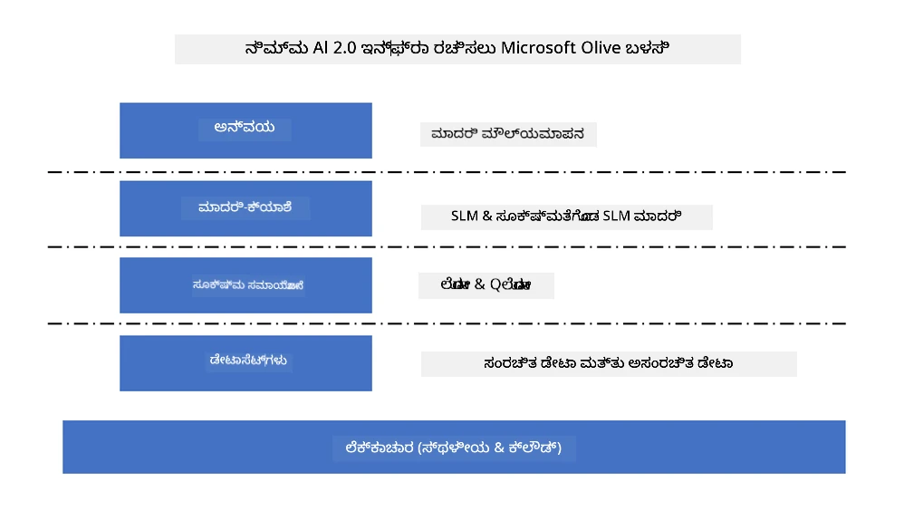
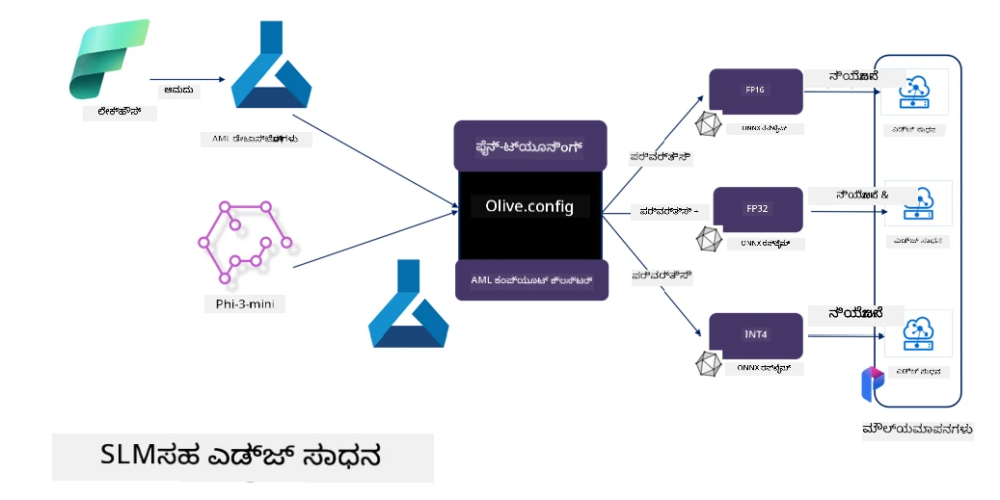

<!--
CO_OP_TRANSLATOR_METADATA:
{
  "original_hash": "5764be88ad2eb4f341e742eb8f14fab1",
  "translation_date": "2025-12-21T18:29:21+00:00",
  "source_file": "md/03.FineTuning/FineTuning_MicrosoftOlive.md",
  "language_code": "kn"
}
-->
# **Microsoft Olive ನೊಂದಿಗೆ Phi-3 ಫೈನ್-ಟ್ಯೂನಿಂಗ್**

[Olive](https://github.com/microsoft/OLive?WT.mc_id=aiml-138114-kinfeylo) ಒಂದು ಬಳಸಲು ಸುಲಭವಾದ ಹಾರ್ಡ್‌ವೇರ್-ಅ웨어 ಮಾದರಿ ಆಪ್ಟಿಮೈಜೆಶನ್ ಉಪಕರಣ, ಇದು ಮಾದರಿ ಸಂಕುಚಿತಕರಣ, ಆಪ್ಟಿಮೈಸೇಶನ್ ಮತ್ತು ಕಂಪೈಲೇಶನ್ ಸೇರಿದಂತೆ ಕೈಗಾರಿಕಾ-ಮುಖ್ಯ ತಂತ್ರಗಳನ್ನು ಒಟ್ಟುಗೂಡಿಸುತ್ತದೆ.

ಇದು ವಿಶೇಷ ಹಾರ್ಡ್‌ವೇರ್ ವಾಸ್ತುಶಿಲ್ಪಗಳಾದ ಮೇಲೆ ಮಾದರಿಗಳನ್ನು ಹೆಚ್ಚು ಕಾರ್ಯಕ್ಷಮವಾಗಿ ಬಳಸುವಂತೆ ಮಾಡಲು ಪ್ರಕ್ರಿಯೆಯನ್ನು ಸರಳಗೊಳಿಸಲು ವಿನ್ಯಾಸಗೊಳ್ಳಿದ್ದು, ಮಾದರಿಗಳನ್ನು ಆಪ್ಟಿಮೈಸ್ ಮಾಡುವುದು ಸುಗಮವಾಗುವಂತೆ ಮಾಡುತ್ತದೆ.

ನೀವು ಕ್ಲೌಡ್ ಆಧಾರಿತ ಅಪ್ಲಿಕೇಶನ್‌ಗಳ ಮೇಲೆ ಕೆಲಸ ಮಾಡುತ್ತಿರಲಿ ಅಥವಾ ಎಡ್ಜ್ ಸಾಧನಗಳ ಮೇಲೆ — Olive ನಿಮ್ಮ ಮಾದರಿಗಳನ್ನು ತಿಳಿವಳಿಕೆಗೊಂದ朗普ಡಿಸಿ ಪರಿಣಾಮಕಾರಿಯಾಗಿ ಆಪ್ಟಿಮೈಸ್ ಮಾಡಲು ಶಕ್ತಿಯನ್ನು ನೀಡುತ್ತದೆ.

## ಪ್ರಮುಖ ವೈಶಿಷ್ಟ್ಯಗಳು:
- Olive ಗುರಿ ಹಾರ್ಡ್‌ವೇರ್‌ಗಳಿಗೆ ಬೇಕಾದ ಆಪ್ಟಿಮೈಸೇಶನ್ ತಂತ್ರಗಳನ್ನು ಸಂಯೋಜಿಸಿ ಸ್ವಯಂಚಾಲಿತಗೊಳಿಸುತ್ತದೆ.
- ಏಕೈಕ ಆಪ್ಟಿಮೈಸೇಶನ್ ತಂತ್ರವು ಎಲ್ಲಾ ಪರિસ್ಥಿತಿಗಳಿಗೆ ಯುಕ್ತವಲ್ಲ, ಆದ್ದರಿಂದ Olive ಉದ್ಯಮ ತಜ್ಞರಿಗೆ ತಮ್ಮ ಆಪ್ಟಿಮೈಸೇಶನ್ ನವೀನತೆಯನ್ನು ಪ್ಲಗ್-ಇನ್ ಮಾಡುವ ಮೂಲಕ ವಿಸ್ತರಣೆ ಸಾಧ್ಯತೆಯನ್ನು ನೀಡುತ್ತದೆ.

## ಇಂಜಿನಿಯರಿಂಗ್ ಪ್ರಯತ್ನವನ್ನು ಕಡಿಮೆ ಮಾಡಿ:
- ಡೆವಲಪರ್‌ಗಳಿಗೆ ಸಾಮಾನ್ಯವಾಗಿ ತರಬೇತುಗೊಂಡ ಮಾದರಿಗಳನ್ನು ನಿಯೋಜಿಸಲು ಮತ್ತು ಆಪ್ಟಿಮೈಸ್ ಮಾಡಲು ಬಹು-хಾರ್ಡ್‌ವೇರ್ ವಿಕ್ರೇತೃ-ವಿಶೇಷ ಟೂಲ್ಚೈನ್‌ಗಳನ್ನು ಕಲಿಯಬೇಕು ಮತ್ತು ಬಳಸಬೇಕು.
- Olive ಈ ಅನುಭವವನ್ನು ಸರಳಗೊಳಿಸುತ್ತದೆ ಮತ್ತು ಗುರಿ ಹಾರ್ಡ್‌ವೇರ್‌ಗೆ ಬೇಕಾದ ಆಪ್ಟಿಮೈಸೇಶನ್ ತಂತ್ರಗಳನ್ನು ಸ್ವಯಂಚಾಲಿತಗೊಳಿಸುತ್ತದೆ.

## ಬಳಕೆಗಾಗಿ ಸಜ್ಜಿದ್ದ ಎಂಡ್-ಟು-ಎಂಡ್ ಆಪ್ಟಿಮೈಸೇಶನ್ ಪರಿಹಾರ:

ಸಂಯೋಜಿತ ತಂತ್ರಗಳನ್ನು ರಚಿಸಿ ಮತ್ತು ಟ್ಯೂನ್ ಮಾಡುವ ಮೂಲಕ, Olive ಎಂಡ್-ಟು-ಎಂಡ್ ಆಪ್ಟಿಮೈಸೇಶನ್‌ಗೆ ಏಕೀಕೃತ ಪರಿಹಾರವನ್ನು ನೀಡುತ್ತದೆ.
ಇದು accuracy ಮತ್ತು latency ಎಂಬ ನಿರ್ಬಂಧಗಳನ್ನು ಗಮನದಲ್ಲಿಟ್ಟುಕೊಂಡು ಮಾದರಿಗಳನ್ನು ಆಪ್ಟಿಮೈಸ್ ಮಾಡುತ್ತದೆ.

## Microsoft Olive ಬಳಸಿ ಫೈನ್-ಟ್ಯೂನಿಂಗ್

Microsoft Olive ಒಂದು ಬಳಸಲು ತುಂಬಾ ಸಿಂಪಲ್ open source ಮಾದರಿ ಆಪ್ಟಿಮೈಜೆಶನ್ ಉಪಕರಣವಾಗಿದ್ದು, ಜನರೇಟಿವ್ ಕೃತಕ ಬುದ್ಧಿಮತ್ತೆಯ ಕ್ಷೇತ್ರದಲ್ಲಿ ಫაინ್-ಟ್ಯೂನಿಂಗ್ ಮತ್ತು ರೆಫರೆನ್ಸ್ ಎರಡನ್ನೂ ಕವರ್ ಮಾಡಬಹುದು. ಇದು ಕೇವಲ ಸರಳ ಸಂರಚನೆಯನ್ನು ಅಗತ್ಯವಿರಿಸುತ್ತದೆ, open source ಸಣ್ಣ ಭಾಷಾ ಮಾದರಿಗಳು ಮತ್ತು ಸಂಬಂಧಿಸಿದ runtime ಪರಿಸರಗಳನ್ನು (AzureML / local GPU, CPU, DirectML) ಉಪಯೋಗಿಸಿ, ಸ್ವಯಂಚಾಲಿತ ಆಪ್ಟಿಮೈಸೇಶನ್ ಮೂಲಕ ಮಾದರಿಯ ಫೈನ್-ಟ್ಯೂನಿಂಗ್ ಅಥವಾ ರೆಫರೆನ್ಸ್ ಮುಗಿಸಬಹುದಾಗಿದೆ ಮತ್ತು ಕ್ಲೌಡ್ ಅಥವಾ ಎಡ್ಜ್ ಸಾಧನಗಳಿಗೆ ನಿಯೋಜಿಸಲು ಅತ್ಯುತ್ತಮ ಮಾದರಿಯನ್ನು ಕಂಡುಹಿಡಿಯಬಹುದು. ಇದು ಉದ್ಯಮಗಳಿಗೆ ಸ್ಥಳೀಯವಾಗಿಯೂ ಮತ್ತು ಕ್ಲೌಡ್‌ನಲ್ಲಿ ತಮ್ಮದೇ ಉದ್ಯಮ ವರ್ಟಿಕಲ್ ಮಾದರಿಗಳನ್ನು ನಿರ್ಮಿಸಲು ಅನುಮತಿಸುತ್ತದೆ.



## Phi-3 Microsoft Olive ನೊಂದಿಗೆ ಫೈನ್-ಟ್ಯೂನಿಂಗ್



## Phi-3 Olive ಉದಾಹರಣೆ ಕೋಡ್ ಮತ್ತು ಉದಾಹರಣೆ
ಈ ಉದಾಹರಣೆಯಲ್ಲಿ ನೀವು Olive ಅನ್ನು ಬಳಸುವಿರಿ:

- LoRA ಅಡಾಪ್ಟರ್ ಅನ್ನು ಫೈನ್-ಟ್ಯೂನ್ ಮಾಡಿ ವಾಕ್ಯಗಳನ್ನು ದುಃಖ, ಸಂತೋಷ, ಭಯ, ಆಶ್ಚರ್ಯ ಎಂದು ವರ್ಗೀಕರಿಸಲು.
- ಅಡಾಪ್ಟರ್ ತೂಕಗಳನ್ನು ಮೂಲ ಮಾದರಿಯಲ್ಲಿ ಒಂದಾಗಿ ಸೇರಿಸಿ.
- ಮಾದರಿಯನ್ನು ಆప్టಿಮೈಸ್ ಮಾಡಿ ಮತ್ತು int4 ಗೆ ಕ್ವಾಂಟೈಜ್ ಮಾಡಿ.

[ಉದಾಹರಣೆ ಕೋಡ್](../../code/03.Finetuning/olive-ort-example/README.md)

### Microsoft Olive ಅನ್ನು ಸ್ಥಾಪಿಸುವುದು

Microsoft Olive ಸ್ಥಾಪನೆ ಬಹಳ ಸರಳವಾಗಿದೆ, ಮತ್ತು CPU, GPU, DirectML, ಮತ್ತು Azure ML ಗಾಗಿ ಸ್ಥಾಪಿಸಬಹುದು

```bash
pip install olive-ai
```

If you wish to run an ONNX model with a CPU, you can use

```bash
pip install olive-ai[cpu]
```

If you want to run an ONNX model with a GPU, you can use

```python
pip install olive-ai[gpu]
```

If you want to use Azure ML, use

```python
pip install git+https://github.com/microsoft/Olive#ಅಂಡೆ=ಓಲಿವ್-ಎಐ[ಅಜ್ಯೂರ್‌ಎಂಎಲ್]
```

**ಗಮನಿಸಿ**
ಒಎಸ್ ಅಗತ್ಯ : Ubuntu 20.04 / 22.04 

### **Microsoft Olive ನ Config.json**

ಸ್ಥಾಪನೆಯ ನಂತರ, ನೀವು Config ಫೈಲ್ ಮೂಲಕ ವಿಭಿನ್ನ ಮಾದರಿ-ನಿರ್ದಿಷ್ಟ ಸೆಟ್ಟಿಂಗ್‌ಗಳನ್ನು ಸಂರಚಿಸಬಹುದು, ಇದರಲ್ಲಿ ಡೇಟಾ, ಗಣನೆ, ತರಬೇತಿ, ನಿಯೋಜನೆ ಮತ್ತು ಮಾದರಿ ಜನರೇಶನ್ ಸೇರಿವೆ.

**1. ಡೇಟಾ**

Microsoft Olive ನಲ್ಲಿ ಸ್ಥಳೀಯ ಡೇಟಾ ಮತ್ತು ಕ್ಲೌಡ್ ಡೇಟಾದಲ್ಲಿ ತರಬೇತಿ ಬೆಂಬಲಿಸಲಾಗುತ್ತದೆ, ಮತ್ತು ಸೆಟ್ಟಿಂಗ್‌ಗಳಲ್ಲಿ ಕಾನ್ಫಿಗರ್ ಮಾಡಬಹುದು.

*ಸ್ಥಳೀಯ ಡೇಟಾ ಸೆಟ್ಟಿಂಗ್ಗಳು*

ನೀವು ಫೈನ್-ಟ್ಯೂನಿಂಗ್‌ಗಾಗಿ ತರಬೇತಿಗೊಳ್ಳಬೇಕಾದ ಡೇಟಾ ಸೆಟ್ ಅನ್ನು ಸರಳವಾಗಿ ಸೆಟ್ ಅಪ್ ಮಾಡಬಹುದು, ಸಾಮಾನ್ಯವಾಗಿ json ಫಾರ್ಮ್ಯಾಟ್‌ನಲ್ಲಿ, ಮತ್ತು ಅದನ್ನು ಡೇಟಾ ಟೆಂಪ್ಲೇಟ್ಗೆ ಹೊಂದಿಸಲು ಅಡಾಪ್ಟ್ ಮಾಡಬಹುದು. ಇದನ್ನು ಮಾದರಿಯ ಅವಶ್ಯಕತೆಗಳ ಆಧಾರದ ಮೇಲೆ ಹೊಂದಿಸಬೇಕಾಗುತ್ತದೆ (ಉದಾಹರಣೆಗೆ, Microsoft Phi-3-mini ಅಗತ್ಯವಿರುವ ಫಾರ್ಮ್ಯಾಟ್‌ಗೆ ಹೊಂದಿಸಿರಿ. ನೀವು ಇನ್ನೂ ಬೇರೆ ಮಾದರಿಗಳನ್ನು ಹೊಂದಿದ್ದರೆ, ದಯವಿಟ್ಟು ಇತರ ಮಾದರಿಗಳ ಅಗತ್ಯವಿರುವ ಫೈನ್-ಟ್ಯೂನಿಂಗ್ ಫಾರ್ಮ್ಯಾಟ್‌ಗಳನ್ನೂ ಉಲ್ಲೇಖಿಸಿ ಪ್ರಕ್ರಿಯೆಗೊಳಿಸಿ)

```json

    "data_configs": [
        {
            "name": "dataset_default_train",
            "type": "HuggingfaceContainer",
            "load_dataset_config": {
                "params": {
                    "data_name": "json", 
                    "data_files":"dataset/dataset-classification.json",
                    "split": "train"
                }
            },
            "pre_process_data_config": {
                "params": {
                    "dataset_type": "corpus",
                    "text_cols": [
                            "phrase",
                            "tone"
                    ],
                    "text_template": "### Text: {phrase}\n### The tone is:\n{tone}",
                    "corpus_strategy": "join",
                    "source_max_len": 2048,
                    "pad_to_max_len": false,
                    "use_attention_mask": false
                }
            }
        }
    ],
```

**ಕ್ಲೌಡ್ ಡೇಟಾ ಮೂಲ ಸೆಟ್ಟಿಂಗ್ಗಳು**

Azure AI Studio/Azure Machine Learning Service ನ ಡೇಟಾಸ್ಟೋರ್ ಅನ್ನು ಲಿಂಕ್ ಮಾಡುವ ಮೂಲಕ ಕ್ಲೌಡ್‌ನಲ್ಲಿರುವ ಡೇಟಾವನ್ನು ಸಂಪರ್ಕ ಮಾಡುವ ಮೂಲಕ, ನೀವು Microsoft Fabric ಮತ್ತು Azure Data ಮೂಲಕ ವಿಭಿನ್ನ ಡೇಟಾ ಮೂಲಗಳನ್ನು Azure AI Studio/Azure Machine Learning Service ಗೆ ಪರಿಚಯಿಸಿ ಫೈನ್-ಟ್ಯೂನಿಂಗ್‌ಗೆ ಆಧಾರವನ್ನು ನೀಡಬಹುದು.

```json

    "data_configs": [
        {
            "name": "dataset_default_train",
            "type": "HuggingfaceContainer",
            "load_dataset_config": {
                "params": {
                    "data_name": "json", 
                    "data_files": {
                        "type": "azureml_datastore",
                        "config": {
                            "azureml_client": {
                                "subscription_id": "Your Azure Subscrition ID",
                                "resource_group": "Your Azure Resource Group",
                                "workspace_name": "Your Azure ML Workspaces name"
                            },
                            "datastore_name": "workspaceblobstore",
                            "relative_path": "Your train_data.json Azure ML Location"
                        }
                    },
                    "split": "train"
                }
            },
            "pre_process_data_config": {
                "params": {
                    "dataset_type": "corpus",
                    "text_cols": [
                            "Question",
                            "Best Answer"
                    ],
                    "text_template": "<|user|>\n{Question}<|end|>\n<|assistant|>\n{Best Answer}\n<|end|>",
                    "corpus_strategy": "join",
                    "source_max_len": 2048,
                    "pad_to_max_len": false,
                    "use_attention_mask": false
                }
            }
        }
    ],
    
```

**2. ಗಣನೆ ಸಂರಚನೆ**

ನೀವು ಸ್ಥಳೀಯವಾಗಿರಬೇಕಾದರೆ, ನೇರವಾಗಿ ಸ್ಥಳೀಯ ಡೇಟಾ ಸಂಪನ್ಮೂಲಗಳನ್ನು ಬಳಸಬಹುದು. ನೀವು Azure AI Studio / Azure Machine Learning Service ಸಂಪನ್ಮೂಲಗಳನ್ನು ಬಳಸಬೇಕಾದರೆ, ಸಂಬಂಧಿತ Azure ಪ್ಯಾರಾಮಿಟರ್‌ಗಳು, ಗಣನೆ ಸಮೀಕ್ಷೆ ಹೆಸರು ಇತ್ಯಾದಿಗಳನ್ನು ಕಾನ್ಫಿಗರ್ ಮಾಡಬೇಕಾಗುತ್ತದೆ.

```json

    "systems": {
        "aml": {
            "type": "AzureML",
            "config": {
                "accelerators": ["gpu"],
                "hf_token": true,
                "aml_compute": "Your Azure AI Studio / Azure Machine Learning Service Compute Name",
                "aml_docker_config": {
                    "base_image": "Your Azure AI Studio / Azure Machine Learning Service docker",
                    "conda_file_path": "conda.yaml"
                }
            }
        },
        "azure_arc": {
            "type": "AzureML",
            "config": {
                "accelerators": ["gpu"],
                "aml_compute": "Your Azure AI Studio / Azure Machine Learning Service Compute Name",
                "aml_docker_config": {
                    "base_image": "Your Azure AI Studio / Azure Machine Learning Service docker",
                    "conda_file_path": "conda.yaml"
                }
            }
        }
    },
```

***ಗಮನಿಸಿ***

Azure AI Studio/Azure Machine Learning Service ನಲ್ಲಿ ಕಂಟೇನರ್ ಮೂಲಕ ಓಡಿಸುವುದರಿಂದ, ಅಗತ್ಯವಿರುವ ಪರಿಸರವನ್ನು ಕಾನ್ಫಿಗರ್ ಮಾಡಬೇಕಾಗುತ್ತದೆ. ಇದನ್ನು conda.yaml ಪರಿಸರದಲ್ಲಿ ಕಾನ್ಫಿಗರ್ ಮಾಡಲಾಗುತ್ತದೆ.

```yaml

name: project_environment
channels:
  - defaults
dependencies:
  - python=3.8.13
  - pip=22.3.1
  - pip:
      - einops
      - accelerate
      - azure-keyvault-secrets
      - azure-identity
      - bitsandbytes
      - datasets
      - huggingface_hub
      - peft
      - scipy
      - sentencepiece
      - torch>=2.2.0
      - transformers
      - git+https://github.com/microsoft/Olive@jiapli/mlflow_loading_fix#egg=olive-ai[gpu]
      - --extra-index-url https://aiinfra.pkgs.visualstudio.com/PublicPackages/_packaging/ORT-Nightly/pypi/simple/ 
      - ort-nightly-gpu==1.18.0.dev20240307004
      - --extra-index-url https://aiinfra.pkgs.visualstudio.com/PublicPackages/_packaging/onnxruntime-genai/pypi/simple/
      - onnxruntime-genai-cuda

    

```

**3. ನಿಮ್ಮ SLM ಅನ್ನು ಆಯ್ಕೆಮಾಡಿ**

ನೀವು ಮಾದರಿಯನ್ನು ನೇರವಾಗಿ Hugging face ನಿಂದ ಬಳಸಬಹುದಾಗಿದೆ, ಅಥವಾ ನೀವು ಇದನ್ನು Azure AI Studio / Azure Machine Learning ನ Model Catalog ಜೊತೆಗೆ ನೇರವಾಗಿ ಸಂಯೋಜಿಸಿ ಬಳಸಲು ಬೇಕಾದ ಮಾದರಿಯನ್ನು ಆಯ್ಕೆಮಾಡಬಹುದು. ಕೆಳಗಿನ ಕೋಡ್ ಉದಾಹರಣೆಯಲ್ಲಿ ನಾವು Microsoft Phi-3-mini ಅನ್ನು ಉದಾಹರಣೆಯಾಗಿ ಬಳಸುತ್ತೇವೆ.

ನೀವು ಮಾದರಿಯನ್ನು ಸ್ಥಳೀಯವಾಗಿ ಹೊಂದಿದ್ದರೆ, ಈ ವಿಧಾನವನ್ನು ಬಳಸಬಹುದು

```json

    "input_model":{
        "type": "PyTorchModel",
        "config": {
            "hf_config": {
                "model_name": "model-cache/microsoft/phi-3-mini",
                "task": "text-generation",
                "model_loading_args": {
                    "trust_remote_code": true
                }
            }
        }
    },
```

If you want to use a model from Azure AI Studio / Azure Machine Learning Service, you can use this method


```json

    "input_model":{
        "type": "PyTorchModel",
        "config": {
            "model_path": {
                "type": "azureml_registry_model",
                "config": {
                    "name": "microsoft/Phi-3-mini-4k-instruct",
                    "registry_name": "azureml-msr",
                    "version": "11"
                }
            },
             "model_file_format": "PyTorch.MLflow",
             "hf_config": {
                "model_name": "microsoft/Phi-3-mini-4k-instruct",
                "task": "text-generation",
                "from_pretrained_args": {
                    "trust_remote_code": true
                }
            }
        }
    },
```

**ಗಮನಿಸಿ:**
ನಾವು Azure AI Studio / Azure Machine Learning Service ಜೊತೆ ಏಕೀಕರಣ ಮಾಡುವ ಅಗತ್ಯವಿದೆ, ಆದ್ದರಿಂದ ಮಾದರಿಯನ್ನು ಸೆಟ್ ಅಪ್ ಮಾಡುವಾಗ ದಯವಿಟ್ಟು ವೆರ್ಸನ್ ಸಂಖ್ಯೆ ಮತ್ತು ಸಂಬಂಧಿತ ಹೆಸರನ್ನು ಉಲ್ಲೇಖಿಸಿ.

Azure上的 ಎಲ್ಲ ಮಾದರಿಗಳನ್ನು PyTorch.MLflow ಗೆ ಸೆಟ್ ಮಾಡಬೇಕು

ನಿಮ್ಮ ಬಳಿ Hugging face ಖಾತೆ ಮತ್ತು Azure AI Studio / Azure Machine Learning ನ Key value ಗೆ ಕೀ ಅನ್ನು ಬಾಂಧಿಸಿಕೊಳ್ಳಬೇಕು

**4. ಆಲ್ಗಾರಿಥಮ್**

Microsoft Olive Lora ಮತ್ತು QLora ಫೈನ್-ಟ್ಯೂನಿಂಗ್ ಆಲ್ಗಾರಿಥಮ್‌ಗಳನ್ನು ಅತ್ಯುತ್ತಮವಾಗಿ ಎನಕ್ಯಾಪ್ಸುಲೇಟ್ ಮಾಡುತ್ತದೆ. ನೀವು ಕಾನ್ಫಿಗರ್ ಮಾಡಬೇಕಾದವು ಕೆಲವು ಸಂಬಂಧಿತ ಪ್ಯಾರಾಮೀಟರ್‌ಗಳು ಮಾತ್ರ. ಇಲ್ಲಿ ನಾನು ಉದಾಹರಣೆಗಾಗಿ QLora ಅನ್ನು ತೆಗೆದುಕೊಂಡಿದ್ದೇನೆ.

```json
        "lora": {
            "type": "LoRA",
            "config": {
                "target_modules": [
                    "o_proj",
                    "qkv_proj"
                ],
                "double_quant": true,
                "lora_r": 64,
                "lora_alpha": 64,
                "lora_dropout": 0.1,
                "train_data_config": "dataset_default_train",
                "eval_dataset_size": 0.3,
                "training_args": {
                    "seed": 0,
                    "data_seed": 42,
                    "per_device_train_batch_size": 1,
                    "per_device_eval_batch_size": 1,
                    "gradient_accumulation_steps": 4,
                    "gradient_checkpointing": false,
                    "learning_rate": 0.0001,
                    "num_train_epochs": 3,
                    "max_steps": 10,
                    "logging_steps": 10,
                    "evaluation_strategy": "steps",
                    "eval_steps": 187,
                    "group_by_length": true,
                    "adam_beta2": 0.999,
                    "max_grad_norm": 0.3
                }
            }
        },
```

If you want quantization conversion, Microsoft Olive main branch already supports the onnxruntime-genai method. You can set it according to your needs：

1. ಅಡಾಪ್ಟರ್ ತೂಕಗಳನ್ನು ಮೂಲ ಮಾದರಿಯಲ್ಲಿ ಒಂದಾಗಿ ಸೇರಿಸಿ
2. ModelBuilder ಮೂಲಕ ಅಗತ್ಯ ಪ್ರೆಸಿಷನ್‌ನೊಂದಿಗೆ ಮಾದರಿಯನ್ನು onnx ಮಾದರಿಯಾಗಿರಿಸಲು ಪರಿವರ್ತನೆ ಮಾಡಿ

ಉದಾಹರಣೆಗೆ, quantized INT4 ಗೆ ಪರಿವರ್ತಿಸುವಂತಹುದು


```json

        "merge_adapter_weights": {
            "type": "MergeAdapterWeights"
        },
        "builder": {
            "type": "ModelBuilder",
            "config": {
                "precision": "int4"
            }
        }
```

**ಗಮನಿಸಿ** 
- ನೀವು QLoRA ಅನ್ನು ಬಳಸಿದರೆ, ONNXRuntime-genai ನ ಕ್ವಾಂಟೈಜೇಶನ್ ಪರಿವರ್ತನೆ ಪ್ರಸ್ತುತ ಬೆಂಬಲಿತವಲ್ಲ.

- ಇಲ್ಲಿ ಒತ್ತಿ ಹೇಳಬೇಕಾದರೆ, ನೀವು ಮೇಲ್ಬರೆದ ಹಂತಗಳನ್ನು ನಿಮ್ಮ ಅಗತ್ಯಗಳನುಸಾರ ಸೆಟ್ ಮಾಡಬಹುದು. ಮೇಲ್ಕಾಣಿಸಿದ ಎಲ್ಲ ಹಂತಗಳನ್ನು ಸಂಪೂರ್ಣವಾಗಿ ಕಾನ್ಫಿಗರ್ ಮಾಡುವುದು ಅವಶ್ಯಕವಿಲ್ಲ. ನಿಮ್ಮ ಅಗತ್ಯದಂತೆ ನೀವು ನೇರವಾಗಿ ಆಲ್ಗಾರಿಥಮ್ ಹಂತಗಳನ್ನು ಬಳಸಿ ಫೈನ್-ಟ್ಯೂನಿಂಗ್ ಮೀರಿಸದೆ ಕೂಡ ಬಳಸಬಹುದು. ಕೊನೆಯಲ್ಲಿ ಸಂಬಂಧಿತ ಎಂಜಿನ್‌ಗಳನ್ನು ಕಾನ್ಫಿಗರ್ ಮಾಡಬೇಕಾಗುತ್ತದೆ

```json

    "engine": {
        "log_severity_level": 0,
        "host": "aml",
        "target": "aml",
        "search_strategy": false,
        "execution_providers": ["CUDAExecutionProvider"],
        "cache_dir": "../model-cache/models/phi3-finetuned/cache",
        "output_dir" : "../model-cache/models/phi3-finetuned"
    }
```

**5. ಫೈನ್-ಟ್ಯೂನಿಂಗ್ ಪೂರ್ಣ**

ಕಮಾಂಡ್ ಲೈನ್‌ನಲ್ಲಿ, olive-config.json ಡೈರೆಕ್ಟರಿಯಲ್ಲಿ ಕೆಳಗಿನನ್ನು ಕಾರ್ಯಗತಗೊಳಿಸಿ

```bash
olive run --config olive-config.json  
```

---

<!-- CO-OP TRANSLATOR DISCLAIMER START -->
ವಜಾ ಘೋಷಣೆ:
ಈ ದಾಖಲೆಯನ್ನು AI ಅನುವಾದ ಸೇವೆ [Co-op Translator](https://github.com/Azure/co-op-translator) ಬಳಸಿ ಅನುವಾದಿಸಲಾಗಿದೆ. ನಾವು ನಿಖರತೆಯನ್ನು ಕಾಯ್ದುಕೊಳ್ಳಲು ಪ್ರಯತ್ನಿಸಿದರೂ, ಸ್ವಯಂಚಾಲಿತ ಅನುವಾದಗಳಲ್ಲಿ ದೋಷಗಳು ಅಥವಾ ಅನಿಖರತೆಗಳಿರಬಹುದು ಎಂಬುದನ್ನು ದಯವಿಟ್ಟು ಗಮನದಲ್ಲಿರಿಸಿಕೊಳ್ಳಿ. ಮೂಲ ದಾಖಲೆ ಅದರ ಮೂಲ ಭಾಷೆಯಲ್ಲಿ ಅಧಿಕೃತ ಮೂಲವೆಂದು ಪರಿಗಣಿಸಬೇಕು. ಗಂಭೀರ ಮಾಹಿತಿಗಾಗಿ ವೃತ್ತಿಪರ ಮಾನವ ಅನುವಾದವನ್ನು ಶಿಫಾರಸುಿಸಲಾಗುತ್ತದೆ. ಈ ಅನುವಾದವನ್ನು ಬಳಸುವುದರಿಂದ ಉಂಟಾಗುವ ಯಾವುದೇ ತಪ್ಪುಅರ್ಥಗೊಳ್ಳುವಿಕೆಗಳು ಅಥವಾ தவறಾದ ವಿವರಣೆಗಳಿಗಾಗಿ ನಾವು ಹೊಣೆಗಾರರಲ್ಲ.
<!-- CO-OP TRANSLATOR DISCLAIMER END -->