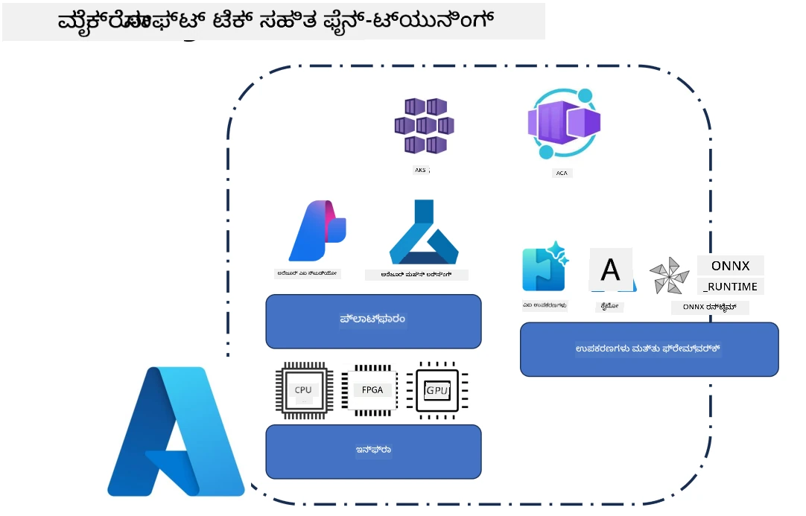
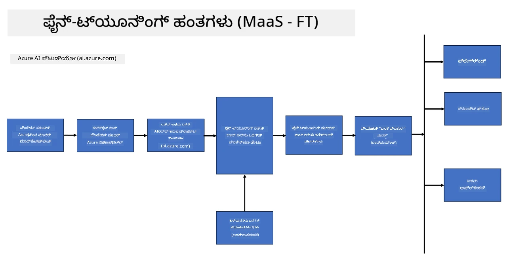
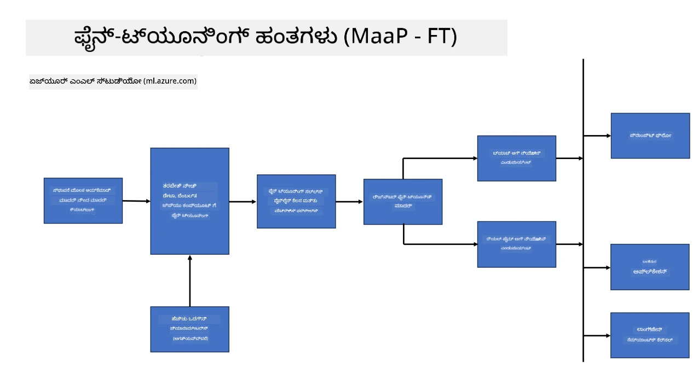
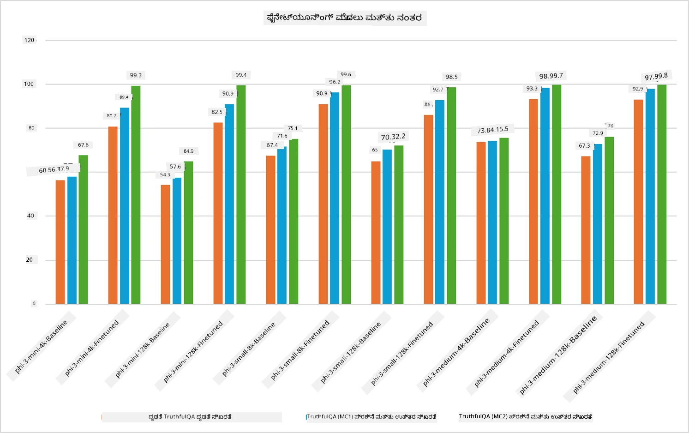

<!--
CO_OP_TRANSLATOR_METADATA:
{
  "original_hash": "cb5648935f63edc17e95ce38f23adc32",
  "translation_date": "2025-12-21T19:00:05+00:00",
  "source_file": "md/03.FineTuning/FineTuning_Scenarios.md",
  "language_code": "kn"
}
-->
## ಫೈನ್ ಟ್ಯೂನಿಂಗ್ ದೃಶ್ಯಗಳು

**ಪ್ಲ್ಯಾಟ್‌ಫಾರ್ಮ್** ಇದರಲ್ಲಿ Azure AI Foundry, Azure Machine Learning, AI Tools, Kaito, ಮತ್ತು ONNX Runtime ಮುಂತಾದ ವಿವಿಧ ತಂತ್ರಜ್ಞಾನಗಳು ಸೇರಿವೆ. 

**ಇನ್ಫ್ರಾಸ್ಟ್ರಕ್ಚರ್** ಇದರಲ್ಲಿ CPU ಮತ್ತು FPGA ಸೇರಿವೆ, ಇವು ಫೈನ್‑ಟ್ಯೂನಿಂಗ್ ಪ್ರಕ್ರಿಯೆಗೆ ಅತ್ಯಾವಶ್ಯಕವಾಗಿವೆ. ಈ ತಂತ್ರಜ್ಞಾನಗಳ ಪ್ರತಿಯೊಂದರ ಐಕಾನ್‌ಗಳನ್ನು ನಾನು ತೋರಿಸುತ್ತೇನೆ.

**ಉಪಕರಣಗಳು ಮತ್ತು ಫ್ರೇಮ್ವರ್ಕ್** ಇದರಲ್ಲಿ ONNX Runtime ಮತ್ತು ONNX Runtime ಸೇರಿವೆ. ಈ ತಂತ್ರಜ್ಞಾನಗಳ ಪ್ರತಿಯೊಂದರ ಐಕಾನ್‌ಗಳನ್ನು ನಾನು ತೋರಿಸುತ್ತೇನೆ.
[ONNX Runtime ಮತ್ತು ONNX Runtime සඳහා ಐಕಾನ್‌ಗಳನ್ನು ಸೇರಿಸಿ]

Microsoft ತಂತ್ರಜ್ಞಾನಗಳೊಂದಿಗೆ ಫೈನ್‑ಟ್ಯೂನಿಂಗ್ ಪ್ರಕ್ರಿಯೆಯು ವಿವಿಧ ಘಟಕಗಳು ಮತ್ತು ಟೂಲ್ಗಳನ್ನು ಒಳಗೊಂಡಿರುತ್ತದೆ. ಈ ತಂತ್ರಜ್ಞಾನಗಳನ್ನು ಅರ್ಥಮಾಡಿಕೊಳ್ಳಿ ಮತ್ತು ಉಪಯೋಗಿಸಿದರೆ, ನಾವು ನಮ್ಮ ಅಪ್ಲಿಕೇಶನ್‌ಗಳನ್ನು ಪರಿಣಾಮಕಾರಿಯಾಗಿ ಫೈನ್‑ಟ್ಯೂನ್ ಮಾಡಿ ಉತ್ತಮ ಪರಿಹಾರಗಳನ್ನು ರಚಿಸಬಹುದು. 

## ಮಾದರಿ ಸೇವೆ

ಹೋಸ್ಟ್ ಮಾಡಲಾದ ಫೈನ್‑ಟ್ಯೂನಿಂಗ್ ಬಳಸಿ ಮಾದರಿಯನ್ನು ಫೈನ್‑ಟ್ಯೂನ್ ಮಾಡಿ, ಗಣನೆ (compute) ಸೃಷ್ಟಿಸಲು ಮತ್ತು ನಿರ್ವಹಿಸಲು ಅಗತ್ಯವಿಲ್ಲದೆ.

Serverless ಫೈನ್‑ಟ್ಯೂನಿಂಗ್ Phi-3-mini ಮತ್ತು Phi-3-medium ಮಾದರಿಗಳಿಗಾಗಿ ಲಭ್ಯವಿದೆ, ಇದರಿಂದ ಡೆವಲಪರ್‌ಗಳು ಗಣನೆ ವ್ಯವಸ್ಥೆಗಳನ್ನು ವ್ಯವಸ್ಥೆ ಮಾಡಬೇಕಾಗದೆ ಕ್ಲೌಡ್ ಮತ್ತು ಎಡ್ಜ್ ಸನ್ನಿವೇಶಗಳಿಗೆ ಮಾದರಿಗಳನ್ನು ಬೇಗ ಮತ್ತು ಸುಲಭವಾಗಿ ಕಸ್ಟಮೈಸ್ ಮಾಡಿಕೊಳ್ಳಬಹುದು. ನಾವು Phi-3-small ಅನ್ನು Models-as-a-Service ಮೂಲಕ ಈಗ ಲಭ್ಯವಿದೆ ಎಂದು ಕೂಡ ಪ್ರಕಟಿಸಿದ್ದೇವೆ, ಆದ್ದರಿಂದ ಡೆವಲಪರ್‌ಗಳು ಆಧಾರದ ರಚನೆಯಿಲ್ಲದೆ ಬೇಗ ಮತ್ತು ಸುಲಭವಾಗಿ AI ಅಭಿವೃದ್ಧಿಯನ್ನು ಪ್ರಾರಂಭಿಸಬಹುದು.

## ಮಾದರಿ ಪ್ಲ್ಯಾಟ್‌ಫಾರ್ಮ್

ಬಳಕೆದಾರರು ಫೈನ್‑ಟ್ಯೂನ್ ಮಾಡಲು ತಮ್ಮದೇ ಗಣನಾ ಸಾಧನಗಳನ್ನು ನಿರ್ವಹಿಸುತ್ತಾರೆ.

[ಫೈನ್‑ಟ್ಯೂನಿಂಗ್ ಉದಾಹರಣೆ](https://github.com/Azure/azureml-examples/blob/main/sdk/python/foundation-models/system/finetune/chat-completion/chat-completion.ipynb)

## ಫೈನ್ ಟ್ಯೂನಿಂಗ್ ದೃಶ್ಯಗಳು 

| | | | | | | |
|-|-|-|-|-|-|-|
|ಸನ್ನಿವೇಶ|LoRA|QLoRA|PEFT|DeepSpeed|ZeRO|DORA|
|ಪ್ರಿ‑ಟ್ರೇನ್ಡ್ LLMಗಳನ್ನು ನಿರ್ದಿಷ್ಟ ಕಾರ್ಯಗಳು ಅಥವಾ ಡೋಮೈನ್ಗಳಿಗೆ ಹೊಂದಿಸುವುದು|ಹೌದು|ಹೌದು|ಹೌದು|ಹೌದು|ಹೌದು|ಹೌದು|
|ಟೆಕ್ಸ್ಟ್ ವರ್ಗೀಕರಣ, ನಾಮಿತ ಘಟಕ ಗುರುತಿಸುವಿಕೆ (named entity recognition), ಮತ್ತು ಯಂತ್ರ ಅನುವಾದದಂತಹ NLP ಕಾರ್ಯಗಳಿಗಾಗಿ ಫೈನ್‑ಟ್ಯೂನಿಂಗ್|ಹೌದು|ಹೌದು|ಹೌದು|ಹೌದು|ಹೌದು|ಹೌದು|
|ಪ್ರಶ್ನೋತ್ತರ (QA) ಕಾರ್ಯಗಳಿಗಾಗಿ ಫೈನ್‑ಟ್ಯೂನಿಂಗ್|ಹೌದು|ಹೌದು|ಹೌದು|ಹೌದು|ಹೌದು|ಹೌದು|
|ಚಾಟ್‌ಬಾಟ್ಗಳಲ್ಲಿ ಮಾನವಸಮಾನ ಪ್ರತಿಕ್ರಿಯೆಗಳನ್ನು ರಚಿಸಲು ಫೈನ್‑ಟ್ಯೂನಿಂಗ್|ಹೌದು|ಹೌದು|ಹೌದು|ಹೌದು|ಹೌದು|ಹೌದು|
|ಸಂಗೀತ, ಕಲಾ ಅಥವಾ ಇತರ ಸೃಜನಾತ್ಮಕ ರೂಪಗಳನ್ನು ರಚಿಸಲು ಫೈನ್‑ಟ್ಯೂನಿಂಗ್|ಹೌದು|ಹೌದು|ಹೌದು|ಹೌದು|ಹೌದು|ಹೌದು|
|ಗಣನೆ ಮತ್ತು ಆರ್ಥಿಕ ವೆಚ್ಚಗಳನ್ನು ಕಡಿಮೆ ಮಾಡುವುದು|ಹೌದು|ಹೌದು|ಇಲ್ಲ|ಹೌದು|ಹೌದು|ಇಲ್ಲ|
|ಸ್ಮೃತಿ ಬಳಕೆಯನ್ನು ಕಡಿಮೆ ಮಾಡುವುದು|ಇಲ್ಲ|ಹೌದು|ಇಲ್ಲ|ಹೌದು|ಹೌದು|ಹೌದು|
|ಕಾರ್ಯಕ್ಷಮ ಫೈನ್‑ಟ್ಯೂನಿಂಗ್‌ಗೆ ಕಡಿಮೆ ಪ್ಯಾರಾಮೀಟರ್‌ಗಳನ್ನು ಬಳಸುವುದು|ಇಲ್ಲ|ಹೌದು|ಹೌದು|ಇಲ್ಲ|ಇಲ್ಲ|ಹೌದು|
|ಉಪಲಭ್ಯವಾದ ಎಲ್ಲಾ GPU ಸಾಧನಗಳ ಒಟ್ಟು GPU ಸ್ಮೃತಿಗೆ ಪ್ರವೇಶ ನೀಡುವ, ಸ್ಮೃತಿ‑ದಕ್ಷ ದತ್ತಾ ಸಮಾಂತರಿಕರಣ (data parallelism) ರೂಪ|ಇಲ್ಲ|ಇಲ್ಲ|ಇಲ್ಲ|ಹೌದು|ಹೌದು|ಹೌದು|

## ಫೈನ್‑ಟ್ಯೂನಿಂಗ್ ಕಾರ್ಯಕ್ಷಮತೆ ಉದಾಹರಣೆಗಳು

---

<!-- CO-OP TRANSLATOR DISCLAIMER START -->
ಅಸ್ವೀಕಾರ:
ಈ ದಾಖಲೆ AI ಅನುವಾದ ಸೇವೆ [Co-op Translator](https://github.com/Azure/co-op-translator) ಬಳಸಿ ಅನುವಾದಿಸಲಾಗಿದೆ. ನಾವು ನಿಖರತೆಗೆ ಪ್ರಯತ್ನಿಸಿದರೂ, ಸ್ವಯಂಚಾಲಿತ ಅನುವಾದಗಳಲ್ಲಿ ದೋಷಗಳು ಅಥವಾ ಅಶುದ್ಧಿಗಳು ಇರಬಹುದೆಂದು ದಯವಿಟ್ಟು ಗಮನಿಸಿ. ಮೂಲ ಭಾಷೆಯಲ್ಲಿರುವ ಮೂಲ ದಾಖಲೆ ಅನ್ನು ಅಧಿಕೃತ ಮೂಲವೆಂದು ಪರಿಗಣಿಸಬೇಕು. ಗಂಭೀರ ಮಾಹಿತಿಗಾಗಿ ವೃತ್ತಿಪರ ಮಾನವ ಅನುವಾದವನ್ನು ಶಿಫಾರಸು ಮಾಡಲಾಗುತ್ತದೆ. ಈ ಅನುವಾದದ ಬಳಕೆಯಿಂದ ಉಂಟಾಗುವ ಯಾವುದೇ ತಪ್ಪಾಗಿ ಅರ್ಥಮಾಡಿಕೊಳ್ಳುವಿಕೆಗಳು ಅಥವಾ ತಪ್ಪಾದ ವಿವರಣೆಗಳಿಗಾಗಿ ನಾವು ಜವಾಬ್ದಾರಿಯಲ್ಲ.
<!-- CO-OP TRANSLATOR DISCLAIMER END -->