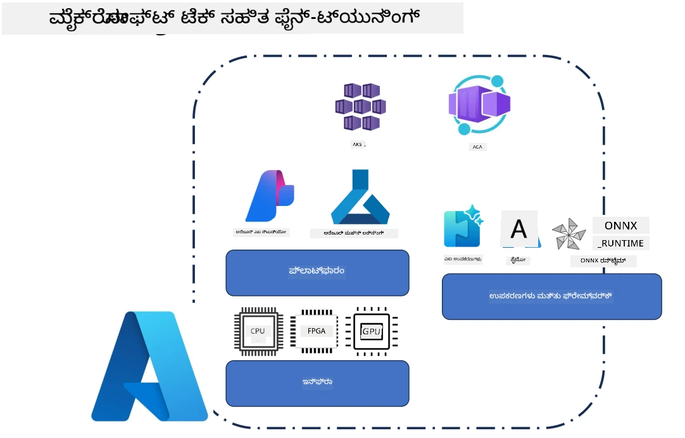
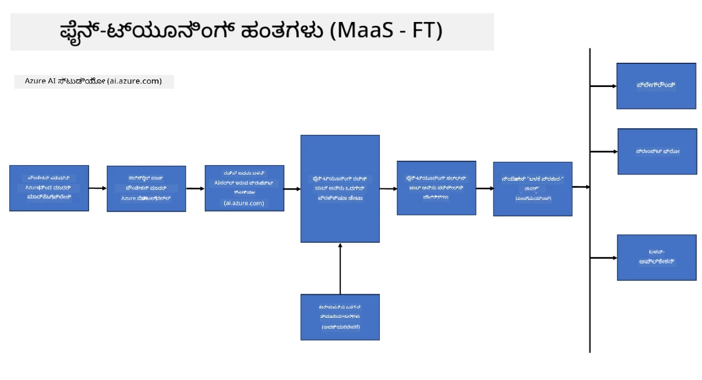
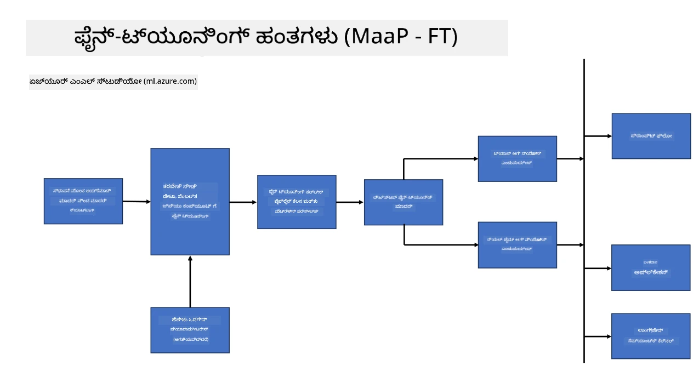
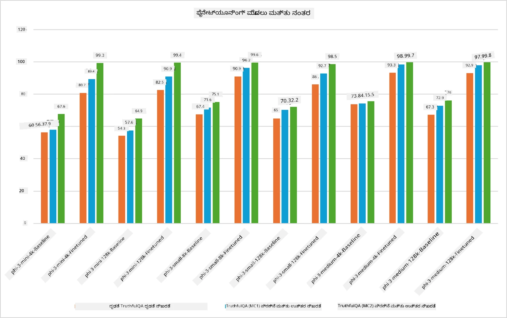

## ಫೈನ್ ಟ್ಯೂನಿಂಗ್ ದೃಶ್ಯಗಳು

ಈ ವಿಭಾಗವು ಮೈಕ್ರೋಸಾಫ್ಟ್ ಫೌಂಡ್ರೀ ಮತ್ತು ಅಜೂರ್ ಪರಿಸರಗಳಲ್ಲಿ ಫೈನ್-ಟ್ಯೂನಿಂಗ್ ದೃಶ್ಯಗಳ ಸಮಗ್ರ ಅವಲೋಕನವನ್ನು ಒದಗಿಸುತ್ತದೆ, ಇದರಲ್ಲಿ ಡಿಪ್ಲಾಯ್‌ಮೆಂಟ್ ಮಾದರಿಗಳು, ಮೂಲಸೌಕರ್ಯ ಹಂತಗಳು ಮತ್ತು ಸಾಮಾನ್ಯವಾಗಿ ಬಳಕೆಯಲ್ಲಿರುವ ಸುಧಾರಣಾ ತಂತ್ರಗಳು ಸೇರಿವೆ.

**ಪ್ಲಾಟ್‌ಫಾರ್ಮ್**  
ಈಯು ಮೈಕ್ರೋಸಾಫ್ಟ್ ಫೌಂಡ್ರೀ (ಹಿಂದೆ ಅಜೂರ್ AI ಫೌಂಡ್ರೀ) ಮತ್ತು ಅಜೂರ್ ಮೆಷಿನ್ ಲರ್ನಿಂಗ್ ಮುಂತಾದ ನಿರ್ವಹಿತ ಸೇವೆಗಳನ್ನು ಒಳಗೊಂಡಿರುತ್ತದೆ, ಇದು ಮಾದರಿ ನಿರ್ವಹಣೆ, ಸಂಯೋಜನೆ, ಪ್ರಯೋಗ ಹಾದಿ ಮತ್ತು ಡಿಪ್ಲಾಯ್‌ಮೆಂಟ್ ವರ್ಕ್‌ಫ್ಲೋಗಳನ್ನು ಒದಗಿಸುತ್ತದೆ.

**ಮೂಲಸೌಕರ್ಯ**  
ಫೈನ್-ಟ್ಯೂನಿಂಗ್‌ಗೆ ವಿಸ್ತರಣೀಯ ಕಂಪ್ಯೂಟ್ ಸಂಪನ್ಮೂಲಗಳು ಅಗತ್ಯವಾಗುತ್ತವೆ. ಅಜೂರ್ ಪರಿಸರದಲ್ಲಿ, ಇದು ಸಾಮಾನ್ಯವಾಗಿ GPU ಆಧಾರಿತ ವರ್ಚುವಲ್ ಮೆಷಿನ್‌ಗಳು ಮತ್ತು ಲಘು ತೂಕ ಭಾರವುಳ್ಳ ಕಾರ್ಯಗಳಿಗೆ CPU ಸಂಪನ್ಮೂಲಗಳನ್ನು ಒಳಗೊಂಡಿರುತ್ತದೆ, ಜೊತೆಗೆ ಡೇಟಾಸೆಟ್‌ಗಳು ಮತ್ತು ಚೆಕ್‌ಪಾಯಿಂಟ್‌ಗಳಿಗೆ ವಿಸ್ತರಣೀಯ ಸಂಗ್ರಹಣೆಯನ್ನು ಒಳಗೊಂಡಿದೆ.

**ಟೂಲ್ಸ್ ಮತ್ತು ಫ್ರೇಮ್‌ವರ್ಕ್‌ಗಳು**  
ಫೈನ್-ಟ್ಯೂನಿಂಗ್ ವರ್ಕ್‌ಫ್ಲೋಗಳು ಸಾಮಾನ್ಯವಾಗಿ ಹಗ್ಗಿಹಾರಿಕೆ ಮುಖಾಂತರ ಫೇಸ್ ಟ್ರಾನ್ಸ್‌ಫಾರ್ಮರ್ಸ್, ಡೀಪ್ಸ್ಪೀಡ್ ಮತ್ತು PEFT (ಪ್ಯಾರಾಮೀಟರ್-ನಿರ್ವಹಣಾದ ಫೈನ್-ಟ್ಯೂನಿಂಗ್) ಮುಂತಾದ ಫ್ರೇಮ್‌ವರ್ಕ್‌ಗಳು ಮತ್ತು ಸುಧಾರಣಾ ಲೈಬ್ರರಿಗಳನ್ನು ಅವಲಂಬಿಸುತ್ತವೆ.

ಮೈಕ್ರೋಸಾಫ್ಟ್ ತಂತ್ರಜ್ಞಾನಗಳೊಂದಿಗೆ ಫೈನ್-ಟ್ಯೂನಿಂಗ್ ಪ್ರಕ್ರಿಯೆ ಪ್ಲಾಟ್‌ಫಾರ್ಮ್ ಸೇವೆಗಳು, ಕಂಪ್ಯೂಟ್ ಮೂಲಸೌಕರ್ಯ ಮತ್ತು ತರಬೆತಿ ಫ್ರೇಮ್‌ವರ್ಕ್‌ಗಳನ್ನು ಆವರಿಸುತ್ತದೆ. ಈ ಘಟಕಗಳು ಹೇಗೆ ಜೊತೆಯಾಗುತ್ತವೆ ಎಂಬುದನ್ನು ತಿಳಿದುಕೊಂಡು, ಡೆವಲಪರ್‌ಗಳು ಸ್ಥಾಪಿತ ಮಾದರಿಗಳನ್ನು ನಿರ್ದಿಷ್ಟ ಕೆಲಸಗಳು ಮತ್ತು ಉತ್ಪಾದನಾ ದೃಶ್ಯಗಳಿಗೆ ಪರಿಣಾಮಕಾರಿಯಾಗಿ ಹೊಂದಿಸಬಹುದು.

## ಮಾದರಿಯನ್ನು ಒಂದು ಸೇವೆಯಾಗಿ

ಕಂಪ್ಯೂಟ್ ರಚಿಸುವ ಮತ್ತು ನಿರ್ವಹಿಸುವ ಅಗತ್ಯವಿಲ್ಲದೆ, ಆತಿಥ್ಯಗೊಳ್ಳಲಾದ ಫೈನ್-ಟ್ಯೂನಿಂಗ್ ಬಳಸಿ ಮಾದರಿಯನ್ನು ಫೈನ್-ಟ್ಯೂನ್ ಮಾಡಿ.

ಸರ್ವರ್‌ಲೇಸ್ ಫೈನ್-ಟ್ಯೂನಿಂಗ್ ಈಗ Phi-3, Phi-3.5 ಮತ್ತು Phi-4 ಮಾದರಿ ಕುಟುಂಬಗಳಿಗೆ ಲಭ್ಯವಿದ್ದು, ಅಭಿವೃದ್ಧಿಪಡಿಸುವವರಿಗೆ ಕ್ಲೌಡ್ ಮತ್ತು ಎdge ದೃಶ್ಯಗಳಿಗಾಗಿ ಮಾದರಿಗಳನ್ನು ಶೀಘ್ರವಾಗಿ ಮತ್ತು ಸುಲಭವಾಗಿ ಹೊಂದಿಸುವ ಅವಕಾಶ ನೀಡುತ್ತದೆ, ಕಂಪ್ಯೂಟ್ ವ್ಯವಸ್ಥೆ ಮಾಡುವ ಅಗತ್ಯವಿಲ್ಲದೆ.

## ಮಾದರಿಯನ್ನು ಒಂದು ಪ್ಲಾಟ್‌ಫಾರ್ಮ್ ಆಗಿ

ಬಳಕೆದಾರರು ತಮ್ಮದೇ ಕಂಪ್ಯೂಟ್ ಅನ್ನು ನಿರ್ವಹಿಸಿ ತಮ್ಮ ಮಾದರಿಗಳನ್ನು ಫೈನ್-ಟ್ಯೂನ್ ಮಾಡುತ್ತಾರೆ.

[ಫೈನ್ ಟ್ಯೂನಿಂಗ್ ಸೆಂಪಲ್](https://github.com/Azure/azureml-examples/blob/main/sdk/python/foundation-models/system/finetune/chat-completion/chat-completion.ipynb)

## ಫೈನ್-ಟ್ಯೂನಿಂಗ್ ತಂತ್ರಗಳ ಹೋಲಿಕೆ

|ದೃಶ್ಯ|LoRA|QLoRA|PEFT|DeepSpeed|ZeRO|DoRA|
|---|---|---|---|---|---|---|
|ಪೂರ್ವ-ತರಬೇತಿ ಪಡೆದ LLM ಗಳನ್ನು ನಿರ್ದಿಷ್ಟ ಕೆಲಸಗಳು ಅಥವಾ ಕ್ಷೇತ್ರಗಳಿಗೆ ಹೊಂದಿಸುವುದು|ಹೌದು|ಹೌದು|ಹೌದು|ಹೌದು|ಹೌದು|ಹೌದು|
|ಪಠ್ಯ ವರ್ಗೀಕರಣ, ಹೆಸರು ಗುರುತಿಸುವಿಕೆ, ಮತ್ತು ಯಂತ್ರ ಅನುವಾದ ಮುಂತಾದ NLP ಕೆಲಸಗಳಿಗೆ ಫೈನ್-ಟ್ಯೂನಿಂಗ್|ಹೌದು|ಹೌದು|ಹೌದು|ಹೌದು|ಹೌದು|ಹೌದು|
|ಪ್ರಶ್ನೋತ್ತರ (QA) ಕಾರ್ಯಗಳಿಗೆ ಫೈನ್-ಟ್ಯೂನಿಂಗ್|ಹೌದು|ಹೌದು|ಹೌದು|ಹೌದು|ಹೌದು|ಹೌದು|
|ಚಾಟ್‌ಬಾಟ್‌ಗಳಲ್ಲಿ ಮನುಷ್ಯನಹಾಗಿನ ಪ್ರತಿಕ್ರಿಯೆಗಳ ಜನರేషన్‌ಗೆ ಫೈನ್-ಟ್ಯೂನಿಂಗ್|ಹೌದು|ಹೌದು|ಹೌದು|ಹೌದು|ಹೌದು|ಹೌದು|
|ಸಂಗೀತ, ಕಲೆ ಅಥವಾ ಇತರ ಸೃಜನಾತ್ಮಕ ರೂಪಗಳ ಜನರೇಶನ್‌ಗೆ ಫೈನ್-ಟ್ಯೂನಿಂಗ್|ಹೌದು|ಹೌದು|ಹೌದು|ಹೌದು|ಹೌದು|ಹೌದು|
|ಗಣನೆ ಮತ್ತು ಧನ खर्चಗಳನ್ನು ಕಡಿಮೆ ಮಾಡುವುದು|ಹೌದು|ಹೌದು|ಹೌದು|ಹೌದು|ಹೌದು|ಹೌದು|
|ಸ್ಮೃತಿ ಬಳಕೆಯನ್ನು ಕಡಿಮೆ ಮಾಡುವುದು|ಹೌದು|ಹೌದು|ಹೌದು|ಹೌದು|ಹೌದು|ಹೌದು|
|ಕಾರ್ಯಕ್ಷಮತೆಯ ಫೈನ್-ಟ್ಯೂನಿಂಗ್‌ಗಾಗಿ ಕಡಿಮೆ ಪ್ಯಾರಾಮೀಟರ್‌ಗಳ ಬಳಕೆ|ಹೌದು|ಹೌದು|ಹೌದು|ಇಲ್ಲ|ಇಲ್ಲ|ಹೌದು|
|ಎಲ್ಲಾ GPU ಡಿವೈಸ್‌ಗಳ ಒಟ್ಟಿನ GPU ಸ್ಮೃತಿಗೆ ಪ್ರವೇಶ ನೀಡುವ ಸ್ಮೃತಿ-ಕಾರ್ಯಕ್ಷಮ ಡೇಟಾ ಪ್ಯಾರಲಲಿಸಂನಲ್ಲಿ ರೂಪ|ಇಲ್ಲ|ಇಲ್ಲ|ಇಲ್ಲ|ಹೌದು|ಹೌದು|ಇಲ್ಲ|

> [!NOTE]
> LoRA, QLoRA, PEFT, ಮತ್ತು DoRA ಪ್ಯಾರಾಮೀಟರ್-ಕಾರ್ಯಕ್ಷಮ ಫೈನ್-ಟ್ಯೂನಿಂಗ್ ವಿಧಾನಗಳಾಗಿದ್ದು, DeepSpeed ಮತ್ತು ZeRO ಹಂಚಿಕೆ ತರಬೆತಿ ಮತ್ತು ಸ್ಮೃತಿ ಸುಧಾರಣೆಗೆ ಕೇಂದ್ರೀಕೃತವಾಗಿವೆ.

## ಫೈನ್ ಟ್ಯೂನಿಂಗ್ ಕಾರ್ಯಕ್ಷಮತೆ ಉದಾಹರಣೆಗಳು

---

<!-- CO-OP TRANSLATOR DISCLAIMER START -->
**ನಿರಾಕರಣೆ**:  
ಈ ದಸ್ತಾವೇಜು ಏಐ ಅನುವಾದ ಸೇವೆ [Co-op Translator](https://github.com/Azure/co-op-translator) ಬಳಸಿ ಅನುವಾದಿಸಲಾಗಿದೆ. ನಾವು ನಿಖರತೆಯತ್ತ ಪ್ರಯತ್ನಿಸುತ್ತಿದ್ದರೂ, ಸ್ವಯಂಚಾಲಿತ ಅನುವಾದಗಳಲ್ಲಿ ತಪ್ಪುಗಳು ಅಥವಾ ಅಸಮರ್ಪಕತೆಗಳು ಇರಬಹುದು ಎಂಬುದನ್ನು ತಿಳಿದುಕೊಂಡಿರಿ. ಮೂಲ ದಸ್ತಾವೇಜಿನ ಸ್ಥಳೀಯ ಭಾಷೆಯೇ ಪ್ರಾಧಿಕಾರಿತ ಮೂಲವಾಗಿರಬೇಕು. ಪ್ರಮುಖ ಮಾಹಿತಿಗಾಗಿ, ವೃತ್ತಿಪರ ಮಾನವ ಅನುವಾದವನ್ನು ಶಿಫಾರಸು ಮಾಡಲಾಗುತ್ತದೆ. ಈ ಅನುವಾದ ಬಳಕೆಯಿಂದ ಉಂಟಾಗುವ ಯಾವುದೇ ತಪ್ಪು ಅರ್ಥಗರ್ಭಿತತೆಗಳಿಗೆ ನಾವು ಹೊಣೆಗಾರರಲ್ಲ.
<!-- CO-OP TRANSLATOR DISCLAIMER END -->