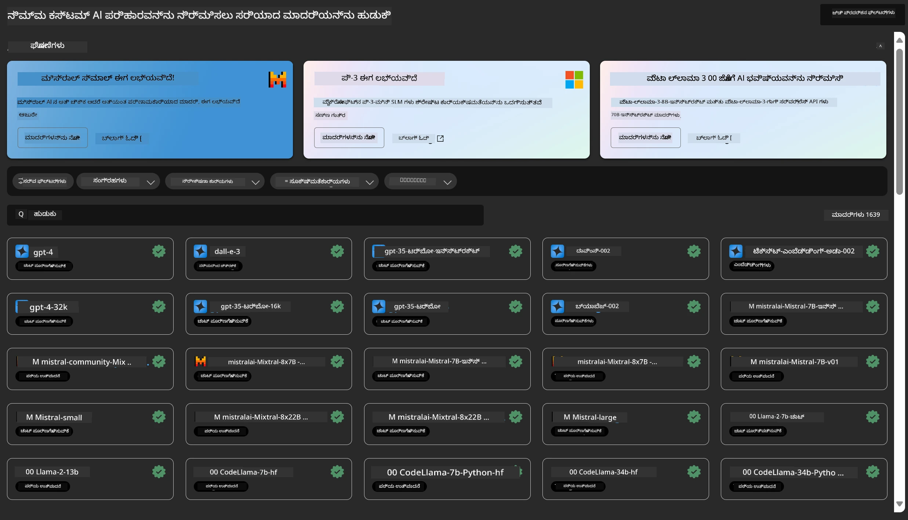
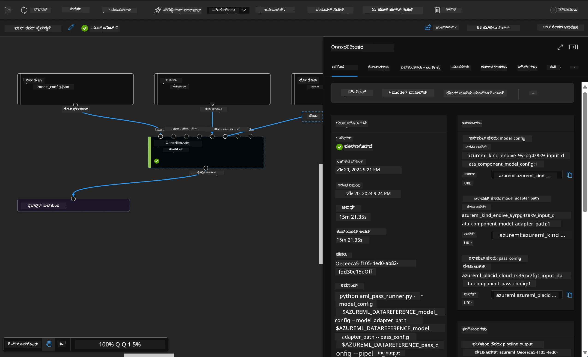

<!--
CO_OP_TRANSLATOR_METADATA:
{
  "original_hash": "7fe541373802e33568e94e13226d463c",
  "translation_date": "2025-12-21T18:11:03+00:00",
  "source_file": "md/03.FineTuning/Introduce_AzureML.md",
  "language_code": "kn"
}
-->
# **Azure Machine Learning 서비스를 ಪರಿಚಯಿಸಿ**

[Azure Machine Learning](https://ml.azure.com?WT.mc_id=aiml-138114-kinfeylo) ಯಂತ್ರ ಕಲಿಕೆಯ (ML) ಪ್ರಾಜೆಕ್ಟ್ ಜೀವನಚಕ್ರವನ್ನು ವೇಗಗೊಳಿಸಲು ಮತ್ತು ನಿರ್ವಹಿಸಲು ಉಪಯುಕ್ತವಾದ ಕ್ಲೌಡ್ ಸೇವೆಯಾಗಿದೆ.

ML ವೃತ್ತಿಪರರು, ಡೇಟಾ ಸೈನ್ಟಿಸ್ಟ್‌ಗಳು ಮತ್ತು ಎಂಜಿನಿಯರ್‌ಗಳು ಇದನ್ನು ತಮ್ಮ ದೈನಂದಿನ ಕಾರ್ಯಪ್ರವೃತ್ತಿಗಳಲ್ಲಿ ಬಳಸಬಹುದು:

- ಮಾದರಿಗಳನ್ನು ಟ್ರೇನ್ ಮಾಡಿ ಮತ್ತು ಡಿಪ್ಲಾಯ್ ಮಾಡಿ.
Manage machine learning operations (MLOps).
- ನೀವು Azure Machine Learning ನಲ್ಲಿ ಮಾದರಿಯನ್ನು ರಚಿಸಬಹುದು ಅಥವಾ PyTorch, TensorFlow, ಅಥವಾ scikit-learn ಹೀಗೆ open-source પ્લಾಟ್‍ಫಾರ್ಮ್‌ನಿಂದ ನಿರ್ಮಿತ ಮಾದರಿಯನ್ನು ಬಳಸಬಹುದು.
- MLOps ಸಾಧನಗಳು ನಿಮಗೆ ಮಾದರಿಗಳನ್ನು ಮೌಲ್ಯಮಾಪನ, ಮರುಶಿಕ್ಷಣ ಮತ್ತು ಮರುಡಿಪ್ಲಾಯ್ ಮಾಡಬೇಕಾದಾಗ ಸಹಾಯ ಮಾಡುತ್ತವೆ.

## Azure Machine Learning ಯಾರಿಗೆ?

**ಡೇಟಾ ಸೈನ್ಟಿಸ್ಟ್‌ಗಳು ಮತ್ತು ML ಎಂಜಿನಿಯರ್‌ಗಳು**

ಅವರು ತಮ್ಮ ದೈನಂದಿನ ಕಾರ್ಯಪ್ರವೃತ್ತಿಗಳನ್ನು ವೇಗಗೊಳಿಸಲು ಮತ್ತು ಸ್ವಯಂಚಾಲಿತಗೊಳಿಸಲು ಉಪಕರಣಗಳನ್ನು ಬಳಸಬಹುದು.
Azure ML ನ್ಯಾಯತೆಯು, ವNXಯಖ್ಯತೆ, ಟ್ರ್ಯಾಕಿಂಗ್ ಮತ್ತು ಆಡಿಟಬಿಲಿಟಿ ಸೇರಿದಂತೆ ವೈಶಿಷ್ಟ್ಯಗಳನ್ನು ಒದಗಿಸುತ್ತದೆ.
Application Developers:
ಅವರು ಮಾದರಿಗಳನ್ನು ಅಪ್ಲಿಕೇಶನ್‌ಗಳು ಅಥವಾ ಸೆರ್ವೀಸ್‌ಗಳಲ್ಲಿ ಸುಗಮವಾಗಿ ಉದ್ಘಟಿಸಬಹುದು.

**ಪ್ಲಾಟ್‌ಫಾರ್ಮ್ ಡೆವಲಪರ್‌ಗಳು**

ಅವರಿಗೆ ದುರಬಲವಾದ Azure Resource Manager API ಗಳಿಂದ ಬೆಂಬಲಿತ ಶಕ್ತಿಶಾಲೀ ಉಪಕರಣಗಳ ಸಮೂಹದ ಪ್ರಾಪ್ತಿಯಿದೆ.
ಈ ಉಪಕರಣಗಳು ಉನ್ನತ ML ಟೂಲಿಂಗ್ ನಿರ್ಮಿಸಲು ಅನುಮತಿಸುತ್ತವೆ.

**ಸಂಸ್ಥೆಗಳು**

Microsoft Azure ಕ್ಲೌಡ್‌ನಲ್ಲಿ ಕಾರ್ಯನಿರ್ವಹಿಸುವ ಸಂಸ್ಥೆಗಳು ಪರಿಚಿತರಾದ ಭದ್ರತೆ ಮತ್ತು ಪಾತ್ರಾಧಾರಿತ ಪ್ರವೇಶ ನಿಯಂತ್ರಣದ ಪ್ರಯೋಜನ ಪಡೆಯುತ್ತವೆ.
ರಕ್ಷಿತ ಡೇಟಾ ಮತ್ತು ನಿರ್ದಿಷ್ಟ ಕಾರ್ಯಾಚರಣೆಗಳ ಪ್ರವೇಶವನ್ನು ನಿಯಂತ್ರಿಸಲು ಯೋಜನೆಗಳನ್ನು ಸ್ಥಾಪಿಸಬಹುದು.

## ತಂಡದ ಪ್ರತಿಯೊಬ್ಬರಿಗೂ ಉತ್ಪಾದಕತೆ
ML ಯೋಜನೆಗಳನ್ನು ನಿರ್ಮಿಸಲು ಮತ್ತು ನಿರ್ವಹಿಸಲು ಸಾಮಾನ್ಯವಾಗಿ ಬೌಧ್ಧಿಕ ಮತ್ತು ತಾಂತ್ರಿಕ ವೈಶಿಷ್ಟ್ಯಗಳ ಜನರ ಬಳಗ ಬಲವಾದ ತಂಡ ಬೇಕಾಗುತ್ತದೆ.

Azure ML ನಿಮಗೆ ಕೆಳಗಿನುವನ್ನು ಮಾಡಲು ಸಾಧ್ಯವಾಗುವಂತೆ ಉಪಕರಣಗಳನ್ನು ಒದಗಿಸುತ್ತದೆ:
- ಹಂಚಿಕೊಂಡ ನೋಟ್ಬುಕ್‌ಗಳು, ಗಣನೆ ಸಂಪನ್ಮೂಲಗಳು, ಸರ್ವರ್‍ಲೆಸ್ ಗಣನೆ, ಡೇಟಾ ಮತ್ತು ಪರಿಸರಗಳ ಮೂಲಕ ನಿಮ್ಮ ತಂಡದೊಂದಿಗೆ ಸಹಕಾರ ಮಾಡಿಕೊಳ್ಳಿ.
- ವಂಶಶಿಖರಣ (lineage) ಮತ್ತು ಆಡಿಟ್ ಅನುಗುಣತೆಯ ಅಗತ್ಯಗಳನ್ನು ಪೂರೈಸಲು ನ್ಯಾಯತೆ, ವಿವರಿಸಲು ಸಾಧ್ಯತೆ, ಟ್ರ್ಯಾಕಿಂಗ್ ಮತ್ತು ಆಡಿಟಬಿಲಿಟಿಯೊಂದಿಗೆ ಮಾದರಿಗಳನ್ನು ಅಭಿವೃದ್ಧಿಪಡಿಸಿ.
- MLOps ಸಹಾಯದಿಂದ ದಕ್ಷವಾಗಿ ವ್ಯಾಪ್ತಿಗೆ ತಕ್ಕಂತೆ ML ಮಾದರಿಗಳನ್ನು ತ್ವರೆಯಿಂದ ಮತ್ತು ಸುಲಭವಾಗಿ ಡಿಪ್ಲಾಯ್ ಮಾಡಿ, ಅವನ್ನು ನಿರ್ವಹಿಸಿ ಮತ್ತು ಆಡಳಿತಗೊಳಿಸಿ.
- ಒಳಗುಡಿಸಲಾದ ಆಡಳಿತ, ಭದ್ರತೆ ಮತ್ತು ಅನುಗುಣತೆಯೊಂದಿಗೆ ಎಲ್ಲೆದಾದರೂ ಯಂತ್ರ ಕಲಿಕೆಯ ಕೆಲಸಗಳನ್ನು ಚಾಲನೆಗೊಳಿಸಿ.

## ಅನೇಕ ಪ್ಲಾಟ್‌ಫಾರ್ಮ್‌ಗಳೊಂದಿಗೆ ಹೊಂದಿಕೊಳ್ಳುವ ಸಾಧನಗಳು

ML ತಂಡದಲ್ಲಿರುವ ಯಾರಾದರೂ ತಮ್ಮ ಪ್ರಿಯದ ಉಪಕರಣಗಳನ್ನು ಬಳಸಿಕೊಂಡು ಕೆಲಸವನ್ನು ಪೂರೈಸಬಹುದು.
ನೀವು ವೇಗದ ಪ್ರಯೋಗಗಳನ್ನು ನಡೆಸುತ್ತಿದ್ದಿರಾ, ಹೈಪರ್ಪ್ಯಾರಾಮೀಟರ್ ಟ್ಯೂನಿಂಗ್ ಮಾಡುತ್ತಿದ್ದೀರಾ, ಪೈಪ್‌ಲೈನ್‌ಗಳನ್ನು ನಿರ್ಮಿಸುತ್ತಿದ್ದೀರಾ ಅಥವಾ ಇನ್ಫರೆನ್ಸುಗಳನ್ನು ನಿರ್ವಹಿಸುತ್ತಿದ್ದೀರಾ, ನೀವು ಪರಿಚಿತ ಇಂಟರ್ಫೇಸ್‌ಗಳನ್ನು ಬಳಸಬಹುದು, ಉದಾಹರಣೆಗೆ:
- Azure Machine Learning ಸ್ಟುಡಿಯೋ
- Python SDK (v2)
- Azure CLI (v2)
- Azure Resource Manager REST APIs

ನೀವು ಮಾದರಿಗಳನ್ನು ತಿದ್ದಿಕೊಂಡು ಅಭಿವೃದ್ಧಿ ಚಕ್ರದಾದ್ಯಾಂತ ಸಹಕರಿಸುವಾಗ, ನೀವು Azure Machine Learning ಸ್ಟುಡಿಯೋ UI ಒಳಗೊಂಡಂತೆ ಆಸ್ತಿ, ಸಂಪನ್ಮೂಲಗಳು ಮತ್ತು ಮೆಟ್ರಿಕ್‌ಗಳನ್ನು ಹಂಚಿಕೊಳ್ಳಬಹುದು ಮತ್ತು ಹುಡುಕಬಹುದು.

## **Azure ML ನಲ್ಲಿ LLM/SLM**

Azure ML LLM/SLM ಸಂಬಂಧಿತ ಅನೇಕ ಫಂಕ್ಷನ್‌ಗಳನ್ನು ಸೇರಿಸಿದೆ, LLMOps ಮತ್ತು SLMOps ಗಳನ್ನು ಸಂಯೋಜಿಸಿ ಏಂಟರ್‌ಪ್ರೈಸ್-ವ್ಯಾಪ್ತಿಯ ಜನರೇಟಿವ್ ತಂತ್ರಜ್ಞಾನ ವೇದಿಕೆಯನ್ನಾಗಿ ನಿರ್ಮಿಸಿದೆ.

### **ಮಾದರಿ ಕ್ಯಾಟಲಾಗ್**

ಏಂಟರ್‌ಪ್ರೈಸ್ ಬಳಕೆದಾರರು ಮಾದರಿ ಕ್ಯಾಟಲಾಗ್ ಮೂಲಕ ವಿಭಿನ್ನ ವ್ಯವಹಾರ ಸನ್ನಿವೇಶಗಳಿಗೆ ಅನುಸಾರವಾಗಿ ವಿಭಿನ್ನ ಮಾದರಿಗಳನ್ನು ಡಿಪ್ಲಾಯ್ ಮಾಡಬಹುದು, ಮತ್ತು ಸಂಸ್ಥಾ ಡೆವಲಪರ್‌ಗಳು ಅಥವಾ ಬಳಕೆದಾರರು ಪ್ರವೇಶಿಸಲು Model as Service ಎನ್ನುತ್ತಿದ್ದಂತೆ ಸೇವೆಗಳನ್ನು ಒದಗಿಸಬಹುದು.

Azure Machine Learning ಸ್ಟುಡಿಯೋದಲ್ಲಿ ಇರುವ ಮಾದರಿ ಕ್ಯಾಟಲಾಗ್ ನಿಮ್ಮನ್ನು ಜನರೇಟಿವ್ AI ಅಪ್ಲಿಕೇಶನ್‌ಗಳನ್ನು ನಿರ್ಮಿಸಲು ಸಹಾಯ ಮಾಡುವ ವ್ಯಾಪಕ ಮಾದರಿಗಳನ್ನು ಕಂಡುಹಿಡಿಯಲು ಮತ್ತು ಬಳಸಲು ಮಧ್ಯಸ್ಥವಾಗಿದೆ. ಮಾದರಿ ಕ್ಯಾಟಲಾಗ್ ನಲ್ಲಿ Azure OpenAI service, Mistral, Meta, Cohere, Nvidia, Hugging Face ಮುಂತಾದ ಮಾದರಿ ಪ್ರೊವೈಡರ್‌ಗಳ ಲಕ್ಷಾಂತರ ಮಾದರಿಗಳನ್ನು ಒಳಗೊಂಡಿದೆ ಮತ್ತು ಇದರಲ್ಲಿ Microsoft ಬಳಸಿ ತರಬೇತಿ ಮಾಡಿದ ಮಾದರಿಗಳು ಸಹ ಸೇರಿವೆ. Microsoft ಹೊರತುಪಡಿಸಿ ಇರುವ ಪ್ರೊವೈಡರ್‌ಗಳಿಂದ ಬಂದ ಮಾದರಿಗಳು Microsoft ನಿಲ್ಲದ ಉತ್ಪನ್ನಗಳು (Non-Microsoft Products) ಆಗಿವೆ, ಮತ್ತು ಅವು Microsoft ನ ಉತ್ಪನ್ನ ನಿಯಮಗಳೆಂದು ವ್ಯಾಖ್ಯಾನಿಸಲ್ಪಟ್ಟಿದ್ದು, ಮಾದರಿಯೊಂದಿಗೆ ನೀಡಲಾದ ನಿಯಮಗಳಿಗೆ ಒಳಪಟ್ಟಿರುತ್ತವೆ.

### **Job Pipeline**

ಯಂತ್ರ ಕಲಿಕೆಯ ಪೈಪ್‌ಲೈನ್‌ನ ಕೇಂದ್ರ ಭಾಗವೆಂದರೆ ಸಂಪೂರ್ಣ ಯಂತ್ರ ಕಲಿಕೆಯ ಕಾರ್ಯವನ್ನು ಬಹು-ಹಂತದ ವರ್ಕ್‌ಫ್ಲೋಗೆ ವಿಭಜಿಸುವುದು. ಪ್ರತಿ ಹಂತವು ಸ್ವತಂತ್ರವಾಗಿ ಅಭಿವೃದ್ಧಿ, ಆಪ್ಟಿಮೈಸೇಶನ್, ಸಂರಚನೆ ಮತ್ತು ಸ್ವಯಂಚಾಲಿತಗೊಳಿಸಬಹುದಾದ ನಿರ್ವಹಣೀಯ ಘಟಕವಾಗಿರುತ್ತದೆ. ಹಂತಗಳು ಚೆನ್ನಾಗಿ ವ್ಯಾಖ್ಯಾನಿತ ಇಂಟರ್ಫೇಸ್‌ಗಳ ಮೂಲಕ ಜೋಡಿಸಿವೆ. Azure Machine Learning ಪೈಪ್‌ಲೈನ್ ಸೇವೆ ಪೈಪ್‌ಲೈನ್ ಹಂತಗಳ ನಡುವೆ ಎಲ್ಲಾ ಅವಲಂಬನೆಗಳನ್ನು ಸ್ವಯಂಚಾಲಿತವಾಗಿ ಒಡನಾಟಗೊಳಿಸುತ್ತದೆ.

SLM / LLM ನ ಫೈನ್-ಟ್ಯೂನಿಂಗ್‌ನಲ್ಲಿ, ನಾವು Pipeline ಮೂಲಕ ನಮ್ಮ ಡೇಟಾ, ತರಬೇತಿ ಮತ್ತು ಜನರೇಷನ್ ಪ್ರಕ್ರಿಯೆಗಳನ್ನು ನಿರ್ವಹಿಸಬಹುದು

### **Prompt flow**

Azure Machine Learning prompt flow ಬಳಸುವ ಪ್ರಯೋಜನಗಳು
Azure Machine Learning prompt flow ಬಳಕೆದಾರರು ಐಡಿಯೇಷನ್ (ಅಭಿಪ್ರಾಯ ರಚನೆ) ನಿಂದ ಪ್ರಯೋಗಮಟ್ಟದ ಪರೀಕ್ಷೆ ಮತ್ತು ಕೊನೆಗೆ ಉತ್ಪಾದನೆ-ಸಿದ್ಧ LLM ಆಧಾರಿತ ಅಪ್ಲಿಕೇಶನ್ ಗಳವರೆಗೆ ಬರುವುದರಲ್ಲಿ ಸಹಾಯ ಮಾಡುವ ಹಲವಾರು ಪ್ರಯೋಜನಗಳನ್ನು ಒದಗಿಸುತ್ತದೆ:

**ಪ್ರಾಂಪ್ಟ್ ಎಂಜಿನಿಯರಿಂಗ್ ಚುರುಕಾಗಿ ಕಾರ್ಯನಿರ್ವಹಿಸುವ ಸಾಮರ್ಥ್ಯ**

Interactive authoring experience: Azure Machine Learning prompt flow ಫ್ಲೋ ರಚನೆಯ ರಚನೆಯನ್ನು ದೃಶ್ಯವಾಗಿ ಪ್ರತಿಬಿಂಬಿಸುವ ಅನುಭವವನ್ನು ಒದಗಿಸುತ್ತದೆ, ಇದು ಬಳಕೆದಾರರಿಗೆ ತಮ್ಮ ಪ್ರಾಜೆಕ್ಟ್‌ಗಳನ್ನು ಸುಲಭವಾಗಿ ಅರ್ಥಮಾಡಿಕೊಳ್ಳಲು ಮತ್ತು ಓದಿಕೊಳ್ಳಲು ಅನುಕೂಲ делает. ಇದು ಪರಿಣಾಮಕಾರಿಯಾಗಿ ಫ್ಲೋ ಅಭಿವೃದ್ಧಿ ಮತ್ತು ದೋಷನಿರ್ವಹಣೆಗೆ ನೋಟ್ಬುಕ್-ಸಮ ತಳಹದಿಯಂತಹ ಕೋಡಿಂಗ್ ಅನುಭವವನ್ನು ಸಹ ಒದಗಿಸುತ್ತದೆ.
Variants for prompt tuning: ಬಳಕೆದಾರರು ಅನೇಕ ಪ್ರಾಂಪ್ಟ್ ವಿಭಿನ್ನ ರೂಪಗಳನ್ನು ರಚಿಸಿ ಹಾಗೂ ಹೋಲಿಸಿ, ಪುನರಾವರ್ತಿತ ಸವರ್ಧನೆ ಪ್ರಕ್ರಿಯೆಯನ್ನು ಅನುಸರಿಸಲು ನೆರವಾಗಿದೆ.

Evaluation: ಒಳಗಾಗಿರುವ ಮೌಲ್ಯಮಾಪನ ಫ್ಲೋಗಳು ಬಳಕೆದಾರರಿಗೆ ತಮ್ಮ ಪ್ರಾಂಪ್ಟ್‌ಗಳ ಮತ್ತು ಫ್ಲೋಗಳ ಗುಣಮಟ್ಟ ಮತ್ತು ಪ್ರಭಾವಕಾರಿತೆಯನ್ನು ಅಂಕಿತಗೊಳಿಸಲು ಅನುಮತಿಸುತ್ತವೆ.

Comprehensive resources: Azure Machine Learning prompt flow ನಿರ್ಮಿತ ಉಪಕರಣಗಳ ಗ್ರಂಥಾಲಯ, ಉದಾಹರಣೆಗಳು ಮತ್ತು ಟೆಂಪ್ಲೇಟುಗಳನ್ನು ಒಳಗೊಂಡಿದೆ, ಅವುಗಳನ್ನು ಅಭಿವೃದ್ಧಿಗೆ ಆರಂಭಿಕ ಅಂಕಿಯಾಗಿ ಬಳಸಬಹುದು, ಸೃಜನಶೀಲತೆಯನ್ನು ಪ್ರೇರೇಪಿಸಿ ಪ್ರಕ್ರಿಯೆಯನ್ನು ವೇಗಗೊಳಿಸುತ್ತದೆ.

**LLM ಆಧಾರಿತ ಅಪ್ಲಿಕೇಶನ್‌ಗಳಿಗಾಗಿ ಸಂಸ್ಥಾ ಸಿದ್ಧತೆ**

Collaboration: Azure Machine Learning prompt flow ತಂಡದ ಸಹಕಾರವನ್ನು ಬೆಂಬಲಿಸುತ್ತದೆ, ಇದು ಬಹು ಬಳಕೆದಾರರು ಪ್ರಾಂಪ್ಟ್ ಎಂಜಿನಿಯರಿಂಗ್ ಪ್ರಾಜೆಕ್ಟ್‌ಗಳಲ್ಲಿ ಒಟ್ಟಿಗೆ ಕೆಲಸಮಾಡಲು, ಜ್ಞಾನ ಹಂಚಿಕೊಳ್ಳಲು ಮತ್ತು ವರ್ಶನ್ ನಿಯಂತ್ರಣವನ್ನು ಕಾಯ್ದುಕೊಳ್ಳಲು ಅನುಮತಿಸುತ್ತದೆ.

All-in-one platform: Azure Machine Learning prompt flow ಅಭಿವೃದ್ಧಿ ಮತ್ತು ಮೌಲ್ಯಮಾಪನದಿಂದ ಹಿಡಿದು ಡಿಪ್ಲಾಯ್ ಮತ್ತು ಮಾನಿಟರಿಂಗ್ ವರೆಗೆ ಸಂಪೂರ್ಣಪ್ರಾಂಪ್ಟ್ ಎಂಜಿನಿಯರಿಂಗ್ ಪ್ರಕ್ರಿಯೆಯನ್ನು ಸರಳಗೊಳಿಸುತ್ತದೆ. ಬಳಕೆದಾರರು ತಮ್ಮ ಫ್ಲೋಗಳನ್ನು ಸುಲಭವಾಗಿ Azure Machine Learning ಎಂಡ್‌ಪಾಯಿಂಟ್‌ಗಳಾಗಿ ಡಿಪ್ಲಾಯ್ ಮಾಡಿ ಮತ್ತು ಅವುಗಳ ಕಾರ್ಯಕ್ಷಮತೆಯನ್ನು ರಿಯಲ್‑ಟೈಮ್‌ನಲ್ಲಿ ಗಮನಿಸಬಹುದು, ಉತ್ತಮ ಕಾರ್ಯನಿರ್ವಹಣೆ ಮತ್ತು ನಿರಂತರ ಸುಧಾರಣೆಯನ್ನು ಖಚಿತಪಡಿಸುತ್ತವೆ.

Azure Machine Learning Enterprise Readiness Solutions: Prompt flow Azure Machine Learning ನ ಭದ್ರ, ವಿಸ್ತರಿಸಬಹುದಾದ ಮತ್ತು ನಂಬಿಕೆಯಾದ ಸಂಸ್ಥಾ ಸಿದ್ಧತೆ ಪರಿಹಾರಗಳನ್ನು ಉಪಯೋಗಿಸುತ್ತದೆ, ಫ್ಲೋಗಳ ಅಭಿವೃದ್ಧಿ, ಪ್ರಯೋಗ ಮತ್ತು ಡಿಪ್ಲಾಯ್ಮೆಂಟ್‌ಗೆ ಬಲವಾದ ಅಡಿಪಾಯವನ್ನು ಒದಗಿಸುತ್ತವೆ.

Azure Machine Learning prompt flow ನೊಂದಿಗೆ, ಬಳಕೆದಾರರು ತಮ್ಮ ಪ್ರಾಂಪ್ಟ್ ಎಂಜಿನಿಯರಿಂಗ್ ಚುರುಕತನವನ್ನು ಬಿಡುಗಡೆಮಾಡಬಹುದು, ಪರಿಣಾಮಕಾರಿಯಾಗಿ ಸಹಕರಿಸಬಹುದು ಮತ್ತು ಯಶಸ್ವಿ LLM ಆಧಾರಿತ ಅಪ್ಲಿಕೇಶನ್ ಅಭಿವೃದ್ಧಿ ಮತ್ತು ಡಿಪ್ಲಾಯ್ಮೆಂಟ್‌ಗೆ ಸಂಸ್ಥಾ ಮಟ್ಟದ ಪರಿಹಾರಗಳನ್ನು ಬಳಸಿಕೊಳ್ಳಬಹುದು.

ಗಣನೆ ಸಾಮರ್ಥ್ಯ, ಡೇಟಾ ಮತ್ತು Azure ML ನ ವಿಭಿನ್ನ ಘಟಕಗಳನ್ನು ಸಂಯೋಜಿಸಿ, ಸಂಸ್ಥಾ ಡೆವಲಪರ್‌ಗಳು ತಮ್ಮ ಸ್ವಂತ ಕೃತಕ ಬುದ್ಧಿಮತ್ತೆ ಅಪ್ಲಿಕೇಶನ್‌ಗಳನ್ನು ಸುಲಭವಾಗಿ ನಿರ್ಮಿಸಿಕೊಳ್ಳಬಹುದು.

---

<!-- CO-OP TRANSLATOR DISCLAIMER START -->
ಅಸ್ವೀಕರಣ:
ಈ ದಸ್ತಾವೇಜನ್ನು AI ಅನುವಾದ ಸೇವೆ Co‑op Translator (https://github.com/Azure/co-op-translator) ಬಳಸಿ ಅನುವಾದಿಸಲಾಗಿದೆ. ನಾವು ಶುದ್ಧತೆಗಾಗಿ ಪ್ರಯತ್ನಿಸಿದರೂ, ಸ್ವಯಂಚಾಲಿತ ಅನುವಾದಗಳಲ್ಲಿ ದೋಷಗಳು ಅಥವಾ ಅಸತ್ಯತೆಗಳು ಇರಬಹುದು ಎಂಬುದನ್ನು ದಯವಿಟ್ಟು ಗಮನದಲ್ಲಿಡಿ. ಮೂಲ ಭಾಷೆಯಲ್ಲಿಯೇ ಇರುವ ಮೂಲ ದಸ್ತಾವೇಜನ್ನು ಅಧಿಕೃತ ಮೂಲವೆಂದು ಪರಿಗಣಿಸಬೇಕು. ಮುಖ್ಯ ಅಥವಾ ನಿರ್ಣಾಯಕ ಮಾಹಿತಿಗಾಗಿ ವೃತ್ತಿಪರ ಮಾನವ ಅನುವಾದವನ್ನು ಶಿಫಾರಸು ಮಾಡಲಾಗುತ್ತದೆ. ಈ ಅನುವಾದದ ಬಳಕೆಯಿಂದ ಉಂಟಾದ ಯಾವುದೇ ತಪ್ಪು ಅರ್ಥಮಾಡಿಕೆಗಳು ಅಥವಾ ತಪ್ಪು ವಿವರಣೆಗಳಿಗಾಗಿ ನಾವು ಜವಾಬ್ದಾರರಾಗುವುದಿಲ್ಲ.
<!-- CO-OP TRANSLATOR DISCLAIMER END -->