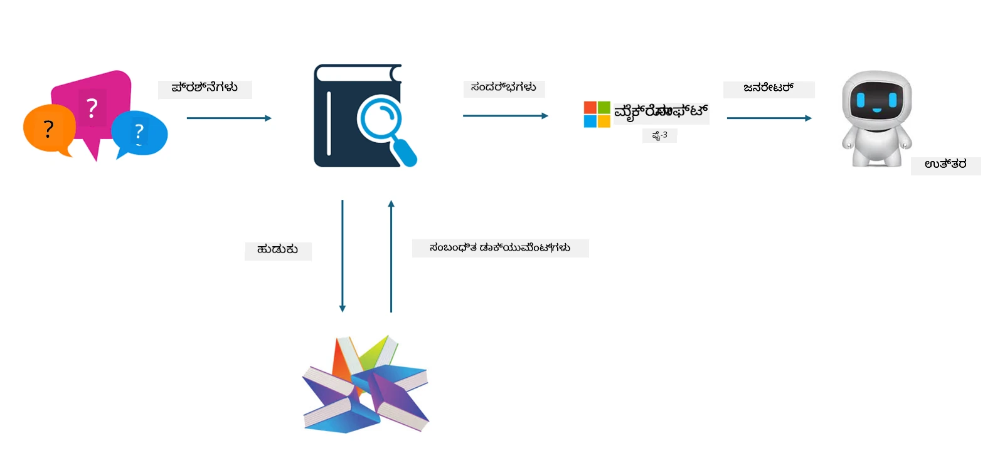
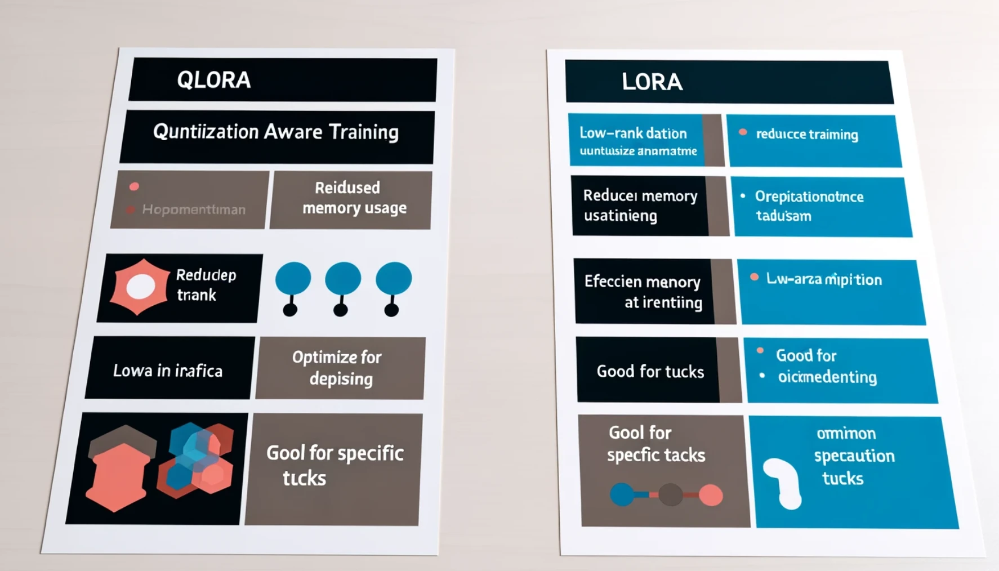

<!--
CO_OP_TRANSLATOR_METADATA:
{
  "original_hash": "743d7e9cb9c4e8ea642d77bee657a7fa",
  "translation_date": "2025-12-21T17:27:03+00:00",
  "source_file": "md/03.FineTuning/LetPhi3gotoIndustriy.md",
  "language_code": "kn"
}
-->
# **Phi-3 ಅನ್ನು ਉਦಯಮ ತಜ್ಞನಾಗಿಸೋಣ**

Phi-3 ಮಾದರಿಯನ್ನು ಉದ್ಯಮಕ್ಕೆ ಅನ್ವಯಿಸಲು, ನಿಮ್ಮಿಗೆ ಉದ್ಯಮ ವ್ಯವಹಾರ ಡೇಟಾವನ್ನು Phi-3 ಮಾದರಿಯಲ್ಲಿ ಸೇರಿಸಬೇಕಾಗುತ್ತದೆ. ನಮಗೆ ಎರಡು ವಿಭಿನ್ನ ಆಯ್ಕೆಗಳು ಇವೆ, ಮೊದಲನೆಯದು RAG (Retrieval Augmented Generation) ಮತ್ತು ಎರಡನೆಯದು Fine Tuning.

## **RAG ವಿರುದ್ಧ Fine-Tuning**

### **Retrieval Augmented Generation**

RAG ಅಂದರೆ ಡೇಟಾ ಮರುಪಡೆಯುವಿಕೆ + ಪಠ್ಯ ಉತ್ಪಾದನೆ. ಉದ್ಯಮದ ಸಂರचित (structured) ಮತ್ತು ಅಸಂರचित (unstructured) ಡೇಟಾವನ್ನು ವೆಕ್ಟರ್ ಡೇಟಾಬೇಸಿನಲ್ಲಿ ಸಂಗ್ರಹಿಸಲಾಗುತ್ತದೆ. ಸಂಬಂಧಿಸಿದ ವಿಷಯವನ್ನು ಹುಡುಕುವಾಗ, ಸಂಬಂಧಿತ ಸಾರಾಂಶ ಮತ್ತು ವಿಷಯವನ್ನು ಕಂಡು ಪ್ರಾಸಂಗಿಕತೆ (context) ರಚಿಸಲಾಗುತ್ತದೆ, ಮತ್ತು LLM/SLM ಯ ಪಠ್ಯ ಪೂರ್ಣಗೊಳಿಸುವ ಸಾಮರ್ಥ್ಯವನ್ನು ಸಂಯೋಜಿಸಿ ವಿಷಯವನ್ನು ಉತ್ಪಾದಿಸಲಾಗುತ್ತದೆ.

### **Fine-tuning**

Fine-tuning ಒಂದು ನಿರ್ದಿಷ್ಟ ಮಾದರಿಯ ಸುಧಾರಣೆಯ ಆಧಾರದ ಮೇಲೆ ನಡೆಯುತ್ತದೆ. ಇದಕ್ಕೆ ಮಾದರಿ ಆಲ್ಗೋರಿಥಮ್‌ನಿಂದ ಪ್ರಾರಂಭಿಸುವ ಅಗತ್ಯವಿಲ್ಲ, ಆದರೆ ಡೇಟಾವನ್ನು ನಿರಂತರವಾಗಿ ಸಂಗ್ರಹಿಸಬೇಕು. ಉದ್ಯಮ ಅನ್ವಯಗಳಲ್ಲಿ ನಿಮಗೆ ಹೆಚ್ಚು ನಿಖರ ಪದಸಂಪದ ಮತ್ತು ಭಾಷಾ ಅಭಿವ್ಯಕ್ತಿ ಬೇಕಾದರೆ, Fine-tuning ನಿಮಗಾಗಿ ಉತ್ತಮ ಆಯ್ಕೆ. ಆದರೆ ನಿಮ್ಮ ಡೇಟಾ ಸರಿಸುಮಾರು ಆಗಿ ಬದಲಾಯಿಸುತ್ತಿರೆಂದರೆ, Fine-tuning ಸಂಕೀರ್ಣವಾಗಬಹುದು.

### **ಹೇಗೆ ಆಯ್ಕೆ ಮಾಡುವುದು**

1. ನಮ್ಮ ಉತ್ತರಕ್ಕೆ ಹೊರಗಿನ ಡೇಟಾ ಪರಿಚಯಿಸುವ ಅಗತ್ಯವಿದ್ದರೆ, RAG ಅತ್ಯುತ್ತಮ ಆಯ್ಕೆ

2. ಸ್ಥಿರ ಮತ್ತು ನಿಖರ ಉದ್ಯಮ ಜ್ಞಾನವನ್ನು ಹೊರತೆಗೆದಬೇಕು ಎಂದಾದರೆ, Fine-tuning ಉತ್ತಮ ಆಯ್ಕೆ. RAG ಸಂಬಂಧಿತ ವಿಷಯವನ್ನು ಎಳೆಯುವುದನ್ನು ಪ್ರಾಧಾನ್ಯ ನೀಡುತ್ತದೆ ಆದರೆ ಎಂದಿಗೂ ವಿಶೇಷ ತಂತ್ರಜ್ಞಾನಾತ್ಮಿಕ ಸೂಕ್ಷ್ಮತೆಯನ್ನು ಸೊದರಿಸದೇ ಇರಬಹುದು.

3. Fine-tuning ಗಾಗಿ ಉನ್ನತ ಗುಣಮಟ್ಟದ ಡೇಟಾ ಸೆಟ್ ಬೇಕು, ಮತ್ತು ಅದು ಕೇವಲ ಸಣ್ಣ ವ್ಯಾಪ್ತಿಯ ಡೇಟಾ ಮಾತ್ರವಾದರೆ ಹೆಚ್ಚಿನ ಸೋದರಿಕೆ ಆಗುವುದಿಲ್ಲ. RAG ಹೆಚ್ಚು ಲವಚಿಕವಾಗಿದೆ

4. Fine-tuning ಒಂದು ಬ್ಲ್ಯಾಕ್ ಬಾಕ್ಸ್ ಆಗಿದೆ, metaphysics ಭಾವನೆಯಾಗಿದೆ ಮತ್ತು ಅದರ ಆಂತರಿಕ ಯಾಂತ್ರಿಕತೆಯನ್ನು ಅರ್ಥಮಾಡಿಕೊಳ್ಳುವುದು ಕಷ್ಟ. ಆದರೆ RAG ಡೇಟಾದ ಮೂಲವನ್ನು ಹುಡುಕುವುದು ಸುಲಭಗೊಳಿಸುತ್ತದೆ, ಹೀಗಾಗಿ ಹಲ್ಲುಸಿನೇಷನ್‍ಗಳು ಅಥವಾ ವಿಷಯದ ದೋಷಗಳನ್ನು ಪರಿಣಾಮಕಾರಿಯಾಗಿ ಸರಿಪಡಿಸಲು ಮತ್ತು ಉತ್ತಮ ಪಾರದರ್ಶಕತೆಯನ್ನು ಒದಗಿಸಲು ಸಹಾಯಮಾಡುತ್ತದೆ.

### **ಸನ್ನಿವೇಶಗಳು**

1. ನಿಖರ ಉದ್ಯಮ ಕ್ಷೇತ್ರಗಳು ನಿರ್ದಿಷ್ಟ ವೃತ್ತಿಪರ ಪದಸಂಪದ ಮತ್ತು ಅಭಿವ್ಯಕ್ತಿಗಳನ್ನು ಬೇಕಾಗಿಸುತ್ತದೆ, ***Fine-tuning*** ಉತ್ತಮ ಆಯ್ಕೆ

2. QA ವ್ಯವಸ್ಥೆ, ವಿಭಿನ್ನ ಜ್ಞಾನಾಂಶಗಳ ಸಂಯೋಜನೆಯನ್ನು ಒಳಗೊಂಡಿರುವುದು, ***RAG*** ಉತ್ತಮ ಆಯ್ಕೆ

3. ಸ್ವಯಂಚಾಲಿತ ವ್ಯವಹಾರ ಪ್ರಕ್ರಿಯೆಯ ಸಂಯೋಜನೆಗೆ ***RAG + Fine-tuning*** ಅತ್ಯುತ್ತಮ ಆಯ್ಕೆ

## **RAG ಅನ್ನು ಹೇಗೆ ಬಳಸಬೇಕು**

ವೆಕ್ಟರ್ ಡೇಟಾಬೇಸ್ ಎಂದರೆ ಗಣಿತೀಯ ರೂಪದಲ್ಲಿ ಸಂಗ್ರಹಗೊಂಡ ಡೇಟಾದ ಒಂದು ಸಂಗ್ರಹ. ವೆಕ್ಟರ್ ಡೇಟಾಬೇಸ್‌ಗಳು ಯಂತ್ರಶಿಕ್ಷಣ ಮಾದರಿಗಳಿಗೆ ಹಿಂದಿನ ಇನ್ಪುಟ್‌ಗಳನ್ನು ನೆನಪಿಡಲು ಸುಲಭಗೊಳಿಸುತ್ತವೆ, ಇದರಿಂದ ಶೋಧ, ಶಿಫಾರಸುಗಳು ಮತ್ತು ಪಠ್ಯ ಉತ್ಪಾದನೆ ಮುಂತಾದ ಬಳಕೆ ಪ್ರಕರಣಗಳನ್ನು ಬೆಂಬಲಿಸಲು ಯಂತ್ರಶಿಕ್ಷಣವನ್ನು ಬಳಸುವ ಸದುಪಯೋಗ ಉಂಟಾಗುತ್ತದೆ. ಡೇಟಾವನ್ನು ನಿಖರ ಹೊಂದಾಣಿಕೆಗಳ (exact matches) ಬದಲು ಸಮಾನತಾ ಮೀಟ್ರಿಕ್‌ಗಳ ಆಧಾರದಲ್ಲಿ ಗುರುತಿಸಬಹುದು, ಇದರಿಂದ ಕಂಪ್ಯೂಟರ್ ಮಾದರಿಗಳಿಗೆ ಡೇಟಾದ ಪ್ರಾಸಂಗಿಕತೆಯನ್ನು ಅರ್ಥಮಾಡಿಕೊಳ್ಳಲು ಸಾಧ್ಯವಾಗುತ್ತದೆ.

ವೆಕ್ಟರ್ ಡೇಟಾಬೇಸ್ RAG ಅನ್ನು ನೆರವೇರಿಸುವ ಪ್ರಮುಖ ಅಂಶ. ನಾವು text-embedding-3, jina-ai-embedding ಮುಂತಾದ ವೆಕ್ಟರ್ ಮಾದರಿಗಳ ಮೂಲಕ ಡೇಟಾ ಅನ್ನು ವೆಕ್ಟರ್ ಸಂಗ್ರಹಣೆಗೆ ಪರಿವರ್ತಿಸಬಹುದು.

RAG ಅಪ್ಲಿಕೇಶನ್ ರಚಿಸುವ ಬಗ್ಗೆ ಇನ್ನಷ್ಟು ತಿಳಿಯಿರಿ [https://github.com/microsoft/Phi-3CookBook](https://github.com/microsoft/Phi-3CookBook?WT.mc_id=aiml-138114-kinfeylo) 

## **Fine-tuning ಅನ್ನು ಹೇಗೆ ಬಳಸಬೇಕು**

Fine-tuning ನಲ್ಲಿ ಸಾಮಾನ್ಯವಾಗಿ ಬಳಸಲಾಗುವ ಅಲ್ಗಾರಿಥಮ್‌ಗಳು LoRA ಮತ್ತು QLoRA. ಹೇಗೆ ಆಯ್ಕೆ ಮಾಡುವುದು?
- [ಈ ಸ್ಯಾಂಪಲ್ ನೋಟ್‌ಬುಕ್ ಕುರಿತು ಇನ್ನಷ್ಟು ತಿಳಿಯಿರಿ](../../code/04.Finetuning/Phi_3_Inference_Finetuning.ipynb)
- [Python FineTuning ಉದಾಹರಣೆ](../../../../code/04.Finetuning/FineTrainingScript.py)

### **Lora and QLora**

LoRA (Low-Rank Adaptation) ಮತ್ತು QLoRA (Quantized Low-Rank Adaptation) ಇಬ್ಬರೂ Parameter Efficient Fine Tuning (PEFT) ಬಳಸಿಕೊಂಡು ದೊಡ್ಡ ಭಾಷಾ ಮಾದರಿಗಳನ್ನು (LLMs) ಫೈನ್-ಟ್ಯೂನ್ ಮಾಡಲು ಬಳಸುವ ತಂತ್ರಗಳು. PEFT ತಂತ್ರಗಳು ಪರಂಪರೆಯ ವಿಧಾನಗಳಿಗಿಂತ ಮಾದರಿಗಳನ್ನು ಹೆಚ್ಚು ಪರಿಣಾಮಕಾರಿಯಾಗಿ ತರಬೇತಿ ನೀಡಲು ವಿನ್ಯಾಸಗೊಳ್ಳುತ್ತವೆ. 
LoRA ಒಂದು ಸ್ವತಂತ್ರ ಫೈನ್-ಟ್ಯೂನಿಂಗ್ ತಂತ್ರವಾಗಿದೆ, ಇದು ತೂಕದ ಅಪ್ಡೇಟ್ ಮ್ಯಾಟ್ರಿಗೆ ಕಡಿಮೆ-ರ್ಯಾಂಕ್ ಅಂದಾಜು ಅನ್ವಯಿಸುವ ಮೂಲಕ ಮೆಮರಿಕ್ ಫುಟ್‌ಪ್ರಿಂಟ್ ಅನ್ನು ಕಡಿಮೆ ಮಾಡುತ್ತದೆ. ಇದು ವೇಗವಾದ ತರಬೇತಿಯ ಸಮಯವನ್ನು ಒದಗಿಸುತ್ತದೆ ಮತ್ತು ಪರಂಪರೆ ಫೈನ್-ಟ್ಯೂನಿಂಗ್ ವಿಧಾನಗಳಿಗೆ ಹತ್ತಿರದ ಕಾರ್ಯಕ್ಷಮತೆಯನ್ನು ಕಾಪಾಡಿಕೊಂಡಿರುತ್ತದೆ. 

QLoRA LoRA ಯ ವಿಸ್ತಾರಿತ ಆವೃತ್ತಿ ಆಗಿದ್ದು, ಮೆಮರಿ ಬಳಕೆಯನ್ನು ಹೆಚ್ಚುವರಿ ಕಡಿಮೆ ಮಾಡಲು ಕ್ವಾಂಟೈಜೇಶನ್ ತಂತ್ರಗಳನ್ನು ಒಳಗೊಳ್ಳುತ್ತದೆ. QLoRA ಪೂರ್ವ-ಶಿಕ್ಷಿತ LLM ನ ತೂಕ ಪ್ಯಾರಾಮೀಟರ್‌ಗಳ ಖಚಿತತೆಯನ್ನು 4-ಬಿಟ್ ಖಚಿತತೆಗೆ ಕ್ವಾಂಟೈಜ್ ಮಾಡುತ್ತದೆ, ಇದು LoRAಗಿಂತ ಮೆಮರಿ ರೂಪದಲ್ಲಿ ಹೆಚ್ಚು ಪರಿಣಾಮಕಾರಿ. ಆದಾಗ್ಯೂ, ಹೆಚ್ಚಿನ ಕ್ವಾಂಟೈಝೇಷನ್ ಮತ್ತು ಡಿಕ್ವಾಂಟೈಝೇಷನ್ ಹಂತಗಳ కారణದಿಂದ QLoRA ತರಬೇತಿ LoRA ತರಬೇತಿಗಿಂತ ಸುಮಾರು 30% ನಿಧಾನವಾಗಿರುತ್ತದೆ. 

QLoRA ಕ್ವಾಂಟೈಸೇಶನ್ ಸಮಯದಲ್ಲಿ ಪರಿಚಯವಾಗುವ ದೋಷಗಳನ್ನು ಸರಿಪಡಿಸಲು LoRA ಅನ್ನು ನೆರಸರವಾಗಿ ಬಳಸುತ್ತದೆ. QLoRA ಸಣ್ಣ, ಸುಗಮ ಲಭ್ಯವಿರುವ GPU ಗಳ ಮೇಲೆಲೂ ಬಿಲಿಯನ್‌ಗಳ ಪ್ಯಾರಾಮೀಟರ್‌ ಇರುವ ಭಾರೀ ಮಾದರಿಗಳಿಗೆ ಫೈನ್-ಟ್ಯೂನಿಂಗ್ ಮಾಡುವನ್ನು ಸಾಧ್ಯಮಾಡಿಸುತ್ತದೆ. ಉದಾಹರಣೆಗೆ, QLoRA ಕೆವಳ 2 ಮಾತ್ರದೊಂದಿಗೆ 36 GPUs ಅಗತ್ಯವಿರುವ 70B ಪ್ಯಾರಾಮೀಟರ್ ಮಾದರಿಯನ್ನು ಫೈನ್-ಟ್ಯೂನ್ ಮಾಡಬಹುದು 

---

<!-- CO-OP TRANSLATOR DISCLAIMER START -->
ಅಸ್ವೀಕರಣ:
ಈ ದಸ್ತಾವೇಜನ್ನು ಕೃತಕ ಬುದ್ಧಿಮತ್ತೆ (AI) ಆಧಾರಿತ ಅನುವಾದ ಸೇವೆ Co‑op Translator (https://github.com/Azure/co-op-translator) ಬಳಸಿ ಅನುವಾದಿಸಲಾಗಿದೆ. ನಾವು ನಿಖರತೆಯನ್ನು ಸಾಧಿಸಲು ಪ್ರಯತ್ನಿಸುವುದಾದರೂ, ಸ್ವಯಂಚಾಲಿತ ಅನುವಾದಗಳಲ್ಲಿ ದೋಷಗಳು ಅಥವಾ ಅಸತ್ಯತೆಗಳು ಇರಬಹುದೆಂದು ದಯವಿಟ್ಟು ಗಮನಿಸಿ. ಮೂಲ ಭಾಷೆಯಲ್ಲಿನ ಮೂಲ ದಸ್ತಾವೇಜನ್ನು ಅಧಿಕೃತ ಮೂಲವೆಂದು ಪರಿಗಣಿಸಬೇಕು. ಪ್ರಮುಖ ಅಥವಾ ಗಂಭೀರ ಮಾಹಿತಿಗಾಗಿ ವೃತ್ತಿಪರ ಮಾನವ ಅನುವಾದವನ್ನು ಶಿಫಾರಸು ಮಾಡಲಾಗುತ್ತದೆ. ಈ ಅನುವಾದದ ಬಳಕೆಯಿಂದ ಉಂಟಾಗುವ ಯಾವುದೇ ಗೊಂದಲಗಳು ಅಥವಾ ತಪ್ಪು ಅರ್ಥಗಳಿಗಾಗಿ ನಾವು ಜವಾಬ್ದಾರರಾಗುವುದಿಲ್ಲ.
<!-- CO-OP TRANSLATOR DISCLAIMER END -->