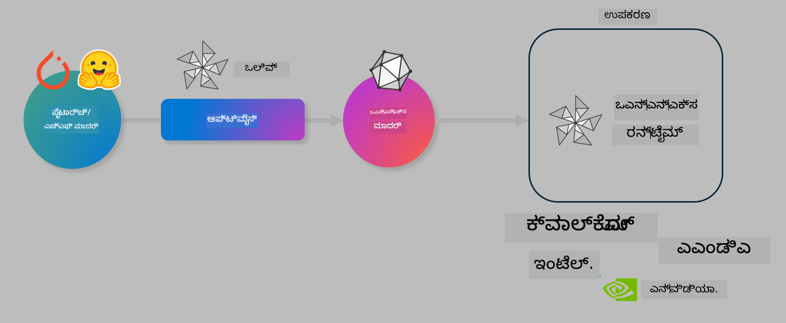

<!--
CO_OP_TRANSLATOR_METADATA:
{
  "original_hash": "6bbe47de3b974df7eea29dfeccf6032b",
  "translation_date": "2025-12-21T22:24:47+00:00",
  "source_file": "md/03.FineTuning/olive-lab/readme.md",
  "language_code": "kn"
}
-->
# ಪ್ರಯೋಗಶಾಲೆ. on-device ಇನ್‌ಫರೆನ್ಸ್‌ಗಾಗಿ AI ಮಾದರಿಗಳನ್ನು ಆಪ್ಟಿಮೈಸ್ ಮಾಡಿ

## ಪರಿಚಯ 

> [!IMPORTANT]
> ಈ ಪ್ರಯೋಗಶಾಲೆಗೆ ಸಂಬಂಧಿಸಿದ ಚಾಲಕಗಳು ಮತ್ತು CUDA toolkit (ಸಂಸ್ಕರಣೆ 12+) ಸ್ಥಾಪಿಸಲಾದ **Nvidia A10 or A100 GPU** ಅಗತ್ಯವಿದೆ.

> [!NOTE]
> ಇದು **35-ನಿಮಿಷಗಳ** ಪ್ರಯೋಗಶಾಲೆ ಆಗಿದ್ದು, OLIVE ಬಳಸಿ on-device ಇನ್‌ಫೆರನ್ಸ್‌ಗಾಗಿ ಮಾದರಿಗಳನ್ನು ಆಪ್ಟಿಮೈಸ್ ಮಾಡುವ ಮೂಲ ಸಂಭಾವ್ಯತೆಯೊಂದಕ್ಕೆ ಕೈಕೊಡುವ ಪರಿಚಯವನ್ನು ನೀಡುತ್ತದೆ.

## ಕಲಿಕಾ ಉದ್ದೇಶಗಳು

ಈ ಪ್ರಯೋಗಶಾಲೆಯ ಕೊನೆಯಲ್ಲಿ, ನೀವು OLIVE ಅನ್ನು ಬಳಸಿಕೊಂಡು ಕೆಳಕಂಡವುಗಳನ್ನು ಮಾಡಲು ಸಾಧ್ಯವಾಗುತ್ತದೆ:

- AWQ ಕ್ವಾಂಟೈಜೇಶನ್ ವಿಧಾನವನ್ನು ಬಳಸಿ AI ಮಾದರಿಯನ್ನು ಕ್ವಾಂಟೈಜ್ ಮಾಡುವುದು.
- ನಿರ್ದಿಷ್ಟ ಕಾರ್ಯಕ್ಕಾಗಿ AI ಮಾದರಿಯನ್ನು ಫೈನ್-ಟ್ಯೂನ್ ಮಾಡುವುದು.
- ONNX Runtime ನಲ್ಲಿ ಡಿವೈಸ್‌ನಲ್ಲಿ ಪರಿಣಾಮಕಾರಿಯಾಗಿ ಇನ್‌ಫರೆನ್ಸ್ ನಡೆಸಲು LoRA ಅಡಾಪ್ಟರ್ಗಳನ್ನು (ಫೈನ್-ಟ್ಯೂನಾದ ಮಾದರಿ) ರಚಿಸುವುದು.

### Olive ಎಂದರೆ ಏನು

Olive (*O*NNX *live*) ಒಂದು ಮಾದರಿ ಆಪ್ಟಿಮೈಸೇಶನ್ ಟೂಲ್‌ಕಿಟ್ ಆಗಿದ್ದು, ಜೊತೆಗೆ CLI ಅನ್ನು ಹೊಂದಿದೆ ಅದು ONNX runtime +++https://onnxruntime.ai+++ ಗೆ ಗುಣಮಟ್ಟ ಮತ್ತು ಕಾರ್ಯಕ್ಷಮತೆಯೊಂದಿಗೆ ಮಾದರಿಗಳನ್ನು ರವಾನಿಸಲು ಸಹಾಯ ಮಾಡುತ್ತದೆ.



Olive ಗೆ ಇನ್ಪುಟ್ ಸಾಮಾನ್ಯವಾಗಿ PyTorch ಅಥವಾ Hugging Face ಮಾದರಿ ಆಗಿದ್ದು, ಔಟ್‌ಪುಟ್ ಸಾಧನ(ಉತ್ಪಾದನಾ ಗುರಿ)ದಲ್ಲಿ ಚಾಲನೆ ಮಾಡುವ ಆಪ್ಟಿಮೈಸ್ಡ್ ONNX ಮಾದರಿ ಆಗಿರುತ್ತದೆ. Olive ಗುರಿ ಸಾಧನದ AI ಅಕ್ಸೆಲರೇಟರ್ (NPU, GPU, CPU) ಪ್ರಕಾರವನ್ನು ಗಮನಿಸಿ ಮಾದರಿಯನ್ನು ಆಪ್ಟಿಮೈಸ್ ಮಾಡುತ್ತದೆ, ಇದು Qualcomm, AMD, Nvidia ಅಥವಾ Intel ಮುಂತಾದ ಹಾರ್ಡ್ವೇರ್ ವENDOR ಗಳಿಂದ ಒದಗಿಸಲಾಗುತ್ತದೆ.

Olive ಒಂದು *workflow* ಅನ್ನು ಜಾರಿಗೊಳಿಸುತ್ತದೆ, ಇದು ಕ್ರಮಬದ್ಧವಾದ ಒಂದೊಂದು ಮಾದರಿ ಆಪ್ಟಿಮೈಸೇಶನ್ ಕಾರ್ಯಗಳ ಕ್ರಮವಾಗಿದ್ದು ಅವುಗಳನ್ನು *passes* ಎಂದು ಕರೆಯಲಾಗುತ್ತದೆ — ಉದಾಹರಣೆಗೆ passes ಗಳಲ್ಲಿ: ಮಾದರಿ ಸಂಕುಚನ(compression), ಗ್ರಾಫ್ ಕ್ಯಾಪ್ಚರ್, ಕ್ವಾಂಟೈಜೇಶನ್, ಗ್ರಾಫ್ ಆಪ್ಟಿಮೈಸೇಶನ್ ಸೇರಿವೆ. ಪ್ರತಿಯೊಂದು ಪಾಸ್‌ಗೆ ಉತ್ತಮ ಮೆಟ್ರಿಕ್ಸ್ (ಉದಾ: ನಿಖರತೆ ಮತ್ತು ಲ್ಯಾಟೆನ್ಸಿ) ಸಾಧಿಸಲು ಟ್ಯೂನ್ ಮಾಡಬಹುದಾದ ನಿಯತಾಂಕಗಳ ಸೆಟ್ ಇರುತ್ತದೆ, ಇವು ಸಂಬಂಧಿತ ಮೌಲ್ಯಮಾಪಕದ ಮೂಲಕ ಮೌಲ್ಯಮಾಪನವಾಗುತ್ತವೆ. Olive ಒಂದು ಶೋಧ ელ್ಗೊರಿಥಮ್ ಬಳಸುವ ಶೋಧ ತಂತ್ರವನ್ನು ಬಳಸಿಕೊಂಡು ಪ್ರತಿ ಪಾಸ್ ಅನ್ನು ಒಂದರಂತೆ ಅಥವಾ ಪಾಸ್‌ಗಳ ಗುಂಪಾಗಿ ಸ್ವಯಂ-ಟ್ಯೂನ್ ಮಾಡುತ್ತದೆ.

#### Olive ನ ಪ್ರಯೋಜನಗಳು

- **ನಿರಾಶೆ ಮತ್ತು ಸಮಯವನ್ನು ಕಡಿಮೆಮಾಡಿ**: ಗ್ರಾಫ್ ಆಪ್ಟಿಮೈಸೇಶನ್, ಸಂಕೋಚನ ಮತ್ತು ಕ್ವಾಂಟೈಜೇಶನ್‌ಗಾಗಿ ವಿಭಿನ್ನ ತಂತ್ರಗಳ ಕೈಯಿಂದ ಪ್ರಯೋಗಮಾಡುವ ಪ್ರಯತ್ನ-ದೋ್ಷ ಅನುಭವವನ್ನು ಕಡಿಮೆಮಾಡಿ. ನಿಮ್ಮ ಗುಣಮಟ್ಟ ಮತ್ತು ಕಾರ್ಯಕ್ಷಮತಾ ನಿರ್ಬಂಧಗಳನ್ನು ನಿರ್ಧರಿಸಿ ಮತ್ತು Olive ನಿಮಗಾಗಿ ಅತ್ಯುತ್ತಮ ಮಾದರಿಯನ್ನು ಸ್ವಯಂಚಾಲಿತವಾಗಿ ಹುಡುಕಲಿ.
- **40+ ಬಿಲ್ಟ್-ಇನ್ ಮಾದರಿ ಆಪ್ಟಿಮೈಸೇಶನ್ ಘಟಕಗಳು** ಕ್ವಾಂಟೈಜೇಶನ್, ಸಂಕೋಚನ, ಗ್ರಾಫ್ ಆಪ್ಟಿಮೈಸೇಶನ್ ಮತ್ತು ಫೈನ್‌ಟ್ಯೂನಿಂಗ್‌ನ ಅತ್ಯಾಧುನಿಕ ತಂತ್ರಗಳನ್ನು ಒಳಗೊಂಡಿವೆ.
- **ಬಳಿಸಲು ಸುಲಭ CLI** ಸಾಮಾನ್ಯ ಮಾದರಿ ಆಪ್ಟಿಮೈಸೇಶನ್ ಕಾರ್ಯಗಳಿಗಾಗಿ. ಉದಾಹರಣೆಗೆ, olive quantize, olive auto-opt, olive finetune.
- ಮಾದರಿ ಪ್ಯಾಕೇಜಿಂಗ್ ಮತ್ತು ಡೆಪ್ಲಾಯ್ಮೆಂಟ್ ಒಳಗೊಂಡಿದೆ.
- **Multi LoRA serving** ಗಾಗಿ ಮಾದರಿಗಳನ್ನು ಉತ್ಪಾದಿಸುವುದನ್ನು ಬೆಂಬಲಿಸುತ್ತದೆ.
- YAML/JSON ಬಳಸಿಕೊಂಡು ವರ್ಕ್‌ಫ್ಲೋಗಳನ್ನು ನಿರ್ಮಿಸಿ ಮಾದರಿ ಆಪ್ಟಿಮೈಸೇಶನ್ ಮತ್ತು ಡೆಪ್ಲಾಯ್‌ಮೆಂಟ್ ಕಾರ್ಯಗಳನ್ನು ನಿಯೋಜಿಸಬಹುದು.
- **Hugging Face** ಮತ್ತು **Azure AI** ಏಕೀಕರಣ.
- **ಕ್ಯಾಶಿಂಗ್** ಮೆಕ್ಯಾನಿಸ್ಮ್ ಒಳಗೊಂಡಿದ್ದು **ಖರ್ಚುಗಳನ್ನು ಉಳಿಸಲು** ಸಹಾಯ ಮಾಡುತ್ತದೆ.

## ಪ್ರಯೋಗಶಾಲೆಯ ಸೂಚನೆಗಳು
> [!NOTE]
> ದಯವಿಟ್ಟು ನೀವು ನಿಮ್ಮ Azure AI Hub ಮತ್ತು ಪ್ರಾಜೆಕ್ಟ್ ಅನ್ನು ಪ್ರತ್ಯೇಕಿಸಿ, ಮತ್ತು Lab 1 ಪ್ರಕಾರ ನಿಮ್ಮ A100 ಕಂಪ್ಯೂಟ್ ಅನ್ನು ಸೆಟ್‌ಅಪ್ ಮಾಡಿದಿರಾ ಎಂದು ಖಾತ್ರಿಪಡಿಸಿ.

### ಹಂತ 0: ನಿಮ್ಮ Azure AI Compute ಗೆ ಸಂಪರ್ಕಿಸಲಾಗುತ್ತಿದೆ

ನೀವು **VS Code** ನಲ್ಲಿ ರಿಮೋಟ್ ವೈಶಿಷ್ಟ್ಯವನ್ನು ಬಳಸಿ Azure AI compute ಗೆ ಸಂಪರ್ಕಿಸಬಹುದು. 

1. ನಿಮ್ಮ **VS Code** ಡೆಸ್ಕ್‌ಟಾಪ್ ಅಪ್ಲಿಕೇಶನ್ ಅನ್ನು ತೆರೆಯಿರಿ:
1. **Shift+Ctrl+P** ಬಳಿಸಿ **command palette** ಅನ್ನು ತೆರೆಯಿರಿ
1. command palette ನಲ್ಲಿ **AzureML - remote: Connect to compute instance in New Window** ಅನ್ನು ಹುಡುಕು.
1. Compute ಗೆ ಸಂಪರ್ಕಿಸಲು ಸ್ಕ್ರೀನ್上的 ಸೂಚನೆಗಳನ್ನು ಅನುಸರಿಸಿ. ಇದರಲ್ಲಿ ನಿಮ್ಮ Azure Subscription, Resource Group, Project ಮತ್ತು Lab 1 ನಲ್ಲಿ ಸಿದ್ಧಪಡಿಸಿದ Compute ಹೆಸರು ಆಯ್ಕೆ ಮಾಡಬೇಕಾಗುತ್ತದೆ.
1. ನೀವು ನಿಮ್ಮ Azure ML Compute ನೋಡ್‌ಗೆ ಸಂಪರ್ಕಿಸಿದ ನಂತರ, ಇದು **Visual Code** ನ ಕೆಳ ತಿರುವಿನಲ್ಲಿ `><Azure ML: Compute Name` ಎಂದು ಪ್ರದರ್ಶಿಸಲಾಗುತ್ತದೆ

### ಹಂತ 1: ಈ ರೆಪೊವನ್ನು ಕ್ಲೋನ್ ಮಾಡಿ

VS Code ನಲ್ಲಿ, ನೀವು ಹೊಸ ಟರ್ಮಿನಲ್ ಅನ್ನು **Ctrl+J** ಬಳಸಿ ತೆರೆಯಬಹುದು ಮತ್ತು ಈ ರೆಪೊವನ್ನು ಕ್ಲೋನ್ ಮಾಡಿ:

ಟರ್ಮಿನಲ್‌ನಲ್ಲಿ ನೀವು ಪ್ರಾಂಪ್ಟ್ ಅನ್ನು ಕಾಣಬೇಕು

```
azureuser@computername:~/cloudfiles/code$ 
```
ಸೊಲ್ಯೂಷನ್ ಅನ್ನು ಕ್ಲೋನ್ ಮಾಡಿ 

```bash
cd ~/localfiles
git clone https://github.com/microsoft/phi-3cookbook.git
```

### ಹಂತ 2: VS Code ನಲ್ಲಿ ಫೋಲ್ಡರ್ ತೆರೆಯಿರಿ

ಸಂಬಂಧಪಟ್ಟ ಫೋಲ್ಡರ್ನಲ್ಲಿ VS Code ತೆರೆಯಲು ಟರ್ಮಿನಲ್‌ನಲ್ಲಿ ಕೆಳಗಿನ ಕಮಾಂಡ್ ಅನ್ನು 실행ಿಸಿ, ಇದು ಹೊಸ ವಿಂಡೋ ಅನ್ನು ತೆರೆಯುತ್ತದೆ:

```bash
code phi-3cookbook/code/04.Finetuning/Olive-lab
```

ಅಥವಾ, **File** > **Open Folder** ಆಯ್ಕೆಮಾಡಿ ಫೋಲ್ಡರ್ ತೆರೆಯಬಹುದಾಗಿದೆ. 

### ಹಂತ 3: ಅವಲಂಬನೆಗಳು

ನಿಮ್ಮ Azure AI Compute ಇನ್ಸ್ಟಾನ್ಸ್‌ನಲ್ಲಿ VS Code ನಲ್ಲಿ ಟರ್ಮಿನಲ್ ವಿಂಡೋವನ್ನು ತೆರೆಯಿರಿ (ಸೂಚನೆ: **Ctrl+J**) ಮತ್ತು ಅವಲಂಬನೆಗಳನ್ನು ಸ್ಥಾಪಿಸಲು ಕೆಳಗಿನ ಕಮಾಂಡ್‌ಗಳನ್ನು ನಿರ್ವಹಿಸಿ:

```bash
conda create -n olive-ai python=3.11 -y
conda activate olive-ai
pip install -r requirements.txt
az extension remove -n azure-cli-ml
az extension add -n ml
```

> [!NOTE]
> ಎಲ್ಲಾ ಅವಲಂಬನೆಗಳನ್ನು ಸ್ಥಾಪಿಸಲು ~5 ನಿಮಿಷಗಳ ಸಮಯ ತೆಗೆದುಕೊಳ್ಳಬಹುದು.

ಈ ಪ್ರಯೋಗಶಾಲೆಯಲ್ಲಿ ನೀವು Azure AI ಮಾದರಿ ಕ್ಯಾಟಲಾಗ್‌ಗೆ ಮಾದರಿಗಳನ್ನು ಡೌನ್‌ಲೋಡ್ ಮತ್ತು ಅಪ್ಲೋಡ್ ಮಾಡಲಿದ್ದೀರಿ. ಆದ್ದರಿಂದ ಮಾದರಿ ಕ್ಯಾಟಲಾಗ್ ಅನ್ನು ಪ್ರವೇಶಿಸಲು, ನೀವು Azure ಗೆ ಲಾಗಿನ್ ಮಾಡಬೇಕು:

```bash
az login
```

> [!NOTE]
> ಲಾಗಿನ್ ಸಮಯದಲ್ಲಿ ನಿಮಗೆ ನಿಮ್ಮ ಸಬ್‌ಸ್ಕ್ರಿಪ್ಶನ್ ಆಯ್ಕೆಮಾಡಲು ಕೇಳಲಾಗುತ್ತದೆ. ಈ ಪ್ರಯೋಗಶಾಲೆಗೆ ಒದಗಿಸಲಾದ ಸಬ್‌ಸ್ಕ್ರಿಪ್ಶನ್ ಅನ್ನು ನಿರ್ದೇಶಿಸುವುದನ್ನು ಖಚಿತಪಡಿಸಿಕೊಳ್ಳಿ.

### ಹಂತ 4: Olive ಕಮಾಂಡ್‌ಗಳನ್ನು 실행ಿಸಿ 

ನಿಮ್ಮ Azure AI Compute ಇನ್ಸ್ಟಾನ್ಸ್‌ನಲ್ಲಿರುವ VS Code ನಲ್ಲಿ ಟರ್ಮಿನಲ್ ವಿಂಡೋವನ್ನು ತೆರೆಯಿರಿ (ಸೂಚನೆ: **Ctrl+J**) ಮತ್ತು `olive-ai` conda ಪರಿಸರ ಸಕ್ರಿಯಗೊಂಡಿದೆಯೇ ಎಂದು ಖಚಿತಪಡಿಸಿಕೊಳ್ಳಿ:

```bash
conda activate olive-ai
```

ಮುಂದೆ, ಕೆಳಗಿನ Olive ಕಮಾಂಡ್‌ಗಳನ್ನು ಕಮಾಂಡ್ ಲೈನ್‌ನಲ್ಲಿ 실행ಿಸಿ.

1. **ಡಾಟಾ ಪರಿಶೀಲಿಸಿ:** ಈ ಉದಾಹರಣೆಯಲ್ಲಿ, ನೀವು ಪ್ರವಾಸ ಸಂಬಂಧಿತ ಪ್ರಶ್ನೆಗಳಿಗೆ ವಿಶೇಷೀಕೃತವಾಗುವಂತೆ Phi-3.5-Mini ಮಾದರಿಯನ್ನು ಫೈನ್-ಟ್ಯೂನ್ ಮಾಡಲಿದ್ದೀರಿ. ಕೆಳಗಿನ ಕೋಡ್ ಡೇಟಾಸೆಟ್‌ನ ಮೊದಲ ಕೆಲವು ರೆಕಾರ್ಡ್‌ಗಳನ್ನು ಪ್ರದರ್ಶಿಸುತ್ತದೆ, ಇವು JSON lines ಫಾರ್ಮಾಟ್‌ನಲ್ಲಿ ಇವೆ:
   
    ```bash
    head data/data_sample_travel.jsonl
    ```
1. **ಮಾದರಿಯನ್ನು ಕ್ವಾಂಟೈಜ್ ಮಾಡಿ:** ಮಾದರಿಯನ್ನು ತರಬೇತಿ ಮಾಡುವ ಮೊದಲು, ನೀವು ಕೆಳಗಿನ ಕಮಾಂಡ್ ಬಳಸಿ Active Aware Quantization (AWQ) ಎನ್ನುವ ತಂತ್ರವನ್ನು ಬಳಸಿಕೊಂಡು ಕ್ವಾಂಟೈಜ್ ಮಾಡುತ್ತೀರಿ +++https://arxiv.org/abs/2306.00978+++. AWQ ಇನ್‌ಫೆರನ್ಸ್ ಸಂದರ್ಭದಲ್ಲಿ ಉತ್ಪನ್ನವಾದ ಆಕ್ಟಿವೇಶನ್‌ಗಳನ್ನು ಪರಿಗಣಿಸುವ ಮೂಲಕ ಮಾದರಿಯ ತೂಕಗಳನ್ನು ಕ್ವಾಂಟೈಜ್ ಮಾಡುತ್ತದೆ. ಇದರರ್ಥ ಕ್ವಾಂಟೈಜೇಶನ್ ಪ್ರಕ್ರಿಯೆ ಆಕ್ಟಿವೇಶನ್ಗಳಲ್ಲಿ ಇರುವ ವಾಸ್ತವಿಕ ಡೇಟಾ ವಿತರಣೆಗಳನ್ನು ಗಮನದಲ್ಲಿರಿಸಿಕೊಂಡು ಕಾರ್ಯನಿರ್ವಹಿಸುವುದರಿಂದ ಪರಂಪರೆ ತೂಕ ಕ್ವಾಂಟೈಜೇಶನ್ ವಿಧಾನಗಳಿಗಿಂತ ಹೆಚ್ಚು ಮಾದರಿ ನಿಖರತೆಯನ್ನು ಉಳಿಸಿಕೊಳ್ಳುತ್ತದೆ.
    
    ```bash
    olive quantize \
       --model_name_or_path microsoft/Phi-3.5-mini-instruct \
       --trust_remote_code \
       --algorithm awq \
       --output_path models/phi/awq \
       --log_level 1
    ```
    
    AWQ ಕ್ವಾಂಟೈಜೇಶನ್ ಮುಗಿಸಲು **~8mins** ಸಮಯ ತೆಗೆದುಕೊಳ್ಳುತ್ತದೆ, ಮತ್ತು ಇದು **ಮಾದರಿ ಗಾತ್ರವನ್ನು ~7.5GBರಿಂದ ~2.5GB ಗೆ** ಕಡಿಮೆ ಮಾಡುತ್ತದೆ.
   
   ಈ ಪ್ರಯೋಗಶಾಲೆಯಲ್ಲಿ ನಾವು Hugging Face ನಿಂದ ಮಾದರಿಗಳನ್ನು ಇನ್‌ಪುಟ್ ಆಗಿ ತೋರಿಸುತ್ತಿದ್ದೇವೆ (ಉದಾಹರಣೆಗೆ: `microsoft/Phi-3.5-mini-instruct`). ಆದರೆ, Olive ನಲ್ಲಿ `model_name_or_path` argument ಅನ್ನು Azure AI asset ID ಗೆ (ಉದಾಹರಣೆಗೆ:  `azureml://registries/azureml/models/Phi-3.5-mini-instruct/versions/4`) ನವೀಕರಿಸುವ ಮೂಲಕ Azure AI ಕ್ಯಾಟಲಾಗ್‌ನಿಂದಲೂ ಮಾದರಿಗಳನ್ನು ಇನ್‌ಪುಟ್ ಮಾಡಬಹುದು. 

1. **ಮಾದರಿಯನ್ನು ತರಬೇತಿ ಮಾಡಿ:** ಮುಂದಿನ ಕ್ರಮದಲ್ಲಿ, `olive finetune` ಕಮಾಂಡ್ ಕ್ವಾಂಟೈಜ್ ಮಾಡಿದ ಮಾದರಿಯನ್ನು ಫೈನ್-ಟ್ಯೂನ್ ಮಾಡುತ್ತದೆ. ಕ್ವಾಂಟೈಜ್ ಮಾಡುವುದನ್ನು ತರಬೇತಿಯ ಮೊದಲು ಮಾಡುವುದು ನಂತರದಲ್ಲಿ ಮಾಡುವದಕ್ಕಿಂತ ಉತ್ತಮ ನಿಖರತೆಯನ್ನು ನೀಡುತ್ತದೆ ಏಕೆಂದರೆ ಫೈನ್-ಟ್ಯೂನಿಂಗ್ ಪ್ರಕ್ರಿಯೆ ಕ್ವಾಂಟೈಜೇಶನ್‌ನಿಂದ ಉಂಟಾದ ಕೆಲವು ನಷ್ಟವನ್ನು ಪುನರುಗಮಿಸುತ್ತದೆ.
    
    ```bash
    olive finetune \
        --method lora \
        --model_name_or_path models/phi/awq \
        --data_files "data/data_sample_travel.jsonl" \
        --data_name "json" \
        --text_template "<|user|>\n{prompt}<|end|>\n<|assistant|>\n{response}<|end|>" \
        --max_steps 100 \
        --output_path ./models/phi/ft \
        --log_level 1
    ```
    
    ಫೈನ್-ಟ್ಯೂನಿಂಗ್ (100 ಹೆಜ್ಜೆಗಳೊಂದಿಗೆ) ಪೂರ್ಣಗೊಳ್ಳಲು **~6mins** ಸಮಯ ತೆಗೆದುಕೊಳ್ಳುತ್ತದೆ.

1. **ಆಪ್ಟಿಮೈಸ್ ಮಾಡಿ:** ಮಾದರಿ ತರಬೇತಿ ಆದ ನಂತರ, ನೀವು Olive ನ `auto-opt` ಕಮಾಂಡ್ ಬಳಸಿ ಮಾದರಿಯನ್ನು ಆಪ್ಟಿಮೈಸ್ ಮಾಡುತ್ತೀರಿ, ಇದು ONNX ಗ್ರಾಫ್‍ನ್ನು ಕ್ಯಾಪ್ಚರ್ ಮಾಡಿ CPU ביצperformance ಉತ್ತಮಗೊಳಿಸಲು ಮodel ಅನ್ನು ಸಂಕೋಚಿಸಿ ಮತ್ತು ಫ್ಯೂಜೆನ್ಗಳನ್ನು ಮಾಡುವ ಮೂಲಕ ಹಲವು ಆಪ್ಟಿಮೈಸೇಶನ್ಗಳನ್ನು ಸ್ವಯಂಚಾಲಿತವಾಗಿ ಅನ್ವಯಿಸುತ್ತದೆ. ಗಮನಕ್ಕೆ ತೆಗೆದುಕೊಳ್ಳಬೇಕಾದ ಸಂಗತಿ ಎಂದರೆ, ನೀವು ಸದ್ಯವೇ `--device` ಮತ್ತು `--provider` arguments ಅನ್ನು ನವೀಕರಿಸುವ ಮೂಲಕ NPU ಅಥವಾ GPU ಮುಂತಾದ ಇತರ ಸಾಧನಗಳಿಗಾಗಿ ಸಹ ಆಪ್ಟಿಮೈಸ್ ಮಾಡಬಹುದು — ಆದರೆ ಈ ಪ್ರಯೋಗಶಾಲೆಯ ಉದ್ದೇಶಕ್ಕಾಗಿ ನಾವು CPU ಅನ್ನು ಬಳಸುವುದೆಂದು ಸೂಚಿಸಲಾಗಿದೆ.

    ```bash
    olive auto-opt \
       --model_name_or_path models/phi/ft/model \
       --adapter_path models/phi/ft/adapter \
       --device cpu \
       --provider CPUExecutionProvider \
       --use_ort_genai \
       --output_path models/phi/onnx-ao \
       --log_level 1
    ```
    
    ಆಪ್ಟಿಮೈಸೇಷನ್ ಪೂರ್ಣಗೊಳ್ಳಲು **~5mins** ಸಮಯ ತೆಗೆದುಕೊಳ್ಳುತ್ತದೆ.

### ಹಂತ 5: ಮಾದರಿ ಇನ್‌ಫರೆನ್ಸ್ ತ್ವರಿತ ಪರೀಕ್ಷೆ

ಮಾದರಿಯನ್ನು ಇನ್‌ಫೆರನ್ಸ್ ಪರೀಕ್ಷೆ ಮಾಡಲು, ನಿಮ್ಮ ಫೋಲ್ಡರ್‌ನಲ್ಲಿ **app.py** ಎಂಬ ಪೈಥನ್ ಫೈಲ್ ಅನ್ನು ರಚಿಸಿ ಮತ್ತು ಕೆಳಗಿನ ಕೋಡ್ ಅನ್ನು ಕಾಪಿ-ಅಂಡ್-ಪೇಸ್ಟ್ ಮಾಡಿ:

```python
import onnxruntime_genai as og
import numpy as np

print("loading model and adapters...", end="", flush=True)
model = og.Model("models/phi/onnx-ao/model")
adapters = og.Adapters(model)
adapters.load("models/phi/onnx-ao/model/adapter_weights.onnx_adapter", "travel")
print("DONE!")

tokenizer = og.Tokenizer(model)
tokenizer_stream = tokenizer.create_stream()

params = og.GeneratorParams(model)
params.set_search_options(max_length=100, past_present_share_buffer=False)
user_input = "what is the best thing to see in chicago"
params.input_ids = tokenizer.encode(f"<|user|>\n{user_input}<|end|>\n<|assistant|>\n")

generator = og.Generator(model, params)

generator.set_active_adapter(adapters, "travel")

print(f"{user_input}")

while not generator.is_done():
    generator.compute_logits()
    generator.generate_next_token()

    new_token = generator.get_next_tokens()[0]
    print(tokenizer_stream.decode(new_token), end='', flush=True)

print("\n")
```

ಕೋಡ್ ಅನ್ನು ಚಾಲನೆ ಮಾಡಲು:

```bash
python app.py
```

### ಹಂತ 6: ಮಾದರಿಯನ್ನು Azure AI ಗೆ ಅಪ್ಲೋಡ್ ಮಾಡಿ

ಮಾದರಿಯನ್ನು Azure AI ಮಾದರಿ ರೆಪೊಸಿಟರಿಯಲ್ಲಿ ಅಪ್ಲೋಡ್ ಮಾಡುವುದು ಆ ಮಾದರಿಯನ್ನು ನಿಮ್ಮ ಡೆವಲಪ್‌ಮೆಂಟ್ ತಂಡದ ಇತರ ಸದಸ್ಯರೊಂದಿಗೆ ಹಂಚಿಕೊಳ್ಳಲು ಸುಲಭವಾಗಿಸುತ್ತದೆ ಮತ್ತು ಮಾದರಿಯ ವರ್ಶನ್ ಕಂಟ್ರೋಲನ್ನು ಕೂಡ ಕೈಗೆತ್ತಿಕೊಳ್ಳುತ್ತದೆ. ಮಾದರಿಯನ್ನು ಅಪ್ಲೋಡ್ ಮಾಡಲು ಕೆಳಗಿನ ಕಮಾಂಡ್ ಅನ್ನು 실행ಿಸಿ:

> [!NOTE]
> `{}` സന്ദರ್ಶನಸ್ಥಳಗಳನ್ನು ನಿಮ್ಮ resource group ಮತ್ತು Azure AI Project ಹೆಸರಿನಿಂದ ನವೀಕರಿಸಿರಿ. 

ನಿಮ್ಮ resource group `"resourceGroup"and Azure AI Project ಹೆಸರನ್ನು ಕಂಡುಹಿಡಿಯಲು, ಕೆಳಗಿನ ಕಮಾಂಡ್ ಅನ್ನು 실행ಿಸಿ 

```
az ml workspace show
```

ಅಥವಾ +++ai.azure.com+++ಗೆ ಹೋಗಿ **management center** **project** **overview** ಆಯ್ಕೆಮಾಡಿ

`{}` ಸ್ಥಾನಧಾರಿಗಳನ್ನು ನಿಮ್ಮ resource group ಮತ್ತು Azure AI Project ಹೆಸರಿನಿಂದ ನವೀಕರಿಸಿ.

```bash
az ml model create \
    --name ft-for-travel \
    --version 1 \
    --path ./models/phi/onnx-ao \
    --resource-group {RESOURCE_GROUP_NAME} \
    --workspace-name {PROJECT_NAME}
```
ನೀವು ನಂತರ ನಿಮ್ಮ ಅಪ್ಲೋಡ್ ಮಾಡಿದ ಮಾದರಿಯನ್ನು ನೋಡಿ ನಿಮ್ಮ ಮಾದರಿಯನ್ನು https://ml.azure.com/model/list ನಲ್ಲಿ ಡೆಪ್ಲಾಯ್ ಮಾಡಬಹುದು

---

<!-- CO-OP TRANSLATOR DISCLAIMER START -->
ನಿರಾಕರಣೆ:

ಈ ದಸ್ತಾವೇಜನ್ನು [Co-op Translator](https://github.com/Azure/co-op-translator) ಎಂಬ ಏಐ ಅನುವಾದ ಸೇವೆಯನ್ನು ఉపయోగಿಸಿ ಅನುವಾದಿಸಲಾಗಿದೆ. ನಾವು ನಿಖರತೆಯನ್ನು ಸಾಧಿಸಲು ಪ್ರಯತ್ನಿಸಿದರೆಗೂ, ಸ್ವಯಂಚಾಲಿತ ಅನುವಾದಗಳಲ್ಲಿ ದೋಷಗಳು ಅಥವಾ ಅಶುದ್ಧತೆಗಳು ಇರಬಹುದೆಂದು ದಯವಿಟ್ಟು ಗಮನದಲ್ಲಿರಿಸಿಕೊಳ್ಳಿ. ಮೂಲ ದಸ್ತಾವೇಜನ್ನು ಅದರ ಮೂಲ ಭಾಷೆಯಲ್ಲಿಯೇ ಅಧಿಕೃತ ಮೂಲವೆಂದು ಪರಿಗಣಿಸಬೇಕು. ಪ್ರಮುಖ ಮಾಹಿತಿಗಾಗಿ ವೃತ್ತಿಪರ ಮಾನವ ಅನುವಾದವನ್ನು ಶಿಫಾರಸು ಮಾಡಲಾಗುತ್ತದೆ. ಈ ಅನುವಾದದ ಬಳಕೆಯಿಂದ ಉಂಟಾಗುವ ಯಾವುದೇ ಗೊಂದಲಗಳು ಅಥವಾ ತಪ್ಪು ವ್ಯಾಖ್ಯಾನಗಳಿಗೆ ನಾವು ಹೊಣೆಗಾರರಲ್ಲ.
<!-- CO-OP TRANSLATOR DISCLAIMER END -->