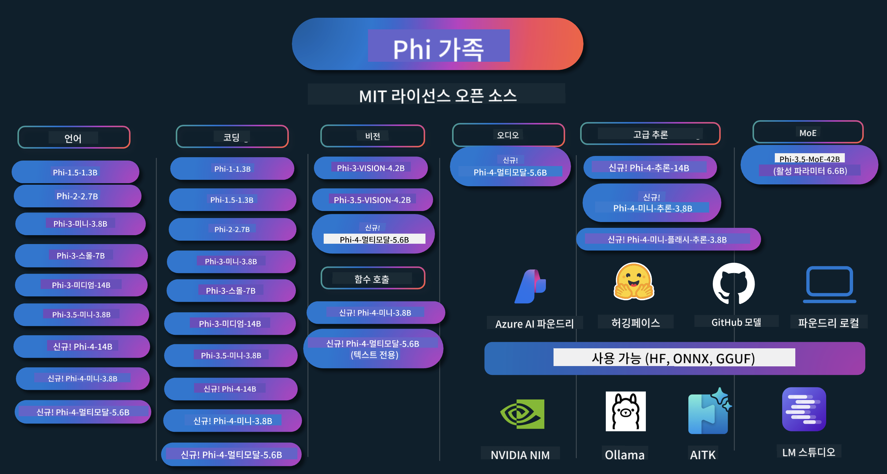

<!--
CO_OP_TRANSLATOR_METADATA:
{
  "original_hash": "5184fe9d0c6c744782f795436349ccf8",
  "translation_date": "2025-06-27T13:27:35+00:00",
  "source_file": "README.md",
  "language_code": "ko"
}
-->
# Phi 요리책: Microsoft의 Phi 모델을 활용한 실습 예제

  

  
  
  

  
  

Phi는 Microsoft에서 개발한 오픈 소스 AI 모델 시리즈입니다.

Phi는 현재 가장 강력하고 비용 효율적인 소형 언어 모델(SLM)로, 다국어, 추론, 텍스트/채팅 생성, 코딩, 이미지, 오디오 등 다양한 시나리오에서 우수한 벤치마크를 자랑합니다.

Phi는 클라우드나 엣지 디바이스에 배포할 수 있으며, 제한된 컴퓨팅 파워로도 쉽게 생성형 AI 애플리케이션을 구축할 수 있습니다.

다음 단계를 따라 이 리소스를 사용해 보세요:  
1. **저장소 포크하기**: 클릭   
2. **저장소 클론하기**: `git clone https://github.com/microsoft/PhiCookBook.git`  
3. [**Microsoft AI Discord 커뮤니티에 참여하여 전문가 및 개발자들과 만나기**](https://discord.com/invite/ByRwuEEgH4?WT.mc_id=aiml-137032-kinfeylo)

## 🌐 다국어 지원

### GitHub Action을 통해 지원 (자동화 및 항상 최신 상태 유지)

[프랑스어](../fr/README.md) | [스페인어](../es/README.md) | [독일어](../de/README.md) | [러시아어](../ru/README.md) | [아랍어](../ar/README.md) | [페르시아어 (파르시)](../fa/README.md) | [우르두어](../ur/README.md) | [중국어 (간체)](../zh/README.md) | [중국어 (번체, 마카오)](../mo/README.md) | [중국어 (번체, 홍콩)](../hk/README.md) | [중국어 (번체, 대만)](../tw/README.md) | [일본어](../ja/README.md) | [한국어](./README.md) | [힌디어](../hi/README.md)

### CLI를 통해 지원
[Bengali](../bn/README.md) | [Marathi](../mr/README.md) | [Nepali](../ne/README.md) | [Punjabi (Gurmukhi)](../pa/README.md) | [Portuguese (Portugal)](../pt/README.md) | [Portuguese (Brazil)](../br/README.md) | [Italian](../it/README.md) | [Polish](../pl/README.md) | [Turkish](../tr/README.md) | [Greek](../el/README.md) | [Thai](../th/README.md) | [Swedish](../sv/README.md) | [Danish](../da/README.md) | [Norwegian](../no/README.md) | [Finnish](../fi/README.md) | [Dutch](../nl/README.md) | [Hebrew](../he/README.md) | [Vietnamese](../vi/README.md) | [Indonesian](../id/README.md) | [Malay](../ms/README.md) | [Tagalog (Filipino)](../tl/README.md) | [Swahili](../sw/README.md) | [Hungarian](../hu/README.md) | [Czech](../cs/README.md) | [Slovak](../sk/README.md) | [Romanian](../ro/README.md) | [Bulgarian](../bg/README.md) | [Serbian (Cyrillic)](../sr/README.md) | [Croatian](../hr/README.md) | [Slovenian](../sl/README.md)

## 목차

- 소개
- [Phi Family에 오신 것을 환영합니다](./md/01.Introduction/01/01.PhiFamily.md)
  - [환경 설정하기](./md/01.Introduction/01/01.EnvironmentSetup.md)
  - [핵심 기술 이해하기](./md/01.Introduction/01/01.Understandingtech.md)
  - [Phi 모델을 위한 AI 안전](./md/01.Introduction/01/01.AISafety.md)
  - [Phi 하드웨어 지원](./md/01.Introduction/01/01.Hardwaresupport.md)
  - [Phi 모델 및 플랫폼별 사용 가능성](./md/01.Introduction/01/01.Edgeandcloud.md)
  - [Guidance-ai와 Phi 사용하기](./md/01.Introduction/01/01.Guidance.md)
  - [GitHub Marketplace 모델](https://github.com/marketplace/models)
  - [Azure AI 모델 카탈로그](https://ai.azure.com)

- 다양한 환경에서 Phi 추론하기
    -  [Hugging face](./md/01.Introduction/02/01.HF.md)
    -  [GitHub 모델](./md/01.Introduction/02/02.GitHubModel.md)
    -  [Azure AI Foundry 모델 카탈로그](./md/01.Introduction/02/03.AzureAIFoundry.md)
    -  [Ollama](./md/01.Introduction/02/04.Ollama.md)
    -  [AI Toolkit VSCode (AITK)](./md/01.Introduction/02/05.AITK.md)
    -  [NVIDIA NIM](./md/01.Introduction/02/06.NVIDIA.md)
    -  [Foundry 로컬](./md/01.Introduction/02/07.FoundryLocal.md)

- Phi Family 추론
    - [iOS에서 Phi 추론하기](./md/01.Introduction/03/iOS_Inference.md)
    - [Android에서 Phi 추론하기](./md/01.Introduction/03/Android_Inference.md)
    - [Jetson에서 Phi 추론하기](./md/01.Introduction/03/Jetson_Inference.md)
    - [AI PC에서 Phi 추론하기](./md/01.Introduction/03/AIPC_Inference.md)
    - [Apple MLX 프레임워크로 Phi 추론하기](./md/01.Introduction/03/MLX_Inference.md)
    - [로컬 서버에서 Phi 추론하기](./md/01.Introduction/03/Local_Server_Inference.md)
    - [AI Toolkit을 사용한 원격 서버에서 Phi 추론하기](./md/01.Introduction/03/Remote_Interence.md)
    - [Rust로 Phi 추론하기](./md/01.Introduction/03/Rust_Inference.md)
    - [로컬에서 Phi--Vision 추론하기](./md/01.Introduction/03/Vision_Inference.md)
    - [Kaito AKS, Azure 컨테이너(공식 지원)와 함께 Phi 추론하기](./md/01.Introduction/03/Kaito_Inference.md)
-  [Phi Family 양자화하기](./md/01.Introduction/04/QuantifyingPhi.md)
    - [llama.cpp를 사용한 Phi-3.5 / 4 양자화](./md/01.Introduction/04/UsingLlamacppQuantifyingPhi.md)
    - [onnxruntime용 생성 AI 확장 기능을 사용한 Phi-3.5 / 4 양자화](./md/01.Introduction/04/UsingORTGenAIQuantifyingPhi.md)
    - [Intel OpenVINO를 사용한 Phi-3.5 / 4 양자화](./md/01.Introduction/04/UsingIntelOpenVINOQuantifyingPhi.md)
- [Apple MLX Framework를 사용한 Phi-3.5 / 4 양자화](./md/01.Introduction/04/UsingAppleMLXQuantifyingPhi.md)

- 평가용 Phi  
    - [Responsible AI](./md/01.Introduction/05/ResponsibleAI.md)  
    - [평가를 위한 Azure AI Foundry](./md/01.Introduction/05/AIFoundry.md)  
    - [평가를 위한 Promptflow 사용법](./md/01.Introduction/05/Promptflow.md)
 
- Azure AI Search와 함께하는 RAG  
    - [Azure AI Search와 함께 Phi-4-mini 및 Phi-4-multimodal(RAG) 사용 방법](https://github.com/microsoft/PhiCookBook/blob/main/code/06.E2E/E2E_Phi-4-RAG-Azure-AI-Search.ipynb)

- Phi 애플리케이션 개발 샘플  
  - 텍스트 & 채팅 애플리케이션  
    - Phi-4 샘플 🆕  
      - [📓] [Phi-4-mini ONNX 모델과 채팅하기](./md/02.Application/01.TextAndChat/Phi4/ChatWithPhi4ONNX/README.md)  
      - [Phi-4 로컬 ONNX 모델로 채팅하기 (.NET)](../../md/04.HOL/dotnet/src/LabsPhi4-Chat-01OnnxRuntime)  
      - [Semantic Kernel을 사용한 Phi-4 ONNX 채팅 .NET 콘솔 앱](../../md/04.HOL/dotnet/src/LabsPhi4-Chat-02SK)  
    - Phi-3 / 3.5 샘플  
      - [Phi3, ONNX Runtime Web 및 WebGPU를 사용한 브라우저 내 로컬 챗봇](https://github.com/microsoft/onnxruntime-inference-examples/tree/main/js/chat)  
      - [OpenVino 챗](./md/02.Application/01.TextAndChat/Phi3/E2E_OpenVino_Chat.md)  
      - [멀티 모델 - Phi-3-mini와 OpenAI Whisper의 인터랙티브 챗](./md/02.Application/01.TextAndChat/Phi3/E2E_Phi-3-mini_with_whisper.md)  
      - [MLFlow - Phi-3 래퍼 빌드 및 MLFlow와 함께 사용하기](./md//02.Application/01.TextAndChat/Phi3/E2E_Phi-3-MLflow.md)  
      - [모델 최적화 - Olive를 사용해 ONNX Runtime Web용 Phi-3-min 모델 최적화 방법](https://github.com/microsoft/Olive/tree/main/examples/phi3)  
      - [Phi-3 mini-4k-instruct-onnx를 사용한 WinUI3 앱](https://github.com/microsoft/Phi3-Chat-WinUI3-Sample/)  
      - [WinUI3 멀티 모델 AI 기반 노트 앱 샘플](https://github.com/microsoft/ai-powered-notes-winui3-sample)  
      - [Prompt flow를 사용한 맞춤형 Phi-3 모델 미세 조정 및 통합](./md/02.Application/01.TextAndChat/Phi3/E2E_Phi-3-FineTuning_PromptFlow_Integration.md)  
      - [Azure AI Foundry에서 Prompt flow를 활용한 맞춤형 Phi-3 모델 미세 조정 및 통합](./md/02.Application/01.TextAndChat/Phi3/E2E_Phi-3-FineTuning_PromptFlow_Integration_AIFoundry.md)  
      - [Microsoft의 Responsible AI 원칙에 초점을 맞춘 Azure AI Foundry에서 미세 조정된 Phi-3 / Phi-3.5 모델 평가](./md/02.Application/01.TextAndChat/Phi3/E2E_Phi-3-Evaluation_AIFoundry.md)  
      - [📓] [Phi-3.5-mini-instruct 언어 예측 샘플 (중국어/영어)](../../md/02.Application/01.TextAndChat/Phi3/phi3-instruct-demo.ipynb)  
      - [Phi-3.5-Instruct WebGPU RAG 챗봇](./md/02.Application/01.TextAndChat/Phi3/WebGPUWithPhi35Readme.md)  
      - [Windows GPU를 사용한 Phi-3.5-Instruct ONNX 기반 Prompt flow 솔루션 만들기](./md/02.Application/01.TextAndChat/Phi3/UsingPromptFlowWithONNX.md)  
      - [Microsoft Phi-3.5 tflite를 사용한 Android 앱 만들기](./md/02.Application/01.TextAndChat/Phi3/UsingPhi35TFLiteCreateAndroidApp.md)  
      - [Microsoft.ML.OnnxRuntime를 이용한 로컬 ONNX Phi-3 모델 Q&A .NET 예제](../../md/04.HOL/dotnet/src/LabsPhi301)  
      - [Semantic Kernel과 Phi-3를 사용한 콘솔 채팅 .NET 앱](../../md/04.HOL/dotnet/src/LabsPhi302)

  - Azure AI Inference SDK 코드 기반 샘플  
    - Phi-4 샘플 🆕  
      - [📓] [Phi-4-multimodal을 사용한 프로젝트 코드 생성](./md/02.Application/02.Code/Phi4/GenProjectCode/README.md)  
    - Phi-3 / 3.5 샘플  
      - [Microsoft Phi-3 Family로 Visual Studio Code GitHub Copilot Chat 만들기](./md/02.Application/02.Code/Phi3/VSCodeExt/README.md)  
      - [GitHub 모델을 사용해 Phi-3.5로 Visual Studio Code Chat Copilot 에이전트 만들기](/md/02.Application/02.Code/Phi3/CreateVSCodeChatAgentWithGitHubModels.md)

  - 고급 추론 샘플  
    - Phi-4 샘플 🆕  
      - [📓] [Phi-4-mini-reasoning 또는 Phi-4-reasoning 샘플](./md/02.Application/03.AdvancedReasoning/Phi4/AdvancedResoningPhi4mini/README.md)  
      - [📓] [Microsoft Olive를 사용한 Phi-4-mini-reasoning 미세 조정](../../md/02.Application/03.AdvancedReasoning/Phi4/AdvancedResoningPhi4mini/olive_ft_phi_4_reasoning_with_medicaldata.ipynb)  
      - [📓] [Apple MLX를 활용한 Phi-4-mini-reasoning 미세 조정](../../md/02.Application/03.AdvancedReasoning/Phi4/AdvancedResoningPhi4mini/mlx_ft_phi_4_reasoning_with_medicaldata.ipynb)
- [📓] [GitHub 모델로 Phi-4-mini 추론하기](../../md/02.Application/02.Code/Phi4r/github_models_inference.ipynb)
      - [📓] [Azure AI Foundry 모델로 Phi-4-mini 추론하기](../../md/02.Application/02.Code/Phi4r/azure_models_inference.ipynb)
  - 데모
      - [Hugging Face Spaces에서 호스팅하는 Phi-4-mini 데모](https://huggingface.co/spaces/microsoft/phi-4-mini?WT.mc_id=aiml-137032-kinfeylo)
      - [Hugging Face Spaces에서 호스팅하는 Phi-4-멀티모달 데모](https://huggingface.co/spaces/microsoft/phi-4-multimodal?WT.mc_id=aiml-137032-kinfeylo)
  - 비전 샘플
    - Phi-4 샘플 🆕
      - [📓] [Phi-4-멀티모달로 이미지 읽고 코드 생성하기](./md/02.Application/04.Vision/Phi4/CreateFrontend/README.md) 
    - Phi-3 / 3.5 샘플
      -  [📓][Phi-3-vision-이미지 텍스트 변환](../../md/02.Application/04.Vision/Phi3/E2E_Phi-3-vision-image-text-to-text-online-endpoint.ipynb)
      - [Phi-3-vision-ONNX](https://onnxruntime.ai/docs/genai/tutorials/phi3-v.html)
      - [📓][Phi-3-vision CLIP 임베딩](../../md/02.Application/04.Vision/Phi3/E2E_Phi-3-vision-image-text-to-text-online-endpoint.ipynb)
      - [데모: Phi-3 재활용](https://github.com/jennifermarsman/PhiRecycling/)
      - [Phi-3-vision - 시각 언어 어시스턴트 - Phi3-Vision과 OpenVINO 사용](https://docs.openvino.ai/nightly/notebooks/phi-3-vision-with-output.html)
      - [Phi-3 Vision Nvidia NIM](./md/02.Application/04.Vision/Phi3/E2E_Nvidia_NIM_Vision.md)
      - [Phi-3 Vision OpenVino](./md/02.Application/04.Vision/Phi3/E2E_OpenVino_Phi3Vision.md)
      - [📓][Phi-3.5 Vision 다중 프레임 또는 다중 이미지 샘플](../../md/02.Application/04.Vision/Phi3/phi3-vision-demo.ipynb)
      - [Microsoft.ML.OnnxRuntime .NET을 이용한 Phi-3 Vision 로컬 ONNX 모델](../../md/04.HOL/dotnet/src/LabsPhi303)
      - [메뉴 기반 Phi-3 Vision 로컬 ONNX 모델 Microsoft.ML.OnnxRuntime .NET 사용](../../md/04.HOL/dotnet/src/LabsPhi304)

  - 오디오 샘플
    - Phi-4 샘플 🆕
      - [📓] [Phi-4-멀티모달로 오디오 기록 추출하기](./md/02.Application/05.Audio/Phi4/Transciption/README.md)
      - [📓] [Phi-4-멀티모달 오디오 샘플](../../md/02.Application/05.Audio/Phi4/Siri/demo.ipynb)
      - [📓] [Phi-4-멀티모달 음성 번역 샘플](../../md/02.Application/05.Audio/Phi4/Translate/demo.ipynb)
      - [.NET 콘솔 애플리케이션으로 Phi-4-멀티모달 오디오 파일 분석 및 기록 생성](../../md/04.HOL/dotnet/src/LabsPhi4-MultiModal-02Audio)

  - MOE 샘플
    - Phi-3 / 3.5 샘플
      - [📓] [Phi-3.5 전문가 혼합 모델(MoEs) 소셜 미디어 샘플](../../md/02.Application/06.MoE/Phi3/phi3_moe_demo.ipynb)
      - [📓] [NVIDIA NIM Phi-3 MOE, Azure AI Search, LlamaIndex로 RAG 파이프라인 구축하기](../../md/02.Application/06.MoE/Phi3/azure-ai-search-nvidia-rag.ipynb)
  - 함수 호출 샘플
    - Phi-4 샘플 🆕
      -  [📓] [Phi-4-mini에서 함수 호출 사용하기](./md/02.Application/07.FunctionCalling/Phi4/FunctionCallingBasic/README.md)
      -  [📓] [함수 호출로 Phi-4-mini 다중 에이전트 만들기](../../md/02.Application/07.FunctionCalling/Phi4/Multiagents/Phi_4_mini_multiagent.ipynb)
      -  [📓] [Ollama에서 함수 호출 사용하기](../../md/02.Application/07.FunctionCalling/Phi4/Ollama/ollama_functioncalling.ipynb)
      -  [📓] [ONNX에서 함수 호출 사용하기](../../md/02.Application/07.FunctionCalling/Phi4/ONNX/onnx_parallel_functioncalling.ipynb)
  - 멀티모달 믹싱 샘플
    - Phi-4 샘플 🆕
      -  [📓] [기술 기자로서 Phi-4-멀티모달 사용하기](../../md/02.Application/08.Multimodel/Phi4/TechJournalist/phi_4_mm_audio_text_publish_news.ipynb)
      - [.NET 콘솔 애플리케이션으로 Phi-4-멀티모달 이미지 분석하기](../../md/04.HOL/dotnet/src/LabsPhi4-MultiModal-01Images)

- Phi 파인튜닝 샘플
  - [파인튜닝 시나리오](./md/03.FineTuning/FineTuning_Scenarios.md)
  - [파인튜닝과 RAG 비교](./md/03.FineTuning/FineTuning_vs_RAG.md)
  - [Phi-3를 산업 전문가로 키우기](./md/03.FineTuning/LetPhi3gotoIndustriy.md)
- [VS Code용 AI Toolkit으로 Phi-3 파인튜닝하기](./md/03.FineTuning/Finetuning_VSCodeaitoolkit.md)
  - [Azure Machine Learning Service로 Phi-3 파인튜닝하기](./md/03.FineTuning/Introduce_AzureML.md)
  - [Lora로 Phi-3 파인튜닝하기](./md/03.FineTuning/FineTuning_Lora.md)
  - [QLora로 Phi-3 파인튜닝하기](./md/03.FineTuning/FineTuning_Qlora.md)
  - [Azure AI Foundry로 Phi-3 파인튜닝하기](./md/03.FineTuning/FineTuning_AIFoundry.md)
  - [Azure ML CLI/SDK로 Phi-3 파인튜닝하기](./md/03.FineTuning/FineTuning_MLSDK.md)
  - [Microsoft Olive로 파인튜닝하기](./md/03.FineTuning/FineTuning_MicrosoftOlive.md)
  - [Microsoft Olive 실습랩에서 파인튜닝하기](./md/03.FineTuning/olive-lab/readme.md)
  - [Weights and Bias로 Phi-3-vision 파인튜닝하기](./md/03.FineTuning/FineTuning_Phi-3-visionWandB.md)
  - [Apple MLX Framework로 Phi-3 파인튜닝하기](./md/03.FineTuning/FineTuning_MLX.md)
  - [Phi-3-vision 파인튜닝 (공식 지원)](./md/03.FineTuning/FineTuning_Vision.md)
  - [Kaito AKS, Azure Containers로 Phi-3 파인튜닝 (공식 지원)](./md/03.FineTuning/FineTuning_Kaito.md)
  - [Phi-3와 3.5 Vision 파인튜닝](https://github.com/2U1/Phi3-Vision-Finetune)

- 실습 랩
  - [최신 모델 탐구: LLM, SLM, 로컬 개발 등](https://github.com/microsoft/aitour-exploring-cutting-edge-models)
  - [NLP 잠재력 열기: Microsoft Olive로 파인튜닝](https://github.com/azure/Ignite_FineTuning_workshop)

- 학술 연구 논문 및 출판물
  - [Textbooks Are All You Need II: phi-1.5 기술 보고서](https://arxiv.org/abs/2309.05463)
  - [Phi-3 기술 보고서: 휴대폰에서 작동하는 고성능 언어 모델](https://arxiv.org/abs/2404.14219)
  - [Phi-4 기술 보고서](https://arxiv.org/abs/2412.08905)
  - [Phi-4-Mini 기술 보고서: Mixture-of-LoRAs를 활용한 작지만 강력한 멀티모달 언어 모델](https://arxiv.org/abs/2503.01743)
  - [차량 내 함수 호출을 위한 소형 언어 모델 최적화](https://arxiv.org/abs/2501.02342)
  - [(WhyPHI) PHI-3 다지선다형 질문 응답 파인튜닝: 방법론, 결과 및 과제](https://arxiv.org/abs/2501.01588)
  - [Phi-4 추론 기술 보고서](https://www.microsoft.com/en-us/research/wp-content/uploads/2025/04/phi_4_reasoning.pdf)
  - [Phi-4-mini 추론 기술 보고서](https://huggingface.co/microsoft/Phi-4-mini-reasoning/blob/main/Phi-4-Mini-Reasoning.pdf)

## Phi 모델 사용하기

### Azure AI Foundry에서 Phi 사용하기

Microsoft Phi를 사용하는 방법과 다양한 하드웨어 장치에서 E2E 솔루션을 구축하는 방법을 배울 수 있습니다. 직접 Phi를 경험하려면 모델을 사용해보고, [Azure AI Foundry Azure AI Model Catalog](https://aka.ms/phi3-azure-ai)를 통해 시나리오에 맞게 Phi를 커스터마이징해보세요. 자세한 내용은 [Azure AI Foundry 시작하기](/md/02.QuickStart/AzureAIFoundry_QuickStart.md)에서 확인할 수 있습니다.

**플레이그라운드**  
각 모델별로 전용 테스트 공간이 마련되어 있습니다: [Azure AI Playground](https://aka.ms/try-phi3).

### GitHub 모델에서 Phi 사용하기

Microsoft Phi를 사용하는 방법과 다양한 하드웨어 장치에서 E2E 솔루션을 구축하는 방법을 배울 수 있습니다. 직접 Phi를 경험하려면 모델을 사용해보고, [GitHub Model Catalog](https://github.com/marketplace/models?WT.mc_id=aiml-137032-kinfeylo)를 통해 시나리오에 맞게 Phi를 커스터마이징해보세요. 자세한 내용은 [GitHub Model Catalog 시작하기](/md/02.QuickStart/GitHubModel_QuickStart.md)에서 확인할 수 있습니다.

**플레이그라운드**  
각 모델별 전용 [테스트 공간](/md/02.QuickStart/GitHubModel_QuickStart.md)이 마련되어 있습니다.

### Hugging Face에서 Phi 사용하기

[Hugging Face](https://huggingface.co/microsoft)에서도 모델을 확인할 수 있습니다.

**플레이그라운드**
[Hugging Chat playground](https://huggingface.co/chat/models/microsoft/Phi-3-mini-4k-instruct)

## 책임 있는 AI

Microsoft는 고객이 AI 제품을 책임감 있게 사용할 수 있도록 지원하고, 학습 내용을 공유하며, Transparency Notes 및 Impact Assessments와 같은 도구를 통해 신뢰 기반의 파트너십을 구축하는 데 전념하고 있습니다. 이러한 리소스 중 많은 부분은 [https://aka.ms/RAI](https://aka.ms/RAI)에서 확인할 수 있습니다.  
Microsoft의 책임 있는 AI 접근 방식은 공정성, 신뢰성 및 안전성, 개인정보 보호 및 보안, 포용성, 투명성, 책임성이라는 AI 원칙에 기반을 두고 있습니다.

이 샘플에서 사용된 것과 같은 대규모 자연어, 이미지, 음성 모델은 공정하지 않거나 신뢰할 수 없거나 불쾌감을 줄 수 있는 방식으로 동작할 가능성이 있으며, 이는 피해를 초래할 수 있습니다. 위험과 한계에 대해 알고 싶다면 [Azure OpenAI 서비스 Transparency note](https://learn.microsoft.com/legal/cognitive-services/openai/transparency-note?tabs=text)를 참고하시기 바랍니다.

이러한 위험을 완화하기 위한 권장 방법은 아키텍처에 유해한 행동을 감지하고 방지할 수 있는 안전 시스템을 포함하는 것입니다. [Azure AI Content Safety](https://learn.microsoft.com/azure/ai-services/content-safety/overview)는 독립적인 보호 계층을 제공하여 애플리케이션과 서비스 내에서 유해한 사용자 생성 콘텐츠 및 AI 생성 콘텐츠를 감지할 수 있습니다. Azure AI Content Safety는 유해한 자료를 탐지할 수 있는 텍스트 및 이미지 API를 포함합니다. Azure AI Foundry 내에서 Content Safety 서비스는 다양한 모달리티에서 유해한 콘텐츠를 감지하기 위한 샘플 코드를 보고, 탐색하고, 직접 시험해볼 수 있게 합니다. 다음 [빠른 시작 문서](https://learn.microsoft.com/azure/ai-services/content-safety/quickstart-text?tabs=visual-studio%2Clinux&pivots=programming-language-rest)는 서비스에 요청을 보내는 방법을 안내합니다.

또 다른 고려사항은 전체 애플리케이션 성능입니다. 멀티모달 및 멀티모델 애플리케이션의 경우, 성능이란 시스템이 사용자와 개발자가 기대하는 대로 작동하며 유해한 출력을 생성하지 않는 것을 의미합니다. 전체 애플리케이션의 성능을 평가하려면 [성능 및 품질, 위험 및 안전 평가자](https://learn.microsoft.com/azure/ai-studio/concepts/evaluation-metrics-built-in)를 사용하는 것이 중요합니다. 또한 [사용자 지정 평가자](https://learn.microsoft.com/azure/ai-studio/how-to/develop/evaluate-sdk#custom-evaluators)를 만들어 평가할 수도 있습니다.

개발 환경에서 AI 애플리케이션을 평가하려면 [Azure AI Evaluation SDK](https://microsoft.github.io/promptflow/index.html)를 사용할 수 있습니다. 테스트 데이터셋이나 목표가 주어지면, 생성형 AI 애플리케이션의 결과물을 내장 평가자나 원하는 사용자 지정 평가자를 통해 정량적으로 측정할 수 있습니다. Azure AI Evaluation SDK를 사용해 시스템을 평가하는 방법은 [빠른 시작 가이드](https://learn.microsoft.com/azure/ai-studio/how-to/develop/flow-evaluate-sdk)를 참고하세요. 평가 실행 후에는 [Azure AI Foundry에서 결과를 시각화](https://learn.microsoft.com/azure/ai-studio/how-to/evaluate-flow-results)할 수 있습니다.

## 상표

이 프로젝트에는 프로젝트, 제품 또는 서비스의 상표나 로고가 포함될 수 있습니다. Microsoft 상표나 로고의 사용은 [Microsoft의 상표 및 브랜드 가이드라인](https://www.microsoft.com/legal/intellectualproperty/trademarks/usage/general)을 준수해야 하며, 승인된 경우에만 가능합니다.  
이 프로젝트의 수정된 버전에서 Microsoft 상표나 로고를 사용할 경우 혼동을 일으키거나 Microsoft의 후원을 암시해서는 안 됩니다. 제3자 상표나 로고 사용은 해당 제3자의 정책을 따라야 합니다.

**면책 조항**:  
이 문서는 AI 번역 서비스 [Co-op Translator](https://github.com/Azure/co-op-translator)를 사용하여 번역되었습니다. 정확성을 위해 최선을 다하고 있으나, 자동 번역에는 오류나 부정확한 내용이 포함될 수 있음을 유의해 주시기 바랍니다. 원문 문서는 해당 언어의 권위 있는 자료로 간주되어야 합니다. 중요한 정보의 경우 전문적인 인간 번역을 권장합니다. 본 번역 사용으로 인해 발생하는 오해나 잘못된 해석에 대해 당사는 책임을 지지 않습니다.