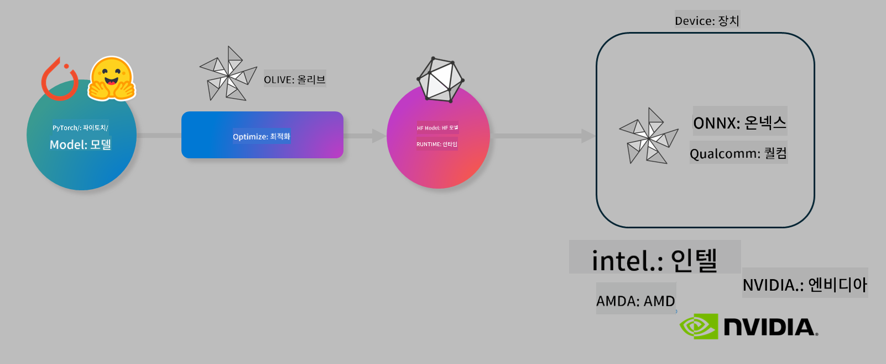

<!--
CO_OP_TRANSLATOR_METADATA:
{
  "original_hash": "76956c0c22e5686908a6d85ec72126af",
  "translation_date": "2025-04-04T05:22:21+00:00",
  "source_file": "code\\03.Finetuning\\olive-lab\\readme.md",
  "language_code": "ko"
}
-->
# 실습. AI 모델을 디바이스 상에서 추론하도록 최적화하기

## 소개

> [!IMPORTANT]
> 이 실습에는 **Nvidia A10 또는 A100 GPU**가 필요하며, 관련 드라이버와 CUDA 툴킷(버전 12 이상)이 설치되어 있어야 합니다.

> [!NOTE]
> 이 실습은 **35분**이 소요되며, OLIVE를 사용하여 디바이스 상에서 모델 추론을 최적화하는 핵심 개념을 실습으로 배울 수 있습니다.

## 학습 목표

이 실습을 마치면 OLIVE를 사용하여 다음을 수행할 수 있습니다:

- AWQ 양자화 방법을 사용하여 AI 모델을 양자화하기.
- 특정 작업에 맞춰 AI 모델을 미세 조정하기.
- ONNX Runtime에서 효율적인 디바이스 추론을 위한 LoRA 어댑터(미세 조정된 모델) 생성하기.

### Olive란 무엇인가

Olive(*O*NNX *live*)는 ONNX Runtime +++https://onnxruntime.ai+++에서 실행되는 모델을 배포할 수 있도록 지원하는 모델 최적화 도구 및 CLI입니다.



Olive의 입력은 일반적으로 PyTorch 또는 Hugging Face 모델이며, 출력은 ONNX Runtime에서 실행되는 디바이스(배포 대상)에서 최적화된 ONNX 모델입니다. Olive는 Qualcomm, AMD, Nvidia, Intel과 같은 하드웨어 벤더가 제공하는 배포 대상의 AI 가속기(NPU, GPU, CPU)에 맞춰 모델을 최적화합니다.

Olive는 *워크플로우*를 실행합니다. 이는 *패스*라고 불리는 개별 모델 최적화 작업의 순서화된 시퀀스입니다. 예를 들어 모델 압축, 그래프 캡처, 양자화, 그래프 최적화 등이 패스의 예입니다. 각 패스는 정확도 및 지연 시간과 같은 최적의 메트릭을 달성하기 위해 조정 가능한 매개변수 세트를 가지고 있습니다. Olive는 검색 알고리즘을 사용하여 각 패스를 하나씩 또는 여러 패스를 동시에 자동으로 튜닝하는 검색 전략을 채택합니다.

#### Olive의 이점

- 그래프 최적화, 압축, 양자화와 같은 다양한 기술을 수작업으로 반복 실험하는 데 드는 **시간과 좌절을 줄여줍니다**. 품질과 성능 제약 조건을 정의하면 Olive가 자동으로 최적의 모델을 찾아줍니다.
- **40개 이상의 내장된 모델 최적화 구성 요소**가 양자화, 압축, 그래프 최적화 및 미세 조정의 최신 기술을 다룹니다.
- **간편한 CLI**로 일반적인 모델 최적화 작업을 수행할 수 있습니다. 예: olive quantize, olive auto-opt, olive finetune.
- 모델 패키징 및 배포가 내장되어 있습니다.
- **다중 LoRA 서빙** 모델 생성 지원.
- YAML/JSON을 사용하여 모델 최적화 및 배포 작업을 오케스트레이션하는 워크플로우 구성 가능.
- **Hugging Face** 및 **Azure AI** 통합.
- **캐싱** 메커니즘 내장으로 **비용 절감** 가능.

## 실습 지침
> [!NOTE]
> Azure AI Hub와 프로젝트를 프로비저닝하고 Lab 1에 따라 A100 컴퓨팅을 설정했는지 확인하세요.

### 단계 0: Azure AI 컴퓨팅에 연결하기

**VS Code**의 원격 기능을 사용하여 Azure AI 컴퓨팅에 연결합니다.

1. **VS Code** 데스크톱 애플리케이션을 엽니다.
1. **Shift+Ctrl+P**를 눌러 **명령 팔레트**를 엽니다.
1. 명령 팔레트에서 **AzureML - remote: Connect to compute instance in New Window**를 검색합니다.
1. 화면에 표시되는 지침에 따라 컴퓨팅에 연결합니다. 여기에는 Lab 1에서 설정한 Azure 구독, 리소스 그룹, 프로젝트 및 컴퓨팅 이름을 선택하는 과정이 포함됩니다.
1. Azure ML 컴퓨팅 노드에 연결되면 **VS Code의 왼쪽 하단**에 표시됩니다 `><Azure ML: Compute Name`

### 단계 1: 이 저장소 클론하기

VS Code에서 **Ctrl+J**를 눌러 새 터미널을 열고, 다음 명령으로 저장소를 클론합니다:

터미널에 다음 프롬프트가 표시됩니다:

```
azureuser@computername:~/cloudfiles/code$ 
```
솔루션 클론:

```bash
cd ~/localfiles
git clone https://github.com/microsoft/phi-3cookbook.git
```

### 단계 2: VS Code에서 폴더 열기

터미널에서 다음 명령을 실행하여 관련 폴더에서 VS Code를 열면 새 창이 열립니다:

```bash
code phi-3cookbook/code/04.Finetuning/Olive-lab
```

또는 **파일** > **폴더 열기**를 선택하여 폴더를 열 수도 있습니다.

### 단계 3: 종속성 설치

Azure AI 컴퓨팅 인스턴스에서 VS Code의 터미널 창을 열고(팁: **Ctrl+J**) 다음 명령을 실행하여 종속성을 설치하세요:

```bash
conda create -n olive-ai python=3.11 -y
conda activate olive-ai
pip install -r requirements.txt
az extension remove -n azure-cli-ml
az extension add -n ml
```

> [!NOTE]
> 모든 종속성을 설치하는 데 약 **5분**이 소요됩니다.

이 실습에서는 Azure AI 모델 카탈로그에서 모델을 다운로드하고 업로드합니다. 모델 카탈로그에 액세스하려면 다음 명령으로 Azure에 로그인해야 합니다:

```bash
az login
```

> [!NOTE]
> 로그인 시 제공된 구독을 선택해야 합니다. 실습용으로 제공된 구독을 설정했는지 확인하세요.

### 단계 4: Olive 명령 실행

Azure AI 컴퓨팅 인스턴스에서 VS Code의 터미널 창을 열고(팁: **Ctrl+J**) `olive-ai` Conda 환경이 활성화되어 있는지 확인하세요:

```bash
conda activate olive-ai
```

그런 다음, 다음 Olive 명령을 커맨드 라인에서 실행하세요.

1. **데이터 확인:** 이 예제에서는 Phi-3.5-Mini 모델을 미세 조정하여 여행 관련 질문에 답변하도록 특화합니다. 아래 코드는 JSON 라인 형식의 데이터셋에서 몇 가지 레코드를 표시합니다:

    ```bash
    head data/data_sample_travel.jsonl
    ```
1. **모델 양자화:** 모델을 훈련하기 전에 Active Aware Quantization(AWQ) +++https://arxiv.org/abs/2306.00978+++ 기법을 사용하는 다음 명령으로 양자화합니다. AWQ는 추론 중 생성되는 활성화 값을 고려하여 모델의 가중치를 양자화합니다. 이는 활성화 값의 실제 데이터 분포를 반영하기 때문에 기존의 가중치 양자화 방법보다 모델 정확도를 더 잘 유지합니다.
    
    ```bash
    olive quantize \
       --model_name_or_path microsoft/Phi-3.5-mini-instruct \
       --trust_remote_code \
       --algorithm awq \
       --output_path models/phi/awq \
       --log_level 1
    ```
    
    AWQ 양자화를 완료하는 데 약 **8분**이 소요되며, **모델 크기가 약 7.5GB에서 약 2.5GB로 줄어듭니다**.
   
   이 실습에서는 Hugging Face의 모델(예: `microsoft/Phi-3.5-mini-instruct`). However, Olive also allows you to input models from the Azure AI catalog by updating the `model_name_or_path` argument to an Azure AI asset ID (for example:  `azureml://registries/azureml/models/Phi-3.5-mini-instruct/versions/4`). 

1. **Train the model:** Next, the `olive finetune` 명령으로 양자화된 모델을 미세 조정합니다. 양자화 후가 아닌 **양자화 전에** 모델을 미세 조정하면 양자화로 인한 손실을 미세 조정 과정에서 어느 정도 복구할 수 있어 더 나은 정확도를 제공합니다.
    
    ```bash
    olive finetune \
        --method lora \
        --model_name_or_path models/phi/awq \
        --data_files "data/data_sample_travel.jsonl" \
        --data_name "json" \
        --text_template "<|user|>\n{prompt}<|end|>\n<|assistant|>\n{response}<|end|>" \
        --max_steps 100 \
        --output_path ./models/phi/ft \
        --log_level 1
    ```
    
    미세 조정(100단계)을 완료하는 데 약 **6분**이 소요됩니다.

1. **최적화:** 모델 훈련이 완료되면 Olive의 `auto-opt` command, which will capture the ONNX graph and automatically perform a number of optimizations to improve the model performance for CPU by compressing the model and doing fusions. It should be noted, that you can also optimize for other devices such as NPU or GPU by just updating the `--device` and `--provider` 인수를 사용하여 모델을 최적화합니다. 이 실습에서는 CPU를 사용합니다.

    ```bash
    olive auto-opt \
       --model_name_or_path models/phi/ft/model \
       --adapter_path models/phi/ft/adapter \
       --device cpu \
       --provider CPUExecutionProvider \
       --use_ort_genai \
       --output_path models/phi/onnx-ao \
       --log_level 1
    ```
    
    최적화를 완료하는 데 약 **5분**이 소요됩니다.

### 단계 5: 모델 추론 간단 테스트

모델 추론을 테스트하려면 폴더에 **app.py**라는 Python 파일을 생성하고 다음 코드를 복사하여 붙여넣으세요:

```python
import onnxruntime_genai as og
import numpy as np

print("loading model and adapters...", end="", flush=True)
model = og.Model("models/phi/onnx-ao/model")
adapters = og.Adapters(model)
adapters.load("models/phi/onnx-ao/model/adapter_weights.onnx_adapter", "travel")
print("DONE!")

tokenizer = og.Tokenizer(model)
tokenizer_stream = tokenizer.create_stream()

params = og.GeneratorParams(model)
params.set_search_options(max_length=100, past_present_share_buffer=False)
user_input = "what is the best thing to see in chicago"
params.input_ids = tokenizer.encode(f"<|user|>\n{user_input}<|end|>\n<|assistant|>\n")

generator = og.Generator(model, params)

generator.set_active_adapter(adapters, "travel")

print(f"{user_input}")

while not generator.is_done():
    generator.compute_logits()
    generator.generate_next_token()

    new_token = generator.get_next_tokens()[0]
    print(tokenizer_stream.decode(new_token), end='', flush=True)

print("\n")
```

다음 명령으로 코드를 실행하세요:

```bash
python app.py
```

### 단계 6: 모델을 Azure AI에 업로드

모델을 Azure AI 모델 저장소에 업로드하면 개발 팀의 다른 멤버와 모델을 공유할 수 있으며, 모델의 버전 관리도 처리됩니다. 다음 명령으로 모델을 업로드하세요:

> [!NOTE]
> `{}` placeholders with the name of your resource group and Azure AI Project Name. 

To find your resource group `"resourceGroup"`과 Azure AI 프로젝트 이름을 업데이트한 후 다음 명령을 실행하세요:

```
az ml workspace show
```

또는 +++ai.azure.com+++으로 이동하여 **관리 센터** > **프로젝트** > **개요**를 선택할 수 있습니다.

`{}` 자리표시자를 리소스 그룹 이름과 Azure AI 프로젝트 이름으로 업데이트하세요.

```bash
az ml model create \
    --name ft-for-travel \
    --version 1 \
    --path ./models/phi/onnx-ao \
    --resource-group {RESOURCE_GROUP_NAME} \
    --workspace-name {PROJECT_NAME}
```
업로드된 모델을 확인한 후 https://ml.azure.com/model/list 에서 모델을 배포할 수 있습니다.

**면책 조항**:  
이 문서는 AI 번역 서비스 [Co-op Translator](https://github.com/Azure/co-op-translator)를 사용하여 번역되었습니다. 정확성을 위해 노력하고 있지만, 자동 번역에는 오류나 부정확성이 있을 수 있습니다. 원본 문서를 해당 언어로 작성된 상태에서 권위 있는 자료로 간주해야 합니다. 중요한 정보에 대해서는 전문적인 인간 번역을 권장합니다. 이 번역 사용으로 인해 발생할 수 있는 오해나 오역에 대해 당사는 책임을 지지 않습니다.